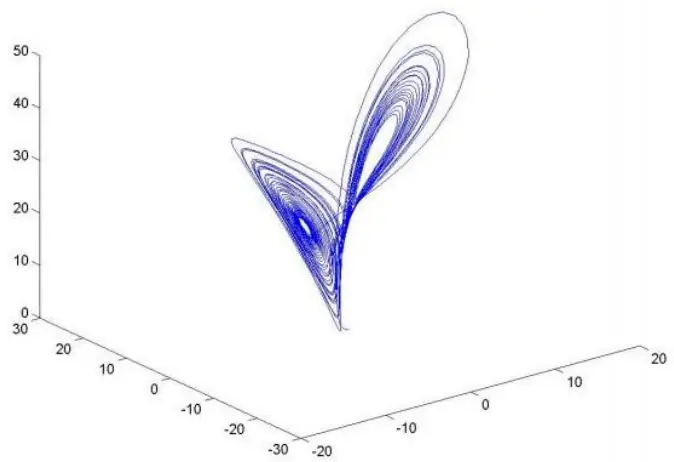
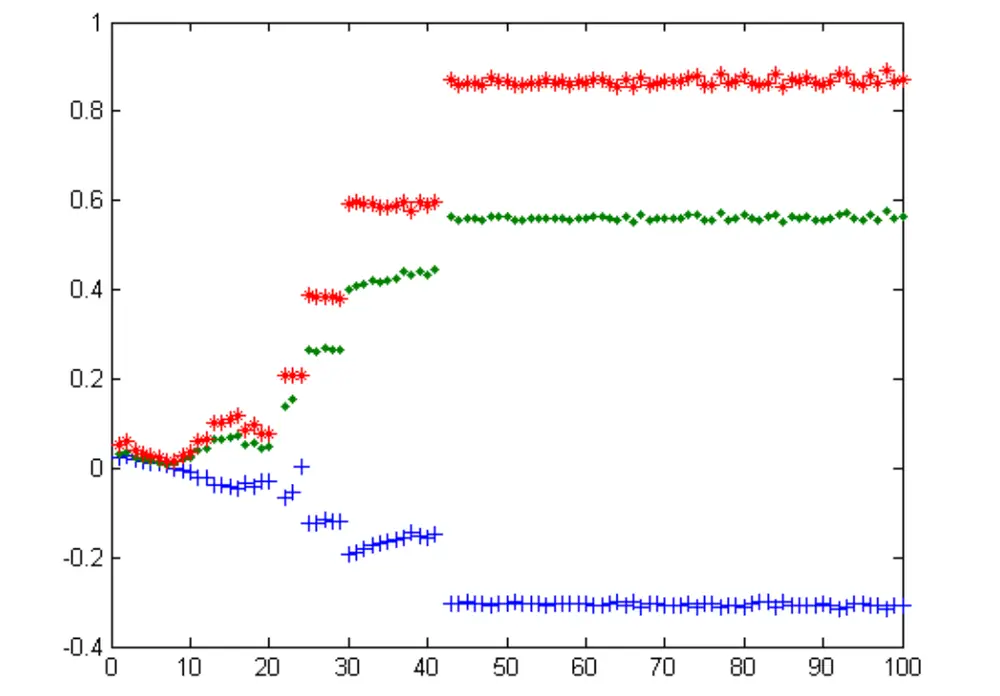
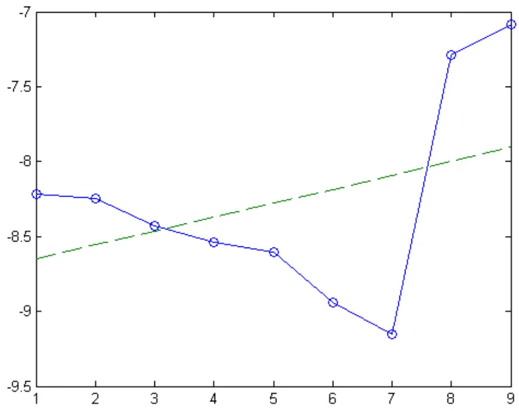
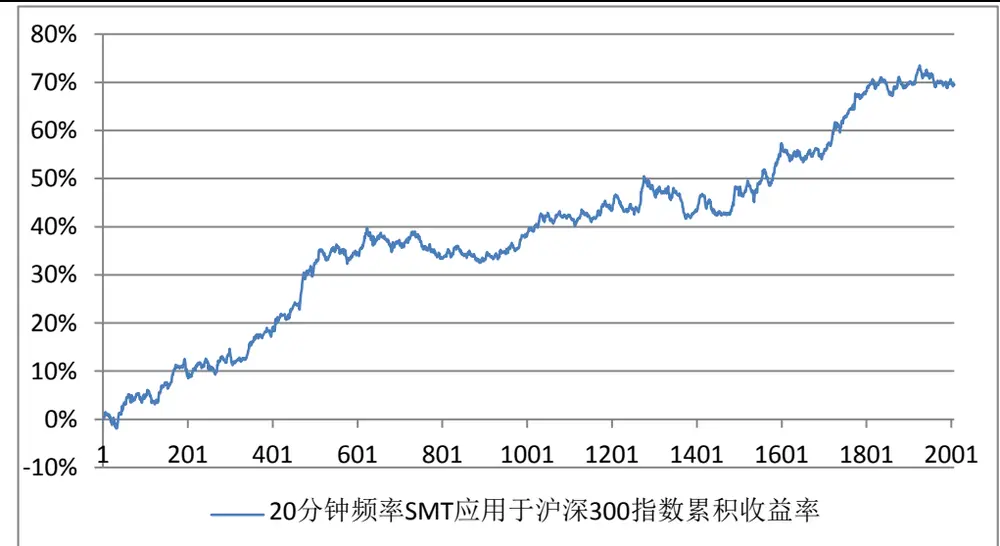
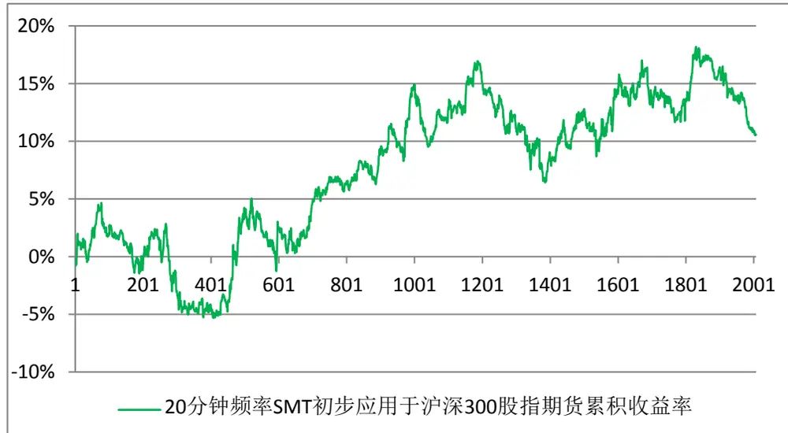
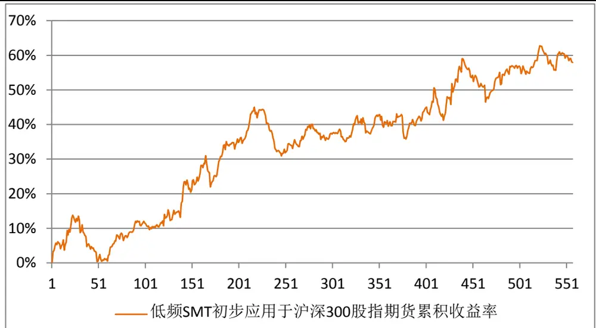
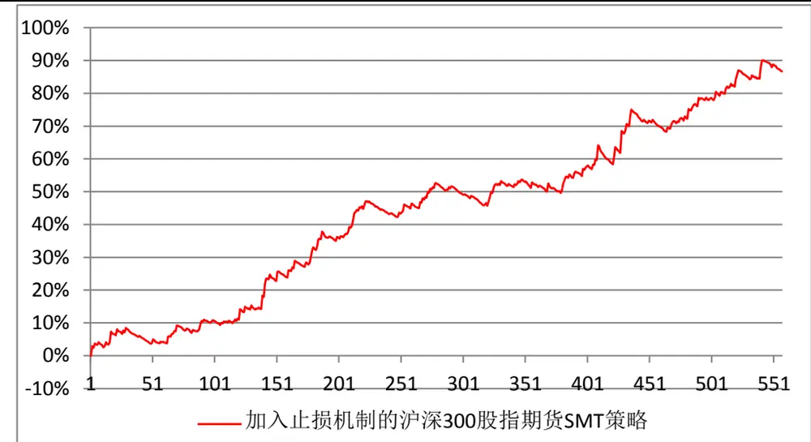
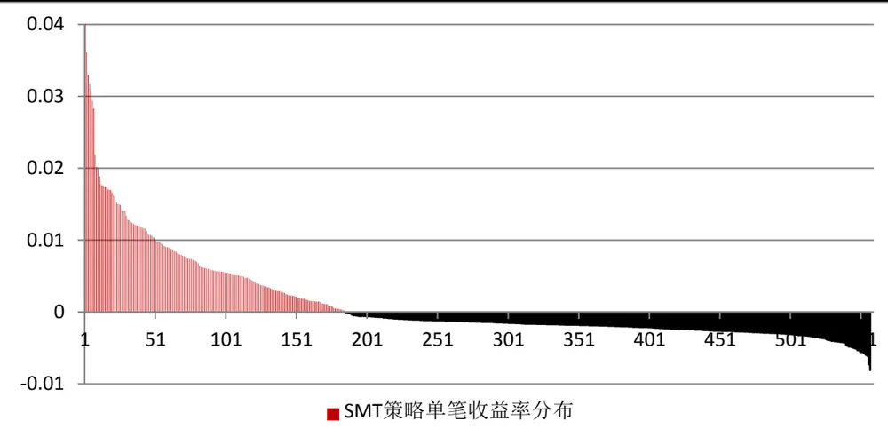

# 基于时域分形的相似性匹配日内低频交易（SMT）策略

# 16676——另类交易策略研究之八

安宁宁Table_Author 资深分析师

电话：0755-23948352

eMail：ann@gf.com.cn

执业编号：S0260512020003

## Table_Summary 交易策略基本思想

在历史可以重复的假设之下，对于日内某段交易时间△ ，我们通过寻找历史上相同交易时段中股指走势与其最为相似的一些片段，观察这些片段之后的短线走势——如果在统计上具有明显的上涨或下跌特征，则判断△t 之后的一段时间，股指会上涨或下跌，并且在股指期货上进行相应方向的开、平仓，从而实现相似性匹配日内交易SMT（Similarity Matching Trading）策略。

## 高频短线价格序列中，历史仍然可以重复

本篇报告的基本假设是“历史可以重复”。这一假说在二十世纪初被提出，目前已成为股市技术分析的重要理论之一，主要运用在日线、周线等周期较长的技术形态分析中。对于股指期货日内短线交易，“历史可以重复”是否仍然适用？本篇报告通过分形与混沌理论，计算了沪深 300 指数高频收益率序列的Lyapunov指数，并证明了在股指日内短线交易中，收益率序列具有分形性质，历史仍然可以重复。由于这一部分的数学推导与计算过程略显复杂，且仅仅是为了证明交易策略逻辑上的正确性，并不影响交易策略本身的构建，因此读者如果觉得该证明部分过于繁琐，可以直接跳过这部分。

## SMT 策略的构建与实证

我们首先对沪深300 指数进行了回测。通过20 分钟频率的交易，我们发现SMT 策略可以获得稳定收益。但是将策略同步运用于股指期货后（由于数据库样本有限，仍采用沪深 指数进行同步涨跌预测）效果大打折扣，通过数据分析，我们发现主要原因来自于基差朝不利方向变动。为了尽量减小基差波动带来的影响，我们尝试降低交易频率——根据每天上午沪深 300指数收益率的变化曲线，通过与历史数据库进行相似性匹配，确定午后股指期货开仓方向，并在尾盘平仓。该策略获得了较好的收益情况，但最大回撤仍偏大，因此我们进一步改进策略——通过加入一定的动态止损策略，发现累积收益率有所增加，最大回撤有所减小。在557 个交易日中，加入止损策略的低频SMT策略在沪深300股指期货上获得86.68%的累积收益率（考虑万分之二的双边交易成本，未加入杠杆），最大回撤仅-4.47%。

## 策略深度剖析

对于 SMT 交易策略，除了风险收益情况之外，其优势在于交易频率较低，可以满足很多尚未建立程序化交易系统的机构投资者进行手动下单和跟踪。另外，该策略不同于传统的趋势交易或反转交易，由于其属于一种模式识别类型的交易策略，策略的隐蔽性相对较好，可扩展性相对较强。由于历史数据库样本数量较少，SMT 交易策略暂时较难运用于股指期货高频交易。但是随着时间的积累，当历史数据库样本扩容到一定程度后，通过股指期货历史数据库进行预测、并进行高频交易的效果也有望改观。另外，由于目前 SMT 策略的交易频率较低，在融资融券业务的推动下，也可以对 ETF等证券品种通过T+0 方式实现 SMT低频交易。

## 一、交易策略基本思想

很久以前，世上没有天气预报。农民靠天吃饭，就要对天气有一定的预判能力。有经验的老农往往十有八九能对未来一段时间的天气进行准确判断。

“天上灰布悬，雨丝定连绵”——灰布云指雨层云，大多由高层云降低加厚蜕变而成，范围很大、很厚，云中水汽充足，常产生连续性降水。

“天上鲤鱼斑，明日晒谷不用翻”——鲤鱼斑指透光高积云，往往处在由冷变暖的变性高压气团控制下，云层如果没有继续增厚，短期内仍是晴天。

类似的对于天气判断的方法还有很多，总结起来，这些经验都是基于对历史数据的统计。在历史上，出现“天上灰布悬”，接下来往往就是“雨丝定连绵”；出现“天上鲤鱼斑”，第二天往往就是“晒谷不用翻”。所以，老农们可以通过回忆历史上和当前最相似的天气状况，对未来天气做出预测。

这条法则在金融市场中被称之为“历史可以重复”。

本篇报告所介绍的相似性匹配交易 SMT（Similarity Matching Trading）策略就是基于“历史可以重复”假设，通过寻找历史上走势最相似的价格（收益率）曲线，对未来一小段时间指数的走势做出判断。

另一方面，SMT策略属于日内低频交易策略。为什么我们要构建低频交易策略呢？主要有两个原因。第一是因为国内很多机构投资者目前尚无合适的程序化交易平台，只能进行手动下单。而对于高频交易而言，下单速度往往决定了一个策略的成败，因此频率太高的交易靠手动下单很难实现。第二是出于监管层面的要求。在沪深 300 股指期货推出几个月后，中国金融期货交易所全面叫停高频交易，使得频率过高的交易策略暂时无法得以实施。而日内低频交易则可以克服以上两点困难，保证机构投资者可以通过数量化模型进行股指期货的短线交易。

## 二、时域分形概述

## （一）分形简介

非线性科学是一门在以非线性为特征的分支学科基础上逐步发展起来的综合学科。自上个世纪 60年代以来，越来越多的研究者进入这一领域，不仅仅是因为非线性科学具有重要的科学意义，更重要的是，其具有广泛的应用价值与应用前景，它几乎可以渗透到自然科学和社会科学的各个领域。

总的来看，非线性科学可以分为三大类：分形、混沌和孤子。其中分形和混沌具有极为紧密的联系。这两个概念到目前为止都没有十分准确的定义，但它们分别对应了非平衡过程中的过程与结果，都是动力学科学的衍生物。如果把混沌广义地看作是具有自相似的随机过程和结构，则分形也可以看作是一种混沌空间．反之，由于混沌运动具有在时间标度上的自相似性，它也可以看作是时间上的分形．简单地说，分形是空间上的混沌，而混沌是时间上的分形。我们在本篇报告中研究的时域分形交易策略，实际上就反映了一种金融市场的混沌现象。

分形的概念是美籍数学家曼德博(B.B.Mandelbort)于上世纪 70年代首先提出的。具体来说，分形是这样一种对象，将其细微部分放大后，其结构看起来仍与原先一样，即具有自相似的性质，并且具有无限的细致性。分形的结构一般来说太不规则，以至无论是其整体或局部都难以用传统欧氏几何的语言来描述。分形是一个新的数学领域——有时也把它归为自然界的几何，因为这些奇异而混沌的形状，不仅描绘了诸如地震、闪电、树枝、植物根部、海岸线等自然现象，而且在天文、经济、气象等方面也有广泛应用。

图 1给出了几类典型的分形几何图形，可以看到这些图形都在不同标度下具有空间的自相似性。与这类空间分形不同，在本篇报告中，我们将通过研究时间上的一维分形，构建股指期货市场中的相关交易策略。

图 1：一些二维空间的分形几何图形

数据来源：广发证券发展研究中心

## （二）时域分形的前提假设

本篇报告的基本假设是，在金融市场中，历史可以重复。

最早提出这条假设的是道氏理论。道氏理论有三条基本假设：

1、市场行为包含一切信息。

2、价格沿趋势移动。

3、历史会重复。

道氏理论作为技术分析的鼻祖，是查尔斯•道、威廉姆•汉密尔顿和罗伯特•雷亚三人共同的研究结果。查尔斯•道（1851-1902）出生于新英格兰，是纽约道•琼斯金融新闻服务创始人、《华尔街日报》创始人和首位编辑。1900年到 1902年，道出任《华尔街日报》编辑，写了许多社论，并穿插讨论了进行股票交易的一些方法和心得。事实上，他并没有对相关理论做系统性说明，仅在讨论中做了片段报道。1902年，道去世以后，威廉•哈密顿和罗伯特•雷亚继承了道氏的理论，并在其后有关股市的评论写作过程中，加以组织和归纳，从而形成了我们今天所见到的道氏理论。

本篇报告采用道氏理论的第三条假设（即历史可以重复）作为前提。但是这条在技术分析中被广为使用的理论，往往较多用于探讨日线或更长周期的数据。在更为微观的市场中，或者说在高频市场的数据基础之上，短暂的价格变化也会有历史重演的性质么？这就需要定量考察高频数据在时域上是否具有分形性质。接下来，我们将定量证明这一点。

## （三）沪深300指数高频时间序列的分形性质

假设对于日收益率时间序列，“历史会重复”成立，那么如果该序列具有分形性质，在相同区间更为高频的数据中，“历史会重复”仍将被满足。该结论的依据是分形的两个基本特征：

1、分形的无限细致性——将保证低频数据的分形特征在高频数据中仍然存在。

2、分形的自相似特性——将保证高频数据与低频数据具有相同的特性，即“历史可重复”特性在不同标度下均适用。

接下来，我们将从数学上证明，沪深 300指数的收益率时间序列具有分形性质。

对于离散的动力学系统，例如股票价格或收益率随时间的演化，在数学上可以使用时间序列进行描述。在这里，我们将使用指数收益率时间序列作为研究对象，对该序列的分形特性进行研究，以保证 SMT 策略背后逻辑的正确性。

之前提到，分形与混沌之间存在密切的关系，分形是空域上的混沌，而混沌是时域上的分形，两者本质上是一致的。所以，这里我们研究时域分形，实际上可以从混沌的角度出发，去判断时间序列的分形性质。

为了能够深入理解混沌动力学系统，Takens 于上世纪 80 年代针对离散时间序列提出了基于延迟坐标的相空间重构方法，并可运用该方法判别一组时间序列是否是混沌的。

相空间重构方法，就是对于给定的一维时间序列{x} ，通过一定的规则，将其扩

展到高维空间中，以便把时间序列中蕴藏的信息充分地显露出来。对于一般的非线性动力学系统，其相空间维数可能很高，因此在普通的低维状态下，我们很难从直观上看出其中隐含的丰富层次结构。

最初提出相空间重构的目的是为了在高维相空间中恢复系统的混沌吸引子。混沌吸引子是动力学系统在高维空间中具有丰富层次性的运动轨迹，与一维系统貌似随机、杂乱无章的形态不同，吸引子具有显著的分形特性。吸引子作为混沌系统的主要特征之一，体现了动力学系统的规律性。在高维空间中，系统任意分量的演化是由与之相互作用的其他分量决定的。因此，可以通过从某一分量的时间序列中提取和恢复动力学系统本身的规律，这种规律是高维空间下的一种轨迹，即吸引子。换句话说，混沌动力学系统在确定空间下的演化是具有一定规则和分形特征的轨迹，这种轨迹在经过一定的拓扑变换后，转化为通常的一维时间序列，呈现出的就是一种貌似混乱、复杂、没有规则的特征。由于混沌时间序列的各分量之间存在相互作用，因而不同时间点的数据之间也可能具有一定关系。Takens证明了可以找到一个合适的嵌入维数，在保证相空间变换到该维数空间中的动力学系统与原系统微分同胚的情况下，可以将这个嵌入维空间的轨迹（混沌吸引子）恢复出来，以找到原本动力学系统演化的规律。

图2：某动力学系统在三维相空间下的吸引子示例

数据来源：广发证券发展研究中心

基于 Takens 定 $\bar{\mathfrak{L}}\sharp^{1}$ ，针对一维时间序列进行相空间重构的基本思想是，对于时间序列 $\{x_{1},x_{2},\cdots,x_{n-1},x_{n},\cdots\}$ ，如果能够适当地选定嵌入维数m和时间延迟 ，重构相空间 $Y(t_{i})=[x(t_{i}),x(t_{i}+\tau)],x(t_{i}+2\tau)],\cdots,x(t_{i}+(m-1)\tau)],\ i=1,2,\ \cdots$ ，按照Takens 定理就可以在拓扑等价的意义下恢复吸引子。

对于相空间重构来说，嵌入维数m和时间延迟 的选取是非常关键的一步。目前对于这两者的选取有两大类算法，一类认为m和 之间是相互独立的，采用该思想的算法目前主要有序列相关法、相空间扩展法和复自相关法；另一类算法认为m和 是相互依赖的，如 C-C 方法。学术界目前对m和 之间的依赖关系并没有定论，但无论哪类算法，在目前的混沌理论中都已经被广泛应用并取得了较好的效果。本报告中，我们将采用 C-C 算法对 A股市场指数日涨跌幅时间序列的嵌入维数m和时间延迟 进行计算和比较。

C-C2方法由H.Kim等人在 1999年提出，具有对小数据量可靠、抗噪声能力强、数学形式简洁等特点。该方法认为时间延迟 不应该独立于嵌入维数m，而应该依赖于延迟时间窗口（数据依赖的最长时间）

$$
\tau_{\scriptscriptstyle w}=(m-1)\tau\tag{1}
$$

而通过关联积分， 和 $\tau_{w}$ 可以同时被估计。

关联积分由 Grassberger 和 Procaccia 于 1983 年提出3，在混沌理论研究中具有非常重要的地位，其在m维相空间中的定义为

$$
C(M,N,\varepsilon,\tau)=\frac{2}{M(M-1)}\sum_{1\leq i<j\leq M}H(\varepsilon-\left\|\vec{x}_{i}-\vec{x}_{j}\right\|),\quad\varepsilon>0\tag{2}
$$

其中 $M=N-(m-1)\tau$ ，N 是非线性时间序列的数据长度，x为相空间中的向量，H(x) 为 Heaviside 阶跃函数，定义为

$$
H(x)={\left\{\begin{array}{ll}{0}&{(x<0)}\\{1}&{(x\geq0)}\end{array}\right.}\tag{3}
$$

... 为最大范数， $\varepsilon>0$ 为某参量阈值。

“关联积分”名为“积分”，主要源于后来人们对连续系统的混沌研究。Brock等人在BDS 统计的研究中4，提出令F 为x在相空间中的不变分布，则上述关联积分的表达式可以写作全空间的积分形式

$$
C(m,\varepsilon)\sim\iint_{all}H(\varepsilon-\big\|\vec{x}-\vec{y}\big\|)dF(\vec{x})dF(\vec{y}),\quad\varepsilon>0\tag{4}
$$

注意，这里的定义要求自变量是独立同分布的。若如此，结合

$$
H(\varepsilon-\left\|{\vec{x}}-{\vec{y}}\right\|)=\prod_{k=1}^{m}H(\varepsilon-\left|x_{k}-y_{k}\right|)\tag{5}
$$

可以得到

$$
C(m,\varepsilon)\sim C^{m}(1,\varepsilon)\tag{6}
$$

其中定义

$$
C(1,\varepsilon)=\int\big[F(x+\varepsilon)-F(x-\varepsilon)\big]dF(x)\equiv C\tag{7}
$$

Denker 和 Keller 证明了 $C(m,\varepsilon)$ 的离散统计量 $C(m,N,\varepsilon)$ 为 U 统计量5，Brock等人运用该结论，证明了当 $N\to\infty$ 时， $\sqrt{N}\Big[C(m,N,\varepsilon)-C^{m}(1,\varepsilon)\Big]$ 服从均值为零的正态分布，方差为

$$
\sigma^{2}(m,r)=4{\bigg[}K^{m}-C^{2m}+2{\sum_{i=1}^{m-1}}{\left(K^{m-i}C^{2i}-C^{2m}\right)}{\bigg]}\tag{8}
$$

其中

$$
K\equiv\int\bigl[F(x+\varepsilon)-F(x-\varepsilon)\bigr]^{2}dF(x)\tag{9}
$$

由此，可以定义 BDS统计量

$$
BDS(m,N,\varepsilon)={\frac{\sqrt{N}}{\sigma(m,\varepsilon)}}{\big[}C(m,N,\varepsilon)-C^{m}(1,\varepsilon){\big]}\tag{10}
$$

其应该符合标准正态分布。但由于我们往往并不知道相空间中变量的具体分布形式F ，因此参数C和K以及由其定义的 $\sigma^{2}(m,r)$ 需要由样本数据进行估计—— $C(1,\varepsilon)$ 可以由离散量 $C(1,N,\varepsilon,\tau)$ 估计， $\sigma^{2}(m,r)$ 则可由

$$
\hat{\sigma}^{2}=4\left\{{m(m-1)}\hat{C}^{2(m-1)}(\hat{K}-\hat{C}^{2})+{\hat{K}^{m}}-\hat{C}^{2m}\right.\nonumber\tag{11}
$$

估计，其中

$$
\hat{C}=C(m,N,\varepsilon,\tau)\tag{12}
$$

$$
\hat{K}=\frac{6}{M(M-1)(M-2)}\sum_{1\le i<j<k\le M}H(\varepsilon-\Bigl\|\vec{x}_{i}-\vec{x}_{j}\Bigr\|)H(\varepsilon-\Bigl\|\vec{x}_{j}-\vec{x}_{k}\Bigr\|)\tag{13}
$$

由此，BDS统计量可以记作

$$
BDS(m,N,\varepsilon)=\frac{\sqrt{N}}{\hat{\sigma}}\Big[C(m,N,\varepsilon,\tau)-C^{m}(1,N,\varepsilon,\tau)\Big]\tag{14}
$$

可以看出，当 $N\to\infty$ 时 BDS统计量是一个符合标准正态分布的统计量。

BDS 统计量的主要用作是计算混沌动力学系统关联维的相关参数，但我们这里不去过多考虑其细节。我们仅仅利用它的性质计算混沌时间序列的参数m和 。从理论上来讲，由于（6）式，在 $N\to\infty$ 时，BDS 统计量的期望应该趋近于零，这也是其满足标准正态分布的体现。因此，我们可以通过设计参数m和 ，使得（14）式的期望在数值计算中逼近于零，从而得到m和 的最优估计。

因此，当具有一列长度为N 的非线性时间序列时，我们可以首先按照给定的时间延迟 ，将其划分为相空间中 组互不相交的子时间序列。C-C方法主要研究 BDS统计量（14）式括号中关联积分的差，当 $\tau=1$ 时，子时间序列只有 $\{x_{1},x_{2},...,x_{N}\}-\xi!]$ 则（14）式括号内部分的期望可以写作

$$
\overline{{S}}(m,N,\varepsilon,1)=C(m,N,\varepsilon,1)-C^{m}(1,N,\varepsilon,1)\tag{15}
$$

而当 $\tau=2$ 时，两列子时间序列分别为 $\{x_{1},x_{3},...,x_{N-1}\}$ 和 $\{x_{2},x_{4},...,x_{N}\}$ ，每列的长度为 $N/2$ 。统计量 $S(m,N,\varepsilon,2)$ 的期望可以记为

$$
\overline{{S}}(m,N,\varepsilon,2)=\frac{1}{2}\{\begin{array}{l}{{\displaystyle[C_{1}(m,N/2,\varepsilon,2)-C_{1}^{m}(1,N/2,\varepsilon,2)]}}\\{{\displaystyle+[C_{2}(m,N/2,\varepsilon,2)-C_{2}^{m}(1,N/2,\varepsilon,2)]\}}}\end{array}\tag{16}
$$

对于更一般的 ，可以记作

$$
\overline{{S}}(m,N,\varepsilon,\tau)=\frac{1}{\tau}\sum_{s=1}^{\tau}\Bigl[C_{s}(m,\varepsilon,\tau)-C_{s}^{m}(1,\varepsilon,\tau)\Bigr]\tag{17}
$$

前面提到，在 $N\to\infty$ 时， $\overline{{S}}(m,N,\varepsilon,\tau)0$ 。而对于有限时间序列，我们可以通过 $\bar{S}-\tau$ 函数关系找出 $\bar{S}$ 零点附近的 值作为系统的时间延迟。在这一计算过程中，对于同一 值，扫描所有的m和 ， $\bar{S}$ 都应该近似的为同一个值。因此，还有另一种办法估计 ，即通过改变 ，使得S 的变化最小，即找到使得

$$
\Delta S(m,\tau)=\mathrm{max}\{S(m,r_{j},\tau)\}-\mathrm{min}\{S(m,r_{j},\tau)\}\tag{18}
$$

最小的 ，即为动力学系统的时间延迟。在这一个过程中，不同的m理论上也不应该改变 $\Delta S(m,\tau)$ 的值。

在实际计算过程中，往往会对上面的一些参数进行扫描，取结果的平均值作为 BDS统计量期望的估计。例如对于 $\bar{S}$ 的计算，经验上可以将参数在 $2\leq m\leq5$ $\sigma^{\prime}/2\leq\varepsilon\leq2\sigma^{\prime}$ 的范围内进行扫描， $\sigma^{\prime}$ 为整体时间序列的标准差，即将

$$
\overline{{S}}(\tau)=\frac{1}{16}\sum_{m=2}^{5}\sum_{j=1}^{4}S(m,\varepsilon_{j},\tau)\tag{19}
$$

作为 $S(m,N,\varepsilon,\tau)$ 的估计，而将

$$
\Delta\bar{S}(\tau)=\frac14\sum_{m-2}^{5}\Delta S(m,\tau)\tag{20}
$$

作为 $\Delta S(m,\tau)$ 的估计。

通过对不同的 扫描进行数值模拟，从而得到 $\overline{{S}}(\tau)$ 的第一个零点或 $\Delta\bar{S}(\tau)$ 的第一个极小值，其所对应的 即为系统最优的时间延迟。

按照 Kim等人的研究结果2，定义t的函数

$$
S_{cor}(t)=\Delta\overline{{S}}(t)+\left|\overline{{S}}(t)\right|\tag{21}
$$

$S_{cor}(t)$ 的最小值所对应的t即为（1）式中的延迟时间窗口 $\tau_{{\scriptscriptstyle w}}$ ，并且由上面已经得到的系统最优时间延迟 ，可以通过（1）式计算出动力学系统重构后相空间的维数m。

至此，动力学系统的两个重要参数 和m已经可以从理论上通过 C-C 方法获得。接下来，就可以利用最大Lyapunov 指数这一工具对时间序列是否具有分形性质，或者说时间序列是否是混沌的做出判定。

整体稳定的系统随时间演化可以分为三类：第一类是完全周期性的时间演化；第二类动力学演化过程具有非常好的收敛性，例如两个初始位置靠的很近的点，随时间演化一段时间后，它们进一步趋近，但这类系统不具有完全周期性；第三类是具有混沌特征的动力学系统，这类系统由于对初始条件非常敏感，因此两个靠得很近的初始值在演化一段时间后距离将越来越大，出现局部不稳定性。这种发散时间演化最著名的实例便是众所周知的蝴蝶效应。需要值得强调的是，对于混沌系统出现的这种不稳定性只是局部的，其几何表现即为相空间体积收缩的同时，经过不断的折叠，吸引子在某些方向上出现指数分离。而Lyapunov 指数即是判断这种相空间中轨迹分离或靠拢的有效指标。

对于不同的相空间重构方式，可能获得不同的 Lyapunov 指数。而在实际问题中，我们只需要知道最大的 Lyapunov指数，即可判断时间序列是否具有混沌分形属性。

仍然假设长度为N 的时间序列 $\{x_{1},x_{2},\cdots,x_{N-1},x_{N}\}$ ，根据 C-C方法，已经得到其时间延迟 和相空间维数m，则经过重构后的相空间可以写作

$$
Y_{i}=(x_{i},x_{i+\tau},\cdots,x_{i+(m-1)\tau})\in R^{m},{}~i=1,2,\cdots,M\tag{22}
$$

其中 $M=N-(m-1)\tau$

进行相空间重构之后，我们要寻找其中吸引子每个轨迹点在不同分形轨道上的最近邻点，从而观察相空间中点的收敛或发散情况。若相空间中的某两点的距离记作 $\boldsymbol{d}_{\ j}$ ，则按照动力学系统的指数变化规律，可以通过（23）式定义 Lyapunov指数

$$
d\mathbf{\omega}_{j}(t)=d\mathbf{\omega}_{j}(0)\exp(\lambda t)\tag{23}
$$

可以看出，当 $\lambda\leq0$ 时，系统对应于收敛的非混沌属性，距离相近的初始条件在相空间中演化趋于闭合或稳定；而当λ>0时，由于exp(λt)随时间严格单调递增，系统吸引子在相近的初始条件下，轨迹将逐渐分离，则可证明该系统是混沌的。

通过在重构后的相空间中计算最近邻点距离的方法获得 Lyapunov 指数 是由Sato等人最早提出 $\sharp\sharp^{6}$ 。按照（22）式定义的相空间，吸引子上第 j个点与其距离最近的点 $Y_{k}$ 之间的初始距离为

$$
d_{j}(0)=\operatorname*{min}\mid Y_{j}-Y_{k}\mid\tag{24}
$$

为了保证最近邻点来自不同的吸引子轨道（而不是在同一轨道上由于时间间隔较短、相空间中点运动较慢而引起），我们对（24）式额外加一个限制条件|j-k≥∆t $\Delta t$ 是动力学系统的平均周期。基于混沌系统的整体稳定性（非全局发散），系统必然在相空间中呈现出一部分的周期属性，因此可以用傅里叶变换大致估计吸引子运动的周期•t 。

傅里叶变换是在时频分析中最为常用的一种积分变换，它可以将时域上的函数f(t)变换到频域上，从而通过频谱估计出系统的周期。其最初在连续函数上的定义为

$$
F(\omega)=\int_{-\infty}^{\infty}f(t)e^{-i\omega t}dt\tag{25}
$$

观察F(•)在频域上的最大值，通过其所对应的频率成分 $\omega_{0}$ ，即可得到系统的最小周期 $\Delta t_{m}=2\pi/\omega_{0}$ 。在离散系统中，通常通过基本思想与上述连续函数傅里叶变换相同的快速傅里叶变换方法（FFT）计算系统演化的周期。由于本报告的主要内容不在于此，并且该算法在目前主流的数值计算函数库中均已包括，因此我们不再详述。通过 FFT计算出系统的最小周期 $\Delta t_{m}$ ，即可作为系统的估算周期•t。

Sato等人提出的方法是通过计算吸引子不同分形轨道上轨迹点最近邻点的平均发散速率来估计 Lyapunov指数，即

$$
\lambda(i)=\frac{1}{i\Delta t}\frac{1}{M-i}\sum_{j=1}^{M-i}\ln\frac{d_{j}(i)}{d_{j}(0)}\tag{26}
$$

上式使 Lyapunov 指数的意义变得更加清晰——相空间中不同分形轨道变化的平均速率。其思想与（23）式相似，结合（23）式，可以进一步得到

$$
\mathrm{ln}d_{j}(i)=\mathrm{ln}d_{j}(0)+\lambda(i\Delta t)\tag{27}
$$

由上式可以看出，此时的 Lyapunov 指数相当（27）式拟合函数的斜率，可以通过最小二乘法求得。

通过上述方法，如果计算得到的 Lyapunov指数大于零，则说明时间序列是混沌的，或者说离散时间序列具有时域分形性质。

我们选取沪深 300 指数从2005 年4 月 8日至 2012 年 7 月 31 日共 1779 个交易日的收益率（涨跌幅）时间序列，计算它们的最大 Lyapunov指数，观察是否具有分形性质。

首先采用 C-C 方法确定相空间维数和时间延迟。根据（19）（20）（21）式，我们可以通过数值计算分别得到 $\bar{S}$ 、 $\Delta\bar{S}$ 和 $S_{cor}$ 随时间延迟 变化的情况，如图 3所示。

图3：沪深300指数收益率时间序列的混沌参数计算

数据来源：广发证券发展研究中心

其中蓝色的“+”和绿色的“•”分别代表（19）式中的 $\bar{S}$ 和（20）式中的 $\Delta\bar{S}$ ，而红色的“*”代表（21）式中的 $S_{cor}$ 。通过遍历时间延迟，可以看出 $\dot{\mathcal{P}}$ 深 300指数收益率序列的混沌参数： $\bar{S}$ 的第一个零点及 $\Delta\bar{S}$ 的第一个极小值均出现在 •7附近，因此，我们认为沪深 300指数收益率（涨跌幅）序列的时间延迟 •7（个交易日）。而 $S_{cor}$ 的最小值也出现在t=7附近，结合（1）式，可以得到相空间维数m=2。

在得到相空间重构的两个参数之后，我们就可以就算沪深 300 指数收益率时间序列的Lyapunov指数。通过FFT对离散时间序列进行傅里叶变换后，得到时间序列的平均周期 $\Delta t=9.663$ 。代入τ=7及m=2，通过对（27）式进行线性回归，得到沪深300指数收益率时间序列的 Lyapunov 指数 $L_{\mathfrak{g}\sharp\sharp\sharp300}{=}0.0930$

图4：沪深300指数收益率时间序列的 Lyapunov指数（虚线斜率）

数据来源：广发证券发展研究中心

可以看出，沪深 300指数收益率时间序列的 Lyapunov指数大于零，也就是说，该序列具有分形性质。结合分形的无限细致性特点来看，如果在日线标度下，“历史可以重复”假设成立，那么在更为高频的微观市场中，这一假设将仍然成立。

## 三、相似性匹配交易策略（SMT）

## （一）根据相似性匹配构建SMT策略

在上一部分中，我们从数学上证明了在沪深 300 指数收益率的高频空间中，“历史可以重复”这一假设仍然成立。我们将依此构建交易策略：

假设将某个交易日平均划分为 $\{n_{1},n_{2},....,n_{i},..,n_{N}\}$ 共计 N 段，在第 i 段(1≤i≤N-1）窗口结束后的时间节点上，判断从第1段到第i段时间窗口的1分钟高频涨跌幅曲线，与历史数据库（在该段时间窗口）中的哪一条历史记录最为相似。判断相似性的方法有很多种，包括相关系数、最小二乘法、距离绝对值等。假设判断得到最为匹配的曲线来自历史数据库中的交易日D，则观察D日第i•1个分时段的涨跌情况，如果上涨，则在此时对指数开多仓，反之则开空仓。在第i•1个分时段结束后，平仓，并按照上述方法判断下一个子时段的开仓条件。

这样做有一个问题，就是通过单个交易日进行相似性判别，可能会带来较大的误差。更好的办法是在统计上找到历史数据库中M 个最为相似的交易日，如果这M 个交易日第i•1个分时段的涨跌出现了显著的不平衡性（例如出现上涨或下跌的次数显著大于M /2），则在相应方向进行建仓，否则不开仓。

## （二）SMT策略在沪深300指数中的实证

按照上述策略，我们首先对沪深300指数进行了回测。假设历史数据库数据从2005年 4 月 8 日沪深 300 指数上市开始，回测窗口为 2010 年 4 月 16 日（沪深 300 股指期货上市日）至 2012年7月31日，共 557个交易日。实时回测的历史数据库为2005年4 月 8 日至回测日的前一个交易日。回测过程中，每天开盘后的第一个小时（9:30 至10:30）不进行交易，从 10:30 开始进行开仓条件的判断，判断（交易）频率为 20 分钟/次。由于在后面我们要将沪深 300指数转换为股指期货，所以这里先以 0.02%的双边交易成本计算，结果如图5 所示。

图 5：20 分钟频率 SMT 应用于沪深 300 指数（2010-4-16 至 2012-7-31）

数据来源：广发证券发展研究中心

在557个交易日中，SMT策略（20分钟频率）在沪深300指数上获得累积收益率69.51%，最大回撤为-5.87%，预测成功率54.66%，效果还算较为理想。但是，该结果是基于沪深300指数可以交易、并且可以做空的前提假设之下的，如果将沪深300指数换成市场上可以进行真实交易的沪深300股指期货，是否可以保持这样的风险收益结果？

## （三）SMT初步应用于沪深300股指期货

由于股指期货上市较晚，所形成的历史数据库样本较少，所以如果直接在股指期货中套用上述SMT策略，有可能造成预测偏差加大等问题。考虑到沪深300股指期货与沪深300指数在价格变动方面具有很强的相关性，我们希望可以通过沪深300指数进行开、平仓判断，而在同一时间对股指期货主力合约进行交易。简而言之，就是对于上述沪深300指数SMT策略，保持开仓方向和开、平仓时间等参数不变，而将开、平仓价格换成沪深300股指期货主力合约对应时刻的指数点位。但是在同样的回测时间段中，实证结果却很不理想，如图6所示。

图6：20 分钟频率SMT初步应用于沪深 300股指期货

数据来源：广发证券发展研究中心

在557个交易日中，SMT策略（20分钟频率）在沪深300股指期货上获得累积收益率10.57%，最大回撤为-9.56%，预测成功率50.47%。我们通过逐笔交易仔细分析了风险收益情况的恶化原因，发现其主要来自于基差朝不利方向变动。

对于期、现货市场形成的基差，由于套利者的存在，一般都在一定范围内波动，不会因为时间的延长而产生波动率 $\sigma_{\#\sharp\sharp}^{2}$ 增加的情况。但是对于期指而言，如果按照传统随机理论，价格的波动 ${\boldsymbol{\sigma}}_{\sharp\sharp\sharp}^{2}$ 会随时间的延长而增加。这样来看，如果降低上述SMT策略的交易频率，则基差波动对策略所带来的影响可能会由于信噪比 $\sigma_{\plus\ncong}^{2}/\sigma_{\#\ncong}^{2}$ 的升高而降低。因此，我们接下来要尝试在更低频率中将SMT策略应用于沪深300股指期货。

## （四）低频SMT策略

上面的实证中，我们采用20分钟交易频率，在沪深300股指期货上没有获得预期的风险收益情况，原因主要来自于短时间内基差的波动。为了尽量减小基差波动带来的影响，我们尝试降低交易频率——根据每天上午沪深300指数收益率的变化曲线（9:30至11:30的1分钟涨跌幅曲线），通过与历史数据库进行相似性匹配，确定午后股指期货主力合约开仓方向，并在尾盘平仓，得到如图7和表1所示的结果。

图7：低频SMT初步应用于沪深300股指期货

数据来源：广发证券发展研究中心

表 1：低频 SMT 初步应用于沪深 300 股指期货的回测结果（2010-4-16 至 2012-7-31）

| 总计交易日 | 557 |
| --- | --- |
| 交易次数 | 557 |
| 盈利次数 | 304 |
| 亏损次数 | 253 |
| 平均盈利率 | 0.661% |
| 平均亏损率 | -0.605% |
| 成功率 | 54.59% |
| 累积收益率 | 57.92% |
| 最大回撤率 | -11.79% |
| 年化收益率 | 22.16% |

数据来源：广发证券发展研究中心

在557个交易日中，低频SMT策略在沪深300股指期货上获得57.92%的累积收益率，最大回撤为-11.79%，预测成功率54.59%。通过对表1中的交易数据进行分析可以看出，低频SMT策略的平均盈利率和平均亏损率在绝对值上非常接近，因此收益的主要贡献还是来自于相对较高的预测成功率。但是针对这样一个年化收益率22.16%的交易策略，两年多来的最大回撤达到-11.79%，仍然不是一个令人非常满意的结果。因此，我们希望对该策略进行进一步优化。

## （五）加入动态止损机制的低频SMT策略

由于上述低频 SMT 策略的最大回撤太大，我们认为有必要加入相应的止损机制。假设通过上午沪深 300 指数的相似性匹配，发现在历史上相似的行情中，大多数交易日午后都出现了上涨（下跌）情况，则认为午后应该开多（空）仓，并记这部分交易日为{ } D 。记所有{ } D 交易日午后最大跌（涨）幅的均值为 $\bar{A}$ ，则在午后对股指期货进行开仓后，如果期货的跌（涨）幅达到 $\overset{\_}{A}$ ，则认为上午的相似性匹配预测可能出现了偏差，并对期货合约在该点位进行平仓止损。由于止损点 $\bar{A}$ 的计算与每日的历史数据库匹配数据有关，因此该止损策略实际上是一种动态的止损机制。加入止损策略后的回测结果如图8和表2所示。

图8：加入止损机制的沪深 300股指期货 SMT策略回测效果

数据来源：广发证券发展研究中心

表 2：低频 SMT 初步应用于沪深 300 股指期货的回测结果（2010-4-16 至 2012-7-31）

| 总计交易日 | 557 |
| --- | --- |
| 交易次数 | 557 |
| 盈利次数 | 185 |
| 亏损次数 | 372 |
| 平均盈利率 | 0.783% |
| 平均亏损率 | -0.219% |
| 成功率 | 33.21% |
| 累积收益率 | 86.68% |
| 最大回撤率 | -4.47% |
| 年化收益率 | 31.45% |

数据来源：广发证券发展研究中心

从回测结果来看，在 557 个交易日中，加入止损机制的低频 SMT 策略在沪深 300股指期货上获得86.68%的累积收益率，最大回撤为-4.47%，预测成功率 33.21%，风险和收益指标相比之前没有止损机制的回测结果都有所改观。可以看出，通过加入止损机制，使得交易的成功率降低至33.21%，但是从表2 的结果分析来看，较高的收益主要来源于平均盈利率和平均亏损率数值上的不对等。通过简单计算，盈利次数和亏损次数的比值大约为 1/2，即平均每盈利一次就要亏损两次，但平均盈利率和平均亏损率比值的绝对值已达到约3.58，因此仍可以为策略带来高额收益。详细单笔收益率分布情况请见图 9。

图9：加入止损机制的SMT策略单笔收益率分布图

数据来源：广发证券发展研究中心

## 四、总结与展望

本篇报告基于“历史可以重复”基本假设，首先通过 Lyapunov 指数证明了沪深300 指数收益率高频时间序列具有分形性质，从而说明了在高频数据所展现的微观市场中，“历史可以重复”假设依然成立。在此假设之上，我们通过在历史数据库中对沪深 300 指数走势进行相似性匹配，构建了 SMT 交易策略。但由于对应的股指期货历史数据库样本较少，并且基于期、现货指数走势的高度相关性，我们只能通过沪深 300指数判断开仓条件并对股指期货进行交易，发现策略效果由于基差的波动大打折扣。通过分析基差波动与指数波动的关系，我们降低交易频率，构建了低频 SMT交易策略，发现风险收益情况有所好转。最后，通过加入动态止损机制，低频 SMT 策略被进一步优化，达到较为理想的风险收益情况。

对于该策略，除了风险收益情况之外，其优势在于交易频率较低，可以满足很多尚未建立程序化交易系统的机构投资者进行手动下单和跟踪。另外，该策略不同于传统的趋势交易或反转交易，由于其属于一种模式识别类型的交易策略，策略的隐蔽性相对较好，可扩展性相对较强。

对于 SMT 交易策略的运用，通过之前的分析我们知道，由于历史数据库样本数量的原因，暂时较难运用于股指期货的中高频交易。但是随着时间的积累，当历史数据库样本扩容到一定程度后，通过股指期货历史数据库进行预测、并进行中高频交易的效果也有望改观。另外，由于目前 SMT 策略的交易频率较低，在融资融券业务的推动下，也可以对 ETF等证券品种通过T+0 方式实现SMT低频交易。

## Table_A 广发金融工程研究小组uthorSummary

罗军，首席分析师，华南理工大学理学硕士，2010年进入广发证券发展研究中心。

俞文冰，首席分析师，CFA，上海财经大学统计学硕士，2012年进入广发证券发展研究中心。

叶涛，资深分析师，CFA ，上海交通大学管理科学与工程硕士，2012年进入广发证券发展研究中心。

安宁宁，资深分析师，暨南大学数量经济学硕士，2011年进入广发证券发展研究中心。

胡海涛，分析师， 华南理工大学理学硕士， 2010年进入广发证券发展研究中心。

夏潇阳， 分析师， 上海交通大学金融工程硕士， 2012年进入广发证券发展研究中心。

汪鑫， 分析师， 中国科学技术大学金融工程硕士， 2012年进入广发证券发展研究中心。

李明，分析师，伦敦城市大学卡斯商学院计量金融硕士，2010年进入广发证券发展研究中心。

蓝昭钦，分析师， 中山大学理学硕士， 2010年进入广发证券发展研究中心。

史庆盛，分析师， 华南理工大学金融工程硕士， 2011年进入广发证券发展研究中心。

张超，分析师， 中山大学理学硕士，2012年进入广发证券发展研究中心。

| 相关研究报告 |  |  |
| --- | --- | --- |
| 基于混沌理论的股指期货噪声趋势交易（NTT）策略 | 罗军 | 2011-05-11 |
| 一类波动收敛突变模式的趋势跟随策略 | 安宁宁 | 2011-08-10 |
| 基于低阶多项式拟合的股指期货趋势交易(LPTT)策略 | 罗军 | 2011-10-17 |
| 基于日内波动极值的股指期货趋势跟随系统 | 安宁宁 | 2011-12-09 |
| 基于GFTD的期指日内程序化交易策略 | 安宁宁 | 2012-07-09 |
| 在标度不变性破缺下洞察资金流向——MFT交易策略 | 张超 | 2012-07-09 |

|  | 广州市 | 深圳市 | 北京市 | 上海市 |
| --- | --- | --- | --- | --- |
| 地址 | 广州市天河北路 183号 | 深圳市福田区民田路178 | 北京市西城区月坛北街2号 | 上海市浦东南路 528 号 |
|  | 大都会广场5楼 | 号华融大厦9楼 | 月坛大厦18层 | 上海证券大厦北塔17楼 |
| 邮政编码 | 510075 | 518026 | 100045 | 200120 |
| 客服邮箱 服务热线 | gfyf@gf.com.cn 020-87555888-8612 |  |  |  |

## 免责声明

le_Disclaimer广发证券股份有限公司具备证券投资咨询业务资格。本报告只发送给广发证券重点客户，不对外公开发布。

本报告所载资料的来源及观点的出处皆被广发证券股份有限公司认为可靠，但广发证券不对其准确性或完整性做出任何保证。报告内容仅供参考，报告中的信息或所表达观点不构成所涉证券买卖的出价或询价。广发证券不对因使用本报告的内容而引致的损失承担任何责任，除非法律法规有明确规定。客户不应以本报告取代其独立判断或仅根据本报告做出决策。

广发证券可发出其它与本报告所载信息不一致及有不同结论的报告。本报告反映研究人员的不同观点、见解及分析方法，并不代表广发证券或其附属机构的立场。报告所载资料、意见及推测仅反映研究人员于发出本报告当日的判断，可随时更改且不予通告。

本报告旨在发送给广发证券的特定客户及其它专业人士。未经广发证券事先书面许可，任何机构或个人不得以任何形式翻版、复制、刊登、转载和引用，否则由此造成的一切不良后果及法律责任由私自翻版、复制、刊登、转载和引用者承担。