# 基于遗传规划的智能交易策略方法

——另类交易策略系列之九

安宁宁 资深分析师

电话：0755-23948352

eMail：ann@gf.com.cn

执业编号：S0260512020003

## 系统交易策略已成全球对冲基金首选策略

根据Barclay Hedge数据，全球对冲基金管理规模在2007年达到2.13万亿美元的巅峰之后略有小幅萎缩，截止2012年1季度总规模在1.76万亿，而其中采用CTA策略的管理规模从1980年以来均呈逐年递增态势，截止目前为止总规模达到了3280亿美元，占全球对冲基金总规模的18.6%，已成为对冲基金首先策略之一。

CTA策略又包含两大类，一类是利用程序化进行系统交易，一类是非系统交易（比如人为定性分析交易），就结构来看，系统化交易策略已经占到了80%的比例，具有绝对主导地位。

## 系统交易策略新动向：遗传规划智能方法

业内程序化交易策略开发基本上都是从研究经典交易策略开始的，在前人的基础之上，结合自身的交易特点、风格以及心得或融合各家之长，或对若干进行改进而最终形成自己的交易策略，而当策略逐渐失效之后，再回头检查问题，挖掘失效原因，寻找新的市场特点对原有策略进行改进升级为新一代策略，如此反复。

而这一过程与达尔文之物种进化颇有相似之处，物种适者生存及进化繁衍的过程与系统交易策略强者为王及策略改进升级的过程如出一辙，人工智能领域的遗传规划因此可以用来进行系统交易策略研发。

事实上，BIG BLUE及R-MESA的创始人已经成功的将遗传规划运用于系统交易策略开发，并在 Futures TruthMagazine跟踪的TOP10策略排行榜中占据六席。

## 智能交易策略生成

首先我们构建了自己的遗传规划算法框架，在设定了群体规模为 500，个体适应度为收益回撤比的情况下，以股指期货 5分钟为交易周期，进行日内程序化交易策略的进化迭代生成，算法在迭代至 54 次之后收敛，累计测试了 27000 个策略。

最优策略的实证结果如下，全样本来看，年化收益率为 116%，胜率为 42.68%，赔率为 1.91 倍，历史最大回撤为-8.2%，分年度来看，2010、2011、2012 年化收益率分别为 118%、67%、34%，胜率分别为 39%、42%、45%，赔率分别为 2.36、1.80、1.54，最大回撤分别为-6.18%、-7.48%、-8.09%，交易次数方面，每年交易在 400 次左右，平均每天1.6次。

## 未来研究方向

遗传规划博大精深，我们未来的研究将围绕我们构建的整体算法框架，在输入终端集、函数算子、交易规则以及树形结构方面进行更深的讨论，敬请关注。

## 一、CTA市场及策略介绍

## （一）CTA市场概况

CTA全称是Commodity Trading Advisors，即“商品交易顾问”，又是管理期货（Managed Futures）基金的代名词，泛指利用各种期货工具，通过交易盈利而进行资产管理的业务。

CTA市场自二十世纪80年代开始，管理资产规模从3.1亿美元增长到截止2012年1季度的3283亿美元，特别是近十年，CTA市场规模爆发式增长，管理规模平均每年增长200亿美元以上。

图1：CTA市场管理资产规模
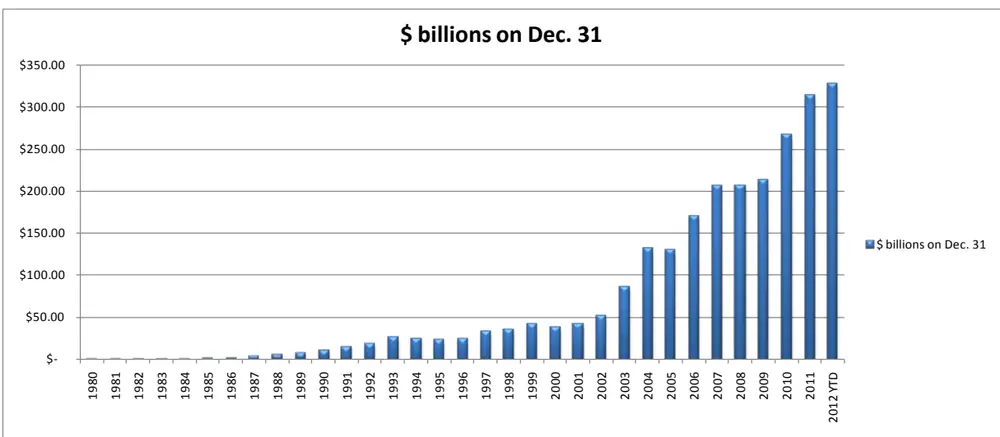
数据来源：Barclay Hedge，广发证券发展研究中心

根据Barclay Hedge的统计，全球对冲基金管理规模在2007年达到峰值2.13万亿之后有了小幅度的萎缩，截止到2012年1季度的数据显示，总规模在1.76万亿，其中利用CTA策略进行管理的资产占比却呈逐年提升态势，从2002、2003年的10%占比到目前18.6%的比例，CTA策略已经成为全球对冲基金使用最多的一类策略。

图2：全球对冲基金规模及CTA管理资产占比
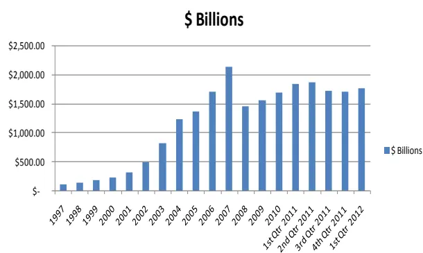
数据来源：Barclay Hedge，广发证券发展研究中心

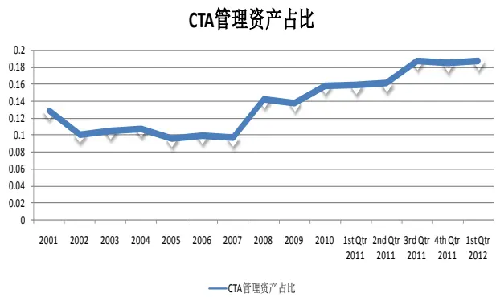

从CTA策略结构性来看，系统程序化交易策略占了绝大部分，而人为主观性交易方式只有很少一部分，从下面的数据可以看到，CTA策略管理规模中有80%左右的是利用系统化方法进行管理的。

至此我们可以看到，全球对冲基金中使用最多的一类策略是CTA策略，而CTA策略中又以系统化交易占绝对的主导地位，因此我们有必要对这一类策略进行系统化深入的研究。

图3：CTA市场管理资产规模及系统交易占比
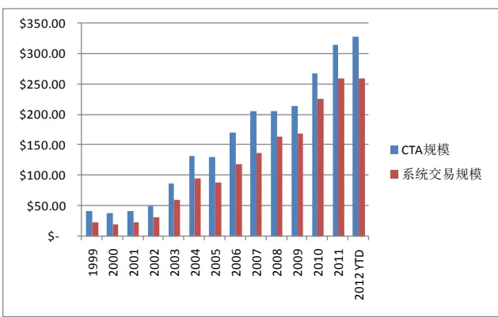
数据来源：Barclay Hedge，广发证券发展研究中心

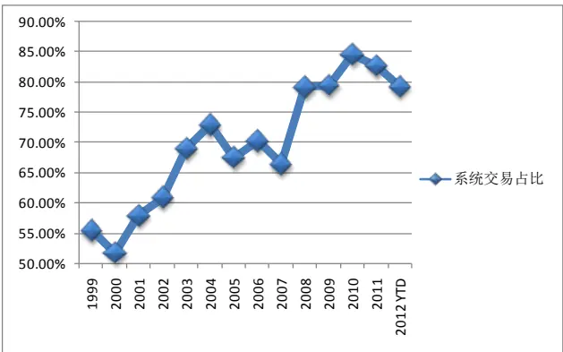

## （二）经典CTA策略回顾

CTA 策略一般进行系统化实施，采用程序化交易方式，交易模型自然是对敌制胜的关键所在，虽然我们不可能完全窥探成功者的秘诀，但是一些思想性的、方向性的探讨还是可以进行的，下图 4是根据 Futures Truth跟踪的历年交易系统TOP10 排行榜，下面我们对其中部分较为著名的系统进行简单的介绍。

## 1、Aberration

Aberration 系统由 Keith Fitschen 在 1993 年 12 月开发，该系统可用于多种交易标的，自发布以来连续多年进入 TOP10排行榜，其实Aberration 为一个趋势突破模型，通过布林通道来定义趋势通道，当价格穿越通道上或下边界时进场跟随趋势，当价格趋势停止进而触及中线时平仓获利。

## 2、R-Bearker、STC S&P DayTrade、Big Blue、Dual Thrust

这一类交易系统都是日内交易策略，基本原理非常类似，根据昨日的最高价、最低价、收盘价或者近期历史价格时间序列计算若干点位，并结合当日市场波动与这些点位的关系来定义日内突破模式、日内反转模式等等，并辅以信号过滤条件，比如波动特征过滤、日历过滤等等，从策略效果上来看，收益和回撤特征相差无几。

其中 R-Bearker 由 Rick Saidenberg 在 1993 年 7 月开发，STC S&P DayTrade 由Staffordtrading 在 1997 年 3 月开发，Big Blue 是由 Mike Barna 根据 Mr. Vilar Kelly的思想创立的，同时需要指出的是 Mike Barna也是R-mesa 的创始人之一。

虽然经典交易策略取得了非常大的成功，得到了应有的光环，那么是否后来者也应该跟随前辈的脚步，通过不断编写程序测试不同交易思想、或者改进现有策略来形成自己的交易系统呢？是否我们也需要过没日没夜的编写代码检验策略的生活呢？未来系统化交易策略的发展方向又可能是什么呢？我想这些问题是 CTA从业者们应该深深思考的，而或许“遗传规划”便是通向成功彼岸的一条康庄大道。

识别风险，发现价值

图4：历年交易系统TOP10排行榜

|  |  | 历年来前十名交易系统的登榜情况 |  |  |
| --- | --- | --- | --- | --- |
|  | 1993 | 1997 | 2001 | 2005 |
| 1 | Black or White | Aberration | Aberration | Aberration |
| 2 | Culler Currency | CatScan 1 | Basis II | Basis II |
| 3 | DCS-II | Combo Advantage | DCS-II | Checkmate |
| 4 | Dollar Trader | Culler Currency | Dollar Trader | Dollar Trader |
| 5 | Pilot Trader | DCS-II | Dynamic BreakOut | Golden SX |
| 6 | QuadLevelTrend | Dollar Trader | Golden SX | R-Breaker |
| 7 | Time Trend III | GrandCayman | GrandCayman | R-Mesa |
| 8 | Ultimate II | R-Breaker | R-Breaker | ReadySetGo |
| 9 | Volpat | Time Trend III | STC S&P DayTrade | STC S&P DayTrade |
| 10 | Wilder's Volatility | Universal LT | TrendChannel | TrendChannel |

数据来源：广发证券发展研究中心

图5：突破反转日内交易策略基本原理
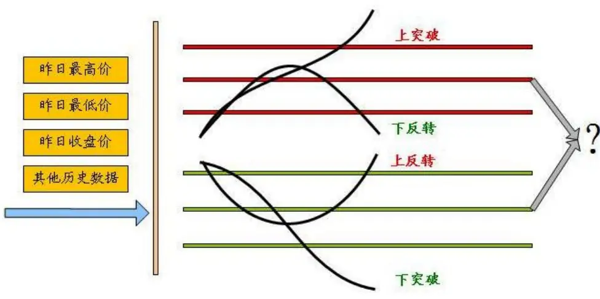
数据来源：广发证券发展研究中心

## （三）系统化交易策略新动向: 遗传规划

下面图6、7分别是Futures Truth Magazine跟踪的S&P标的下交易系统的表现，以及不限交易标的下的策略自发布以来的年化收益率排行榜，也许不用我多说什么，我们可以清楚的看到有一类以“TSL”字样为首的交易策略系统，TSL是Trading System Lab的简写，是一家CTA策略服务商，由大名鼎鼎的R-mesa的创始人Mike Barna所创。

Mike Barna利用遗传规划方法，针对不同交易标的智能生成各种交易策略，从Futures Truth Magazine的跟踪结果我们已经可以看到了遗传规划在交易策略研发中的成功的一面。

一般地，一个交易策略研发者都从研究经典成功交易系统开始，再结合目标交易标的市场的特点，以及自己的交易心得从不同方面进行策略的改进，或者是吸取不同成功策略的优点结合自己的交易风格形成适合自己的交易系统，因此，新的成功交易系统可以泛化的认为是从经典系统中遗传了优良的基因进化而来，这个进化的过程可以通过遗传规划来完成。

| 图6：CTA交易策略S&PTOP10（2012年7月） |  |
| --- | --- |
| Rank | System Name Annual % Return |
| 1. | TSL-SP_1.0Z TSL-CEL_SP1 |
| 2. | 63.5% |
| 3. | 48.8% |
| 4. | 45.4% |
| 5. | 40.9% |
| 6. | Big Blue 2 36.8% |
| 7. | STC S&P DayTrade 36.4% 33.8% |
| 8. | %C DayBreaker |
| 9. |  |
| 10. |  |

数据来源：广发证券发展研究中心

图7：CTA交易策略自发布以来收益排行榜（2012年7月）

| Top 10 Systems Since Their Release Date |  |  |
| --- | --- | --- |
| Issue #2 2011 - published in July 2012 |  |  |
| Systems included in this table must have been released for at least 18 months. Results based on performance through April 30, 2012 |  |  |
| Return is based on three times the required margin. |  |  |
| Rank | System Name | Annual % Return |
| 1. | TSL_CEL_NG_1.1 | 155.2% |
|  |  | 89.1% |
|  |  | 85.7% |
|  | Delphi II EMD | 79.6% |
|  | NatGator | 75.7% |
|  | Trend Finder - Tiger | 75.5% |
|  | TSL_SP_1.0Z TSL-CEL_SP1 | 67.1% |
| 23456789 |  | 63.5% |
| 10. | Trend Finder - Lion 2 | 60.6% 57.9% |

数据来源：广发证券发展研究中心

## 二、遗传规划算法

## （一）遗传规划介绍

遗传规划（Genetic Programming）由达尔文的进化论演变而来，是一种智能进化计算（Evolutionary Computation）技术，遗传规划是遗传算法的推广和更一般地形式。

## （1）遗传规划要解决问题

一般地在线性回归中，我们面临的问题是如何求解最优的系数，不管是利用线性回归技术，或者是遗传算法技术，我们都必需假设已知问题的函数表达式是一个二阶多项式。但是在遗传规划中，我们不需要知道函数的表达式，我们不仅仅要求得函数系数，而且要找出函数的表达式。

$$
y=a+bx+cx^{2}
$$

## （2）遗传规划算法流程图

遗传规划首先生成程序函数体群体，其中每一个个体是一个解决问题的方案，对于上述符号回归问题则为一个随机生成的函数表达式，得到初始群体后进入循环迭代过程，先计算个体的适应度值，并判断迭代终止条件，若符合则迭代终止，否则按适应度值比例的选择概率在上一代群体中随机选择个体，利用遗传算子生成新个体，进而得到新群体，然后再进行计算适应度值及判定迭代终止条件的步骤。

图8：遗传规划流程图
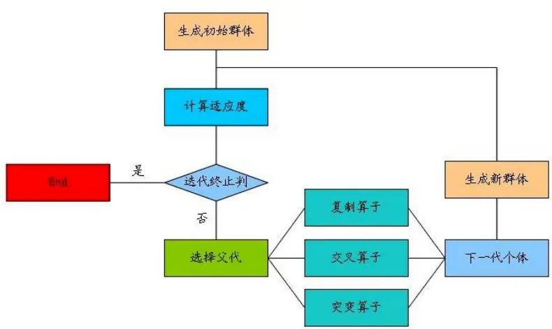
数据来源：广发证券发展研究中心

## （3）函数体的表现形式

遗传规划算法中，我们通常需要将函数表达式表示成一种树的形式，例如可以将函数表达式max , 3 (x x x y + + × )转换成如下的树的形式，如下图，其中圆圈部分代表内部节点（max、+、*）称为函数（functions），叶节点上的自变量以及常数称为终端（terminals）。

遗传规划算法中需要我们事先给定函数集（functions set）和终端集（terminalsset）。

图9：函数体的树状表示
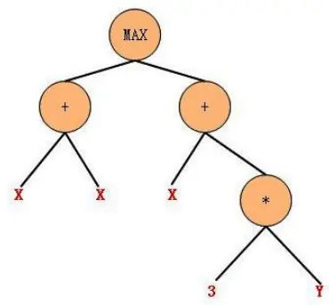

## 数据来源：广发证券发展研究中心

## （4）适应度（fitness）

给定一个个体之后，类似于进化论，需要知道该个体对环境的适应度值，适应度高的则有更高的可能存活下来，或者作为父代进行交叉变异形成新个体，从而将优良基因遗传给下一代。

一般的对于拟合问题，则可以以拟合均方误差为适应度；对于交易策略问题，则可以令收益率（或者回撤、收益除以回撤等）作为适应度。

## （5）遗传算子：精英算子（elite）

上一代群体中适应度最高的若干个个体或者一定比例的个体直接作为新个体放入下一代群体，这一部分个体数量占群体大小的比例为 $p_{e}$

## （6）遗传算子：复制算子（reproduction）

按照等比例于适应度的选择概率在上一代群体中选择个体放入下一代群体，如此产生的个体数量占群体大小的比例为 $p_{r}$ 。

## （7）遗传算子：交叉算子（crossover）

按照等比例于适应度的选择概率在上一代群体中选择两个个体作为父代，并随机选取其树结构之节点，交换以该节点为根节点的两个子树，从而生成两个新的个体，如此产生的个体数量占群体大小的比例为 $p_{c}$

图10：交叉算子
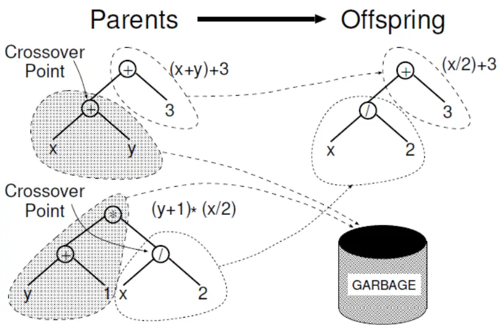
数据来源：广发证券发展研究中心

## （8）遗传算子：变异算子（mutation）

按照等比例于适应度的选择概率在上一代群体中选择一个个体作为父代，并随机选取其树结构之节点，令随机生成的另一个树结构函数体替换以该节点为根节点的子树，从而生成一个新的个体，如此产生的个体数量占群体大小的比例为 $p_{m}$

$$
p_{e}+p_{r}+p_{c}+p_{m}=1
$$

图11：变异算子

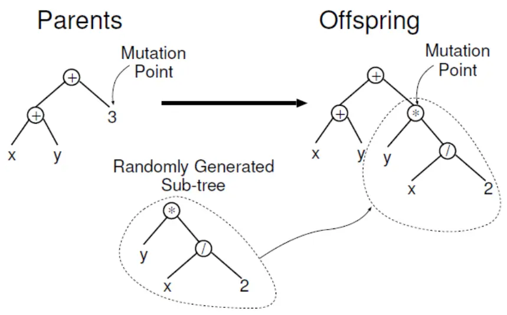
数据来源：广发证券发展研究中心

## （二）遗传规划案例一

假设有一种样本，自变量与因变量之间的函数关系表达式为

$$
y=1-0.5x+1.2x^{2}
$$

利用该函数表达式生成一段长度为2000的样本，利用其中部分样本借助遗传规划算法来寻找自变量与因变量之间的函数关系。训练样本取中间者的1000个，如下图所示。

图12：遗传规划案例一样本内外设置
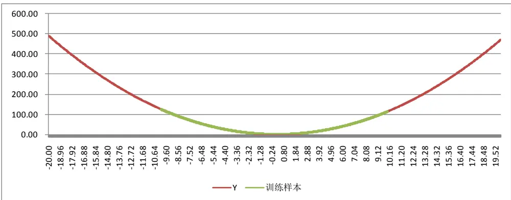
数据来源：广发证券发展研究中心

在遗传规划算法上，我们进行了如下设置，分别有函数集、终端集、群体规模、迭代次数、遗传算子相关的参数，如下表。

图13是算法迭代过程，可以看到随着迭代的推进，最有个体的均方误差在不断减小，图14是最优个体样本内外拟合情况，图15是最优个体函数表达式的树形结构图。

| 表1：遗传规划设置 |  |
| --- | --- |
| 参数 | 内容 |

识别风险，发现价值

| 适应度值 | 拟合均方误差 |
| --- | --- |
| Terminals Set | 随机数、输入变量 |
| Functions Set | 十、 ÷、SIN、COS、ASIN、ACOS、POWER、SQRT、LOG、AND、OR、LT、GT、IF、MIN、MAX |
| 群体规模 | 100 |
| 精英算子比例 | 10% |
| 交叉算子比例 | 80% |
| 变异算子比例 | 10% |
| 最大迭代次数 | 50 |

数据来源：广发证券发展研究中心

图13：迭代过程及适应度变化
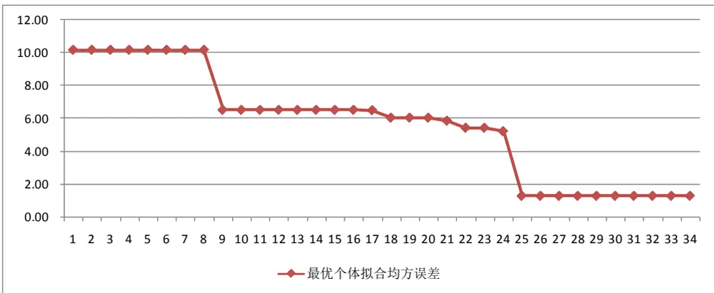
数据来源：广发证券发展研究中心

图14：最优个体样本内外表现
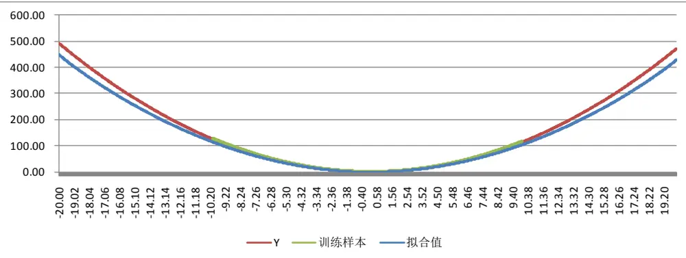
数据来源：广发证券发展研究中心

图15：拟合函数表达式的树形结构

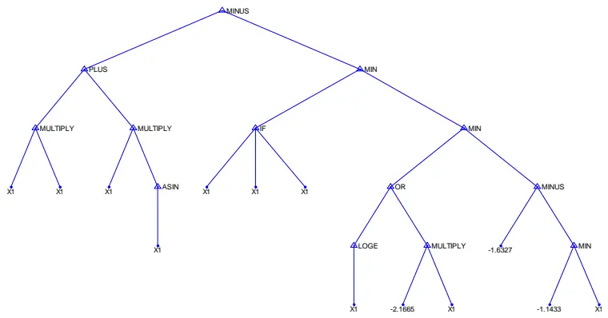
数据来源：广发证券发展研究中心

## （三）遗传规划案例二

假设有一种样本，自变量与因变量之间的函数关系表达式为

$$
y=1.5x^{2}\sin(x)
$$

利用该函数表达式生成一段长度为2000的样本，利用其中部分样本借助遗传规划算法来寻找自变量与因变量之间的函数关系。训练样本取中间者的1000个，如下图所示。

图16：遗传规划案例二样本内外设置
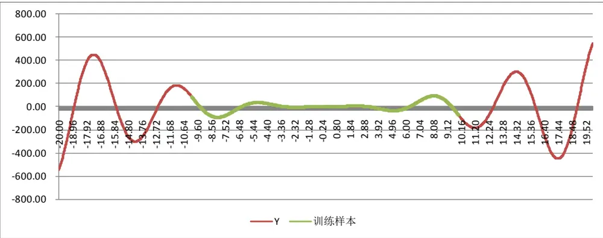
数据来源：广发证券发展研究中心

在遗传规划算法上，我们进行了如下设置，分别有函数集、终端集、群体规模、迭代次数、遗传算子相关的参数，如下表。

图17是算法迭代过程，可以看到随着迭代的推进，最有个体的均方误差在不断减小，图18是最优个体样本内外拟合情况，图15是最优个体函数表达式的树形结构图。

| 表2：遗传规划设置 |  |
| --- | --- |
| 参数 | 内容 |
| 适应度值 | 拟合均方误差 |
| Terminals Set | 随机数、输入变量 |
| Functions Set | +、-、×、÷、SIN、COS、ASIN、ACOS、POWER、SQRT、LOG、AND、OR、LT、GT、IF、MIN、MAX |

识别风险，发现价值

| 群体规模 | 100 |
| --- | --- |
| 精英算子比例 | 10% |
| 交叉算子比例 | 80% |
| 变异算子比例 | 10% |
| 最大迭代次数 | 50 |

数据来源：广发证券发展研究中心

图17：迭代过程及适应度变化
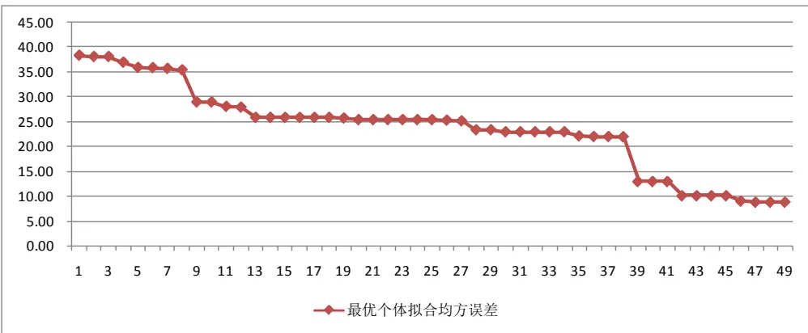
数据来源：广发证券发展研究中心

图18：最优个体样本内外表现
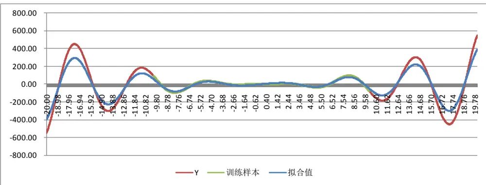
数据来源：广发证券发展研究中心

图19：最优个体表达式的树形结构

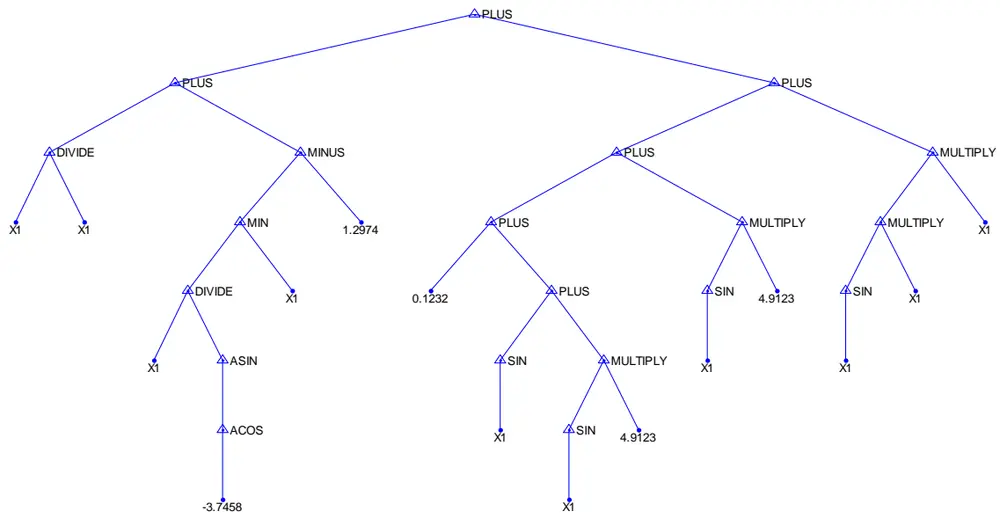
数据来源：广发证券发展研究中心

## 三、遗传规划智能策略

## （一）算法框架流程

利用遗传规划进行智能交易策略生成的整体框架流程类似于上述的符号回归案例，但是在具体细节上有很大差异，比如在终端集、函数集、以及适应度计算上差异很大，我们首先介绍我们设计的整体算法框架。

## （1）交易标的选择

选定交易标的，比如商品期货、股指期货、外汇等等，获取其分笔交易明细数据之后将数据切片，提取其各个周期上的K线数据，包括1分钟、2分钟、5分钟、10分钟、15分钟、30分钟、60分钟、日、周等等。

## （2）终端集的设定

原则上来讲，只需要输入价量相关的K线数据即可，由程序自动进行演算找到更好判断买卖点的数据，但是一方面这个范围太宽泛了，理论上无穷多的函数组合形式使得计算量大大增加，往往结果也并不是十分理想。那么合理的做法是根据各个周期的基础数据（开盘价、最高价、最低价、收盘价、成交量、成交金额）计算衍生数据指标，从不同角度反映数据特征，然后作为输入变量输入模型。

## （3）函数集

函数集方面一般包括多种算子，算术运算、关系运算、逻辑运算、条件运算等等，函数运算方面，包括正弦、余弦、反正弦、反余弦、对数、指数、幂、最大、最小、开方等等。

## （4）适应度计算

与普通符号回归的不同之处在于适应度计算方式，符号回归上，我们希望拟合均方误差越小越好，因此拟合误差越小的个体其适应度应该越高。而在交易策略生成中，我们希望策略累计收益率越大越好，收益率越高的，其适应度越高，再者我们的优化目标也可以是收益/回撤倍数，该倍数越高的个体适应度越高。

在进行策略评价时，我们假定策略个体输出的结果为买卖信号，并且我们人为的设定止损或者强制平仓的条件，这些交易规则结合买卖信号从而可以形成具体的买卖行为，再计算该买卖行为下的累计收益率或者收益/回撤倍数。

图20：遗传规划算法框架一
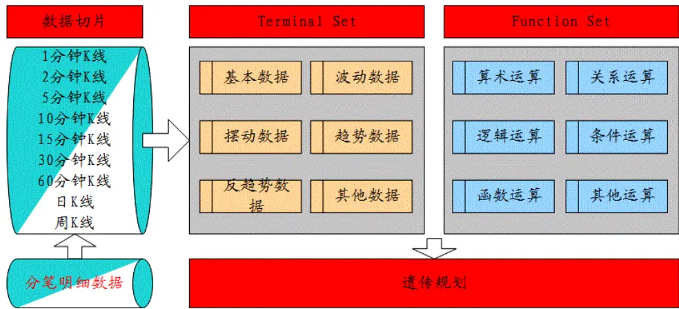
数据来源：广发证券发展研究中心

图21：遗传规划算法框架二
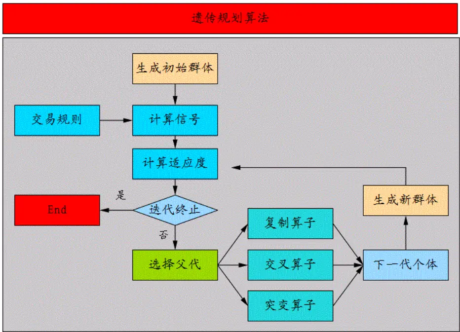
数据来源：广发证券发展研究中心

## （二）实证分析

（1）数据选取，本实证选取股指期货当月合约自2010年4月16日至2012年8月24的5分钟K线。

## （2）策略评价方法

策略评价指标我们选取如下表，这里需要说明的是，经验来看，趋势投机策略在严格止损的机制下胜率一般很难超过40%，但赔率一般要大，靠亏小赚大盈利。

表3：交易策略评价体系

| 考察指标 | 说明 |
| --- | --- |
| 累计收益率 | 模拟交易期末累计收益率 |
| 交易总次数 | 总交易次数（自开仓至平仓为一个完整的交易周期） |
| 获胜次数 | 单次交易收益率大于0的次数 |
| 失败次数 | 单次交易收益率小于0的次数 |
| 胜率 | 获胜次数/交易总次数×100% |
| 单次获胜收益率 | 获胜交易的收益率算术平均值 |
| 单次失败亏损率 | 失败交易的收益率算术平均值 |
| 赔率 | 单次获胜平均收益率除以单次失败平均亏损率的绝对值 |
| 最大回撤 | 模拟交易资金自最高点缩水的最大幅度 |
| 最大连胜次数 | 最大连续收益率大于0的交易次数 |
| 最大连亏次数 | 最大连续收益率小于0的交易次数 |

数据来源：广发证券发展研究中心

## （3）模拟交易情景

记 $F_{1}$ 为开仓成交价， $F_{2}$ 为平仓成交价，c为单边手续费率，I 为单边冲击成本，M为杠杆倍数，则单次交易收益率为

$$
r_{long}=\left[\frac{(F_2-I)\times(1-c)-(F_1+I)\times(1+c)}{(F_1+I)\times(1+c)}\right]\times M
$$

$$
r_{shot}=\left[\frac{\left(F_1-I\right)\times(1-c)-\left(F_2+I\right)\times(1+c)}{\left(F_1-I\right)\times(1+c)}\right]\times M
$$

此处模拟交易相关设定为：

手续 费：万分之零点五；

冲击成本：0.4 个指数点；

杠杆倍数：1；

开仓价格: 信号发生后第 1根K 线开盘价；

平仓价格: 止损价或者时间平仓价。

## （4）输入变量

输入变量上我们仅将5分钟K线数据输入，分别是最高价、最低价、收盘价、成交手数、日内累计K线数五个变量，其中“日内累计K线数”为当日开盘至当前时刻的5分钟BAR的数量，当日第1个分钟K线时该变量为1，最后一个5分钟K线时该变量为54，该变量主要用来刻画数据的日内时间属性，为时间数据。

## （5）交易规则

交易规则以及信号结合生产最终的交易明细，再计算累计收益率或收益/回撤倍数作为个体适应度值，其中交易信号即为个体函数表达式的值，而交易规则上，从交易日09:30开始，当交易信号值大于0时，开仓做多，反之小于0时开仓做空，并设置固定止损幅度为0.5%，当价格触及止损线时，平仓止损，之后再观察交易信号值与零的大小关系，若当日未发生止损，则收盘15:00强制平仓。

## （5）实证结果

首先将数据分为两段，其中2010-4-16至2011-12-30为样本内，用以生成交易策略，而后2012年1月1日至今皆为样本外。

利用遗传规划算法进行策略优化生成，群体规模为500，也就是说每一代有500个策略，下图22是遗传算法生成的各代策略的收益回撤比的最大值和中值变化曲线，我们可以看到，随着策略的进化更替，群体最佳收益回撤比大幅增加，收益回撤比中值也在同步增加，整个进化过程共计经过了54次，总计测试策略数量达到了27000个，至进化结束时，最佳个体收益回撤比达到了32.5倍。

图22：策略进化迭代过程及适应度变化
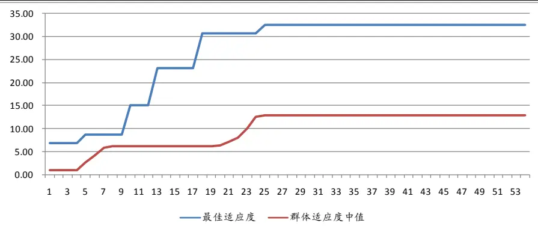
数据来源：广发证券发展研究中心

我们接下来看一下最佳策略的具体表现情况，下图23是该策略的累计收益率表现，全样本来看，年化收益率为 116%，胜率为 42.68%，赔率为 1.91倍，历史最大回撤为-8.2%，分年度来看，2010、2011、2012 年化收益率分别为 118%、67%、34%，胜率分别为 39%、42%、45%，赔率分别为 2.36、1.80、1.54，最大回撤分别为-6.18%、-7.48%、-8.09%，交易次数方面，每年交易在 400次左右，平均每天 1.6次。

图23：最优策略累计收益率曲线

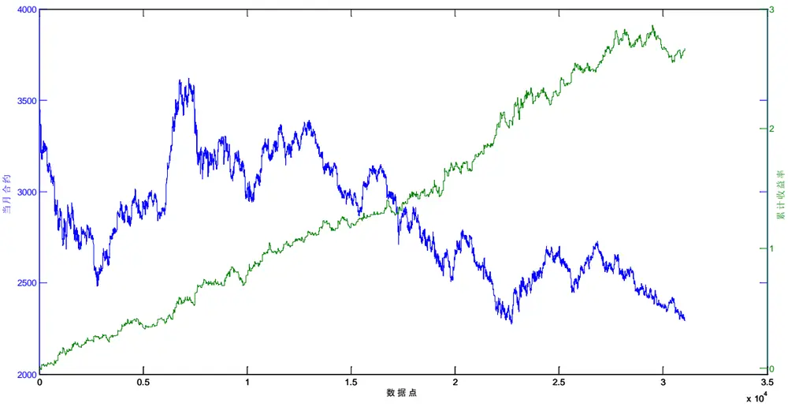
数据来源：广发证券发展研究中心

表4：交易策略表现（全部信号）

| 评价指标 | 全样本 | 2010 | 2011 | 2012 |
| --- | --- | --- | --- | --- |
| 累计收益率 | 266.98% | 82.81% | 65.40% | 21.37% |
| 年化收益率 | 116.08% | 118.98% | 67.01% | 34.03% |
| 交易次数 | 1134 | 385 | 460 | 289 |
| 获胜次数 | 484 | 151 | 203 | 130 |
| 失败次数 | 650 | 234 | 257 | 159 |
| 胜率 | 42.68% | 39.22% | 44.13% | 44.98% |
| 单次均收益率 | 0.12% | 0.16% | 0.11% | 0.07% |
| 单次获胜均收益率 | 0.94% | 1.21% | 0.86% | 0.75% |
| 单次失败均收益率 | -0.49% | -0.51% | -0.48% | -0.49% |
| 赔率 | 1.91 | 2.36 | 1.80 | 1.54 |
| 最大回撤 | -8.20% | -6.18% | -7.48% | -8.09% |
| 收益新高最大需日 | 29 | 21 | 19 | 29 |
| 收益新高最大需日中位数 | 3 | 2 | 2 | 6 |
| 最大连胜次数 | 7 | 7 | 6 | 6 |
| 最大连败次数 | 9 | 9 | 9 | 7 |

数据来源：广发证券发展研究中心

表5：交易策略表现（多头信号）

| 评价指标 | 全样本 | 2010 | 2011 | 2012 |
| --- | --- | --- | --- | --- |
| 累计收益率 | 49.96% | 22.88% | 11.21% | 9.73% |
| 年化收益率 | 21.72% | 32.87% | 11.49% | 15.50% |
| 交易次数 | 409 | 141 | 161 | 107 |

识别风险，发现价值

| 获胜次数 | 170 | 52 | 70 | 48 |
| --- | --- | --- | --- | --- |
| 失败次数 | 239 | 89 | 91 | 59 |
| 胜率 | 41.56% | 36.88% | 43.48% | 44.86% |
| 单次均收益率 | 0.10% | 0.15% | 0.07% | 0.09% |
| 单次获胜均收益率 | 0.95% | 1.30% | 0.80% | 0.79% |
| 单次失败均收益率 | -0.50% | -0.52% | -0.49% | -0.48% |
| 赔率 | 1.90 | 2.50 | 1.63 | 1.65 |
| 最大回撤 | -6.95% | -5.85% | -4.18% | -6.65% |
| 收益新高最大需日 | 74 | 49 | 47 | 60 |
| 收益新高最大需日中位数 | 9 | 10 | ∞ | 6 |
| 最大连胜次数 | 6 | 4 | 4 | 6 |
| 最大连败次数 | 7 | 7 | 4 | 5 |

数据来源：广发证券发展研究中心

表6：交易策略表现（空头信号）

| 评价指标 | 全样本 | 2010 | 2011 | 2012 |
| --- | --- | --- | --- | --- |
| 累计收益率 | 144.72% | 48.77% | 48.72% | 10.60% |
| 年化收益率 | 62.92% | 70.07% | 49.92% | 16.89% |
| 交易次数 | 725 | 244 | 299 | 182 |
| 获胜次数 | 314 | 99 | 133 | 82 |
| 失败次数 | 411 | 145 | 166 | 100 |
| 胜率 | 43.31% | 40.57% | 44.48% | 45.05% |
| 单次均收益率 | 0.13% | 0.17% | 0.14% | 0.06% |
| 单次获胜均收益率 | 0.94% | 1.16% | 0.89% | 0.74% |
| 单次失败均收益率 | -0.49% | -0.51% | -0.47% | -0.50% |
| 赔率 | 1.91 | 2.29 | 1.90 | 1.48 |
| 最大回撤 | -5.14% | -4.91% | -4.25% | -4.87% |
| 收益新高最大需日 | 44 | 30 | 21 | 44 |
| 收益新高最大需日中位数 | 5 | 4 | 3 | 8 |
| 最大连胜次数 | 7 | 7 | 4 | 7 |
| 最大连败次数 | 9 | 9 | 6 | 7 |

数据来源：广发证券发展研究中心

下图24是信号的函数表达式之树形结构图，我们将其转换成普通函数表达式如下

$$
y=\cos\left(tt\right)+2\sin\left(\frac{\cos\left(ll+tt\right)}{\cos\left(\sin\left(ll\right)^{n}\right)}\right)
$$

图25为该信号计算函数在全样本内的具体图形，由于数据量过大，为了更明显展示该指标走势，我们取100个数据点为间隔的抽样绘制形成。

图24：最优策略信号计算函数树形结构

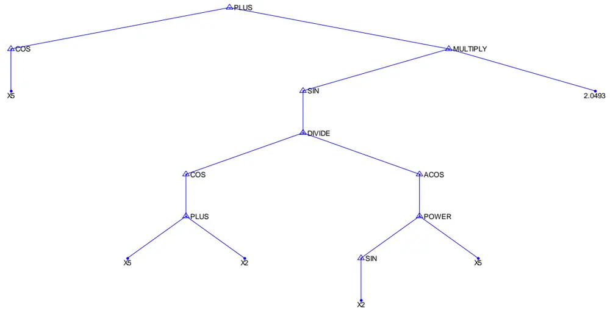
数据来源：广发证券发展研究中心

图25：最优策略信号函数值抽样显示
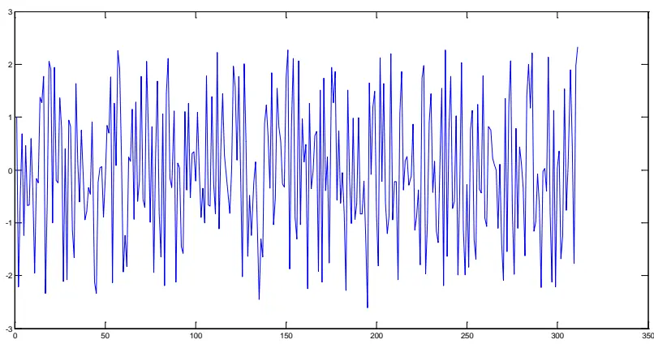
数据来源：广发证券发展研究中心

## 四、总结

（1）系统交易策略已成全球对冲基金之首选策略。根据Barclay Hedge数据，全球对冲基金在2007年达到2.13万亿美元的规模巅峰之后略有小幅萎缩，截止2012年1季度总规模在1.76万亿，而其中采用CTA策略的管理规模从1980年以来均呈逐年递增态势，截止目前为止总规模达到了3280亿美元，占全球对冲基金总规模的18.6%，已成为对冲基金首先策略之一。CTA策略又包含两大类，一类是利用程序化进行系统交易，一类是

识别风险，发现价值

非系统交易（比如人为定性分析交易），就结构来看，系统化交易策略已经占到了80%的比例，具有绝对主导地位。

（2）系统交易策略新动向：遗传规划智能方法。业内程序化交易策略开发基本上都是从研究经典交易策略开始的，在前人的基础之上，结合自身的交易特点、风格以及心得或融合各家之长，或对若干进行改进而最终形成自己的交易策略，而当策略逐渐失效之后，再回头检查问题，挖掘失效原因，寻找新的市场特点对原有策略进行改进升级为新一代策略，如此反复。

而这一过程与达尔文之物种进化颇有相似之处，物种适者生存及进化繁衍的过程与系统交易策略强者为王及策略改进升级的过程如出一辙，人工智能领域的遗传规划因此可以用来进行系统交易策略研发。

事实上，BIG BLUE及R-MESA的创始人已经成功的将遗传规划运用于系统交易策略开发，并在Futures Truth Magazine跟踪的TOP10策略排行榜中占据六席。

（3）智能交易策略生成。首先我们构建了自己的遗传规划算法框架，在设定了群体规模为500，个体适应度为收益回撤比的情况下，以股指期货5分钟为交易周期，进行日内程序化交易策略的进化迭代生成，算法在迭代至54次之后收敛，累计测试了27000个策略。

最优策略的实证结果如下，全样本来看，年化收益率为116%，胜率为42.68%，赔率为1.91倍，历史最大回撤为-8.2%，分年度来看，2010、2011、2012年化收益率分别为118%、67%、34%，胜率分别为39%、42%、45%，赔率分别为2.36、1.80、1.54，最大回撤分别为-6.18%、-7.48%、-8.09%，交易次数方面，每年交易在400次左右，平均每天1.6次。

（4）未来研究方向。遗传规划博大精深，我们未来的研究将围绕我们构建的整体算法框架，在输入终端集、函数算子、交易规则以及树形结构方面进行更深的讨论，敬请关注。

## 广发金融工程研究小组

罗军，首席分析师，华南理工大学理学硕士，2010年进入广发证券发展研究中心。

俞文冰，CFA，首席分析师，上海财经大学统计学硕士，2012年进入广发证券发展研究中心。

叶涛，CFA ，资深分析师，上海交通大学管理科学与工程硕士，2012年进入广发证券发展研究中心。

安宁宁，资深分析师，暨南大学数量经济学硕士，2011年进入广发证券发展研究中心。

胡海涛，分析师， 华南理工大学理学硕士， 2010年进入广发证券发展研究中心。

夏潇阳， 分析师， 上海交通大学金融工程硕士， 2012年进入广发证券发展研究中心。

蓝昭钦，分析师， 中山大学理学硕士， 2010年进入广发证券发展研究中心。

李明，分析师，伦敦城市大学卡斯商学院计量金融硕士，2010年进入广发证券发展研究中心。

史庆盛，分析师， 华南理工大学金融工程硕士， 2011年进入广发证券发展研究中心。

汪鑫，分析师， 中国科学技术大学金融工程硕士， 2012年进入广发证券发展研究中心。

张超，分析师，中山大学理学硕士，2012年进入广发证券发展研究中心。

金融工程组微博地址：http://weibo.com/gfquant

| 相关研究报告 |  |  |
| --- | --- | --- |
| 基于缠中说禅之分型通道趋势交易系统 | 安宁宁 | 2012-03-14 |
| 基于日内波动极值的股指期货趋势跟随系统 | 安宁宁 | 2011-12-09 |
| 一类波动收敛突变模式的趋势跟随策略 | 安宁宁 | 2011-08-10 |

|  | 广州市 | 深圳市 | 北京市 | 上海市 |
| --- | --- | --- | --- | --- |
| 地址 | 广州市天河北路183号 |  | 深圳市福田区民田路178北京市西城区月坛北街2号上海市浦东南路528号 |  |
|  | 大都会广场5楼 | 号华融大厦9楼 | 月坛大厦18层 | 上海证券大厦北塔17楼 |
| 邮政编码 | 510075 | 518026 | 100045 | 200120 |
| 客服邮箱 | gfyf@gf.com.cn |  |  |  |
| 服务热线 | 020-87555888-8612 |  |  |  |

## 免责声明

广发证券股份有限公司具备证券投资咨询业务资格。本报告只发送给广发证券重点客户，不对外公开发布。

本报告所载资料的来源及观点的出处皆被广发证券股份有限公司认为可靠，但广发证券不对其准确性或完整性做出任何保证。报告内容仅供参考，报告中的信息或所表达观点不构成所涉证券买卖的出价或询价。广发证券不对因使用本报告的内容而引致的损失承担任何责任，除非法律法规有明确规定。客户不应以本报告取代其独立判断或仅根据本报告做出决策。

广发证券可发出其它与本报告所载信息不一致及有不同结论的报告。本报告反映研究人员的不同观点、见解及分析方法，并不代表广发证券或其附属机构的立场。报告所载资料、意见及推测仅反映研究人员于发出本报告当日的判断，可随时更改且不予通告。

本报告旨在发送给广发证券的特定客户及其它专业人士。未经广发证券事先书面许可，任何机构或个人不得以任何形式翻版、复制、刊登、转载和引用，否则由此造成的一切不良后果及法律责任由私自翻版、复制、刊登、转载和引用者承担。