## 基于遗传算法的期指日内交易系统

## 另类交易策略系列之十

## 报告摘要：

## 日内交易策略盛行，突破反转模式占主导地位

虽然股指期货上市至今已经近 3年时间，但持仓量占成交量的比重依然很低，为一成略多，日内交易者众多，众多机构投资者已经涉水或者正在试探策略运行。

日内交易策略中突破反转模式策略占主导地位，根据过往日线价格数据计算下一个交易日需要观察的若干点位，结合当日盘中走势定义上突破、下突破、上反转、下反转四种模式，如 R-Bearker、Dual Thrust等。

## 基于遗传算法寻找最佳区间突破策略

根据以往的跟踪研究，R-Bearker等策略目前已经阶段性失效，在2012年表现差强人意。这类策略的关键在于如何定义上下突破观察价位，我们利用历史日线数据定义 9个自变量，以此构建区间宽度的线性函数，在当日开盘价基础上上浮区间宽度为上突破价位，下浮等量为下突破价位，线性函数的获取利用遗传算法工具，并以收益最大化为优化目标。

## 策略样本外表现稳定

以 2010年 4月 16日至 2011年 12月 31日为样本内，当月合约 2分钟数据，单边万分之 0.3的手续费，单边 0.4个指数点的冲击成本，策略全样本取得了 130%的累计收益率，胜率 52%，赔率 1.34 倍，属于胜率偏高、赔率偏低的策略，从交易次数来看，2011年、2012年分别交易了 213次、222次，大概每天一次，分年度来看，2010、2011、2012年化收益率分别为 46%、38%、25%，各年度胜率率稳定在 45%~50%之间，赔率稳定在 1.3~1.5倍左右。

图 1策略累计收益率曲线
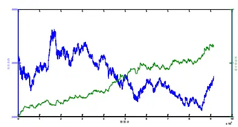

图 2 各月度收益
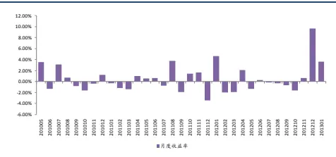

分析师： 安宁宁 S0260512020003

0755-23948352

ann@gf.com.cn

## 相关研究：

另类交易策略系列之九：基 2012-09-16
于遗传规划的智能交易策
略方法

另类交易策略系列之八：基 2012-09-03于时域分形的相似性匹配

另类交易策略系列之七：在 2012-07-09
标度不变性破缺下洞察资
金流向——MFT 交易策略
另类交易策略系列之六：基 2012-07-09
于 GFTD 的期指日内程序
化交易策略
另类交易策略系列之五：基 2012-03-14
于缠中说禅之分型通道趋
势交易系统

## 一、期指日内交易概括

## （一）日内交易策略盛行

沪深300指数期货自2010年4月16日上市以来至今，已经运行了接近3年时间，期初由于机构投资者较少，日内交易大行其道，隔夜持仓量占全部成交量的比重非常之低，随着机构准入的放行，这一状况得到一定的改变，但截至到目前为止，持仓量占成交量比重仍然仅为一成左右（如图1），市场上充斥着大量的日内交易者，日内交易策略仍大行其道。

需要指出的是目前日内交易者已经不局限于民间资金行为，大量机构投资者已经进入市场或者准备进入市场进行搏杀，其中包括基金公司的专户部门，并且已经存在取得优异成绩的案例。

日内交易策略相比于隔夜交易策略有着天然的优势，其一是策略风险较小，当日了结头寸，不承受隔日风险，其二是对交易系统的要求较低，隔夜头寸在系统化交易管理方面相对较为复杂，正是这些优势使得日内交易成为主流的期货交易策略方式。

图1：沪深300指数期货当月合约持仓量占成交量比重
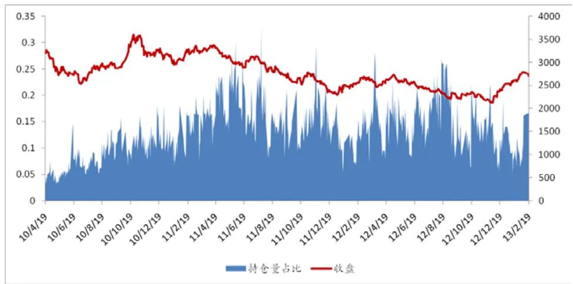
数据来源：广发证券发展研究中心

## （二）日内突破反转模式

虽然大家的日内交易策略方法不尽相同，但是日内突破反转模式绝对是使用最多的一类策略，国外CTA策略中也存在着大量成功的突破反转模式策略，这些策略可以直接借鉴应用。

下面我们来看一下这类策略的基本逻辑，基于日K线数据，包括昨日开高价、昨日最低价、昨日收盘价等数据计算得到日一个交易日我们需要观察的6个价位，并结合当日的股指走势定义两类四种模式，分别是上突破、下突破、上反转、下反转，如图2所示。

其背后的逻辑便是，如果价格向上突破最高一个价位，认为突破形成，进场做多跟随趋势，如果股指只达到第二个价位并且拐头向下跌破第三个价位，则认为向下反转形成，进场做空，下突破与上反转逻辑类似。

大家所熟悉的R-Bearker、Dual Thrust便是类似逻辑，只是在具体的观察价位的计算上不同罢了。

图2：日内交易策略突破反转模式基本原理
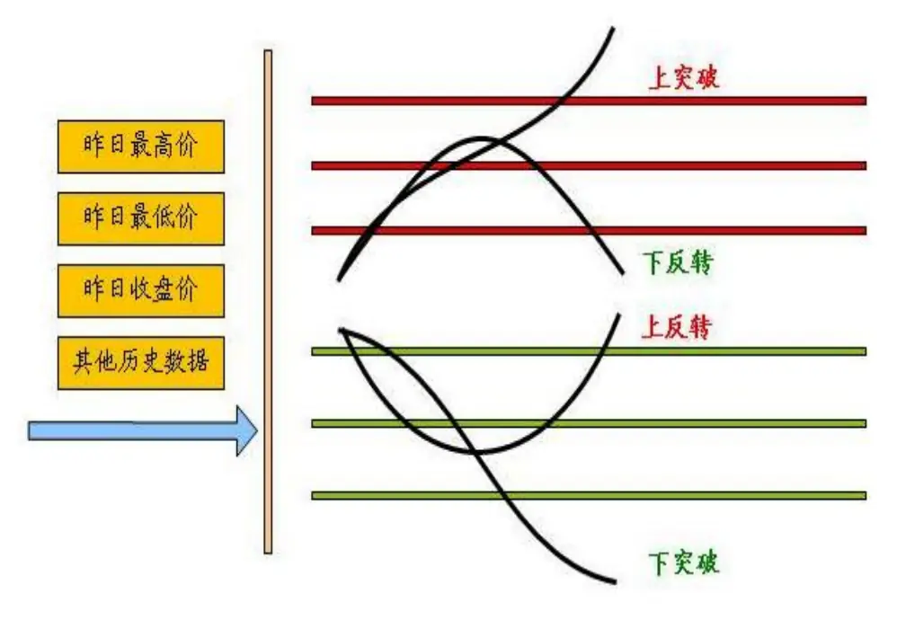
数据来源：广发证券发展研究中心

## （三）R-Breaker 近来表现

R-Bearker由Rick Saidenberg在1993年7月开发，用于标普指数期货日内交易，如图3是其发布前后的收益表现，可以看出自1993至2003的10年期间，策略表现非常好，但之后表现差强人意，阶段性失效。

图3：R-Breaker发布前后表现
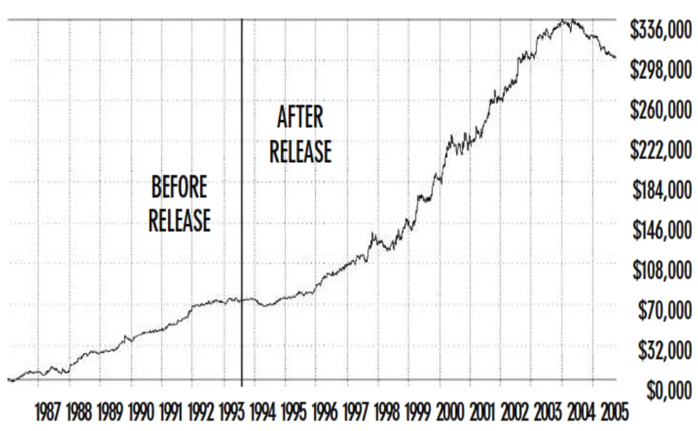

数据来源：广发证券发展研究中心

不少国内交易者将R-Breaker引入，甚至照搬过来进去股指期货的日内交易，我们也进行了相关的跟踪分析，发现效果不甚理想，虽然没有大的亏损但是盈利微弱，表现差强人意。

R-Breaker应用于沪深300指数期货，在单边万分之零点五交易成本和0.4个指数点的冲击成本的假设下，根据2010年4月16日至2011年12月31日的数据进行了参数优化，优化目标为期末累计收益率最大，在得到了优化参数之后进行全样本测试跟踪，需要说明的是上述工作在2012年一季度我们就完成了，也就是说自2012年二季度至今所有参数及策略均为做过任何变动。

下图4是是策略表现情况，可以看到自2012年以来策略整体收益基本持平，直到2012年12月份，市场大幅波动，策略收益才略有提升。另外我们也与不少买方同行就R-Beaker各方面的细节问题进行过探讨，样本外表现确实不如意，这或许是因为该策略已经路人皆知。

虽然R-Beaker策略或已失效，或者说阶段性无效，但是其思路和原理仍然有很多值得借鉴的地方，稍加变动改进或可得到一个不错的策略。

图4：沪深300指数期货R-Breaker表现
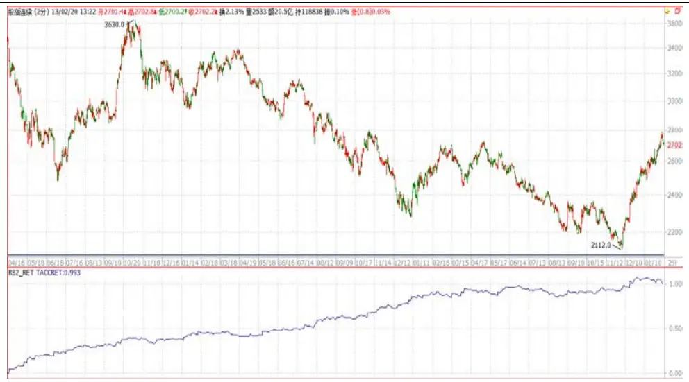
数据来源：广发证券发展研究中心

## 二、基于遗传算法的日内策略

## （一）基本思路

R-Bearker的创始人Rick Saidenberg的本意是开发一个反转策略，通过昨日最高价、昨日最低价、昨日收盘价与当日最高价、最低价进行回归，从而建立回归模型来预测下一个交易日盘中波动的高低的，当达到高点时开空，达到低点时做多，其R-Level策略便是这个思想，这是最初的思路，后来发现突破策略效果更好，加上突破策略便有了R-Bearker。

鉴于突破策略的领先有效性，我们在本报告中只开发突破策略，即当下一个交易日股指突破某一个价位时进场做多，跌破某一个价位时做空，而在计算上突破价和下突破价上我们借鉴开盘区间突破（Opening Range Breakout）方法，在当日开盘价的基础上加上一个区间宽度值得到上突破价，减去区间宽度值得到下突破价，如图5。

现在问题的关键是如何得到下一个交易日比较合理的区间宽度值，这直接决定着下个交易日的上突破价、下突破价，进而决定着何时形成突破信号进场开仓，我们认为决定区间宽度的变量不仅仅是昨日最高价、昨日最低价、昨日收盘价，而是应该包含最近交易日的价格波动情况等其他因素。

那么，这些变量又如何结合在一起，得到区间宽度值呢，我们采用线性函数的方式，如下

$$
B=c_{1}x_{1}+c_{2}x_{2}+c_{3}x_{3}+\cdots+c_{n}x_{n}
$$

其中B为区间宽度值， $x_{i}$ 为输入变量，如昨日最高价， $c_{i}.$ 为线性系数。之所以采用线性函数的方式是为了保持模型的可理解性，以及避免过拟合问题。

在寻找最佳函数系数时，我们采用遗传算法，遗传个体适应度为策略样本内交易累计收益率。

图5：开盘区间突破模式
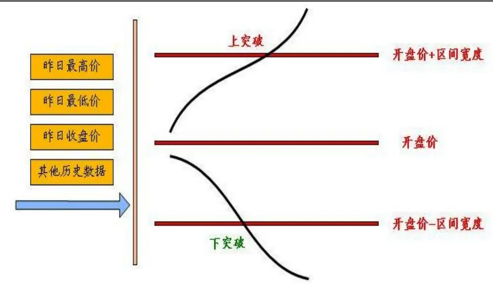
数据来源：广发证券发展研究中心
识别风险，发现价值

## （二）遗传算法

遗传算法于1975年由密西根大学John Holland提出，是一种建立在自然选择和进化进程概念基础上的非导数随机优化方法，我们理解其本质上是一种参数优化工具而已，最简单的参数优化方法莫过于全局搜索，对自变量进行离散化，然后循环计算目标值，找到全局最优解，但是当自变量个数很多，自变量取值范围很大时，这种方式是不可想象的，费时耗力，难以完成计算，而这一问题通过遗传算法便能够轻易解决，它不是进行全局搜索，而是根据某一个局部解，迭代进化找到更优解，直到收敛为止。

我们在本报告中采用遗传算法来获得计算区间宽度的线性函数系数，关于遗传算法的简单介绍可参见附录。

## （三）实证分析

（1）数据选取，本实证选取股指期货当月合约自2010年4月16日至2011年12月31的2分钟K线。

## （2）策略评价方法

策略评价指标我们选取如下表，这里需要说明的是，经验来看，趋势投机策略在严格止损的机制下胜率一般很难超过40%，但赔率一般要大，靠亏小赚大盈利。

表1：交易策略评价体系

| 考察指标 | 说明 |
| --- | --- |
| 累计收益率 | 模拟交易期末累计收益率 |
| 交易总次数 | 总交易次数（自开仓至平仓为一个完整的交易周期） |
| 获胜次数 | 单次交易收益率大于0的次数 |
| 失败次数 | 单次交易收益率小于0的次数 |
| 胜率 | 获胜次数/交易总次数×100% |
| 单次获胜收益率 | 获胜交易的收益率算术平均值 |
| 单次失败亏损率 | 失败交易的收益率算术平均值 |
| 赔率 | 单次获胜平均收益率除以单次失败平均亏损率的绝对值 |
| 最大回撤 | 模拟交易资金自最高点缩水的最大幅度 |
| 最大连胜次数 | 最大连续收益率大于0的交易次数 |
| 最大连亏次数 | 最大连续收益率小于0的交易次数 |

数据来源：广发证券发展研究中心

## （3）模拟交易情景

记 $F_{1}$ 为开仓成交价， $F_{2}$ 为平仓成交价， c为单边手续费率， I 为单边冲击成本， M 为杠杆倍数，则单次交易收益率为

$$
r_{long}=\left[\frac{\big(F_{2}-I\big)\times\big(1-c\big)-\big(F_{1}+I\big)\times\big(1+c\big)}{\big(F_{1}+I\big)\times\big(1+c\big)}\right]\times M
$$

$$
r_{short}=\left[\frac{\big(F_{\scriptscriptstyle1}-I\big)\times\big(1-c\big)-\big(F_{\scriptscriptstyle2}+I\big)\times\big(1+c\big)}{\big(F_{\scriptscriptstyle1}-I\big)\times\big(1+c\big)}\right]\times M
$$

此处模拟交易相关设定为：

手续 费：万分之零点三；

冲击成本：0.4个指数点；

杠杆倍数：1；

开仓价格: 信号发生后第1根K线开盘价；

平仓价格: 止损价或者时间平仓价。

（4）输入变量

在计算区间宽度的线性函数时，我们共使用了9个自变量分别为昨日开盘价、昨日最高价、昨日最低价、昨日收盘价、前日收盘价、波动真实区间、波动真实区间均值、真实高价、真实低价。

表2：输入变量含义

| 变量名称 | 说明 |
| --- | --- |
| X1:昨日开盘价 | T-1 日开盘价 |
| X2:昨日最高价 | T-1 日最高价 |
| X3:昨日最低价 | T-1 日最低价 |
| X4:昨日收盘价 | T-1 日收盘价 |
| X5:前日收盘价 | T-2 日收盘价 |
| X6:真实高价 | 最高价与 T-1 收盘价的最高者 |
| X7:真实低价 | 最低价与 T-1 收盘价的最低者 |
| X8: 波动真实区间 | 真实高价减去真实低价 |
| X9:波动真实区间均值 | 波动真实区间的10日均值 |

数据来源：广发证券发展研究中心

## （5）出场条件

设置千分之五的止损幅度，如果开仓后市场反向运行触及该止损线，则立即平仓，否则持有到15点收盘平仓。

## （6）实证结果

利用20104月16日至2011年12月31日的数据为样本内进行参数寻优，整个样本截止到2013年2月1日。

从整体来看，策略全样本取得了130%的累计收益率，胜率52%，赔率1.34倍，属于胜率偏高、赔率偏低的策略，从交易次数来看，2011年、2012年分别交易了213次、222次，大概每天一次，分年度来看，2010、2011、2012年化收益率分别为46%、38%、25%，各年度胜率率稳定在45%~50%之间，赔率稳定在1.3~1.5倍左右。

区间宽度的线性函数为：

B = -0.34×昨日开盘价 + 0.65×昨日最高价 + 0.31×昨日最低价 －

1.25×昨日收盘价 + 0.81×前日收盘价 － 0.99×真实高价 +

0.79×真实低价 + 0.52×真实区间 + 1.21×真实区间均值

上突破观察价位 = 当日开盘价 + B

下突破观察价位 = 当日开盘价 – B

图6：策略收益率表现
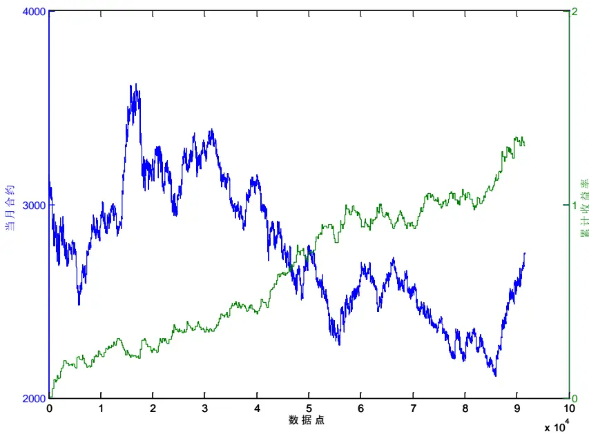
数据来源：广发证券发展研究中心

图7：策略收益率表现
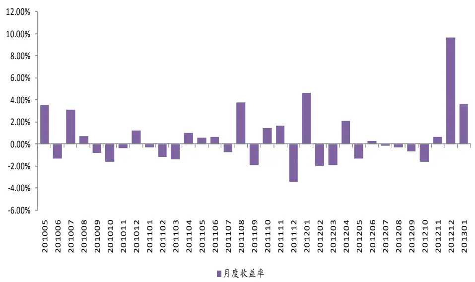
数据来源：广发证券发展研究中心

图8：策略最大回撤情况

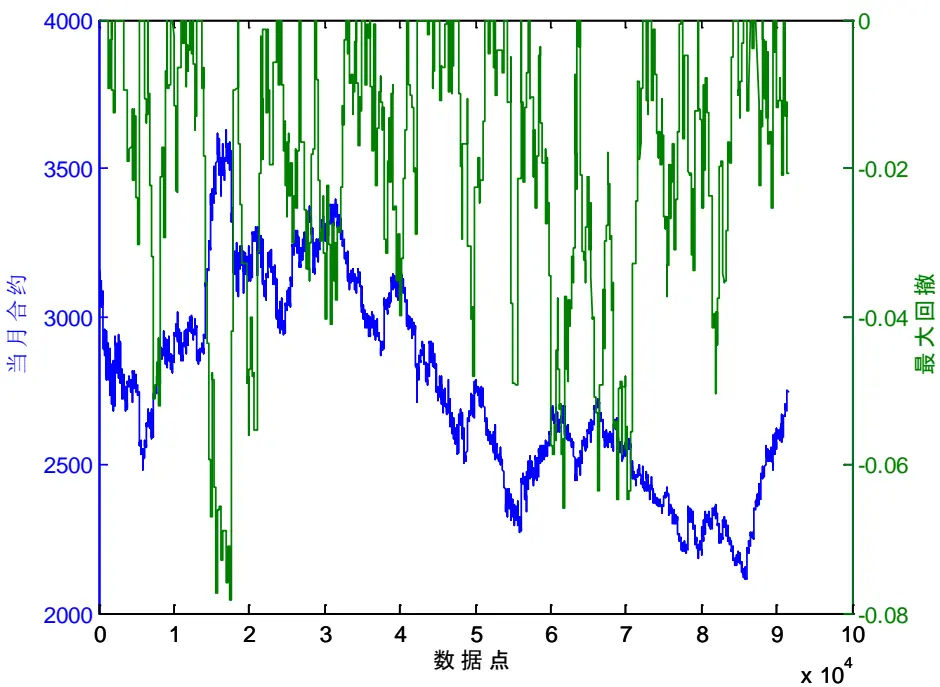
数据来源：广发证券发展研究中心

图9：策略连胜情况
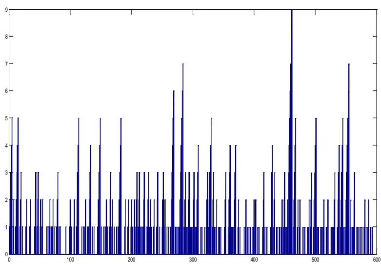
数据来源：广发证券发展研究中心

图10：策略连败情况

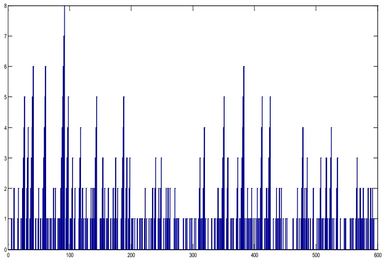
数据来源：广发证券发展研究中心

表3：全部信号表现

| 评价指标 | 全样本 | 2010 | 2011 | 2012 | 2013 |
| --- | --- | --- | --- | --- | --- |
| 累计收益率 | 130.19% | 30.77% | 38.03% | 25.69% | 1.47% |
| 年化收益率 | 48.36% | 46.61% | 38.96% | 26.43% | 17.48% |
| 交易次数 | 594 | 139 | 213 | 222 | 20 |
| 获胜次数 | 310 | 65 | 116 | 120 | 9 |
| 失败次数 | 284 | 74 | 97 | 102 | 11 |
| 胜率 | 52.19% | 46.76% | 54.46% | 54.05% | 45.00% |
| 单次均收益率 | 0.15% | 0.20% | 0.16% | 0.11% | 0.08% |
| 单次获胜均收益率 | 0.88% | 1.13% | 0.82% | 0.80% | 1.00% |
| 单次失败均收益率 | -0.66% | -0.62% | -0.63% | -0.71% | -0.68% |
| 赔率 | 1.34 | 1.84 | 1.29 | 1.13 | 1.48 |
| 最大回撤 | -7.83% | -7.83% | -4.93% | -6.58% | -2.10% |
| 最大连胜次数 | 9 | 5 | 7 | 9 | 2 |
| 最大连败次数 | 8 | 8 | 5 | 6 | 2 |

数据来源：广发证券发展研究中心

表4：Long信号表现

| 评价指标 | 全样本 | 2010 | 2011 | 2012 | 2013 |
| --- | --- | --- | --- | --- | --- |
| 累计收益率 | 17.83% | 4.32% | -0.04% | 9.02% | 3.64% |
| 年化收益率 | 6.62% | 6.55% | -0.04% | 9.28% | 43.32% |
| 交易次数 | 141 | 39 | 49 | 50 | 3 |
| 获胜次数 | 64 | 15 | 24 | 23 | 2 |
| 失败次数 | 77 | 24 | 25 | 27 | 1 |
| 胜率 | 45.39% | 38.46% | 48.98% | 46.00% | 66.67% |

识别风险，发现价值

| 单次均收益率 | 0.12% | 0.11% | 0.00% | 0.18% | 1.21% |
| --- | --- | --- | --- | --- | --- |
| 单次获胜均收益率 | 1.06% | 1.07% | 0.81% | 1.20% | 2.34% |
| 单次失败均收益率 | -0.66% | -0.49% | -0.77% | -0.69% | -1.05% |
| 赔率 | 1.61 | 2.21 | 1.05 | 1.75 | 2.24 |
| 最大回撤 | -5.87% | -3.64% | -3.54% | -5.87% | -1.05% |
| 最大连胜次数 | 5 | 3 | 5 | 4 | 2 |
| 最大连败次数 | 5 | 5 | 5 | 4 | 1 |

数据来源：广发证券发展研究中心

表5：Short信号表现

| 评价指标 | 全样本 | 2010 | 2011 | 2012 | 2013 |
| --- | --- | --- | --- | --- | --- |
| 累计收益率 | 95.36% | 25.35% | 38.08% | 15.28% | -2.09% |
| 年化收益率 | 35.42% | 38.41% | 39.02% | 15.72% | -24.94% |
| 交易次数 | 453 | 100 | 164 | 172 | 17 |
| 获胜次数 | 246 | 50 | 92 | 97 | 7 |
| 失败次数 | 207 | 50 | 72 | 75 | 10 |
| 胜率 | 54.30% | 50.00% | 56.10% | 56.40% | 41.18% |
| 单次均收益率 | 0.15% | 0.23% | 0.20% | 0.09% | -0.12% |
| 单次获胜均收益率 | 0.83% | 1.15% | 0.82% | 0.71% | 0.62% |
| 单次失败均收益率 | -0.66% | -0.68% | -0.58% | -0.71% | -0.64% |
| 赔率 | 1.27 | 1.69 | 1.40 | 0.99 | 0.97 |
| 最大回撤 | -6.92% | -6.42% | -4.21% | -6.92% | -4.10% |
| 最大连胜次数 | 8 | 4 | 6 | 8 | 2 |
| 最大连败次数 | 7 | 7 | 5 | 6 | 4 |

数据来源：广发证券发展研究中心

图11：策略多头信号案例
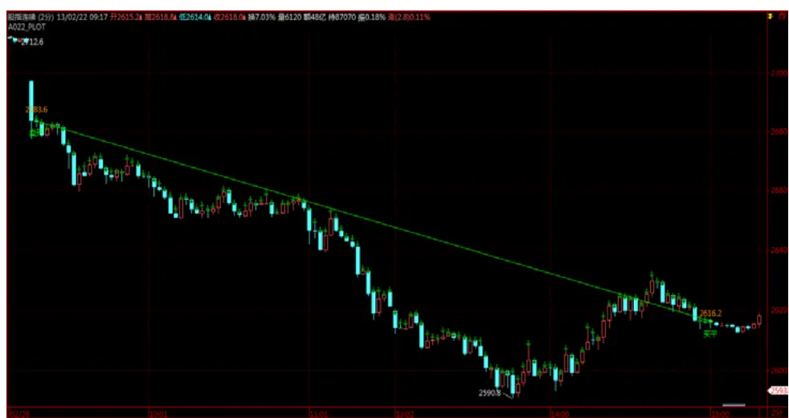
数据来源：广发证券发展研究中心

图12：策略空头信号案例
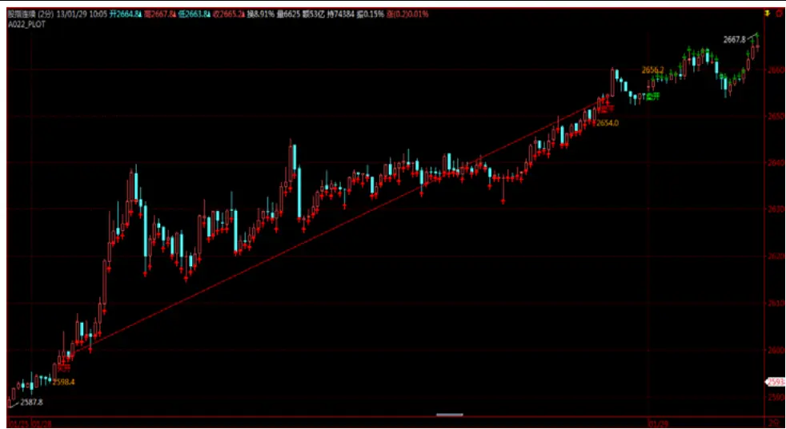
数据来源：广发证券发展研究中心

## 三、总结

（1）日内交易策略盛行，突破反转模式占主导地位。虽然股指期货上市至今已经近3年时间，但持仓量占成交量的比重依然很低，为一成略多，日内交易者众多，众多机构投资者已经涉水或者正在试探性策略运行。日内交易策略中突破反转模式策略占主导地位，根据过往日线价格数据计算下一个交易日需要观察的若干点位，结合当日盘中走势定义上突破、下突破、上反转、下反转四种模式，如R-Bearker、Dual Thrust等。

（2）基于遗传算法寻找最佳区间突破策略。根据以往的跟踪研究，R-Bearker等策略目前已经阶段性失效，在2012年表现差强人意。这类策略的关键在于如何定义上下突破观察价位，我们利用历史日线数据定义9个自变量，以此构建区间宽度的线性函数，在当日开盘价基础上上浮区间宽度量为上突破价位，下浮等量为下突破价位，线性函数的获取利用遗传算法工具，并以收益最大化为优化目标。

（3）策略样本外表现稳定。以2010年4月16日至2011年12月31日为样本内，当月合约2分钟数据，单边万分之0.3的手续费，单边0.4个指数点的冲击成本，策略全样本取得了130%的累计收益率，胜率52%，赔率1.34倍，属于胜率偏高、赔率偏低的策略，从交易次数来看，2011年、2012年分别交易了213次、222次，大概每天一次，分年度来看，2010、2011、2012年化收益率分别为46%、38%、25%，各年度胜率率稳定在45%~50%之间，赔率稳定在1.3~1.5倍左右。

## 风险提示

策略模型并非百分百有效，市场结构及交易行为的改变或者交易参与者的增多有可能使得策略失效。

## 附录:遗传算法简介

遗传算法于1975年由密西根大学John Holland提出，是一种建立在自然选择和进化进程概念基础上的非导数随机优化方法。

遗传算法相比于基于导数的优化方法（比如最速下降法，前文中ANFIS模型我们正是利用了最速下降法、最小二乘法并行的一种混合算法来优化参数）有如下特点：

直观意义：参数优化过程类似于物种的进化繁衍，在初始化一个参数群体后通过交换变异等遗传算子进化参数群体，若干次进化后得到最优解。

灵活性：传统模型将模型输出与实际输出之均方误差为最小化目标，但遗传算法可以优化任意目标函数，目标函数甚至可以是择时准确率、交易策略收益率、收益稳定性等等，可以对买卖信号触发模型参数以及资金管理参数（如仓位、加减仓参数等资金管理范畴的参数）进行整体优化。

速度慢：遗传算法通过对目标函数重复求值寻优，如果以策略收益为目标函数则需要对样本进行重复计算买卖信号并基于此信号模拟交易，目标函数中就包含很多层循环计算，导致速度较慢，但这样复杂的目标函数是基于导数的优化方法所无法解决的。

随机性：虽然适应度高的个体有更大的机会参与交换计算，但这种机会是带有随机性，因此整个参数种群的更新是具有随机性的，也正是这种随机性才保证了更可能找到最优解而不是局域解。

遗传算法主要包含五个部分：编码方案、适应度计算、父代选择、交换算子、变异算子。

编码方案：编码将参数空间中的点（个体）转换成位串来表示。例如三位空间中的点（11, 6, 9）进行二进制编码得到：

$$
\frac{\boxed{1011}}{11}\boxed{\frac{0110}{6}}\boxed{\frac{1001}{9}}
$$

对于浮点数、负数等可对方案进行一定调整进行编码，编码方案提供了一种参数空间中的个体转化为遗传框架下的一种方式，对遗传算法的性能起到决定性作用。

适应度计算：得到初始化参数群体后，对于群体中的个体（参数空间中的一个点）计算其适应度值，表示个体在当前环境下的适应度，适应度高的个体能够更有机会生存下去。对于最大化问题，每个个体的适应度通常是个体的目标函数数值，对于负数可以采用某种单调变换转为正数。

选择算子：得到每个个体的适应度后，就要决定选择哪些个体来参与下一代生成，通常适应度高的个体应该更有机会参与，也就是优良的品种应该更能参与物种更新以便遗传其优良性，一般使用与个体适应度值成正比的选择概率来随机选择个体，如选择概率为：

$$
p_{i}=f_{i}{\Big/}\sum_{i=1}^{n}f_{i}~,~i=1,\cdots,n
$$

其中 $p_{i}$ 为选择概率， $f_{i}$ 为个体适应度， n为群体大小。

交换算子：选择了参与生成下一代的个体后，利用交换算子生成新个体，并希望新个体能够保存上一代的优良特征。首先根据一定的交换率来对个体配对，若采用单点交换算子，那么对个体编码随机设置一个交换点，两个父代在交换点处互换染色体得到新一代，交换算子类似于自然界中物种交配现象，父代将自身染色体中的某一段遗传给下一代。

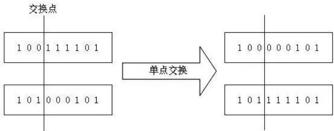

变异算子：对由交换算子得到的新一代依非常小的变异概率对某一位进行突变，变异算子的作用一方面在于当父代不包含目标函数最优解信息时，则任意次群体更新后可能都不会产生满意结果，此时变异算子将引入新信息来更新群体，另一方面变异算子也会防止群体落入局部最优解区域内。

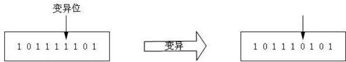

综上所述，初始化群体后，对其中个体依次计算适应度值，依适应度选择个体参与下一代生成，利用交换算子生成新一代，利用变异算子对新生代变异得到新群体。

## 广发金融工程研究小组

罗军： 首席分析师，华南理工大学理学硕士，2010年进入广发证券发展研究中心。

俞文冰： 首席分析师，CFA，上海财经大学统计学硕士，2012年进入广发证券发展研究中心。

叶 涛： 资深分析师，CFA ，上海交通大学管理科学与工程硕士，2012 年进入广发证券发展研究中心。

安宁宁： 资深分析师，暨南大学数量经济学硕士，2011年进入广发证券发展研究中心。

胡海涛： 分析师， 华南理工大学理学硕士， 2010年进入广发证券发展研究中心。

夏潇阳： 分析师， 上海交通大学金融工程硕士， 2012年进入广发证券发展研究中心。

汪 鑫： 分析师， 中国科学技术大学金融工程硕士， 2012年进入广发证券发展研究中心。

蓝昭钦： 分析师， 中山大学理学硕士， 2010年进入广发证券发展研究中心。

史庆盛： 研究助理， 华南理工大学金融工程硕士， 2011年进入广发证券发展研究中心。

张 超： 研究助理， 中山大学理学硕士，2012年进入广发证券发展研究中心。

## 广发证券—行业投资评级说明

买入： 预期未来12个月内，股价表现强于大盘10%以上。

持有： 预期未来12个月内，股价相对大盘的变动幅度介于-10%～+10%。

卖出： 预期未来12个月内，股价表现弱于大盘10%以上。

## 广发证券—公司投资评级说明

买入： 预期未来12个月内，股价表现强于大盘15%以上。

谨慎增持： 预期未来12个月内，股价表现强于大盘5%-15%。

持有： 预期未来12个月内，股价相对大盘的变动幅度介于-5%～+5%。

卖出： 预期未来12个月内，股价表现弱于大盘5%以上。

## 联系我们

|  | 广州市 | 深圳市 | 北京市 | 上海市 |
| --- | --- | --- | --- | --- |
| 地址 | 广州市天河北路183号 大都会广场5楼 | 深圳市福田区金田路4018 号安联大厦 15 楼 A 座 | 北京市西城区月坛北街2号 月坛大厦18层 | 上海市浦东新区富城路99号 |
|  |  | 03-04 |  | 震旦大厦18楼 |
| 邮政编码 | 510075 | 518026 | 100045 | 200120 |
| 客服邮箱 | gfyf@gf.com.cn |  |  |  |
| 服务热线 | 020-87555888-8612 |  |  |  |

## 免责声明

广发证券股份有限公司具备证券投资咨询业务资格。本报告只发送给广发证券重点客户，不对外公开发布。

本报告所载资料的来源及观点的出处皆被广发证券股份有限公司认为可靠，但广发证券不对其准确性或完整性做出任何保证。报告内容仅供参考，报告中的信息或所表达观点不构成所涉证券买卖的出价或询价。广发证券不对因使用本报告的内容而引致的损失承担任何责任，除非法律法规有明确规定。客户不应以本报告取代其独立判断或仅根据本报告做出决策。

广发证券可发出其它与本报告所载信息不一致及有不同结论的报告。本报告反映研究人员的不同观点、见解及分析方法，并不代表广发证券或其附属机构的立场。报告所载资料、意见及推测仅反映研究人员于发出本报告当日的判断，可随时更改且不予通告。

本报告旨在发送给广发证券的特定客户及其它专业人士。未经广发证券事先书面许可，任何机构或个人不得以任何形式翻版、复制、刊登、转载和引用，否则由此造成的一切不良后果及法律责任由私自翻版、复制、刊登、转载和引用者承担。