## 日内突破模式及其资金管理的多重比较研究

## 另类交易策略系列之十一

## 报告摘要：

## 开盘区间突破策略

所谓开盘区间突破（Opening Range Breakout），当日开盘价的基础上加上一个区间宽度值得到上突破价，减去区间宽度值得到下突破价，当日市场向上突破即做多，下突破即做空。

区间宽度计算列举三类，A1：开盘价×f；A2：波动区间均值（avgTrueRange）×f；A3：Dual Thrust 定义的区间变量 DRange×f。

在出场方式而言的资金管理方面，列举 3种模式分别为，B1：固定比例 r 止损，否则收盘平仓；B2：固定比例 r 止损，当浮动收益大于 1倍 r时，将止损点移至成本价，否则收盘平仓；B3：固定比例 r止损，当价格创开仓以来有利方向新高或新低时立即移动止损点。

不同区间计算方式及出场方式形成 9 个策略，分别考察以择优。

## 全样本最优参数策略表现

三类区间宽度计算模式下f参数大致分别为0.145、0.3~0.5、0.15~0.2，止损参数 r在不止盈情况下约为 0.3%~0.4%，跟踪止盈下约 0.8%。区间宽度计算 A2、A3模式显著好于 A1；DT05策略（A2+B2模式）及 DT08 策略（A3+B2）模式策略最优，历史各年度年化收益率维持在 20%左右。交易次数方面，各策略日均交易次数均小于 1；胜率方面，各策略的胜率在 30%至 50%之间，并且跟踪止盈下的胜率显著高于非跟踪止盈策略；赔率方面，各策略的赔率在 1.5 倍至 4 倍之间，并且止盈下的赔率显著低于非止盈策略。

## 分样本内外下策略表现

以 2010 至 2011 为样本内，其余为样本外，DT01、DT02、DT03 策略参数几乎没有变化，其余 6 个策略区间比例参数f变化在 0.05 以内，止损参数 r 变化在 0.1%以内，总体参数变化不大。A3 区间宽度计算模式下策略累计收益率显著高于其他策略，样本外表现较好；交易次数、胜率、赔率等指标相比较全样本最优参数下的结果变化不大，样本外最大回撤在-5%至-8%。

## 区间宽度模式及出场方式取舍

兼顾考虑全样本及分样本内外的实证结果，A3模式 DRange计算的开盘区间突破策略表现最优；B2移动止损点至成本价方式是可取的，较固定止损恒定不变情况有显著的改善，但是跟踪止盈方式并没有明显提升策略收益。

图 1各策略全样本最优收益率曲线
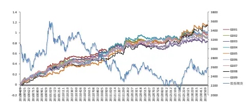

图 2 DT08策略参数敏感性
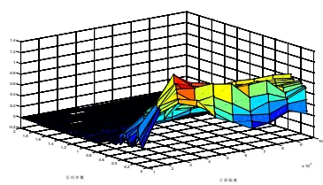

分析师： 安宁宁 S0260512020003

0755-23948352

ann@gf.com.cn

## 相关研究：

| 另类交易策略系列之十：基2013-02-26 于遗传算法的期指日内交 |
| --- |
| 易系统 另类交易策略系列之九：基2012-09-16 |
| 于遗传规划的智能交易策 略方法 |
| 另类交易策略系列之八：基 2012-09-03 |
| 于时域分形的相似性匹配 日内低频交易策略（SMT） |
| 另类交易策略系列之七：在2012-07-09 |
| 标度不变性破缺下洞察资 |
| 金流向——MFT交易策略 |
| 另类交易策略系列之六:基2012-07-09 于GFTD 的期指日内程序 |

另类交易策略系列之五：基 2012-03-14
于缠中说禅之分型通道趋
势交易系统

## 一、期指日内交易概括

## （一）日内交易策略盛行

沪深300指数期货自2010年4月16日上市以来，已经运行了3年多的时间，期初由于机构投资者较少，日内交易大行其道，隔夜持仓量占全部成交量的比重非常之低，随着机构准入的放行，这一状况得到一定的改变，但截至到目前为止，持仓量占成交量比重仍然仅为一成左右（如图1），市场上充斥着大量的日内交易者，日内交易策略仍大行其道。

需要指出的是目前日内交易者已经不局限于民间资金行为，大量机构投资者已经进入市场或者准备进入市场进行搏杀，其中包括基金公司的专户部门，并且已经存在取得优异成绩的案例。

日内交易策略相比于隔夜交易策略有着天然的优势，其一是策略风险较小，当日了结头寸，不承受隔日风险，其二是对交易系统的要求较低，隔夜头寸在系统化交易管理方面相对较为复杂，正是这些优势使得日内交易成为主流的期货交易策略方式。

图1：沪深300指数期货当月合约持仓量占成交量比重
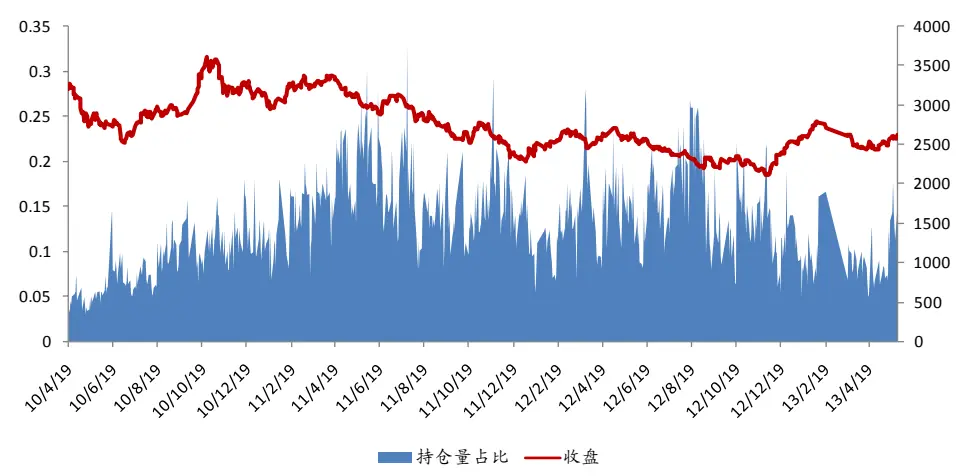
数据来源：广发证券发展研究中心

## （二）日内突破反转模式

虽然大家的日内交易策略方法不尽相同，但是日内突破反转模式绝对是使用最多的一类策略，国外CTA策略中也存在着大量成功的突破反转模式策略，这些策略可以直接借鉴应用。

下面我们来看一下这类策略的基本逻辑，基于日K线数据，包括昨日开高价、昨日最低价、昨日收盘价等数据计算得到日一个交易日我们需要观察的6个价位，并结合当日的股指走势定义两类四种模式，分别是上突破、下突破、上反转、下反转，如图2所示。

其背后的逻辑便是，如果价格向上突破最高一个价位，认为突破形成，进场做多跟随趋势，如果股指只达到第二个价位并且拐头向下跌破第三个价位，则认为向下反转形成，进场做空，下突破与上反转逻辑类似。

大家所熟悉的R-Bearker、Dual Thrust便是类似逻辑，只是在具体的观察价位的计算上不同罢了。

图2：日内交易策略突破反转模式基本原理
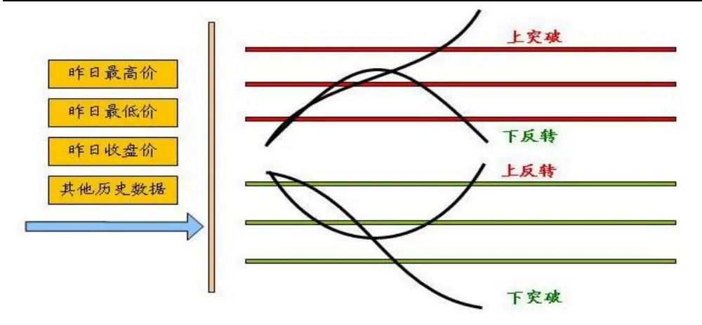
数据来源：广发证券发展研究中心

## 二、多重可比交易策略

## （一）开盘区间突破策略

突破策略相比较而言是应用更为广泛的交易策略，顺势而为的理念深入人心，所谓区间突破策略，即当下一个交易日股指突破某一个价位时进场做多，跌破某一个价位时做空，而在定义区间突破点位时，比较经典的做法是开盘区间突破（Opening Range Breakout）方法，在当日开盘价的基础上加上一个区间宽度值得到上突破价，减去区间宽度值得到下突破价，如图3。

图3：开盘区间突破模式
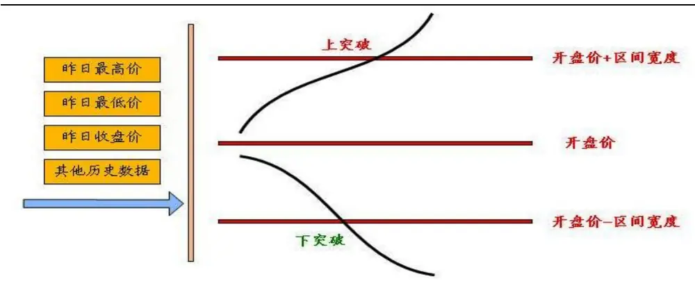
数据来源：广发证券发展研究中心

在不考虑特殊K线模式信息下，开盘区间宽度的定义应该对称相等，即开盘价上移的区间宽度等于下移的区间宽度。本文所谓的多重比较首先体现在区间宽度的计算上，主要分为以下三种方法：

（1） 开盘价×比例参数f，即上下边界=开盘价×（1±f）。

（2） 波动区间均值（avgTrueRange）×比例参数f，即上下边界=开盘价±波动区间均值×f。

其中波动区间均值的金字塔决策交易系统计算代码如下，即真实高价与真实低价差值的10日移动均值。

trueHigh:if(ref(c,2)>ref (h,1),ref(c,2),ref(h,1)); 
trueLow:if (ref (c,2) <ref(1,1),ref(c,2),ref(1,1)); 
trueRange:TrueHigh-TrueLow; 
avgTrueRange:ma (TrueRange, 10) ;

（3） Drange×比例参数f，即上下边界=开盘价±Drange×f。
其中Drange计算的金字塔决策交易系统代码如下。

HH:=hhv(ref(h,1), 5); 
LL:=11v(ref(1,1), 5); 
LC:=11v(ref(c,1), 5) ; 
HC:=hhv(ref(c,1), 5); 
tRange:max (HH-LC, HC-LL) ;

## （二）多种止损止盈出场机制

众所周知，不同策略在不同的出场机制下可能结果完全不同，因此我们在考虑不同开盘区间突破模式时进一步考虑不同的出场方式，我们考虑三种不同的止损止盈出场方式：

（1） 固定比例r止损，否则收盘平仓。

（2） 固定比例r止损，当浮动收益大于1倍r时，将止损点移至成本价，否则收盘平仓。

（3） 固定比例r止损，当价格创开仓以来有利方向新高或新低时立即移动止损点，否则收盘平仓。

我们将比较不同出场方式下各策略的表现情况，分别讨论各策略优略以及资金管理方式的影响效应。

## （三）9个不同策略的定义及解释

以上讨论的三种不同的区间宽度计算方式、三种不同的出场方式可以组合成9只策略，如下表。

我们将分别对每一个策略进行全样本优化参数、分样本内外优化参数，比较不同样本，不同参数下策略的表现情况，考察哪一种区间计算方式最优，考察移动止损点至成本价的方式是否能够改善策略表现，考察跟踪止盈的机制会不会带来比较显著的收益。

表1：9个策略编号及其定义

| 策略编号 区间边界 出场方式 |  |  |
| --- | --- | --- |
| DT01 | 开盘价±开盘价×比例参数f | 固定幅度r止损 |
| DT02 | 开盘价±开盘价×比例参数f | r止损，盈利超过r时止损点移至成本价机制 |
| DT03 | 开盘价±开盘价×比例参数f | r止损，跟踪止盈 |

识别风险，发现价值

| DT04 | 开盘价±avgTrueRange×比例参数f | 固定幅度r止损 |
| --- | --- | --- |
| DT05 | 开盘价±avgTrueRange×比例参数f | r止损，盈利超过r时止损点移至成本价机制 |
| DT06 | 开盘价±avgTrueRange×比例参数f | r止损，跟踪止盈 |
| DT07 | 开盘价±DRange×比例参数f | 固定幅度r止损 |
| DT08 | 开盘价±DRange×比例参数f | r止损，盈利超过r时止损点移至成本价机制 |
| DT09 | 开盘价±DRange×比例参数f | r止损，跟踪止盈 |

数据来源：广发证券发展研究中心

## 三、全局优化下策略表现

## （一）实证说明

（1）数据选取，本实证选取股指期货当月合约自2010年4月16日至2013年5月24的2分钟K线。

## （2）策略评价方法

策略评价指标我们选取如下表，这里需要说明的是，经验来看，趋势投机策略在严格止损的机制下胜率一般很难超过40%，但赔率一般要大，靠亏小赚大盈利。

表2：交易策略评价体系

| 考察指标 | 说明 |
| --- | --- |
| 累计收益率 | 模拟交易期末累计收益率 |
| 交易总次数 | 总交易次数（自开仓至平仓为一个完整的交易周期） |
| 获胜次数 | 单次交易收益率大于0的次数 |
| 失败次数 | 单次交易收益率小于0的次数 |
| 胜率 | 获胜次数/交易总次数×100% |
| 单次获胜收益率 | 获胜交易的收益率算术平均值 |
| 单次失败亏损率 | 失败交易的收益率算术平均值 |
| 赔率 | 单次获胜平均收益率除以单次失败平均亏损率的绝对值 |
| 最大回撤 | 模拟交易资金自最高点缩水的最大幅度 |
| 最大连胜次数 | 最大连续收益率大于0的交易次数 |
| 最大连亏次数 | 最大连续收益率小于0的交易次数 |

数据来源：广发证券发展研究中心

## （3）模拟交易情景

记 $F_{1}$ 为开仓成交价， $F_{2}$ 为平仓成交价， c为单边手续费率， I 为单边冲击成本， M 为杠杆倍数，则单次交易收益率为

$$
r_{long}=\left[\frac{\big(F_{2}-I\big)\times\big(1-c\big)-\big(F_{1}+I\big)\times\big(1+c\big)}{\big(F_{1}+I\big)\times\big(1+c\big)}\right]\times M
$$

$$
r_{short}=\left[\frac{\big(F_{\scriptscriptstyle1}-I\big)\times\big(1-c\big)-\big(F_{\scriptscriptstyle2}+I\big)\times\big(1+c\big)}{\big(F_{\scriptscriptstyle1}-I\big)\times\big(1+c\big)}\right]\times M
$$

此处模拟交易相关设定为：

手续 费：万分之零点三；

冲击成本：0.4个指数点；

杠杆倍数：1；

开仓价格: 信号发生后第1根K线开盘价；

平仓价格: 止损价或者时间平仓价。

## （二）实证结果

首先以全样本累计收益率最大化为目标优化参数，所有9个策略都只有2个参数，分别为区间比例参数 f 和止损幅度 r。

每个策略优化取累计收益率最优的依次10组参数为最优参数空间，对其计算平均值作为最优参数，如表3，同时表4给出了9个策略全样本下最优参数空间，我们发现，

（1）DT01、DT02、DT03对参数 f（区间比例参数）并不敏感，同时止损参数在不止盈的情况下均为0.4%，在跟踪止盈下为0.9%，显然如果要止盈的话，应该将跟踪幅度加大，从而降低盘中波动出局的机率。

（2）DT04、DT05、DT06的区间比例参数最优值在0.3至0.5之间，也就是说开盘上下区间的宽度应该是波动区间均值变量的0.3~0.5倍，不止赢的情况下止损参数为0.37%，同时我们也发现了类似上一点的结论，即跟踪止盈下的参数r会更大一些，在0.87%。

（3）DT07、DT08、DT09的区间比例参数在0.15~0.2左右，不止赢情况下参数r为0.35%左右，跟踪止盈下r应该加到0.77%。

表3：全样本最优参数

| 策略编号 最优参数（f,r） |  | 最优参数均值 |  | 策略编号 | 最优参数（f,r） 最优参数均值 |  |  |  |  |
| --- | --- | --- | --- | --- | --- | --- | --- | --- | --- |
| DT01 | (0.01,0.004) |  |  |  | (0.01,0.004) | (0.0145,0.004) |  |  |  |
|  | (0.011,0.004) |  |  |  | (0.011,0.004) |  |  |  |  |
|  | (0.012,0.004) |  |  |  | (0.012,0.004) |  |  |  |  |
|  | (0.013,0.004) |  |  |  |  |  | (0.013,0.004) |  |  |
|  | (0.014,0.004) | (0.0145,0.004) |  | DT02 | (0.014,0.004) |  |  |  |  |
|  | (0.015,0.004) |  |  |  | (0.015,0.004) |  |  |  |  |
|  | (0.016,0.004) |  |  |  |  |  |  |  | (0.016,0.004) |
|  | (0.017,0.004) | (0.017,0.004) |  |  |  |  |  |  |  |
|  | (0.018,0.004) | (0.018,0.004) |  |  |  |  |  |  |  |
|  | (0.019,0.004) | (0.019,0.004) |  |  |  |  |  |  |  |
| DT03 | (0.01,0.009) |  |  |  | (0.34,0.003) | (0.392,0.0037) |  |  |  |
|  | (0.011,0.009) |  |  |  | (0.32,0.003) |  |  |  |  |
|  | (0.012,0.009) |  |  |  | (0.36,0.003) |  |  |  |  |
|  | (0.013,0.009) |  |  |  | (0.34,0.004) |  |  |  |  |
|  | (0.014,0.009) | (0.0145,0.009) |  |  |  |  |  |  |  |
|  |  |  |  |  |  |  |  | DT04 | (0.36,0.004) |
|  | (0.015,0.009) | (0.38,0.003) |  |  |  |  |  |  |  |
|  | (0.016,0.009) |  | (0.48,0.005) |  |  |  |  |  |  |
|  | (0.017,0.009) |  | (0.4,0.003) |  |  |  |  |  |  |
|  | (0.018,0.009) | (0.44,0.004) |  |  |  |  |  |  |  |
|  | (0.019,0.009) | (0.5,0.005) |  |  |  |  |  |  |  |

识别风险，发现价值

| DT05 | (0.32,0.003) |  |  | (0.44,0.01) | (0.454,0.0087) |  |
| --- | --- | --- | --- | --- | --- | --- |
|  | (0.34,0.003) |  |  | (0.44,0.009) |  |  |
|  | (0.36,0.003) |  |  |  |  | (0.4,0.009) |
|  | (0.34,0.004) |  |  | (0.54,0.005) |  |  |
|  | (0.36,0.004) | (0.34,0.0037) | DT06 | (0.44,0.008) |  |  |
|  | (0.3,0.003) |  |  | (0.52,0.009) |  |  |
|  | (0.14,0.003) |  |  |  |  | (0.5,0.009) |
|  | (0.44,0.005) |  |  | (0.4,0.01) |  |  |
|  | (0.48,0.005) |  |  | (0.4,0.008) |  |  |
|  | (0.32,0.004) |  |  | (0.46,0.01) |  |  |
| DT07 | (0.18,0.003) |  |  | (0.18,0.003) | (0.178,0.0036) |  |
|  | (0.26,0.004) |  |  | (0.16,0.003) |  |  |
|  | (0.22,0.003) |  |  | (0.2,0.003) |  |  |
|  | (0.24,0.003) |  |  | (0.14,0.003) |  |  |
|  | (0.14,0.003) | (0.218,0.0034) | DT08 | (0.18,0.004) |  |  |
|  | (0.16,0.003) |  |  | (0.16,0.004) |  |  |
|  | (0.26,0.003) |  |  | (0.14,0.005) |  |  |
|  | (0.3,0.004) |  |  | (0.22,0.003) |  |  |
|  | (0.14,0.004) |  |  | (0.14,0.004) |  |  |
|  | (0.28,0.004) |  |  | (0.26,0.004) |  |  |
| DT09 | (0.16,0.01) | (0.158,0.0077) |  |  |  |  |
|  | (0.16,0.009) |  |  |  |  |  |
|  | (0.14,0.01) |  |  |  |  |  |
|  | (0.16,0.007) |  |  |  |  |  |
|  | (0.16,0.008) |  |  |  |  |  |
|  | (0.14,0.005) |  |  |  |  |  |
|  | (0.14,0.009) |  |  |  |  |  |
|  | (0.18,0.009) |  |  |  |  |  |
|  | (0.16,0.005) |  |  |  |  |  |
|  | (0.18,0.005) |  |  |  |  |  |

数据来源：广发证券发展研究中心

表4：9个策略最优参数空间
<table><tr><td>GT01</td><td>GT02</td></tr><tr><td>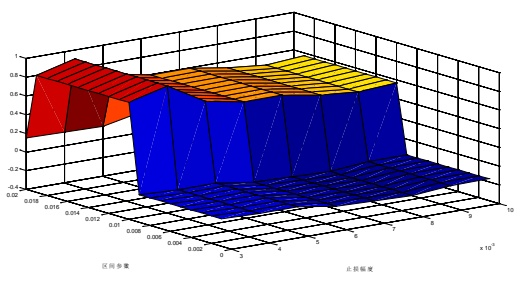</td><td>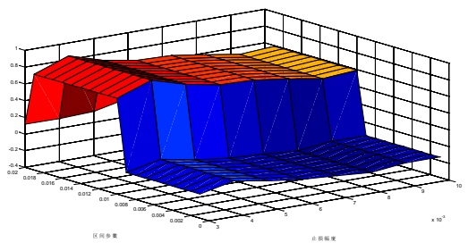</td></tr></table>

识别风险，发现价值

<table><tr><td>GT03</td><td>GT04</td></tr><tr><td>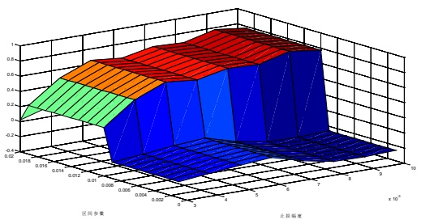</td><td>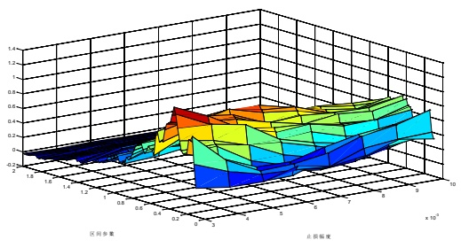</td></tr><tr><td>GT05</td><td>GT06</td></tr><tr><td>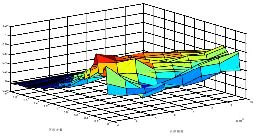</td><td>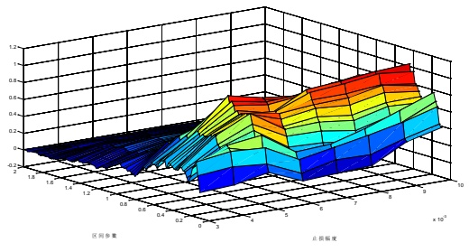</td></tr><tr><td>GT07</td><td>GT08</td></tr><tr><td>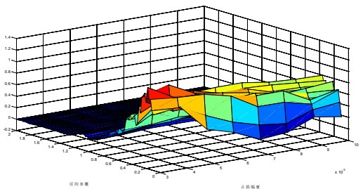</td><td>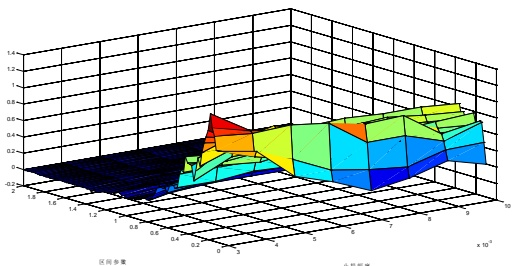</td></tr><tr><td>GT09</td><td></td></tr><tr><td>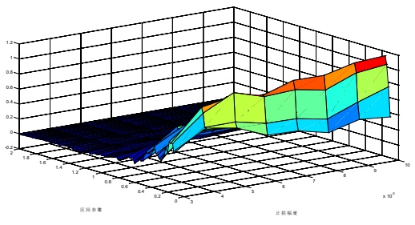</td><td></td></tr></table>

数据来源：广发证券发展研究中心

最优参数定下来之后我们来进一步考察策略的收益及其交易特征。

（1）三种方法计算区间宽度下策略累计收益率在过去三年大概在1倍左右，同时可以看到用avgTrueRange和DRange两个变量情况，累计收益显著好于第一种情况。

（2）9个策略分年度的收益基本呈逐年递减趋势，这与市场共识是一致的，股指期货上市之初恰逢大盘剧烈波动，且此类交易策略的普及程度较低，竞争不大因此收益较高，随着股指波动幅度的降低以及更多人使用这一类型策略导致收益降低。另一方面我们也可以看到DT05以及DT08两个策略表现稍好，DT05策略收益虽呈逐年递减趋势但仍然可观，年化收益率仍然维持在20%左右，DT06的年化收益率在2011、2012、2013呈小幅上升趋势，维持在20%以上。

（3）从交易次数角度来看，各策略日均交易次数均小于1，也就是说策略每天平均交易不超过1次。

（4）从胜率来看，各策略的胜率在30%至50%之间，并且跟踪止盈下的胜率显著高于非跟踪止盈策略。

（5）从赔率来看，各策略的赔率在1.5倍至4倍之间，并且止盈下的赔率显著低于非止盈策略。

图4：全样本最优参数下各策略累计收益率曲线
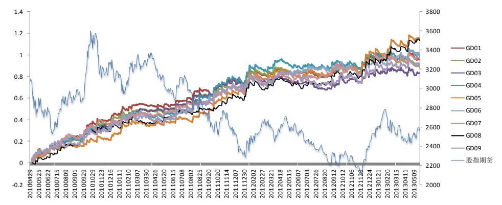
数据来源：广发证券发展研究中心

图5：全样本最优参数下各策略分年度的收益情况
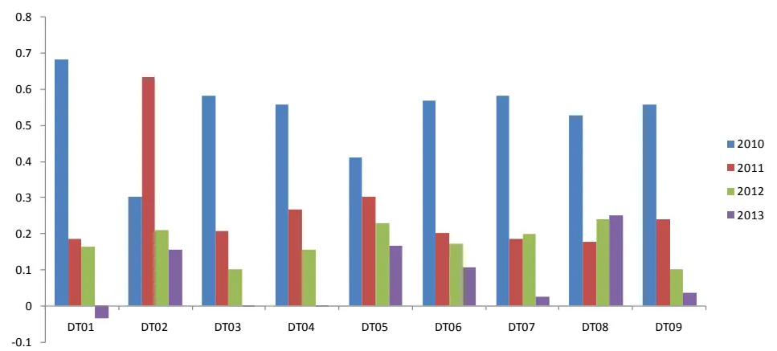
数据来源：广发证券发展研究中心

表5：全样本最优参数下各策略交易特征

| 策略编号 | 累计收益率 交易次数 |  | 日均次数 胜率 赔率 最大回撤 |  |  |  |
| --- | --- | --- | --- | --- | --- | --- |
| DT01 | 96.11% | 438 | 0.59 | 38% | 2.63 | -4.49% |
| DT02 | 89.88% | 438 | 0.59 | 35% | 3.13 | -5.75% |
| DT03 | 83.00% | 438 | 0.59 | 46% | 1.73 | -8.07% |
| DT04 | 98.83% | 591 | 0.80 | 33% | 3.13 | -4.79% |
| DT05 | 113.89% | 677 | 0.91 | 28% | 4.04 | -4.34% |
| DT06 | 99.74% | 517 | 0.70 | 48% | 1.69 | -7.03% |
| DT07 | 96.76% | 572 | 0.77 | 32% | 3.29 | -5.47% |
| DT08 | 112.83% | 658 | 0.89 | 28% | 4.15 | -5.74% |

识别风险，发现价值

| DT09 | 87.84% | 721 | 0.97 | 42% | 1.85 | -7.50% |
| --- | --- | --- | --- | --- | --- | --- |

数据来源：广发证券发展研究中心

## 四、分样本内外下的策略表现

## （一）实证说明

数据选取，本实证选取股指期货当月合约自2010年4月16日至2011年12月31的2分钟K线，为样本内，进行参数优化，其余部分为样本外。

## （二）实证结果

首先以样本内累计收益率最大化为目标优化参数，所有9个策略都只有2个参数，分别为区间比例参数f和止损幅度r。

每个策略优化取累计收益率最优的依次10组参数为最优参数空间，对其计算平均值作为最优参数，如下表。

表6：分样本内外下各策略最优化参数结果

| 策略编号 | 最优参数（f,r） | 最优参数均值 | 策略编号 | 最优参数（f,r） | 最优参数均值 |  |
| --- | --- | --- | --- | --- | --- | --- |
| DT01 | (0.01,0.004) |  |  | (0.01,0.004) | (0.0145,0.004) |  |
|  | (0.011,0.004) |  |  |  |  | (0.011,0.004) |
|  | (0.012,0.004) |  |  |  |  | (0.012,0.004) |
|  | (0.013,0.004) |  |  |  |  | (0.013,0.004) |
|  | (0.014,0.004) | (0.0145,0.004) | DT02 |  |  | (0.014,0.004) |
|  | (0.015,0.004) |  |  | (0.015,0.004) |  |  |
|  | (0.016,0.004) |  |  | (0.016,0.004) |  |  |
|  | (0.017,0.004) |  |  | (0.017,0.004) |  |  |
|  | (0.018,0.004) |  |  | (0.018,0.004) |  |  |
|  | (0.019,0.004) |  |  | (0.019,0.004) |  |  |
| DT03 | (0.01,0.01) |  |  | (0.14,0.003) | (0.318,0.0035) |  |
|  | (0.011,0.01) |  |  | (0.34,0.003) |  |  |
|  | (0.012,0.01) |  |  | (0.18,0.003) |  |  |
|  | (0.013,0.01) |  |  | (0.4,0.004) |  |  |
|  | (0.014,0.01) | (0.0145,0.01) | DT04 | (0.44,0.005) |  |  |
|  | (0.015,0.01) |  |  | (0.38,0.003) |  |  |
|  | (0.016,0.01) |  |  | (0.4,0.003) |  |  |
|  | (0.017,0.01) |  |  | (0.42,0.005) |  |  |
|  | (0.018,0.01) |  |  | (0.16,0.003) |  |  |
|  | (0.019,0.01) |  |  | (0.32,0.003) |  |  |
| DT05 | (0.14,0.003) | (0.31,0.0038) | DT06 | (0.44,0.01) | (0.486,0.0097) |  |
|  | (0.18,0.003) |  |  | (0.54,0.01) |  |  |
|  | (0.24,0.003) |  |  | (0.5,0.01) |  |  |
|  | (0.48,0.005) |  |  | (0.48,0.01) |  |  |
|  | (0.22,0.003) |  |  | (0.52,0.01) |  |  |

识别风险，发现价值

|  | (0.16,0.003) |  |  | (0.54,0.009) |  |  |  |
| --- | --- | --- | --- | --- | --- | --- | --- |
|  | (0.32,0.003) |  |  |  |  |  | (0.46,0.01) |
|  | (0.44,0.005) |  |  |  |  | (0.42,0.01) |  |
|  | (0.52,0.006) |  |  | (0.52,0.009) |  |  |  |
|  | (0.4,0.004) |  |  | (0.44,0.009) |  |  |  |
| DT07 | (0.1,0.004) |  |  | (0.14,0.004) | (0.152,0.0037) |  |  |
|  | (0.14,0.004) |  |  | (0.1,0.003) |  |  |  |
|  | (0.14,0.003) |  |  | (0.12,0.003) |  |  |  |
|  | (0.22,0.003) |  |  | (0.1,0.004) |  |  |  |
|  | (0.26,0.004) | (0.164,0.0035) | DT08 | (0.14,0.003) |  |  |  |
|  | (0.1,0.003) |  |  |  |  | (0.14,0.005) |  |
|  | (0.24,0.003) |  |  |  |  | (0.14,0.006) |  |
|  | (0.12,0.003) |  |  | (0.18,0.003) |  |  |  |
|  | (0.18,0.003) |  |  | (0.22,0.003) |  |  |  |
|  | (0.14,0.005) |  |  | (0.24,0.003) |  |  |  |
| DT09 | (0.14,0.01) | (0.162,0.0089) |  |  |  |  |  |
|  | (0.16,0.01) |  |  |  |  |  |  |
|  | (0.16,0.009) |  |  |  |  |  |  |
|  | (0.14,0.009) |  |  |  |  |  |  |
|  | (0.16,0.007) |  |  |  |  |  |  |
|  | (0.22,0.01) |  |  |  |  |  |  |
|  | (0.12,0.01) |  |  |  |  |  |  |
|  | (0.14,0.007) |  |  |  |  |  |  |
|  | (0.22,0.009) |  |  |  |  |  |  |
|  | (0.16,0.008) |  |  |  |  |  |  |

数据来源：广发证券发展研究中心

表7：分样本内外下各策略最优参数空间
<table><tr><td>GT01</td><td>GT02</td></tr><tr><td>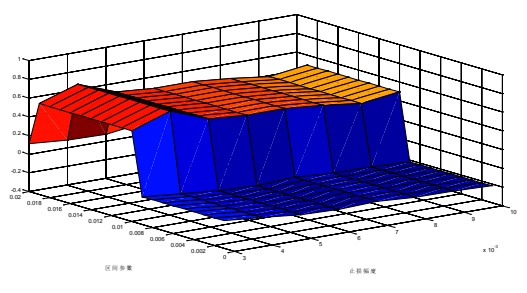</td><td>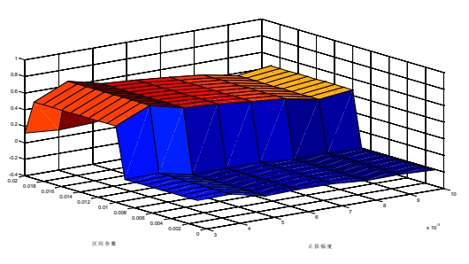</td></tr><tr><td>GT03</td><td>GT04</td></tr><tr><td>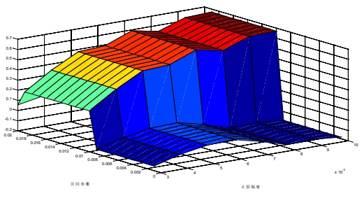</td><td>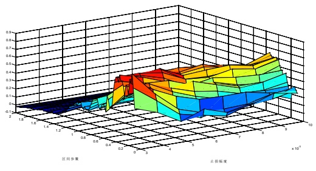</td></tr><tr><td>GT05</td><td>GT06</td></tr><tr><td>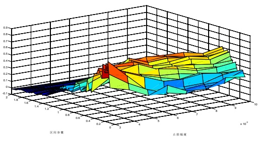</td><td>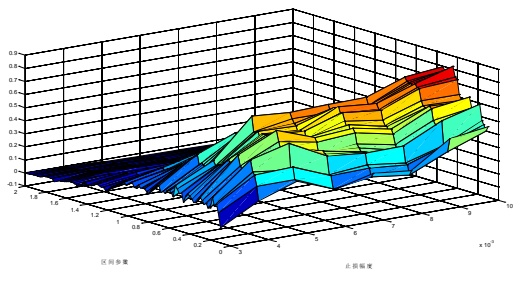</td></tr><tr><td>GT07</td><td>GT08</td></tr><tr><td>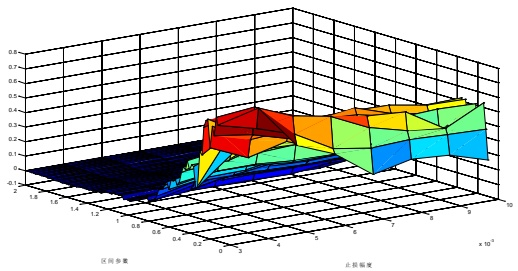</td><td>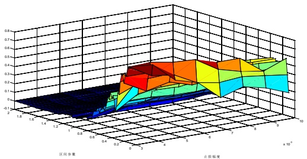</td></tr><tr><td>GT09</td><td></td></tr></table>

数据来源：广发证券发展研究中心

接来下我们比较一下分样本内外的最优参数与全样本最优参数，可以看到DT01、DT02、DT03策略参数几乎没有变化，DT04、DT05、DT06的区间比例参数 f 变化在0.05以内，止损参数r变化在0.1%以内，DT07、DT08、DT09的区间比例参数 f变化也在0.05以内，止损参数r变化在0.1%附近。另外分样本内外情况下也存在如下特点，止盈情况下的参数r显著高于非止盈情况，也就是说策略加止盈的话，跟踪止盈的幅度应该加大以降低盘中市场反向波动从而离场的概率。

表8：分样本内外最优参数与全样本最优参数对比

| 策略编号 | 全样本最优参数f | 样本内最优参数f | 全样本最优参数 r | 样本内最优参数r |
| --- | --- | --- | --- | --- |
| DT01 | 0.0145 | 0.0145 | 0.0040 | 0.0040 |

识别风险，发现价值

| DT02 | 0.0145 | 0.0145 | 0.0040 | 0.0040 |
| --- | --- | --- | --- | --- |
| DT03 | 0.0145 | 0.0145 | 0.0100 | 0.0090 |
| DT04 | 0.3920 | 0.3180 | 0.0035 | 0.0037 |
| DT05 | 0.3400 | 0.3100 | 0.0038 | 0.0037 |
| DT06 | 0.4540 | 0.4860 | 0.0097 | 0.0087 |
| DT07 | 0.2180 | 0.1640 | 0.0035 | 0.0034 |
| DT08 | 0.1780 | 0.1520 | 0.0037 | 0.0036 |
| DT09 | 0.1580 | 0.1620 | 0.0089 | 0.0077 |

数据来源：广发证券发展研究中心

接下来我们比较一下各策略在分样本内下的最优参数下的收益情况。可以看到

（1）DT07、DT08、DT09策略累计收益率显著高于其他策略，样本外表现较好。

（2）交易次数、胜率、赔率等指标相比较全样本最优参数下的结果变化不大，样本外最大回撤在5%至8%。

（3）兼顾考虑全样本下的实证结果，我们认为给予DRange计算的开盘区间突破策略表现最优，应该采用这种方式来制定策略。

（4）当盈利达到一定时，降止损点移至成本价的方式是可取的，较固定止损恒定不变情况有显著的改善，但是跟踪止盈方式并没有明显提升策略收益。

图6：分样本内外下各策略累计收益率曲线
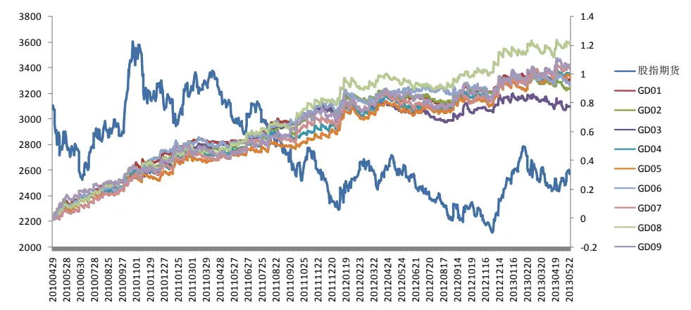
数据来源：广发证券发展研究中心

图7：分样本内外下策略年度收益率情况

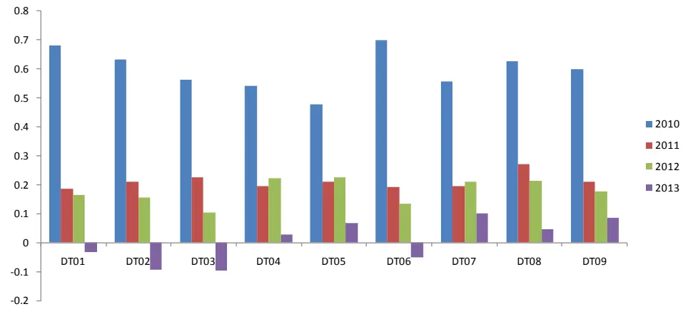
数据来源：广发证券发展研究中心

表9：分样本内外下各策略交易特征

| 策略编号 | 累计收益率 交易次数 日均次数 |  |  | 胜率 赔率 最大回撤 |  |  |
| --- | --- | --- | --- | --- | --- | --- |
| DT01 | 96.11% | 438 | 0.59 | 38% | 2.63 | -4.49% |
| DT02 | 89.88% | 438 | 0.59 | 35% | 3.13 | -5.75% |
| DT03 | 77.70% | 438 | 0.59 | 47% | 1.64 | -8.43% |
| DT04 | 98.22% | 728 | 0.98 | 30% | 3.25 | -5.75% |
| DT05 | 97.76% | 728 | 0.98 | 26% | 4.26 | -5.24% |
| DT06 | 92.47% | 488 | 0.66 | 47% | 1.69 | -5.78% |
| DT07 | 103.39% | 684 | 0.92 | 31% | 3.26 | -6.53% |
| DT08 | 119.73% | 729 | 0.98 | 27% | 4.25 | -5.45% |
| DT09 | 103.14% | 669 | 0.90 | 45% | 1.68 | -7.18% |

数据来源：广发证券发展研究中心

图8：样本外各策略累计收益率曲线
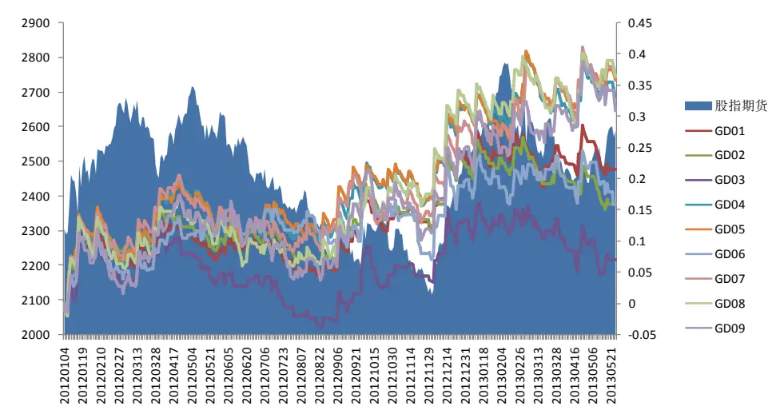
数据来源：广发证券发展研究中心

## （三）DT08策略全面分析

经过上述分析，可以看到DT08策略模式是最佳的，因此我们进一步对其进行全面分析。

（1）在样本内最优参数（0.152,0.37%）下，年化收益率为40%，日均交易次数0.98次，胜率26.9%，赔率4.25倍，最大回撤-5.45%，连续四年2010、2011、2012、2013年化收益率分别为62.8%、27.2%、21.3%、4.58%。

（2）全样本最有参数为（0.18,0.3%），该参数下的交易结果为，年化收益率为45.8%，日均交易次数为0.85次，胜率28.6%，赔率4.29倍，最大回撤-4.68%，连续四年2010、2011、2012、2013年化收益率分别为55.7%、24%、27.4%、27.9%

（3）从多空信号来看，两套参数下多空信号收益对总收益贡献各自对半，而交易次数，胜率、赔率方面无特别显著差异。

表10：DT08分样本内外参数下全部信号表现

| 评价指标 | 全样本 | 2010 | 2011 | 2012 | 2013 |
| --- | --- | --- | --- | --- | --- |
| 累计收益率 | 119.73% | 41.46% | 26.53% | 20.75% | 1.67% |
| 年化收益率 | 40.29% | 62.81% | 27.19% | 21.35% | 4.58% |
| 交易次数 | 729 | 157 | 240 | 242 | 90 |
| 获胜次数 | 196 | 41 | 74 | 66 | 15 |
| 失败次数 | 533 | 116 | 166 | 176 | 75 |
| 日均次数 | 0.98 | 0.95 | 0.98 | 1.00 | 0.99 |
| 胜率 | 26.9% | 26.1% | 30.8% | 27.3% | 16.7% |
| 单次均收益率 | 0.11% | 0.23% | 0.10% | 0.08% | 0.02% |
| 单次获胜均收益率 | 1.15% | 1.65% | 0.92% | 1.02% | 1.47% |
| 单次失败均收益率 | -0.27% | -0.28% | -0.27% | -0.27% | -0.27% |
| 赔率 | 4.25 | 5.97 | 3.48 | 3.75 | 5.47 |
| 最大回撤 | -5.45% | -3.77% | -4.73% | -5.45% | -4.94% |
| 最大连胜次数 | 5 | 3 | 5 | 3 | 2 |
| 最大连败次数 | 14 | 12 | 10 | 12 | 14 |

数据来源：广发证券发展研究中心

表11：DT08分样本内外参数下Long信号表现

| 评价指标 | 全样本 | 2010 | 2011 | 2012 | 2013 |
| --- | --- | --- | --- | --- | --- |
| 累计收益率 | 53.17% | 26.26% | 5.71% | 12.19% | 2.29% |
| 年化收益率 | 17.89% | 39.79% | 5.85% | 12.54% | 6.29% |
| 交易次数 | 345 | 69 | 107 | 123 | 46 |
| 获胜次数 | 73 | 21 | 22 | 24 | 6 |
| 失败次数 | 272 | 48 | 85 | 99 | 40 |
| 日均次数 | 0.46 | 0.42 | 0.44 | 0.51 | 0.51 |
| 胜率 | 21.2% | 30.4% | 20.6% | 19.5% | 13.0% |
| 单次均收益率 | 0.13% | 0.34% | 0.05% | 0.10% | 0.05% |
| 单次获胜均收益率 | 1.44% | 1.65% | 1.06% | 1.50% | 1.82% |
| 单次失败均收益率 | -0.22% | -0.23% | -0.21% | -0.24% | -0.21% |
| 赔率 | 6.41 | 7.26 | 5.14 | 6.19 | 8.53 |
| 最大回撤 | -7.54% | -1.69% | -3.59% | -7.54% | -4.17% |
| 最大连胜次数 | 3 | 2 | 3 | 2 | 1 |
| 最大连败次数 | 27 | 7 | 13 | 27 | 18 |

数据来源：广发证券发展研究中心

表12：DT08分样本内外参数下Short信号表现

| 评价指标 | 全样本 | 2010 | 2011 | 2012 | 2013 |
| --- | --- | --- | --- | --- | --- |
| 累计收益率 | 43.46% | 12.04% | 19.70% | 7.63% | -0.61% |
| 年化收益率 | 14.62% | 18.24% | 20.18% | 7.85% | -1.67% |
| 交易次数 | 384 | 88 | 133 | 119 | 44 |
| 获胜次数 | 123 | 20 | 52 | 42 | 9 |
| 失败次数 | 261 | 68 | 81 | 77 | 35 |
| 日均次数 | 0.52 | 0.53 | 0.55 | 0.49 | 0.48 |
| 胜率 | 32.0% | 22.7% | 39.1% | 35.3% | 20.5% |
| 单次均收益率 | 0.10% | 0.13% | 0.14% | 0.06% | -0.01% |
| 单次获胜均收益率 | 0.98% | 1.65% | 0.86% | 0.75% | 1.24% |
| 单次失败均收益率 | -0.32% | -0.31% | -0.33% | -0.31% | -0.33% |
| 赔率 | 3.07 | 5.31 | 2.64 | 2.41 | 3.73 |
| 最大回撤 | -6.12% | -4.05% | -3.17% | -3.85% | -4.81% |
| 最大连胜次数 | 4 | 2 | 4 | 4 | 2 |
| 最大连败次数 | 13 | 13 | 7 | 6 | 10 |

数据来源：广发证券发展研究中心

表13：DT08全样本最优参数下全部信号表现

| 评价指标 | 全样本 | 2010 | 2011 | 2012 | 2013 |
| --- | --- | --- | --- | --- | --- |
| 累计收益率 | 135.47% | 36.77% | 23.42% | 26.64% | 10.15% |
| 年化收益率 | 45.58% | 55.71% | 23.99% | 27.41% | 27.90% |
| 交易次数 | 633 | 140 | 209 | 208 | 76 |
| 获胜次数 | 181 | 38 | 63 | 61 | 19 |
| 失败次数 | 452 | 102 | 146 | 147 | 57 |
| 日均次数 | 0.85 | 0.85 | 0.86 | 0.86 | 0.84 |
| 胜率 | 28.6% | 27.1% | 30.1% | 29.3% | 25.0% |
| 单次均收益率 | 0.14% | 0.23% | 0.10% | 0.12% | 0.13% |
| 单次获胜均收益率 | 1.16% | 1.60% | 0.96% | 1.04% | 1.34% |
| 单次失败均收益率 | -0.27% | -0.28% | -0.27% | -0.27% | -0.27% |
| 赔率 | 4.29 | 5.68 | 3.61 | 3.91 | 4.91 |
| 最大回撤 | -4.68% | -3.30% | -3.47% | -4.68% | -2.58% |
| 最大连胜次数 | 3 | 3 | 3 | 3 | 3 |
| 最大连败次数 | 17 | 12 | 10 | 17 | 9 |

数据来源：广发证券发展研究中心

表14：DT08全样本最优参数下Long信号表现

| 评价指标 | 全样本 | 2010 | 2011 | 2012 | 2013 |
| --- | --- | --- | --- | --- | --- |
| 累计收益率 | 48.59% | 19.08% | 5.97% | 13.97% | 3.33% |
| 年化收益率 | 16.35% | 28.90% | 6.11% | 14.37% | 9.15% |
| 交易次数 | 299 | 63 | 90 | 107 | 39 |
| 获胜次数 | 65 | 17 | 20 | 21 | 7 |
| 失败次数 | 234 | 46 | 70 | 86 | 32 |
| 日均次数 | 0.40 | 0.38 | 0.37 | 0.44 | 0.43 |
| 胜率 | 21.7% | 27.0% | 22.2% | 19.6% | 17.9% |
| 单次均收益率 | 0.14% | 0.28% | 0.07% | 0.13% | 0.09% |
| 单次获胜均收益率 | 1.44% | 1.67% | 1.07% | 1.60% | 1.50% |
| 单次失败均收益率 | -0.23% | -0.23% | -0.22% | -0.23% | -0.22% |
| 赔率 | 6.36 | 7.22 | 4.87 | 6.86 | 6.76 |
| 最大回撤 | -4.45% | -1.38% | -3.06% | -4.45% | -3.14% |
| 最大连胜次数 | 3 | 2 | 3 | 3 | 1 |
| 最大连败次数 | 15 | 7 | 10 | 15 | 13 |

数据来源：广发证券发展研究中心

表15：DT08全样本最优参数下Short信号表现

| 评价指标 | 全样本 | 2010 | 2011 | 2012 | 2013 |
| --- | --- | --- | --- | --- | --- |
| 累计收益率 | 58.47% | 14.86% | 16.47% | 11.12% | 6.60% |
| 年化收益率 | 19.67% | 22.51% | 16.87% | 11.44% | 18.14% |
| 交易次数 | 334 | 77 | 119 | 101 | 37 |
| 获胜次数 | 116 | 21 | 43 | 40 | 12 |
| 失败次数 | 218 | 56 | 76 | 61 | 25 |
| 日均次数 | 0.45 | 0.47 | 0.49 | 0.42 | 0.41 |
| 胜率 | 34.7% | 27.3% | 36.1% | 39.6% | 32.4% |
| 单次均收益率 | 0.14% | 0.19% | 0.13% | 0.11% | 0.18% |
| 单次获胜均收益率 | 1.00% | 1.55% | 0.91% | 0.75% | 1.26% |
| 单次失败均收益率 | -0.32% | -0.32% | -0.31% | -0.31% | -0.34% |
| 赔率 | 3.16 | 4.77 | 2.94 | 2.38 | 3.69 |
| 最大回撤 | -3.26% | -3.07% | -3.23% | -3.26% | -2.02% |
| 最大连胜次数 | 5 | 2 | 3 | 5 | 2 |
| 最大连败次数 | 7 | 7 | 7 | 7 | 6 |

数据来源：广发证券发展研究中心

DT08参数敏感性如何呢？我们切割参数 f 在区间0.1至2，间距为0.01，参数r在0.1%至1%直接，切割间距为0.1%，看不同参数组合的累计收益结果，绘制如下图9，可见，区间比例参数f在0.1至0.5之间策略有效，止损参数r的敏感性更弱，在0.3%至0.5%之间最优，策略在相当大的参数空间中均为有效。

图9：DT08策略参数敏感性分析
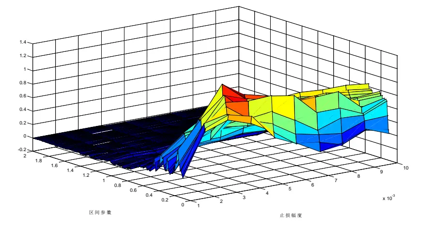

## 五、总结

（1）所谓开盘区间突破（Opening Range Breakout），当日开盘价的基础上加上一个区间宽度值得到上突破价，减去区间宽度值得到下突破价，当日市场向上突破及做多，下突破及做空。

区间宽度计算上本文列举三类，分别为，A1:开盘价×f；A2：波动区间均值（avgTrueRange）×f；A3：Dual Thrust定义的区间变量DRange×f。

在出场方式而言的资金管理方面，列举3种模式分别为，B1：固定比例r止损，否则收盘平仓；B2：固定比例r止损，当浮动收益大于1倍r时，将止损点移至成本价，否则收盘平仓；B3：固定比例r止损，当价格创开仓以来有利方向新高或新低时立即移动止损点。

不同区间计算方式及出场方式形成9个策略，分别考察以择优。

（2）三类区间宽度计算模式下f参数大致分别为0.145、0.3~0.5、0.15~0.2，止损参数r在不止盈情况下约为0.3%~0.4%，跟踪止盈下约0.8%。

区间宽度计算A2、A3模式显著好于A1；DT05策略（A2+B2模式）及DT08策略（A3+B2）模式策略最优，历史各年度年化收益率维持在20%左右。交易次数方面，各策略日均交易次数均小于1；胜率方面，各策略的胜率在30%至50%之间，并且跟踪止盈下的胜率显著高于非跟踪止盈策略；赔率方面，各策略的赔率在1.5倍至4倍之间，并且止盈下的赔率显著低于非止盈策略。

（3）以2010至2011为样本内，其余为样本外，DT01、DT02、DT03策略参数几乎没有变化，其余6个策略区间比例参数f变化在0.05以内，止损参数r变化在0.1%以内，总体参数变化不大。A3区间宽度即使模式下策略累计收益率显著高于其他策略，样本外表现较好；交易次数、胜率、赔率等指标相比较全样本最优参数下的结果变化不大，样本外最大回撤在5%至8%。

（4）兼顾考虑全样本及分样本内外的实证结果，A3模式DRange计算的开盘区间突破策略表现最优；B2移动止损点至成本价方式是可取的，较固定止损恒定不变情况有显著的改善，但是跟踪止盈方式并没有明显提升策略收益。

## 风险提示

策略模型并非百分百有效，市场结构及交易行为的改变或者交易参与者的增多有可能使得策略失效。

## 广发金融工程研究小组

罗 军： 首席分析师，华南理工大学理学硕士，2010年进入广发证券发展研究中心。

俞文冰： 首席分析师，CFA，上海财经大学统计学硕士，2012年进入广发证券发展研究中心。

叶 涛： 资深分析师，CFA ，上海交通大学管理科学与工程硕士，2012年进入广发证券发展研究中心。

安宁宁： 资深分析师，暨南大学数量经济学硕士，2011年进入广发证券发展研究中心。

胡海涛： 分析师， 华南理工大学理学硕士， 2010年进入广发证券发展研究中心。

夏潇阳： 分析师， 上海交通大学金融工程硕士， 2012年进入广发证券发展研究中心。

汪 鑫： 分析师， 中国科学技术大学金融工程硕士， 2012年进入广发证券发展研究中心。

蓝昭钦： 分析师， 中山大学理学硕士， 2010年进入广发证券发展研究中心。

史庆盛： 研究助理， 华南理工大学金融工程硕士， 2011年进入广发证券发展研究中心。

张 超： 研究助理， 中山大学理学硕士，2012年进入广发证券发展研究中心。

## 广发证券—行业投资评级说明

买入： 预期未来12个月内，股价表现强于大盘10%以上。

持有： 预期未来12个月内，股价相对大盘的变动幅度介于-10%～+10%。

卖出： 预期未来12个月内，股价表现弱于大盘10%以上。

## 广发证券—公司投资评级说明

买入： 预期未来12个月内，股价表现强于大盘15%以上。

谨慎增持： 预期未来12个月内，股价表现强于大盘5%-15%。

持有： 预期未来12个月内，股价相对大盘的变动幅度介于-5%～+5%。

卖出： 预期未来12个月内，股价表现弱于大盘5%以上。

## 联系我们

|  | 广州市 | 深圳市 | 北京市 | 上海市 |
| --- | --- | --- | --- | --- |
| 地址 | 广州市天河北路183号 大都会广场5楼 | 深圳市福田区金田路4018 号安联大厦 15 楼 A 座 | 北京市西城区月坛北街2号 | 上海市浦东新区富城路99号 |
|  |  | 03-04 | 月坛大厦18层 | 震旦大厦18楼 |
| 邮政编码 | 510075 | 518026 | 100045 | 200120 |
| 客服邮箱 | gfyf@gf.com.cn |  |  |  |
| 服务热线 | 020-87555888-8612 |  |  |  |

## 免责声明

广发证券股份有限公司具备证券投资咨询业务资格。本报告只发送给广发证券重点客户，不对外公开发布。

本报告所载资料的来源及观点的出处皆被广发证券股份有限公司认为可靠，但广发证券不对其准确性或完整性做出任何保证。报告内容仅供参考，报告中的信息或所表达观点不构成所涉证券买卖的出价或询价。广发证券不对因使用本报告的内容而引致的损失承担任何责任，除非法律法规有明确规定。客户不应以本报告取代其独立判断或仅根据本报告做出决策。

广发证券可发出其它与本报告所载信息不一致及有不同结论的报告。本报告反映研究人员的不同观点、见解及分析方法，并不代表广发证券或其附属机构的立场。报告所载资料、意见及推测仅反映研究人员于发出本报告当日的判断，可随时更改且不予通告。

本报告旨在发送给广发证券的特定客户及其它专业人士。未经广发证券事先书面许可，任何机构或个人不得以任何形式翻版、复制、刊登、转载和引用，否则由此造成的一切不良后果及法律责任由私自翻版、复制、刊登、转载和引用者承担。