# 基于遗传规划多维变量的股指期货交易策略

## 另类交易策略之十二

## 报告摘要：

## 遗传规划智能交易策略Y001回顾

我们在2012年9月16日发布遗传规划智能研发交易策略的专题报告《基于遗传规划的智能交易策略方法》，进行这一方向研究的启发来自于 TSL，即 Trading System Lab 公司，该公司基于遗传规划方法研发了若干交易策略，在鼎鼎大名的 Futures Truth Magazine 排行榜中多个策略跻身前十名，成绩斐然。

报告中我们发布了采用遗传规划自动生成的编号为 Y001 的策略，策略从 2012 年 8 月 24 日的 131.8%累计收益率到目前 203.5%，累计收益在最近一个累计年度内增长了 76.7%。

## 多维变量输入的新智能策略

本文我们继续延续已构建的遗传规划算法框架，采用 5分钟周期数据，全样本截止到 2013.7.24，样本内截止到 2012.12.31，输入变量丰富到 18 个，包括了价格、成交量、动量、趋势强度、反转、摆动、资金流向、区间波动强度、加速癫狂情绪等各方面数据。

## Y002 至 Y005 策略

共新生产四个交易交易策略，分别编号为 Y002至 Y005。

Y002 策略共 258 次交易，日均交易 0.33 次，胜率 53.5%，盈亏比 2.33倍，2010、2011、2012、2013 年化收益率分别为 69.2%、21.7%、25.3%、23.5%，最大回撤-4.7%。

Y003 策略共 792 次交易，日均交易 1 次，胜率 43.8%，盈亏比 2.02倍，2010、2011、2012、2013 年化收益率分别为 64.6%、27.9%、42.0%、62.9%，最大回撤-6.3%。

Y004 策略共 792 次交易，日均交易 1 次，胜率 42.8%，盈亏比 1.91倍，2010、2011、2012、2013 年化收益率分别为 40.2%、25.8%、23.5%、60.1%，最大回撤-9.3%。

Y005 策略共 450 次交易，日均交易 0.57 次，胜率 51.8%，盈亏比 2.02倍，2010、2011、2012、2013 年化收益率分别为 86.0%、33.4%、28.8%、25.8%，最大回撤-7.2%。

## 等权多策略组合

等权策略组合累计收益率为 191.7%，最大回撤仅为-2.76%，收益新高最大需要 38 个交易日，分年度来看 2010、2011、2012、2013 年化收益分别为 59.1%、32.9%、30.5%、39.1%。

图 1Y001~Y005 策略累计收益
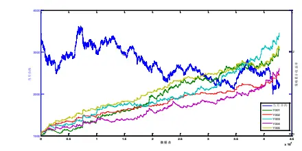

图 2等权多策略组合表现
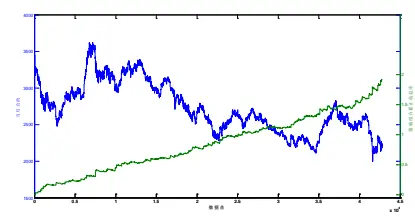

分析师： 安宁宁 S0260512020003

0755-23948352

ann@gf.com.cn

## 相关研究：

另类交易策略系列之十一： 2013-06-17
日内突破模式及其资金管
理的多重比较研究
另类交易策略系列之十：基 2013-02-26
于遗传算法的期指日内交
易系统
另类交易策略系列之九：基 2013-09-16
于遗传规划的智能交易策
略方法

识别风险，发现价值

## 一、智能交易策略回顾

## （一）交易模型回顾

我们在2012年9月16日发布遗传规划智能研发交易策略的专题报告《基于遗传规划的智能交易策略方法》，进行这一方向研究的启发来自于TSL，即Trading SystemLab公司，该公司基于遗传规划方法研发了若干交易策略，在鼎鼎大名的FuturesTruth Magazine排行榜中多个策略跻身前十名，成绩斐然，遂进行了相关研究并发布了我们利用遗传规划研发的一个交易策略，我们首先回顾一下该策略。

该策略采用如下交易规则进行交易，交易日09:30考察信号值，当交易信号值大于0时，开仓做多，反之小于0时开仓做空，并设置固定止损幅度为0.5%，当价格触及止损线时，平仓止损，之后再观察交易信号值与零的大小关系，若当日未发生止损，则收盘15:00强制平仓。

信号值的计算公式为

$$
y=\cos\left(tt\right)+2\sin\left(\frac{\cos\left(ll+tt\right)}{\cos\left(\sin\left(ll\right)^{n}\right)}\right)
$$

其中，ll为5分钟K线最低价，tt为5分钟K线当日累计K线数量，相应的函数树形结构如图1所示。

图1：智能交易策略信号函数树形结构
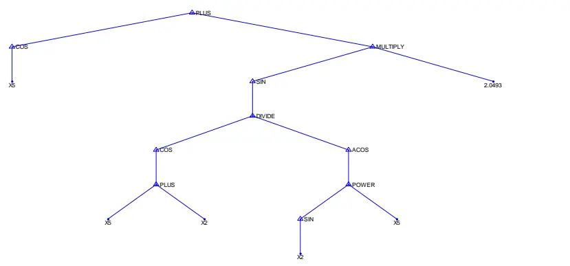
数据来源：广发证券发展研究中心

图2：智能交易策略信号值示例图

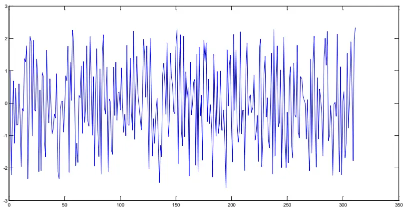
数据来源：广发证券发展研究中心

## （二）交易模型模拟跟踪

上述我们我们在发布报告时的模拟交易结果截止到2012年8月24日，自发布以来已经一年的时间了，该模型表现如何呢？我们来分析汇报一下。

策略从12年8月24日的131.8%累计收益率到目前203.5%，累计收益在最近一个累计年度内增长了76.7%。

图3：Y001策略发布以来累计收益表现
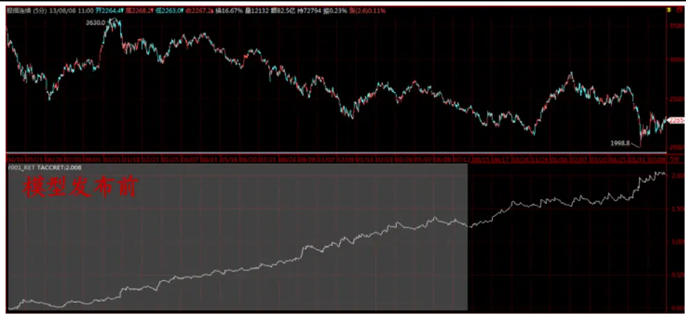
数据来源：广发证券发展研究中心

表1：Y001策略全部信号表现

| 评价指标 | 全样本 | 2010 | 2011 2012 |  | 2013 |
| --- | --- | --- | --- | --- | --- |
| 累计收益率 | 203.5% | 30.3% | 55.8% | 30.4% | 14.6% |
| 年化收益率 | 64.2% | 43.6% | 57.1% | 31.3% | 28.0% |
| 交易次数 | 792 | 174 | 244 | 243 | 131 |
| 获胜次数 | 333 | 67 | 107 | 109 | 50 |
| 失败次数 | 459 | 107 | 137 | 134 | 81 |
| 胜率 | 42.0% | 38.5% | 43.9% | 44.9% | 38.2% |
| 单次均收益率 | 0.1% | 0.2% | 0.2% | 0.1% | 0.1% |
| 单次获胜均收益率 | 1.0% | 1.3% | 1.1% | 0.9% | 1.1% |

识别风险，发现价值

| 单次失败均收益率 | -0.5% | -0.5% | -0.5% | -0.5% | -0.5% |
| --- | --- | --- | --- | --- | --- |
| 赔率 | 2.06 | 2.38 | 2.15 | 1.74 | 2.17 |
| 最大回撤 | -10.1% | -10.1% | -5.3% | -6.9% | -5.3% |
| 最大连胜次数 | 6 | 6 | 5 | 5 | 4 |
| 最大连败次数 | 8 | 6 | 6 | 8 | 8 |

数据来源：广发证券发展研究中心

表2：Y002策略Long信号表现

| 评价指标 | 全样本 | 2010 | 2011 | 2012 | 2013 |
| --- | --- | --- | --- | --- | --- |
| 累计收益率 | 30.6% | 0.8% | 13.9% | 14.5% | -0.7% |
| 年化收益率 | 9.7% | 1.2% | 14.2% | 14.9% | -1.3% |
| 交易次数 | 167 | 35 | 49 | 59 | 24 |
| 获胜次数 | 65 | 9 | 23 | 27 | 6 |
| 失败次数 | 102 | 26 | 26 | 32 | 18 |
| 胜率 | 38.9% | 25.7% | 46.9% | 45.8% | 25.0% |
| 单次均收益率 | 0.2% | 0.0% | 0.3% | 0.2% | 0.0% |
| 单次获胜均收益率 | 1.2% | 1.6% | 1.2% | 1.1% | 1.6% |
| 单次失败均收益率 | -0.5% | -0.5% | -0.5% | -0.5% | -0.6% |
| 赔率 | 2.41 | 3.10 | 2.27 | 2.30 | 2.83 |
| 最大回撤 | -5.7% | -5.7% | -3.0% | -3.1% | -5.3% |
| 最大连胜次数 | 6 | 2 | 6 | 4 | 1 |
| 最大连败次数 | 10 | 9 | 4 | 5 | 10 |

数据来源：广发证券发展研究中心

表3：Y001策略Short信号表现

| 评价指标 | 全样本 | 2010 | 2011 | 2012 | 2013 |
| --- | --- | --- | --- | --- | --- |
| 累计收益率 | 132.4% | 29.3% | 36.8% | 13.9% | 15.4% |
| 年化收益率 | 41.8% | 42.0% | 37.7% | 14.3% | 29.4% |
| 交易次数 | 625 | 139 | 195 | 184 | 107 |
| 获胜次数 | 268 | 58 | 84 | 82 | 44 |
| 失败次数 | 357 | 81 | 111 | 102 | 63 |
| 胜率 | 42.9% | 41.7% | 43.1% | 44.6% | 41.1% |
| 单次均收益率 | 0.1% | 0.2% | 0.2% | 0.1% | 0.1% |
| 单次获胜均收益率 | 1.0% | 1.2% | 1.0% | 0.8% | 1.1% |
| 单次失败均收益率 | -0.5% | -0.5% | -0.5% | -0.5% | -0.5% |
| 赔率 | 1.98 | 2.27 | 2.11 | 1.58 | 2.10 |
| 最大回撤 | -7.0% | -6.8% | -4.3% | -5.4% | -5.4% |
| 最大连胜次数 | 6 | 6 | 5 | 6 | 4 |
| 最大连败次数 | 8 | 5 | 7 | 8 | 7 |

数据来源：广发证券发展研究中心

## 二、遗传规划智能策略生成原理

## （一）遗传规划介绍

遗传规划（Genetic Programming）由达尔文的进化论演变而来，是一种智能进化计算（Evolutionary Computation）技术，遗传规划是遗传算法的推广和更一般地形式。

## （1）遗传规划要解决问题

一般地在线性回归中，我们面临的问题是如何求解最优的系数，不管是利用线性回归技术，或者是遗传算法技术，我们都必需假设已知问题的函数表达式是一个二阶多项式。但是在遗传规划中，我们不需要知道函数的表达式，我们不仅仅要求得函数系数，而且要找出函数的表达式。

## （2）遗传规划算法流程图

遗传规划首先生成程序函数体群体，其中每一个个体是一个解决问题的方案，对于上述符号回归问题则为一个随机生成的函数表达式，得到初始群体后进入循环迭代过程，先计算个体的适应度值，并判断迭代终止条件，若符合则迭代终止，否则按适应度值比例的选择概率在上一代群体中随机选择个体，利用遗传算子生成新个体，进而得到新群体，然后再进行计算适应度值及判定迭代终止条件的步骤。

图4：遗传规划流程图
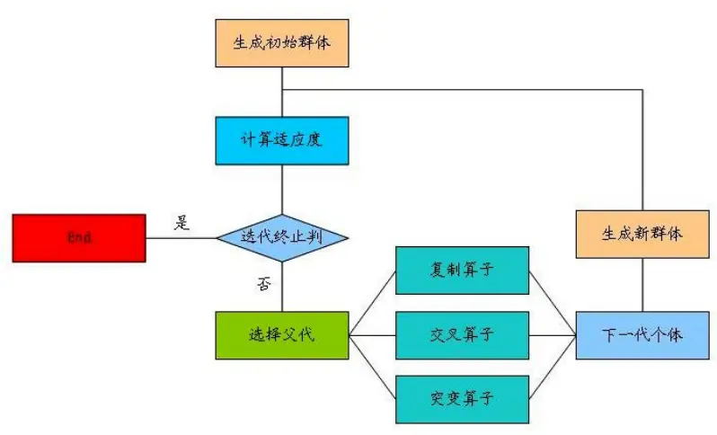
数据来源：广发证券发展研究中心

## （3）函数体的表现形式

遗传规划算法中，我们通常需要将函数表达式表示成一种树的形式，例如可以将函数表达式 $\max(x+x,x+3\times y)$ 转换成如下的树的形式，如下图，其中圆圈部分代表内部节点（max、+、*）称为函数（functions），叶节点上的自变量以及常数称为终端（terminals）。遗传规划算法中需要我们事先给定函数集（functions set）和终端集（terminals set）。

图5：遗传规划函数树状结构图
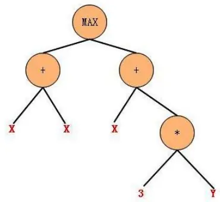
数据来源：广发证券发展研究中心

## （4）适应度（fitness）

给定一个个体之后，类似于进化论，需要知道该个体对环境的适应度值，适应度高的则有更高的可能存活下来，或者作为父代进行交叉变异形成新个体，从而将优良基因遗传给下一代。

一般的对于拟合问题，则可以以拟合均方误差为适应度；对于交易策略问题，则可以令收益率（或者回撤、收益除以回撤等）作为适应度。

（5）遗传算子：精英算子（elite）

上一代群体中适应度最高的若干个个体或者一定比例的个体直接作为新个体放入下一代群体，这一部分个体数量占群体大小的比例为 $p_{e}$

（6）遗传算子：复制算子（reproduction）按照等比例于适应度的选择概率在上一代群体中选择个体放入下一代群体，如此产生的个体数量占群体大小的比例为 $p_{r}$ 。

（7）遗传算子：交叉算子（crossover）

按照等比例于适应度的选择概率在上一代群体中选择两个个体作为父代，并随机选取其树结构之节点，交换以该节点为根节点的两个子树，从而生成两个新的个体，如此产生的个体数量占群体大小的比例为 $p_{c}$

## 图6：遗传规划交叉算子

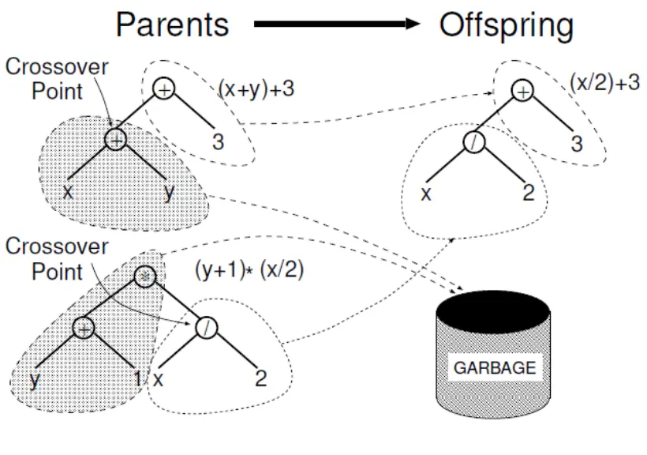
数据来源：广发证券发展研究中心

（8）遗传算子：变异算子（mutation）

按照等比例于适应度的选择概率在上一代群体中选择一个个体作为父代，并随机选取其树结构之节点，令随机生成的另一个树结构函数体替换以该节点为根节点的子树，从而生成一个新的个体，如此产生的个体数量占群体大小的比例为 $p_{m}$

且有 $p_{e}+p_{r}+p_{c}+p_{m}=1$

图7：遗传规划变异算子
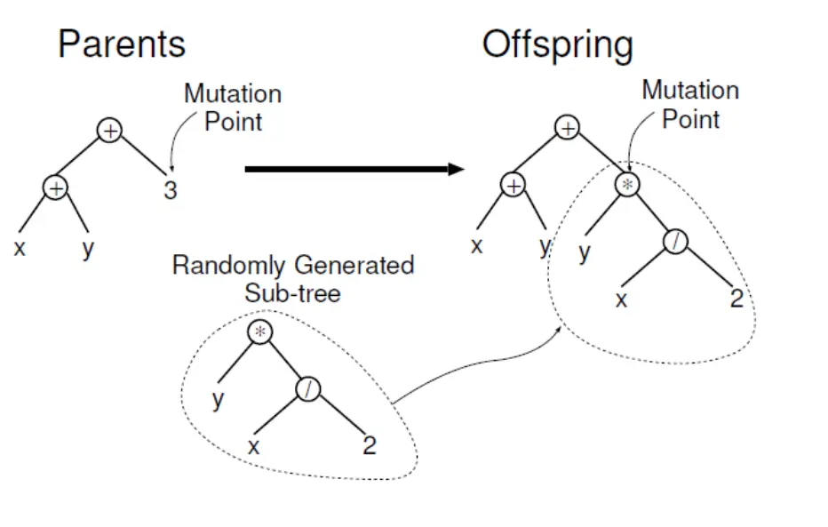
数据来源：广发证券发展研究中心

## （二）遗传规划智能策略算法流程框架

利用遗传规划进行智能交易策略生成的整体框架流程类似于上述的符号回归案例，但是在具体细节上有很大差异，比如在终端集、函数集、以及适应度计算上差异很大，我们首先介绍我们设计的整体算法框架。

## （1）交易标的选择

选定交易标的，比如商品期货、股指期货、外汇等等，获取其分笔交易明细数据之后将数据切片，提取其各个周期上的K线数据，包括1分钟、2分钟、5分钟、10分钟、15分钟、30分钟、60分钟、日、周等等。

## （2）终端集的设定

原则上来讲，只需要输入价量相关的K线数据即可，由程序自动进行演算找到更好判断买卖点的数据，但是一方面这个范围太宽泛了，理论上无穷多的函数组合形式使得计算量大大增加，往往结果也并不是十分理想。那么合理的做法是根据各个周期的基础数据（开盘价、最高价、最低价、收盘价、成交量、成交金额）计算衍生数据指标，从不同角度反映数据特征，然后作为输入变量输入模型。

## （3）函数集

函数集方面一般包括多种算子，算术运算、关系运算、逻辑运算、条件运算等等，函数运算方面，包括正弦、余弦、反正弦、反余弦、对数、指数、幂、最大、最小、开方等等。

## （4）适应度计算

与普通符号回归的不同之处在于适应度计算方式，符号回归上，我们希望拟合均方误差越小越好，因此拟合误差越小的个体其适应度应该越高。而在交易策略生成中，我们希望策略累计收益率越大越好，收益率越高的，其适应度越高，再者我们的优化目标也可以是收益/回撤倍数，该倍数越高的个体适应度越高。

在进行策略评价时，我们假定策略个体输出的结果为买卖信号，并且我们人为的设定止损或者强制平仓的条件，这些交易规则结合买卖信号从而可以形成具体的买卖行为，再计算该买卖行为下的累计收益率或者收益/回撤倍数。

图8：遗传规划智能交易策略算法框架一
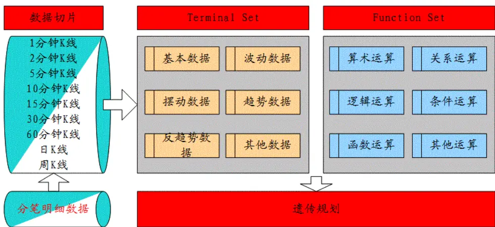
数据来源：广发证券发展研究中心

图9：遗传规划智能交易策略算法框架二

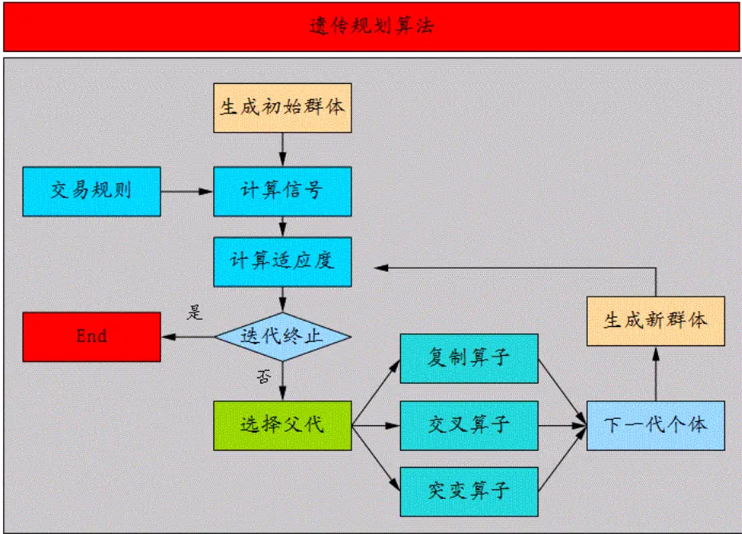
数据来源：广发证券发展研究中心

## 三、若干交易策略实证

## （一）实证说明

（1）数据选取，本实证选取股指期货当月合约自2010年4月16日至2013年7月24的5分钟K线，样本内截止到2012年12月31日。

## （2）策略评价方法

策略评价指标我们选取如下表。

表4：模型实证评价体系

| 考察指标 | 说明 |
| --- | --- |
| 累计收益率 | 模拟交易期末累计收益率 |
| 交易总次数 | 总交易次数（自开仓至平仓为一个完整的交易周期） |
| 获胜次数 | 单次交易收益率大于0的次数 |
| 失败次数 | 单次交易收益率小于0的次数 |
| 胜率 | 获胜次数/交易总次数×100% |
| 单次获胜收益率 | 获胜交易的收益率算术平均值 |
| 单次失败亏损率 | 失败交易的收益率算术平均值 |
| 赔率 | 单次获胜平均收益率除以单次失败平均亏损率的绝对值 |
| 最大回撤 | 模拟交易资金自最高点缩水的最大幅度 |
| 最大连胜次数 | 最大连续收益率大于0的交易次数 |
| 最大连亏次数 | 最大连续收益率小于0的交易次数 |

数据来源：广发证券发展研究中心

## （3）模拟交易情景

记 $F_{1}$ 为开仓成交价， $F_{2}$ 为平仓成交价，c为单边手续费率，I 为单边冲击成本，M 为杠杆倍数，则单次交易收益率为

$$
r_{long}=\left[\frac{(F_2-I)\times(1-c)-(F_1+I)\times(1+c)}{(F_1+I)\times(1+c)}\right]\times M
$$

$$
r_{short}=\left[\frac{\left(F_1-I\right)\times(1-c)-(F_2+I)\times(1+c)}{(F_1-I)\times(1+c)}\right]\times M
$$

此处模拟交易相关设定为：

手续 费：万分之零点三；

冲击成本：0.4个指数点；

杠杆倍数：1；

开仓价格: 信号发生后第 1根 K线开盘价；

平仓价格: 止损价或者时间平仓价。

## （4）输入变量

输入变量上我们仅将5分钟K线数据输入，具体见下表共计18个输入变量。

表5：遗传规划智能交易策略生成输入变量

| 变量 说明 |  |
| --- | --- |
| X1 | 最高价 |
| X2 | 最低价 |
| X3 | 收盘价 |
| X4 | 成交手数 |
| X5 | 20期累计成交手数 |
| X6 | 开盘累计K线数量 |
| X7 | ADX 指标 |
| X8 | 20期最高价 |
| X9 | 20期最高点到当下的K线数量 |
| X10 | 20期收盘价波动 |
| X11 | MACD |
| X12 | 20期动量 |
| X13 | OSC |
| X14 | 梅斯线，重量指数 |
| X15 | 波动区间均值 |
| X16 | Chaikin Money Flow 指标 |
| X17 | 顺势指标 CCI |
| X18 | 加速癫狂指标 |

数据来源：广发证券发展研究中心

## （二）Y002 策略实证

我们共计利用遗传算法在前述模型基础上生成了4个交易策略，当然生成过程中产生的策略不止4个，我们略作选取相关性较低、整体表现较优的。我们首先介绍Y002策略。

Y002策略共258次交易，日均交易0.33次，胜率53.5%，盈亏比2.33倍，2010、2011、2012、2013年化收益率分别为69.2%、21.7%、25.3%、23.5%，最大回撤-4.7%。

图10：Y002策略累计收益

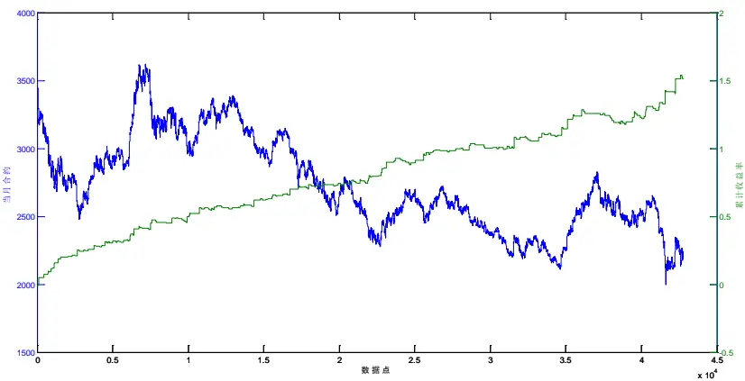
数据来源：广发证券发展研究中心

表6：Y002策略全部信号

| 评价指标 | 全样本 | 2010 | 2011 | 2012 | 2013 |
| --- | --- | --- | --- | --- | --- |
| 累计收益率 | 151.2% | 48.2% | 21.2% | 24.6% | 12.3% |
| 年化收益率 | 47.7% | 69.2% | 21.7% | 25.3% | 23.5% |
| 交易次数 | 258 | 58 | 85 | 74 | 41 |
| 获胜次数 | 138 | 34 | 46 | 41 | 17 |
| 失败次数 | 120 | 24 | 39 | 33 | 24 |
| 胜率 | 53.5% | 58.6% | 54.1% | 55.4% | 41.5% |
| 单次均收益率 | 0.4% | 0.7% | 0.2% | 0.3% | 0.3% |
| 单次获胜均收益率 | 1.1% | 1.5% | 0.8% | 0.9% | 1.4% |
| 单次失败均收益率 | -0.5% | -0.5% | -0.5% | -0.4% | -0.5% |
| 赔率 | 2.33 | 3.19 | 1.77 | 2.05 | 2.78 |
| 最大回撤 | -4.7% | -1.6% | -1.7% | -2.6% | -4.7% |
| 最大连胜次数 | 9 | 7 | 4 | 8 | 4 |
| 最大连败次数 | 6 | 3 | 4 | 3 | 6 |

数据来源：广发证券发展研究中心

表7：Y002策略Long信号

| 评价指标 全样本 2010 |  |  | 2011 | 2012 | 2013 |
| --- | --- | --- | --- | --- | --- |
| 累计收益率 | 44.0% | 17.3% | 2.3% | 13.5% | 5.7% |
| 年化收益率 | 13.9% | 24.9% | 2.4% | 13.8% | 10.9% |
| 交易次数 | 125 | 32 | 36 | 38 | 19 |
| 获胜次数 | 60 | 20 | 16 | 17 | 7 |
| 失败次数 | 65 | 12 | 20 | 21 | 12 |
| 胜率 | 48.0% | 62.5% | 44.4% | 44.7% | 36.8% |
| 单次均收益率 | 0.3% | 0.5% | 0.1% | 0.3% | 0.3% |
| 单次获胜均收益率 | 1.1% | 1.1% | 0.7% | 1.3% | 1.6% |
| 单次失败均收益率 | -0.5% | -0.5% | -0.5% | -0.5% | -0.5% |
| 赔率 | 2.39 | 2.25 | 1.57 | 2.85 | 3.40 |

识别风险，发现价值

| 最大回撤 | -3.3% | -2.1% | -2.6% | -3.3% | -2.9% |
| --- | --- | --- | --- | --- | --- |
| 最大连胜次数 | 6 | 6 | 4 | 5 | 3 |
| 最大连败次数 | 6 | 2 | 5 | 5 | 6 |

数据来源：广发证券发展研究中心

表8：Y002策略Short信号

| 评价指标 | 全样本 | 2010 | 2011 | 2012 | 2013 |
| --- | --- | --- | --- | --- | --- |
| 累计收益率 | 74.4% | 26.3% | 18.4% | 9.8% | 6.3% |
| 年化收益率 | 23.5% | 37.8% | 18.8% | 10.1% | 12.0% |
| 交易次数 | 133 | 26 | 49 | 36 | 22 |
| 获胜次数 | 78 | 14 | 30 | 24 | 10 |
| 失败次数 | 55 | 12 | 19 | 12 | 12 |
| 胜率 | 58.6% | 53.8% | 61.2% | 66.7% | 45.5% |
| 单次均收益率 | 0.4% | 0.9% | 0.3% | 0.3% | 0.3% |
| 单次获胜均收益率 | 1.0% | 2.1% | 0.9% | 0.6% | 1.3% |
| 单次失败均收益率 | -0.5% | -0.5% | -0.4% | -0.4% | -0.5% |
| 赔率 | 2.30 | 4.59 | 1.91 | 1.54 | 2.35 |
| 最大回撤 | -2.3% | -1.5% | -1.5% | -1.2% | -2.2% |
| 最大连胜次数 | 7 | 3 | 7 | 4 | 2 |
| 最大连败次数 | 3 | 2 | 3 | 2 | 3 |

数据来源：广发证券发展研究中心

图11：Y002策略信号函数树形结构
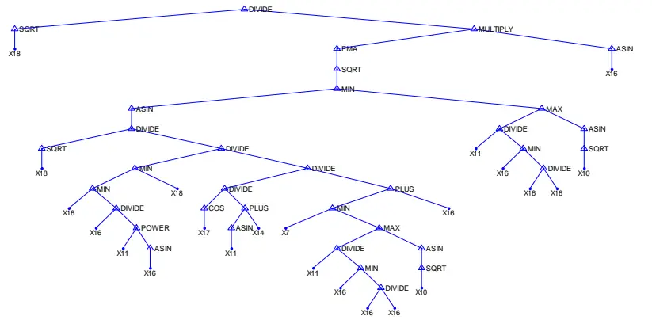
数据来源：广发证券发展研究中心

## （三）Y003 策略实证

Y003策略共792次交易，日均交易1次，胜率43.8%，盈亏比2.02倍，2010、2011、2012、2013年化收益率分别为64.6%、27.9%、42.0%、62.9%，最大回撤-6.3%。

图12：Y003策略累计收益
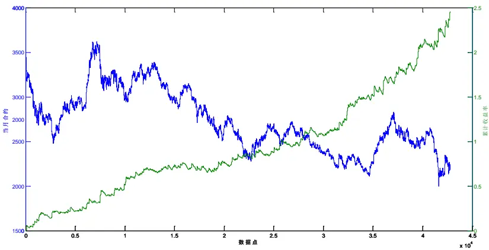
数据来源：广发证券发展研究中心

表9：Y003策略全部信号

| 评价指标 全样本 |  | 2010 | 2011 2012 |  | 2013 |
| --- | --- | --- | --- | --- | --- |
| 累计收益率 | 245.3% | 45.0% | 27.3% | 40.8% | 32.9% |
| 年化收益率 | 77.4% | 64.6% | 27.9% | 42.0% | 62.9% |
| 交易次数 | 792 | 174 | 244 | 243 | 131 |
| 获胜次数 | 347 | 67 | 102 | 117 | 61 |
| 失败次数 | 445 | 107 | 142 | 126 | 70 |
| 胜率 | 43.8% | 38.5% | 41.8% | 48.1% | 46.6% |
| 单次均收益率 | 0.2% | 0.2% | 0.1% | 0.1% | 0.2% |
| 单次获胜均收益率 | 1.0% | 1.4% | 0.9% | 0.8% | 1.1% |
| 单次失败均收益率 | -0.5% | -0.5% | -0.5% | -0.5% | -0.5% |
| 赔率 | 2.02 | 2.71 | 1.88 | 1.69 | 2.08 |
| 最大回撤 | -6.3% | -5.6% | -6.3% | -4.8% | -3.8% |
| 最大连胜次数 | 6 | 5 | 6 | 5 | 6 |
| 最大连败次数 | 9 | 8 | 9 | 5 | 5 |

数据来源：广发证券发展研究中心

表10：Y003策略Long信号

| 评价指标 全样本 2010 |  |  | 2011 2012 |  | 2013 |
| --- | --- | --- | --- | --- | --- |
| 累计收益率 | 44.1% | 9.4% | -2.2% | 17.7% | 14.4% |
| 年化收益率 | 13.9% | 13.5% | -2.3% | 18.2% | 27.5% |
| 交易次数 | 260 | 57 | 74 | 89 | 40 |
| 获胜次数 | 99 | 19 | 25 | 38 | 17 |
| 失败次数 | 161 | 38 | 49 | 51 | 23 |
| 胜率 | 38.1% | 33.3% | 33.8% | 42.7% | 42.5% |
| 单次均收益率 | 0.1% | 0.2% | 0.0% | 0.2% | 0.3% |
| 单次获胜均收益率 | 1.2% | 1.5% | 0.9% | 1.1% | 1.5% |

识别风险，发现价值

| 单次失败均收益率 | -0.5% | -0.5% | -0.5% | -0.5% | -0.5% |
| --- | --- | --- | --- | --- | --- |
| 赔率 | 2.39 | 2.95 | 1.80 | 2.27 | 2.89 |
| 最大回撤 | -10.5% | -5.2% | -10.5% | -4.7% | -3.4% |
| 最大连胜次数 | 7 | 4 | 6 | 7 | 5 |
| 最大连败次数 | 10 | 10 | 9 | 6 | 5 |

数据来源：广发证券发展研究中心

表11：Y003策略Short信号

| 评价指标 | 全样本 | 2010 | 2011 2012 |  | 2013 |
| --- | --- | --- | --- | --- | --- |
| 累计收益率 | 139.7% | 32.5% | 30.1% | 19.6% | 16.2% |
| 年化收益率 | 44.1% | 46.7% | 30.9% | 20.2% | 30.9% |
| 交易次数 | 532 | 117 | 170 | 154 | 91 |
| 获胜次数 | 248 | 48 | 77 | 79 | 44 |
| 失败次数 | 284 | 69 | 93 | 75 | 47 |
| 胜率 | 46.6% | 41.0% | 45.3% | 51.3% | 48.4% |
| 单次均收益率 | 0.2% | 0.2% | 0.2% | 0.1% | 0.2% |
| 单次获胜均收益率 | 0.9% | 1.4% | 1.0% | 0.7% | 0.9% |
| 单次失败均收益率 | -0.5% | -0.5% | -0.5% | -0.5% | -0.5% |
| 赔率 | 1.86 | 2.61 | 1.91 | 1.42 | 1.76 |
| 最大回撤 | -5.4% | -4.6% | -3.2% | -4.9% | -2.8% |
| 最大连胜次数 | 7 | 6 | 6 | 7 | 5 |
| 最大连败次数 | 8 | 6 | 6 | 8 | 4 |

数据来源：广发证券发展研究中心

图13：Y003策略信号函数树形结构
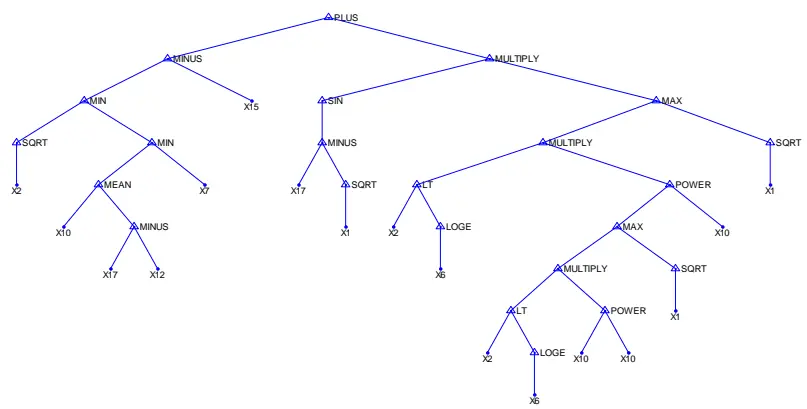
数据来源：广发证券发展研究中心

## （四）Y004策略实证

Y004策略共792次交易，日均交易1次，胜率42.8%，盈亏比1.91倍，2010、2011、2012、2013年化收益率分别为40.2%、25.8%、23.5%、60.1%，最大回撤-9.3%。

图14：Y004策略累计收益
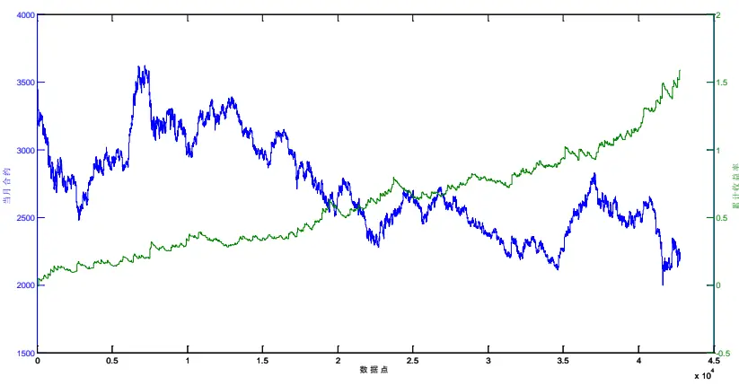
数据来源：广发证券发展研究中心

表12：Y004策略全部信号

| 评价指标 全样本 2010 |  |  | 2011 2012 |  | 2013 |
| --- | --- | --- | --- | --- | --- |
| 累计收益率 | 158.8% | 28.0% | 25.2% | 22.9% | 31.5% |
| 年化收益率 | 50.1% | 40.2% | 25.8% | 23.5% | 60.1% |
| 交易次数 | 792 | 174 | 244 | 243 | 131 |
| 获胜次数 | 339 | 64 | 104 | 111 | 60 |
| 失败次数 | 453 | 110 | 140 | 132 | 71 |
| 胜率 | 42.8% | 36.8% | 42.6% | 45.7% | 45.8% |
| 单次均收益率 | 0.1% | 0.1% | 0.1% | 0.1% | 0.2% |
| 单次获胜均收益率 | 1.0% | 1.3% | 0.9% | 0.8% | 1.1% |
| 单次失败均收益率 | -0.5% | -0.5% | -0.5% | -0.5% | -0.5% |
| 赔率 | 1.91 | 2.51 | 1.79 | 1.57 | 2.09 |
| 最大回撤 | -9.3% | -5.3% | -7.9% | -9.3% | -4.7% |
| 最大连胜次数 | 6 | 6 | 6 | 5 | 5 |
| 最大连败次数 | 10 | 9 | 10 | 8 | 6 |

数据来源：广发证券发展研究中心

表13：Y004策略Long信号

| 评价指标 全样本 |  | 2010 | 2011 | 2012 | 2013 |
| --- | --- | --- | --- | --- | --- |
| 累计收益率 | 24.2% | 0.3% | -1.0% | 11.2% | 12.3% |
| 年化收益率 | 7.6% | 0.5% | -1.0% | 11.6% | 23.5% |
| 交易次数 | 204 | 39 | 58 | 70 | 37 |
| 获胜次数 | 72 | 11 | 19 | 28 | 14 |

识别风险，发现价值

| 失败次数 | 132 | 28 | 39 | 42 | 23 |
| --- | --- | --- | --- | --- | --- |
| 胜率 | 35.3% | 28.2% | 32.8% | 40.0% | 37.8% |
| 单次均收益率 | 0.1% | 0.0% | 0.0% | 0.2% | 0.3% |
| 单次获胜均收益率 | 1.3% | 1.4% | 1.0% | 1.2% | 1.8% |
| 单次失败均收益率 | -0.5% | -0.5% | -0.5% | -0.5% | -0.5% |
| 赔率 | 2.44 | 2.65 | 1.98 | 2.27 | 3.20 |
| 最大回撤 | -7.2% | -3.8% | -5.6% | -7.2% | -2.5% |
| 最大连胜次数 | 5 | 4 | 5 | 5 | 4 |
| 最大连败次数 | 9 | 7 | 9 | 8 | 4 |

数据来源：广发证券发展研究中心

表14：Y004策略Short信号

| 评价指标 | 全样本 2010 2011 2012 |  |  |  | 2013 |
| --- | --- | --- | --- | --- | --- |
| 累计收益率 | 108.4% | 27.5% | 26.4% | 10.5% | 17.1% |
| 年化收益率 | 34.2% | 39.5% | 27.0% | 10.8% | 32.6% |
| 交易次数 | 588 | 135 | 186 | 173 | 94 |
| 获胜次数 | 267 | 53 | 85 | 83 | 46 |
| 失败次数 | 321 | 82 | 101 | 90 | 48 |
| 胜率 | 45.4% | 39.3% | 45.7% | 48.0% | 48.9% |
| 单次均收益率 | 0.1% | 0.2% | 0.1% | 0.1% | 0.2% |
| 单次获胜均收益率 | 0.9% | 1.3% | 0.9% | 0.7% | 0.9% |
| 单次失败均收益率 | -0.5% | -0.5% | -0.5% | -0.5% | -0.5% |
| 赔率 | 1.77 | 2.49 | 1.75 | 1.33 | 1.75 |
| 最大回撤 | -6.6% | -4.4% | -6.6% | -5.6% | -3.1% |
| 最大连胜次数 | 5 | 5 | 5 | 4 | 5 |
| 最大连败次数 | 8 | 6 | 6 | 8 | 3 |

数据来源：广发证券发展研究中心

图15：Y004策略信号函数树形结构
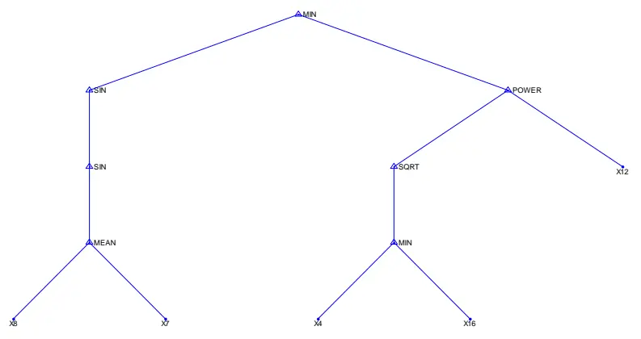
数据来源：广发证券发展研究中心

## （五）Y005 策略实证

Y005策略共450次交易，日均交易0.57次，胜率51.8%，盈亏比2.02倍，2010、2011、2012、2013年化收益率分别为86.0%、33.4%、28.8%、25.8%，最大回撤-7.2%。

图16：Y005策略累计收益
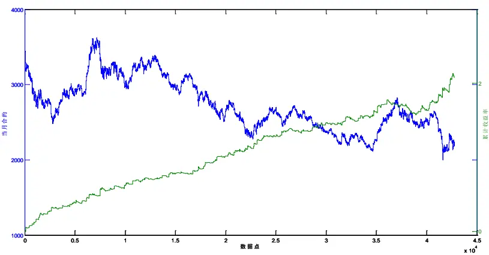
数据来源：广发证券发展研究中心

表15：Y005策略全部信号

| 评价指标 全样本 2010 |  |  | 2011 | 2012 | 2013 |
| --- | --- | --- | --- | --- | --- |
| 累计收益率 | 208.0% | 59.9% | 32.6% | 28.0% | 13.5% |
| 年化收益率 | 65.7% | 86.0% | 33.4% | 28.8% | 25.8% |
| 交易次数 | 450 | 110 | 133 | 127 | 80 |
| 获胜次数 | 233 | 57 | 74 | 68 | 34 |
| 失败次数 | 217 | 53 | 59 | 59 | 46 |
| 胜率 | 51.8% | 51.8% | 55.6% | 53.5% | 42.5% |
| 单次均收益率 | 0.3% | 0.4% | 0.2% | 0.2% | 0.2% |
| 单次获胜均收益率 | 0.9% | 1.3% | 0.7% | 0.7% | 1.0% |
| 单次失败均收益率 | -0.5% | -0.5% | -0.4% | -0.4% | -0.5% |
| 赔率 | 2.02 | 2.73 | 1.68 | 1.75 | 2.13 |
| 最大回撤 | -7.2% | -2.7% | -1.7% | -2.6% | -7.2% |
| 最大连胜次数 | 6 | 5 | 5 | 6 | 5 |
| 最大连败次数 | 8 | 5 | 4 | 4 | 8 |

数据来源：广发证券发展研究中心

表16：Y005策略Long信号

| 评价指标 | 全样本 | 2010 | 2011 | 2012 | 2013 |
| --- | --- | --- | --- | --- | --- |
| 累计收益率 | 52.3% | 16.2% | 6.2% | 17.2% | 5.3% |
| 年化收益率 | 16.5% | 23.3% | 6.4% | 17.7% | 10.2% |
| 交易次数 | 100 | 27 | 25 | 26 | 22 |
| 获胜次数 | 55 | 16 | 14 | 17 | 8 |
| 失败次数 | 45 | 11 | 11 | 9 | 14 |
| 胜率 | 55.0% | 59.3% | 56.0% | 65.4% | 36.4% |
| 单次均收益率 | 0.4% | 0.6% | 0.2% | 0.6% | 0.2% |
| 单次获胜均收益率 | 1.2% | 1.3% | 0.8% | 1.2% | 1.5% |
| 单次失败均收益率 | -0.5% | -0.4% | -0.4% | -0.5% | -0.5% |
| 赔率 | 2.51 | 2.83 | 1.76 | 2.43 | 3.22 |
| 最大回撤 | -3.7% | -1.7% | -1.7% | -1.6% | -3.7% |
| 最大连胜次数 | 9 | 5 | 3 | 6 | 3 |
| 最大连败次数 | 8 | 2 | 4 | 3 | 8 |

数据来源：广发证券发展研究中心

表17：Y005策略Short信号

| 评价指标 | 全样本 | 2010 | 2011 | 2012 | 2013 |
| --- | --- | --- | --- | --- | --- |
| 累计收益率 | 102.2% | 37.5% | 24.8% | 9.3% | 7.8% |
| 年化收益率 | 32.3% | 53.9% | 25.4% | 9.5% | 14.8% |
| 交易次数 | 350 | 83 | 108 | 101 | 58 |
| 获胜次数 | 178 | 41 | 60 | 51 | 26 |
| 失败次数 | 172 | 42 | 48 | 50 | 32 |
| 胜率 | 50.9% | 49.4% | 55.6% | 50.5% | 44.8% |
| 单次均收益率 | 0.2% | 0.4% | 0.2% | 0.1% | 0.1% |
| 单次获胜均收益率 | 0.8% | 1.3% | 0.7% | 0.6% | 0.9% |
| 单次失败均收益率 | -0.5% | -0.5% | -0.4% | -0.4% | -0.5% |
| 赔率 | 1.86 | 2.71 | 1.65 | 1.42 | 1.82 |
| 最大回撤 | -5.3% | -2.8% | -1.6% | -3.2% | -3.7% |
| 最大连胜次数 | 6 | 4 | 6 | 4 | 4 |
| 最大连败次数 | 7 | 4 | 3 | 4 | 7 |

数据来源：广发证券发展研究中心

图17：Y005策略信号函数树形结构

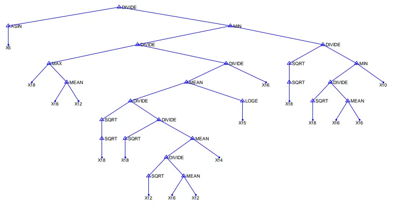
数据来源：广发证券发展研究中心

## （六）多策略组合

大家都知道，股指期货日内交易策略的实际运作一定要多策略，多策略的优势在于平滑收益、分散策略风险、控制资金回撤等等，我们接下来将上述5个策略进行等权组合。

等权策略组合累计收益率为191.7%，最大回撤仅为-2.76%，收益新高最大需要38个交易日，分年度来看2010、2011、2012、2013年化收益分别为59.1%、32.9%、30.5%、39.1%。

图18：Y001~Y005策略累计收益
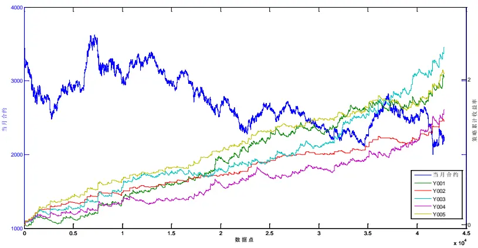
数据来源：广发证券发展研究中心

图19：多策略组合等权收益表现

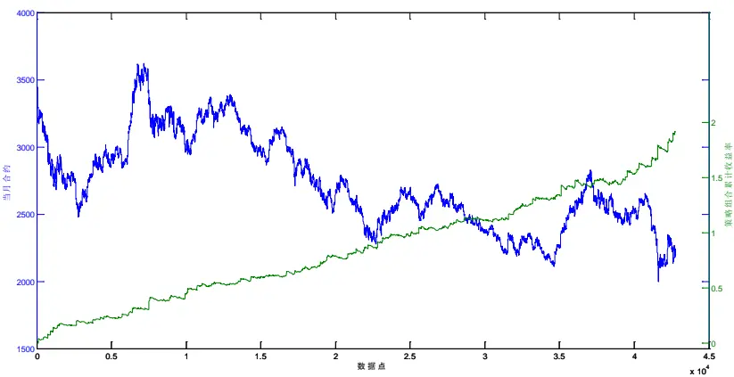
数据来源：广发证券发展研究中心

表18：多策略组合分年度表现

| 年份 累计收益率 |  | 年化收益率 | 最大回撤 |
| --- | --- | --- | --- |
| 2010 | 41.18% | 59.16% | -2.43% |
| 2011 | 32.17% | 32.96% | -2.11% |
| 2012 | 29.71% | 30.56% | -1.95% |
| 2013 | 20.52% | 39.16% | -2.76% |

数据来源：广发证券发展研究中心

表19：多策略组合分月度表现

| 月份 | 累计收益率 | 年化收益率 | 最大回撤 |
| --- | --- | --- | --- |
| 201004 | 5.37% | 121.95% | -1.28% |
| 201005 | 11.85% | 148.17% | -1.28% |
| 201006 | 1.94% | 25.51% | -1.80% |
| 201007 | 0.91% | 10.37% | -2.43% |
| 201008 | 1.28% | 14.57% | -1.60% |
| 201009 | 2.05% | 26.99% | -1.10% |
| 201010 | 5.32% | 83.09% | -1.02% |
| 201011 | 5.01% | 56.95% | -2.28% |
| 201012 | 1.87% | 20.30% | -1.26% |
| 201101 | 5.61% | 70.10% | -1.73% |
| 201102 | 2.42% | 40.40% | -0.93% |
| 201103 | 0.77% | 8.40% | -1.05% |
| 201104 | 1.72% | 22.63% | -0.91% |
| 201105 | 1.62% | 19.29% | -1.57% |
| 201106 | 1.41% | 16.75% | -0.73% |
| 201107 | 1.67% | 19.89% | -1.17% |
| 201108 | 2.00% | 21.69% | -1.26% |

识别风险，发现价值

| 201109 | 4.14% | 49.26% | -0.86% |
| --- | --- | --- | --- |
| 201110 | 2.02% | 31.49% | -1.32% |
| 201111 | 4.34% | 49.27% | -0.90% |
| 201112 | 0.64% | 7.25% | -1.99% |
| 201201 | 5.14% | 85.62% | -0.71% |
| 201202 | 0.07% | 0.88% | -1.34% |
| 201203 | 4.23% | 48.06% | -1.02% |
| 201204 | -0.28% | -4.06% | -1.47% |
| 201205 | 2.04% | 23.21% | -1.23% |
| 201206 | 2.55% | 31.84% | -1.40% |
| 201207 | -0.75% | -8.55% | -1.47% |
| 201208 | 0.12% | 1.31% | -0.95% |
| 201209 | 5.33% | 66.67% | -0.89% |
| 201210 | 2.82% | 39.14% | -1.04% |
| 201211 | 0.50% | 5.70% | -1.18% |
| 201212 | 4.79% | 57.07% | -1.72% |
| 201301 | 0.96% | 11.97% | -1.99% |
| 201302 | 1.59% | 26.53% | -1.38% |
| 201303 | -0.24% | -2.86% | -2.38% |
| 201304 | 3.53% | 48.98% | -1.62% |
| 201305 | 2.10% | 23.81% | -1.38% |
| 201306 | 6.00% | 88.24% | -1.12% |
| 201307 | 5.13% | 71.30% | -1.62% |

数据来源：广发证券发展研究中心

图20：多策略组合分月度表现
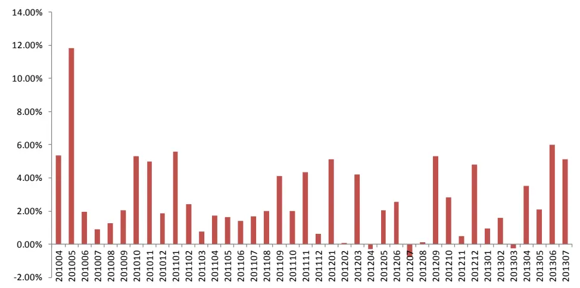
数据来源：广发证券发展研究中心

## 四、总结

（1）遗传规划智能交易策略Y001回顾，我们在2012年9月16日发布遗传规划智能研发交易策略的专题报告《基于遗传规划的智能交易策略方法》，进行这一方向研究的启发来自于TSL，即Trading System Lab公司，该公司基于遗传规划方法研发了若干交易策略，在鼎鼎大名的Futures Truth Magazine排行榜中多个策略跻身前十名，成绩斐然。

报告中我们发布了采用遗传规划自动生成的编号为Y001的策略，策略从2012年8月24日的131.8%累计收益率到目前203.5%，累计收益在最近一个累计年度内增长了76.7%。

（2）多维变量输入的新智能策略，本文我们继续延续已构建的遗传规划算法框架，采用5分钟周期数据，全样本截止到2013.7.24，样本内截止到2012.12.31，输入变量丰富到18个，包括了价格、成交量、动量、趋势强度、反转、摆动、资金流向、区间波动强度、加速癫狂情绪等各方面数据。

（3）Y002至Y005策略，共新生产四个交易交易策略，分别编号为Y002至Y005。

Y002策略共258次交易，日均交易0.33次，胜率53.5%，盈亏比2.33倍，2010、2011、2012、2013年化收益率分别为69.2%、21.7%、25.3%、23.5%，最大回撤-4.7%。

Y003策略共792次交易，日均交易1次，胜率43.8%，盈亏比2.02倍，2010、2011、2012、2013年化收益率分别为64.6%、27.9%、42.0%、62.9%，最大回撤-6.3%。

Y004策略共792次交易，日均交易1次，胜率42.8%，盈亏比1.91倍，2010、2011、2012、2013年化收益率分别为40.2%、25.8%、23.5%、60.1%，最大回撤-9.3%。

Y005策略共450次交易，日均交易0.57次，胜率51.8%，盈亏比2.02倍，2010、2011、2012、2013年化收益率分别为86.0%、33.4%、28.8%、25.8%，最大回撤-7.2%。

（4）等权多策略组合，等权策略组合累计收益率为191.7%，最大回撤仅为-2.76%，收益新高最大需要38个交易日，分年度来看2010、2011、2012、2013年化收益分别为59.1%、32.9%、30.5%、39.1%。

## 风险提示

策略模型并非百分百有效，市场结构及交易行为的改变或者交易参与者的增多有可能使得策略失效。

## 广发金融工程研究小组

罗 军： 首席分析师，华南理工大学理学硕士，2010年进入广发证券发展研究中心。

俞文冰： 首席分析师，CFA，上海财经大学统计学硕士，2012年进入广发证券发展研究中心。

叶 涛： 资深分析师，CFA ，上海交通大学管理科学与工程硕士，2012年进入广发证券发展研究中心。

安宁宁： 资深分析师，暨南大学数量经济学硕士，2011年进入广发证券发展研究中心。

胡海涛： 分析师， 华南理工大学理学硕士， 2010年进入广发证券发展研究中心。

夏潇阳： 分析师， 上海交通大学金融工程硕士， 2012年进入广发证券发展研究中心。

蓝昭钦： 分析师， 中山大学理学硕士， 2010年进入广发证券发展研究中心。

史庆盛： 分析师， 华南理工大学金融工程硕士， 2011年进入广发证券发展研究中心。

汪 鑫： 研究助理， 中国科学技术大学金融工程硕士， 2012年进入广发证券发展研究中心。

张 超： 研究助理， 中山大学理学硕士，2012年进入广发证券发展研究中心。

## 广发证券—行业投资评级说明

买入： 预期未来12个月内，股价表现强于大盘10%以上。

持有： 预期未来12个月内，股价相对大盘的变动幅度介于-10%～+10%。

卖出： 预期未来12个月内，股价表现弱于大盘10%以上。

## 广发证券—公司投资评级说明

买入： 预期未来12个月内，股价表现强于大盘15%以上。

谨慎增持： 预期未来12个月内，股价表现强于大盘5%-15%。

持有： 预期未来12个月内，股价相对大盘的变动幅度介于-5%～+5%。

卖出： 预期未来12个月内，股价表现弱于大盘5%以上。

## 联系我们

|  | 广州市 | 深圳市 | 北京市 | 上海市 |
| --- | --- | --- | --- | --- |
| 地址 | 广州市天河北路183号 大都会广场5楼 | 深圳市福田区金田路4018 号安联大厦 15 楼 A 座 | 北京市西城区月坛北街2号 月坛大厦18层 | 上海市浦东新区富城路99号 震旦大厦18楼 |
| 邮政编码 | 510075 | 03-04 |  |  |
| 客服邮箱 |  | 518026 | 100045 | 200120 |
|  | gfyf@gf.com.cn |  |  |  |
| 服务热线 | 020-87555888-8612 |  |  |  |

## 免责声明

广发证券股份有限公司具备证券投资咨询业务资格。本报告只发送给广发证券重点客户，不对外公开发布。

本报告所载资料的来源及观点的出处皆被广发证券股份有限公司认为可靠，但广发证券不对其准确性或完整性做出任何保证。报告内容仅供参考，报告中的信息或所表达观点不构成所涉证券买卖的出价或询价。广发证券不对因使用本报告的内容而引致的损失承担任何责任，除非法律法规有明确规定。客户不应以本报告取代其独立判断或仅根据本报告做出决策。

广发证券可发出其它与本报告所载信息不一致及有不同结论的报告。本报告反映研究人员的不同观点、见解及分析方法，并不代表广发证券或其附属机构的立场。报告所载资料、意见及推测仅反映研究人员于发出本报告当日的判断，可随时更改且不予通告。

本报告旨在发送给广发证券的特定客户及其它专业人士。未经广发证券事先书面许可，任何机构或个人不得以任何形式翻版、复制、刊登、转载和引用，否则由此造成的一切不良后果及法律责任由私自翻版、复制、刊登、转载和引用者承担。