# 基于统计语言模型（SLM）的择时交易研究

# 另类交易策略之十三

## 报告摘要：

## 自然语言处理

自然语言处理始于 1950年计算机科学之父图灵，在 60年的发展过程中，基本可以分为两个阶段，第一阶段研究者采用电脑模拟人脑的过程，至 70 年代，传统语言学家走到了尽头，研究成果有限；第二阶段贾里尼克和他领导的IBM华生实验室开启利用统计学方法来进行自然语言处理之先河，获得了巨大成就，其实验室团队堪称史上最豪华阵容，后来解散后布朗与达拉皮垂兄弟去了文艺复兴科技公司，在西蒙斯退休后布朗已经出任 CEO，该公司创造了投资奇迹，几十年经久不败，本文将采用统计语言模型来识别市场涨跌进而形成交易策略。

## 统计语言模型 SLM

语音识别专家要识别一段语言，即选择一组可能性最大的句子，首先将句子分词，然后根据语料库估算一个给定语句的可能性，从而选择可能性最大的语句作为识别结果。股市择时中，我们将历史行情数据进行符号化之后，转化为涨跌符号序列，在给定过去一段时间内的涨跌序列后，我们计算该条件下的未来涨跌的条件概率，较大者为预测结果，相比较而言，我们的语料库为历史数据。

## 实证交易结果

以 1995 至 2004 年为初始语料库，2005 至 2009 年为样本内来寻找最佳模型阶数，根据历史收益最大化原则，确定模型阶数为 6。

设置 1%为止损幅度，该止损幅度的意义在于当日盘中的波动较昨日收盘价的变动幅度在不利方向超过或等于 1%时，我们触发止损机制，强制平仓，否则持有到 15点，观察次日涨跌信号再进行判断。

从交易结果来看，2005 年至 2013 年累计收益率 1476.2%，年化收益率 80.3%，胜率 46.1%，最大回撤-21.5%，样本外 2010、2011、2012、2013 年度分别取得 9.4%、20.2%、22.5%、32.5%的累计收益率，四个年份对应的最大回撤分别为-11.5%、-6.8%、-11.1%、-11.8%。

单纯择时不考虑止损下结果为， 2005 年至 2013 年累计收益率1392.2%，年化收益率 75%，胜率 53.1%，最大回撤-31.7%，样本外2010、2011、2012、2013 年度分别取得 6.4%、16%、17.6%、29%的累计收益率，四个年份对应的最大回撤分别为-21.3%、-9.0%、-8.3%、-14.1%。

综合考虑，实际运用建议加止损的模式。

图 不同阶模型下收益率
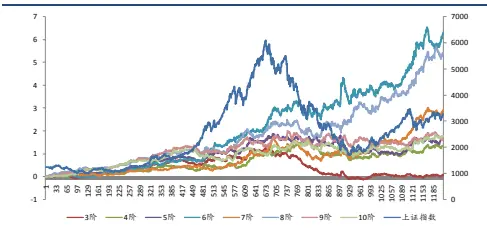

图 2六阶模型下择时收益率
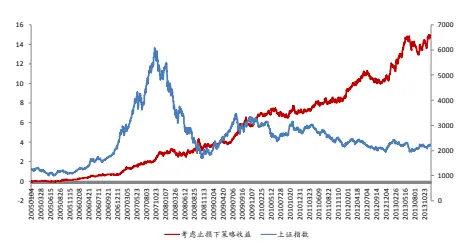

分析师： 安宁宁 S0260512020003

公0755-23948352

ann@gf.com.cn

## 相关研究：

另类交易策略系列之十二： 2013-09-02
基于遗传规划多维变量的
股指期货交易策略
另类交易策略系列之十一： 2013-06-17
日内突破模式及其资金管
理的多重比较研究
另类交易策略系列之十：基 2013-02-26
于遗传算法的期指日内交
易系统
另类交易策略系列之九：基 2013-09-16
于遗传规划的智能交易策
略方法

## 一、统计语言模型

## （一）自然语言处理

自然语言处理始于1950年计算机科学之父图灵1950年在《Mind》杂志上发表了一篇题为《计算的机器和智能》的论文，其在该文中提出了一种来验证机器是否有智能的方法，让人和机器进行交流。

自然语言处理在60年的发展过程中，基本可以分为两个阶段，第一阶段从20世纪50年代到70年代，研究者处于走弯路的阶段，其研究方式基本上被局限在了人类学习语言的方式上，用电脑模拟人脑，其大概过程是首先分析语句，再来获取语义，成果十分有限，研究者首先将一个简单的句子分解为主语、谓语、宾语等部分，再对每一部进行分析形成语法分析树（Parse Tree），所使用的文法规则称为重写规则，一条语句转化为一个复杂的二维树结构，这种思路和方式在实际问题遇到了不可逾越的两条鸿沟，其一文法规则的量级庞大，往往成数万条之众，语言学家几乎来不及写，其二分析的发杂度随着语句长度的增长呈几何级数扩大，对于上下文无关的文法，算法的复杂度是语句长度的二次方，而对于上下文有关的文法，计算复杂度是语句长度的六次方，即使使用目前双核处理器，要解析二三十个句子也需要几分钟的时间，传统自然语言处理研究者走到了尽头。

从20世纪70年代开始，弗里德里克.贾里尼克和他领导的IBM华生实验室，利用统计学方法来进行自然语言处理，获得了巨大成就。在此我们仅简单列举其研究团队的阵容就足以观其辉煌，其团队成员包括波尔（L.Bahl），著名的语音识别Dragon公司的创始人贝克夫妇（Jim Baker & Janet Baker），解决了最大熵迭代算法的达拉皮垂（S.Della Pietra & V.Della Pietra）兄弟，BCJR算法的另外两个共同提出者库克（J.Cocke）和拉维夫（J.Raviv），以及第一个地处机器翻译统计模型的布朗（Peter Brown）。

值得注意的是，上述自然语言处理史上最豪华阵容在解体之后，其中的布朗和达拉皮垂兄弟去了大名鼎鼎的文艺复兴技术公司，后者是远超巴菲特的对冲基金，二十多年经久不败，2010年西蒙斯退休之后，布朗称为了两位联席CEO之一，可见自然语言处理技术在投资领域之威力。

图1：文艺复兴大奖章基金历年收益

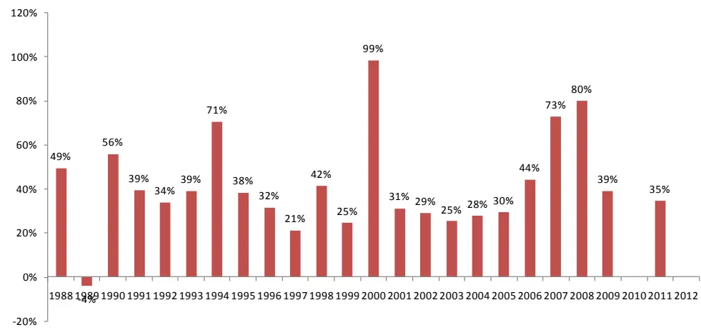
数据来源：广发证券发展研究中心

## （二）统计语言模型（SLM）

自然语言处理的统计学方法在提出之际是为了解决语音识别的，那么一段语音被识别为哪一个句子呢？或者说给定一个拟为识别的语句是否合理呢？就看它的可能性大小如何。

假设S表示为一个有意义的句子，由 $w_{1},w_{2},w_{3},\dots w_{n}$ 词组成，句子的长度为n，现在我们要求得该语句可能性即概率

$$
P(S)=P(w_{1},w_{2},w_{3},\dots w_{n})
$$

依照条件概率将其展开，

$$
\begin{array}{rl}&{P(w_{1},w_{2},w_{3},\ldots w_{n})}\\&{=P(w_{1})\cdot P(w_{2}\big|w_{1})\cdot P(w_{3}\big|w_{1},w_{2})\cdots P(w_{n}\big|w_{1},w_{2},\cdots w_{n-1})}\end{array}
$$

其中 $P(w_{1})$ 为第一个词出现的概率， $P(w_{2}\left|w_{1}\right.)$ 为在已知第一个词的前提下，第二个词出现的概率，以此类推。

上述 $w_{n}$ 词的出现与之前所有词都有关，为简化起见，假设模型具备马尔科夫性，即假设任意一个词 $w_{i}$ 的出现只与它前面一个词 $w_{i-1}$ 有关，于是

$$
\begin{array}{rl}&{P(S)}\\&{=P(w_{1})\cdot P(w_{2}\big|w_{1})\cdot P(w_{3}\big|w_{2})\cdots P(w_{n}\big|w_{n-1})}\end{array}
$$

上述模型称为二元模型（Bigram Model），如果一个词与前面N-1个词有关，那么该模型称为N元模型。

接下来如何求得条件概率 $P(w_{i}\left|w_{i-1}\right.)$ 呢，根据定义

$$
P(w_{i}\left|w_{i-1}\right.)=\frac{P(w_{i},w_{i-1})}{P(w_{i-1})}
$$

根据大数定律，相对频度近似为概率，因此我们仅需要统计语料库中相应词汇的频度即可，

$$
\begin{array}{c}{{P(w_{i},w_{i-1})\approx f(w_{i},w_{i-1})=\displaystyle\frac{\#(w_{i},w_{i-1})}{\#}}}\\{{{}}}\\{{P(w_{i-1})\approx f(w_{i-1})=\displaystyle\frac{\#(w_{i-1})}{\#}}}\\{{{}}}\\{{P(w_{i}\left|w_{i-1}\right.)\approx\displaystyle\frac{f(w_{i},w_{i-1})}{f(w_{i-1})}}}\end{array}
$$

## 二、N元模型及其择时应用

## （一）模型介绍

设指数收盘价序列为 $p_{1},p_{2},p_{3},\cdots,p_{n}$ ，我们首先将该价格序列转化为符号序列，即进行符号化，符号序列为 $s_{1},s_{2},s_{3},\cdots,s_{n}$ ，其中

如果 i i 1p p < − ， 1 is = ，否则 $s_{i}=2$

对于择时问题，我们仅需要判断下一个交易日的涨跌即可，那么如何进行判断呢，我们需要获取下一个交易日的涨跌的概率，上涨的概率大则判断上涨，下跌的概率大则判断为下跌。那么如何计算涨跌概率呢？

$$
\begin{array}{rl}&{p(\uparrow)}\\&{=p(s_{i}=2|s_{i-N+1},s_{i-N+2},\cdots,s_{i-1},)}\\&{=\frac{p\left(s_{i-N+1},s_{i-N+2},\cdots,s_{i-1},2\right)}{p\left(s_{i-N+1},s_{i-N+2},\cdots,s_{i-1}\right)}}\\&{p(\downarrow)}\\&{=p(s_{i}=1|s_{i-N+1},s_{i-N+2},\cdots,s_{i-1},)}\\&{=\frac{p\left(s_{i-N+1},s_{i-N+2},\cdots,s_{i-1},\right)}{p\left(s_{i-N+1},s_{i-N+2},\cdots,s_{i-1},\right)}}\end{array}
$$

类似于统计语言模型，其中一段词句（符号串）出现的概率我们根据语料库（历史行情序列）来进行训练得到，具体为

$$
p(s_{1},s_{2},s_{3},\cdots,s_{n})=\frac{\#(s_{1},s_{2},s_{3},\cdots,s_{n})}{\sum_{s}\#(s_{1},s_{2},s_{3},\cdots,s_{n})}
$$

## （二）模型应用及交易策略

根据上述 N元模型，即可判断下一个交易日的涨跌，

如果 $p(\uparrow)>p(\downarrow)$ ，判断为上涨，否则判断为下跌。

有了下一个交易日的涨跌我们进行如下的交易策略设计，由于股指期货在交易日正股收市之后仍然有 15分钟的交易时间，因此交易策略设计为当日 15点至 15点 15分进行交易，下一个交易日观察持仓风险暴露情况，如果浮亏达到或者超过 1%，那么立即进行平仓，当日股票市场收市后再进行下一个交易日的涨跌判断，在股指期货市场进行相应的头寸开仓，如果当时未发生止损，那么根据下一个交易日的判断进行顺延操作，如果下一个交易日判断方向与当前持仓方向相同，那么不进行操作，如果持仓方向不一致，那么进行先平仓再开仓的操作。

表1：模型交易策略操作规则

| 持仓方向 | 是否止损 信号方向 |  | 对应操作 |
| --- | --- | --- | --- |
| 持有多头 | 已止损持仓为零 | 看多 | 开多 |
|  |  | 看空 | 开空 |
|  | 不止损持仓多头 | 看多 | 不操作 |
|  |  | 看空 | 平多开空 |
| 未有持仓 |  | 看多 | 开多 |
|  |  | 看空 | 开空 |
| 持有空头 | 已止损持仓为零 | 看多 | 开多 |
|  |  | 看空 | 开空 |
|  | 不止损持仓空头 | 看多 | 平空开多 |
|  |  | 看空 | 不操作 |

数据来源：广发证券发展研究中心

## 三、上证指数实证

## （一）实证说明

（1）数据选取，本实证选取1995年1月3日至2013年12月13日的历史日线数据，其中1995至2004年为样本内，用来作为初始语料库，用来训练模型，同时，不断扩充历史数据，依次扩充语料库。

## （2）策略评价方法

策略评价指标我们选取如下表。

表2：模型实证评价体系

| 考察指标 | 说明 |
| --- | --- |
| 累计收益率 | 模拟交易期末累计收益率 |
| 交易总次数 | 总交易次数（自开仓至平仓为一个完整的交易周期） |
| 获胜次数 | 单次交易收益率大于0的次数 |
| 失败次数 | 单次交易收益率小于0的次数 |
| 胜率 | 获胜次数/交易总次数×100% |
| 单次获胜收益率 | 获胜交易的收益率算术平均值 |
| 单次失败亏损率 | 失败交易的收益率算术平均值 |
| 赔率 | 单次获胜平均收益率除以单次失败平均亏损率的绝对值 |
| 最大回撤 | 模拟交易资金自最高点缩水的最大幅度 |
| 最大连胜次数 | 最大连续收益率大于0的交易次数 |
| 最大连亏次数 | 最大连续收益率小于0的交易次数 |

数据来源：广发证券发展研究中心

## （3）模拟交易情景

止损线设置为1%，即当日市场价格较昨日收盘价浮亏达到或者超过1%时平仓止损，交易费率为单边万分之一。

## （二）模型阶数确定

N元模型来进行择时应用，如何选取模型阶数呢，一个直观的理解，模型阶数越大则包含的历史信息越多，应该越好，那是不是应该无限制的扩大模型阶数呢，事实上不是的，因为模型阶数越大对历史样本的依赖越大，数据稀疏问题随着模型阶数的增大越发严重，对于m阶符号化方法的n阶模型而言，其词组规模见下表3，其中m阶符号化方法指的是，在对原始序列进行符号化时，我们的备选符号集合的大小，例如备选符号为涨或者跌，那么m = 2，如果备选符号为涨、平、跌，则m =3等等以此类推，我们可以看到m = 2，n =10时，词组规模为1024，上证指数所有历史样本总量为5600多个交易日，那么历史训练库即使全部用作样本内，也仅有5600多个词组，相对于1024规模而言，训练样本太少，数据稀疏性问题较大，必然影响模型准确度。这里仅仅以2阶符号化方法前提下进行讨论，更高阶的情况下数据缺失问题更为明显。

表3：不同模型阶数下词组规模

| 模型阶数 | 2 符号 | 3符号 | 4符号 | 5符号 |
| --- | --- | --- | --- | --- |
| 3 | 8 | 27 | 64 | 125 |
| 4 | 16 | 81 | 256 | 625 |
| 5 | 32 | 243 | 1024 | 3125 |
| 6 | 64 | 729 | 4096 | 15625 |
| 7 | 128 | 2187 | 16384 | 78125 |
| 8 | 256 | 6561 | 65536 | 390625 |
| 9 | 512 | 19683 | 262144 | 1953125 |
| 10 | 1024 | 59049 | 1048576 | 9765625 |

数据来源：广发证券发展研究中心

图2：2阶符号化方法下N阶模型词组规模
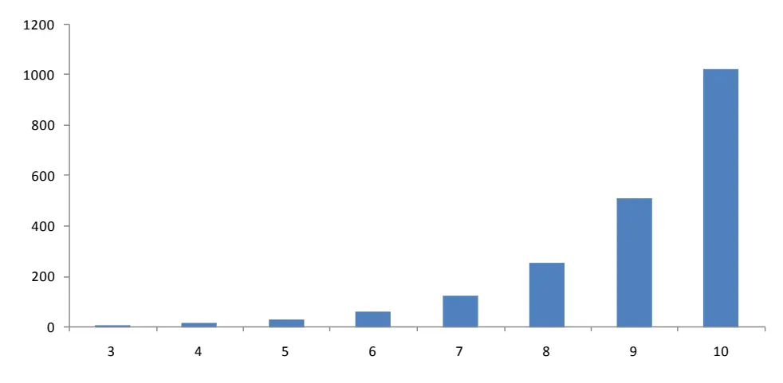
数据来源：广发证券发展研究中心

基于以上原因，本文模型在考虑仅有涨跌两类符号前提下进行，我们以1995年至2004年为初始训练样本，2005年至2009年数据来确定模型阶数，确定原则为2005年至2009年期间内的收益率最大化。

我们考虑不同阶数下模型的实证效果，选取其中在测试样本内收益最大的最为最后模型的阶数，从实际效果来看，6阶模型效果最佳，因此我们确定模型阶数为6。

图3：不同模型阶数在样本内收益

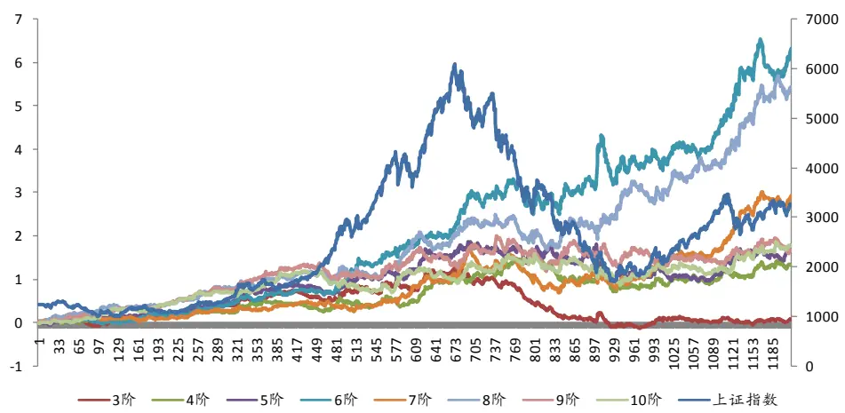
数据来源：广发证券发展研究中心

图4：不同模型阶数在样本内收益
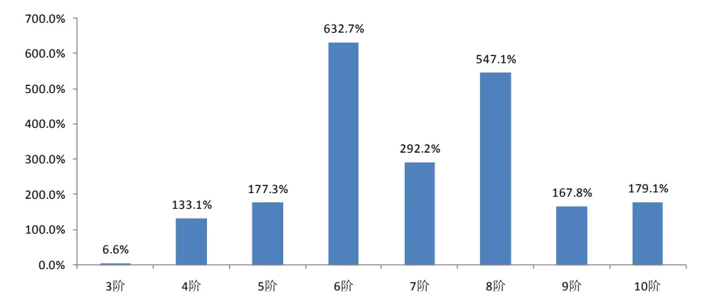
数据来源：广发证券发展研究中心

## （三）6 阶模型概率表一撇

为了更好的理解模型，我们来看一下用于预测涨跌概率的概率表，6阶模型的见表4，其中符号串为“111111”的样本有32个，频度为1.32%，因此我们认为连跌6个交易日的概率为1.32%，符号串“222222”的频度为1.45%，因此市场连续上涨6个交易日的概率为1.45%，从长期趋势来看，市场总是震荡上行的，因此连涨的概率应该高于连跌的概率。

那么，如何应用该概率表呢，我们举一个简单的例子，假如过去5个交易日的符号串为“11111”，那么明日上涨和下跌的概率分别为

$$
\begin{array}{l}{\displaystyle p(1\big\vert1,1,1,1,1)=\frac{p(1,1,1,1,1,1)}{p(1,1,1,1,1)}}\\{\displaystyle p(2\big\vert1,1,1,1,1)=\frac{p(1,1,1,1,1,2)}{p(1,1,1,1,1)}}\end{array}
$$

由于p(1,1,1,1,1)为固定的，不影响结果，那么下一个交易日的涨跌概率何者为

大仅取决于分子，根据历史数据“111111”的概率为1.32%，“111112”的概率为1.53%，因此我们预测明日为上涨。

表4：6阶模型概率表

| 符号串 | 样本数 频度 符号串 样本数 频度 符号串 样本数 频度 |  |  |  |  |  |  |  |
| --- | --- | --- | --- | --- | --- | --- | --- | --- |
| 111111 | 32 | 1.32% | 121221 | 48 | 1.98% | 212211 | 51 | 2.11% |
| 111112 | 37 | 1.53% | 121222 | 33 | 1.36% | 212212 | 52 | 2.15% |
| 111121 | 43 | 1.78% | 122111 | 41 | 1.69% | 212221 | 38 | 1.57% |
| 111122 | 38 | 1.57% | 122112 | 44 | 1.82% | 212222 | 44 | 1.82% |
| 111211 | 38 | 1.57% | 122121 | 38 | 1.57% | 221111 | 41 | 1.69% |
| 111212 | 36 | 1.49% | 122122 | 61 | 2.52% | 221112 | 31 | 1.28% |
| 111221 | 48 | 1.98% | 122211 | 25 | 1.03% | 221121 | 40 | 1.65% |
| 111222 | 27 | 1.12% | 122212 | 38 | 1.57% | 221122 | 35 | 1.45% |
| 112111 | 35 | 1.45% | 122221 | 46 | 1.90% | 221211 | 45 | 1.86% |
| 112112 | 33 | 1.36% | 122222 | 35 | 1.45% | 221212 | 33 | 1.36% |
| 112121 | 31 | 1.28% | 211111 | 37 | 1.53% | 221221 | 55 | 2.27% |
| 112122 | 45 | 1.86% | 211112 | 44 | 1.82% | 221222 | 49 | 2.02% |
| 112211 | 34 | 1.40% | 211121 | 31 | 1.28% | 222111 | 30 | 1.24% |
| 112212 | 47 | 1.94% | 211122 | 37 | 1.53% | 222112 | 31 | 1.28% |
| 112221 | 25 | 1.03% | 211211 | 30 | 1.24% | 222121 | 40 | 1.65% |
| 112222 | 37 | 1.53% | 211212 | 40 | 1.65% | 222122 | 43 | 1.78% |
| 121111 | 41 | 1.69% | 211221 | 33 | 1.36% | 222211 | 36 | 1.49% |
| 121112 | 37 | 1.53% | 211222 | 35 | 1.45% | 222212 | 45 | 1.86% |
| 121121 | 30 | 1.24% | 212111 | 43 | 1.78% | 222221 | 35 | 1.45% |
| 121122 | 33 | 1.36% | 212112 | 30 | 1.24% | 222222 | 35 | 1.45% |
| 121211 | 28 | 1.16% | 212121 | 24 | 0.99% |  |  |  |
| 121212 | 27 | 1.12% | 212122 | 36 | 1.49% |  |  |  |

数据来源：广发证券发展研究中心

图5：6阶模型概率
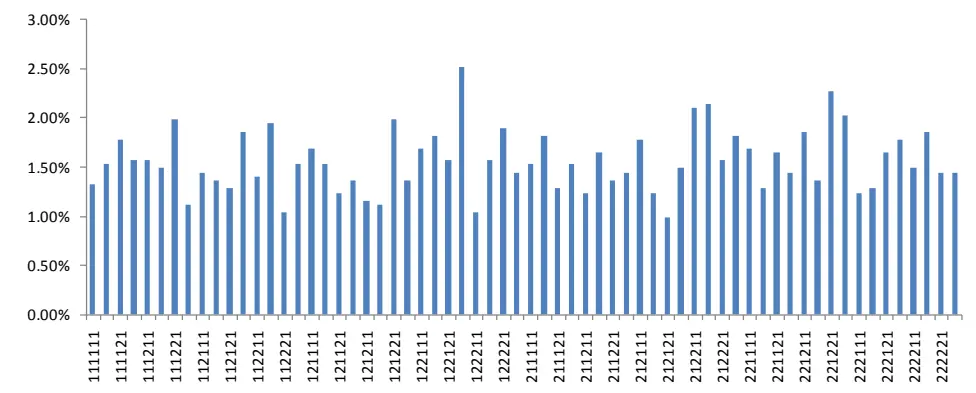
数据来源：广发证券发展研究中心

## （四）考虑止损下实证交易

基于长期交易策略开发经验，设置止损是一个较为直观和顺理成章的事情，依前所述，我们设置1%为止损幅度，该止损幅度的意义在于当日盘中的波动较昨日收盘价的变动幅度在不利方向超过或等于1%时，我们触发止损机制，强制平仓，否则持有到15点，观察次日涨跌信号再进行判断，以此类推。

从交易结果来看，2005年至2013年累计收益率1476.2%，年化收益率80.3%，胜率46.1%，最大回撤-21.5%，样本外2010、2011、2012、2013年度分别取得9.4%、20.2%、22.5%、32.5%的累计收益率，四个年份对应的最大回撤分别为-11.5%、-6.8%、-11.1%、-11.8%。

图6：考虑止损下SLM择时交易累计收益
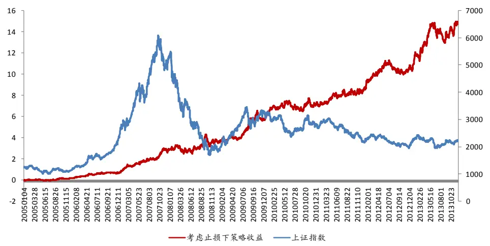
数据来源：广发证券发展研究中心

表5：考虑止损下SLM择时交易结果

| 评价指标 全样本 2005 2006 2007 2008 |  |  |  |  |  |
| --- | --- | --- | --- | --- | --- |
| 累计收益率 | 1476.2% | 21.7% | 48.9% | 125.5% | 15.7% |
| 年化收益率 | 80.3% | 22.4% | 50.7% | 129.6% | 15.9% |
| 交易次数 | 2170 | 241 | 240 | 241 | 245 |
| 获胜次数 | 1001 | 109 | 120 | 103 | 93 |
| 失败次数 | 1169 | 132 | 120 | 138 | 152 |
| 胜率 | 46.1% | 45.2% | 50.0% | 42.7% | 38.0% |
| 单次均收益率 | 0.1% | 0.1% | 0.2% | 0.4% | 0.1% |
| 单次获胜均收益率 | 1.3% | 1.0% | 1.1% | 2.2% | 2.3% |
| 单次失败均收益率 | -0.8% | -0.7% | -0.7% | -1.0% | -1.3% |
| 赔率 | 1.52 | 1.50 | 1.46 | 2.18 | 1.81 |
| 最大回撤 | -21.5% | -11.0% | -9.0% | -10.1% | -21.5% |
| 最大连胜次数 | 9 | 7 | 6 | 6 | 5 |
| 最大连败次数 | 10 | 7 | 10 | 8 | 10 |

识别风险，发现价值

数据来源：广发证券发展研究中心

表6：考虑止损下SLM择时交易结果

| 评价指标 | 2009 | 2010 | 2011 | 2012 | 2013 |
| --- | --- | --- | --- | --- | --- |
| 累计收益率 | 55.1% | 9.4% | 20.2% | 22.5% | 32.5% |
| 年化收益率 | 56.5% | 9.7% | 20.7% | 23.1% | 35.9% |
| 交易次数 | 243 | 241 | 243 | 242 | 225 |
| 获胜次数 | 112 | 105 | 130 | 115 | 110 |
| 失败次数 | 131 | 136 | 113 | 127 | 115 |
| 胜率 | 46.1% | 43.6% | 53.5% | 47.5% | 48.9% |
| 单次均收益率 | 0.2% | 0.0% | 0.1% | 0.1% | 0.1% |
| 单次获胜均收益率 | 1.5% | 1.1% | 0.8% | 0.9% | 0.9% |
| 单次失败均收益率 | -1.0% | -0.8% | -0.8% | -0.7% | -0.7% |
| 赔率 | 1.61 | 1.42 | 1.06 | 1.39 | 1.46 |
| 最大回撤 | -12.6% | -11.5% | -6.8% | -11.1% | -11.8% |
| 最大连胜次数 | 7 | 6 | 9 | 5 | 7 |
| 最大连败次数 | 7 | 10 | 6 | 6 | 10 |

数据来源：广发证券发展研究中心

图7：考虑止损下SLM择时交易各年度收益率
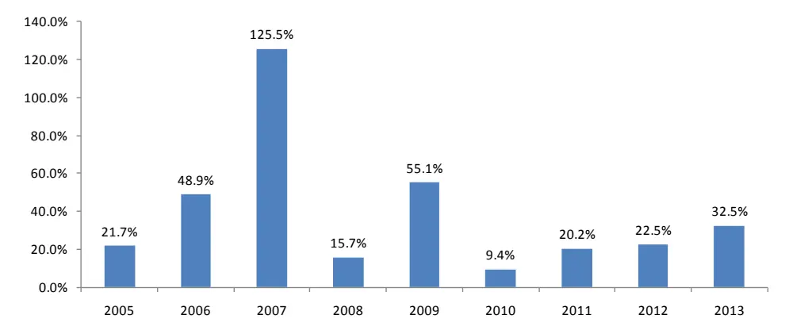
数据来源：广发证券发展研究中心

图8：考虑止损下SLM择时交易最大回撤情况

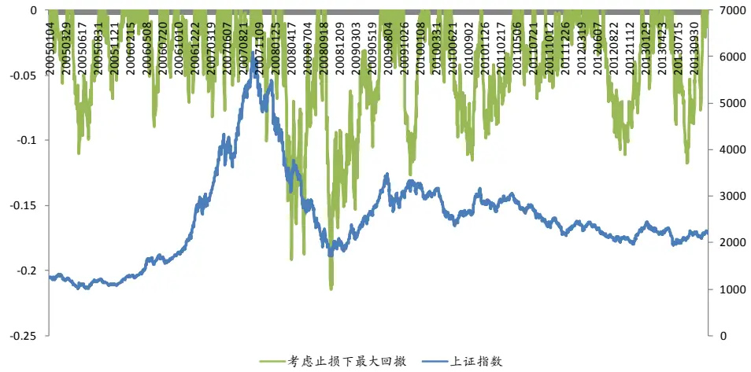
数据来源：广发证券发展研究中心

图9：考虑止损下SLM择时交易连胜情况
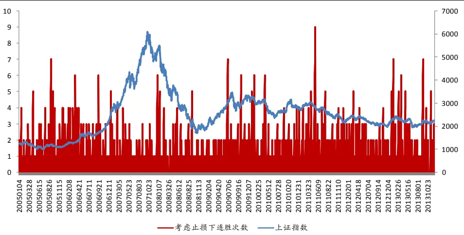
数据来源：广发证券发展研究中心

图10：考虑止损下SLM择时交易连胜情况
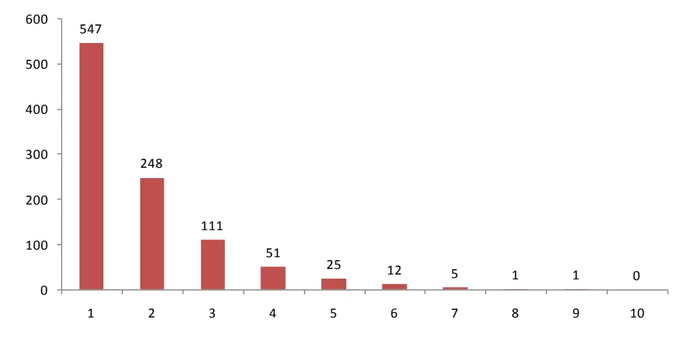
数据来源：广发证券发展研究中心

图11：考虑止损下SLM择时交易连亏情况
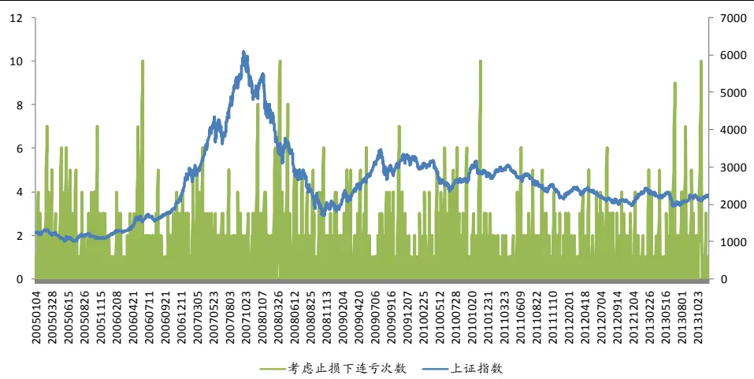
数据来源：广发证券发展研究中心

图12：考虑止损下SLM择时交易连亏情况
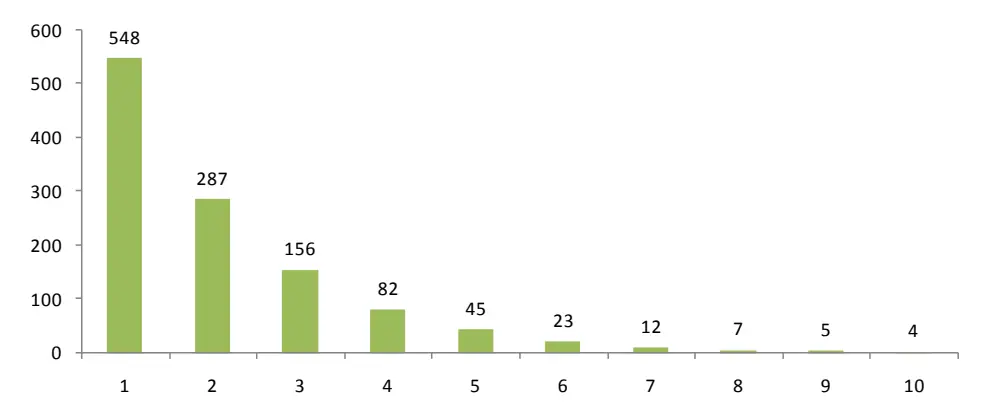
数据来源：广发证券发展研究中心

## （五）未考虑止损下实证交易

由于我们的初衷是来利用统计语言模型来进行市场择时，上述分析我们在进行择时的基础上加了止损等交易手段之后的结果，那么单纯的择时结果如何呢？

从交易结果来看，2005年至2013年累计收益率1392.2%，年化收益率75%，胜率53.1%，最大回撤-31.7%，样本外2010、2011、2012、2013年度分别取得6.4%、16%、17.6%、29%的累计收益率，四个年份对应的最大回撤分别为-21.3%、-9.0%、-8.3%、-14.1%。

图13：未考虑止损下SLM择时交易累计收益

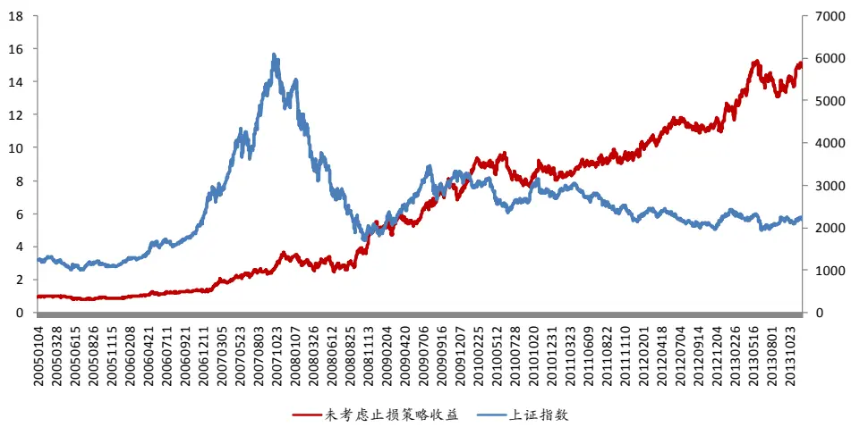
数据来源：广发证券发展研究中心

表7：未考虑止损下SLM择时交易结果

| 评价指标 | 全样本 | 2005 | 2006 | 2007 | 2008 |
| --- | --- | --- | --- | --- | --- |
| 累计收益率 | 1392.3% | -5.4% | 45.3% | 160.0% | 48.9% |
| 年化收益率 | 75.7% | -5.6% | 47.0% | 165.3% | 49.7% |
| 交易次数 | 2170 | 241 | 240 | 241 | 245 |
| 获胜次数 | 1152 | 112 | 132 | 136 | 136 |
| 失败次数 | 1018 | 129 | 108 | 105 | 109 |
| 胜率 | 53.1% | 46.5% | 55.0% | 56.4% | 55.5% |
| 单次均收益率 | 0.1% | 0.0% | 0.2% | 0.4% | 0.2% |
| 单次获胜均收益率 | 1.3% | 1.0% | 1.0% | 1.9% | 2.1% |
| 单次失败均收益率 | -1.1% | -0.9% | -0.9% | -1.5% | -2.2% |
| 赔率 | 1.11 | 1.12 | 1.15 | 1.28 | 0.97 |
| 最大回撤 | -31.7% | -21.6% | -14.1% | -14.0% | -30.0% |
| 最大连胜次数 | 12 | 7 | 6 | 7 | 9 |
| 最大连败次数 | 9 | 7 | 6 | 6 | 5 |

数据来源：广发证券发展研究中心

表8：未考虑止损下SLM择时交易结果

| 评价指标 | 2009 | 2010 | 2011 | 2012 | 2013 |
| --- | --- | --- | --- | --- | --- |
| 累计收益率 | 50.6% | 6.5% | 16.0% | 17.6% | 29.0% |
| 年化收益率 | 51.8% | 6.8% | 16.4% | 18.1% | 32.1% |
| 交易次数 | 243 | 241 | 243 | 242 | 225 |
| 获胜次数 | 137 | 121 | 139 | 120 | 115 |
| 失败次数 | 106 | 120 | 104 | 122 | 110 |
| 胜率 | 56.4% | 50.2% | 57.2% | 49.6% | 51.1% |
| 单次均收益率 | 0.2% | 0.0% | 0.1% | 0.1% | 0.1% |
| 单次获胜均收益率 | 1.5% | 1.1% | 0.8% | 0.9% | 0.9% |
| 单次失败均收益率 | -1.4% | -1.0% | -0.9% | -0.7% | -0.7% |
| 赔率 | 1.00 | 1.06 | 0.88 | 1.22 | 1.28 |

识别风险，发现价值

| 最大回撤 | -16.5% | -21.3% | -9.0% | -8.3% | -14.1% |
| --- | --- | --- | --- | --- | --- |
| 最大连胜次数 | 12 | 6 | 9 | 5 | 7 |
| 最大连败次数 | 6 | 6 | 5 | 6 | 9 |

数据来源：广发证券发展研究中心

图14：未考虑止损下SLM择时交易各年度收益率
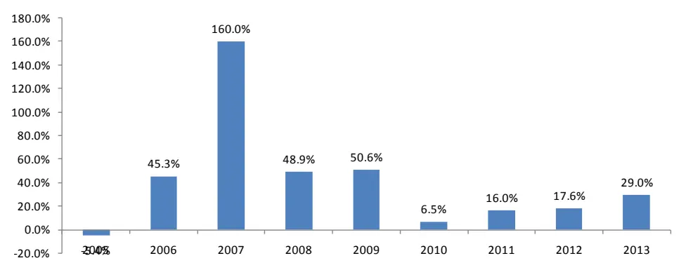
数据来源：广发证券发展研究中心

图15：SLM择时交易最大回撤情况
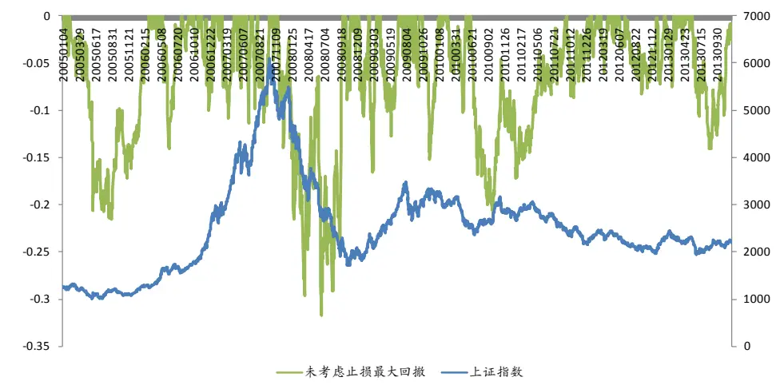
数据来源：广发证券发展研究中心

## （五）综合比较结果

综合比较止损与不止损来看，建议采用设置止损模式。

考虑止损下，样本外2010、2011、2012、2013年度分别取得9.4%、20.2%、22.5%、32.5%的累计收益率，四个年份对应的最大回撤分别为-11.5%、-6.8%、-11.1%、-11.8%。

不考虑止损下，样本外2010、2011、2012、2013年度分别取得6.4%、16%、17.6%、29%的累计收益率，四个年份对应的最大回撤分别为-21.3%、-9.0%、-8.3%、-14.1%。

识别风险，发现价值

图16：是否止损下策略各年度收益
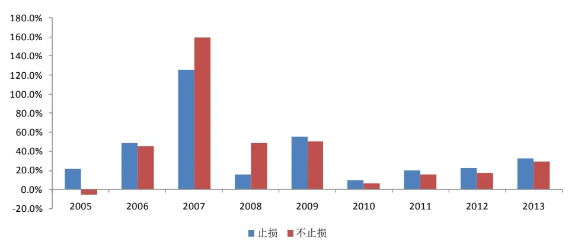
数据来源：广发证券发展研究中心

图17：是否止损下策略各年度最大回撤
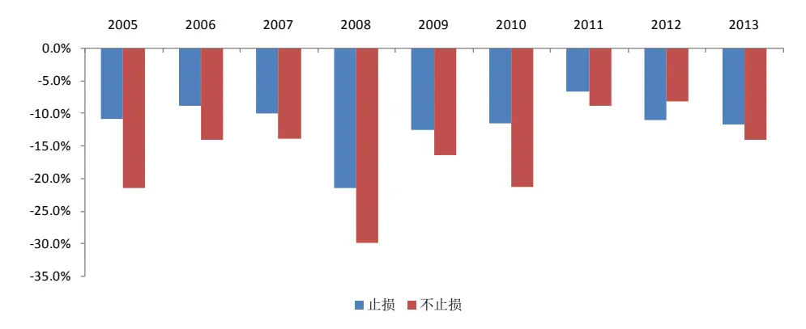
数据来源：广发证券发展研究中心

## 四、总结

（1）自然语言处理始于1950年计算机科学之父图灵，在60年的发展过程中，基本可以分为两个阶段，第一阶段研究者采用电脑模拟人脑的过程，至70年代，传统语言学家走到了尽头，研究成果有限；第二阶段贾里尼克和他领导的IBM华生实验室开启利用统计学方法来进行自然语言处理之先河，获得了巨大成就，其实验室团队堪称史上最豪华阵容，后来解散后布朗与达拉皮垂兄弟去了文艺复兴科技公司，在西蒙斯退休后布朗已经出任CEO，该公司创造了投资奇迹，几十年经久不败，本文将采用统计语言模型来识别市场涨跌进而形成交易策略。

（2）语音识别专家要识别一段语言，即选择一组可能性最大的句子，首先将句子分词，然后根据语料库估算一个给定语句的可能性，从而选择可能性最大的语句作为识别结果。股市择时中，我们将历史行情数据进行符号化之后，转化为涨跌符号序列，在给定过去一段时间内的涨跌序列后，我们计算该条件下的未来涨跌的条件概率，较大者为预测结果，相比较而言，我们的语料库为历史数据。

（3）以1995至2004年为初始语料库，2005至2009年为样本内来寻找最佳模型阶数，根据历史收益最大化原则，确定模型阶数为6。

设置1%为止损幅度，该止损幅度的意义在于当日盘中的波动较昨日收盘价的变动幅度在不利方向超过或等于1%时，我们触发止损机制，强制平仓，否则持有到15点，观察次日涨跌信号再进行判断。

从交易结果来看，2005年至2013年累计收益率1476.2%，年化收益率80.3%，胜率46.1%，最大回撤-21.5%，样本外2010、2011、2012、2013年度分别取得9.4%、20.2%、22.5%、32.5%的累计收益率，四个年份对应的最大回撤分别为-11.5%、-6.8%、-11.1%、-11.8%。

单纯择时不考虑止损下结果为， 2005年至2013年累计收益率1392.2%，年化收益率75%，胜率53.1%，最大回撤-31.7%，样本外2010、2011、2012、2013年度分别取得6.4%、16%、17.6%、29%的累计收益率，四个年份对应的最大回撤分别为-21.3%、-9.0%、-8.3%、-14.1%。

综合考虑，实际运用建议加止损的模式。

## 风险提示

策略模型并非百分百有效，市场结构及交易行为的改变或者交易参与者的增多有可能使得策略失效。

## 广发金融工程研究小组

罗 军： 首席分析师，华南理工大学理学硕士，2010年进入广发证券发展研究中心。

俞文冰： 首席分析师，CFA，上海财经大学统计学硕士，2012年进入广发证券发展研究中心。

叶 涛： 资深分析师，CFA ，上海交通大学管理科学与工程硕士，2012年进入广发证券发展研究中心。

安宁宁： 资深分析师，暨南大学数量经济学硕士，2011年进入广发证券发展研究中心。

胡海涛： 分析师， 华南理工大学理学硕士， 2010年进入广发证券发展研究中心。

夏潇阳： 分析师， 上海交通大学金融工程硕士， 2012年进入广发证券发展研究中心。

蓝昭钦： 分析师， 中山大学理学硕士， 2010年进入广发证券发展研究中心。

史庆盛： 分析师， 华南理工大学金融工程硕士， 2011年进入广发证券发展研究中心。

汪 鑫： 研究助理， 中国科学技术大学金融工程硕士， 2012年进入广发证券发展研究中心。

张 超： 研究助理， 中山大学理学硕士，2012年进入广发证券发展研究中心。

## 广发证券—行业投资评级说明

买入： 预期未来12个月内，股价表现强于大盘10%以上。

持有： 预期未来12个月内，股价相对大盘的变动幅度介于-10%～+10%。

卖出： 预期未来12个月内，股价表现弱于大盘10%以上。

## 广发证券—公司投资评级说明

买入： 预期未来12个月内，股价表现强于大盘15%以上。

谨慎增持： 预期未来12个月内，股价表现强于大盘5%-15%。

持有： 预期未来12个月内，股价相对大盘的变动幅度介于-5%～+5%。

卖出： 预期未来12个月内，股价表现弱于大盘5%以上。

## 联系我们

|  | 广州市 | 深圳市 | 北京市 | 上海市 |
| --- | --- | --- | --- | --- |
| 地址 | 广州市天河北路183号 大都会广场5楼 | 深圳市福田区金田路4018 号安联大厦 15 楼 A 座 | 北京市西城区月坛北街2号 月坛大厦18层 | 上海市浦东新区富城路99号 震旦大厦18楼 |
| 邮政编码 | 510075 | 03-04 |  |  |
| 客服邮箱 | gfyf@gf.com.cn | 518026 | 100045 | 200120 |
| 服务热线 | 020-87555888-8612 |  |  |  |

## 免责声明

广发证券股份有限公司具备证券投资咨询业务资格。本报告只发送给广发证券重点客户，不对外公开发布。

本报告所载资料的来源及观点的出处皆被广发证券股份有限公司认为可靠，但广发证券不对其准确性或完整性做出任何保证。报告内容仅供参考，报告中的信息或所表达观点不构成所涉证券买卖的出价或询价。广发证券不对因使用本报告的内容而引致的损失承担任何责任，除非法律法规有明确规定。客户不应以本报告取代其独立判断或仅根据本报告做出决策。

广发证券可发出其它与本报告所载信息不一致及有不同结论的报告。本报告反映研究人员的不同观点、见解及分析方法，并不代表广发证券或其附属机构的立场。报告所载资料、意见及推测仅反映研究人员于发出本报告当日的判断，可随时更改且不予通告。

本报告旨在发送给广发证券的特定客户及其它专业人士。未经广发证券事先书面许可，任何机构或个人不得以任何形式翻版、复制、刊登、转载和引用，否则由此造成的一切不良后果及法律责任由私自翻版、复制、刊登、转载和引用者承担。