# 经验模态分解下的日内趋势交易策略

## 另类交易策略系列之十四

## Table_Sum ary报告摘要 ：

## 通过信噪比度量市场处于趋势状态还是震荡状态

从 2013年股指期货日内波动的市场特征来看，在震荡市中进行趋势投资是不明智的。对于金融时间序列，我们可以将其分为噪声部分（波动部分）和信号部分（趋势部分）。噪声部分代表了股价的随机游走，显示了市场平衡的特性；信号部分代表人为的决定性行为，显示了市场的趋势性，或者说非平衡特性。换句话说，当信噪比（信号与噪声的比值）较小时，价格的随机性较强，市场多呈现出震荡形态；而信噪比较大时，市场趋势较为显著。因而在信噪比较大的情况下，如果能够有效把握趋势，则有机会从中获得投机性收益。

## 经验模态分解与有效信号提取

经验模态分解（Empirical Mode Decomposition，简称 EMD）方法是由美国航空航天局（NASA）黄锷院士提出的一种处理非平稳和非线性信号的分析方法。与一般的信号处理方法不同，EMD是一种自适应的分析方法，即依据数据自身的时间尺度特征来进行信号分解。一经提出，EMD 就在不同的工程领域得到了成功的应用，如在语音信号处理、海洋、大气、天体观测资料与地震记录分析、机械故障诊断、密频动力系统的阻尼识别以及大型土木工程结构的模态参数识别方面。简单来说，EMD 是一种去除噪声和短期波动的算法，具有算法简单、延迟性低等特点。

## 基于 EMD的交易策略历史表现卓越

我们构建 EMDT（Empirical Mode Decomposition Trading）交易策略的思路是：取每天上午股指期货开盘后的一段高频价格数据，通过 EMD进行波动噪声分离，分别得到波动项和趋势项。根据它们标准差比值的自然对数获得噪信比（信噪比的倒数），或称之为相对能量。当相对能量较小时，信号显著、趋势稳定，进行相应方向的日内趋势交易，如果盘中没有触及固定比例止损线，则在期货尾盘进行平仓；相对能量较大时则当日不进行开仓操作。通过实证分析，我们发现该策略历史表现良好，样本外（2012年及其后年份）年化收益率 27.4%，最大回撤率-5.6%，胜率 49.7%，盈亏比1.63。同时，我们对比了不加入EMD 判断条件的普通趋势交易策略，在相同的参数下，风险收益情况显著低于EMDT策略。

图 EMDT策略样本外表现
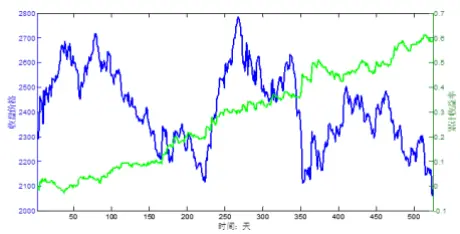

表 EMDT策略样本外表现

| 年化收益率 | 27.4% |
| --- | --- |
| 最大回撤率 | -5.6% |
| 胜率 | 49.7% |
| 盈亏比 | 1.63 |

Table_Aut hor 分析师： 安宁宁 S0260512020003

公0755-23948352

ann@gf.com.cn

## Table_Report 相关研究：

基于混沌理论的股指期货噪2011-05-11声趋势交易（NTT）策略

Table_Contacter 联系人： 张超

公020-87555888-8646

zhangchao@gf.com.cn

## 一、交易策略概述

## （一）基本思想

从 2013年股指期货日内波动的市场特征来看，在震荡市中进行趋势投资是不明智的。对于金融时间序列，我们可以将其分为噪声部分（震荡部分）和信号部分（趋势部分）。噪声部分代表了股价的随机游走，显示了市场平衡的特性；信号部分代表人为的决定性行为，显示了市场的趋势性，或者说非平衡特性。换句话说，当信噪比（信号与噪声的比值）较小时，价格的随机性较强，市场多呈现出震荡形态；而信噪比较大时，市场趋势较为显著。因而在信噪比较大的情况下，如果能够有效把握趋势，则有机会从中获得投机性收益。

## （二）与NTT 模型的差异

我们于2011年5 月对股指期货日内交易策略进行了初探，发表了研究报告《基于混沌理论的股指期货噪声趋势交易（NTT）策略》。该篇报告同样采用了通过计算信噪比进行趋势交易的思想。但是由于算法非常复杂，我们和众多机构投资者沟通后，发现可以实现该算法的客户凤毛麟角。另一方面，由于是对股指期货投机策略的初步探索，因此这篇报告的研究部分并不严密，例如存在没有加入止盈止损机制致使策略回撤较大、开仓条件过于严格导致近两年开仓次数大幅下降等问题。

本篇报告所介绍的经验模态分解交易策略（Empirical Mode DecompositionTrading，简称EMDT），是我们经过三年股指期货交易策略研究的积累，形成的全新趋势交易策略。它解决了上述问题，即相比 NTT策略具有以下特点：

1、算法简洁。EMD算法具有思想简单、容易实现的特点。其算法不过几十行（后文有具体介绍），互联网上也可以搜索到一些网友实现的算法代码。

2、加入止损机制。在后面的研究过程中，我们会加入固定比例止损，使得整个策略的风险收益特征提升。

3、放宽开仓条件。后文实证部分会看到，EMDT策略大约平均每两天会开仓交易一次，在很大程度上保证了交易的连贯性。

## 二、交易模型介绍

## （一）背景介绍

众所周知，股票市场的趋势和波动是从不同的时间周期上来考虑的。作为技术分析的鼻祖，道氏理论的基本观点是，股票指数与任何市场都有三种趋势：

1、短期趋势，持续数天至数个星期；

2、中期趋势，持续数个星期至数个月；

## 3、长期趋势，持续数个月至数年。

任何市场中，这三种趋势必然同时存在，彼此的方向可能相反。艾略特波浪理论认为，无论是在怎样的市场环境，或者是在怎样的时间尺度下，市场总是在若干个波段的循环中反复。他将不同规模的趋势分成九大类，周期大到跨越几百年，小到只覆盖数小时。但无论趋势的时间周期规模如何，每一较大的周期都是由数个较小周期的波浪构成。事实上，由于市场的分形特性，不同时间尺度上的市场行情走势具有相似性，如果把视野放到更加微观的日内交易甚至高频层面，市场波动都具有类似的性质（详细数学描述请见广发金工交易策略研究报告《基于时域分形的相似性匹配日内低频交易策略（SMT）》）。

某个时间点的股票价格是处于震荡状态还是趋势状态？这取决于不同的时间尺度。从不同的时间周期上来分析的话，波动与趋势是同时存在的。例如在图1中，我们画出了波浪理论的一个波动周期。从3点标记的位置来看，既属于2-3-4这个“小波浪”的波峰，即将开始下降；同时，它也属于上升趋势主升浪1-3-5，从较长周期来看，将要继续保持上升势头。

图1：趋势和波动示意图
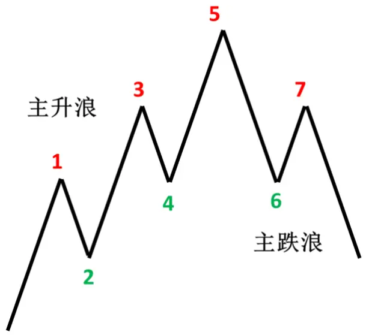
数据来源：广发证券发展研究中心

对于趋势交易者而言，市场波动是其收益和亏损的源动力。具体而言，对于特定时间尺度上的投资，市场中成功的趋势判断可以实现盈利，但是更小时间尺度上的波动和噪声会干扰交易者的判断，从而造成投资的失误和损失。因此，将噪声和小周期的波动从信号中分离开来，对成功的趋势投资很有帮助。

小周期波浪和长周期趋势的分离问题类似于图2 所示的信号分解问题，我们需要对上边的复合信号作分解，获得特性不同的信号分量。对于这样的问题，傅里叶变换是一种首先可以想到的方法：通过傅里叶变换将信号从时域转换到频域，然后根据频谱的特征将高频信号和低频信号分离开来。但是傅里叶变化作为一种理论的频谱分析手段，没有时间分辨率。我们可以采取加窗的快速傅里叶变换来具体实现这一分解目的。但总体而言，该方法一个最大的缺陷在于对高频部分进行了一刀切处理，而金融时间序列往往是非平稳的，其统计特性随时间而变化，在某个时域内视为高频的部分可能为噪声，而在另一个时域内则可能包含了有用信号。传统的频谱滤波无法满足局部化的要求。

在现代滤波方法中，维纳滤波法和卡尔曼滤波法分别是频域和时域内的典型代表。

维纳滤波法的基本思想是以最小均方误差为准则，寻找一个最佳冲击响应或传递函数，使得滤波器的输出波形作为输入波形的最佳估计，即从原时间序列数据中提取出满足一定条件的一个光滑的波形，这个波形便过滤掉了原始数据中频繁波动的噪声。但是该方法需要我们对噪声和有用信号的区分有比较明确的先验知识，如自相关函数、功率谱密度等统计特性，其在非平稳的金融时间序列分析上往往比较难以确定。

卡尔曼滤波则是以时域上的状态空间方法作为方法论，其基本思想是利用前一时刻的状态估计值和当前时刻的观测值来确定当前状态的估计值，最终实现这种递推估计求解的优化准则依然是最小均方误差。卡尔曼滤波相对于维纳滤波最大的改进是由于引入了递归，能够实时地快速处理更新的数据，而不必每次都用全部历史数据从头算起。但该方法需要知道系统的运动规律以建立准确的状态方程，这在非平稳的金融时间序列上依旧十分困难。

在量化投资方面，使用较多的滤波技术是小波分析。小波理论是对传统傅里叶分析架构下频谱滤波的极大改进。不同于傅里叶变换将信号分解成一系列三角函数的叠加，小波变换则是将信号分解成一系列小波函数的叠加，这些小波函数都是由一个小波母函数经过平移和尺度变换得来，在低频部分具有较高的频率分辨率和较低的时间分辨率，在高频部分则相反。使用小波变换去噪，首先要对信号进行 N层小波分解，提取第 N层的低频系数和第 1至第N 层的高频系数，噪声通常被认为包含在每一层的高频部分中。综合考虑每一层的小波系数，选取合适的阈值对这些系数进行量化处理，然后对量化后的系数进行小波重构，即可实现信号的去噪。它与传统频谱分析的最大不同就在于，小波分析通过分层分解实现了对低频部分的有效提取，而对第 1至第 N层高频系数阈值的量化方法又可以有效地区分高频部分中的噪声干扰和有用信号，保证其成功实施的关键就在于小波基矢的伸缩平移特性。可以说，小波分析是滤波方法的一个重大里程碑，它融合了频域分析和时域分析的良好性质。但是，在量化模型的构造与实践中，小波分析较多参数选择的问题却构成一大难题，过分的参数依赖性会使得模型的可信度大幅降低。

此外，还可以使用一种同时具有高通滤波器和低通滤波器的滤波器组来完成不同频谱信号的分离。普通的高通\低通滤波器组具有特定的频域分离阈值，离散小波变换通过金字塔算法将多组的高通\低通滤波器组串联起来，实现了不同频率尺度上的信号分解，如图2就可以通过小波的一层分解来实现。

金融市场复杂多变，市场的股价和指数具有很强的非平稳性和非线性特征，远比图 2的信号要复杂。快速傅里叶变换和普通的高通\低通滤波器拘泥于固定的频率带宽，对非平稳数据的分解结果不佳。离散小波变换也由于不同层次的分解已经提前固定，对于强非平稳的金融信号分析结果也大打折扣。对于这样的数据进行信号分解，需要一种更加有效的、能够根据信号特征来进行分析的方法。经验模态分解就是这样一种自适应的分析手段。

图2：信号分解问题示意图
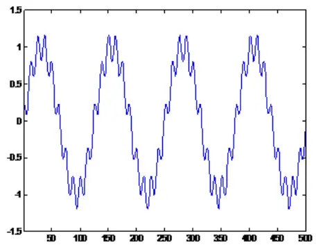

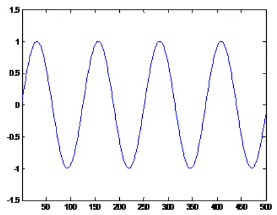
数据来源：广发证券发展研究中心

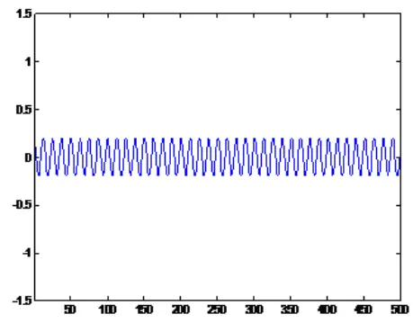

## （二）经验模态分解模型算法

经验模态分解（Empirical Mode Decomposition，简称 EMD）方法是由美国航空航天局（NASA）黄锷院士提出的一种处理非平稳和非线性信号的分析方法。与一般的信号处理方法不同，EMD是一种自适应的分析方法，即依据数据自身的时间尺度特征来进行信号分解。一经提出，EMD就在不同的工程领域得到了成功的应用，如在语音信号处理、海洋、大气、天体观测资料与地震记录分析、机械故障诊断、密频动力系统的阻尼识别以及大型土木工程结构的模态参数识别方面。

经验模态分解假设任何复杂的信号都是由一些不同的“波动项”和一个“趋势项”组成。这些波动项被称为本征模态函数（IMF）或者内禀模态函数。即复杂信号

$$
s(t)=\sum_{i=1,2,...n}IMF_{i}(t)+r_{n}(t)\tag{1}
$$

本征模态函数为满足如下两个条件的函数：

1、函数的局部极大值以及局部极小值的数目之和必须与零交越点(ZeroCrossing，信号改变正负号的点)的数目相等或是最多只能差 1，也就是说一个极值后面必需马上接一个零交越点。

2、在任何时间点，局部最大值所定义的上包络线与局部极小值所定义的下包络线，取平均要接近于零。

满足本征模态函数条件的信号，在任一时刻的瞬时频率是唯一的，但是不同时刻的瞬时频率可以不一致，而且不同时刻的信号波动幅度可能不一致，如图3所示。大家熟悉的正弦信号波动的幅度固定，频率单一，是一种特殊的本征模态函数。

图3：本征模态函数示意图
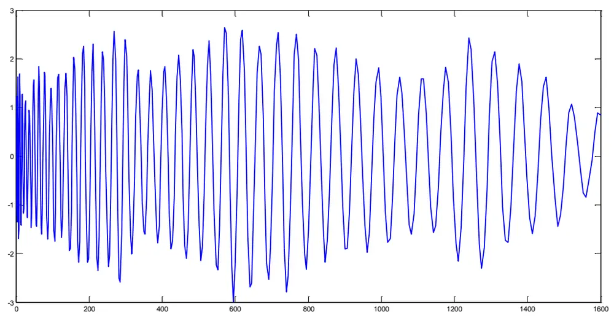
数据来源：广发证券发展研究中心

经验模态分解的过程是一个不断从信号中提取出本征模态函数，直到信号仅保留趋势项的过程。以图 4所示为例，其分解过程如下所示：

输入：原始信号s(t)，如图 4A所示。

输出：本征模态函数 $IMF_{1},IMF_{2},...,IMF_{n}$ 和趋势项 $r_{n}(t)$

步骤 1：找出s(t)中的所有局部极大值以及局部极小值，如图 4B，红色和绿色的依次是极大值点和极小值点；

步骤 2：利用三次样条插值函数，分别将局部极大值串连成信号的上包络线，将局部极小值串连成下包络线，如图 4C；

步骤 3：求出上下包络线的平均值，得到包络线均值 $m_{1}(t)$ ，即图 4D中黑色粗线；

步骤 4：原始信号s(t)与均值包络线相减，得到第一个分量 $h_{1}(t)$ 。

$$
\begin{array}{r}{h_{1}(t)=s(t)-m_{1}(t)}\end{array}\tag{2}
$$

步骤 5：检查 $h_{1}(t)$ 是否符合 IMF的条件。如果不符合，则回到步骤 1并且将 $h_{1}(t)$ 当作原始讯号，进行再次的筛选。亦即

$$
\begin{array}{l}{h_{2}(t)=h_{1}(t)-m_{2}(t)}\\{\quad\dots\dots}\\{\quad h_{k}(t)=h_{k-1}(t)-m_{k}(t)}\end{array}\tag{3}
$$

（4）

直到 $h_{k}(t)$ 符合 IMF的条件，即得到第一个 IMF分量 $IMF_{1}$ ，亦即 $IMF_{1}=h_{k}(t)$ ，如图 4E 所示；

步骤 6：原始讯号 $s(t)$ 减去 $IMF_{1}$ 可得到剩余量 $r_{1}(t)$ ，如图 4F所示，表示如下式

$$
r_{1}(t)=s(t)-IMF_{1}\tag{5}
$$

步骤7：将图4F中 $r_{1}(t)$ 当作新的资料，重新执行步骤1至步骤6，得到新的剩余量$r_{2}(t)$ 。如此重复n次，直到 $r_{n}(t)$ 为单调函数，即趋势项。

E
图4：信号的本征模态函数提取示意图
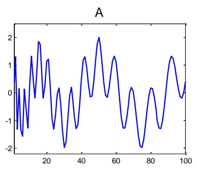

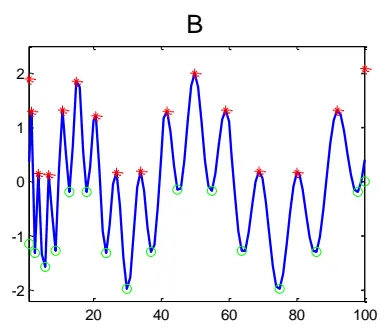

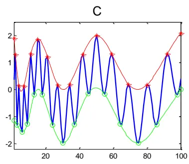

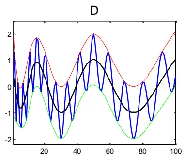

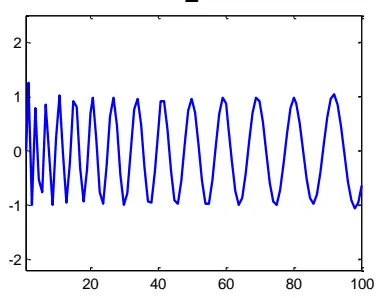
数据来源：广发证券发展研究中心

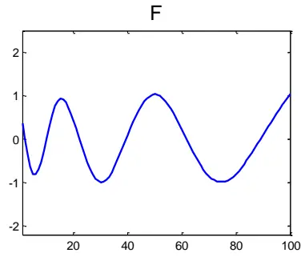

经验模态分解的整个流程图如图5所示。

由函数的定义和分解过程可见，本征模态函数的提取是一种自适应的方法，保留了非平稳信号在不同时间尺度上的特性。如图4，分离出来的 $IMF_{1}$ 和 $r_{1}(t)$ 都是瞬时频率在不断变化的分量，这是用普通的滤波器组和离散小波变换等方法无法分离开的。

图5：经验模态分解流程图
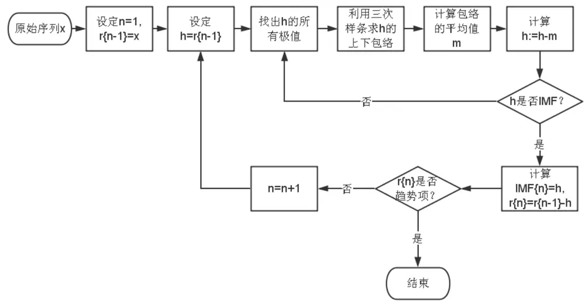
数据来源：广发证券发展研究中心

EMD 算法在实现上，需要先提取出信号的局部极值点。而金融市场始终处于波动中，波动以及噪声带来了大量的局部极值，因此该方法非常适合金融数据的分析。而金融市场的数据具有很强的非线性和非平稳特性，这正是 EMD算法的优势所在。

从计算复杂度，实时性和稳定性上来说，EMD算法有如下特点：

1、计算复杂度：主要包含序列局部极值查找（比较前后点大小）和样条插值，计算相对简单。原始算法中分解过程步骤5检验IMF条件是否满足是为了对 IMF信号做希尔伯特变换分析；为了提高计算效率，可以将此过程省略。

2、分析实时性：与一般的滤波器或者移动平均之类的方法不同，EMD对信号的分解结果没有时间上的滞后。但是在端点处可能有偏离（因为端点处极大/极小值的包络曲线是通过插值获得的）。

3、鲁棒性：EMD的分离结果由局部极值点决定，高频段分离结果仅依赖于噪声本身，低频段非端点处信号一般不会发生扭曲。当原始信号的局部极值点较多时，如金融数据中的噪声无处不在，鲁棒性好。

由以上分析可见，EMD方法由于计算简单，适合作为一种日内交易的策略。但是在作为趋势判断的直接手段上存在误报的可能性（实时分析的边界效应所致）。根据EMD方法的特点，我们提出了如下的股指期货日内交易策略。

## （三）交易策略

趋势交易的关键在于判断趋势。相对我们需要关心的时间尺度来说，更小时间尺度的波动和噪声都可以认为是干扰噪声。当短周期波动强时，不利于趋势的判断。

在噪声和短周期波动相对于趋势的能量比较小的时候，趋势才比较明显，有助于我们对市场后续走势的判断。

由于政策和外围市场等因素的影响，隔夜信息比较多，股指期货市场在次日开盘之后容易形成趋势。因此，采取有效的手段将市场行情的趋势提取出来，并且顺势建仓，是进行股指期货日内投资的重要手段。

基于此，本文提出了股指期货日内交易的经验模态分解交易策略（EMDT）。简而言之，经验模态分解交易(EMDT)策略是基于短周期波动的相对能量，也就是短周期波动和（我们感兴趣的时间尺度上）趋势的能量之比的对数，或称“对数波动能量比”，进行交易。该比值实际上是信噪比的一种度量，能量比越小，信噪比越高，市场的趋势能量越显著。

在这里，波动能量比用信号标准差之比的对数来表示，即

$$
R=\ln{\frac{\operatorname{std}\{s(t)-r_{n}(t)\}}{\operatorname{std}\{r_{n}(t)\}}}\tag{6}
$$

其中分子为短期波动序列的标准差，分母为趋势项序列的标准差，ln( )为自然对数。这里我们通过 EMD将信号分解到第 4层，即 $n=4$ 。当此对数波动能量比R大于一定阈值时，认为短期波动比较明显，信噪比较低，不宜进行交易操作。当此比值R小于一定阈值时，认为短期波动比较弱势，信噪比较高，可以根据主要趋势信号进行建仓操作。

根据实证观察，比值R的长期均值比较稳定。简单起见，我们采用样本内数据开仓之前R的均值作为每天判断的阈值。从而，第k 日趋势交易策略的建仓条件是

$$
R_{k}<R_{\mathrm{mean}}\tag{7}
$$

我们的目标是 $\therefore\dot{\mathcal{P}}$ 深300股指期货的日内交易。假设在上午 $t_{s}$ 时刻考虑建仓，我们

利用的数据是当天从开盘 $t_{0}$ （即交易日上午 9:15）到 $t_{s}$ 的行情数据。首先采用 EMD算法对行情数据做波动分解，计算信号的相对能量。当对数波动能量比R小于样本内R均值时，认为市场信号显著，或者说趋势比较明显，入场建仓。建仓多空方向由 $t_{s}$ 时刻相对于 $t_{0}$ 时刻的股指期货价格 $p$ 决定，即

$$
\scriptstyle Signal=\left\{{\begin{array}{ll}{1}&{{\mathrm{if}}\quad p(t_{s})>\mathbf{p}(t_{o})}\\{-1}&{{\mathrm{if}}\quad p(t_{s})<\mathbf{p}(t_{o})}\end{array}}\right.\tag{8}
$$

其中 1代表开多仓，-1代表开空仓。

止损策略方面，本策略采用最简单的固定比例r止损。当浮动亏损大于r时，立即进行止损平仓，否则当日收盘平仓。

## 三、实证分析

数据选取：实证选取股指期货当月合约自2010年4月 16日至2014年3月 11

日的 15秒钟行情数据。

参数优化：建仓时间 $t_{s}$ 是最重要的参数。在实证中，首先通过对前面两年数据（样本内）的分析，获得最佳的开仓时间，然后用最近两年多时间的数据进行样本外验证。本次实证考虑从开盘后 5 分钟到 94分钟的不同建仓时间点，参数选取的间隔为1分钟。

样本内数据：2010年至2011 年行情数据。我们先用2010年数据和2011年数据计算出最优建仓时间 $t_{s}$ 。

样本外数据：2012年以来行情数据。

策略评价指标：我们选取如下表。需要说明的是，从经验来看，趋势投机策略在严格止损机制下的胜率一般很难超过40%，但盈亏比一般较大，靠亏小赚大盈利。

表 1：交易策略评价体系

| 考察指标 | 说明 |
| --- | --- |
| 累积收益率 | 模拟交易期末的累积收益率（复利计算） |
| 年化收益率 | 累积收益率折算成的年化收益率 |
| 交易总次数 | 总交易次数（自开仓至平仓为一个完整的交易周期） |
| 获胜次数 | 单次交易收益率大于0的次数（含交易成本） |
| 失败次数 | 单次交易收益率小于0的次数（含交易成本） |
| 胜率 | 获胜次数/交易总次数×100% |
| 单次获胜收益率 | 获胜交易的收益率算术平均值 |
| 单次失败亏损率 | 失败交易的收益率算术平均值 |
| 盈亏比 | 单次获胜平均收益率除以单次失败平均亏损率的绝对值 |
| 最大回撤 | 模拟交易资金自最高点缩水的最大幅度 |
| 最大连胜次数 | 最大连续收益率大于0的交易次数 |
| 最大连亏次数 | 最大连续收益率小于0的交易次数 |

数据来源：广发证券发展研究中心

记 $F_{1}$ 为开仓成交价， $F_{2}$ 为平仓成交价，c为单边手续费率，则单次交易收益率计算如下：

$$
r_{long}=\frac{F_{2}(1-c)-F_{1}(1+c)}{F_{1}(1+c)}{\times}100\%\tag{9}
$$

$$
r_{short}=\frac{F_{1}(1-c)-F_{2}(1+c)}{F_{1}(1+c)}{\times}100\%\tag{10}
$$

这里不考虑杠杆，不计冲击成本，采用单边万分之1的手续费，止损点设置为 $r=$ 0.006。

对于样本内的数据，从开盘之后5 分钟到94分钟中分别建仓的不同策略的年化收益率与最大回撤的绝对值如图 6 所示。根据收益回撤比最大的优化目标,从样本内

识别风险，发现价值

考察结果可以得出结论，在开盘之后 41分钟建仓的效果最好，年化收益率为 42.0%，最大回撤为-4.6%。而且，该策略的最优参数稳定性好。由图 6中红圈标记的部分可知，在开盘之后 23到 55分钟内任何时刻建仓，策略的年化收益率都在 25%以上。

本篇报告选择在开盘之后41分钟，即上午9：56进行建仓。策略在样本内和样本外的表现如表2所示。样本外从2012年以来，策略在年化收益率方面有所下滑，由2010年到2011年样本内的42.0%下降为2012年以来的27.4%；最大回撤方面，从样本内-4.6%变为2012年以来的-5.6%。而其他指标，如胜率，最大连胜次数和最大连亏次数基本保持一致。表明该策略具有较好的参数稳定性。

图6：不同建仓时间的年化收益率和最大回撤绝对值（样本内）
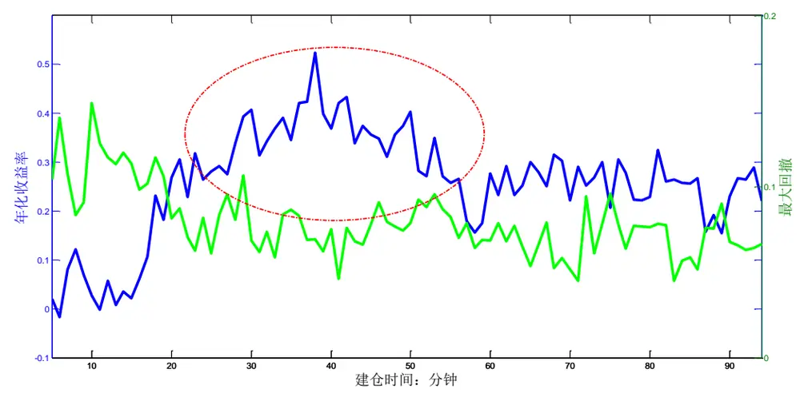
数据来源：广发证券发展研究中心，天软科技

表 2：交易策略评价指标的表现

| 考察指标 | 样本内（2010和2011年） | 样本外（2012年以来） |
| --- | --- | --- |
| 累积收益率 | 72.6% | 59.5% |
| 年化收益率 | 42.0% | 27.4% |
| 交易总次数 | 219 | 306 |
| 获胜次数 | 99 | 152 |
| 失败次数 | 120 | 154 |
| 胜率 | 45.2% | 49.7% |
| 单次获胜收益率 | 1.32% | 0.88% |
| 单次失败亏损率 | -0.61% | -0.54% |
| 盈亏比 | 2.16 | 1.63 |
| 最大回撤 | -4.6% | -5.6% |
| 最大连胜次数 | 4 | 5 |
| 最大连亏次数 | 3 | 4 |

数据来源：广发证券发展研究中心，天软科技

在最优参数下，对单日开盘后41分钟内的股指期货进行经验模态分解提取，得

到的趋势如图 7红线所示。可见，通过经验模态分解，信号趋势得到了较好的提取。

图7：2014年3月11日开盘后41分钟内数据的经验模态分解结果
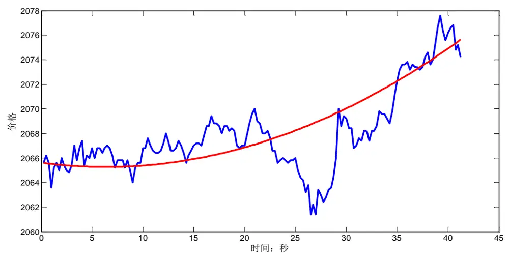
数据来源：广发证券发展研究中心，天软科技

在 EMDT的交易条件判别中，交易日开盘后41分钟内信号的对数波动能量比值历史情况如图 8绿线所示。可见，该能量比值的长期均值比较稳定，可以根据样本内数据的均值来确定交易条件所用的阈值。图9 是对数波动能量比的分布。在 EMDT策略下，大约每两个交易日交易一次。

图8：对数波动能量比R（绿色）及其样本内均线（红线）
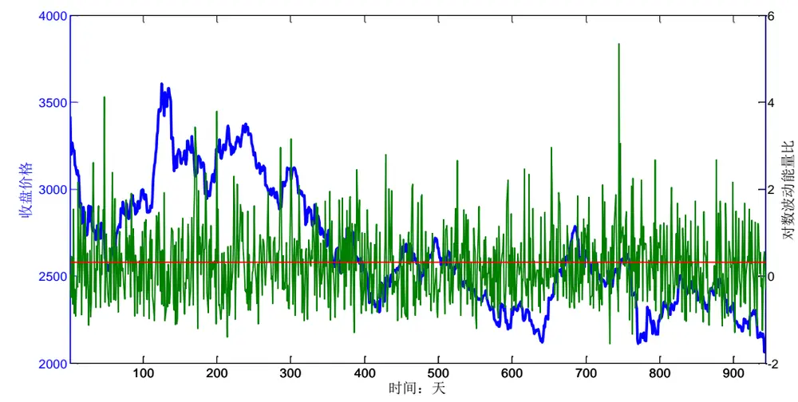
数据来源：广发证券发展研究中心，天软科技

图9：对数波动能量比的分布
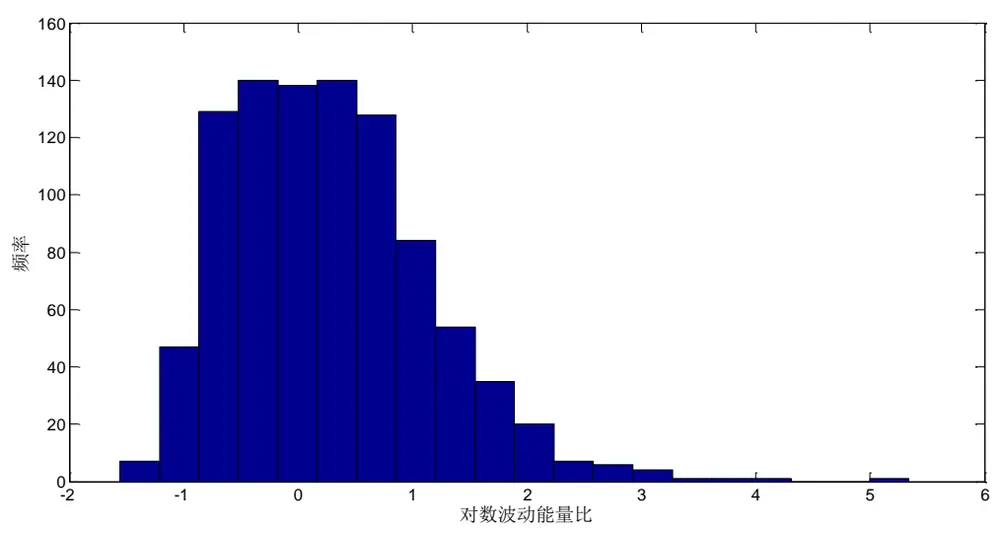
数据来源：广发证券发展研究中心，天软科技

在最优参数下，该策略样本内和样本外的累积收益率表现如图10和图11所示。在样本内，从 2010年 4月到 2011 年不到两年时间里，策略一共交易了219次，取得了 72.6%的累积收益率，年化收益率为 42.0%，最大回撤-4.6%。在 2012年以来的两年多里，策略一共交易了306次，取得了59.5%的累积收益率，年化收益率为27.4%，最大回撤-5.6%。从全样本来看，自 2010年4月开始，该策略一共取得了 182.2%的累积收益率，最大回撤为-5.6%。全样本下策略的最大回撤曲线如图12所示。

图10：最优参数策略下策略样本内表现
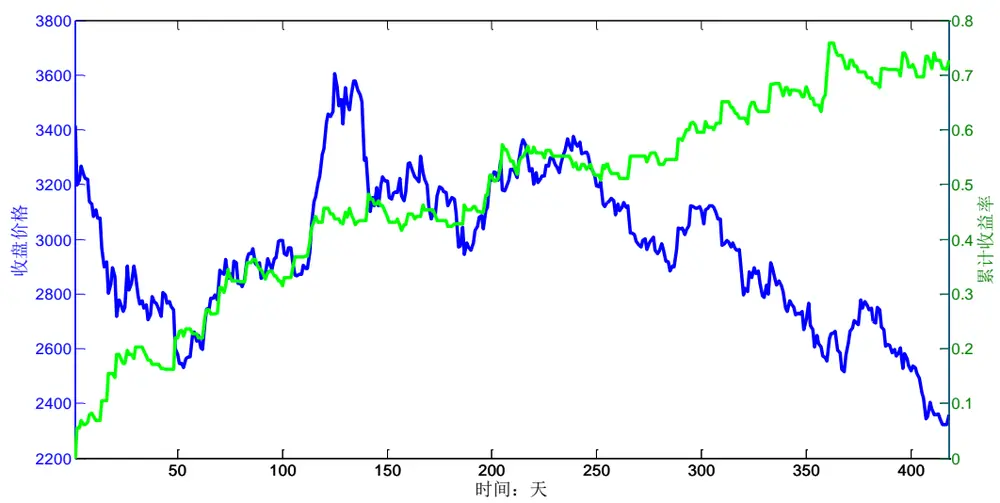
数据来源：广发证券发展研究中心，天软科技

图11：最优参数策略下策略样本外表现
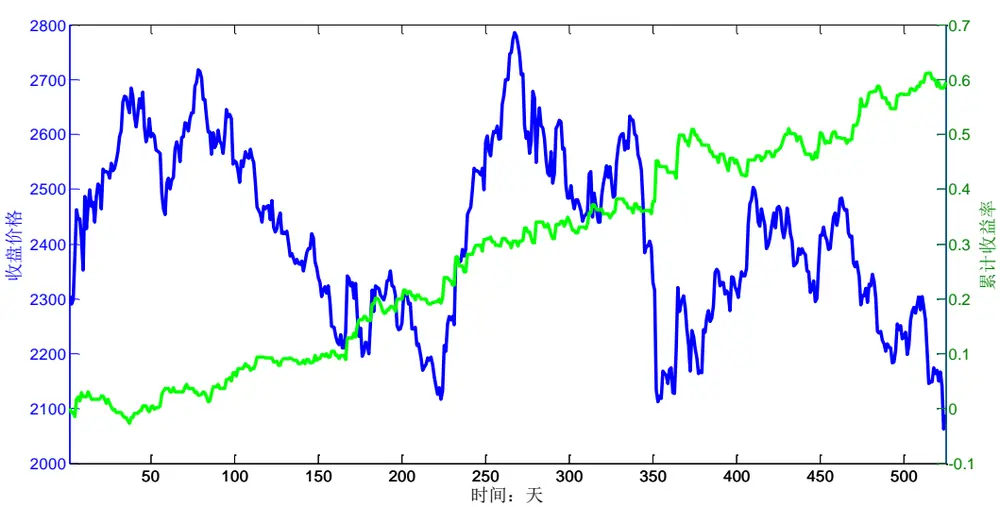
数据来源：广发证券发展研究中心，天软科技

图12：最优参数策略下策略全样本表现：最大回撤曲线
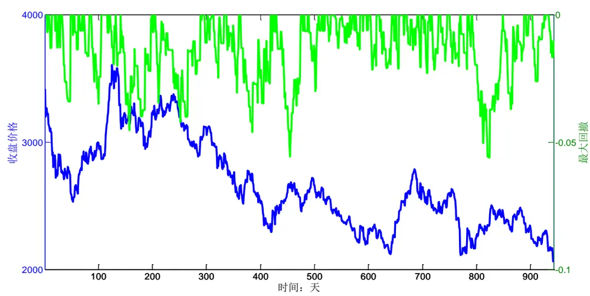
数据来源：广发证券发展研究中心，天软科技

趋势投机策略靠亏小赚大盈利，策略的胜率为47.8%。策略的单次收益率分布情况如图 13所示。由于止损机制的存在，策略单次交易的最大亏损为-1.37%，而单次最大收益为 5.48%，单次交易的平均收益率为0.21%。

图13：最优参数策略下单次交易收益率分布（全样本）
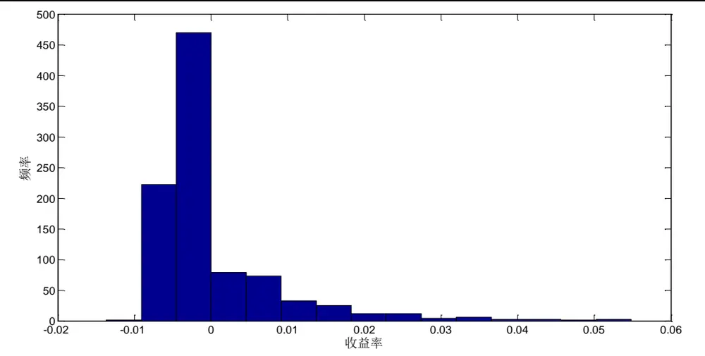
数据来源：广发证券发展研究中心，天软科技

策略的单次交易持仓时间分布如图14 所示。收盘时平仓的交易基本上为获胜盈利的交易，而失败亏损的交易大多在建仓之后 1 个半小时之内平仓止损。

图14：最优参数策略下单次交易持仓时间分布（全样本）
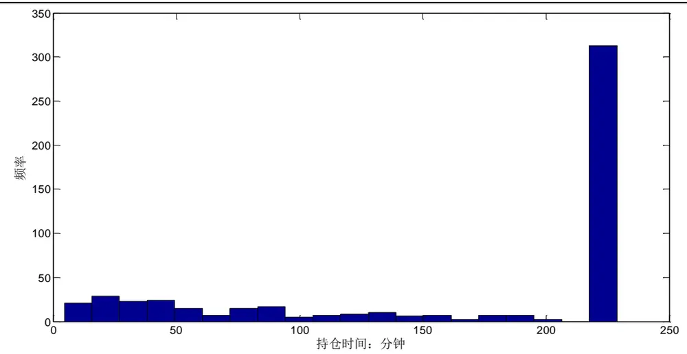
数据来源：广发证券发展研究中心，天软科技

实证研究同时分析了EMDT策略相对于直接使用普通趋势投资策略的优势。用来对比的普通趋势投资于开盘之后 41分钟建仓，建仓条件简化为

$$
\left|p(t_{s})-p(t_{o})\right|>Threshold\tag{11}
$$

和 EMDT相似，根据 $p(t_{s})$ 和 $p(t_{0})$ 的价格大小确定建仓方向，顺势做多或者做空。为了使两者更具有可比性，我们考虑两种比较模式。第一种是将Threshold设置为0，直接比较开盘价格和建仓时价格的大小，进行做多或做空（基本上每天都交易，除非建仓时价格和开盘价格一样）；第二种模式是通过调整普通趋势投资建仓条件判断阈值Threshold的大小，使得该策略的交易频率和EMDT策略基本一致（日均交易次数约为0.5次）。对于第二种模式，我们确定了Threshold为股指期货5.5个指数点。

EMDT和两种普通趋势交易策略2010年以来在股指期货上的表现如表3所示，可以看到，EMDT和加阈值的普通趋势交易策略分别交易了525次和523次，基本持平。两种普通趋势交易策略的胜率明显比没有EMDT策略高。EMDT的累积收益率为182.2%,而两种普通趋势交易策略的累积收益率分别为99.3%和66.6%，EMDT的收益明显高于普通趋势投资策略。最大回撤上，EMDT的最大回撤为-5.6%，而普通的趋势交易策略为-18.5%和-14.6%，EMDT的表现相对稳健很多。EMDT和两种普通趋势交易策略的累积收益对比曲线如图14所示。

表3：EMDT和普通趋势交易策略表现对比

| 考察指标 | EMDT 策略 | 普通趋势策略一 | 普通趋势策略二 |
| --- | --- | --- | --- |
| 累积收益率 | 182.2% | 99.3% | 66.6% |
| 年化收益率 | 46.8% | 25.5% | 17.1% |
| 交易总次数 | 525 | 936 | 523 |
| 获胜次数 | 251 | 401 | 218 |
| 失败次数 | 274 | 535 | 305 |
| 胜率 | 47.8% | 42.8% | 41.7% |
| 单次获胜收益率 | 1.05% | 0.96% | 1.10% |
| 单次失败亏损率 | -0.57% | -0.58% | -0.61% |
| 盈亏比 | 1.84 | 1.66 | 1.81 |
| 最大回撤 | -5.6% | -18.5% | -14.6% |
| 最大连胜次数 | 5 | 8 | 4 |
| 最大连亏次数 | 4 | 16 | 6 |

数据来源：广发证券发展研究中心，天软科技

图15：EMDT策略和普通趋势交易策略的累积收益曲线对比
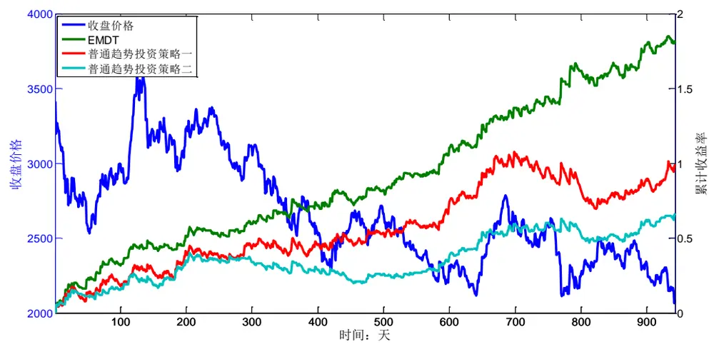
数据来源：广发证券发展研究中心，天软科技

EMDT和两种普通趋势交易策略的最大回撤对比曲线如图15所示。由图可见，EMDT策略（绿线）的最大回撤在全样本内始终维持在-5%左右。普通趋势投资策略一（红线）在2013年以前的最大回撤在-8%以内，但是2013年以来，最大回撤达到-18.5%。普通趋势投资策略二（青线）在2011年以来就有超过-10%的最大回撤。由此可见，EMDT策略的最大回撤明显较小，而且常年比较稳定。

图16：EMDT策略和普通趋势交易策略的最大回撤曲线对比
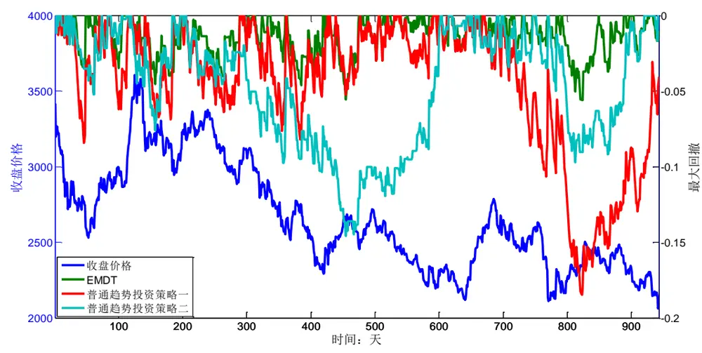
数据来源：广发证券发展研究中心，天软科技

## 四、总结与讨论

本篇报告介绍了基于经验模态分解的股指期货日内趋势交易策略。通过经验模态分解，可以将股指期货价格时间序列中的短周期波动和趋势分离开来。根据短周期波动和趋势的能量对比，来确定当前信号的趋势是否明显。在趋势比较强的交易日，根据趋势的方向进行顺势建仓。经过实证分析，本文通过对不同建仓时间点的扫描，确定了上午 9:56进行建仓是一种最优的策略。自2010年股指期货上市以来，该策略取得了 182.2%的累积收益率，而最大回撤为-5.6%。这里没有计入杠杆，双边交易费用为 0.02%。

随着股指期货市场的发展，市场的有效性在逐渐增强，趋势投资者为了提高收益率，需要迅速判断市场趋势并且及时入场建仓。为了增加市场趋势判断的准确度和及时性，可以考虑采取更高频率的行情数据进行分析。经验模态分解由于具有类似小波分析的“数学显微镜”特性，可以很好地移植到高频行情数据分析平台上。

经验模态分解是一种非线性非平稳信号的处理方法，它的自适应特性符合复杂多变的金融数据分析要求。本篇报告只是基于经验模态分解对股指期货交易的一次尝试。希望报告的啼声初试能够激发机构投资者对经验模态分解的兴趣，对金融市场的趋势和波动进行更好的把握。

## 风险提示

策略模型并非百分百有效，市场结构及交易行为的改变以及类似交易参与者的增多有可能使得策略失效。

## Table_Res arch 广发金融工程研究小组

罗 军： 首席分析师，华南理工大学理学硕士，2010年进入广发证券发展研究中心。

俞文冰： 首席分析师，CFA，上海财经大学统计学硕士，2012年进入广发证券发展研究中心。

安宁宁： 资深分析师，暨南大学数量经济学硕士，2011年进入广发证券发展研究中心。

胡海涛： 分析师， 华南理工大学理学硕士， 2010年进入广发证券发展研究中心。

蓝昭钦： 分析师，中山大学理学硕士， 2010年进入广发证券发展研究中心。

史庆盛： 分析师，华南理工大学金融工程硕士， 2011年进入广发证券发展研究中心。

张 超： 研究助理，中山大学理学硕士， 2012年进入广发证券发展研究中心。

## Table_RatingIndustry 广发证券—行业投资评级说明

买入： 预期未来12个月内，股价表现强于大盘10%以上。

持有： 预期未来12个月内，股价相对大盘的变动幅度介于-10%～+10%。

卖出： 预期未来12个月内，股价表现弱于大盘10%以上。

## Table_RatingCompany 广发证券—公司投资评级说明

买入： 预期未来 12 个月内，股价表现强于大盘 15%以上。

谨慎增持： 预期未来12个月内，股价表现强于大盘5%-15%。

持有： 预期未来12个月内，股价相对大盘的变动幅度介于-5%～+5%。

卖出： 预期未来12个月内，股价表现弱于大盘5%以上。

Table_Ad联系我们

|  | 广州市 | 深圳市 | 北京市 | 上海市 |
| --- | --- | --- | --- | --- |
| 地址 | 广州市天河北路183号 大都会广场5楼 | 深圳市福田区金田路4018 | 北京市西城区月坛北街2号 | 上海市浦东新区富城路99号 |
|  |  | 号安联大厦15楼A座 03-04 | 月坛大厦18层 | 震旦大厦18楼 |
| 邮政编码 | 510075 | 518026 | 100045 | 200120 |
| 客服邮箱 | gfyf@gf.com.cn |  |  |  |
| 服务热线 | 020-87555888-8612 |  |  |  |

## Table_Disclaimer 免 责声 明

广发证券股份有限公司具备证券投资咨询业务资格。本报告只发送给广发证券重点客户，不对外公开发布。

本报告所载资料的来源及观点的出处皆被广发证券股份有限公司认为可靠，但广发证券不对其准确性或完整性做出任何保证。报告内容仅供参考，报告中的信息或所表达观点不构成所涉证券买卖的出价或询价。广发证券不对因使用本报告的内容而引致的损失承担任何责任，除非法律法规有明确规定。客户不应以本报告取代其独立判断或仅根据本报告做出决策。

广发证券可发出其它与本报告所载信息不一致及有不同结论的报告。本报告反映研究人员的不同观点、见解及分析方法，并不代表广发证券或其附属机构的立场。报告所载资料、意见及推测仅反映研究人员于发出本报告当日的判断，可随时更改且不予通告。

本报告旨在发送给广发证券的特定客户及其它专业人士。未经广发证券事先书面许可，任何机构或个人不得以任何形式翻版、复制、刊登、转载和引用，否则由此造成的一切不良后果及法律责任由私自翻版、复制、刊登、转载和引用者承担。