Table _Titl e 掘金大数据

图1深度学习股指期货交易策略累积收益曲线

# 深度学习股指期货日内交易策略

## Table_Sum ary 报告摘要：

## 金融大数据下的机器学习

作为大数据时代机器学习的革命性成果，深度学习自提出以来迅速发展，在互联网领域掀起了一股方兴未艾的研究和应用热潮。谷歌、微软、IBM、百度等 IT巨头们纷纷厉兵秣马，在深度学习领域投入人力物力；不负众望，深度学习也解决了一个又一个难题，在语音识别和图像识别等机器学习领域取得了众多突破。

## 深度学习高频股价预测模型

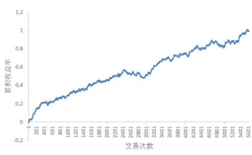

从市场微观结构的角度来说，股票价格的形成和变化是由买卖双方的交易行为决定的，因此，对高频市场行情数据的挖掘有可能获得对未来股票价格走势的有预测能力的模式。

本报告通过样本内大量历史数据训练深度学习预测模型，对 1 秒钟高频下的股指期货价格涨跌进行预测。该预测模型的样本外的准确率超过73%，表现不俗。

## 深度学习股指期货交易策略

基于深度学习股价预测模型对股票价格变化的预测，本报告提出了股指期货的日内交易策略。该交易策略自 2013 年以来累积收益率达99.6%，年化收益率为 77.6%，最大回撤为-5.86%。

通过股指期货高频价格预测模型的实证研究，本报告验证了深度学习这一大数据时代的机器学习利器在股票价格预测上的有效性。并基于预测模型提出了股指期货交易策略，取得了良好的效果。

分析师： 安宁宁 S0260512020003

## 结论

0755-23948352

ann@gf.com.cn

## 一、机器学习掘金量化投资

最早的量化投资系统至少可以追溯到1971年，一个叫做约翰·麦奎恩（John McQueen）的电子工程师利用美国富国银行的信托投资平台建立的第一个定量投资系统。历经 40多年，量化投资迅速发展，目前，美国超过 60%的交易是由电脑进行的。

在这 40 多年的发展历程中，一批从象牙塔里走出来并投身金融实务的科学家在量化投资领域里成为了耀眼的明星。最耀眼的两颗当属詹姆斯·西蒙斯（James Simons）和大卫·肖（David Shaw）。

西蒙斯向来被看成是量化投资中的传奇人物。他依靠数学模型和计算捕捉市场机会并做出交易决策。自基金成立后的1989到2007年，该基金的平均年收益率高达35.6%，而股神巴菲特在同期的平均年回报大约为 20%。即使在 2007 年次债危机爆发当年，基金投资回报高达 73%，而 2008年时，基金更是上涨了 80%，西蒙斯本人也因此被誉为“最赚钱基金经理”。

大卫·肖同样以神秘的“黑盒子”和科技手段观察整个金融市场。与多数华尔街大鳄不同，在资本市场“兴风作浪”只算得上肖的副业，一直以来他都将生物及计算机科学研究作为人生第一要务。1980 年，肖获得斯坦福大学计算机博士学位，之后成为哥伦比亚大学计算生物与生物技术中心高级研究员。在哥大期间，肖领导了庞大并行计算研究。1986 年，肖加入摩根士丹利，担任自动分析交易技术部门的副总裁，两年后出来单干，成立了以自己名字命名的对冲基金公司 D. E. Shaw。相关数据显示，该基金自 1988 年成立后，年均回报率达 20%左右，而其发展巅峰时的交易量可以占到整个纽约证券交易所的 5%。大卫·肖也因此有了“定量之王”的美誉。

众所周知，西蒙斯的文艺复兴科技公司聘请了大量“火箭专家”。事实上，西蒙斯本人就是一位很著名的数学家，与数学大师陈省身合作搞出了很有名的 Chern-Simons几何定律。公司的 200 多名员工中，超过 70 位拥有数学、物理学或统计学博士头衔，其中有提出了著名的最大熵迭代算法的达拉皮垂兄弟（S. Della Pietra & V. DellaPietra）和第一个提出机器翻译统计模型的布朗（Peter Brown）。这些都是当时机器学习领域红极一时的算法和模型的提出者。

与文艺复兴科技公司类似，D. E. Shaw 公司有一支由数学天才和科学家组成的精英团队，在 1700 名员工中，有十分之一的人获得了博士学位。浓厚的科学研究氛围令D. E. Shaw 的运作较其他华尔街金融机构更为神秘，该公司的大部分投资都基于复杂的数学模型，旨在找出隐藏的市场趋势或定价异常，并从细微差异和瞬间变化中寻求丰厚的投资回报。

时过境迁，离西蒙斯和大卫·肖开始投身金融界也过去了二十多年，20 世纪80年代曾取得巨大成功的人工神经网络在 90 年代就已经被支持向量机等新的统计学习模型掩盖光芒。Boosting，最大熵方法（如 Logistic Regression），随机森林（Random Forest）等也一度站上舞台，一度成为机器学习研究与应用的潮流。伴随着机器学习领域的发展进步，文艺复兴科技公司和 D. E. Shaw 公司等数量化对冲基金一定也在不断吸收新的机器学习模型，探索新的交易策略。

时至今日，随着计算机科学与技术的蓬勃发展，存储成本的降低，计算速度的提高，人们越来越关注“云计算”、“大数据”这些热门词汇。金融市场的数据量也越来越多——单单 A 股市场就有近 2000 只股票，光考虑以秒为单位的高频数据，每个交易日就会产生两千多万个新的数据样本。如何从中“数据海洋”中提取有用的信息，来帮助投资者获得超额收益呢？深度学习或许会是一种有效的手段。

## 二、深度学习介绍

## （一）深度学习：机器学习的新浪潮

2012 年6 月，《纽约时报》披露了“谷歌大脑”（Google Brain）项目，吸引了公众的广泛关注。这个项目是由著名的斯坦福大学机器学习教授吴恩达（Andrew Ng）和在大规模计算机系统方面的世界顶尖专家 Jeff Dean 共同主导，用 16000 个 CPU Core的并行计算平台训练一种称为“深层神经网络”的机器学习模型，在语音识别和图像识别等领域获得了巨大的成功。在谷歌的一次公开展示中，该大脑从1 千万个随机挑选的没有经过标注处理的 YouTube 视频中，自动识别出了猫脸。不久之后，谷歌收购了深度学习的教父级人物——加拿大多伦多大学教授Geoffrey Hinton创建的人工智能研究机构DNNresearch，继续增大在深度学习领域的投入。

微软和 IBM 的研究人员使用深度学习在语音识别上也取得了巨大进展。2012 年 11月，微软首席科学家 Richard Rashid 在中国天津的一次活动上公开演示了一个全自动的同声传译系统，讲演者用英文演讲，后台的计算机一气呵成自动完成语音识别、英中机器翻译，以及中文语音合成，效果非常流畅。后面支撑的关键技术就是深度学习。根据微软和谷歌的报告，用深度学习改进传统的隐马尔科夫语音识别模型，将语音识别的错误率相对降低了30%。同时，深度学习技术在图像识别领域取得惊人的效果，2012年在业界著名的 ImageNet 评测上将错误率从此前的最好成绩 26％降低到 15％。也是在这一年，深度学习还被应用于制药公司的药物活性预测问题，并获得世界最好成绩。

另一家美国社交网络巨头 Facebook 也在 2013 年下半年组建了深度学习研究小组，用来分析预测用户的行为习惯。Facebook 此前已经使用传统的机器学习算法来给用户定向投递新闻和广告（谷歌，亚马逊，百度，阿里巴巴等互联网企业也正在使用这种针对具体用户的“推荐系统”），而今他们寄望于通过深度学习来获得更好的效果。事实上，在此前著名的Netflix（奈飞公司，全球最大的流媒体播放服务提供商，《纸牌屋》的出品方）电影推荐系统比赛中，基于深度学习的算法就一举夺魁。

国内的互联网 IT企业也开始了在深度学习领域的投入和研发。2013年1 月，在百度的年会上，创始人兼 CEO 李彦宏高调宣布要成立深度学习研究院，这是百度成立十多年以来第一次成立研究院。同年，国内语音识别技术的领军企业科大讯飞也将深度学习作为未来研发的重点目标。

2013 年 4 月，《麻省理工学院技术评论》（MIT Technology Review）杂志将深度学习列为 2013 年的十大突破性技术之首。

近年来深度学习相关的研究和应用如此火爆，那么，深度学习究竟是一种什么样的学习方式呢？

机器学习的目标有图像识别、语音识别、自然语言理解、股价预测、天气预测、基因表达、内容推荐等等。以图象识别为例，目前我们通过机器学习去解决这些问题的思路一般是如图1所示。

图1：机器学习的一般流程
数据来源：广发证券发展研究中心

从开始的通过传感器（例如 CMOS）来获得数据。然后经过数据预处理、特征提取、特征选择，再到推理、预测或者识别。最后一个部分“推理、预测、识别”，也就是我们通常所说的机器学习的部分，主要是通过数学和统计方法来建立学习模型。而中间的三部分概括起来就是“特征表达”。良好的特征表达，对最终算法的准确性起了非常关键的作用，而整个机器学习系统建立时主要的计算和测试工作都耗在这一大部分。但实际中，这一块一般都是人工完成的，也就是靠人工提取特征。在股价预测中，类似的流程就是我们定义了很多的技术指标，即机器学习中的特征，比如移动平均线、布林线、相对强弱指标等；然后根据我们要解决的问题选择合适的特征来建立预测规则（模型）。

手工地选取特征是一件非常费力、启发式（利用专业知识来选取特征）的方法，能不能选取好很大程度上靠经验和运气，而且它的调节需要大量的时间。既然手工选取特征不太好，那么能不能自动地学习一些特征呢？答案是肯定的！深度学习就是用来干这个事情的。

## （二）模型起源

很多机器学习模型受到生物学方面的启发，比如说遗传算法，粒子群算法，蚁群算法等。深度学习也与生理医学上的发现有关。

1981 年的诺贝尔医学奖颁发给了 David Hubel 和 Torsten Wiesel，以及 RogerSperry。前两位的主要贡献，是“发现了视觉系统的信息处理”，即 Hubel-Wiesel 模型。1958 年，Hubel 和 Wiesel 在约翰霍普金斯大学研究瞳孔区域与大脑皮层神经元的对应关系。他们在猫的后脑头骨上，开了一个3 毫米的小洞，向洞里插入电极，测量神经元的活跃程度。然后，他们在小猫的眼前，展现各种形状、各种亮度的物体。并且，在展现每一件物体时，还改变物体放置的位置和角度。他们期望通过这个办法，让小猫瞳孔感受不同类型、不同强弱的刺激。之所以做这个试验，目的是去证明一个猜测：位于后脑皮层的不同视觉神经元，与瞳孔所受刺激之间，存在某种对应关系。一旦瞳孔受到某一种刺激，后脑皮层的某一部分神经元就会活跃。经历了很多天反复的枯燥的试验，Hubel 和 Wiesel 发现了一种被称为“方向选择性细胞”（Orientation Selective Cell）的神经元细胞。当瞳孔发现了眼前的物体的边缘，而且这个边缘指向某个方向时，这种神经元细胞就会活跃。

这个发现激发了人们对于神经系统的进一步思考：脑神经系统具有丰富的层次结构。神经-中枢-大脑的工作过程，或许是一个不断迭代、不断抽象的过程。这里的关键词有两个，一个是抽象，一个是迭代。从原始信号，做低级抽象，逐渐向高级抽象迭代。人类的逻辑思维，经常使用高度抽象的概念。如图 2所示，从原始信号摄入开始（瞳孔摄入像素），接着做初步处理（V1 层：大脑皮层某些细胞发现边缘和方向），然后抽象（V2 层：大脑判定，眼前的物体的形状，是圆形的），然后进一步抽象（V3 层：大脑进一步判定该物体是人脸）。换句话来说，人的视觉系统的信息处理是分级的。高层的特征是低层特征的组合，从低层到高层的特征表示越来越抽象，越来越能表现语义或者意图。而抽象层面越高，存在的可能猜测就越少，就越利于分类。例如，单词集合和句子的对应是多对一的，句子和语义的对应又是多对一的，语义和意图的对应还是多对一的，这是个层级体系。

图2：视觉系统的层级结构
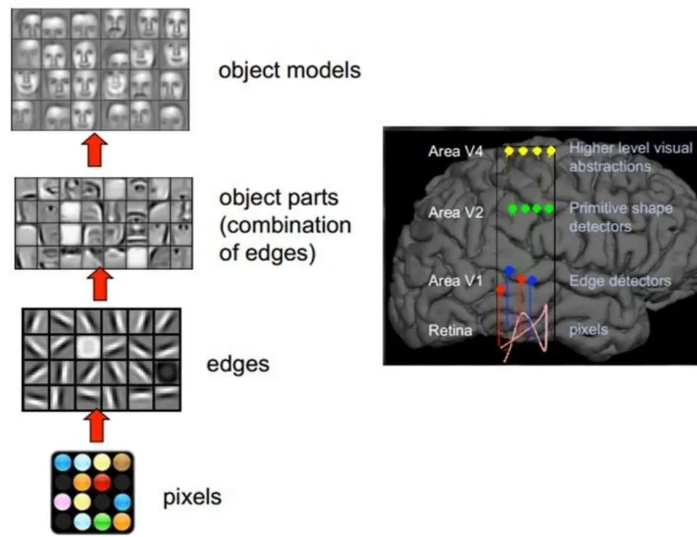
数据来源：广发证券发展研究中心

## （三）深层模型结构

深度学习是模拟大脑皮层的 Hubel-Wiesel模型，采用一层层“抽象化”的方式来对数据或者信号进行表达。类似于大脑皮层对图像的分辨，深度学习模型首先从原始信号（类似于人脸识别系统中的像素）中分离出低层的特征（类似人脸识别系统中物体的边），然后从低层特征中获取高一层的特征（类似于人脸识别系统中由边组成的轮廓），然后获得更高一层的表达（类似人脸识别中的人脸），最后在高层特征上建立起分类器，获得模型的预测输出。

图3：深度学习的层级结构
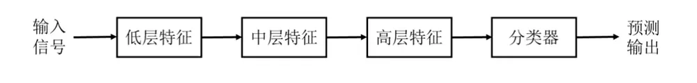
数据来源：广发证券发展研究中心
识别风险，发现价值
请务必阅读末页的免责声明

在从低层到高层特征的学习过程中，一方面是要对数据进行“好”的表达，另一方面需要尽量不损失信息。怎么理解一个“好的表达”呢？我们可以用一个例子来简单说明“表达”的重要性。在十进制的表示形式下，我们一般认为乘法比加法难算好多，比如342608 和262808的和，只要各位对齐，一位一位地相加并处理好进位就好了，口算能力一般的人也可以心算出来；但是如果是做乘法计算的话，口算是一件不太现实的事情。这是因为我们常用的数字的十进制表达偏向于加法计算的缘故。但是，如果我们换一种表达：每一个数字可以等价地表达为它的素数因子的集合，例如

342608 {2,2,2,2,7,7,19,23}

262808 {2,2,2,7,13,19,19}

那么这两个数字相乘就变得非常简单了：

$$
342608\times262808{\stackrel{\triangle}{=}}\{2,2,2,2,2,2,2,7,7,7,13,19,19,19,23\}
$$

反过来，在这种表达下进行加法计算变成了一件很难的事情。因此，同样的一个目标，在不同的表达下边实现起来差别非常大。

深度学习正是在对大量的数据进行特征抽象的同时，获得其丰富的表达，而对于特定的学习目标，相应的，合适的表达会被激活，从而在没有经过人工特征选取的前提下获取足够好的学习效果。

深度学习中，先是采用逐层学习的贪婪式算法对特征进行提取，是一种无监督学习，即采用未经人工标注类别的样本进行学习（对应的，支持向量机，神经网络等方法有定义好的“输入”和“输出”，属于有监督学习）。逐层学习时，有多种选择方式，目前比较普遍的有自编码器和受限玻尔兹曼机，本报告中采用的模型是用自编码器进行学习的。这两种模型都是基于人工神经网络来实现的。因此在介绍具体的深度学习模型之前，我们先回顾一下人工神经网络的基本知识。

## （四）人工神经网络

人工神经网络是一种应用类似于大脑神经突触连接的结构进行信息处理的数学模型，工程上常简称为神经网络。神经网络由大量的节点（或称“神经元”）和节点之间的相互连接构成。每个节点代表一种特定的输出函数，称为激励函数。每两个节点间的连接都代表一个对于通过该连接信号的加权值，称之为权重。网络的输出则依网络的连接方式、权重值和激励函数的不同而不同。

图4 表示的是神经元的基本形式，将D 个输入变量和偏置项累加起来，经过激励函数，获得输出 y。常用的激励函数有逻辑函数，正切函数等。逻辑函数作为激励函数的表达式为

$$
y=\sigma(x)=\frac{1}{1+e^{-x}}\tag{1}
$$

如图 5 所示。

图4：神经元示意图
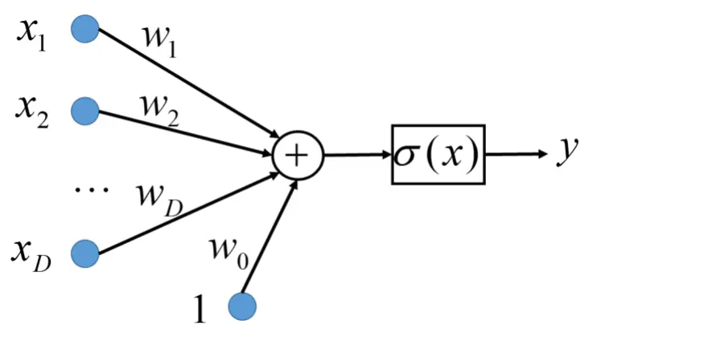
数据来源：广发证券发展研究中心

图5：逻辑函数输入输出图
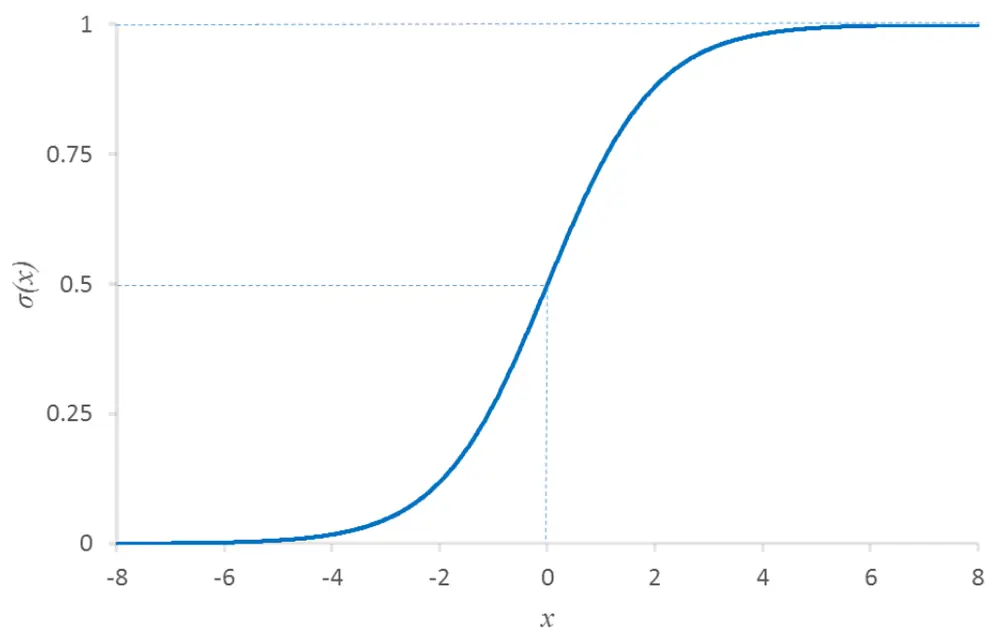
数据来源：广发证券发展研究中心

图6：神经网络示意图
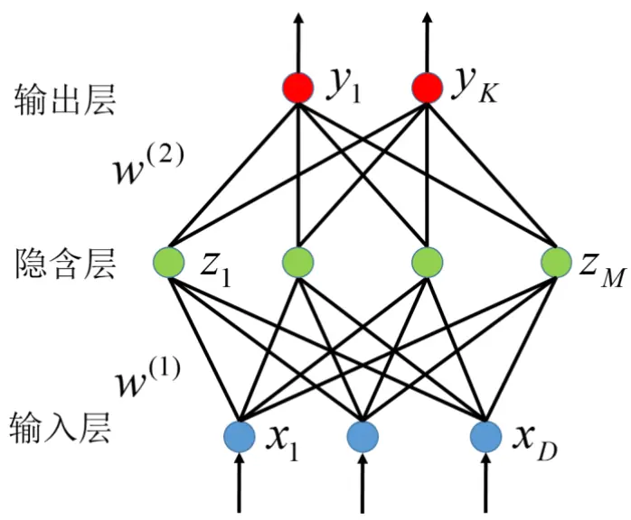
数据来源：广发证券发展研究中心

因此，该神经元的数学表达式为

$$
y=\sigma(\sum_{i=1}^{D}w_{i}x_{i}+w_{0})\tag{2}
$$

一个完整的神经网络模型通常将节点分成若干层次：输入层，输出层和隐含层，如图6所示。输入层即我们给定的模型输入，输出层即我们想通过神经网络“预测”的结果，隐含层相当于网络系统的状态。对于回归神经网络，输出层节点的个数即我们所要预测的变量个数；对于分类神经网络，输出层节点的个数通常是可能的分类总类别数。该神经网络第 k个输出的数学表达式为

$$
y_{k}=\sigma\left\{\sum_{j=1}^{M}\left(w_{kj}^{(2)}h\left(\sum_{i=1}^{D}w_{ji}^{(1)}x_i+w_{j0}^{(1)}\right)+w_{k0}^{(2)}\right)\right\}\tag{3}
$$

其中 $\sigma$ 和ℎ分别为输出层和隐含层的激励函数。神经网络的参数为各层的网络系数 $w_{ij}$

可以一并记为向量w。注：公式中的黑体表示向量或者矩阵， $w_{ij}$ 为向量w中的元素。

神经网络模型的学习即利用我们已经有的输入输出数据（训练集），对参数w的优化，使得输出 y尽可能的接近于其真实值 t，即要使得如下的预测误差（即损失函数）最小化

$$
E(\mathbf{w})=\sum_{n=1}^{N}E_n(\mathbf{w})=\sum_{n=1}^{N}\sum_{k=1}^{K}(y_{nk}-t_{nk})^2\tag{4}
$$

一般使用梯度下降法来获取最优的参数w：

$$
w_{ij}:=w_{ij}-\alpha\frac{\partial}{\partial w_{ij}}E(\mathbf{w})\tag{5}
$$

其中参数α为学习率，表示每一次迭代的步长。当神经网络训练样本的数据量很大时，梯度下降法效率很低，应该采用计算效率比较高的随机梯度下降（Stochastic gradientdescent）方法或者是迷你批量方法（Mini-Batch）进行优化。深度学习中，神经网络的训练一般采取迷你批量的方式进行优化。具体的描述见第（六）节。

公式(5)的关键在于偏导数的获取，目前最流行的是 1986 年由 Rumelhart 和McCelland 提出的反向传播算法（BP 算法），从输出层开始后推，使用误差反向传播的方式对参数进行优化。具体的方法本报告不再赘述。

## （五）自编码器和深度网络

深度学习模型事实上是一个含有多个隐层（隐层数量大于等于 2个）的神经网络模型。原始数据经过一层一层的抽象之后，最后进行分类。但是普通的多层神经网络模型是高度非凸的，在训练时，由于存在大量的局部最优点而且收敛性差，很难获得好的学习结果，在实际应用时过拟合现象过于严重。而深度学习模型的训练中，先利用大量的数据对无监督网络进行逐层学习，再将训练好之后的参数作为有监督神经网络的参数学习的初始值。模型的总体结构如图7 所示。该深度学习网络含有两个隐层H1 和H2。在逐层的无监督学习中，先通过原始数据 X 学习获得第一个隐含层 H1，然后通过第一个隐含层H1 学习获得第二个隐含层 H2。当无监督网络训练好之后，一般采用带有标签的样本通过反向传播算法进行有监督学习。

自编码器是一种常用的无监督网络学习方法，也是一种特殊的神经网络模型。该网络模型的输出就是它的输入，如图 8 所示。通过自编码器 $\mathbf{w}^{(1)}$ “编码”获得隐层 Z 之后，

可以通过 $\mathbf{w}^{(2)}$ 对隐层进行“解码”，重新还原出原始数据。模型的优化目标函数为

$$
L_{AE}=\frac{1}{N}\sum_{i=1}^{N}\left\|\tilde{\mathbf{X}}^{(i)}-\mathbf{x}^{(i)}\right\|_{2}^{2}\tag{6}
$$

即要使得模型的预测输出尽可能等于输入。从信息的传递上来说，这是使得信息损失尽可能少的一种编码方式。

基于自编码器的深度学习模型思路是：对原始的数据，通过自编码器的学习，获得编码层 H1；然后对编码 H1 进行自编码器学习，获得编码层 H2；如此逐层获得深度神经网络的各个隐含层。然后将学习好的编码器系数和结果作为深层神经网络模型的初始值，进行深层神经网络的学习。

图7：深度学习示意图
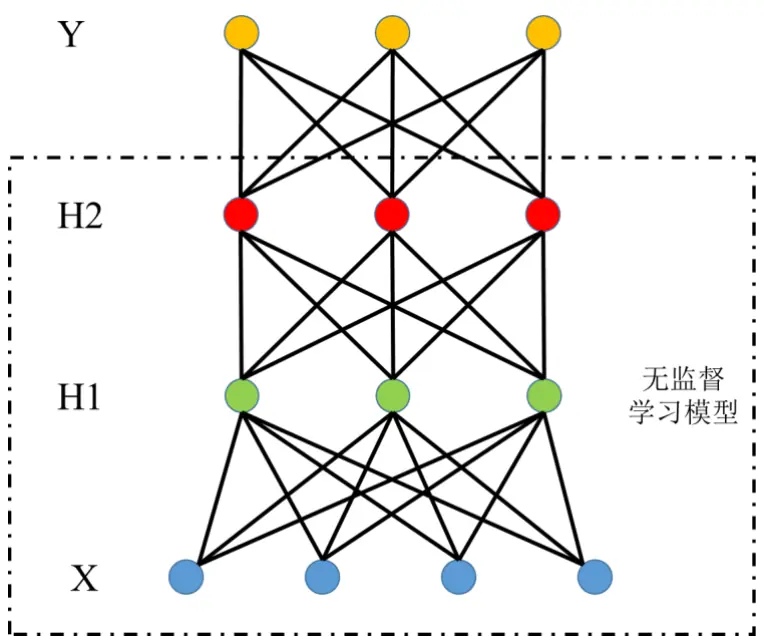
数据来源：广发证券发展研究中心

图8：自编码器示意图
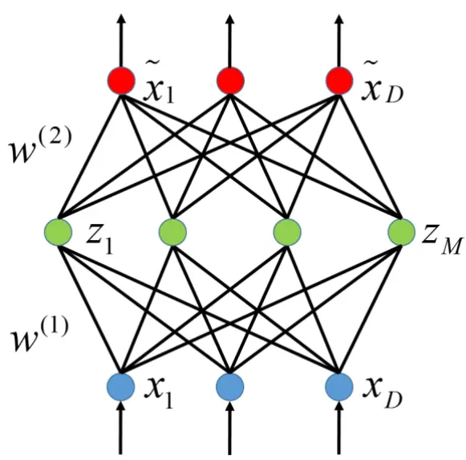
数据来源：广发证券发展研究中心

为了使得自编码器获得的结果更加鲁棒，减少过拟合，Bengio（2008）提出了一种称为降噪自编码器的方式，在每次对自编码器进行训练时，将自编码器输入层的节点以一定概率随机设置为 0。如图 9 所示，其中xˆ 为将自编码器输入x中节点随机设置为 0的结果，可以视为是一种经噪声污染后的形式。在每一次迭代更新参数的时候都需要重新获取xˆ ，且要使得xˆ 经过编码解码之后能够重构出尽可能接近原始输入x的结果。实践证明通过这种鲁棒自编码器训练获得的深度学习模型比普通的自编码器模型或者受限玻尔兹曼机获得的模型一般要性能更优。本报告采用的就是鲁棒自编码器。

因此，本报告中深度学习模型的训练分成两部分。第一步是使用没有标签或者去掉标签的数据，通过降噪自编码器逐层学习深层网络的隐层系数。第二步是将降噪自编码器学习获得的系数作为网络系数初始值，使用含有标签的数据，通过反向传播算法对深层网络进行有监督学习。

图9：降噪自编码器示意图
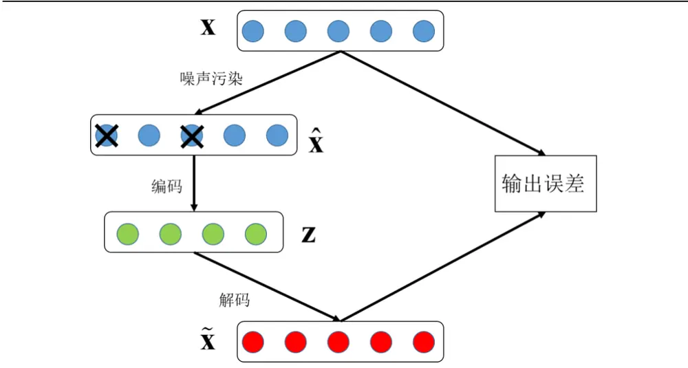
数据来源：广发证券发展研究中心

## （六）大数据优化问题的迭代算法

我们要处理的是形如公式(4)的优化问题，该问题可以采用如同公式(5)的梯度下降
算法来进行迭代计算。由于 E( )w 是通过训练集所有数据获得的预测误差，所以
$\frac{\partial}{\partial w_{ij}}E(\mathbf{w})$ 的计算也需要用到训练集的所有数据。对于大规模数据的问题，梯度下降算
法的迭代速度会变得非常慢。这时候可以用随机梯度下降法来提高优化运算的速度。公式(5)可以写成

$$
\begin{aligned}w_{_{ij}}&:=w_{_{ij}}-\alpha\frac{\widehat{\mathcal{O}}}{\widehat{\mathcal{O}}w_{_{ij}}}E(\mathbf{w})\\&=w_{_{ij}}-\alpha\frac{\widehat{\mathcal{O}}}{\widehat{\mathcal{O}}w_{_{ij}}}\sum_{_{n=1}}^{N}E_{_n}(\mathbf{w})\\&=w_{_{ij}}-\sum_{_{n=1}}^{N}\alpha\frac{\widehat{\mathcal{O}}}{\widehat{\mathcal{O}}w_{_{ij}}}E_{_n}(\mathbf{w})\\\end{aligned}\tag{7}
$$

可以看到，每一次迭代需要获得的梯度事实上是把每个样本的预测误差 $E_{n}(\mathbf{w})$ 对 $w_{ij}$ 的偏导数进行累加起来的结果。因此等价于分别将w 依次针对每个样本做更新后的结果。 $w_{ij}$

随机梯度下降法是在对单个样本做参数更新后，用更新之后的参数来计算下一个样本的预测误差，用于下一个样本的参数更新计算。因此公式(7)写成

$$
w_{ij}^{(n)}:=w_{ij}^{(n-1)}-\alpha^{\prime}\frac{\partial}{\partial w_{ij}}E_{n}(\mathbf{w}^{(n-1)}).\tag{8}
$$

即用第n个样本来更新参数时， $E_{n}(\mathbf{w})$ 中的参数w用上一个样本更新之后的值 $\mathbf{W}^{(n-1)}$ 来计算。由于对每一个样本进行迭代时，待优化的参数都在不断更新，当迭代计算的样本量很大时，随机梯度下降法的收敛速度会明显优于梯度下降法。而且，随机梯度下降法有更大的可能避免局部最优解。

相对于梯度下降法，随机梯度下降法的问题在于：由于样本之间的差异性很大，每次迭代的参数更新并不是朝着“最优”的方向进行，而且在固定学习率下，算法通常不会收敛，最后会在最优值附近振荡。

深度学习模型训练中常用的迷你批量（Mini-Batch）下降法是在随机梯度下降法的基础上建立起来的一种优化迭代算法。其算法是每次参数更新不是按照单个样本，而是按照由若干个样本组成的一个批次来计算参数更新的梯度

$$
w_{ij}^{(n)}:=w_{ij}^{(n-1)}-\alpha^{''}\frac{\hat{\mathcal{C}}}{\hat{\mathcal{C}}w_{ij}}\sum_{n_k\in\mathrm{batch}(n)}E_{n_k}(\mathbf{w}^{(n-1)})\tag{9}
$$

因此，迷你批量方法可以视为普通的梯度下降方法和随机梯度下降方法的一个折中。一方面保证了算法迭代的高效性；另一方面，在批次内各类样本选取均衡的情况下，每次迭代时的参数更新都是近似朝着“最优”的方向进行的。同时，与随机梯度下降方法相比，迷你批量下降法的每一次迭代都采用多个样本进行计算，充分利用了Matlab等科学计算软件在向量化计算上的高效性。迷你批量方法中，每个批次内的样本数量一般在2 到 200 之间。

## 三、交易策略

西蒙斯的壁虎式投资理论告诉我们，投资时在短线内是可以进行方向性预测，捕捉到短期套利机会的。基于深度学习的交易策略就是借助于深度学习对大量的历史交易数据进行学习，建立预测模型，从而在实际交易中捕捉到短期的交易机会。

本报告提出的基于深度学习的股指期货交易策略首先使用深度学习模型对短期内股指期货的涨跌进行预测，然后根据预测结果确定股指期货的买卖信号。

首先是深度学习预测模型。一般的，预测时间间隔越短的话，机器学习模型的预测能力会越强。本报告考虑的是股指期货的1秒级高频数据。在预测模型输入的选择上，选择的是短期内的股票价格，以及价格的变化范围，买卖盘价格和委卖委买量等。预测模型的输出是未来短期内的涨跌方向。考虑与交易相关的涨跌，我们建议选取未来涨跌幅度较大的样本作为机器学习模型感兴趣的样本。

当深度学习预测模型训练好之后，我们可以根据预测模型的输出判断未来的涨跌。但是这里的预测结果不能直接用于建立交易策略，原因有两点：1、涨跌只是一个方向性的预测，并没有说明涨跌的几率具体有多大，幅度是否足够大；2、高频下股票的波动有限，持仓时间很短的交易很难带来超额的回报。

基于这两点考虑，本报告中的交易策略有两个特点。第一，给定阈值，只有达到或超过阈值的预测得分才会触发买卖信号。第二，交易中的开仓和平仓都由买卖信号触发。

虽然深度学习模型是一个分类模型，但同时也可以给出样本属于各个类别的得分值（得分是逻辑函数（图5）的输出，位于[0,1]之间）。对于股票价格变化预测模型，可以获得上涨的预测得分Score1和下跌的预测得分Score2。以判断未来是否股价上涨为例，得分Score1越大的样本，未来上涨的几率越大。对应的，得分Score2越大的样本，未来下跌的几率越大。我们可以根据得分的大小，设定阈值，从而当得分超过阈值时，触发买卖信号。记做多信号触发阈值为BuyTrigger，做空信号触发阈值为SellTrigger，则买卖信号Signal如下

$$
\begin{aligned}Signal=\left\{\begin{aligned}&1&\textit{Score1>BuyTrigger}\\&-1&\textit{Score2>SellTrigger}\\&0&其他\end{aligned}\right.\end{aligned}\tag{10}
$$

我们的交易策略由买卖信号触发。每天开盘时都是空仓状态。由买入/卖出信号的触发分别建立多仓和空仓，持仓时间不定。如果在持有多仓时，有空头信号触发，立即平仓并反向建立空仓，否则(如继续有多头信号触发时)不改变持有头寸。如果在持有空仓时，有多头信号触发，立即平仓并反向建立多仓，否则(如继续有空头信号触发时)

不改变持有头寸。由于市场噪声和突变的情况，预测模型对只能够准确预测一部分股价变化，所以在持仓的时候，要设置止损策略，当实时价格突破止损线r时，立即进行止损平仓。止损价格以最近一次发出交易信号时的股票价格为基准进行计算。具体的交易策略如图10所示。

图10：深度学习股指期货交易策略
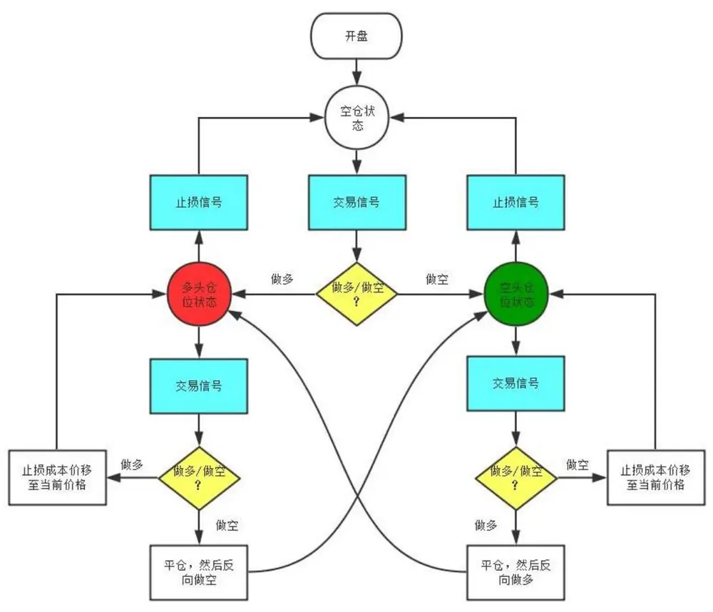
数据来源：广发证券发展研究中心

## 四、实证分析

实证分析中，我们选取 2012 年的股指期货 1 秒钟高频行情作为训练集（样本内数据），2013 年 1 月 1 日至 2014 年 4 月 18 日的股指期货行情作为样本外数据。选取的输入如表 1所示。为了在输入数据中引入市场中量价指标随时间的动态变化，我们将t时刻所考察样本 $.\mathbf{X}_{t}$ 的前 4 个时刻的样本 $\left(\begin{array}{llll}\mathbf{X}_{t-1},&\mathbf{X}_{t-2},&\mathbf{X}_{t-3},&\mathbf{X}_{t-4}\end{array}\right)$ 加入输入变量序列中，组成扩展的输入向量 $\overline{{\mathbf{x}}}_{t}=[\mathbf{x}_{t},\mathbf{x}_{t-1},\mathbf{x}_{t-2},\mathbf{x}_{t-3},\mathbf{x}_{t-4}]$ （前一个交易日的收盘价是同一个变量，不用扩展）。数据的预处理过程包括股价数据的标准化（将 t时刻输入向量$\overline{{\mathbf{X}}}_{t}$ 中所有股价数据除以 t 时刻的收盘价格并取对数），极端数据的平滑（用变量的 99.9%和0.1%为门限，超过门限的数据用门限值来替代），归一化（所有数据都按照公式(11)转化为[0,1]之间的数据）：

$$
x_{t}^{i}:=\frac{x_{t}^{i}-\min x^{i}}{\max x^{i}-\min x^{i}}\tag{11}
$$

表1：深度学习股价预测特征选取

| 选取输入变量 | 说明 |
| --- | --- |
| 收盘价 |  |
| 最高价 |  |
| 最低价 |  |
| 开盘价 |  |
| 买卖盘报价差 | 卖盘报价-买盘报价 |
| 买卖盘报价平均价格 | （买盘报价+卖盘报价）/2 |
| 成交量 |  |
| 委买委卖量之比 | 1og(委买量/委卖量) |
| 买卖盘深度 | 委买量+委卖量 |
| 持仓量变化 |  |
| 前一日收盘价格 |  |

数据来源：广发证券发展研究中心

样本内数据的一共有近 390 多万个，有约110万个样本的下一秒股价下跌，约 110万个样本的下一秒股价上涨，其他 170多万个样本的下一秒钟股价不变。本报告中我们考虑的双边交易成本为万二。因为我们只对股价变化幅度比较大的样本感兴趣，为了使模型训练时不同类型的数据的差异性增大，我们选取的数据是下一时刻股价变化大于等于0.04%（在万二的交易成本下为两倍交易成本）的样本，共有 11000多个样本。此外选取了11000 多个下一秒股价保持不变的样本加入训练集中（这批样本无论是在股价上涨预测模型的训练还是股价下跌预测模型的训练时都是作为对照组，标签为“0”）。因此，实证分析中在建模时训练集一共有21700 个样本，50个变量。

深度学习网络的第一个隐层有200 个节点，第二个隐层有 100个节点，输出层有 2个节点（输出 Score1 和 Score2 依次表示预测价格是上涨或者下跌的得分）。无监督学习的隐层训练迭代次数为 50 次，有监督学习的迭代次数为 400 次。在 Intel Xeon E5620，主频2.4GHZ 的处理器下，模型的训练时间为15分钟。模型应用时，单个样本的预测耗时在1ms左右。

样本外预测结果如表2所示，其中Y表示实际股价变化。当实际股价是上涨时(Y>0)，有73.9%的机会模型会给出价格上涨的信号；当实际股价是下跌时(Y<0)，模型也有 73.7%的机会给出价格下跌的信号。因此模型预测的准确率超过 73%。如果不及交易成本，完全按照深度学习模型的输出进行交易（Score1>Score2 则做多，Score1<Score2 则做空，下一秒立即平仓），则平均单次交易有约 0.0039%的收益，远不能覆盖交易成本。

表2：深度学习股价预测结果

|  | Y>0 | Y=0 | Y<0 | Y的平均值 |
| --- | --- | --- | --- | --- |
| Score1>Score2 | 1,126,825 | 950,895 | 403,163 | 3.91×10-⁵ |
|  | (73.9%) |  | (26.3%) |  |
| Score1<Score2 | 397,325 | 971,699 | 1,128,936 | -3.89×10-⁵ |
|  | （26.1%） |  | (73.7%) |  |

数据来源：广发证券发展研究中心，天软科技

事实上，仅有极少数交易机会中，股票价格会有大幅波动，在样本内 390 多万个样本中，仅有 1.1万个样本的下一秒股价变化大于等于0.04%，不到 0.3%。因此我们策略中选取的交易机会α在 0.1%左右（多头空头机会加起来约 0.2%）。根据训练样本所有数据的预测得分，定义做多信号阈值 BuyTrigger和做空信号阈值 SellTrigger 如下

$$
\begin{aligned}&BuyTrigger:=p(Score1>BuyTrigger)=\alpha,\\&SellTrigger:=p(Score2>SellTrigger)=\alpha.\\\end{aligned}\tag{12}
$$

即有α的机会，上涨预测得分 Score1 会大于 BuyTrigger，触发做多信号；有α的机会,下跌预测得分 Score2会大于 SellTrigger，触发做空信号。

在α=0.1%，以 r=0.2%为止损线的情况下，以 2014 年 4 月 1 日为例，一共发出 9次做多和做空信号，如图 11 所示，红色向上箭头表示做多信号，绿色向下箭头表示做空信号。5 次做多信号发出后一秒，股指期货价格有 4 次上涨，1 次下跌；4 次做空信号发出后一秒，股指期货价格有 3次下跌，1次不变。如表 3所示。

通过预测模型给出的做多做空信号进行交易，由于多空信号是间隔发出的，实际执行的交易次数也一共有 9次，其中5次交易有亏损，4次交易获得正的收益，如表 3所示。扣除交易成本之后，当天累计获得收益为 0.26%。

图11：日内股指期货行情及做多做空信号（2014年4月1日）
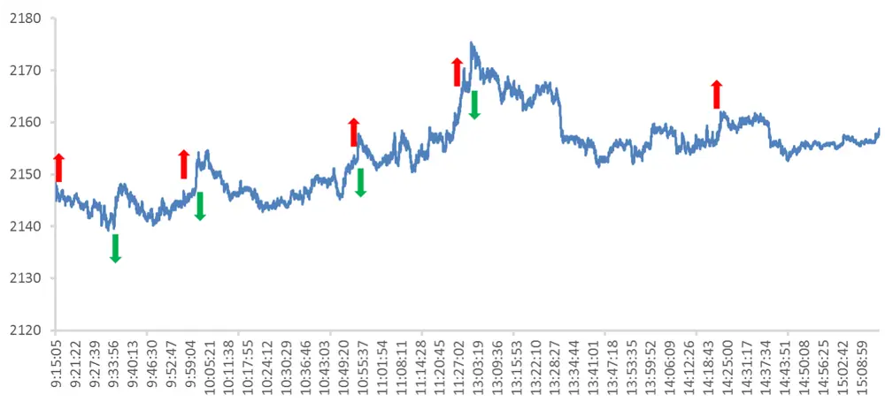
数据来源：广发证券发展研究中心，天软科技

表3：建仓平仓点位及收益明细（2014 年4月1日）

| 建仓时间 | 平仓时间 | 建仓时股价 | 一秒后股价 | 平仓时股价 | 建仓方向 | 交易盈亏 | 平仓备注 |
| --- | --- | --- | --- | --- | --- | --- | --- |
| 9:15:12 | 9:25:52 | 2146 | 2147（涨） | 2141.6 | 多头 | -0.23% | 止损平仓 |
| 9:34:42 | 9:36:17 | 2143.4 | 2143.4（平） | 2147.8 | 空头 | -0.22% | 止损平仓 |
| 9:57:06 | 10:02:00 | 2146.4 | 2146.8（涨） | 2153.6 | 多头 | 0.32% | 平仓并反向建仓 |
| 10:02:00 | 10:54:14 | 2153.6 | 2153（跌） | 2155.6 | 空头 | -0.11% | 平仓并反向建仓 |
| 10:54:14 | 10:54:35 | 2155.6 | 2155.2（跌） | 2157.2 | 多头 | 0.05% | 平仓并反向建仓 |
| 10:54:35 | 11:25:59 | 2157.2 | 2157（跌） | 2161.8 | 空头 | -0.23% | 止损平仓 |
| 11:28:03 | 13:01:36 | 2164.8 | 2165.2（涨） | 2172.8 | 多头 | 0.35% | 平仓并反向建仓 |
| 13:01:36 | 14:22:55 | 2172.8 | 2172.4（跌） | 2160.2 | 空头 | 0.56% | 平仓并反向建仓 |
| 14:22:55 | 14:39:16 | 2160.2 | 2161.2（涨） | 2155.8 | 多头 | -0.22% | 止损平仓 |

数据来源：广发证券发展研究中心，天软科技

类似的，图 12展示了2014年 4月3日深度学习模型所给出的做多做空信号。一共有12个做多做空的信号。其中 5次做多信号发出后一秒，股指期货价格有 4次上涨，1次不变；7次做空信号发出后一秒股指期货价格有 6次下跌，1次不变。

通过预测模型给出的做多做空信号进行交易，由于 9:21:04，9:45:12和 11:02:18发出做空信号时本身已经处于空头仓位，所以不进行交易操作；9:32:41 时刻发出做多信号时本身已经处于多头仓位，所以不进行操作。实际执行的交易次数一共有 8次，其中

4 次交易有亏损，4 次交易获得正的收益，如表 4 所示。扣除交易成本之后，当天累计获得收益为 1.18%。

图12：日内股指期货行情及做多做空信号（2014年4月3日）
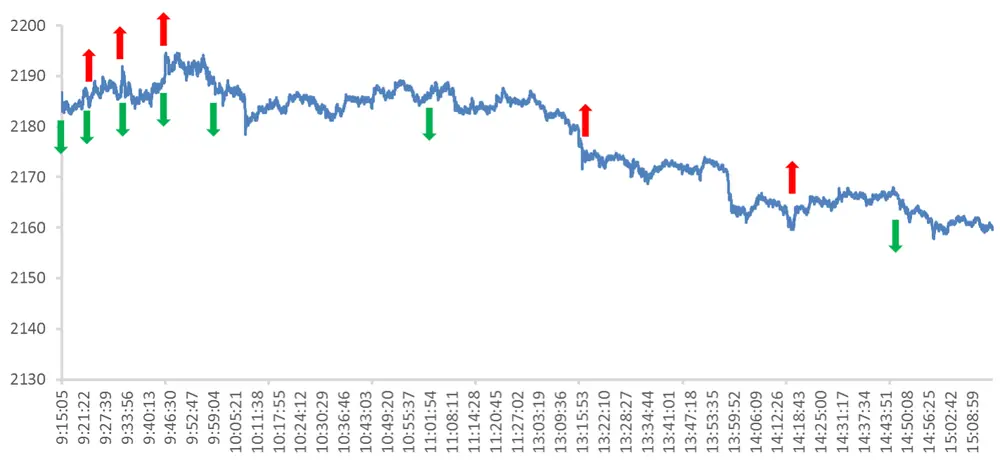
数据来源：广发证券发展研究中心，天软科技

表 4：建仓平仓点位及收益明细（2014 年 4 月 3 日）

| 建仓时间 | 平仓时间 | 建仓时股价 | 一秒后股价 | 平仓时股价 | 建仓方向 | 交易盈亏 | 平仓备注 |
| --- | --- | --- | --- | --- | --- | --- | --- |
| 9:15:06 | 9:21:24 | 2185.8 | 2185.2(跌) | 2186.4 | 空头 | -0.05% | 平仓并反向建仓 |
| 9:21:24 | 9:32:46 | 2186.4 | 2187（涨） | 2191.4 | 多头 | 0.21% | 平仓并反向建仓 |
| 9:32:46 | 9:45:17 | 2191.4 | 2191.4（平） | 2193 | 空头 | -0.09% | 平仓并反向建仓 |
| 9:45:17 | 9:57:28 | 2193 | 2193.8（涨） | 2190.6 | 多头 | -0.13% | 平仓并反向建仓 |
| 9:57:28 | 13:16:03 | 2190.6 | 2189.8（跌） | 2173.2 | 空头 | 0.78% | 平仓并反向建仓 |
| 13:16:03 | 13:35:01 | 2173.2 | 2173.2（平） | 2168.6 | 多头 | -0.23% | 止损平仓 |
| 14:16:37 | 14:46:08 | 2160.2 | 2160.8（涨） | 2167.8 | 多头 | 0.33% | 平仓并反向建仓 |
| 14:46:08 | 15:14:59 | 2167.8 | 2167.4（跌） | 2159.6 | 空头 | 0.36% | 收盘平仓 |

数据来源：广发证券发展研究中心，天软科技

样本外的累积收益曲线如图 13所示，累积收益率为 99.6%，折算成年化收益率为77.6%，最大回撤为-5.86%。由于高频的交易容量有限，这里的累积收益率按照单利来计算。单次交易的平均收益率为 0.018%。

图13：样本外累积收益曲线
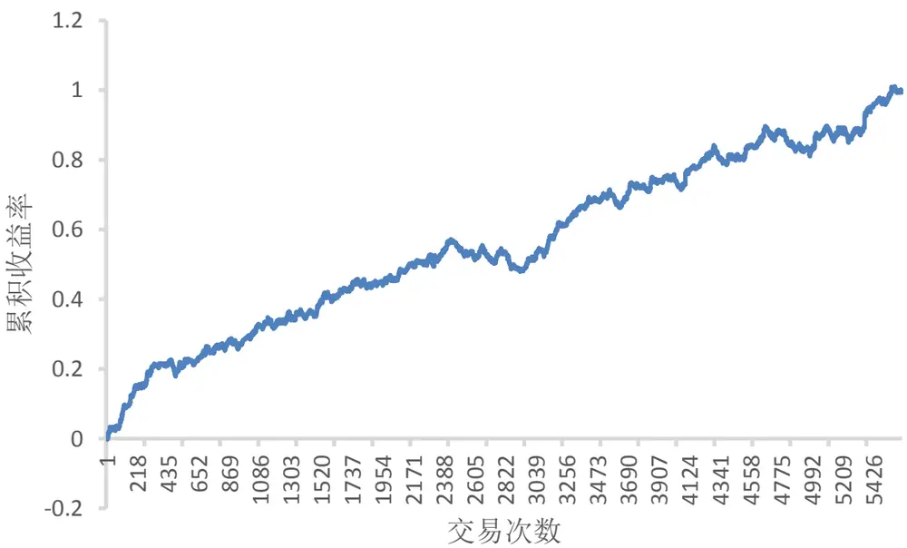
数据来源：广发证券发展研究中心，天软科技

考虑不同的交易触发限α和不同的止损线 r，得到的交易策略表现如表 5所示。可以看到在α在 0.1%左右该策略都是有利可图的。由于严格止损措施的存在，交易的胜率一般不超过 50%，赔率也一般在 1到 2之间，因此单次交易的收益率比较低，依靠大的交易频次来获取利润。而且可以看到，在扣除双边万二的交易成本之后，平均的单次交易收益率在 0.01%到 0.02%之间，受冲击成本影响很大，在实际交易中需要严格控制冲击成本。

## 五、总结与讨论

作为大数据建模分析中的有效手段，深度学习近年来在机器学习领域取得了令人夺目的成就。本报告首先提出了基于深度学习的股票价格高频预测模型，在股指期货实证上，1秒钟高频股价预测准确率超过了 73%。但是由于高频下股票价格变化不大，不能够直接从单次的1秒钟股价预测中获取超额利润。

在深度学习预测模型的基础上，本报告随后提出了一种股指期货高频行情数据的日内交易策略。在万二的交易成本下，年化收益率为 77.6%，最大回撤为-5.86%。

表5：不同参数下的交易策略样本外表现

| 交易机会 | α=0.2% |  | α=0.1% |  | α=0.05% |  |
| --- | --- | --- | --- | --- | --- | --- |
| 止损线r | 0.20% | 0.10% | 0.20% | 0.10% | 0.20% | 0.10% |
| 累积收益率 | 188.9% | 145.0% | 99.6% | 88.3% | 40.6% | 43.0% |
| 年化收益率 | 147.2% | 113.0% | 77.6% | 68.8% | 31.7% | 33.5% |
| 产生交易信号次数 | 26270 | 26270 | 10450 | 10450 | 4603 | 4603 |
| 实际交易总次数 | 12430 | 14521 | 5632 | 6695 | 2852 | 3293 |
| 日均交易次数 | 40.36 | 47.15 | 18.29 | 21.74 | 9.26 | 10.69 |
| 平均持仓时间（分钟） | 5.18 | 3.20 | 8.93 | 5.03 | 12.84 | 7.24 |
| 获胜次数 | 6424 | 6590 | 2717 | 2691 | 1200 | 1095 |
| 失败次数 | 6006 | 7931 | 2915 | 4004 | 1652 | 2198 |
| 胜率 | 51.68% | 45.38% | 48.24% | 40.19% | 42.08% | 33.25% |
| 单次平均收益率 | 0.015% | 0.010% | 0.018% | 0.013% | 0.014% | 0.013% |
| 单次获胜收益率 | 0.150% | 0.140% | 0.220% | 0.200% | 0.310% | 0.280% |
| 单次失败亏损率 | -0.130% | -0.099% | -0.170% | -0.110% | -0.200% | -0.120% |
| 赔率 | 1.15 | 1.42 | 1.29 | 1.82 | 1.55 | 2.33 |
| 最大回撤 | -3.84% | -4.21% | -5.86% | -5.77% | -8.78% | -6.65% |
| 最大连胜次数 | 19 | 18 | 13 | 12 | 8 | 7 |
| 最大连亏次数 | 15 | 17 | 11 | 15 | 16 | 24 |

数据来源：广发证券发展研究中心，天软科技

## 风险提示

策略模型并非百分百有效，市场结构及交易行为的改变以及类似交易参与者的增多有可能使得策略失效。

## Table_Res arch 广发金融工程研究小组

罗 军： 首席分析师，华南理工大学理学硕士，2010 年进入广发证券发展研究中心。

俞文冰： 首席分析师，CFA，上海财经大学统计学硕士，2012年进入广发证券发展研究中心。

安宁宁： 资深分析师，暨南大学数量经济学硕士，2011年进入广发证券发展研究中心。

胡海涛： 分析师， 华南理工大学理学硕士， 2010年进入广发证券发展研究中心。

蓝昭钦： 分析师，中山大学理学硕士， 2010年进入广发证券发展研究中心。

史庆盛： 分析师，华南理工大学金融工程硕士， 2011年进入广发证券发展研究中心。

张 超： 研究助理，中山大学理学硕士， 2012年进入广发证券发展研究中心。

## able_RatingIn dustry 广发证券 —行业投资评级说明

买入： 预期未来12个月内，股价表现强于大盘10%以上。

持有： 预期未来12个月内，股价相对大盘的变动幅度介于-10%～+10%。

卖出： 预期未来12个月内，股价表现弱于大盘10%以上。

## Table_RatingCo mpany 广发证券 —公司投资评级说明

买入： 预期未来12个月内，股价表现强于大盘15%以上。

谨慎增持： 预期未来12个月内，股价表现强于大盘5%-15%。

持有： 预期未来12个月内，股价相对大盘的变动幅度介于-5%～+5%。

卖出： 预期未来12个月内，股价表现弱于大盘5%以上。

## Table_Ad联系我们

|  | 广州市 | 深圳市 | 北京市 | 上海市 |
| --- | --- | --- | --- | --- |
| 地址 | 广州市天河北路183号 大都会广场5楼 | 深圳市福田区金田路4018 号安联大厦 15楼A 座 | 北京市西城区月坛北街2号 月坛大厦18层 | 上海市浦东新区富城路99号 震旦大厦18楼 |
| 邮政编码 |  | 03-04 |  |  |
| 客服邮箱 | 510075 | 518026 | 100045 | 200120 |
| 服务热线 | gfyf@gf.com.cn 020-87555888-8612 |  |  |  |

## Table_Disclaimer 免责声明

广发证券股份有限公司具备证券投资咨询业务资格。本报告只发送给广发证券重点客户，不对外公开发布。

本报告所载资料的来源及观点的出处皆被广发证券股份有限公司认为可靠，但广发证券不对其准确性或完整性做出任何保证。报告内容仅供参考，报告中的信息或所表达观点不构成所涉证券买卖的出价或询价。广发证券不对因使用本报告的内容而引致的损失承担任何责任，除非法律法规有明确规定。客户不应以本报告取代其独立判断或仅根据本报告做出决策。

广发证券可发出其它与本报告所载信息不一致及有不同结论的报告。本报告反映研究人员的不同观点、见解及分析方法，并不代表广发证券或其附属机构的立场。报告所载资料、意见及推测仅反映研究人员于发出本报告当日的判断，可随时更改且不予通告。

本报告旨在发送给广发证券的特定客户及其它专业人士。未经广发证券事先书面许可，任何机构或个人不得以任何形式翻版、复制、刊登、转载和引用，否则由此造成的一切不良后果及法律责任由私自翻版、复制、刊登、转载和引用者承担。