识别趋势震荡之神器 MESA

## 另类交易策略之十五

## 报告摘要：

## 趋势震荡困惑

2010 年 A 股市场迎来沪深 300 指数期货，期初市场波动巨大，趋势良好，日内趋势交易模型大赚特赚之声不乏于耳，但是进入到2013年以来，市场波动骤然缩减，十字星振幅震荡成了家常便饭，更有以吃止损盘为生的说法出现，趋势不在，君以为如何？我们来回答，MESA神器可识别趋势或震荡，何谓MESA，最大熵谱分析是也！

## 最大熵谱分析

将时域数据转换为频域数据的模型很多，最广为人知的就是傅里叶变换，后来又衍生出来快速傅里叶变换以及小波变换，被非常广泛的用于信号处理，信息论等领域。最大熵频谱分析模型在金融领域的应用更加优于快速傅里叶变换和小波变换，因为他所需要的估计数据更少，从而使结果更加精确同时延迟更加少。

利用最大熵谱分析方法，将时域序列转至频域，从而发现波动周期，周期大者为趋势，小者为震荡。

## 实证结果

以 2011 年到 2013 年的股指期货数据为实证数据，模型的参数在实证过程中实时估计和更新。最大熵模型的指标很好的将震荡的数据滤掉，而在趋势阶段，我们使用自适应均线进行交易，通过对动量的判断来发出发卖信号以及平仓信号。

我们假设手续费为单边万分之零点三，滑点为平均单边 0.3 点，止损的设置为每5 分钟损失10个点的时候止损。

从交易结果来看，在考虑手续费及滑点之后，2011 年至 2013 年累计收益点数 1535，约合累计收益率 230.25%，胜率 42.6%。其中 2011年收益 683点，最大回撤213点，约合收益率102.45%，回撤31.95%。其中 2012 年收益 162 点，最大回撤 169 点，约合收益率 24.30%，回撤 25.35%，2013 年收益 689 点，回撤 174 点，约合收益率 103.35%，回撤 26.10%。

图 1 熵谱分析识别震荡与趋势
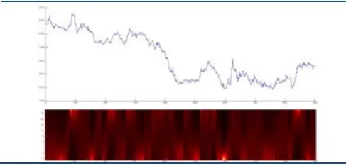

图 2 MESA自适应均线交易策略
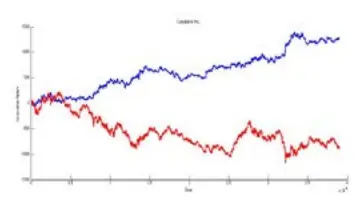

分析师： 安宁宁 S0260512020003

0755-23948352

ann@gf.com.cn

## 相关研究：

| 另类交易策略系列之十四：2014-03-31 经验模态分解下的日内趋 |  |
| --- | --- |
| 势交易策略 另类交易策略系列之十三： 基于统计语言模型（SLM） | 2014-01-14 |
| 的择时交易研究 另类交易策略系列之十二：2013-09-02 基于遗传规划多维变量的 |  |
| 股指期货交易策略 另类交易策略系列之十一：2013-06-17 |  |
| 日内突破模式及其资金管 理的多重比较研究 |  |
| 另类交易策略系列之十：基2013-02-26 于遗传算法的期指日内交 |  |
| 易系统 另类交易策略系列之九：基2013-09-16 于遗传规划的智能交易策 略方法 |  |

## 一、频域模型

## （一）概述

频域分析最早开始于1822年Joseph Fourier在他的论文Analytical Theory ofHeat，该文章中提出一个时域的函数可以通过他的频域形式积分而重建出。他的论文当时并没有得到广泛的认可，直到他去世后人们才发现该结论的重要性。

20世纪之后，随着电子信息的快速发展，频域分析被广泛的应用在数字信号处理，模拟信号处理，通信理论，信息论，以及统计学等各个领域。同时，频域分析的自身技术也在不断的提高。随着数字信号处理和数据压缩的不断发展，诞生了离散时间傅里叶变换，该方法本质和原理与傅里叶变换一样，是它的离散形式，由于很多信号都是通过采样得到的离散形式，所以它在信号的领域应用非常之多。

1942年，匈牙利数学家和物理学家Lanczos和人类学家Danielson共同提出了最早的快速傅里叶变换，随后在1965年由J.W Cooley和J.W Tukey共同提出了快速傅里叶的Cooley-Tukey算法，该算法也是截至目前最受欢迎且最常使用的一种算法。快速傅里叶变换使得离散傅里叶变换可以更加高效的求解，它通过将离散傅里叶变换矩阵分解成稀疏矩阵的乘积来得到相应变换，该算法之后被广泛的应用到工程，数学及物理领域。

傅里叶变换的一大缺点就在于他的分辨率是固定的，对于任意的频谱都会得到相同的分辨率，而且想要得到很高的分辨率需要非常大量的数据。90年代被提出的小波分析很好的解决了第一个问题。小波变换是将平方可积函数表示为一个小波产生的正交序列，该方法是目前最常用的时域-频域转换方法。他的优点在于不改变序列形态的情况下，可以使时间自然延展，这就使得小波变换中可以对于不同的频率得到不同的分辨率，对于想要仔细研究应用的频率可以使用更高的分辨率。小波分析在信号处理，图像处理以及通讯中都有着非常多样的应用。

## （二）信息论与统计物理

虽然小波分析以及傅里叶分析都可以提供非常好的时域-频域变换工具，但是他们都需要较多的数据来进行频谱的确定。在金融领域，对于每个交易点，想要利用小波或者傅里叶变换来确定该点所处的周期长短，需要进行变换，而小波和傅里叶变换都需要大量的数据才能完成这个工作，这就使得我们不得不想一些更加有效的方法来进行建模。而通过最大熵原理估计数据的频谱可以非常好的解决这个问题，该方法并不需要很大的数据量就可以完成时域-频域变换。

熵的概念最初从信息论和统计物理中得来。信息论是应用数学，电子工程以及计算机科学的一个分支理论，他将信息数量化后进行分析，最初由Claude EShannon提出并研究，主要应用于信号处理领域比如信号的压缩，解压，存储以及传输。同时信号论也应用于很多其他的学科，比如统计推断，自然语言处理，信息安全，神经生物学，生态学，热力学，量子计算等等。

而信息论中最重要的一个环节就是熵，经常表示为用于存储或传输一个符号所需要的平均比特数，将信息中的不确定性数量化。

统计力学是研究力学系统中不确定状态的平均行为的学科。宇宙中物体运动的基础理论便是力学，在非量子的微观层面上，微粒的运动同样服从经典力学的原理，从而形成了热动力学，但是热动力学的原理虽然正确，但是却跟实际生活中的情形没有太多联系，统计力学作为一系列的数学物理工具将经典热动力学和实际情形很好的联系起来。

统计力学的熵用来衡量热动力学系统中的无序性，也是衡量系统在向平衡点靠近时的进程，一个独立的系统的熵永远是增加的，因为系统最终会达到平衡点。

通过最大熵原理对回报率进行时域-频域的变化相当于将一个白噪声序列通过一个可调滤波器，再将从滤波器中输出的波形与实际时域中的回报率序列进行比对，根据二者的误差对滤波器进行调整，直到滤波器的输出波形与时域中的回报率序列的误差小于一定阀值。这样我们就可以用滤波器的响应方程来表示数据，从而得到数据的频域信息。

## 二、最大熵模型

## （一）模型介绍

首先我们来更加具体的讲述熵的概念。假设有M个不同的事件 ${\pmb{m}}_{i}$ 即将发生，每件事情发生的概率都为 。如果所有的概率全都相等，那么我们对于这个系统就没有任何信 $p_{i}$ 息，而如果对于某一个事件的概率我们知道的非常清楚，那么我们就可以从这个系统中得到相当一部分信息。因此我们可以把信息和概率的关系写成：

$$
I=k\ln{\frac{1}{p_{i}}}
$$

其中 I是信息量，k是一个常数，当对数的基为2时取值为1。如果我们观察这个系统很长一段时间T，如果 T足够大，我们可以认为我们能够观察到 $p_{i}{T}$ 个 ，那么整个 ${\pmb{m}}_{i}$ 系统中的信息量就可以表示为：

$$
I_{_{total}}=k(\sum p_{i}T\ln{\frac{1}{p_{i}}})
$$

对于每个单位时间段内的平均信息我们就可以表示为：

$$
H{=}\frac{I_{ioial}}{T}{=}{-}k\sum p_{i}\mathrm{ln}\frac{1}{p_{i}}
$$

其中 H就是该系统的熵。从上式中我们可以清楚的看到熵利用概率来描述系统不确定的变量。一个系统的熵是0 如果对于这个系统除了一个p之外剩下的概率全部为0。这时系统是固定的没有随机性和不确定性。而如果对于一个系统，所有的 $\pmb{p}_{i}$ 全都相同，这时由上式可以知道系统的熵得到最大值，系统的不确定性也是最大的。

将最大熵原理用在频谱分析的时候，我们首先给出一个时间序列的熵和谱密度之间的关系：

$$
H{=}\frac{1}{{4}f_{N}}\int_{1{\log}3(f)df}^{f}
$$

其中S是时间序列的谱密度函数， $f_{N}$ 是 Nyquist频率。我们可以将S表示成该数据的自相关系数 $\rho(k)$

$$
H=\frac{1}{4f_{N}}\int\displaylimits_{N}^{f_{N}}\sum\displaylimits_{k=-\infty}^{\infty}\log\rho(k)\exp(-i2\pi fk\Delta t)df
$$

因为谱密度S和自相关系数 $\rho(k)$ 是一致的，我们可以把此当成限制条件，运用Lagrange方法对谱密度进行求解，得到：

$$
S(f)=\frac{P_{_M}}{f_{_N}\vert1+\displaystyle\sum_{j=1}^{m}\gamma_{_j}\exp(-i2\pi fj\Delta t)\vert^{2}}
$$

其中 $\gamma_{j}$ 是预测误差参数，可以从历史数据中得到， $P_{M}$ 是一个常数。 $\ngeq$ 此我们就通过最大熵方法从理论上求解出了时间序列的谱密度，但是这个方法的参数估计非常复杂，自相关矩阵经常是非正定的，同时预测误差参数的长度也很难确定。

但是幸运的是，在 1971 年，van de Bos 发现了上述模型和 AR模型的部分相似性，从而可以将对 $\gamma_{j}$ 的估计转换为对AR 模型参数的估计，从而使最大熵的模型求解变的更加高效。

## （二）最大熵和 AR 模型的关系

AR 模型是 1927 年 Yule 在他的论文 On a Method of Investigating Periodicitiesin Disturbed Numbers中提出的，一个 AR过程可以表示为一个线性滤波模型：

$$
\pmb{x}_{t}=\pmb{\mu}+\pmb{a}_{t}+\psi_{1}\pmb{a}_{t-1}+\psi_{2}\pmb{a}_{t-2}+\cdots
$$

其中 $a_{t}$ 是一个白噪 $\scriptstyle{\frac{\pm}{\mathcal{P}}}$ 过程，我们可以将线性滤波器表示成一个算子：

$$
\scriptstyle{\psi(z)=1+\psi_{1}z+\psi_{2}z^{2}+\cdots}
$$

现在我们可以将AR过程写成：

$$
X(z)=\Psi(z)A(z)
$$

我们让 $\Phi(z)=\Psi^{-1}(z)$ ，于是我们可以将上式写成：

$$
\Phi(z)X(z)=A(z)
$$

或者：

$$
\pmb{x}_{t}=\pmb{\phi}_{1}\pmb{x}_{t-1}+\pmb{\phi}_{2}\pmb{x}_{t-2}+\cdots+\pmb{a}_{t}
$$

一个p阶的AR过程的谱密度函数可以对上式做z 变换得出，于是：

$$
X(z)-X(z)(\alpha_{1}z+\alpha_{2}z^{2}+\cdots+a_{p}z^{p})=A(z)
$$

对上式进行变换我们有：

$$
|X(z)|^{2}{=}{\frac{|A(z)|^{2}}{|1{-}({\alpha}_{1}z{+}{\alpha}_{2}z^{2}{+}{\cdots}{+}a_{p}z^{p})|^{2}}}
$$

将 $z=\exp(-i2\pi f)$ 代入到上式，我们得到：

$$
S(f)=\frac{P_{_M}}{f_{_N}\vert1+\displaystyle{\sum_{j=1}^{m}\gamma_{j}\exp(-i2\pi fj\Delta t)}\vert^{2}}=\frac{2\sigma_{_\alpha}}{\vert1-\displaystyle{\sum_{j=1}^{p}\alpha_{_j}\exp(-i2\pi fj)}\vert^{2}}
$$

通过上式，我们可以不用对 $\gamma$ 进行估计而只需要估计 $\alpha$ 即可。

## （三）模型参数估计

对于模型参数 $\alpha$ 的估计主要由两种方法，第一种就是经典的Yule-Walker方法，首先我们可以将一个时间序列的自相关系数估计出来：

$$
\widehat{\rho}(k)=\frac{1}{N}\sum_{t=1}^{N-k}(x_{t+k}-m)(x_{t}-m)
$$

其中 m是时间序列的均值的估计：

$$
\pmb{m}=\frac{1}{N}\sum_{t=1}^{N}{x_{t}}
$$

将自相关系数估计出来之后，我们可以得出：

$$
[\begin{array}{cccc}{{\hat{\rho}(0)}}&{{\hat{\rho}(1)}}&{{\cdots}}&{{\hat{\rho}(M{-}1)}}\\{{\hat{\rho}(1)}}&{{\hat{\rho}(0)}}&{{\cdots}}&{{\hat{\rho}(M{-}2)}}\\{{\vdots}}&{{\vdots}}&{{\vdots}}\\{{\hat{\rho}(M{-}1)}}&{{\hat{\rho}(M{-}2)}}&{{\cdots}}&{{\hat{\rho}(0)}}\end{array}]\begin{array}{c}{{\hat{\alpha}_{1}}}\\{{\hat{\alpha}_{2}}}\\{{\vdots}}\\{{\hat{\alpha}_{M}}}\end{array}]=[\begin{array}{c}{{\hat{\rho}(1)}}\\{{\hat{\rho}(2)}}\\{{\vdots}}\\{{\hat{\rho}(M)}}\end{array}]
$$

上式被称作Yule-Walker等式，因为自相关系数已经从系数中全部估计出来，我们可以通过循环求解来从上式得出模型的系数 $_\alpha$ 9

但是 Yule-Walker的方法也有一定的缺点，就是该方法估计出来的模型参数比较容易受到误差的影响，对误差非常敏感，于是Burg后来又提出了非常有名的Burg算法来求解这个问题。

Burg算法并不是直接估计模型的参数，而是使用递归的方法对模型的反射系数进行估计，再由反射系数与模型参数的关系求得模型的参数。

## （四）模型参数个数选择

如果已知模型参数的个数，我们现在可以求解模型的参数，我们现在来讨论确定模型参数个数的方法，常见的方法有 Akaike Information Criterions 和 BayesianInformation Criterions。

假设我们使用n个数据对模型的参数进行估计，且模型为k阶，假设该模型中数据的极大似然函数为L，那么该模型的BIC就为：

$$
BIC=-2\ln{\cal L}+k\ln n
$$

AIC 是和 BIC非常相近的一种衡量模型参数选择的准则，他的形式如下：

$$
AIC=-2\ln{\cal L}+2k
$$

选择模型时为了使模型的误差更好，结果更加精准，其BIC和 AIC的值越小越好。由以上公式可以看出，AIC和BIC 的形式非常相似，但是对于BIC而言，该准则对于数据使用数量更加严格，用更多的数据对模型参数进行估计会使模型的BIC 更加的大，而更大的 BIC往往意味着更加大的误差。

识别风险，发现价值

在我们的模型中，由于不容易对模型的极大似然函数进行计算，我们使用一种比AIC更加广义的衡量模型参数的准则，Final Prediction Error。对于一个任意的随机过程，其 FPE被定义为：

$$
\mathit{FPE}{=}\mathit{E}[(\mathbf{\mathit{x}}_{t}{-}\hat{\mathbf{\mathit{x}}}_{t})^{2}]
$$

因为AR 模型具有以下形式：

$$
\pmb{x}_{t}=\sum_{m=1}^{k}\hat{\alpha}_{m}\pmb{x}_{t-m}
$$

将该式子代入上式，我们可以得到，

$$
FPE=E[(\pmb{x}_{t}-\pmb{x}_{t}=\sum_{m=1}^{k}\hat{\alpha}_{\pmb{m}}\pmb{x}_{t-m})^{2}]
$$

所以对于一个k阶的过程，其FPE 可以表示为：

$$
FPE=(1+\frac{k+1}{n})\sigma^{2}
$$

其中n为用来估计参数的数据量， $\sigma^{2}$ 为该过程的方差。因为方差可以表示为：

$$
\hat{\sigma}^{2}=\bigl(\frac{n}{{n-(k+1)}}\bigr)S^{2}
$$

上式中S 为估计参数时的残差，所以我们可以得到：

$$
FPE=\frac{{{n+k+1}}}{{{n-(k+1)}}}{{S^{2}}}
$$

我们可以用上式对我们模型的参数和用来估计参数的数据数量进行估计，从而得到最佳的模型参数个数。

## 三、交易策略

## （一）实证说明

（1）数据选取，本实证选取2011年1月3日至2013年12月31日的历史日内5分钟高频数据。我们假设股指期货双边收取手续费，手续费为每次开仓或平仓万分之零点三，我们假设每次开仓会有滑点，在后面我们会实证分析交易成本对策略的影响。

## （2）策略评价方法

策略评价指标我们选取如下表。

表1：模型实证评价体系

| 考察指标 | 说明 |
| --- | --- |
| 累计收益率 | 模拟交易期末累计收益率 |
| 交易总次数 | 总交易次数（自开仓至平仓为一个完整的交易周期） |
| 获胜次数 | 单次交易收益率大于0的次数 |
| 失败次数 | 单次交易收益率小于0的次数 |
| 胜率 | 获胜次数/交易总次数×100% |
| 单次获胜收益率 | 获胜交易的收益率算术平均值 |
| 单次失败亏损率 | 失败交易的收益率算术平均值 |
| 赔率 | 单次获胜平均收益率除以单次失败平均亏损率的绝对值 |
| 最大回撤 | 模拟交易资金自最高点缩水的最大幅度 |
| 最大连胜次数 | 最大连续收益率大于0的交易次数 |
| 最大连亏次数 | 最大连续收益率小于0的交易次数 |
| 平均多头收益 | 多头持仓时的收益率算术平均值 |
| 平均空头收益 | 空头持仓时的收益率算术平均值 |
| 平均多头持仓时间 | 多头持仓时间的算术平均值 |
| 平均空头持仓时间 | 空头持仓时间的算术平均值 |

数据来源：广发证券发展研究中心

## （二）交易策略执行

对于任一时刻，我们采用过去10-40个数据点进行模型的参数估计，历史数据点个数的选择和模型参数的个数选择我们根据FPE的测试结果好坏来确定，采用的历史数据点个数和模型参数个数使计算出的FPE值最小。之后对于任意时点，我们计算模型的参数，并将该点的谱密度函数估计出来。谱密度函数中的最大值所对应的频率就是该点所最有可能处于的频率。因为周期=1/频率，通过此关系，我们可以计算出当前数据所处周期的长短。

在股指期货交易中，如果某一点所对应的周期时间较长，就说明该点处于一个趋势之中，而如果某一点所对应的周期时间很短，则说明该点处于一个震荡区间中。于是在每一个时刻，我们判断出该时刻属于趋势或者震荡，若属于趋势中，我们则采取趋势策略，比如说突破策略或者两根均线金叉死叉的策略，如果处于震荡阶段，则不采取任何交易，等震荡市结束后再采用趋势交易策略。

## 四、沪深 300股指期货实证过滤效果

## （一）模型阶数的确定

首先我们需要确定模型的参数阶数。对于此我们有AIC，BIC，FPE等方法，在实证中我们选择FPE作为我们模型阶数的选择标准。我们先要确定对于每一时点，进行模型参数估计所使用的数据长度，确定数据长度后，我们选择所对应最小FPE的模型阶数。我们使用2011年第一个月的数据作为样本内数据对模型参数进行选择，剩余数据都作为样本外数据，结果如下：

图1：不同模型阶数和不同回测数据下的FPE
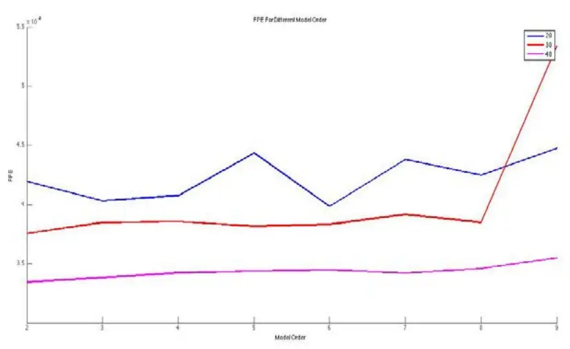
数据来源：广发证券发展研究中心

表2：不同模型阶数和不同回测数据量下的误差/FPE（单位10^-8）

| 模型阶数 20 30 |  |  | 40 |
| --- | --- | --- | --- |
| 2 | 4.20 | 3.76 | 3.35 |
| 3 | 4.03 | 3.85 | 3.38 |
| 4 | 4.08 | 3.86 | 3.42 |
| 5 | 4.44 | 3.82 | 3.44 |
| 6 | 3.98 | 3.83 | 3.45 |
| 7 | 4.38 | 3.92 | 3.42 |
| 8 | 4.25 | 3.85 | 3.46 |

数据来源：广发证券发展研究中心

由以上图形和图表我们可以发现，用于确定模型参数的数据量越大，模型所产生的误差越小，但是因为模型是在交易的同时实时对模型参数进行估计，为了保证模型的准确性，我们将回测数据限制在40个，现在我们可以确定模型的回测数据使用40个，同时模型的阶数确定为2阶。

## （二）模型参数的确定和频谱估计

接下来，对于每一个时间点，我们需要确定时间的参数，从而确定该时间点的谱密度，从而确定该点所处于周期的长短。我们首先通过Burg算法对模型的参数进行估计，之后按照最大熵原理对其谱密度进行估计。我们取第4683个交易时点为例，该点在走势图中的位置如图2，图3是该点位置的谱密度图，对于任意时点，我们都可以求得与上图一样的谱密度图，其中横轴为频率，纵轴为强度。

图2：谱密度所对应的时点
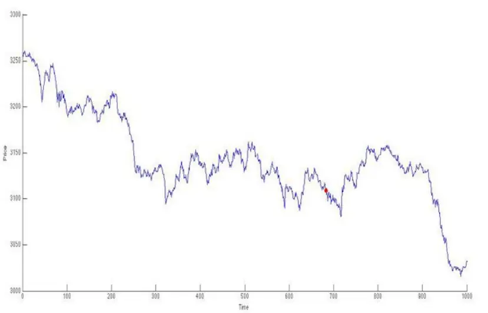
数据来源：广发证券发展研究中心

图3：谱密度图示例
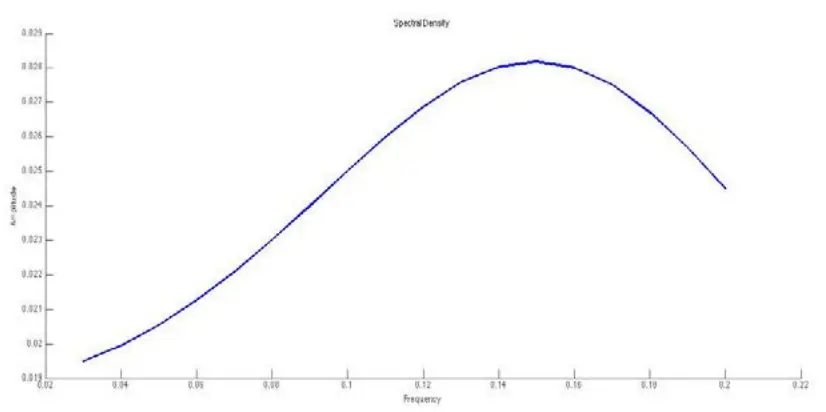
数据来源：广发证券发展研究中心

## （三）指标建立

我们将所有时点的频谱图连在一起，之后用heat map将其描绘出，可以得到一个三维的指标。其中指标的y轴表示周期大小，x轴为时间轴，而颜色的深度大小代表谱密度在该点所对谱密度的强弱，颜色越深表示谱密度越小，颜色越浅表示谱密度越大。

在趋势明显的情况下，该指标上部较浅，表示长周期的谱密度较大，而在震荡的时候，该指标下部较浅，表示短周期的谱密度较大。

图4：三维最大熵谱密度指标
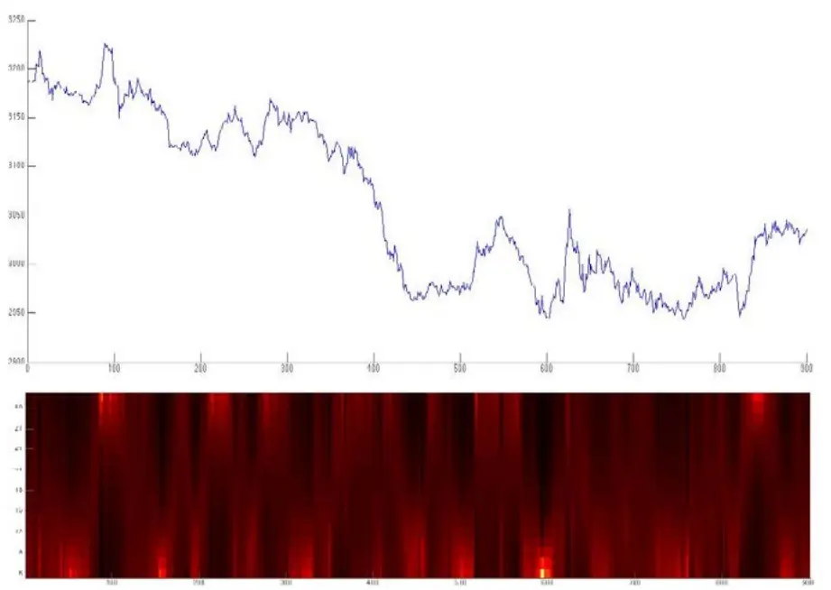
数据来源：广发证券发展研究中心

为了方便进行量化交易和设置买卖信号，我们将该三维指标简化为2维指标。我们假设谱密度中对应的强度最大的频率即为该时点的所处频率，根据周期=1/频率，我们可以得到该点所处的周期大小。如图2中的时点所对应的周期就为6.7。

在交易时，对于每个过去的时点，我们都将其所对应的周期求出，从而得出周期的一个时间序列，我们以此序列的MA10为指标进行买卖操作。当该指标，即现在时点的周期大于某个阀值时，我们认为现在处于趋势状态，按照趋势交易规则发出买卖信号。而如果指标小于阀值，则认为现在处于震荡市，不进行操作。下图为该指标的示例：

图5：简化的二维最大熵谱密度指标
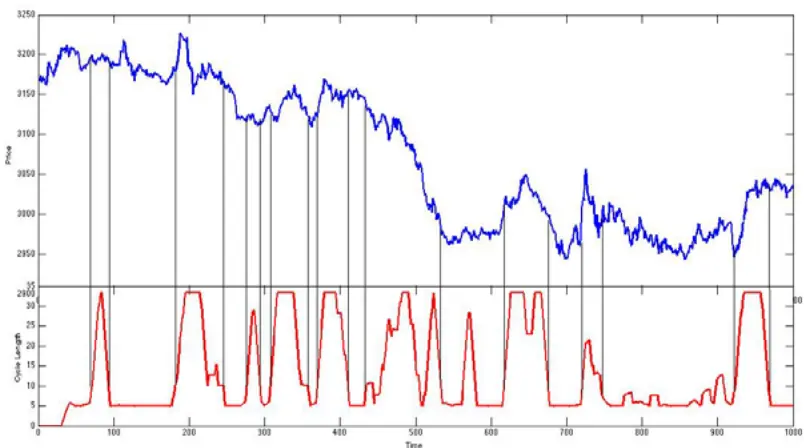
数据来源：广发证券发展研究中心
识别风险，发现价值

## （四）股指连续对比结果

我们根据该指标建立买卖信号，当市场属于趋势阶段时，上穿MA10时发出买入信号，下穿MA10时发出卖出信号，发出信号时若手中已有仓位，则进行反向开仓。如果当市场变为震荡市时，立即平仓，同时在震荡市中不采取其他操作。

我们用2011，2012和2013年的股指连续对策略进行测试：

表3：最大熵模型交易结果

| 评价指标 全样本 2011 2012 2013 |  |  |  |  |
| --- | --- | --- | --- | --- |
| 累计收益点数 | 1134 | 695 | 173 | 266 |
| 交易次数 | 3208 | 990 | 1125 | 1092 |
| 获胜次数 | 809 | 268 | 266 | 274 |
| 失败次数 | 2399 | 722 | 859 | 818 |
| 胜率 | 25.2% | 27.1% | 23.6% | 25.1% |
| 单次均收益率 | 0.354 | 0.702 | 0.771 | 1.04 |
| 单次获胜均收益率 | 15.7 | 17.1 | 14.1 | 16.0 |
| 单次失败均收益率 | -4.8 | -5.4 | -4.2 | -5.1 |
| 赔率 | 3.2 | 3.1 | 3.4 | 3.2 |
| 最大回撤 | -236 | -39 | -194 | -236 |
| 最大连胜次数 | 5 | 5 | 5 | 5 |
| 最大连败次数 | 19 | 13 | 16 | 19 |
| 平均多头收益 | 0.21 | 0.25 | 0.38 | -0.01 |
| 平均空头收益 | 0.48 | 1.12 | -0.07 | 0.45 |

数据来源：广发证券发展研究中心

我们通过最大熵模型将数据区别为趋势或者震荡市，很好的将震荡市的情形识别出来并且过滤掉，只在趋势市的时候采取趋势策略，从而使收益增加同时大大降低风险。以下是不使用最大熵模型，直接使用趋势突破策略的交易测试结果,

表4：普通均线交易结果

| 评价指标 全样本 2011 2012 2013 |  |  |  |  |
| --- | --- | --- | --- | --- |
| 累计收益点数 | 63 | 626 | -37 | -532 |
| 交易次数 | 3720 | 1109 | 1261 | 1350 |
| 获胜次数 | 756 | 258 | 247 | 251 |
| 失败次数 | 2964 | 851 | 1014 | 1099 |
| 胜率 | 20.3% | 23.3% | 19.6% | 18.6% |
| 单次均收益率 | -0.017 | 0.565 | -0.03 | -0.39 |
| 单次获胜均收益率 | 18.4 | 20.4 | 16.1 | -18.6 |
| 单次失败均收益率 | -4.7 | -5.5 | -3.9 | -4.8 |
| 赔率 | 4.7 | 3.7 | 4.1 | 3.9 |
| 最大回撤 | -415 | -126 | -241 | -415 |

识别风险，发现价值

| 最大连胜次数 | 4 | 4 | 4 | 4 |
| --- | --- | --- | --- | --- |
| 最大连败次数 | 23 | 20 | 22 | 23 |
| 平均多头收益 | -0.23 | -0.21 | 0.02 | -0.49 |
| 平均空头收益 | 0.25 | 1.34 | -0.08 | -0.33 |

数据来源：广发证券发展研究中心

图6：最大熵模型与普通均线模型收益对比
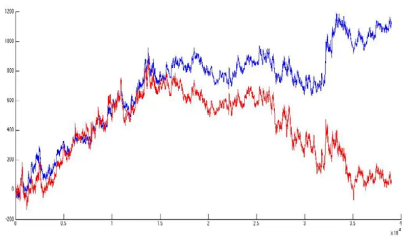
数据来源：广发证券发展研究中心

由以上两个表格我们可以看出，对于普通的均线突破策略，收益率为-1000多，除了在2011年有微弱盈利之外，其在2012年和2013年都是负收益，亏损甚至达到年600多个指数点位，且受到震荡行情的影响，其交易次数非常之多，跟最大熵模型相比，普通均线突破策略的胜率非常低，很多交易都属于失败交易，我们可以认为这是在震荡市中的频繁交易所导致的。而最大熵模型能够非常好的过滤掉震荡行情，只在趋势明显的时候进行交易，从而降低失败交易次数，提升胜率和收益。

由累计收益图中我们也可以发现，在2011年的时候，由于股市受挫单边下跌，整个市场以向下的趋势为主，所以整体上普通均线和最大熵模型的结果基本一致，在2012年中，主要是以震荡区间为主，所以普通均线在2012年的表现非常糟糕，一路下挫。在2013年的时候，由于股市在年中的时候由于资金面紧张，有一波非常明显的下挫，于是普通均线和最大熵模型都有一波较大的涨幅。而由于之后的行情以震荡形式为主，所以普通均线在之后的行情中一直回撤，而最大熵模型由于可以有效的过滤掉噪音，所以不仅没有回撤，反而还有小幅的上涨。

我们下面从行情中随机抽取1000个数据点来观察最大熵模型对于噪声过滤的效果：

图7：最大熵模型过滤噪声效果示例

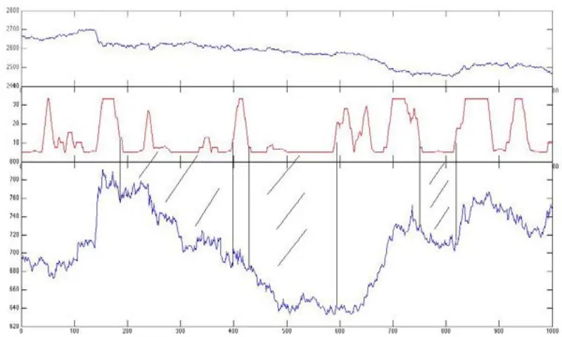
数据来源：广发证券发展研究中心

上图中，最上面的是沪深300股指期货的价格走势，中间的是最大熵频谱的指标，而最下面的是普通均线交易策略所对应的累积收益点数。从图中可以看出，普通均线交易策略的累积收益点数上涨的区间基本没有被过滤掉，但是图中标示的三段普通均线交易下跌的趋势却基本完全被最大熵模型所过滤掉了，从而极大的提升了策略的收益。

图8：月度最大熵模型与普通均线的收益对比
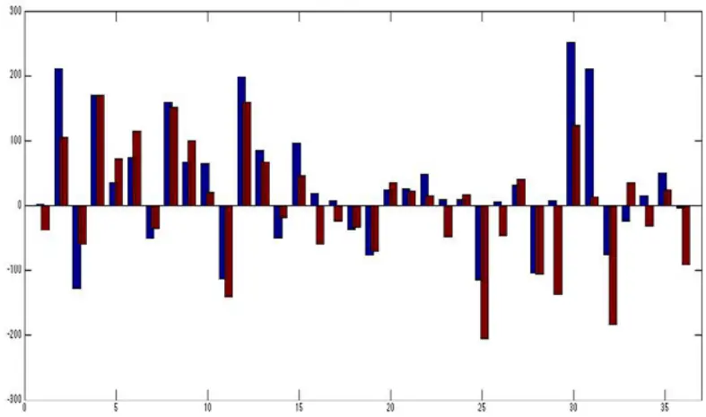

上图为最大熵模型和普通均线模型每个月份的交易结果，可以看见，在普通均线可以盈利的情况下，最大熵模型与普通均线的收益情况并没有相差太多，而在普通均线出现亏损甚至大幅亏损的时候，最大熵模型因为过滤掉了很多噪声，其表现情况要远好于普通的均线模型。

比如说在13年1月份，5月份和8月份的时候，普通均线都出现了非常大的亏损程度，但是同时间的最大熵模型的亏损在1月份的时候不到均线的一般，8月份的时候不到均线的四分之一，而在5月份的时候还有微弱的盈利。

## 五、沪深 300股指期货实证交易效果

## （一）自适应均线

我们根据该指标建立买卖信号，当市场属于趋势阶段时，我们利用自适应均线对股指期货进行交易。如果当市场变为震荡市时，立即平仓，同时在震荡市中不采取其他操作。

自适应均线是普通均线的一种改进版本，当市场处于趋势阶段时，自适应均线会更加贴近于实际数据，从而比普通均线的延迟更加少，更具有实时性。而当市场处于震荡阶段时，自适应均线则会更加贴近上一个自适应均线的值，而不随股价波动而波动，从而保持一个比较平直的状态，下图是自适应均线和普通均线的对比示意图：

图9：自适应均线与普通均线的对比
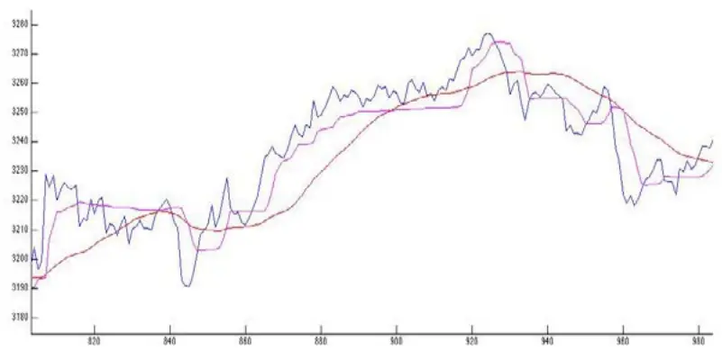
数据来源：广发证券发展研究中心

上图为50日均线和自适应均线的对比，其中紫色的为自适应均线，红色的为普通均线。可以由上图看出，自适应均线在趋势阶段的时候可以几乎没有延迟的和实际数据同步上升或下降，而在震荡阶段的时候，自适应均线几乎为一条直线。相比之下，普通均线在趋势突破的时候延迟更加明显，同时在震荡的时候也没有明显特征，可以看出自适应均线相对于普通均线来说有着非常大的优势。

假设y是自适应均线，x为数据点，那么：

$$
\begin{array}{c}{{y_{t}=ax_{t}+(1-a)y_{t-1}}}\\{{a\leq1}}\end{array}
$$

其中a是一个变量，可以表示为：

$$
\begin{array}{c}{{a=\left(c+dE\right)^{\delta}}}\\{{c+d=1}}\end{array}
$$

其中c，d， 是可调的参数，E为市场的效率：

$$
E=\frac{|{\mathbf{\nabla}}|p(n)-p(1)|}{\sum_{i=2}^{n}|p(i)-p(i-1)|}
$$

所以现在一共有4个可调参数，分别是c，d， 和n。由上式可以看到，当n越大时，用来衡量市场效率的数据越多，从而结果更加精准，但是延迟性会较大，当n越小时，结果不那么精准，但是延迟性会较小。同时从E可以看出，当E越接近1时，证明市场趋势越明显，而E越小时，市场的震荡更加剧烈。由y的表达式可以看出，当E越大时，a就越大，从而y的取值与x更加接近，所以在趋势的时候，均线值更加接近实际数据，所造成的延迟更小。当E较小时，a就更小，而y的取值就会与t-1时的取值接近，从而均线就会比较平滑不怎么变化。

当c越大时，即便E较小时，a也会较大，所以均线不论震荡还是趋势都会比较接近实际数据。当 $\delta$ 小于1时，a为E的凹函数，当E由1逐渐减小时，a变小的速度较慢。当 $\delta$ 等于1时，a为E的线性函数，当E由1逐渐减小时，a线性变小。而当 $\delta$ 大于1时，a为E的凸函数，当E减小时，a会更加迅速的变小。

在实际应用中，我们希望趋势情形和震荡情形下的均线差别越大越好，所以我们将c设为0.1，将d设为0.9。同时我们将 $\delta$ 设为3，使趋势情形更加突出。当参数设定后，我们可以看到a和E的关系如下：

图10：a和E的函数关系
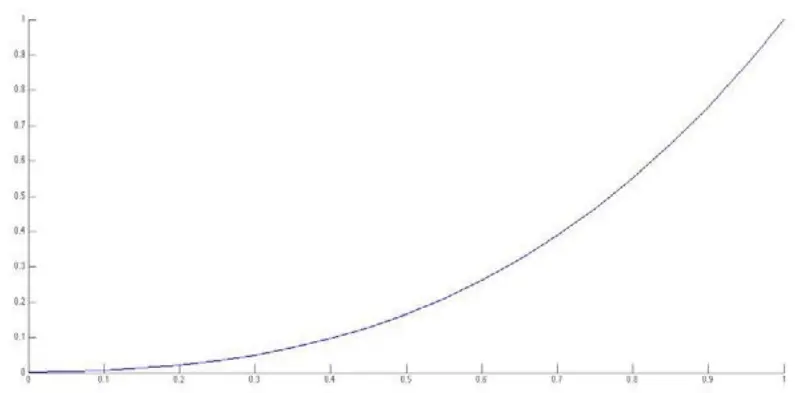
数据来源：广发证券发展研究中心

由上图可知，当E接近1时，a更加接近1，当E逐渐减小到0时，a会更快的减小到0，从而把趋势和震荡更好的分开。

## （二）交易策略及结果

我们首先根据最大熵模型判断市场是出于震荡市还是趋势市。当我们得出市场出于震荡阶段时，不采取任何交易策略。当我们得出市场处于趋势阶段时，使用上述自适应均线，当自适应均线在4个K线内的累积涨跌幅达到5个点的时候进行开仓，当4个K线内的累积涨跌幅为0或者为头寸的反向时，进行平仓操作。以下是交易的结果：

表5：未考虑交易成本最大熵模型交易结果

| 评价指标 全样本 2011 |  |  | 2012 | 2013 |
| --- | --- | --- | --- | --- |
| 累计收益点数 | 1978 | 841 | 302 | 836 |
| 交易次数 | 1108 | 398 | 345 | 365 |
| 获胜次数 | 484 | 176 | 145 | 163 |
| 失败次数 | 624 | 222 | 200 | 202 |
| 胜率 | 43.7% | 44.2% | 42.0% | 44.6% |
| 单次均收益率 | 1.79 | 2.11 | 3.31 | 5.42 |
| 单次获胜均收益率 | 17.4 | 18.7 | 14.4 | 18.7 |
| 单次失败均收益率 | -10.2 | -10.8 | -8.7 | -10.9 |
| 赔率 | 1.71 | 1.72 | 1.65 | 1.72 |
| 最大回撤 | -199.8 | -199.8 | -154.3 | -160.2 |
| 最大连胜次数 | 5 | 5 | 5 | 5 |
| 最大连败次数 | 11 | 10 | 11 | 10 |
| 平均多头收益 | 1.49 | 0.75 | 1.68 | 2.08 |
| 平均空头收益 | 2.25 | 3.57 | 0.29 | 2.65 |
| 平均多头持仓时间(min) | 67 | 67 | 68 | 66 |
| 平均空头持仓时间(min) | 72 | 71 | 74 | 71 |

数据来源：广发证券发展研究中心

图11：不考虑交易成本时最大熵模型收益情况
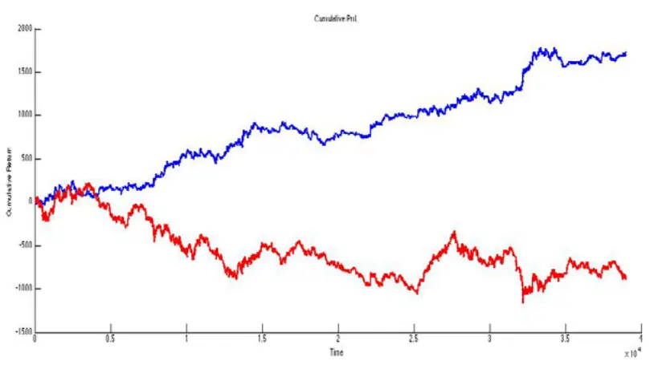
数据来源：广发证券发展研究中心

以上的情况我们只考虑了有单边万分之零点五的手续费的情况，而没有考虑到交易滑点的问题，滑点是在交易中所很难避免的，为了使模型可以更好的用在实际交易中，我们假设交易时单边有0.2个滑点，来进行交易。

表6：考虑交易成本最大熵模型交易结果

| 评价指标 全样本 |  | 2011 | 2012 | 2013 |
| --- | --- | --- | --- | --- |
| 累计收益点数 | 1535 | 683 | 162 | 689 |
| 交易次数 | 1108 | 398 | 345 | 365 |

识别风险，发现价值

| 获胜次数 | 472 | 172 | 142 | 158 |
| --- | --- | --- | --- | --- |
| 失败次数 | 636 | 226 | 203 | 207 |
| 胜率 | 42.6% | 43.2% | 41.2% | 43.3% |
| 单次均收益率 | 1.39 | 1.72 | 2.45 | 4.21 |
| 单次获胜均收益率 | 17.6 | 18.9 | 14.5 | 19.1 |
| 单次失败均收益率 | -10.2 | -10.8 | -8.8 | -10.8 |
| 赔率 | 1.73 | 1.75 | 1.64 | 1.77 |
| 最大回撤 | -213 | -213 | -168.9 | -173.4 |
| 最大连胜次数 | 5 | 4 | 5 | 5 |
| 最大连败次数 | 11 | 10 | 11 | 10 |
| 平均多头收益 | 1.29 | 0.56 | 1.47 | 1.87 |
| 平均空头收益 | 2.05 | 3.38 | 0.09 | 2.45 |
| 平均多头持仓时间(min) | 67 | 67 | 68 | 66 |
| 平均空头持仓时间(min) | 72 | 71 | 74 | 71 |

数据来源：广发证券发展研究中心

图12：考虑交易成本下最大熵模型收益点数
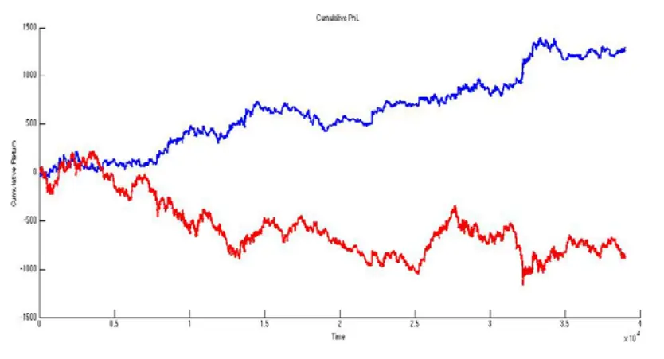
数据来源：广发证券发展研究中心

## （三）交易结果总结

以下是分月和累积交易结果的对比：

图13：不考虑交易成本与考虑交易成本时最大熵模型累计收益点数对比

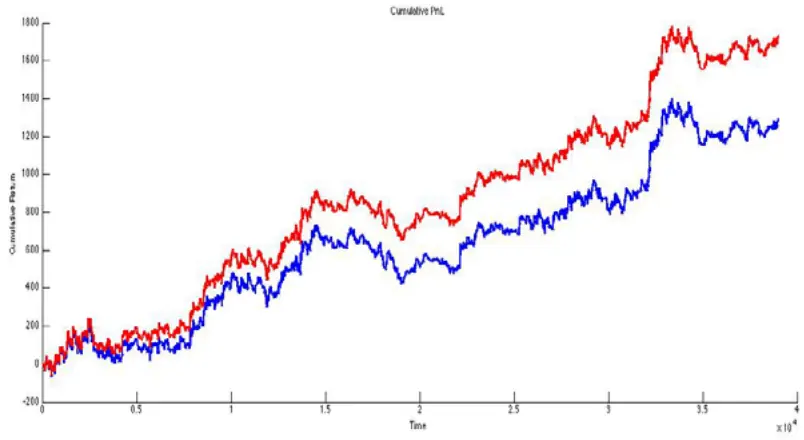
数据来源：广发证券发展研究中心

图14：不考虑交易成本与考虑交易成本时模型月度累计收益点数对比
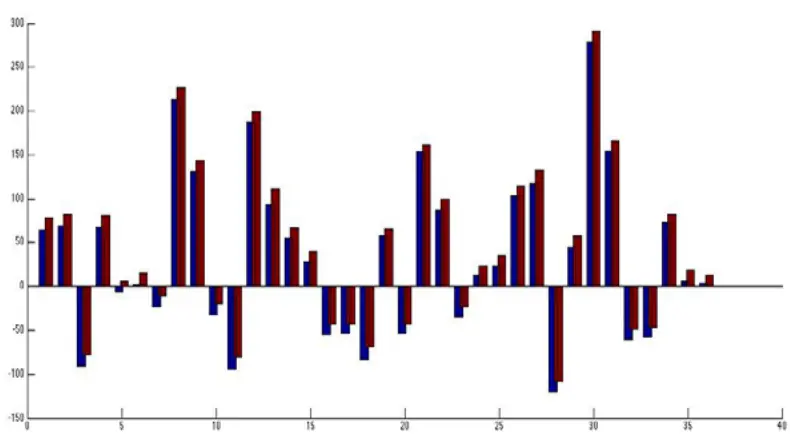
数据来源：广发证券发展研究中心

由以上两幅图可以看出，对于单边0.2个滑点，该策略还是有着很不错的表现，由于最大熵很好的过滤掉了震荡行情，有效的减少了模型的交易次数，而模型的波动也相对变小，收益率曲线比较平滑，所以滑点对模型并没有产生太大影响。

从按照月份的收益点数图来看，加了滑点之后并没有将模型中盈利的部分变为负收益，除了在2011年5月份的时候，加了滑点之后使最大熵模型由微弱盈利变成轻微亏损，剩余的时间里，最大熵模型在加了滑点之后的表现依然很不错。

## 六、总结

数学，物理，以及工程学科和金融定价和预测的交叉领域正在逐步扩大，金融的定价，预测，以及交易策略的制定越来越广泛的将数理的知识运用其中。

本模型通过对统计物理以及信息论中的最大熵原理进行运用，很好的对金融时间序列的频谱进行分析，从而从一定程度上有效的过滤掉噪声，并加上趋势交易中自适应均线的应用，构造出高收益的股指期货5分钟数据交易模型。

实证部分我们假设单边手续费万分之零点三，单边滑点0.2点，5分钟内亏损10个指数点强行平仓止损。为了防止强平，我们假设本金约为20万，即为2手合约的价格，每次开仓数量固定为1手，不进行利滚利操作。

从交易结果来看，在考虑手续费及滑点之后，2011年至2013年累计收益点数1535，约合累计收益率230.25%，胜率42.6%。其中2011年收益683点，最大回撤213点，约合收益率102.45%，回撤31.95%。其中2012年收益162点，最大回撤169点，约合收益率24.30%，回撤25.35%。2013年收益689点，回撤174点，约合收益率103.35%，回撤26.10%。

该模型为高风险高收益类模型，其优点在于利用最大熵原理过滤噪音，同时利用自适应均线对趋势阶段进行更好的交易。缺点在于回撤较大，且稳定性可以再提升。

该模型仍有很多可以强化和改进的地方，可以通过调节参数来使最大熵的频谱估计更加准确，可以通过对三维的最大熵指标进行分析来制定策略，三维指标信息量要远大于二维指标，可能使过滤效果更好，同时亦可改进趋势交易的自适应均线策略对模型进行改进。

## 风险提示

策略模型并非百分百有效，市场结构及交易行为的改变或者交易参与者的增多有可能使得策略失效。

## 广发证券—行业投资评级说明

买入： 预期未来12个月内，股价表现强于大盘10%以上。

持有： 预期未来12个月内，股价相对大盘的变动幅度介于-10%～+10%。

卖出： 预期未来12个月内，股价表现弱于大盘10%以上。

## 广发证券—公司投资评级说明

买入： 预期未来12个月内，股价表现强于大盘15%以上。

谨慎增持： 预期未来12个月内，股价表现强于大盘5%-15%。

持有： 预期未来12个月内，股价相对大盘的变动幅度介于-5%～+5%。

卖出： 预期未来12个月内，股价表现弱于大盘5%以上。

## 联系我们

|  | 广州市 | 深圳市 | 北京市 | 上海市 |
| --- | --- | --- | --- | --- |
| 地址 | 广州市天河北路183号 大都会广场5楼 | 深圳市福田区金田路4018 号安联大厦 15 楼 A 座 | 北京市西城区月坛北街2号 月坛大厦18层 | 上海市浦东新区富城路99号 震旦大厦18楼 |
| 邮政编码 | 510075 | 03-04 |  |  |
| 客服邮箱 | gfyf@gf.com.cn | 518026 | 100045 | 200120 |
| 服务热线 | 020-87555888-8612 |  |  |  |

## 免责声明

广发证券股份有限公司具备证券投资咨询业务资格。本报告只发送给广发证券重点客户，不对外公开发布。

本报告所载资料的来源及观点的出处皆被广发证券股份有限公司认为可靠，但广发证券不对其准确性或完整性做出任何保证。报告内容仅供参考，报告中的信息或所表达观点不构成所涉证券买卖的出价或询价。广发证券不对因使用本报告的内容而引致的损失承担任何责任，除非法律法规有明确规定。客户不应以本报告取代其独立判断或仅根据本报告做出决策。

广发证券可发出其它与本报告所载信息不一致及有不同结论的报告。本报告反映研究人员的不同观点、见解及分析方法，并不代表广发证券或其附属机构的立场。报告所载资料、意见及推测仅反映研究人员于发出本报告当日的判断，可随时更改且不予通告。

本报告旨在发送给广发证券的特定客户及其它专业人士。未经广发证券事先书面许可，任何机构或个人不得以任何形式翻版、复制、刊登、转载和引用，否则由此造成的一切不良后果及法律责任由私自翻版、复制、刊登、转载和引用者承担。