## 波段形态识别模型（WPRM）及期指交易策略应用

## 另类交易策略系列之十五

## 报告摘要：

## 经典技术形态理论回顾

诸位看官，若您是股票期货投资从业人员，我相信以下几个名词您一定听说过，头肩底、头肩顶、W底、M头、圆弧顶底、波浪理论等等，经典技术分析尽管历来备受价值投资流派非议，但依然世代传承，所谓存在即合理，我们暂且不辩其真伪，但是抱有这样一种态度是比较合适的，即基本面分析辅以技术形态分析更佳。

那么我们是否要在此隆重推荐技术分析呢？非也，传统技术形态分析最大的弊病是无法避免主观因素，看起来无敌用起来无力是大家的主观感受，那么本文的主要工作就是构建波段形态的量化智能识别方法，取其思想精华弃其人为干预糟粕，最后该模型设计交易策略、辅以止盈止损机制，从而获取绝对收益。

## 波段形态识别模型（WPRM）

模型分为两大部分，首先将历史价格走势进行波段划分，然后利用一个全新的形态相似性测度来进行识别匹配。

波段划分上，利用%b 指标进行价格走势的归一化处理，将%b 进行 ZIG切割，将切割后的波段进行裁剪处理，以去除噪音，然后将裁剪之后的分割点反射回原始数据，最后再对原始数据的 ZIG 波段进行裁剪，这样做的目的是减弱数据延迟性。

相似测度上，传统的欧氏距离及相关系数都不能很好的识别技术形态，存在严重的漏洞，我们这里首先分别对于历史价格的 Z 字波形进行高低点位的排序，排序相似的历史数据认为在技术形态上具有相似性，然后计算高低点位之间跨度的差别均值，越小越相似。

## 期指交易策略应用及实证结果

交易策略设计上，当下价格走势波段拐点确认之后，我们进行历史相似形态的匹配，判断下一个波段高低点位置，当高低位置满足一定条件时进行多空开仓操作，并设置0.5%的止损止盈幅度。

实证上，2011年4月至2013年四月1分钟数据作为样本匹配学习数据，2013年4月至2014年4月作为样本外，单边万分之零点五手续费和万分之二的冲击成本下，共发出101个交易信号，其中有48个买入信号，53个卖出信号。胜率为46.39% ，盈亏比为2.29.最大回撤为3.78% ，年收益率为21.29%。

图 1 WPRM模型期指交易累计收益
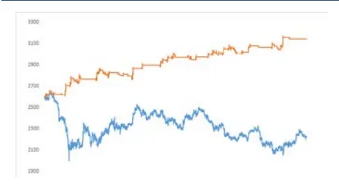

图 2 形态识别预测交易案例
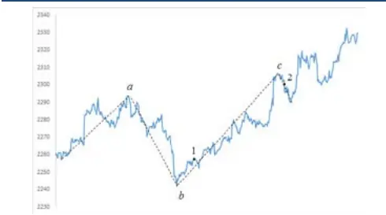

分析师： 安宁宁 S0260512020003

0755-23948352

ann@gf.com.cn

## 相关研究：

| 另类交易策略系列之十四：2014-03-31 经验模态分解下的日内趋 |
| --- |
| 势交易策略 另类交易策略系列之十三：2014-01-14 |
| 基于统计语言模型（SLM） |
| 的择时交易研究 另类交易策略系列之十二：2013-09-02 |
| 基于遗传规划多维变量的 |
| 股指期货交易策略 |
| 另类交易策略系列之十一：2013-06-17 日内突破模式及其资金管 |
| 理的多重比较研究 |
| 另类交易策略系列之十：基2013-02-26 |
| 于遗传算法的期指日内交 易系统 |

## 一、相似性匹配模型介绍

## （一）相似性匹配原理

股票技术分析理论在中国的股票分析中具有广阔的市场。技术分析的工作建立在三大假设之上：一是市场行为包容消化一切，二是价格以趋势的方式演变，三是历史会重演。

波段形态识别交易策略即建立在这样技术分析的假设之上。分析过去的图形，寻找最为相似的走势，总结出可能出现的趋势，我们就可以对未来的走势做出预测，从而顺应趋势，进行交易。

在技术分析中具有重要地位的艾略特波浪理论和道氏理论均将股票的历史价格数据转化Z字形波浪，然后将Z字形波浪的形态总结后预测未来的趋势。受此启发，我们也可以将股票价格转换成Z字形波之后，依据历史Z字形波浪的数据，对未来作出预测。

下面我们看一些技术形态的例子：

图1：头肩顶技术形态
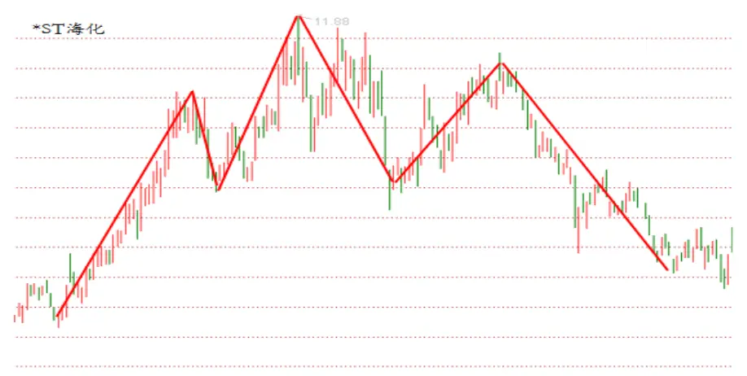
数据来源：广发证券发展研究中心

上图中，右肩高点低于头部高点，显示出在走势中，空头已占据较强优势，后续走势下行的可能性非常大。

图2：头肩底技术形态

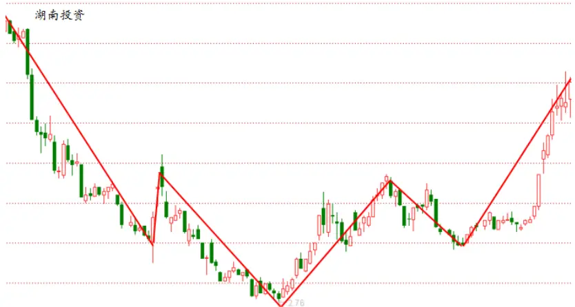
数据来源：广发证券发展研究中心

上图中，右肩的低点高于头部低点，标志着头肩底形态的形成，此时多头占据明显优势，后续走势将会大幅上涨的可能性较大。

图3：三重顶技术形态
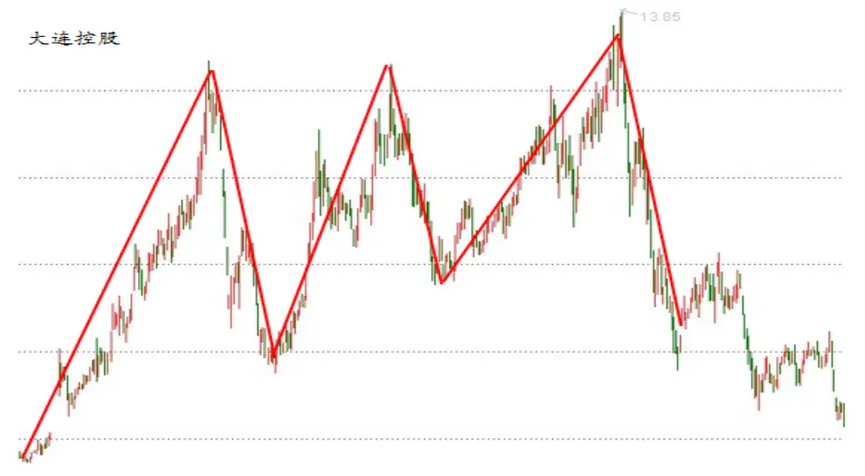
数据来源：广发证券发展研究中心

上图中，虽然波形低点逐渐上升，但是波形高点高度变化不大，表明多头的力量在渐渐减弱，后续行情下行的可能性较大。

图4：弧形底技术形态

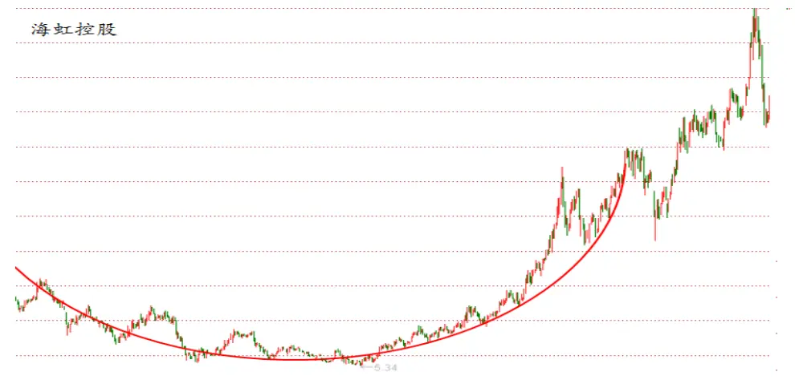
数据来源：广发证券发展研究中心

在上图中，波浪的高点和低点一波高于一波，显示多头的力量非常强大，后续持续拉升的可能性较大。

这些经典的技术图形对于预测后续行情具有重要的作用。但是传统的识别方法却难以根据技术分析的特征进行图像的匹配与识别。

## （二）传统识别方法的缺陷

经典的技术分析理论的特点之一是认为价格的空间变化重要性大于时间变化的重要性。在下面第一和第二幅图中，虽然两个趋势的时间长短不一致，但每个波浪的点位对应一致，因而在技术分析上，我们认为两图像高度相似。但是，对于第三幅图，虽然时间跨度和第一幅图一致，但是点位差别不一致，在技术分析上我们认为其与第一幅图的相似性不及第二幅图。

图5：行情走势示意
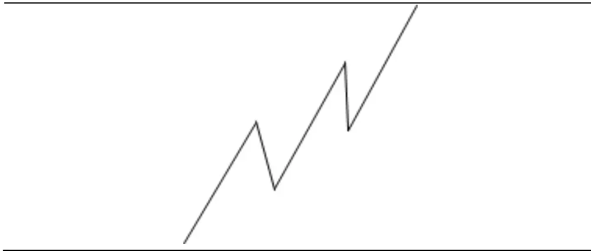
数据来源：广发证券发展研究中心

图6：行情走势示意

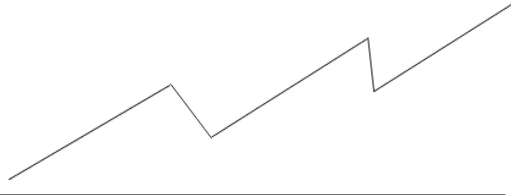
数据来源：广发证券发展研究中心

图7：行情走势示意

数据来源：广发证券发展研究中心

目前常用的相似性匹配策略大多取固定时间窗口，然后在历史数据中进行相似性匹配。匹配的度量主要是将图像正规标准化后，在 $L_{\phantom{}_{p}}$ 空间上计算欧氏距离，或者计算相关性系数。

但是，固定大小的窗口使得空间价格变化受制于时间窗口的限制，导致 $L_{\ L_{p}}$ 空间上的欧氏距离的识别效果往往不佳。

如下图中，两段上行行情的走势极为相似，但是由于走势的时间区间不同，若利用传统的欧氏距离度量，两图像相似性较小。

图8：行情走势示意
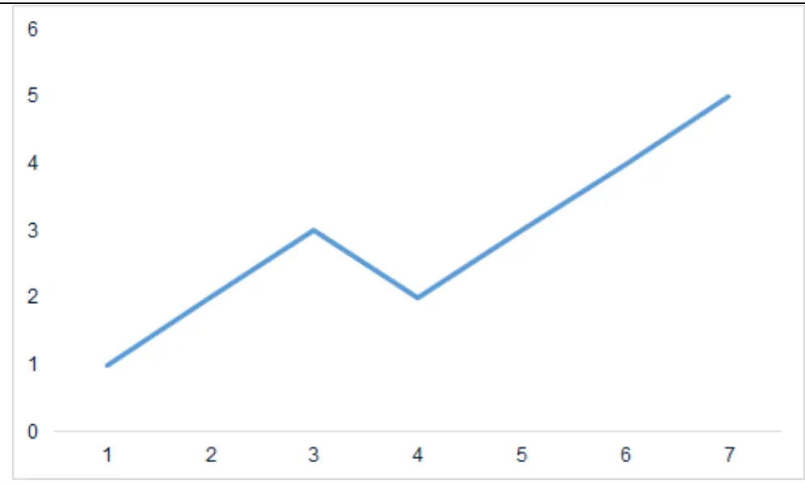
数据来源：广发证券发展研究中心

图9：行情走势示意

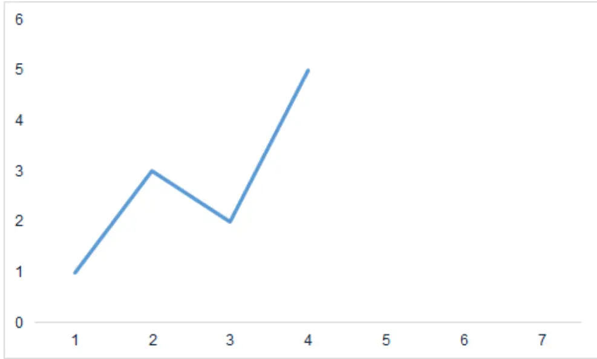
数据来源：广发证券发展研究中心

即使在两段走势时间相对应的情况下，高低点时间的对应不同也会造成欧氏距离识别的困难。如下图，虽然两段行情高点和低点的位置完全相同，但是由于其对应的时间不一致而被欧氏距离判断为不相似。

图10：行情走势示意
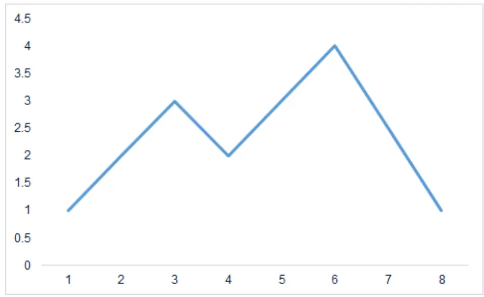
数据来源：广发证券发展研究中心

图11：行情走势示意

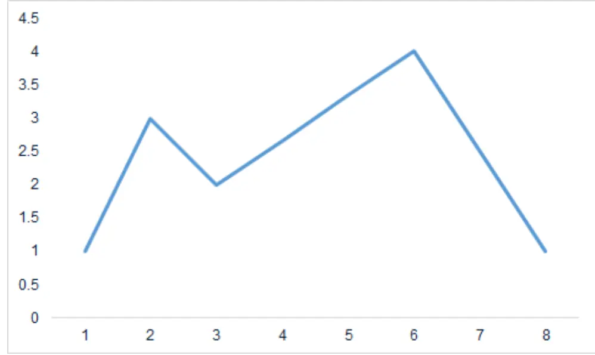
数据来源：广发证券发展研究中心

经典技术分析理论的另一个特征是认为价格Z字波浪各个高点和低点的相对位置能够反映多空双方力量的强弱。若后一个低点或高点分别高于前一个低点或高点，则说明多头占上风，若后一个低点或高点分别低于前一个低点或高点，则说明空头占上风。以下两图在技术分析上不具有相似性。

图12：行情走势示意
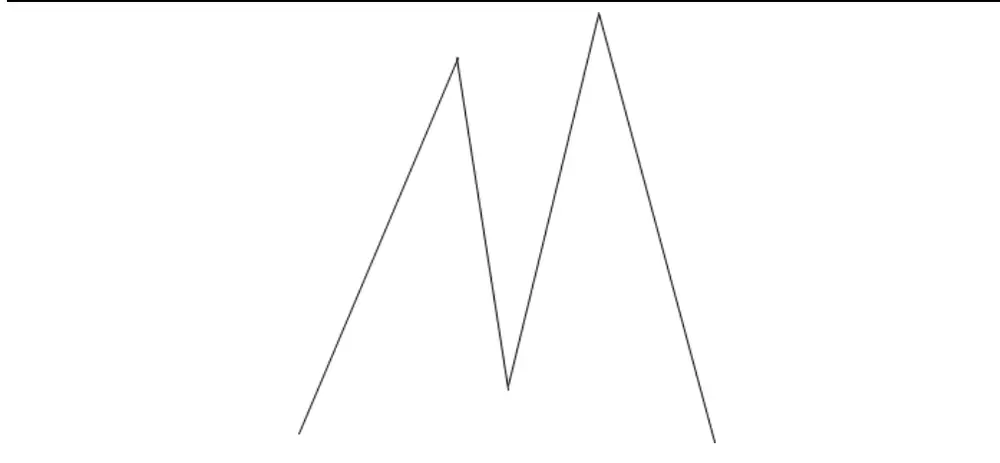
数据来源：广发证券发展研究中心

图13：行情走势示意

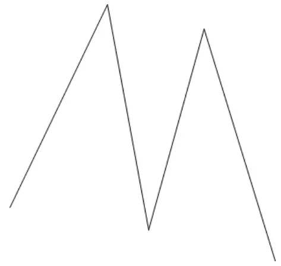
数据来源：广发证券发展研究中心

可是，单纯地利用欧氏距离难以对于高点和低点的相对位置进行有效的判断。如下图的第一幅图，高点和低点均高于前一阶段行情，第二幅图中第三个低点和第三个高点分别低于第二个低点和第二个高点。但是，由于两个图形的高点和低点的时间相吻合，通过欧氏距离判断，两图像仍具有相当高的相似性。

图14：行情走势示意
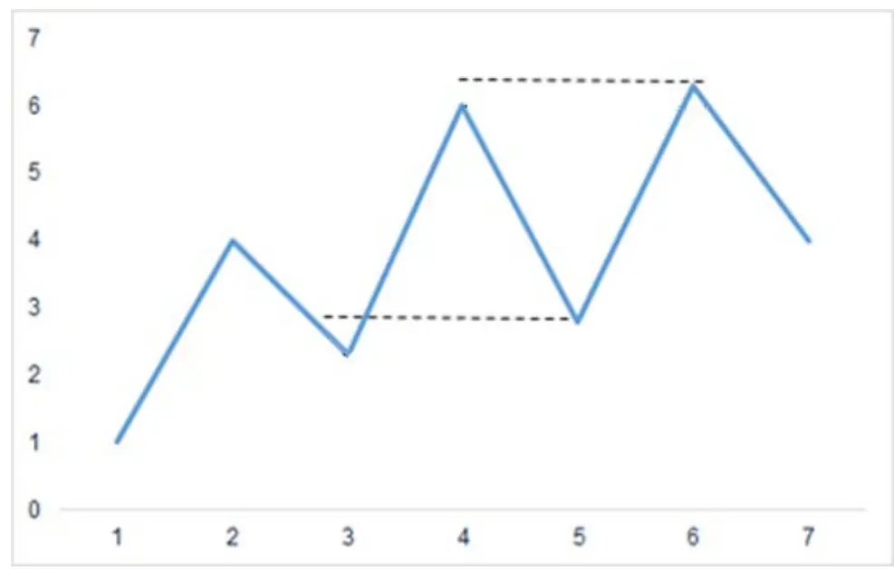
数据来源：广发证券发展研究中心

图15：行情走势示意

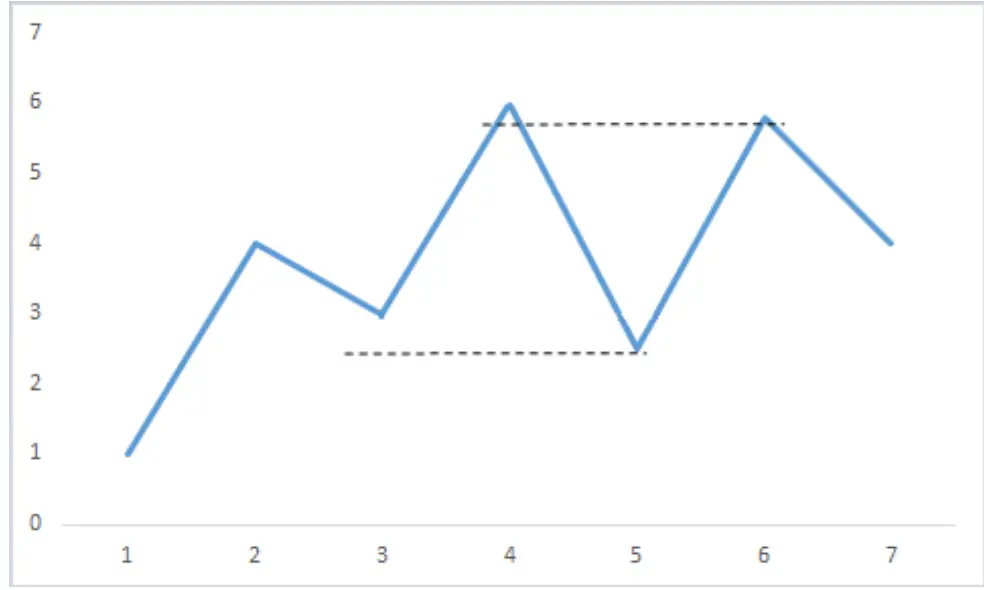
数据来源：广发证券发展研究中心

因此，本文第二节将引入一种全新的数据处理方法，并在第三节中基于第二节处理的数据进行相似性比较。

## 二、构造波段形态

## （一）%b 指标介绍

我们在将股票价格Z字形化的过程中，并不是对于原始数据，而是首先对%b指标进行分割。

%b指标源自布林通道。布林通道是技术分析中常用的工具，该技术分析工具由三种不同的指标构成。中间线为p期的移动均值，上轨线又称为压力线，为中间线加两倍的标准差，下轨线又称为支撑线，为中间线减去两倍的标准差。通常认为股票价格一般在上下轨线之间摆动，通过观察股票价格位于布林通道中的位置，我们可以做出关于股价的相应的预测。

$$
\Rightarrow1012-x=0.259+3.257+2.37151
$$

$$
\bot AB=BA+B=AB+BC=\frac{1}{2}AB+BC+\frac{1}{2}AB+2\angle B+\frac{1}{2}BD+\frac{1}{2}BC
$$

$$
T:t\dot{4}t\dot{2}\dot{3}=0+5H+3-2+3H+3-2+0+4H+\sqrt{5}-1\dot{2}=
$$

图16：股指期货收盘价
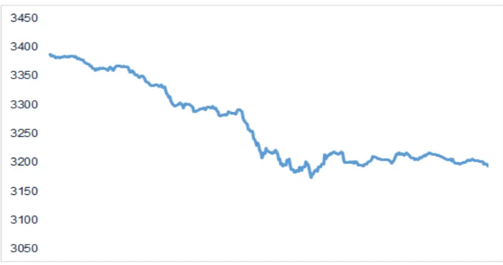
数据来源：广发证券发展研究中心

图17：股指期货均线及布林通道线
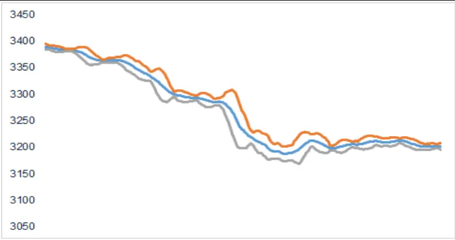
数据来源：广发证券发展研究中心

%b指标描述的正是股票价格位于布林通道的相对位置。

$$
\%b=\frac{117\div1}{5\div11\div2\times\cdots1}\div125
$$

图18：股指期货%b指标
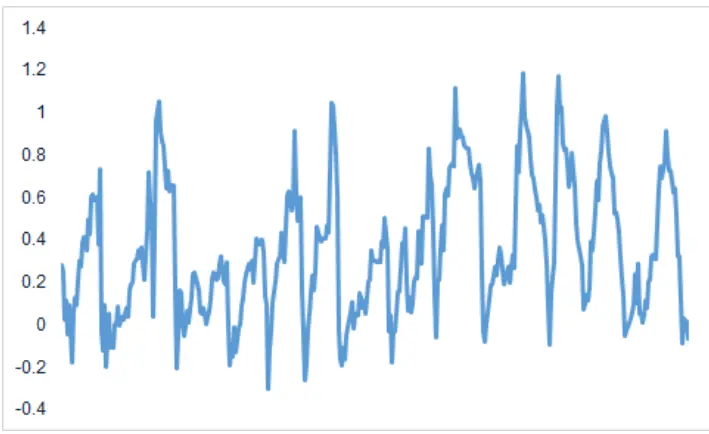
数据来源：广发证券发展研究中心

相比于股票价格，%b指标具有以下优点：

第一，%b指标的趋势与价格的变化相同，价格下降时，%b同步下降，没有延迟性。

第二，相比于价格变化，%b指标的值较为标准化，正常情况下位于-1至2之间，这样我们可以指定广为适用的标准化数据加工程序。股票的价格则波动性较大，同样的波动数额，一段时期内可看做是显著的波动，一段时期内则可能只能算作噪声。

第三，%b指标对于股票波动具有放大的作用，能够适时而敏感地检测股票的波动，缩短点位确认的滞后时间。

图19：%b指标优点
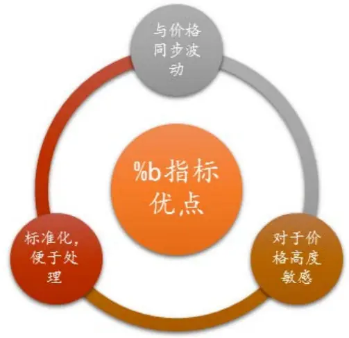
数据来源：广发证券发展研究中心

## （二）指标线的分割

不同于常用的等时间窗口划分法，我们采用不等时的窗口对数据进行分割，这样一方面保证了划分后的数据为Z字形，以便于以后的裁剪，另一方面在减小噪音的基础上保证了对于点位事变的敏感性。具体的分割方法如图：

假设当前点位为点3，我们以点3为起始点，若后续点位为上涨，则向后移动，增加窗口大小，点7和点8高度相同，我们以后一点位为高点。点9点10则均低于先前点位，但当前点为点10时，该点到最高点的距离超过了我们事先设定的阈值 $\delta_{\ i}$ ，故我们以点10为该窗口的结束点。

同理，点8将成为下一个分割的起始点，然后我们开始下一次划分。由此我们得到Z字形分割。此处，点8至点10为确认一个可能的高点或低点所需的时间。

图20：股指期货%b指标的分割示意
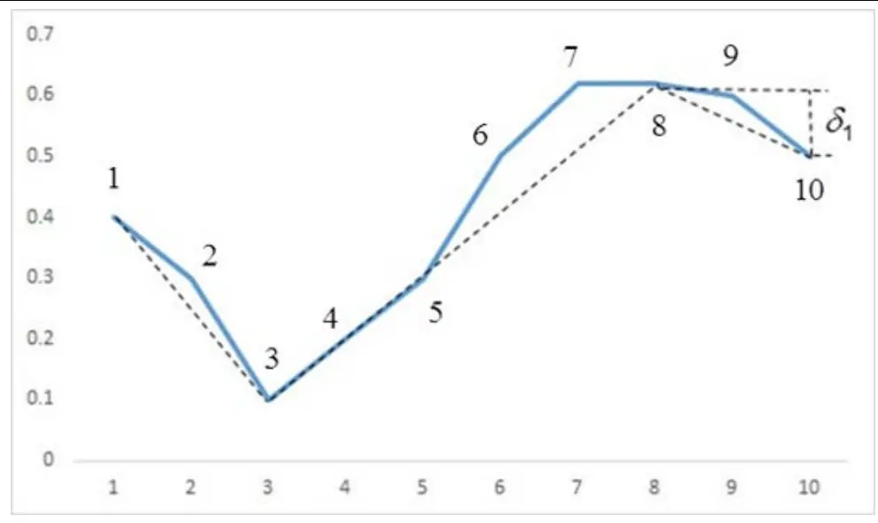
数据来源：广发证券发展研究中心

同理，点8将成为下一个分割的起始点，然后我们开始下一次划分。由此我们得到Z字形分割。

图21：股指期货%b指标的分割示意
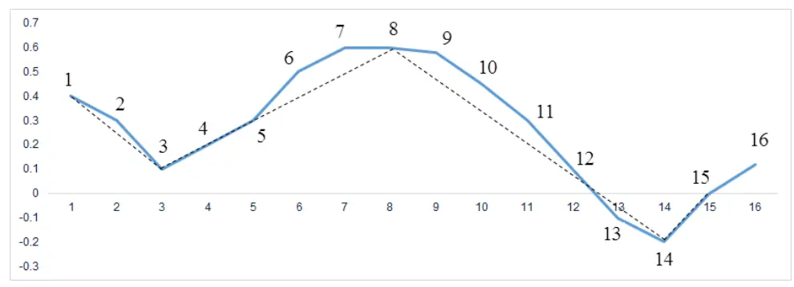
数据来源：广发证券发展研究中心

在数学上，我们给出以下定义：

给定当前点 $P_{j}(\mathbf{X}_{j},\mathbf{t}_{j})$ ，则该窗口的高点 $P_{i}(\mathbf{X}_{i},\mathbf{t}_{i})$ 满足如下条件：

$\mathrm{X}_{i}$ 是当前窗口的最大值。

2. $\mathrm{X}_{i}>X_{j}+\delta_{1}$

3. $P_{i}(\mathbf{X}_{i},\mathbf{t}_{i})$ 是满足以上两个条件的最后一个点。

下图a为分割之前的一段%b指数，图b为分割之后的%b指数。我们将阈值 $\delta_{\ i}$ 设得较小，以在减小噪音的情况下尽量缩短确认一个可能的高低点位所需的时间。分割之后大体形状和趋势未发生显著改变，但已完全转化为Z字形。

图22：股指期货%b指标分割前
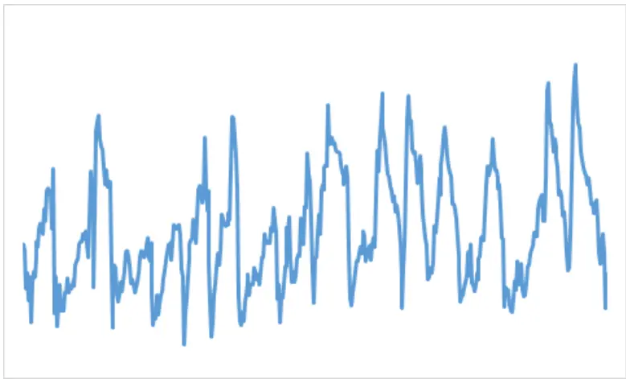
数据来源：广发证券发展研究中心

图23：股指期货%b指标分割后
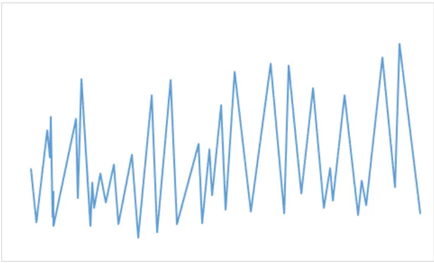
数据来源：广发证券发展研究中心

## （三）指标线的裁剪

虽然在第二步中，我们的%b指标在分割后已经完全转化成了Z字形的形式，但是我们观察图像，仍然发现图像具有较多的噪音。所以我们需要对图像进行裁剪。裁剪的具体步骤如图：

点1至点5为已经分割后转化成Z字形的%b线，我们考虑相邻两点之间的相对位置。若相邻两点，如点2和点3的高度小于我们事先设定的阈值 $\delta_{2}$ ，同时点4高度高于点2，则我们将点2和点3删去，直接将点1和点4相连。

图24：股指期货%b指标分割后再裁剪示意
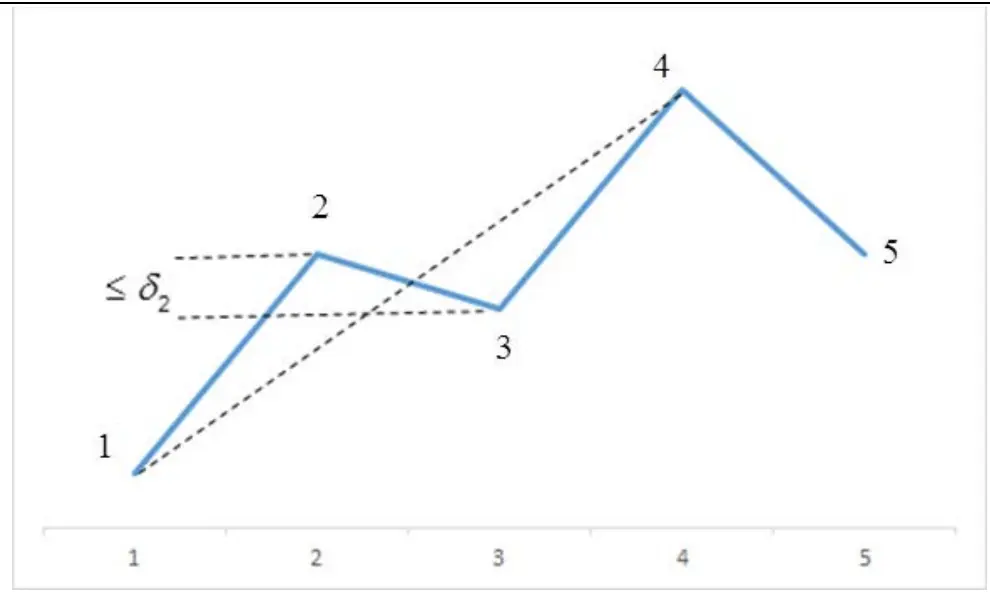
数据来源：广发证券发展研究中心

当点2高度高于点4时，我们将点3和点4删去，直接将点2同点5相连。这样反复裁剪后，我们的%b指标将仍保持Z字形波浪状，且每个高点和低点之间的距离均大于阈值 $\delta_{2}$ .

图25：股指期货%b指标分割后再裁剪示意

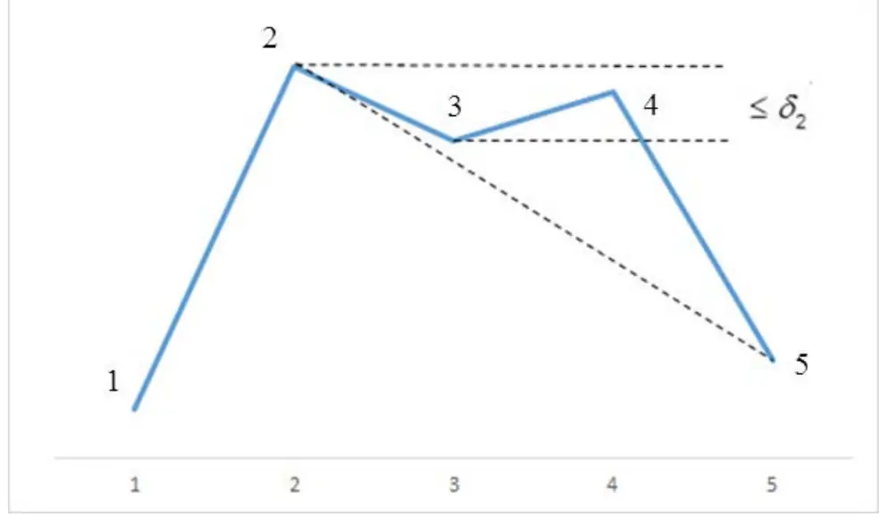
数据来源：广发证券发展研究中心

事实上，任何的剪裁只会影响之前的至多3根趋势线。在上图中，无论点4的点位是多少，都不会影响到点1之前的分割线。若是点3和点2之间的点位距离大于 $\delta_{2}$ 我们则可以马上确认点2为高点，点4的点位将只影响到点2和点3之间的线。

下图a为经过分割但在裁剪之前的%b图像，图b为裁剪之后的%b图像。

图26：股指期货%b指标裁剪后形态
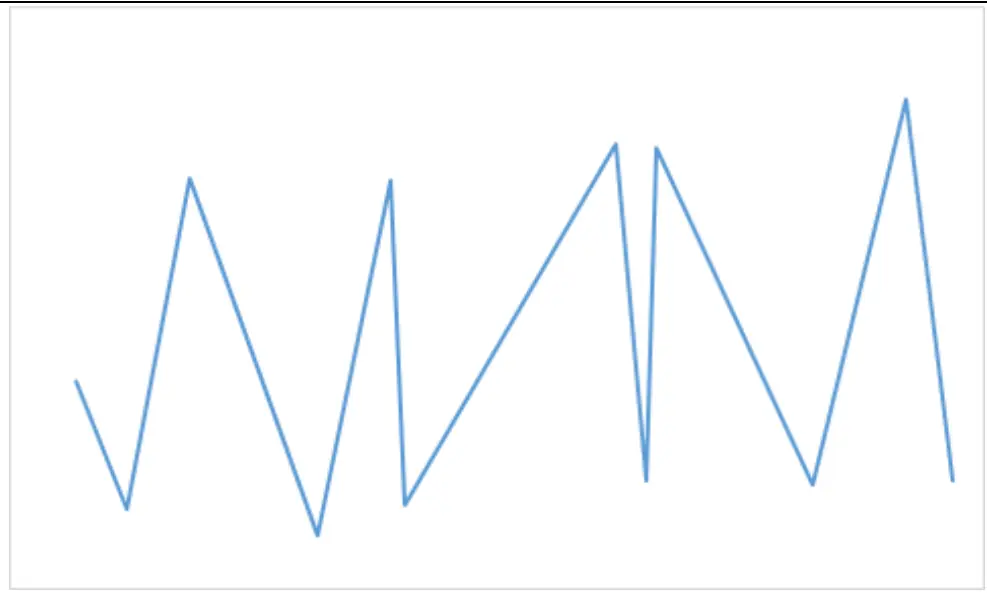
数据来源：广发证券发展研究中心

## （四）原始数据的裁剪

虽然%b指标具有与股票价格趋势无延迟同步摆动，数据标准化，对于股票波动高度敏感等特点，但是其分割之后的时间点反射回股票价格图像并非完美，极少数点可能不是Z字形，部分区间仍存在少量噪声。我们需要对于股票图像再次进行裁剪。

下图a和图b分别为由%b映射回原始数据的图像和剪裁后的股票价格趋势图。

图27：映射回原始数据裁剪之前
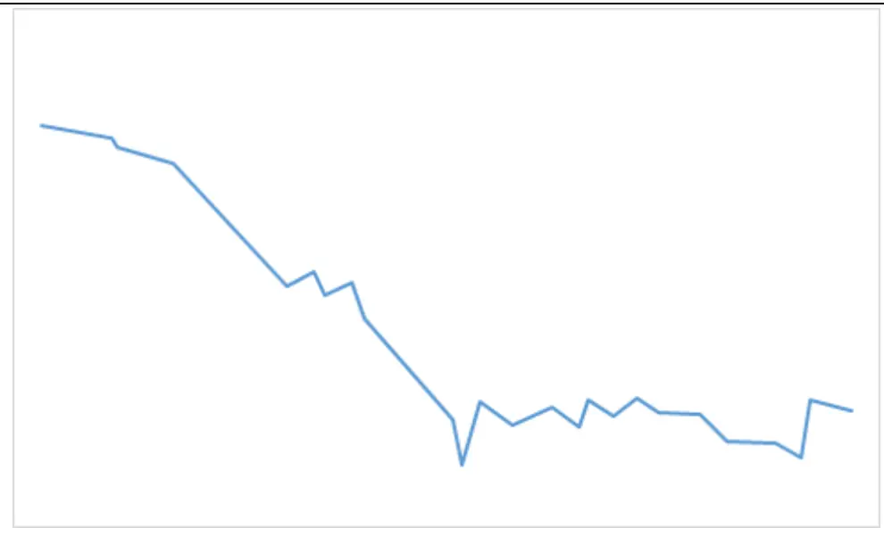
数据来源：广发证券发展研究中心

图28：原始数据裁剪之后
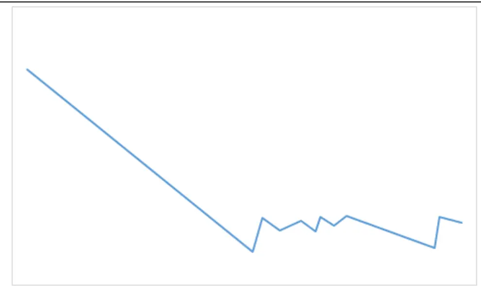
数据来源：广发证券发展研究中心

图为一段股指期货交易价格的最初原始图像和最后处理后的图像对比。

图29：股指期货原始收盘价数据

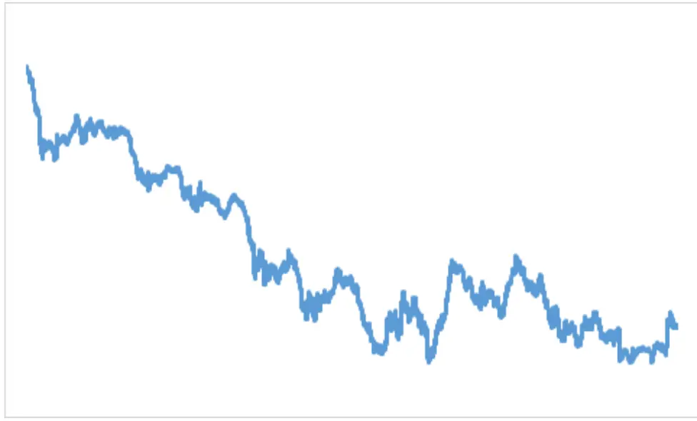
数据来源：广发证券发展研究中心

图30：股指期货收盘价经分割裁剪之后
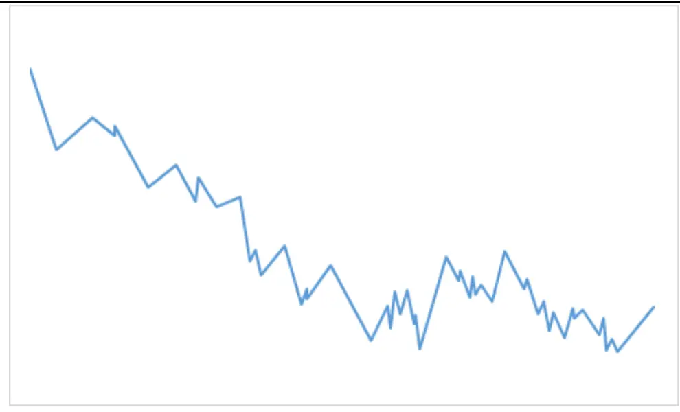
数据来源：广发证券发展研究中心

## （五）数据处理小结

我们将数据Z字形化的过程较为复杂。具体如下图：

图31：数据的处理流程

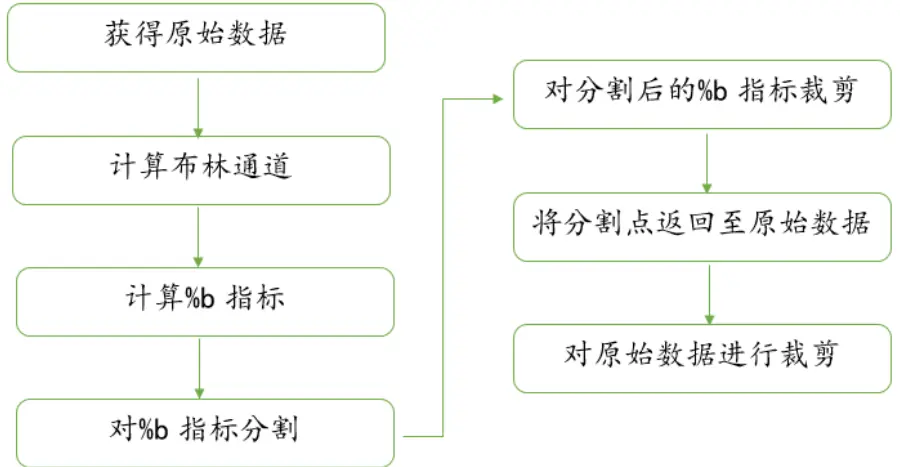
数据来源：广发证券发展研究中心

下一步，我们将介绍一种全新的相似性匹配方式，对我们处理后的数据进行分析。

## 三、相似性判断

## （一）基于高低点位排列的形态判断

此处我们采用图形高低点位的排列顺序作为判断相似性依据的第一条件，具体如下：

取长度为n的一列点位 $S=\{(\mathrm{X}_{1},\mathrm{t}_{1}),(\mathrm{X}_{2},\mathrm{t}_{2}),^{\cdots\cdots\times},(\mathrm{X}_{n},\mathrm{t}_{n})\}$ ，然后将其分为高点和低点两类集合

$$
\begin{array}{rl}&{S_{1}^{\prime}=\{(\mathrm{X}_{1},\mathrm{t}_{1}),(\mathrm{X}_{3},\mathrm{t}_{3}),^{\cdots\cdots},(\mathrm{X}_{n-1},\mathrm{t}_{n-1})\}}\\&{S_{2}^{\prime}=\{(\mathrm{X}_{2},\mathrm{t}_{2}),(\mathrm{X}_{4},\mathrm{t}_{4}),^{\cdots\cdots},(\mathrm{X}_{n},\mathrm{t}_{n})\}}\end{array}
$$

分别对于高点和低点两类集合进行由小到大的重新排序之后，我们得到排列

$$
\begin{array}{rl}&{S_{1}^{\prime\prime}{=}\{(\mathrm{X}_{i_{1}},\mathrm{t}_{i_{1}}),(\mathrm{X}_{i_{3}},\mathrm{t}_{i_{3}}),^{\ldots\dots},(\mathrm{X}_{i_{n-1}},\mathrm{t}_{i_{n-1}})\}}\\&{S_{2}^{\prime\prime}{=}\{(\mathrm{X}_{i_{2}},\mathrm{t}_{i_{2}}),(\mathrm{X}_{i_{4}},\mathrm{t}_{i_{4}}),^{\ldots},(\mathrm{X}_{i_{n}},\mathrm{t}_{i_{n}})\}}\end{array}
$$

我们将排序顺序相同作为我们相似性匹配的必要条件。

## （二）相似性距离

仅仅依靠高低点位排序并不能够获得完美的结果。如下两幅图中，图像的高低点位排序完全相同，但是图像上并不是非常相似。原因在于高低点位之间的距离差别很大。

图32：技术形态示意
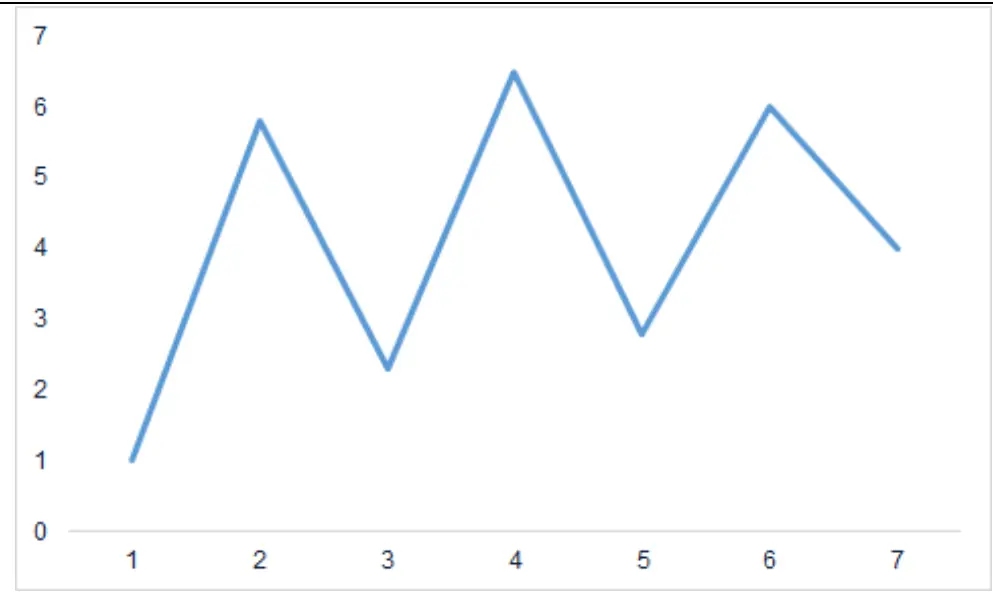
数据来源：广发证券发展研究中心

图33：技术形态示意

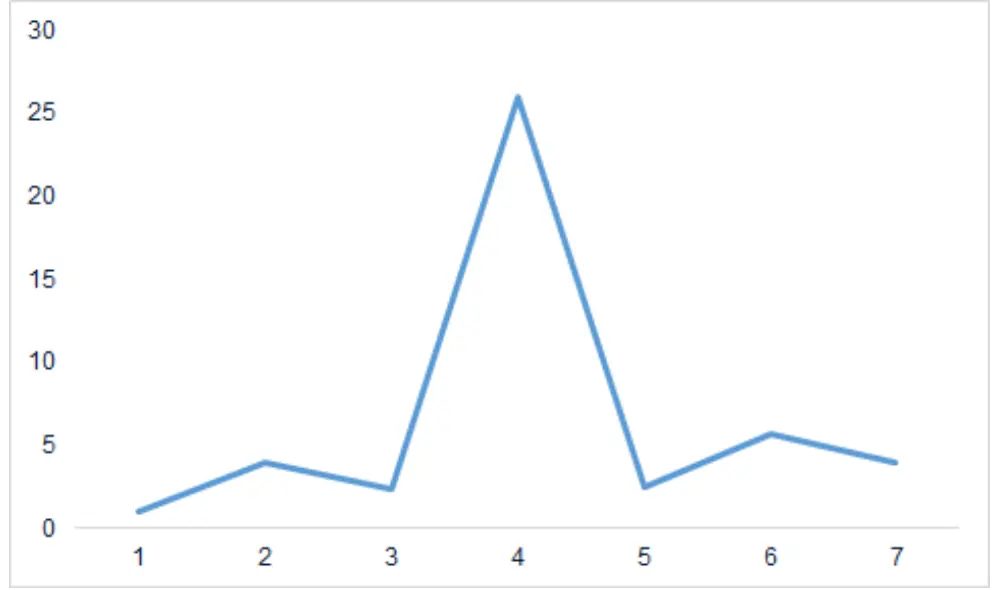
数据来源：广发证券发展研究中心

为了避免这种情况的发生，我们引入一种新的测度，对于高低点位的距离差加以约束。

$$
d(\mathbf{S},\mathbf{S}^{\prime})=\frac{1}{n-1}\left(\alpha\cdot\sum_{i=1}^{n-1}\bigl\|X_{i+1}-X_{i}\bigr\|-\bigl|X_{i+1}^{\prime}-X_{i}^{\prime}\bigr|\bigr|+\beta\cdot\sum_{i=1}^{n-1}\bigl\|t_{i+1}-t_{i}\bigr|-\bigl|t_{i+1}^{\prime}-t_{i}^{\prime}\bigr|\right)
$$

下面我们证明该函数是一个距离。

引理1：若 $a,b,c\geq0$ ，则 ${\big|}a-b{\big|}\leq{\big|}a-c{\big|}+{\big|}c-b{\big|}$

引理2：若 $a,b,c,X_{1},X_{2},Y_{1},Y_{2}\geq0,X_{1}\leq X_{2}$ 且 $Y_{1}\leq Y_{2}$ ，则

$$
a({\mathbf{b}}\mathbf{X}_{1}+\mathbf{c}\mathbf{Y}_{1})\leq a({\mathbf{b}}\mathbf{X}_{2}+\mathbf{c}\mathbf{Y}_{2})
$$

两条引理均容易证得。

显然， ${\mathrm{d}}(\mathrm{S},\mathrm{S}^{\prime})={\mathrm{d}}(\mathrm{S}^{\prime},\mathrm{S}),{\mathrm{d}}(\mathrm{S},\mathrm{S})=0$ ，我们仅需证明$\mathrm{d}(\mathrm{S},\mathrm{S}^{\prime})\leq\mathrm{d}(\mathrm{S},\mathrm{S}^{\prime\prime})+\mathrm{d}(\mathrm{S}^{\prime\prime},\mathrm{S}^{\prime})$

令 $\Delta X_{i}=\left|X_{i+1}-X_{i}\right|,\Delta t_{i}=t_{i+1}-t_{i}$ ，由引理1和引理2我们易得

$$
\sum_{i=1}^{n-1}{\bigl(}{\bigl|}\Delta\mathbf{X}_{i}-\Delta\mathbf{X}_{i}^{\prime}{\bigr|}{\bigr)}\leq\sum_{i=1}^{n-1}{\bigl(}{\bigl|}\Delta\mathbf{X}_{i}-\Delta\mathbf{X}_{i}^{\prime\prime}{\bigr|}+{\bigl|}\Delta\mathbf{X}_{i}^{\prime\prime}-\Delta\mathbf{X}_{i}^{\prime}{\bigr|}{\bigr)}
$$

$$
\sum_{i=1}^{n-1}\left(\left|\Delta t_{i}-\Delta t_{i}^{\prime}\right|\right)\leq\sum_{i=1}^{n-1}\left(\left|\Delta t_{i}-\Delta t_{i}^{\prime}\right|+\left|\Delta t_{i}^{\prime\prime}-\Delta t_{i}^{\prime}\right|\right)
$$

因此，

$$
d(\mathbf{S},\mathbf{S}^{\prime})=\frac{1}{n-1}(\alpha\cdot\sum_{i=1}^{n-1}X_{i+1}-X_{i}-X_{i+1}^{\prime}-X_{i}^{\prime}+\beta\cdot\sum_{i=1}^{n-1}t_{i+1}-t_{i}-t_{i+1}^{\prime}-t_{i}^{\prime})
$$

是一个距离。

综合上述，我们得出如下定义：

若两列序列满足：

（1）S ， $S^{\prime}$ 具有相同的高低点排列

（2） $d(\mathbf{S},\mathbf{S}^{\prime})\leq\gamma$ 其中

$$
d(\mathbf{S},\mathbf{S}^{\prime})=\frac{1}{n-1}\left(\alpha\cdot\sum_{i=1}^{n-1}\bigl\|X_{i+1}-X_{i}\bigr\|-\bigl|X_{i+1}^{\prime}-X_{i}^{\prime}\bigr|\bigr|+\beta\cdot\sum_{i=1}^{n-1}\bigl\|t_{i+1}-t_{i}\bigr|-\bigl|t_{i+1}^{\prime}-t_{i}^{\prime}\bigr|\right)
$$

则两列序列可以进行相似性匹配。

我们在实际运用中取α=1， $\beta=0$

此处需要权衡阈值 的大小。较小的 能够保证图像高度相似，若 $\gamma=0$ ，则两图形完全相同。但是，过小的阈值γ会导致可匹配的图形数量减少，从而减少预测的准确性。

## （三）相似性判断小结

传统的欧氏距离判断图形相似性具有明显的缺陷，不符合技术分析的理论。

图34：欧氏距离判断的缺点
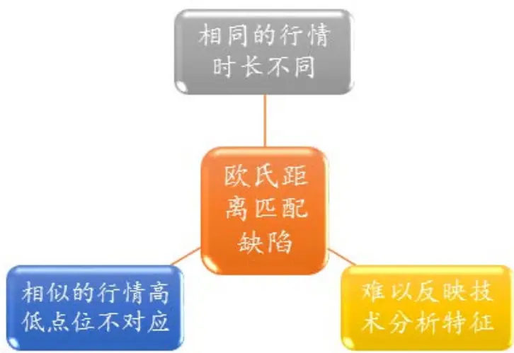
数据来源：广发证券发展研究中心

新的判别相似性的方法流程如下：

图35：新判别法流程图

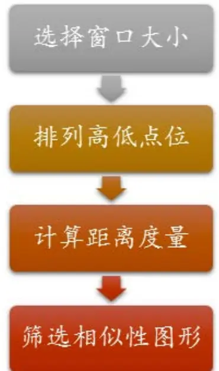
数据来源：广发证券发展研究中心

该方法较欧氏距离判别有明显优势：

图36：新判别法优点
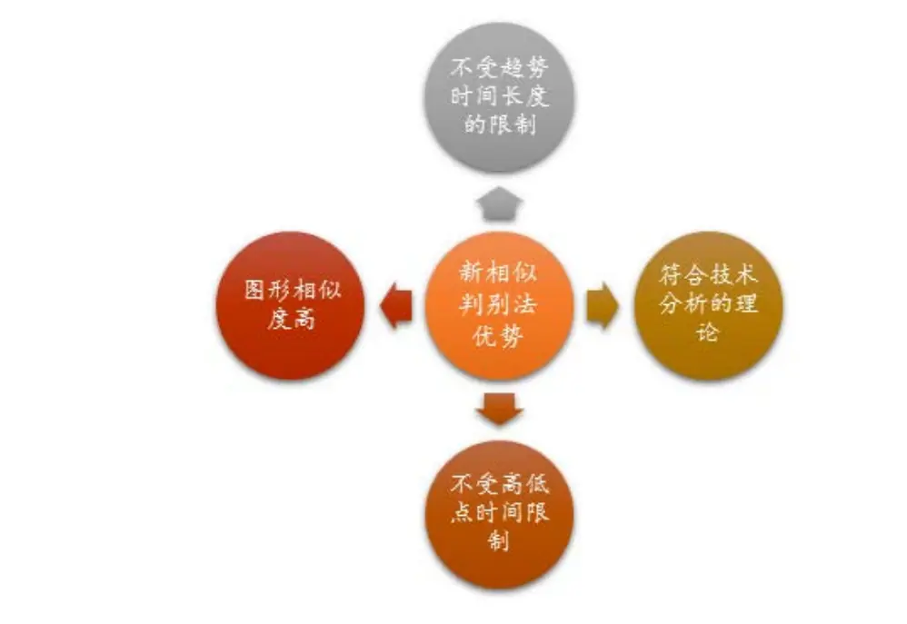
数据来源：广发证券发展研究中心

## 四、趋势预测方法

在论述预测方法之前，我们先定义触发相似性匹配的事件，假如一个点的出现使得一个端点可以确定成为高点或者低点，则我们称其为一个触发相似性匹配的事件。下图是分割剪裁%b指标之后反射回股票原始数据的值，点1至点9均不是触发相似性匹配事件点，但点9至点10的反弹距离超过了我们设定的阈值，我们可以确认点9必定是一个低点，点10则是一个可能的高点。

图37：相似性匹配事件点
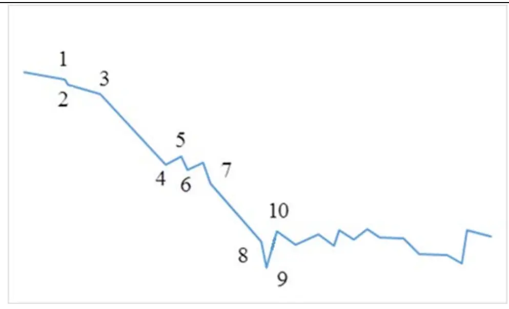
数据来源：广发证券发展研究中心

剪裁处理之后的结果页验证了我们的估计。

图38：经过裁剪之后的收盘价数据
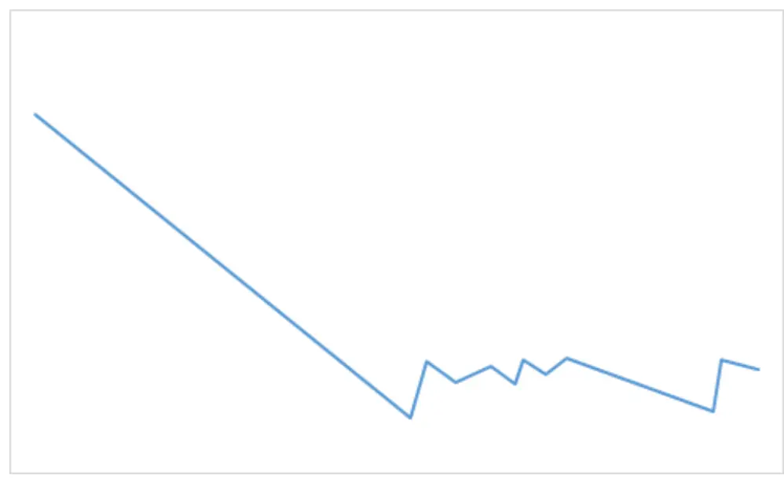
数据来源：广发证券发展研究中心

我们此处的趋势预测主要基于触发相似性匹配事件点。我们将预测的趋势分为

上涨，下跌，无趋势。

我们事先设定阈值ε.

若 $\operatorname{E}[\mathbf{P}_{k}]\geq\operatorname{E}[\mathbf{P}]+\varepsilon$ ，我们预测趋势为上涨，

若 $\operatorname{E}[\mathbf{P}_{k}]\leq\operatorname{E}[\mathbf{P}]-\varepsilon$ ，我们预测趋势为下跌，

$\dddot{\Xi}\operatorname{E}[\operatorname{P}]-\varepsilon<\operatorname{E}[\operatorname{P}_{k}]<\operatorname{E}[\operatorname{P}]+\varepsilon$ ，我们预测为无趋势。

如下图中，虽然我们预测点4相对于点2会上涨，但上涨幅度小于1，于是我们判断为无趋势，而点5相对于点3，点6相对于点4预测均有1个点位以上的上涨，因此我们预测为上涨。

图39：阈值与预测示意图
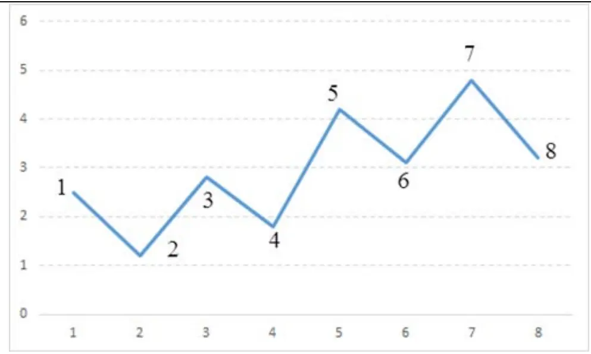
数据来源：广发证券发展研究中心

单一的匹配图像难以做出稳定和准确的预测，我们综合所有具有相似性匹配特征的图像。若这些图像中，预测为上涨趋势的比例较大，我们则预测为上涨，若预测为下跌趋势的比例较大，则我们预测为下跌。若预测上涨的比例和预测下跌的比例相同，则我们预测为无趋势。若我们找不到相似图像，我们同样预测为无趋势。

阈值ε的选择越高，则说明预测的趋势越明显，但也会导致预测为有趋势的样本数量下降，使得可以发出决策信号的点的数量下降。

## 五、交易策略设计及实证结果

由于在数据的增加过程中，增加的数据至多只会影响后三根Z形价格趋势线。并且在数据添加的过程中，一旦点位的差值和%b指标的差值分别超过阈值，我们就可以断定前一个点位确定为Z形价格趋势线的端点。此时我们就可以对该点之后的趋势进行预测。

图40：事件触发点示意图
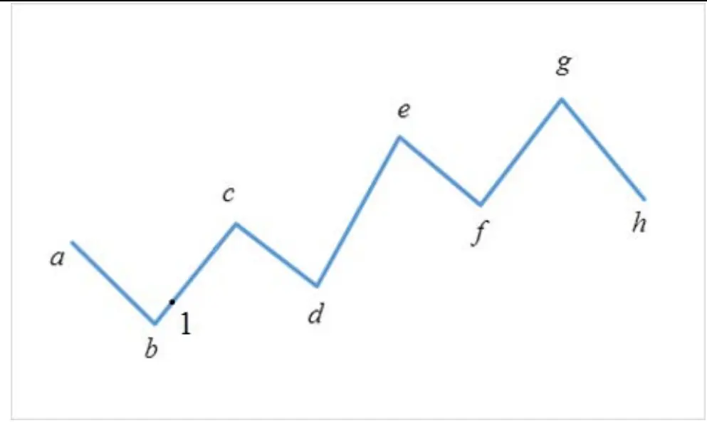
数据来源：广发证券发展研究中心

假设点1为事件触发点，于是我们可以确定a, b分别为Z形趋势线的端点，我们利用股指期货2010年4月至2014年4月的一个交易年的1分钟线数据做为实证，点c相对于点a的高度的准确率如下，横轴为匹配的窗口大小。

图41：不同窗口长度点c相对点a位置预测准确率
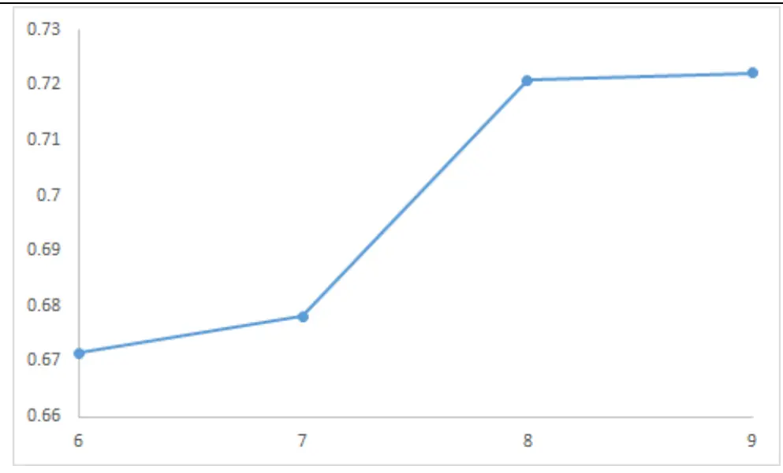
数据来源：广发证券发展研究中心

下图为在预测点c相对于点a位置时，不同匹配窗口大小的情况下分别发出的准

确信号和不准确信号的数量。

图42：不同窗口长度点c相对点a位置预测信号数量
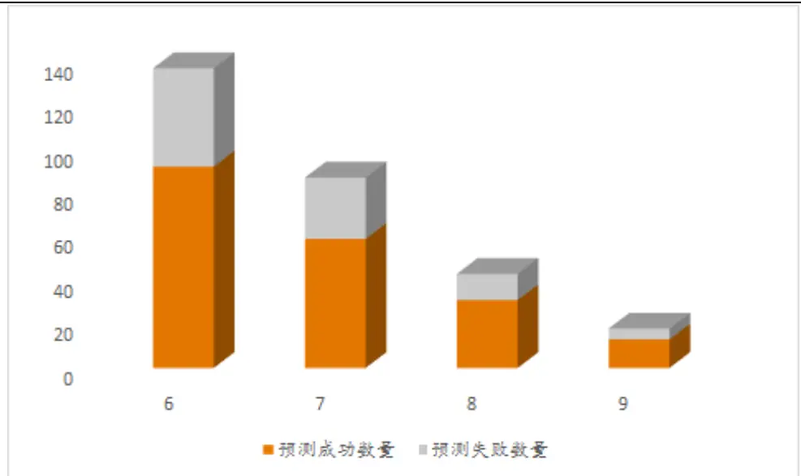
数据来源：广发证券发展研究中心

由图像我们可以看出，利用这种方法得到的相似性匹配具有较高的准确率，并且准确率随着窗口的增加而逐步增加。但是，窗口增加的同时，能够找到的排序一致的匹配样本数量也越来越少，能够发出看多或看空信号的匹配点也越来越少。因此，我们在选择窗口的时候需要权衡。

## 交易策略设计：

图43：上涨阶段交易策略示意
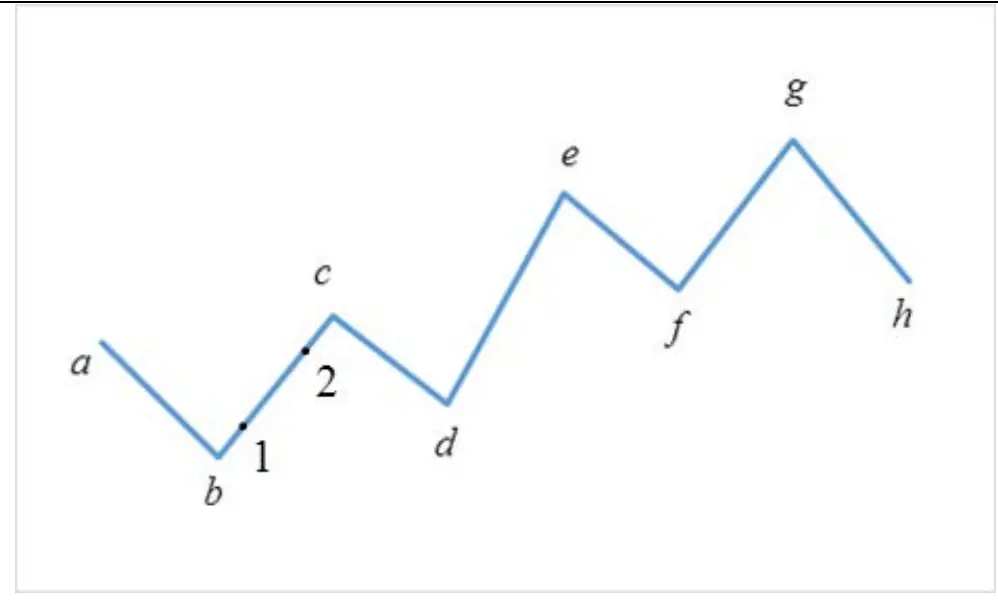
数据来源：广发证券发展研究中心

由于在点1时我们就已经可以断定点a和点b均为端点，点a和点b之间已经经过分割和裁剪，点a和点b之间的距离必大于我们设定的阈值，因而点1在上图中必定低于点a.若我们预测点c高于点a，则可以在点1处买入，并设定浮动动态止损策略，即投资组合价值较持仓期间最高点回撤超过一定百分比即平仓。由于存在噪声，平仓止损点可能在点2处，从而获利。

图44：下跌阶段交易策略设计
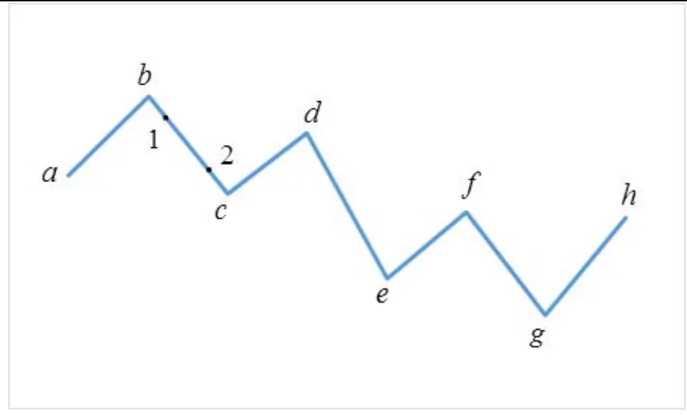
数据来源：广发证券发展研究中心

下跌行情的交易策略同上涨行情相似。若在点1处即可判断点a和点b为端点，且预期点c高度低于点a，则我们可在点1处卖出做空，同样设置动态止损，可能的平仓止损点在点2处，从而了结获利。

我们交易回测采用的是股指期货2013年4月至2014年4月的数据，2011年4月至2013年四月数据作为样本匹配学习数据。动态止损回撤定为千分之五。

一个交易年份里共发出101个交易信号，其中有48个买入信号，53个卖出信号。胜率为46.39% ，盈亏比为2.29.最大回撤为3.78% ，年收益率为21.29%.左图中蓝线为股指期货走势，红线为投资组合的收益情况。

图45：投资组合收益与股指期货走势
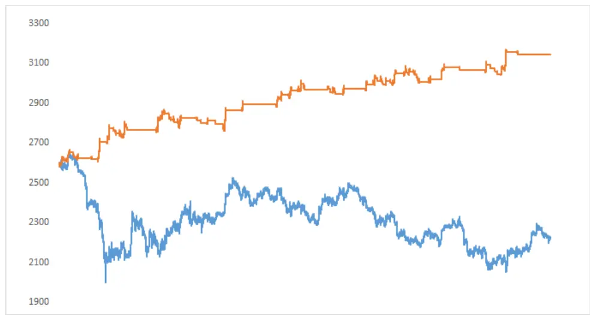
数据来源：广发证券发展研究中心

下图即为我们实际形态匹配识别交易中的一个例子。点1为事件触发点，在根据我们的判别法则，当价格到达点1时，我们可以立即确定点a和点b分别为确定的高点和低点，于是我们马上进行形态匹配。匹配的结果是我们预测反弹点点c的高度将高于点a，于是我们在点1处马上开仓做多股指期货。当价格到达点c时，我们并不能马上断定其为一个高点，但继续持仓后我们发现，价格较持仓期间的高点回撤了约千分之五，于是马上平仓止损，获利了结。

图46：成功获利交易例子
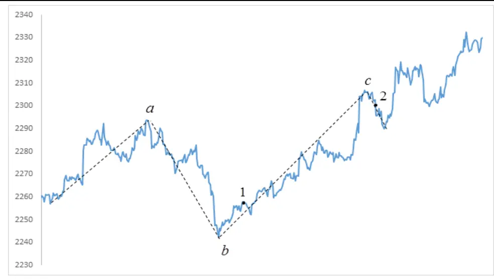
数据来源：广发证券发展研究中心

但是，也存在事件触发点之后预测不准确，上涨空间较小，未获利即平仓止损的情况。如下图中我们在点1处确认点a为高点，点b为低点，同时根据形态匹配，我们预测点c高度将高于点a高度。在点1开仓做多之后，在点c达到高点后下跌，在点2处达到该投资阶段回撤止损点，所以平仓止损。

图47：失败止损交易例子
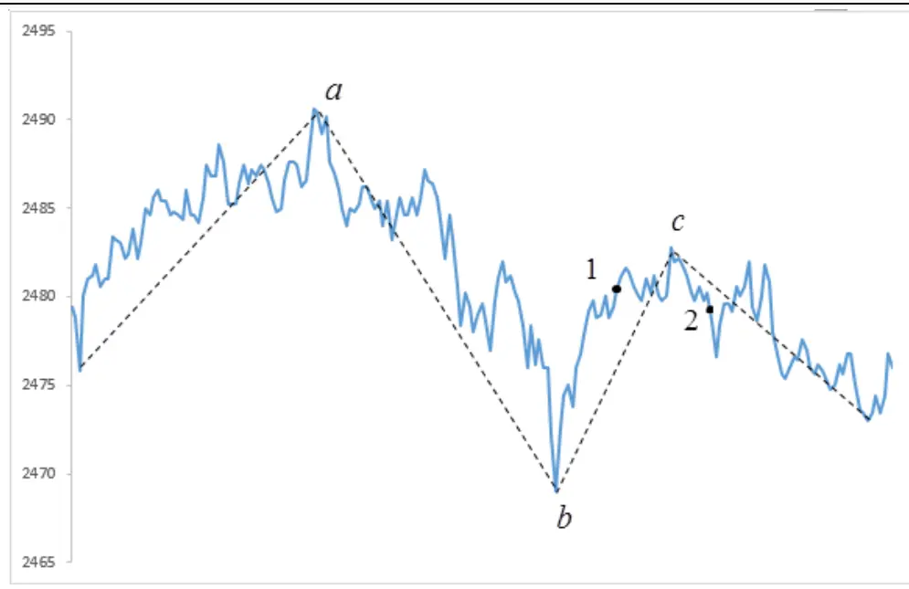
数据来源：广发证券发展研究中心

## 七、总结

相似性匹配策略是基于技术分析中的三大前提假设：市场行为包容消化一切，价格以趋势的方式演变，历史会重演。

相比于时间上的差异性，技术分析更为注重历史价格数据在空间上的变化，因此，相似性匹配策略应当更为注重空间上的匹配性而非时间上的匹配性。

传统的相似性匹配策略将图形正规化标准化后计算 $L_{p}$ 空间上的欧氏距离，或是计算两图形的相关性系数，难以克服窗口时间固定，高低点位时间固定，同技术分析理念不一致等难题。

本文中介绍的新型数据处理法将数据处理成为Z形价格波浪后，可以克服窗口时间固定，高低点位时间固定的难题。对于高低点位进行排列，同技术分析的理念相符。

数据的处理较为复杂。由于%b指标对于股票价格的变化有放大左右，利用%b指标对股票成交价格进行分割有利于增加分割的敏感性，减短顶点确认的滞后时间。同时，%b较价格更为正规化，有利于在对不同的股票，不同时段，不同的股价进行分割时同一标准。

对%b指标进行分割之后，还需对%b指标进行裁剪，以除去噪音。裁剪之后的分割点反射回原始数据后，还需对数据进行进一步地裁剪，以进一步减少噪音，保证数据为Z字波形。

本文引入了一种全新的相似性判别模式。首先分别对于历史价格的Z字波形进行高低点位的排序，排序相似的历史数据认为在技术形态上具有相似性。然后引入一种全新的距离量度，该距离量度保证了高低点位之间跨度的差别最小化。

由于新增加数据只会影响最近的三根Z字形波浪价格线，同时，新增加的数据在满足一定条件后即可确认前一点位为端点。我们可以基于已确认的端点进行后续点位的预测。

基于处理后的Z形价格波浪进行预测的准确率随着窗口大小的增加而逐步提高，但能够给出的预测点则越来越少。该预测普遍具有较高的准确率，能够给投资提供有益的参考。实际运用中需要权衡窗口的大小。

具体的交易策略主要依据事件触发点的位置和预测一个步长点的相对位置，开仓之后通过动态浮动止损平仓。

## 风险提示

策略模型并非百分百有效，市场结构及交易行为的改变或者交易参与者的增多有可能使得策略失效。

## 广发证券—行业投资评级说明

买入： 预期未来12个月内，股价表现强于大盘10%以上。

持有： 预期未来12个月内，股价相对大盘的变动幅度介于-10%～+10%。

卖出： 预期未来 12 个月内，股价表现弱于大盘 10%以上。

## 广发证券—公司投资评级说明

买入： 预期未来12个月内，股价表现强于大盘15%以上。

谨慎增持： 预期未来12个月内，股价表现强于大盘5%-15%。

持有： 预期未来12个月内，股价相对大盘的变动幅度介于-5%～+5%。

卖出： 预期未来 12 个月内，股价表现弱于大盘 5%以上。

## 联系我们

|  | 广州市 | 深圳市 | 北京市 | 上海市 |
| --- | --- | --- | --- | --- |
| 地址 | 广州市天河北路183号大 | 深圳市福田区金田路4018 | 北京市西城区月坛北街2号 | 上海市浦东新区富城路99号 |
|  | 都会广场5楼 | 号安联大厦15楼A座03-04 | 月坛大厦18层 | 震旦大厦18楼 |
| 邮政编码 | 510075 | 518026 | 100045 | 200120 |
| 客服邮箱 | gfyf@gf.com.cn |  |  |  |
| 服务热线 | 020-87555888-8612 |  |  |  |

## 免责声明

广发证券股份有限公司具备证券投资咨询业务资格。本报告只发送给广发证券重点客户，不对外公开发布。

本报告所载资料的来源及观点的出处皆被广发证券股份有限公司认为可靠，但广发证券不对其准确性或完整性做出任何保证。报告内容仅供参考，报告中的信息或所表达观点不构成所涉证券买卖的出价或询价。广发证券不对因使用本报告的内容而引致的损失承担任何责任，除非法律法规有明确规定。客户不应以本报告取代其独立判断或仅根据本报告做出决策。

广发证券可发出其它与本报告所载信息不一致及有不同结论的报告。本报告反映研究人员的不同观点、见解及分析方法，并不代表广发证券或其附属机构的立场。报告所载资料、意见及推测仅反映研究人员于发出本报告当日的判断，可随时更改且不予通告。

本报告旨在发送给广发证券的特定客户及其它专业人士。未经广发证券事先书面许可，任何机构或个人不得以任何形式翻版、复制、刊登、转载和引用，否则由此造成的一切不良后果及法律责任由私自翻版、复制、刊登、转载和引用者承担。