# 厚尾分布下的随机区间突破策略

## 另类交易策略系列之十八

## Table_Sum ary报告摘要 ：

## 传统开盘区间突破策略应用广泛

突破策略，即当下一个交易日股指期货突破某一个价位时进场做多，跌破某一个价位时做空。而在计算上突破价和下突破价方面，往往借鉴开盘区间突破（Opening Range Breakout）方法——在当日开盘价的基础上加上一个区间宽度值得到上突破价，减去区间宽度值得到下突破价。这个区间宽度可以通过历史市场数据优化计算得到。

## 开盘区间突破策略与期权宽跨式组合多头存在部分等价性

我们注意到，加入对称止盈止损的开盘区间突破策略无效。经分析，我们发现开盘区间突破策略与期权宽跨式组合多头存在部分等价性。在报告中，我们从数学上证明了区间突破策略收益等于期权宽跨式组合收益减掉期权触及止损价而期末又回到行权价以外的收益部分。同时在证明过程中，我们发现，当上、下突破边界确定后，将开盘价设置为止损点，将会使策略收益最大化。结合波动率套利中宽跨式组合的性质，我们得出结论：只有期货涨跌幅是厚尾分布的，区间突破策略才能够获得相对稳定的盈利，这也是突破策略收益的根本来源。

## 厚尾效应下的随机区间突破策略

在上述数学证明中，我们发现突破策略的收益来源与区间宽度没有明显关系。由此，我们尝试每个交易日在一定范围内产生一个随机数，并以此作为区间宽度进行突破策略回测。在蒙特卡洛模拟下，通过统计，我们发现随机设置区间宽度，突破策略仍然有效。通过随机数的引入，可以大幅增加 CTA 策略及产品的资金容量，这也是随机区间突破策略最大的亮点之一。

## 厚尾预测下的随机区间突破策略

为了在最大程度上提高突破策略的收益，并规避策略的波动风险，我们引入厚尾预测。通过比较偏离度和峰度两个指标，我们发现峰度可以更为精确地对厚尾效应进行刻画。于是，我们在峰度较高时，即厚尾效应显著时进行随机区间突破交易，而在厚尾效应不显著时停止交易。该方法可以提高随机区间突破策略的信息比。不过这一方法仍是采用历史数据进行统计分析，欠缺“预测”的前瞻性。因此，引入更优的厚尾预测算法将是该策略进一步改进的方向。

图 随机区间突破策略累积收益率
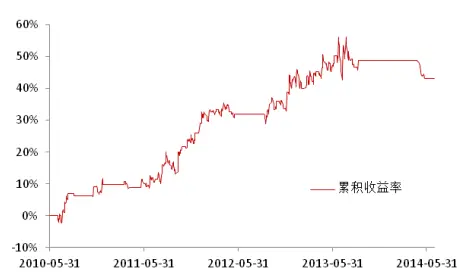

表 随机区间突破策略交易统计

| 回测区间 | 2010-05-31 至2014-06-30 |
| --- | --- |
| 累积收益率 | 43.13% |
| 胜率 | 36.91% |
| 盈亏比 | 2.24 |
| 最大回撤 | -8.65% |
| 信息比 | 0.95 |

Table_Aut hor 分析师： 张超 S0260514070002

公020-87555888-8646

zhangchao@gf.com.cn

## Table_Report 相关研究：

基于遗传算法的期指日内交 2013-02-26易系统

日内突破模式及其资金管理2013-06-17的多重比较研究

期权在机构投资者中的应用2014-02-26之绝对收益

## 一、传统区间突破策略概述

我们把股指期货投机策略分为三类：趋势、反转和择时预测。区间突破策略是使用较为广泛的一类趋势交易策略。国外CTA策略中也存在着大量成功的突破策略，例如 R-breaker、Dual Thrust 等。

R-Bearker由Rick Saidenberg于1993年7月开发，用于标普指数期货的日内交易。图1是其发布前后的收益表现，可以看出自1993至2003的10年期间，策略净值曲线走势良好，但之后表现差强人意，阶段性失效。

图1：R-Breaker发布前后累积收益表现
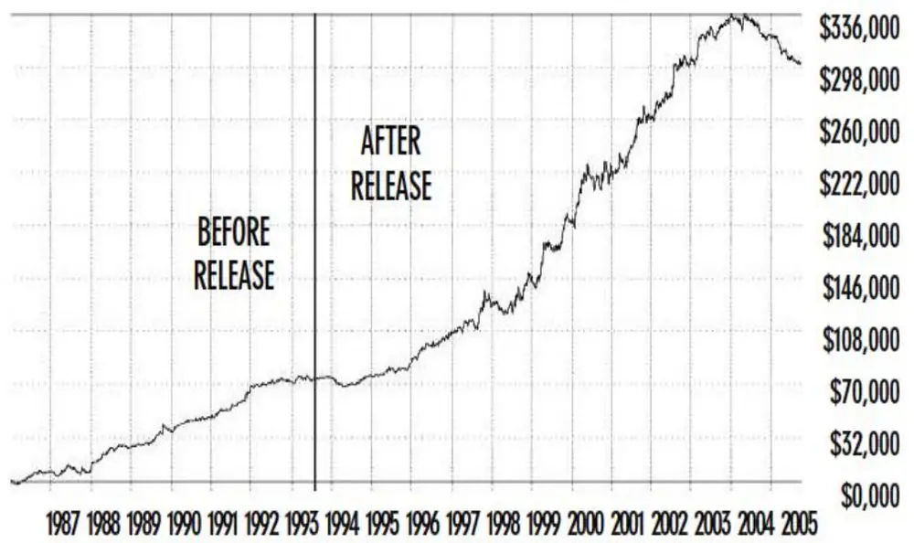
数据来源：Richard Saidenberg

R-Bearker的创始人Rick Saidenberg本意是开发一个反转策略，通过昨日最高价、昨日最低价、昨日收盘价与当日最高价、最低价进行计算，建立回归模型预测下一个交易日盘中波动的高低的，当达到高点时开空，达到低点时做多，其R-Level策略便是这个思想。这是最初的思路，后来发现突破策略效果更好，加上突破策略便有了R-Bearker。

突破策略，即当下一个交易日股指突破某一个价位时进场做多，跌破某一个价位时做空。而在计算上突破价和下突破价方面，往往借鉴开盘区间突破（OpeningRange Breakout）方法——在当日开盘价的基础上加上一个区间宽度值得到上突破价，减去区间宽度值得到下突破价，如图2所示。

图2：开盘区间突破模式
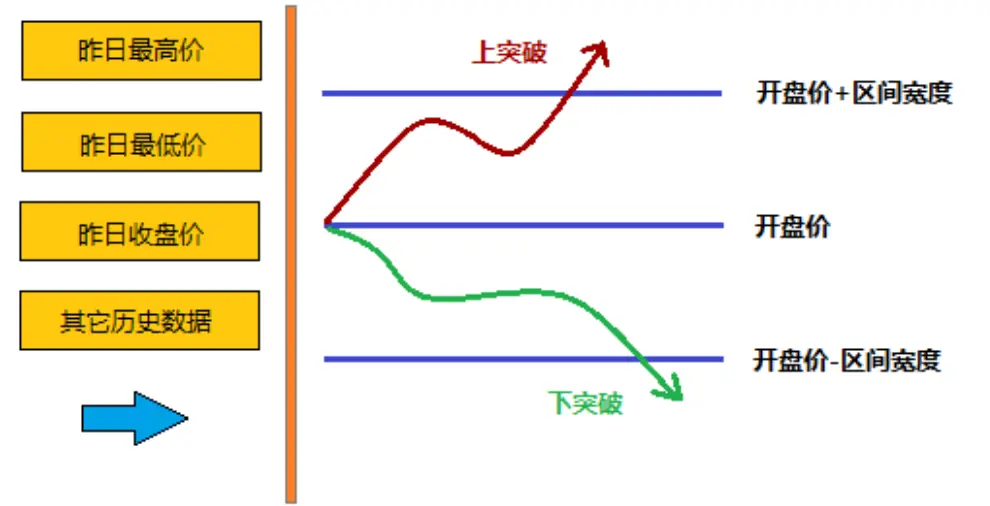
数据来源：广发证券发展研究中心

传统区间突破策略喜欢通过历史数据计算最佳区间突破宽度，例如通过昨日最高价、昨日最低价、昨日收盘价进行回归计算。

在之前的交易策略系列报告之十《基于遗传算法的期指日内交易系统》中，我们也通过昨日开盘价、昨日最高价、昨日最低价、昨日收盘价、前日收盘价、真实高价、真实低价、波动真实区间及波动真实区间均值等变量寻找出了一个计算区间宽度的公式，并在实证中得到了较好的回测结果。

但是由于市场波动持续下降，近一年来大多数日内趋势交易策略的实盘表现都不尽人意，区间突破策略也不例外。市场波动似乎已成为制约区间突破策略的一大障碍。很多人认为：市场波动大，趋势策略容易赚钱。但为什么会有这种效应？本篇报告将从这里出发，分析和研究突破策略的收益来源，并由此演化出一类随机区间突破策略。

## 二、传统突破策略收益来源分析

## （一）区间突破策略：加入止盈，策略失效

CTA所采用的突破策略大多都带有止损机制，但是几乎没有人采用止盈加止损的突破策略。实证结果告诉我们，如果在传统突破策略中对称加入止盈止损，突破策略将失效，如 3所示。

图3：两类模式下的突破策略表现（IF01上市至2014年5月，左：止损不止盈；右：对称止盈止损）
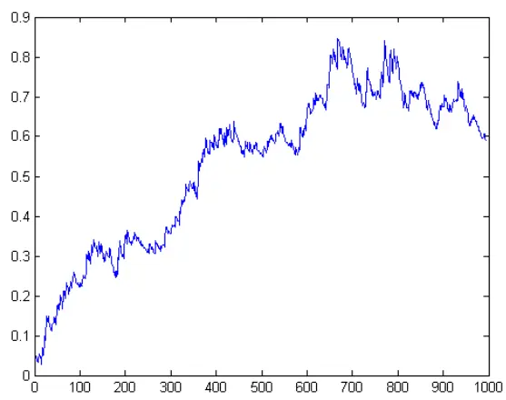
数据来源：广发证券发展研究中心

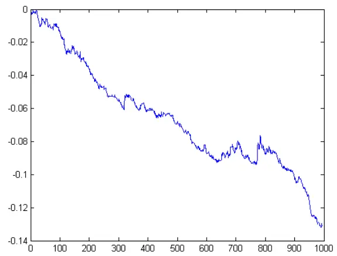

对称加入止盈止损的策略无法取得稳定正向收益，为什么会出现这种现象？这是一个有趣的问题，也将是本篇报告首先要解决的问题。

## （二）区间突破策略与宽跨式期权组合的关系

我们很幸运地发现，日内突破策略与期权跨式组合（Straddle）或宽跨式组合（Strangle）波动率多头的收益存在正相关性。

这里我们以宽跨式组合为例进行证明（后面我们会提到，跨式组合可以看做宽跨式组合的一种特殊情况）。

宽跨式组合由具有相同到期时间但执行价格不同的一份看涨期权和一份看跌期权组成。其中波动率多头组合的构建方式为：买入上述看涨和看跌期权组合各一份，如图 4所示。

图4：宽跨式组合多头到期盈亏（绿色线）
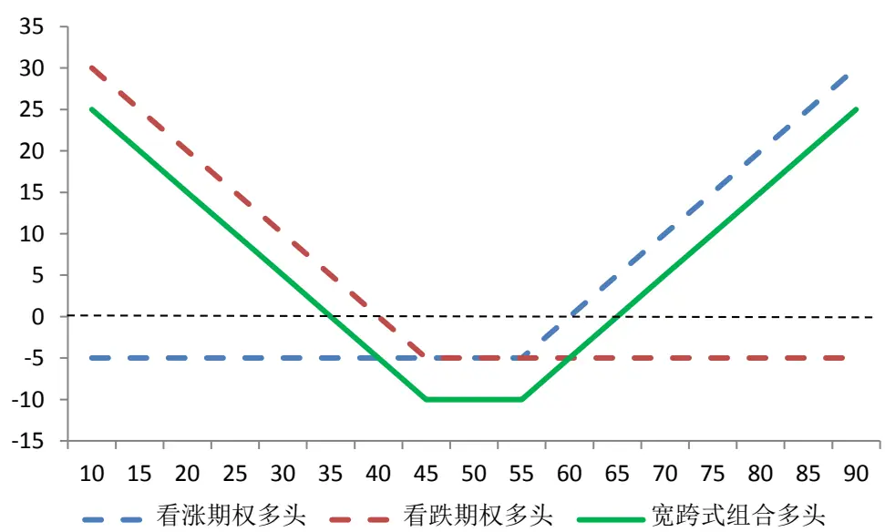
数据来源：广发证券发展研究中心
识别风险，发现价值

对比突破策略来看，宽跨式组合的波动率多头中，看涨期权多头相当于在做多挂钩标的指数的同时加入了一条止损线，而看跌期权多头相当于在做空挂钩标的指数的同时加入了一条止损线。两者的组合其实有点像区间突破策略。如图 5所示，宽跨式组合在损益为零时，对应突破策略开多或开空的位置；作为对称的区间突破策略，宽跨式组合形态的中线位置对应突破策略的开盘价，两边区间宽度对称分布；而宽跨式组合形态的两个行权价位置，正好对应了突破策略的止损位。把图5在平面内旋转 90度来看，好像正是一个区间突破策略。

图5：宽跨式组合多头与开盘区间突破策略的部分等价关系
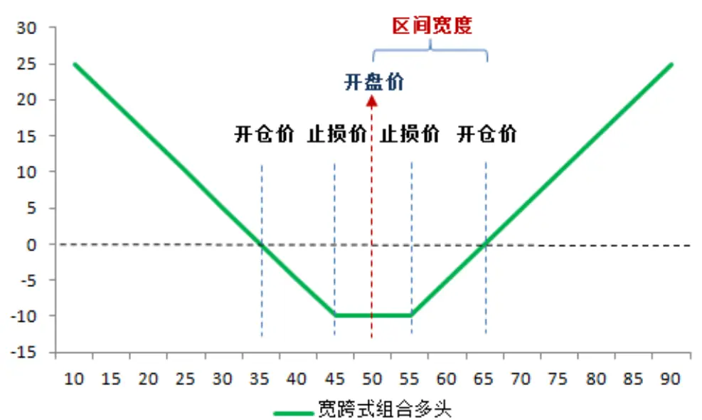
数据来源：广发证券发展研究中心

但上述分析中还有一点瑕疵——图4和图5 的宽跨式组合形态对应期权组合的到期收益，也就是说，挂钩标的指数在行权日前如果触及止损位，但期末又弹回到止损价以内的，将以期末价格结算。而区间突破策略中，指数一旦触及止损位，将被平仓结算收益。因此，宽跨式组合的收益会比相应区间突破策略的收益大一些，多出的这部分正来源于价格触及行权价（止损位）后又在行权日反弹回到止损区间以外的收益，即

$$
\overline{r}_{宽跨}=\overline{r}_{区突}+\overline{r}_{触损反弹}\tag{1}
$$

为了解决这个问题，我们需要从统计的角度出发进行研究。假设我们在图5右开仓价突破时建仓（对应区间突破策略的上突破，下突破同理，这里就不再赘述），之后指数价格从右开仓价位置随机游走，直至期末。那么，价格波动会出现三种情况：

第 1类：整个波动过程中都未触及到右止损位。

第 2类：波动过程中触及右止损位，期末指数价格落在止损区间。

第 3类：波动过程中触及右止损位，期末指数价格落在止损区间以外。

图6：三类价格波动过程
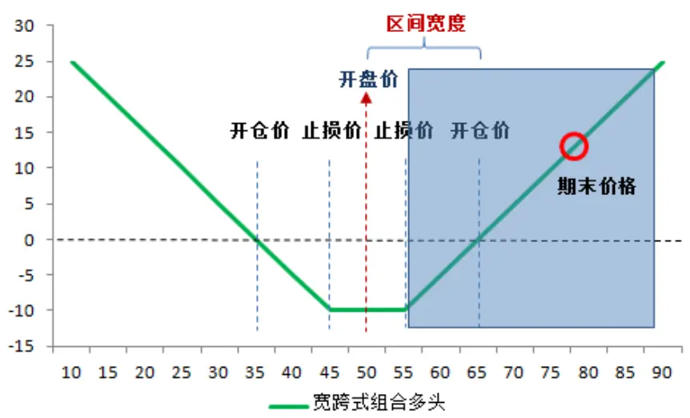
第1类波动不触及止损线

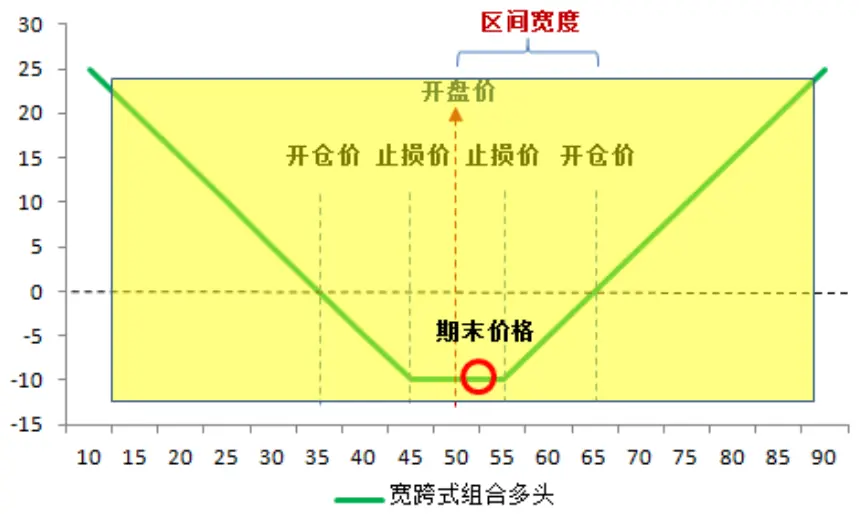
第2类波动触及止损线期末价格落在止损区间内

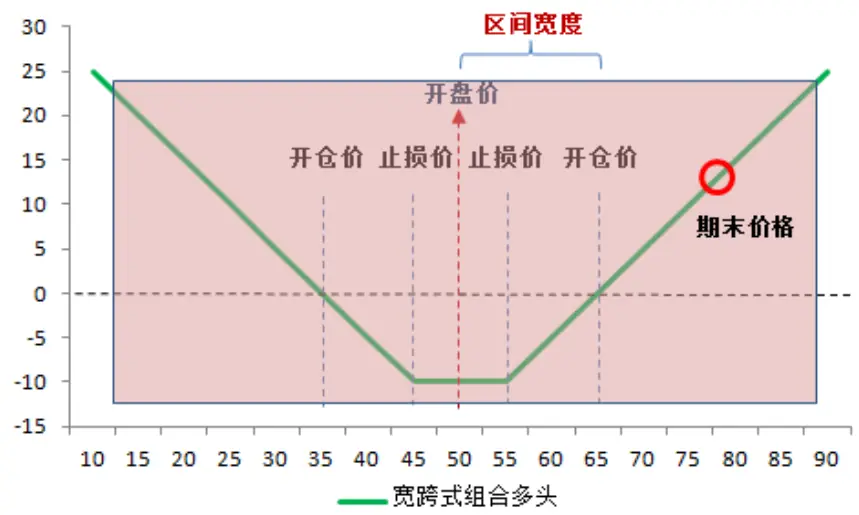
第3类波动触及止损线期末价格落在止损区间外
数据来源：广发证券发展研究中心

假设做一个实验，让指数价格从起始位置（右开仓价）随机波动N 次。其中发生 1、2、3三类事件的次数分别是 $,n_{\mathrm{i}}$ 、 $n_{2}$ 和 $n_{3}$ ，则有

$$
n_{1}+n_{2}+n_{3}=N\tag{2}
$$

按照这三种情况，我们把宽跨式组合的损益也分解成三部分，即

$$
\frac{1}{N}\left(\sum_{i=1}^{n_1}r_{未触i}+\sum_{i=1}^{n_2}r_{触中i}+\sum_{i=1}^{n_3}r_{触外i}\right)\tag{3}
$$

其中括弧中的第二项 $r_{触中\mathrm{i}}$ 是符号为负的常数，即止损幅度，我们把这一常数记作$L_{止损幅度}$ ，则

$$
\frac{1}{N}\left(\sum_{i=1}^{n_{1}}r_{未触i}+n_{2}L_{止损幅度i}+\sum_{i=1}^{n_{3}}r_{触外i}\right)\tag{4}
$$

之前分析过，宽跨式组合比区间突破策略多出的收益正来自于第三项 $\sum_{i=1}^{n_{3}}r_{触外i}$ 它可以写成止损收益加上以止损点为基准的期权到期收益形式，即

$$
\sum_{i=1}^{n_{3}}r_{触外i}=\sum_{i=1}^{n_{3}}\left(L+r_{触损反弹i}\right)\tag{5}
$$

代回（4）式，则有

$$
\frac{1}{N}\left(\sum_{i=1}^{n_{1}}r_{未触i}+n_{2}L_{比损幅度}+n_{3}L_{比损幅度}\right)+\frac{1}{N}\sum_{i=1}^{n_{3}}r_{触损反弹i}\tag{6}
$$

日内区间突破策略一旦当日止损就不再开仓，（6）式中的第一项完整涵盖了这一信息，反映了区间突破策略应该具备的平均收益情况。所以（6）式可以写为

$$
\overline{r}_{宽跨}=\overline{r}_{区突}+\frac{1}{N}\sum_{i=1}^{n_3}r_{触损反弹i}\tag{7}
$$

这正是（1）式的具体形式。那么区间突破策略的收益可以写为

$$
\overline{r}_{区突}=\overline{r}_{宽跨}-\frac{1}{N}\sum_{i=1}^{n_3}r_{触损反弹i}\tag{8}
$$

即区间突破策略收益等于期权宽跨式组合收益减掉期权触及止损价而期末又回到行权价以外的收益部分。将（3）式代入（8）式，可以将区间突破策略的平均收益进一步写成

$$
\begin{aligned}&\overline{r}_{区突}=\frac{1}{N}\sum_{i=1}^{n_1}r_{未触\mathrm{i}}+\frac{1}{N}\sum_{i=1}^{n_2}r_{触中\mathrm{i}}+\frac{1}{N}\sum_{i=1}^{n_3}r_{触外\mathrm{i}}-\frac{1}{N}\sum_{i=1}^{n_3}r_{触损反弹\mathrm{i}}\\&=\frac{1}{N}\sum_{i=1}^{n_1}r_{未触\mathrm{i}}+\frac{n_2}{N}L_{止损幅度}+\left[\frac{1}{N}\sum_{i=1}^{n_3}\left(r_{触外\mathrm{i}}-r_{触损反弹\mathrm{i}}\right)\right]\\\end{aligned}\tag{9}
$$

不难看出括弧中的 $r_{触外\mathrm{i}}-r_{触损反弹\mathrm{i}}$ 等于常数 $L_{止损幅度}$ ，因此（9）式可以写为

$$
\frac{1}{N}\sum_{i=1}^{n_1}r_{未触i}+\frac{n_2}{N}L_{止损幅度}+\frac{n_3}{N}L_{止损幅度}\tag{10}
$$

为了更为直观地解释（10）式的意义，我们把后两项合并在一起写作

$$
\overline{r}_{区突}=\frac{1}{N}\sum_{i=1}^{n_1}r_{未触i}+\frac{n_2+n_3}{N}L_{止损幅度}\tag{11}
$$

从（11）式可以看出，区间突破策略的收益正是开仓后不止损部分与止损部分的和，该式佐证了我们之前的推导是正确的。

回到（8）式，如果区间突破的上下边界已经确定，我们希望（8）式 $\overline{T_{区突}}$ 尽量大，就应该尽量减 $小\frac{1}{N}\sum_{i=1}^{n_{3}}r_{触损反弹i}$

这里主要有两个因素，第一个因素是 $n_{3}$ 的大小，第二个因素是 $r_{触损反弹\mathrm{i}}$ 的均值大小。两者都可以通过增加 $\left|L_{止损幅度}\right|$ 的大小调节。首先，如果 $\left|L_{止损幅度}\right|$ 增大，指数价格从开仓价波动到止损价将更加困难， $n_{3}$ 将减小。其次，触及止损后指数价格反弹本身是一个随机过程。在单个交易日内，如果希望反弹高度小，尽可能将触及止损线的时间推迟，越靠近收盘越好。此时的最佳方案就是增加 $\left|L_{止损幅度}\right|$ ，使得从开仓价到止损线的时间尽量长。综合来看，增加止损幅度将有利于减小（8）式中的$\frac{1}{N}\sum_{i=1}^{n_3}r_{触损反弹i}$ ，提高区间突破策略收益。

但是止损幅度不能无限制地增加，因为我们之前的分析都是在宽跨式组合的基础上完成的。宽跨式组合在确定开仓价格后，可以实现的最大止损幅度$\max\left\{\left|L_{止损幅度}\right|\right\}$ 将是开仓价到开盘价之间的距离，此时宽跨式组合转化为跨式组合，如图 7所示。

图7：区间突破策略收益最大化所对应的期权跨式组合
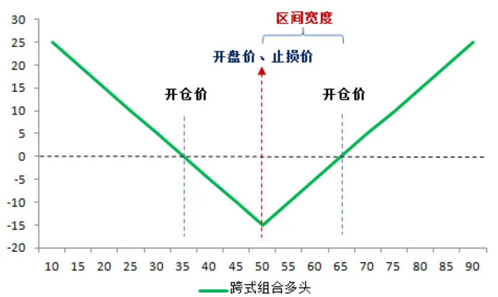
数据来源：广发证券发展研究中心

也就是说，在开盘区间突破策略中，当上、下突破边界确定后，将开盘价设置为止损点，将会使策略收益最大化。

再看（7）式，在随机游走假设下，我们已经通过调整 $\left|L_{止损幅度}\right|$ 使得第二项对突破策略收益的影响尽可能小。在此基础上，突破策略的平均收益 $\overline{T_{区突}}$ 与 $\overline{T_{宽跨}}$ 呈现正相关关系。因此，宽跨式组合收益越高，区间突破策略的收益越高。在什么样的情况下宽跨式组合的收益才会较高呢？

宽跨式组合在期权交易策略中主要用来进行波动率套利。之前所描述的期权跨式组合波动率多头在波动率上升时容易获利。结合（7）式，这点看似和许多人所认为的“波动率越大，期货日内趋势交易越容易赚钱”的观点一致。但是实际上这种观点存在一些问题。

通过期权跨式组合多头进行波动率套利，在实际交易过程中往往不会持有合约到行权日，主要是因为期权的价值存在时间衰减，持续持有组合多头是不利的。也就是说，当期权挂钩标的指数价格大幅波动产生盈利时，交易员会及时平仓获利。

但（7）式中的 $\overline{F_{宽跨}}$ 是指宽跨式组合多头持有到期末（对应区间突破策略的尾盘）的

平均收益。在这种情况下，若希望 $\overline{T_{宽跨}}$ 尽量大，就需要期末指数涨跌在统计上呈现

厚尾分布。也就是说，只有期货涨跌幅是厚尾分布的，区间突破策略才能够获得相对稳定的盈利，这也是突破策略收益的根本来源。

## 三、随机区间突破策略

## （一）厚尾效应与随机区间宽度下的突破策略

在第二部份中，我们从理论上证明了区间突破策略与跨式组合或宽跨式组合具有部分等价性。宽跨式组合或跨式组合在厚尾效应下持有到期权行权日可以获得盈利，这里的厚尾是针对突破策略的区间宽度所说的。但是在上述理论推导过程中，似乎并没有对区间宽度做出严格限制。按照传统区间突破策略，需要通过历史变量计算一个精确的区间宽度来建模。那么，如果这个宽度发生一定的变化，区间突破策略是否还有效呢？

图8：突破策略区间宽度能否变化
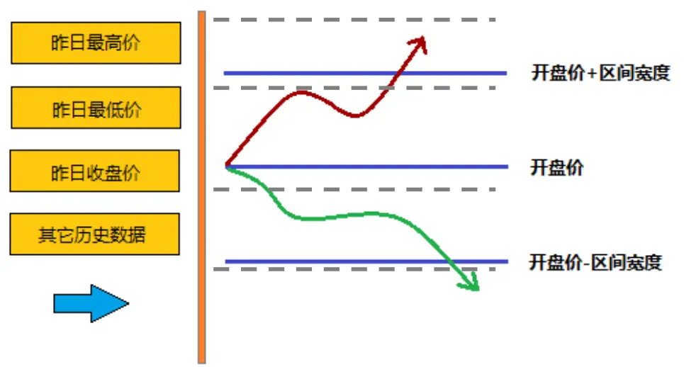
数据来源：广发证券发展研究中心

例如图8中，我们将上、下区间宽度分别改到灰色线的位置，突破策略的有效性还能否持续？按照我们上面的理论推导过程，似乎策略收益对区间宽度的敏感性并不强。于是我们开发了接下来要介绍的随机区间突破策略。

简单起见，我们这里仍然考虑对称区间宽度（上、下区间宽度相等）。一方面，跨式组合的区间宽度一定是大于零的；另一方面，如果区间宽度设置太宽，交易机会将会大幅减小。因此，我们以涨跌幅作为纵坐标，将区间宽度d 设置为千分之三到百分之一的随机数，即

$$
d\in[0.003,0.01]\tag{12}
$$

其中d 服从均匀分布。

按照这一方法，我们每个交易日会产生一个随机数，并以此作为区间宽度进行突破策略回测。为了避免结果具有太强的随机性，我们使用蒙特卡洛方法进行 100次模拟，每个交易日取 100次随机结果的算数平均值作为最终结果。根据我们之前的理论结果，取开盘价作为止损线。考虑双边2%%交易成本，测算 2010年4月16日股指期货上市至 2014年6月 30日的策略表现，得到图9 和表 1的实证结果。

图9：随机区间突破策略收益初探（100次蒙特卡洛模拟）
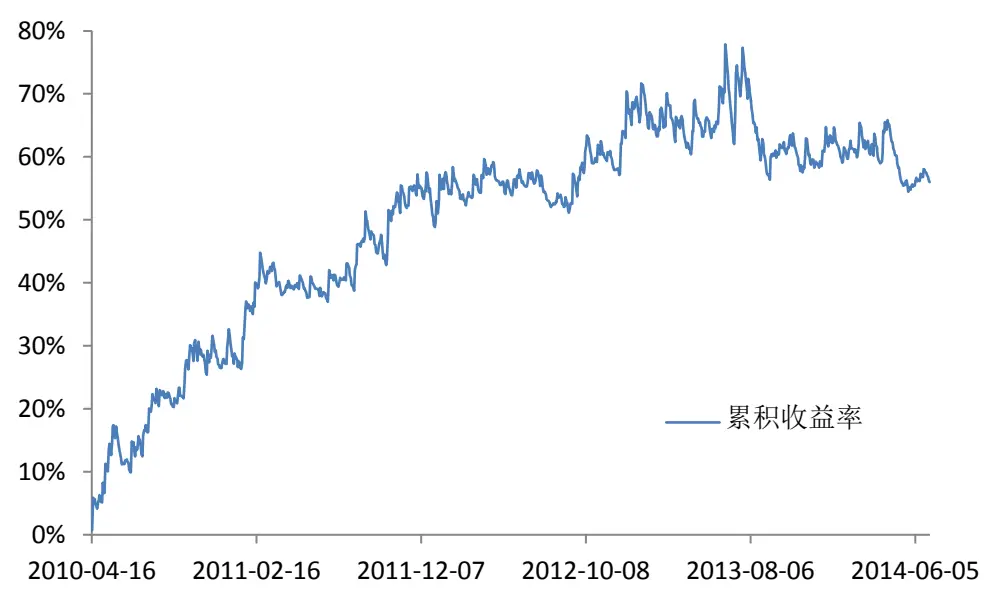
数据来源：广发证券发展研究中心，天软科技

表 1：随机区间突破策略收益初探

| 累积收益率 55.99% |
| --- |
| 年化收益率 11.05% |
| 交易总次数 1018 |
| 获胜次数 352 |
| 失败次数 666 |
| 胜率 34.58% |
| 单次获胜收益率 0.90% |
| 单次失败亏损率 -0.40% |
| 盈亏比 2.25 |
| 信息比 0.85 |
| 最大回撤 -13.15% |
| 最大连胜次数 5 |
| 最大连亏次数 12 |

数据来源：广发证券发展研究中心，天软科技

可见，随机选择区间宽度，突破策略也是可以产生盈利的。当然我们并不排斥通过传统方法进行参数优化，选取最优区间宽度，以求达到收益最大化。但是随机取区间宽度的好处在于，可以增加资金容量，这点将在后文详述。

这里的策略参数是随机区间宽度的上下边界。0.3%和1%纯属经验取值，避免了过度优化嫌疑。

我们之前的理论认为，区间突破策略的收益来自于涨跌的厚尾效应。那我们这里也来通过实证简单验证一下该结论的正确性。

如果在上述策略的基础之上，再对称地加入一条止盈线，即-d止损，+d止盈。其他参数不变，我们得到图 10的回测结果。

识别风险，发现价值

图10：带止盈的随机区间突破策略（100次蒙特卡洛模拟）
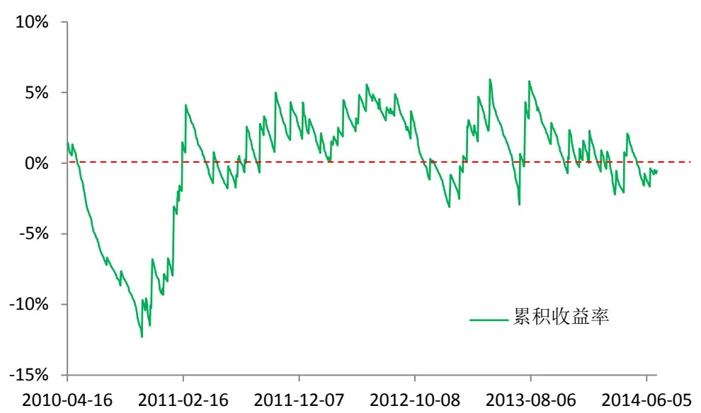
数据来源：广发证券发展研究中心，天软科技

和图2结果类似，我们发现策略无法盈利——累积收益水平一直在零附近震荡，表明同时加入止盈止损的区间突破策略抑制了厚尾的发生，是无效策略，也证实了区间突破策略的收益来源确实在于涨跌的厚尾效应。

## （二）随机区间突破策略的优点——提高 CTA产品资金容量

传统认为，CTA产品很难容纳较大资金规模，这和交易策略的时效性有关。然而，随着随机数加入交易策略，策略的时效性将有所弱化，所以可以容纳更多资金进入。

例如在上述随机区间突破策略中，我们可以不用在策略突破某一价格后追入，而是在价格进入某一区间后，根据 N次随机数的结果进行多笔不同价格的限价委托挂单，有些类似于限价委托下的算法交易。或者干脆在该区间每个价格档口上挂一定数量订单等待成交。

这样做的好处是大幅增加了策略的资金容量，缺点是由于价格波动在事前无法估计，成交率会经常低于甚至大幅低于 100%，资金使用效率问题有待解决。

## 四、厚尾预测下的随机区间突破策略

## （一）刻画厚尾的方法

前面几部分我们证明了区间突破策略的收益来自于涨跌的厚尾效应，并通过实证分析验证了这一结论。接下来，我们很自然地考虑到，应该利用这一结论，在最大程度上提高突破策略的收益，并规避策略的波动风险。

既然要根据厚尾效应改进策略，就应该先找到刻画厚尾效应的定量方法。刻画厚尾的方法有很多种，这里我们简单介绍两种。

## 1、偏离度

偏离度是指收盘价相对当日开盘价的偏离程度，标准化后的形式为

$$
\left|\frac{收盘价-开盘价}{开盘价}\right|\tag{13}
$$

当这一指标较大时，表明厚尾效应存在。我们画出沪深 300股指期货历史上的偏离度，如图 11所示。

图11：股指期货连续合约历史偏离度（HS300股指期货上市以来）
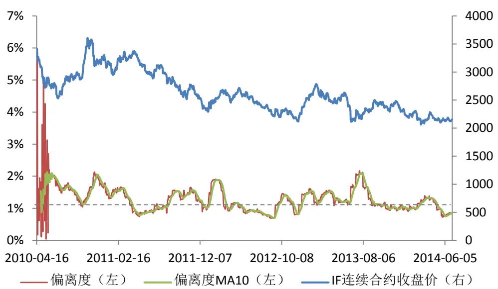
数据来源：广发证券发展研究中心，wind资讯

偏离度这一指标虽然可以刻画历史数据的厚尾效应，但是无法找到分界线精确划分厚尾与薄尾。因此，我们将引入能够更为定量描述厚尾效应的指标——峰度。

## 2、峰度

在统计学中，峰度（Kurtosis）衡量随机变量概率分布的峰态。峰度高就意味着方差增大是由低频度的大于或小于平均值的极端差值引起的。

峰度被定义为四阶中心矩除以概率分布方差的平方，即

$$
k_{1}=\frac{E(x-\mu)^{4}}{\sigma^{4}}\tag{14}
$$

由于我们研究的是对称区间宽度的随机区间突破策略，因此我们有必要将样本的均值修正到 $\mu\simeq0$ ，按照统计学做法，可取峰度

$$
k_{0}=\frac{n-1}{(n-2)(n-3)}\left[(n+1)k_{1}-3(n-1)\right]+3\tag{15}
$$

作为修正值，其中n为样本数量。

传统上，认为峰度大于3 的分布存在厚尾效应，如图 12所示。具备定量区分标准也是峰度优于偏离度的主要原因。

图12：峰度与厚尾关系示意图
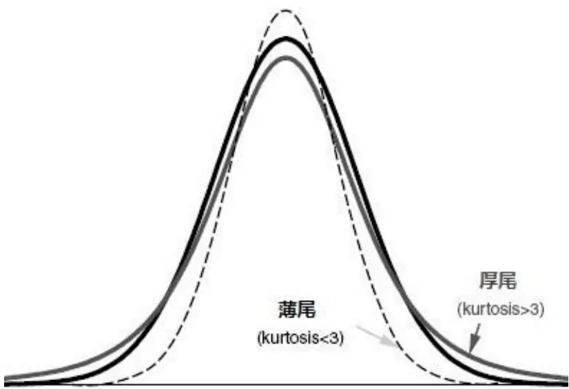
数据来源：广发证券发展研究中心

同样，按照（14）式，我们画出沪深 300股指期货历史上收盘价相对于开盘价涨跌幅的峰度（数据窗口取 30天滚动计算），如图13 所示。

图13：股指期货连续合约历史峰度（HS300股指期货上市以来）
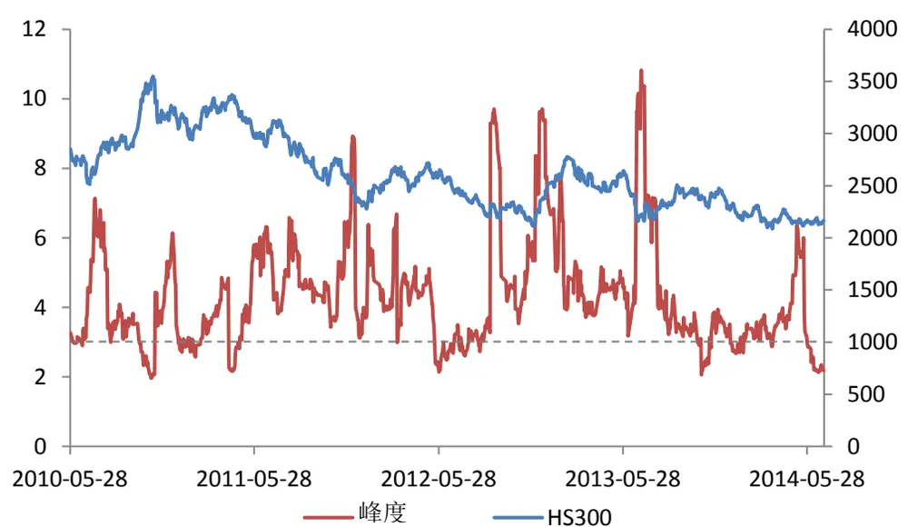
数据来源：广发证券发展研究中心，wind资讯
识别风险，发现价值

可以看出，沪深300股指期货涨跌幅的峰度在大多数时间是大于 3的，也就是说，厚尾效应在国内股指期货市场普遍存在。这也是之前的随机区间突破策略在沪深 300股指期货上总体有效的原因。

## （二）厚尾下的随机区间突破策略

从图13可以看出，厚尾存在一定的聚集效应，即在某一段时间内厚尾效应会持续存在。因此，我们可以通过计算过去若干个交易日的峰度，估计当前峰度值，在峰度较大、也就是厚尾效应显著的时候，实施开盘区间突破策略；否则当天就不交易。

图 13中的峰度采用30日数据计算，是因为既希望延迟尽量低，但又要保证数据样本数量具有统计学意义。

我们认为当峰度大于4时，厚尾效应显著。因此，我们重新回测了随机区间突破策略在这一约束条件下的历史表现，即 T日峰度大于4，我们就在 T+1日进行随机区间突破策略；否则不交易。回测蒙特卡洛模拟次数仍为 100，止损线为开盘价，区间宽度d•[0.003,0.01]，交易成本双边万分之二。回测时间为 2010年 5月 31日至2014年 6月 30日，结果如图 14和表 2所示。

图14：厚尾约束下的随机区间突破策略（100次蒙特卡洛模拟）
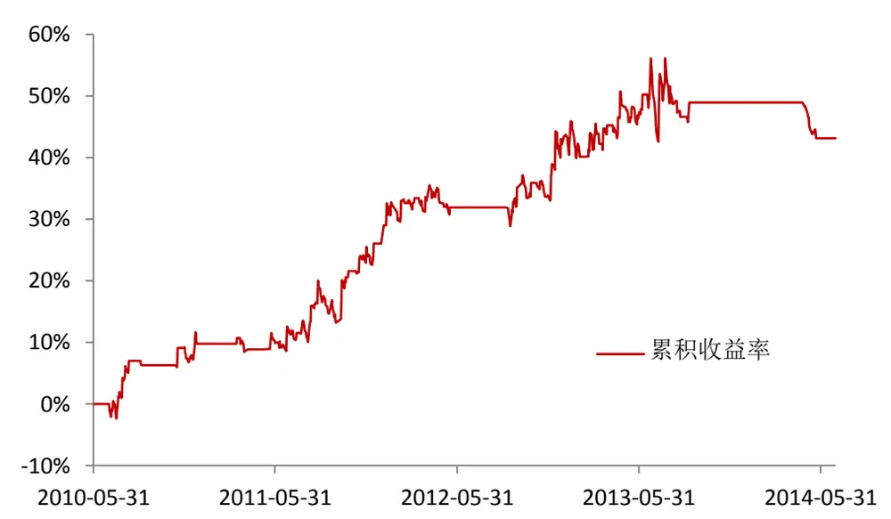
数据来源：广发证券发展研究中心，天软科技

表 2：厚尾约束下的随机区间突破策略交易统计

| 累积收益率 | 43.13 |
| --- | --- |
| 年化收益率 | 9.10% |
| 回测交易日长度 | 988 |
| 交易总次数 | 466 |
| 交易占比 | 47% |

识别风险，发现价值

| 获胜次数 | 172 |
| --- | --- |
| 失败次数 | 294 |
| 胜率 | 36.91% |
| 单次获胜收益率 | 0.94% |
| 单次失败亏损率 | -0.42% |
| 盈亏比 | 2.24 |
| 信息比 | 0.95 |
| 最大回撤 | -8.65% |
| 最大连胜次数 | 5 |
| 最大连亏次数 | 13 |

数据来源：广发证券发展研究中心，天软科技

对比表1可以看出，加入厚尾约束的突破策略虽然收益小幅下降，但信息比得到了一定的提升，最大回撤也大幅减少。在期货交易中，更高的信息比与更小的回撤意味着可以加入更高的杠杆。因此从这个角度上来看，通过分析和统计厚尾效应，策略的绩效还是得到了一定的提升。与此同时，策略出发交易信号的交易日大幅减少，例如在今年的低波动市场中，通过峰度计算规避了很多赚钱“有难度”的交易日。在有闲置资金交易日，可以通过 1 日国债逆回购等方式进一步增强策略收益。

## （三）反思 2013年七八月行情

过去的一年中，国内股指期货方向性交易经历了重创。特别是日内交易，在长期低波动率的市场下，交易业绩普遍都不理想。

突破策略作为趋势策略中最为常用的一类，也很难抵抗低波动风险。从我们之前回测的普通随机区间突破策略来看（图 9），去年7、8月的回撤是最为强烈的。同时，通过峰度计算，我们仍然没能回避掉这段区间的大部分回撤。分析其原因，我们认为主要是由于峰度计算存在延迟，这点从图 12可以看出——紧接着7、8月，峰度出现了快速的下滑，最低达到了接近 2 的水平。

不过，通过峰度刻画厚尾还是帮我们逃掉了很多困难的时期，比如今年上半年和 2012年夏季。由于厚尾效应的中长期聚集，这种持续时间较长的低波动率行情还是可以规避。

由此也引发了我们的思考——能否通过预测厚尾而不是发现厚尾，去实施交易策略，从而更为有效地避免类似去年七八月的行情？这对我们提出了更多挑战，也将是本策略下一步的研究方向。

## 五、总结

本篇报告聚焦CTA策略中最为流行的一类策略——突破策略，进行了升级性研究。首先，我们在数学上证明了开盘区间突破策略与期权宽跨式多头组合的部分等价性，从理论上给出突破策略的最佳止损方案，并分析了突破类策略的收益来源。

在此基础上，我们开发了随机区间突破策略，这一策略可以容纳较大规模资金容量，解决了传统 CTA策略与产品的一大难点。随后，我们引入峰度刻画厚尾效应，在厚尾计算的基础上提升了随机区间突破策略的风险收益特征。最后我们指出，在厚尾计算方面，引入更佳的厚尾预测算法，是进一步提高该策略风险收益情况的关键。

## 风险提示

本篇报告通过历史数据进行建模与实证，得到良好的回测效果。但由于市场具有不确定性，交易模型仅在统计意义下有望获得良好投资效果，敬请广大投资者注意模型单次失效的风险。

## Table_RatingIndustry 广发证券—行业投资评级说明

买入： 预期未来 12 个月内，股价表现强于大盘 10%以上。

持有： 预期未来12个月内，股价相对大盘的变动幅度介于-10%～+10%。

卖出： 预期未来12个月内，股价表现弱于大盘10%以上。

## Table_RatingCompany 广发证券—公司投资评级说明

买入： 预期未来12个月内，股价表现强于大盘15%以上。

谨慎增持： 预期未来12个月内，股价表现强于大盘5%-15%。

持有： 预期未来12个月内，股价相对大盘的变动幅度介于-5%～+5%。

卖出： 预期未来12个月内，股价表现弱于大盘5%以上。

## Table_Ad联系我们

| 地址 | 广州市 广州市天河北路183号 | 深圳市 深圳市福田区金田路4018 | 北京市 | 上海市 |
| --- | --- | --- | --- | --- |
|  | 大都会广场5楼 | 号安联大厦 15 楼 A 座 03-04 | 北京市西城区月坛北街2号 月坛大厦18层 | 上海市浦东新区富城路99号 震旦大厦18楼 |
| 邮政编码 | 510075 | 518026 | 100045 | 200120 |
| 客服邮箱 | gfyf@gf.com.cn |  |  |  |
| 服务热线 | 020-87555888-8612 |  |  |  |

## Table_Disclaimer 免 责声 明

广发证券股份有限公司具备证券投资咨询业务资格。本报告只发送给广发证券重点客户，不对外公开发布。

本报告所载资料的来源及观点的出处皆被广发证券股份有限公司认为可靠，但广发证券不对其准确性或完整性做出任何保证。报告内容仅供参考，报告中的信息或所表达观点不构成所涉证券买卖的出价或询价。广发证券不对因使用本报告的内容而引致的损失承担任何责任，除非法律法规有明确规定。客户不应以本报告取代其独立判断或仅根据本报告做出决策。

广发证券可发出其它与本报告所载信息不一致及有不同结论的报告。本报告反映研究人员的不同观点、见解及分析方法，并不代表广发证券或其附属机构的立场。报告所载资料、意见及推测仅反映研究人员于发出本报告当日的判断，可随时更改且不予通告。

本报告旨在发送给广发证券的特定客户及其它专业人士。未经广发证券事先书面许可，任何机构或个人不得以任何形式翻版、复制、刊登、转载和引用，否则由此造成的一切不良后果及法律责任由私自翻版、复制、刊登、转载和引用者承担。