# 带反转的加强版 EMDT 交易策略

## 另类交易策略系列之十九

## 报告摘要：

## 通过经验模态分解考察市场处于趋势状态还是震荡状态

## 图 趋势-反转混合策略 2010 年以来的表现

经验模态分解（Empirical Mode Decomposition，简称 EMD）是一种依据数据自身特征来进行信号分解的方法，适用于非平稳和非线性信号的分析。对于金融时间序列，我们可以通过经验模态分解将其分为波动部分和趋势部分。波动部分表示股价的随机游走和市场平衡的特性；信号部分代表人为的决定性行为，显示了市场的趋势性，或者说非平衡特性。换句话说，当波动/趋势能量比值较大时，价格的随机性较强，市场多呈现出震荡形态；而此能量比值较小时，市场趋势较为显著。在市场趋势比较强烈的时候，可以顺势建仓进行盈利，我们此前的报告《经验模态分解下的日内趋势交易策略》就是这样一种策略；而在市场震荡比较强烈的时候，如果能够把握震荡时的反转时机，也有望从中盈利，这是本报告研究的内容。

## 经验模态分解下的反转策略

当经验模态分解方法检测到市场的震荡很强烈时，说明市场上多空双方的角力比较激烈，此时有望通过识别震荡中的反转行情获利。本报告采取类似枢轴点交易系统的方式，设定了震荡区间的震荡轴心、支撑位和阻力位。当股价从上往下穿过阻力位时，认为股价将继续往下，回复到轴心附近；当股价从下往上穿过支撑位时，认为股价将继续往上，回复到轴心附近。因此，可以分别建立针对反转的做空和做多仓位。该方法自股指期货上市以来效果良好，在样本外（2012年至今）71次交易中，累积收益率为 10.8%，最大回撤为-1.27%，单次交易收益率为 0.15%。

## 基于 EMD 的趋势-反转混合交易策略

单纯的经验模态反转交易策略由于交易条件严格，交易次数少，但是该策略可以作为经验模态分解趋势交易策略的补充，两者联合起来组成加强版的趋势-反转混合策略。混合交易策略的思路是：取每天上午股指期货开盘后的一段高频价格数据，通过 EMD进行波动噪声分离，分别得到波动项和趋势项。根据它们标准差比值的自然对数获得噪信比（信噪比的倒数），或称之为相对能量。当相对能量较小时，信号显著、趋势稳定，进行相应方向的日内趋势交易，如果盘中没有触及固定比例止损线，则在期货尾盘进行平仓；相对能量较大时，认为市场震荡强烈，则开启反转策略，在计算好的反转位置进行建仓操作。通过实证分析，我们发现该策略历史表现良好，样本外（2012年及其后年份）年化收益率 21.0%，最大回撤率-3.58%，胜率 51.2%。

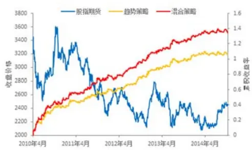
表 混合策略样本外表现

| 年化收益率 | 21.0% |
| --- | --- |
| 最大回撤率 | -3.58% |
| 胜率 | 51.2% |
| 单笔交易收益率 | 0.12% |

分析师： 张超 S0260514070002

020-87555888-8646

zhangchao@gf.com.cn

## 相关研究：

经验模态分解下的日内趋势2014-03-31交易策略

## 一、交易策略概述

## （一）基本思想

从任一交易周期来看，市场行情都处在趋势、震荡这两种情况中。趋势和震荡是辩证的、可以相互转化的。如果选取小的时间周期，原来的震荡行情可以分解为多个不同的趋势；而如果选取大的周期，原来的趋势会和新的趋势联合组合成周期较大的震荡行情。趋势与趋势之间相连接的部分，也就是行情突破原来的状态、逐步成为新的趋势的过程，叫做反转。

我们在 2014 年上半年提出了基于经验模态分解的股指期货日内趋势交易策略（Empirical Mode Decomposition Trading，简称 EMDT）。该策略在每个交易日开盘之后一段时间对市场行情进行分析，通过经验模态分解来计算股价波动成分和趋势成分的信号标准差之比的对数，即“对数波动能量比”。换句话说，就是估计当日开盘之后股价震荡和趋势的能量之比，并据此来推断股价在全天的震荡和趋势的能量之比。如果该能量比的值较小，则认为股价的趋势较强，开仓进行趋势交易；如果该能量比的值较大，则认为股价的趋势较弱，以震荡为主，不进行交易。

如果股价震荡强烈，说明市场双方激烈角力，股价在一定范围内反复波动。能否从这种震荡行情中进行交易，获取利润呢？从震荡行情中盈利的关键在于反转时机的识别。如果能够准确把握市场的反转行情，而且反转行情的幅度足够补偿交易成本和错判时的交易损失的话，我们就可以在趋势策略开仓条件不满足的时候，打开另一扇盈利之门。本报告提供了一种在强震荡行情中获取利润的思路。当经验模态分解的“对数波动能量比”较大时，股市以震荡为主，本策略将寻找适当的反转点，进行反转建仓。

## （二）与 EMDT 趋势策略的关系

本篇报告主要介绍的策略为基于经验模态分解的日内反转交易策略，为了和此前的 EMDT 相区别，可以简记为 EMDRT（Empirical Mode Decomposition ReversionTrading）。趋势策略 EMDT是在对数波动能量比比较小的时候，顺势建仓，获取利润；与之相对，反转策略 EMDRT是在对数波动能量比比较大的时候，寻找适当的反转点，反转建仓。因此，EMDRT反转策略是 EMDT趋势策略的补充，在 EMDT不进行交易的交易日建仓交易。

反转策略可以和趋势策略混合起来使用，组成加强版的 EMD趋势-反转策略，如图 1所示。如果对数波动能量比小于阈值 1（Threshold1，我们上篇报告中采用 2010年和 2011年的平均值作为判断趋势策略建仓的阈值，本报告中的混合策略依旧采用这个阈值作为趋势策略建仓的条件），则进行趋势策略交易；如果对数波动能量比大于阈值 2（Threshold2，且 Threshold2> Threshold1），则运行反转策略，寻找适当的反转时机并进行交易。

图1：基于EMD的趋势策略和反转策略的混合策略示意图
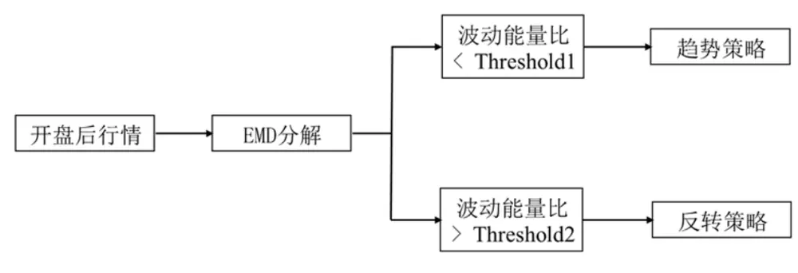
数据来源：广发证券发展研究中心

## 二、交易模型介绍

## （一）EMDT 趋势策略回顾

我们在 2014 年 3 月份提出了基于经验模态分解的股指期货日内趋势交易策略，即 EMDT策略。该策略在每个交易日开盘之后 41分钟，即上午 9：56，对市场行情进行分析，通过经验模态分解来计算股价波动成分和趋势成分的信号标准差之比的对数，即“对数波动能量比”：

$$
R=\ln\frac{\mathrm{std}\{s(t)-r_n(t)\}}{\mathrm{std}\{r_n(t)\}}\tag{1}
$$

其中分子为短期波动序列的标准差，分母为趋势项序列的标准差，ln( )• 为自然对数。

将计算出来的对数波动能量比与阈值Threshold1(采用2010年和2011年的平均值作为阈值)进行比较。如果 R < Threshold1，则认为股价的趋势较强，开仓进行趋势交易；如果 R ≥ Threshold1，则认为股价的趋势较弱，以震荡为主，不进行交易。对数波动能量比的值如图 2所示。

建仓多空方向取决于建仓时刻 $t_{s}$ 的股指期货价格和开盘时刻 $t_{0}$ 的股指期货价格大小，即

$$
Signal=\left\{\begin{aligned}1&\quad if\quad p(t_s)>p(t_o)\\-1&\quad if\quad p(t_s)<p(t_o)\end{aligned}\right.\tag{2}
$$

其中 1代表开多仓，-1代表开空仓。

该策略在样本外（2012年以来）至今（2014年 10月 22日）沪深 300股指期货上的累积收益率为 50.1%，即年化收益率为 17.3%，最大回撤为-3.54%（按照单利计算，不计杠杆，双边交易成本为 0.02%）。具体指标如表 1所示。

图2：对数波动能量比R及其在2010~2011年的均线
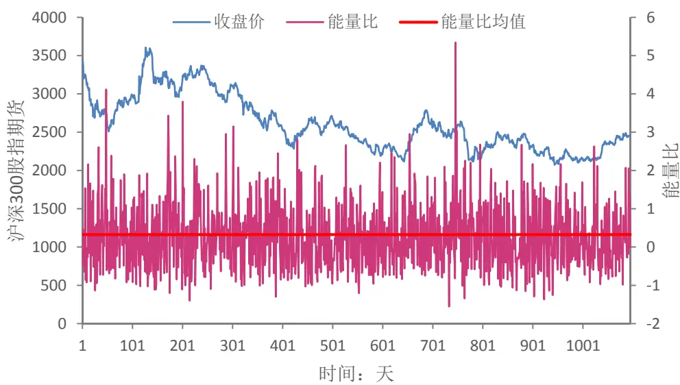
数据来源：广发证券发展研究中心，天软科技

表 1：EMDT 趋势交易策略 2012 年以来的表现

| 考察指标 | 样本外（2012年以来） |
| --- | --- |
| 累积收益率 | 50.1% |
| 年化收益率 | 17.3% |
| 交易总次数 | 402 |
| 获胜次数 | 192 |
| 失败次数 | 210 |
| 胜率 | 47.8% |
| 单次交易平均收益率 | 0.12% |
| 单次获胜平均收益率 | 0.83% |
| 单次失败平均亏损率 | -0.52% |
| 盈亏比 | 1.59 |
| 最大回撤 | -3.54% |
| 最大连胜次数 | 5 |
| 最大连亏次数 | 4 |

数据来源：广发证券发展研究中心，天软科技

EMDT 趋势策略仅在开盘后趋势强烈的交易日开仓交易；如果开盘后趋势不强，市场的主要状态是震荡，则不进行任何交易操作。本报告研究的是在震荡强烈的市场中，如何通过识别市场的反转进行盈利。该策略可以作为 EMDT 趋势策略的补充。在研究该策略之前，首先回顾一下经验模态分解的基本内容。

## （二）经验模态分解模型算法

经验模态分解（Empirical Mode Decomposition，简称 EMD）方法是由美国航空航天局（NASA）黄锷院士提出的一种处理非平稳和非线性信号的分析方法。与一般的信号处理方法不同，EMD是一种自适应的分析方法，即依据数据自身的时间尺度特征来进行信号分解。一经提出，EMD就在不同的工程领域得到了成功的应用，如在语音信号处理、海洋、大气、天体观测资料与地震记录分析、机械故障诊断、密频动力系统的阻尼识别以及大型土木工程结构的模态参数识别方面。

经验模态分解假设任何复杂的信号都是由一些不同的“波动项”和一个“趋势项”组成。这些波动项被称为本征模态函数（IMF）或者内禀模态函数。即复杂信号

$$
s(t)=\sum_{i=1,2,\ldots n}IMF_{i}(t)+r_{n}(t)\tag{3}
$$

本征模态函数为满足如下两个条件的函数：

1、函数的局部极大值以及局部极小值的数目之和必须与零交越点(ZeroCrossing，信号改变正负号的点)的数目相等或是最多只能差 1，也就是说一个极值后面必需马上接一个零交越点。

2、在任何时间点，局部最大值所定义的上包络线与局部极小值所定义的下包络线，取平均要接近于零。

满足本征模态函数条件的信号，在任一时刻的瞬时频率是唯一的，但是不同时刻的瞬时频率可以不一致，而且不同时刻的信号波动幅度可能不一致，如图3所示。大家熟悉的正弦信号波动的幅度固定，频率单一，是一种特殊的本征模态函数。

图3：本征模态函数示意图
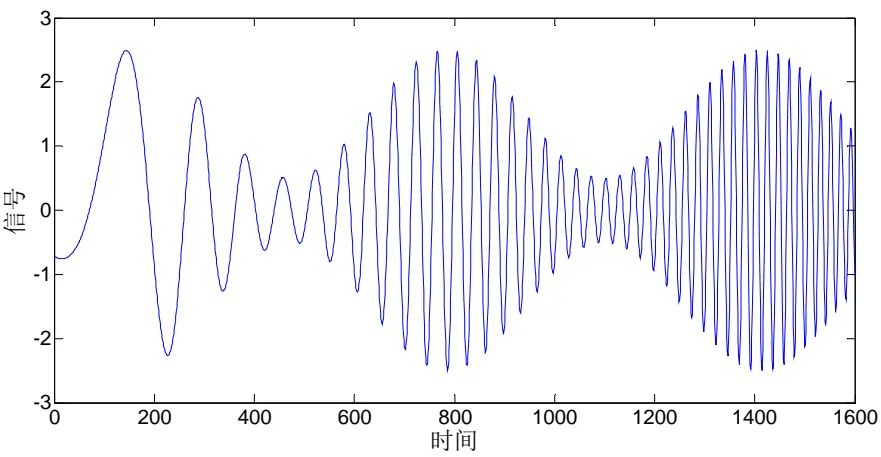
数据来源：广发证券发展研究中心

经验模态分解的过程是一个不断从信号中提取出本征模态函数，直到信号仅保留趋势项的过程。以图 4所示为例，其分解过程如下所示：

输入：原始信号s(t)，如图 4A所示。

输出：本征模态函数 $IMF_{1},IMF_{2},\ldots,IMF_{n}$ 和趋势项 $r_{n}(t)$

步骤 1：找出s(t)中的所有局部极大值以及局部极小值，如图 4B，红色和绿色

识别风险，发现价值

的依次是极大值点和极小值点；

步骤 2：利用三次样条插值函数，分别将局部极大值串连成信号的上包络线，将局部极小值串连成下包络线，如图 4C；

步骤 3：求出上下包络线的平均值，得到包络线均值 $m_{1}(t)$ ，即图 4D中黑色粗线；

步骤 4：原始信号s(t)与均值包络线相减，得到第一个分量 $h_{1}(t)$

$$
h_{1}(t)=s(t)-m_{1}(t)\tag{4}
$$

步骤 5：检查 $h_{1}(t)$ 是否符合 IMF的条件。如果不符合，则回到步骤 1并且将 $h_{1}(t)$ 当作原始讯号，进行再次的筛选。亦即

$$
h_{2}(t)=h_{1}(t)-m_{2}(t)\tag{5}
$$

$$
h_{k}(t)=h_{k-1}(t)-m_{k}(t)\tag{6}
$$

直到 $h_{k}(t)$ 符合 IMF 的条件，即得到第一个 IMF 分量 $IMF_{1}$ ，亦即 $IMF_{1}=h_{k}(t)$ ，如图 4E所示；

步骤 6：原始讯号 $s(t)$ 减去 $IMF_{1}$ 可得到剩余量 $r_{1}(t)$ ，如图 4F 所示，表示如下式

$$
r_{1}(t)=s(t)-IMF_{1}\tag{7}
$$

步骤7：将图 $4\mathrm{F}$ 中 $r_{1}(t)$ 当作新的资料，重新执行步骤1至步骤6，得到新的剩余量 $r_{2}(t)$ 。如此重复n次，直到 $r_{n}(t)$ 为单调函数，即趋势项。

由函数的定义和分解过程可见，本征模态函数的提取是一种自适应的方法，保留了非平稳信号在不同时间尺度上的特性。如图3，分离出来的 $IMF_{1}$ 和 $r_{1}(t)$ 都是瞬时频率在不断变化的分量，这是用普通的滤波器组和离散小波变换等方法无法分离开的。

EMD算法在实现上，需要先提取出信号的局部极值点。而金融市场始终处于波动中，波动以及噪声带来了大量的局部极值，因此该方法非常适合金融数据的分析。而金融市场的数据具有很强的非线性和非平稳特性，这正是 EMD算法的优势所在。

图4：信号的本征模态函数提取示意图
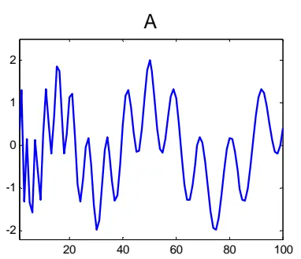

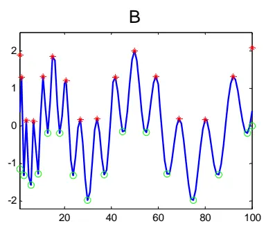

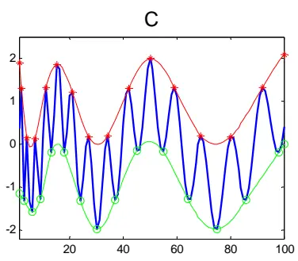

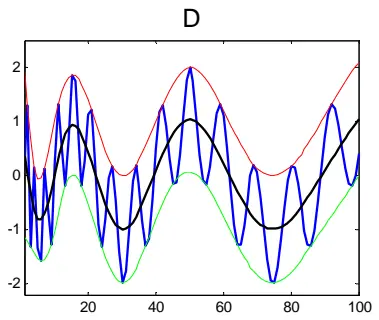
数据来源：广发证券发展研究中心

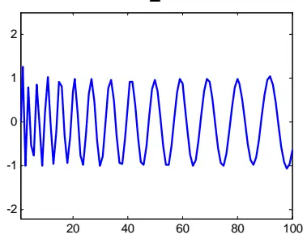

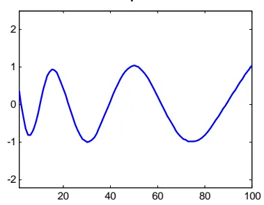

## （三）反转交易策略：枢轴点和改进的枢轴点

EMDT趋势交易策略中，假设第 k个交易日计算获得的对数波动能量比为 $R_{k}$ ，则第k日趋势交易策略的建仓条件是

$$
R_{k}<R_{\mathrm{mean}}\tag{8}
$$

其中 $Threshold1=R_{\mathrm{mean}}$ 为沪深 300股指期货的平均对数波动能量比，实证分析中我们采用 2011年以前的平均值来替代。

本报告考虑的是在 $R_{k}>Threshold2$ 时的反转交易（其中判断阈值 Threshold2≥ Threshold1）。本报告中采用的是一种类似枢轴点（PivotPoint）的交易策略。

枢轴点策略是一套根据近期价格波动极点计算出来的阻力支撑体系，多用于日内交易。基本的枢轴点是一个 7 点系统：包含轴心 Pivot，3 个阻力位 r1、r2 和 r3，以及 3 个支撑位 s1、s2 和 s3。目前广泛使用的枢轴点系统包含 13 个点，即多了 6个中心价格 rm1、rm2、rm3、sm1、sm2和 sm3。这些价格由前一个交易日的行情价格决定，常用的计算方法如表 2 所示。其中，H、L 和 C 分别为前一个交易日的最高价、最低价和收盘价。

表 2：枢轴点不同价位的计算

| 价格点 | 计算公式 |
| --- | --- |
| 枢轴点 Pivot | (H+L+C)/3 |
| 阻力位r1 | 2*Pivot - L |
| 阻力位r2 | Pivot + (r1-s1) |
| 阻力位r3 | H + 2*(Pivot-L) |
| 支撑位 s1 | 2*Pivot - H |
| 支撑位 s2 | Pivot - (r1-s1) |
| 支撑位s3 | L + 2*(Pivot-H) |
| 阻力中间价 rm1 | (Pivot+r1)/2 |
| 阻力中间价rm2 | (r1+r2)/2 |
| 阻力中间价rm3 | (r2+r3)/2 |
| 支撑中间价 sm1 | (Pivot+s1)/2 |
| 支撑中间价 sm2 | (s1+s2)/2 |
| 支撑中间价 sm3 | (s2+s3)/2 |

数据来源：广发证券发展研究中心

在枢轴点系统中，认为轴心Pivot具有吸引作用，大部分时间价格是在r1和s1之间围绕轴心运动，但是运动可能是没有规律的。如果往上突破阻力位，则认为股价有向上趋势，可以开仓做多；如果往下突破支撑位，则认为股价有向下趋势，可以开仓做空；如果价格往下回到阻力位下方，则认为股价将向下回复到r1~s1区间，可以开仓做空；如果往上回到支撑位上方，则认为股价将向上回复到r1~s1区间，可以开仓做多。但是，枢轴点本身只是提供盘中应该关注的支撑和阻力价位，并没有具体规定的交易策略。参考R‐Breaker策略的突破‐反转思路，可以设置如图5的枢轴点交易策略。当价格往上突破r3时，认为有向上的趋势，做多；当价格往下突破s3时，认为有向下的趋势，做空；当价格从r2上方往下跌至rm2以下，认为价格向下反转，做空（rm2为确认反转的点）；当价格从s2下方往上升至sm2以上，认为价格向上反转，做多（sm2为确认反转的点）。在设置止损线r=0.006的情况下，这一策略自沪深300股指期货上市以来的累积收益率为66.4%，最大回撤为‐7.6%（按照单利计算，不计杠杆）。

本报告中的反转策略是在每个交易日开盘之后41分钟，即上午9：56，判断出开盘之后股指期货价格震荡强烈然后进行的交易策略。因而，相对于普通的枢轴点策略，该策略有如下改进的地方：

（1）枢轴点计算公式中，H和L分别为早盘震荡区间的最高价和最低价，本报告中采用15秒收盘行情的最高价和最低价；

（2）枢轴点计算公式基本上与表2相同，只是轴心修改为Pivot=(H+L)/2；

（3）由于早盘已经判断该日为震荡强烈的市场，因此不运行趋势策略，只运行反转策略，如图6所示。

图5：枢轴点突破-反转交易策略
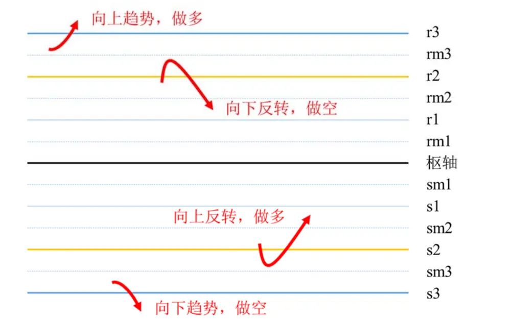
数据来源：广发证券发展研究中心

图6：经验模态分解下的枢轴点反转交易策略
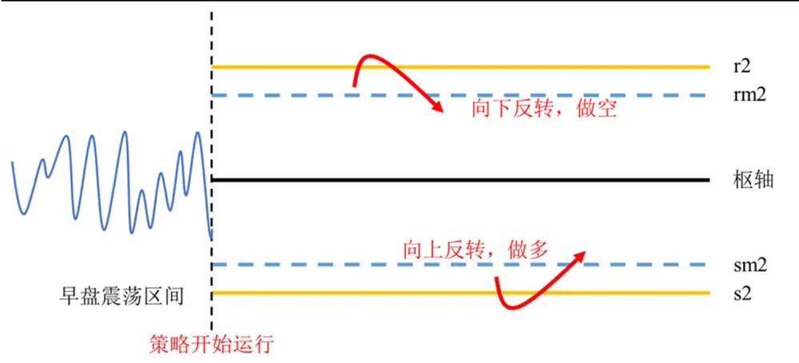
数据来源：广发证券发展研究中心

止损策略方面，本策略采用最简单的固定比例r止损。当浮动亏损大于r时，立即进行止损平仓；否则收盘平仓。本策略不特意设置止盈策略，仅当出现反向交易信号时，采取止盈策略先平仓，然后反向建仓；否则收盘平仓。例如，在进行向上反转做多股指期货时，如果股价突破阻力位r2，然后又跌至rm2以下，则平掉多仓，并建立空仓。

## 三、实证分析

## （一）参数选取与优化

数据选取：实证选取股指期货当月合约自 2010年 4月 16日至 2014年 10月 11日的 15秒钟行情数据。

参数优化：判断震荡程度的阈值Threshold2是需要进行优化的参数。在实证中，首先通过对前面两年数据（样本内）的分析，获得最佳的参数，然后用最近两年多时间的数据进行样本外验证。由于 $R_{\mathrm{mean}}$ 为样本内的对数波动能量比（已知,实证分析中该值大于 0）且 $Threshold2\geq R_{\mathrm{mean}}$ ，因此，可令 $Threshold2=\lambda R_{\mathrm{mean}}$ ，需要优化的参数为λ且λ≥1。当λ越大时，反转策略的开仓条件越严格。本次实证考虑从1到4的变化范围，参数选取的间隔为0.1。当λ>4时，由于满足条件的交易日过少，不再进行考虑。

样本内数据：2010年至 2011年行情数据。我们先用 2010年数据和 2011年数据计算出最优判断阈值 $Threshold2=\lambda_{opt}R_{mean}$

样本外数据：2012年以来行情数据。

策略评价指标：我们选取如下表。

表 3：交易策略评价体系

| 考察指标 | 说明 |
| --- | --- |
| 累积收益率 | 模拟交易期末的累积收益率（单利计算） |
| 年化收益率 | 累积收益率折算成的年化收益率 |
| 交易总次数 | 总交易次数（自开仓至平仓为一个完整的交易周期） |
| 获胜次数 | 单次交易收益率大于0的次数（含交易成本） |
| 失败次数 | 单次交易收益率小于0的次数（含交易成本） |
| 胜率 | 获胜次数/交易总次数×100% |
| 单次获胜收益率 | 获胜交易的收益率算术平均值 |
| 单次失败亏损率 | 失败交易的收益率算术平均值 |
| 盈亏比 | 单次获胜平均收益率除以单次失败平均亏损率的绝对值 |
| 最大回撤 | 模拟交易资金自最高点缩水的最大幅度 |
| 年化收益/最大回撤比 | 年化收益率与最大回撤绝对值的比值 |
| 最大连胜次数 | 最大连续收益率大于0的交易次数 |
| 最大连亏次数 | 最大连续收益率小于0的交易次数 |

数据来源：广发证券发展研究中心

这里不考虑杠杆，不计冲击成本，采用双边万分之 2的手续费，止损点设置为r •0.006。

对于样本内的数据，不同参数 λ下的累积收益率与最大回撤如表 4所示。

识别风险，发现价值

表 4：不同参数下的反转策略在样本内的表现

| 参数λ | 累积收益率 | 最大回撤 | 年化收益/ 最大回撤比 | 参数λ | 累积收益率 | 最大回撤 | 年化收益/ 最大回撤比 |
| --- | --- | --- | --- | --- | --- | --- | --- |
| 1 | 21.4% | -5.80% | 2.16 | 2.6 | 15.3% | -6.32% | 1.42 |
| 1.1 | 19.7% | -6.36% | 1.82 | 2.7 | 13.6% | -6.77% | 1.18 |
| 1.2 | 19.3% | -6.39% | 1.76 | 2.8 | 15.4% | -6.02% | 1.50 |
| 1.3 | 18.5% | -7.94% | 1.36 | 2.9 | 15.5% | -5.76% | 1.57 |
| 1.4 | 16.8% | -8.06% | 1.22 | 3 | 15.6% | -5.77% | 1.58 |
| 1.5 | 15.9% | -7.64% | 1.22 | 3.1 | 14.1% | -5.77% | 1.43 |
| 1.6 | 15.9% | -7.64% | 1.22 | 3.2 | 14.1% | -5.35% | 1.54 |
| 1.7 | 17.6% | -7.50% | 1.37 | 3.3 | 14.8% | -4.71% | 1.83 |
| 1.8 | 16.2% | -6.03% | 1.57 | 3.4 | 14.4% | -4.60% | 1.83 |
| 1.9 | 19.6% | -5.38% | 2.13 | 3.5 | 18.5% | -3.83% | 2.83 |
| 2 | 20.7% | -5.38% | 2.25 | 3.6 | 19.3% | -3.83% | 2.96 |
| 2.1 | 19.6% | -5.61% | 2.04 | 3.7 | 17.4% | -3.83% | 2.66 |
| 2.2 | 18.2% | -6.45% | 1.65 | 3.8 | 16.6% | -3.83% | 2.54 |
| 2.3 | 17.9% | -6.45% | 1.63 | 3.9 | 18.1% | -3.01% | 3.53 |
| 2.4 | 16.3% | -6.51% | 1.47 | 4 | 16.2% | -3.02% | 3.15 |
| 2.5 | 16.7% | -6.32% | 1.55 |  |  |  |  |

数据来源：广发证券发展研究中心，天软科技

根据收益回撤比最大的优化目标,从样本内考察结果可以得出结论，选取$\lambda_{\mathrm{opt}}=3.9$ ，即当 $Threshold2=3.9R_{\mathrm{mean}}$ 时，样本内累积收益率为 18.1%，折算成年化收益率为 10.6%，最大回撤为-3.0%，效果最优，此时年化收益/最大回撤的比值为3.53。而且，该策略的最优参数稳定性好，当• 在 3.5 到 4 之间时，年化收益/最大回撤的比值均大于 2.5。

样本内不同参数下的单次交易平均收益率如图 7 所示，可见，当反转策略的启动阈值 Threshold2越高时，单次交易的平均收益率越高。这也进一步证实了通过经验模态分解对股市震荡行情判断的有效性和震荡行情在整个交易日的持续性。

图7：反转策略在样本内的单次交易平均收益率
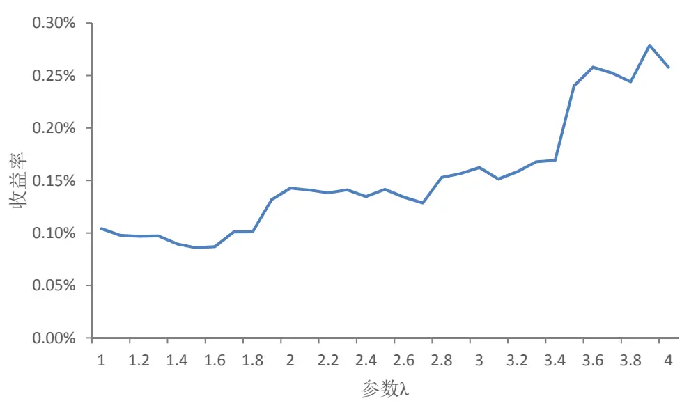
数据来源：广发证券发展研究中心，天软科技

本篇报告选择反转策略的启动阈值为 Threshold R 2 3.9 • ，即在开盘之后41分钟对早盘价格序列进行经验模态分解，计算对数波动能量比R，当R ≥ Threshold2时，运行反转策略。策略在样本内和样本外的表现如表5所示。从2012年以来，策略的累积收益率为10.8%，最大回撤为‐1.3%。反转策略与靠亏小赚大盈利的趋势策略不同，盈亏比不一定大，但是判断准确度较高，胜率在50%以上。

表 5：反转交易策略表现

| 考察指标 | 样本内（2010和2011年） 样本外（2012年以来） |
| --- | --- |
| 累积收益率 | 18.1% 10.8% |
| 年化收益率 | 10.6% 3.7% |
| 交易总次数 | 65 71 |
| 获胜次数 | 38 50 |
| 失败次数 | 27 21 |
| 胜率 | 58.5% 70.4% |
| 单次获胜收益率 | 0.83% 0.42% |
| 单次失败亏损率 | -0.50% -0.49% |
| 单次交易收益率 | 0.28% 0.15% |
| 盈亏比 | 1.66 0.86 |
| 最大回撤 | -3.01% -1.27% |
| 年化收益/最大回撤比 | 3.53 2.94 |
| 最大连胜次数 | 6 12 |
| 最大连亏次数 | 4 3 |

数据来源：广发证券发展研究中心，天软科技

反转策略有可能在一天之内进行多次交易，以 2012 年 10 月 31 日的行情为例，如图 8所示。在开盘之后 76分 15秒，股价向上穿过 sm2，建仓做多（图中 A点）；在开盘之后 104分 45秒，股价向下穿过 rm2，有向下反转的行情，因此，先平掉多仓（扣除万二手续费后盈利 0.32%），然后建仓做空（图中B点）；在开盘之后 118分15秒，股价向上穿过 sm2，平掉空仓（盈利 0.29%），然后建仓做多（图中 C点）；在开盘之后 142分 30秒，股价向下穿过 rm2，平掉多仓（盈利 0.29%），然后建仓做空（图中 D点）；然后股价往上突破 r2，但并未突破止损位置；此后股价向下反转；在开盘之后 183分 45秒（已经扣除午盘休市时间），股价向上穿过 sm2，平掉空仓（盈利 0.31%），并建仓做多（图中 E点）；此后股价小幅震荡，至收盘时平仓（图中 F点，盈利 0.10%）。全天一共进行 5次完整交易，共计盈利 1.32%。整个交易日的交易明细如表 6所示。

图8：最优参数策略下单日交易明细图
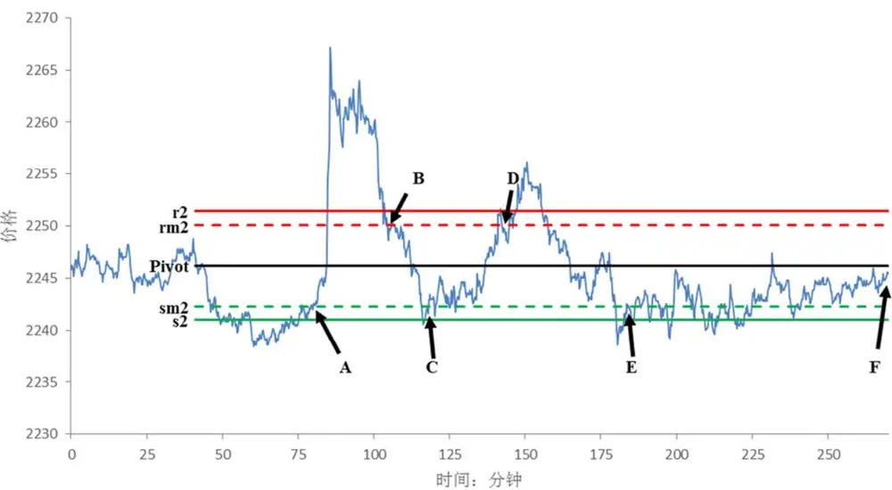
数据来源：广发证券发展研究中心，天软科技

表 6：建仓平仓点位及收益明细（2012 年 10 月 31 日）

| 建仓时间 | 平仓时间 | 建仓位置 | 建仓时股价 | 平仓时股价 | 建仓方向 | 交易盈亏 | 平仓备注 |
| --- | --- | --- | --- | --- | --- | --- | --- |
| 10:31:15 | 10:59:45 | A | 2242.4 | 2250 | 多头 | 0.32% | 平仓并反向建仓 |
| 10:59:45 | 11:13:15 | B | 2250 | 2243 | 空头 | 0.29% | 平仓并反向建仓 |
| 11:13:15 | 13:07:30 | C | 2243 | 2250 | 多头 | 0.29% | 平仓并反向建仓 |
| 13:07:30 | 13:48:45 | D | 2250 | 2242.6 | 空头 | 0.31% | 平仓并反向建仓 |
| 13:48:45 | 15:15:00 | E | 2242.6 | 2245.4 | 多头 | 0.10% | 收盘平仓 |

数据来源：广发证券发展研究中心，天软科技

最优策略在全样本的累积收益曲线如图 9所示。沪深 300股指期货上市以来，累积收益率为28.9%，最大回撤为-3.0%。单次交易收益率的频率直方图如图10所示。单次交易的最大收益率为 3.72%，由于止损机制的存在，最大亏损率为-0.95%。单次交易持仓时间的分布如图 11所示。可以看到，反转策略的持仓时间不定，有开仓后不久即平仓的，也有持仓至收盘时刻的。

图9：最优参数策略下反转策略的累积收益曲线
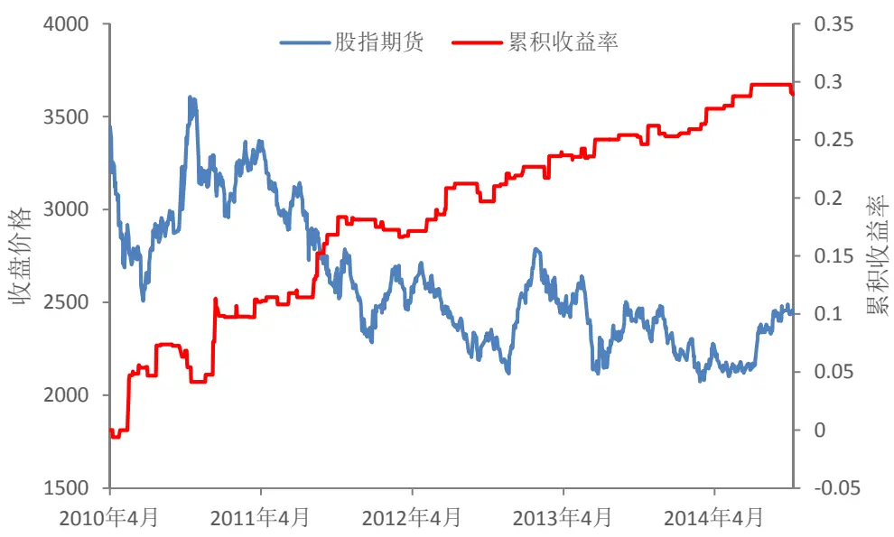
数据来源：广发证券发展研究中心，天软科技

图10：最优参数策略下单次交易收益率分布
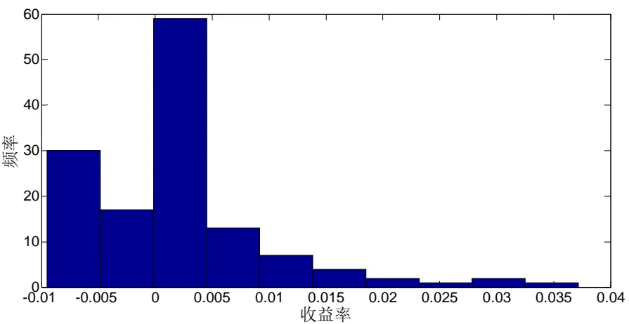
数据来源：广发证券发展研究中心，天软科技

图11：最优参数策略下单次交易持仓时间分布
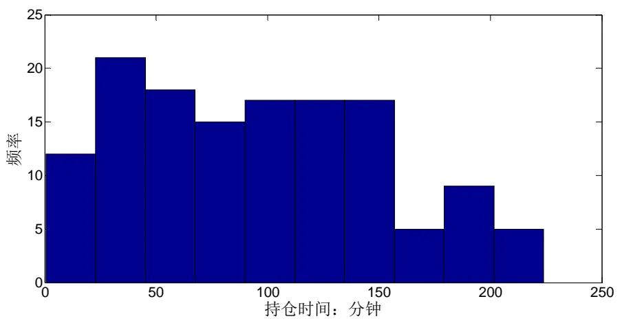
数据来源：广发证券发展研究中心，天软科技

## （二）基于经验模态分解的趋势-反转混合策略

反转策略具有比较稳定的盈利（样本内外的最大回撤值都比较小），样本外单次交易平均收益率在 0.15%左右（已经扣除万二的双边交易手续费），但是由于交易机会不多，自股指期货上市以来的 1095个交易日内总计执行次数不到 140次，因此累积收益有限。但是，该反转策略可以作为基于经验模态分解的趋势策略 EMDT的一个补充，和 EMDT趋势策略一起使用，组成趋势-反转混合策略。

该趋势-反转混合策略的流程如图1所示。每个交易日在开盘41分钟后通过经验模态分解计算对数波动能量比R，如果R<Threshold1，则认为趋势比较强，通过比较此刻价格与开盘价格，进行趋势交易；如果R>Threshold2，则认为震荡比较强，进入反转交易模式，通过改进的枢轴点算法，在适当的时刻，进行反转建仓。因此，趋势交易和反转交易两种策略彼此之间不相互影响，该交易日具体执行何种策略取决于经验模态分解的结果。

由于趋势策略（具体见我们的上一篇报告）和反转策略都采取了2010到2011年的股指期货行情作为样本内数据，因此，对趋势-反转混合策略的考察也按照时间分为样本内和样本外两个阶段，其中，2012年以来的行情作为样本外数据。

在样本内，趋势策略、反转策略和趋势-反转混合策略的表现如表7所示。可以看到，混合策略在2010年到2011年不仅提升了年化收益率（趋势策略的年化收益率为32.2%，反转策略的年化收益率为10.6%，而混合策略的年化收益率为42.8%），同时也减小了趋势策略的最大回撤，使得策略的年化收益/最大回撤比有了明显提高。

表 7：混合交易策略样本内的表现

| 考察指标 | 趋势策略 | 反转策略 | 混合策略 |
| --- | --- | --- | --- |
| 累积收益率 | 55.7% | 18.1% | 73.8% |
| 年化收益率 | 32.2% | 10.6% | 42.8% |
| 交易总次数 | 219 | 65 | 284 |
| 获胜次数 | 99 | 38 | 137 |
| 失败次数 | 120 | 27 | 147 |
| 胜率 | 45.2% | 58.5% | 48.2% |
| 单次交易收益率 | 0.26% | 0.28% | 0.26% |
| 最大回撤 | -3.37% | -3.01% | -3.28% |
| 年化收益/最大回撤比 | 9.54 | 3.53 | 13.05 |

数据来源：广发证券发展研究中心，天软科技

在样本外，趋势策略、反转策略和趋势-反转混合策略的表现如表8所示。可以看到，自2012年以来，混合策略提高了年化收益率（趋势策略的年化收益率为17.3%，反转策略的年化收益率为3.7%，而混合策略的年化收益率为21.0%）。虽然最大回撤相对于趋势策略来说略有增大（从趋势策略的-3.54%变为-3.58%），但是策略的年化收益/最大回撤比也有了提高。

表 8：混合交易策略样本外的表现

| 考察指标 | 趋势策略 | 反转策略 | 混合策略 |
| --- | --- | --- | --- |
| 累积收益率 | 50.1% | 10.8% | 60.8% |
| 年化收益率 | 17.3% | 3.7% | 21.0% |
| 交易总次数 | 402 | 71 | 473 |
| 获胜次数 | 192 | 50 | 242 |
| 失败次数 | 210 | 21 | 231 |
| 胜率 | 47.8% | 70.4% | 51.2% |
| 单次交易收益率 | 0.12% | 0.15% | 0.12% |
| 最大回撤 | -3.54% | -1.27% | -3.58% |
| 年化收益/最大回撤比 | 4.89 | 2.94 | 5.87 |

数据来源：广发证券发展研究中心，天软科技

自沪深300股指期货上市以来，混合策略的累积收益曲线如图12所示。趋势策略的累积收益率为105.7%，最大回撤为-3.54%；与之相对，混合策略的累积收益率为134.6%，最大回撤为-3.58%。

图12：趋势-反转混合策略的累积收益曲线
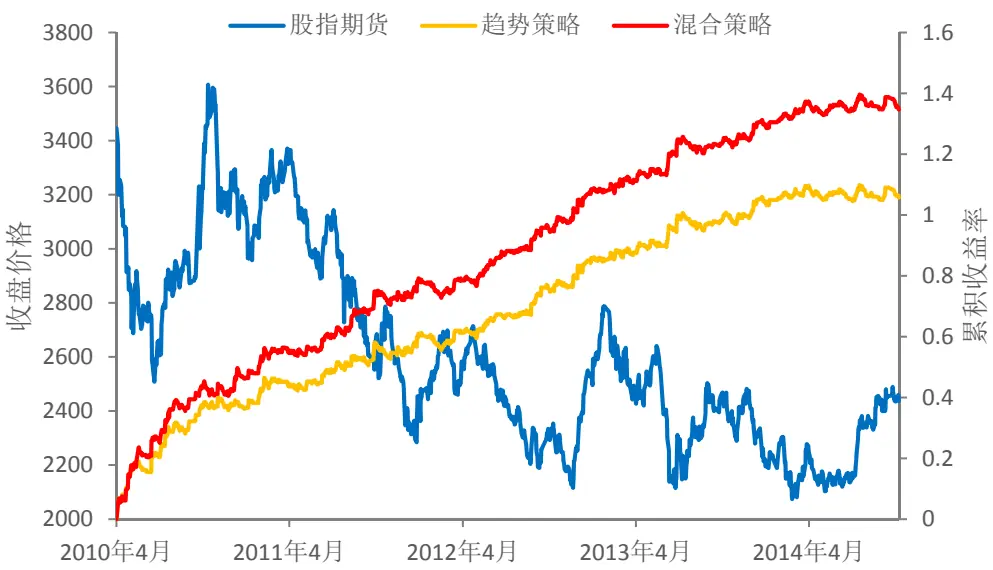
数据来源：广发证券发展研究中心，天软科技

## 四、总结与讨论

本篇报告从基于经验模态分解的股指期货日内趋势交易出发，从另一方面着手，介绍了基于经验模态分解的日内反转交易策略。趋势交易策略适用于股价的日内趋势较强的场合，而在另一种情况下，股价的震荡较强，趋势策略不再适用，可以考虑通过反转策略盈利。

本报告中的反转策略是一种类似枢轴点的策略，在市场震荡强烈的情况下，通过对开盘之后一段时间内的震荡情况进行分析，计算出股价震荡的轴心、支撑位和阻力位，从而确定了反转行情的识别规则。当反转行情满足时，就按照反转的方向进行建仓。自2010年股指期货上市以来，该策略在总共136次交易中，共计获利28.9%，最大回撤-3.0%。

该反转策略可以和此前我们提出的 EMDT趋势策略组成趋势-反转混合策略。通过经验模态分解，可以将股指期货价格时间序列中的短周期波动和趋势分离开来。根据短周期波动和趋势的能量对比，来确定当前信号的趋势是否明显。在趋势比较强的交易日，根据趋势的方向进行顺势建仓，即执行 EMDT趋势策略；而在震荡比较强的交易日，执行反转交易策略，在适当的反转位置进行开仓交易。混合策略自从2010年股指期货上市以来，累积收益率为 134.6%，折算成年化收益率为 29.3%，最大回撤为-3.58%。以上都按照单利进行计算，没有计入杠杆，双边交易费用为 0.02%。

## 风险提示

策略模型并非百分百有效，市场结构及交易行为的改变以及类似交易参与者的

增多有可能使得策略失效。

## 广发证券—行业投资评级说明

买入： 预期未来12个月内，股价表现强于大盘10%以上。

持有： 预期未来12个月内，股价相对大盘的变动幅度介于-10%～+10%。

卖出： 预期未来 12 个月内，股价表现弱于大盘 10%以上。

## 广发证券—公司投资评级说明

买入： 预期未来12个月内，股价表现强于大盘15%以上。

谨慎增持： 预期未来12个月内，股价表现强于大盘5%-15%。

持有： 预期未来12个月内，股价相对大盘的变动幅度介于-5%～+5%。

卖出： 预期未来12个月内，股价表现弱于大盘5%以上。

## 联系我们

| 地址 | 广州市 广州市天河北路183号 | 深圳市 深圳市福田区金田路4018 | 北京市 北京市西城区月坛北街2号 | 上海市 |
| --- | --- | --- | --- | --- |
|  | 大都会广场5楼 | 号安联大厦 15 楼 A 座 03-04 | 月坛大厦18层 | 震旦大厦18楼 |
| 邮政编码 | 510075 | 518026 | 100045 | 200120 |
| 客服邮箱 | gfyf@gf.com.cn |  |  |  |
| 服务热线 | 020-87555888-8612 |  |  |  |

## 免责声明

广发证券股份有限公司具备证券投资咨询业务资格。本报告只发送给广发证券重点客户，不对外公开发布。

本报告所载资料的来源及观点的出处皆被广发证券股份有限公司认为可靠，但广发证券不对其准确性或完整性做出任何保证。报告内容仅供参考，报告中的信息或所表达观点不构成所涉证券买卖的出价或询价。广发证券不对因使用本报告的内容而引致的损失承担任何责任，除非法律法规有明确规定。客户不应以本报告取代其独立判断或仅根据本报告做出决策。

广发证券可发出其它与本报告所载信息不一致及有不同结论的报告。本报告反映研究人员的不同观点、见解及分析方法，并不代表广发证券或其附属机构的立场。报告所载资料、意见及推测仅反映研究人员于发出本报告当日的判断，可随时更改且不予通告。

本报告旨在发送给广发证券的特定客户及其它专业人士。未经广发证券事先书面许可，任何机构或个人不得以任何形式翻版、复制、刊登、转载和引用，否则由此造成的一切不良后果及法律责任由私自翻版、复制、刊登、转载和引用者承担。