# 期权对标的指数走势的预测性分析

## 另类交易策略系列之二十

## Table_Sum ary报告摘要 ：

## 期权市场对现货市场具有预测能力

期权市场的动向对现货市场有预示作用，原因有二：一、具有内幕消息等额外信息的投资者对现货市场有着先于他人的准确判断，这一类投资者往往会选择杠杆比例较现货市场更高的期权市场进行投资，以最大化收益；二、期权市场反映投资者对现货市场的预期，一方面投资者的预期与即将实现的未来可能不存在太大的偏差，另一方面金融市场又具有一定自我实现倾向，故现货市场的未来走势常常与期权市场投资者的预期相符。在本篇报告中，我们通过美国、韩国及中国香港的期权市场数据，实证分析了两类期权指标对于标的指数的预测有效性。

## 基于期权成交量看涨-看跌比率对指数 T+1预测的交易策略

成交量是反映市场动态的有效指标，因此我们采用期权的成交量对标的现货市场进行预测。我们分析了期权市场成交量变化与现货市场走势的关系，构造出期权成交量看涨-看跌比率指标。基于指标在时间上独立同分布，我们利用对于出现概率分布中极端值的判定，设计了基于期权对标的指数 T+1 预测的交易策略。在交易策略的回测中，样本内优化得到的参数应用于样本外具有良好表现，这证实了期权成交量对标的指数确实具有预测能力。

## 基于期权隐含波动率看涨-看跌比率对指数 T+1预测的交易策略

我们分析了期权市场隐含波动率变化与现货市场走势的关系，构造出期权隐含波动率看涨-看跌比率指标。基于指标在时间上独立同分布，我们利用对于出现概率分布中极端值的判定，设计了基于期权对标的指数 T+1预测的交易策略。在策略的回测中，样本内最优化参数在样本外仍然表现良好。由此，我们有理由认为指数期权的隐含波动率对于标的指数具有良好的预测能力。

## 基于时间序列分析对策略理论基础的进一步实证

期权成交量看涨-看跌比率和期权隐含波动率看涨-看跌比率服从不同时间上的独立同分布，以及期权市场较现货市场具有先行性，是我们设计策略的两个重要前提。通过时间序列分析中的Phillips-Perron 检验，我们证实了期权成交量看涨-看跌比率序列和期权隐含波动率看涨-看跌比率序列的平稳性；通过格兰杰因果关系检验，我们证实了期权成交量看涨-看跌比率和期权隐含波动率看涨-看跌比率是标的指数的格兰杰原因。经过验证，策略有效的前提假设是成立的。

表 不同期权指标的预测能力

|  | 成交量比 | 隐含波动率比 |
| --- | --- | --- |
| 美国市场年化R | 37.97% | 21.83% |
| 美国市场胜率 | 58.69% | 59.86% |
| 美国市场盈亏比 | 1.36 | 1.07 |
| 韩国市场年化R | 28.88% | 13.66% |
| 韩国市场胜率 | 53.04% | 54.02% |
| 韩国市场盈亏比 | 1.14 | 0.99 |
| 香港市场年化R | 4.20% | 17.74% |
| 香港市场胜率 | 48.76% | 56.37% |
| 香港市场盈亏比 | 1.13 | 1.24 |

Table_Aut hor 分析师： 张超 S0260514070002

020-87555888-8646

zhangchao@gf.com.cn

## Table_Report 相关研究：

基于统计语言模型（SLM）的 2014-01-14择时交易研究

## 一、期权对现货市场的预测

## （一）概述

期权市场的动向对现货市场有预测的作用，原因有二：一、具有内幕消息等额外信息的投资者对现货市场有着先于他人的准确判断，这一类投资者往往会选择杠杆比例较现货市场更高的期权市场进行投资，以最大化收益；二、期权市场反映投资者对现货市场的预期，而一方面投资者的预期与即将实现的未来可能不存在太大的偏差，另一方面金融市场又具有一定自我实现的倾向，故现货市场的未来走势常常与期权市场投资者的预期相符。由于这两个原因，期权市场常常可以预示现货市场的走势，即期权对标的证券有的预测能力。

既然期权对现货具有预测能力，那么我们应该如何利用这种预测能力呢？首先，我们需要选取一些指标用以描述期权市场的状况，进而作为判断现货市场走势的依据。就像任何其他的金融产品一样，期权有着最基本的两个交易指标，即价格与成交量。价格与成交量可以很好地反映期权市场的动态，是简单而不失有效的描述指标，也可以成为对现货市场的预测指标。

为讨论期权对标的的预测能力，本研究报告将主要研究指数期权相关市场，从成交量和价格（隐含波动率）两个方面入手探索指数期权对标的指数走势的预测能力。

## （二）测算标的介绍

本文主要关注指数期权对指数现货的预测力，具体涉及全球三个具有影响力和代表性的指数期权：美国S&P500指数期权、韩国KOSPI200指数期权和香港HSI指数期权。

## 1、美国S&P500指数及指数期权

S&P500指数期权的标的指数为S&P500指数，即标准普尔500指数，该指数涵盖了美国500家处于行业领先地位的公司，指数值由其股价依股票总市值为权重加权构成，被广泛地认为是美国最好的宽基指数，可以很好地代表整个美国股票市场。S&P500指数期权为芝加哥期权交易所独有的指数期权，发行自1987年4月，是美国交易最为活跃的指数期权。

广义的S&P500指数期权包含整个S&P500指数期权系列产品，共包括六种产品：SPX、SPX Weeklys、SPX End-of-Month、SPXPM、mini-SPX Index Option和SPDR ETFOptions。狭义的S&P500指数期权仅指SPX，我们一般所说的S&P500指数期权就是指该期权，它也是本文接下来要研究的对象。

SPX是最传统的一种S&P500指数期权，它有如下几个特征：交割时间在每月的第三个周五的上午；合约面值大，每份合约为100倍标的指数；不提前执行（即为欧式期权）；现金交割；定价和报价透明；逐日盯市制度；由期权清算公司（OptionsClearing Corporation）保证交易的清算。

## 2、韩国KOSPI200指数及指数期权

KOSPI全称The Korea Composite Stock Price Index，即韩国综合股票价格指数，该系列指数中涵盖股票最多的指数便是KOSPI200。KOSPI200依据流动性与行业代表性等指标挑选出200家上市公司，再依其股票总市值加权股价成指数，于1994年6月15日推出。

韩国KOSPI200指数期权每份合约规模为指数乘以500000韩元，交易时间为当地9：00至15:15（最后交易日为9：00至14:50），最后交易日为合约月份的第二个周四，结算日为最后交易日的下一日，1997年7月7日始发行，为现金交割的欧式期权。

由于韩国投资者的高涨热情，KOSPI200指数期权曾多年占据世界上最大成交量衍生品的位臵。

## 3、香港HSI指数及指数期权

HSI指数，即恒生指数，由香港恒生指数有限公司于1969年11月24日编制发布，包括了金融、公用事业、地产和工商业四种产业分类中的公司，是最能反映香港股票市场动向的指标。根据指数编制规则，HSI指数涵盖的公司数目处于不断变动中，但自2013年以来其成分股公司一直稳定在50家。

HSI 指数期权的标的指数为恒生指数，合约乘数为每指数点 50港币，交易时间为 9:15 至 12:00 和 13:00 至 16:15（到期日的下午结束时间提前至 16:00），到期日为合约月份的倒数第二个工作日，是现金结算的欧式期权。HSI指数期权于1993年3月由香港交易所推出，该期权采取中心结算制度，由香港交易所的附属公司——香港期货结算有限公司负责结算，以降低交易对手的风险。

这三种指数及指数期权都是当地交易所的旗舰产品，产品自发行以来一直具有极高的关注度和可观的成交量，是各自地区极具代表性的产品。上述三种指数每日收盘价（蓝线）及其当日期权总成交量（绿线）见如下图 1，其中S&P500指数及期权展示的区间是 1995 年 3 月 15 日至 2015 年 1 月 20 日，KOSPI200 指数及期权展示的区间是 2001年 5月 7日至 2015 年1 月20 日，HSI指数及期权展示的区间是1994年 10 月 27 日至 2015 年 1 月 20 日。

应当指出的是，在这里的展示以及下文的分析和回测中，所有缺失数据都经过了以最近的上一个交易日数据的填充处理。由于缺失数据占比极少，且数据修复方法合理，分析和回测将不会收到实质影响。

图1：S&P500,KOSPI200和HSI指数日收盘价及日期权总成交量时序图
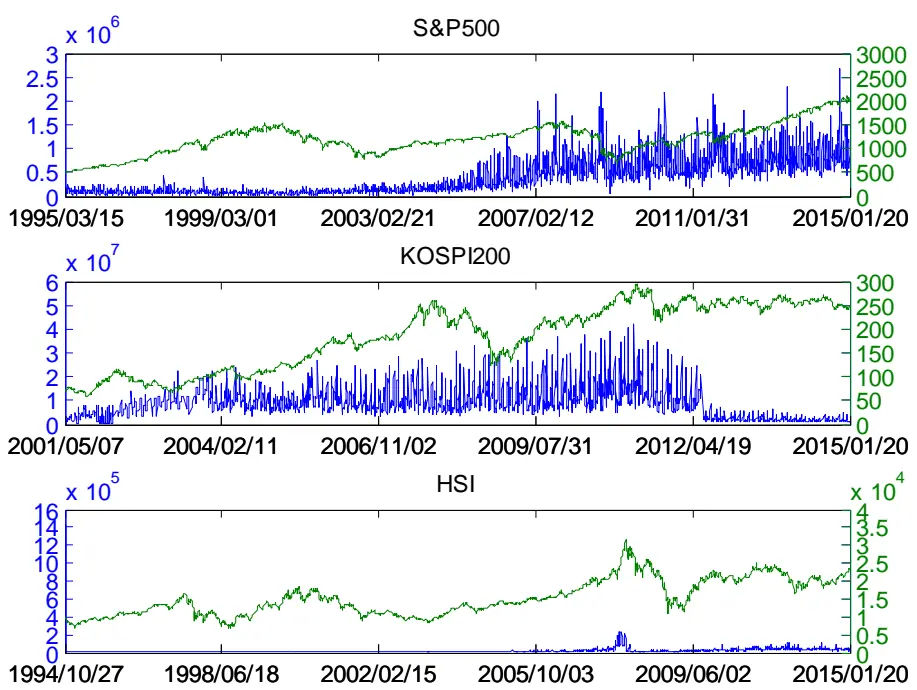
数据来源：广发证券发展研究中心，Bloomberg

## 二、期权成交量对标的指数的交易性预测

## （一）期权成交量预测的逻辑

期权市场比起现货市场具有先行的特点，期权成交量往往预示着现货市场的走势。现货市场的交易对象仅有一种，因而其成交量的大小不能说明其走向；期权市场有看涨期权和看跌期权两种产品类别，通过对两种不同方向产品的成交量分析，我们可以得到对现货市场走势的有效预测信息。

一般来说，当期权市场对现货市场看涨时，人们更倾向于交易看涨期权，因而看涨期权的成交量会多于看跌期权的成交量；而当期权市场看空现货市场时，人们更热衷于交易看跌期权，此时看跌期权的成交量则会多于看涨期权的成交量；当期权市场认为现货市场未来持平或方向不明确时，看涨期权和看跌期权的成交量将不相上下。总之，看涨期权与看跌期权成交量的对比，就是期权市场多空力量的对比；又由于期权市场先行于现货市场，从而该对比可以成为未来现货市场的多空力量的对比。

那么，基于上述事实，我们可以通过对比分析看涨期权和看跌期权的成交量，来预测现货市场的走势。如果看涨期权成交量明显高于看跌期权的成交量，那么认为标的现货价格将走高；如果看跌期权的成交量明显高于看涨期权的成交量，那么认为现货市场价格将走低；如果看涨期权成交量与看跌期权的成交量相差不大，那么认为现货市场未来价格的走势将基本持平或无法确定。

我们之所以在上述判断标准中要求“明显高于”，是因为每一天看涨期权和看跌期权的成交量总是有差别的。我们不能因为某一天看涨期权的成交量稍大于（小于）看跌期权成交量，就认为未来现货市场价格会上涨（下跌），这会造成对指标的过分解读，从而造成很高误判率；所有不是“明显高于”的情况，我们都应该归于“相差不大”，不能贸然决断现货走势。

那么具体如何对比看涨期权成交量和看跌期权成交量呢？在数学上，比较两个数量的大小有两种方法，其一是做差，其二是做比。

由于期权的成交量随着期权市场的发展和人们投资习惯的变更会发生总体水平上的变化，因此如果直接采用看涨期权成交量与看跌期权成交量的差作为判断指标，其很有可能随时间变化作出量级水平上的变动（参见图1），因此在我们需要划定“明显高于”的标准时，直接的差值不是一个好的指标。要解决这个问题，不妨考虑将成交量之差换为成交量占总成交量比例之差，这样就可以保证不同时间上判断指标的可比性。

想要排除成交量整体变化的影响，看涨期权成交量与看跌期权的成交量比值也是一个良好的指标，可以作为一个比较稳定的参考。由于计算比值只需要进行一次除法运算，在大量数据的分析中就可以节省计算资源和时间，因此是最好的指标。这也是我们在接下来的实证分析中采用的指标。

最后，我们必须为“明显高于”确定一个参考标准。虽然我们可以人为划定一个恒定不变的标准，但是不同市场有着不同的特点，固定的分界点不一定能很好地符合实际。这就要求我们利用各个市场本身在历史中反映出的特点，回到成交量的历史对比中去，看看我们将要判断的成交量对比处于历史上的何种水平，如果出现了历史上的极端值，那么可以认为“明显高于”，否则认为“相差不大”。而在与历史水平的比较中，我们再人为划定一些极端值的标准，进而遍历寻优，就显得合理多了。

基于上述分析，我们初步形成了利用期权成交量的比值预测现货市场的思路，通过观察比值的历史极端值的出现，我们可以选出现货往对应方向运动的准确时点。

## （二）期权成交量看涨-看跌比率的交易性预测

基于期权成交量比值对现货预测的逻辑，我们可以设计一种基于 T+1预测的策略来进行交易。如果策略表现良好，我们既能得到一个有效的量化投资策略，反过来又对期权预测现货市场的能力进行了成功的验证。

为清晰地理解交易策略的机制和帮助自动化交易的实现，现将前述分析的逻辑符号化、规范化地表达。首先定义t日的期权成交量看涨-看跌比率为

$$
Ratio_{t}^{\nu olm}=\frac{\nu olm_{t}^{call}}{\nu olm_{t}^{put}}
$$

其中， $\nu olm_{t}^{call}$ 和 $\nu olm_{t}^{put}$ 分别为看涨期权和看跌期权的交易量。我们将 $Ratio_{t}^{\nu olm}$ 视作一个关于t独立同分布的连续性随机变量。

由假设， $Ratio_{t}^{\nu olm}$ 作为随机变量的概率分布 $P^{\nu olm}$ 不随时间的变化而变化，也就是说 $\{Ratio_{t}^{\nu olm}/t\leq t^{*}$ }的概率分布 $P_{{t}{\le}t^{*}}^{\nu olm}$ 与 $\{Ratio_{t}^{\nu olm}/t>t^{*}$ }的概率分布 $P_{{t>t}^{*}}^{\nu olm}$ 是相同的。那么，一旦我们知道过去的分布 $P_{t\leq t^{*}}^{\nu olm}$ ，理论上也就知道了未来的分布 $P_{t>t^{*}}^{\nu olm}$

基于上述推断，假定今日为 $t^{*}$ ，我们不妨用历史上已实现的 $\{Ratio_{t}^{\nu olm}/t\leq t^{*}\}$ 样本制作一个频率分布图，将这个离散的频率分布 $P_{hist}^{\nu olm}$ 作为连续的概率分布 $P_{{t}{\le}t^{\ast}}^{\nu olm}$ 的最优估计。又由于 $P_{{t\le t}^{*}}^{volm}=P_{{t>t}^{*}}^{volm}$ ，从而 $P_{hist}^{\nu olm}$ 也是未来分布 $P_{t>t^{*}}^{\nu olm}$ 的最优估计。

在作为估计的分布 $P_{hist}^{\nu olm}$ 中，我们可以规定一个极端值判定参数 ，认为高于分布 $P_{hist}^{\nu olm}$ 的上 $\frac{\alpha}{2}$ 分位点 $\boldsymbol{Z}_{hist,\alpha/2}^{\nu olm}$ 和低于 $P_{hist}^{\nu olm}$ 的下 $\frac{\alpha}{2}$ 分位点 $Z_{hist,-\alpha/2}^{\nu olm}$ 的 $Ratio_{t}^{\nu olm}$ 值为极端值。于是在 $t>t^{*}$ 时， $Ratio_{t}^{\nu olm}$ 就存在如下三种情况：

1. $Ratio_{t}^{\nu olm}>Z_{hist,\alpha/2}^{\nu olm}$

2. $Ratio_{t}^{\nu olm}<Z_{hist,-\alpha/2}^{\nu olm}$

$$
3.\ Z_{hist,-\alpha/2}^{\nu olm}\ \Sigma\ =Ratio_{\ t}^{\nu olm}\leq Z_{hist,\alpha/2}^{\nu olm}
$$

情况 1出现了期权成交量看涨-看跌比率相对于历史分布的极端大值，即看涨期权成交量显著大于看跌期权成交量；情况2 出现了期权成交量看涨-看跌比率相对于历史分布的极端小值，即看跌期权成交量显著大于看涨期权成交量；情况 3没有出现期权成交量看涨-看跌比率相对于历史分布的极端值，即看涨期权成交量与看跌期权成交量相差不大。

那么对应 $t^{*}$ 交易日的这三种情况，基于期权对现货市场 T+1预测的交易策略应该分别执行三种操作：

1.标的指数现货市场多头建仓

2.标的指数现货市场空头建仓

3.不操作

基于上述方法，我们可以在每一个 $t>t^{*}$ 的交易日收盘时，依据当日期权成交量看涨-看跌比率与其历史分布的比较，、在指数现货或指数期货市场平仓（昨日无操作时则不操作）或开仓（判定今日不操作时则不操作）。

当然，极端值判定参数 的取值需要从历史样本中优化得到，即我们应当选取使得上述交易规则在历史数据中取得最优表现的 ，则对应的上（下）分位数 $Z_{hist,\alpha/2}^{\nu olm}$ $(\ Z_{hist,-\alpha/2}^{\nu olm}\ )$ ）就是判定看涨（看跌）期权成交量是否“显著大于”看跌（看涨）期权的最佳阈值，从而也是判断 T+1日指数上涨（下跌）的最优参数。

对于回测，我们只需在样本数据中选取一个中间时点 $t^{*}$ 作为样本内、外的划分。若由前一半样本优化而得的参数 及阈值 $Z_{hist,\alpha/2}^{\nu olm}$ 与 $Z_{hist,-\alpha/2}^{\nu olm}$ ，在样本外，即剩余的一般样本中仍然表现良好，那么该策略在最优参数下就是稳定的，即参数是全时间段适用的，这也就证明了指数期权对标的指数的预测能力。

下面我们就该策略在S&P500 指数及指数期权、KOSPI200指数及指数期权和 HSI指数及指数期权上进行回溯测试。为与后文隐含波动率策略相一致，我们选取同各个市场在 Bloomberg上可追溯的隐含波动率数据起始时点一致的样本起点，即样本区间分别为 1995 年 3 月 15 日至 2015 年 1 月 20 日、2001 年 5 月 7 日至 2015 年 1 月20 日和1994年10月27日至 2015年 1月 20日。其中我们设定样本内区间为前一半交易日，以进行参数寻优；剩余样本作为测试用的样本外数据。

在样本内遍历最优参数时，我们取 从 0.05（认为上下 2.5%分位点以外为极端值）至 1（认为上下50%分位点以外为极端值），上述基于期权成交量看涨-看跌比率的交易策略在三个市场的累积收益率与最大回撤率见图2。

图2：不同 下期权成交量看涨-看跌比率策略样本内累积收益率与最大回撤率
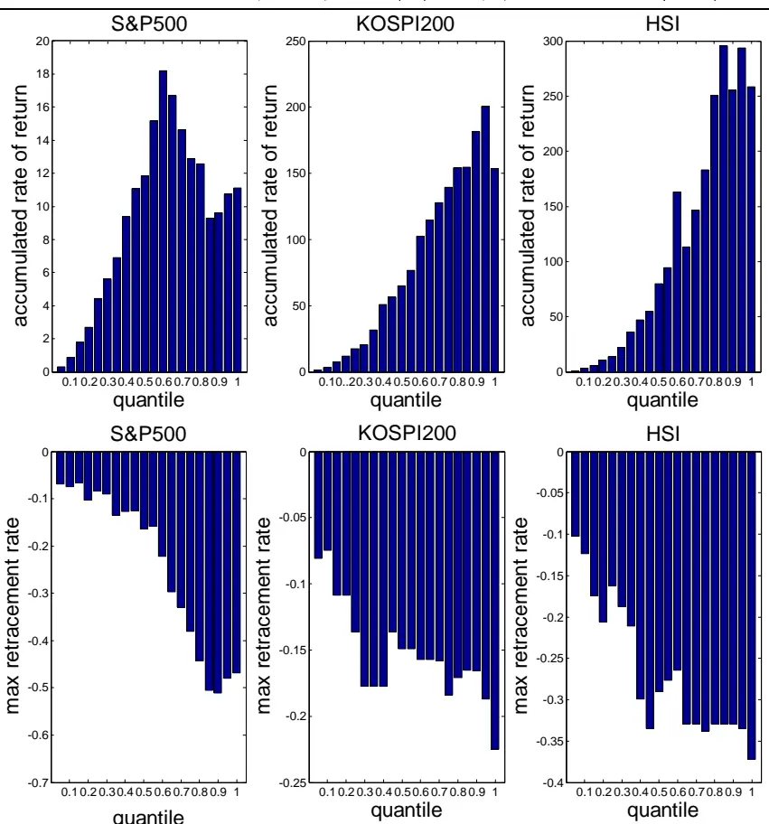
来源：广发证券发展研究中心，Bloomberg

为综合两个指标选取最优参数，我们可以利用累积收益率与最大回撤率绝对值的比值作为目标函数进行寻优，结果如图 3 所示。

图3：不同 下期权成交量看涨-看跌比率策略样本内的收益回撤比
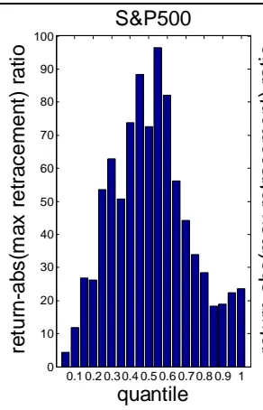

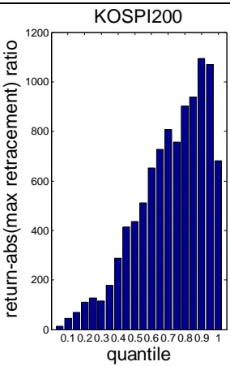
数据来源：广发证券发展研究中心，Bloomberg

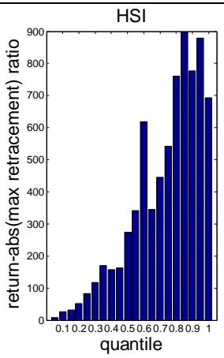

根据结果，选取比值最大对应的 为该市场的最优参数：S&P500 指数的最优参数为 =0.55，即认为上下22.5%分位点以外为极端值最合适；KOSIP200指数的最优参数为 =0.9，即认为上下45%分位点以外为极端值最合适；HSI指数的最优参数为=0.85，即认为上下 42.5%分位点以外为极端值最合适。接下来在三个市场各自的样本内最优参数下，进行策略的样本外测试，交易结果见图 4 至图 6 及表 1 至表 3。在测算中，由于缺乏海外日内高频数据，我们不对策略进行日内止损。另外，由于标的指数可以对应交易期货或指数基金，并且不同国家与地区的交易费率不同，因此也尚未考虑交易成本。这里我们只重点关注预测的有效性。

表 1：S&P500 市场 =0.55 下的期权成交量看涨-看跌比率策略交易统计

| 累积收益率 | 2329.66% |
| --- | --- |
| 年化收益率 | 37.97% |
| 区间交易日总数 | 2498 |
| 交易总次数 | 1203 |
| 获胜次数 | 705 |
| 失败次数 | 497 |
| 胜率 | 58.69% |
| 平均获胜收益率 | 0.97% |
| 平均失败亏损率 | -0.71% |
| 盈亏比 | 1.36 |
| 平均单笔交易收益率 | 0.27% |
| 单日最大盈利 | 11.58% |
| 单日最大亏损 | -10.79% |
| 单日波动率 | 0.95% |
| 最大回撤率 | -17.09% |
| 最大连胜次数 | 13 |
| 最大连亏次数 | 7 |

数据来源：广发证券发展研究中心，Bloomberg

表 2：KOSPI200市场 =0.9 下的期权成交量看涨-看跌比率策略交易统计

| 累积收益率 | 452.56% |
| --- | --- |
| 年化收益率 | 28.88% |
| 区间交易日总数 | 1698 |
| 交易总次数 | 1499 |
| 获胜次数 | 795 |
| 失败次数 | 704 |
| 胜率 | 53.04% |
| 平均获胜收益率 | 1.05% |
| 平均失败亏损率 | -0.92% |
| 盈亏比 | 1.14 |
| 平均单笔交易收益率 | 0.11% |
| 单日最大盈利 | 12.23% |
| 单日最大亏损 | -10.33% |
| 单日波动率 | 1.39% |
| 最大回撤率 | -35.80% |
| 最大连胜次数 | 10 |
| 最大连亏次数 | 13 |

数据来源：广发证券发展研究中心，Bloomberg

表 3：HSI 市场 =0.85 下的期权成交量看涨-看跌比率策略交易统计

| 累积收益率 | 50.32% |
| --- | --- |
| 年化收益率 | 4.20% |
| 区间交易日总数 | 2496 |
| 交易总次数 | 1774 |
| 获胜次数 | 865 |
| 失败次数 | 909 |
| 胜率 | 48.76% |
| 平均获胜收益率 | 1.09% |
| 平均失败亏损率 | -0.97% |
| 盈亏比 | 1.13 |
| 平均单笔交易收益率 | 0.02% |
| 单日最大盈利 | 14.34% |
| 单日最大亏损 | -12.70% |
| 单日波动率 | 1.34% |
| 最大回撤率 | -47.16% |
| 最大连胜次数 | 8 |
| 最大连亏次数 | 12 |

数据来源：广发证券发展研究中心，Bloomberg

图4：S&P500市场 =0.55下的期权成交量看涨-看跌比率策略净值曲线
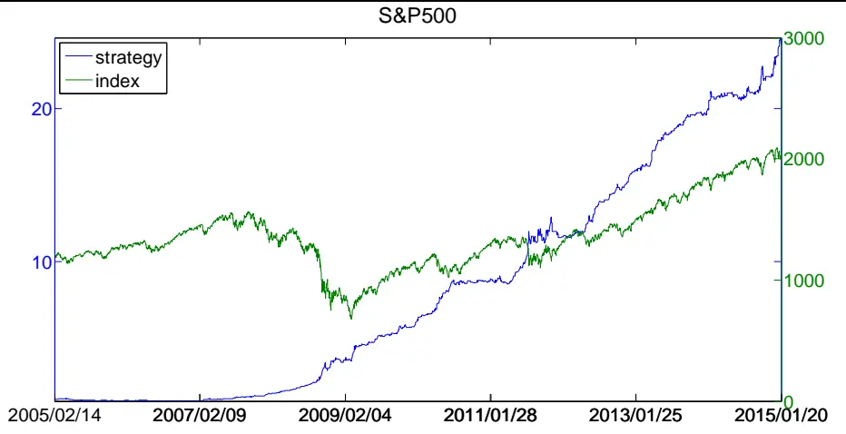
数据来源：广发证券发展研究中心，Bloomberg

图5：KOSPI200市场 =0.9下的期权成交量看涨-看跌比率策略净值曲线
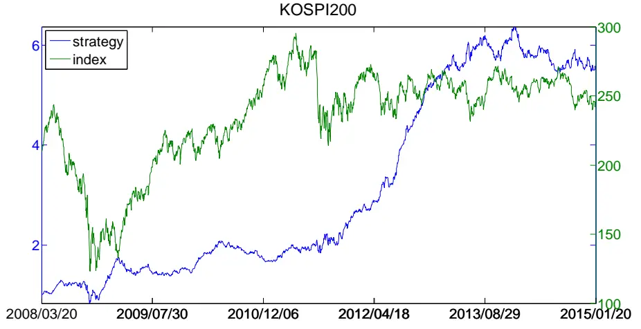
数据来源：广发证券发展研究中心，Bloomberg

图6：HSI市场 =0.85下的期权成交量看涨-看跌比率策略净值曲线
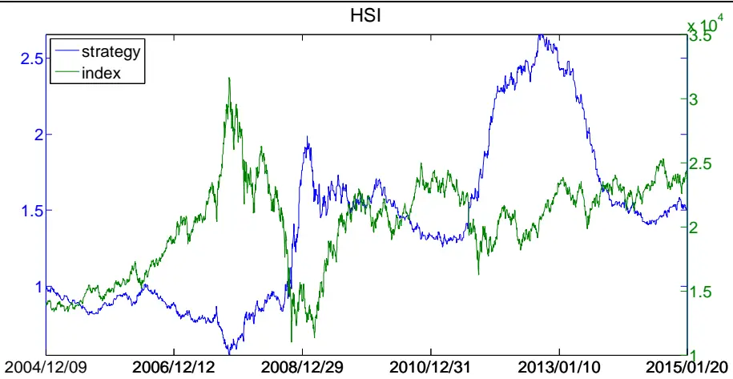
数据来源：广发证券发展研究中心，Bloomberg

可以看到，对于样本内表现良好的参数，其在样本外的策略应用上也能发挥令人满意的效果。

从收益率的角度看，美国 S&P500 市场和韩国 KOSPI200 市场上的该策略表现尤为突出，净值曲线在数年间一直保持着稳定的增长态势，年化收益率达 37.97%和28.88%；香港 HSI 市场的策略表现纵然波动较大，但我们仍然可以观察到增长的态势，最后 50.32%的累积收益率和 4.20%的年化收益率在一定程度上证明策略在样本外的有效性。

从波动性的角度看，三个市场上的最大回撤分别是-17.09%、-35.80%和-47.16%，策略的波动还是比较大的。但是，我们必须指出，该样本外策略是在样本内最优化参数之下的策略，而我们前面采用的优化目标函数为“累积收益率/|最大回撤率|”，观察比较图 2和图3，我们发现图 3中加入风险指标即最大回撤率后的判断指标，其分布与图 2 中的累积收益率分布形态相差不大，也就是说该指标对策略波动风险未能给予太大重视，由此得出的样本内最优参数也自然在更多的意义上是一种累积收益率最大化的参数。因此在实际操作时，我们可以通过对指标的调整采用合适意义下的样本内最优参数，以达到期望的策略效果。

总的来说，从策略的结果看来，我们有理由认为指数期权的成交量对于标的指数具有良好的预测能力，并且基于这个能力，我们还可以研发出收益可观的交易策略。

## 三、期权隐含波动率对标的指数的交易性预测

在第一部分的概述中，我们提出可以通过期权的成交量和价格两个指标来预测标的现货的走势，在第二部份中，我们通过基于期权成交量看涨-看跌比率策略的表现，在 S&P500、KOSPI200和HSI这三种指数及其期权上证实了指数期权成交量对指数现货的预测能力。 接下来，我们讨论期权价格对标的现货的预测能力。特别的，我们也在 S&P500、KOSPI200 和 HSI 上进行实证。

## （一）以隐含波动率作为期权价格的替代指标

通常来说，海外职业交易员对于期权的报价更喜欢使用隐含波动率而非价格，原因在于期权隐含波动率的变化较期权价格的变化而言要更加稳定。基于同样的原因，我们用来比较、分析和预测现货走势的期权指标也应以隐含波动率为佳。

隐含波动率是根据市场上期权的价格从Black-Scholes期权定价公式（BS公式）中反解出的波动率，即是结合在t时从市场上观察到的看涨期权价格c或看跌期权价格 $p$ 、标的现货价格 $S_{t}$ 、期权到期日 $T$ 、执行价格K和无风险利率r，从

$$
\begin{array}{rl}&{c=S_{t}N(d_{1})-Ke^{-r(T-t)}N(d_{2}),}\\&{p=Ke^{-r(T-t)}N(-d_{2})-S_{t}N(-d_{1})}\end{array}
$$

其中

$$
d_{1}={\frac{ln(S_{t}/K)+(r+\sigma^{2}/2)(T-t)}{\sigma{\sqrt{T-t}}}},
$$

$$
d_{2}={\frac{ln(S_{t}/K)+(r-\sigma^{2}/2)(T-t)}{\sigma{\sqrt{T-t}}}}
$$

中解出的波动率 $\sigma$ 。若观察到的期权为看涨期权，则仅需使用关于 $c$ 、 $d_{1}$ 和 $d_{2}$ 的三个等式求解；若观察到的期权为看跌期权，则仅需使用关于 $p$ 、 $d_{\mathrm{{1}}}$ 和 $d_{2}$ 的三个等式求解。

照此说来，对于同一标的、同一到期日及执行价格的看涨期权和看跌期权，我们理应能解得两个隐含波动率，即通过 $c$ 、 $d_{1}$ 和 $d_{2}$ 的三个等式解得的看涨期权隐含

波动率 $\sigma^{call}$ 和通过 $p$ 、 $d_{1}$ 和 $d_{2}$ 的三个等式解得的看涨期权隐含波动率 $\sigma^{put}$ ，因此二者就可以成为看涨期权价格和看跌期权价格的替代指标。

既然选择了替代指标，我们必须清楚它与原指标的关系。股价与隐含波动率具有正相关的关系，这里不做数学上的证明，仅从现实原理上说明。无论是看涨期权还是看跌期权，期权投资者最大损失就是期权的价格，但其收益是上不封顶的。因此如果一个期权的标的资产拥有更高的波动率，其往使期权盈利的方向运动时就有更可能取得更大的收益，但其往使期权亏损的方向运动带来的损失却始终是有限的，也就是说标的证券波动性的上升可以增加期权投资者潜在的盈利，因而对应期权的理论价值就应该越大。从市场上期权价格反推的隐含波动率，自然也符合与价格的正向关系，高价的期权反映了投资者对标的证券波动率的高预期，低价则反映了低波动率的预期。也就是说，高隐含波动率对应的就是期权高价，低隐含波动率就是期权低价。

## （二）期权隐含波动率数据介绍

为省却搜索与计算的步骤，在下面的分析中，我们将直接使用彭博资讯提供的看涨（看跌）期权的隐含波动率——“历史买权（卖权）引申波幅”，它根据最接近平价行使价格的两个买权（卖权）的隐含波动率平均求得，所使用的合约是从今天起至少 20个工作日到期的最近的合约月份。需要注意的是，由于彭博数据编制方法的变动，自 2005 年开始的 S&P500 指数与自 2014 年 4 月 11 日开始的 KOSPI200 指数和 HSI指数的隐含波动率不再区分看涨期权和看跌期权两类，而是直接以最接近的价外买权和最接近的价外卖权的加权平均得到一个单一的隐含波动率，其他指数也存在原编制方法停用的现象。尽管如此，隐含波动率的数据始终是从期权价格中反解得到的，在实际应用中，得到了期权价格就相当于得到了隐含波动率，可用以预测和构建投资策略。在我们的分析中，我们将回测的区间定位于彭博有提供不同的看涨期权隐含波动率和看跌期权的隐含波动率的时间段，对于 S&P500市场来说是从1995 年 3 月 15 日至 2004 年 12 月 31 日， 在 KOSPI200 市场上是从 2001 年 5 月 7 日至 2014 年 4 月 10 日，而对于 HSI 市场则是 1994 年 10 月 27 日至 2014 年 4 月 10 日。

对于缺失数据我们采取了此前有数据的最近一个交易日的数据填充。

在得到了数据之后，我们还有一个需要关心的问题：看涨期权的隐含波动率数据会和看跌期权的数据完全相等吗？之所以有这样的担心，是由于在金融工程的理论中，在无套利的假设下，具有相同到期日和执行价格的看涨期权的隐含波动率与看跌期权的隐含波动率是相等的。这源于下面看涨-看跌平价关系式的成立

$$
p+S_{t}e^{-qT}=c+Ke^{-r(T-t)}
$$

其中， $q$ 是标的资产提供的收益率，而其余符号含义与前述相同。这使得看涨期权价格c和看跌期权价格p 被一个等式联系了起来，成为了彼此决定的数值，由此依据 BS公式只会解出同样的一个隐含波动率，即理论上有 $\sigma^{call}=\sigma^{put}=\sigma$

尽管我们分析使用的数据并未明确指定相同的到期日和执行价格，为了避免无法分析的情况，我们还是应当检验用于分析的两种的隐含波动率是否相同。在图 7，我们给出了基于彭博资讯数据编制方法的看涨期权隐含波动率（蓝线）与看跌期权隐含波动率（绿线）。

图7：S&P500,KOSPI200和HSI看涨期权及看跌期权隐含波动率对比图
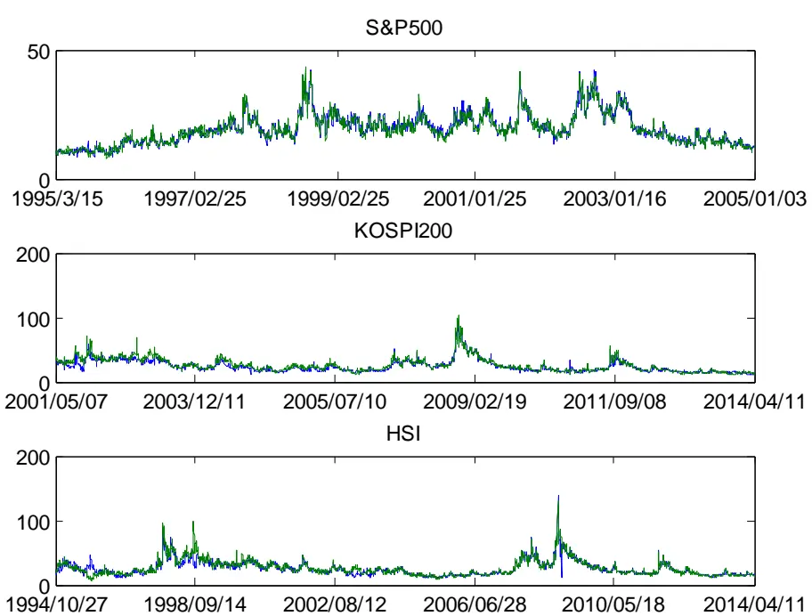
数据来源：广发证券发展研究中心，Bloomberg

我们发现，纵使看涨期权隐含波动率与看跌期权隐含波动率总是保持同样的趋势且水平相当紧贴一致，它们仍然是不同的两个数值；观察图8，我们可以更加直观的看到看涨期权与看跌期权的隐含波动率比值是一直在 1附近波动的，而非始终等于 1。这里的原因有两个：一、数据编制方法没有保证同一标的的看涨期权与看跌有相同的到期日和执行价格，而是以平值期权为筛选标准；二、欧式期权看涨-看跌平价关系式成立的前提是市场无套利，但由于套利交易需要付出一定的交易成本，在现实中并不完全成立。那么，我们使用看涨期权隐含波动率和看跌期权隐含波动率进行分析的设想就可以实现了。

## （三）期权隐含波动率预测的逻辑

由于期权市场是现货市场的风向标，现货市场上涨之前，在期权市场往往会出现投资者大量买入看涨期权的情形，导致看涨期权价格上升，从而看涨期权的隐含波动率上升的情形；现货市场下跌之前，在期权市场往往会出现投资者大量买入看跌期权的情形，导致看跌期权价格上升，从而看跌期权的隐含波动率上升的情形；当投资者对现货市场没有明确的上涨或下跌的观点时，看涨期权和看跌期权的价格便不相上下，隐含波动率从而也相近。同成交量的逻辑一样，通过对看涨期权和看跌期权的隐含波动率对比，我们可以看到期权市场多空双方的力量对比，从而也预示着未来现货市场的多空力量对比。

与此前对交易量作比较相同，我们应采用比值的办法来比较看涨期权隐含波动率和看跌期权隐含波动率的大小，以更好地排除由于期权市场发展变化而带来的绝对水平变化。这样做的原因与结果可以参照图 7 和图8：可以从图 7看到随着时间的变化，隐含波动率的水平会发生较大的变化，这样不同时间的隐含波动率差值不宜比较；图 8的蓝线是看涨期权与看跌期权隐含波动率比值的时序图，可以发现比值序列直观上是一个平稳的时间序列，因此在不同时间都具有可比性。

图8：S&P500,KOSPI200和HSI指数及期权隐含波动率看涨-看跌比率时序图
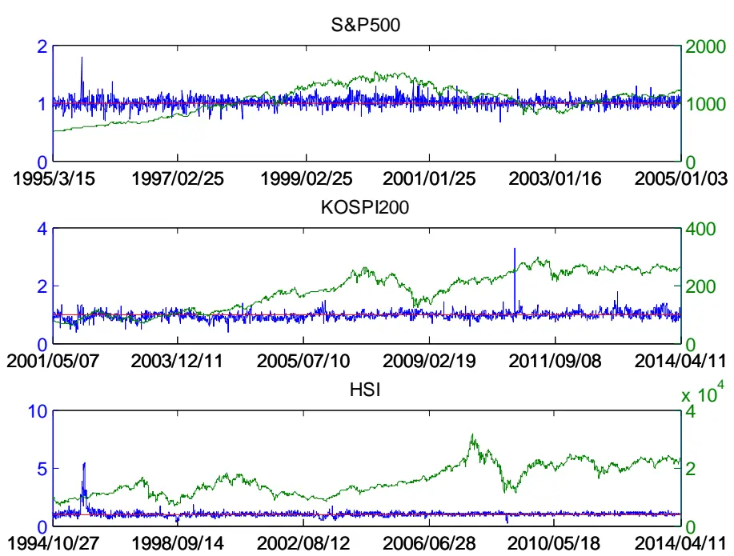
数据来源：广发证券发展研究中心，Bloomberg

在分析成交量的对比时，我们提出需要将当前的双方对比与历史上双方的对比进行比较，只有显著异于历史水平的对比时，才能做出一方力量异常强于或弱于另一方的判断，这样就不会因为一方仅稍强于另一方时也贸然做出现货市场走势的判断。这一逻辑的合理性也可以从图 8看出：若我们认为看涨（看跌）期权隐含波动率大于看跌（看涨）期权隐含波动率，即二者之比大于（小于）1 时就预测现货市场将走强（走弱），那么准确率一定不高。因为可以很直观地结合比值为 1的红色参考线和实际现货市场走势看到，在很多现货上涨的时段，隐含波动率比值的均值是小于 1的；而在另外很多现货下跌的时段，隐含波动率比值的均值又是大于 1的。

上面的分析也表明，我们必须为看涨期权隐含波动率显著高于看跌期权隐含波动率或后者显著高于前者制定一个标准。如果不在看涨（看跌）期权与看跌（看涨）期权隐含波动率之比大于1时认为期权市场预示着现货市场的涨势（跌势），那么什么时候应该这么认为呢？我们又应该在什么时候认为该比值没有预示着现货市场明显的走向呢？这些标准，我们都要在各个市场中遍历寻优，找到最合适市场特点的判断标准。回到图8，我们的目标就要是为隐含波动率的比值画出两条标准线，使得比值高于上标准线的时段更多地对应于现货价格未来上升的时段，比值低于下标准线的时段更多地对应于现货价格未来下降的时段，而比值居于两个标准线之间时现货价格未来有可能性相差不大的涨跌走向。

基于以上讨论，利用期权隐含波动率的比值，通过观察比值的是否超过通过历史样本优化出的上下标准，我们预期可以很好地判断现货未来的走向。

## （四）期权隐含波动率看涨-看跌比率的交易性预测

与此前基于期权成交量看涨-看跌比率T+1预测的交易策略相同，一个成功的基于期权隐含波动率看涨-看跌比率 T+1预测的交易策略，可以对期权预测现货市场的能力进行成功的验证。

下面我们以数学语言规范化策略逻辑。首先定义核心指标——t日的期权隐含波动率看涨-看跌比率为

$$
Ratio_{t}^{\nu olt}=\frac{\nu olt_{t}^{call}}{\nu olt_{t}^{put}}
$$

其中， $\nu olt_{t}^{call}$ 和 $\nu olt_{t}^{put}$ 分别为看涨期权和看跌期权的隐含波动率。

我们将 $Ratio_{t}^{\nu olt}$ 视作一个关于t独立同分布的连续性随机变量，即其概率分布$P^{\nu olt}$ 不随时间的变化而变化。这样就有 $\{Ratio_{t}^{\nu olt}/t\le t^{*}\}$ 的概率分布 $P_{t\leq t^{*}}^{\nu olt}$ 等同于$\{Ratio_{t}^{\nu olt}/t>t^{*}\}$ 的概率分布 $P_{t>t^{*}}^{\nu olt}$ 。那么，一旦知道过去的分布 $P_{t\leq t^{*}}^{\nu olt}$ ，也就等于知道了未来的分布 $P_{t>t}^{volt}$

基于此，对于某一个交易日 $t^{*}$ ，我们不妨利用历史上已实现的 $\{Ratio_{t}^{\nu olt}/t\le t^{*}\}$ 所构成的离散的样本频率分布 $P_{hist}^{\nu olt}$ 作为连续的真实概率分布 $P_{t\leq t^{*}}^{\nu olt}$ 的最佳近似，从而由于 $P_{t\leq t^{*}}^{\nu olt}=P_{t>t^{*}}^{\nu olt}$ $P_{hist}^{\nu olt}$ 也是未来分布 $P_{t>t}^{\nu olt}$ 的最佳近似。

在作为近似的分布 $P_{hist}^{\nu olt}$ 中，我们可以划定一个极端值判定参数 ，认为高于分布 $P_{hist}^{\nu olt}$ 的上 $\frac{\alpha}{2}$ 分位点 $Z_{hist,\alpha/2}^{\nu olt}$ 和低于 $P_{hist}^{\nu olt}$ 的下 $\frac{\alpha}{2}$ 分位点 $Z_{hist,-\alpha/2}^{\nu olt}$ 的 $Ratio_{t}^{\nu olt}$ 值为极端值。那么在 $t>t^{*}$ 的每一个交易日， $Ratio_{t}^{\nu olt}$ 都可能发生以下三种情况：

1. $Ratio_{t}^{\nu olt}>Z_{hist,\alpha/2}^{\nu olt}$

2. $Ratio_{t}^{\nu olt}<Z_{hist,-\alpha/2}^{\nu olt}$

3. $Z_{hist,-\alpha/2}^{\nu olt}\le Rat{i\omega_{t}^{\nu olt}}\le Z_{hist,\alpha/2}^{\nu olt}$

发生情况1时，可认为期权隐含波动率看涨-看跌比率出现了其概率分布中的极端大值，此时有看涨期权隐含波动率显著大于看跌期权隐含波动率；发生情况2时，可认为期权隐含波动率看涨-看跌比率出现了其概率分布中的极端小值，此时有看跌期权隐含波动率显著大于看涨期权隐含波动率；情况3 没有出现期权隐含波动率看涨-看跌比率在其概率分布中的极端值，此时可认为看涨期权隐含波动率与看跌期权隐含波动率相差不大。

对应 $t^{*}$ 交易日的每种情况，基于期权隐含波动率对现货 T+1预测的交易策略在就应该分别执行下面三种操作：

1.标的指数现货市场多头建仓

2.标的指数现货市场空头建仓

3.不操作

在每一个 $t>t^{*}$ 的交易日收盘时，将当日期权隐含波动率看涨-看跌比率与其历史分布进行比较，依据上述方法做出操作判断后，同时在标的现货或期货市场平仓（昨日无操作时则不操作）或开仓（判定今日不操作时则不操作）。以上就是策略实施的操作步骤。

如同此前的成交量比率策略，策略中的极端值判定参数 的取值也是从样本中优化得到的，即该 是上述交易规则在历史数据中取得最优表现的 ，对应的上（下）分位数 $Z_{hist,\alpha/2}^{\nu olt}~(~Z_{hist,-\alpha/2}^{\nu olt}~)$ ）也就是判定指数现货未来走高（走低）的最佳阈值。

在回测中，我们同之前一样将所有的样本对半分。我们首先由前一半样本优化得到参数 及阈值 $Z_{hist,\alpha/2}^{\nu olt}$ 与 $Z_{hist,-\alpha/2}^{\nu olt}$ ，然后在样本外即剩余的一般样本中测试其表现。若表现良好，则该最优参数对于策略是全时间段适用的，从而可以证明了指数期权对标的指数的预测能力。

接下来我们在S&P500指数及指数期权、KOSPI200指数及指数期权和 HSI指数及指数期权上进行回溯测试。特别地，我们取 从0.05（认为上下2.5%分位点以外为极端值）至 1（认为上下50%分位点以外为极端值），在样本内遍历最优参数，则该隐含波动率看涨-看跌比率策略在三个市场的累积收益率与最大回撤率见图 9。

图9：不同 下隐含波动率看涨-看跌比率策略样本内累积收益率与最大回撤率
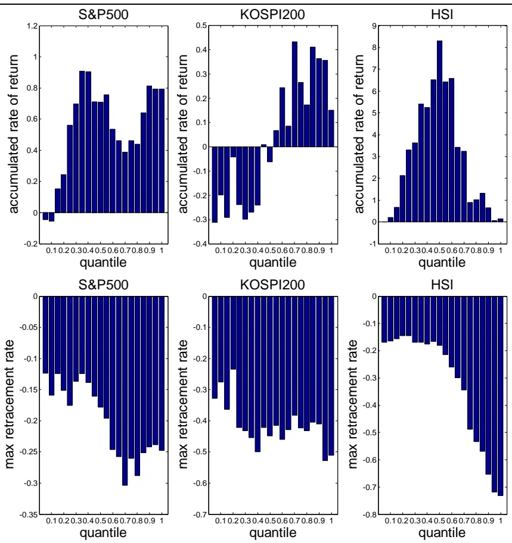
来源：广发证券发展研究中心，Bloomberg

与此前基于成交量比率的策略一样，我们综合两个指标，利用累积收益率与最大回撤率绝对值的比值选取最优参数，结果见图 10。

图10：不同 下隐含波动率看涨-看跌比率策略样本内的收益回撤比
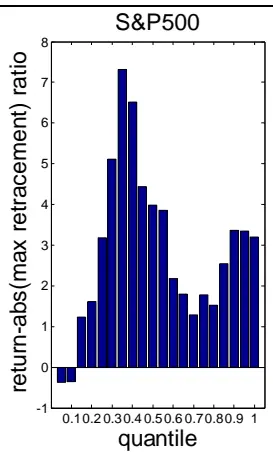

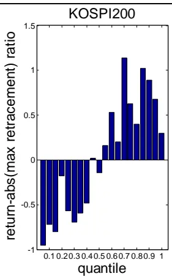
数据来源：广发证券发展研究中心，Bloomberg

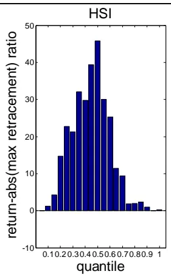

根据结果，选取比值最大对应的 为该市场的最优参数：S&P500 指数的最优参数为 =0.35，即认为上下17.5%分位点以外为极端值最合适；KOSIP200指数的最优参数为 =0.7，即认为上下35%分位点以外为极端值最合适；HSI指数的最优参数为=0.5，即认为上下25%分位点以外为极端值最合适。接下来在三个市场各自的样本内最优参数下，进行策略的样本外测试，交易结果见图 11 至图13及表4 至表 6。

表 4：S&P500 市场 =0.35 下的期权隐含波动率看涨-看跌比率策略交易统计

| 累积收益率 | 162.93% |
| --- | --- |
| 年化收益率 | 21.83% |
| 区间交易日总数 | 1234 |
| 交易总次数 | 431 |
| 获胜次数 | 258 |
| 失败次数 | 173 |
| 胜率 | 59.86% |
| 平均获胜收益率 | 1.04% |
| 平均失败亏损率 | -0.97% |
| 盈亏比 | 1.07 |
| 平均单笔交易收益率 | 0.22% |
| 单日最大盈利 | 5.01% |
| 单日最大亏损 | -5.83% |
| 单日波动率 | 0.79% |
| 最大回撤率 | -18.15% |
| 最大连胜次数 | 6 |
| 最大连亏次数 | 6 |

数据来源：广发证券发展研究中心，Bloomberg

表 5：KOSPI200市场 =0.7 下的期权隐含波动率看涨-看跌比率策略交易统计

| 累积收益率 126.00% |
| --- |
| 年化收益率 13.66% |
| 区间交易日总数 1604 |
| 交易总次数 1168 |
| 获胜次数 631 |
| 失败次数 537 |
| 胜率 54.02% |
| 平均获胜收益率 1.05% |
| 平均失败亏损率 -1.05% |
| 盈亏比 0.99 |
| 平均单笔交易收益率 0.07% |
| 单日最大盈利 7.86% |
| 单日最大亏损 -12.23% |
| 单日波动率 1.31% |
| 最大回撤率 -48.13% |
| 最大连胜次数 9 |
| 最大连亏次数 9 |

数据来源：广发证券发展研究中心，Bloomberg

表 6：HSI 市场 =0.5 下的期权隐含波动率看涨-看跌比率策略交易统计

| 累积收益率 | 373.81% |
| --- | --- |
| 年化收益率 | 17.74% |
| 区间交易日总数 | 2401 |
| 交易总次数 | 761 |
| 获胜次数 | 429 |
| 失败次数 | 332 |
| 胜率 | 56.37% |
| 平均获胜收益率 | 1.02% |
| 平均失败亏损率 | -0.82% |
| 盈亏比 | 1.24 |
| 平均单笔交易收益率 | 0.20% |
| 单日最大盈利 | 14.38% |
| 单日最大亏损 | -6.43% |
| 单日波动率 | 0.82% |
| 最大回撤率 | -10.52% |
| 最大连胜次数 | 8 |
| 最大连亏次数 | 6 |

数据来源：广发证券发展研究中心，Bloomberg

图11：S&P500市场 =0.35下的期权隐含波动率看涨-看跌比率策略净值曲线
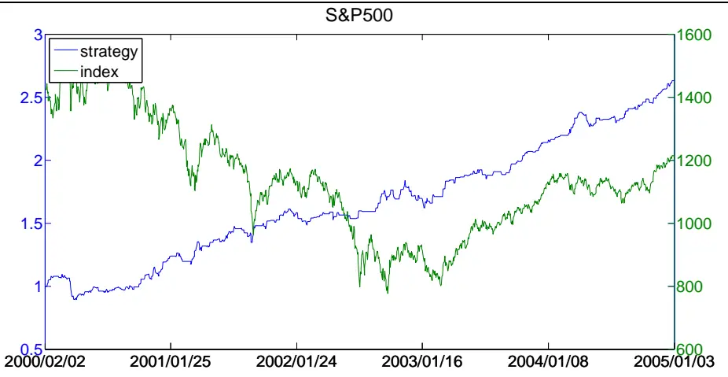
数据来源：广发证券发展研究中心，Bloomberg

图12：KOSPI200市场 =0.7下的期权隐含波动率看涨-看跌比率策略净值曲线
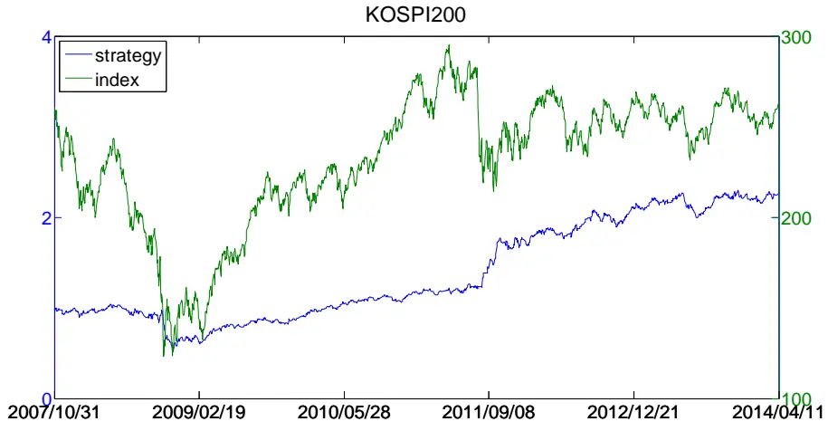
数据来源：广发证券发展研究中心，Bloomberg

图13：HSI市场 =0.5下的期权隐含波动率看涨-看跌比率策略净值曲线
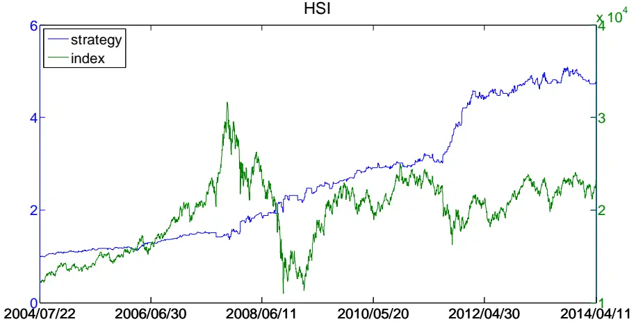
数据来源：广发证券发展研究中心，Bloomberg

我们发现样本内的最优参数普遍比成交量比率策略中的结果要小，、造成策略的操作次数更加少了，这些可以从净值曲线更多的平直段落看到。尽管如此，我们依然可以看到策略最终带来的可观收益率。

从收益率的角度看，相较成交量比率策略， S&P500 市场和 KOSPI200 市场上的该策略收益率有所下降，分别为 21.83%和 13.66%；HSI 市场上该策略的年化收益率达 17.74%，是成交量比率策略中年化收益率的 4 倍以上。可以说在盈利性方面，基于期权隐含波动率的策略在 S&P500 市场和 KOSPI200 市场上不如基于期权成交量的策略，但在 HSI 市场上前者的表现要好于后者。但总的来说，我们可以看到净值曲线在数年间也是保持着明显的增长态势，这证实了策略在样本外的有效性。

从波动性的角度看，S&P500 市场的最大回撤比成交量比率策略时稍有上升，KOSPI200市场的最大回撤较此前有较大上升，HSI市场上的最大回撤则有大幅下降。同成交量比率策略，我们样本内最优化参数的标准更倾向于提升收益率，因而波动性表现无法要求最佳。

总的来说，我们有理由认为指数期权的隐含波动率对于标的指数具有良好的预

测能力，并且基于此我们可以研发出收益可观的交易策略。但是我们也看到，根据不同的市场的特点，从期权成交量出发与从期权隐含波动率出发设计的策略会有相差较大的表现，也就是说在某些市场，期权成交量是预测指数更好指标，而在另外一些市场，期权的隐含波动率是预测指数的更好指标。

## 四、基于时间序列分析的策略假设合理性回顾

基于期权市场较于现货市场的先行性，在期权成交量看涨-看跌比率 $Ratio_{t}^{\nu olm}$ 和期权隐含波动率看涨-看跌比率 $Ratio_{t}^{\nu olt}$ 服从时间上的独立同分布的假设之下，我们设计了基于期权市场对现货市场 T+1预测的现货交易策略，并且在 S&P500市场、KOSPI200市场和HSI市场上进行了成功的实证。尽管如此，事实上我们从未验证过$Ratio_{t}^{\nu olm}$ 和 $Ratio_{t}^{\nu olt}$ 时间上独立同分布假设的真实性；关于指数期权是否先行于指数现货，我们也只是从策略的成功上进行了认可。为了说明我们策略的成功并非偶然，而是建立在符合现实的假设之上的，我们在这一部分对这些假设给予基于统计学中时间序列分析理论上的验证。

## （一）期权成交量与隐含波动率的看涨-看跌比率的平稳性

为验证 $Ratio_{t}^{\nu olm}$ 和 $Ratio_{t}^{\nu olt}$ 时间上独立同分布假设，我们首先需要引 $\lambda^{\sharp}$ 平稳和宽平稳的概念。

## 1、严平稳

在时间序列分析中，所谓严平稳（strictly stationary）就是一种条件比较苛刻的平稳性定义，它认为只有当序列所有的统计性质都不会随时间的推移而发生变化时，该序列才能被认为是平稳的。

$\mathcal{F}$ 平稳的定义涉及到对联合概率分布族的要求，具体为：设 $\{X_{t}\}$ 为一时间序列，对任意正整数m，任取 $t_{1},t_{2},\cdots,t_{m}\in T$ ,对任意整数 ，有

$$
F_{_{t_{1},t_{2},\cdots,t_{m}}}(x_{1},x_{2},\cdots,x_{_m})=F_{_{t_{1}+\tau,t_{2}+\tau,\cdots,t_{m}+\tau}}(x_{1},x_{2},\cdots,x_{_m})
$$

则称时间序列 $\{X_{t}\}$ 为 $\mathcal{F}$ 平稳时间序列。

然而在实践中获取、计算和应用随机序列的联合分布十分困难，故严平稳的概念尽在理论上有用，实践中常常采用的是条件更为宽松的宽平稳的概念。

## 2、宽平稳

宽平稳（weak stationary）是使用序列的特征统计量来定义的一种平稳性。它认为时间序列的统计性质主要由其低阶矩决定，所以只要保证序列低阶矩平稳（二阶），就可以保证序列的主要性质近似稳定。宽平稳的定义为：

如果 $\{X_{t}\}$ 满足如下三个条件：

（1）任取 $t\in T$ ，有 $EX_{t}^{2}<\infty$

（2）任取 $t\in T$ ，有 $EX_{t}=\mu$ ， •为常数；

（3）任取 $t,s,k\in T$ ，且 $k+s-t\in T$ ，有 $\gamma(t,s)=\gamma(k,k+s-t)$ ；

则称 $\{X_{t}\}$ 为宽平稳时间序列，其中 $\gamma(t,s)$ 是序列 $\{X_{t}\}$ 的自协方差函数，其表达式为 $\mathbf{\Phi}^{t,s}){=}E(\mathbf{\Phi}X_{t}-{\mu}_{t}\mathbf{\Phi})(X_{s}-{\mu}_{s})$ 。一般来说，实现宽平稳是实现严平稳的必要条件。

在了解严平稳和宽平稳的概念后，我们可以发现，要验证 $Ratio_{t}^{\nu olm}$ 和 $Ratio_{t}^{\nu olt}$ 时间上独立同分布假设，实际上等价于对其进行平稳性检验。

检验序列平稳性之中，考虑最为全面的是 $\mathrm{Phi11ips–Perron}$ 检验，即 PP 检验，该检验的原假设为序列 $\{X_{t}\}$ 非平稳。在采取该检验后，我们发现S&P500、KOSPI200和 HSI这三个市场上的全部 $Ratio_{{t}}^{{\nu}olm}$ 和 $Ratio_{t}^{\nu olt}$ 共六个序列，在计算精度为万分之一时，全部得到为零（小于万分之一）的p 值，意味着可以在极低的臵信水平之下拒绝非平稳的原假设，即可以认为序列是平稳的。

于是在经过验证后，我们可以认为 $Ratio_{t}^{\nu olm}$ 和 $Ratio_{t}^{\nu olt}$ 满足在时间上独立同分布的假设。

## （二）成交量与隐含波动率的看涨-看跌比率和指数间的因果关系

时间序列分析中检验因果关系常用的是格兰杰因果关系检验（GrangerCausality Test）。该检验从预测的角度出发，认为若在对Y的回归方程

$$
Y_{t}=\alpha_{0}+\sum_{i=1}^{p}\alpha_{i}Y_{t-i}+\sum_{i=1}^{q}\beta_{i}X_{t-i}+\varepsilon_{t}
$$

中可以得到比

$$
Y_{\scriptscriptstyle t}=\alpha_{0}+\sum_{i=1}^{p}\alpha_{i}Y_{{t-i}}+\varepsilon_{t}
$$

对 $Y_{_t}$ 有更好的解释，即对Y的回归中加入X 可以提高对Y预测的准确度，那么就认为X 是Y的格兰杰原因。格兰杰因果关系检验的原假设是：X 不是Y的格兰杰原因。

经过我们的计算，在千分之一的计算精度下，除了在检验 KOSPI200的期权隐含波动率是否其指数的格兰杰原因时，只得到0.038的p 值，其余所有的检验都得到了为零（小于千分之一）的 p 值。也就是说，我们可以在 5%显著性水平下称，三个市场上的 $Ratio_{t}^{\nu olm}$ 和 $Ratio_{t}^{\nu olt}$ 都是其指数的格兰杰原因。

这样，我们又证实了基于期权预测标的指数策略的另一个基础理论：指数期权市场较指数现货市场具有先行性。

## 五、总结

本篇报告就期权对标的指数走势的预测能力进行了理论上的分析和策略上的实证。首先，我们引入和阐释了期权市场较之现货市场的先行性，并且对全球三种具有代表性的指数——S&P500、KOSPI200和HSI及其对应的期权进行了介绍。随后，我们探讨了基于期权成交量对标的指数预测的逻辑，在此基础上，我们设计了一个基于期权成交量看涨-看跌比率对指数进行T+1预测的交易策略，并取得了良好的回测效果，从而证实了期权成交量对标的指数走势的预测能力。接下来，我们介绍了使用期权隐含波动率替代其价格指标的理念，在分析隐含波动率预测指数走势的逻辑之后，我们设计了一个基于期权隐含波动率看涨看跌比率对指数进行 T+1预测的交易策略，回测结果表明期权隐含波动率确实可以预测指数的走势。最后，我们通过时间序列分析理论中的一些假设检验，证明了我们所设计策略的假设基础是成立的。

纵观全文，我们得出了期权对标的指数走势具有预测能力的结论。

感谢发展研究中心金融工程组实习生李诗杰为本篇研究报告所做的工作。

## 风险提示

本篇报告通过历史数据进行建模与实证，得到良好的回测效果。但由于市场具有不确定性，交易模型仅在统计意义下有望获得良好投资效果，敬请广大投资者注意模型单次失效的风险。

## Table_RatingIndustry 广发证券—行业投资评级说明

买入： 预期未来 12 个月内，股价表现强于大盘 10%以上。

持有： 预期未来12个月内，股价相对大盘的变动幅度介于-10%～+10%。

卖出： 预期未来12个月内，股价表现弱于大盘10%以上。

## Table_RatingCompany 广发证券—公司投资评级说明

买入： 预期未来12个月内，股价表现强于大盘15%以上。

谨慎增持： 预期未来12个月内，股价表现强于大盘5%-15%。

持有： 预期未来12个月内，股价相对大盘的变动幅度介于-5%～+5%。

卖出： 预期未来12个月内，股价表现弱于大盘5%以上。

## Table_Ad联系我们

| 地址 | 广州市 广州市天河北路183号 | 深圳市 深圳市福田区金田路4018 | 北京市 | 上海市 |
| --- | --- | --- | --- | --- |
|  | 大都会广场5楼 | 号安联大厦 15 楼 A 座 03-04 | 北京市西城区月坛北街2号 月坛大厦18层 | 上海市浦东新区富城路99号 震旦大厦18楼 |
| 邮政编码 | 510075 | 518026 | 100045 | 200120 |
| 客服邮箱 | gfyf@gf.com.cn |  |  |  |
| 服务热线 | 020-87555888-8612 |  |  |  |

## Table_Disclaimer 免 责声 明

广发证券股份有限公司具备证券投资咨询业务资格。本报告只发送给广发证券重点客户，不对外公开发布。

本报告所载资料的来源及观点的出处皆被广发证券股份有限公司认为可靠，但广发证券不对其准确性或完整性做出任何保证。报告内容仅供参考，报告中的信息或所表达观点不构成所涉证券买卖的出价或询价。广发证券不对因使用本报告的内容而引致的损失承担任何责任，除非法律法规有明确规定。客户不应以本报告取代其独立判断或仅根据本报告做出决策。

广发证券可发出其它与本报告所载信息不一致及有不同结论的报告。本报告反映研究人员的不同观点、见解及分析方法，并不代表广发证券或其附属机构的立场。报告所载资料、意见及推测仅反映研究人员于发出本报告当日的判断，可随时更改且不予通告。

本报告旨在发送给广发证券的特定客户及其它专业人士。未经广发证券事先书面许可，任何机构或个人不得以任何形式翻版、复制、刊登、转载和引用，否则由此造成的一切不良后果及法律责任由私自翻版、复制、刊登、转载和引用者承担。