# 基于市场情绪平稳度的股指期货日内交易策略

## 另类交易策略之二十一

## Table_Sum ary报告摘要 ：

## 利用改进的回撤指标能够描述市场是趋势还是震荡

判断当天的市场情绪，在趋势明显的时候跟随市场趋势是明智而自然的选择。在过去的报告中，我们引入了 NTT 以及 EMD 等信号处理的方法进行趋势与震荡市的过滤，取得了不错的效果。但这些方法较为繁琐，同时缺乏明确的金融学直觉。本报告中，我们受“回撤”思想的启发，重新定义时间序列样本的回撤与反向回撤，并定义二者均值中较小者作为描述市场情绪平稳程度的指标。平稳度指标越小，说明当日的趋势性越强，趋势跟随策略越容易获得成功。

## 多次开仓策略能够进一步提升模型表现

2014 年以来，市场每日单向趋势波动行情逐渐发生变化，市场日内宽幅震荡加剧，上午与下午的行情相关性逐渐减弱。早盘震荡的行情常常出现尾盘拉升，同时即使趋势很强的早盘行情也会出现盘中宽幅震荡。这种行情下，原始的持有到下午收盘的策略表现渐渐失色。对此我们综合考虑样本长度，交易成本以及参数数量等因素，确定了日内上午，下午分别开仓的多次开仓策略。分别取上午以及上午到下午的一段交易样本，利用重新定义的市场平稳度指标判断趋势或震荡，将日内行情分两次交易，保证了当日行情出现变化时也能及时把握交易机会。

## 实证交易结果

本文采用 2010 年 4 月 16 日至 2015 年 2 月 25 日的当月股指期货 1 分钟线收盘价数据，双边万分之二的交易成本，千分之五止损。2010 年 4 月16 日至 2012 年 12 月 31 日为样本内优化参数，2013 年 1 月 4 日至 2015 年2 月 25 日作为样本外，多次开仓的市场平稳度模型表现良好。516 个交易日内共交易465次，累计收益31.58%，年化收益率14.22%，最大回撤-4.71%，赔率1.36.同时模型表现出卓越的参数稳定性。

## 平稳度指标

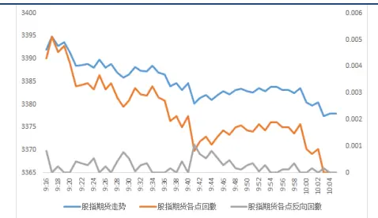

## 多次开仓平稳度模型累计收益

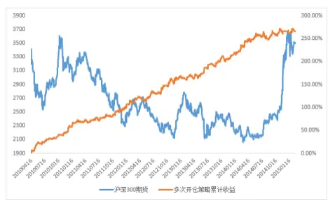

Table_Aut hor 分析师： 安宁宁 S0260512020003

0755-23948352

ann@gf.com.cn

## Table_Report 相关研究：

另类交易策略系列之二十： 2015-03-26
期权对标的指数走势的预
测性分析
另类交易策略系列之十九： 2014-12-03
带反转的加强版 EMDT 交
易策略
另类交易策略系列之十八： 2014-08-20
后尾分布下随机区间突破
策略

联系人：施驰

020-87555888-8687

shichi@gf.com.cn

## 一、 策略思想概述

## （一）基本思想

依据有效市场理论，股票指数的涨跌受到新闻消息的刺激，呈现出随机漫步的特征，从而使得较长期的股票指数预测较为困难。但是，由于股票指数的交易时间只有270分钟，在这段时间内一次出现多种正负相反的消息的概率较小，而非交易时间有1170分钟，这段时间内发生改变股票指数走势的新闻概率会大大高于交易时间内股票指数反转的概率。因此，我们可以通过观察市场早盘的走势，判断当日市场情绪受消息面的影响，从而跟随大盘趋势获利。

可是，并非所有的早盘都具有一定的趋势性。如下图中，开盘之后，市场没有明确的消息面的刺激，或是高开或低开之时已经将非交易时间的消息反映在股价之上，因此，在当日的交易时间，市场没有反映出明显的趋势性，而是反复震荡。对于震荡行情，我们很难去找到合适的买点或卖点进行反转或趋势交易。因此我们策略的主要思想是在早盘的一段时间内观察大盘的走势，获得所谓的“盘感”，判断大盘后续是否会延续早盘的走势，从而决定当日是否做趋势跟踪。

图1：震荡行情示意
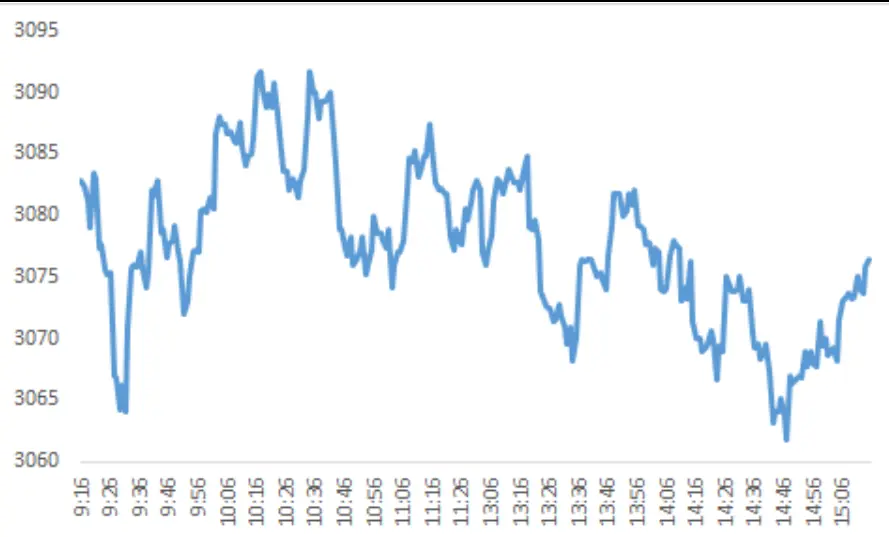
数据来源：广发证券发展研究中心

## （二）历史回顾

我们在2011年5月发表了研究报告《基于混沌理论的股指期货噪声趋势交易（NTT）策略》，该策略的核心思想是将股指期货的时间序列分离为趋势和噪声两个部分，噪声较大时，市场震荡严重，难以把握趋势，而噪声较小，趋势明显时，趋势跟随策略更易把握，从而取得较好的效果。

该报告在分离趋势和噪声算法上采用Levenberg-Marquardt非线性拟合方法，较为复杂，同时开仓条件严格，交易次数较少，同时没有加入止盈止损的机制，导致该策略回撤较大。

2014年3月，我们发表了《经验模态分解下的日内趋势交易策略》，该策略同样将股指期货的时间序列分为噪声部分（波动部分）和信号部分（趋势部分）。然后计算这两部分的比值（信噪比）。该策略采用了美国航空航天局（NASA）黄锷院士提出的经验模态分解（Empirical Mode Decomposition，简称EMD）方法分解信号部分和噪声部分，该过程不断从信号中提取出本征模态函数，直到信号仅保留趋势项。该方法相对于NTT策略而言，计算方法有了一定程度的简化。

2014年12月，我们发表了《带反转的加强版EMDT交易策略》，该方法对于之前的EMDT趋势交易策略做了一定程度的改进。趋势策略EMDT是在对数波动能量比比较小的时候，顺势建仓，获取利润；与之相对，反转策略是在对数波动能量比比较大的时候，寻找适当的反转点，反转建仓。因此，EMDRT反转策略是EMDT趋势策略的补充，在EMDT不进行交易的交易日建仓交易。

图2：基于EMD的趋势策略和反转策略的混合策略示意图
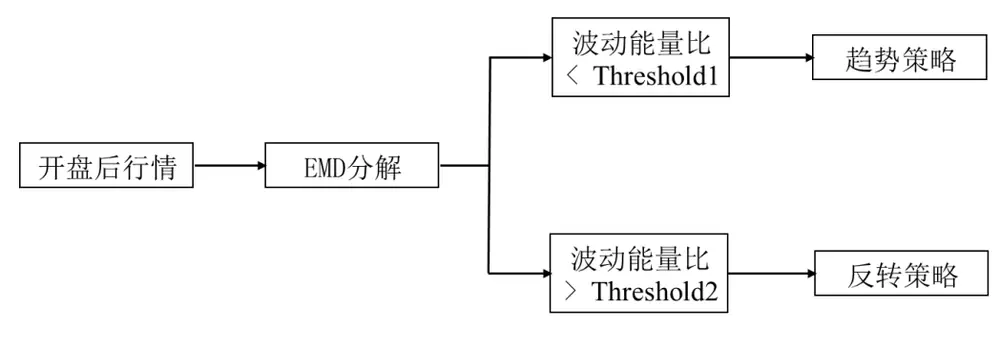
数据来源：广发证券发展研究中心

图3：枢轴点突破-反转交易策略
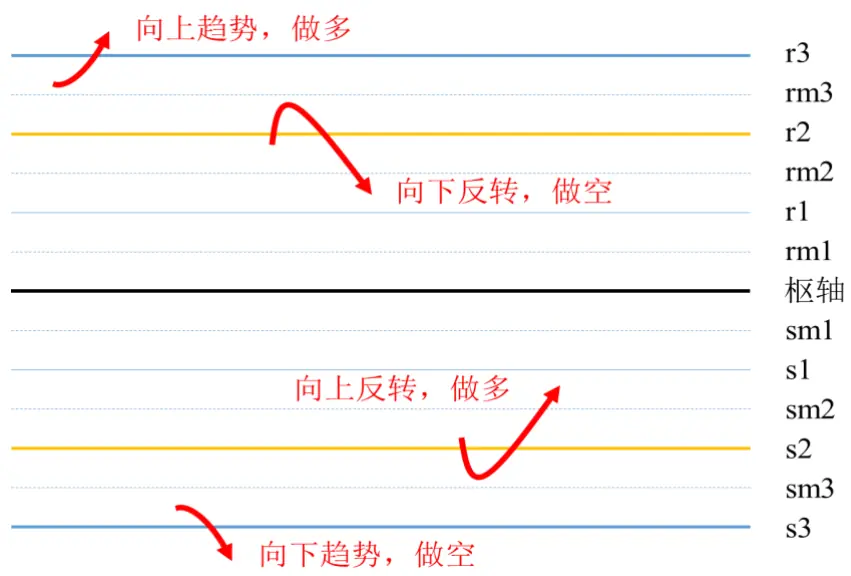
数据来源：广发证券发展研究中心

虽然EMDT模型取得了不俗的交易成果，但对于缺乏信号处理专业背景的人来说，仍然在理解上有一定的难度，确乏直观的金融直觉。同时，2014年以来，市场波动的特征出现了变化，该模型的累计收益一直处于震荡中。对此，我们引入一种新型测量市场平稳度的测度，并针对近年来市场行情的一些变化，对于该策略做了进一步的改进。

## 二、市场情绪平稳度模型

## （一）市场情绪平稳度度量

日内趋势类模型的关键在于如何描述市场的趋势相对于噪声的程度，即平稳度。受到策略评价指标“最大回撤”思想的启发，我们认为，回撤（Drawdown）不但能够表述一个策略的好坏，同时也能够描述股指期货价格序列的平稳程度。

一般意义上，最大回撤定义如下：

给定一段时间序列， $\{\mathtt{p}_{1},\mathtt{p}_{2},...,\mathtt{p}_{n}\}$

最大回撤 $\max_{j>i}(p_i-p_j)/p_i$

因此在单边上涨行情中，我们只需要计算各个点的平均最大回撤即可。

- p 处的最大回撤•1平均最大回撤=n

然而对于下跌行情，我们需要对最大回撤的定义做出一定改动。

反向最大回撤 $-\min_{j>i}(p_i-p_j)/p_i$

$$
平均最大反向回撤=\frac{\sum\limits_{i=1}^{n}p_{i}处的最大反向回撤}{n}
$$

市场情绪平稳度 • min{平均最大回撤,平均最大反向回撤}

我们只需要取最大回撤均值和反向最大回撤均值中较小的值，该指标可以完美地描述一段时间序列的平稳度。

## （二）利用市场情绪平稳度指数交易

拥有了市场情绪平稳度指标这一简单而有效的描述市场趋势强弱的指标之后，我们可以进一步制定交易策略。

第一步，我们需要选择一段时间作为观察窗口，对该时间内的时间序列做分析，用于预测后续行情。因此我们首先需要在样本内优化设定时间窗口长度参数t.

第二步，通过计算市场情绪平稳度指标，判断当日是否具有开仓条件。若市场情绪平稳度指标小于阈值，则说明当日行情趋势明显，可以开仓，若情绪平稳度指标大于阈值，则说明当日行情震荡，趋势难以把握，从而放弃开仓。

第三步，判断当天趋势的方向。若t时刻股指高于股指开盘价，则预测当日趋势为向上，在市场平稳的情况下可以做多，若t时刻股指低于股指开盘价，则预测当日趋势为向下，在市场平稳的情况下可以做空。

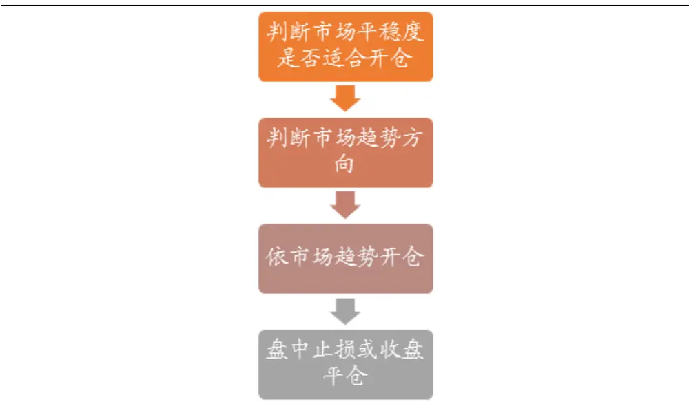
图4：市场平稳度模型交易流程
数据来源：广发证券发展研究中心

第四步，平仓策略。若开盘之后损失超过止损阈值，则选择平仓止损，反之则一直持有仓位至收盘平仓。具体流程如下：

在优化观察时间参数的过程中，我们发现，过长的观察窗口虽然对于未来趋势的判断更为准确，但是由于开仓时候较晚，将导致后期收益的减少。而过短的观察窗口则无法提供有效地趋势稳定性判断。经过样本内的优化，我们认为开盘之后50分钟是一个较好的参数。

下面是一段2011年4月的单边某日股指期货趋势行情，开盘之后指数一路平稳下跌。

图5：单边趋势行情示意
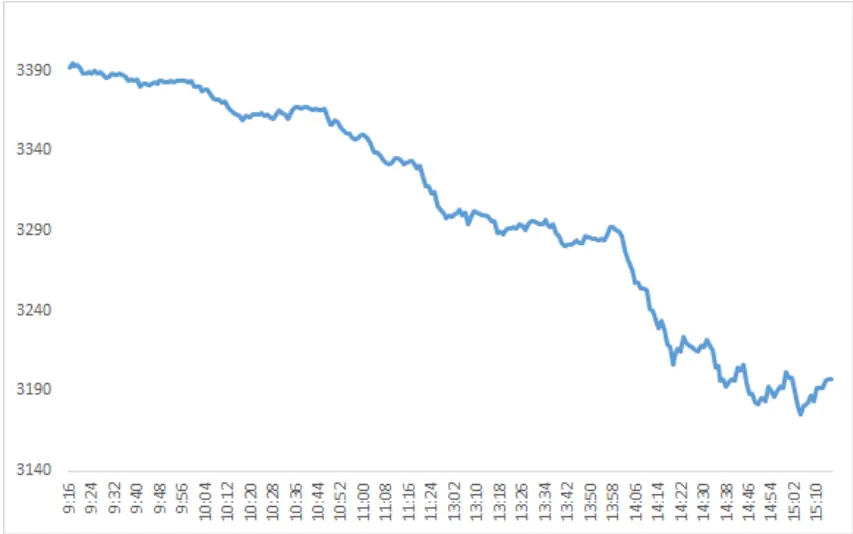
数据来源：广发证券发展研究中心

图6：单边趋势行情对应回撤与反向回撤
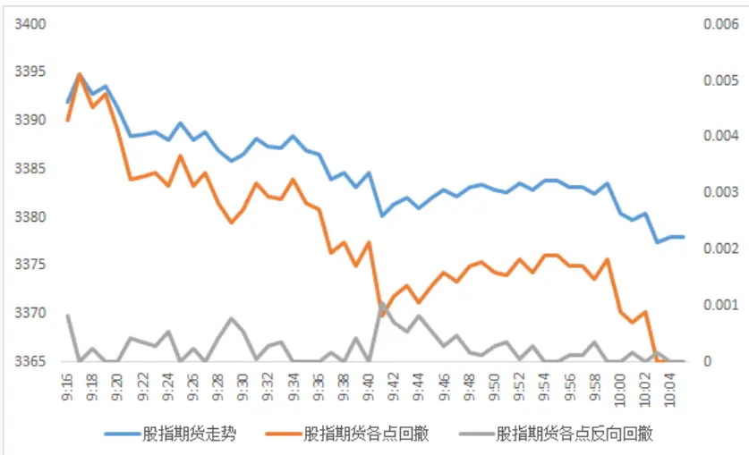
数据来源：广发证券发展研究中心

若我们将时间窗口设为开盘后的50分钟，我们取开盘前50分钟收盘价所对应的样本，计算每分钟所对应的回撤和反向回撤，求得这50分钟内样本的平均回撤为0.002234，反向回撤为0.000252.

比较样本平均回撤与平均反向回撤的大小，其中较小者即为描述市场平稳度的市场平稳度指数（0.000252），该指数低于开仓阈值，然后我们比较此时的盘中价格同开盘价大小，若低于盘中价格，则我们预期当日为单边下跌趋势，开仓做空指数，最后在收盘时平仓。

下面是2010年5月的一段震荡行情，开盘之后，价格在多空方向上反复犹豫，全天均为震荡行情，日内趋势难以把握。

图7：震荡行情示意
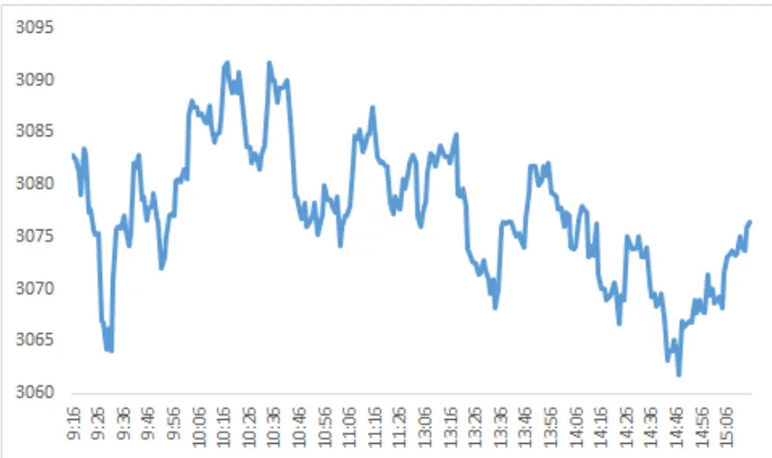
数据来源：广发证券发展研究中心

图8：震荡行情对应回撤与反向回撤

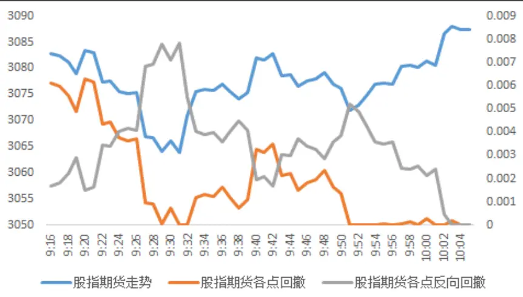
数据来源：广发证券发展研究中心

开盘50分钟内的平均回撤为0.0018，开盘50分钟内的平均反向回撤为0.0018，因此该样本的市场平稳度指数为0.0018，大于我们设定的阈值，我们判断当日为震荡市，趋势难以把握，尽管50分钟时盘中价格低于开盘价，我们没有开仓，从而避免了后市趋势反转造成的损失。

## 三、 实证结果

此处我们采用2010年4月16日至2012年12月31日的1分钟收盘价数据作为样本内进行回测，2013年1月4日至2015年2月25日的1分钟收盘价数据作为样本外进行测试，具体参数如下：

表1：模型参数

| 参数类型 参数取值 |  |
| --- | --- |
| 观察期起始时间 | 1 |
| 观察期结束时间 | 50 |
| 止损阈值 | 0.5% |
| 情绪平稳度阈值 | 9/10000 |
| 交易成本（双边） | 2/10000 |

资产收益及对应的股指期货收益如下图。

图9：平稳度指数交易模型资产累计收益
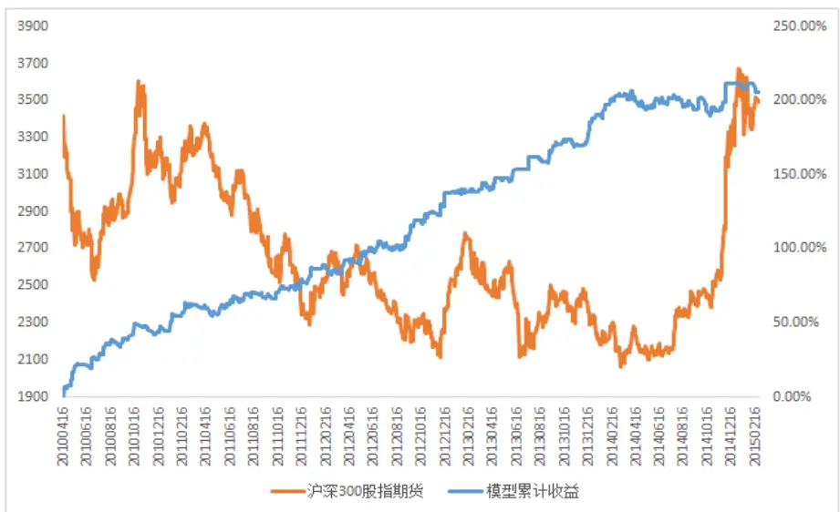
数据来源：广发证券发展研究中心

图10：平稳度指数交易模型回撤情况

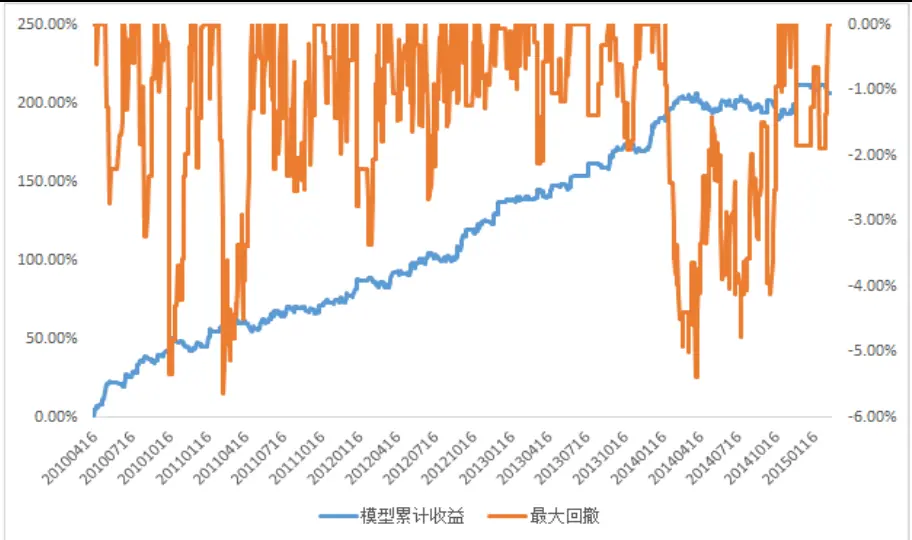
数据来源：广发证券发展研究中心

下表是该参数下市场平稳度模型的交易明细。

表2：平稳度指数交易模型交易明细

| 威廉指标 样本内 样本外 |  |  |
| --- | --- | --- |
| 交易总次数 | 324 | 196 |
| 平均持仓时间 | 161.11分钟 | 170.86分钟 |
| 最大单次盈利 | 5.54% | 4.19% |
| 最大单次亏损 | -1.30% | -0.98% |
| 获胜次数 | 152 | 97 |
| 失败次数 | 172 | 99 |
| 胜率 | 46.91% | 49.49% |
| 单次获胜平均收益率 | 1.15% | 0.73% |
| 单次失败平均亏损率 | -0.50% | -0.46% |
| 赔率 | 2.29 | 1.60 |
| 最大回撤 | -5.65% | -5.39% |
| 最大连胜次数 | 5 | 4 |
| 最大连亏次数 | 5 | 3 |
| 累计收益率 | 137.30% | 28.11% |
| 年化收益率 | 38.66% | 12.75% |

数据来源：广发证券发展研究中心

以下是不同平稳度指数开仓阈值情况下资产的累计收益情况，显然模型对于不同的开仓阈值具有很强的稳定性。

图11：不同开仓阈值条件下资产累计收益

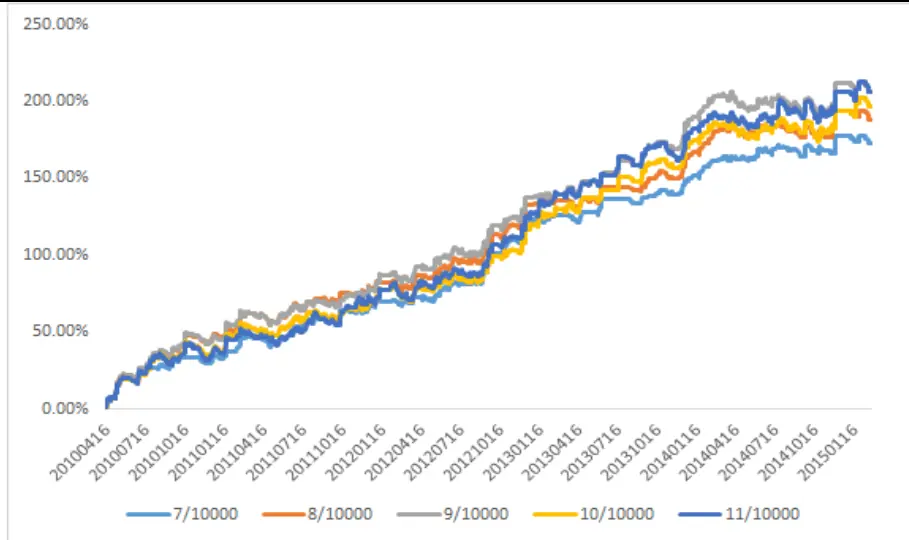
数据来源：广发证券发展研究中心

以下是不同开仓时间的资产的累计收益情况，模型对于不同的开仓时间也具有很强的稳定性。

图12：不同开仓时间条件下资产累计收益
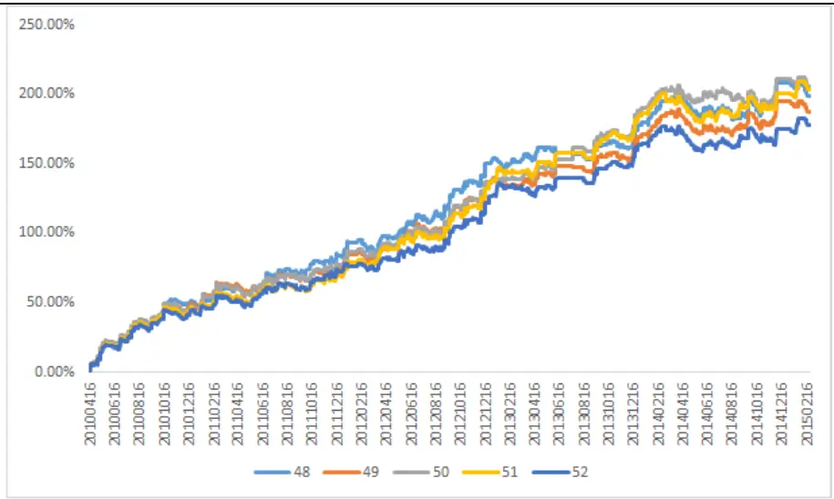
数据来源：广发证券发展研究中心

图13：市场平稳度指数过滤效果对比

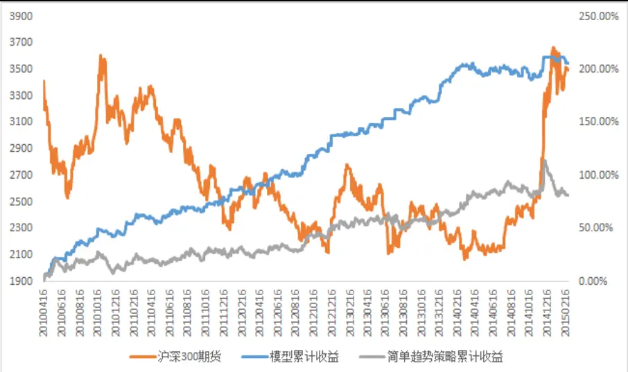
数据来源：广发证券发展研究中心

比较上图以及上表的数据，我们不难发现，采用市场平稳度指标过滤普通趋势交易信号之后，策略收益的胜率以及最大回撤率有了非常大的改进，从而证明了市场平稳度指标是十分有效的区分震荡与趋势的工具。

## 四、 日内多次开仓的市场平稳度模型

观察我们在第三小节中计算得出的样本内和样本外结果，我们遗憾地发现，该市场平稳度模型在2014年并没有取得骄人的成绩。资产收益曲线处于水平窄幅震荡的状态。因此我们需要进一步改进模型。

首先我们需要具体分析2014年以来具体回撤的原因。年初以来，随着市场的波动逐渐减小，使得日内趋势类策略难以取得较大的收益。同时在下半年的牛市中，虽然长时间上看，股指期货大幅单边上涨，可是随着日内震荡逐渐增多，日内趋势策略往往没能开仓，或者未能持有到期末就平仓止损了。

如下图中，虽然上午是平稳的单边趋势市，但是午后出现跳水，此时日内开仓一次的交易模型无法获利，最后平仓止损。

图14：上午与下午趋势相反时难以获利
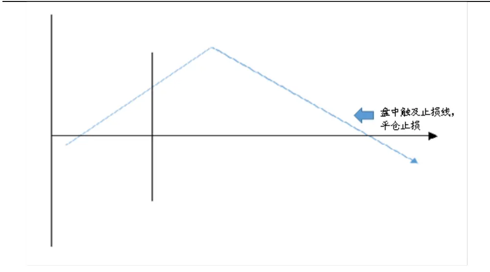
数据来源：广发证券发展研究中心

2014年以来的牛市中也往往出现早盘震荡而尾盘拉升的情况。日内开仓一次的交易模型未能开仓，损失了获利机会。

图15：上午震荡市下午趋势市时损失获利机会
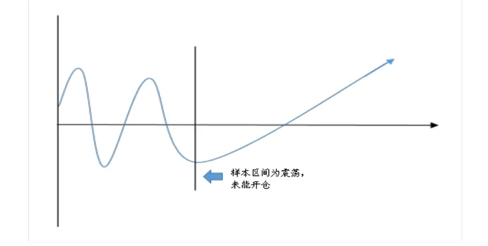
数据来源：广发证券发展研究中心
识别风险，发现价值

因此，随着市场行情的变化，我们有必要改进原始的策略，改变开仓频率，期以把握日内的不同趋势。

可是，问题又来了。怎样的开仓频率才是合适的呢？考虑到我们需要有足够长的时间序列样本用以分析股指走势的平稳程度，足够长的持仓时间用以获取利润以弥补交易成本，以及尽可能地减少参数数量，过高的开仓频率并不能取得最好的效果。我们考虑一日上午下午分别开仓的交易策略。

多次开仓的交易策略中，上午开仓同原始策略一致，观察开盘后50分钟的收盘价样本，随后决定是否开仓。但是在11：30上午收市时平仓。下午开盘则充分利用上午的数据，观察包括上午收盘数据在内11:12至13:32的数据样本，并在13:33决定下午是否开仓。

图16：多次开仓示意
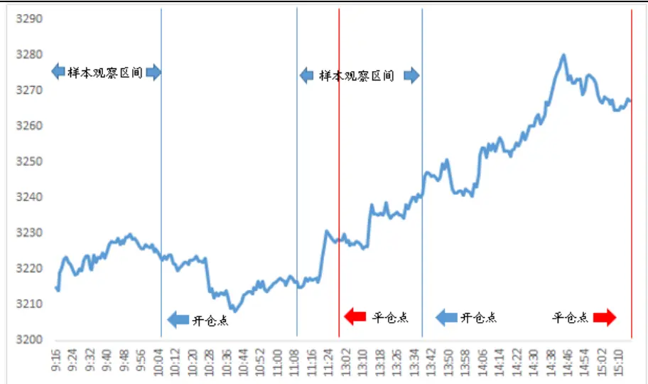
数据来源：广发证券发展研究中心

在上图所示的行情中，在当日开盘的上午，早盘表现为震荡市，不满足开仓条件。而下午开盘之后，结合上午盘面的样本分析，我们认为此事表现出了较强的趋势性，因此顺趋势开仓。

图17：多次开仓市场平稳度模型累计收益率
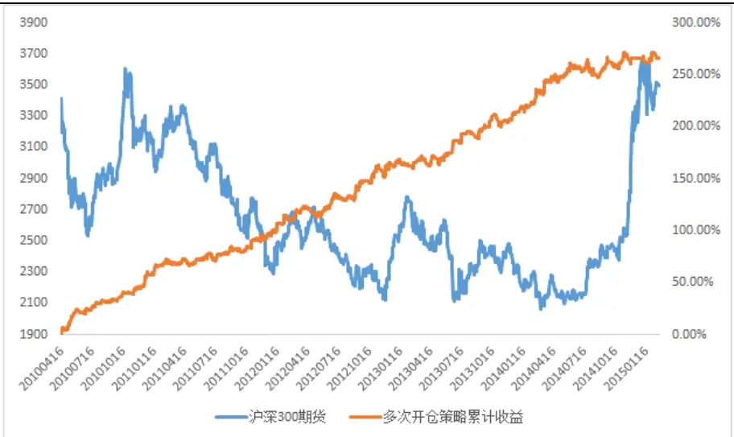
识别风险，发现价值
请务必阅读末页的免责声明

数据来源：广发证券发展研究中心

图18：多次开仓市场平稳度模型回撤情况
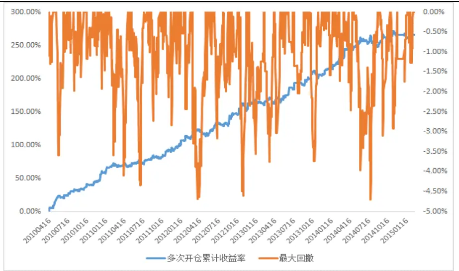
数据来源：广发证券发展研究中心

表3：多次开仓平稳度指数交易模型交易明细

| 威廉指标 | 样本内 | 样本外 |
| --- | --- | --- |
| 交易总次数 | 720 | 465 |
| 平均持仓时间 | 81.94分钟 | 83.30分钟 |
| 最大单次盈利 | 4.53% | 2.86% |
| 最大单次亏损 | -1.24% | -1.08% |
| 获胜次数 | 373 | 230 |
| 失败次数 | 347 | 235 |
| 胜率 | 51.81% | 49.46% |
| 单次获胜平均收益率 | 0.66% | 0.52% |
| 单次失败平均亏损率 | -0.42% | -0.38% |
| 赔率 | 1.59 | 1.36 |
| 最大回撤 | -4.69% | -4.71% |
| 最大连胜次数 | 5 | 6 |
| 最大连亏次数 | 4 | 5 |
| 累计收益率 | 168.96% | 31.58% |
| 年化收益率 | 45.38% | 14.22% |

数据来源：广发证券发展研究中心

对比多次开仓模型同单次开仓模型的交易数据，我们发现，由于开仓次数的增多，持仓时间缩短，单次交易的平均盈利也出现了自然的下降，而止损的阈值仍然设为千分之五，因此。赔率下降的同时，胜率也有了小幅的提高。最后模型的年化收益率和回撤情况都有了很大程度的改进。

图19：多次开仓策略与原始策略累计收益率对比

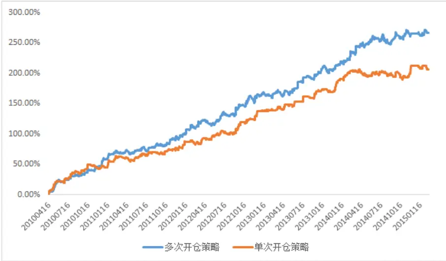
数据来源：广发证券发展研究中心

对比改进前和改进后的策略累计收益曲线，我们发现，2014年以来，虽然市场的波动情况发生了改变，日内单方向趋势行情发生频率逐渐降低，可是采用多次开仓策略依然保持了累计收益率的上升趋势。

最后，我们比较不同参数下多次开仓策略每次开仓的收益情况，发现利用该市场平稳度指数进行交易，将上午和下午开仓的累计收益率分开来看，无论是上午还是下午的交易对于开仓时间都表现出很强的参数稳定性。

图20：上午不同时间开仓
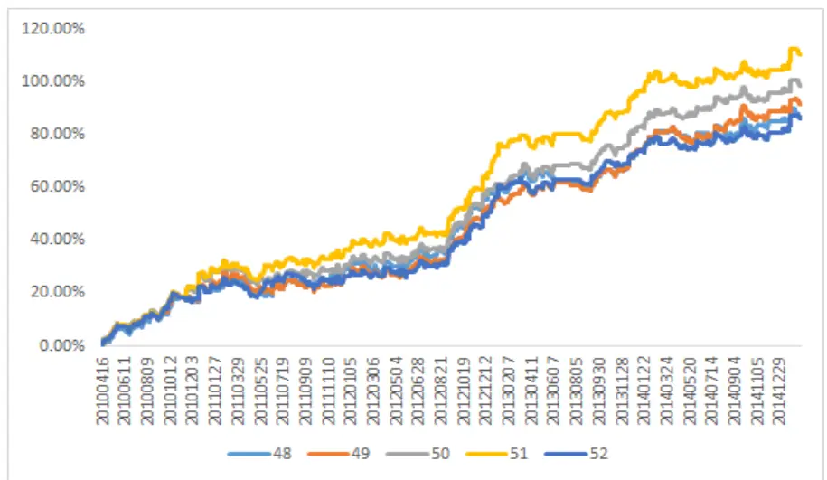
数据来源：广发证券发展研究中心

图21：下午不同时间开仓

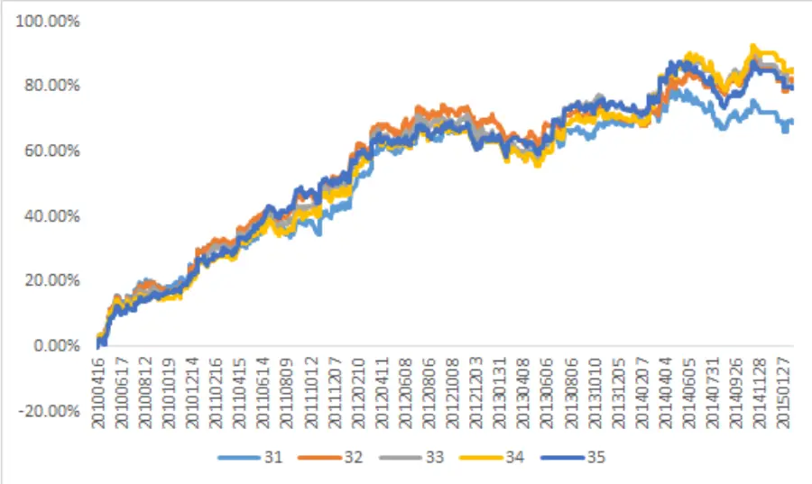
数据来源：广发证券发展研究中心

同时，对于不同开仓阈值也表现出很强的参数稳定性。

图22：不同开仓阈值条件下资产累计收益
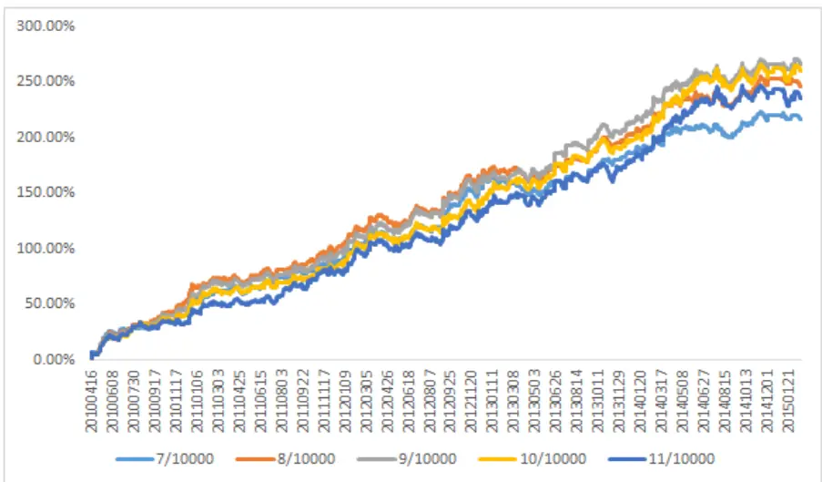
数据来源：广发证券发展研究中心

## 五、 总结

本报告中，我们受“回撤”思想的启发，重新定义时间序列样本的回撤与反向回撤，并定义二者均值中较小者作为描述市场情绪平稳程度的指标。平稳度指标越小，说明当日的趋势性越强，趋势跟随策略越容易获得成功。

2014年以来，市场每日单向趋势波动行情逐渐发生变化，市场日内宽幅震荡加剧，上午与下午的行情相关性逐渐减弱。早盘震荡的行情常常出现尾盘拉升，同时早盘趋势很强的行业也会出现盘中宽幅震荡。这种行情下，原始的持有到下午收盘的策略表现渐渐失色。对此我们综合考虑样本长度，交易成本以及参数数量等因素，确定了日内上午，下午分别开仓的多次开仓策略。分别取上午以及上午到下午的一段交易样本，利用重新定义的市场平稳度指标判断趋势或震荡，将日内行情分两次交易，保证了当日行情出现变化时也能及时把握交易机会。

本文采用2010年4月16日至2015年2月25日的当月股指期货1分钟线收盘价数据，双边万分之二的交易成本，千分之五止损。2010年4月16日至2012年12月31日为样本内优化参数，2013年1月4日至2015年2月25日作为样本外，多次开仓的市场平稳度模型表现良好。516个交易日内共交易465次，累计收益31.58%，年化收益率14.22%，最大回撤-4.71%，赔率1.36.同时模型表现出卓越的参数稳定性。

## 风险提示

策略模型并非百分百有效，市场结构及交易行为的改变或者交易参与者的增多有可能使得策略失效。

## Table_RatingIndustry 广发证券—行业投资评级说明

买入： 预期未来12个月内，股价表现强于大盘10%以上。

持有： 预期未来12个月内，股价相对大盘的变动幅度介于-10%～+10%。

卖出： 预期未来12个月内，股价表现弱于大盘10%以上。

## Table_RatingCompany 广发证券—公司投资评级说明

买入： 预期未来12个月内，股价表现强于大盘15%以上。

谨慎增持： 预期未来12个月内，股价表现强于大盘5%-15%。

持有： 预期未来12个月内，股价相对大盘的变动幅度介于-5%～+5%。

卖出： 预期未来12个月内，股价表现弱于大盘5%以上。

## Table_Ad联系我们

| 地址 | 广州市 广州市天河北路183号 | 深圳市 深圳市福田区金田路4018 | 北京市 北京市西城区月坛北街2号 | 上海市 上海市浦东新区富城路99号 |
| --- | --- | --- | --- | --- |
|  | 大都会广场5楼 | 号安联大厦 15 楼 A 座 03-04 | 月坛大厦18层 | 震旦大厦18楼 |
| 邮政编码 | 510075 | 518026 | 100045 | 200120 |
| 客服邮箱 | gfyf@gf.com.cn |  |  |  |
| 服务热线 | 020-87555888-8612 |  |  |  |

## Table_Disclaimer 免 责声 明

广发证券股份有限公司具备证券投资咨询业务资格。本报告只发送给广发证券重点客户，不对外公开发布。

本报告所载资料的来源及观点的出处皆被广发证券股份有限公司认为可靠，但广发证券不对其准确性或完整性做出任何保证。报告内容仅供参考，报告中的信息或所表达观点不构成所涉证券买卖的出价或询价。广发证券不对因使用本报告的内容而引致的损失承担任何责任，除非法律法规有明确规定。客户不应以本报告取代其独立判断或仅根据本报告做出决策。

广发证券可发出其它与本报告所载信息不一致及有不同结论的报告。本报告反映研究人员的不同观点、见解及分析方法，并不代表广发证券或其附属机构的立场。报告所载资料、意见及推测仅反映研究人员于发出本报告当日的判断，可随时更改且不予通告。

本报告旨在发送给广发证券的特定客户及其它专业人士。未经广发证券事先书面许可，任何机构或个人不得以任何形式翻版、复制、刊登、转载和引用，否则由此造成的一切不良后果及法律责任由私自翻版、复制、刊登、转载和引用者承担。