# 风格动量下的股指期货跨品种套利策略

## 另类交易策略系列之二十二

## Table_Sum ary报告摘要 ：

## 风格投资是永不落幕的话题

基于风格轮动的投资策略，一直在机构投资者的投资活动中占据不可或缺的地位。风格动量效应指的是过去一段时间内表现优异的风格组合会在未来的一段时间内继续保持其优异的表现，而过去一段时间内表现不佳的风格组合则会在未来的一段时间内持续其不好的表现。也就是说，不同风格组合的表现，似乎具有“惯性”，能维持一段时间。但这一“惯性”持续时间有限，证券的价格最终会逐渐趋向价值，这一过程又称为风格反转。

国外投资者经常关注价值和成长的风格轮动效应。对于国内的投资者而言，大盘股和小盘股的风格轮动则更受关注。

## 市场的有效性检验

A 股市场是否存在显著的风格动量，这是研究风格投资策略的前提。在交易中和统计学中，可预测性都是随机性的对立面。因此，我们使用非参数游程检验，对不同频率下市场数据的随机性进行分析。对于高频测度下的大多数样本，游程检验在 95%的臵信度上拒绝了随机游走的原假设；而在低频测度下，游程检验所度量的市场无效程度均出现明显下降，甚至完全消失。

## 风格动量下的股指期货跨品种套利策略

通过假设检验，我们认为在日度频率下，A 股市场存在显著的大小盘股风格动量效应。基于这样的思路，我们提出基于风格动量的股指期货跨品种套利策略，使用中证500股指期货、上证 50股指期货、沪深 300股指期货进行跨品种套利，使用现货指数进行回测。该策略不需要引入参数进行优化，却取得优异的风险收益表现，三类套利组合均可获得较高信息比。其中表现最好的是，对中证500指数和上证50指数进行跨品种套利，年化收益率高达 32.41%（未加杠杆），2007 年以来最大回撤率仅为-9.07%。另外，风格套利由于多空两端均为股指期货（保证金交易），因此可以在较低成本下加杠杆，提高策略收益。

图1:50-500套利策略表现（无杠杆）
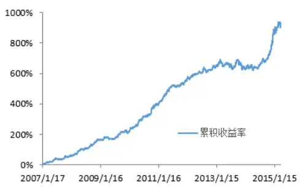

图 2:50-300 套利策略表现（无杠杆）
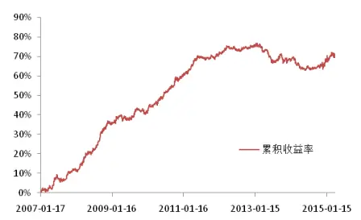
图 3:300-500 套利策略表现（无杠杆）

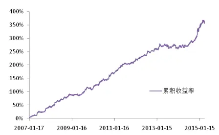

Table_Aut hor 分析师： 张超 S0260514070002

公020-87555888-8646

zhangchao@gf.com.cn

## 一、风格动量与风格投资

## （一）风格动量效应

根据现代投资组合理论，一个股票投资组合应包括多个类型的股票，且同一组合中的股票应具有较小的相关性。然而，越来越多的实证研究表明，采用这样的投资组合并不是获利的唯一方式。

Barberis和Shleifer（2003）提出了“风格动量效应”和“风格反转效应”。他们按照不同的风格特征，将股票进行分类，例如成长股和价值股，大盘股和小盘股等等。同一风格的股票的上涨或者下跌会有持续性，过去一段时间内表现优异的风格组合会在未来的一段时间内继续保持其优异的表现，而过去一段时间内表现不佳的风格组合则会在未来的一段时间内持续其不好的表现。也就是说，风格组合的表现，似乎具有“惯性”，能维持一段时间。因此，买入近期上涨的股票风格组合，同时卖出近期下跌的股票风格组合，有可能获取正的收益率。

许多国外的学者，通过对国外股票市场的实证研究，证明了风格动量效应确实存在。Grinblatt、Titman and Vlermers（1995）研究了共同基金，发现基金更倾向于投资前一段时间上涨的股票，这样的投资行为是风格动量效应形成的一个原因。Rouwenhorst（2002）的实证研究证明了新兴市场的股票也具有风格动量效应，小盘股的表现胜于大盘股，价值型股票的表现胜于成长性股票。另一方面，Merton（1987）研究了美国股票市场，研究结果表明，小盘股和大盘股出现了轮动表现。在一个时间周期内（大致 4-7周）表现差的一方，将在下一个时间周期内有良好的表现。风格动量效应与风格反转效应均得到证实。George（2004）的研究则证明了价值型股票和成长型股票之间同样具有风格轮动现象，投资者可以在价值型风格组合与成长型风格组合之间轮换投资，获取收益。Chahine, Salim（2008）通过对 1988-2003年的欧洲股票市场数据进行分析，认为被低估的价值型股票明显战胜成长型股票。

相对于国外市场丰富的研究，对我国大陆股票市场风格动量的研究仍然较为缺乏。部分研究表明大陆股票市场存在风格动量效应，基于风格动量的投资策略可以获得明显的正收益。但也有部分研究表明大陆股票市场与欧美成熟市场不同，基本不存在风格动量效应。

本篇报告主要对 A股市场大盘股和小盘股的风格动量效应做实证研究，并提出基于风格动量的股指期货跨品种套利策略。

## （二）风格动量的产生原因

根据行为金融学理论，当影响股票的事件发生，投资者产生的反应经常是有偏的。例如，投资者会过度高估对某一板块的利好消息，或者对某一板块的利空消息产生过度恐慌。在过度反应的过程中，经常伴随着持续性上涨或持续性下跌。另外也有研究表明，同一风格的股票具有许多共同的特征，因此会对宏观经济或者重大事件表现出相似的股价反应。同时，投资者的心理也会对这一联动现象产生正反馈影响。

综上，风格动量产生主要是投资者各种复杂心理活动共同产生的结果。

## 二、上证 50 和中证 500 股指期货合约

## （一）上证50股指期货合约

《上证50股指期货合约》经中国金融期货交易所董事会执行委员会2015年第四次会议审议通过，并已报告中国证监会，于2015年3月27日发布，上市时间为2015年4月16日。

表 1：上证 50股指期货合约

| 合约标的 上证 50 指数 |
| --- |
| 合约乘数 每点300元 |
| 报价单位 指数点 |
| 最小变动价位 0.2点 |
| 合约月份 当月、下月及随后两个季月 |
| 交易时间 上午：9:15-11：30，下午：13:00-15:15 |
| 最后交易日交易时间 上午：9:15-11：30，下午：13:00-15:00 |
| 每日价格最大波动限制 上一交易日结算价的±10% |
| 最低交易保证金 合约价值的 8% |
| 最后交易日 合约到期月份的第三个周五，遇国家法定假日顺延 |
| 交割日期 同最后交易日 |
| 交割方式 现金交割 |
| 交易代码 IH |
| 上市交易所 中国金融期货交易所 |

数据来源：中国金融期货交易所

## （二）中证500 股指期货合约

《中证500股指期货合约》经中国金融期货交易所董事会执行委员会2015年第四次会议审议通过，并已报告中国证监会，于2015年3月27日发布，上市时间为2015年4月16日。

表 2：中证 500股指期货合约

| 合约标的 中证 500 指数 |
| --- |
| 合约乘数 每点 200 元 |
| 报价单位 指数点 |
| 最小变动价位 0.2点 |
| 合约月份 当月、下月及随后两个季月 |
| 交易时间 上午：9:15-11：30，下午：13:00-15:15 |
| 最后交易日交易时间 上午：9:15-11：30，下午：13:00-15:00 |
| 每日价格最大波动限制 上一交易日结算价的±10% |
| 最低交易保证金 合约价值的 8% |
| 最后交易日 合约到期月份的第三个周五，遇国家法定假日顺延 |
| 交割日期 同最后交易日 |
| 交割方式 现金交割 |
| 交易代码 IC |
| 上市交易所 中国金融期货交易所 |

数据来源：中国金融期货交易所

## 三、市场的有效性检验

## （一）市场的可预测性及有效性

每位交易员与每一个交易系统都旨在产生能够在大量交易中获得稳定收益的信号。为了寻找这些信号，不论是交易员还是计量经济学家设计的系统交易平台都在极力寻找能够预测所选证券未来价格走势的蛛丝马迹。在交易中和统计学中，可预测性都是随机性的对立面。因此，所有交易系统的目标都是找到区分可预测性与随机价格运动的方法，然后对可以预测的部分采取相应的行动。

未来是不确定的，但如果某些时间能够重复发生的话，过去的历史就能为我们预测未来提供一定的线索。因此，科学地分析某一特定金融证券的方法，就是确定该证券的价格变化是否随机的。如果价格变化确实是随机的，那么在这个证券上找到可稳定获利的交易机会的可能性微乎其微。反过来，如果价格变化不是随机的，那么该金融证券就具有持续的可预测性，值得进行更加深入的研究。

交易机会的相对多寡可以用市场有效程度来度量。在有效市场（Fama，1970）中，所交易证券的价格会立即反应所有的可用信息。如果信息是慢慢整合到证券价格之中的，那么就会存在套利机会，同时可以认为该市场是无效的。寻找具有套利机会的市场也即寻找无效市场。套利机会本身就是市场的无效之处。在有效市场中，当信息出现时，证券价格会立即调整到新的水平。而在无效市场中，信息公开证券价格就开始调整（“信息泄露”），信息公开之后，价格通常还会有短暂的过度反应（“反应过度”）。很多可靠的交易策略就是利用信息泄露和反应过度来产生稳定收益的。

市场越无效，具有可预测性的交易机会就越多。对市场效率进行检验可以帮助我们发现市场在多大程度上存在可预测性的交易机会。

市场有效性假说具有几个“层次”：弱式有效、半强式有效和强式有效。对市场弱式有效进行检验，就是要看是否能通过历史价格和收益率对未来收益率进行预测。其他形式的市场有效性这是限制了预测未来价格时所能考虑的信息范围。强式有效包含所有类型的公开和非公开信息；半强式有效则不考虑信息集合中的非公开信息。与当代其他有关市场有效性的学术文献一样，我们这里只讨论对弱式有效性的检验。

## （二）非参数游程检验

多年以来，已经发展出了多种对市场有效性进行检验的方法。其中最早的一个是由 Louis Bachelier在1900年提出的，该方法度量一系列连续的正的或者负的价格变动（或称“游程”）出现的概率。就像抛掷一枚硬币一样，连续的两个价格变动具有相同符号（比如一个正的变动接着另一个正的变动）的概率为1/(22)=0.25或者25%。连续三个价格变动具有相同符号的概率为1/(23)=0.125 或者 12.5%。连续四个价格变动具有相同符号的可能性更小，其概率为 1/(24)=0.0625 或者 6.25%。无论在什么频率下，多个连续的具有相同符号的价格变动都提供了一个交易机会，只要交易所得能够覆盖掉交易成本即可。

## 其检验过程如下：

1. 对所要求频率下的价格运动样本数据，记录下包含同方向价格运动的序列的个数。如果所要求的频率是每一笔交易，那么一个游程就是每笔交易价格变动严格为正或者严格为负的序列。

在这里，我们通过一个简单的例子来介绍游程检验。样本数据采用中证500指数与上证 50 指数的涨幅，频率选用半年度。两个指数涨幅的差值体现了大盘股与小盘股的强弱关系。我们希望通过检验这个差值的随机性，来判断风格动量的存在性。表 3 给出了 2007-2015 年中证 500 指数与上证 50 指数的涨幅的差值变动情况。

涨幅差值定义为：中证500 指数的半年度涨幅-上证50 指数的半年度涨幅。如果涨幅差值为正，意味着在这半年内小盘股表现优于大盘股；如果涨幅差值为负，意味着在这半年内大盘股表现优于小盘股。如表 3 所示，从 2007 年到 2014 年，共有 11 个半年度小盘股表现优于大盘股，差值符号为正，有 5 个半年度大盘股表现优于小盘股，差值符号为负。正的游程在“游程”列中标记为“P”，负的游程标记为“N”。因此，标记为“P2”的时间段对应第二个连续正差值的游程，标记为“N1”的时间段对应的是第一个负的游程。

2. 记样本中观测到的所有的游程的总数（包括正的和负的）为u。此外，记样本中正的涨幅差值的数量为 n1，负的涨幅差值的数量为 n2。表 3 所示样本中，u=8，n1=11，n2=5。

3. 在一个随机样本中，记游程总数的期望值为 x，标准差为 s，根据期望与标准差的定义，可得：

$$
x=\frac{2n_{1}n_{2}}{n_{1}+n_{2}}+1\tag{1}
$$

$$
s=\sqrt{\frac{2n_{1}n_{2}\left(2n_{1}n_{2}-n_{1}-n_{2}\right)}{\left(n_{1}+n_{2}\right)^{2}\left(n_{1}+n_{2}-1\right)}}\tag{2}
$$

识别风险，发现价值

在表 3 的例子中，计算可得 x=7.875，s=1.641。

4. 接下来，我们检验实际出现的游程数目（u=8）是否能表明统计上的非随机性。如果游程数目u与均值x的偏差在 1.645倍标准差s 以上，则可以在95%的统计臵信度下认为该频率下的游动是非随机的，或者说是可以预测的。如果以Z值为基础的双边检验被拒绝，则游程的数据是非随机的。Z 值的计算方法为

$$
\frac{\left|u-x\right|-0.5}{s}\tag{3}
$$

公式中的 0.5 是连续调整矫正因子（Wallis 和 Roberts(1956)）。总而言之，只要Z的绝对值大于1.645，就可以在95%的统计臵信度下拒绝游程随机的原假设。若 Z 的绝对值小于1.645，则不能拒绝游程随机的原假设。

在表 3 的例子中，经计算 Z=-0.229；因此，此样本中半年度涨跌幅差值变化的随机性不能被拒绝。

表 3：2007-2014 年中证500 指数与上证 50 指数的半年度涨幅差值变动情况

| 日期 | 中证 500 涨幅 | 上证 50 涨幅 | 涨幅差值 | 差值的符号 | 游程 |
| --- | --- | --- | --- | --- | --- |
| 2007-06-29 | 110.33% | 67.85% | 42.47% | + | P1 |
| 2007-12-28 | 31.66% | 42.34% | -10.68% | 一 | N1 |
| 2008-06-30 | -43.31% | -48.91% | 5.60% | 十 | P2 |
| 2008-12-31 | -30.55% | -37.23% | 6.68% | 十 | P2 |
| 2009-06-30 | 75.16% | 71.24% | 3.92% | 十 | P2 |
| 2009-12-31 | 29.01% | 6.81% | 22.20% | 十 | P2 |
| 2010-06-30 | -17.58% | -28.43% | 10.85% | + | P2 |
| 2010-12-31 | 32.10% | 7.87% | 24.23% | 十 | P2 |
| 2011-06-30 | -5.16% | 2.20% | -7.37% | 一 | N2 |
| 2011-12-30 | -27.59% | -17.50% | -10.09% | 一 | N2 |
| 2012-06-29 | 8.22% | 7.03% | 1.19% | + | P3 |
| 2012-12-31 | -4.43% | 10.49% | -14.92% | 一 | N3 |
| 2013-06-28 | 0.02% | -14.60% | 14.63% | + | P4 |
| 2013-12-31 | 18.43% | 4.14% | 14.29% | 十 | P4 |
| 2014-06-30 | 2.93% | -4.23% | 7.17% | + | P4 |
| 2014-12-31 | 36.85% | 75.17% | -38.31% | 一 | N4 |

数据来源：wind资讯、广发发展研究中心

以上的测算结果无法说明在半年度周期下中证500指数与上证50指数的涨幅差值具有风格动量效应。那么，在其他时间频率下的测算结果又如何呢？表 4 总结了2007年至今，中证500指数涨幅与上证 50指数涨幅的差值在不同频率下的游程检验结果。表5和表6则分别给出了沪深 300指数涨幅与上证 50指数涨幅的差值、中证500 指数涨幅与沪深300指数涨幅的差值在不同频率下的游程检验结果。检验的结果大体上呈现如下规律：在高频测度（周、日、1小时、10 分钟、5 分钟和1分钟）下大多数样本显示出严重的市场无效现象，而在低频测度（半年度和月）下市场无效程度会下降，甚至完全消失。

表 4：2007 年至今中证500指数与上证 50 指数在不同频率下游程检验的结果

| 数据频率 | n₁ n₂ | u | X | Z |  | 结论 |
| --- | --- | --- | --- | --- | --- | --- |
| 半年度 | 11 | 5 | 8 | 7.88 | -0.229 | 随机 |
| 月 | 57 | 42 | 55 | 49.36 | 1.062 | 随机 |
| 周 | 226 | 195 | 176 | 210.36 | 3.322 | 非随机 |
| 日 | 1127 | 870 | 846 | 982.96 | 6.212 | 非随机 |
| 1 小时 | 4499 | 3495 | 3470 | 3934.95 | 10.557 | 非随机 |
| 10分钟 | 25600 | 22351 | 23982 | 23866.43 | 1.056 | 随机 |
| 5分钟 | 50542 | 45338 | 55179 | 47799.77 | 47.800 | 非随机 |
| 1分钟 | 247238 | 231810 | 204989 | 239276.6 | 99.180 | 非随机 |

数据来源：wind资讯、天软科技、广发发展研究中心

表 5：2007 年至今沪深300指数与上证 50 指数在不同频率下游程检验的结果

| 数据频率 | n₁ n2 | u | X |  | Z | 结论 |
| --- | --- | --- | --- | --- | --- | --- |
| 半年度 | 9 | 7 | 6 | 8.88 | 1.25 | 随机 |
| 月 | 56 | 43 | 52 | 49.65 | 0.381 | 随机 |
| 周 | 212 | 208 | 179 | 210.98 | 3.076 | 非随机 |
| 日 | 904 | 1093 | 877 | 990.56 | 5.107 | 非随机 |
| 1 小时 | 4308 | 3686 | 3614 | 3973.80 | 8.087 | 非随机 |
| 10分钟 | 25051 | 22900 | 23839 | 23928.25 | 0.812 | 随机 |
| 5 分钟 | 49363 | 46519 | 52842 | 47899.82 | 31.946 | 非随机 |
| 1分钟 | 243126 | 235916 | 239429 | 239467.7 | 0.111 | 随机 |

数据来源：wind资讯、天软科技、广发发展研究中心

表 6：2007 年至今中证500指数与沪深 300 指数在不同频率下游程检验的结果

| 数据频率 | n₁ | n2 | u | X | Z | 结论 |
| --- | --- | --- | --- | --- | --- | --- |
| 半年度 | 11 | 5 | 8 | 7.88 | -0.229 | 随机 |
| 月 | 56 | 43 | 45 | 49.65 | 0.853 | 随机 |
| 周 | 232 | 189 | 186 | 209.30 | 2.249 | 非随机 |
| 日 | 1125 | 872 | 840 | 983.47 | 6.505 | 非随机 |
| 1 小时 | 4495 | 4399 | 3451 | 3935.95 | 11.008 | 非随机 |
| 10分钟 | 25522 | 22430 | 24413 | 23877.31 | 4.908 | 非随机 |
| 5 分钟 | 50617 | 45265 | 56184 | 47792.63 | 54.366 | 非随机 |
| 1分钟 | 247213 | 231844 | 197013 | 239283.0 | 122.268 | 非随机 |

数据来源：wind资讯、天软科技、广发发展研究中心

## 四、风格动量下的套利策略

## （一）策略设计

具体的策略如下：取一固定时间单位（如周、日、小时），若在上一时间单位大盘股表现优于小盘股（上证 50涨跌幅减去中证500涨跌幅后为正值），则在下一时间单位建立资金等量反向头寸（做多上证50股指期货和做空中证 500股指期货）；若在上一时间单位小盘股表现优于大盘股（上证 50涨跌幅减去中证500涨跌幅后为负值），则在下一时间单位建立资金等量反向头寸（做空上证 50 股指期货和做多中证 500股指期货）。

基于第三部分的游程分析结果，在高频测度下大部分样本体现出非随机的统计特性。那么，在实际投资中又应该具体使用哪一个或者哪几个频率呢？若选择过高的频率，容易导致单笔交易平收益率过低，无法覆盖频繁交易带来的高昂成本。若选择偏低的频率，每次交易持仓时间过长，导致风险大大增加，无法利用高杠杆。另一方面，游程检验仅能对样本的随机性进行分析，而风格动量效应的出现还必须满足 u<x，即实际游程数显著小于随机数据的游程数量均值。综合以上考虑，我们在实测中选用日数据。

## （二）实证结果

本实证使用2007年1月17 日至2015年4 月8 日的中证 500指数、上证50指数、沪深 300指数的每日收盘价数据。在实测中，每次交易我们考虑 0.02%的双边交易成本以及最低15%的交易保证金比例（若加杠杆）。由于使用日线数据测算，累积收益率的计算采用复利。

图 2和表7给出了不加杠杆的情况下，跨品种套利策略用于中证 500股指期货和上证 50股指期货时的表现；图 3和表8给出了不加杠杆的情况下，跨品种套利策略用于沪深 300股指期货和上证 50股指期货时的表现；图4 和表 9给出了不加杠杆的情况下，跨品种套利策略用于中证 500股指期货和沪深 300股指期货时的表现。

可以看到，基于风格动量的股指期货跨品种套利策略对不同的股指期货品种表现不一。策略用于中证500股指期货和沪深 300股指期货时有最佳的收益情况，年化收益率高达 32.41%；用于沪深 300股指期货和上证 50 股指期货时收益情况较差，年化收益率仅有 6.69%，但策略依然有效。

图 1：中证 500和上证 50跨品种套利策略表现（无杠杆）
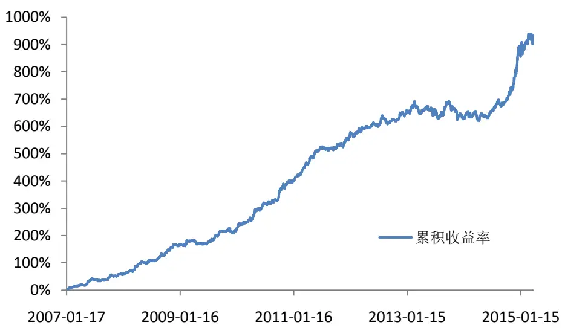
数据来源：广发证券发展研究中心、wind资讯
识别风险，发现价值

表 7：中证 500和上证 50跨品种套利策略表现（无杠杆）

| 累积收益率 932.47% |
| --- |
| 年化收益率 32.41% |
| 平均收益率 0.12% |
| 交易总次数 1996 |
| 收益率标准差 0.0067 |
| 获胜次数 1151 |
| 失败次数 845 |
| 胜率 57.67% |
| 平均盈利率 0.55% |
| 平均亏损率 -0.46% |
| 盈亏比（绝对值） 1.18 |
| 信息比 2.75 |
| 最大回撤 -9.07% |
| 单次最大盈利 3.57% |
| 单次最大亏损 -3.07% |
| 最大连胜次数 10 |
| 最大连亏次数 10 |

数据来源：广发证券发展研究中心、wind资讯

图 2：沪深 300和上证 50跨品种套利策略表现（无杠杆）
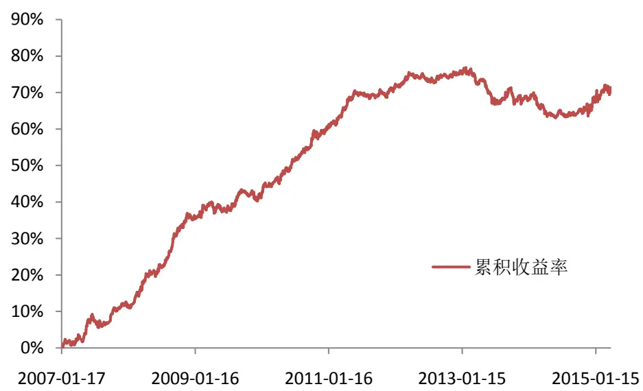
数据来源：广发证券发展研究中心、wind资讯

表 8：沪深 300 和上证 50 跨品种套利策略表现（无杠杆）

| 累积收益率 | 71.39% |
| --- | --- |
| 年化收益率 | 6.69% |
| 平均收益率 | 0.03% |
| 交易总次数 | 1996 |

识别风险，发现价值

| 收益率标准差 | 0.0025 |
| --- | --- |
| 获胜次数 | 1120 |
| 失败次数 | 876 |
| 胜率 | 56.11% |
| 平均盈利率 | 0.19% |
| 平均亏损率 | -0.19% |
| 盈亏比（绝对值） | 1.05 |
| 信息比 | 1.72 |
| 最大回撤 | -7.80% |
| 单次最大盈利 | 1.06% |
| 单次最大亏损 | -1.09% |
| 最大连胜次数 | 10 |
| 最大连亏次数 | 8 |

数据来源：广发证券发展研究中心、wind资讯

图 3：中证 500和沪深 300跨品种套利策略表现（无杠杆）
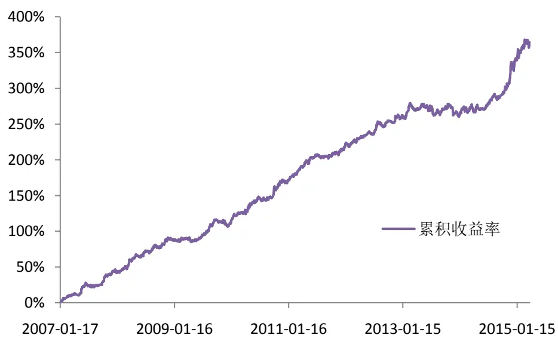
数据来源：广发证券发展研究中心、wind资讯

表 9：中证 500和沪深 300跨品种套利策略表现（无杠杆）

| 累积收益率 360.19% |
| --- |
| 年化收益率 20.15% |
| 平均收益率 0.08% |
| 交易总次数 1996 |
| 收益率标准差 0.0046 |
| 获胜次数 1157 |
| 失败次数 839 |
| 胜率 57.97% |
| 平均盈利率 0.37% |
| 平均亏损率 -0.33% |

识别风险，发现价值

| 盈亏比（绝对值） | 1.14 |
| --- | --- |
| 信息比 | 2.59 |
| 最大回撤 | -5.00% |
| 单次最大盈利 | 2.65% |
| 单次最大亏损 | -2.10% |
| 最大连胜次数 | 9 |
| 最大连亏次数 | 11 |

数据来源：广发证券发展研究中心、wind资讯

从以上测算结果可以看出，该策略的一个明显的优点在于，由于期货多空两端均采用保证金交易，因此策略能使用较高的杠杆。为确定使用杠杆的安全区间，我们对三个指数的日涨跌幅数据做了统计。图5、图6和图7分别给出了中证500指数、上证 50指数、沪深300指数的每日涨跌幅（2007年 1 月 17 日至 2015 年 4 月 8 日）频率分布直方图。取频率分布的上下 1%分位数，可得中证 500指数每日涨跌幅的上1%分位数为5.75%，下1%分位数为-7.51%；上证50指数每日涨跌幅的上 1%分位数为5.80%，下 1%分位数为-6.70%；沪深 300指数每日涨跌幅的上 1%分位数为5.57%，下1%分位数为-6.80%。

因此，在99%的臵信度下，可以认为该策略应用于中证 500股指期货和上证50股指期货，或中证500股指期货和沪深300股指期货时，市场日波动不会超过7.51%；而当策略应用于沪深300股指期货和上证50股指期货时，市场日波动不会超过6.80%。假设保证金比例为 15%，则理论上允许的最大杠杆分别为4.4倍和 4.6倍。

根据以上讨论，我们采用4倍杠杆进行测算。图8和表 10 给出了4 倍杠杆的情况下，跨品种套利策略用于中证 500股指期货和上证50股指期货时的表现；图 9和表 11给出了4倍杠杆的情况下，跨品种套利策略用于沪深 300股指期货和上证50股指期货时的表现；图4和表 12给出了4倍杠杆的情况下，跨品种套利策略用于中证 500股指期货和沪深300股指期货时的表现。

图 4：中证 500指数涨跌幅频率分布直方图
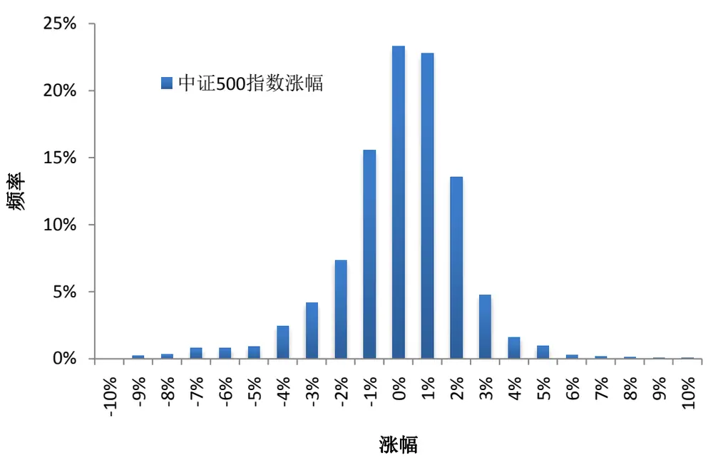
数据来源：广发证券发展研究中心、wind资讯

图 5：上证 50指数涨跌幅频率分布直方图
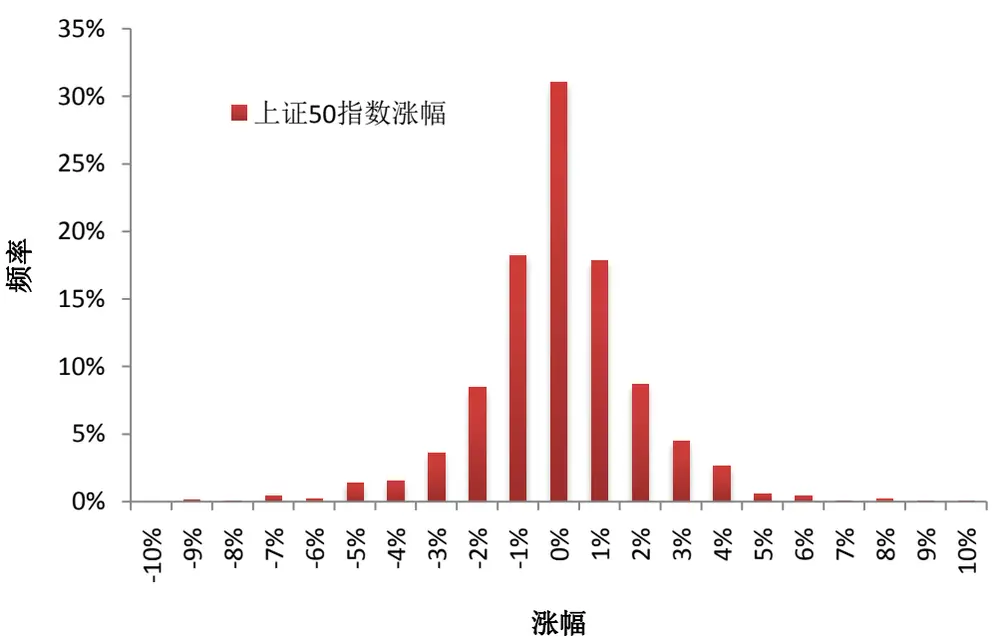
数据来源：广发证券发展研究中心、wind资讯

图 6：沪深 300指数涨跌幅频率分布直方图
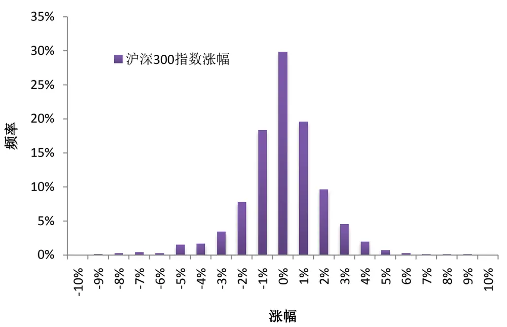
数据来源：广发证券发展研究中心、wind资讯

图 7：中证 500和上证 50跨品种套利策略表现（4 倍杠杆）
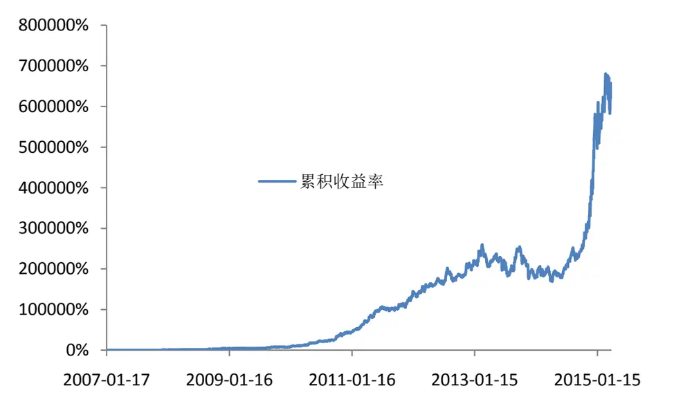
数据来源：广发证券发展研究中心、wind资讯

表 10：中证 500和上证 50跨品种套利策略表现（4倍杠杆）

| 累积收益率 | 657260% |
| --- | --- |
| 年化收益率 | 187.78% |
| 平均收益率 | 0.48% |
| 交易总次数 | 1996 |
| 收益率标准差 | 0.0269 |
| 获胜次数 | 1151 |
| 失败次数 | 845 |
| 胜率 | 57.67% |
| 平均盈利率 | 2.18% |
| 平均亏损率 | -1.85% |
| 盈亏比（绝对值） | 1.18 |
| 信息比 | 2.75 |
| 最大回撤 | -34.92% |
| 单次最大盈利 | 14.30% |
| 单次最大亏损 | -12.29% |
| 最大连胜次数 | 10 |
| 最大连亏次数 | 10 |

数据来源：广发证券发展研究中心、wind资讯

图 8：沪深 300和上证 50跨品种套利策略表现（4 倍杠杆）
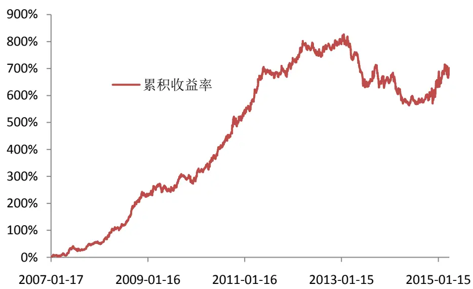
数据来源：广发证券发展研究中心、wind资讯

表 11：沪深 300和上证 50跨品种套利策略表现（4倍杠杆）

| 累积收益率 701.94% |
| --- |
| 年化收益率 28.44% |
| 平均收益率 0.11% |
| 交易总次数 1996 |
| 收益率标准差 0.0099 |
| 获胜次数 1120 |
| 失败次数 876 |
| 胜率 56.11% |
| 平均盈利率 0.77% |
| 平均亏损率 -0.74% |
| 盈亏比（绝对值） 1.05 |
| 信息比 1.72 |

识别风险，发现价值

| 最大回撤 | -28.40% |
| --- | --- |
| 单次最大盈利 | 4.24% |
| 单次最大亏损 | -4.35% |
| 最大连胜次数 | 10 |
| 最大连亏次数 | ∞ |

数据来源：广发证券发展研究中心、wind资讯

图 9：中证 500和沪深 300跨品种套利策略表现（4倍杠杆）
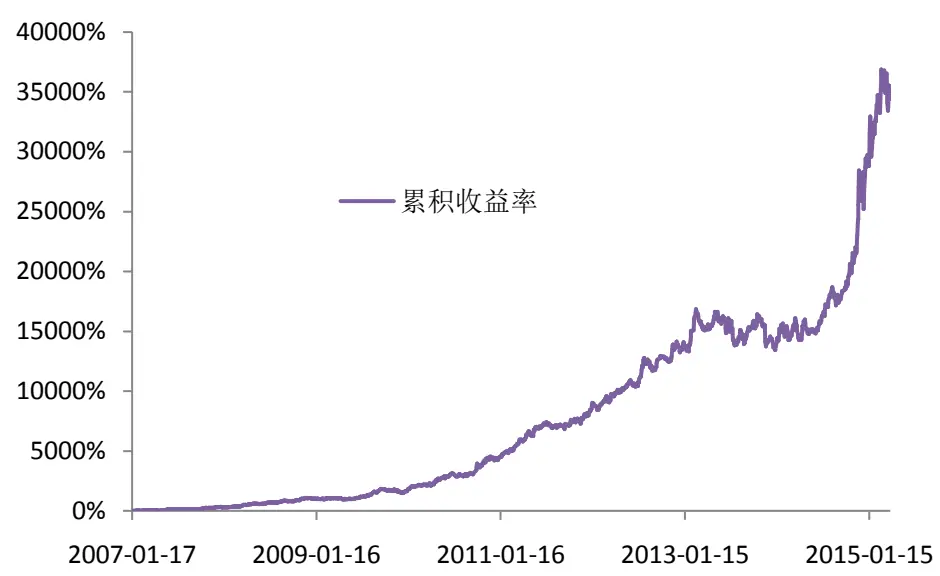
数据来源：广发证券发展研究中心、wind资讯

表 12：中证 500和沪深 300 跨品种套利策略表现（4 倍杠杆）

| 累积收益率 34393.44% |
| --- |
| 年化收益率 101.90% |
| 平均收益率 0.31% |
| 交易总次数 1996 |
| 收益率标准差 0.0186 |
| 获胜次数 1157 |
| 失败次数 839 |
| 胜率 57.97% |
| 平均盈利率 1.48% |
| 平均亏损率 -1.31% |
| 盈亏比（绝对值） 1.14 |
| 信息比 2.59 |
| 最大回撤 -20.13% |
| 单次最大盈利 10.60% |
| 单次最大亏损 -8.41% |
| 最大连胜次数 9 |
| 最大连亏次数 11 |

数据来源：广发证券发展研究中心、wind资讯
识别风险，发现价值

## 五、总结

本篇报告提出了一种基于风格动量的股指期货跨品种交易策略。我们认为在高频测度下，市场无效性明显。在日度频率下，A股市场存在显著的大小盘风格动量效应。基于这样的思路，我们使用中证 500股指期货、上证 50股指期货、沪深300股指期货进行跨品种套利，回测采用现货指数。该策略不需要引入参数，避免了过度优化的可能性。实证结果表明策略简单而有效，在有限的风险之下取得非常可观的累积收益。

感谢发展研究中心金融工程组实习生邱捷铭为本篇研究报告所做的工作。

## 风险提示

本篇报告通过历史数据进行建模与实证，得到良好的回测效果。但由于市场具有不确定性，交易模型仅在统计意义下有望获得良好投资效果，敬请广大投资者注意模型单次失效的风险。

## Table_RatingIndustry 广发证券—行业投资评级说明

买入： 预期未来 12 个月内，股价表现强于大盘 10%以上。

持有： 预期未来12个月内，股价相对大盘的变动幅度介于-10%～+10%。

卖出： 预期未来12个月内，股价表现弱于大盘10%以上。

## Table_RatingCompany 广发证券—公司投资评级说明

买入： 预期未来12个月内，股价表现强于大盘15%以上。

谨慎增持： 预期未来12个月内，股价表现强于大盘5%-15%。

持有： 预期未来12个月内，股价相对大盘的变动幅度介于-5%～+5%。

卖出： 预期未来12个月内，股价表现弱于大盘5%以上。

## Table_Ad联系我们

| 地址 | 广州市 广州市天河北路183号 | 深圳市 深圳市福田区金田路4018 | 北京市 | 上海市 |
| --- | --- | --- | --- | --- |
|  | 大都会广场5楼 | 号安联大厦 15 楼 A 座 03-04 | 北京市西城区月坛北街2号 月坛大厦18层 | 上海市浦东新区富城路99号 震旦大厦18楼 |
| 邮政编码 | 510075 | 518026 | 100045 | 200120 |
| 客服邮箱 | gfyf@gf.com.cn |  |  |  |
| 服务热线 | 020-87555888-8612 |  |  |  |

## Table_Disclaimer 免 责声 明

广发证券股份有限公司具备证券投资咨询业务资格。本报告只发送给广发证券重点客户，不对外公开发布。

本报告所载资料的来源及观点的出处皆被广发证券股份有限公司认为可靠，但广发证券不对其准确性或完整性做出任何保证。报告内容仅供参考，报告中的信息或所表达观点不构成所涉证券买卖的出价或询价。广发证券不对因使用本报告的内容而引致的损失承担任何责任，除非法律法规有明确规定。客户不应以本报告取代其独立判断或仅根据本报告做出决策。

广发证券可发出其它与本报告所载信息不一致及有不同结论的报告。本报告反映研究人员的不同观点、见解及分析方法，并不代表广发证券或其附属机构的立场。报告所载资料、意见及推测仅反映研究人员于发出本报告当日的判断，可随时更改且不予通告。

本报告旨在发送给广发证券的特定客户及其它专业人士。未经广发证券事先书面许可，任何机构或个人不得以任何形式翻版、复制、刊登、转载和引用，否则由此造成的一切不良后果及法律责任由私自翻版、复制、刊登、转载和引用者承担。