# 股指期货高频追杀趋势策略

## 另类交易策略系列之二十三

## Table_Sum ary报告摘要 ：

## 股指高频空间具有明显趋势性

在低频交易中，要准确预测每天或每周的市场涨跌并不容易。然而我们发现，市场波动在高频空间中具有明显的趋势性。一个时间周期内若出现了上涨或下跌趋势，一般会延续到下一个时间周期。基于此，我们提出了适用于高频交易的追涨杀跌策略，即捕捉趋势、顺势而为。

## 根据现货趋势性预测股指期货波动方向

由于趋势性的存在，我们尝试使用一个时间周期内的股指期货走势预测下一个周期内的走势，在实证中却发现该策略无效。经分析，我们发现策略失效的原因在于股指期货日内走势波动剧烈，噪声较大，容易触发错误的开仓信号。同时，我们发现现货走势与期货走势高度相关，却更为平稳。因此我们使用现货的趋势预测期货，实证发现策略有效。

## 限价委托下的追涨杀跌策略

对于高频交易策略，我们更关注其在实际盘口限价委托下的表现。实证发现，限价委托会使策略表现下降，但策略仍然有效。而作为高频交易策略，追涨杀跌策略的资金容量同样有限。在资金量为 1 手的情况下，样本外累积收益率14.44%，最大回撤率-4.42%；在资金量为 10手的情况下，样本外累积收益率率10.72%，最大回撤率-5.28%。

## 不同交易频率下追涨杀跌策略的有效性

我们发现趋势性会随着频率的上升而增强。然而，当选用了更高的交易频率时，策略失效。原因在于当交易频率过高时，每次交易持仓时间过短，平均收益太低，无法覆盖包括冲击成本在内的交易成本，从而导致亏损。实证中我们测算了 10 秒、30 秒、1 分钟、2 分钟、5 分钟交易频率下的策略表现，实证结果表明 2 分钟和 5 分钟交易频率下趋势性不明显，策略无效；10秒交易频率下趋势性显著，但获利无法覆盖交易成本；30 秒与1分钟交易频率下，策略表现出了较好的风险收益特性。

图追杀策略累积收益率（样本外）
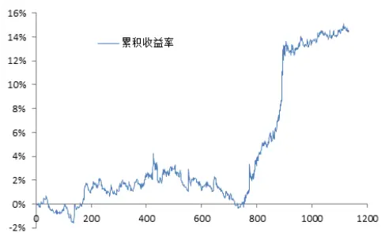

表追杀策略交易统计（样本外）

| 回测区间 | 2012-01-04 至2014-12-31 |
| --- | --- |
| 累积收益率 | 14.44% |
| 胜率 | 48.28% |
| 盈亏比 | 2.24 |
| 最大回撤 | -4.42% |
| 信息比 | 1.29 |

Table_Aut hor 分析师： 张超 S0260514070002

020-87555888-8646

zhangchao@gf.com.cn

## Table_Report 相关研究：

基于 HP 滤波的高频混合交易 2013-02-25策略

在标度不变性破缺下洞察资2012-07-09金流向——MFT交易策略

## 一、神秘的市场微观结构

## （一）“追涨杀跌”是投资大忌吗

一般的，投资的理想状况是能做到“低买高卖”，而“追涨杀跌”则被认为是投资中的大忌。在我们的前期报告《笑看北雁南飞南雁北归》中，提出了卖出“超涨”股票、买入“超跌”股票的投资策略，实现“低买高卖”。

以上策略的有效性是在周度或者月度的测算下得到验证的。然而，从市场的微观结构出发，我们发现“追涨杀跌”是高频交易中的一个有效策略。

我们研究了股指期货日内波动的微观结构，根据波动的趋势建仓。当股指期货打开上涨趋势时，顺势开多仓，并在短时间内平仓。同理，当股指期货开启下降趋势时，顺势开空仓，同样在短时间内平仓。

## （二）市场微观结构与高频交易

市场微观结构主要研究价格形成过程。价格的形成过程中，买方和卖方各自独立判断证券的价值，并把自己的估价体现在申报的买入价和卖出价中。同时，这些报价又使得市场投资者能够了解到其他投资者的估价。这个过程持续进行，直到价格波动至大多数市场投资者都认可的区间内。这一过程称为 tatonnement，意为“试错过程”。根据价格的形成过程，市场价格必然存在波动并运行在一个价格区间之内，而不是处于某个恒定价格水平。

市场微观结构交易的理念就是从观察到的报价数据中提取信息，并依据提取的信息进行交易以获利。在市场微观结构下，每次交易持有头寸的时间长度可以从几秒到几小时不等。在市场微观结构下的交易是高频交易的核心。

什么是高频交易，它的魅力何在呢？相对于低频交易而言，高频交易的主要创新之处是其在计算机的驱动之下，对变化的市场迅速做出反应，并实现资金的快速周转。高频交易的特征是交易次数更多，而每笔的平均盈利较少。高频交易并不试图去发现那些 100元大钞，而且不断捡起随处可见的1元钱。积土成山，风雨兴焉，这便是高频交易。

近年来，高频交易的策略逐渐受到国内私募基金的重视，出现了多个优秀的代表性的产品，例如青骓衍生品高频 1期（年化收益率204.80%，成立以来收益率365.95%），银帆3期（年化收益率 36.64%，成立以来收益率 196.04%），鑫兰瑞1期（年化收益率 22.89%，成立以来收益率 270.27%）。这三个基金的净值走势如图 1所示。

图1：三个代表性高频交易基金净值走势
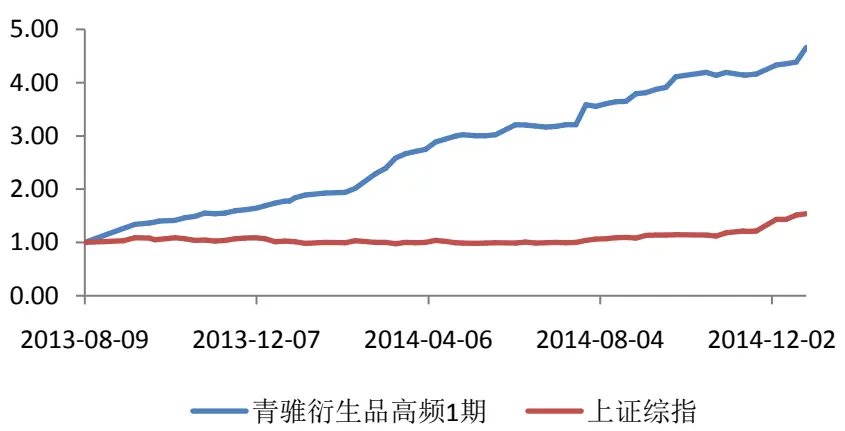

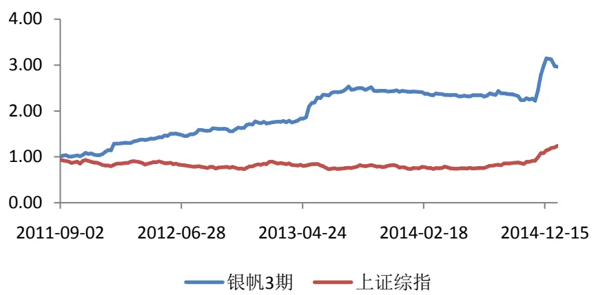

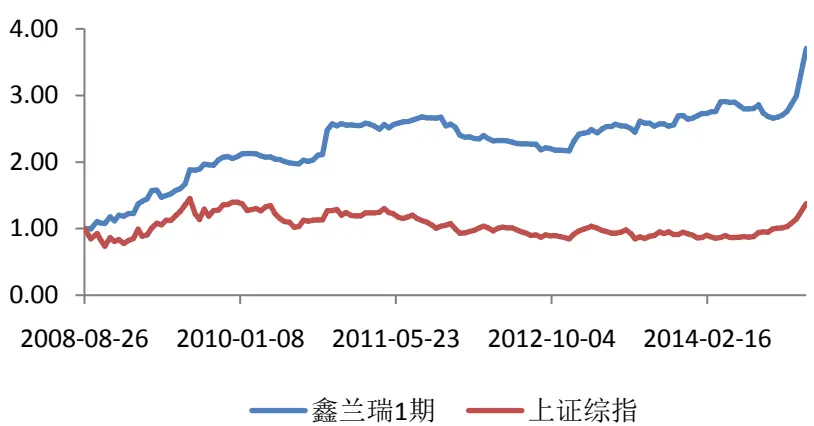
数据来源：wind 资讯

## 二、对高频趋势追涨杀跌的思路

要对股指期货的高频趋势追涨杀跌，首先必须判断当前股指期货的趋势。由于股指期货的走势与现货的走势具有高度相关性，因此期货和现货都可以用来预测期货的走势。然而通过测算，使用期货预测期货的效果，远逊于用现货预测期货。我

识别风险，发现价值

们认为，原因在于期货的日内走势噪声较大。我们再次测算了期货和现货一分钟走势的每日（9:30～15:00，2010年04月16日至2014年12月31日）拐点数（第i个点的价格比第i-1和第i+1个点的价格都高或者低，则为一个拐点），结果如图2所示。可以看到，期货的拐点数明显多于现货，也就是说期货噪声更大。由于噪声主要以震荡出现，一旦振幅到达阈值容易引发错误的建仓信号，因此应当选用走势更加平稳、趋势性更加明显的现货来预测期货。

图2：现货与期货的每日拐点数
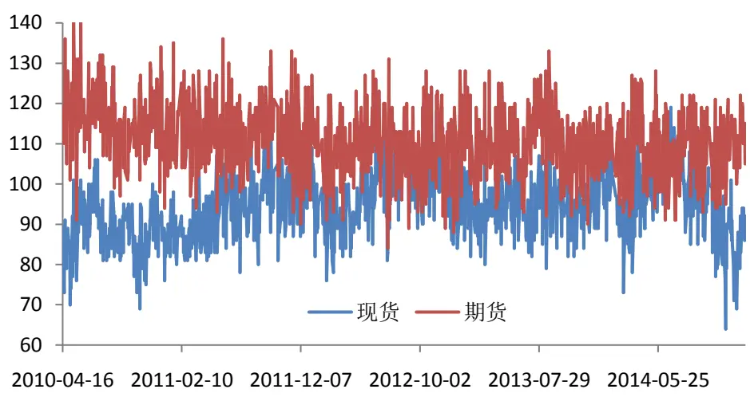
数据来源：广发证券发展研究中心、天软科技

本文提出的追涨杀跌策略的大致思路就是：监视现货（即沪深 300指数）的一分钟涨跌幅；当涨幅（或跌幅）超过设定的阈值时，认为上涨（或下跌）趋势开启，在下一分钟开始时立即对股指期货开多仓（或空仓），持仓一分钟后平仓。由于交易频率很高，回撤风险可控，故不设盘中止盈止损。

## 三、沪深 300 股指期货实证

## （一）实证说明

（1）数据说明：本实证选取 2010年4月16 日至2014 年 12月31日的沪深300现货和股指期货高频数据。其中，2010年 4月 16日至 2011年 12月 30日的现货、期货高频数据作为样本内数据，用于涨跌幅阈值的选取；2012 年1 月4 日至2014年12 月31日的数据作为样本外数据。在实测中，每次交易我们考虑 0.01%的双边交易成本（符合目前中金所与期货公司的实际交易费率）。考虑到高频交易具有交易频率高、单次交易收益率低的特点，本篇报告中所有的累积收益率均采用单利计算。

（2）策略评价方法：策略评价我们选取累积收益率、最大回撤率、信息比等衡量风险与收益的指标。

## （二）策略表现初探

我们对第二部分所介绍的追涨杀跌交易策略进行了初步测算。首先通过样本内数据选择最优的阈值，优化的目标是收益回撤比最大，即同时考虑风险和收益情况。随后将最优的阈值用于样本外，以初步观察追涨杀跌策略的表现。

关于阈值的选取，我们通过统计沪深300指数现货2010年4月16号至2011年12月30日期间的1分钟涨跌幅度（定义为：(i分钟收盘价-(i-1)分钟收盘价)/ (i-1)分钟收盘价）的频率分布，如图 3 所示。由于样本数足够大，因此可以将样本内的频率分布作为涨跌幅概率分布的一个估计，从而根据样本内数据确定出合适的分位数作为阈值。超过阈值的涨跌幅可当做小概率事件。若出现如此大的涨跌幅，我们认为并不是普通的震荡，而是上涨或下跌趋势开启的标志。

图3：现货一分钟涨跌幅度频率分布图
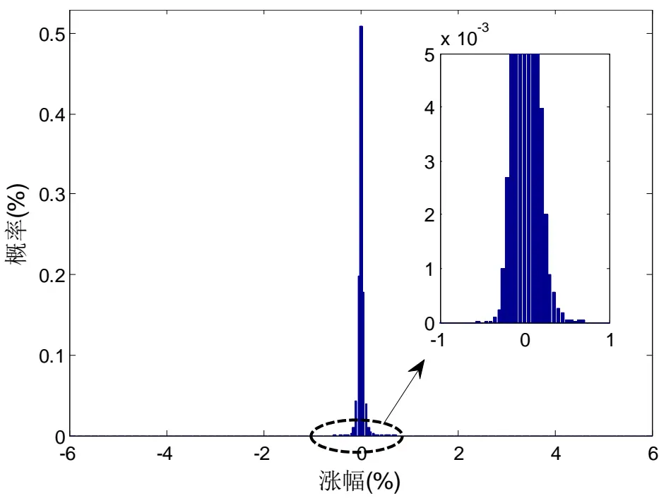
数据来源：广发证券发展研究中心、天软科技

通过测算样本内数据在不同α值下的双侧α分位数，并进一步求出各组分位数对应的样本内累积收益率和最大回撤，则可以根据收益回撤比选择最优的分位数值，以求用较小的风险获得较好的收益。测算的结果如图4 和表 1所示。

图4：样本内不同双侧α分位数对应的风险收益情况
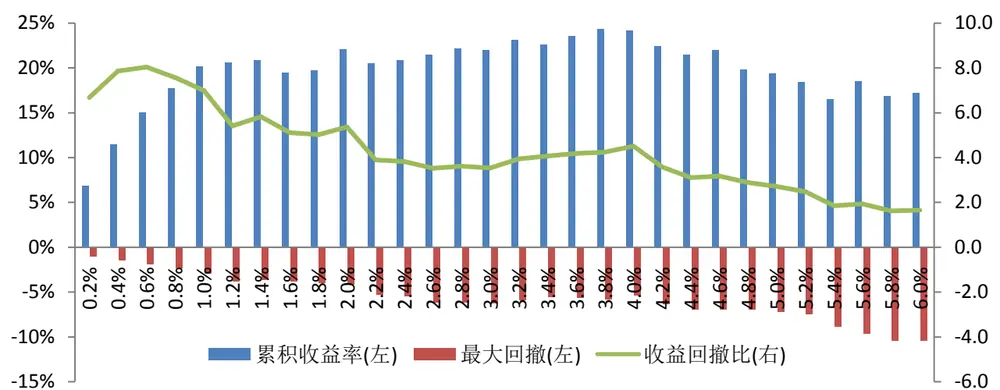
数据来源：广发证券发展研究中心、天软科技

表 1：样本内不同双侧α分位数对应的风险收益情况

| α | 下分位数 | 上分位数 | 累积收益率 | 最大回撤 | 收益回撤比 |
| --- | --- | --- | --- | --- | --- |
| 0.2% | -0.2379% | 0.3385% | 6.81% | -1.02% | 6.67 |
| 0.4% | -0.2078% | 0.2773% | 11.42% | -1.45% | 7.86 |
| 0.6% | -0.1890% | 0.2465% | 14.97% | -1.86% | 8.03 |
| 0.8% | -0.1756% | 0.2252% | 17.70% | -2.34% | 7.57 |
| 1.0% | -0.1656% | 0.2076% | 20.13% | -2.88% | 6.99 |
| 1.2% | -0.1566% | 0.1945% | 20.59% | -3.80% | 5.42 |
| 1.4% | -0.1509% | 0.1852% | 20.83% | -3.58% | 5.82 |
| 1.6% | -0.1453% | 0.1749% | 19.42% | -3.80% | 5.11 |
| 1.8% | -0.1408% | 0.1675% | 19.68% | -3.92% | 5.01 |
| 2.0% | -0.1361% | 0.1610% | 22.10% | -4.12% | 5.36 |
| 2.2% | -0.1322% | 0.1549% | 20.51% | -5.27% | 3.89 |
| 2.4% | -0.1289% | 0.1505% | 20.86% | -5.46% | 3.82 |
| 2.6% | -0.1256% | 0.1460% | 21.46% | -6.10% | 3.52 |
| 2.8% | -0.1230% | 0.1417% | 22.13% | -6.12% | 3.62 |
| 3.0% | -0.1205% | 0.1381% | 22.01% | -6.24% | 3.53 |
| 3.2% | -0.1183% | 0.1344% | 23.10% | -5.86% | 3.94 |
| 3.4% | -0.1159% | 0.1310% | 22.59% | -5.56% | 4.06 |
| 3.6% | -0.1138% | 0.1281% | 23.56% | -5.63% | 4.19 |
| 3.8% | -0.1118% | 0.1249% | 24.32% | -5.74% | 4.24 |
| 4.0% | -0.1099% | 0.1226% | 24.14% | -5.36% | 4.50 |
| 4.2% | -0.1080% | 0.1203% | 22.39% | -6.26% | 3.58 |
| 4.4% | -0.1066% | 0.1185% | 21.42% | -6.89% | 3.11 |
| 4.6% | -0.1049% | 0.1163% | 21.94% | -6.91% | 3.17 |
| 4.8% | -0.1034% | 0.1142% | 19.83% | -6.87% | 2.88 |
| 5.0% | -0.1018% | 0.1123% | 19.35% | -7.14% | 2.71 |
| 5.2% | -0.1007% | 0.1101% | 18.40% | -7.43% | 2.48 |

识别风险，发现价值

| 5.4% | -0.0992% | 0.1085% | 16.46% | -8.86% 1.86 |
| --- | --- | --- | --- | --- |
| 5.6% | -0.0982% | 0.1070% 18.50% | -9.59% | 1.93 |
| 5.8% | -0.0971% | 0.1052% | 16.84% | -10.38% 1.62 |
| 6.0% | -0.0961% | 0.1036% | 17.21% -10.37% | 1.66 |

数据来源：广发证券发展研究中心、天软科技

根据以上测算结果，上下分位数分别选择0.2465%和-0.1890%，对应的样本内累积收益率和最大回撤分别为 14.97%和-1.86%。将该分位数用于样本外（2012年 1月4日至2014年12月31日）进行测算，测算中考虑0.01%的双边交易成本，不考虑实际的盘口委托情况。样本外追杀策略的表现如图5 和表2 所示。

图5：追涨杀跌策略表现初探（2012年1月4日至2014年12月31日）
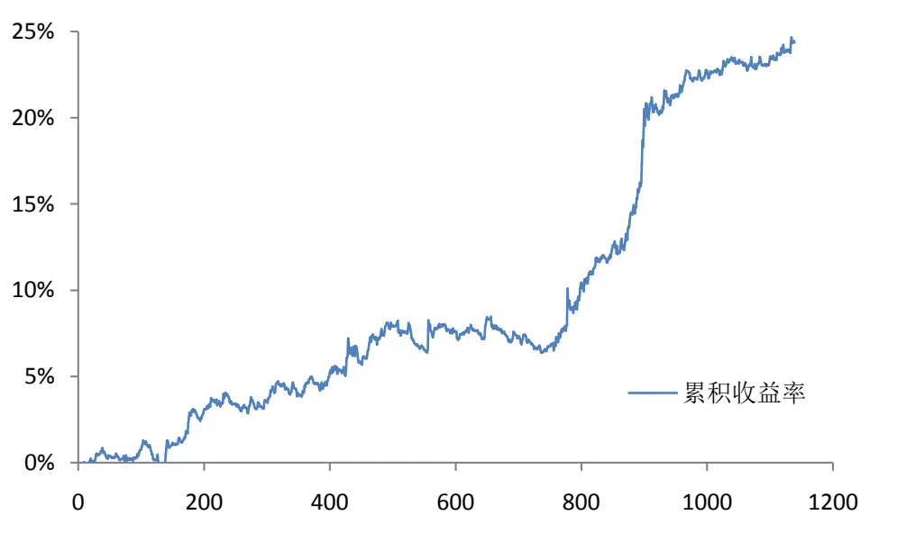
数据来源：广发证券发展研究中心、天软科技

表 2：追涨杀跌策略表现初探（2012 年1 月 4日至2014 年 12 月31 日）

| 累积收益率 24.35% |
| --- |
| 年化收益率 8.12% |
| 平均收益率 0.02% |
| 交易总次数 1139 |
| 收益率标准差 0.0021 |
| 获胜次数 569 |
| 失败次数 570 |
| 胜率 49.96% |
| 平均盈利率 0.16% |
| 平均亏损率 -0.11% |
| 盈亏比（绝对值） 1.37 |
| 信息比 1.30 |
| 最大回撤 -1.93% |
| 单次最大盈利 2.13% |

识别风险，发现价值

| 单次最大亏损 | -1.00% |
| --- | --- |
| 最大连胜次数 | 8 |
| 最大连亏次数 | 9 |

数据来源：广发证券发展研究中心、天软科技

从收益率曲线可以看出，低回撤是该策略的一个明显优点。因此，可以使用较大的杠杆以增加收益。图6和表3 给出了使用3 倍杠杆的风险收益情况。可以看到，在 3倍杠杆之下，累积收益率大幅提高，而最大回撤仅有约-5%，策略在较低的风险之下得到了较好的累积收益。

图6：追涨杀跌策略表现初探（3倍杠杆）
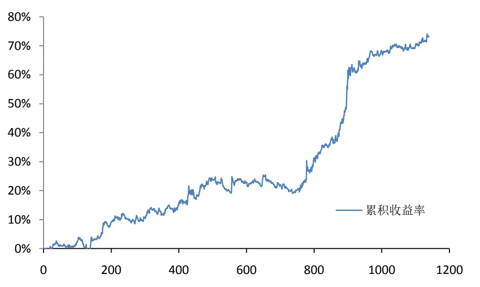
数据来源：广发证券发展研究中心、天软科技

表 3：追涨杀跌策略表现初探（3 倍杠杆）

| 累积收益率 | 73.05% |
| --- | --- |
| 年化收益率 | 24.36% |
| 平均收益率 | 0.06% |
| 交易总次数 | 1139 |
| 收益率标准差 | 0.0064 |
| 获胜次数 | 569 |
| 失败次数 | 570 |
| 胜率 | 49.96% |
| 平均盈利率 | 0.47% |
| 平均亏损率 | -0.34% |
| 盈亏比（绝对值） | 1.37 |
| 信息比 | 1.30 |
| 最大回撤 | -5.01% |
| 单次最大盈利 | 6.39% |
| 单次最大亏损 | -3.00% |

识别风险，发现价值

| 最大连胜次数 8 |
| --- |
| 最大连亏次数 9 |

数据来源：广发证券发展研究中心、天软科技

本报告提出的追涨杀跌策略，实际上是通过捕捉急涨急跌的趋势获利。那么，一天之中是否有某些时间段出现急涨急跌的概率更大，而某些时间段则更容易出现震荡呢？因此，我们测算了日内分时收益率分布。图7 分别给出了2011年至 2014年每年的日内收益率分布统计情况，以 10分钟为间隔。可以看到，收益率的分布并没有明显的规律可循，说明趋势与震荡随机分布于日内各个时间段，本报告提出的追涨杀跌策略在整个交易时间段内均适用。

图7：2011年至2014年日内分时收益率分布
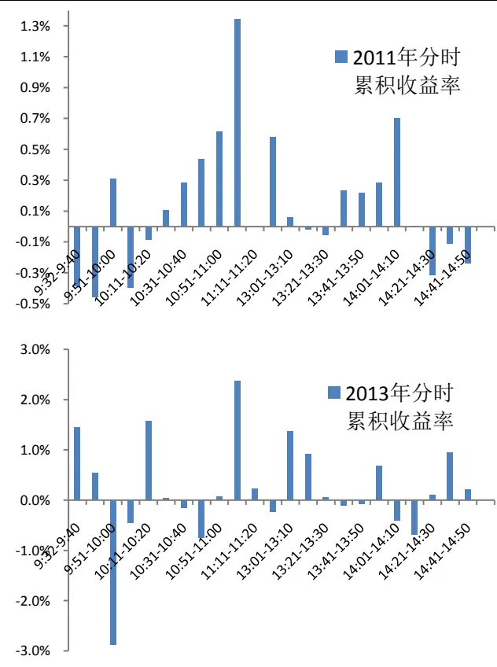
数据来源：广发证券发展研究中心

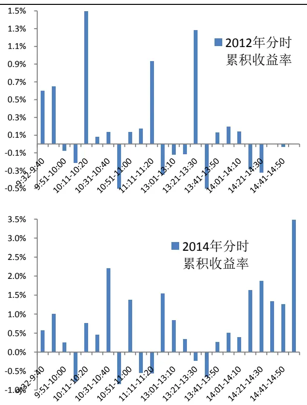

## （三）盘口价格限价委托下的测算结果

上述的测算全部基于一种理想化的假设：每次交易都能按开仓、平仓信号出现1秒后的最新成交价格进行成交。这样的假设并不能代表实际。在实际投资中，开平仓信号出现 1秒后的成交价格是无法提前预知的，也就无法准确进行限价委托；而即使知道了最新的成交价格并按该价格下单，也无法确保顺利交易，因为成交与否还跟在委托单中的排序有关。交易频率越高，每次交易资金量越大，这样的假设与实际交易的差距也会随之变大。

为了验证本报告提出的追涨杀跌策略在实际交易中的效果，我们对 1 分钟频率下的策略进行了测算。测算时先假定资金量为 1 手。当t 分钟结束开仓信号出现时，以 t+1分钟开盘价挂限价单，如果该分钟内能成交，以t+1分钟结束时的卖一价（对应平空单）或买一价（对应平多单）平仓。这种情况下的测算结果如图 8 和表 4所示。

图8：盘口价格限价委托下的累积收益率（直接买一卖一价平仓）
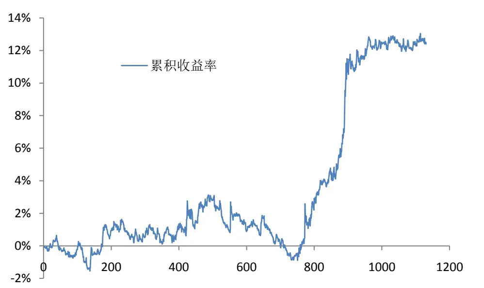
数据来源：广发证券发展研究中心、天软科技

表 4：盘口价格限价委托下的风险收益统计（直接买一卖一价平仓）

| 累积收益率 12.40% |
| --- |
| 年化收益率 4.13% |
| 平均收益率 0.011% |
| 交易总次数 1131 |
| 收益率标准差 0.0021 |
| 获胜次数 538 |
| 失败次数 593 |
| 胜率 47.57% |
| 平均盈利率 0.15% |
| 平均亏损率 -0.12% |
| 盈亏比（绝对值） 1.30 |
| 信息比 0.76 |
| 最大回撤 -3.89% |
| 单次最大盈利 2.10% |
| 单次最大亏损 -1.00% |
| 最大连胜次数 8 |
| 最大连亏次数 9 |

数据来源：广发证券发展研究中心、天软科技

根据图8和表4的测算结果，策略的实际表现与理想情况有不小的差距。挂限价单开仓且直接买一卖一价平仓的情况下，累积收益率大幅缩减，仅有12.40%，而且最大回撤也变差，达-3.89%。与初测中使用的“开盘价开仓，收盘价平仓”的理想情况相比，可以认为影响策略表现的可能原因有两个：或者是限价单开仓导致成交次数下降，或者是直接买一卖一平仓导致成交价不理想。为了进一步探明原因，我们对交易次数以及每一分钟结束时的盘口数据做了测算，如图 9所示。

图9：限价单开仓且买一卖一平仓VS理想情况
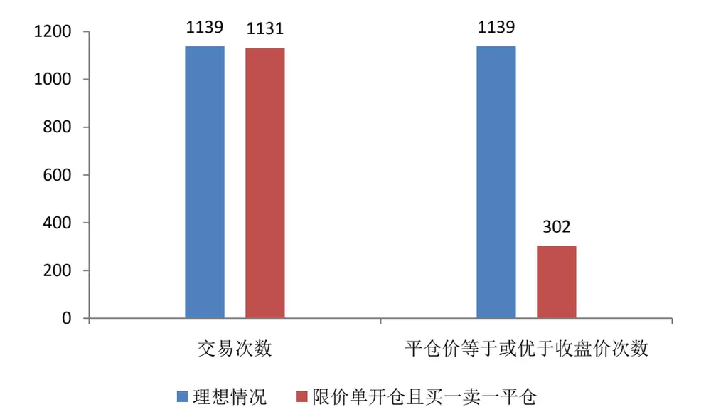
数据来源：广发证券发展研究中心、天软科技

可以看到，限价单开仓对交易次数并没有显著影响，而直接使用买一卖一价平仓，则使得大量委托单成交在不理想的价位。因此，我们考虑另一种平仓方式：同样假定资金量为 1手，t分钟结束时发出开仓信号，t+1分钟的开盘价限价单若能成交，则在 t+1分钟结束时以收盘价挂限价单，若在1 分钟内无法成交，则在t+2分钟结束时以卖一价（对应平空单）或买一价（对应平多单）平仓。在这种平仓方式下，我们再次对策略的表现做测算，结果如图 10和表 5所示。同时，我们依旧对交易次数和交易结束时的盘口数据做了统计，结果如图 11。

表 5：盘口价格限价委托下的风险收益统计（平仓先尝试限价单）

| 累积收益率 | 14.44% |
| --- | --- |
| 年化收益率 | 4.81% |
| 平均收益率 | 0.013% |
| 交易总次数 | 1131 |
| 收益率标准差 | 0.0021 |
| 获胜次数 | 546 |
| 失败次数 | 585 |
| 胜率 | 48.28% |
| 平均盈利率 | 0.16% |
| 平均亏损率 | -0.12% |
| 盈亏比（绝对值） | 1.29 |

识别风险，发现价值

| 信息比 | 0.82 |
| --- | --- |
| 最大回撤 | -4.42% |
| 单次最大盈利 | 2.13% |
| 单次最大亏损 | -1.00% |
| 最大连胜次数 | 7 |
| 最大连亏次数 | 9 |

数据来源：广发证券发展研究中心、天软科技

图10：盘口价格限价委托下的累积收益率（平仓先尝试限价单）
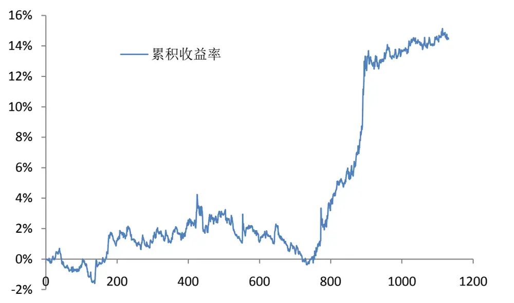
数据来源：广发证券发展研究中心、天软科技

图11：平仓先尝试限价单VS理想情况
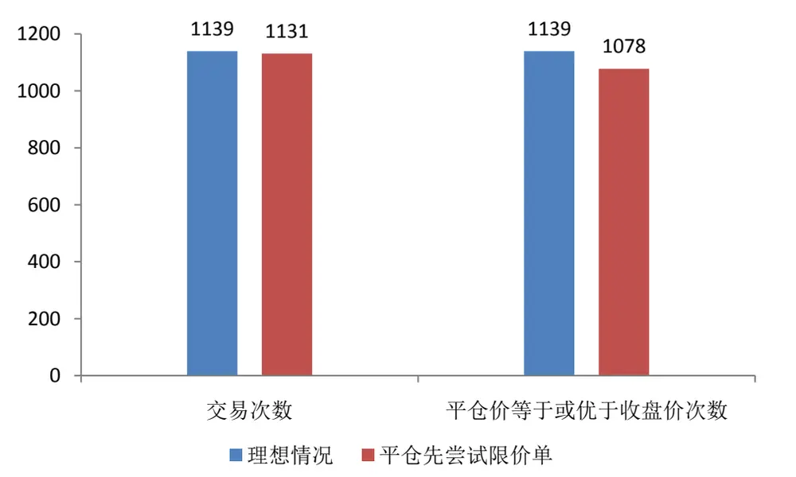
数据来源：广发证券发展研究中心、天软科技

从上述结果可以看出，平仓时先尝试限价单的方式可以使得更多的平仓委托单成交在理想的价位上，累积收益率也因此得到了一定的提升。然而，这样的平仓方式也有负面的影响：由于持仓时间加长了（大于1 分钟），所带来的风险也随之增大。对比图 8和图10、表4和表5 可以看到，先挂限价单的平仓方式，会带来更大的回撤。不过由于两种平仓方式的回撤均较小，在下面的测算中，我们统一在平仓时先尝试限价单。

以上的测算结果，均在资金量为1 手的前提下。而在实际投资中，我们更关心该策略的资金容量有多少。当资金量增大时，每次交易不能确保全部成交，这会对收益率产生一定的影响。尤其在高频交易中，由于每次交易收益率都较低，收益能否覆盖包括冲击成本在内的各类成本便成为一个关键问题。

为研究该追涨杀跌策略的资金容量，我们分别测算了资金量为 5手和10 手时策略的风险收益表现，如图 12，图 13和表6 所示。可以看到，随着资金量的增加，策略的累积收益率逐渐下降，而最大回撤逐渐增大。在资金量为 10手的时候，累积收益率降为 10.72%，最大回撤为-5.28%。

图12：资金量为5手时策略的累积收益率
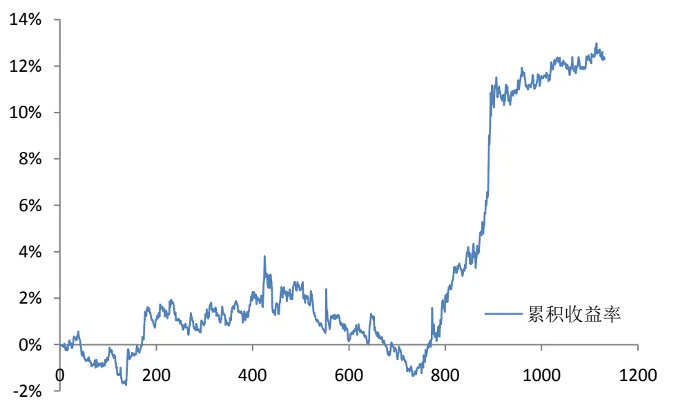
数据来源：广发证券发展研究中心、天软科技

图13：资金量为10手时策略的累积收益率
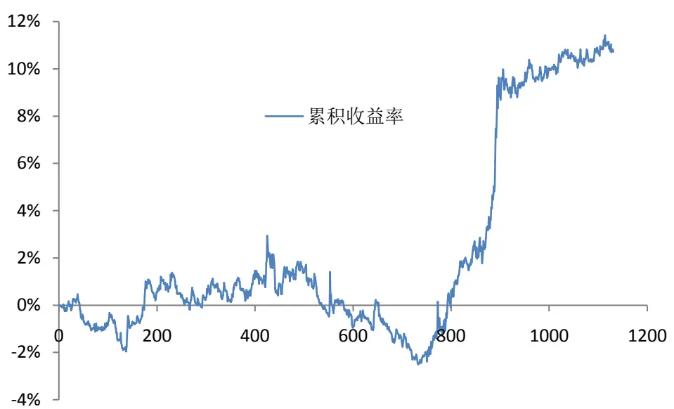
数据来源：广发证券发展研究中心、天软科技

表 6：不同资金量下策略的风险收益统计

| 5手 | 10手 |
| --- | --- |
| 累积收益率 | 12.28% 10.72% |
| 年化收益率 4.09% | 3.57% |
| 平均收益率 0.011% | 0.009% |
| 交易总次数 1131 | 1131 |
| 收益率标准差 | 0.0021 0.0021 |
| 获胜次数 | 543 538 |
| 失败次数 | 588 593 |
| 胜率 | 48.01% 47.57% |
| 平均盈利率 | 0.16% 0.16% |
| 平均亏损率 | -0.12% -0.12% |
| 盈亏比（绝对值） | 1.27 1.26 |
| 最大回撤 | -4.96% -5.28% |
| 单次最大盈利 | 1.70% 1.70% |
| 单次最大亏损 | -1.00% -1.00% |
| 最大连胜次数 | 7 7 |
| 最大连亏次数 | 9 9 |

数据来源：广发证券发展研究中心、天软科技

## （四）不同交易频率下追涨杀跌策略的有效性

正如第一部分所言，我们认为追涨杀跌策略更适用于高频交易。在低频交易中，趋势性并不明显；而在更高频率的交易中，虽然有明显的趋势性，但每次交易的收益太小，可能会被交易成本覆盖。因此，选择一个合适的交易频率是一个值得关注的问题。在前文的所有测算中，采用的均为 1分钟频率的数据。接下来，我们会对

识别风险，发现价值

不同交易频率下策略的有效性进行实证研究。

仍然通过上文提出的策略，在其他参数均不变的情况下，我们测算了 10秒，30秒，2分钟，5分钟交易频率下策略的风险收益情况，对应的持仓时间分别为 10 秒，30 秒，2分钟，5分钟。由于使用先尝试限价单的方式平仓，实际的持仓时间有可能会延长，最长为计划持仓时间的 2 倍。

图 14和图15给出了 10秒和 30秒频率下不同分位数对应的风险收益情况。可以看到，在更高频的情况下，趋势性更加显著，累积收益可观，而回撤非常小。但是否说明交易频率越高策略效果越好呢？图 16 和图17给出了取最优阈值时，在盘口价格限价委托下的累积收益率。由此可见，在10秒频率下，由于每次交易的收益无法覆盖包括冲击成本在内的交易成本，因此大幅亏损，策略失效。在30秒频率下，策略较好地做到了收益与风险的平衡，累积收益率达13.56%，略低于1分钟频率下的 14.44%。

图16和图17则给出了2分钟和5分钟频率下不同分位数对应的风险收益情况。可以看到，随着频率的降低，收益大幅缩小甚至变为亏损。这是因为低频交易中，趋势性并不明显，因此追涨杀跌的策略失效。

图14：10秒频率下策略的风险收益情况
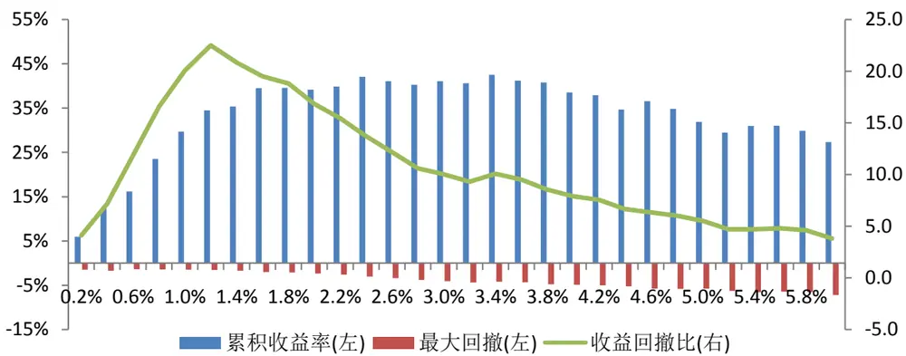
数据来源：广发证券发展研究中心、天软科技

图15：30秒频率下策略的风险收益情况
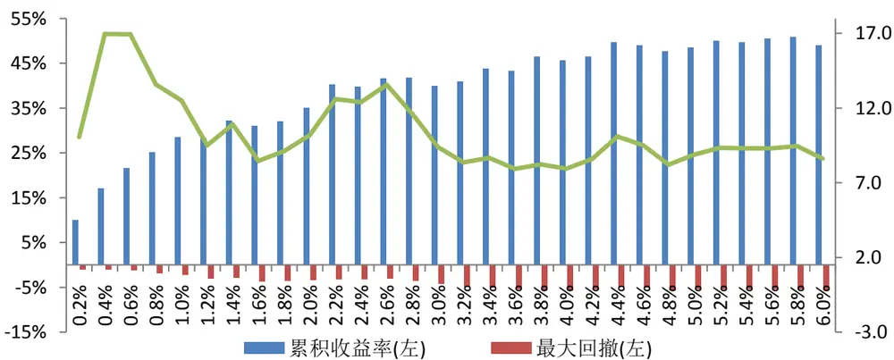
数据来源：广发证券发展研究中心、天软科技
识别风险，发现价值

图16：10秒频率下策略的累积收益率
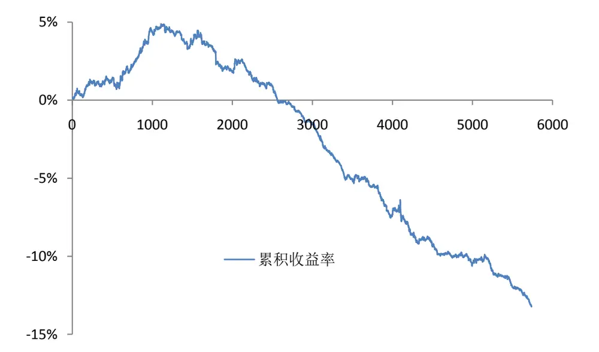
数据来源：广发证券发展研究中心、天软科技

图17：30秒频率下策略的累积收益率
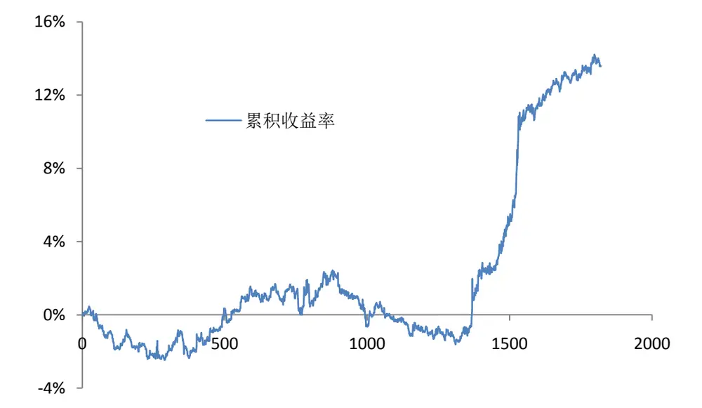
数据来源：广发证券发展研究中心、天软科技

图18：2分钟频率下策略的风险收益情况
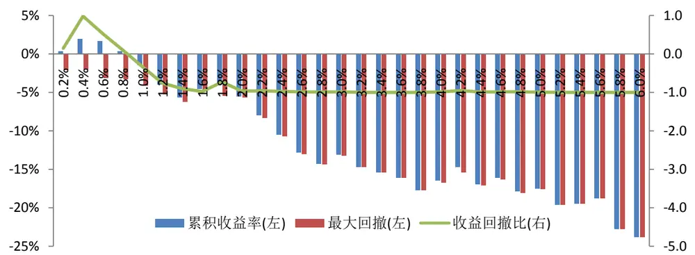
数据来源：广发证券发展研究中心、天软科技

图19：5分钟频率下策略的风险收益情况
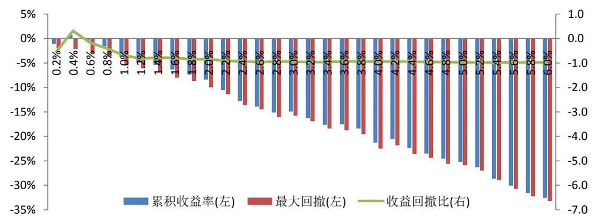
数据来源：广发证券发展研究中心、天软科技

## 四、总结

本篇报告提出了一种适用于高频交易的思路。我们认为从高频的角度看，市场波动的趋势性会更加明显。基于这样的思路，我们首先研究了沪深 300现货与期货的日内走势，发现了通过现货走势预测期货走势的可能性。随后我们对这一策略进行了全面的研究，包括其在盘口价格限价委托下的表现，其资金容量，以及不同交易频率下该策略的风险收益情况。研究表明该策略具有较好的风险收益表现，但尚无法容纳较大的资金量。

感谢发展研究中心金融工程组实习生邱捷铭为本篇研究报告所做的工作。

## 风险提示

本篇报告通过历史数据进行建模与实证，得到良好的回测效果。但由于市场具有不确定性，交易模型仅在统计意义下有望获得良好投资效果，敬请广大投资者注意模型单次失效的风险。

## Table_RatingIndustry 广发证券—行业投资评级说明

买入： 预期未来 12 个月内，股价表现强于大盘 10%以上。

持有： 预期未来12个月内，股价相对大盘的变动幅度介于-10%～+10%。

卖出： 预期未来12个月内，股价表现弱于大盘10%以上。

## Table_RatingCompany 广发证券—公司投资评级说明

买入： 预期未来12个月内，股价表现强于大盘15%以上。

谨慎增持： 预期未来12个月内，股价表现强于大盘5%-15%。

持有： 预期未来12个月内，股价相对大盘的变动幅度介于-5%～+5%。

卖出： 预期未来12个月内，股价表现弱于大盘5%以上。

## Table_Ad联系我们

|  | 广州市 广州市天河北路183号 | 深圳市 | 北京市 | 上海市 |
| --- | --- | --- | --- | --- |
| 地址 | 大都会广场5楼 | 深圳市福田区金田路4018 号安联大厦 15 楼 A 座 | 北京市西城区月坛北街2号 月坛大厦18层 | 上海市浦东新区富城路99号 震旦大厦18楼 |
| 邮政编码 | 510075 | 03-04 518026 | 100045 |  |
| 客服邮箱 | gfyf@gf.com.cn |  |  | 200120 |
| 服务热线 | 020-87555888-8612 |  |  |  |

## Table_Disclaimer 免 责声 明

广发证券股份有限公司具备证券投资咨询业务资格。本报告只发送给广发证券重点客户，不对外公开发布。

本报告所载资料的来源及观点的出处皆被广发证券股份有限公司认为可靠，但广发证券不对其准确性或完整性做出任何保证。报告内容仅供参考，报告中的信息或所表达观点不构成所涉证券买卖的出价或询价。广发证券不对因使用本报告的内容而引致的损失承担任何责任，除非法律法规有明确规定。客户不应以本报告取代其独立判断或仅根据本报告做出决策。

广发证券可发出其它与本报告所载信息不一致及有不同结论的报告。本报告反映研究人员的不同观点、见解及分析方法，并不代表广发证券或其附属机构的立场。报告所载资料、意见及推测仅反映研究人员于发出本报告当日的判断，可随时更改且不予通告。

本报告旨在发送给广发证券的特定客户及其它专业人士。未经广发证券事先书面许可，任何机构或个人不得以任何形式翻版、复制、刊登、转载和引用，否则由此造成的一切不良后果及法律责任由私自翻版、复制、刊登、转载和引用者承担。