# 观日内趋势，察行业轮动，品风格套利

## 另类交易策略之二十四

## Table_Sum ary报告摘要 ：

## 股指期货新成员加入

2015 年 4 月 16 日，随着上证 50 和中证 500 股指期货加入股指期货大家族，股指期货之间又有了新玩法。由于上证 50 和中证 500股指期货之间具有显著的风格差异，股指期货可以不再做市场单边的投机性交易，而是通过持有不同风格特征的股指期货的多头和空头来进行风格套利。

## 观日内趋势，品风格套利

在日内频率上，由于日内风格趋势具有较强的动量效应，故可以每日开盘之后观察当日一段样本时间的趋势，计算样本时间内上证 50和中证500 之间价格比例。之后根据当日样本时间的趋势做当日的趋势风格的跟随。在双边万二的交易成本下，该策略样本外胜率为51.81%，年化收益率为17.54%，最大回撤为-5.34%.同时具有卓越的参数稳定性。

## 察行业轮动，品风格套利

在日间趋势上，由于指数由不同的行业指数构成。不同的行业由于受到行业利好的影响，更容易形成较为持久的行业轮动。因此，我们可以根据历史上行业轮动对于次日风格轮动的预测对各个行业打分，再根据前一交易日行业轮动的次序，对未来的风格做出判断。在双边万二的交易成本下，该策略样本外胜率为 46.68%，年化收益率为22.08%，最大回撤-5.86%.

图1日内趋势风格套利收益
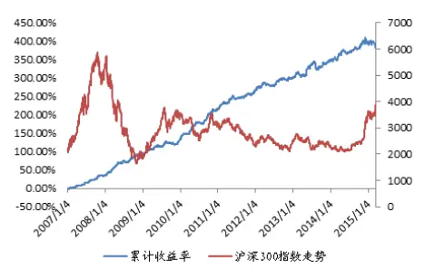

图2行业轮动模型风格套利收益
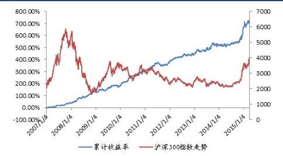

Table_Aut hor 分析师： 安宁宁 S0260512020003

0755-23948352

ann@gf.com.cn

## Table_R 相关研究：eport

另类交易策略系列之二十 2015-04-22
三：股指期货高频追杀趋势
策略
另类交易策略系列之二十 2015-04-16
二：风格动量下的股指期货
跨品种套利策略
另类交易策略系列之二十 2015-04-10
一：基于市场情绪平稳度的
股指期货日内交易策略

联系人：施驰

020-87555888-8687

shichi@gf.com.cn

## 一、新成员加入，股指期货玩法更多样

2015年4月16日，上证50股指期货与中证500股指期货开始在中国金融期货交易所正式进行上市交易，加上已运行逾5年的沪深300股指期货，A股的股指期货家族成员拓展至3名。

规则还是老规则，玩儿法有了新花样。上证50股指期货和中证500股指期货相对于沪深300股指期货最大的不同之处就在于标的资产有了大小盘风格的转变。下表是股指期货家族前十大权重股的股票名称及权重情况。对比不难发现，上证50指数与沪深300指数覆盖的权重股高度重合，主要以金融股为主，而中证500指数前十大权重股则大多属于TMT行业，市值基本不到上证50指数和沪深300指数前十大权重股的十分之一。

表1：沪深300、上证50与中证500指数前十大成份股对比

| 沪深300指数 上证50指数 中证500指数 |  |  |  |  |  |  |  |  |
| --- | --- | --- | --- | --- | --- | --- | --- | --- |
| 股票 | 权重（%） | 总市值(亿元) | 股票 | 权重（%） | 总市值(亿元) | 股票 | 权重（%） | 总市值(亿元)) |
| 中国平安 | 4.14 | 7,738.94 | 中国平安 | 9.66 | 7,738.94 | 东方财富 | 0.92 | 498.21 |
| 民生银行 | 2.69 | 3,515.49 | 民生银行 | 6.28 | 3,515.49 | 太平洋 | 0.90 | 539.10 |
| 中信证券 | 2.65 | 3,876.85 | 中信证券 | 6.17 | 3,876.85 | 中天城投 | 0.65 | 565.68 |
| 招商银行 | 2.63 | 4,408.43 | 招商银行 | 6.14 | 4,408.43 | 南山铝业 | 0.65 | 322.08 |
| 兴业银行 | 2.15 | 3,842.86 | 兴业银行 | 5.01 | 3,842.86 | 大智慧 | 0.62 | 590.35 |
| 海通证券 | 1.94 | 2,664.55 | 海通证券 | 4.52 | 2,664.55 | 万达信息 | 0.59 | 510.28 |
| 浦发银行 | 1.81 | 3,337.11 | 浦发银行 | 4.22 | 3,337.11 | 卫宁软件 | 0.56 | 416.70 |
| 万科A | 1.37 | 1,559.65 | 中国建筑 | 2.75 | 2,388.00 | 四维图新 | 0.52 | 251.60 |
| 中国建筑 | 1.18 | 2,388.00 | 中国太保 | 2.55 | 3,155.39 | 方正科技 | 0.51 | 259.88 |
| 中国太保 | 1.09 | 3,155.39 | 交通银行 | 2.40 | 5,079.57 | 怡亚通 | 0.49 | 347.81 |

数据来源：广发证券发展研究中心

如果我们将股票总市值分为六类，即小于100亿，100亿至200亿，200亿至400亿，400亿至800亿，800亿至1500亿和1500亿以上，统计这三个指数的成份股总市值分布，则对比更为明显：

图1：沪深300指数成分股市值分布

沪深300指数成份股市值分布
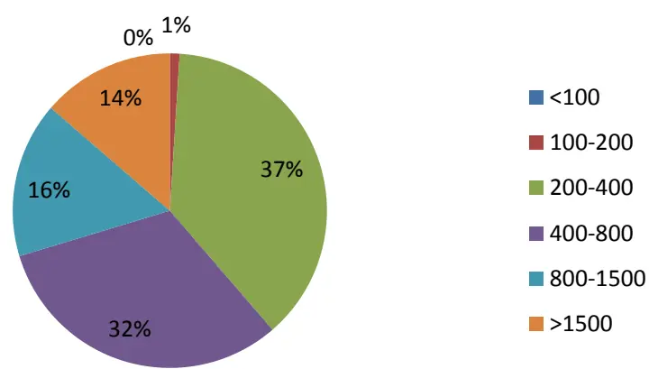
数据来源：广发证券发展研究中心

图2：上证50指数成分股总市值分布
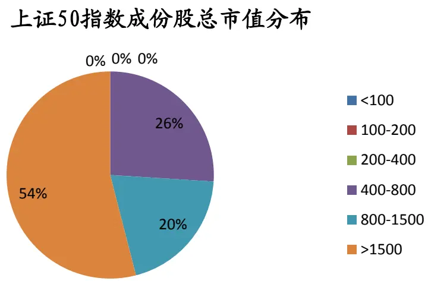
数据来源：广发证券发展研究中心

图3：中证500成分股总市值分布

中证500成份股总市值分布
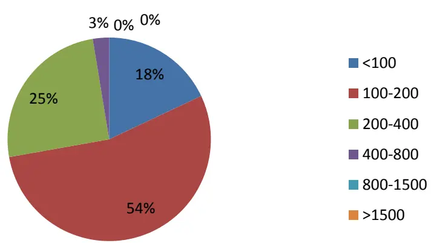
数据来源：广发证券发展研究中心

想必大家依然会2014年下半年那一波券商行情带动下的蓝筹股爆发记忆犹新。当时在券商股的带动下，沪深300指数屡创新高，但市场上的大部分股票却原地踏步。由于大部分市场中性产品缺乏对冲小市值股票的工具，只能默默忍受“满仓踏空加对冲”的酸爽。

虽然“满仓满仓踏空加对冲”的教训是惨痛的，但股指期货家族新成员的加入却让我们有了化悲痛为力量的机会。不同风格的指数期货给予了我们风格套利的机会，而风格，往往比市场多空的趋势持续的时间更为长久。

下表是现有的三大股指期货指数行业的对比。在上证50指数中，金融类股票占到了整个指数近的三分之二的权重。而沪深300和中证500则行业分布较为均衡。因此，各个行业的涨跌在一定程度上代表了整个市场大小盘的风格。

表2：沪深300、上证50与中证500指数前十大行业对比

| 沪深300指数 上证50指数 中证500指数 |  |  |  |  |  |
| --- | --- | --- | --- | --- | --- |
| 行业 | 权重（%） | 行业 | 权重（%） | 行业 | 权重（%） |
| 非银金融 | 18.54 | 银行 | 34.35 | 房地产 | 9.39 |
| 银行 | 17.74 | 非银金融 | 30.75 | 医药生物 | 9.2 |
| 医药生物 | 5.18 | 食品饮料 | 4.4 | 计算机 | 6.8 |
| 建筑装饰 | 4.73 | 机械设备 | 3.69 | 机械设备 | 6.33 |
| 房地产 | 4.65 | 国防军工 | 2.89 | 化工 | 5.86 |
| 食品饮料 | 4.03 | 建筑装饰 | 2.75 | 电子 | 5.31 |
| 传媒 | 3.65 | 采掘 | 2.31 | 有色金属 | 5.24 |
| 汽车 | 3.61 | 医药生物 | 2.26 | 电气设备 | 5.23 |
| 公用事业 | 3.59 | 交通运输 | 2.03 | 交通运输 | 4.55 |
| 有色金属 | 3.3 | 汽车 | 1.96 | 商业贸易 | 4.08 |

数据来源：广发证券发展研究中心

本文将从风格日内趋势套利和基于行业轮动的日间风格套利两个方面分别构建了不同的股指期货风格套利模型，都取得了不错的效果。

## 二、观日内趋势，品风格套利

## （一）模型思路

受股指期货日内趋势交易模型的启发，我们可以通过观察开盘一段时间样本内大小盘风格的趋势，推测大小盘风格将在当日持续，从而对上证50和中证500股指期货在观察时间样本后开相反的持仓方向，在当日收盘时平仓。

具体步骤如下：

第一步，计算指数之间比例。

我们可以利用单日的分钟线数据，计算每分钟的上证50指数与中证500指数的比例，得到该比例的时间序列。

第二步，根据趋势判断风格。

观察每日开盘后一定时间内的比例关系，如果在T时刻的比例值 $Ratio_{T}$ 大于开盘时刻的比例值 $Ratio_{Begin}$ ，即：

$$
Ratio_{T}>Ratio_{Begin}\;\rightarrow\frac{SZ50_{T}}{ZZ500_{T}}>\frac{SZ50_{Begin}}{ZZ500_{Begin}}
$$

也就是说上证50指数相对于中证500指数在当日的样本时间内相对有所上升，那么我们认为这天的剩余时间内这种趋势仍旧将会保持，可以理解为在T时刻之后的交易时间内上证50指数相比于中证500指数仍会保持有一定的强势，这天的规模风格为大盘风格。

反之，如果有 $Ratio_{T}<Ratio_{Begin}$ ，也就是在长度为T的样本时间内中证500指数的表现要超过了上证50指数，我们也认为这种趋势将会延续，在T时刻之后中证500指数表现将会更好，这天的规模风格为中小盘风格。

第三步，根据风格判断进行交易。

如果判断当天的风格为大盘风格，那么从T时刻起，我们开始做多上证50期货，同时也做空中证500期货，以保持市场中性，使之不受整体市场极端情况影响；反之，如果判断当天的风格为中小盘风格，那么从T时刻起开始做多中证500期货，同时做空上证50期货，保证整体仓位中性。

第四步，交易止损措施。

当日交易的止损线为0.25%，且一旦止损当日内不再进行交易。

我们利用样本内数据选择样本时间T以最优化收益回撤比，然后将选得的参数值T代入到样本外数据之中，进行回测检验。

具体交易流程如下所示。

图4：基于趋势的股指期货风格轮动模型交易流程

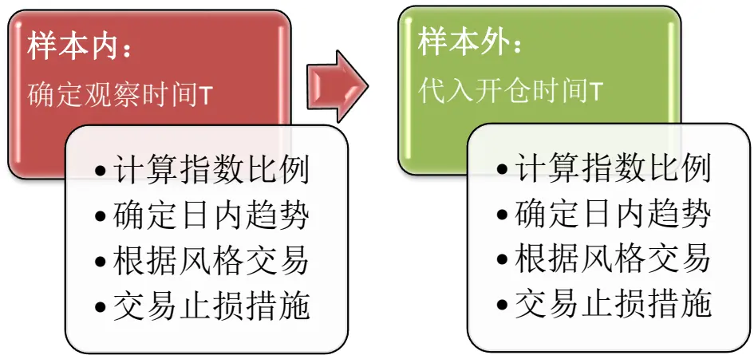
数据来源：广发证券发展研究中心

## （三）实证分析结果

我们利用2007年1月至2009年12月的数据作为样本内数据，通过对参数进行遍历得到使得累计收益最优的观察时间T，也即开仓时间。我们得到的观察时间为10分钟，即观察第10分钟两支指数的比例，并与开盘时的比例相比较，如果有所上升则做多上证50期货，做空中证500期货；如果有所下降则做多中证500期货做空上证50期货。然后我们将这一参数值代入到样本外数据之中进行回测检验。样本外数据时间取值范围为2010年1月至2015年4月3日。考虑股指期货双边万分之二的交易成本，按复利累积计算。

表3：模型参数

| 参数类型 参数取值 |  |
| --- | --- |
| 观察期起始时间 | 1 |
| 观察期结束时间 | 10 |
| 止损阈值 | 0.25% |
| 交易成本（双边） | 2/10000 |
| 收益率计算方式 | 复利 |

数据来源：广发证券发展研究中心
我们得到的累计收益曲线如下。

图5：股指期货日内趋势风格套利交易累计收益

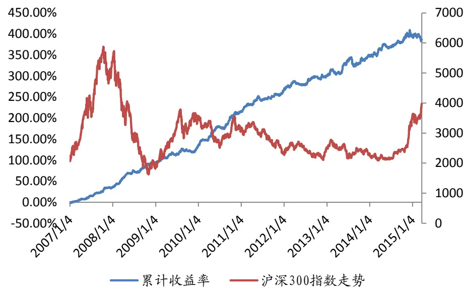
数据来源：广发证券发展研究中心，wind资讯

表4：股指期货日内趋势风格套利交易明细

| 项目 样本内 样本外 |  |  |
| --- | --- | --- |
| 交易次数 | 725 | 1270 |
| 累计收益 | 192.52% | 133.54% |
| 年化收益率 | 43.09% | 17.54% |
| 胜率 | 49.66% | 51.81% |
| 最大回撤 | -3.69% | -5.34% |
| 正确次数 | 360 | 658 |
| 错误次数 | 365 | 612 |
| 平均盈利率 | 0.59% | 0.37% |
| 平均亏损率 | -0.28% | -0.26% |
| 盈亏比 | -2.08 | -1.44 |
| 单日最大盈利 | 2.37% | 2.00% |
| 单日最大亏损 | -0.43% | -1.74% |
| 最大连续盈利次数 | 8 | 11 |
| 最大连续亏损次数 | 10 | 10 |

图6：股指期货日内趋势风格套利回撤情况
数据来源：广发证券发展研究中心

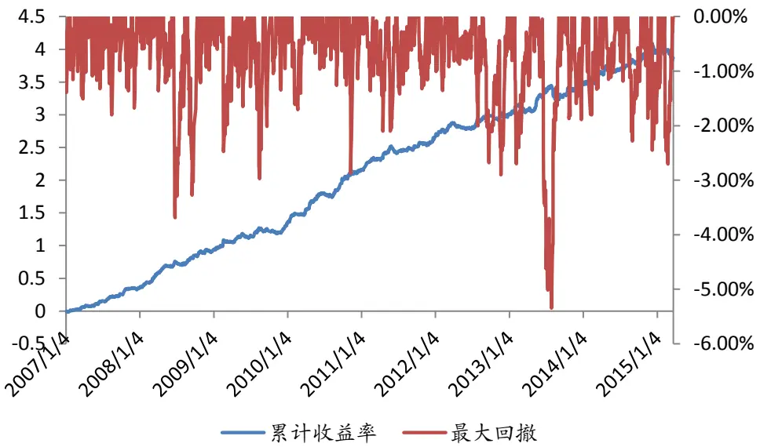
数据来源：广发证券发展研究中心

模型样本外年化收益为17.54%，最大回撤为-5.34%，盈亏比为1.44，胜率为51.81%。

## （三）模型参数的稳定性讨论

通过样本内数据对参数的遍历，我们得到了使得样本内数据累计收益最高的观察时间T为10分钟，并代入到样本外数据之中进行回测检验。如果我们改变这个参数，分别考察观察时期T=8，10，12，15分钟时的模型表现。检验模型对于参数是否具有稳健性。累计收益曲线和参数统计表如下所示。

图7：不同参数样本外下股指期货日内趋势风格套利收益
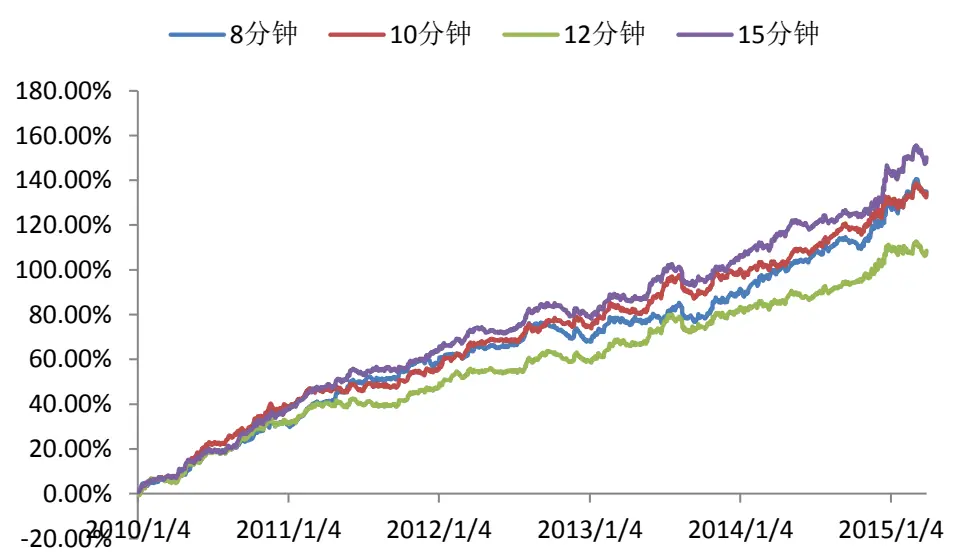
数据来源：广发证券发展研究中心

表5：不同参数样本外下股指期货日内趋势风格套利交易明细

| 指标 | 8分钟 | 10 分钟 | 12 分钟 | 15 分钟 |
| --- | --- | --- | --- | --- |
| 累计收益 | 134.29% | 133.54% | 108.76% | 150.47% |
| 年化收益率 | 17.61% | 17.54% | 15.06% | 19.12% |
| 胜率 | 51.50% | 51.81% | 50.39% | 53.39% |
| 最大回撤 | -5.10% | -5.34% | -4.41% | -4.85% |
| 正确次数 | 654 | 658 | 640 | 678 |
| 错误次数 | 616 | 612 | 630 | 592 |
| 平均盈利率 | 0.38% | 0.37% | 0.37% | 0.36% |
| 平均亏损率 | -0.26% | -0.26% | -0.26% | -0.25% |
| 盈亏比 | -1.45 | -1.44 | -1.44 | -1.41 |
| 单日最大盈利 | 2.15% | 2.00% | 2.06% | 2.09% |
| 单日最大亏损 | -1.84% | -1.74% | -1.75% | -1.86% |
| 最大连续盈利次数 | 10 | 11 | 10 | 11 |
| 最大连续亏损次数 | 12 | 10 | 10 | 9 |

数据来源：广发证券发展研究中心

可以看出，当T取值在10附近时，年化收益率变化并不大，且回撤一直保持较小，保持在5%左右，年化收益率与回撤之比都超过了3，胜率均超过了50%，盈亏比保持在1.4以上。总体来看，通过样本内数据选出的观察时期10分钟是一个相对较为合理的选择，模型表现出卓越的参数稳定性。

## 三、察行业轮动，品风格套利

## （一）模型思路

对比不同指数之间的行业分布，我们发现不同风格的指数之间行业分布差异明显。由于行业的阶段性利好往往会持续较长的一段时间，因此行业轮动对于大小盘风格的预示效应。

在行业轮动中有一定的先后顺序规律，然而这种规律以及行业收益对于指数的影响是复杂的，非序数性的，并不能仅仅根据静态的数据统计来判断即将启动的行业，从而推断出接下来市场的规模风格变化。所以我们可以采取样本内数据直接建立之前不同行业收益与之后不同风格指数收益的关系，进行风格预测，从而制定交易策略。

## 具体策略步骤如下：

第一步，利用样本内数据建立前一交易日不同行业收益率与后一交易日市场风格之间的关系。

行业收益率采用申万一级行业指数，一共有28个一级行业，对于每个行业指数建立两个评分指标，大盘指标 $bc_{i}$ 和小盘指标 $sc_{i},$ 。对于T日上证50与中证500指数的收益率，即指数T-1日收盘价到T日收盘价的收益率，如果上证50指数的日收益率大于中证500指数的日收益率，那么挑选出T-1日收益率最高的十个行业，即相应申万以及行业指数T-2日收盘价到T-1日收盘价收益率最高的十个行业，在大盘指标系统中对第一名加10分，第二名加9分，第三名加8分，以此类推，一直到第十名加1分；而如果T日中证500指数收益率大于上证50指数收益率，那么也会挑选出T-1日收益率最高的十个行业，在小盘指标系统中对第一名加10分，第二名加9分，以此类推。

同时统计这两类情况出现的天数，即上证50收益率大于中证500收益率以及相反情况的天数 $\scriptstyle{\lfloor t_{bc}}$ 与 $t_{sc}$ 。对于之前每个行业的得到两个指标 $bc_{i}$ 和 $^{t}Sc_{i}$ ，分别除以 $t_{bc}$ 与$t_{sc}$ ，得到 $\left|\frac{bc_{i}}{t_{bc}}\right|$ 与 $\frac{sc_{i}}{t_{sc}}$ 作为新的大盘指标 $\widehat{bc_{v}}$ 和小盘指标sĉ。

最后，将每个行业新的大盘指标与小盘指标相减得到净行业指标，即 $index_{i}=$ $\widehat{bc_{\iota}}-\widehat{sc_{\iota}}=\frac{bc_{i}}{t_{bc}}-\frac{sc_{i}}{t_{sc}}.$

第二步，判断市场风格。

之前我们已经通过样本内数据得到了不同行业的净行业指标，用向量形式表示为：

$$
\overrightarrow{\mathrm{index}}=(index_{1},\cdots,index_{28})
$$

在T-1日收盘时，得到T-1日不同行业的收益率，即对应申万一级行业指数从T-2日收盘价到T-1日收盘价的收益率，用向量形式表示为：

$$
\overrightarrow{\mathrm{Industryreturn}_{T-1}}=\left(\mathrm{return}_{1,T-1},\cdots,\mathrm{return}_{28,T-1}\right)
$$

其中 $return_{i,\mathrm{t}}$ 表示第i个行业从t-1日到t日的收益率。我们可以计算这两个向量的内积得到T日的市场风格指标 $\underline{{style_{T}}},$ ，即：

$$
style_{T}=\overrightarrow{\mathrm{index}}\cdot\overrightarrow{\mathrm{indusrtyreturn}_{T-1}}^{T}=\sum_{i=1}^{28}index_{i}\times return_{i,T-1}
$$

如果市场风格指标 $\ {\boldsymbol{i}}style_{T}>0$ ，则判断T日市场风格为大盘股优于小盘股，如果$style_{T}<0$ ，则判断T日市场风格为小盘股优于小盘股。

第三步，根据预测的风格进行交易。

如果判断T日风格为大盘风格，即 $style_{T}>0$ ，那么我们从T-1日收盘时刻起做多上证50期货，同时做空中证500期货以规避市场整体性风险；反之，如果判断T日风格为小盘风格，即 $style_{T}<0$ ，那么从T-1日收盘时刻起做多中证500期货，同时也做空上证50期货以规避市场整体性风险。

第四步，交易止损措施。

如果某日市场风格指标与前一日正负性相同，即方向没有变化，则可以继续前一日仓位保持不动，直至市场风格指标正负出现变化，方向有所不同后再对原先仓位进行平仓，重新开启新仓位，进行新一次交易。此记为一次交易。如果在一次交易中出现亏损超过2%，则在当日收盘后进行平仓，在风格指标方向变化之前不再交易。

具体交易流程如下图所示。

图8：行业轮动下的风格套利模型流程
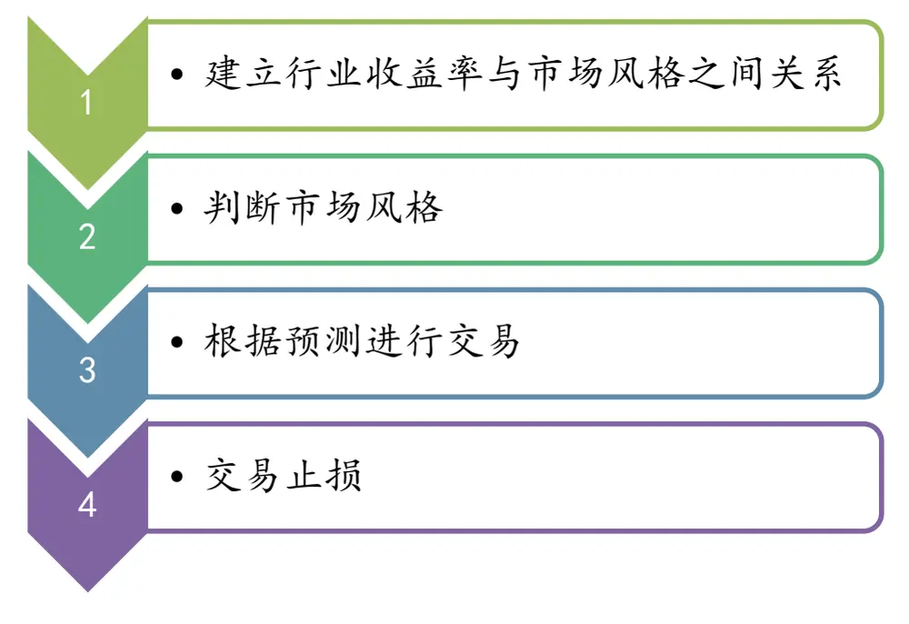
数据来源：广发证券发展研究中心

这样我们就通过了打分系统建立起了行业收益和市场风格之间的关系。注意到每个行业最后的大盘指标 $\widehat{\boldsymbol{b}\boldsymbol{c}_{v}}$ 和小盘指标 $\widehat{\cdot SC_{\iota}},$ ，所有行业的大盘指标之和应该等于所有行业的小盘指标之和，即：

$$
\sum_{i=1}^{28}{\widehat{bc_{\iota}}}=\sum_{i=1}^{28}{\widehat{sc_{\iota}}}=\sum_{j=1}^{10}j=55.
$$

识别风险，发现价值

所以各个行业的净行业指标index 之和也应为0，即：

$$
\sum_{i=1}^{28}index_{i}=0
$$

这就保证了最后的市场风格指标 $\ {\boldsymbol{\imath}}styl{\boldsymbol{e}_{t}}$ 本身关于行业收益是没有风格偏向性的。即如果在极端情况下，所有的行业收益率均相同，那么此时的市场风格指标 $\mathfrak{c}style_{t}$ 为0：

$$
style_{t}=\sum_{i=1}^{28}index_{i}\times r_{i,t-1}=r\times\sum_{i=1}^{28}index_{i}=0
$$

在这种极端情况下，所有行业的表现完全一样，我们无法判断出下一天的风格轮动情况，此时不开仓。

## （二）实证分析结果

我们选取2007年1月至2009年12月数据作为样本内数据，按照上述步骤得到各个行业的净行业指标向量index⃗⃗⃗⃗⃗⃗⃗⃗⃗⃗⃗ 。然后利用2010年1月至2015年4月3日数据作为样本外数据对模型进行回测检验，考虑双边万分之二的交易成本，按复利累积计算。

表6：模型参数

| 参数类型 参数取值 |  |
| --- | --- |
| 行业数量 | 10 |
| 止损阈值 | 无 |
| 交易成本（双边） | 2/10000 |
| 收益率计算方式 | 复利 |

数据来源：广发证券发展研究中心

模型的收益情况如下图所示。

图9：行业轮动下的风格套利累计收益

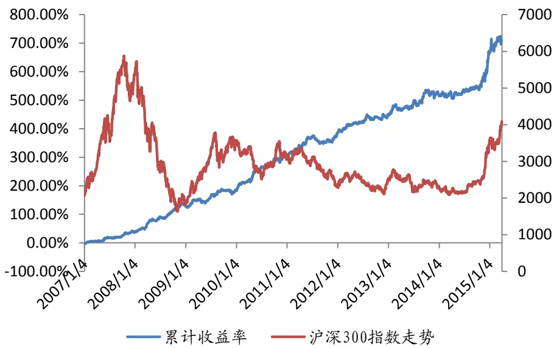
数据来源：广发证券发展研究中心
该模型的交易明细如下表所示。

表7：行业轮动下的风格套利交易明细

| 指标 样本内 |  | 样本外 |
| --- | --- | --- |
| 总交易次数 | 315 | 563 |
| 累计收益 | 286.45% | 184.62% |
| 年化收益率 | 41.75% | 22.08% |
| 胜率 | 51.43% | 45.12% |
| 最大回撤 | -6.37% | -5.86% |
| 正确次数 | 162 | 254 |
| 错误次数 | 153 | 309 |
| 平均盈利率 | 1.26% | 0.95% |
| 平均亏损率 | -0.62% | -0.43% |
| 盈亏比 | -2.0165 | -2.19 |
| 单日最大盈利 | 8.44% | 4.77% |
| 单日最大亏损 | -3.09% | -2.49% |
| 最大连续盈利次数 | 7 | 8 |
| 最大连续亏损次数 | 7 | 10 |

数据来源：广发证券发展研究中心

从统计数据中我们可以看出，在样本外数据5年多的观察期内取得了184.62%的累计收益率，平均年化收益为22.08%，最大回测为-5.86%，交易次数为563次，平均每次持仓周期为2天左右。

如果该模型样本内外的回撤情况下图所示。

图10：行业轮动下的风格套利回撤情况

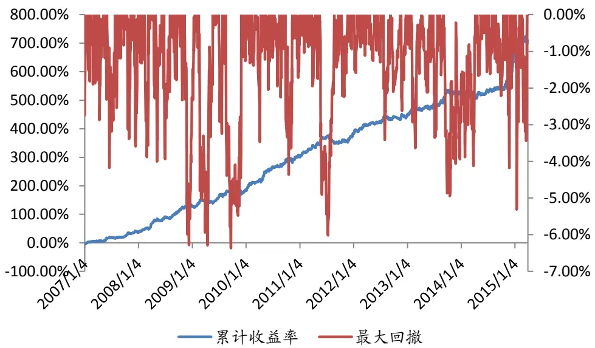
数据来源：广发证券发展研究中心

## （三）模型参数的稳定性讨论

在本模型中，主要的参数是在建立行业与风格的关系时采用的打分系统。我们对于日收益率排名前十的行业进行加分，不在前十名的行业则在当日无法获得大盘指标积分或小盘指标积分。之所以选取十个行业，是基于申万一级行业分类数量的考虑。在现行的申万行业分类准则下，一共有28个一级行业，我们认为，选取日收益率排名前10的行业是一个恰当的比例。如果选取的行业过少，例如3或5个，可能会缺失一些对于指数产生了一定影响的行业，导致无法全面判断风格轮动效应。而如果选取的行业过多，例如15或20个，因为有些行业在指数中占比很小，会对于模型产生不必要的杂音干扰，影响了行业与风格轮动之间关系的建立与判定。

接下来我们选取日收益率排名靠前8个行业或者12个行业进行打分，仍旧按照收益率从高到低的顺序分别计入8至1分或12至1分，然后计算净行业指标，从而进行风格判断，并与原先采用排名靠前的10个行业的打分系统所得到的收益统计进行对比。

我们先比较不同打分系统下的净行业指标的区别，如下表所示。

表8：不同打分系统下的净行业指标
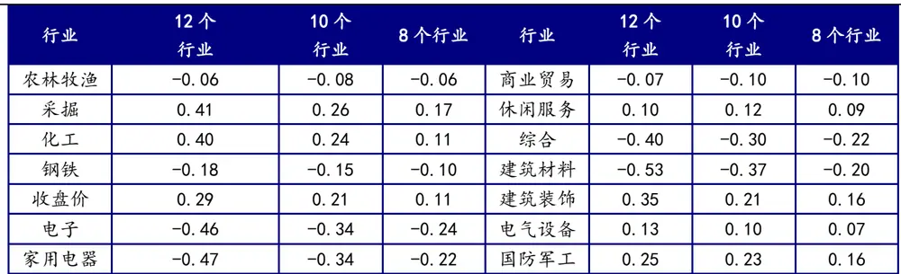
识别风险，发现价值

| 食品饮料 | 0.18 | 0.15 | 0.14 | 计算机 | -0.42 | -0.34 | -0.30 |
| --- | --- | --- | --- | --- | --- | --- | --- |
| 纺织服装 | -0.25 | -0.18 | -0.13 | 传媒 | 0.00 | 0.06 | 0.08 |
| 轻工制造 | -0.36 | -0.28 | -0.21 | 通信 | -0.23 | -0.20 | -0.19 |
| 医药生物 | -0.32 | -0.19 | -0.12 | 银行 | 1.36 | 1.10 | 0.87 |
| 公用事业 | -0.25 | -0.21 | -0.18 | 非银金融 | 0.46 | 0.33 | 0.22 |
| 交通运输 | 0.29 | 0.15 | 0.06 | 汽车 | -0.32 | -0.28 | -0.21 |
| 房地产 | 0.36 | 0.34 | 0.30 | 机械设备 | -0.26 | -0.14 | -0.04 |

数据来源：广发证券发展研究中心

图11：选取10个行业样本的净行业指标
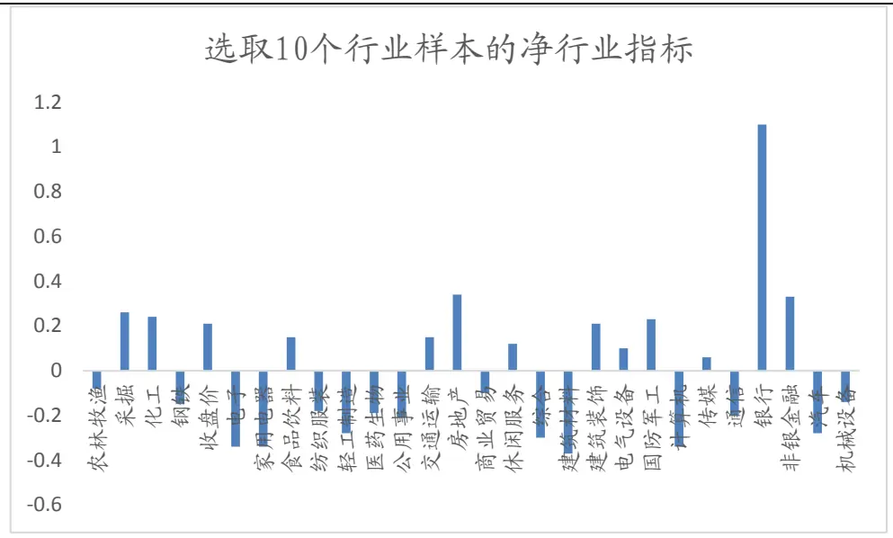
数据来源：广发证券发展研究中心

可以看出，在三种不同的打分系统下，各个行业的净行业指数的相对大小顺序变化不大。例如银行和非银一直都是净值比较高的行业，而电子、计算机、家用电器或建筑材料也一直是净值比较低的行业。这也与我们的逻辑相吻合。上证50指数的权重股集中于金融业，而中证500指数则以TMT行业为主。

不同打分系统下多空双向模型的累计收益如下图所示。

图12：不同打分系统下模型样本外表现

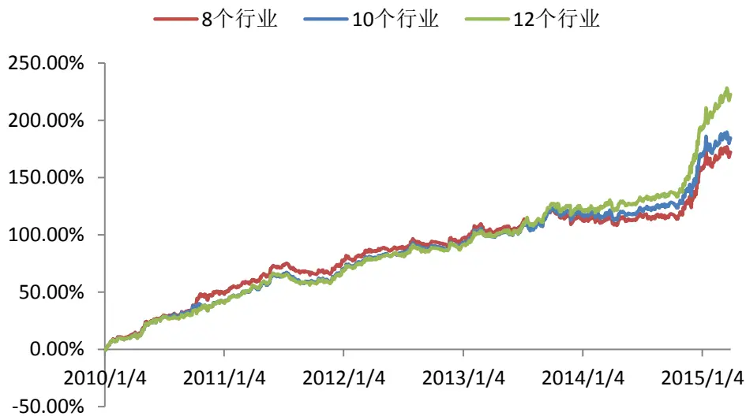
数据来源：广发证券发展研究中心

表9：不同打分系统下模型样本外表现

| 指标（样本外） 8个行业 10个行业 12个行业 |  |  |  |
| --- | --- | --- | --- |
| 交易次数 | 561 | 563 | 557 |
| 累计收益 | 172.11% | 184.62% | 222.55% |
| 年化收益率 | 21.03% | 22.08% | 25.02% |
| 正确率 | 43.85% | 45.12% | 46.68% |
| 最大回撤 | -6.04% | -5.86% | -5.93% |
| 正确次数 | 246 | 254 | 260 |
| 错误次数 | 315 | 309 | 297 |
| 平均盈利率 | 0.97% | 0.95% | 0.94% |
| 平均亏损率 | -0.43% | -0.43% | -0.42% |
| 盈亏比 | -2.26 | -2.19 | -2.24 |
| 单日最大盈利 | 4.43% | 4.77% | 4.63% |
| 单日最大亏损 | -2.40% | -2.49% | -2.49% |
| 最大连续盈利次数 | 8 | 8 | 8 |
| 最大连续亏损次数 | 10 | 10 | 12 |

数据来源：广发证券发展研究中心

可以看出，随着行业的增加，模型的累计收益略有上升，当选取12个行业时年化收益率较10个行业而言提高了约3%，回撤方面三种参数下都保持稳定，判断正确率与盈亏比也变化不大。这个结果也证明了模型优良的稳健性。鉴于目前申万一级行业划分体系，一共包含有28个一级行业，我们推荐采用整体行业数量的1到1的行业来进行评分，即9至14个行业的打分系统，可以更好的捕捉到市场机会。

## 五、总结

2015年4月16日，随着上证50和中证500股指期货加入股指期货大家族，股指期货之间又有了新玩法。由于上证50和中证500股指期货之间具有显著地风格差异，股指期货可以不再做市场单边的投机性交易，而是通过持有不同风格特征的股指期货的多头和空头来进行风格套利。

在日内频率上，由于日内风格趋势具有较强的动量效应，故可以每日开盘之后观察当日一段样本时间的趋势，计算样本时间内上证50和中证500之间价格比例。之后根据当日样本时间的趋势做当日的趋势风格的跟随。在双边万二的交易成本下，该策略样本外胜率为51.81%，年化收益率为17.54%，最大回撤为-5.34%.同时具有卓越的参数稳定性。

在日间趋势上，由于指数由不同的行业指数构成。不同的行业由于受到行业利好的影响，更容易形成较为持久的行业轮动。因此，我们可以根据历史上行业轮动对于次日风格轮动的预测对各个行业打分，再根据前一交易日行业轮动的次序，对未来的风格做出判断。在双边万二的交易成本下，该策略样本外胜率为46.68%，年化收益率为22.08%，最大回撤-5.86%.

## 风险提示

策略模型并非百分百有效，市场结构及交易行为的改变或者交易参与者的增多有可能使得策略失效。

## Table_RatingIndustry 广发证券—行业投资评级说明

买入： 预期未来12个月内，股价表现强于大盘10%以上。

持有： 预期未来12个月内，股价相对大盘的变动幅度介于-10%～+10%。

卖出： 预期未来12个月内，股价表现弱于大盘10%以上。

## Table_RatingCompany 广发证券—公司投资评级说明

买入： 预期未来12个月内，股价表现强于大盘15%以上。

谨慎增持： 预期未来12个月内，股价表现强于大盘5%-15%。

持有： 预期未来12个月内，股价相对大盘的变动幅度介于-5%～+5%。

卖出： 预期未来12个月内，股价表现弱于大盘5%以上。

## Table_Ad联系我们

| 地址 | 广州市 广州市天河北路183号 | 深圳市 深圳市福田区金田路4018 | 北京市 北京市西城区月坛北街2号 | 上海市 |
| --- | --- | --- | --- | --- |
|  | 大都会广场5楼 | 号安联大厦 15 楼 A 座 03-04 | 月坛大厦18层 | 上海市浦东新区富城路99号 震旦大厦18楼 |
| 邮政编码 | 510075 | 518026 | 100045 | 200120 |
| 客服邮箱 | gfyf@gf.com.cn |  |  |  |
| 服务热线 | 020-87555888-8612 |  |  |  |

## Table_Disclaimer 免 责声 明

广发证券股份有限公司具备证券投资咨询业务资格。本报告只发送给广发证券重点客户，不对外公开发布。

本报告所载资料的来源及观点的出处皆被广发证券股份有限公司认为可靠，但广发证券不对其准确性或完整性做出任何保证。报告内容仅供参考，报告中的信息或所表达观点不构成所涉证券买卖的出价或询价。广发证券不对因使用本报告的内容而引致的损失承担任何责任，除非法律法规有明确规定。客户不应以本报告取代其独立判断或仅根据本报告做出决策。

广发证券可发出其它与本报告所载信息不一致及有不同结论的报告。本报告反映研究人员的不同观点、见解及分析方法，并不代表广发证券或其附属机构的立场。报告所载资料、意见及推测仅反映研究人员于发出本报告当日的判断，可随时更改且不予通告。

本报告旨在发送给广发证券的特定客户及其它专业人士。未经广发证券事先书面许可，任何机构或个人不得以任何形式翻版、复制、刊登、转载和引用，否则由此造成的一切不良后果及法律责任由私自翻版、复制、刊登、转载和引用者承担。