# 价量模式匹配股指期货交易策略

## 另类交易策略系列之二十五

## Table_Sum ary报告摘要 ：

## 通过价量模式匹配进行相似历史片段选取

“历史可以重演”这一假说是股市技术分析的重要基石之一。在预测股票走势时，可以从历史数据库中寻找和当前股票行情相似的历史片段，根据这些历史片段此后的股票走势，来预测当前股票的未来走势。当前股票行情包括股价、成交量及其他技术指标组成的多变量时间序列，其中，股价和成交量是最重要的两个序列。根据价格和成交量的双变量时间序列，可以从历史样本中寻找与当前股票状态最相似的片段，指导投资决策。

## 动态时间规整价量匹配策略

动态时间规整算法是模式识别中的经典算法，它的提出导致了语音识别技术上的飞跃，目前仍然是语音识别中孤立词模板识别的最有效方法之一。该算法使得形态相似但时序上并不完美一致的两序列之间距离最小化。本报告采用的动态时间规整算法考虑的是多变量时间序列，对成交量和价格综合考虑，进行模式匹配，选取相似的历史行情，通过历史行情的后期走势预测股价的走势，并进行股指期货的投资。由于同时考虑到了股价和成交量，价量模式匹配策略的表现在累积收益和最大回撤上都明显优于单纯使用成交量的策略。

该算法在 2013 年以来的累积收益率为 82.7%，折算成年化收益率为35.5%，最大回撤-12.8%。

## 混合策略可以降低参数选择的风险

为了提高策略盈利的稳健性，降低参数选择带来的潜在风险，我们提出了不同参数的混合策略，采取专家投票系统的方式进行综合决策。根据不同的混合策略子策略选取思路，我们构建了三种不同的混合策略。2013年以来，混合策略I的累积收益率为 74.7%，最大回撤为-10.8%；混合策略II的累积收益率为89.4%，最大回撤为-9.4%；混合策略III的累积收益率为87.2%，最大回撤为-11.7%。

图 价量匹配策略全样本表现
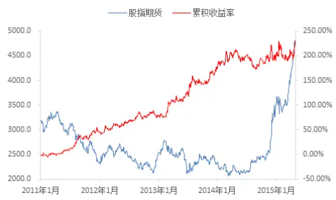
表 价量匹配策略样本外表现

| 年化收益率 | 35.5% |
| --- | --- |
| 最大回撤率 | -12.8% |
| 胜率 | 49.7% |
| 盈亏比 | 1.29 |

Table_Aut hor 分析师： 张超 S0260514070002

公020-87555888-8646

zhangchao@gf.com.cn

## Table_Report 相关研究：

基于统计语言模型（SLM）的 2014-01-14择时交易研究

基于时域分形的相似性匹配2012-09-03

日内低频交易（SMT）策略

联系人： 文巧钧

公020-87555888-8400

wenqiaojun@gf.com.cn

## 一、交易策略概述

## （一）历史可以重演

“历史可以重演”这一假说是股市技术分析的重要基石之一。技术分析实际上就是从证券价格的历史走势中寻找出规律，再按规律预测未来走势。这些规律包括各种形态、角度、涨跌幅度、涨跌周期、成交量等。从量化投资的角度来说，数量化模型是建立在对历史数据的观测和思考的基础上的，历史数据对未来投资具有重要的借鉴意义。

鉴于此，在对股票走势的预测上，可以从历史数据库中寻找同当前股票状态相似的历史片段，根据这些历史片段此后的股票走势，来判断当前股票的未来走势。当前股票的“状态”信息主要包含两方面的信息，一方面是股票在最近一段时间的走势，这是时间序列数据；另一方面是同一时刻股票在量、价、技术指标等不同方面的信息，这是横截面数据。在从历史数据中匹配和当前股票状态相似的片段时，同时考虑时间序列数据和横截面数据有利于获取更加准确的相似模式，这对于判断当前股票的未来走势具有重要的作用。

## （二）价量匹配寻找相似模式

在股票分析中，成交量是仅次于股票价格的重要因子。技术分析中，研究量与价的关系占极重要地位。技术分析中根据价格的上涨下跌和成交量的变化，将价量关系分为量增价涨、量缩价涨、量增价跌、量缩价跌等不同的情况。成交量与价格之间的关系，市场上有三种观点：1、价格是第一位的，成交量是次要的；2、成交量领先于价格运动；3、成交量验证价格形态。总而言之，成交量很大程度上反映了投资者的心理，可以推动价格的变化，同时也可以验证价格的形态。

由成交量和价格组成的多变量时间序列用于描叙股票状态或者模式时，需要注意的是：首先，成交量和价格是相互影响和相互验证的，在进行模式分析和匹配时，不宜把两者单独考虑，而是应该作为一个整体来处理；其次，形态相似的股票模式持续的时间长度并不一致，或者说，从时间角度来看，不同的片段在进行模式匹配时，需要进行伸缩变形。因此，通过模式匹配寻找相似片段时，需要同时考虑片段内时间轴的对齐和片段之间时间轴的扭曲。本报告提出的动态时间规整价量模式匹配方法能够同时兼顾这两点，即模式匹配时，相同片段内的量和价是始终对齐的；而不同片段间在时间轴上是通过伸缩变形来对齐的。

本篇报告中，根据价格和成交量的多变量时间序列，从历史样本中寻找与当前股票状态最相似的片段，根据最相似片段的走势，来预测当前股票的未来变化趋势，据此进行建仓交易。此外，除了价格和成交量量，其他的因子，如技术指标等，也可以用来作为模式匹配的变量。

## 二、交易模型介绍

## （一）动态时间规整算法概要

语音识别中的一个重要问题是语音信号具有很强的随机性，不同的发音习惯、发音时所处的环境不同、心情不同都会导致发音持续时间长短不一的现象。如单词最后的声音带上一些拖音、或者带上一点呼吸音，此时，由于拖音或呼吸音会被误认为一个音素，造成单词的端点检测不准，造成特征参数的变化，从而影响测度估计，降低识别率。对于这个问题，日本学者提出了动态时间规整算法，在语音识别时，首先对语音信号进行时间的规整，使形态相似但时序上并不完美一致的两序列之间实现匹配。动态时间规整算法提出来之后，在语音识别领域取得了巨大的成功，目前仍然是语音识别中孤立词模板识别的最有效方法之一。

动态时间规整算法是用来解决形态匹配问题的。在基于欧式距离的时间序列匹配中，要求两个序列等长且在时间轴上完全对齐。对于图 1 的序列，在形态上非常相似，但是这些形态特征点（波峰、波谷）在时间上不能一一对齐，如果用基于欧氏距离的方法来计算两个序列的相似性，会不符合我们的直观认识。但如果匹配时，在序列上容许时间上的伸缩变形，则如图 1 的对应结果，匹配效果会大大增强，动态时间规整模型提供的就是容许数据在时间轴上伸缩变形的匹配方式。

由图 1 可以看到，动态时间规整算法在进行两个序列匹配时，序列中的点不再是一一对应关系，而是有一对一、一对多和多对一的不同映射。这种时间上的扭曲通过使得序列之间总体的距离最小化来实现。具体而言，动态时间规整通过动态规划的方式来获得两个时间序列的时间对应关系，求得序列之间的最小距离。

图1：动态时间规整形态匹配示意图
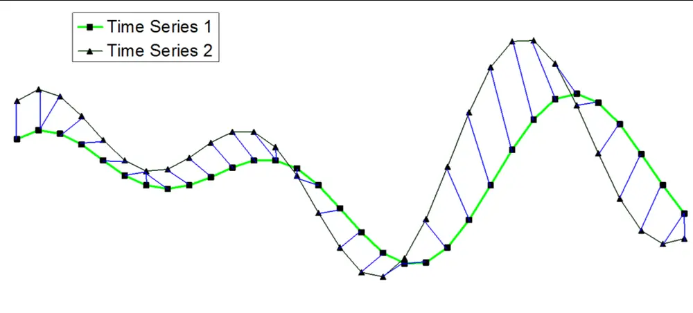
数据来源：广发证券发展研究中心

## （二）多变量的动态时间规整算法

动态时间规整算法常用于单变量时间序列的匹配，事实上，在定义好多变量点和点之间的距离之后，可以将动态时间规整推广到多变量时间序列匹配上。假设两个多变量时间序列 $\mathbf{X}=\left\{\mathbf{x}_{1},\mathbf{x}_{2},\cdots,\mathbf{x}_{m}\right\}$ 和 $\mathbf{Y}=\left\{\mathbf{y}_{1},\mathbf{y}_{2},\cdots,\mathbf{y}_{n}\right\}$ ，其中X含有m 个观测样本，Y含有n个观测样本，且每个观测样本 $\mathbf{x}_{i},i=1,2,\cdots,m$ 和 $\mathbf{y}_{j},j=1,2,\cdots,n$ 都是 $q$ 维的多变量样本（维度一致）。在定义好多变量样本点 $\mathbf{x}_{i}$ 和 $\textbf{ y }_{j}$ 之间的距离计算方式 $d(\mathbf{x}_{i},\mathbf{y}_{j}$ )之后，即可计算多变量序列 X 和 Y 的动态时间规整距离$Distance(\mathbf{X},\mathbf{Y})=D(m,n)$动态时间规整算法的计算步骤如下：

1、将i =0和j=0时的D(i, j)值设置为正无穷大；

2、对于i从1 至m，j 从 1 至n，通过迭代计算：

$$
d_{ij}=d({\bf x}_{i},{\bf y}_{j}),
$$

$$
D(i,j)=d_{ij}+\operatorname*{min}\left\{D(i-1,j),D(i,j-1),D(i-1,j-1)\right\}\ \mathrm{~\circ~}
$$

最终获得的 $D(m,n)$ 即是多变量序列X和Y的动态时间规整距离。这是一个动态规划问题，可以通过O mnq( )次计算，获得两个多变量序列的最优匹配（其中$d_{ij}=d(\mathbf{x}_{i},\mathbf{y}_{j})$ 的计算复杂度为O q( )）。

单步优化公式为： $D(i,j)=d_{ij}+\operatorname*{min}\left\{D(i-1,j),D(i,j-1),D(i-1,j-1)\right\}$ 其中，D i j( 1, )• 表示 $\mathbf{x}_{i-1}$ 与 $\textbf{ y }_{j}$ 匹配时的子序列距离，D i j( , 1)• 表示 $\mathbf{x}_{i}$ 与 $\textbf{ y }_{j-1}$ 匹配时的子序列距离，D(i-1,j-1)表示 $\mathbf{x}_{i-1}$ 与 $\textbf{ y }_{j-1}$ 匹配时的子序列距离。动态时间规整算法从可能的三种拆分方式里边选择最优的一种，如图 2所示。

图2：动态时间规整单步优化示意图
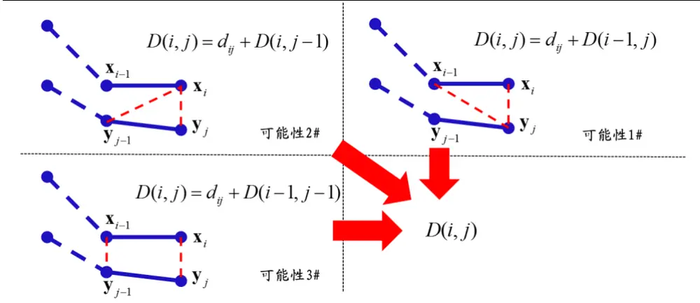
数据来源：广发证券发展研究中心

与之对比，普通的多变量匹配中不考虑时间的扭曲，因此要求两个序列等长，

即m n• ，计算复杂度为 $O(nq)$ 。与普通的多变量时间序列匹配方法相比，动态时间规整可以获得更优的匹配效果，但是需要更长的计算时间。

在多变量时间序列中， $\mathbf{x}_{i}$ 和 $\textbf{ y }_{j}$ 都是 $q$ 维的向量，而且 $\mathbf{x}_{i}$ 中的元素是时刻 i 下变量的值， $\textbf{ y }_{j}$ 中的元素是时刻j下变量的值， $d(\mathbf{x}_{i},\mathbf{y}_{j})$ 即是 i时刻的 $\mathbf{x}_{i}$ 和 j时刻的 $\textbf{ y }_{j}$ 对齐时的距离。向量 $\mathbf{X}_{i}$ 和 $\textbf{ y }_{j}$ 之间的距离计算方式 $d(\mathbf{x}_{i},\mathbf{y}_{j})$ 可以通过欧氏距离或者 $\underline{{\vec{u}}}$ 氏距离来计算。

以单变量的序列 $X=\{1,4,4,8,3,2,7,9,8,3,1\}$ 和 Y •{2,3,9,6,2,2,5,8,9,4,3}为例，定义 $d(\mathbf{x}_{i},\mathbf{y}_{j})=\left|\mathbf{x}_{i}-\mathbf{y}_{j}\right|$ ，通过动态时间规整计算两个序列的距离，可以计算得到 $\begin{array}{r}{Distance(\mathbf{X},\mathbf{Y})=14}\end{array}$ 。这两个序列在形态上的匹配如图 3所示。

图3：单变量动态时间规整形态匹配示意图
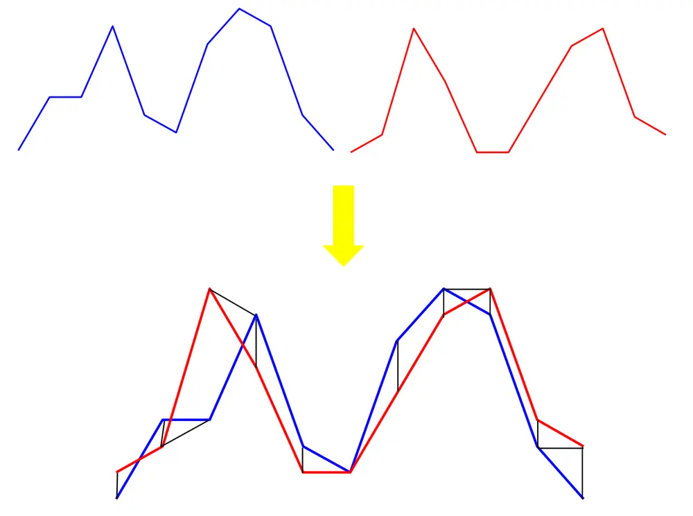
数据来源：广发证券发展研究中心

在序列为多变量的时候，动态时间规整路径的计算方式和单变量序列匹配时一致。区别仅在于 $d(\mathbf{x}_{i},\mathbf{y}_{j})$ 的计算上。

## （三）交易策略

本报告考察的是日间的股指期货交易。第t个交易日的收盘价格和日成交量是一个观测样本， $\mathbf{x}_{t}=\big(p(t),\nu(t)\big)$ 。我们需要通过模式识别对持仓至下一个交易日的收益率 $r_{t}=p(t+1)/{p(t)}-1$ 进行估计，以决定当日收盘时的建仓方向。

对于此前 L 个交易日的收盘价格和日成交量序列 $\mathbf{X}_{t}=\left\{\mathbf{x}_{t-L+1},\cdots,\mathbf{x}_{t-1},\mathbf{x}_{t}\right\}$ ，我们需要寻找与其相似的历史片段。首先，采用长度为 L 的移动窗口，将历史的行情划分为不同的行情片段，每一个片段为 L个交易日的量价行情序列，如图 4所示。

图4：历史行情的片段划分示意图
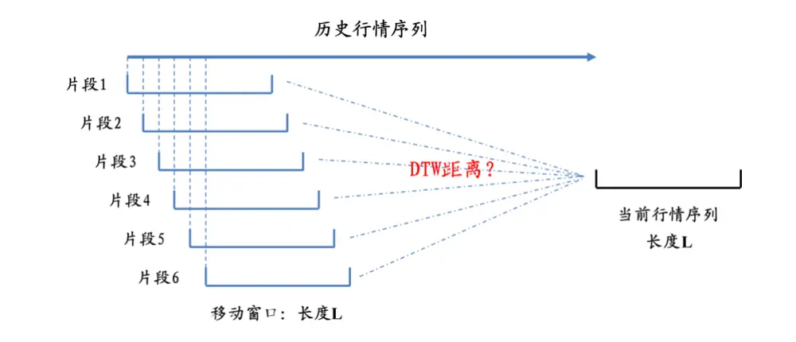
数据来源：广发证券发展研究中心

通过动态时间规整在历史样本中寻找与 $\mathbf{X}_{t}$ 距离最小的前k 个序列，假设这k 个序列分别为 $\mathbf{Y}_{1},\mathbf{Y}_{2},\cdots,\mathbf{Y}_{k}$ ，与 $\mathbf{X}_{t}$ 的距离分别为 $D_{1},D_{2},\cdots,D_{k}$ ，对应的第二个交易日的收益率为 $r_{1},r_{2},\cdots,r_{k}$ 。则可以获得对 $r_{t}$ 的估计为

$$
\hat{r}_{t}=\frac{w_{1}r_{1}+w_{2}r_{2}+\cdots+w_{k}r_{k}}{w_{1}+w_{2}+\cdots+w_{k}}=\frac{\sum_{i=1}^{k}w_{i}r_{i}}{\sum_{i=1}^{k}w_{i}}
$$

其中 $w_{i}=\big/_{D_{i}}$ ，为距离的倒数。这种加权估计的方式使得距离小（即与当前行情相似度大）的历史样本在预测中占有较大的权重，因此，能够减小k 的取值对预测结果的影响。

如果 $\hat{\boldsymbol{r}}_{t}$ 大于0（预测下一个交易日上涨），则在第t个交易日收盘前可以进行做多，下一个交易日收盘前平仓；如果如果 $\hat{\mathbf{\Omega}}_{r_{t}}$ 小于0（预测下一个交易日下跌），则在第t个交易日收盘前可以进行做空，下一个交易日收盘前平仓。

为了减小预测错误造成的损失，我们对策略设置止损。本报告采取1%的固定止损线的策略，即前一个交易日按照收盘价建仓以后，如果第二个交易日的盘中价格“反向”超出建仓价格的1%，则执行平仓。“反向”是指，做多情况下，第二个交易日盘中价格相比建仓价格跌了1%，则平仓止损；做空情况下，第二个交易日盘中价格相比建仓价格涨了1%，则平仓止损。

为了消除行情价格序列和成交量序列的非平稳性造成的偏差，对被匹配序列$\mathbf{X}_{t}=\left\{\mathbf{x}_{t-L+1},\cdots,\mathbf{x}_{t-1},\mathbf{x}_{t}\right\}$ 的中的成交量除以最新的收盘价格 $p(t)$ ，对历史样本片段也进行类似的处理；对于成交量序列，由于股指期货上市以来，成交量有明显的放大趋势，因此将所有的日成交量除以该日的成交量50日移动平均进行标准化。交割日的成交量问题的分析和处理方式见下一节。

为了减小可变参数个数，本策略中考察序列 $\mathbf{X}_{t}$ 和样本库序列的长度都设置为 $L$

由于我们更加关注股指期货在未来的走势，所以本策略采取的动态时间规整和普通的动态时间规整不一样。普通的动态时间规整算法是将第一个时刻样本先对齐，然后考察下一个样本，最终实现两个序列的整体对齐。但由于我们更加关注未来的走势，所以，先将最后时刻的样本对齐，然后考察此前时刻的样本，具体的计算修改步骤为：

1、将 $i=L+1$ 和 j $j=L+1$ 时的 $D(i,j)$ 值设置为正无穷大；

2、对于i从L至 1，j 从L至 1，通过迭代计算

$$
D(i,j)=d_{ij}+\operatorname*{min}\left\{D(i+1,j),D(i,j+1),D(i+1,j+1)\right\}\circ
$$

在匹配中，我们并不需要获取完整序列 $\mathbf{X}_{t}=\left\{\mathbf{x}_{t-L+1},\cdots,\mathbf{x}_{t-1},\mathbf{x}_{t}\right\}$ 和样本序列$\mathbf{Y}_{\tau}=\left\{\mathbf{y}_{\tau-L+1},\cdots,\mathbf{y}_{\tau-1},\mathbf{y}_{\tau}\right\}$ 的最短距离，而只需要考察子序列 $\left\{\mathbf{x}_{t-l+1},\cdots,\mathbf{x}_{t-1},\mathbf{x}_{t}\right\}$ 和$\mathbf{Y}_{\tau}=\left\{\mathbf{y}_{\tau-L+1},\cdots,\mathbf{y}_{\tau-1},\mathbf{y}_{\tau}\right\}$ 的最短距离以及 $\mathbf{X}_{t}=\left\{\mathbf{x}_{t-L+1},\cdots,\mathbf{x}_{t-1},\mathbf{x}_{t}\right\}$ 和子序列$\left\{\mathbf{y}_{\tau-l+1},\cdots,\mathbf{y}_{\tau-1},\mathbf{y}_{\tau}\right\}$ 的最短距离，并取其最小值，其中 $1\leq l\leq L$ 。具体的匹配路径如图5所示。匹配路径A表示 $\mathbf{X}_{t}$ 序列的最近一段子序列与 $\mathbf{Y}_{\tau}$ 序列匹配；匹配路径B表示 $\mathbf{Y}_{\tau}$ 序列的最近一段子序列与 $\mathbf{X}_{t}$ 序列匹配。注意，两种匹配路径中， $\mathbf{X}_{t}$ 序列和 $\mathbf{Y}_{\tau}$ 序列的最新时刻样本都是对齐的。

简单起见，本报告中价格和量在进行模式匹配时的权重相同。由于价格和成交量的波动范围不一致，在进行价量多变量序列匹配计算变量距离 $d(\mathbf{x}_{i},\mathbf{y}_{j})$ 时，需要将价格项和成交量项标准化，即

$$
d(\mathbf{x}_{i},\mathbf{y}_{j})=\sqrt{\left(p_{i}-p_{j}\right)^{2}/\operatorname{var}(p)+\left(\nu_{i}-\nu_{j}\right)^{2}/\operatorname{var}(\nu)}
$$

其中 $\mathbf{x}_{i}=\left(p_{i},\nu_{i}\right),~\mathbf{y}_{j}=\left(p_{j},\nu_{j}\right)$ ；var( )p 和 var( )v 依次为按照考察序列 $\mathbf{X}_{t}$ 计算出来的价格和成交量的方差。

图5：右端对齐的可能匹配路径
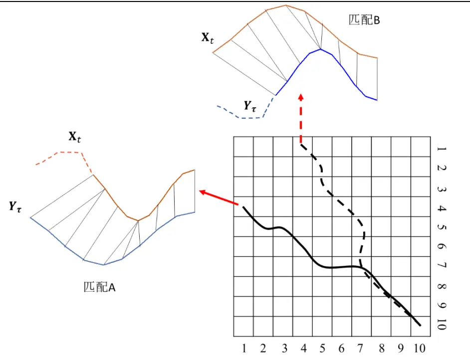
数据来源：广发证券发展研究中心

## （四）股指期货日成交量的交割日问题

数据预处理是模式匹配方法中很重要的一个环节。一方面，考虑到股指期货推出以来，总体趋势上成交量在持续增大，因此本报告中将每日的成交量除以此前 50个交易日的平均成交量，以消除非平稳因素。

另一方面，股指期货当月连续合约在每个月的第三个周五是交割日，在股指期货交割日及前一日，股指期货当月连续合约的成交量会有显著下滑，从图 6 可以很清楚的看到这一点。（去均值后）快速傅里叶变换的结果也显示在频率为 0.05（即1/20天）左右会有一个高峰（每个月的交易日数量约20天）。

由于交割日的成交量波动，如果直接用股指期货当月连续合约来进行价量匹配，将导致匹配不准。需要采取措施来补偿由交割日引起的成交量下滑，使得日成交量能够反映有效的信息。

股指期货当月连续合约和股指期货次月连续合约是沪深 300 股指期货最主要的两个合约。事实上，如果考虑股指期货当月连续合约和股指期货次月连续合约的总成交量，则周期性的交割日成交量下滑问题不再存在。由图 7 的快速傅里叶变换结果可以看到，频率为 1/20天的高峰不再存在。

因此，本报告中考察价量匹配时，采取的“量”是股指期货当月连续合约和股指期货次月连续合约的日总成交量。

图6：股指期货当月连续合约日成交量及其快速傅里叶变换
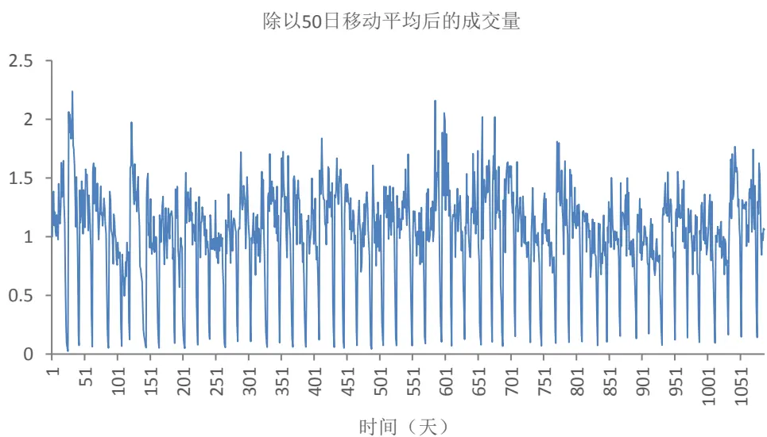

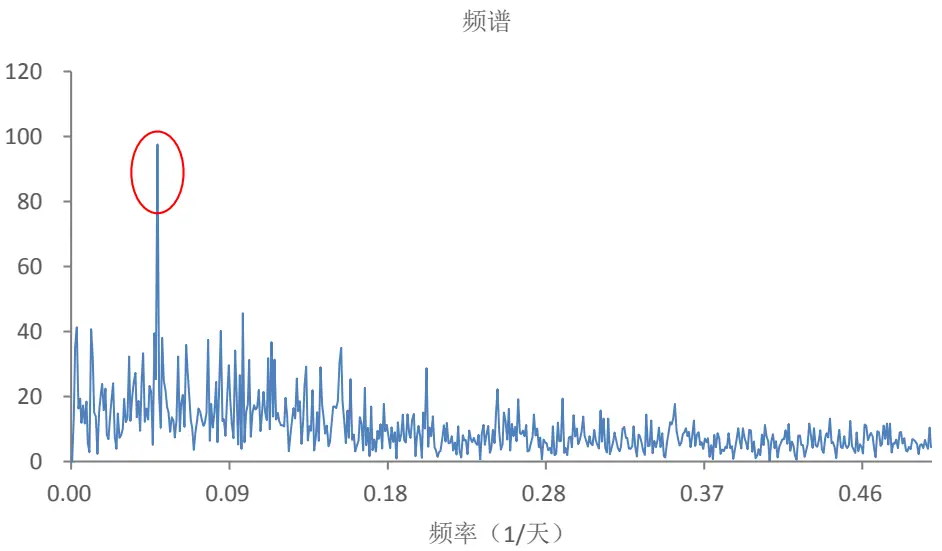
数据来源：广发证券发展研究中心，天软科技

图7：股指期货(当月+次月)连续合约日总成交量及其快速傅里叶变换
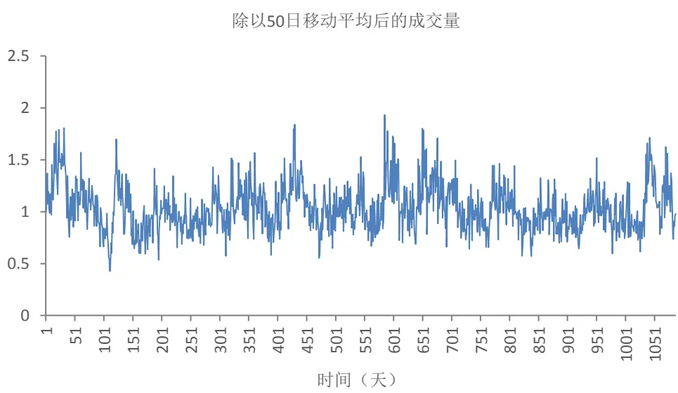

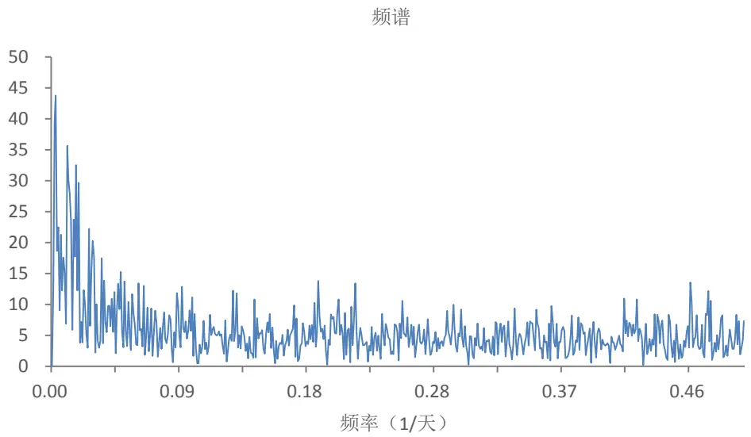
数据来源：广发证券发展研究中心，天软科技

## 三、实证分析

## （一）参数优化

数据选取：实证选取股指期货当月合约和股指期货次月合约自 2010 年 4 月 16日至 2015 年 4 月 30 日的日收盘行情数据。其中，2010 年的数据仅作为样本库中数据进行匹配，不进行交易。采用 2011 年和 2012 年数据作为样本内数据，进行参数优化；采用 2013年以来数据作为样本外数据进行回测。

在每一次进行模式匹配时，2010 年至待考察交易日的L个交易日前的行情数据

作为模式匹配的样本库。

参数选择：用于数据匹配的日线模式序列长度L是最重要的参数。先通过对样本内数据的测试获取最优的参数L，然后用于样本外的数据。

止损：前一个交易日按照收盘价建仓以后，如果第二个交易日的盘中价格“反向”超出建仓价格的 1%，则执行平仓止损。本报告中，盘中价格取日内 1 分钟 K 线的收盘价序列。

策略评价指标：我们选取如下表。

计算时不考虑杠杆，不计冲击成本，采用双边万分之2 的手续费。

表 1：交易策略评价体系

| 考察指标 | 说明 |
| --- | --- |
| 累积收益率 | 模拟交易期末的累积收益率（单利计算） |
| 年化收益率 | 累积收益率折算成的年化收益率 |
| 交易总次数 | 总交易次数（自开仓至平仓为一个完整的交易周期） |
| 获胜次数 | 单次交易收益率大于0的次数（含交易成本） |
| 失败次数 | 单次交易收益率小于0的次数（含交易成本） |
| 胜率 | 获胜次数/交易总次数×100% |
| 单次获胜收益率 | 获胜交易的收益率算术平均值 |
| 单次失败亏损率 | 失败交易的收益率算术平均值 |
| 盈亏比 | 单次获胜平均收益率除以单次失败平均亏损率的绝对值 |
| 最大回撤 | 模拟交易资金自最高点缩水的最大幅度 |
| 最大连胜次数 | 最大连续收益率大于0的交易次数 |
| 最大连亏次数 | 最大连续收益率小于0的交易次数 |

数据来源：广发证券发展研究中心

不同参数下交易策略的样本内累积收益率和最大回撤如表 2 所示。不同参数在样本内的累积收益率如图 8 所示。当 L=11 时，策略具有最大的累积收益率 80.5%，折算成年化收益率为 40.3%，最大回撤为-8.8%。因此，选取 L=11 为最优的参数，用于样本外的模拟交易。

表2：不同参数下交易策略评价指标的表现

|  | L=5 | L=6 | L=7 | L=8 | L=9 | L=10 | L=11 | L=12 | L=13 | L=14 | L=15 |
| --- | --- | --- | --- | --- | --- | --- | --- | --- | --- | --- | --- |
| 累积收益 | 8.8% | 9.1% | 52.5% | 19.6% | 6.6% | 43.7% | 80.5% | 55.9% | 17.9% | 42.8% | 36.9% |
| 最大回撤 | -21.1% | -16.0% | -10.3% | -18.2% | -20.8% | -17.7% | -8.8% | -12.7% | -14.2% | -13.3% | -15.1% |

数据来源：广发证券发展研究中心，天软科技

当L=11时，最优参数下策略在全样本（2011年以来）的累积收益率为229.9%，最大回撤为-12.8%。其中，策略在样本外（2013年以来）的累计收益率为82.7%，最大回撤为-12.8%。策略的累计收益曲线如图9所示，样本内和样本外的具体表现如表3所示。

图8：不同参数下策略的样本内累积收益率
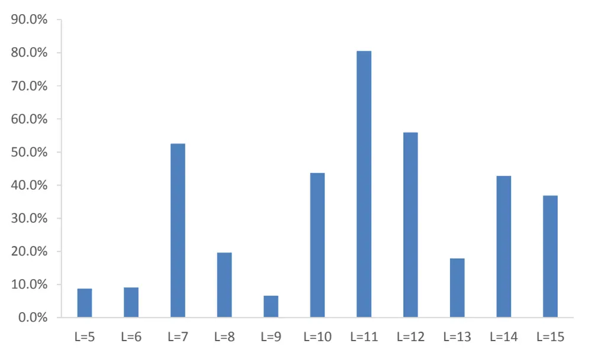
数据来源：广发证券发展研究中心，天软科技

图9：最优参数下策略的全样本累积收益曲线
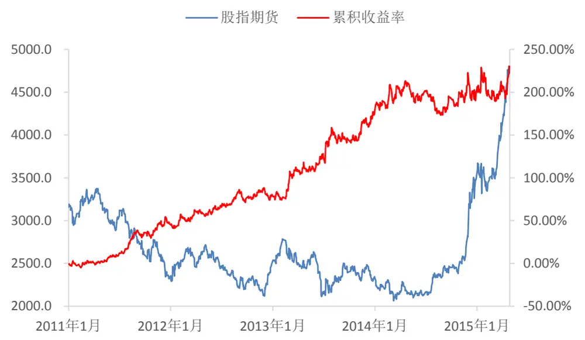
数据来源：广发证券发展研究中心，天软科技

表 3：最优参数下交易策略评价指标的表现

| 考察指标 | 样本内（2011-2012年） 样本外（2013年以来） |
| --- | --- |
| 累积收益率 | 80.5% 82.7% |
| 年化收益率 | 40.3% 35.5% |
| 交易总次数 | 487 561 |
| 获胜次数 | 255 279 |
| 失败次数 | 232 282 |
| 胜率 | 52.4% 49.7% |
| 单次获胜收益率 | 0.93% 1.09% |
| 单次失败亏损率 | -0.75% -0.85% |
| 盈亏比 1.23 | 1.29 |
| 最大回撤 | -8.8% -12.8% |
| 最大连胜次数 | 8 7 |
| 最大连亏次数 | 5 9 |

数据来源：广发证券发展研究中心，天软科技

最优参数下单次交易的收益率分布如图10所示，平均的单次交易收益率为0.12%。

图10：最优参数策略下单次交易收益率分布（全样本）
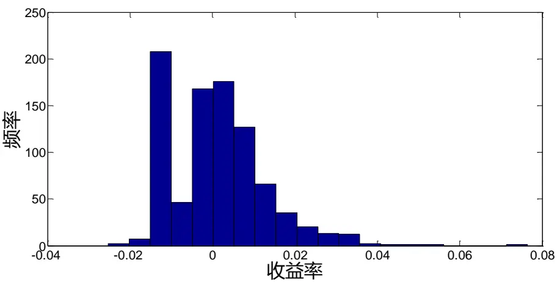
数据来源：广发证券发展研究中心，天软科技

在最优参数下，2014年5月15日行情的价量匹配示意图如图11所示，与这一段行情在价量上最为匹配的是2013年5月20日至6月3日的行情。由图11可以看到，股价在此前4到5个交易日中先是有明显上涨，然后下跌，而且日成交量有明显萎缩的趋势。在此后一个交易日的变化中，2013年6月4日股指期货价格相对于6月3日的价格下跌1.32%，而2014年5月16日股指期货价格相对于5月15日下跌0.24%。

图11：行情价量匹配实例
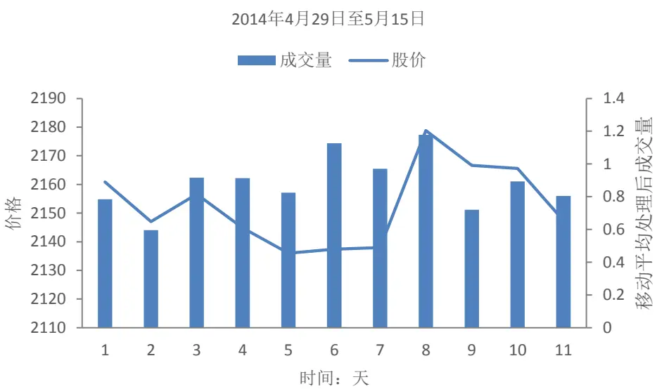

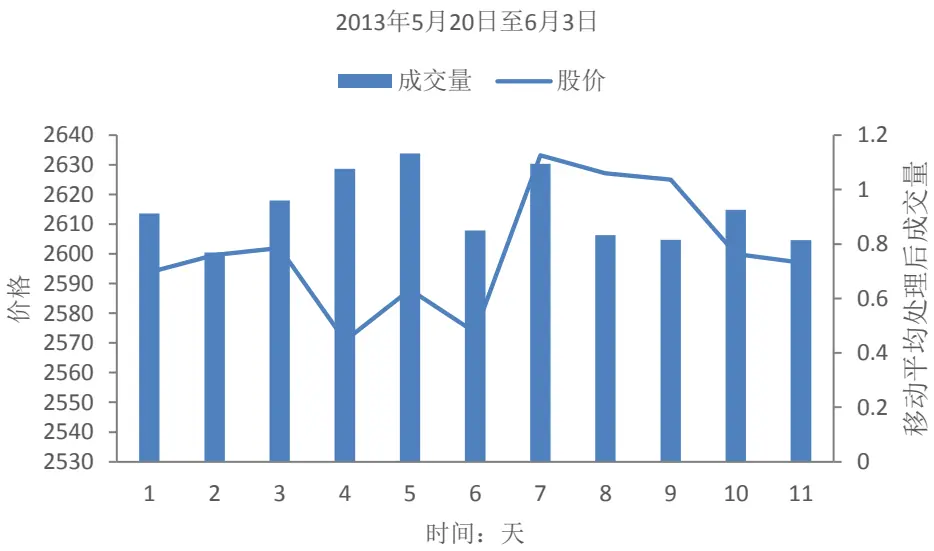
数据来源：广发证券发展研究中心，Wind资讯

## （二）不加止损的策略表现

价量匹配策略是通过寻找历史数据中相似的时间序列模式，根据相似模式的股价走势，对股价的未来走势进行预测。由于市场中充满了非常多的不确定性，使得预测模型的准确率不是很高，如表4所示，绝大部分参数L下模型的预测准确率只是略高于50%。即使是最优参数L=11，对应的匹配算法预测准确率也只有55.3%。其中，预测准确率计算公式为：N（建仓后下一个交易日收盘股价涨跌方向和建仓方向相同）/ N（发出交易信号）×100%

表4：不同参数下交易策略预测准确率

|  | L=5 | L=6 | L=7 | L=8 | L=9 | L=10 | L=11 | L=12 | L=13 | L=14 | L=15 |
| --- | --- | --- | --- | --- | --- | --- | --- | --- | --- | --- | --- |
| 预测准确率 | 49.4% | 53.7% | 53.7% | 52.4% | 53.0% | 52.5% | 55.3% | 54.5% | 51.7% | 52.0% | 51.9% |

数据来源：广发证券发展研究中心，天软科技

为了减小预测失败导致的损失，本报告中采取设定止损点位的方式。如果不加止损平仓措施，不同参数下策略的全样本累积收益率和最大回撤如图12和图13所示。对于所有的参数L，带止损策略的累积收益率都和不带止损的策略相近，而回撤幅度明显减小，收益更加稳健。因此，在价量匹配策略中采取止损措施是有效的。

图12：带止损策略和不带止损策略累积收益率比较
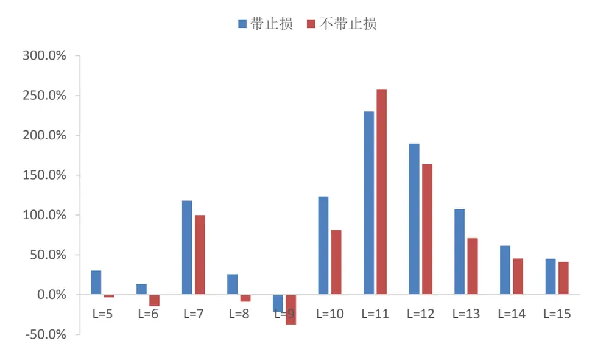
数据来源：广发证券发展研究中心，天软科技

图13：带止损策略和不带止损策略最大回撤比较
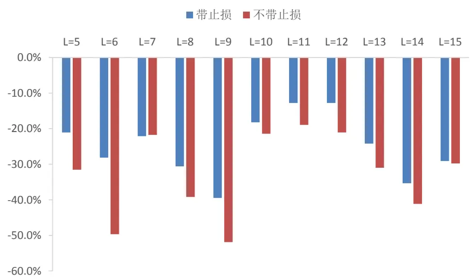
数据来源：广发证券发展研究中心，天软科技
识别风险，发现价值

## （三）价量匹配与价格匹配

成交量和股票价格有重要的关系，成交量很大程度上反映了投资者的心理，可以推动价格的变化，同时也可以验证价格的形态。单纯从价格变化来看，量增价涨、量缩价涨具有相同的模式，但是由于成交量的区别，它们的后期走势可能具有非常大的差别。

如果不考虑成交量，只通过价格进行动态时间规整模式匹配的话。不同参数下策略在全样本的表现如图14和图 15所示。其中，图14比较了不同参数下价量匹配策略和价格匹配策略的累积收益率，图15比较了不同参数下的最大回撤。可以看到，在绝大多数参数下，价量匹配策略的表现都优于单纯的价格匹配策略。

这也验证了成交量和价格的紧密关系，模式匹配中把成交量和价格一起考虑能够获得更好的匹配效果。

图14：价量匹配策略和价格匹配策略累积收益率比较
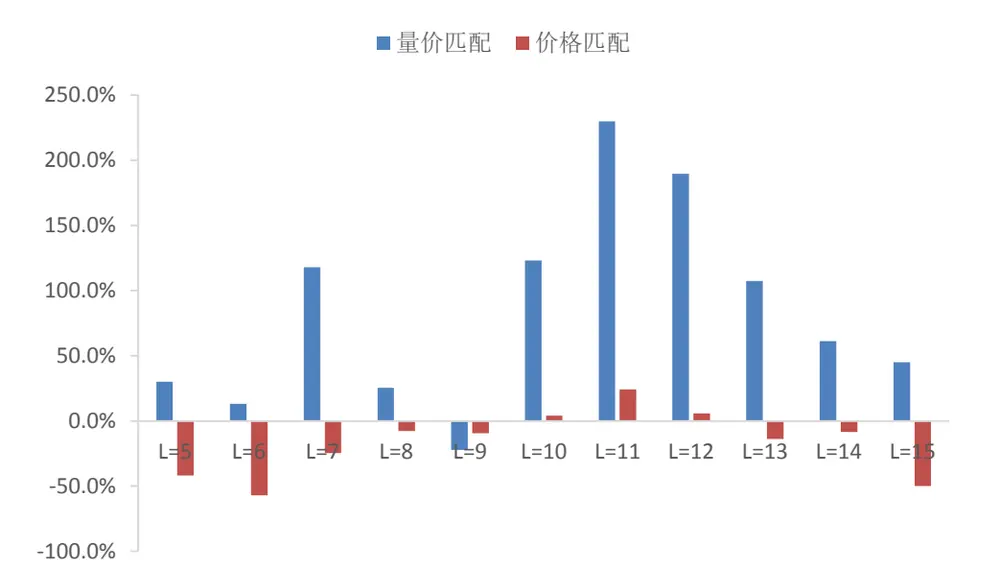
数据来源：广发证券发展研究中心，天软科技

图15：价量匹配策略和价格匹配策略最大回撤比较
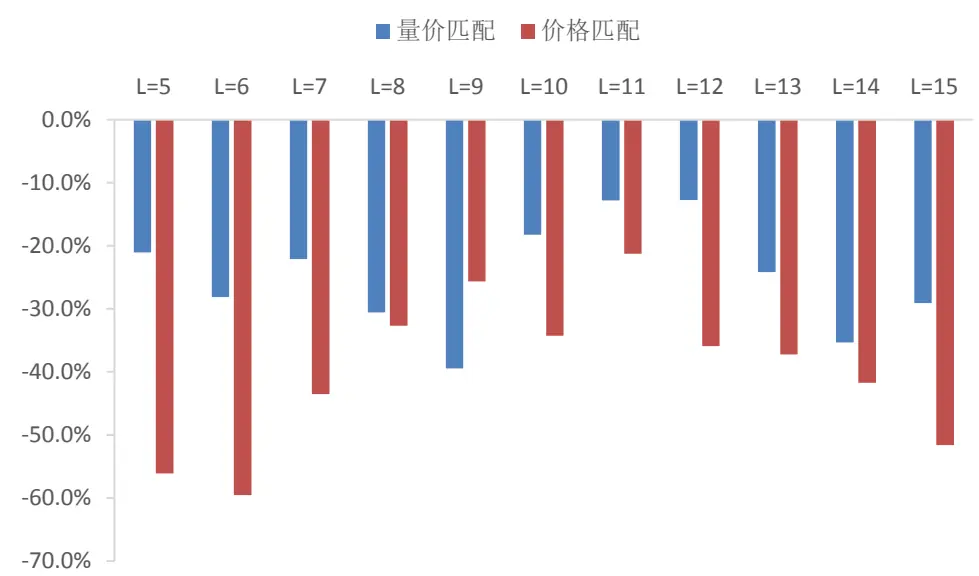
数据来源：广发证券发展研究中心，天软科技

## （四）不同参数下的混合策略

由前文的实证分析可以看到，不同参数下的策略基本上都能够获得盈利，但是盈利能力有所区别。考虑到通过样本内优化进行参数选择的模型有被过度优化的风险；同时市场始终在变化，单一参数下的策略可能并不适合不同的市场行情。为了避免潜在的参数选择风险，可以采取不同策略混合的方式，用混合策略来提高模型盈利的稳健性。

单一参数的策略，我们这里称之为“子策略”；多个子策略的混合投资，我们称之为“混合策略”。通过子策略来构建混合策略的方式有很多。按照策略混合的层面来说，可以分为两大类。

第一种是资金层面的分散投资。例如简单的资金等权配置：在每一个交易日把资金平均分配到不同的策略上。如果一共有三个子策略，则每个子策略上占用 1/3的资金。

第二种是信号层面的混合策略。如图16 所示的专家投票系统，每一个子策略（专家）都会产生独自的交易信号，基于不同子策略的交易信号进行决策，来决定最终的交易方向和头寸。用“投票”的方式对不同策略产生的交易信号进行综合，如果有半数以上信号支持做多，那么建立多头仓位；反之，建立空头头寸。

在专家投票系统中，建仓的头寸可以固定，也可以根据“投票”来进行更加灵活的配置。仓位控制时常用的原则是在赢面较高时增加仓位，在赢面较低时降低仓位。如果所有的专家预测一致，可认为当前预测的可靠性高，可以满仓进行建仓；如果大部分专家（比例为R1）看多，而少部分专家（比例为R2）看空，则建立多头仓位，但认为当前预测的可靠性不那么高，为了减小风险，仅按照净看多的专家比例来建仓，仓位为R1-R2。看空时也是类似的处理思路。

图16：专家投票决策系统示意图
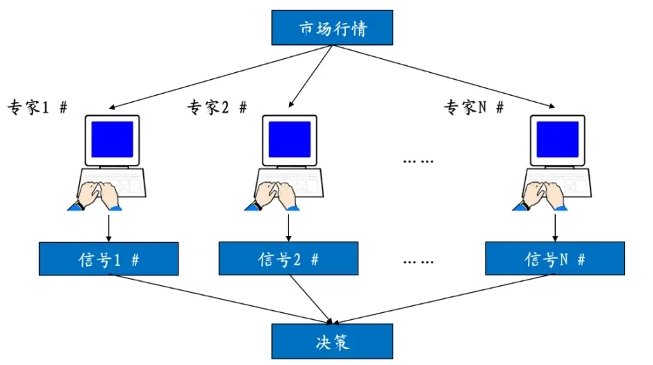
数据来源：广发证券发展研究中心

这里的实证分析采取第二种混合策略，通过样本内对策略的分析，每次选取 3个子策略，记为A，B，C。在样本每个交易日，按照3 个子策略的预测信号来进行建仓交易。建仓方向和仓位控制如表 5 所示。其中，“+”表示该子策略看多，“-”表示该子策略看空。

表5：混合策略建仓方向及仓位控制

| 子策略预测信号 子策略B | 子策略 C | 建仓方向 | 建仓仓位 |
| --- | --- | --- | --- |
| 子策略A + | + + | 多 | 100% |
| 十 | 十 | 多 | 33.3% |
| 十 | 一 | 多 | 33.3% |
| 一 | 十 | 多 | 33.3% |
| + | 一 | 空 | 33.3% |
| 一 | 十 | 空 | 33.3% |
| 一 | 一 | 空 | 33.3% |
| 1 |  | 空 | 100% |

数据来源：广发证券发展研究中心

考虑如下的几种子策略选取方式：

混合策略I:不同参数L下（L=5，6，7，……，14，15）下，剔除样本内表现最好的参数（L=11），剩下子策略中，选取样本内表现最好的3个参数（L=7,10,12）组成混合策略；

混合策略II:不同参数L下（L=5，6，7，……，14，15）下，选取样本内表现最好的三个参数（L=7，11，12），共3个策略组成混合策略；

混合策略III:不同参数L下（L=5，6，7，……，14，15）下，选取样本内表现最好的参数（L=11）以及其邻近的参数（L=10，12），共3个策略组成混合策略。

不同混合策略在全样本的累计收益率如图17所示。三种混合策略在2011年以来都取得了比较稳健的收益。三种混合策略的累积收益率都在150%以上，最大回撤都在-12%以内。

不同混合策略在样本外的表现如表6所示。相对于最优参数下（L=11）的策略来说，混合策略样本外的累积收益率可能有所下滑，但是混合策略的最大回撤变小，收益更加稳健。可以看到，最优参数L=11下的策略最大回撤在-12.8%，而混合策略的最大回撤都不超过-12%。值得一提的是，混合策略I虽然剔除了表现最好的参数（最优参数L=11），但样本外的收益回撤比比最优参数下策略的表现还要好。

图17：混合策略累积收益曲线
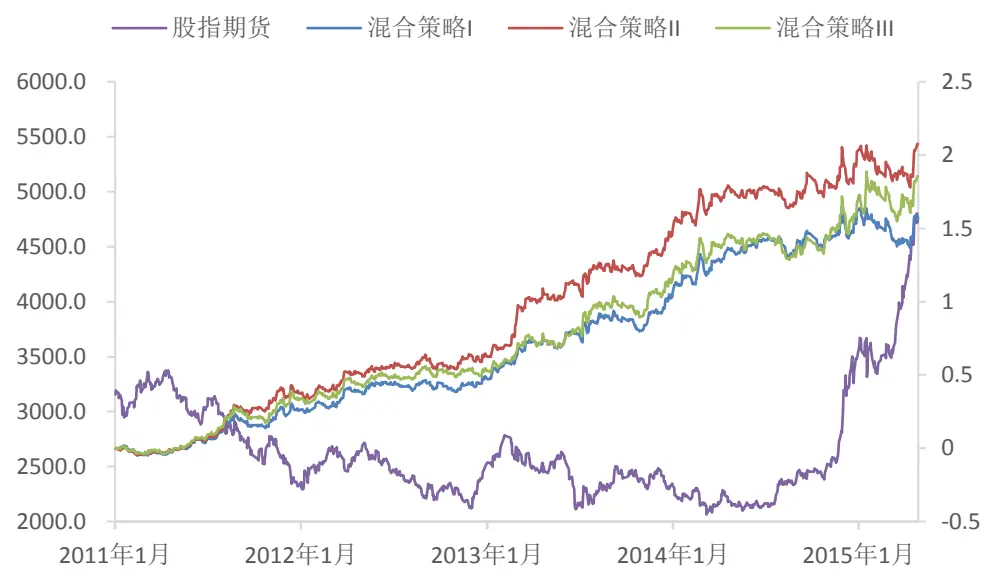
数据来源：广发证券发展研究中心，天软科技

表6：混合策略样本外的表现

|  | L=11 | 混合策略Ⅰ | 混合策略II | 混合策略III |
| --- | --- | --- | --- | --- |
| 累积收益率 | 82.7% | 74.7% | 89.4% | 87.2% |
| 年化收益率 | 35.5% | 32.0% | 38.3% | 37.4% |
| 最大回撤 | -12.8% | -10.8% | -9.4% | -11.7% |
| 收益回撤比 | 2.77 | 2.96 | 4.07 | 3.20 |

数据来源：广发证券发展研究中心，天软科技

## 四、总结与讨论

本篇报告介绍了基于多变量动态时间规整的价量匹配股指期货日间交易策略。行情价格和成交量是用于描述股票状态的两个最重要因素，通过动态时间规整算法，从历史行情中获得与当前行情最相似的片段，根据这些片段在未来交易日的收益情况来预测当前行情的走势，然后进行交易。

在进行价量匹配的时候，由于股指期货当月连续合约在股指期货交割日前有明显下滑，会造成匹配错误。为了补偿这种与市场无关的交易量萎缩现象，本报告采取股指期货当月连续合约和次月连续合约的总成交量，来进行价量匹配。频谱分析证实了总成交量不受交割日的周期性影响，适合用于模式匹配寻找相似片段。

经过实证分析，自2011年以来，该策略取得了 229.9%的累积收益率，而最大回撤为-12.8%。这里按照复利来计算收益，没有计入杠杆，双边交易费用为 0.02%。

如果不考虑成交量的信息，仅用价格序列进行匹配，大部分参数下的表现都差于价量匹配策略的结果。可见，成交量在进行模式匹配选择相似样本时非常重要，行情的变化、价格的涨跌需要成交量信息的确认。

类似本报告的计算方法，动态时间规整可以用于对包含其他技术指标的多变量时间序列进行匹配。本报告采用的价格和成交量是技术分析中最重要的因子，其他技术指标的加入也有可能使得模式匹配的效果变好。

由于股指期货截至目前日行情数据的数据量不大，本报告在进行交易时，对此前所有时刻的行情进行扫描以匹配出最相似的片段。当匹配的样本空间很大时，可以人工对样本中重要的模式进行选择或者聚类，在实盘模式匹配的时候，就可以和预先选择好的模式库和类别进行匹配，提高策略的计算效率。

## 风险提示

策略模型并非百分百有效，市场结构及交易行为的改变以及类似交易参与者的增多有可能使得策略失效。

## Table_RatingIndustry 广发证券—行业投资评级说明

买入： 预期未来12个月内，股价表现强于大盘10%以上。

持有： 预期未来12个月内，股价相对大盘的变动幅度介于-10%～+10%。

卖出： 预期未来12个月内，股价表现弱于大盘10%以上。

## Table_RatingCompany 广发证券—公司投资评级说明

买入： 预期未来12个月内，股价表现强于大盘15%以上。

谨慎增持： 预期未来12个月内，股价表现强于大盘5%-15%。

持有： 预期未来12个月内，股价相对大盘的变动幅度介于-5%～+5%。

卖出： 预期未来12个月内，股价表现弱于大盘5%以上。

## Table_Ad联系我们

| 地址 | 广州市 广州市天河北路183号 | 深圳市 深圳市福田区金田路4018 | 北京市 | 上海市 |
| --- | --- | --- | --- | --- |
|  | 大都会广场5 楼 | 号安联大厦 15 楼 A 座 03-04 | 北京市西城区月坛北街2号 月坛大厦18层 | 上海市浦东新区富城路99号 震旦大厦18楼 |
| 邮政编码 | 510075 | 518026 | 100045 | 200120 |
| 客服邮箱 | gfyf@gf.com.cn |  |  |  |
| 服务热线 | 020-87555888-8612 |  |  |  |

## Table_Disclaimer 免 责声 明

广发证券股份有限公司具备证券投资咨询业务资格。本报告只发送给广发证券重点客户，不对外公开发布。

本报告所载资料的来源及观点的出处皆被广发证券股份有限公司认为可靠，但广发证券不对其准确性或完整性做出任何保证。报告内容仅供参考，报告中的信息或所表达观点不构成所涉证券买卖的出价或询价。广发证券不对因使用本报告的内容而引致的损失承担任何责任，除非法律法规有明确规定。客户不应以本报告取代其独立判断或仅根据本报告做出决策。

广发证券可发出其它与本报告所载信息不一致及有不同结论的报告。本报告反映研究人员的不同观点、见解及分析方法，并不代表广发证券或其附属机构的立场。报告所载资料、意见及推测仅反映研究人员于发出本报告当日的判断，可随时更改且不予通告。

本报告旨在发送给广发证券的特定客户及其它专业人士。未经广发证券事先书面许可，任何机构或个人不得以任何形式翻版、复制、刊登、转载和引用，否则由此造成的一切不良后果及法律责任由私自翻版、复制、刊登、转载和引用者承担。