# 境外中概股股指期货对于 A 股市场择时研究

## 另类交易策略之二十六

## Table_Sum ary报告摘要 ：

## 海外中概股指数期货介绍

中国的股指期货目前尚没有夜盘交易。在海外的中概股指数期货目前交易较为活跃的品种主要有在新加坡交易所交易的新华富时 A50指数期货和港交所推出的恒生H股指数期货。A50指数以在中国境内上市的沪深两市的股票指数为标的，而H股指数则以在香港上市的中国股票指数为标的。两个期货品种目前均有夜盘交易。

## A50指数期货夜盘看多信号准确率高

基于 A50 指数和恒生 H 股指数与中国 A 股的高度相关性，我们尝试用两种指数期货夜盘的涨跌对次日A 股的走势做实证。实证结果发现，A50 夜盘对于第二天大盘上涨的预测胜率以及收益率预测都显著好于对于第二天大盘跌的预测。特别是在中证500 指数上，单向做多，胜率高达61.88%，最大回撤为11.33%，年化收益率为 36.35%。我们认为这主要源于 A50 夜盘的参与者主要为欧美基于套保需求的投资者，多空力量不平衡而导致夜盘的下跌难以反映整个市场的情绪，而夜盘上涨时则说明即使在套保盘的压力下，乐观情绪仍然明显，因此看多信号的胜率较高。而恒生H股指数期货则由于与 A股相关性较弱，预测效果较差。

## 趋势延续性强品种择时效果好

进一步对比上证50，沪深300 以及中证500指数的效果差异我们发现，A50 夜盘信息在第二天指数开盘跳空时已经有所反应，因而对这三种指数第二天的跳空开盘预测具有较高胜率，上证 50和沪深300在隔夜跳空之后日内趋势性较弱，因此收益较差。而中证 500 指数日内趋势延续性较好，同时波动较大，因此在日内交易方面 A50指数对于中证500的预测效果好于上证 50和沪深300。

图 1A50 信号中证 500单纯做多
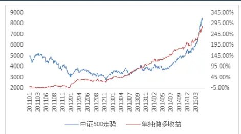

图 2A50信号中证 500 多空加止损
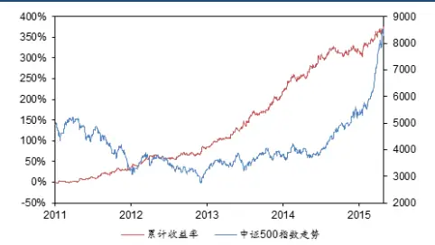

Table_Aut hor 分析师： 安宁宁 S0260512020003

0755-23948352

ann@gf.com.cn

## Table_Report 相关研究：

另类交易策略系列之二十 2015-04-22
五：价量模式匹配股指期货
交易策略
另类交易策略系列之二十 2015-04-16
四：观日内趋势，察行业轮
动，品风格套利
另类交易策略系列之二十 2015-04-10
三：风格动量下的股指期货
跨品种套利

联系人：施驰

020-87555888-8687

shichi@gf.com.cn

## 一、 境外中国概念指数期货介绍

## （一）新华富时 A50 指数暴跌引发争论

2015年4月17日，证监会发言人向大家宣布了鼓励融券交易和扩大券源的通知，然后重申了禁止券商开展场外配资和伞形信托等活动的规定。随后传来了新华富时A50期指大跌5%，恒生H股期指也跳水超过600点的噩耗。新加坡A50股指期货到底是什么？这种坡岛上交易的小国寡民的期货工具到底和A股有什么关系？朋友圈里大家一时众说纷纭。

图1：新华富时A50指数期货2015年4月17日暴跌
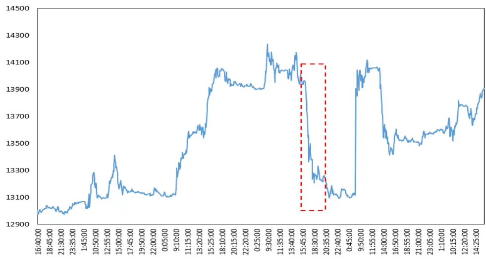
数据来源：广发证券发展研究中心、WIND资讯

图2：恒生H股指数期货2015年4月17日暴跌
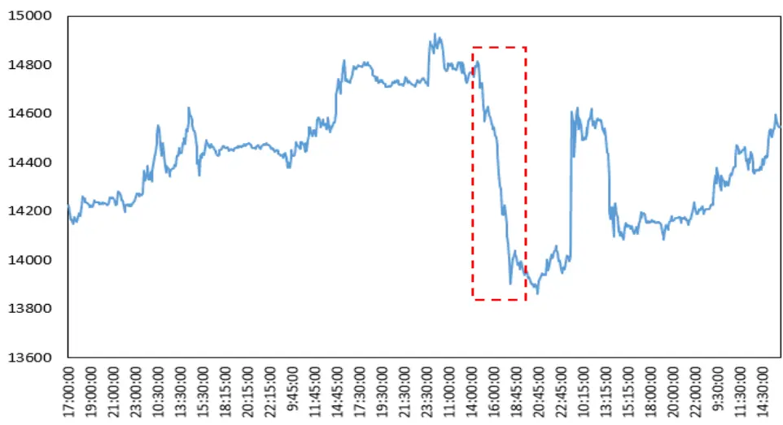
数据来源：广发证券发展研究中心、WIND资讯

鉴于大家平常对国内的股指期货研究较多，而对海外的中概股指数鲜有涉及。本文将为一方面为大家详细介绍目前主流的海外股指期货，另一方面对这些股指期货与A股市场的关系做一定的实证分析。

## （二）中概股指数简介

在境外曾经出现过不少中国概念股指期货，但大多数都昙花一现，如芝加哥期权交易所的中国指数期货，芝加哥商业交易所的富时25指数期货，香港交易所的新华富时25指数期货和H股金融行业指数期货，均上市不到5年就终止交易了。2013年欧洲期货交易所新推出的MSCI中国自由指数期货虽然还未摘牌，但每日的持仓量和成交量都很小，也面临着被退市的风险。目前交易活跃的仅剩下了新加坡交易所的新华富时A50指数期货和香港交易所的恒生H股指数期货。

表1：境外中国概念股指期货概况

| 名称 交易场所 标的指数 上市时间 |  |  |  | 摘牌时间 |
| --- | --- | --- | --- | --- |
| MSCI 中国自由指数期货 | 香港交易所 | MSCI 中国自由指数 | 2001.5.7 | 2004.3.30 |
| 恒生 H 股指数期货 | 香港交易所 | 恒生中国企业指数 | 2003.12.8 |  |
| CBOE 中国指数期货 | 芝加哥期货交易所 | CBOE 中国指数 | 2004.10.18 | 2007.6.12 |
| 新华富时 25 指数期货 | 香港交易所 | 新华富时 25 指数 | 2005.5.23 | 2008.12.31 |
| 新华富时 A50 指数期货 | 新加坡交易所 | 新华富时 A50 指数 | 2006.9.5 |  |
| 恒生 H股金融行业指数期货 | 香港交易所 | 恒生中国H 股金融行业指数 | 2007.4.16 | 2008.12.24 |
| 新华富时中国 25 指数期货 | 芝加哥商业交易所 | 新华富时 25 指数 | 2007.5.20 | 2011.5.16 |
| MSCI 中国自由指数期货 | 欧洲期货交易所 | MSCI 中国自由指数 | 2013.9.9 |  |

数据来源：广发证券发展研究中心

新华富时A50指数是由新华富时指数公司编制的，其成分股为上海证券交易所和深圳证券交易所A股总市值前50名的公司（如下表所示）。与上证50指数的主要区别在于包含了部分深交所的蓝筹股，与上证50指数成分股重合度高达62%。

图3：新华富时A50指数成分股（截至2015年4月）
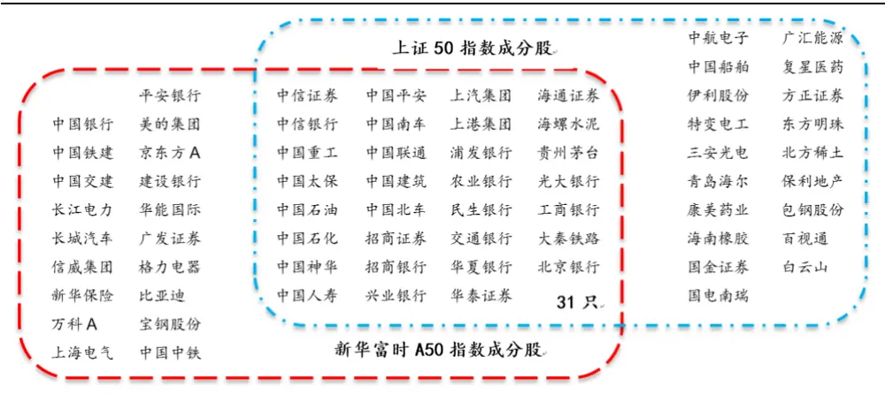
数据来源：广发证券发展研究中心、WIND资讯

分析指数日收益率相关性，我们发现新华富时A50指数与同是大盘蓝筹风格的上证50和沪深300指数相关度分别高达99.5%和96.1%，而与小盘成长风格的中证500指数相关性略低，为63.4%。

图4：新华富时A50、上证50、沪深300和中证500指数市场表现
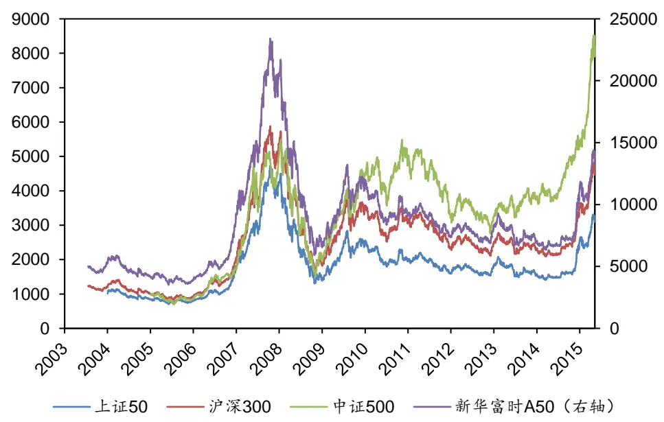
数据来源：广发证券发展研究中心、WIND资讯

表2：新华富时A50指数与上证50、沪深300和中证500指数的相关系数

| 相关系数 | 上证50 | 沪深300 | 中证500 |
| --- | --- | --- | --- |
| 新华富时 A50 指数 | 0.995 | 0.961 | 0.634 |

数据来源：广发证券发展研究中心、WIND资讯

另一种交易活跃的境外中概股指数期货的标的为恒生H股指数，全称为恒生中国企业指数，是由恒生指数有限公司编制的，其成分股为在香港交易所上市的中国内地企业中，综合市值前40名的公司。这其中分两类，一种是在香港上市的纯港股，另一种是在香港和内地均上市的A+H股。

图5：恒生H股指数成分股（截至2015年5月）
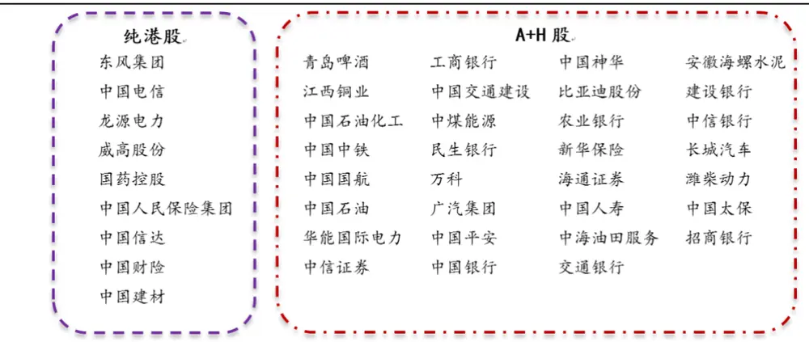
数据来源：广发证券发展研究中心、恒生指数有限公司

虽然恒生H股指数并非境内股票市场指数，但是由于成分股股票基本面与内地经济高度相关，H股市场与A股市场关联性不断增强，H股指数同A股指数展现了一定程度的相关性。，如下图和下表所示。

图6：恒生H股指、上证50、沪深300和中证500市场表现
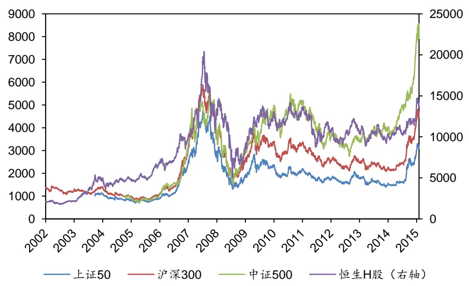
数据来源：广发证券发展研究中心、WIND资讯

同样，由于H股指数以蓝筹股为主，其收益率与上证50指数和沪深300指数相关性略高于同中证500指数的相关性。。

表3：恒生H股指数与上证50、沪深300和中证500指数的相关系数

| 相关系数 上证50 |  | 沪深300 | 中证500 |
| --- | --- | --- | --- |
| 恒生 H 股指数 | 0.869 | 0.893 | 0.835 |

识别风险，发现价值

数据来源：广发证券发展研究中心、WIND资讯

## （三）新华富时 A50 指数期货

2006年9月5日，新加坡交易所推出了第一支以中国境内A股指数为标的的新华富时A50指数期货。期货合约细则如下表所示。值得注意的是，新华富时A50指数期货的交易时间不仅完全包含了境内股指期货的交易时间，还存在有夜盘交易。

表4：新华富时A50股指期货合约

| 项目 合约细则 |  |
| --- | --- |
| 标的指数 | 新华富时 A50 指数 |
| 合约规模 | US$1×新华富时 A50 指数期货价格 |
| 合约月份 | 当月、下月，及每个年度的三月、六月、九月和十二月 |
| 最小变动价位 | 2.5 个指数点（US$2.50） |
| 交易时间 | T时段：上午9:00-下午4:00T+1时段：下午4:40－次日凌晨2:00 |
| 最后交易日 | 合约月份的倒数第二个工作日 |
| 涨跌幅限制 | 当价格较前一交易日的结算价上升或下降10%时：10分钟冷静期（涨跌幅限制±10%）；当价格较前一交易日结算价上升或下降15%时：10分钟冷静期（涨跌幅限制±15%）。此后将不再有涨跌幅限制，合约最后交易日无涨跌幅限制 |
| 结算方式 | 现金结算 |
| 最后结算价 | 新华富时A50指数的正式收盘价，四舍五入至小数点后两位 |
| 持仓限制 | 15,000份合约（可申请提高） |

数据来源：新加坡交易所

新加坡交易所推出新华富时A50指数期货的初衷是为了给境外投资者，尤其是QFII，提供对冲境内A股风险的工具，因为当时境内外并没有A股指数期货。2010年中金所推出沪深300股指期货时，境外投资者暂不能参与交易。直至2013年初，证监会批准QFII参与中金所股指期货交易，但一般境外投资者依然只能投资境外的A股指数期货。因此，新华富时A50指数期货的投资者主要为境外对冲A股风险的投资者，并且不仅限于新加坡本土，绝大部分投资者来自非新加坡的其他国家。

下图为新华富时A50指数期货日盘和夜盘的成交量情况。可以看出，成交量呈逐年上升的趋势。即便是2013年初QFII获准投资中金所股指期货以后，新华富时A50指数期货的成交量依然继续上升，其在境外市场受欢迎程度可见一斑。

图7：新华富时A50指数期货日盘和夜盘的日成交量

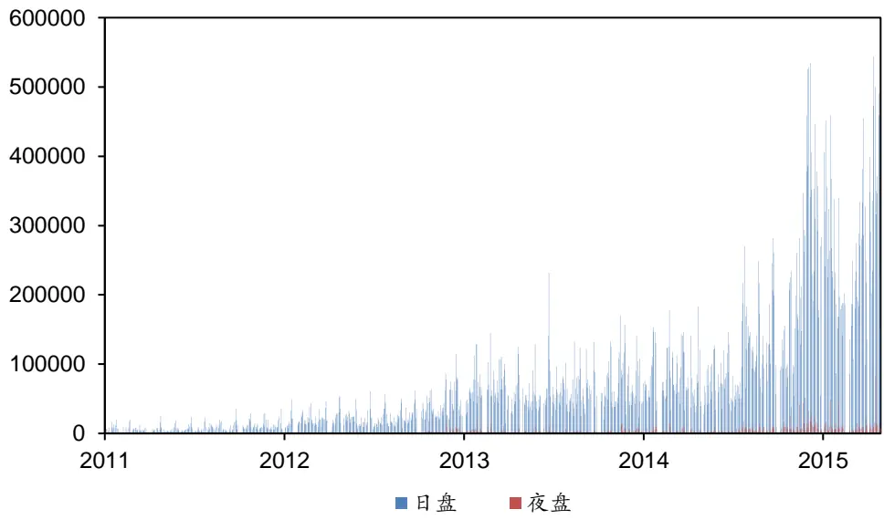
数据来源：广发证券发展研究中心、Bloomberg

与境内中金所股指期货相比，新华富时A50指数期货对于外国投资者而言具有较强的吸引力：

图8：新华富时A50指数期货与中金所股指期货对比
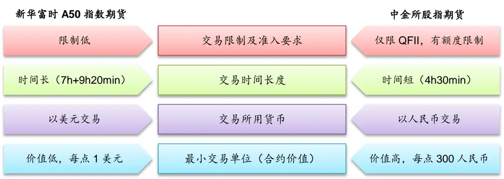
数据来源：广发证券发展研究中心

首先，中金所股指期货交易仅限于QFII，并不包括一般境外投资者。并且证监会限制QFII仅能做套期保值，对持仓量和日成交金额均有限制。而在新加坡期货交易所没有此类限制。其次，新加坡期货交易所提供日盘和夜盘共逾16小时的交易时间，而中金所的交易时间仅限日盘4.5小时。第三，新华富时A50指数期货交易采用的货币为美元，对于境外投资者来说降低了交易费用和汇率风险。最后，新华富时A50指数的合约价值低。以2015年4月30日收盘价为例，1张合约价值为14,005美元，而1张沪深300股指期货的价值为1,430,340元人民币，按汇率折算后是前者的近20倍。因此，即便中金所股指期货对QFII开放，新华富时A50指数期货的成交依然活跃。

## （四）恒生 H 股指数期货

香港交易所于2003年12月8日推出恒生H股指数期货，意在提供对冲H股风险的金融工具。期货合约细则如下表所示。从2013年4月8日起，恒生H股指数期货开始了夜盘交易。

表5：恒生中国企业指数期货合约

| 项目 合约细则 |  |
| --- | --- |
| 标的指数 | 恒生中国企业指数 |
| 合约规模 | 每点$50 港币 |
| 合约月份 | 当月、下月，及随后两个季月 |
| 最小变动价位 | 1 个指数点 |
| 开市前议价时段 | 上午8:45-9:15，中午12:30-下午1:00 |
| 交易时间 | T时段：上午9:15-中午12:00，下午1:00-下午4:15T+1 时段：下午 5:00-晚上 11:45(到期合约在最后交易日收盘时间为下午4:00) |
| 最后交易日 | 合约月份的倒数第二个工作日 |
| 最后结算价 | 最后交易日恒生H股指数每五分钟所报指数点的平均数 |

数据来源：香港交易所

整体上看，恒生H股指数期货的成交量呈上升态势（如下图所示），尤其是夜盘成交量，自推出之日起便明显上升。

图9：恒生H股指数期货日盘和夜盘的日成交量
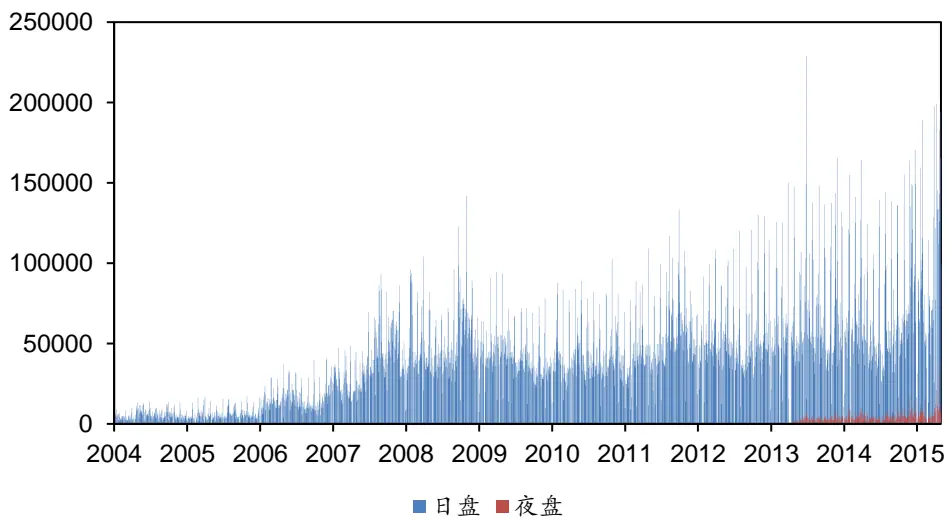
数据来源：广发证券发展研究中心、Bloomberg

## 二、实证研究

下面我们将对于新华富时A50指数期货和恒生H股指数期货夜盘对于A股市场的影响做实证分析。

## （一）模型思路

受境内外指数联动性启发，加上境外指数期货存在夜盘交易，我们可以根据T-1日夜盘的收益率来判断T日要做多或做空指数。下述的境内指数在此处指代上证50、沪深300、中证500和沪深300股指期货。具体的交易步骤如下：

## 第一步，计算境外指数期货夜盘收益率

计算T-1日境外指数期货夜盘时段的收益率。这里的收益率依然定义为夜盘交易时段的收盘价相对于开盘价的增长率。

## 第二步，根据境外指数期货收益率进行境内指数交易

如果T-1日境外指数期货夜盘的收益率为正，则在T日开盘时做多境内指数，收盘时平仓；如果T-1日境外指数期货夜盘的收益率为负，则在T日开盘时做空境内指数，收盘时平仓；如果T-1日境外指数期货夜盘的收益率为零，则T日不进行交易。

第三步，交易止损或收盘平仓。

详细的交易流程如下图所示：

图10：交易流程
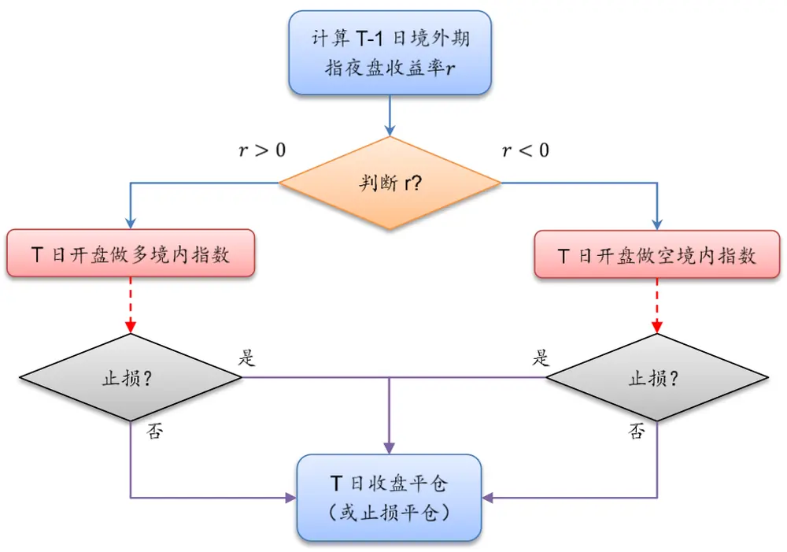
数据来源：广发证券发展研究中心

## （二）新华富时 A50 指数期货实证结果

在新华富时A50指数期货上实证采用的参数如下表所示：

表6：新华富时A50指数期货模型参数

| 参数类型 参数取值 |  |
| --- | --- |
| 起始时间 | 2011年1月1日 |
| 结束时间 | 2015年4月30日 |
| 止损阈值 | 不设止损 |
| 交易成本（双边） | 2/10000 |
| 收益率计算方式 | 复利 |

数据来源：广发证券发展研究中心

对上证50指数、沪深300指数和中证500指数实证结果如下图所示：

图11：新华富时A50指数期货夜盘对于上证50择时结果
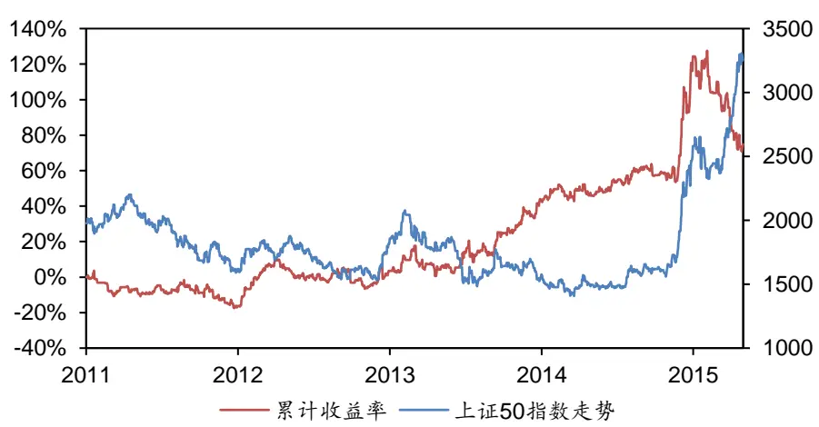
数据来源：广发证券发展研究中心、天软科技

图12：新华富时A50指数期货夜盘对于沪深300择时结果
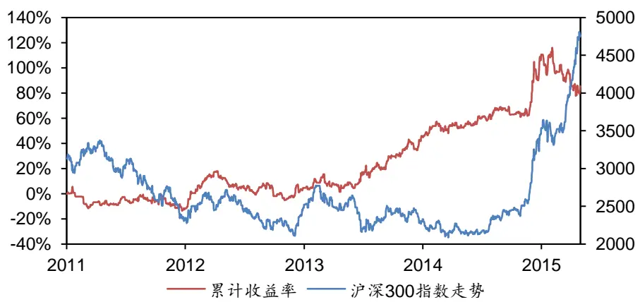
数据来源：广发证券发展研究中心、天软科技

图13：新华富时A50指数期货夜盘对于中证500择时结果
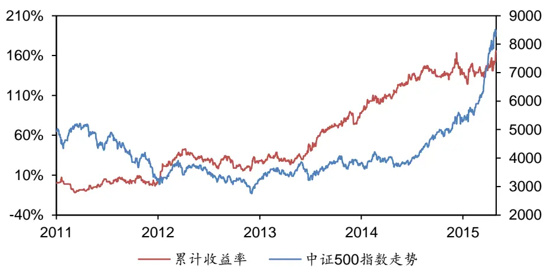
数据来源：广发证券发展研究中心、天软科技

表7：新华富时A50指数期货策略测试结果

| 指标 上证50指数 沪深 300 指数 |  |  | 中证500 指数 |
| --- | --- | --- | --- |
| 累计收益率 | 74.89% | 85.32% | 165.29% |
| 年化收益率 | 13.77% | 15.31% | 25.26% |
| 最大回撤 | -24.96% | -19.60% | -19.20% |
| 收益/回撤比 | 0.55 | 0.78 | 1.32 |
| 正确次数 | 450 | 458 | 485 |
| 错误次数 | 450 | 442 | 415 |
| 胜率 | 50.00% | 50.89% | 53.89% |
| 平均获胜收益率 | 1.01% | 0.97% | 1.11% |
| 平均失败亏损率 | -0.87% | -0.85% | -1.04% |
| 盈亏比 | -1.16 | -1.14 | -1.07 |
| 单日最大盈利 | 6.15% | 5.91% | 5.99% |
| 单日最大亏损 | -5.54% | -4.93% | -4.34% |
| 最大连续盈利次数 | 9 | 9 | 9 |
| 最大连续亏损次数 | 10 | 10 | 10 |

数据来源：广发证券发展研究中心

对比测试结果我们发现A50夜盘的涨跌对于次日A股的走势确实有一定程度的预测效果，但胜率仅略高于50%，同时回撤过大。这样看来，似乎A50指数期货夜盘对于A股次日择时的意义较小。

进一步分析我们的回撤结果，我们发现了一个有意思的现象：在不加任何止损的条件下，A50夜盘买入信号的胜率以及收益回撤情况无论在熊市还是牛市中，都显著好于A50夜盘的卖出信号胜率以及收益回撤情况。

图14：新华富时A50指数期货夜盘对于上证50单纯做多回撤结果（无止损）
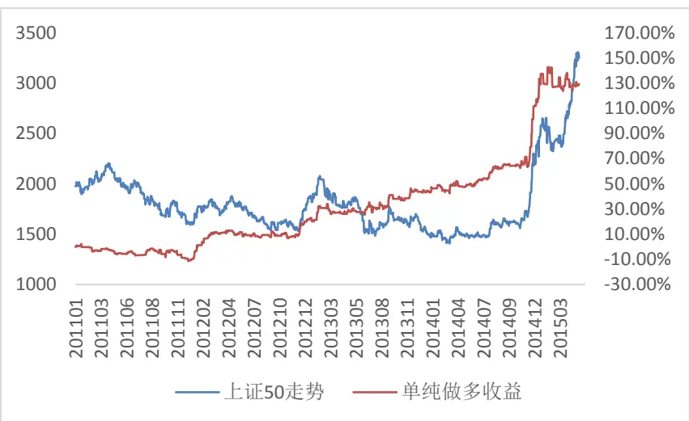
数据来源：广发证券发展研究中心、天软科技

图15：新华富时A50指数期货夜盘对于上证50单纯做空回撤结果（无止损）
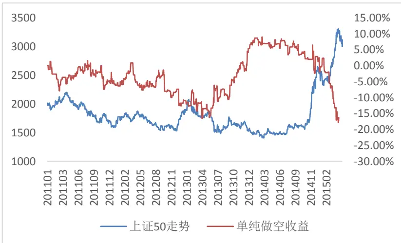
数据来源：广发证券发展研究中心、天软科技

图16：新华富时A50指数期货夜盘对于沪深300单纯做多回撤结果（无止损）
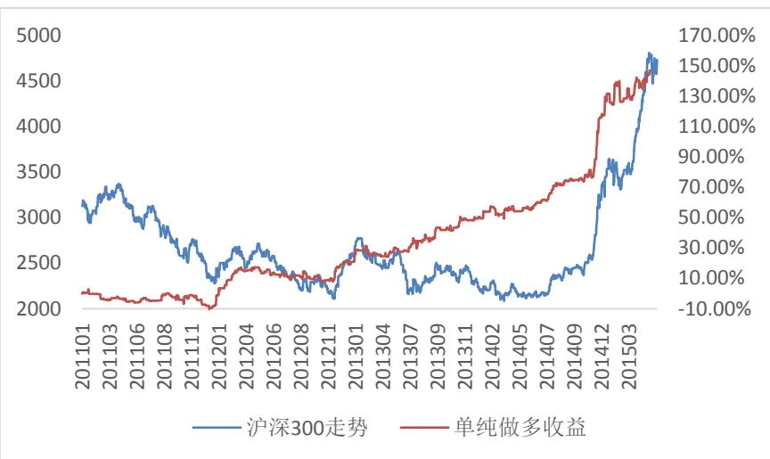
数据来源：广发证券发展研究中心、天软科技

图17：新华富时A50指数期货夜盘对于沪深300单纯做空回撤结果（无止损）
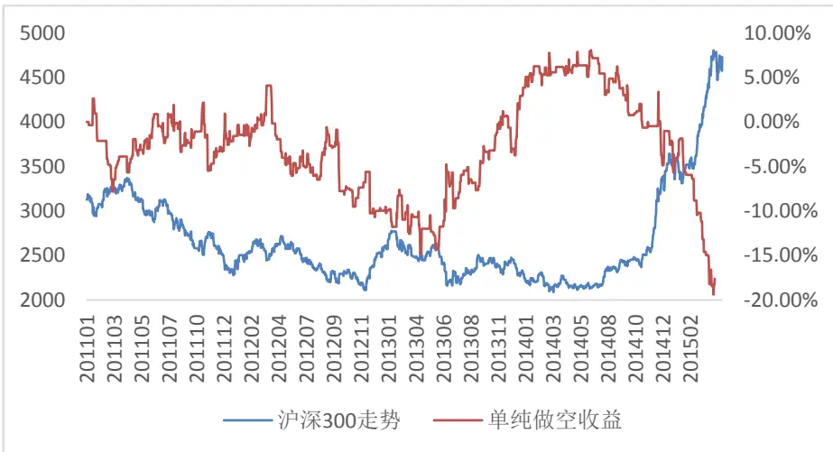
数据来源：广发证券发展研究中心、天软科技

图18：新华富时A50指数期货夜盘对于中证500单纯做多回撤结果（无止损）
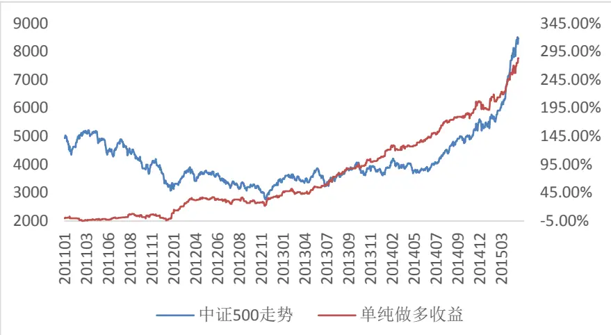
数据来源：广发证券发展研究中心、天软科技

图19：新华富时A50指数期货夜盘对于中证500单纯做空回撤结果（无止损）
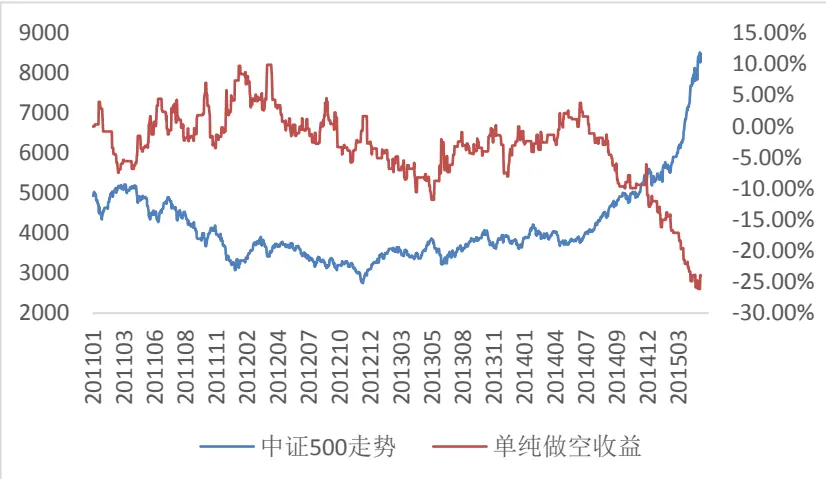
数据来源：广发证券发展研究中心、天软科技

表8：恒生H股指数期货策略测试结果

| 指标 | 上证50指数 | 沪深 300 指数 | 中证500 指数 |
| --- | --- | --- | --- |
| 总胜率 | 50.00% | 50.89% | 53.89% |
| 做多胜率 | 50.96% | 52.03% | 61.88% |
| 做空胜率 | 49.88% | 49.88% | 45.73% |

数据来源：广发证券发展研究中心

特别是在中证500指数上，A50多头的预测胜率高达61.88%，而空头的预测胜率则仅为45.73%。这可能是由于A50的交易时间主要集中在夜晚，参与者以境外投资者做套保为主，空头力量强于多头力量，当没有明确的市场情绪时市场反应为避险，因而期货夜盘下行，并没有反映市场全部参与人的真实预期造成的。而当夜盘上涨时，则说明即使在以套保投资者为主要参与人的情况下，大家仍然对次日大盘上涨充满预期，说明市场乐观情绪较为强烈，因而单纯做多的胜率及回撤结果较好。

为了进一步优化策略，我们加上千分之五的止损，继续在中证500指数上多空双向测试。测试得到的结果如下：

图20：新华富时A50指数期货策略收益率（用于中证500指数，设止损）
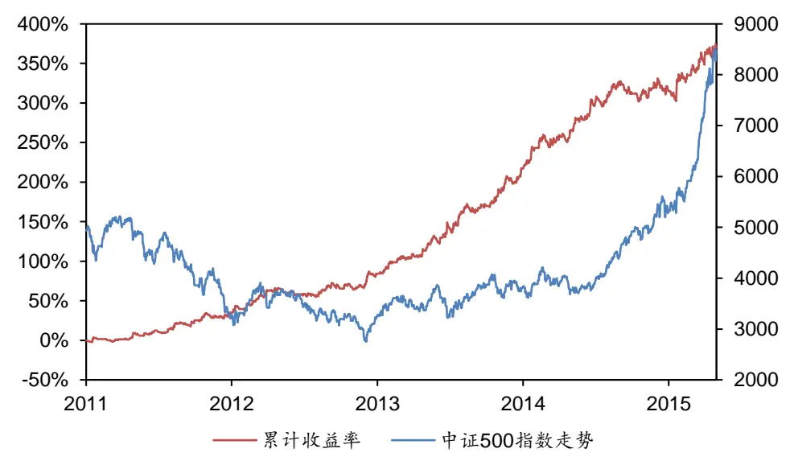
数据来源：广发证券发展研究中心、天软科技

图21：新华富时A50指数期货策略回撤情况（用于中证500指数，设止损）
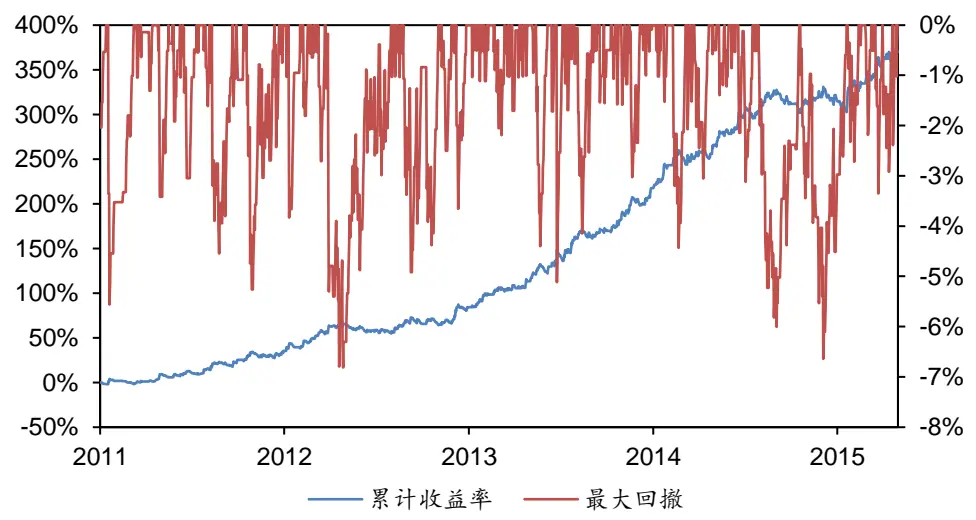
数据来源：广发证券发展研究中心、天软科技

表9：新华富时A50指数期货策略测试结果（用于中证500，设止损）

| 指标 中证500指数（设止损） |  |
| --- | --- |
| 累计收益率 | 369.53% |
| 年化收益率 | 42.91% |
| 最大回撤 | -6.81% |
| 收益/回撤比 | 6.30 |
| 正确次数 | 359 |
| 错误次数 | 541 |

识别风险，发现价值

| 胜率 | 39.89% |
| --- | --- |
| 平均获胜收益率 | 1.22% |
| 平均失败亏损率 | -0.52% |
| 盈亏比 | -2.37 |
| 单日最大盈利 | 5.99% |
| 单日最大亏损 | -0.77% |
| 最大连续盈利次数 | 7 |
| 最大连续亏损次数 | 16 |

数据来源：广发证券发展研究中心

设置0.005的日内止损后，策略用于中证500指数的效果较好，虽然胜率有所下降，但年化收益率达到了42.91%，最大回撤仅有-6.81%。

## （三）恒生 H股指数期货实证结果

接着我们来看一下恒生H股指数期货的测试结果。计算采用的模型参数如下表所示：

表10：恒生H股指数期货模型参数

| 参数类型 参数取值 |  |
| --- | --- |
| 起始时间 | 2013年4月9日 |
| 结束时间 | 2015年4月30日 |
| 止损阈值 | 不设止损 |
| 交易成本（双边） | 2/10000 |
| 收益率计算方式 | 复利 |

数据来源：广发证券发展研究中心

对上证50指数、沪深300指数、中证500指数和沪深300期货价格测试得到的结果如下所示：

图22：恒生H股指数期货夜盘对于上证50指数预测效果
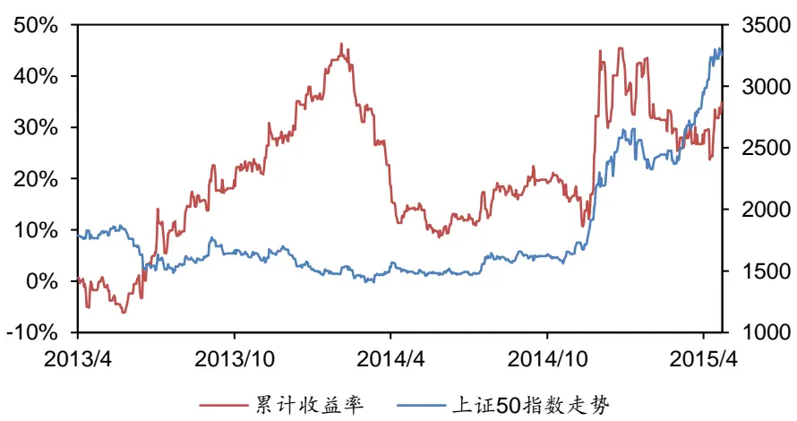
数据来源：广发证券发展研究中心、天软科技

图23：恒生H股指数期货夜盘对于沪深300指数预测效果
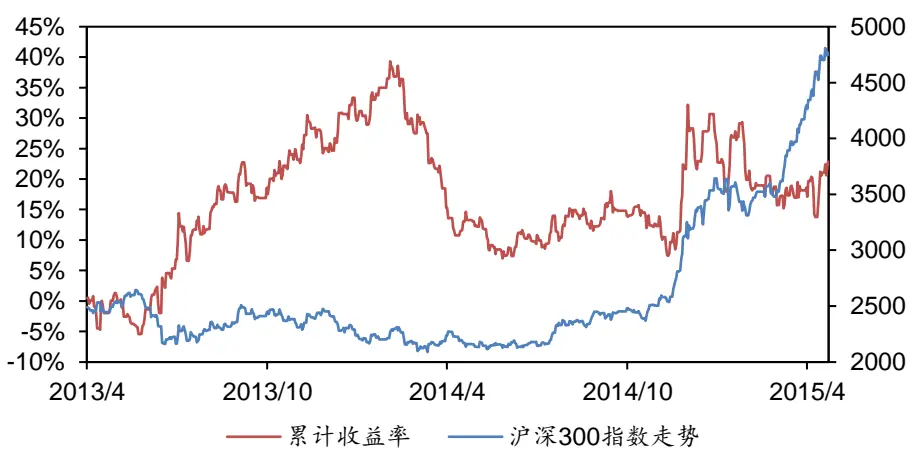
数据来源：广发证券发展研究中心、天软科技

图24：恒生H股指数期货夜盘对于中证500指数预测效果
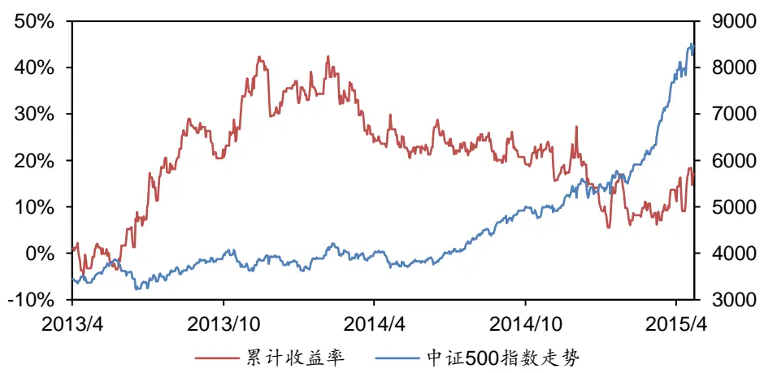
数据来源：广发证券发展研究中心、天软科技

表11：恒生H股指数期货策略测试结果

| 指标 | 上证50指数 | 沪深 300 指数 | 中证500指数 |
| --- | --- | --- | --- |
| 累计收益率 | 34.83% | 22.85% | 16.98% |
| 年化收益率 | 15.61% | 10.50% | 7.91% |
| 最大回撤 | -25.83% | -23.21% | -25.95% |
| 收益/回撤比 | 0.60 | 0.45 | 0.30 |
| 正确次数 | 243 | 227 | 240 |
| 错误次数 | 232 | 248 | 235 |
| 胜率 | 51.16% | 47.79% | 50.53% |
| 平均获胜收益率 | 1.04% | 1.00% | 1.05% |
| 平均失败亏损率 | -0.94% | -0.82% | -0.98% |
| 盈亏比 | 1.11 | 1.22 | 1.06 |
| 单日最大盈利 | 6.15% | 5.91% | 5.99% |

识别风险，发现价值

| 单日最大亏损 | -4.53% | -3.81% | -3.97% |
| --- | --- | --- | --- |
| 最大连续盈利次数 | 10 | 10 | 10 |
| 最大连续亏损次数 | 11 | 11 | 11 |

数据来源：广发证券发展研究中心

令人遗憾的是，由于H股指数受到港股大盘的影响较多，与A股的关联性不及A50指数，在各种指数上的回测效果均较差。

## 三、结论及分析

实证的结果显得有些出乎意料。新华富时A50指数和恒生H股指数与上证50指数和沪深300指数的相关性大于与中证500指数的相关性，但测试结果表明，策略用于中证500指数的效果要显著优于其他指数/期指。为什么会有这样的结果呢？

注意到我们的策略采用的是日内交易，即日内开盘买入、收盘平仓，而前一日境外股指期货夜盘对A股市场的影响并不仅仅表现在当日日内的涨跌，更多地应该表现在当日开盘价与前一日收盘价之间的涨跌。对于上证50和沪深300的成分股，市场的有效性更强，趋势延续性较弱，导致当日开盘价已经较好地反映了前一日的盘后信息，而中证500的成分股的趋势性延续性较强，导致前一日的盘后信息没有完全反映在开盘价中，而会在盘中逐渐进一步反映。

为此，我们分别计算跳空胜率及日内交易胜率：

1. 跳空胜率，定义为用T-1日境外股指期货的涨跌预测T日 $R_{1t}$ 的成功率。

$$
R_{1t}=\frac{Open_{t}-close_{t-1}}{Class_{t-1}}
$$

其中 $OP_{t}$ 为境内股指/期指的t日开盘价， $CP_{t}$ 为境内股指/期指的t日收盘价。

2. 日内交易胜率，定义为用T-1日境外股指期货的涨跌预测T日 $R_{2t}$ 的成功率。

$$
R_{2t}=\frac{Close_t-Open_t}{Open_t}
$$

计算的时间区间与前文相同，此处不考虑交易佣金和止损等，只考虑预测成功的胜率。得到的结果如下表所示：

表12：新华富时A50指数期货预测胜率

| 胜率 上证50指数 沪深300 指数 中证500 指数 沪深300期货 |  |  |  |  |
| --- | --- | --- | --- | --- |
| 跳空胜率 | 63.67% | 64.22% | 63.78% | 67.44% |
| 日内交易胜率 | 50.78% | 51.33% | 54.44% | 51.89% |

数据来源：广发证券发展研究中心

表13：恒生H股指数期货预测胜率

| 胜率 | 上证50指数 沪深300 指数 中证500 指数 沪深300期货 |  |  |  |
| --- | --- | --- | --- | --- |
| 跳空胜率 | 61.18% | 58.65% | 57.38% | 60.97% |
| 日内交易胜率 | 51.27% | 48.31% | 50.63% | 48.52% |

数据来源：广发证券发展研究中心

从表中可以看出，A50指数夜盘对于上证50、沪深300指数，中证500指数，沪深300期货均有较高的跳空预测胜率，而对于期货的跳空预测胜率尤其高。

但是，由于上证50和沪深300的成分股主要为大盘股，日内波动较小，而中证500以中小盘股为主，日内波动较大，同时趋势延续性较好，因此A50指数在中证500上具有更好的预测效果。

## 四、总结

中国的股指期货目前尚没有夜盘交易。在海外的中概股指数期货目前交易较为活跃的品种主要有在新加坡交易所交易的新华富时A50指数期货和港交所推出的恒生H股指数期货。A50指数以在中国境内上市的沪深两市的股票指数为标的，而H股指数则以在香港上市的中国股票指数为标的。两个期货品种目前均有夜盘交易。

基于A50指数和恒生H股指数与中国A股的高度相关性，我们尝试用两种指数期货夜盘的涨跌对次日A股的走势做实证。实证结果发现，A50夜盘对于第二天大盘上涨的预测胜率以及收益率预测都显著好于对于第二天大盘跌的预测。特别是在中证500指数上，单向做多，胜率高达61.88%，最大回撤为11.33%，年化收益率为36.35%。

我们认为这主要源于A50夜盘的参与者主要为欧美基于套保需求的投资者，多空力量不平衡而导致夜盘的下跌难以反映整个市场的情绪，而夜盘上涨时则说明即使在套保盘的压力下，乐观情绪仍然明显，因此看多信号的胜率较高。而恒生H股指数期货则由于与A股相关性较弱，预测效果较差。

进一步对比上证50，沪深300以及中证500指数的效果差异我们发现，A50夜盘信息在第二天指数开盘跳空时已经有所反应，因而对这三种指数第二天的跳空开盘预测具有较高胜率，上证50和沪深300在隔夜跳空之后日内趋势性较弱，因此收益较差。而中证500指数日内趋势延续性较好，同时波动较大，因此在日内交易方面A50指数对于中证500的预测效果好于上证50和沪深300。

## 风险提示

策略模型并非百分百有效，市场结构及交易行为的改变或者交易参与者的增多有可能使得策略失效。

## Table_RatingIndustry 广发证券—行业投资评级说明

买入： 预期未来 12 个月内，股价表现强于大盘 10%以上。

持有： 预期未来12个月内，股价相对大盘的变动幅度介于-10%～+10%。

卖出： 预期未来12个月内，股价表现弱于大盘10%以上。

## Table_RatingCompany 广发证券—公司投资评级说明

买入： 预期未来12个月内，股价表现强于大盘15%以上。

谨慎增持： 预期未来12个月内，股价表现强于大盘5%-15%。

持有： 预期未来12个月内，股价相对大盘的变动幅度介于-5%～+5%。

卖出： 预期未来12个月内，股价表现弱于大盘5%以上。

## Table_Ad联系我们

|  | 广州市 | 深圳市 | 北京市 | 上海市 |
| --- | --- | --- | --- | --- |
| 地址 | 广州市天河北路183号 大都会广场5楼 | 深圳市福田区金田路4018 号安联大厦 15 楼 A 座 03- | 北京市西城区月坛北街2 号月坛大厦18层 | 上海市浦东新区富城路99 |
|  |  | 04 |  | 号震旦大厦18楼 |
| 邮政编码 | 510075 | 518026 | 100045 | 200120 |
| 客服邮箱 | gfyf@gf.com.cn |  |  |  |
| 服务热线 | 020-87555888-8612 |  |  |  |

## Table_Disclaimer 免 责声 明

广发证券股份有限公司具备证券投资咨询业务资格。本报告只发送给广发证券重点客户，不对外公开发布。

本报告所载资料的来源及观点的出处皆被广发证券股份有限公司认为可靠，但广发证券不对其准确性或完整性做出任何保证。报告内容仅供参考，报告中的信息或所表达观点不构成所涉证券买卖的出价或询价。广发证券不对因使用本报告的内容而引致的损失承担任何责任，除非法律法规有明确规定。客户不应以本报告取代其独立判断或仅根据本报告做出决策。

广发证券可发出其它与本报告所载信息不一致及有不同结论的报告。本报告反映研究人员的不同观点、见解及分析方法，并不代表广发证券或其附属机构的立场。报告所载资料、意见及推测仅反映研究人员于发出本报告当日的判断，可随时更改且不予通告。

本报告旨在发送给广发证券的特定客户及其它专业人士。未经广发证券事先书面许可，任何机构或个人不得以任何形式翻版、复制、刊登、转载和引用，否则由此造成的一切不良后果及法律责任由私自翻版、复制、刊登、转载和引用者承担。