# 均线交叉策略的另类创新研究

## 另类交易策略系列之二十七

## Table_Sum ary报告摘要 ：

## 经久不衰的均线技术

移动平均线（Moving Average，简称 MA）是技术分析中的常用工具。移动平均线作为一类非常简单的数学模型，被广泛用于股票、期货、外汇等金融市场的分析中，可谓简单、有效、应用广。另一方面，许多其他的技术指标，也建立在移动平均线的基础之上。因此，移动平均线在技术分析领域占有重要地位。

## 对传统均线交叉策略的改进

传统均线交叉策略的风险收益情况并不尽如人意，而且在不同参数下表现不稳定。我们对传统策略进行改进，改变了平仓条件。新的平仓条件相当于引入浮动止盈机制，将盈利最大化，因此策略的亏盈比相当高。我们使用沪深300股指期货10分钟行情数据对改进的均线交叉策略做实证分析。根据实证结果，改进策略的风险收益情况较传统策略有明显提升，年化收益率约 24%。此外，报告中使用随机游走理论，对改进策略生效的原因做出了详细的分析和阐述。

## 多种参数下的全面研究

对于改进的策略，我们在不同的均线参数、不同的均线类型下进行了全面的研究。均线参数采用 5、10、20、30、60、120、240 两两组合，均线类型采用简单移动平均线 SMA、指数移动平均线 EMA、加权移动平均线WMA、低延迟趋势线LLT。实证结果表明，不同的均线参数下，有不同的最优均线类型，这是由于均线延迟性及平滑度不同。对于绝大多数情况，改进策略的表现明显胜于传统策略。

图 1:SMA60/SMA120 下策略表现
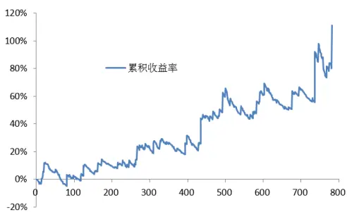

图 2: WMA60/ WMA120 下策略表现
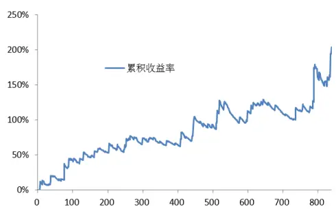

Table_Aut hor 分析师： 张超 S0260514070002

公020-87555888-8646

zhangchao@gf.com.cn

## 相关研究：

低延迟趋势线与交易性择时 2013-07-26

## 一、传统均线交叉策略

## （一）传统均线交叉策略简介

移动平均线（Moving Average，简称MA）是技术分析中的常用工具。移动平均线作为一类非常简单的数学模型，被广泛用于股票、期货、外汇等金融市场的分析中，可谓简单、有效、应用广。另一方面，许多其他的技术指标，也建立在移动平均线的基础上。因此，移动平均线在技术分析领域占有重要地位。

我们先对移动平均的定义做一个准确的数学描述。设某证券的收盘价为 Pt，该证券 k个时间单位的移动平均为 $\mathrm{M}_{\mathrm{t}}\left(\mathrm{k}\right)$ ，则有

$$
{M}_{{t}}(k)=\frac{1}{k}\sum_{j=0}^{k-1}P_{{t}-j}\tag{1}
$$

基于移动平均的交易策略非常多，本篇报告主要研究均线交叉策略。当快速均线（k值较小）上穿慢速均线（k值较大）时，均线交叉策略发出做多信号，此时的均线形态一般称为“金叉”；当快速均线（k值较小）下穿慢速均线（k值较大）时，均线交叉策略发出做空信号，此时的均线形态一般称为“死叉”。同样地，我们通过公式对该策略做一个准确的数学描述。当两条均线交叉时，设 $\mathbf{S}_{\mathrm{t}+\tau}\left(\mathbf{k}_{1},\mathbf{k}_{2}\right)$ 为信号变量，k1、k2分别为使用的均线周期，则有

$$
S_{t+\tau}(k_{1},k_{2})=\left\{\begin{array}{ll}{{1,}}&{{M_{t-1+\tau}(k_{1})\geq M_{t-1+\tau}(k_{2})}}\\{{0,}}&{{M_{t-1+\tau}(k_{1})<M_{t-1+\tau}(k_{2})}}\end{array}\right.\tag{2}
$$

其中， $\tau=0,1,2\cdots$ 且 k1<k2， $\mathbf{S}_{\mathrm{t}+\tau}\left(\mathbf{k}_{1},\mathbf{k}_{2}\right){=}1$ 时为做多信号， $\mathbf{S}_{\mathrm{t}+\tau}\left(\mathbf{k}_{1},\mathbf{k}_{2}\right)=0$ 时为做空信号。在均线交叉策略中，常用的均线周期（即k值）有 5、10、20、30、60、120、240 等。

## （二）传统均线交叉策略表现

传统的均线交叉策略表现如何呢？我们对其进行了回测。回测数据选取 2010年4月 16 日到2015年4 月7 日的沪深300股指期货连续合约 10分钟收盘价。策略考虑 0.0002的双边交易成本，累积收益率采用复利计算。我们对常见的均线周期5、10、20、30、60、120、240 两两组合，均进行测试。测试结果如表 1及图1所示。可以看到，传统的均线策略并非对所有的均线组合都有效，接近一半的组合呈现出负的收益率。这样的回测结果体现了传统均线交叉策略的不稳定性。当市场风格发生转变时，有可能使策略从有效变为无效，从而造成投资者的损失。

表 1：各参数下传统均线交叉策略的表现

| k1 | k₂ | 累积收益率 | 最大回撤 | 收益回撤比 |
| --- | --- | --- | --- | --- |
| 5 | 10 | -32.88% | -50.88% | -64.63% |
| 5 | 20 | 41.42% | -24.80% | 167.04% |
| 5 | 30 | -22.46% | -46.63% | -48.17% |
| 5 | 60 | -9.61% | -42.90% | -22.39% |
| 5 | 120 | 43.64% | -23.54% | 185.37% |
| 5 | 240 | 102.25% | -23.17% | 441.36% |
| 10 | 20 | 27.77% | -44.44% | 62.48% |
| 10 | 30 | 11.77% | -30.97% | 38.02% |
| 10 | 60 | 11.09% | -32.10% | 34.54% |
| 10 | 120 | 1.50% | -40.12% | 3.73% |
| 10 | 240 | 123.31% | -17.58% | 701.25% |
| 20 | 30 | 27.90% | -35.08% | 79.51% |
| 20 | 60 | -20.80% | -52.75% | -39.42% |
| 20 | 120 | -9.03% | -45.99% | -19.64% |
| 20 | 240 | 24.17% | -28.74% | 84.13% |
| 30 | 60 | -3.02% | -44.23% | -6.83% |
| 30 | 120 | -32.04% | -51.28% | -62.48% |
| 30 | 240 | -14.68% | -34.35% | -42.73% |
| 60 | 120 | -19.29% | -37.55% | -51.37% |
| 60 | 240 | 2.81% | -27.24% | 10.31% |
| 120 | 240 | 30.77% | -27.90% | 110.31% |

数据来源：广发发展研究中心、天软科技

图 1：各参数下传统均线交叉策略的表现
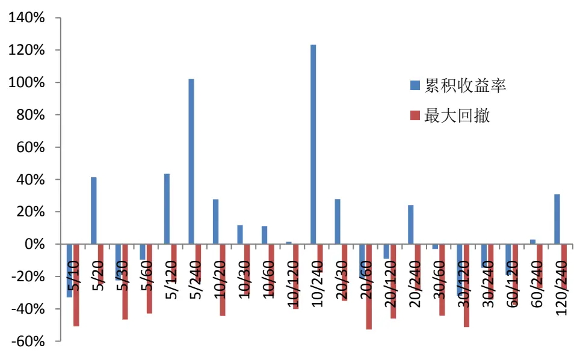
数据来源：广发发展研究中心、天软科技

## 二、改进的均线交叉策略

## （一）策略介绍

介绍策略之前，我们先介绍一下凸组合。策略的基本思想将根据凸组合提出。设实向量空间中的一组有限数据点 ${\bf X}_{1},\quad{\bf X}_{2},\quad\ldots\ldots,\quad{\bf X}_{\mathrm{n}},$ ，则定义x为这些数据点的一个凸组合，如果x满足

$$
x=\alpha_{1}x_{1}+\alpha_{2}x_{2}+\cdots\cdots+\alpha_{n}x_{n}\tag{3}
$$

其中实数 $\alpha_{i}(\mathrm{~i=1,~}2,\dots\dots,\mathrm{n})$ 满足 $\alpha_{i}{>}0$ 且 $\alpha_{1}+\alpha_{2}+\ldots+\alpha_{n}=1$ 。根据定义，凸组合可以看成是数据组的一个“期望”。

提出的改进均线交叉策略，主要是改变传统策略的平仓条件。开仓条件仍由传统的金叉、死叉确定，平仓条件则是由开仓价格与当前价格来确定。若当前价格不小于开仓价与当前价的凸组合，则继续持有多单，无需平仓；若当前价格不大于开仓价与当前价的凸组合，则继续持有空单，无需平仓。

同样地，我们使用数学语言对策略的开平仓条件进行描述。策略的开仓条件与传统策略相同，即金叉开多单，死叉开空单。如报告第一部分所述，传统策略的开平仓信号为 $\mathbf{S}_{\mathrm{t}}\left(\mathbf{k}_{1},\mathbf{k}_{2}\right)$ ，t为信号发出的时刻。设开仓时间为ti，开仓价格为 $\mathrm{P_{ti}}$ ，当前价格为 $\mathrm{P}_{\mathrm{ti+\tau}},$ ，其中 $\tau>0$ 。那么，若已持有多单，在任一时间点继续持有多单的概率为$\mathrm{~P~}[\mathrm{S}_{\mathrm{ti}+\tau}\ (\mathbf{k}_{1},\mathbf{k}_{2})=1]$ ，平仓多单的概率为P $\left[\operatorname{S}_{\mathrm{ti}+\tau}\left(\mathrm{k}_{1},\mathrm{k}_{2}\right)=0\right]=1-\mathrm{P}\left[\operatorname{S}_{\mathrm{ti}+\tau}\left(\mathrm{k}_{1},\mathrm{k}_{2}\right)=0\right]$ ，已持有空单的情况同理。我们将开仓价格 $\cdot\mathrm{P}_{\mathrm{ti}}$ 与当前价格 $\cdot\mathrm{P}_{\textrm{ t i + \tau }}$ 的凸组合定义为证券价格的“期望” $\mathrm{P^{*}}_{\mathrm{{ti+}}}$ τ

$$
P_{t_{i}+\tau}^{*}=\mathrm{P}[S_{t_{i}+\tau}(k_{1},k_{2})=1]P_{t_{i}}+(1-\mathrm{P}[S_{t_{i}+\tau}(k_{1},k_{2})=1])P_{t_{i}+\tau}\tag{4}
$$

非常自然地，我们希望证券的当前价格大于或等于 $\mathrm{P^{*}}_{\mathrm{\ ti+\tau}}$ ，才有足够的理由继续持有多单。换句话说，继续持有多单的条件为 $\mathrm{P_{ti+\tau}}\geqslant\mathrm{P^{*}}_{\mathrm{ti+\tau}};$ ；同理，继续持有空单的条件为$\mathsf{P}_{\mathrm{ti}+\tau}\leqslant\mathsf{P}_{\mathrm{ti}+\tau}^{*},$ 。通过求解上述两个不等式可以知道，在概率无法估计的情况下，继续持有多单的条件为 $\mathrm{P}_{\mathrm{ti+\tau}}\geqslant\mathrm{P}_{\mathrm{ti}}$ ，继续持有空单的条件为 $\mathsf{P}_{\mathrm{ti}+\tau}\leqslant\mathsf{P}_{\mathrm{ti}}$

非常重要的一点是，在持仓过程中，Pti的值有可能发生改变，否则策略将永远在亏损时平仓。以开多仓的情况为例：均线金叉时开多仓；随后均线死叉时，若仍满足 $\mathrm{P}_{\mathrm{ti+\tau}}\geqslant\mathrm{P}_{\mathrm{ti}}$ ，则继续持仓；随后再次出现金叉，则Pti替换为最新的金叉价 $\cdot\mathrm{P}_{\mathrm{ti}2}$ ，此后继续持仓的条件则变为 $\mathrm{P}_{\mathrm{ti+}\tau}\geqslant\mathrm{P}_{\mathrm{ti}2}$ 。以数学语言描述此过程，有：

$$
t_{i}(k_{1},k_{2})=t_{i}=\left\{t\in N_{+}:S_{t}(k_{1},k_{2})>S_{t-1}(k_{1},k_{2})\right\}\tag{5}
$$

其中ti为传统策略中每次发出金叉信号的时刻。对于所有小于等于t的ti，令$\mathrm{{t}_{L}=max\left(\mathrm{{t}_{i}}}\right)$ ，表示最新的金叉时刻。那么，改进的均线交叉策略的多单平仓信号可以定义为，均线交叉时：

$$
C_{t+\tau}(k_{1},k_{2},t_{L})=\left\{{1,}\atop{}\ {P_{t-1+\tau}\leq P_{t_{L}}}\right.\tag{6}
$$

当 $\mathrm{C}_{\mathrm{t}+\tau}\left(\mathrm{k}_{1},\mathrm{k}_{2},\mathrm{t}_{\mathrm{L}}\right){=}1$ 时继续持有多单,当 $\mathrm{C}_{\mathrm{t}+\tau}\left(\mathrm{k}_{1},\mathrm{k}_{2},\mathrm{t}_{\mathrm{L}}\right){=}0\mathrm{1}$ 时平仓多单。对于开空仓的情况同理可得。

识别风险，发现价值

总而言之，改进的均线交叉策略主要包括以下几点：

1. 开仓信号由传统策略的金叉、死叉决定：金叉开多仓，死叉开空仓；

2. 一旦开仓，则平仓信号由上述的 $\mathrm{C}_{\mathrm{t}+\tau}\left(\mathbf{k}_{1},\mathbf{k}_{2},\mathrm{t}_{\mathrm{L}}\right)$ 信号决定；

3. 当传统策略发出一次开仓信号后，又发出一次平仓信号和一次开仓信号，而在此期间 $\mathrm{C}_{\mathrm{t}+\tau}\left(\mathbf{k}_{1},\mathbf{k}_{2},\mathrm{t}_{\mathrm{L}}\right)$ 信号没有发生改变，则平仓条件中 $\mathrm{P_{ti}}$ 的具体值会发生改变；

4. 改进策略和传统策略的平仓信号并不同步。

图2的流程图以更直观的方式给出策略的执行步骤。

图 2：改进的均线交叉策略流程图
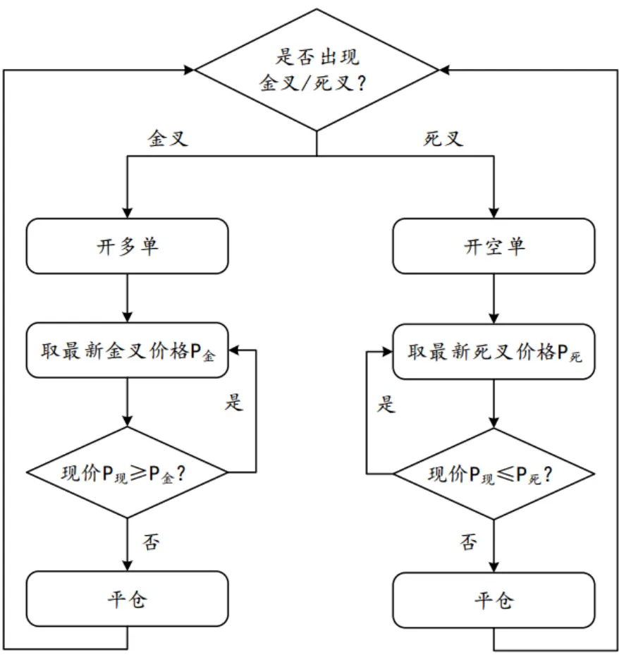
数据来源：广发发展研究中心

## （三）实证分析

本小节将使用历史数据进行回测，对比传统策略与改进策略的风险收益表现，证明上文的理论分析。

实证使用2010年4月16日至2015年4月7日的沪深300股指期货10分钟行情数据。在实测中，每次交易我们考虑0.02%的双边交易成本，累积收益率的计算采用复利。均线采用MA60和MA120。

图3给出了传统均线交叉策略的累积收益率曲线，可以看到，在MA60和MA120均线下，传统策略亏损。

图4和表2分别给出了改进的均线交叉策略的累积收益率曲线和交易统计数据。

识别风险，发现价值

根据测算结果，改进的策略显示出了优秀的风险收益情况。虽然策略的胜率较低（13.43%），但平均盈利率高达2.77%，亏盈比的值为9.11。这意味着，策略对于错误的开仓能迅速止损，对于正确的开仓又能最大化利润。

图 3：传统均线交叉策略的累积收益率曲线（SMA60和SMA120）
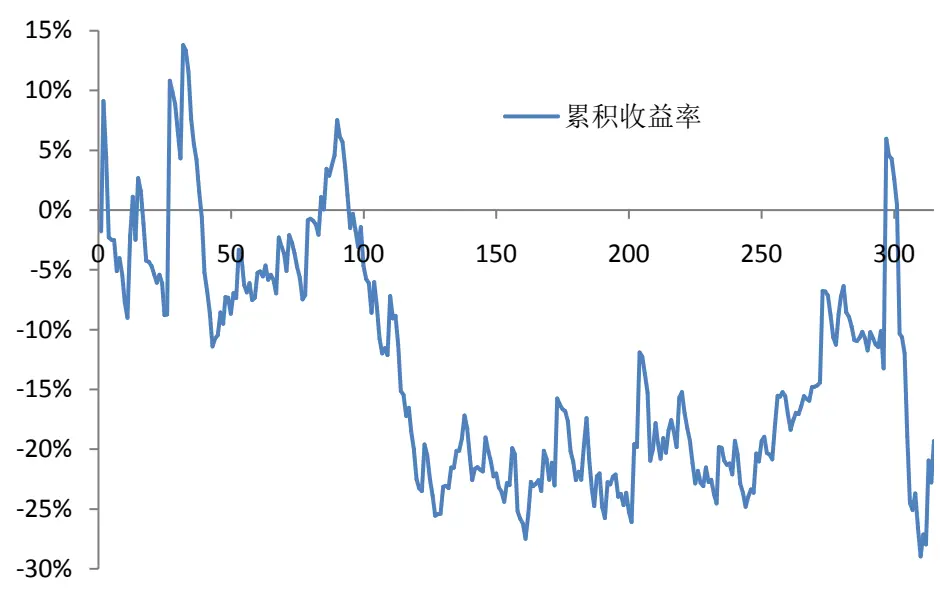
数据来源：广发发展研究中心、天软科技

图 4：改进的均线交叉策略的累积收益率曲线（SMA60 和 SMA120）
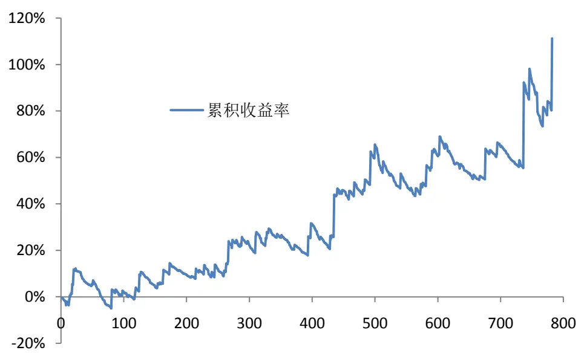
数据来源：广发发展研究中心、天软科技

表 2：改进的均线交叉策略的累积收益率曲线（SMA60 和 SMA120）

| 累积收益率 111.21% |
| --- |
| 年化收益率 16.00% |
| 平均收益率 0.11% |
| 交易总次数 782 |
| 收益率标准差 0.0168 |
| 获胜次数 105 |
| 失败次数 677 |
| 胜率 13.43% |
| 平均盈利率 2.77% |
| 平均亏损率 -0.30% |
| 盈亏比（绝对值） 9.11 |
| 最大回撤 -15.28% |
| 单次最大盈利 23.61% |
| 单次最大亏损 -4.34% |
| 最大连胜次数 3 |
| 最大连亏次数 30 |

数据来源：广发证券发展研究中心、天软科技

## 三、不同均线类型下的策略表现

## （一）EMA、WMA 与 LLT

为了研究策略是否对各种类型的均线均适用，这部分将使用 EMA、WMA与 LLT均线进行测算。以下是对这三种均线的介绍。

EMA 为指数移动平均线（Exponential Moving Average）。EMA 的计算公式为

$$
EMA(T)=\left\{{p(1)},\atop{\alpha^{*}p(T)+(1-\alpha)^{*}EMA(T-1),}T\geq1\right.\tag{7}
$$

$$
\alpha=\frac{2}{d+1}\tag{8}
$$

其中 d是MA均线的时间参数，p(T)是第T个时间周期的收盘价。

WMA 为加权移动平均线（Weighted Moving Average）。WMA 的计算公式为

$$
WMA(T)=\left\{\frac{p(T),0<T<d}{d+\displaystyle{\frac{d^{*}p(T)+(d-1)^{*}p(T-1)+\cdots+p(T-d+1)}{d+(d-1)+\cdots+1}},T\geq d}\right.\tag{9}
$$

LLT 为低延迟趋势线，在我们前期的报告《低延迟趋势线与交易性择时》中对其做了详细的介绍。LLT的计算公式为

$$
LLT(T)=\left\{\begin{array}{ll}{p(T),0<T\leq2}\\{(\alpha-\alpha^{2}/4)*p(T)+(\alpha^{2}/2)*p(T-1)}\\{-(\alpha-3\alpha^{2}/4)*p(T-2)+2(1-\alpha)*LLT(T-1)}\\{-(1-\alpha)^{2}*LLT(T-2),T\geq3}\end{array}\right.\tag{10}
$$

图 5给出了根据沪深 300股指期货日行情数据计算所得的三种均线，其中时间参数 d取120天。

图 5：沪深 300股指期货日行情下的三种均线（d=120）
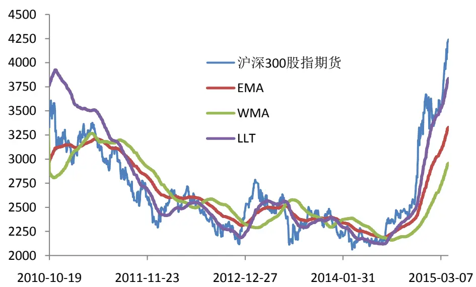
数据来源：广发发展研究中心、天软科技

## （二）测算结果

我们同样使用 2010 年 4 月 16 日至 2015 年 4 月 7 日的沪深 300 股指期货 10 分钟行情数据。在实测中，每次交易我们考虑 0.02%的双边交易成本，累积收益率的计算采用复利。均线采用 MA60和 MA120。

图 6 和表 3 分别给出了使用 WMA 时改进的均线交叉策略的累积收益率曲线和交易统计数据。可以看到，使用加权移动平均线 WMA 时，风险收益情况都有了显著提升。测算区间内累积收益率达 203.83%，年化收益率达 24.65%，最大回撤-14.15%。图 7 和图 8 分别给出了使用 EMA 均线和使用 LLT 均线时策略的累积收益率曲线。三者对比可以看到，当均线参数选择为 MA60 和 MA120 时，WMA 均线有着最好的风险收益表现。

图 6：WMA 均线下策略的累积收益率曲线（WMA60和 WMA120）
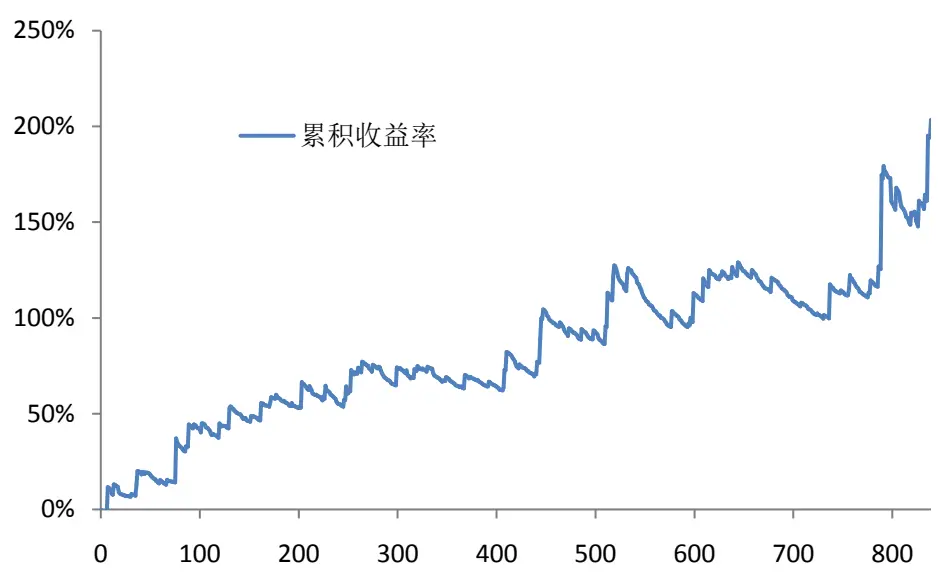
数据来源：广发发展研究中心、天软科技

表 3：改进的均线交叉策略的累积收益率曲线（WMA60 和 WMA120）

| 累积收益率 203.83% |
| --- |
| 年化收益率 24.65% |
| 平均收益率 0.15% |
| 交易总次数 839 |
| 收益率标准差 0.0179 |
| 获胜次数 115 |
| 失败次数 724 |
| 胜率 13.71% |
| 平均盈利率 3.08% |
| 平均亏损率 -0.32% |
| 盈亏比（绝对值） 9.67 |
| 最大回撤 -14.15% |
| 单次最大盈利 21.73% |
| 单次最大亏损 -4.35% |
| 最大连胜次数 2 |
| 最大连亏次数 32 |

数据来源：广发证券发展研究中心、天软科技

图 7：EMA 均线下策略的累积收益率曲线（EMA60和 EMA120）
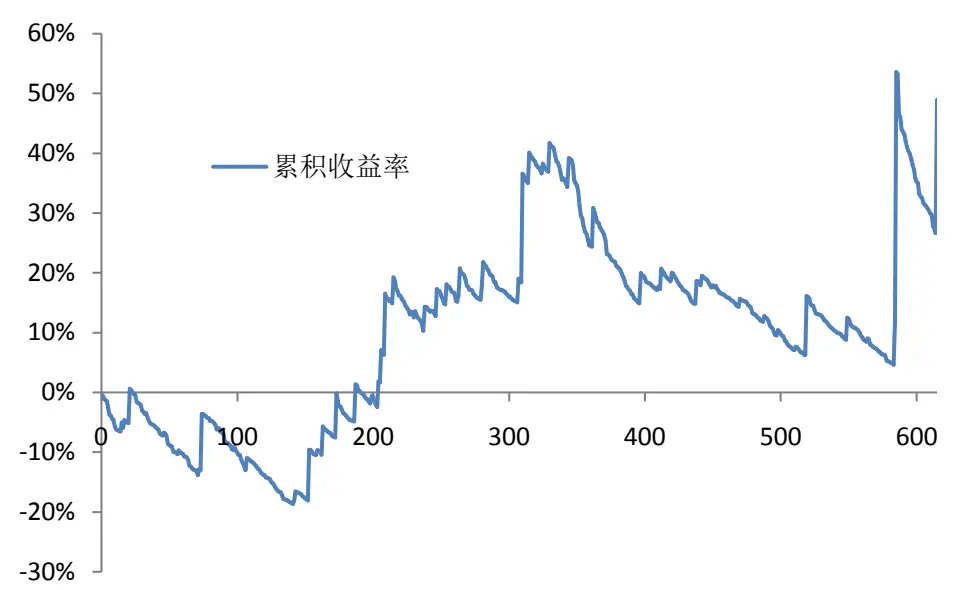
数据来源：广发发展研究中心、天软科技

图 8：LLT 均线下策略的累积收益率曲线（LLT60和 LLT120）
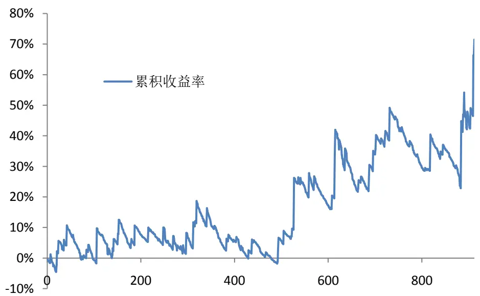
数据来源：广发发展研究中心、天软科技

## 四、不同均线参数下的策略表现

在 MA60和MA120参数下，使用 WMA均线策略表现最佳。那么，是否在所有的参数下都应当选用 WMA均线呢？针对此问题，我们同样做了实证研究。

表 4 和图 9 是使用 SMA（即简单移动平均线，simple moving average）时，各参数下的策略表现；表 5和图 10是使用EMA时，各参数下的策略表现；表 6和图 11是使用 WMA时，各参数下的策略表现；表 7和图 12是使用 LLT时，各参数下的策略表现。

从测算结果可以看到，在不同的均线参数下，最优的均线类型不同，这是因为各类均线有不同的延迟性和平滑度。但相比于传统策略（请详见表 1 和图 1），改进策略在大部分情况下都有明显优异的表现。传统策略在不同参数下并不稳定，根据第一部分的测算结果，有接近一半的情况出现负的收益率；改进策略则在89%的参数组合下有正收益。另一方面，改进策略在各种参数、各种均线类型下的累积收益率及最大回撤，较传统策略有显著提升。

表 4：各参数下改进均线交叉策略的表现（SMA）

| k1 | k₂ | 累积收益率 | 最大回撤 | 收益回撤比 |
| --- | --- | --- | --- | --- |
| 5 | 10 | -32.37% | -48.69% | -0.66 |
| 5 | 20 | 22.79% | -32.39% | 0.70 |
| 5 | 30 | 55.54% | -34.25% | 1.62 |
| 5 | 60 | 49.65% | -19.37% | 2.56 |
| 5 | 120 | -16.87% | -51.23% | -0.33 |
| 5 | 240 | 38.12% | -25.86% | 1.47 |
| 10 | 20 | 29.44% | -32.63% | 0.90 |
| 10 | 30 | -9.03% | -44.63% | -0.20 |
| 10 | 60 | 36.03% | -28.94% | 1.24 |
| 10 | 120 | 61.53% | -25.55% | 2.41 |
| 10 | 240 | 133.83% | -19.26% | 6.95 |
| 20 | 30 | 16.42% | -35.79% | 0.46 |
| 20 | 60 | 33.14% | -26.40% | 1.26 |
| 20 | 120 | -8.03% | -37.13% | -0.22 |
| 20 | 240 | 59.03% | -16.15% | 3.66 |
| 30 | 60 | 10.14% | -29.29% | 0.35 |
| 30 | 120 | 108.30% | -16.20% | 6.68 |
| 30 | 240 | 37.03% | -30.06% | 1.23 |
| 60 | 120 | 111.21% | -15.28% | 7.28 |
| 60 | 240 | 10.92% | -24.31% | 0.45 |
| 120 | 240 | 96.00% | -20.75% | 4.63 |

数据来源：广发发展研究中心、天软科技

图 9：各参数下改进均线交叉策略的表现（SMA）
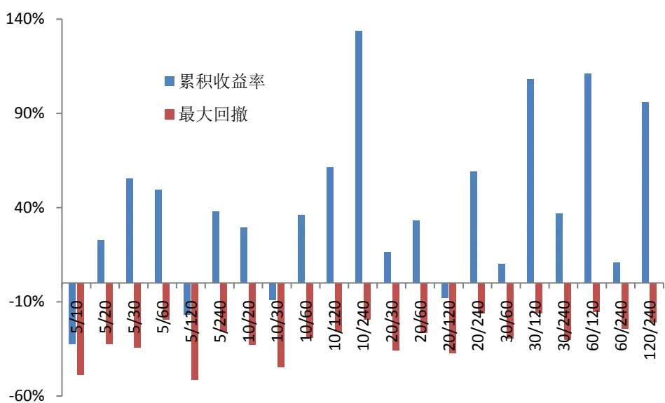
数据来源：广发发展研究中心、天软科技

表 5：各参数下改进均线交叉策略的表现（EMA）

| k1 | k₂ | 累积收益率 | 最大回撤 | 收益回撤比 |
| --- | --- | --- | --- | --- |
| 5 | 10 | 13.76% | -39.81% | 0.35 |
| 5 | 20 | 109.19% | -29.40% | 3.71 |
| 5 | 30 | 74.86% | -28.94% | 2.59 |
| 5 | 60 | 29.45% | -33.29% | 0.88 |
| 5 | 120 | -27.69% | -53.16% | -0.52 |
| 5 | 240 | 93.46% | -20.55% | 4.55 |
| 10 | 20 | 39.65% | -38.95% | 1.02 |
| 10 | 30 | 106.94% | -26.65% | 4.01 |
| 10 | 60 | 20.37% | -45.21% | 0.45 |
| 10 | 120 | 35.85% | -44.87% | 0.80 |
| 10 | 240 | 69.39% | -26.47% | 2.62 |
| 20 | 30 | 11.95% | -26.51% | 0.45 |
| 20 | 60 | 50.63% | -41.94% | 1.21 |
| 20 | 120 | 14.47% | -38.67% | 0.37 |
| 20 | 240 | 44.34% | -32.37% | 1.37 |
| 30 | 60 | 38.23% | -37.34% | 1.02 |
| 30 | 120 | 75.79% | -25.86% | 2.93 |
| 30 | 240 | 30.85% | -35.64% | 0.87 |
| 60 | 120 | 48.96% | -26.14% | 1.87 |
| 60 | 240 | 40.18% | -30.17% | 1.33 |
| 120 | 240 | 36.37% | -30.76% | 1.18 |

数据来源：广发发展研究中心、天软科技

图 10：各参数下改进均线交叉策略的表现（EMA）
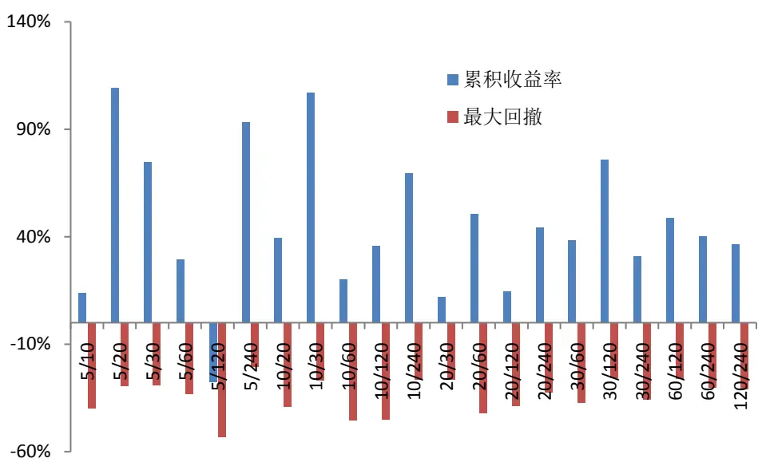
数据来源：广发发展研究中心、天软科技

表 6：各参数下改进均线交叉策略的表现（WMA）

| k1 | k₂ | 累积收益率 | 最大回撤 | 收益回撤比 |
| --- | --- | --- | --- | --- |
| 5 | 10 | -24.76% | -48.92% | -0.51 |
| 5 | 20 | 15.67% | -40.67% | 0.39 |
| 5 | 30 | 13.53% | -29.63% | 0.46 |
| 5 | 60 | 46.87% | -20.87% | 2.25 |
| 5 | 120 | -9.96% | -39.80% | -0.25 |
| 5 | 240 | 179.46% | -16.89% | 10.63 |
| 10 | 20 | 5.27% | -34.12% | 0.15 |
| 10 | 30 | -15.79% | -45.56% | -0.35 |
| 10 | 60 | 26.11% | -39.23% | 0.67 |
| 10 | 120 | 21.03% | -41.91% | 0.5 |
| 10 | 240 | 64.81% | -25.75% | 2.52 |
| 20 | 30 | 16.26% | -27.38% | 0.59 |
| 20 | 60 | 44.13% | -29.23% | 1.51 |
| 20 | 120 | 43.01% | -19.78% | 2.17 |
| 20 | 240 | 65.04% | -27.89% | 2.33 |
| 30 | 60 | 84.16% | -19.74% | 4.26 |
| 30 | 120 | 33.77% | -18.63% | 1.81 |
| 30 | 240 | 28.56% | -29.71% | 0.96 |
| 60 | 120 | 203.46% | -14.18% | 14.35 |
| 60 | 240 | 23.36% | -20.67% | 1.13 |
| 120 | 240 | 91.27% | -13.50% | 6.76 |

数据来源：广发发展研究中心、天软科技

图 11：各参数下改进均线交叉策略的表现（WMA）
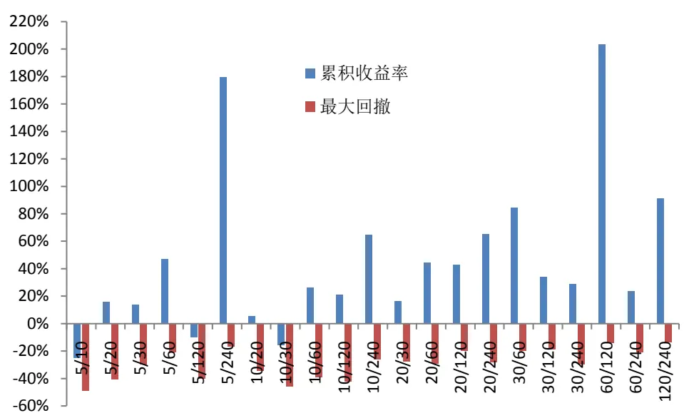
数据来源：广发发展研究中心、天软科技

表 7：各参数下改进均线交叉策略的表现（LLT）

| k1 | k₂ | 累积收益率 | 最大回撤 |
| --- | --- | --- | --- |
| 5 | 10 | 56.32% -20.84% | 收益回撤比 2.70 |
| 5 | 20 | 19.72% -36.18% | 0.55 |
| 5 | 30 | 24.96% | -37.00% 0.67 |
| 5 | 60 | 84.47% -30.38% | 2.78 |
| 5 | 120 | 150.88% | -18.42% 8.19 |
| 5 | 240 | 21.26% | -28.80% 0.74 |
| 10 | 20 | 144.60% | -17.83% 8.11 |
| 10 | 30 | 44.14% | -30.41% 1.45 |
| 10 | 60 | 24.20% | -27.11% 0.89 |
| 10 | 120 | 83.58% -18.49% | 4.52 |
| 10 | 240 | 42.07% -30.63% | 1.37 |
| 20 | 30 | 5.20% -27.28% | 0.19 |
| 20 | 60 | 48.20% -32.26% | 1.49 |
| 20 | 120 57.99% | -34.14% | 1.70 |
| 20 | 240 16.97% | -22.11% | 0.77 |
| 30 | 60 10.65% | -41.99% | 0.25 |
| 30 | 120 | 25.53% -25.55% | 1.00 |
| 30 | 240 | -0.94% -44.63% | -0.02 |
| 60 | 120 | 71.42% -17.63% | 4.05 |
| 60 | 240 | 41.22% -20.85% | 1.98 |
| 120 | 240 | 16.39% -25.21% | 0.65 |

数据来源：广发发展研究中心、天软科技

图 12：各参数下改进均线交叉策略的表现（LLT）
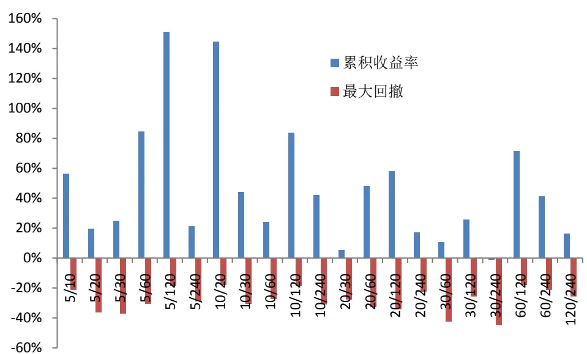
数据来源：广发发展研究中心、天软科技

## 五、总结

本篇报告提出了一种改进的均线交叉策略。通过改变传统均线交叉策略的平仓条件，使得风险收益表现显著提升，同时策略的稳定性也有了较大的改善。策略的一大特点在于引入浮动止盈机制，将盈利最大化，因此策略的亏盈比相当高。同时，我们通过随机游走理论，详细阐述了策略的逻辑思想。最后，我们对策略在不同均线参数、不同的均线类型下的表现，进行了全面的研究。实证结果表明，改进的均线交叉策略在大多数情况之下都较传统均线交叉策略有明显的优势。

感谢发展研究中心金融工程组实习生邱捷铭为本篇研究报告所做的工作。

## 风险提示

本篇报告通过历史数据进行建模与实证，得到良好的回测效果。但由于市场具有不确定性，交易模型仅在统计意义下有望获得良好投资效果，敬请广大投资者注意模型单次失效的风险。

## Table_RatingIndustry 广发证券—行业投资评级说明

买入： 预期未来 12 个月内，股价表现强于大盘 10%以上。

持有： 预期未来12个月内，股价相对大盘的变动幅度介于-10%～+10%。

卖出： 预期未来12个月内，股价表现弱于大盘10%以上。

## Table_RatingCompany 广发证券—公司投资评级说明

买入： 预期未来12个月内，股价表现强于大盘15%以上。

谨慎增持： 预期未来12个月内，股价表现强于大盘5%-15%。

持有： 预期未来12个月内，股价相对大盘的变动幅度介于-5%～+5%。

卖出： 预期未来12个月内，股价表现弱于大盘5%以上。

## Table_Ad联系我们

| 地址 | 广州市 广州市天河北路183号 | 深圳市 深圳市福田区金田路4018 | 北京市 | 上海市 |
| --- | --- | --- | --- | --- |
|  | 大都会广场5楼 | 号安联大厦 15 楼 A 座 03-04 | 北京市西城区月坛北街2号 月坛大厦18层 | 上海市浦东新区富城路99号 震旦大厦18楼 |
| 邮政编码 | 510075 | 518026 | 100045 | 200120 |
| 客服邮箱 | gfyf@gf.com.cn |  |  |  |
| 服务热线 | 020-87555888-8612 |  |  |  |

## Table_Disclaimer 免 责声 明

广发证券股份有限公司具备证券投资咨询业务资格。本报告只发送给广发证券重点客户，不对外公开发布。

本报告所载资料的来源及观点的出处皆被广发证券股份有限公司认为可靠，但广发证券不对其准确性或完整性做出任何保证。报告内容仅供参考，报告中的信息或所表达观点不构成所涉证券买卖的出价或询价。广发证券不对因使用本报告的内容而引致的损失承担任何责任，除非法律法规有明确规定。客户不应以本报告取代其独立判断或仅根据本报告做出决策。

广发证券可发出其它与本报告所载信息不一致及有不同结论的报告。本报告反映研究人员的不同观点、见解及分析方法，并不代表广发证券或其附属机构的立场。报告所载资料、意见及推测仅反映研究人员于发出本报告当日的判断，可随时更改且不予通告。

本报告旨在发送给广发证券的特定客户及其它专业人士。未经广发证券事先书面许可，任何机构或个人不得以任何形式翻版、复制、刊登、转载和引用，否则由此造成的一切不良后果及法律责任由私自翻版、复制、刊登、转载和引用者承担。