# 再论 RSI 指标在股指期货日内交易中的使用

## 另类交易策略之二十八

## Table_Sum ary报告摘要：

## 传统 RSI指标交易策略无效

作为一种历史悠久、应用广泛的技术指标，相对强弱指标（RSI）给交易员进行短线交易和长线交易提供了关于多空双方强弱的重要参考。传统的RSI择时策略主要分为反转策略和趋势策略。虽然二者可以对人工交易提供一定的参考，但直接用于程序化交易的却是无效的。

## 新策略结合不同频率K线上的 RSI指标

改进的 RSI 交易策略分别计算不同周期的 K 线上的 RSI 指标，当低频 K 线的 RSI 指标较为强势，高频 K 线的 RSI 指标非常强势时做多，当低频 K 线的 RSI 指标较为弱势，高频 K 线的 RSI 指标非常弱势时则做空，并持有到收盘平仓。同时，由于隔夜信息可能会影响市场的趋势和情绪，我们将日内交易的开仓时间优化为上午 10:00，而非 9:15，主要是为了较多地利用当日的信息计算RSI，并做开仓的判断。

## 策略在市场波动大时表现较好

该策略在沪深 300 指数期货上年化收益率为 26.81%的和最大回撤为-9.86%。策略在 2010、2011、2012 和 2015 年市场波动较大时表现较好，而在 2013 年和 2014 年市场波动较小时略有回撤。同时，该趋势性策略在中证500上表现较好，而在上证 50上表现较差。

图 1新 RSI策略累计收益
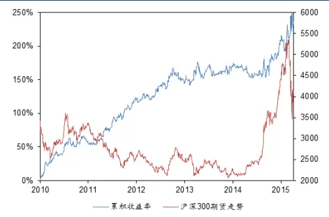

图 2新 RSI策略回撤情况
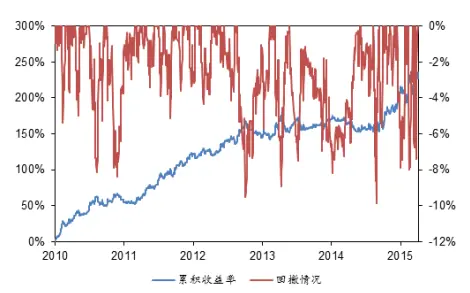

Table_Author 分析师： 安宁宁 S0260512020003

公0755-23948352

ann@gf.com.cn

## Tabl e_Report 相关研究：

另类交易策略系列之二十 2015-07-16
七：均线交叉策略的另类创
新研究
另类交易策略系列之二十 2015-07-10
六：境外中概股股指期货对
于 A股市场择时研究
另类交易策略系列之二十 2015-07-04
五：价量模式匹配股指期货
交易策略

联系人：施驰

020-87555888-8687

shichi@gf.com.cn

## 一、相对强弱指标（RSI）

## （一）RSI 简介

相对强弱指数（Relative Strength Index）是一种衡量证券多空双方力量强弱的技术指标，最早由著名技术分析大师WellesWilder建立，并于1978年发表在了NewConcepts in Technical Trading Systems一书中。RSI指标根据股票市场上供求关系平衡的原理，通过比较过去一段时期内证券价格上涨和下跌的幅度来判断市场上多空双方买卖力量的强弱程度，从而判断未来市场走势。

现如今，RSI指标广泛应用于股票、期货和外汇交易中，很多资讯服务终端都默认做出各个品种的RSI曲线。相比于其他分析工具，RSI是其中一种计算方便、容易理解、使用简便的指标，故其一推出便大受欢迎。

在实际交易中，RSI一般只作为交易员判断价格走势的参考，其本身难以发出准确地交易信号。因此，RSI经常作为其他技术分析的一种佐证，与形态理论、移动平均线等指标配合使用。例如，在形态理论中，当头肩顶形态确认时，如果此时RSI处于超买区，则进一步加强了反转发生的可能性。

## （二）RSI的定义

RSI的具体定义如下：

首先定义上涨幅度U和下跌幅度D：

$$
U(t)=\max(\mathrm{close}_{t}-\mathrm{close}_{t-1},0)
$$

$$
D(t)=\max(\mathrm{close}_{t-1}-\mathrm{close}_{t},0)
$$

接着定义相对强弱（Relative Strength）：

$$
\mathrm{RS}=\frac{\mathrm{SMA}(U,n)}{\mathrm{SMA}(D,n)}
$$

其中，SMA(x,n)为x的周期为n的简单移动平均值。

将RS归一化后，得到RSI：

$$
\mathrm{RSI}=100\times{\frac{\mathrm{RS}}{1+\mathrm{RS}}}
$$

归一化保证了RSI的取值范围在0~100之间，这样使得不同时刻的RSI具有可比性。通过定义可以看出，RSI与RS呈正相关关系，而RS与过去n个周期内平均上涨幅度呈正比，与过去n个周期内平均下跌幅度成反比。因此，RSI衡量了过去n个周期内，平均上涨幅度相对于平均下跌幅度的大小，亦即过去n个周期内，多头相对于空头的力量强弱。RSI越大，表明过去一段时间多方越强势；RSI越小，表明过去一段时间空方越强势。

RSI与其他常用技术指标的构造原理有所不同。MACD和TRIX等趋势类指标直接对证券价格做移动平均，而RSI首先将证券价格上涨和下跌的部分区分开来，再分别求移动平均值。RSI与KDJ的使用方法类似，但构造方法有所不同。计算RSI时利用了过去一段时间内的所有收盘价，而KDJ在计算时只采用了当时收盘价和过去一段时间内的最高价和最低价。因此RSI利用的信息比KDJ更多，而且计算方法比KDJ简便。但KDJ也有其优势，K线、D线和J线包含不同的信息，起到了互相补充的作用。此外，RSI与PSY的计算方法和使用方法也很相似，但PSY只考虑了上涨周期数和下跌周期数，而不考虑上涨和下跌的幅度。

## （三）传统的 RSI 择时策略

传统的RSI择时策略主要分为两大类。一类是反转策略，即当RSI大于（小于）某一较大（较小）值时，认为多方（空方）力量占优的局面会有所改变。另一类是趋势策略，即当RSI由小变大（由大变小）时，表明多方（空方）力量占优，同时认为这种趋势会延续下去。下面分别具体介绍。

RSI反转策略是最常用的RSI择时策略。设RSI上阈值为M，则下阈值为100-M。M<RSI<100的区域定义为超买区，即此时多方在过去已拉升一段时间，此后空方占优的概率更大一些；类似地，0<RSI<100-M的区域定义为超卖区，此时空方已经压价一段时间，此后多方占优的概率更大。因此，当RSI>M时平仓并做空，当RSI<100-M时平仓并做多，如下图所示。一般M的取值为80或70。

图1：超买与超卖示意图
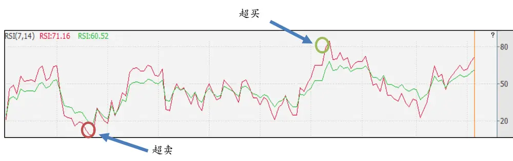
数据来源：广发证券发展研究中心、WIND资讯

RSI趋势策略与移动平均线趋势策略类似，当短周期的指标上穿或下穿长周期指标时，发出买卖信号。对于RSI而言，当短周期RSI上穿（下穿）长周期RSI时，认为此时多方（空方）开始发力，价格上涨（下跌）的趋势会延续一段时间。短期RSI上穿长期RSI叫做黄金交叉，是买入时机；短期RSI下穿长期RSI叫做死亡交叉，是卖出时机，如下图所示。常用的短周期为7，长周期为14。

图2：黄金交叉与死亡交叉示意图

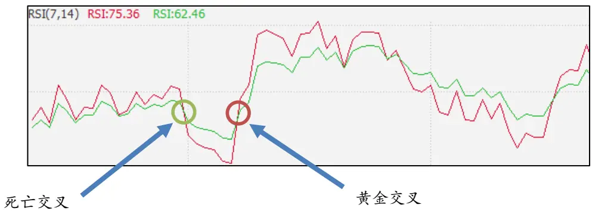
数据来源：广发证券发展研究中心、WIND资讯

## （四）传统的 RSI 择时策略用于沪深 300 期货

RSI广泛用于人工交易，是交易员判断未来价格走势的重要参考指标之一。但是RSI用于程序化交易的效果如何呢？下面我们在沪深300期货上测试一下两类传统的RSI择时策略。为了突出本质，我们采用了最简单的RSI择时策略，不设止盈和止损。

对于RSI反转策略，当RSI大于80时做空，当RSI小于20时做多。我们分别在日线和5分钟线上对传统RSI反转策略进行了测试，具体的回测参数如下表所示：

表1：传统RSI反转策略回测参数

| 参数 值 |  |  |
| --- | --- | --- |
| 起始时间 | 2010年4月16日 |  |
| 结束时间 | 2015年7月17日 |  |
| 交易佣金（双边） | 2/10000 |  |
| RSI计算周期 | 日线为7 | 分钟线为14 |
| RSI做多阈值 | 20 |  |
| RSI做空阈值 | 80 |  |

数据来源：广发证券发展研究中心

对沪深300股指期货回测得到的累积收益率如下图所示：

图3：传统RSI反转策略累积收益率（日线）

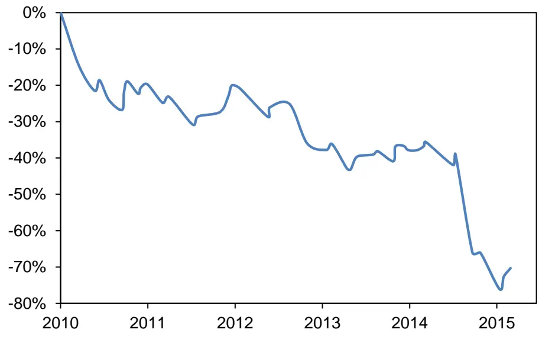
数据来源：广发证券发展研究中心、WIND资讯

图4：传统RSI反转策略累积收益率（5分钟线）
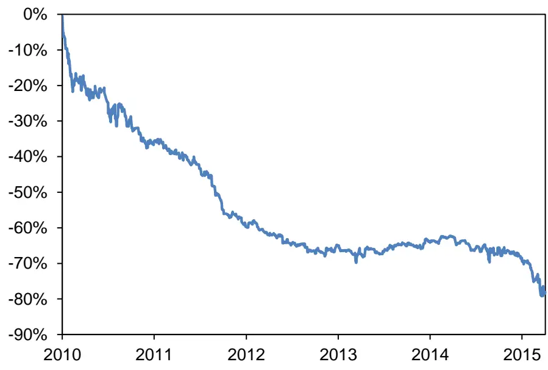
数据来源：广发证券发展研究中心、天软科技

可以看出，无论是用于短线还是中长线，RSI反转策略得到的收益率均为负。传统的RSI反转策略无法单独直接用于程序化交易。

对于RSI趋势策略，考虑短周期和长周期两条RSI曲线。当短期RSI上穿长期RSI时平仓并做多，当短期RSI下穿长期RSI时平仓并做空。我们也分别对日线和5分钟线做了测试，具体的回测参数如下表所示：

表2：传统RSI趋势策略回测参数

| 参数 日线/5分钟线 |  |
| --- | --- |
| 起始时间 | 2010年4月16日 |
| 结束时间 | 2015年7月17日 |
| 交易佣金（双边） | 2/10000 |

识别风险，发现价值

| 短期RSI计算周期 | 7 |
| --- | --- |
| 长期RSI计算周期 | 14 |

数据来源：广发证券发展研究中心

对沪深300股指期货回测得到的累积收益率如下图所示：

图5：传统RSI趋势策略累积收益率（日线）
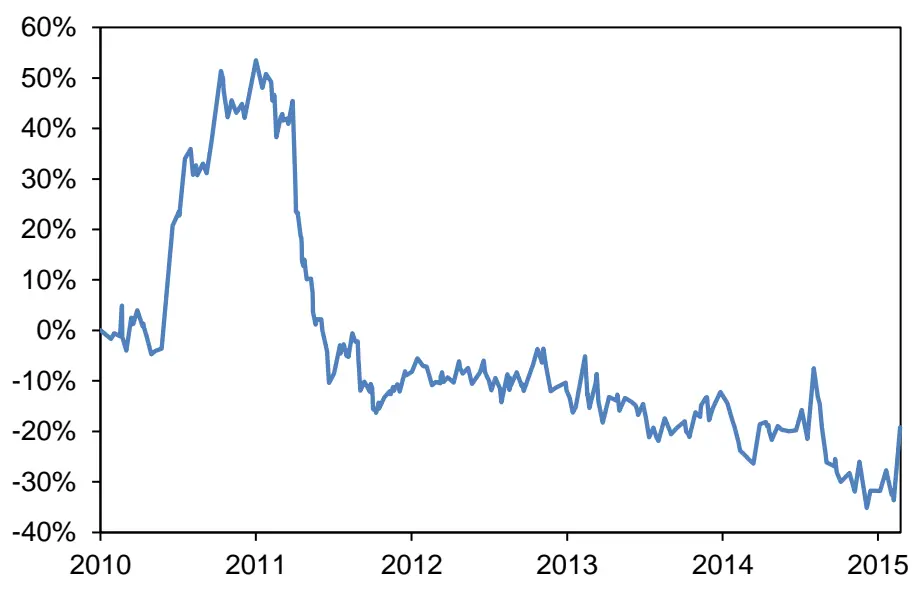
数据来源：广发证券发展研究中心、WIND资讯

图6：传统RSI趋势策略累积收益率（5分钟线）
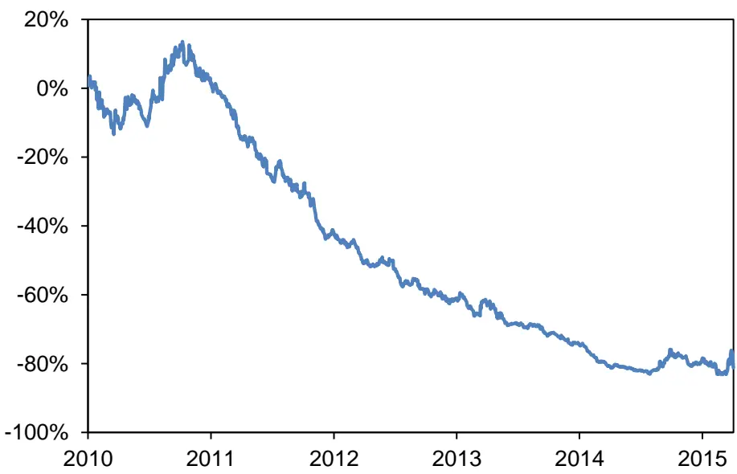
数据来源：广发证券发展研究中心、天软科技

同样，RSI指标趋势策略在沪深300股指期货上也是无效的。

那么，有没有更好的、可用于沪深300期货的RSI择时策略呢？

我们从传统RSI择时策略的缺点入手。传统RSI反转策略的缺点是只利用单独周

识别风险，发现价值

期的RSI指标。虽然短期RSI处于超卖区，但可能较长期的RSI处于买区，此时做空只能在短线获得很少的盈利，在较长线则很可能亏损。而传统RSI趋势策略的缺点是黄金交叉和死亡交叉的滞后性较强，往往是上涨了一段时间才出现黄金交叉，此时距离下次反转为时不多，所以获利空间小。同时，黄金交叉和死亡交叉只考虑了长短周期RSI的相对大小，而没有考虑RSI本身的绝对大小。

因此，将两个传统策略的优势相结合，可以得到新的长短期RSI择时策略：采用长周期和短周期两条RSI，克服了传统RSI反转策略只用一条RSI的缺陷；采用绝对指标进行比较，克服了传统RSI趋势策略只比较长周期和短周期RSI相对大小的缺陷。下面将详细阐述新的长短期RSI择时策略。

## 二、新型长短期 RSI择时策略实证研究

## （一）模型思路

新型长短期RSI择时策略本质上是一种趋势策略，是将传统RSI反转策略与传统RSI趋势策略相结合的择时策略。

为了克服采用单一RSI的弊端，我们在两个不同周期的K线图上分别计算短期和长期RSI，而计算RSI时采用相同的周期N。这一点不同于传统RSI趋势策略。在传统RSI趋势策略中，长周期和短周期RSI是针对相同的K线图、用不同周期计算RSI得到的。采用长期K线来计算长期RSI能更好地反映中长期的多空力量强弱。

为了克服采用RSI相对大小的弊端，我们对长期和短期RSI分别设定两个阈值L和S。当长期RSI>L时，认为长期来看多方占优，当短期RSI>S时，认为多方开始发力，趋势将会延续；类似地，当长期RSI<100-L时，认为长期来看空方占优，当短期RSI<100-S时，认为空方开始发力，趋势将会延续。因此，首先我们可以对L和S的取值范围有一个预判。由于短期RSI比长期RSI敏感，所以L<S。L的取值应该在50左右，而S的取值应该在80左右。这样才能保证长期RSI起筛选作用，而短期RSI进一步准确地确定买卖时点。

具体地，策略实施的时间间隔等于短周期，并且要求长周期是短周期的倍数，这样使得每根长周期K线包含整数个短周期K线。在计算RSI时，长周期K线包含的不同短周期K线对应的长期RSI相同。交易流程如下：

第一步，计算短期和长期RSI。

在该短周期K线图上计算短期RSI，若该短周期K线并未开启一条新的长周期K线，则长期RSI等于前一短周期的长期RSI，否则在长周期K线图上计算新的长期RSI。

第二步，若此时未开仓并且处于策略实施期间，则判断是否开仓。

若同时满足长期RSI>L和短期RSI>S，则做多；若同时满足长期RSI<100-L和短期RSI<100-S，则做空；否则保持空仓。

第三步，若此时已开仓，则判断是否平仓。

平仓条件采用止盈止损。日内的获利与亏损达到一定程度时平仓。此外，每日收盘时若有头寸，则平仓。

详细的策略交易流程如下图所示：

图7：交易流程图

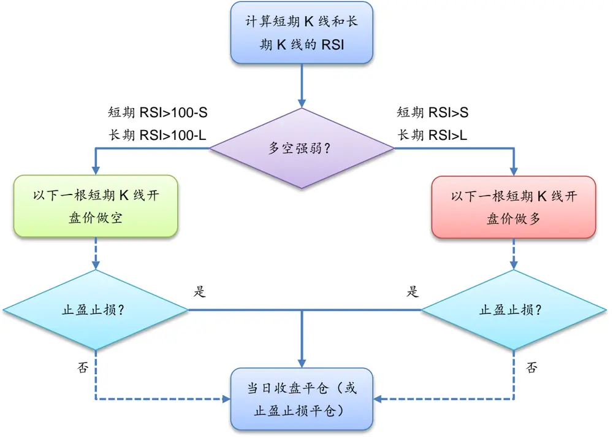
数据来源：广发证券发展研究中心

## （二）模型参数与回测结果

由于模型的参数较多，我们对参数进行了优化，得到了如下表所示的最优参数：

表3：模型参数

| 回测参数 参数取值 |  | 回测参数 | 参数取值 |
| --- | --- | --- | --- |
| 起始时间 | 2010年4月16日 | RSI 计算周期 | 11 |
| 结束时间 | 2015年7月17日 | 长K线周期 | 15分钟 |
| 交易成本（双边） | 2/10000 | 短K线周期 | 5分钟 |
| 收益率计算方式 | 复利 | 起始时间 | 10:00 |
| 止损阈值 | 2.00% | 结束时间 | 15:15 |
| 止盈阈值 | 2.00% |  |  |

数据来源：广发证券发展研究中心

利用上述参数对沪深300指数期货进行回测，得到的累积收益率如下图所示：

图8：策略的累积收益率（沪深300指数期货）

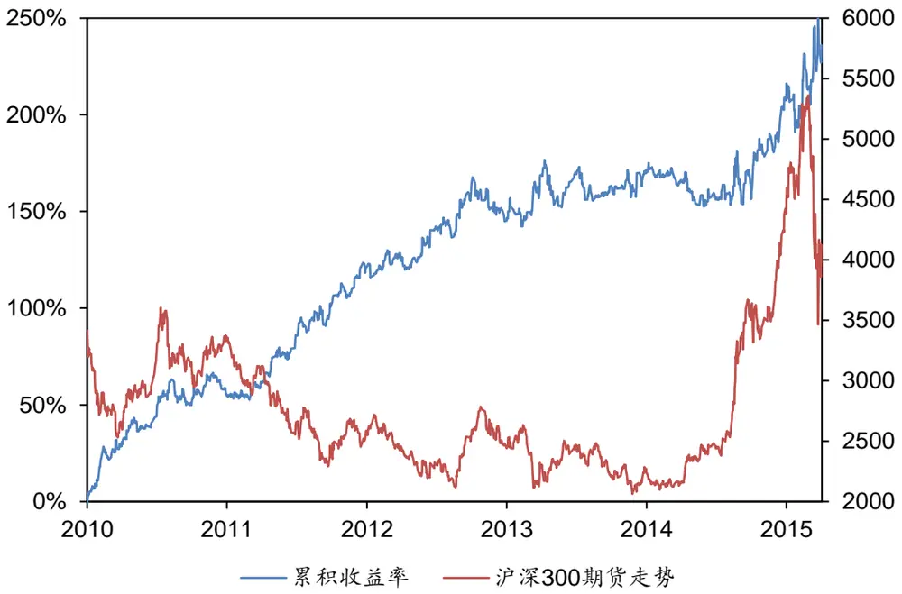
数据来源：广发证券发展研究中心、天软科技

表4：策略交易明细（沪深300指数期货）

| 指标 RSI 择时策略（沪深 300 期货） |  |
| --- | --- |
| 累积收益率 | 236.06% |
| 年化收益率 | 26.81% |
| 最大回撤 | -9.86% |
| 收益回撤比 | 2.72 |
| 正确次数 | 513 |
| 错误次数 | 470 |
| 胜率 | 52.19% |
| 平均获胜收益率 | 0.92% |
| 平均失败亏损率 | -0.73% |
| 盈亏比 | 1.26 |
| 单日最大盈利 | 5.65% |
| 单日最大亏损 | -4.70% |
| 最大连续盈利次数 | 5 |
| 最大连续亏损次数 | 8 |

数据来源：广发证券发展研究中心

该策略的年化收益率达到了26.81%，回撤仅有9.86%，收益回撤比为2.72，胜率超过了50%。该策略的回撤情况如下图所示：

图9：策略的回撤情况（沪深300指数期货）

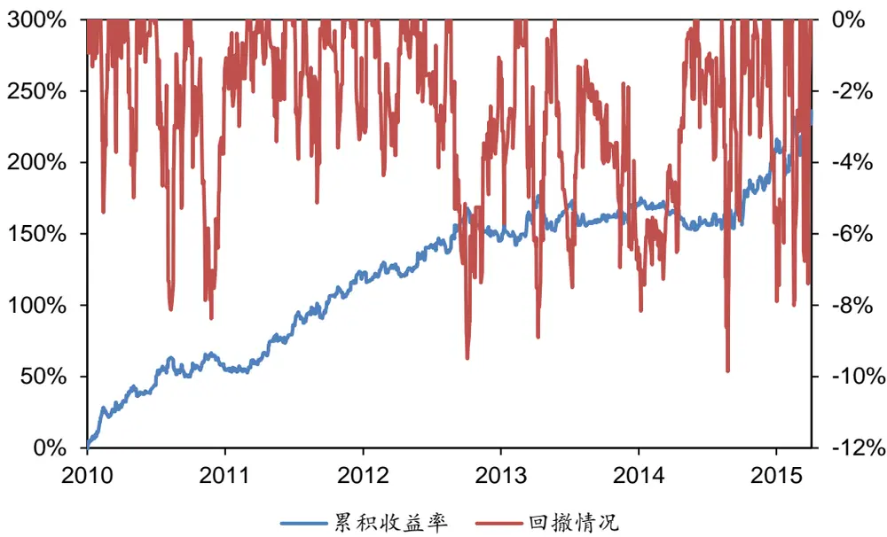
数据来源：广发证券发展研究中心、天软科技

图10：分年度收益回撤情况（沪深300期货）
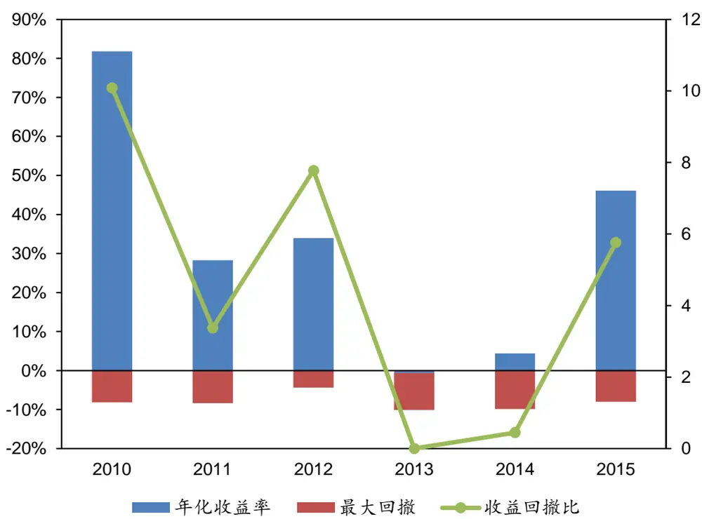
数据来源：广发证券发展研究中心

可以看出，该策略在沪深300上市的前三年表现较好，尤其是2010年，收益回撤比达到了10。这三年的收益回撤比均大于3。然而在2013和2014年，策略的收益却明显减小。其中，2013年的收益甚至为负，2014年的收益不及5%，但回撤达到了10%。这主要是由于2013年和2014年市场波动较小从而导致趋势类策略回撤较大。在2015年，年化收益率达到了46%，回撤仅8%，收益回撤比高达5.76。

## （三）模型用于上证 50 和中证 500指数回测结果

由于上证50期货和中证500期货刚刚推出不久，回测数据较少，因此我们在上证50和中证500现货上测试了新型长短期RSI择时策略，以此来间接反映策略能否用于上证50和中证500期货。对上证50指数和中证500指数的回测采用了与回测沪深300期货相同的参数。

对上证50指数回测得到的累积收益率如下图所示：

图11：策略的累积收益率（上证50指数）
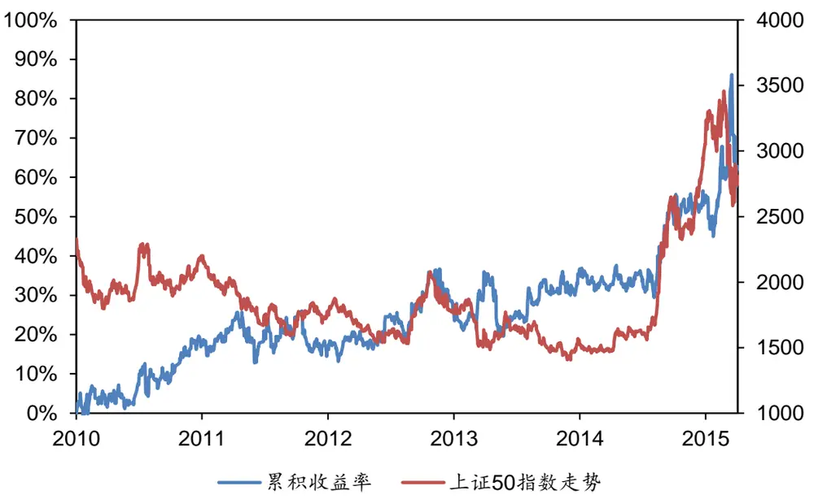
数据来源：广发证券发展研究中心、天软科技

对上证50指数回测的交易明细如下表所示：

表5：策略交易明细（上证50指数）

| 指标 RSI择时策略（上证50 指数） |  |
| --- | --- |
| 累积收益率 | 62.76% |
| 年化收益率 | 10.01% |
| 最大回撤 | -15.38% |
| 收益回撤比 | 0.65 |
| 正确次数 | 543 |
| 错误次数 | 540 |
| 胜率 | 50.14% |
| 平均获胜收益率 | 0.82% |
| 平均失败亏损率 | -0.72% |
| 盈亏比 | 1.13 |
| 单日最大盈利 | 4.63% |
| 单日最大亏损 | -5.64% |
| 最大连续盈利次数 | 6 |
| 最大连续亏损次数 | 5 |

识别风险，发现价值

数据来源：广发证券发展研究中心、天软科技

该策略用在上证50指数的效果并不突出，年化收益率仅10.01%，但回撤达到了-15.38%，收益回撤比仅0.65，胜率仅略高于50%。这显示出该策略并不适用于大盘股。回撤情况如下表所示：

图12：策略的回撤情况（上证50指数）
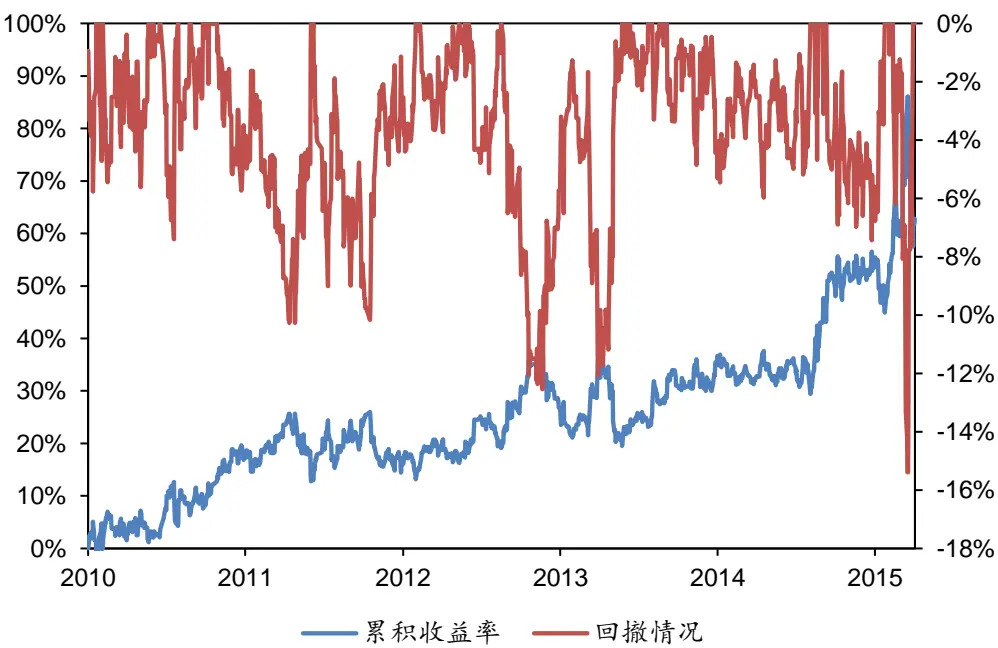
数据来源：广发证券发展研究中心、天软科技

对中证500指数回测得到的累积收益率如下表所示：

图13：策略的累积收益率（中证500指数）
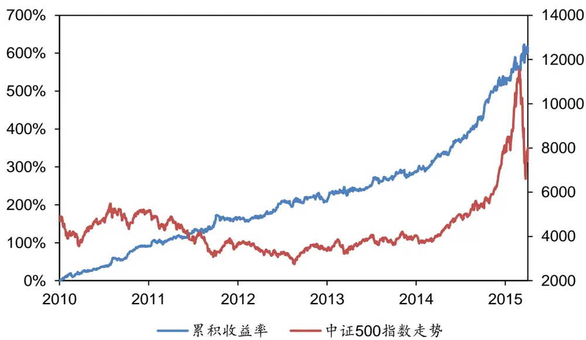
数据来源：广发证券发展研究中心、天软科技

对中证500指数回测的交易明细如下表所示：

表6：策略交易明细（中证500指数）

| 指标 RSI择时策略（中证500 指数） |  |
| --- | --- |
| 累积收益率 | 616.01% |
| 年化收益率 | 47.06% |
| 最大回撤 | -8.45% |
| 收益回撤比 | 5.57 |
| 正确次数 | 694 |
| 错误次数 | 471 |
| 胜率 | 59.57% |
| 平均获胜收益率 | 0.83% |
| 平均失败亏损率 | -0.79% |
| 盈亏比 | 1.05 |
| 单日最大盈利 | 5.06% |
| 单日最大亏损 | -6.66% |
| 最大连续盈利次数 | 10 |
| 最大连续亏损次数 | 5 |

数据来源：广发证券发展研究中心、天软科技

该策略用于中证500指数的效果很好，年化收益率达到了47.06%，回撤仅有-8.45%，收益回撤比高达5.57，胜率接近60%。由此看来，新型长短期RSI择时策略更适用于趋势性较好的中证500指数。回撤情况如下图所示：

图14：策略的回撤情况（中证500指数）
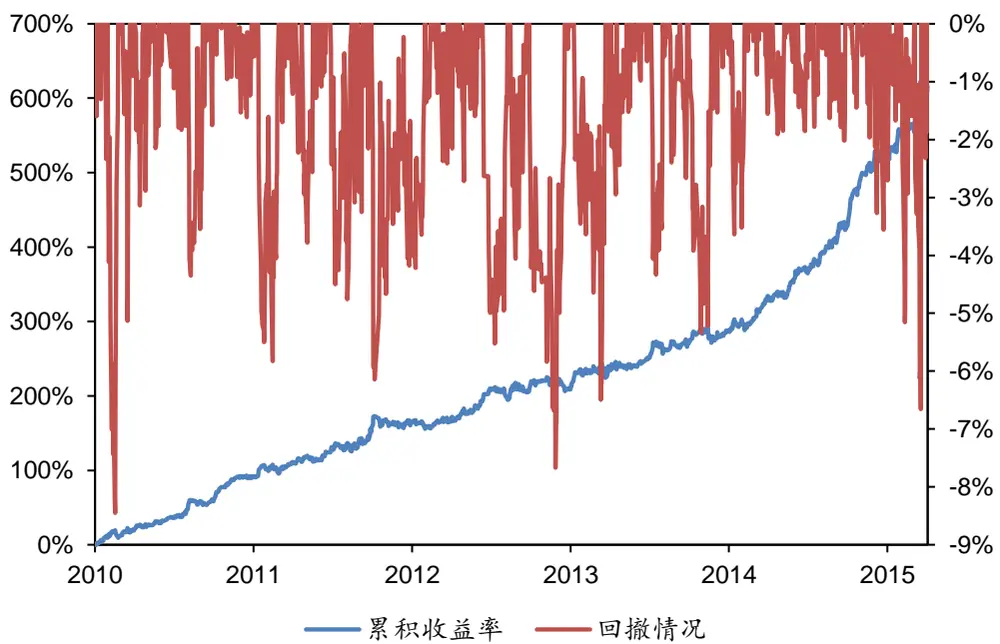
数据来源：广发证券发展研究中心、天软科技

## （四）交易时段分析

在模型中，我们采用了与沪深300指数期货交易时段不同的交易时间。回测的结果也表明，交易的起始时间对最终绩效有显著影响，而交易的结束时间对策略绩效影响不大。为此，我们测试了沪深300指数期货在最优交易时段（10:00~14:45）和正常交易时段（9:15~15:15）的累积收益率，如下图所示：

图15：不同交易时段的累积收益率（沪深300指数期货）
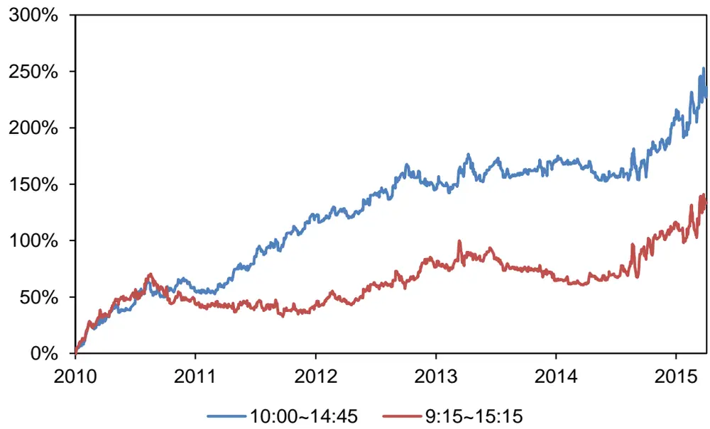
数据来源：广发证券发展研究中心、天软科技

策略对起始交易时间的敏感性受两个对立因素影响。一方面，由于计算RSI时需要过去N根K线的数据，而在开盘后的前N根K线处计算RSI时，会包含前一日收盘前附近的K线，而经过隔夜信息之后市场情绪可能已经有所改变。因此，包含过多前一日收盘前的信息会导致RSI无法正确反映当日市场的多空强弱。因此，起始交易时间过早对策略绩效不利。另一方面，若起始交易时间过晚，首先会压缩日内的盈利空间。权衡两者，我们认为10:00是一个比较好的开仓时间。

## 三、总结

作为一种历史悠久、应用广泛的技术指标，相对强弱指标（RSI）给交易员进行短线交易和长线交易提供了关于多空双方强弱的重要参考。传统的RSI择时策略主要分为反转策略和趋势策略。虽然二者可以对人工交易提供一定的参考，但直接用于程序化交易的却是无效的。

改进的RSI交易策略分别计算不同周期的K线上的RSI指标，当低频K线的RSI指标较为强势，高频K线的RSI指标非常强势时做多，当低频K线的RSI指标较为弱势，高频K线的RSI指标非常弱势时则做空，并持有到收盘平仓。同时，由于隔夜信息可能会影响市场的趋势和情绪，我们将日内交易的开仓时间优化为上午10:00，而非9:15，主要是为了较多地利用当日的信息计算RSI，并做开仓的判断。

该策略在沪深300指数期货上年化收益率为26.81%的和最大回撤为-9.86%。策略在2010、2011、2012和2015年市场波动较大时表现较好，而在2013年和2014年市场波动较小时略有回撤。同时，该趋势性策略在中证500上表现较好，而在上证50上表现较差。

## 风险提示

策略模型并非百分百有效，市场结构及交易行为的改变或者交易参与者的增多有可能使得策略失效。

## Tabl e_RatingIndustr y 广发证券 —行业投资评级说明

买入： 预期未来 12 个月内，股价表现强于大盘 10%以上。

持有： 预期未来12个月内，股价相对大盘的变动幅度介于-10%～+10%。

卖出： 预期未来12个月内，股价表现弱于大盘10%以上。

## Tabl e_RatingCompany 广发证券 —公司投资评级说明

买入： 预期未来12个月内，股价表现强于大盘15%以上。

谨慎增持： 预期未来12个月内，股价表现强于大盘5%-15%。

持有： 预期未来12个月内，股价相对大盘的变动幅度介于-5%～+5%。

卖出： 预期未来12个月内，股价表现弱于大盘5%以上。

## Table_A联系我们

|  | 广州市 | 深圳市 | 北京市 | 上海市 |
| --- | --- | --- | --- | --- |
| 地址 | 广州市天河北路183号 大都会广场5楼 | 深圳市福田区金田路4018 号安联大厦 15 楼 A 座 03- | 北京市西城区月坛北街2 号月坛大厦18层 | 上海市浦东新区富城路99 |
|  |  | 04 |  | 号震旦大厦18楼 |
| 邮政编码 | 510075 | 518026 | 100045 | 200120 |
| 客服邮箱 | gfyf@gf.com.cn |  |  |  |
| 服务热线 | 020-87555888-8612 |  |  |  |

## Tabl e_Disclai mer 免责声明

广发证券股份有限公司具备证券投资咨询业务资格。本报告只发送给广发证券重点客户，不对外公开发布。

本报告所载资料的来源及观点的出处皆被广发证券股份有限公司认为可靠，但广发证券不对其准确性或完整性做出任何保证。报告内容仅供参考，报告中的信息或所表达观点不构成所涉证券买卖的出价或询价。广发证券不对因使用本报告的内容而引致的损失承担任何责任，除非法律法规有明确规定。客户不应以本报告取代其独立判断或仅根据本报告做出决策。

广发证券可发出其它与本报告所载信息不一致及有不同结论的报告。本报告反映研究人员的不同观点、见解及分析方法，并不代表广发证券或其附属机构的立场。报告所载资料、意见及推测仅反映研究人员于发出本报告当日的判断，可随时更改且不予通告。

本报告旨在发送给广发证券的特定客户及其它专业人士。未经广发证券事先书面许可，任何机构或个人不得以任何形式翻版、复制、刊登、转载和引用，否则由此造成的一切不良后果及法律责任由私自翻版、复制、刊登、转载和引用者承担。