# Tabl e_Title 全球商品期货量化交易策略初探

## FICC 业务系列报告之一

## Table_Sum ary报告摘要 ：

## 全球商品期货量化对冲基金及产品介绍

商品期货交易源远流长，分布广泛。商品期货品种繁多，因此可以通过多品种投资有效降低回撤。另一方面，商品期货市场与股票市场有着相对较低的相关性，因此经常被作为分散投资、降低风险的良好标的。海外有相当多的对冲基金同时投资于大宗商品、股票、外汇等市场，而国内的基金公司也开始逐步关注商品期货市场。这篇报告介绍了海外部分主要投资于商品期货的量化对冲基金，同时对国内商品期货市场上的量化基金做了概述。

## 常见商品期货交易策略

除套期保值之外，以博取收益为目的的常见商品期货交易策略包括套利策略、短线投机策略和中长线趋势策略。

套利策略我们主要介绍跨期套利、跨市场套利和跨品种套利。在这一部分，我们对可供套利的期货市场和期货品种均做了介绍。

短线投机策略与中长线趋势策略部分，我们主要对海内外部分经典交易策略做了介绍，为新策略的研究设计做铺垫和准备。

## 商品期货中长线策略建模及实证

商品期货的中长线策略在海外对冲基金中非常常见。一方面中长线策略与短线策略的相关性较低，可用以分散投资、降低风险；另一方面中长线策略对交易系统的要求相对较低。在这一部分，我们选择上面提到的几个中长线策略做实证研究，并将我们前期报告提出的 LLT 低延时趋势线用于商品期货的趋势判别。研究发现，通过多个品种分散投资，确实能有效降低回撤，分散投资风险。

图 1、Global-Macro-Universal 净值
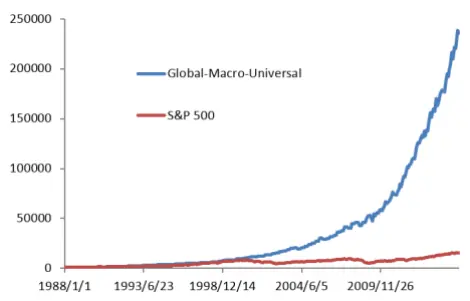

图 2、弘业顺元资产管理计划净值
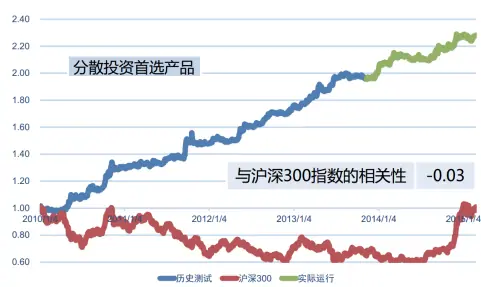

Table_Aut hor 分析师： 张超 S0260514070002

020-87555888-8646

zhangchao@gf.com.cn

## 相关研究：

低延迟趋势线与交易性择时 2013-07-26

## 一、全球商品期货量化对冲基金及产品介绍

我们前期发表了二十余篇关于股指期货的交易策略报告（详见另类交易策略系列）。由于期货交易具有杠杆，风险和收益同时被放大，因此有些策略为了避免较大回撤而引入止损机制。但由于证券市场的厚尾效应，止损机制同时会使交易者错失部分盈利机会。

相比较而言，商品期货在这方面有更灵活的处理方式。商品期货有多个品种（国内截止至今天共有46个品种），且各个品种之间相关性相对较弱。因此投资者可以选取若干个品种同时进行交易，通过分散投资有效降低回撤，也就避免了止损机制的引入。

## （一）商品期货量化对冲基金概述

近年来，商品期货已经获得越来越多量化投资者的关注。投资于商品期货，一是对抗通货膨胀的一种方式，二是可以减弱投资组合的风险，因为商品期货与其他类型的资产的相关性一般较低。

那么，商品期货市场本身主要有哪些风险呢？第一是通货膨胀：许多国家现在仍实行低利率以及较大的财政赤字。负的实际利率很可能导致商品市场的通货膨胀。第二是政治风险：例如贸易禁令、战争、恐怖袭击等。1973年的石油禁运，导致了能源价格出现了急剧上涨。第三是极端的气候：例如霜冻、飓风、海啸等。当这些灾难性的的气候出现时，许多商品期货的价格会出现猛涨。

商品期货的量化策略，按持仓时间分类有短线和中长线之分。根据海外多个商品期货市场的测算结果，短线策略经常有更低的回撤，尤其是在一些极端情况之下（例如 2008-2009年的金融危机），而中长线策略则容易产生更好的收益。因此，同时使用短线和中长线策略可以同时平衡收益与风险。

## （二）海外商品期货量化对冲基金及产品介绍

## 1、Global-Macro-Universal

Global-Macro-Universal 是德国 vonPreussen-Hohenberg Management AG 公司旗下的产品。该公司于1988 年在德国苏黎世成立，活跃于全球的大宗商品和外汇交易市场。

Global-Macro-Universal 主要投资于全球的大宗商品，同时也投资于外汇和股指：大宗商品（包括金属、能源等）占 60%，外汇占 30%，股指占 10%。该产品在量化的基础上采用多策略组合，24 小时挖掘全球市场的短线、中线、长线投资机会。该产品自 1988 年成立，至今持续保持盈利，累积收益达 23465.63%，年化约 22%，最大回撤-11.23%。Global-Macro-Universal 的净值曲线如图 1 所示。

图 1：Global-Macro-Universal 的净值曲线
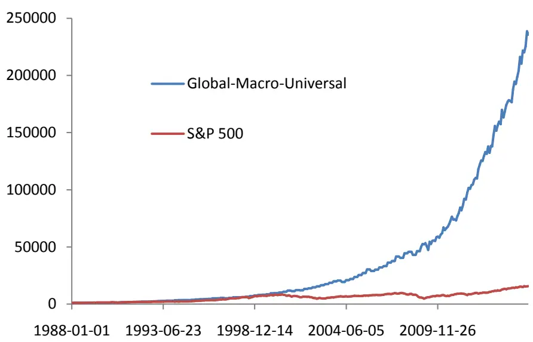
数据来源：http://www.fundpeak.com/

## 2、Emil van Essen Spread Trading Program

Emil van Essen Spread Trading Program 是芝加哥 Emil van Essen 公司旗下的产品。该公司专注于衍生品交易，于 2008年8 月注册为 CTA和 CPO，并在 2011年3月成为 NFA会员。

Emil van Essen Spread Trading Program 主要通过跨期套利和相对价值交易来获取阿尔法，交易品种主要包括原油、燃料油、天然气、玉米、小麦、大豆、银、活牛、瘦肉猪、糖、铜和咖啡。该产品收益率与多个基准，包括 CTA、商品指数、股票指数都很低的相关性。该产品于 2006 年 12 月成立，直至现在仍是公司的旗舰产品。成立至今累积收益达 306.43%，最大回撤-36.21%。Emil van Essen Spread TradingProgram 的净值曲线如图2 所示。

图 2：Emil van Essen Spread Trading Program 的净值曲线
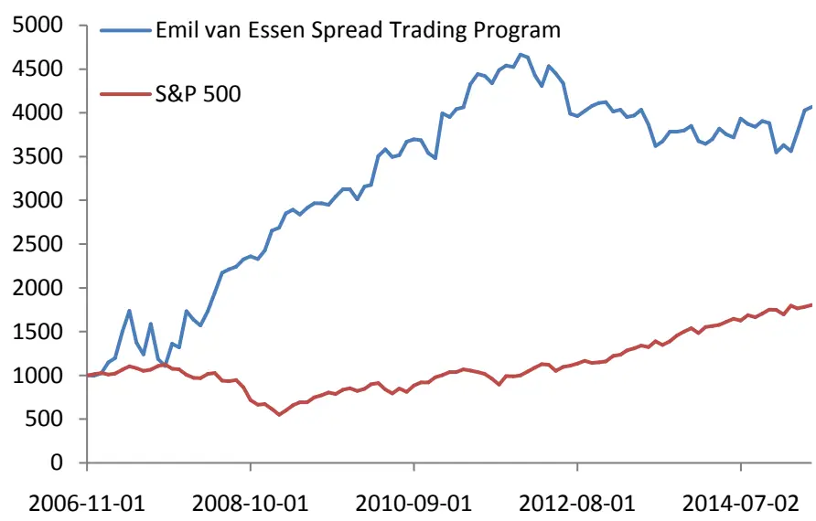
数据来源：http://www.fundpeak.com/

## 3、Commodity Long-Short Program

Commodity Long-Short Program 是 Red Rock Capital 公司旗下的产品。Red RockCapital 是芝加哥一家屡获殊荣的大宗商品投资管理公司，在量化和系统化的投资管理上的卓越表现获得了无数次认可。该公司于 2003 年 9 月成立，至今已接近 12 周年，仍在资本市场上快速成长。

Commodity Long-Short Program 采用一种独特的量化模式识别技术，捕捉商品期货价格在短线或长线上的方向性突破。这些模式是无法使用肉眼观察的。该策略既可以追踪趋势，又可以判断反转。交易中平均持仓时间为 9 个交易日。最重要的是，该产品与 Newedge Trend CTA Index（实时追踪 CTA 每日平均绩效的指数）具有低至0.14的相关系数。该产品于2013年9月成立，直今不到2年，累积收益达65.01%，最大回撤-5.92%。Commodity Long-Short Program 的净值曲线如图 3 所示。

图 3：Commodity Long-Short Program 的净值曲线
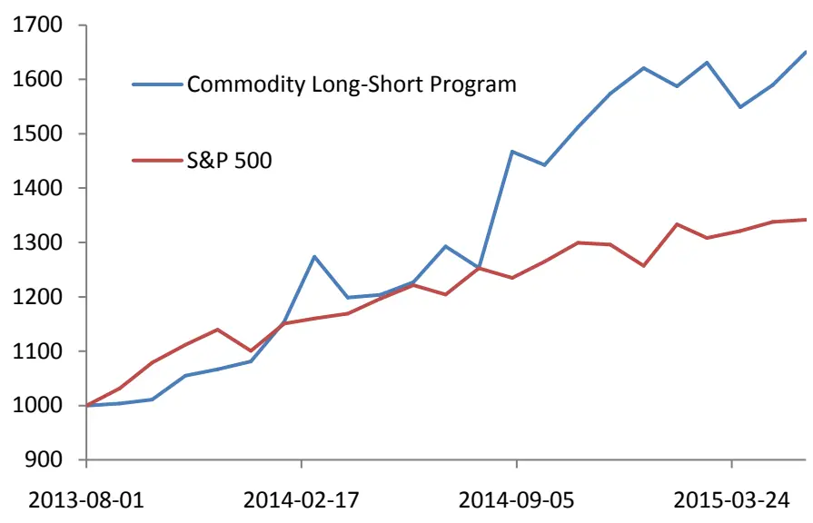
数据来源：http://www.fundpeak.com/

## 4、Deutsche Enhanced Commodity Strategy Fund

Deutsche Enhanced Commodity Strategy Fund 是 Deutsche Asset & WealthManagement 公司的产品。Deutsche Asset & Wealth Management 公司是世界上历史最悠久，规模最大的金融机构之一——德意志银行集团的支柱，管理超过 1 万亿美元的资产，服务于 40个国家约 250万客户。

Deutsche Enhanced Commodity Strategy Fund 是一个指数增强型基金，主要使用三个投资策略：相对值策略，趋势策略，滚动增强策略。相对值策略是该基金使用一个独有的量化计算方法来确定各个商品品种的权重。该基金在设定的事件触发时，才调整各个商品的权重，减少价值高估的商品权重，增加价值低估的商品权重。趋势策略主要用于整个商品市场。该基金通过一个私有的基于动量的量化公式来预测商品市场的方向。当发现商品普遍高估时，将调低所有商品品种的持仓。滚动增强策略主要用于处理不同月份之间的合约交割问题。

Deutsche Enhanced Commodity Strategy Fund 的净值曲线如图 4 所示。

图 4：Deutsche Enhanced Commodity Strategy Fund 的净值曲线
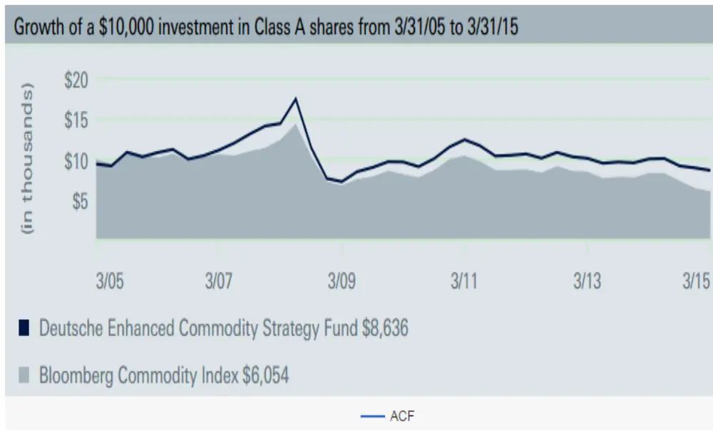
数据来源：https://fundsus.deutscheawm.com

## （三）国内商品期货量化对冲基金及产品介绍

## 1、铖功程序化

“铖功程序化”是广州银闰投资有限公司的商品期货量化基金产品。银闰投资成立于 2011年，为国内金融类风险投资和期货投资的顾问公司，有多次大型投资策略发布会的经验、与国内多家知名券商和期货商建立长期合作的关系，在金融类项目开发有着成熟的经验。主要从事资产管理业务，期货基金、对冲基金的研发与销售。

“铖功程序化”以中低频交易为主，程序发出交易信号，人工判断之后进行下单。“铖功程序化”的净值曲线如图 5所示。

图 5：铖功程序化的净值曲线
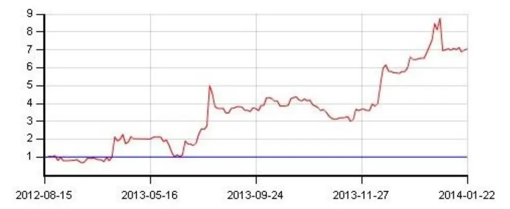
数据来源：http://www.gzyinrun.com/

## 2、黑天鹅二号

“黑天鹅二号”是济南百仕旺投资咨询有限公司的量化基金产品。百仕旺投资咨询有限公司专注于可持续，风险可控，高回报率的量化投资。公司管理的账户连续多年实现年化 50%以上的收益率。公司管理的黑天鹅期货基金连续两年荣获朝阳永续举办的中国私募基金风云榜商品市场组第一名。“黑天鹅二号”成立于 2012 年 7月 16 日，主要操作品种为股指、螺纹钢、焦炭期货。“黑天鹅二号”的净值曲线如图 6所示。

图 6：黑天鹅二号的净值曲线
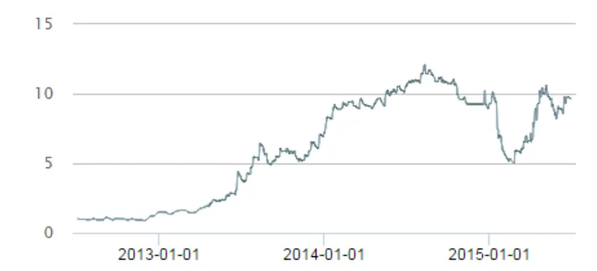
数据来源：https://www.touzi.com

## 3、弘业顺元资产管理计划

“弘业顺元资产管理计划”是弘业期货股份有限公司自有投资研究团队针对期货、股票市场量身打造，通过本公司直接发行，商业银行进行资金托管，主要投资于期货、股票市场，面向特定多个客户进行资金募集的集合资产管理计划。

弘业期货股份有限公司是经中国证监会批准的大型期货公司，注册资本 6.8 亿元，净资产 10亿元。江苏省属国有企业苏豪控股集团、上市公司弘业股份（600128）、全国知名创业投资企业弘毅投资等是公司的主要股东。弘业期货是中国期货业协会理事单位、江苏省期货业协会会长单位，是目前国内拥有营业部数量最多的期货公司之一，全国首批获准期货资产管理业务资格的期货公司之一。

“弘业顺元资产管理计划”把“奥卡姆剃刀原则”放在策略开发的第一位，力求交易策略的逻辑简明、稳定可靠，并通过多策略组合及市场分散化来尽可能减小市场无序波动的冲击以及资金进出市场的难度，把握市场给予的利润。

“弘业顺元资产管理计划”的测算及实盘业绩、与沪深 300指数的相关性如图7所示。可以看到，该产品可以对股票市场起到很好的分散投资、减小风险的效果。不过由于该产品在商品期货方面的投资比例较小，我们这里不做重点介绍。

图 7：弘业顺元资产管理计划的净值曲线
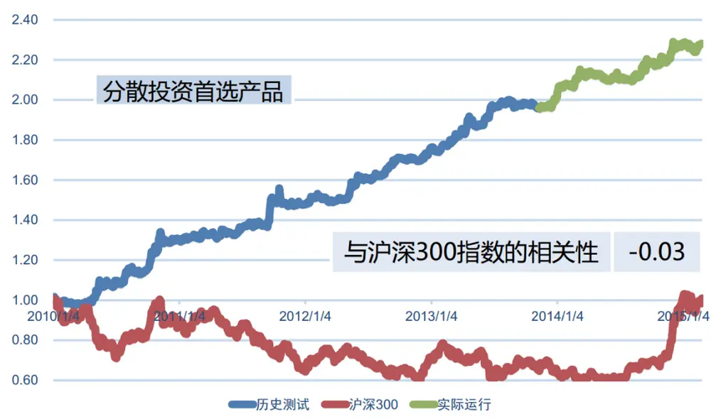
数据来源：http://www.ftol.com.cn/

## 二、常见商品期货量化交易策略

## （一）商品期货套利策略

套利策略一般包括期现套利、跨期套利、跨市场套利、跨品种套利等。

对于商品期货而言，期现套利必须交易大量的商品实物，这对大多数机构投资者而言并不合适。因此，我们仅介绍跨期套利、跨市场套利和跨品种套利。

## 1、跨期套利

跨期套利的思路一般如下：对某一品种主力合约和次主力合约的价差做统计（一般是厚尾分布），然后选取恰当的分位数设定阈值，则可进行反转套利。我们前期的报告《趋强避弱商品期货套利策略》中对其已有详细的研究，在此就不赘述了。

## 2、跨市场套利

跨市场套利即对同一期货品种在不同市场间进行套利。国内3个商品期货交易所并没有重复的品种，因此跨市场套利一般在国内和海外的期货交易所之间进行。对于同一种商品，交易所与原产地的距离会影响价格。

相对于其他套利方式，跨市场套利有着一些特有的风险。例如，套利的效果会受到汇率变动的影响，交易所制度的不同（如涨跌停板制度、交易时间等）也在一定程度上影响套利。

对于国内投资者而言，主要有以下几个海外市场可供套利：

## （1）芝加哥期货交易所（CBOT）

芝加哥期货交易所成立于1848年，是一个著名的期货、期权交易所，2006年10月17日与美国芝加哥商品交易所（CME）合并成芝加哥商品交易集团，成为全球最大的衍生品交易所。

芝加哥是美国最大的谷物集散地，而芝加哥期货交易所早期也已有农产品的交易，如大豆、玉米、小麦。经过漫长的发展，现在的交易系统已经非常稳定和成熟。因此，国内大商所的大豆、玉米，郑商所的强麦，均可与其进行跨市场套利。

## （2）伦敦金属交易所（LME）

伦敦金属交易所成立于1876年，是世界上最大的有色金属交易所。伦敦金属交易所采用国际会员资格制，绝大多数的交易来自于海外市场。交易所的交易品种有铜、铝、锌、铅等有色金属，可以与上期所相应的金属期货进行跨市场套利。

## （3）马来西亚衍生品交易所（BMD）

马来西亚衍生品交易所具有世界上最具流动性和运作最成功的毛棕榈油期货（FCPO）合约。

2009年9月17日，马来西亚衍生品交易所已与芝加哥商商品交易所（CME）建立战略伙伴关系，以实现全球无障碍的衍生品流通。马来西亚衍生品交易所通过全球期货电子交易系统，使FCPO成为世界棕榈油价格的基准。

马来西亚衍生品交易所的毛棕榈油期货可与我国大商所的棕榈油期货进行跨市场套利。

## （4）纽约商品交易所

纽约商品交易所分为NYMEX和COMEX两个部分，其中NYMEX主要进行能源类商品的交易，而COMEX主要进行金属类商品的交易。COMEX具有全球最大的黄金期货交易市场，同时也有银、铜、铝等期货和期权合约。

纽约商品交易所具有建立在网络上的电子交易系统，使得交易者几乎可以24小时进行交易。我国上期所的多个金属类期货可以与其进行跨市场套利。

## （5）东京工业品交易所（TOCOM）

东京工业品交易所成立于1984年11月1日，是一家综合商品交易所，曾经是世界上最大的橡胶交易所。其前身为成立于1951年的东京纺织品交易所、成立于1952年的东京橡胶交易所和成立于1982年的东京黄金交易所,上述三家交易所于1984年11月1日合并后改为现名。

东京工业品交易所的橡胶期货合约（RSS）于1952年12月12日上市交易，是世界上最早的天然橡胶期货合约。日本作为橡胶的消费国，RSS合约至今仍有足够的成交量。因此，可与我国上期所的橡胶期货进行跨市场套利。

## 3、跨品种套利

跨期套利常受制于合约流动性，相比而言，跨品种套利可以容纳更大的资金，具有更好的实际操作性。

跨品种套利的思路一般如下：选取相关性强的两个品种，计算价格比值。根据价格比值的走势可以采取趋势套利和反转套利两种方式，具体的实现方式则有多种。例如，趋势套利可以使用移动平均线等方式，而反转套利可以使用统计价格比值设定反转阈值的方式。我们前期的报告《跨品种套利策略研究》对趋势套利型的跨品种套利做了研究。

跨品种套利的品种选择一般有两类。一是选择产品与原材料，二是选择能互相

替代的产品。具体国内市场而言，跨品种套利一般可以在以下品种中进行：

## （1）螺纹钢与铁矿石、焦炭

钢铁生产中最重要的原料就是铁矿石，其次是焦炭。钢铁生产的技术流程现已十分成熟，没有大的变化。生产1吨生铁，大约需要1.5-2吨的铁矿石，0.4-0.6吨的焦炭。因此，钢铁的价格基本上取决于铁矿石与焦炭的价格。钢铁与铁矿石的相关性很强，与焦炭的相关性次之。

## （2）大豆与豆油、豆粕

豆油是常用的食用油，而豆粕则可以作为动物饲料。压榨加工大豆，可以产出豆油并剩下豆粕，因此这三者之间可以进行跨品种套利。一般而言，100%大豆=18.5%豆油+80%豆粕+1.5%损耗。

## （3）焦煤与焦炭

焦煤是焦炭的上游产业，按照现在的生产技术，1.3吨焦煤可以产出1吨焦炭。因此，二者价格相关性强，可以进行跨品种套利。

## （4）热轧卷板与螺纹钢

热轧卷板是一种钢板，以板坯为原料，加热之后进行粗轧和精轧后产出。热轧卷板作为一种重要的钢材，广泛应用于基建、船舶、汽车等领域。

热轧卷板与螺纹钢同为钢材，原材料成本相近，因此两者价格具有较好的相关性。然而，由于下游消费市场具有差异，两者短期的供需关系会有不同，也就提供了套利机会。

## （5）豆油、棕榈油与菜籽油

豆油、棕榈油与菜籽油均为食品添加剂，互为替代品。一般的，豆油与棕榈油、豆油与菜籽油的相关性较强，而棕榈油与菜籽油的相关性则相对弱些，因此推荐使用豆油与其他两个品种进行套利。

豆油的原料大豆主要产自于美国、巴西及阿根廷，而棕榈油则一般产自于印度尼西亚和马来西亚。由于不同地区的气候差异等因素，豆油与棕榈油的价差往往会出现波动，为投资者提供了套利机会。

由于菜籽油营养更为丰富且原料价格高，菜籽油的价格一般高于豆油，两者的价差一般较为稳定。同样的，价差受到季节性气候等的影响，会出现一些跨品种套利机会。

## （6）强麦与玉米

强麦指强筋小麦。小麦和玉米是世界范围内的两种重要农作物，在粮食和饲料市场中占据相当大的份额。两者互为替代品，价格具有同涨同跌的大趋势。但由于两者的收获季节不同，受气候等因素的影响也不同，因此价差会出现波动，提供跨品种套利机会。

## （二）商品期货短线投机策略

## 1、R-Breaker 策略

R-Breaker是一个日内的短线交易策略。一般使用1分钟、5分钟和10分钟的交易数据。R-Breaker策略根据上一交易日的收盘价、最低价、最高价，加上3个模型参数计算出6个价位，从大到小分别为：突破买入价、观察观察卖出价、反转卖出价、反转买入价、观察买入价、突破卖出价，根据这6个价位进行相应的开平仓，既可以追踪趋势，又可以判断反转。具体的交易规则如下：

（1）若日内最高价超过观察卖出价后，又下跌跌破反转卖出价，则采取反转策略，平仓多单（若持有多单）并开仓做空；若日内最低价超过观察买入价后，又上涨突破反转买入价，则采取反转策略，平仓空单（若持有空单）并开仓做多。

（2）若空仓，当价格上涨超过突破买入价时，采取趋势策略开仓做多；反之，下跌超过突破卖出价时做空。

3个模型参数可以改变6个价位之间的距离，优化模型效果。实际上，这6个价位可以认为是平常所说的“阻力位”和“支撑位”概念。

## 2、Dual-Thrust 策略

Dual-Thrust策略实际上是对传统开盘区间突破策略的一个改进。两个策略均是对当日开盘价加减某个数（记为Range），获得一个区间，突破区间上轨做多，突破区间下轨做空。开盘区间突破策略通过前一个交易日的最高价和最低价确定Range的值，而Dual-Thrust策略使用前N日的4个价格（前N日最高价HH、前N日最低价LL、前N日最高收盘价HC、前N日最低收盘价LC）来确定Range的值。并且引入更多参数，使得通过Range确定的区间可以是非对称的。具体算法如下：

Range = Max(HH-LC,HC-LL)

价格区间上轨：开盘价+K1*Range

价格区间下轨：开盘价-K2*Range

## （三）商品期货中长线趋势策略

在这一小节，我们主要介绍4个商品期货中长线趋势策略：均线策略、通道突破策略、动量策略、Aberration策略。

根据海外商品期货市场的实证研究，均线策略与通道突破策略比动量策略更加有效，且更加稳定。从1959年到1995年，均线策略与通道突破策略在各种参数之下都能有很好的表现，而动量策略虽略逊一筹，但也保持正收益。1996年到2007年，三个策略的表现都出现了下降，但均线策略与通道突破策略仍在多个参数组合下有良好表现，而动量策略则差强人意。

上述3个策略可以说是古老而经典的策略。相比而言，Aberration则是更加成熟的交易系统,它曾在美国《Futures Truth Magazine》的交易系统排行榜上名列前茅。长期看来，Aberration交易系统保持很好的稳定性。

## 1、均线策略

均线策略使用两条移动平均线来判断趋势。当短周期均线（STMA）超过长周期均线（LTMA）B%时做多，当短周期均线落后长周期均线B%时做空。也即：STMA> LTMA* (1+B)时做多，STMA< LTMA * (1-B)时做空，LTMA * (1-B) <STMA< LTMA * (1+B)时不做空也不做多。在海外该策略多用于月线数据，测算时使用月末的收盘价。STMA常使用1或2个月均线，LTMA常使用6或12月均线。B的取值一般在0.025到0.05之间，但有时候为了简化策略、减少参数，可令B=0。

## 2、通道突破策略

在海外，该策略同样常用于月线数据。当某个月收盘价超过前面L个月的收盘价的最大值时，则做多；低于前面L个月的收盘价的最小值时，则做空。对于该策略，有投资者会规定一个持仓时间，例如持仓L个月；另外也有投资者会一直持有到相反的开仓信号出现。通道长度L的取值有多种，常用的取值有3，4，5，6，9，12个月等。

## 3、动量策略

有研究人员认为，市场的上涨或者下跌趋势具有动量效应，能够维持一段时间。动量策略也就据此提出：首先选出3个商品期货品种，然后在过去的L个月内进行收益率排序，并对排第一的品种开多单，排第三的品种开空单，持仓时间均为1个月。L可以取1,2,3,6,9,12个月等。

## 4、Aberration 策略

Aberration交易系统由Keith Fitschen于1986年发明，1993年Keith Fitschen将该系统商业化发布在Future Trust杂志上。Aberration策略根据布林线做交易：向上突破上轨做多，向下突破下轨做空，回到中轨时平仓。我们知道，布林线是由移动平均线和标准差定义的。在正态分布的假设下，证券价格大部分会在布林线带内波动。Aberration策略的思想就是：在大部分的震荡时间中等待一个新趋势出现的小概率事件发生。因此，Aberration策略交易频率并不高，一般每年交易某个品种3-4次，平均每笔交易持仓60天，通过长线来获取利润。在海外市场，Aberration策略中布林线的初始参数设臵为MA30±2 个标准差。另一方面，Aberration策略同时交易8个相关性较低的品种，包括商品期货和股指期货等，通过分散投资避开大风险。

## 三、商品期货中长线策略建模及实证

商品期货的短线CTA策略，与股指期货类似。我们在另类交易策略系列报告中，已经对股指期货的交易策略做了详细的研究。因此，此小节主要介绍商品期货的中长线策略。

商品期货的中长线策略在海外对冲基金中非常常见。一方面中长线策略与短线策略的相关性较低，可以用以分散投资、降低风险；另一方面中长线策略对交易系统的要求较低。

## （一）商品期货品种选择

我们知道，股指期货的策略有时会加入止损机制以避免较大的回撤，但止损机制也会对收益率造成一定的限制。商品期货一大好处是可以多品种交易，也就是通过多个期货品种之间的分散投资降低总回撤，从而避免止损机制的引入。

那么，如何选择出最合适交易的品种呢？我们认为主要关注以下三个指标。

一是波动率。波动率用以表征一个时间区间内证券价格的波动剧烈程度，可定义收益率的标准差，也可定义为收益率自然对数的标准差。波动率越大，价格变化越大越快。因此，对于 CTA策略，波动率大的品种一般可以提供更多更好的套利机会。

二是保证金比率。保证金比率代表一个期货品种的最大杠杆。通过杠杆的放大作用可以弥补某些品种波动率上的不足。因此，保证金比率低的品种会更具吸引力。常用的期货品种的保证金比率如表 1所示。

三是趋势性。由于这一小节主要介绍中长线策略，而中长线策略一般是以跟踪趋势为主。对于趋势性的定量，可以通过对一个时间窗口内的证券价格进行线性回归，使用回归直线的斜率表征该品种的趋势性。

另一方面，各个商品期货品种上市时间长短不一。为使测算结果更加可信，我们仅使用上市时间较长的品种。测算中我们选用的期货品种以及对应的上市时间、保证金比率、交易费用均在表 1中给出。

表 1：测算中选用的期货品种以及对应的保证金比率

| 品种 | 上市时间 | 最低交易保证金(%) | 手续费(单边，元/手) |
| --- | --- | --- | --- |
| 白银 | 2012/05/10 | 13 | 成交金额的万分之0.6 |
| 铝 | 2000/01/04 | 9 | 3.6 |
| 黄金 | 2008/01/09 | 11 | 12（平金免收） |
| 铜 | 2000/01/04 | 12 | 成交金额的万分之0.6（平金免收） |
| 燃料油 | 2004/08/25 | 11 | 成交金额的万分之0.24 |
| 铅 | 2011/03/24 | 9 | 成交金额的万分之0.48 |
| 螺纹钢 | 2009/03/27 | 9 | 成交金额的万分之0.54 |
| 天然橡胶 | 2000/01/04 | 12 | 成交金额的万分之0.54 |
| 线材 | 2009/03/27 | 10 | 成交金额的万分之0.48 |
| 锌 | 2007/03/26 | 9 | 3.6 |
| 黄大豆1号 | 2000/01/04 | 8 | 2.4 |
| 黄大豆2号 | 2004/12/22 | 8 | 2.4 |
| 玉米 | 2004/09/22 | 8 | 1.8 |
| 焦炭 | 2011/04/15 | 9 | 成交金额的万分之0.96（平金减半） |
| 豆粕 | 2000/07/17 | 9 | 2.4 |
| 棕榈油 | 2007/10/29 | 9 | 3 |
| PVC | 2009/05/25 | 8 | 3 |
| 豆油 | 2006/01/09 | 9 | 3 |
| 棉花 | 2006/01/06 | 9 | 5.2 |
| 玻璃 | 2012/12/03 | 10 | 3.6（平金免收） |
| 甲醇 | 2011/10/28 | 9 | 8.4 |
| 菜籽油 | 2012/07/16 | 8 | 2.4 |
| 普麦 | 2012/01/17 | 8 | 6 |
| 早稻麦 | 2012/07/24 | 8 | 3 |
| 菜籽粕 | 2012/12/28 | 9 | 1.8 |
| 菜油籽 | 2012/12/28 | 8 | 3 |

识别风险，发现价值

| 白糖 | 2006/01/06 9 | 3.6（平金免收） |
| --- | --- | --- |
| PTA | 2006/12/18 | 3.6 |
| 强麦 | 2012/07/24 | 10 8 3 |

数据来源：广发期货、国信期货

## （二）wind 商品品种指数

为了方便起见，在测算中我们使用 wind 商品品种指数代替商品期货主力合约。根据 wind官方文档，wind商品品种指数的编制规则如下：

wind商品品种指数=∑合约最新价ⅹ每个合约权重其中：

每个合约权重=每个合约持仓额/品种持仓总额

品种持仓总额=∑每个合约最新价ⅹ持仓量ⅹ交易单位（双边计算）

根据以上编制规则，使用 wind商品品种指数代替商品期货主力合约是合理的。

## （三）常见商品期货策略实证

在这一小节，我们从上文提到的商品期货交易策略中，选取了均线策略、通道突破策略、Aberration三个策略在国内的商品期货市场上做实证研究。在实证中我们先在样本内选出若干个表现优秀的期货品种，然后同时用于样本外进行测算，最终给出多个期货品种的净值曲线。

## 1、均线策略

如上文所述，均线策略采用两条均线：短周期均线和长周期均线。当长周期均线向上穿过短周期均线时（即通常所说的“金叉”），认为市场处于多头趋势之中，此时发出看多信号；当短周期均线向下穿过长周期均线时（即通常所说的“死叉”），认为市场处于空头趋势之中，此时发出看空信号。

我们在样本内使用 5、10、20、30、60、120、240 这 7 个参数两两组合进行测算。在样本内的测算结果中，排除交易次数过少的组合之后，根据收益回撤比选取最优的 3个期货品种组成等权投资组合，并在样本外进行测算组合收益率。

保证金比率：见表 1；

品种选择：选择 2007年之前上市的商品期货品种；

时间区间：选取 2007 年 3 月 14 日至 2015 年 6 月 4 日共 2000 个交易日。其中前 1000个交易日为样本内区间，后1000个交易日为样本外区间；

表 2 给出了均线策略在样本内的测算结果（按收益回撤比排序前 10，已剔除交易次数少于15次的结果）。因此，选择TA指数（MA5和MA60）、TA指数（MA10和MA60）、沪铝指数（MA20和MA60）构建组合，进行样本外的测算。

样本外的测算结果如图 8 和表 3 所示。可以看到，古老而简单的均线策略仍然有效，但表现不能算优秀。在样本内表现良好的沪铝，在样本外基本没有贡献收益。TA 指数在2015年上半年出现了一个较大的回撤，但通过多个品种分散投资，可以降低总体的风险。投资组合的净值曲线和交易统计分别如图 9 和表4所示。

表 2：均线策略在样本内的测算结果

| 品种 | 均线参数1 | 均线参数2 | 年化收益率 | 最大回撤 收益回撤比 |
| --- | --- | --- | --- | --- |
| TA 指数 | 5 | 60 39.80% | -4.49% | 8.86 |
| TA 指数 | 10 | 60 37.21% | -5.64% | 6.60 |
| 沪铝指数 | 20 | 60 | 21.03% -3.84% | 5.47 |
| TA 指数 | 5 | 10 44.79% | -11.25% | 3.98 |
| TA 指数 | 5 | 20 41.67% | -11.13% | 3.74 |
| 郑糖指数 | 5 | 20 24.96% | -7.78% | 3.21 |
| 燃油指数 | 20 | 60 25.82% | -8.17% | 3.16 |
| TA 指数 | 5 | 30 41.09% | -13.52% | 3.04 |
| 豆油指数 | 10 | 120 34.61% | -11.66% | 2.97 |
| 郑棉指数 | 20 | 30 27.32% | -9.26% | 2.95 |

数据来源：wind资讯、广发证券发展研究中心

图 8：均线策略在样本外的累积收益率
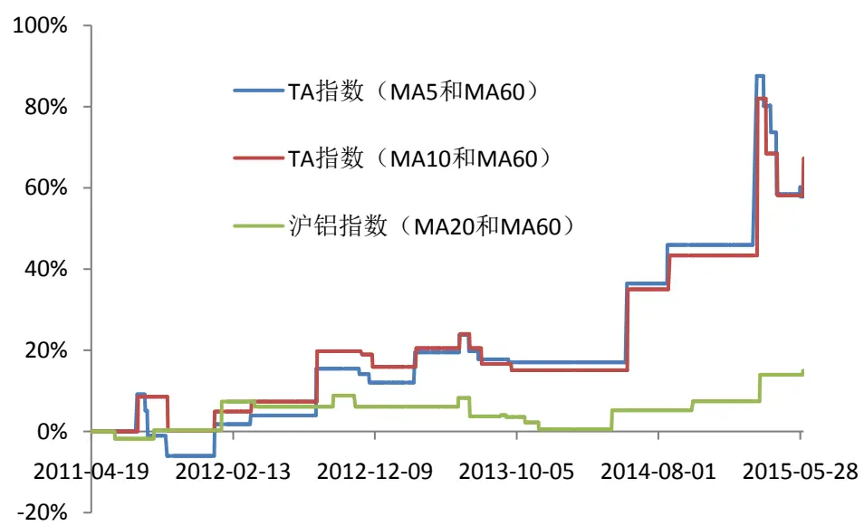
数据来源：wind资讯、广发发展研究中心

表 3：均线策略在样本外的测算结果

| 品种 | 均线参数1 |  | 均线参数2 年化收益率 | 最大回撤 | 收益回撤比 |
| --- | --- | --- | --- | --- | --- |
| TA 指数 | 5 | 60 | 12.01% | -15.84% | 0.76 |
| TA 指数 | 10 | 60 | 13.12% | -13.08% | 1.00 |
| 沪铝指数 | 20 | 60 | 3.40% | -7.62% | 0.45 |

数据来源：wind资讯、广发证券发展研究中心

图 9：均线策略在样本外的净值曲线
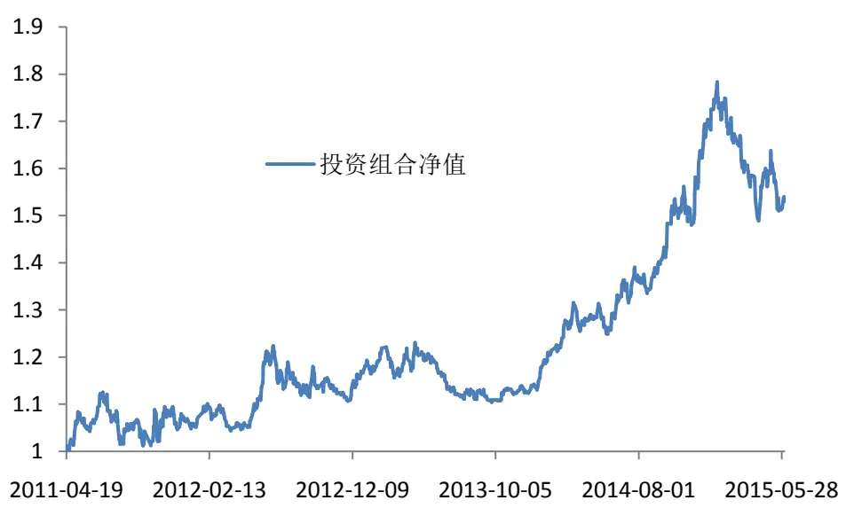
数据来源：wind资讯、广发发展研究中心

表 4：均线策略下的投资组合交易统计

| 累积收益率 |
| --- |
| 53.03% 年化收益率 10.75% |
| 最大回撤 -16.52% |

数据来源：wind资讯、广发证券发展研究中心

## 2、通道突破策略

如上文所述，通道突破策略即收盘价向上突破盘整通道做多，向下突破盘整通道做空。在实测中，收盘价高于前面 10 个交易日的最高价，则做多；低于前面 10个交易日的最低价，则做空。只有当出现新的开仓信号，才进行平仓；一旦开始交易，整个过程中一直持有仓位。

保证金比率：见表1；

品种选择：选择 2011年之前上市的商品期货品种；

时间区间：选取 2011 年 4 月 21 日至 2015 年 6 月 4 日共 1000 个交易日。其中前 500个交易日为样本内区间，后 500个交易日为样本外区间；

表 5给出了均线策略在样本内的测算结果（按收益回撤比排序前 10）。因此，选择豆粕指数、豆二指数、沪胶指数构建组合，进行样本外的测算。

样本外的测算结果如图10和表6所示。可以看到，几个品种在样本外基本保持着正收益，但沪胶指数在2014年底开始出现了一个很大的回撤。然而，通过多个品种分散投资，投资组合的总体回撤并不大，仅为11.89%。投资组合的净值曲线和交易统计分别如图 11和表7所示。

表 5：通道突破策略在样本内的测算结果

| 品种 | 年化收益率 | 最大回撤 | 收益回撤比 |
| --- | --- | --- | --- |
| 豆粕指数 | 37.51% | -2.44% | 15.38 |
| 豆二指数 | 18.59% | -4.10% | 4.54 |
| 沪胶指数 | 28.69% | -9.47% | 3.03 |
| 豆油指数 | 11.71% | -4.13% | 2.83 |
| 焦炭指数 | 24.57% | -12.35% | 1.99 |
| 塑料指数 | 14.27% | -9.22% | 1.55 |
| 螺纹指数 | 16.00% | -14.95% | 1.07 |
| 沪金指数 | 13.58% | -14.52% | 0.94 |
| 连豆指数 | 5.86% | -7.78% | 0.75 |
| 玉米指数 | 7.24% | -9.84% | 0.74 |

数据来源：wind资讯、广发证券发展研究中心

图 10：通道突破策略在样本外的累积收益率
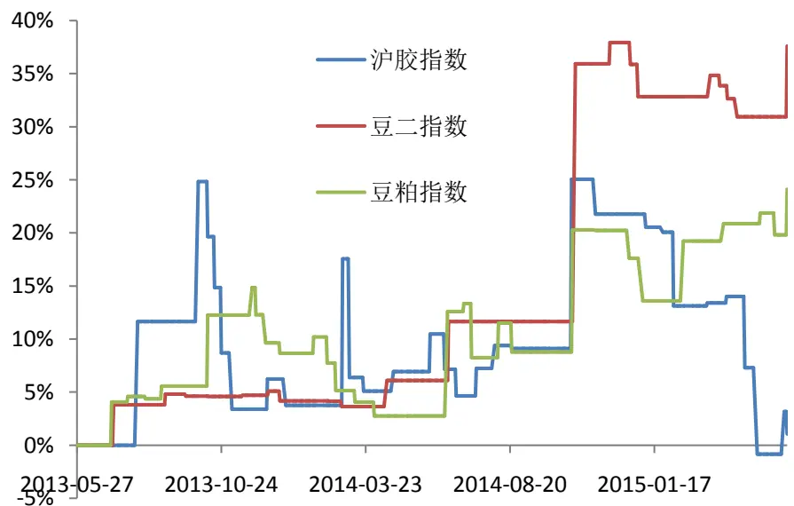
数据来源：wind资讯、广发发展研究中心

表 6：通道突破策略在样本外的测算结果

| 品种 | 年化收益率 | 最大回撤 | 收益回撤比 |
| --- | --- | --- | --- |
| 豆粕指数 | 11.11% | -10.54% | 1.05 |
| 豆二指数 | 16.85% | -5.06% | 3.33 |
| 沪胶指数 | 0.52% | -20.69% | 0.03 |

数据来源：wind资讯、广发证券发展研究中心

图 11：通道突破策略在样本外的净值曲线
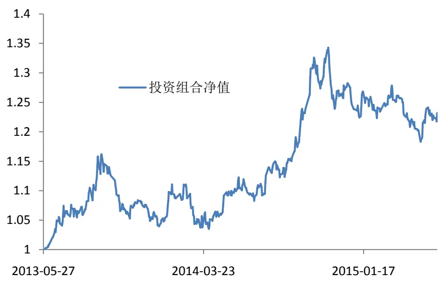
数据来源：wind资讯、广发发展研究中心

表 7：通道突破策略下的投资组合交易统计

| 累积收益率 |
| --- |
| 23.21% 年化收益率 10.74% |
| 最大回撤 -11.89% |

数据来源：wind资讯、广发证券发展研究中心

## 3、Aberration 策略

如上文所述，Aberration 策略是依据布林线进行交易：突破布林线上轨做多，突破布林线下轨做空，回到布林线中轨平仓。在实证中，我们沿用传统的Aberration策略布林线参数，即为 MA30±2个标准差。

保证金比率：见表 1；

品种选择：选择2007年之前上市的商品期货品种；

时间区间：选取 2007 年 3 月 14 日至 2015 年 6 月 4 日共 2000 个交易日。其中

识别风险，发现价值

前 1000个交易日为样本内区间，后1000个交易日为样本外区间；

表 8 给出了 Aberration 策略在样本内的测算结果（按收益回撤比排序前 10）。根据测算结果，选择 TA指数、郑棉指数、沪胶指数构建投资组合，进行样本外的测算。

样本外的测算结果如图12和表9所示，而投资组合的净值曲线和交易统计分别如图 13和表10所示。可以看到，Aberration策略的净值基本上呈现每个年度平稳上升的趋势，年化收益率为 9.80%，而最大回撤为-12.49%。

表 8：Aberration 策略在样本内的测算结果

| 品种 | 年化收益率 | 最大回撤 | 收益回撤比 |
| --- | --- | --- | --- |
| TA 指数 | 39.11% | -4.47% | 8.74 |
| 郑棉指数 | 18.95% | -7.48% | 2.53 |
| 沪胶指数 | 26.80% | -11.94% | 2.25 |
| 沪铝指数 | 13.56% | -8.13% | 1.67 |
| 豆油指数 | 19.91% | -14.37% | 1.39 |
| 燃油指数 | 11.92% | -13.84% | 0.86 |
| 玉米指数 | 7.18% | -8.51% | 0.84 |
| 沪铜指数 | 17.01% | -21.51% | 0.79 |
| 郑糖指数 | 9.02% | -20.31% | 0.44 |
| 豆二指数 | 2.89% | -23.03% | 0.13 |

数据来源：wind资讯、广发证券发展研究中心

图 12：Aberration 策略在样本外的累积收益率
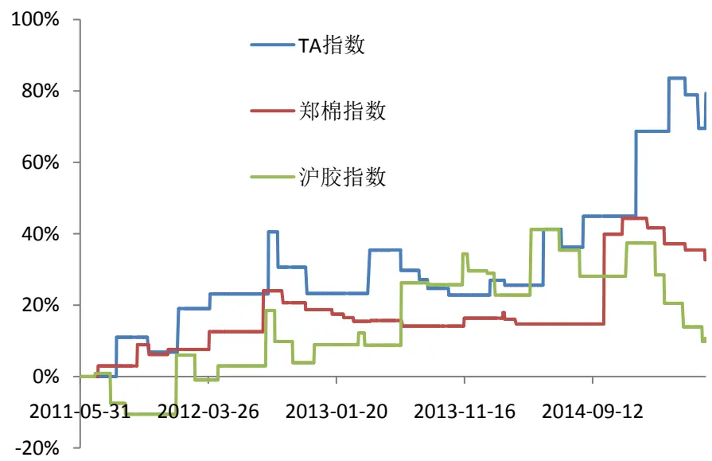
数据来源：wind资讯、广发发展研究中心

表 9：Aberration 策略在样本外的测算结果

| 品种 | 年化收益率 | 最大回撤 | 收益回撤比 |
| --- | --- | --- | --- |
| TA 指数 | 15.64 | -12.41% | 1.26 |
| 郑棉指数 | 7.35% | -7.96% | 0.92 |
| 沪胶指数 | 2.68% | -22.14% | 0.12 |

数据来源：wind资讯、广发证券发展研究中心

图 13：Aberration 策略在样本外的净值曲线
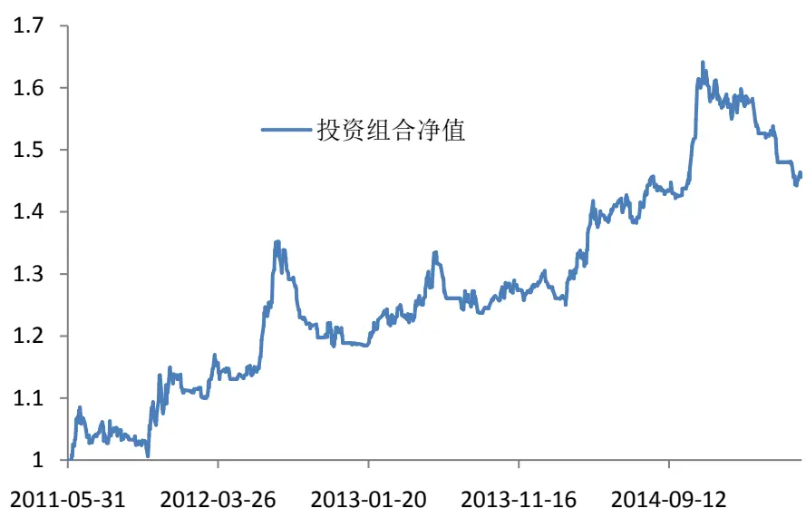
数据来源：wind资讯、广发发展研究中心

表 10：Aberration 策略下的投资组合交易统计

| 累积收益率 |
| --- |
| 45.95% 年化收益率 9.80% |
| 最大回撤 -12.49% |

数据来源：wind资讯、广发证券发展研究中心

## 4、LLT趋势线择时策略

在我们前期的报告《低延迟趋势线与交易性择时》中，我们介绍了一种判断趋势的工具——LLT低延时趋势线，并在华夏上证50ETF、易方达深 100ETF、华安上证180ETF 和华泰柏瑞沪深300ETF上做了实证研究，并得出了满意的结果。LLT的计算公式为

$$
\begin{aligned}&LLT(T)=\left\{\begin{aligned}\\&p(T),\;0{<}T<2\\&(\alpha-\alpha^{2}/4)*p(T)+(\alpha^{2}/2)*p(T-1)\\&-(\alpha-3\alpha^{2}/4)*p(T-2)+2(1-\alpha)*LLT(T-1)\\&-(1-\alpha)^{2}*LLT(T-2),\;T\geq2\\&\end{aligned}\right.\\\end{aligned}\tag{1}
$$

$$
\alpha=\frac{2}{d+1}\tag{2}
$$

其中 d是均线的时间参数，p(T)是第T 日的收盘价。

这里，我们将LLT低延时趋势线用于商品期货的交易上，交易策略为：根据每日收盘价计算 LLT趋势线的斜率，若斜率大于0 则认为市场处于多头趋势，此时开多仓；若斜率大于 0则认为市场处于空头趋势，此时开空仓。只有当多空信号发生变化时，才进行平仓操作。

在实证中，我们在样本内遍历 d=10,20，…，240 共 24 种情况，同时考虑收益回撤比和参数稳定性选出最佳的 3 个品种，并在样本外测算。

保证金比率：见表1；

品种选择：选择2007年之前上市的商品期货品种；

时间区间：选取 2007 年 3 月 14 日至 2015 年 6 月 4 日共 2000 个交易日。其中前 1000个交易日为样本内区间，后1000个交易日为样本外区间；

表 11 给出了 LLT 趋势线择时策略在样本内的测算结果（按 24 个参数下的收益回撤比平均值排序前 10）。TA 指数、沪胶指数、郑棉指数在 24个参数下的收益回撤比如图 14 所示。可以看到，这三个品种在各个参数下都能保持较高的收益回撤比。剔除过大或者过小的参数值，并考虑参数的稳定性，TA 指数、沪胶指数、郑棉指数分别选取 LLT参数50、70、190，从而构建组合在样本外进行测算。测算结果详见图15 及表12。投资组合的净值曲线和交易统计分别如图16和表13 所示。

表 11：LLT 趋势线择时策略在样本内的测算结果

| 品种 | 收益回撤比平均值 |
| --- | --- |
| TA 指数 | 3.47 |
| 沪胶指数 | 2.80 |
| 郑棉指数 | 2.57 |
| 玉米指数 | 1.83 |
| 燃油指数 | 1.70 |
| 沪铝指数 | 1.29 |
| 郑糖指数 | 1.13 |
| 豆油指数 | 0.88 |
| 沪铜指数 | 0.85 |
| 豆二指数 | 0.43 |

数据来源：wind资讯、广发证券发展研究中心

图 14：LLT 趋势线择时策略在不同参数下的收益回撤比
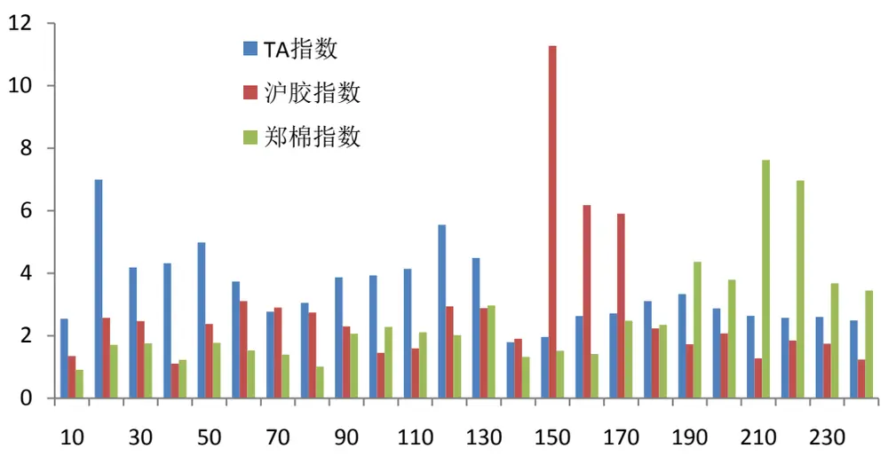
数据来源：wind资讯、广发发展研究中心

图 15：LLT 趋势线择时策略在样本外的累积收益率
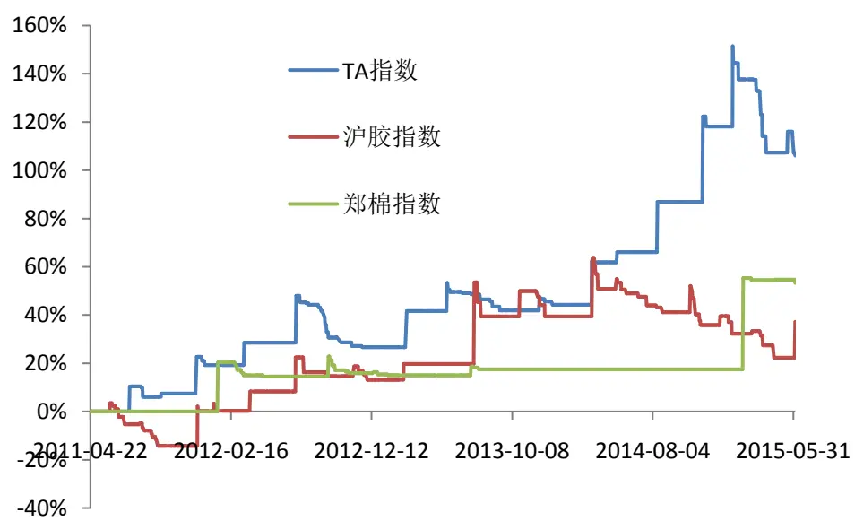
数据来源：wind资讯、广发发展研究中心

表 12：Aberration 策略在样本外的测算结果

| 品种 | 年化收益率 | 最大回撤 | 收益回撤比 |
| --- | --- | --- | --- |
| TA 指数 | 18.97% | -18.3% | 1.04 |
| 郑棉指数 | 10.81% | -6.73% | 1.61 |
| 沪胶指数 | 7.9% | -25.1% | 0.31 |

数据来源：wind资讯、广发证券发展研究中心

图 16：LLT 趋势线择时策略在样本外的净值曲线
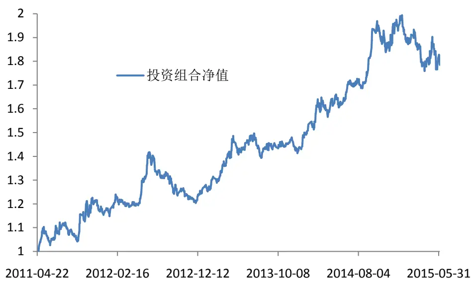
数据来源：wind资讯、广发发展研究中心

表 13：LLT 趋势线择时策略下的投资组合交易统计

| 累积收益率 78.55% |
| --- |
| 年化收益率 14.97% |
| 最大回撤 -15.04% |

数据来源：wind资讯、广发证券发展研究中心

## 四、总结

本篇报告对海内外的商品期货交易情况做了一个综述。首先，我们介绍海外和国内的商品期货量化对冲基金。商品期货的投资已在海外对冲基金中占重要地位，在国内也逐渐引起投资者的注意和重视。随后，我们系统地介绍了商品期货的几种交易策略，包括套利策略、短线投机策略和中长线趋势策略。我们罗列了可供套利的海外期货交易市场以及可供套利的期货品种，又使用国内的商品期货数据对中长线交易策略做了实证研究。

我们研究发现，商品期货是一个不容忽视的市场。一方面，商品期货与股票市场相关性较低，是分散投资的良好标的。在股票市场出现“黑天鹅”时，商品期货或能起到分散风险、降低回撤的效果。另一方面，商品期货品种繁多，通过多品种投资，同样能起到降低风险的作用。

## 风险提示

本篇报告通过历史数据进行建模与实证，得到良好的回测效果。但由于市场具有不确定性，交易模型仅在统计意义下有望获得良好投资效果，敬请广大投资者注意模型单次失效的风险。

## Table_RatingIndustry 广发证券—行业投资评级说明

买入： 预期未来 12 个月内，股价表现强于大盘 10%以上。

持有： 预期未来12个月内，股价相对大盘的变动幅度介于-10%～+10%。

卖出： 预期未来12个月内，股价表现弱于大盘10%以上。

## Table_RatingCompany 广发证券—公司投资评级说明

买入： 预期未来12个月内，股价表现强于大盘15%以上。

谨慎增持： 预期未来12个月内，股价表现强于大盘5%-15%。

持有： 预期未来12个月内，股价相对大盘的变动幅度介于-5%～+5%。

卖出： 预期未来12个月内，股价表现弱于大盘5%以上。

## Table_Ad联系我们

| 地址 | 广州市 广州市天河北路183号 | 深圳市 深圳市福田区金田路4018 | 北京市 | 上海市 |
| --- | --- | --- | --- | --- |
|  | 大都会广场5楼 | 号安联大厦 15 楼 A 座 03-04 | 北京市西城区月坛北街2号 月坛大厦18层 | 上海市浦东新区富城路99号 震旦大厦18楼 |
| 邮政编码 | 510075 | 518026 | 100045 | 200120 |
| 客服邮箱 | gfyf@gf.com.cn |  |  |  |
| 服务热线 | 020-87555888-8612 |  |  |  |

## Table_Disclaimer 免 责声 明

广发证券股份有限公司具备证券投资咨询业务资格。本报告只发送给广发证券重点客户，不对外公开发布。

本报告所载资料的来源及观点的出处皆被广发证券股份有限公司认为可靠，但广发证券不对其准确性或完整性做出任何保证。报告内容仅供参考，报告中的信息或所表达观点不构成所涉证券买卖的出价或询价。广发证券不对因使用本报告的内容而引致的损失承担任何责任，除非法律法规有明确规定。客户不应以本报告取代其独立判断或仅根据本报告做出决策。

广发证券可发出其它与本报告所载信息不一致及有不同结论的报告。本报告反映研究人员的不同观点、见解及分析方法，并不代表广发证券或其附属机构的立场。报告所载资料、意见及推测仅反映研究人员于发出本报告当日的判断，可随时更改且不予通告。

本报告旨在发送给广发证券的特定客户及其它专业人士。未经广发证券事先书面许可，任何机构或个人不得以任何形式翻版、复制、刊登、转载和引用，否则由此造成的一切不良后果及法律责任由私自翻版、复制、刊登、转载和引用者承担。