## 探寻股指期货跨品种的最优组合

张超 S0260514070002

广发证券金融工程

2015年8月30日

02 Ⅱ

03 Ⅲ

04 N

策略基本思想

模型介绍

实证分析

总结

## 01

## 策略基本思想

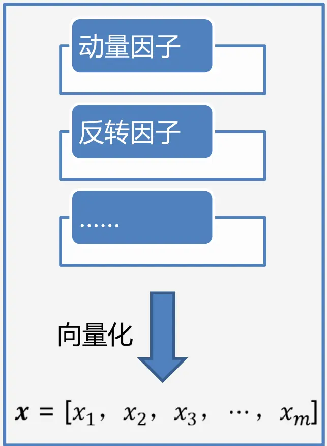
已知

预测函数f(x)

## 目标：建立预测模型，通过预测下一时刻涨跌幅来盈利

收益率

未知

沪深300收益率r2

中证500收益率r3

当日指数涨跌幅

次日收益率

## 预测指数涨跌幅？

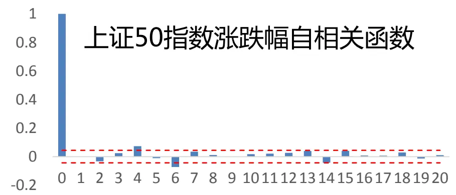

corr(x, r) = -0.0025

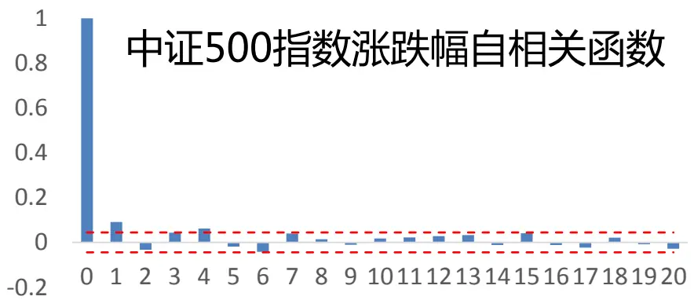

$$
\mathsf{corr}(x,r)=0.0912
$$

## 预测指数收益率之差？

当日涨跌幅之差 x = x1− x2

次日涨跌幅之差 y = r1 − r2

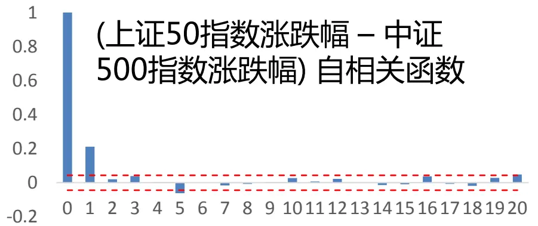

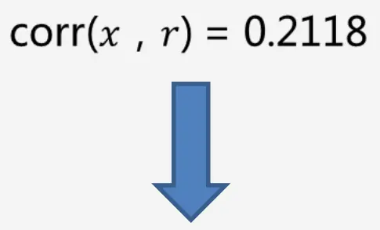

收益率之差的预测比单个指数收益率的预测要“简单

## 上证50-中证500跨品种交易策略

上一时间单位大盘股优于小盘股
(上证50涨幅－中证500涨幅>0)
做多上证50股指期货
做空中证500股指期货
上一时间单位小盘股优于大盘股
(上证50涨幅－ 中证500涨幅 < 0)
做空上证50股指期货
做多中证500股指期货

《另类交易策略系列之二十二：风格动量下的股指期货跨品种套利策略》《另类交易策略系列之二十四：观日内趋势，察行业轮动，品风格套利》

## 2015年4月16日，IC、IH股指期货上市以来的累积收益曲线

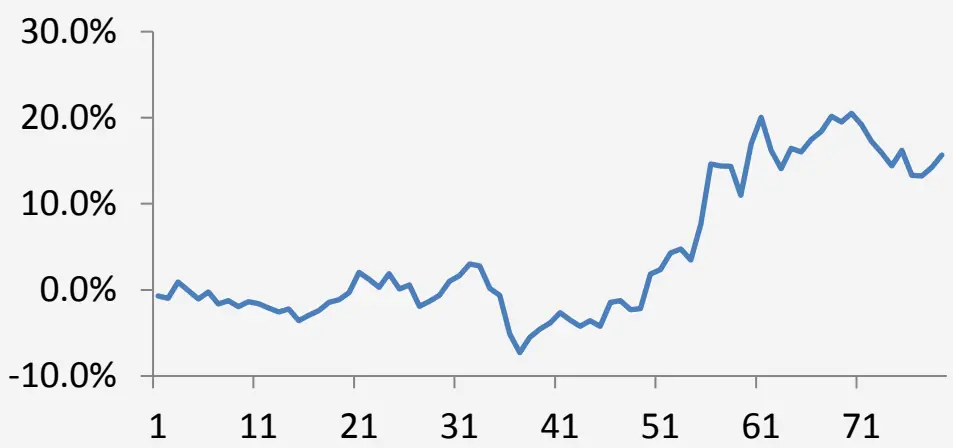

2015年4月16日-8月7日

| 总交易次数 | 79 | 盈利次数 | 42 |
| --- | --- | --- | --- |
| 累积收益率 | 15.67% | 亏损次数 | 37 |
| 成功率 | 53.16% | 平均盈利率 | 1.46% |
| 最大回撤 | -6.70% | 平均亏损率 | -1.23% |

## 问题：

- 跨品种套利的组合是否是最“好”预测的一种组合？

- 是否可以寻找到股指期货之间的一种“最优组合”？

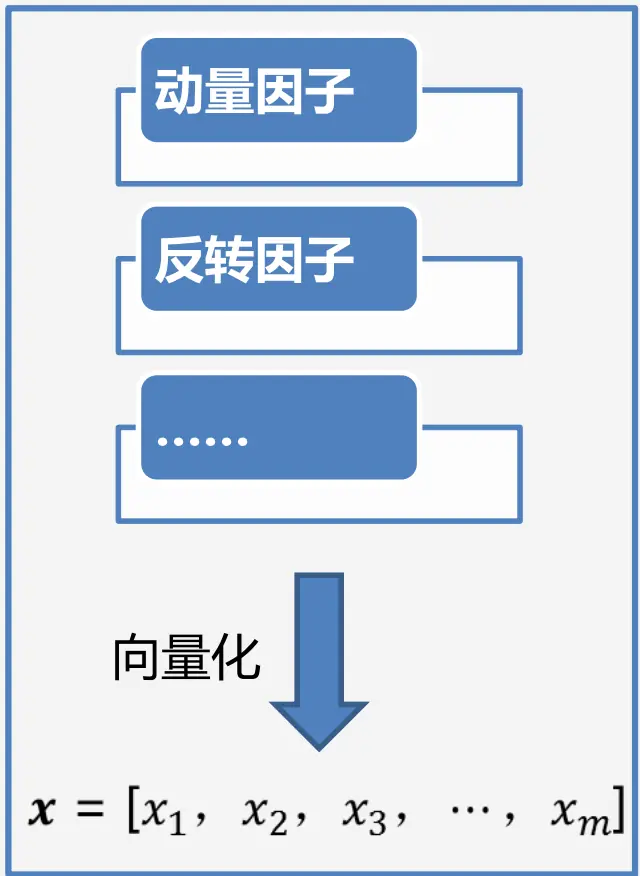
已知

预测函数f(x)

组合收益率

$$
y=wr^{T}
$$

最大化两者的相关性

向量化

$$
\boldsymbol{r}=[r_{1},r_{2},r_{3}]
$$

权重分配 w = [W1,W2,W3]

未知

## 交易策略

通过已知的因子值x，获得预测函数 $f({\pmb x})=v{\pmb x}^{T}$

若 $f(x)>0$ ，则做多组合，收益率 $PL=\boldsymbol{w}\boldsymbol{r}^{T}$

若 $f(x)<0$ ，则做空组合，收益率 $PL=-wr^{T}$

## 1、组合的权重如何分配？

$$
\pmb{w}=[w_{1},~w_{2},~w_{3}]
$$

满足 $|w_{1}|+|w_{2}|+|w_{3}|=1$ ，即总的资金量为1。

例如： $w_{1}=0.5,w_{2}=0,w_{3}=-0.5$

即为风格套利策略中多上证50指数，空中证500指数的组合。

此处， $w_{1}+w_{2}+w_{3}=0$ ，表示多头和空头资金量完全相等，没有单边头寸。

## 2、预测函数 f(x)如何选取？

目标：寻找到某一个函数 f(x)，最大化 f(x) 和 y 的相关性

3、有哪些因子是有效的？

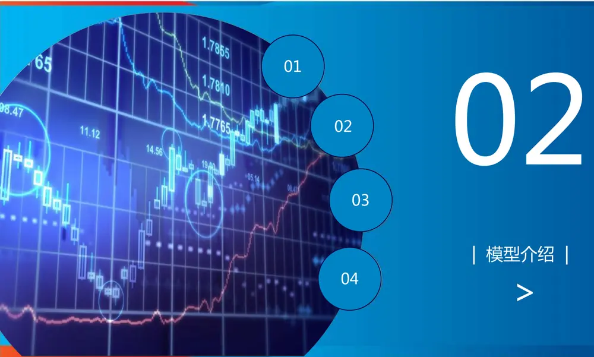

## 方法1：

根据市场经验，给定资产组合，如 $\pmb{w}=[0.5,\quad0,\quad-0.5]$

风格套利策略中多50，空500的组合

根据预测模型，选择做多或者做空该组合

通过预测因子x，建立预测函数

线性预测函数 $f(\boldsymbol{x})=\boldsymbol{v}\boldsymbol{x}^{T}=v_{1}x_{1}+v_{2}x_{2}+\cdots+v_{m}x_{m}$

回归方程 y = f(x)

估计模型参数v

## 方法1面临的两个问题：

1、需要“市场经验”来给定适当的资产组合。

2、该组合是否是“最优”的？

## 方法2：

在线性预测模型的条件下，预测模型f(x)的参数估计和“资产组合” $y=wr^{T}$ 系数的确定是可以同时完成的。

向量化预测因子 $\boldsymbol{x}=\left[x_{1},\quad x_{2},\quad x_{3},\quad\cdots,\quad x_{m}\right]$

权重向量

$$
\boldsymbol{v}=[v_{1},\quad v_{2},\quad v_{3},\quad\cdots,\quad v_{m}]
$$

预测模型可以表示为因子向量的一个线性组合 $f(\boldsymbol{x})=\boldsymbol{v}\boldsymbol{x}^T=v_1x_1+v_2x_2+\cdots+v_mx_m$

目标: $\operatorname*{max}_{w,v}corr(f(\pmb{x}),y)=\operatorname*{max}_{w,v}corr(\;\pmb{v}\pmb{x}^{T},\;\pmb{w}\pmb{r}^{T})$

## 目标函数

$$
\operatorname*{max}_{w,v}corr(\;vx^{T},\;wr^{T})
$$

通过求解上述优化问题，获得预测函数的权重ν以及组合权重w

上述问题是一个“典型相关分析”（Canonical Correlation Analysis，CCA）模型求解“典型变量”的问题

获得的“资产组合” $y=wr^{T}$ 是与预测因子x的所有可能线性组合的相关性最强的一个组合。

目标函数 $\operatorname*{max}_{w,v}corr(\;vx^{T},\;wr^{T})$

CCA模型的矩阵化求解方法：

从历史数据获得x 和r的协方差矩阵 $\Sigma_{xx}\mathrm{~,~}\Sigma_{rr}$ 和互协方差矩阵 $\Sigma_{xr},\Sigma_{rx}$

记 $\boldsymbol{A}=\begin{bmatrix}0&\varSigma_{xr}\\\varSigma_{rx}&0\end{bmatrix},\boldsymbol{B}=\begin{bmatrix}\varSigma_{xx}&0\\0&\varSigma_{rr}\end{bmatrix},$

则组合向量 $\boldsymbol{u}=[\boldsymbol{v}\quad\boldsymbol{w}]$ 为矩阵 $B^{-1}A$ 最大特征值对应的特征向量

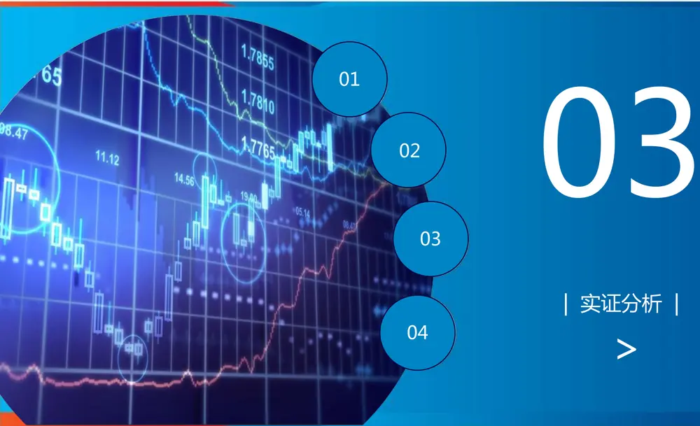

上证50指数、沪深300指数、中证500指数现货行情：

2007年1月至2015年7月

日频交易操作：收盘时建仓，持有到下一个交易日收盘

交易成本：双边2%%

因子筛选区间

回测区间

挑选因子

回测

候选因子

2007

2008

2009

2010

2011

动量因子：涨跌幅

评价指标

反转因子：日内最高价，日内最低价

IC，IR，….

成交量因子：成交量，资金流

## 根据2007-2009年行情挑选出来的因子

|  | average(IC) | IR | 方向 |
| --- | --- | --- | --- |
| 当日指数涨跌幅 | 0.159 | 0.186 | 正向 |
| 当日最高价 | -0.134 | -0.161 | 负向 |
| 当日最低价 | -0.136 | -0.163 | 负向 |
| 当日高频资金流 | 0.144 | 0.181 | 正向 |

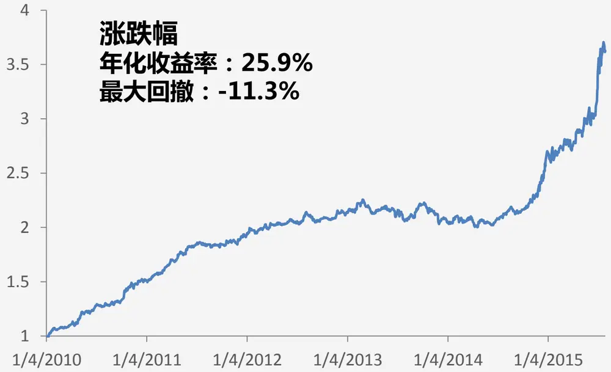

50指数当日涨跌幅> 500指数当日涨跌幅

50指数当日涨跌幅< 500指数当日涨跌幅

做多50指数，做空500指数做空50指数，做多500指数

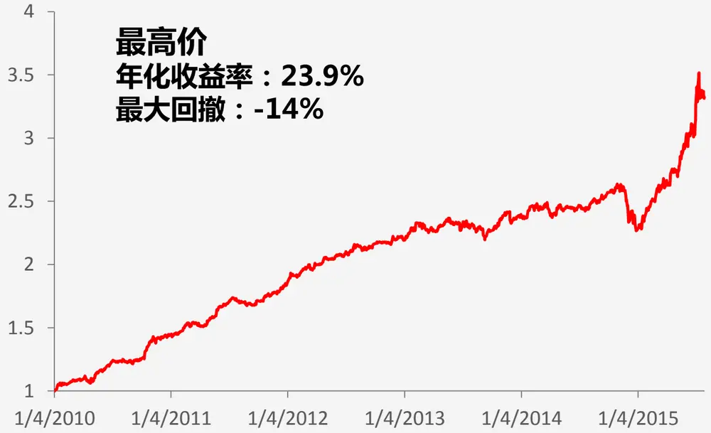

## 指标标准化：当日最高价当日收盘价

50指数当日最高价>500指数当日最高价

50指数当日最高价 < 500指数当日最高价

做空50指数，做多500指数

做多50指数，做空500指数

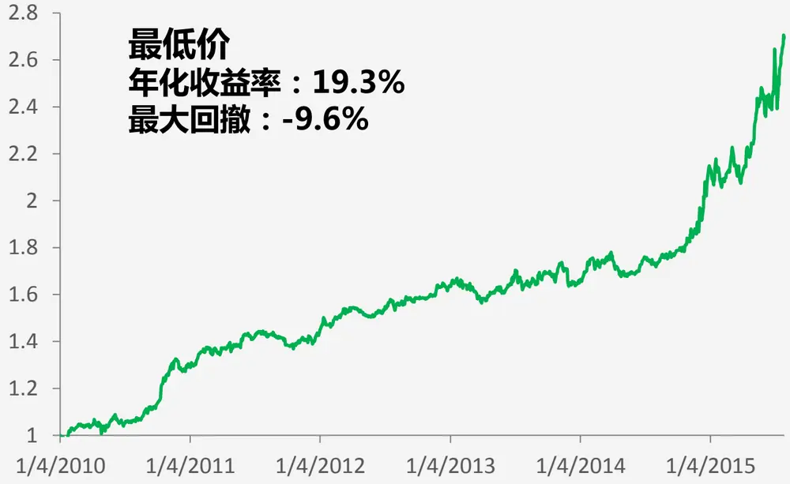

## 指标标准化：当日最低价当日收盘价

50指数当日最低价> 500指数当日最低价

做空50指数，做多500指数

50指数当日最低价 < 500指数当日最低价

做多50指数，做空500指数

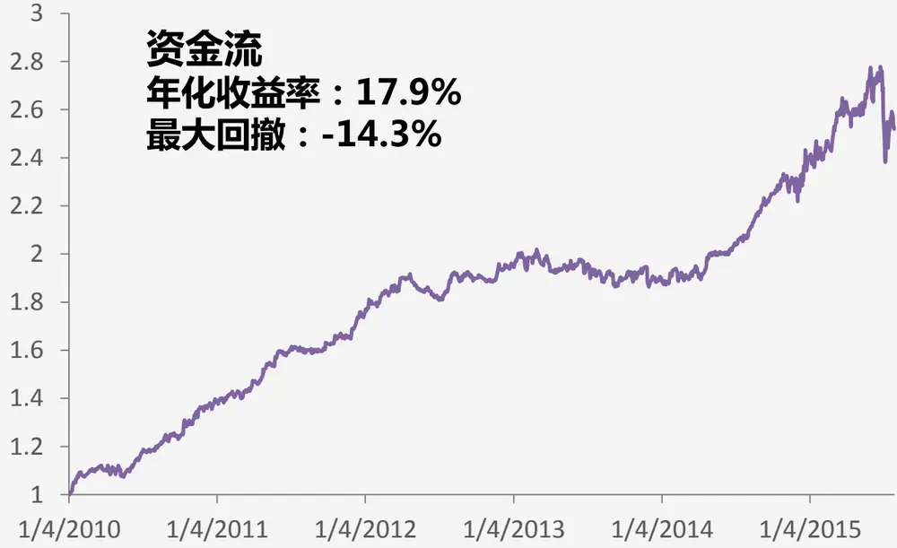

50指数当日资金流>500指数当日资金流

资金流指标MF的计算
记第T分钟内成交金额为
M(T)，1、如果指数上涨，则MF:=MF+M(T) ;
2、如果指数下跌，则
MF:=MF-M(T)。

50指数当日资金流< 500指数当日资金流

## 指标标准化：当日MF当日总成交金额

做多50指数，做空500指数做空50指数，做多500指数

## 根据每个预测因子确定一个“组合”，然后将不同预测因子的组合综合起来。

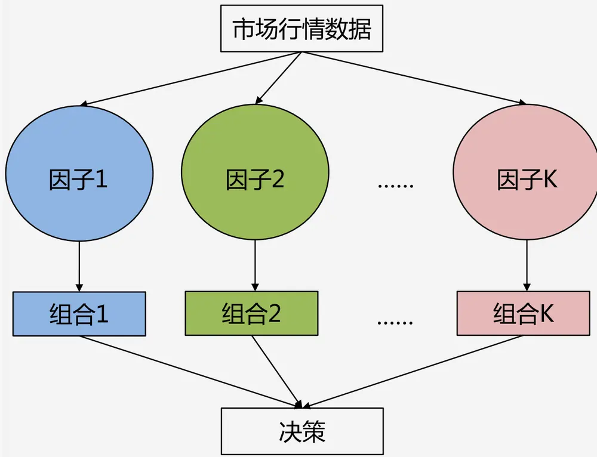

因子综合打分示例

| 因子 | 50占比 | 500占比 | 闲置资金 |
| --- | --- | --- | --- |
| 涨跌幅 | 0.5 | -0.5 | 0 |
| 最高价 | 0.5 | -0.5 | 0 |
| 最低价 | -0.5 | 0.5 | 0 |
| 资金流 | 0.5 | -0.5 | 0 |
| 综合决策 | 0.25 | -0.25 | 0.5 |

根据不同因子的打分，实现资金管理和仓位控制。

分年度收益率

| 因子 | 涨跌幅 | 最高价 | 最低价 | 资金流 | 多因子 |
| --- | --- | --- | --- | --- | --- |
| 2010 | 51.6% | 44.1% | 29.7% | 39.5% | 43.1% |
| 2011 | 26.1% | 27.3% | 9.9% | 24.5% | 23.7% |
| 2012 | 12.0% | 19.5% | 14.8% | 12.3% | 16.5% |
| 2013 | -4.3% | 9.0% | 0.7% | -2.9% | 2.2% |
| 2014 | 31.9% | -4.8% | 30.4% | 26.3% | 22.1% |
| 2015 | 34.2% | 46.4% | 25.3% | 5.3% | 28.8% |
| 年化收益率 | 25.9% | 23.9% | 19.3% | 17.9% | 23.8% |

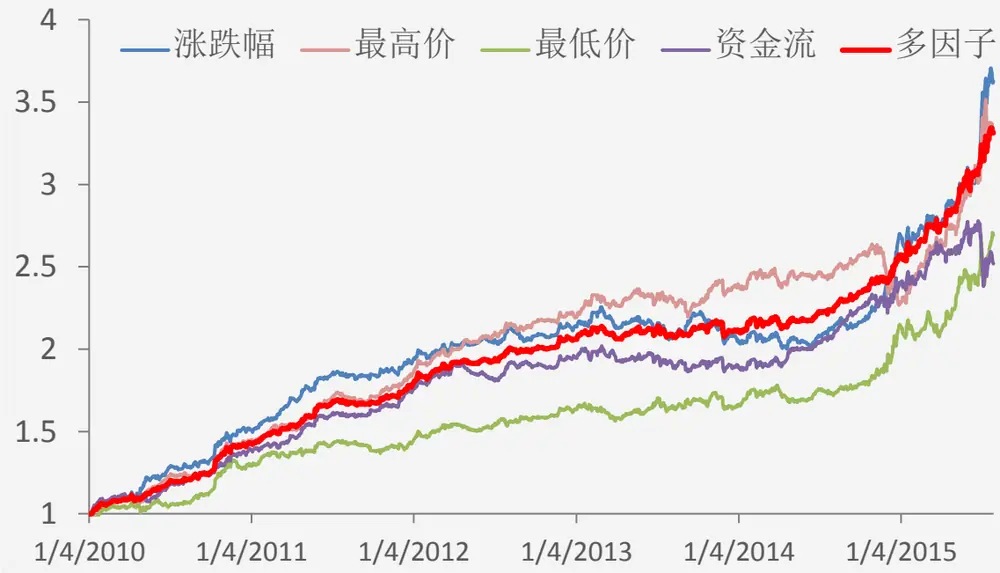

分年度最大回撤

| 因子 | 涨跌幅 | 最高价 | 最低价 | 资金流 | 多因子 |
| --- | --- | --- | --- | --- | --- |
| 2010 | -3.6% | -5.1% | -5.7% | -4.3% | -3.2% |
| 2011 | -2.6% | -3.6% | -5.3% | -2.2% | -2.0% |
| 2012 | -4.4% | -2.3% | -2.9% | -5.7% | -2.1% |
| 2013 | -10.0% | -7.2% | -6.4% | -7.7% | -4.5% |
| 2014 | -5.0% | -14.0% | -5.8% | -4.9% | -3.2% |
| 2015 | -5.2% | -5.8% | -9.6% | -14.3% | -3.9% |
| 最大回撤 | -11.3% | -14.0% | -9.6% | -14.3% | -4.5% |

信息比和收益回撤比

| 因子 | 涨跌幅 | 最高价 | 最低价 | 资金流 | 多因子 |
| --- | --- | --- | --- | --- | --- |
| 胜率 | 55.6% | 58.0% | 55.8% | 56.9% | 59.5% |
| 夏普比率 | 2.29 | 2.13 | 1.77 | 1.65 | 3.12 |
| 年化收益回撤比 | 2.29 | 1.70 | 2.02 | 1.25 | 5.27 |

涨跌幅之差

预测函数

风格套利组合

$$
f({\pmb x})={\pmb v}{\pmb x}^{T}
$$

$$
y=wr^{T}
$$

最高价之差

沪深300收益率 $r2$

最低价之差

$$
\pmb{w}=[0.5,\quad0,\quad-0.5]
$$

中证500收益率 $r3$

资金流之差

预测函数：

$f({\pmb x})=v_{1}\times$ (50涨跌幅-500涨跌幅) $+\boldsymbol{v}_{2}\times$ （50最高价-500最高价）+

$v_{3}\times$ (50最低价-500最低价) $+\boldsymbol{v}_{4}\times$ (50资金流-500资金流）

套利组合收益率：

$y=0.5\times$ (50次日收益率-500次日收益率)

## 模型训练样本：扩展窗口模式和固定窗口模式

固定窗口模式：根据2007-2009数据，计算样本外的回归系数ν

扩展窗口模式：根据2007-上一个交易日的数据，计算当前的回归系数υ

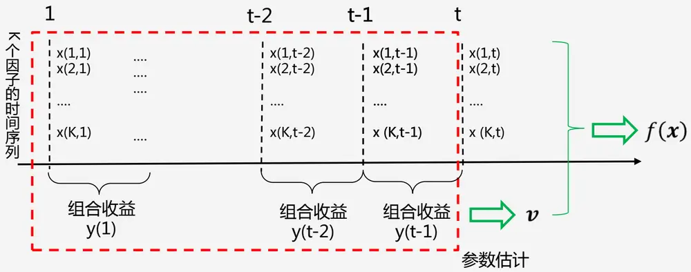

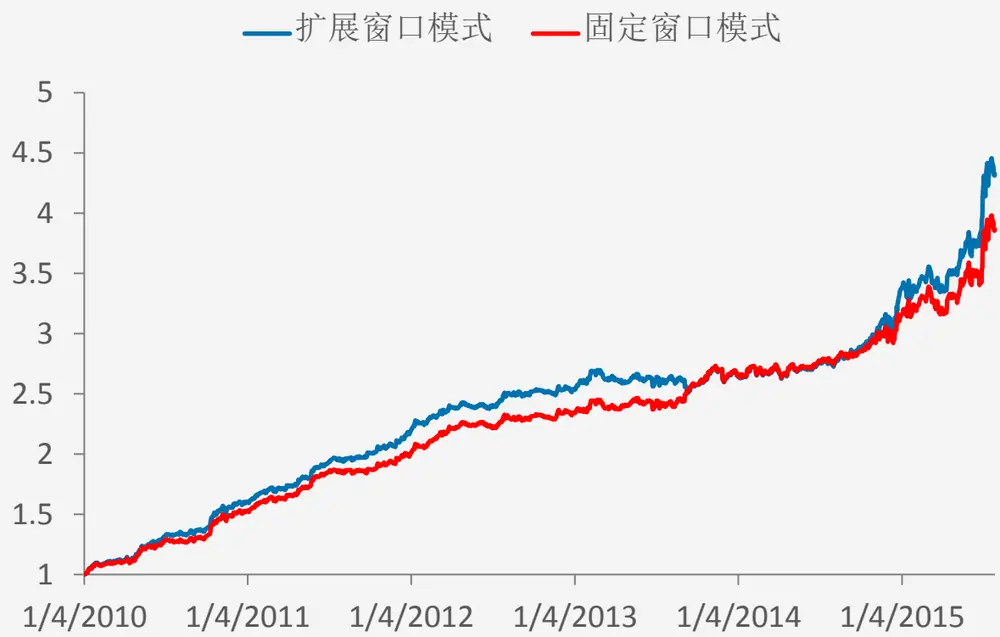

分年度表现

|  | 收益率 |  | 最大回撤 |  |
| --- | --- | --- | --- | --- |
|  | 扩展窗口模式 | 固定窗口模式 | 扩展窗口模式 | 固定窗口模式 |
| 2010 | 59.6% | 52.3% | -3.6% | -3.6% |
| 2011 | 35.6% | 29.9% | -2.2% | -2.2% |
| 2012 | 17.4% | 18.5% | -2.2% | -2.2% |
| 2013 | 4.4% | 13.3% | -7.0% | -4.8% |
| 2014 | 26.8% | 18.2% | -4.4% | -4.4% |
| 2015 | 28.7% | 23.1% | -5.9% | -6.8% |

策略性能表现

|  | 扩展窗口模式 | 固定窗口模式 |
| --- | --- | --- |
| 年化收益率 | 29.9% | 27.3% |
| 最大回撤 | -7.0% | -6.8% |
| 夏普比率 | 2.61 | 2.41 |
| 年化收益回撤比 | 4.25 | 4.02 |
| 胜率 | 58.7% | 58.1% |

$$
\operatorname*{max}_{w,v}corr(vx^{T},wr^{T})
$$

涨跌幅因子

预测函数

“最优组合”

$$
f({\pmb x})={\pmb v}{\pmb x}^{T}
$$

$$
y=wr^{T}
$$

最高价因子

沪深300收益率r2

最低价因子

资金流因子

中证500收益率r3

模型训练样本：扩展窗口模式和固定窗口模式

扩展窗口模式：根据2007-上一个交易日的数据，计算当前的权重向量ν和w

固定窗口模式：根据2007-2009数据，计算样本外的权重向量ν和w

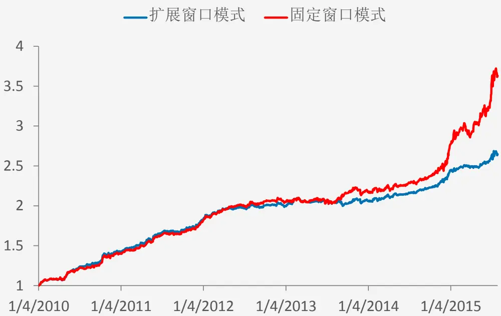

分年度表现

|  | 收益率 |  | 最大回撤 |  |
| --- | --- | --- | --- | --- |
|  | 扩展窗口模式 | 固定窗口模式 | 扩展窗口模式 | 固定窗口模式 |
| 2010 | 42.2% | 39.9% | -3.2% | -3.2% |
| 2011 | 27.7% | 28.4% | -1.4% | -1.5% |
| 2012 | 10.1% | 14.3% | -2.8% | -3.1% |
| 2013 | 3.1% | 5.9% | -4.8% | -4.3% |
| 2014 | 18.6% | 27.1% | -2.0% | -3.5% |
| 2015 | 8.3% | 31.5% | -2.4% | -5.9% |

策略性能表现

|  | 扩展窗口模式 | 固定窗口模式 |
| --- | --- | --- |
| 年化收益率 | 19.0% | 25.9% |
| 最大回撤 | -4.8% | -5.9% |
| 夏普比率 | 2.78 | 2.71 |
| 年化收益回撤比 | 3.94 | 4.37 |
| 胜率 | 58.5% | 58.0% |

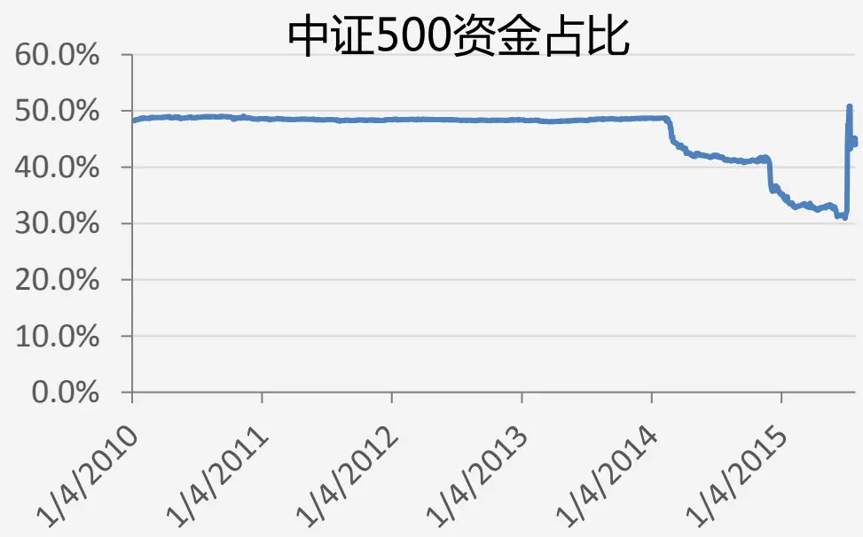

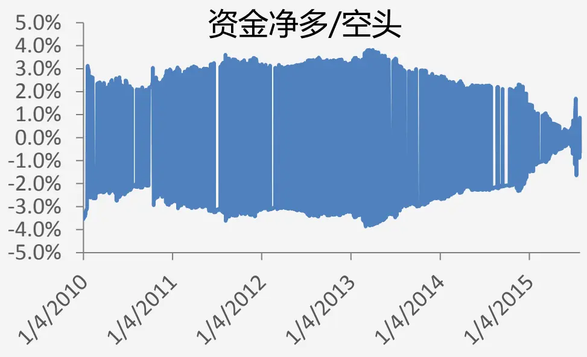

大部分时间，中证500的资金占比约为50%

资金净多头和净空头一般不超过3%

做多和做空的资金量基本上完全对等

不同策略表现的综合比较

|  | 50-500线性回归模型 |  | CCA模型 |  | 50-500多因子模型 |
| --- | --- | --- | --- | --- | --- |
|  | 扩展建模样本固 | 定建模样本 | 扩展建模样本固 | 定建模样本 |  |
| 年化收益率 | 29.9% | 27.3% | 19.0% | 25.9% | 23.8% |
| 最大回撤 | -7.0% | -6.8% | -4.8% | -5.9% | -4.5% |
| 夏普比率 | 2.61 | 2.41 | 2.78 | 2.71 | 3.12 |
| 年化收益回撤比 | 4.25 | 4.02 | 3.94 | 4.37 | 5.27 |
| 胜率 | 58.7% | 58.1% | 58.5% | 58.0% | 59.5% |

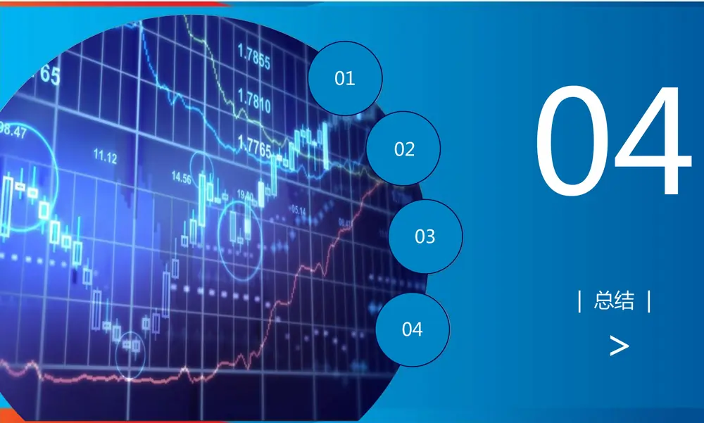

V考虑不同因子的叠加时，可以通过类似“多因子模型”的方式来进行因子综合打分，也可以建立回归模型进行预测。

V不加入市场的“先验知识”，直接采取CCA模型来进行分析，从统计上获得了如下实证性结论：

1、大小盘风格轮动是A股市场长期以来的特性；

2、从统计模型中获得的“最优组合”基本上是一个无单边头寸的组合，也就是用于做多和做空的资金量基本上持平。

## Thanks!

## 谢谢

地址:广州市天河北路183号大都会广场 P.C.510075 电话: 020-87555888 传真: 020-87553600 WWW.GF.COM.CN