# 从成份股一致性来衡量市场的趋势

## 另类交易策略系列之三十二

## Table_Sum ary报告摘要 ：

## 成份股一致性和市场趋势的关系

一般来说，在成份股一致性较强的市场，成份股同涨同跌，容易形成市场“合力”，产生较大的波动和趋势。而在成份股一致性较弱的市场，成份股随机波动，市场不易产生趋势。因而我们可以基于对市场成份股一致性强弱的计算，对市场的趋势进行判断，从而确定是否进行趋势交易。

## 成份股一致性指标和交易策略

从数学变换来看，当成份股一致性强的时候，可以寻找到一个变换后的序列，该序列包含了成份股股价序列的大部分信息。经过推导，本报告将这个问题转换为经典的主成分分析问题。通过求解成份股价格协方差矩阵的特征值，以及最大特征值的方差解释度，本报告提出了成份股一致性强弱指标。该指标能够很好的反应市场的一致性程度。

基于这个指标，本报告提出了股指期货日内交易策略，并且对经典的随机区间突破策略进行了改进。

## 策略表现

本报告提出了基于成份股一致性的股指期货交易策略，在沪深 300 股指期货上的交易取得了良好的效果。通过样本内优化出参数之后，最优参数下的策略在样本外表现不错。2014年1月至2016年7 月的累积收益率为72.6%，折算成年化收益率为23.1%，最大回撤为-11.7%，收益回撤比为 1.97。参数在样本内外的表现比较稳定。特别值得指出的一点是，策略的单次交易平均收益率较高，因此对于交易成本和市场冲击成本的敏感性较低，是目前流动性差、交易成本高的股指期货市场中能够表现较好的策略。

与普通的随机区间突破策略相比，控制开仓随机区间突破策略过滤了部分交易信号，使得交易次数有明显降低，然而从实证分析可以看到，策略的收益率反而有明显提升。从2014 年以来，控制开仓随机区间突破策略的收益率相比普通的随机区间突破策略高了 10%多。因而，策略对交易成本和冲击成本的敏感性较低。适合目前流动性比较差的市场。

图 策略在样本外的表现
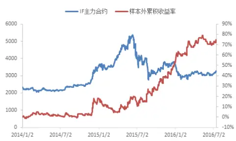

表 策略在 2014年以来表现

| 年化收益率 | 23.1% |
| --- | --- |
| 最大回撤率 | -11.7% |
| 收益回撤比 | 1.97 |

Table_Aut hor 分析师： 张超 S0260514070002

公020-87578291

zhangchao@gf.com.cn

## Table_Report 相关研究：

另类交易策略系列之十四：经 2014-03-31
验模态分解下的日内趋势交
易策略

另类交易策略系列之十五：识 2014-05-19别趋势震荡之神器 MESA

另类交易策略系列之二十一：2015-04-02
基于市场情绪平稳度的股指
期货日内交易策略
另类交易策略系列之十八：厚 2014-08-20
尾分布下的随机区间突破策
略

联系人： 文巧钧

0755-88286935

wenqiaojun@gf.com.cn

## 一、交易策略概述

## （一）市场的趋势和震荡

一般而言，趋势策略在市场有趋势的时候盈利丰厚，而在震荡市场，趋势策略容易发生亏损。

我们可以通过对市场的趋势和震荡进行判断，使策略具有更好的收益表现。此前，我们发布了一系列报告，用来衡量市场趋势的强度，在此基础上进行交易，而在震荡市场，则放弃进行趋势交易。

2014 年 3 月，我们发表了《另类交易策略系列之十四：经验模态分解下的日内趋势交易策略》，即EMDT策略。该策略将股指期货的时间序列分为噪声部分（震荡部分）和信号部分（趋势部分），然后计算这两部分的能量比值（信噪比）。通过经验模态分解（Empirical Mode Decomposition，简称 EMD）方法分解获得趋势部分和震荡部分，该过程不断从信号中提取出本征模态函数，直到信号仅保留趋势项。策略发布两年多以来，在市场上取得了不错的表现。

同样基于信号处理理论，我们发表了《另类交易策略系列之十五：识别趋势震荡之神器 MESA》。该策略通过最大熵原理对信号的谱密度进行估计，获得信号的周期。如果市场所对应的周期时间较长，就说明市场处于趋势之中，而如果所对应的周期时间短，则说明当前处于一个震荡区间中。通过这种方式判断出市场属于趋势或者震荡，进行趋势交易。

《另类交易策略系列之二十一：基于市场情绪平稳度的股指期货日内交易策略》是另外一种趋势识别方法。该策略受到最大回撤这个指标的启发，计算市场的“最大回撤”和“反向最大回撤”。从而获得市场的平稳度，也就是趋势相对于震荡的强度。

## （二）成份股一致性和市场的趋势强弱

本篇专题报告从市场成份股的一致性强弱出发，对市场指数的趋势强弱进行判断。本篇报告所选择的主要标的是沪深300指数，对应的是沪深 300成份股。

从直观上来看，成份股一致性用来表示市场的成份股走势是否同涨同跌。图 1展示了成份股一致性较强的时候，3个（标准化之后）股价序列的走势；图2展示了成份股一致性较弱的时候，股价序列的走势。从直观上来看，图 1 中成份股序列走势相似性高，而图2中成份股序列走势之间的相似性弱。

在成份股一致性较强的市场，成份股同涨同跌，容易形成市场“合力”，产生较大的波动和趋势。而在成份股一致性较弱的市场，成份股随机波动，市场不易产生趋势。因而我们可以基于对市场成份股一致性强弱的计算，对市场的趋势进行估计，从而确定是否进行趋势交易。

图1：成份股一致性强的示意图
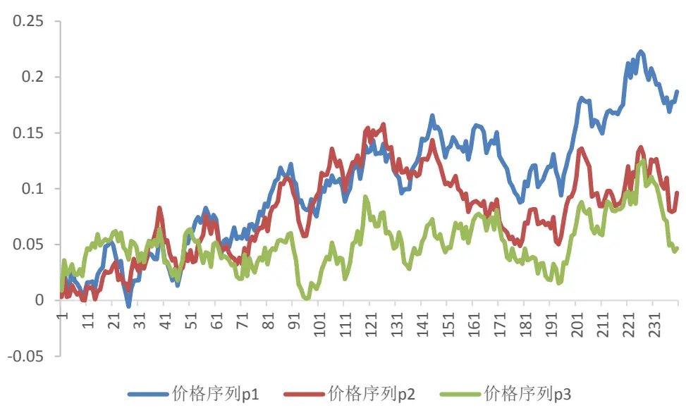
数据来源：广发证券发展研究中心

图2：成份股一致性弱的示意图
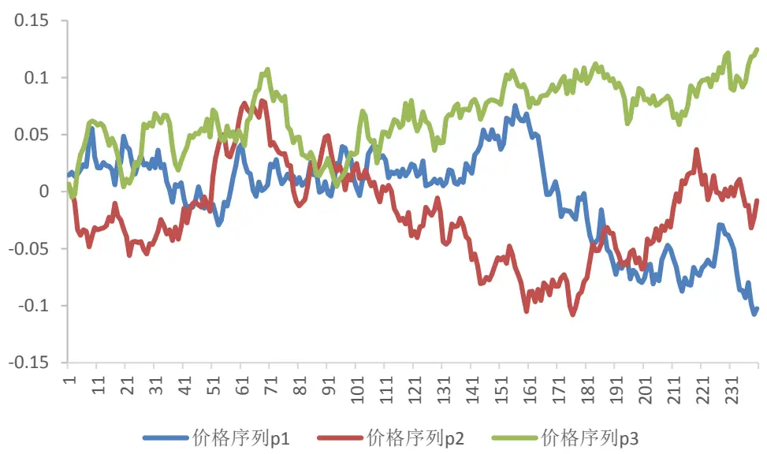
数据来源：广发证券发展研究中心

## 二、交易模型介绍

## （一）成份股一致性计算

假设沪深 300 指数的成份股价格序列为 p (t), i = 1,2, ⋯ ,300, t = 1,2,3, ⋯。在t时刻，我们取窗口长度为L 的一段数据，记成矩阵P。其中，已经对价格序列进行标准化（除以每个序列的第一个值），如下所示

$$
P=\begin{bmatrix}p_{1}(t-L+1)&\cdots&p_{300}(t-L+1)\\\vdots&\ddots&\vdots\\p_{1}(t)&\cdots&p_{300}(t)\end{bmatrix}
$$

可以使用矩阵P计算价格序列的协方差矩阵Σ

$$
\boldsymbol{\Sigma}=\begin{bmatrix}\sigma(1\text{,}1)&\cdots&\sigma(1\text{,}300)\\\vdots&\ddots&\vdots\\\sigma(300\text{,}1)&\cdots&\sigma(300\text{,}300)\end{bmatrix}
$$

其中第 i 行第 j 列的元素 $\sigma(i,j)$ 表示第 i 个成份股和第 j 个成份股价格的协方差，即 $\sigma(i,j)=cov(p_{i},p_{j})$

我们可以对价格矩阵P 进行线性变换，假设变换矩阵为

$$
U=\begin{bmatrix}u_{1,1}&\cdots&u_{1,300}\\\vdots&\ddots&\vdots\\u_{300,1}&\cdots&u_{300,300}\end{bmatrix}=[\boldsymbol{u}_{1}\quad\cdots\quad\boldsymbol{u}_{300}]
$$

U也是一个300行300列的矩阵，其中列向量 $\pmb{u}_{\pmb{j}}=[\begin{matrix}{u_{1,j}}&{\dots}&{u_{300,j}}\end{matrix}]^{T}$ 为矩阵 U 的第j列，而且可以给变换矩阵一定的约束，如 $\pmb{\imath}_{j}^{T}\pmb{u}_{j}=1$ （约束条件）。那么变换成矩阵 $Q=$ PU，其中 Q的第一列为

$$
q_{1}(t-k)=p_{1}(t-k)\times u_{1,1}+\cdots+p_{300}(t-k)\times u_{300,1},\quad k=0,1,2,3,\cdots,L-1
$$

如下图所示，其中横轴表示时间。

图3：对价格序列的线性变换
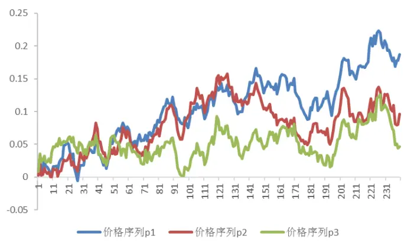
数据来源：广发证券发展研究中心

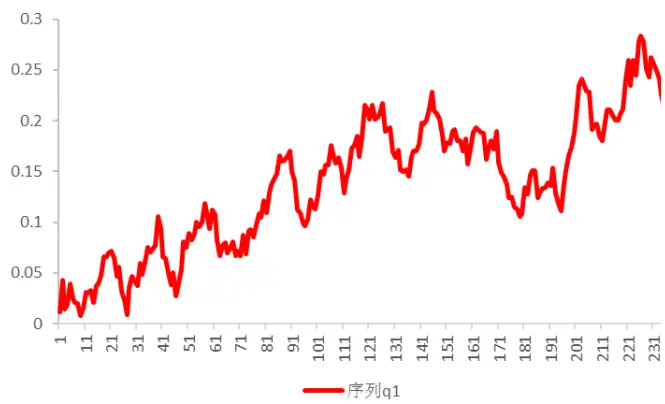

类似的，矩阵Q 表示300个变换之后的序列，不同的列分别可以记为，序列 $\mathbf{q}_{1}=$ $P{\pmb u}_{1},\quad{\pmb q}_{2}=P{\pmb u}_{2},\quad\ldots\ldots,\quad{\pmb q}_{300}=P{\pmb u}_{300}$

由于成份股一致性反映的是市场同涨同跌的程度。从另一个角度来考虑，当成份股一致性强的时候，可以寻找到一个序列 $\pmb{q}_{1}=P\pmb{u_{1}}$ ，且序列q 包含了成份股股价序列的大部分信息。

在这里，我们先不用去考虑序列 $\mathbf{q_{1}}$ 的具体形式，只需要关心是否能够找到这样的序列 $\mathbf{q_{1}}$ ，以及序列中所包含的信息量是否足够多。

用方差来表示序列 $\mathbf{q_{1}}$ 的信息量，则我们的目标是：

在 $\pmb{u}_{1}^{T}\pmb{u}_{1}=1$ 的约束下，寻找最大化 $\mathbf{\boldsymbol{q}_{1}}$ 方差的变换向量 $\mathbf{u_{1}}$ ，即

$$
\max_{\boldsymbol{u}_{1}}\operatorname{var}(P\boldsymbol{u}_{1})=\boldsymbol{u}_{1}^{T}\Sigma\boldsymbol{u}_{1}
$$

这就是求解协方差矩阵Σ的最大特征值对应的特征向量的问题，也是主成分分析所解决的问题，所获得的序列q 就是数据矩阵 P 的第一个主成分。而且，在最优的变换向量下， $\operatorname{var}(\pmb{q}_{1})=\lambda_{1}$ ，为矩阵Σ的最大特征值。

根据主成分分析的性质，我们可以将矩阵Σ的所有特征值求出来，为 $\cdot\lambda_{1},\lambda_{2},\ldots,\lambda_{300},$ 且有 $\left[\lambda_{1}\geq\lambda_{2}\geq\cdots\geq\lambda_{300}\geq0\right.$ 。如果P的秩小于300，则排在后边的若干特征值等于0。主成分具有如下性质：

1）所有特征值都非负，且 $\lambda_{1}\geq\lambda_{2}\geq\cdots\geq\lambda_{300}\geq0;$

2）不同主成分之间互不相关；

3）全部主成分反映的样本的信息量之和，等于原始数据的总信息量。

对于性质（2），如下图所示，第一个主成分和第二个主成分的方向是正交的。其中，第一个主成分是使得变换之后数据中信息量最大的方向，可以反映原始数据中样本的主要信息变化。

图4：主成分分析
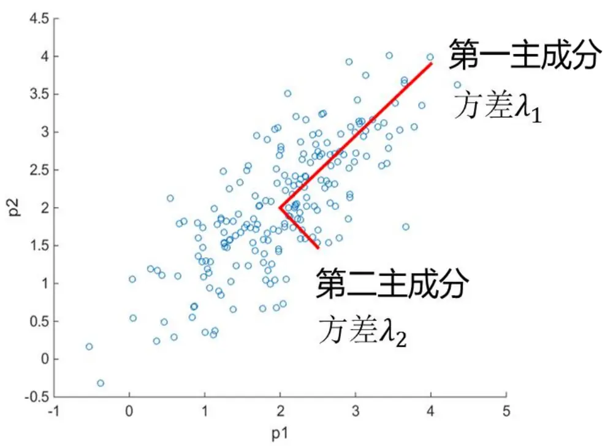
数据来源：广发证券发展研究中心

在此基础上，定义成份股的一致性指标 R为

$$
R=\frac{\lambda_{1}}{\sum_{i=1}^{300}\lambda_{i}}\times100\%=\frac{\lambda_{1}}{\lambda_{1}+\lambda_{2}+\cdots+\lambda_{300}}\times100\%
$$

这个指标是主成分分析中，第一个主成分的方差贡献率。

成份股一致性指标反映了用第一个主成分序列来表示原始价格数据中的信息时，其中包含了原来数据中多少比例的信息量。由于第一个主成分是能够找到的原始数据经过线性变换后信息量最大的序列（方差最大），因而指标R可以反映成份股一致性的程度。

一致性指标R是0到1 之间的数，R 越大，说明成份股之间一致性越强；R越小，说明成份股之间的一致性越弱。

对于图1和图2中的例子，我们可以求得图1 中数据的一致性指标 R=0.864，图2中数据的一致性指标R=0.452。因此，可以通过本报告的算法，定量的计算市场中成份股一致性的强弱。

下图展示了用成份股一致性指标对2006年1月1日至2016年7月15日沪深300指数的分析结果。

在这里，我们考虑沪深 300 指数成份股的日内数据。在每天收盘时，采用最近连续 20 个交易日的 30 分钟收盘价计算 R（160 个采样点的成份股时间序列）。对于整个回测区间，计算 R的25%分位数。图中标红的点表示R小于 25%分位数的点。在市场反转或者震荡的时候，R很小，此时市场的一致性很弱；R 比较大的时候，市场一致性强，容易形成趋势。

由图可见，市场成份股一致性指标的强弱与市场的趋势和震荡划分具有很明显的关联。

图5：沪深300成份股一致性择时示意图
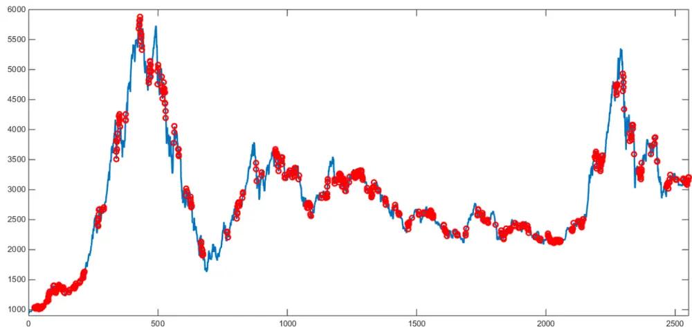
数据来源：广发证券发展研究中心

## （二）成份股一致性交易策略

本报告提出了基于成份股一致性判断的股指期货日内交易策略。当沪深 300指数成份股的一致性比较强的时候，进行趋势跟踪交易；当成份股的一致性弱的时候，认为当天不适合趋势交易。

假设在上午T时刻考虑建仓，策略采用的数据是当天从现货开盘（即交易日上午 9:30）到时间T的行情数据。首先采用成份股价格序列数据计算成份股一致性指标 R。当成份股一致性指标R大于阈值时，认为市场的成份股一致性强，容易形成趋势，因此入场建仓。当成份股一致性指标 R 小于阈值时，不进行交易。

判断成份股一致性强弱的阈值可以通过样本内数据进行计算，也可以选取最近一段时间的均值作为阈值。后者能够更加准确的刻画当前市场的成份股关联情况，本策略采用这种方式。本报告选用最近 60个交易日对应时刻成份股一致性指标的均值作为判断阈值，也就是每个交易日在时刻 T计算一致性指标，取过去 60个交易日相同时刻计算出来的指标值的平均值作为判断阈值Threshold。当R > Threshold的时候，认为该日成份股一致性强，有较大可能会产生趋势。

建仓的多空方向由当天现货指数开盘之后这一段时间股指期货涨跌的方向决定，即

$$
\left\{\begin{aligned}&如果p(T)>p(t_{0}),做多股指期货\\&如果p(T)<p(t_{0}),做空股指期货\end{aligned}\right.
$$

其中， $p(t_{0})$ 为当天上午9:30时股指期货的价格， $p(T)$ 为时刻T 股指期货的价格，根据两者大小来确定趋势方向。

止损策略方面，本策略采用最简单的固定比例r止损。也就是说，当浮动亏损大于r时，进行止损平仓，否则一直持有，直至当日收盘时平仓。

## （二）通过成份股一致性对随机区间突破策略的改进

上一节的策略中，每个交易日在固定时刻T采用成份股一致性来判断当前市场的趋势强弱。后文的实证分析将证明这一策略的良好性能。

通过成份股一致性的测算，也可以用来过滤其他模型的交易信号。

如下图所示，虚线上方的图表示一个简单的交易系统：即模型接收行情数据，经过模型处理后，发出交易指令。

虚线下方的图表示这个简单交易系统与成份股一致性结合起来的策略。在原来交易模型运作的同时，监测市场的成份股一致性强弱。当市场的成份股一致性强的时候，模型正常交易；当市场一致性弱的时候，认为此时不适合进行趋势交易，因此不执行新的开仓指令。策略框架如虚线下方的图所示。

图6：成份股一致性过滤交易信号示意图
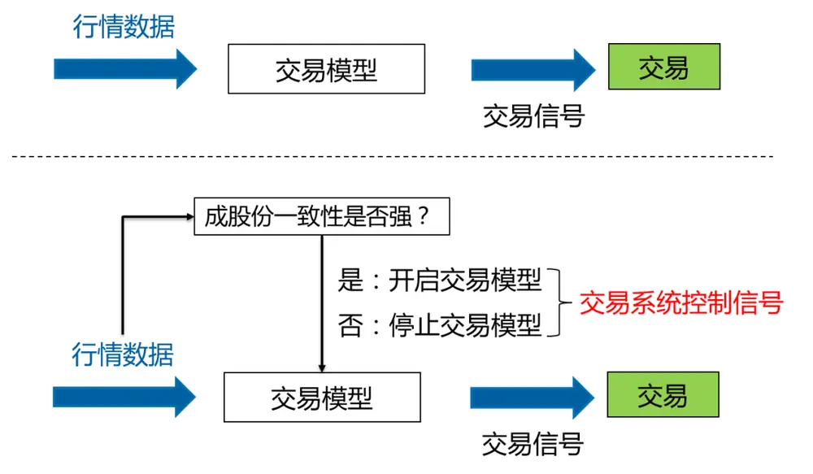
数据来源：广发证券发展研究中心
识别风险，发现价值

在这篇报告里，我们以《另类交易策略系列之十八：厚尾分布下的随机区间突破策略》中提出的随机区间突破策略为例，进行一致性策略效果的验证。

下图展示的是一个开盘区间突破策略。我们根据开盘价格和突破阈值Range（通常由历史数据计算或者优化出来），确定突破的上界：开盘价*(1+Range)，和突破的下界：开盘价*(1-Range)。当价格往上穿过突破上界时，认为形成了向上的趋势，可以做多；当价格往下穿过突破下界时，认为形成了向下的趋势，可以做空。在这篇报告里，建仓之后持有至收盘平仓，或者盘中止损平仓；如果当天盘中止损，当天止损后的交易时间不再建立新的头寸。

图7：开盘区间突破系统
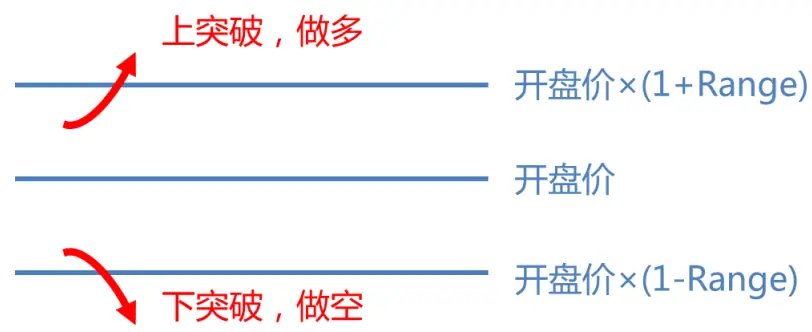
数据来源：广发证券发展研究中心

开盘区间突破的主要盈利来源是市场的厚尾效应。策略性能对于阈值 Range 的取值不是特别敏感。因此，在随机区间突破策略里，不对阈值 Range 进行优化，而是每天随机生成一个正数作为阈值 Range 的取值，按照此前报告，Range 由 0.3%到1%之间的均匀分布随机产生。

为了减小回测时的随机性，在回测中，我们每天进行 100 次蒙特卡洛仿真，每次仿真时随机生成阈值 Range（Range 为0.3%到1%之间的均匀分布随机数），在收盘时计算 100 次仿真的收益率并取平均。这就相当于每天开盘前将资金划分成 100 等份，每份资金用一个区间突破策略来进行交易，这 100个区间突破策略的阈值Range是分别随机生成，彼此独立的。

通过成份股一致性的监测来进行辅助判断，可以过滤一些交易信号。其基本过程如下：

当价格突破上界或下界时，如果成份股一致性较弱，则放弃新的开仓；如果成份股一致性强时，进行趋势交易的建仓。

通过成份股一致性来改善之后的随机区间突破策略，我们称之为控制开仓随机区间突破策略。与普通的随机区间突破策略回测类似，在下一节的实证分析中，我们每天也进行 100 次仿真。每次仿真随机生成突破阈值，并且将当日的不同仿真的收益率平均，作为策略在当天的收益率。

## 三、实证分析

在这一部分，我们首先对成份股一致性策略进行实证分析，然后对控制开仓随机区间突破策略进行实证分析。

## （一）成份股一致性策略

数据选取：沪深 300 股指期货（IF）主力合约的 1 分钟价格，和沪深 300 指数成份股的 1 分钟价格序列。2010年 4 月 16 日至 2013 年 12 月 31 日为样本内，进行参数优化。2014年1 月1日至2016年 7月 15日为样本外回测区间。

策略描述：每天股票市场开盘之后 T 分钟，计算沪深 300 指数成份股的一致性强弱，如果一致性强，则进行趋势跟踪：根据 IF 主力合约在 9:30 之后 T 分钟的涨跌方向确立趋势方向，用于IF主力合约的交易。如果沪深300指数成份股的一致性弱，则不进行交易。

交易模式：日内交易策略，不持隔夜仓。

止损阈值：0.6%。

交易费用：按照双边万分之二的交易成本来进行计算，在 2015年 9月 7日中金所提高股指期货当日平仓手续费以来，需要留有底仓才能将交易成本控制下来（避免平今仓）。

杠杆：不计杠杆，按照合约价值计算收益。

首先看一下参数优化的情况，需要优化的参数 T 是计算成份股一致性并且建仓的时间。参数 T 表示在每天股市开盘（9:30）之后第 T 分钟建仓。样本内参数优化的结果如下图所示，我们分别考察了在每天股市开盘之后 21 分钟到 60 分钟建仓的表现。在不同的参数 T 下，全部获得了正收益，而且在绝大部分参数下，策略的收益回撤比大于 1.5。

在参数T=24分钟时，策略在样本内的收益回撤比最大，为 4.24。

最优参数T=24分钟的邻近参数的收益回撤比如下表所示。在最优参数的邻域内，策略都有2.2倍以上的收益回撤比，而且年化收益率都在21%以上。策略在最优参数处的回撤较小，使得收益回撤比最高。总体而言，可以看到策略的参数稳定性比较好。

图8：IF主力合约样本内参数优化结果
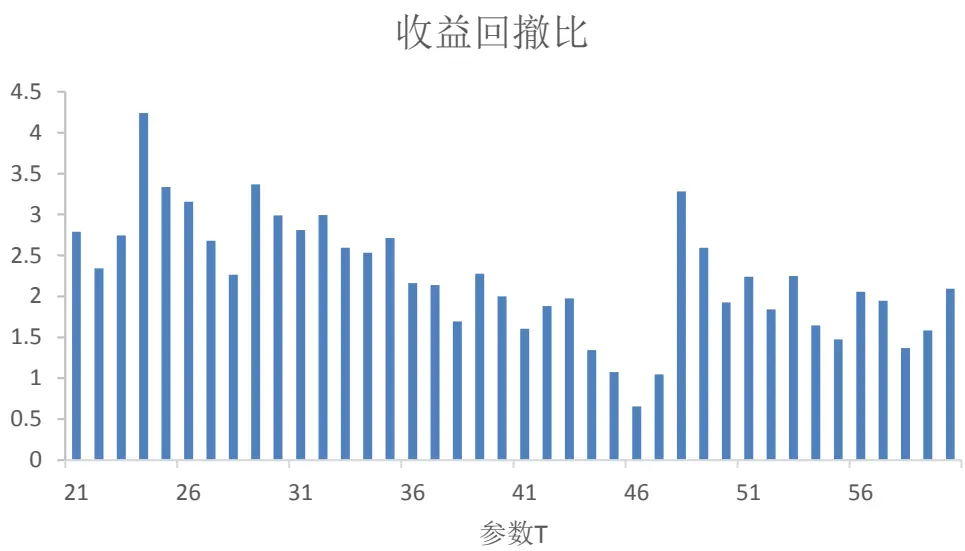
数据来源：广发证券发展研究中心，天软科技

表1：策略在 IF上的参数稳定性

| 参数 T（分钟） | 年化收益率 最大回撤 | 收益回撤比 |
| --- | --- | --- |
| 21 | 24.2% -8.7% | 2.79 |
| 22 | 25.8% -11.0% | 2.34 |
| 23 | 21.7% -7.9% | 2.75 |
| 24 | 26.8% -6.3% | 4.24 |
| 25 | 23.2% -7.0% | 3.33 |
| 26 | 29.0% -9.2% | 3.15 |
| 27 | 25.9% -9.6% | 2.68 |
| 28 | 24.2% -10.7% | 2.26 |
| 29 | 23.7% -7.0% | 3.37 |

数据来源：广发证券发展研究中心，天软科技

选择 T=24分钟作为策略的最优参数。

策略在样本内和样本外的累积收益曲线如下图所示。这里不考虑杠杆，按照合约价值来计算收益。在样本内，2010年4月至2013年12月的累积收益率为141.1%，折算成年化收益率为 26.8%，最大回撤为-6.3%，有4.24 倍的收益回撤比。在样本外，2014 年 1 月至 2016 年 7 月的累积收益率为 72.6%，折算成年化收益率为 23.1%，最大回撤为-11.7%，收益回撤比为 1.97。样本外策略的最大回撤明显大于样本内的最大回撤，但是年化收益差别不大，整体上策略性能比较稳定。

从整个回测区间来看，策略获得了 25.2%的年化收益率，历史最大回测为-11.7%。策略的胜率为 43.1%，盈亏比（盈利时的平均收益率与亏损时的平均亏损率之比）为2.04，属于典型的“低胜率高盈亏比”的趋势策略。

策略单次交易的平均收益率为 0.20%。与其他的股指 CTA策略相比，本策略的单次交易平均收益率较高，因此对于交易成本和市场冲击成本的敏感性较低。在 2015年 9 月份以来，股指期货受很大限制，交易成本增大，市场流动性变差，冲击成本增大，一般的股指 CTA 策略很难获得正收益。而本策略在 2016 年以来有 13.2%的累积收益，而且对交易成本和冲击成本不敏感，在目前的市场环境下也能够获得较好的表现。

图9：IF样本内累积收益曲线
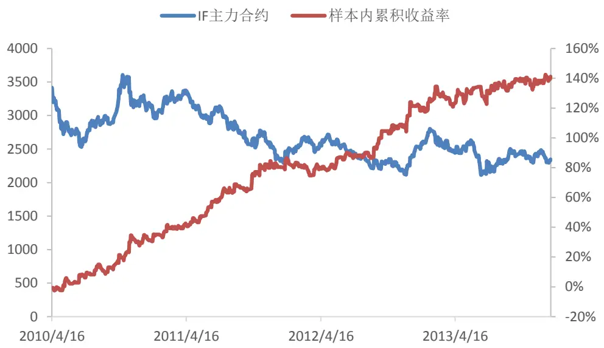
数据来源：广发证券发展研究中心，天软科技

图10：IF样本外累积收益曲线
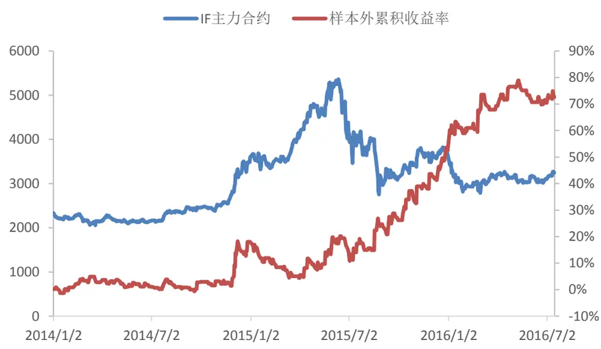
数据来源：广发证券发展研究中心，天软科技

表2：最优参数下策略在 IF上的回测表现

|  | 样本内 样本外 | 全样本 |
| --- | --- | --- |
| 累积收益率 | 141.1% 72.6% | 316.2% |
| 年化收益率 | 26.8% 23.1% | 25.2% |
| 最大回撤 | -6.3% -11.7% | -11.7% |
| 收益回撤比 | 4.24 1.97 | 2.15 |
| 单次交易 |  |  |
| 平均收益率 | 0.20% 0.19% | 0.20% |
| 交易次数 | 451 310 | 761 |
| 胜率 | 47.5% 36.8% | 43.1% |
| 盈亏比 | 1.79 2.51 | 2.04 |

数据来源：广发证券发展研究中心，天软科技

在最优参数T=24分钟的情况下，每天计算出来的成份股一致性指标如下图所示。可以看到，该指标一般在50%至80%之间变化。由于股票之间的相关性较高，市场整体的成份股一致性较强。在2015年六七月份的极端市场中，成份股一致性指标甚至超过了 90%。

图11：不同交易日的成份股一致性指标
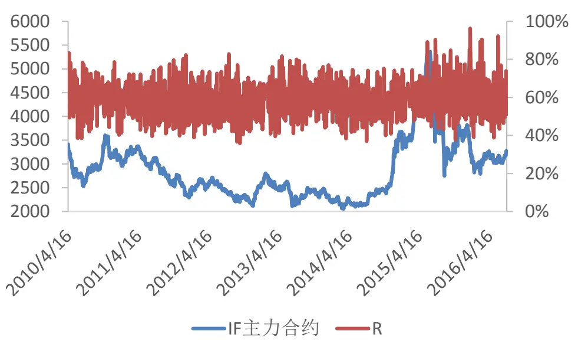
数据来源：广发证券发展研究中心，天软科技

拓展讨论 1：如果我们不实时计算成份股的一致性强弱指标，策略的表现会怎么样呢？

由于成份股一致性指标涉及指数成份股价格数据的获取和处理，与一般的 CTA策略相比，本策略的计算量较大。如果不是在 T 时刻实时计算成份股一致性指标 R，而是提前一段时间计算R，对市场的趋势强弱进行判断，在T时刻进行建仓交易，策略性能如何？

下图展示了 2016 年 7 月 15 日对沪深 300 成份股一致性指标 R 的计算。横轴为时间，表示从 9:40开始，每隔一分钟计算一次 R的值，如红线所示。可以看到，该

识别风险，发现价值

指标的日内变化比较平缓。事实上，由于成份股一致性指标是通过成份股价格序列的协方差矩阵计算出来的，一般情况下，T-1时刻的值和 T 时刻的值差别不会很大。

图12：日内成份股一致性指标
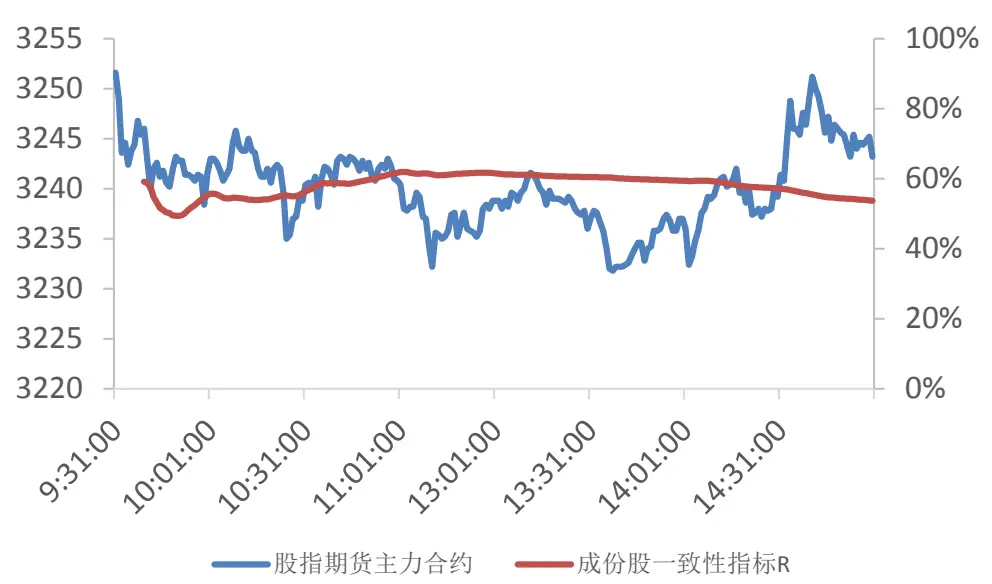
数据来源：广发证券发展研究中心，天软科技

因而，T-1时刻计算出来的成份股一致性强弱指标 R可以近似替代 T时刻计算出来的 R。

本报告做了这样的一个策略回测：在每个交易日，提前一分钟（T-1分钟）计算成份股一致性指标，判断市场成份股一致性是否强——如果一致性强，在 T 分钟进行交易；否则，当日不进行趋势交易。参数 T=24分钟还是取前文原始策略的最优参数。

策略在2014年以来的表现如下图所示。可以看到，与原始策略的样本外收益曲线差别不大。

下表比较了原始策略（R 的计算、交易都是在 T 分钟），和修改后策略（在 T-1分钟计算R、T分钟交易）两种不同方案的分年度表现。可以看到，每年的收益率略有出入，但是总体差别不大。两种策略下 2016 年以来都获得了 11%以上的累积收益率。

通过这一部分的实证分析，证实了本策略对成份股一致性指标计算的实时性要求不是那么高。

图13：T-1分钟计算成份股一致性指标的策略表现
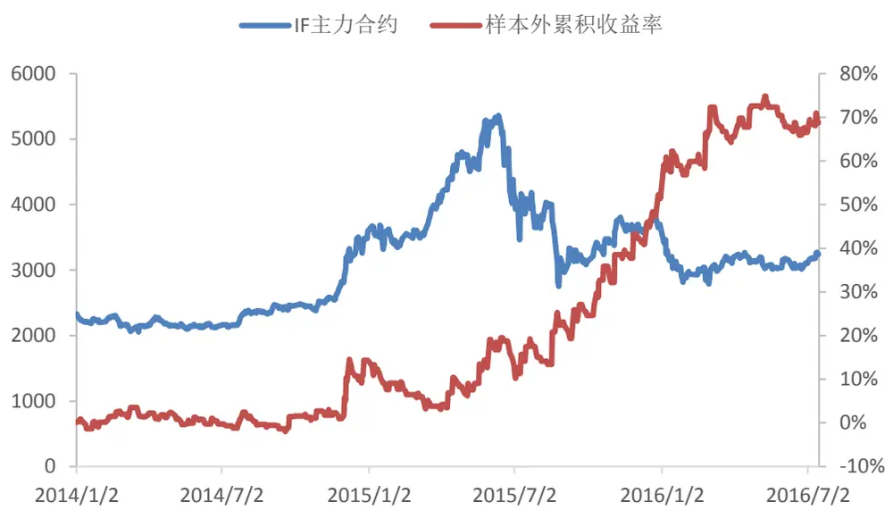
数据来源：广发证券发展研究中心，天软科技

表3：分年度的策略收益率

| 年份 | T分钟计算 R 的累积收益率 | T-1 分钟计算 R 的累积收益率 |
| --- | --- | --- |
| 2010 | 32.1% | 35.9% |
| 2011 | 36.5% | 35.4% |
| 2012 | 22.8% | 17.4% |
| 2013 | 9.0% | 9.0% |
| 2014 | 18.1% | 14.4% |
| 2015 | 29.2% | 32.4% |
| 2016（至7月15日） | 13.2% | 11.5% |

数据来源：广发证券发展研究中心，天软科技

拓展讨论2：通过成份股一致性强弱的判断，本策略大约每两个交易日交易一次，大约过滤了一半的交易机会。被过滤的这些交易机会是否能够获得正的收益呢？为了说明这个问题，本报告设计了一个对照实验。

在对照实验中，仍然在每个交易日开盘之后时间 T 计算成份股的一致性水平。与前面策略相比，此时，仅当市场的成份股一致性较弱时，才进行趋势交易。在这种情况下，2013 年以前和2014年以来的策略表现如下面两个图所示。

可以看到，在股指期货刚上市的几个月（2010 年），对照策略也有一定的盈利，但随后几年都没有获利。

从 2014 年至今，对照策略有 8.2%的亏损。而在相同的回测区间里（2014 年至2016 年 7月），如果仅在市场一致性强的时候进行交易，原始策略有 72.6%的盈利。

因此，通过对成份股一致性的监测，可以明显提高趋势策略的收益率，过滤收益期望不高的交易信号，是一种有效的方法。

图14：对照实验在2010至2013年的表现
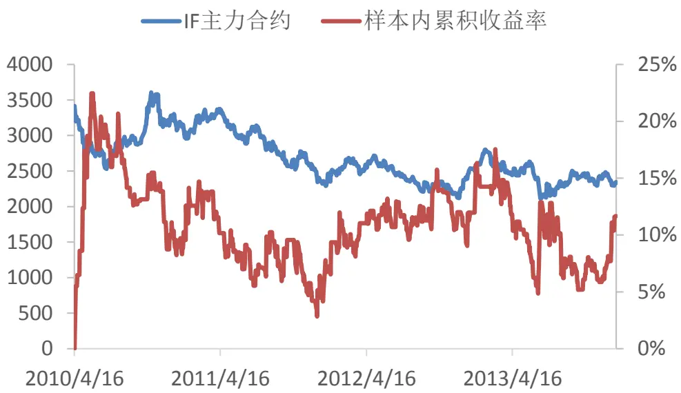
数据来源：广发证券发展研究中心，天软科技

图15：对照实验在2014年以来的策略表现
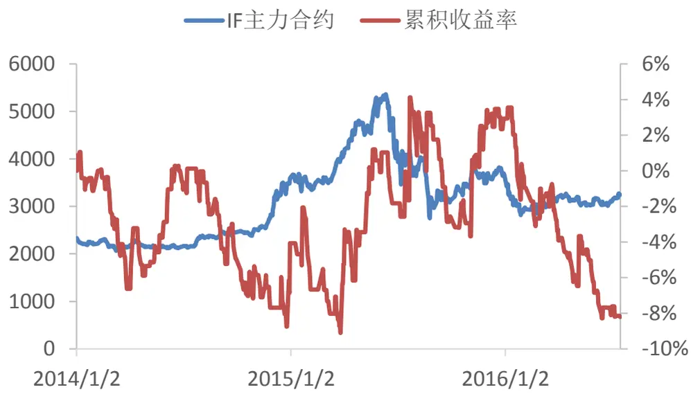
数据来源：广发证券发展研究中心，天软科技

## （二）控制开仓的随机区间突破策略

由于成份股一致性可以明显提高趋势策略的收益率，过滤收益期望不高的交易信号，因而，这一节，本报告使用这个指标与随机区间突破策略进行结合。

与普通随机区间突破策略相比，控制开仓的随机区间突破策略过滤了部分交易信号。如下图所示。本报告对2014年以来，随机区间突破策略和控制开仓随机区间突破策略两种策略的表现进行了回测比较。

图16：控制开仓随机区间突破策略示意图
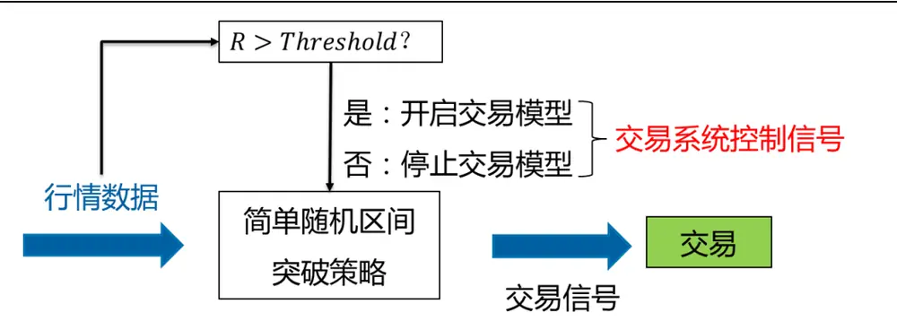
数据来源：广发证券发展研究中心

如下图所示，在 2015 年 9 月份之前，两个策略的收益曲线基本重合；2015 年10月之后，控制开仓的策略表现明显优于普通的随机区间突破策略。从2014年以来，控制开仓随机区间突破策略的收益率相比普通的随机区间突破策略高了 10%多。

另外值得注意的一点是，控制开仓下的随机区间突破策略交易次数比普通的随机区间突破交易策略交易次数少。由于每个交易日都做了 100 次仿真实验，只要其中一个参数下的策略有交易发生，则认为当天有交易发生。本报告统计了在有交易发生的交易日，单日的平均收益率。普通的随机区间突破策略的单日平均收益率为0.08%，而控制开仓之后，策略的单日平均收益率为 0.10%，有明显提升。因而，策略对交易成本和冲击成本的敏感性较低。适合目前流动性比较差的市场。

图17：控制开仓随机区间突破策略表现
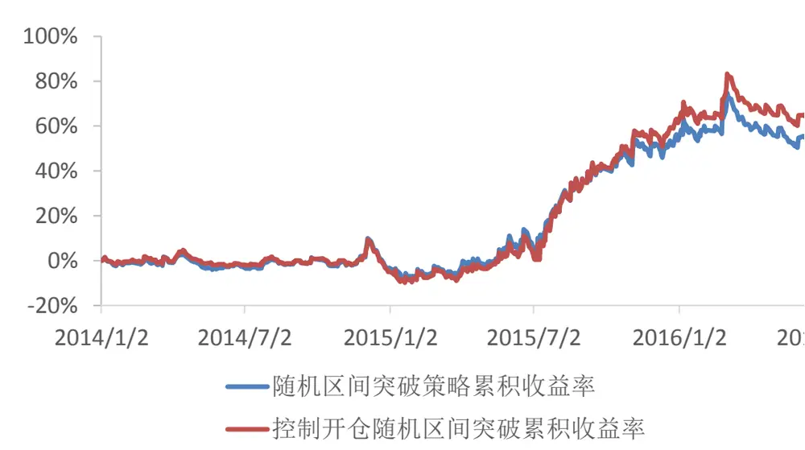
数据来源：广发证券发展研究中心，天软科技

表4：随机区间突破策略表现

| 年份 | 随机区间突破策略 累积收益率 | 控制开仓随机区间突破 策略累积收益率 |
| --- | --- | --- |
| 2014 | -3.16% | -4.78% |
| 2015 | 58.63% | 69.55% |
| 2016 | 1.38% | 4.24% |
| 单日平均收益率 | 0.08% | 0.10% |

数据来源：广发证券发展研究中心，天软科技

## 四、总结与讨论

本篇报告从市场成份股出发，分析市场的趋势和震荡情况。提出了一种判断市场成份股一致性强弱的指标，基于这个指标，提出了股指期货日内交易策略，并且对我们此前的随机区间突破策略进行了改进。

一般来说，在成份股一致性较强的市场，成份股同涨同跌，容易形成市场“合力”，产生较大的波动和趋势。而在成份股一致性较弱的市场，成份股随机波动，市场不易产生趋势。因而我们可以基于对市场成份股一致性强弱的计算，对市场的趋势进行估计，从而确定是否进行趋势交易。

考虑到成份股序列的数学变换，当成份股一致性强的时候，可以寻找到一个变换后的序列，该序列包含了成份股股价序列的大部分信息。经过推导，本报告将这个问题转换为经典的主成分分析问题。通过求解成份股价格协方差矩阵的特征值，以及最大特征值的方差解释度，本报告提出了成份股一致性强弱指标。该指标能够很好的反应市场的一致性程度，通过对 2006年以来沪深 300指数成份股一致性和趋势-震荡的分析，证实了该指标可以用来判断市场的趋势和震荡。

本报告提出了基于成份股一致性的股指期货交易策略，在沪深 300股指期货上的交易取得了良好的效果。通过样本内优化出参数之后，最优参数下的策略在样本外表现不错。2014年 1月至 2016 年7 月的累积收益率为72.6%，折算成年化收益率为 23.1%，最大回撤为-11.7%，收益回撤比为1.97。参数在样本内外的表现比较稳定。特别值得指出的一点是，策略的单次交易平均收益率较高，因此对于交易成本和市场冲击成本的敏感性较低，是目前流动性差、交易成本高的股指期货市场中能够表现较好的策略。

与普通的随机区间突破策略相比，控制开仓随机区间突破策略过滤了部分交易信号，使得交易次数有明显降低，然而从实证分析可以看到，策略的收益率反而有明显提升。从2014年以来，控制开仓随机区间突破策略的收益率相比普通的随机区间突破策略高了 10%多。因而，策略对交易成本和冲击成本的敏感性较低。适合目前流动性比较差的市场。

## 风险提示

策略模型并非百分百有效，市场结构及交易行为的改变以及类似交易参与者的增多有可能使得策略失效。

## Table_RatingIndustry 广发证券—行业投资评级说明

买入： 预期未来12个月内，股价表现强于大盘10%以上。

持有： 预期未来12个月内，股价相对大盘的变动幅度介于-10%～+10%。

卖出： 预期未来12个月内，股价表现弱于大盘10%以上。

## Table_RatingCompany 广发证券—公司投资评级说明

买入： 预期未来12个月内，股价表现强于大盘15%以上。

谨慎增持： 预期未来12个月内，股价表现强于大盘5%-15%。

持有： 预期未来12个月内，股价相对大盘的变动幅度介于-5%～+5%。

卖出： 预期未来12个月内，股价表现弱于大盘5%以上。

## Table_Ad联系我们

| 地址 | 广州市 广州市天河北路183号 | 深圳市 深圳市福田区金田路4018 | 北京市 | 上海市 |
| --- | --- | --- | --- | --- |
|  | 大都会广场5楼 | 号安联大厦 15 楼 A 座 03-04 | 北京市西城区月坛北街2号 月坛大厦18层 | 上海市浦东新区富城路99号 震旦大厦18楼 |
| 邮政编码 | 510075 | 518026 | 100045 | 200120 |
| 客服邮箱 | gfyf@gf.com.cn |  |  |  |
| 服务热线 | 020-87555888-8612 |  |  |  |

## Table_Disclaimer 免 责声 明

广发证券股份有限公司具备证券投资咨询业务资格。本报告只发送给广发证券重点客户，不对外公开发布。

本报告所载资料的来源及观点的出处皆被广发证券股份有限公司认为可靠，但广发证券不对其准确性或完整性做出任何保证。报告内容仅供参考，报告中的信息或所表达观点不构成所涉证券买卖的出价或询价。广发证券不对因使用本报告的内容而引致的损失承担任何责任，除非法律法规有明确规定。客户不应以本报告取代其独立判断或仅根据本报告做出决策。

广发证券可发出其它与本报告所载信息不一致及有不同结论的报告。本报告反映研究人员的不同观点、见解及分析方法，并不代表广发证券或其附属机构的立场。报告所载资料、意见及推测仅反映研究人员于发出本报告当日的判断，可随时更改且不予通告。

本报告旨在发送给广发证券的特定客户及其它专业人士。未经广发证券事先书面许可，任何机构或个人不得以任何形式翻版、复制、刊登、转载和引用，否则由此造成的一切不良后果及法律责任由私自翻版、复制、刊登、转载和引用者承担。