# 快速趋势识别下的金融期货交易策略

## 另类交易策略系列之三十一

## Table_Sum ary报告摘要 ：

## 金融期货概况

自从 2015年 9月份中金所出台对于股指期货的管控措施以来，期指市场成交量明显萎缩，流动性大大降低。此后几个月，股指期货月成交额相对管控前减少超过 95%。同时，国债期货市场的成交量开始上升，目前，国债期货市场的成交额超过了股指期货，在金融期货市场中具有重要地位。

目前中金所有三个股指期货品种和两个国债期货品种上市交易。股指期货包括沪深 300 股指期货（IF）、中证 500 股指期货（IC）和上证 50 股指期货（IH）。每个品种有4个合约进行交易。国债期货品种包括5 年期国债期货(TF)和10年期国债期货（T），每个品种有3个合约进行交易。

## 策略原理

本篇报告提出了一种新的趋势识别方法。通过均线系统获得市场的噪声强度，针对噪声累积量构建监测统计量。当市场没有趋势的时候，噪声累积量的期望为 0。当市场具有趋势的时候，噪声累积量的期望不为 0。可以通过对噪声累积量的统计检验，确定当前的趋势方向。

当市场具有趋势的时候，噪声累积量的期望值与趋势强度成正比，与均线周期成正比，而且与累积窗口长度成正比。换而言之，我们构建的趋势识别指标通过加入时间窗口求噪声累积量的方式放大了趋势的影响，能够比较灵敏的发现市场趋势。

## 策略表现

从实证结果来看，用于沪深 300 股指期货交易时，策略在样本外的年化收益率为 24.4%，最大回撤为-15.5%，收益回撤比为1.57。

在中证 500 股指期货上，策略从 2015 年 4 月份以来的年化收益率为61.9%，收益回撤比为 2.31，单次交易的平均收益率为 0.21%。在上证 50股指期货上，策略从2015年 4月份以来的年化收益率为 42.2%，收益回撤比为3.12，单次交易的平均收益率为 0.15%。

用于五年期国债期货和十年期国债期货交易时，策略也取得了不错的表现。

图 IF 股指期货策略样本外表现
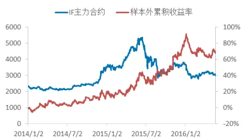

表 IF股指期货策略样本外表现

| 年化收益率 | 24.4% |
| --- | --- |
| 最大回撤率 | -15.5% |
| 收益回撤比 | 1.57 |

Table_Aut hor 分析师： 张超 S0260514070002

公020-87578291

zhangchao@gf.com.cn

## Table_Report 相关研究：

另类交易策略系列之十四：经 2014-03-31
验模态分解下的日内趋势交
易策略

另类交易策略系列之十五：识 2014-05-19别趋势震荡之神器 MESA

联系人： 文巧钧

公0755-88286935

wenqiaojun@gf.com.cn

## 一、交易策略概述

## （一）金融期货品种概况

自从 2015年 9月份中金所出台对于股指期货的管控措施以来，期指市场成交量明显萎缩，流动性大大降低。此后几个月，股指期货月成交额相对管控前减少超过95%。同时，国债期货市场的成交量开始上升，目前，国债期货市场的成交额超过了股指期货，在金融期货市场中具有重要地位。

广发证券金融工程团队此前发布了研究报告《FICC 系列研究报告之四：国债期货量化交易策略研究》，研究了国债期货的五种交易策略：日间、日内两种趋势策略；以及跨品种套利、期现套利和信用利差交易三种套利策略。实证表明，国债期货的趋势策略表现良好，中长线趋势跟踪策略和日内趋势策略在样本内外都保持了较好的盈利能力。

本报告主要研究金融期货的日内趋势交易策略，在股指期货和国债期货上进行交易。由于目前股指期货受到严格的投机限制，为了避开高昂的平今手续费，需要留有底仓才能进行日内交易。

目前中金所有三个股指期货品种和两个国债期货品种上市交易。股指期货包括沪深 300股指期货（IF）、中证 500股指期货（IC）和上证50股指期货（IH）。每个品种有四个合约交易。目前，股指期货的非套期保值持仓交易保证金为 40%。

国债期货品种包括5年期国债期货，2013年 9月 6日上市，交易代码 TF；以及10 年期国债期货，2015年 3月 20日上市，交易代码T。

国债期货的标的为面值为100万元人民币、票面利率为3%的名义中期/长期国债。每个品种有三个季月合约交易。国债期货的交易保证金为分阶段的保证金制度，五年期国债期货的保证金为1%到2%，十年期国债期货的保证金为 2%到 4%。

本报告中，都采用主力合约进行回测，而且不考虑杠杆。由于股指期货和国债期货都可以进行杠杆交易，而且国债期货的杠杆很高，因此，回测中主要的评价指标是策略的收益回撤比。

## （二）日内趋势策略的分类

从交易品种、交易类型、交易频率和策略模式等方面来看，CTA策略的分类如下图所示。

其中趋势策略是 CTA 策略中主流的交易方式，通过识别市场的趋势，进行趋势跟踪。根据趋势周期的不同，可以分为中长线趋势跟踪和日内趋势跟踪。本报告研究的是日内趋势交易策略。

图1：CTA策略的不同分类方法
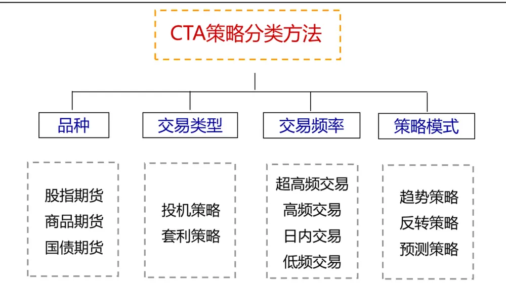
数据来源：广发证券发展研究中心

从方法上来看，日内趋势策略的交易信号通常由价格序列的时域分析或者能量分析产生。

基于时域分析方法的趋势策略通常由价格序列的突破和形态拟合等方式产生交易信号。价格序列的突破策略通常有开盘区间突破策略、布林通道策略等，一般由上下轨线组成交易系统，当价格往上突破上轨时，认为当前具有向上趋势；当价格往下突破下轨时，认为当前具有向下趋势。价格序列的形态拟合策略常见的是多项式拟合策略等（详见广发金工报告《另类交易策略系列之三：多项式拟合的股指期货趋势交易(LPTT)策略》）。

基于能量或频域的方法与时域分析方法区别较大，EMDT和MESA 策略是其中的代表。

EMDT 策略将股指期货的时间序列分为噪声部分（震荡部分）和信号部分（趋势部分），然后计算这两部分的能量比值（信噪比）。通过经验模态分解方法分解获得趋势部分和震荡部分，该过程不断从信号中提取出本征模态函数，直到信号仅保留趋势项。策略发布两年多以来，在市场上取得了不错的表现。（详见《另类交易策略系列之十四：经验模态分解下的日内趋势交易策略》）

同样基于信号处理理论，我们提出了最大熵谱分析（MESA）交易策略。该策略通过最大熵原理对信号的谱密度进行估计，获得信号的周期。如果市场所对应的周期时间较长，就说明市场处于趋势之中，而如果所对应的周期时间短，则说明当前处于一个震荡区间中。通过这种方式判断出市场属于趋势或者震荡，进行趋势交易。（详见《另类交易策略系列之十五：识别趋势震荡之神器 MESA》）

## （三）策略原理

不同日内趋势策略的主要差别在于信号产生的方式。本策略基于价格的形态，来识别市场的趋势，确定趋势策略的交易信号。

由以下两图可以看到，当市场产生向上趋势的时候（2014 年 6 月至 8 月份），价格会领先均线向上涨，在短期内价格与均线之差先增大然后减小直到两者交叉。当市场产生向下趋势的时候（2015 年 6 月至 8 月份），价格会领先均线往下跌，在短期内价格与均线之差的绝对值先增大然后减小。

图2：上涨趋势的20日均线
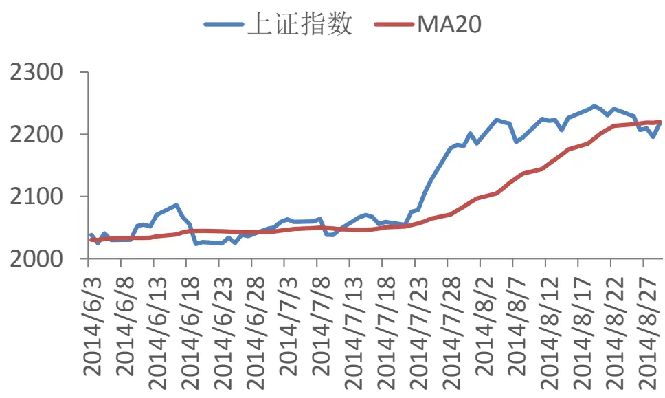
数据来源：广发证券发展研究中心

图3：下跌趋势的20日均线
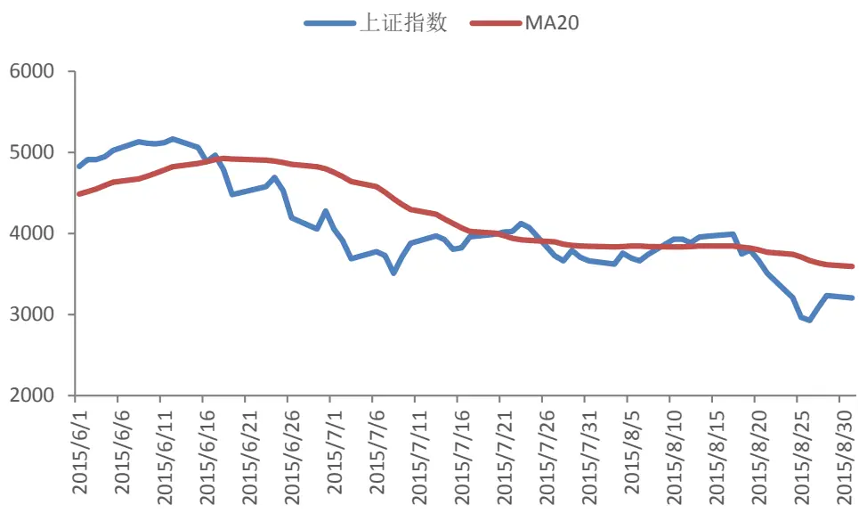
数据来源：广发证券发展研究中心

如果我们考虑价格和价格均线所围成的图形面积，则可以看到，当价格具有上涨趋势的时候，价格与均线围成的面积逐渐增大，直到价格与均线交叉。当市场处于下跌趋势的时候，也有类似的结论。

我们可以将价格与均线之差的部分视作市场的“噪声”，那么价格与均线所围成的

识别风险，发现价值

面积就是“噪声”的累积量。本报告中，基于噪声累积量来识别市场的趋势。

当市场没有趋势的时候，噪声累积量的期望为 0。当市场具有趋势的时候，噪声累积量的期望不为 0。可以通过对噪声累积量的统计检验，确定当前的趋势方向。

当市场具有趋势的时候，噪声累积量的期望值与趋势强度成正比，与均线周期成正比，而且与累积窗口长度成正比。换而言之，我们构建的趋势识别指标通过加入时间窗口求噪声累积量的方式放大了趋势的影响，能够比较灵敏的发现趋势。

## 二、交易模型介绍

## （一）噪声累积量的构建

日内1分钟收盘价格序列为 $p(t),t=1{,}2{,}3,\cdots$

均线参数为 N，则移动平均线

$$
\begin{aligned}&\tilde{p}(t)=MA(p,N)=\frac{1}{N}\sum_{i=0}^{N-1}p(t-i)\\&\ =\ (p(t-N+1)+\cdots+p(t))/N\\\end{aligned}
$$

噪声

$$
\varepsilon(t)=p(t)-\tilde{p}(t)
$$

定义噪声累积量（窗口大小为 L）

$$
\begin{aligned}&S_{L}(t)=\sum_{\mathrm{i}=0}^{L-1}\varepsilon(t-i)\\&=\varepsilon(t)+\varepsilon(t-1)+\cdots+\varepsilon(t-L+1).\\\end{aligned}
$$

噪声的移动标准差为

$$
\sigma(t)=\sqrt{{\sum}_{i=0}^{N-1}\{p(t-i)-\tilde{p}(t)\}^{2}/(N-1)}.
$$

噪声累积量标准差

$$
\Sigma_{L}(t)=\sqrt{{\sum}_{\mathrm{i=0}}^{L-1}\sigma^{2}(t-i)}.
$$

## （二）趋势市场和非趋势市场统计量的分布

在没有明显趋势的市场，我们可以用布朗运动对股价进行建模，设股价序列为$p(t)$ $t=1{,}2{,}3{,}\cdots$ ，则单位时刻股价的变化 $\iota dp(t)=p(t){-}p(t-1)$ 。在短线情况下，可以用如下布朗运动描述股价

$$
dp(t)=\sigma dW(t)
$$

则周期N的股价均值为

$$
\tilde{p}(t)=\cfrac{p(t-N+1)+\cdots+p(t)}{N}=p(t-N)+f_{1}(dW).
$$

其中， $f_{1}(dW)$ 为 $\mathsf{d}W(t)$ 的线性函数，期望为 0。

因此，有

$$
\begin{aligned}\varepsilon(t)&=p(t)-\tilde{p}(t)=f_{2}(dW)\\&\quad S_{L}(t)=f_{3}(dW)\end{aligned}
$$

其中， $f_{2}(dW),\quad f_{3}(dW)$ 都是 $\mathbf{\mathbb{d}}W(t)$ 的线性函数，期望均为0

由此可见，统计量 $S_{L}(t)$ 的期望为 0，即

$$
E\{S_{L}(t)\}=0
$$

在趋势市场，同样可以采用布朗运动对股价进行建模，但是趋势市场的股价模

型中含有漂移率v，即趋势的强度值，

$$
dp(t)=vdt+\sigma dW(t)
$$

$v>0.$ 表示市场处于上涨趋势， $v<0.$ 表示市场处于下跌趋势。

市场没有明显趋势的时候， $v=0$

与震荡市场类似，可以获得 N 周期的均值为

$$
\tilde{p}(t)=p(t-N)+0.5(N-1)vdt+f_{1}(dW)
$$

噪声及其累积量为

$$
\begin{aligned}\varepsilon(t)&=0.5(N+1)vdt+f_{2}(dW)\\S_{L}(t)&=0.5L(N+1)vdt+f_{3}(dW)\end{aligned}
$$

因此，当股价有趋势的时候， $E\{S_{L}(t)\}\neq0$ ，有

$$
E\{S_{L}(t)\}=0.5L(N+1)vdt
$$

噪声累积量的期望值与趋势强度成正比，与均线周期成正比，而且与累积窗口长度成正比。

可以通过对噪声累积量的监测来判断市场是否有趋势。

对 $S_{L}$ 建立监测区间， $(-2\varSigma_{L}(t),2\varSigma_{L}(t))$ ，当 $S_{L}$ 突破此区间时，认为当前市场具有趋势： $S_{L}(t)<-2\varSigma_{L}(t)$ 时，认为市场具有向下趋势； $S_{L}(t)>2\varSigma_{L}(t)$ 时，认为市场具有向上趋势。

因此，策略的开仓信号如下：

1）空头信号

$$
S_{L}(t)<-2\varSigma_{L}(t)
$$

## 2）多头信号

$$
S_{L}(t)>2\varSigma_{L}(t)
$$

建仓之后，按照建仓价格的一定比例进行止损，或者收盘前平仓。

采用2倍标准差来监测时，在 ${\boldsymbol{\cdot}}{\boldsymbol{S}}_{L}(t)$ 服从正态分布的条件下，约有4.6%的误报率，即在市场没有趋势的情况下，有4.6%的概率会产生“错误的”趋势信号。

## （三）趋势识别示意图

下图展示了趋势识别方法的比较。价格序列从第25个时间点之后，开始具有向下的趋势。

普通的区间突破策略不考虑股价在区间内的运行情况。如果按照图中的红线为上下轨进行区间突破趋势识别，在点A 处（第57 个时间点）识别出信号向下的趋势。

基于噪声累积量的趋势识别策略中，在点 C（第 42 个时间点）就可以识别出信号向下的趋势。这是因为，从 B 点之后，噪声累积量就开始将价格与均线之差进行累积，放大了价格趋势对噪声累积量的影响，能够迅速发现市场的趋势。

图4：趋势识别示意图
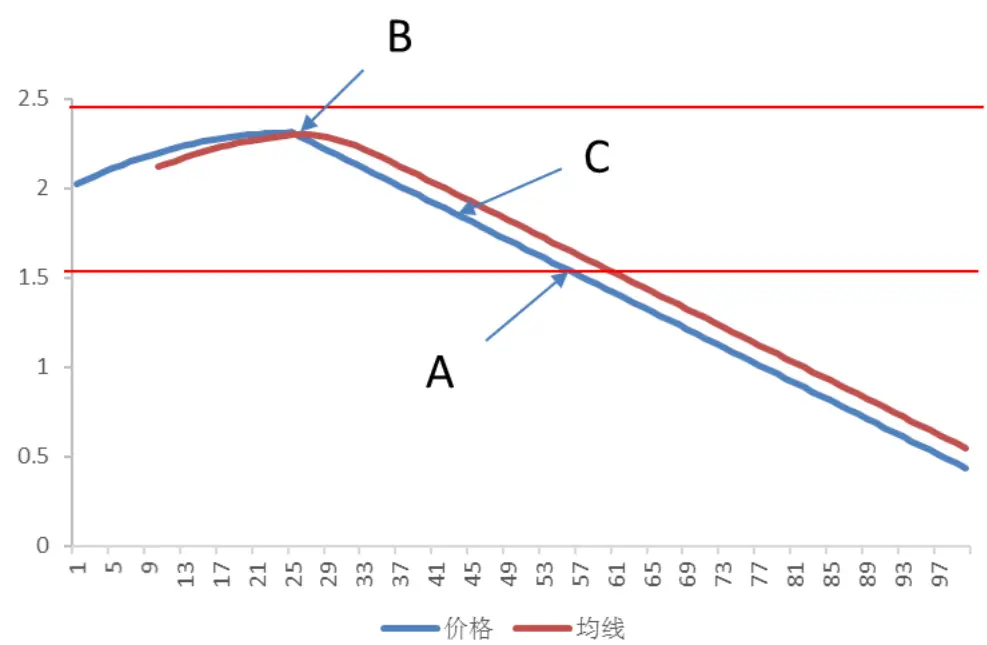
数据来源：广发证券发展研究中心

## 三、实证分析

在这一部分，我们分别以股指期货和国债期货两种金融期货为例，进行交易策略的实证分析。

实证分析分成两部分，首先是参数优化，优化的目标函数是策略的收益回撤比，即策略的年化收益与历史最大回撤之比；需要优化的参数是均线参数N和噪声累积窗口的长度L。通过选取样本内数据测算优化参数之后，获得最优的参数，在样本外进行回测。

策略评价指标：我们选取如下表。需要说明的是，从经验来看，趋势投机策略在严格止损机制下的胜率一般很难超过40%，但盈亏比一般较大，靠亏小赚大盈利。

表 1：交易策略评价体系

| 考察指标 | 说明 |
| --- | --- |
| 累积收益率 | 模拟交易期末的累积收益率（复利计算） |
| 年化收益率 | 累积收益率折算成的年化收益率 |
| 交易总次数 | 总交易次数（自开仓至平仓为一个完整的交易周期） |
| 获胜次数 | 单次交易收益率大于0的次数（含交易成本） |
| 失败次数 | 单次交易收益率小于0的次数（含交易成本） |
| 胜率 | 获胜次数/交易总次数×100% |
| 单次获胜收益率 | 获胜交易的收益率算术平均值 |
| 单次失败亏损率 | 失败交易的收益率算术平均值 |
| 盈亏比 | 单次获胜平均收益率除以单次失败平均亏损率的绝对值 |
| 最大回撤 | 模拟交易资金自最高点缩水的最大幅度 |

数据来源：广发证券发展研究中心

## （一）股指期货实证

数据选取：（1）沪深 300 股指期货（IF）主力合约的 1 分钟收盘价格。2010 年4 月 16 日至 2013年 12 月 31 日为样本内，进行参数优化。2014 年 1 月 1 日至 2016年 5 月 20 日为样本外回测区间。（2）中证 500 股指期货（IC）主力合约和上证 50股指期货（IH）主力合约的价格数据，2015年4 月16 日至 2016 年5月20日的数据进行回测，不再进行新的参数优化。

交易模式：日内交易策略。

交易费用：按照双边万分之二的交易成本来进行计算，在 2015年 9月 7日中金所提高股指期货当日平仓手续费以来，需要留有底仓才能将交易成本控制下来（避免平今仓）。

首先看一下参数优化的情况。样本内参数优化的结果如下图所示，在不同的参数对（N,L）下，全部获得了正收益，而且在绝大部分参数下，策略的收益回撤比大于 1。

在均线参数N=14，误差累积窗口长度 L=8时，策略在样本内的收益回撤比最大，为 4.39。最优参数（14,8）邻近参数的收益回撤比如下表所示，在最优参数的邻域内，策略绝大多数情况下有2.5倍以上的收益回撤比（参数（15,10）表现稍差，收益回撤比也超过了2）。说明策略的参数稳定性比较好。

图5：IF主力合约样本内参数优化结果
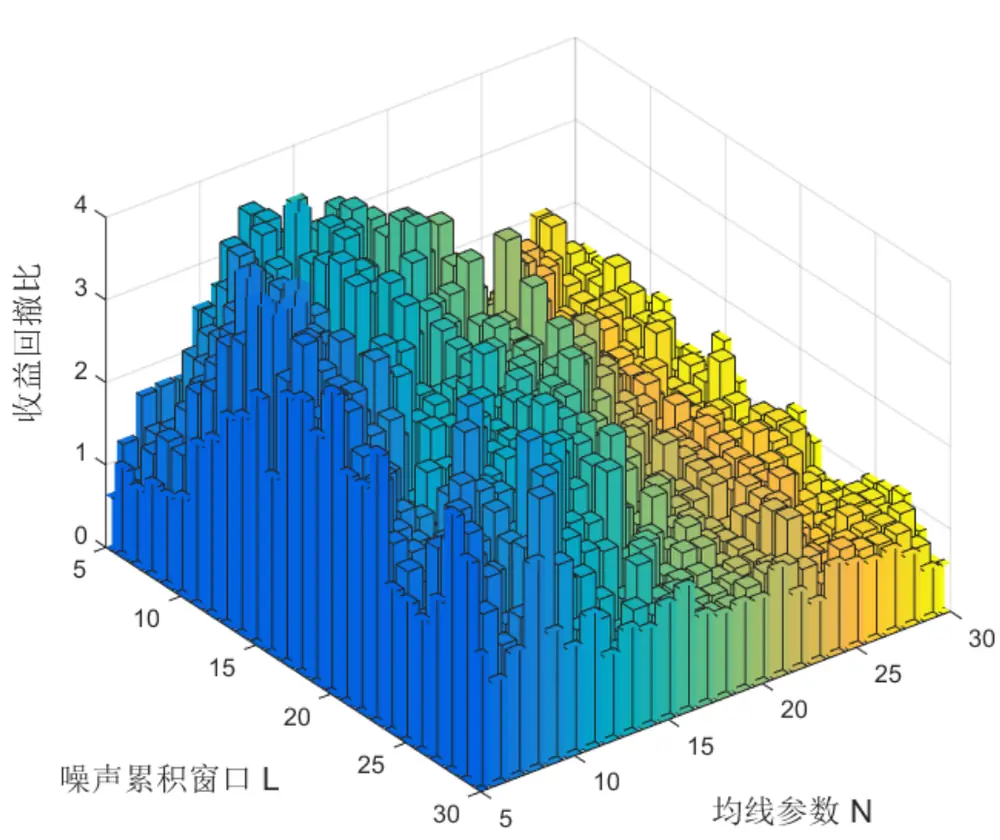
数据来源：广发证券发展研究中心，天软科技

表2：策略在 IF上的参数稳定性

| 参数 | L=6 L=7 | L=8 L=9 | L=10 |
| --- | --- | --- | --- |
| N=12 | 3.26 4.17 | 3.48 3.54 | 2.72 |
| N=13 | 3.40 3.61 | 3.89 3.38 | 2.88 |
| N=14 | 4.07 3.79 | 4.39 3.60 | 2.51 |
| N=15 | 4.16 4.15 3.57 | 2.89 | 2.04 |
| N=16 | 3.30 3.71 3.59 | 2.94 | 2.68 |

数据来源：广发证券发展研究中心，天软科技

策略在样本内和样本外的累积收益曲线如下图所示。在样本内，2010 年 4 月至2013年12月的累积收益率为256.1%，折算成年化收益率为41.0%，最大回撤为-9.3%，有4.39倍的收益回撤比。在样本外，2014年1月至2016年5月的累积收益率为68.4%，折算成年化收益率为 24.4%，最大回撤为-15.5%，收益回撤比为 1.57。

整个回测区间的最大回撤发生在2016年的前4 个月。总体而言，策略的胜率为

41.0%，盈亏比为 1.95。在整个回测区间，单次交易的平均收益率为 0.13%。

图6：IF样本内累积收益曲线
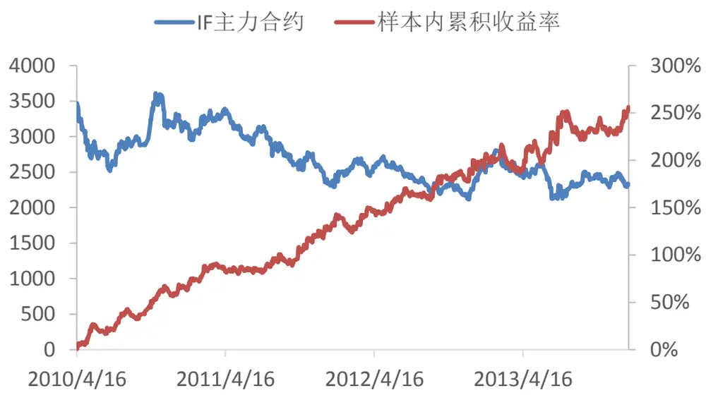
数据来源：广发证券发展研究中心，天软科技

图7：IF样本外累积收益曲线
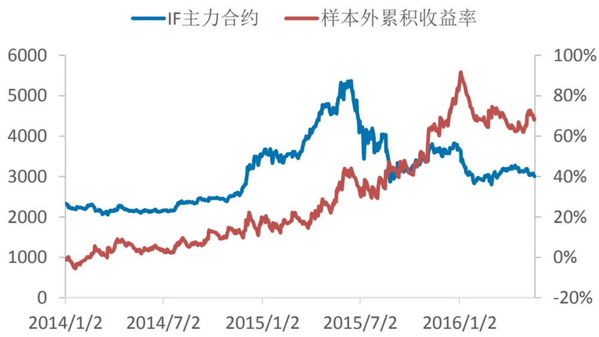
数据来源：广发证券发展研究中心，天软科技

表3：最优参数下策略在 IF上的回测表现

|  | 样本内 样本外 | 全样本 |
| --- | --- | --- |
| 累积收益率 | 256.1% 68.4% | 499.8% |
| 年化收益率 | 41.0% 24.4% | 34.2% |
| 最大回撤 | -9.3% -15.5% | -15.5% |
| 收益回撤比 | 4.39 1.57 | 2.21 |
| 单次交易平均收益 率 | 0.15% 0.10% | 0.13% |
| 交易次数 | 899 582 | 1481 |
| 胜率 | 43.9% 36.4% | 41.0% |
| 盈亏比 | 1.84 2.17 | 1.95 |

数据来源：广发证券发展研究中心，天软科技

在中证500股指期货和上证50股指期货上，本策略表现同样不错。用从沪深300股指期货上优化的参数，直接运用在中证 500股指期货和上证 50股指期货上，同样获得了不错的表现，如下图所示。在中证500股指期货上，策略从 2015年 4月份以来的累积收益率为 69.9%，折算成年化收益率为 61.9%，收益回撤比为 2.31，单次交易的平均收益率为 0.21%。在上证 50股指期货上，策略从2015年 4月份以来的累积收益率为 47.3%，折算成年化收益率为42.2%，收益回撤比为3.12，单次交易的平均收益率为 0.15%。

由于中证 500 的波动比较高，用 IC 进行交易的策略的年化收益率高于 IF 和 IH的表现。

图8：中证500股指期货累积收益曲线
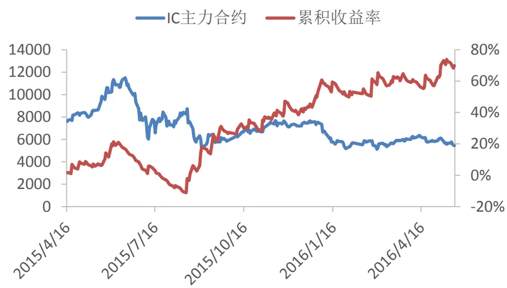
数据来源：广发证券发展研究中心，天软科技

图9：上证50股指期货累积收益曲线
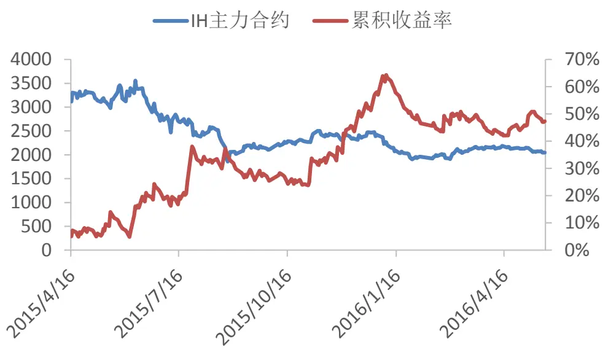
数据来源：广发证券发展研究中心，天软科技

表 4：最优参数下策略在 IC 和 IH 上的回测表现

|  | 中证500股指期货（IC） | 上证50股指期货（IH） |
| --- | --- | --- |
| 累积收益率 | 69.9% | 47.3% |
| 年化收益率 | 61.9% | 42.2% |
| 最大回撤 | -26.8% | -13.5% |
| 收益回撤比 | 2.31 | 3.12 |
| 单次交易 平均收益率 | 0.21% |  |
| 交易次数 | 270 | 0.15% 270 |
| 胜率 | 27.0% | 35.2% |
| 盈亏比 | 3.82 | 2.51 |

数据来源：广发证券发展研究中心，天软科技

## （二）国债期货实证

数据选取：（1）五年期国债期货（TF）主力合约的 1 分钟收盘价格。2013 年 9月至 2014 年 12 月为样本内，进行参数优化。2015 年 1 月以来为样本外回测区间。（2）十年期国债期货（T）主力合约的价格数据，2015年3 月20日以来的数据进行回测。

交易模式：日内交易策略。

交易费用：按照每手 10元的双边交易成本来进行计算。

首先看一下参数优化的情况。样本内参数优化的结果如下图所示，在不同的参数对（N,L）下，全部获得了正收益，而且在绝大部分参数下，策略的收益回撤比大于 2。

识别风险，发现价值

在均线参数N=27，误差累积窗口长度L=14时，策略在样本内的收益回撤比最大，为 8.73。最优参数（27,14）邻近参数的收益回撤比如下表所示，在最优参数的邻域内，策略绝大多数情况下有3倍以上的收益回撤比。说明策略的参数稳定性比较好。

图10：TF主力合约样本内参数优化结果
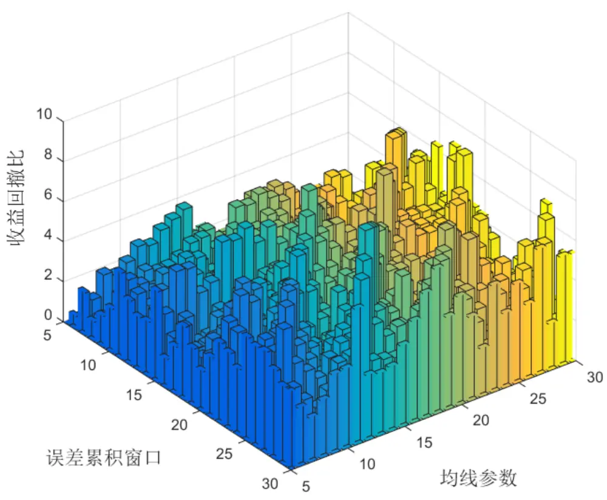
数据来源：广发证券发展研究中心，天软科技

表5：策略在 TF上的参数稳定性

| 参数 | L=12 | L=13 L=14 | L=15 | L=16 |
| --- | --- | --- | --- | --- |
| N=25 | 2.55 | 3.29 4.24 | 4.82 | 7.84 |
| N=26 | 3.85 4.89 | 5.41 | 8.30 | 4.35 |
| N=27 | 4.49 | 4.79 8.73 | 4.74 | 3.52 |
| N=28 | 4.34 7.79 | 4.61 | 3.86 | 4.10 |
| N=29 | 7.37 3.39 | 3.25 | 3.12 | 2.28 |

数据来源：广发证券发展研究中心，天软科技

策略在样本内和样本外的累积收益曲线如下图所示。在样本内，2013 年 9 月至2014 年 12 月的累积收益率为 7.4%，折算成年化收益率为 5.5%，最大回撤为-0.6%，有8.73倍的收益回撤比。在样本外，2015年1月至2016年5月的累积收益率为1.0%，折算成年化收益率为 0.7%，最大回撤为-1.4%，收益回撤比为0.50。

在整个回测区间的最大回撤发生在2015年的第二季度。总体而言，策略的胜率为 35.4%，盈亏比为 2.42。在整个回测区间，收益回撤比为 2.24，单次交易的平均收益率为 0.0125%。

图11：TF样本内累积收益曲线
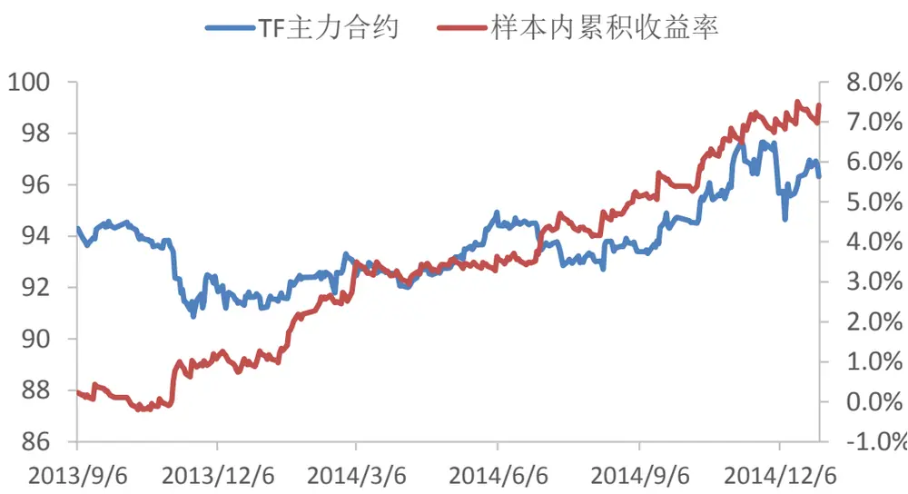
数据来源：广发证券发展研究中心，天软科技

图12：TF样本外累积收益曲线
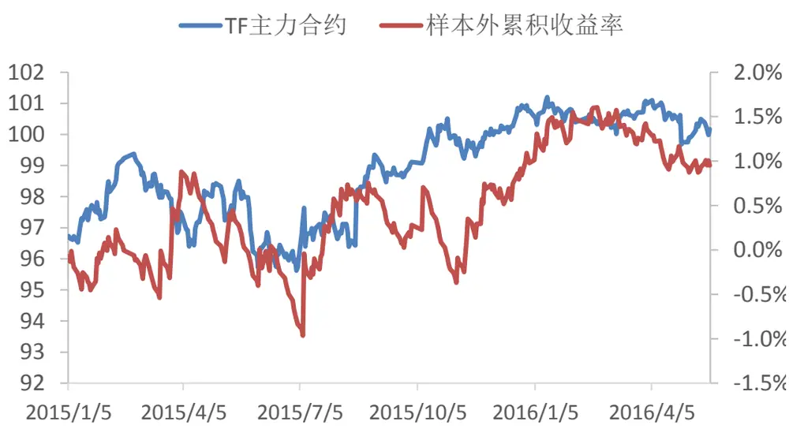
数据来源：广发证券发展研究中心，天软科技

表6：最优参数下策略在 TF上的回测表现

|  | 样本内 样本外 | 全样本 |
| --- | --- | --- |
| 累积收益率 | 7.4% 1.0% | 8.5% |
| 年化收益率 | 5.5% 0.7% | 3.0% |
| 最大回撤 | -0.6% -1.4% | -1.4% |
| 收益回撤比 | 8.73 0.50 | 2.24 |
| 单次交易 |  |  |
| 平均收益率 | 2.31E-04 2.35E-05 | 1.25E-04 |
| 交易次数 | 321 337 | 658 |
| 胜率 | 39.6% 31.5% | 35.4% |
| 盈亏比 | 2.54 2.30 | 2.42 |

数据来源：广发证券发展研究中心，天软科技

在十年期国债期货上，策略从 2015年 3月份以来的累积收益率为 2.7%，折算成年化收益率为 2.2%，收益回撤比为 1.41，单次交易的平均收益率为 0.0095%。

图13：十年期国债期货累积收益曲线
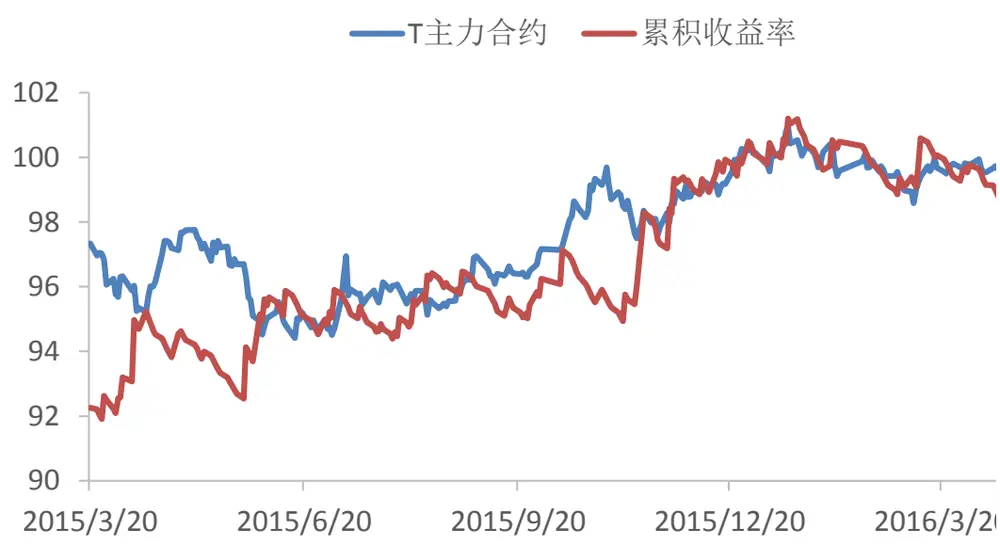
数据来源：广发证券发展研究中心，天软科技

表7：最优参数下策略在十年期国债期货上的回测表现

| 性能指标 | 策略表现 |
| --- | --- |
| 累积收益率 | 2.7% |
| 年化收益率 | 2.2% |
| 最大回撤 | -1.6% |
| 收益回撤比 | 1.41 |
| 单次交易平均收益率 | 9.47E-05 |
| 交易次数 | 288 |
| 胜率 | 26.7% |
| 盈亏比 | 3.33 |

数据来源：广发证券发展研究中心，天软科技

## 四、总结与讨论

本篇报告提出了一种新的趋势识别方法。通过均线系统获得市场的噪声强度，针对噪声累积量构建监测统计量。当市场没有趋势的时候，噪声累积量的期望为 0。当市场具有趋势的时候，噪声累积量的期望不为 0。可以通过对噪声累积量的统计检验，确定当前的趋势方向。

当市场具有趋势的时候，噪声累积量的期望值与趋势强度成正比，与均线周期成正比，而且与累积窗口长度成正比。换而言之，我们构建的趋势识别指标通过加入时间窗口求噪声累积量的方式放大了趋势的影响，能够比较灵敏的发现趋势。

用于沪深 300 股指期货交易时，策略在样本外，2014 年 1 月以来的累积收益率为 68.4%，折算成年化收益率为24.4%，最大回撤为-15.5%，收益回撤比为1.57。

用于中证500股指期货、上证 50股指期货和国债期货交易时，策略也取得了不错的表现。

## 风险提示

策略模型并非百分百有效，市场结构及交易行为的改变以及类似交易参与者的增多有可能使得策略失效。

## Table_RatingIndustry 广发证券—行业投资评级说明

买入： 预期未来12个月内，股价表现强于大盘10%以上。

持有： 预期未来12个月内，股价相对大盘的变动幅度介于-10%～+10%。

卖出： 预期未来12个月内，股价表现弱于大盘10%以上。

## Table_RatingCompany 广发证券—公司投资评级说明

买入： 预期未来12个月内，股价表现强于大盘15%以上。

谨慎增持： 预期未来12个月内，股价表现强于大盘5%-15%。

持有： 预期未来12个月内，股价相对大盘的变动幅度介于-5%～+5%。

卖出： 预期未来12个月内，股价表现弱于大盘5%以上。

## Table_Ad联系我们

| 地址 | 广州市 广州市天河北路183号 | 深圳市 深圳市福田区金田路4018 | 北京市 | 上海市 |
| --- | --- | --- | --- | --- |
|  | 大都会广场5楼 | 号安联大厦 15 楼 A 座 03-04 | 北京市西城区月坛北街2号 月坛大厦18层 | 上海市浦东新区富城路99号 震旦大厦18楼 |
| 邮政编码 | 510075 | 518026 | 100045 | 200120 |
| 客服邮箱 | gfyf@gf.com.cn |  |  |  |
| 服务热线 | 020-87555888-8612 |  |  |  |

## Table_Disclaimer 免 责声 明

广发证券股份有限公司具备证券投资咨询业务资格。本报告只发送给广发证券重点客户，不对外公开发布。

本报告所载资料的来源及观点的出处皆被广发证券股份有限公司认为可靠，但广发证券不对其准确性或完整性做出任何保证。报告内容仅供参考，报告中的信息或所表达观点不构成所涉证券买卖的出价或询价。广发证券不对因使用本报告的内容而引致的损失承担任何责任，除非法律法规有明确规定。客户不应以本报告取代其独立判断或仅根据本报告做出决策。

广发证券可发出其它与本报告所载信息不一致及有不同结论的报告。本报告反映研究人员的不同观点、见解及分析方法，并不代表广发证券或其附属机构的立场。报告所载资料、意见及推测仅反映研究人员于发出本报告当日的判断，可随时更改且不予通告。

本报告旨在发送给广发证券的特定客户及其它专业人士。未经广发证券事先书面许可，任何机构或个人不得以任何形式翻版、复制、刊登、转载和引用，否则由此造成的一切不良后果及法律责任由私自翻版、复制、刊登、转载和引用者承担。