# 风格因子驱动下的行业内量化选股研究

## ——2010 年中期量化投资专题系列报告三

| 罗军 | 研究员 | 李明 | 研究助理 | 胡海涛 | 研究员 | 蓝昭钦 | 研究助理 |
| --- | --- | --- | --- | --- | --- | --- | --- |
| 电话： | 020-87555888-655 | 电话： | 020-87555888-687 | 电话： | 020-87555888-406 | 电话： | 020-87555888-667 |
| eMail: | lj33@gf.com.cn | eMail: | Im8@gf.com.cn | eMail: | hht@gf.com.cn |  |  |

## 风格因子驱动下的行业内量化选股模型原理

本篇报告提出了基于风格因子驱动的量化选股模型，即根据动态的因子回报筛选出合适因子，然后利用基于聚类分析的方法为每个因子赋予权重，并为行业内的个股进行综合评分，挖掘具备持续正 Alpha 能力的股票。我们的模型不仅能提供产生长期稳定正 Alpha 的股票组合，更重要的，我们可以归纳出行业当前最敏感的因子，为投资者或者行业研究员提供新的选股思路。

## 因子覆盖面广、具备动态选择理念、基于聚类分析的权重产生方法是重要的创新点

我们抛弃因子维持不变的理念，每月始终选择过去 1年具备正信息比的因子。

为了防止单一因子权重过大、同类因子之间的多重共线性等问题，因子的权重采用结合聚类分析以及信息比最大化的方法来获取，确保因子权重设置合理。

备选因子库我们选择能刻画公司特点以及股票收益的九类（36个）因子，分别为：资本支出、现金流、成长、价值、变现能力、营运能力、盈利能力、负债以及动量/反转。

## 量化模型在电子元器件行业的历史回测具备较好的结果

从实证结果观察，27个测试月有 19个月我们的量化模型能捕捉到超额收益，有着 70%的成功率。在测试的时间段里我们的超配组合累计收益率是 48%，平均每月收益是 2.5%，信息比是 0.17，是行业指数的两倍以上。

## 电子元器件行业的最新因子推荐

根据 2010-4-30 日最新数据分析，不同周期的股价反转因子都有着较高的权重，电子元器件行业内个股在近期还是有比较大的股价反转效应，尤其更应关注过去一个月收益表现差的个股。同时，价值分析类因子表现也突出，投资者可以重点关注， 特别是市净率低以及动态市盈率低的个股。现金流类因子也可以适时关注。

## 量化选股的简介

量化投资的理论基础在于市场无效性，或者弱有效性，因此投资者可以通过对市场、行业及公司基本面的分析，主动构建一个可以取得战胜市场的组合。在国外成熟市场，数量化投资因其成本低、绩效高的优势正越来越多的应用于投资的几乎所有领域。例如，量化选股、资产配置、组合优化、交易执行，风险控制、绩效评估等环节都可以看到量化投资技术的身影。相对于海外成熟市场，研究A股市场的量化投资方式虽然处于起步阶段，但在股指期货以及融资融券等做空工具推出的背景下，客观上迫切要求投资经理能够应用量化手段归纳客观的选股方式，在众多上市公司中迅速、有效的选出投资目标。而且A股市场的发展历史较短，有效性偏弱，市场上被错误定价的股票相对较多，从而留给定量投资策略去发掘市场的无效性、寻找超额收益的潜力和空间也就更大。基于此，我们致力于开发一系列创新方法，构建高效的量化选股模型。

## 量化选股常用方法

## 多因素模型（Multiple-factor regression）

Ross(1976)建立了套利定价理论（Arbitrage Pricing Theory，APT）。在投资实务中，多因素定价（选股）模型可以看作是APT理论最典型的代表。多因素模型将那些引起证券价格联动的因素直接加入到收益率公式之中，然后开发基于这些因素的模型，简化投资组合分析所要求的关于证券之间相关系数的输入。模型效果的好坏主要取决于因素的选取，即那些被选定的因素是否足以证明，证券收益率之间联动效应的根源在于那些因素对各证券的共同影响。对于因素的选取可以采用逐步回归和分层回归的方法进行筛选，然后进行主成分分析，从众多因素中找出解释度较高的某几个指标，尽可能反映原来所有的信息。另外，多因素模型进一步提出，证券之间的联动性，除了源于市场因素的影响之外，还取决于其他一些非市场因素。

## 动量反转选股

动量反转策略的起源可以追溯到有效市场理论的起源。1900年法国数学家Bachelie首先发现股票价格的变化服从布朗运动，但这一发现当时并没有受到广泛的关注。直到1950年Kendall在经济时间序列分析中强调股票遵循随机游走的模型之后，现代资本市场理论体系才得到了长足的发展。这一理论一经问世，很多学者对其进行了大量的研究，其中包括Samuelson、Mandelbort和Fama。有效市场假说分三个层次，分别为弱有效市场、半强有效市场、强有效市场分别代表价格反映了历史信息、公开信息和全部信息。学术界对有效市场假说的检验分为两类：一是股价收益率分布的检验；二是市场有效性的检验。正是对市场弱有效的检验产生了动量反转策略。

动量效应(Momentum Effect)指的是投资策略或组合的持有期业绩方向和形成期业绩方向一致的股价波动现象；而反转效应(Contrarian

Effect)则指的是投资策略或组合的持有期业绩方向和形成期业绩方向相反的股价波动现象。对于动量和反转效应，学术界有很多解释，其中比较具有说服力的是行为金融学的解释：反应不足和反应过度。如果在市场上发现了动量效应，说明股价对信息反应不足，股价在消息公布后不是第一时间上涨或下跌至其应有的位置，而是较为缓慢的移动至其应有的位置；同理，如果在市场上发现了反转效应，则可说明股价对信息反应过度。由此可见，动量效应与反应不足、反转效应与反应过度，这两组概念是紧密联系在一起的。动量效应和反转效应可以看作是反应不足与反应过度的实证支持。在使用动量反转方法选股的时候，需要考虑以下几个问题：样本选择的区间、不同策略在不同市况下的表现、持有期的长短、显著性检验等。

## 分类和回归树（Classification and regression tree）

分类和回归树是数据挖掘技术的一种，以递归分割技术为基础（常用于制药学的研究），包括分类树和回归树：分类树产生定性输出，回归树处理定量输出，分类和回归树可以用来提取规则和输入和输出变量之间的映射关系。输入数据通过与分裂节点的分割条件作比较，决定其属于左节点还是右节点。不断重复上述过程，就可以得到该输入数据的分类结果.从根节点到叶节点的所有分割条件则指明了输入变量对应输出结果之间的规则。分层决策树采用替代变量的方法解决缺失数据问题，不要求数据的分布，可同时利用各种类型的数据。

## 神经网络（Neural networks）

因为股市的建模与预测所处理的信息量往往十分庞大，因此对算法有很严格要求，它的非线性动力学特性也非常复杂，所以一般传统的方法对于股市的预测往往难如人意。人工神经网络不仅具有大规模并行模拟处理、网络全局作用和非线性动力学等特点，而且有很强的自适应、自学习以及容错能力，具备传统的建模方法所不具有的许多优点，其可以不必事先知道有关被建模对象的参数、结构以及动态特性等方面的知识，对被建模对象经验知识要求不高。而只需给出对象的输入和输出数，通过网络本身的学习功能即可实现输入和输出之间的映射。人工神经络模型具有巨量并行性、存储分布性、结构可变性、高度非线性、自学习性和自组织性等特点，可以逼近任何连续函数，目前作为非线性函数的逼近模型被广范应用。神经网络目前在国际上已广泛用于金融分析和预测，并取得了较好的效果。人工神经络模型已在多变量非线性系统的建模方面取得了惊人的成就，成为一种新兴的预测时间序列方法。

## 量化选股的方法

我们的量化选股运用了投资风格因子驱动的思路来对股票进行选择。即寻找具备超额收益的风格因子构建因子评价模型，并由此筛选因子驱动较强、产生超额收益率概率较高的股票进行投资。 在遵循这种选股思路的前提下，我们搭建基于因子驱动的量化选股平台。

我们的模型是行业中性的，所以可以运用到不同的行业里面。整个的选股流程可以分为以下两个独立的构建体：（1）从不同因子的历史回报中挖掘对行业内个股收益最敏感的因子；（2）产生符合当前市场环境的因子权重，形成完善的因子综合评价模型。

以下我们详细介绍量化模型构建过程。

## 因子回报计算

首先要介绍因子回报的计算方法。根据每个因子取值，模型会在单一时间点给行业内的股票进行排序，然后挑选出前20%和后20%的股票形成两类组合，两类组合在下一个投资周期的收益率差成为因子在当期的收益。为什么要选择前20%和后20%呢？原因是从实证中发现，过大的组合会降低收益差，使得因子的回报不明显，但过小的组合又不能充分反映因子对于行业影响。

我们的模型所涵盖的因子有34个之多，主要是不同的财务指标和动量指标。根据它们经济性质的不同，可以细分为以下的9大类（图表1）：

图表 1：所有因子

经营活动产生的现金流量净额/总市值经营活动产生的现金流量净额／营业收入

| 价值分析 |
| --- |
| 股息率 |
| 企业倍数(EV2/EBITDA) |
| 市净率(最新) |
| 市现率 |
| 市盈率 |
| 预测市盈率 |
| 市销率 |

| 流动性 |
| --- |
| 流动比率 |
| 速动比率 |
| 保守速动比率 |

| 盈利能力 |
| --- |
| 净资产收益率 ROE(摊薄) |
| 总资产净利润 ROA |
| 息税前利润/营业总收入 |
| 营业利润／营业总收入 |
| 净利润/营业总收入 |

| 运营 |
| --- |
| 固定资产周转率 存货周转率 总资产周转率 流动资本周转率 |

| 动量/反转 |
| --- |
| 一个月内评级改变 |
| 一个月股价动量/反转 |
| 三个月股价动量/反转 |
| 六个月股价动量/反转 十二个月股价动量/反转 |

| 负债 |
| --- |
| 资产负债比 |

识别风险，发现价值

## 负债权益比

数据来源：广发证券发展研究中心

选择敏感性强的因子对于我们的模型至关重要。 在收录的因子中，并没有包括任何宏观经济指标。在我们看来，宏观经济指标的指向性太广，对于某一行业内的股票选择起不到独特的作用。从上表可以看出大部分的因子还是以公司的财务指标为主。相信通过考察上市公司的估值指标、盈利能力、盈利质量、成长能力（高速成长）、运营能力以及负债水平等等因子的回报，以此发现行业内的投资风格，以便筛选出成长型的优质股票。在检验个股的投资成效上，我们运用了个股的一个月内评级改变和不同时期股票价格的动量反转作为因子来考量。一个月的评级改变实际就是前一个月内评级调高家数和评级调低家数之差。评级改变越大，证明个股越被看好。

模型所运用的财务指标因子一般截取于上市公司的年报和季报。每个上市公司出年报和季报的时间不同，而且一般都会延后3个月才发布。但模型每个月底都会进行排序，然后计算下一个月的因子回报。为了排序时的可比性，我们为模型作出了如下的假设：

今年的1月底，2月底，3月底会使用上一年度的第三季度报表数据；

今年的4月底，5月底，6月底会使用上一年度的年末报表数据；

今年的7月底，8月底，9月底会使用同年的第一季度报表数据；

今年的10月底，11月底，12月底会使用同年的半年报表数据。

而且，在基于因子排序的时候，方向并不是所有因子都一样。例如市盈率（P/E）,我们认为越低的股票越能实现超预期的收益，在计算回报时，应该是市盈率最低减去最高的收益差。所以，每一个因子我们都会赋予模型一个排序方向：正向，表明因子越大，个股越好。反向：表明因子越小，个股越好。并且，在计算股价动量因子回报时，我们发现电子器件行业内股价动量效应较差，反转能力很强。前期收益较差股票表现平均而言优于收益较好股票。所以所有的动量因子都是反向排序，即股价具备反转性。

## 驱动因子选择：每月动态调整

我们的量化模型所应用的因子库并不是总维持不变，会每个月动态调整。每个月底都会根据因子在过去12个月的信息比动态的筛选出正值的因子，正值越大，证明因子对行业的影响越大。信息比的计算公式如下：

$$
IR=\frac{12个月平均回报}{标准差}
$$

运用12个月的信息比可以很好的体现出因子对于行业近期影响的趋势。

## 因子权重计算：基于聚类分析的方法

挑选好因子以后，一般的量化模型会直接给因子赋予权重。 但我们想强调的是，不同因子之间是可能存在着相关性的， 分别对所有的因子直接赋予权重有可能引起多重共线性的问题，使我们没法获得独立的不同的风险溢价源。而且会引起同类因子赋予过多权重的问题，使得动态形成的Alpha源有所偏差。所以，我们的模型利用了聚类分析法，把正值的因子根据它们前36个月回报的相关系数进行聚类，把类与类之间的独立性体现出来。以下是聚类的演示图：

图表 2: 2010年 3月 31日电子元器件行业的因子聚类图
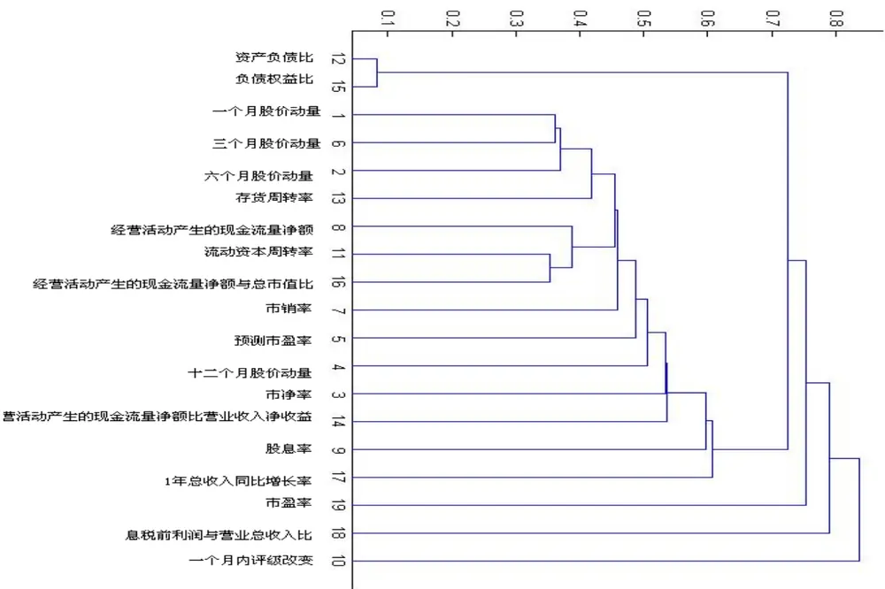
数据来源：广发证券发展研究中心

由上图可以看出，量化模型根据设定好的相关系数阀值把筛选出来的因子分成了不同的聚类。但不同类别之间的因子也有可能存在着高相关性，流动资本周转率与经营活动产生的现金流量净额与总市值比就有比较高的历史相关性。通过模型的量化分析，我们也能把经济性质不同的因子归类，找出新的ALPHA源。经过聚类后，没被聚类的因子各自成为独立的ALPHA源。根据这些独立的ALPHA源，我们就能判别出在行业在当前时段的投资风格。

## 不同类之间加权

通过聚类后，我们可以通过对不同类之间赋予权重的方法来产生模型中各驱动因子的权重。通常会包括平均加权法，与最大加权法两类方法。

平均加权法：不同类之间赋予同样的权重；

最大加权法： 每一类的权重是跟类里最大信息比的因子呈正比。

$$
w(k)=\frac{\max(IR_n)}{\sum\limits_{i\in cluster_k}\max(IR)}
$$

$$
\forall n\in cluster_{k},\quad k=1,2,3,...,K
$$

其中， 我们发现最大加权法更有实效性。每个ALPHA源对于行业的影响都不相同，如果赋予相同权重，必然导致影响大的被低估，影响小的被高估。

## 同类之间加权

同类因子之间的加权应该以它们的信息比为基础，整个类的总权重应该等于以上最大加权法所赋予的权重。 具体的公式如下：

$$
w(n,k)\propto\frac{IR_{n}}{\sum_{i\in cluster_{k}}IR_{i}},
$$

$$
\forall n\in{cluster}_{k},\quad k=1,2,3,...,K
$$

其中： w n k ( , ) ＝ 在K聚类里n因子的权重

IR ＝ 因子的最近12月信息比

## 行业内个股打分（ALPHA SCORE）

在确定了驱动因子以及各因子的权重后，下一个问题就是，如何为个股基于这些因子的取值以及动态权重给一个当月的实际打分。在前面已经提到，在计算因子收益时，模型只考虑最好20%股票组合和最差20%的收益差。在当月实际打分时，我们的量化模型也会选择相同策略。对应一个因子，如果公司属于最好的20%的股票组合，模型会给它的股票打+1分，如果属于最差的20%，会获得-1分。如果两格不入，则得0分。我们相信，通过这样的打分系统，投资者能更好的去了解个股在行业里的可投资性。

当然，这只是对个股针对单个因子打分。根据每个因子的权重不同，模型会每月为个股单个因子打分进行动态加权。得到股票最终的综合得分。加权的公式如下：

$$
\alpha(s)=\sum_{k=1}^{K}\sum_{n=1}^{N(k)}w(n,k)\times V(s,n,k)
$$

其中：w n k( , )＝ 在K聚类里n因子的权重

$$
v(s,n,k)=s公司在k类里n因子的原始打分
$$

下图总结了我们量化模型整个选股流程：

图表 3：量化模型流程
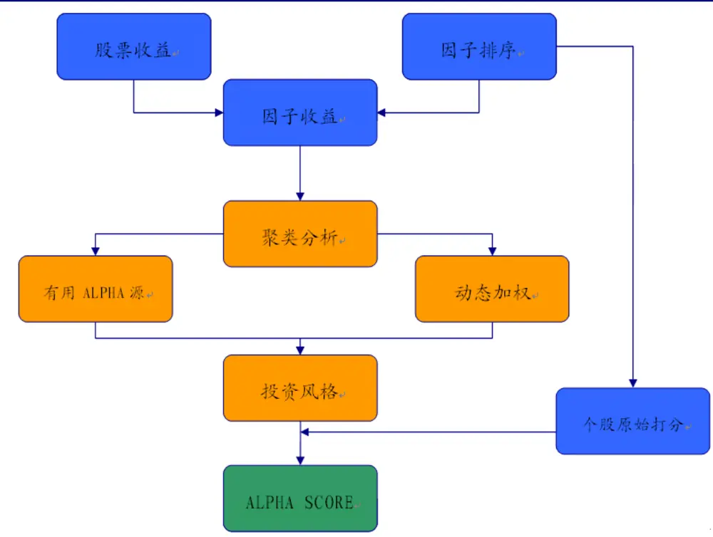
数据来源：广发证券发展研究中心

## 投资建议

在完成上述行业内ALPHA打分后，挑出前20%股票和后20%的股票便可构建超配以及低配的投资组合，为了检验上述方法的有效性，下文将以申万电子元器件行业为例进行实证检验。

## 电子元器件行业量化选股实证分析

我们选择2008年1月到2010年3月作为模型的测试窗口， 电子元器件行业的所有股票为样本空间。每月根据模型所推荐的前20%股票组合和后20%股票组合进行模拟投资，然后计算它们下月的收益差。下图是27个月以来收益差的变化。

图表 4：股票组合投资收益差

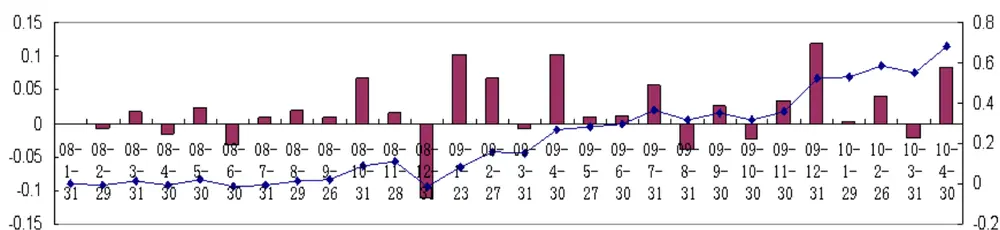
数据来源：广发证券发展研究中心

从运行结果看来，有19个月我们的量化模型能捕捉到正值的收益差，有着70%的成功率。虽然一开始累计收益差一直徘徊于0值区域，这主要受累与2008年的金融危机，但从2009年2月开始，累计收益差的曲线一直保持着稳步上扬的趋势。期间，有好几个月的当月收益差达到10%以上。所以，我们有理由相信我们的量化模型在捕捉正值的超额风险回报上有着显著的成效。

图表 5：前 20%的股票组合收益与行业收益对比
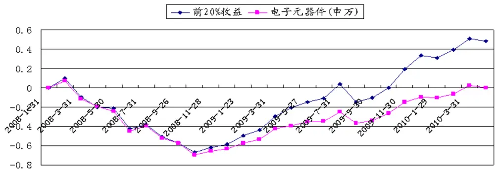
数据来源：广发证券发展研究中心

对比我们前20%股票组合和电子元器件的行业指数收益，在2009年1月以前组合跟指数的步伐一致。 但随后的时间段里，组合的上涨力度加强，逐渐与指数拉开距离。经过最后计算，在测试的时间段里我们的投资组合的最后累计回报是48%，平均每月收益是2.5%，信息比是0.17，是指数的两倍以上。综合以上的分析，我们的量化模型在电子元器件行业内选股的成效性还是令人满意的。

## 电子元器件行业最新驱动因子构建

## 最近12个月因子回报分析

资本支出

图表 6：资本支出准则的平均因子回报

| 行业 电子元器件 | 资本支出折旧比 -0.005800056 | 经营活动产生的现金流量净额比营业收入净收益 0.019962197 |
| --- | --- | --- |

数据来源：广发证券发展研究中心

从12个月的平均值来看，资本支出类的因子表现中规中矩。资本支出折旧比12个月的累计收益差一直平稳的在-0.05到-0.15的区间徘徊，而且超过半数月份相对收益在0以下，所以证明电子元器件行业资本支出折旧比小的公司股票在过去12个月略优与资本支出折旧比大的公司。经过2009年9月到12月相对收益的下降，经营活动产生的现金流量净额比营业收入净收益因子的表现从2010年1月开始反转，而且势头强劲。到2010年4月底为止，因子的累计相对收益达到25%。尤其在2010年的3月和4月份，相对收益都分别为5%和10%。证明之2010年初开始，现金流占营业收入大的公司在股价上比占比小的公司有非常突出的表现。

图表 7：资本支出准则的累计因子回报
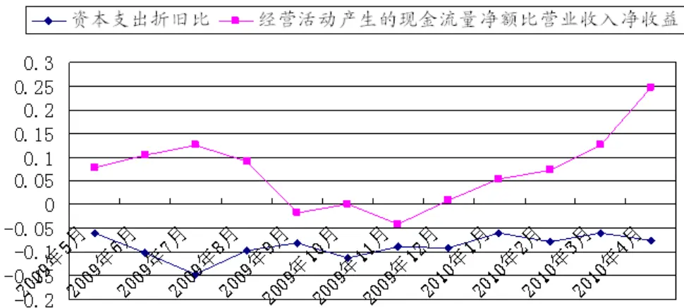
数据来源：广发证券发展研究中心

图表 8：资本支出准则的每月因子回报
□资本支出折旧比经营活动产生的现金流量净额比营业收入净收益
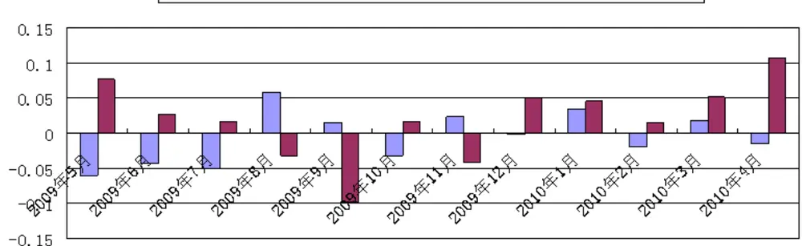
数据来源：广发证券发展研究中心

现金流

图表 9：现金流的平均因子回报

| 行业 | 经营活动产生的现金流量净额与总市值比 | 经营活动产生的现金流量净额与营业收入比 |
| --- | --- | --- |
| 电子元器件 | 0.0189694 | 0.005156211 |

数据来源：广发证券发展研究中心

现金流类因子从12个月平均收益来看还是有不错的表现。从累计相对收益来看，两个因子前6个月的变化很像。 2009年12月之前，两个因子的累计收益都还是负值。但之后连续5个月的反转使得第一个因子的相对累计收益达到22%。第二个因子表现相对比较弱，经过10个月的反复，最后得到5%的累计收益。 综合对两个因子的量化分析，不难发现从2010年初开始， 经营活动中现金流充足的公司股价一般都优于现金流相对弱的公司。特别是占总市值比大的公司，它们比占比低的公司更有优胜。

图表 10：现金流的累计因子回报
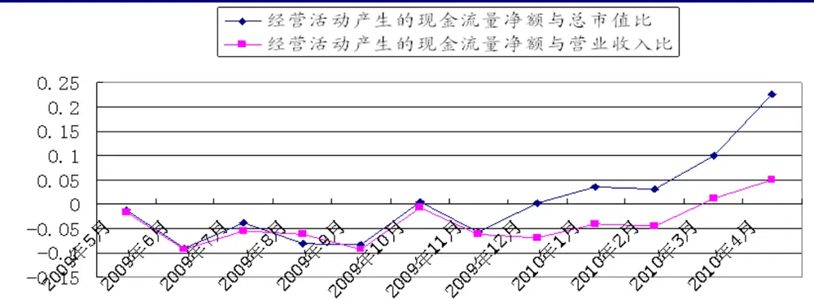
数据来源：广发证券发展研究中心

图表 11：现金流的每月因子回报
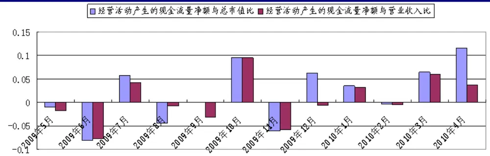
数据来源：广发证券发展研究中心

## 营运能力

图表 12：营运能力的平均因子回报

| 行业 | 固定资产 周转率 | 存货周转率 | 总资产周转率 | 流动资本周转率 | 长期债务与营运资金比率 |
| --- | --- | --- | --- | --- | --- |
| 电子元器件 | -0.01033 | 0.010619 | -0.00302 | 0.01453 | -0.01093 |

数据来源：广发证券发展研究中心

营运能力类因子的两极分化比较明显。存货周转率和流动资本周转率因子的12个月的平均相对收益在1%以上，而且累计收益都为正。但其它的3个因子的平均收益为负，而且累计收益有明显的下降趋势。结合每月收益的柱状图来分析，2009年8月到10月间，所有因子收益都为负值，严重拖累了所有因子的相对收益。 但11月时存货周转率与流动资本周转率因子有较强的表现，使得它们的累计收益保持在了正值区间。而其他三个因子由于缺乏向上动力，所以跟上述两因子产生分化。所以，近期我们需要关注行业内存货周转率高和流动资本强的个股。

图表 13：效率的累计因子回报
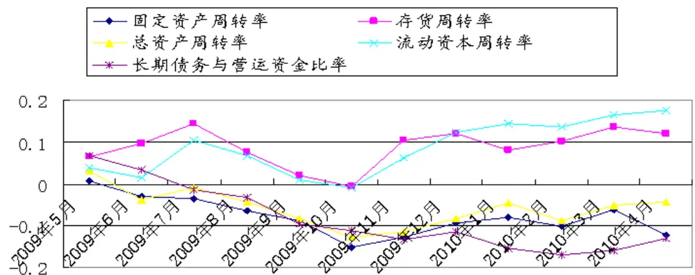
数据来源：广发证券发展研究中心

图表 14：营运能力的每月因子回报
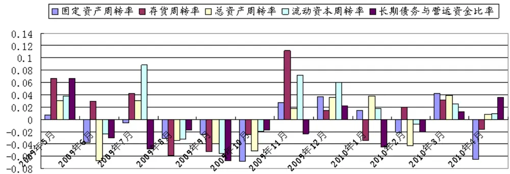
数据来源：广发证券发展研究中心

负债

图表 15：负债的平均因子回报

| 行业 | 资产负债比 | 负债权益比 |
| --- | --- | --- |
| 电子元器件 | 0.00108296 | 0.00018492 |

数据来源：广发证券发展研究中心

从12个月的平均收益来看，负债类的两个因子都能贡献正值的收益。但从累计收益图和每月收益图上，我们可以看出收益的波动率很大。两因子的累计收益形成了一定的顶背离状态，原因主要是由于每月收益在正值与负值之间变动的频繁。而且从2010年2月到4月之间，每月收益都为超过-2%，累计收益形成了向下移动的趋势，所以两因子的近期表现不好，我们也并不推荐相关的个股。

图表 16：负债的累计因子回报
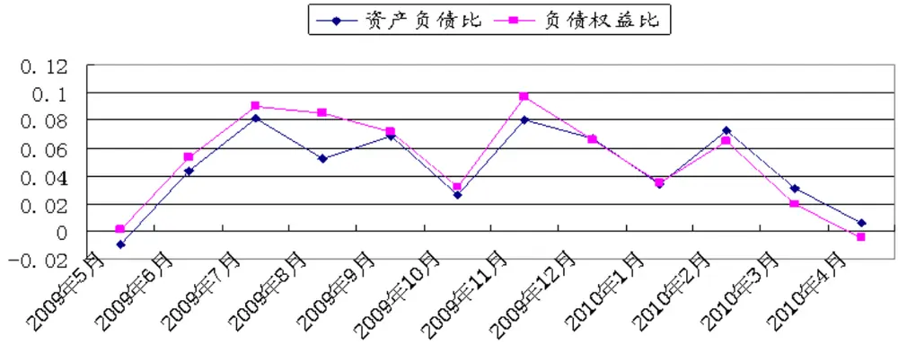
数据来源：广发证券发展研究中心

图表 17：负债的每月因子回报
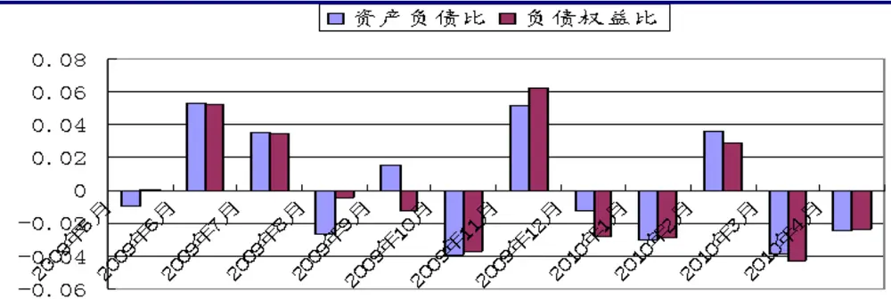
数据来源：广发证券发展研究中心

## 成长能力

图表 18：成长能力的平均因子回报

| 行业 | 经营活动产生的现金流量 | 预测每股收益 | 1年总收入同比增长率 |
| --- | --- | --- | --- |
|  | 净额同比增长率 |  |  |
| 电子元器件 | 0.016493724 | -0.00741 | -0.00517 |

数据来源：广发证券发展研究中心

成长能力类因子近一年的表现还是比较偏弱。 2009年5月到6月期间，由于预测每股收益和1年总收入同比增长率因子每月的同比收益都超过-5%负值，拖累了两因子接下来的表现。 虽然之后有某几个月两因子都有比较好的正值收益，但整体来说两因子都移动于0值线的下方，近期可关注性不大。但经营活动产生的现金流量净额同比增长率因子却有着不错的表现。从2009年12月起，因子累计收益稳定上涨，全年累计收益收于20%。所以近期现金流同比增快的个股要比增长慢的有非常明显的优势，值得关注。

图表 19：成长能力的累计因子回报
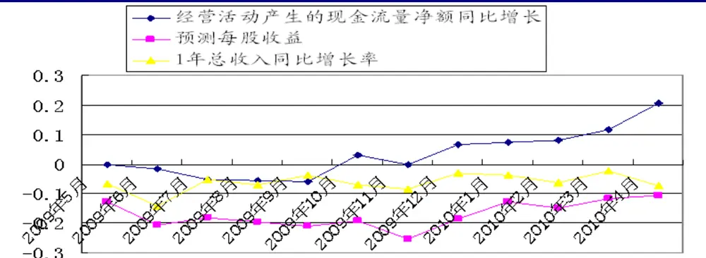
数据来源：广发证券发展研究中心

图表 20：成长类因子的每月因子回报
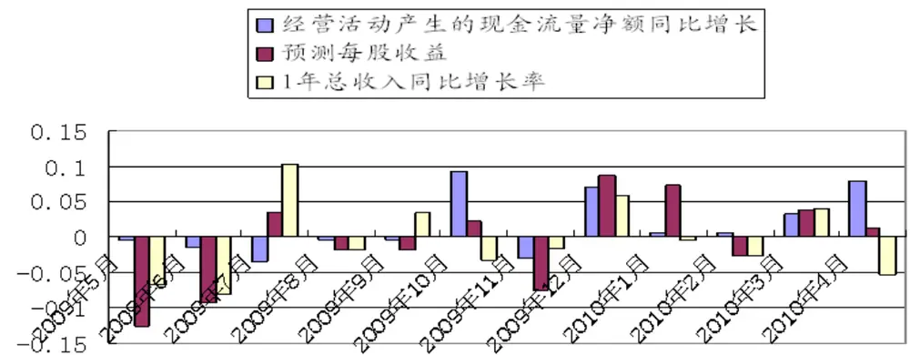

数据来源：广发证券发展研究中心盈利能力

图表 21：盈利能力的平均因子回报

| 行业 | 净资产收 | 总资产净 | 息税前利润与 | 营业利润与营 | 净利润与营业总收入比 |
| --- | --- | --- | --- | --- | --- |
| 电子元器件 | 益率 ROE -0.00723 | 利润 ROA -0.0052 | 营业总收入比 0.000589 | 业总收入比 0.002588 | -0.00027 |

数据来源：广发证券发展研究中心

盈利能力各指标月度收益为正的有8个月，占比约为7%，表现还算中规中矩。受前两个月表现拖累，累计月度收益徘徊在零以下，但各指标尤其是后三个利润与收入比指标从09年8月开始脱离底部开始向上，经过几个月的震荡，在10年4月达到了最大值，尤其是营业利润与营业总收入指标累计收益差在10年4月达到了正值，说明营业利润、息税前利润、净利润占营业收入比值三因子表现在09年8月之后得到了明显的改善，另外，三因子表现趋势颇为相似可以考虑筛选掉其中两个。净资产收益率ROE、总资产收益率ROA两个因子表现较为疲弱，在样本期内累计收益表现基本徘徊在-10%~-20%，但在10年3月开始有所改善，尤其在4月份突破该区间达到期内最大值。

图表 22：盈利能力的累计因子回报
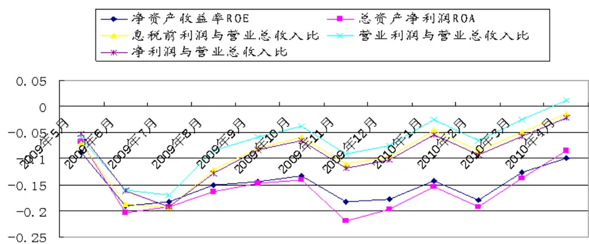
数据来源：广发证券发展研究中心

图表 23：盈利能力的每月因子回报
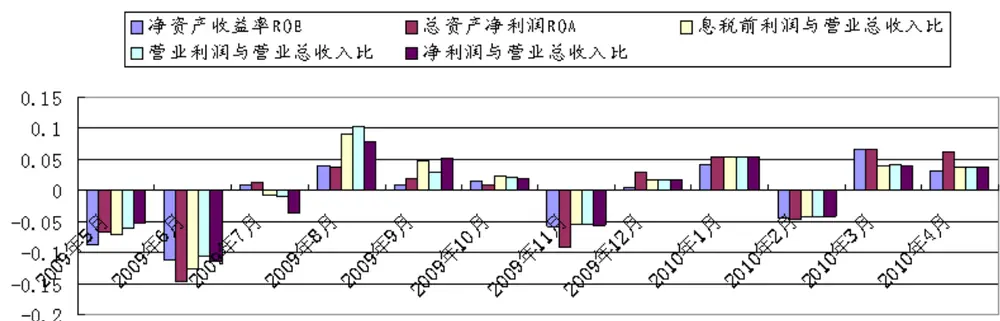
数据来源：广发证券发展研究中心动量/反转

图表 24：动量/反转的平均因子回报

| 行业 | 一个月股价 反转 | 三个月股价 反转 | 六个月股价 反转 | 十二个月股价 反转 | 一个月内评级改变 |
| --- | --- | --- | --- | --- | --- |
| 电子元器件 | 0.034787 | 0.013599 | 0.020749 | 0.019245 | 0.034337 |

数据来源：广发证券发展研究中心

股价反转类指标表现强劲，与我们的预期相符。在绝大多数月度收益表现为正且最高接近于25%。累计相对收益表现在12个月样本期内全部为正，且趋势皆为向上，在09年12月除十二月反转外其余各因子累计相对收益差均达到顶峰，最高的为一个月评级改变因子其累计回报差额达到70%，最低的十二个月反转指标累计回报差额也达到16%。综合成效表现，可以证明12个月样本期内反转效应非常明显，股票反转效应是一个十分明显且将长期存在的市场现象。由此可以预计基于反转效应的量化模型应有不错的表现。

图表 25：动量/反转的累计因子回报
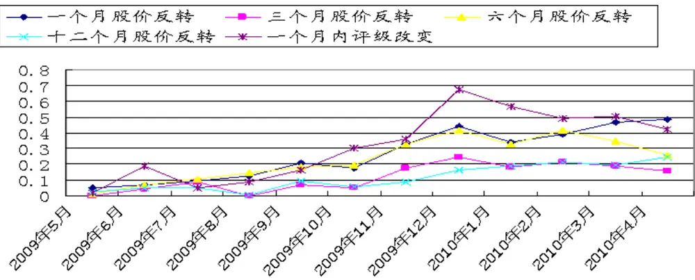
数据来源：广发证券发展研究中心

图表 26：动量/反转的每月因子回报
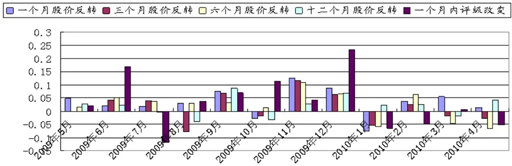
数据来源：广发证券发展研究中心

## 流动性

图表 27：流动性的平均因子回报

| 行业 | 流动比率 | 速动比率 | 保守速动比率 |
| --- | --- | --- | --- |
| 电子元器件 | -0.00647026 | -0.00626 | -0.01056 |

数据来源：广发证券发展研究中心

综合流动性因子表现来看，虽然三因子在样本期内月度收益为正的月份占了7个月，但受09年7月、11月和10年3月大幅度负值的拖累，三因子累计相对收益差自09年11月向下突破之后一直徘徊在-8%之下，流动比率、速动比率因子走势相似，在10年4月上行到区间最高点，接近-8%；而保守速动比率表现要差于前两个因子，其表现为正的月度收益只有四个月，其余皆在0或0之下，由此可说明样本期内流动性低的股票后续表现反而会好于流动性高的股票。

图表 28：流动性的累计因子回报
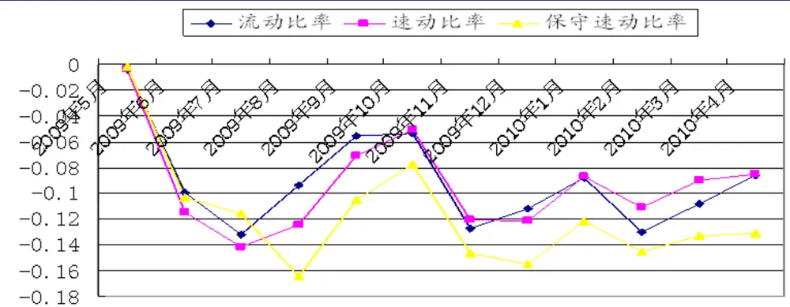
数据来源：广发证券发展研究中心

图表 29：流动性的每月因子回报
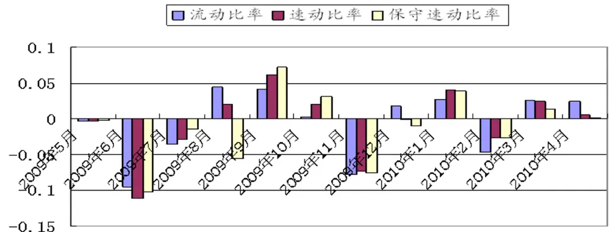
数据来源：广发证券发展研究中心价值分析

图表 30：价值分析的平均因子回报

| 行业 | 股息率 | 企业倍数 | 市现率 | 市净率 | 市盈率 | 预测市盈 率 | 市销率 |
| --- | --- | --- | --- | --- | --- | --- | --- |
| 电子元器 件 | 0.035849 | -0.01844 | -0.01908 | 0.024503 | -0.00453 | 0.029793 | 0.023331 |

数据来源：广发证券发展研究中心

从下图来看，12个月样本期内价值因子表现分化为两部分。其中，股息率、市净率、市销率及预测市盈率因子表现比较优异，绝大多数样本期收益都为正值。股息率因子在10年3月收益急转之下为-11%之后紧接着4月份反转达到样本期内最大值23%，由此其累计收益表现继续维持强势上行趋势；机构给出的未来预期市盈率指标表现也十分不错，除09年5、6月份在0以下徘徊之外，09年7月开始，其累计相对收益表现开始一跃为正，尽管中间又有几个月收益轻微反复，但从09年11月开始累计收益率一路强势上行，在10年4月达到期内最大值40%；另外两个因子市净率和市销率表现也比较优异，而且累计收益图形显示，从09年11月开始二者表现颇为相似。表现较为疲弱的因子有市盈率、企业倍数和市现率因子。市盈率因子12月样本期月收益除09年5月表现为正之外基本上处在0~-3%范围内，进入10年亦没有较为欣喜的表现，只有10年4月开始转为正值，证明市盈率低的个股后续表现稍差于市盈率高的公司。企业倍数指标累计收益表现除09年6月在0轴之上其余月份一路向下，证明EV/EBITDA低的公司表现稍差。从累计相对收益差的图形上看出，市现率指标图形趋势与企业价值倍数相似，说明市现率高的公司表现稍好于市现率低的公司。

图表 31：价值分析的累计因子回报
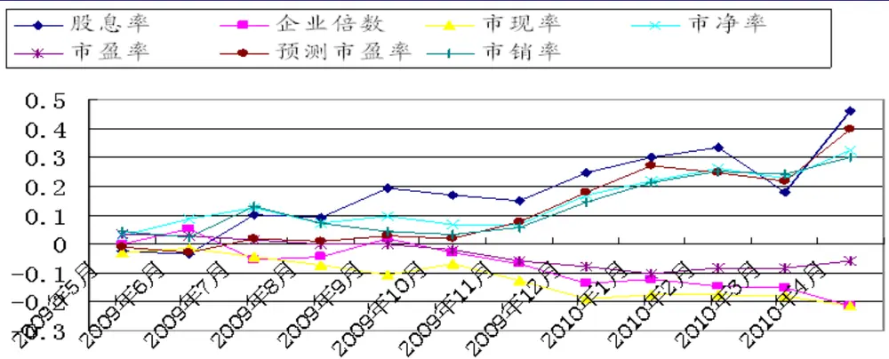
数据来源：广发证券发展研究中心

图表 32：价值分析的每月因子回报

股息率企业倍数□市现率□市净率市盈率预测市盈率市销率
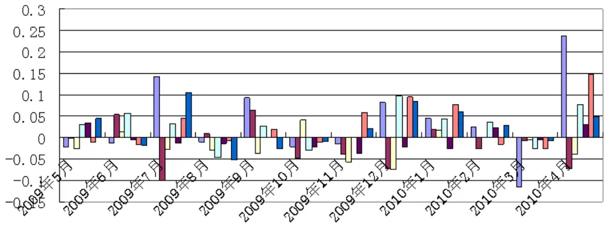
数据来源：广发证券发展研究中心

从以上分析的所有因子中，模型挑出了所有信息比为正的因子。根据这些因子的36个月回报的相关系数，模型把回报相关系数大于0.6的因子归于同一类，形成具体的ALPHA源。具体的归类如下：

## 行业内的因子聚类

图表 33：电子元器件行业的因子聚类

| 1 | 存货周转率 |  | 经营活动产生的现金流 |
| --- | --- | --- | --- |
| 2 | 经营活动产生的现金流量净额同比增长率 | 流动资本周转率 | 量净额与总市值比 |
| 3 | 市销率 |  |  |
| 4 | 预测市盈率 |  |  |
| 5 | 十二个月股价动量 |  |  |
| 6 | 市净率 |  |  |
| 7 | 经营活动产生的现金流量净额比营业收入净收益 |  |  |
| 8 | 股息率 |  |  |
| 9 | 1年总收入同比增长率 | 负债权益比 |  |
| 10 | 资产负债比 |  |  |
| 11 | 市盈率 |  |  |
| 12 | 息税前利润与营业总收入比 |  |  |
| 13 | 一个月内评级改变 |  |  |
| 14 | 一个月股价反转 | 六个月股价反转 | 三个月股价反转 |

数据来源：广发证券发展研究中心

由上表可知，经营活动产生的现金流量净额同比增长率，流动资本周转率和经营活动产生的现金流量净额与总市值比三因子虽然性质不同，但却拥有高于0.6的历史回报相关系数。这证明了流动资产强，现金流充足的公司股价有着很高的相关性。资产负债比和负债权益比的相关系数为0.917，基于他们的性质，有如此高的相关性并不为奇。 一个月，六个月和三个月的反转因子也因为它们很强的相关性而被聚为一类。每一个类可以理解为一个alpha源。

## 行业内4月30日的因子权重

根据聚类， 模型为所有筛选出来的因子加权，结果如下：

图表 34：电子元器件行业因子的动态权重

| 因子 | 动态权重 |
| --- | --- |
| 一个月股价反转 | 0.123482333 |
| 市净率 | 0.104063857 |
| 预测市盈率 | 0.058135737 |
| 十二个月股价反转 | 0.093361558 |
| 市销率 | 0.091276194 |
| 六个月股价反转 | 0.071853486 |
| 股息率 | 0.041652772 |
| 经营活动产生的现金流量净额同比增长率 | 0.071249357 |
| 经营活动产生的现金流量净额比营业收入净收益 | 0.066721461 |
| 一个月内评级改变 | 0.06239191 |
| 流动资本周转率 | 0.060640113 |
| 经营活动产生的现金流量净额与总市值比 | 0.041687811 |
| 三个月股价反转 | 0.044748939 |
| 存货周转率 | 0.038883774 |
| 经营活动产生的现金流量净额与营业收入比 | 0.014289183 |
| 营业利润与营业总收入比 | 0.008176663 |
| 资产负债比 | 0.00481499 |
| 息税前利润与营业总收入比 | 0.001756742 |
| 负债权益比 | 0.00081312 |

数据来源：广发证券发展研究中心

可以看出，不同时间股价反转因子都有着很高的权重，证明电子器件行业在近期还是有比较大的股价反转，一个月股价反转有最高的权重，建议关注过去一个月收益表现差的个股。同时，价值分析类因子表现也突出，投资者可以近期关注， 尤其是市净率低的个股。当然，现金流因子当月也有不错的表现，所以现金流强的个股也可以适时关注。

## 模型推荐的股票组合

根据量化模型的分析，在2010年4月30日时根据个股的原始分数加权后，我们挑选出前20%综合得分最高的股票组合和后20%得分最低的股票组合：

图表 35：电子元器件行业挑选股票

| 股票 | ALPHA SCORE | 股票 | ALPHA SCORE |
| --- | --- | --- | --- |
| 前20%股票组合 |  | 后20%股票组合 |  |
| 上海金陵 | 0.603755521 | ST 磁卡 | -0.205807676 |
| 大恒科技 | 0.490932898 | 顺络电子 | -0.206895802 |
| 天津普林 | 0.465633812 | 亿纬锂能 | -0.221852889 |
| 特发信息 | 0.363571323 | 法拉电子 | -0.233267996 |
| 深圳华强 | 0.320789304 | 远望谷 | -0.23451824 |
| 振华科技 | 0.311942476 | 威创股份 | -0.234581649 |
| 康强电子 | 0.286007884 | 蓉胜超微 | -0.241232425 |
| 浙江阳光 | 0.254120908 | 歌尔声学 | -0.251616754 |
| 深天马A | 0.24701175 | 众合机电 | -0.275007858 |
| 台基股份 | 0.242979943 | 广电电子 | -0.278608439 |
| 超华科技 | 0.240741286 | 中科三环 | -0.281737529 |
| 航天电器 | 0.204015541 | 水晶光电 | -0.331718775 |
| 生益科技 | 0.194160869 | 三安光电 | -0.383858999 |
| *ST 偏转 | 0.193232662 | 彩虹股份 | -0.420229024 |
| 铜峰电子 | 0.18749201 | 莱宝高科 | -0.448588469 |
| 利达光电 | 0.184478307 | 宝石A | -0.483652542 |

数据来源：广发证券发展研究中心

## 总结

本篇报告提出了一种基于风格因子驱动的量化选股模型。模型根据动态的因子回报变化，筛选出合适因子，然后利用基于聚类分析的方法为每个因子赋予权重，并为行业内的个股打分。通过这样的过程，我们的模型不仅能提供未来能产生长期稳定Alpha的股票组合，更重要的，我们可以归纳出行业当前最敏感的因子，为投资者提供新的选股思路。未来，我们将每月推出定期跟踪报告，介绍各行业每月最新因子及其回报，敬请关注！

|  | 广州 | 深圳 | 北京 | 上海 |
| --- | --- | --- | --- | --- |
| 地址 | 广州市天河北路183号 大都会广场36楼 | 深圳市民田路华融大厦 2501室 | 北京市月坛北街2号月坛大上海市浦东南路528号 厦18层1808室 | 证券大厦北塔17楼 |
| 邮政编码 | 510075 | 518026 | 100045 | 200120 |
| 客服邮箱 | gfyf@gf.com.cn |  |  |  |
| 服务热线 | 020-87555888-612 |  |  |  |

注：本报告只发送给广发证券重点客户，不对外公开发布。

## 免责声明

本报告所载资料的来源及观点的出处皆被广发证券股份有限公司认为可靠，但广发证券不对其准确性或完整性做出任何保证。报告内容仅供参考，报告中的信息或所表达观点不构成所涉证券买卖的出价或询价。广发证券不对因使用本报告的内容而引致的损失承担任何责任，除非法律法规有明确规定。客户不应以本报告取代其独立判断或仅根据本报告做出决策。

广发证券可发出其它与本报告所载信息不一致及有不同结论的报告。本报告反映研究人员的不同观点、见解及分析方法，并不代表广发证券或其附属机构的立场。报告所载资料、意见及推测仅反映研究人员于发出本报告当日的判断，可随时更改且不予通告。

本报告旨在发送给广发证券的特定客户及其它专业人士。未经广发证券事先书面许可，不得更改或以任何方式传送、复印或印刷本报告。