# 风格因子驱动下的行业选择：超配金融地产

# ——2010 年中期量化投资专题系列报告二

罗军 研究员

胡海涛研究员

李明研究助理

蓝昭钦 研究助理

电话： 020-87555888-655

电话：020-87555888-406

电话： 020-87555888-687

电话：020-87555888-667

eMail: lj33@gf.com.cn

eMail： hht@gf.com.cn

eMail: lm8@gf.com.cn

## 风格因子驱动下的行业配置为投资者提供新的思路

甄选有效的风格因子，对行业的各因子取值进行排名打分，不仅可以对行业历史回报进行因子驱动分解，而且为未来的行业配置提供有效的决策支持。

## 估值、盈利、一致预期与动量因子长期有效，这 4类 9 个因子构成风格因子驱动模型的基础

估值因子 PE具备较高的回报：从 2002 年起的 9个年度里，因子回报出现负值的只有 2003 年与 2008 年。并且，从 2002 年以来，平均月度回报为 0.5%，累计回报为 82.12%。而 PB、PCF 这两个估值因子近期的效用也逐渐体现。

盈利因子 ROE近期影响加强，最近 1个季度因子月平均回报 2.12%，最近 1年因子月平均回报 0.6%，最近 5年因子月度平均回报 0.39%。

一致预期因子中的预期相对 PE作用明显：最近1个季度月平均回报 1.15%，最近 1年月平均回报 1.02%，最近 3年月度平均回报 1.17%。从自然年度角度分析，从 2006 年起的 4个年度里，因子回报全部为正值。而预期净利润增长因子长期作用不明显，短期效用开始提升。

动量因子无论是 6个月、3个月还是 1个月都显示出较好的效应，近期 6月动量有效性相对较强，最近 1个季度因子月平均回报 1.95%，最近 1年因子月平均回报 1.25%。

## 因子综合驱动下的行业配置模型长期提供超额收益

我们对风格因子驱动模型产生的超低配行业进行收益分析，2006 年 12.31 日以来，超配行业的累计超额收益率为 109.94%，低配行业的累计超额收益率为 61.66%，月度平均超额收益为 0.81%，月度信息比为 14.82%。

## 模型当前配置建议：超配金融地产

风格因子驱动模型当前信号倾向于估值类因子，金融、地产、建筑建材以及交通运输等行业在估值类因子得分相对较高，综合得分分析，建议超配这四类行业。而公用事业、餐饮旅游、信息服务以及综合等 4个行业得分较低，建议低配。而前期跌幅较大的采掘、黑色金属、有色金属、机械设备等行业投资价值开始体现，投资评级逐渐上升，值得关注。

## 风格因子驱动建模概述

我们的量化行业配置模型，在影响较为显著的风格因子基础上，对各行业对应因子进行打分排名，最终对综合因子得分排名靠前的行业进行超配，对排名靠后的行业进行低配。我们并没有采用多元回归分析的方法对所有影响因子进行分析，因为我们认为因子的有效性与否，可以通过处于因子得分分布尾部两端的行业收益表现进行反应，得分分布的中间段噪音太大，无法识别因子的有效性。通过得分靠前与靠后的行业收益率差衡量因子回报，可以有效的刻画该因子是否构成行业具备超额收益的主要原因。

本报告的实证主要分为三块，首先对候选的风格因子进行单因子分析，因子回报的计算方法采用滚动一年排名较高的行业平均收益减去排名较低的行业平均收益（每月滚动计算下月收益）。其次，选择影响较为显著的因子，构建多因子行业选择模型。最后，计算当前最新的各行业因子得分情况以及配置建议。

## 单因子回报分析：甄选有效的风格因子

## 候选因子与方法概述

候选因子主要包括估值、盈利、动量以及一致预期四大类。这里并没有选择宏观因子，主要因为我们认为宏观指标对行业的影响可以通过上述四类指标反映。

在衡量因子是否有效时，我们主要考察因子的历史回报是否具备超额收益。因子的回报计算包括以下步骤：

（1）每月末，计算各行业因子取值；

（2）我们取申万23个一级行业，并把其分成5类：第1、5类取4个行业，2、3、4类分别取5个行业。对行业的因子取值进行排序，排序越有利收益表现的行业赋予较高的分数（分数从高至低分别为5、4、3、2、1）。

（3）对得分第5以及第1的4个行业下个月的回报分别进行平均，并计算这两类行业的收益差，即为因子下个月的回报。

（4）采用上述方法可以每个月滚动计算因子回报，并得到不同时期因子回报。

## 因子回报分析

估值因子：

我们选择PE、PB以及PCF作为估值因子的备选。为了使各行业之间具备可比性，我们计算各估值因子的相对值，综合检验，我们发现利用PE、PCF的倒数相对前12个月的比值具备比较好的因子回报，相对比值越高，因子对行业的影响越正面。而PB的倒数相对前24个月比值效果较佳，相对比值越高影响越正面。

估值因子PE（EP相对前12个月比值）

PE采用历史滚动4个季度盈利计算。利用上文介绍的因子回报计算方法进行分析，我们发现，估值因子PE具备较高的因子回报。无论是短期、中期还是长期，该因子回报均产生较高的月度正回报：最近1个季度因子月平均回报2.22%，最近1年因子月平均回报2.07%，最近5年因子月度平均回报0.73%。从自然年度角度分析，从2002年起的9个年度里，因子回报出现负值的只有2003年与2008年。并且，从2002年以来，平均月度回报为0.5%，累计回报为82.12%。该因子对行业表现的影响非常明显。

图表 1：高低相对 EP行业表现
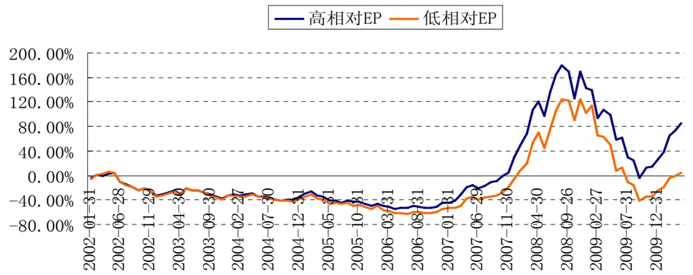
数据来源：广发证券发展研究中心

## 估值因子PB（BP相对前24个月比值）

PB的测算采用上年的净资产，利用上文介绍的因子回报计算方法进行分析，我们发现，估值因子PB同样具备较好的因子回报。最近1个季度因子月平均回报4.95%，最近1年因子月平均回报1.53%，最近5年因子月度平均回报0.48%。从自然年度角度分析，从2003年起的8个年度里，因子回报出现负值的有2003年与2005年。并且，从2003年以来，平均月度回报为0.28%，累计回报为50.07%。该因子对行业的影响仍然较明显。

图表 2：高低相对 BP 行业表现

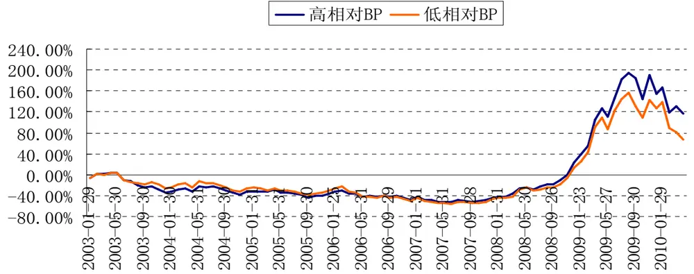
数据来源：广发证券发展研究中心

估值因子PCF（CF/P相对前12个月比值）

PCF的测算采用上一年的现金净流量，利用上文介绍的因子回报计算方法进行分析。最近1个季度因子月平均回报-0.37%，最近1年因子月平均回报1.2%，最近5年因子月度平均回报0.00%。从自然年度角度分析，从2002年起的9个年度里，因子回报出现负值的有2004、2006、2007以及2008年。并且，从2002年以来，平均月度回报为0.03%，累计回报为13.22%。该因子对行业的影响长期来看影响并不稳定，在震荡环境下表现相对较好。

图表 3：高低相对 CF/P 行业表现
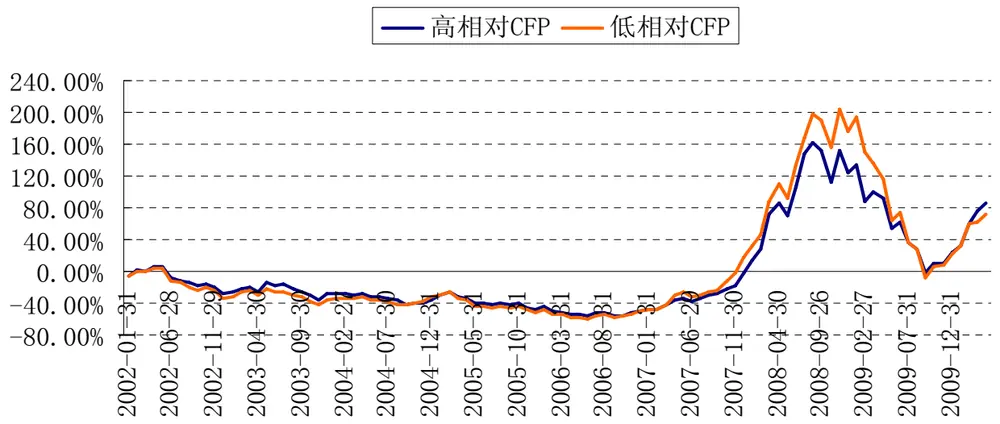
数据来源：广发证券发展研究中心

## 盈利因子：

我们选择行业的ROE代表盈利因子。为了使各行业之间具备可比性，我们计算各估值因子的相对值，综合检验，我们发现ROE相对前24个月比值效果较佳，相对比值越高影响越正面。

盈利因子ROE（ROE相对前24个月比值）

ROE采用历史滚动4个季度盈利除以最新的净资产计算。利用上文介绍的因子回报计算方法进行分析。最近1个季度因子月平均回报2.12%，最近1年因子月平均回报0.6%，最近5年因子月度平均回报0.39%。从自然年度角度分析，从2004年起的6个年度里，因子回报出现负值的有2004、2006、2008年。并且，从2004年以来，平均月度回报为0.32%，累计回报为47.94%。该因子对行业表现的影响不稳定，近期其影响较大。

图表 4：高低相对 ROE行业表现
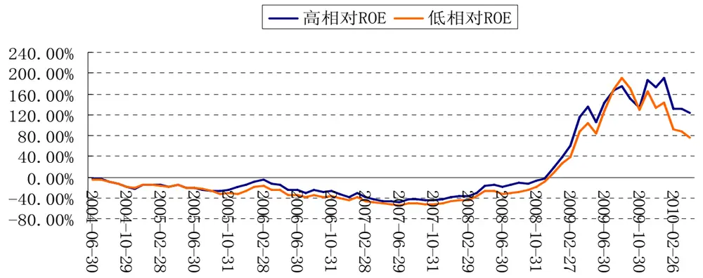
数据来源：广发证券发展研究中心

## 一致预期因子：

我们选择行业的预期PE、预期未来1年净利润增长率代表一致预期因子。为了使各行业之间具备可比性，我们计算各估值因子的相对值，综合检验，我们发现预期EP相对前12个月比值、以及预期增长率相对前12个月比值效果较佳，相对比值越高影响越正面。

一致预期因子PE（预期EP相对前12个月比值）

一致预期因子PE采用行业总市值除以分析师未来一年行业整体净利润预测平均值计算。利用上文介绍的因子回报计算方法进行分析。最近1个季度因子月平均回报1.15%，最近1年因子月平均回报1.02%，最近3年因子月度平均回报1.17%。从自然年度角度分析，从2006年起的4个年度里，因子回报全部为正值，最低是2006年，为月度回报0.51%，2009年最高，为2.11%。并且，从2006年以来，平均月度回报为1.08%，累计回报为197.02%。该因子对行业表现的影响非常显著，是进行行业量化配置的最佳因子。

图表 5：高低相对预期 EP行业表现

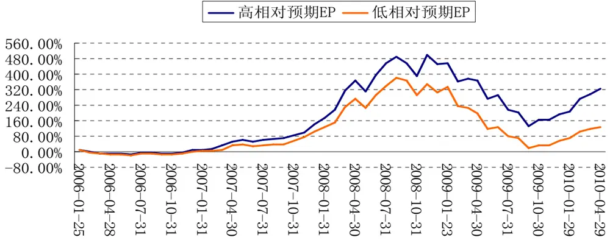
数据来源：广发证券发展研究中心

一致预期因子净利润增长率（预期增长率相对前12个月比值）

一致预期因子净利润增长率采用分析师未来一年行业整体净利润预测平均值除以上一年度净利润计算。利用上文介绍的因子回报计算方法进行分析。最近1个季度因子月平均回报0.12%，最近1年因子月平均回报0.31%，最近3年因子月度平均回报0.39%。从自然年度角度分析，从2006年起的4个年度里，因子回报除了2007年外，其他全部为负值。并且，从2006年以来，平均月度回报为0.03%，累计回报为-2.93%。该因子对行业表现的影响一般，近一年来表现尚可，可作为备选因子之一观察其表现。

图表 6：高低相对预期净利润增长率行业表现
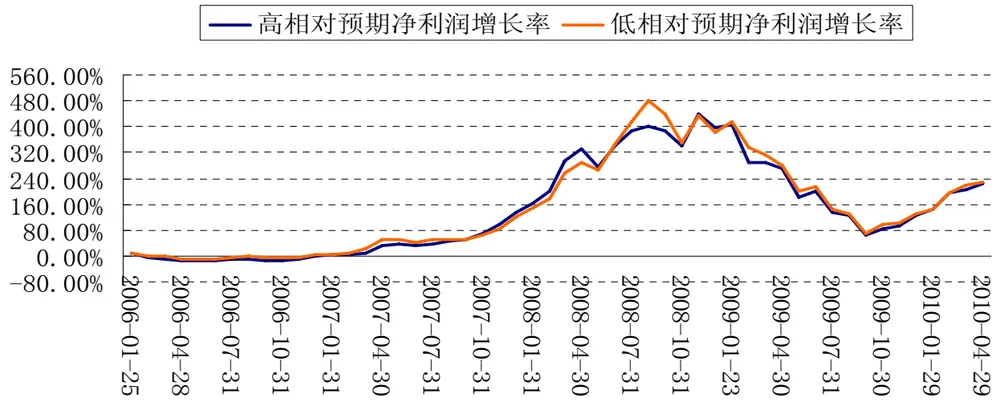
数据来源：广发证券发展研究中心

## 动量因子：

我们选择行业6个月、3个月以及1个月动量作为动量因子的备选。

6个月动量

利用上文介绍的因子回报计算方法进行分析。最近1个季度因子月平均回报1.95%，最近1年因子月平均回报1.25%，最近5年因子月度平均回报0.08%。从自然年度角度分析，从2001年起的10个年度里，因子回报出现负值的有2002、2007以及2009年。并且，从2001年以来，平均月度回报为0.33%，累计回报为63.42%。该因子对行业表现的影响较明显。

图表 7：高低 6月动量行业表现
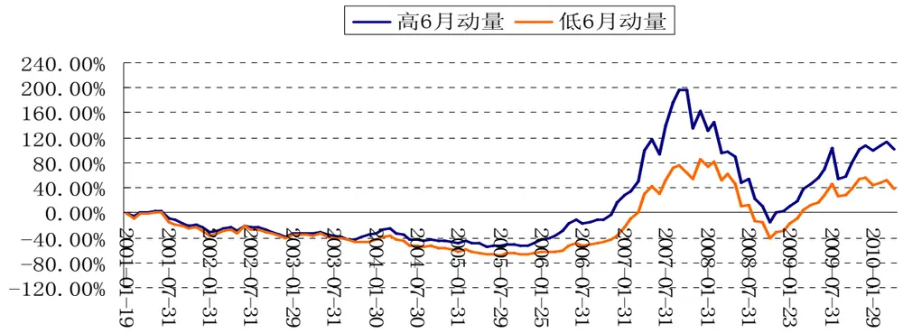
数据来源：广发证券发展研究中心

## 3个月动量

利用上文介绍的因子回报计算方法进行分析。最近1个季度因子月平均回报2.09%，最近1年因子月平均回报-0.04%，最近5年因子月度平均回报0.68%。从自然年度角度分析，从2001年起的10个年度里，因子回报出现负值的有2001、2002、2004、2008以及2009年。并且，从2001年以来，平均月度回报为0.50%，累计回报为94.92%。该因子对行业表现的影响较明显。

图表 8：高低 3月动量行业表现
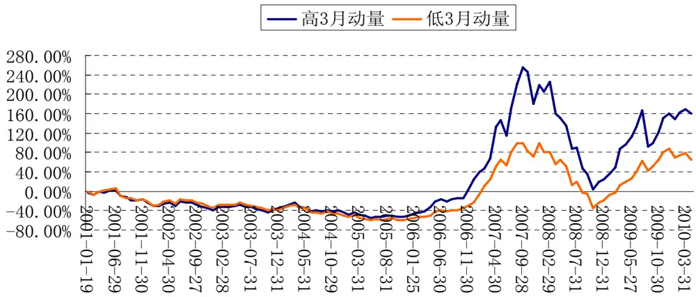
识别风险，发现价值

数据来源：广发证券发展研究中心

1个月动量

利用上文介绍的因子回报计算方法进行分析。最近1个季度因子月平均回报-0.72%，最近1年因子月平均回报0.46%，最近5年因子月度平均回报1.68%。从自然年度角度分析，从2001年起的10个年度里，因子回报出现负值的有2001、2002、2005年。并且，从2001年以来，平均月度回报为1.00%，累计回报为194.17%。该因子对行业表现的影响较明显。

图表 9：高低 1月动量行业表现
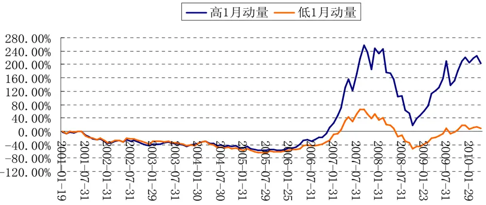
数据来源：广发证券发展研究中心

## 因子回报综合分析：备选因子的有效性检验

综上分析，我们把所有因子回报按照不同时间周期结果统计如下。

图表 10：各因子自然年度回报

| 因子种类 | 指标 | 因子收益（月度平均） |  |  |  |  |  |  |  |  |  |
| --- | --- | --- | --- | --- | --- | --- | --- | --- | --- | --- | --- |
|  |  | 2001 2002 | 2003 | 2004 | 2005 | 2006 | 2007 | 2008 | 2009 |  | 今年以来 |
| 估值 | PE | 0.17% | -0.13% |  | 0.23% | 0.48% | 0.93% | 0.88% | -1.28% | 2.17% | 2.07% |
|  | PB |  | -1.00% | 0.29% | -0.15% | 1.07% | 0.23% |  | 0.17% | 0.36% | 3.22% |
|  | PCF | 0.55% | 0.34% | -1.24% | 0.77% | -0.12% | -1.98% |  | -0.02% | 1.48% | 1.46% |
|  | ROE |  |  |  | -0.15% 1.28% |  | -0.40% | 0.34% | -0.33% | 0.37% | 2.13% |
| 盈利 一致预期 | 预期 PE |  |  |  |  |  | 0.51% | 0.96% | 1.17% | 2.11% | -0.14% |
| 动量 | 预期净利润增长 |  |  |  |  |  | -0.13% | 0.80% | -0.43% | -0.18% | 0.27% |
|  | 6个月 | 0.53% | -0.22% | 1.37% | 0.25% | 0.85% | 2.17% | -2.14% | -0.10% | -0.39% | 2.32% |
|  | 3个月 | -0.25% | -0.23% 1.28% | -0.02% | 0.26% | 3.10% |  | 0.50% | -0.55% | -0.45% | 3.07% |
|  | 1个月 | -0.37% | -0.40% | 1.16% | 0.44% | -0.11% | 2.77% | 4.05% | 1.24% | 0.38% | 0.63% |

数据来源：广发证券发展研究中心

图表 11：各因子不同期限回报

| 因子种类 | 指标 | 因子收益（月度平均） |  |  |  |  |  |  |
| --- | --- | --- | --- | --- | --- | --- | --- | --- |
|  |  | 最近1月 | 最近3月 | 最近6月 | 最近1年 | 最近3年 | 最近5年 | 存在以来 |
| 估值 | PE | 1.83% | 2.22% | 0.95% | 2.07% | 0.71% | 0.73% | 0.50% |
|  | PB | 1.62% | 4.95% | 1.71% | 1.53% | 0.54% | 0.48% | 0.28% |
|  | PCF | -0.37% | 2.67% | 0.42% | 1.20% | 0.39% | 0.00% | 0.03% |
|  | ROE | 3.35% | 2.12% | 3.81% | 0.60% | 0.42% | 0.39% | 0.32% |
| 盈利 一致预期 | 预期 PE | 3.88% | 1.15% | -0.90% | 1.02% | 1.17% |  | 1.08% |
| 动量 | 预期净利润增长 | 3.40% | 0.12% | 0.97% | 0.31% | 0.39% |  | 0.03% |
|  | 6个月 | 3.70% | 1.95% | 1.85% | 1.25% | -0.04% | 0.08% | 0.33% |
|  | 3个月 | 3.81% | 2.09% | 2.64% | -0.04% | 0.26% | 0.68% | 0.50% |
|  | 1个月 | -3.99% | -0.72% | 0.66% | 0.46% | 1.50% | 1.60% | 1.00% |

数据来源：广发证券发展研究中心

从表中结果，我们综合发现，长期来看PE、预期PE两个因子表现最好，对行业月度表现最显著。动量因子、PB、ROE也具备较强的影响，尤其最近6个月，这两个因子影响较大。PCF在震荡市里效果较佳，而预期净利润增长率短期影响力提升。

## 风格因子驱动的行业配置模型构建

## 构建方法：简单实用

经过上文的实证结果，我们选择估值（PE、PB、PCF）、盈利（ROE）、一致预期（预期PE、预期净利润增长）、动量（6月、3月、1月）四大类因子构建多因子量化行业配置模型。步骤如下：

（1）每月末，计算因子取值；

（2）取申万23个一级行业，并把其分成5类：第1、5类取4个行业，2、3、4类分别取5个行业。对行业的因子取值进行排序，排序越有利收益表现的行业赋予较高的分数（分数从高至低分别为5、4、3、2、1）。

（3）对每个因子赋予权重，权重的赋予方法为按照9个因子回报过去1年的收益排序分配。排序最高的前3个因子赋予权重1/6，排序居中的前3个因子赋予权重1/9，排序居后的3个因子赋予权重1/18。此方法确保各大类因子总权重不超过1/2，且单个因子的权重大小基本与过去一年因子回报正相关。

（4）根据各因子得分与因子权重，综合计算得到行业的综合得分，根据得分从高到低进行排序，排序最高的几个行业进行超配，最低的几个行业进行低配。

## 实证检验：长期具备超额收益

由于一致预期因子取值从2006年底起数据才开始完善，为了数据的一致性，我们的实证从2006年12月31日开始，至2010年4月30日结束。每月末对各行业进行因子评分，选出超配的4个行业与低配的4个行业，并计算各组下个月的收益，滚动计算，考察这两类行业的收益表现情况。

从2006年12.31日以来的累计超额收益表现观察，超配行业的累计超额收益率为

识别风险，发现价值

109.94%，低配行业的累计超额收益率为61.66%，超配行业相对有较明显的优势。

图表 12：超低配行业累计收益对比
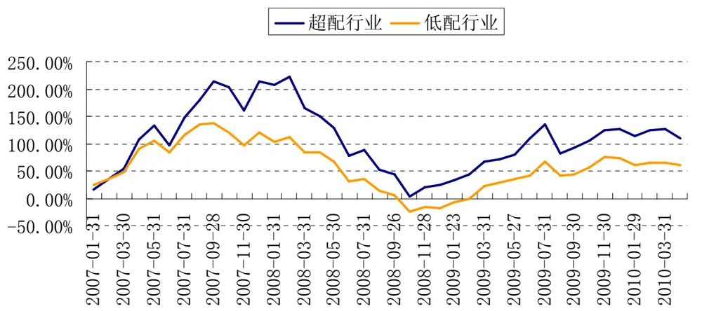
数据来源：广发证券发展研究中心

从两类行业月度超额收益的表现观察，40个月度时间周期内，超配行业优于低配行业的次数为23次，月度平均超额收益为0.81%，月度信息比为14.82%。

图表 13：超低配行业月度超额收益对比
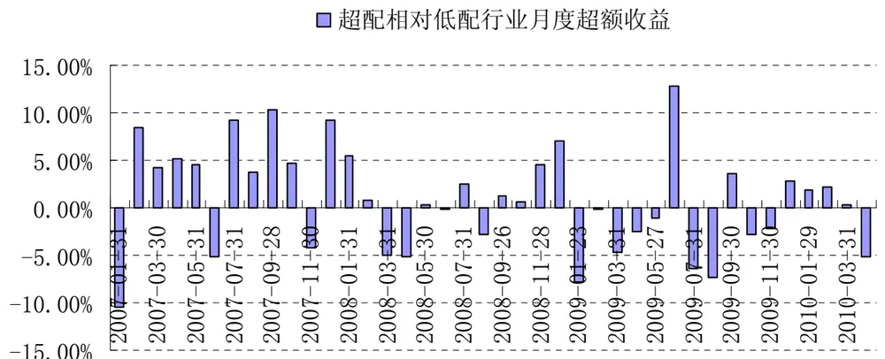
数据来源：广发证券发展研究中心

## 当前配置建议 ：超配金融地产

5月因子回报分析：估值与一致预期因子表现较好

我们以4月30日各因子的取值，统计5月1日至5月21日的因子回报，并分析各行业期间收益及其归因。

图表14中，我们统计了23个行业的5月1日至5月21日的行业收益，并对各行业收益进行排名打分，收益越高打分越高。收益较高的行业包括黑色金属、食品饮料、医药生物与金融服务，前期超跌的周期类行业或者是防御性的非周期性行业表现相对较好。在因子方面，表现较好的因子回报为PE、PB以及一致预期因子，表明低估值、预期盈利增速较快的行业有较佳的表现，从各行业对应的因子得分以及行业收益表现也可以发现这点。

图表 14：5月因子回报分析

|  |  | 农林牧渔 | 采掘 | 化工 | 黑色金属 | 有色金属 | 建筑建材 | 机械设备 | 电子元器件 |
| --- | --- | --- | --- | --- | --- | --- | --- | --- | --- |
| 本月收益（%） |  | -11.45 | -11.31 | -13.16 | -7.30 | -10.47 | -10.56 | -9.60 | -12.03 |
| 收益得分 |  | 3 | 3 | 2 | 5 | 4 | 4 | 4 | 2 |
| 因子回报 （%） |  | 上月各行业对应因子的得分 |  |  |  |  |  |  |  |
| PE | 4.16 | 1 | 3 | 4 | 5 | 5 | 4 | 3 | 1 |
| PB | 3.57 | 3 | 5 | 4 | 4 | 2 | 5 | 4 | 1 |
| PCF | -2.65 | 3 | 3 | 1 | 1 | 1 | 4 | 3 | 4 |
| ROE | -1.09 | 2 | 2 | 5 | 1 | 1 | 3 | 2 | 1 |
| 预期 PE | -0.81 | 2 | 4 | 1 | 3 | 2 | 1 | 3 | 5 |
| 预期净利增长 | -0.45 | 2 | 3 | 2 | 5 | 1 | 1 | 4 | 4 |
| 6个月 | -4.36 | 4 | 1 | 2 | 1 | 2 | 2 | 3 | 5 |
| 3个月 | -3.83 | 4 | 3 | 1 | 1 | 4 | 2 | 4 | 5 |
| 1个月 | -1.32 | 5 | 4 | 2 | 1 | 5 | 1 | 4 | 5 |
|  | 交运设备 | 信息设 备 |  |  |  |  |  |  |  |
| 本月收益（%） |  | -10.79 | -14.12 | 家用电器 | 食品饮料 -6.10 | 纺织服装 -13.65 | 轻工制造 -15.50 | 医药生物 -9.38 | 公用事业 -11.70 |
| 收益得分 |  | 3 | 2 | -10.19 4 | 5 | 2 | 1 | 5 | 3 |
| 因子回报（%） |  |  |  |  |  |  |  |  |  |
| PE | 4.16 | 5 | 2 | 3 | 3 | 2 | 4 | 2 | 3 |
| PB | 3.57 | 3 | 1 | 2 | 4 | 2 | 2 | 1 | 4 |
| PCF | -2.65 | 5 | 2 | 5 | 3 | 2 | 2 | 2 | 2 |
| ROE | -1.09 | 3 | 5 | 5 | 4 | 4 | 3 | 4 | 5 |
| 预期 PE | -0.81 | 4 | 5 | 2 | 3 | 4 | 4 | 3 | 3 |
| 预期净利增长 | -0.45 | 5 | 5 | 3 | 4 | 1 | 2 | 4 | 3 |
| 6个月 | -4.36 | 2 | 5 | 3 | 3 | 4 | 4 | 5 | 2 |
| 3个月 | -3.83 | 3 | 4 | 2 | 1 | 5 | 4 | 5 | 3 |
| 1个月 | -1.32 | 2 | 4 | 1 | 4 | 2 | 3 | 5 | 3 |
|  |  | 交通运输 | 房地产 | 金融服务 | 商业贸易 | 餐饮旅游 | 信息服务 | 综合 |  |
| 本月收益（%） |  | -14.19 | -10.01 | -6.21 | -10.73 | -16.74 | -15.00 | -16.84 |  |
| 收益得分 |  | 2 | 4 | 5 | 3 | 1 | 1 | 1 |  |
| 因子回报（%） |  |  |  |  |  |  |  |  |  |
| PE | 4.16 | 2 | 5 | 4 | 2 | 1 | 1 | 4 |  |
| PB | 3.57 | 3 | 5 | 5 | 3 | 2 | 3 | 1 |  |
| PCF | -2.65 | 4 | 5 | 1 | 3 | 5 | 4 | 4 |  |

识别风险，发现价值

| ROE | -1.09 | 2 | 4 | 3 | 2 | 3 | 1 | 4 |
| --- | --- | --- | --- | --- | --- | --- | --- | --- |
| 预期 PE | -0.81 | 2 | 1 | 2 | 5 | 1 | 4 | 5 |
| 预期净利增长 | -0.45 | 4 | 3 | 2 | 1 | 3 | 5 | 2 |
| 6个月 | -4.36 | 3 | 1 | 1 | 4 | 5 | 3 | 4 |
| 3个月 | -3.83 | 2 | 1 | 2 | 3 | 3 | 2 | 5 |
| 1个月 | -1.32 | 2 | 1 | 2 | 4 | 3 | 3 | 3 |

数据来源：广发证券发展研究中心

## 各行业因子最新得分与配置建议

根据2010-5-21日收盘的最新数据，对各行业的因子进行打分，并根据我们的权重计算方法得到各因子的最新权重，综合评价，建筑建材、交通运输、房地产、金融服务4个行业得分最高，建议超配。而公用事业、餐饮旅游、信息服务以及综合等4个行业得分较低，建议低配。而前期跌幅较大的采掘、黑色金属、有色金属、机械设备等行业投资价值开始体现，投资评级逐渐上升，值得关注。

图表 15：本月各行业最新因子得分

|  | 农林牧渔 | 采掘 | 化工 | 黑色 金属 | 有 色金属 | 建筑建材 | 机械设备 | 电子元器件 |
| --- | --- | --- | --- | --- | --- | --- | --- | --- |
| 因子综合得分 | 3 |  | 2 | 4 | 4 | 5 | 4 | 3 |
| 因子 | 各行业对应因子的得分 |  |  |  |  |  |  |  |
| PE | 1 | 3 | 4 | 5 | 5 | 4 | 3 | 1 |
| PB | 3 | 5 | 4 | 4 | 2 | 5 | 4 | 1 |
| PCF | 3 | 3 | 1 | 1 | 1 | 4 | 3 | 4 |
| ROE | 2 | 2 | 5 | 1 | 1 | 3 | 2 | 1 |
| 预期 PE | 2 | 4 | 1 | 3 | 2 | 1 | 3 | 5 |
| 预期净利增长 | 2 | 3 | 2 | 5 | 1 | 1 | 4 | 4 |
| 6个月 | 4 | 1 | 2 | 1 | 2 | 2 | 3 | 5 |
| 3个月 | 4 | 3 | 1 | 1 | 4 | 2 | 4 | 5 |
| 1个月 | 5 | 4 | 2 | 1 | 5 | 1 | 4 | 5 |
|  | 交运设备 | 信息设备 | 家用电 器 | 食品饮料 | 纺织服装 | 轻工制造 | 医药生物 | 公用事业 |
| 因子综合得分 | 3 | 3 | 2 | 4 | 1 | 2 | 3 | 1 |
| 因子 | 各行业对应因子的得分 |  |  |  |  |  |  |  |
| PE | 5 | 2 | 3 | 3 | 2 | 4 | 2 | 3 |
| PB | 3 | 1 | 2 | 4 | 2 | 2 | 1 | 4 |
| PCF | 5 | 2 | 5 | 3 | 2 | 2 | 2 | 2 |
| ROE | 3 | 5 | 5 | 4 | 4 | 3 | 4 | 5 |
| 预期 PE | 4 | 5 | 2 | 3 | 4 | 4 | 3 | 3 |
| 预期净利增长 | 5 | 5 | 3 | 4 | 1 | 2 | 4 | 3 |
| 6个月 | 2 | 5 | 3 | 3 | 4 | 4 | 5 | 2 |
| 3个月 | 3 | 4 | 2 | 1 | 5 | 4 | 5 | 3 |
| 1个月 | 2 | 4 | 1 | 4 | 2 | 3 | 5 | 3 |
|  | 交通运输 | 房地产 | 金融服务 | 商业贸 易 | 餐饮旅游 | 信息服务 | 综合 |  |
| 因子综合得分 | 5 | 5 | 5 | 2 | 1 | 1 | 2 |  |

| 因子 | 各行业对应因子的得分 |  |  |  |  |  |
| --- | --- | --- | --- | --- | --- | --- |
| PE | 2 5 | 4 | 2 | 1 | 1 | 4 |
| PB | 3 | 5 5 | 3 | 2 | 3 | 1 |
| PCF | 4 5 | 1 | 3 | 5 | 4 | 4 |
| ROE | 2 4 | 3 | 2 | 3 | 1 | 4 |
| 预期 PE | 2 1 | 2 | 5 | 1 | 4 | 5 |
| 预期净利增长 | 4 3 | 2 | 1 | 3 | 5 | 2 |
| 6个月 | 3 1 | 1 | 4 | 5 | 3 | 4 |
| 3个月 | 2 1 | 2 | 3 | 3 | 2 | 5 |
| 1个月 | 2 1 | 2 | 4 | 3 | 3 | 3 |

数据来源：广发证券发展研究中心

研究员简介：

罗军：

金融工程研究员，华南理工大学理学硕士。曾任招商基金数量分析师、平安证券衍生品部投资研究负责人、平安证券金融工程高级研究员，2010年 1月加盟广发证券。

## 相关研究报告

|  | 广州 | 深圳 | 北京 | 上海 |
| --- | --- | --- | --- | --- |
| 地址 | 广州市天河北路183号 | 深圳市民田路华融大厦 | 北京市月坛北街2号月坛大上海市浦东南路528号 |  |
|  | 大都会广场36楼 | 2501室 | 厦18层1808室 | 证券大厦北塔17楼 |
| 邮政编码 | 510075 | 518026 | 100045 | 200120 |
| 客服邮箱 服务热线 | gfyf@gf.com.cn 020-87555888-612 |  |  |  |

## 注：本报告只发送给广发证券重点客户，不对外公开发布。

## 免责声明

本报告所载资料的来源及观点的出处皆被广发证券股份有限公司认为可靠，但广发证券不对其准确性或完整性做出任何保证。报告内容仅供参考，报告中的信息或所表达观点不构成所涉证券买卖的出价或询价。广发证券不对因使用本报告的内容而引致的损失承担任何责任，除非法律法规有明确规定。客户不应以本报告取代其独立判断或仅根据本报告做出决策。

广发证券可发出其它与本报告所载信息不一致及有不同结论的报告。本报告反映研究人员的不同观点、见解及分析方法，并不代表广发证券或其附属机构的立场。报告所载资料、意见及推测仅反映研究人员于发出本报告当日的判断，可随时更改且不予通告。

本报告旨在发送给广发证券的特定客户及其它专业人士。未经广发证券事先书面许可，不得更改或以任何方式传送、复印或印刷本报告。