# 量化选股模型研究

# --估值与动量相结合的选股模型

罗军 研究员

胡海涛 研究员

电话： 020-87555888-655

电话：020-87555888-406

eMail： lj33@gf.com.cn

eMail: hht@gf.com.cn

SAC执业证书编号：S0260210030001

SAC执业证书编号：S0260210040019

## 低估值与动量强是一种新的选股策略

不同研究表明，低估值的股票一般有优于高估值股票的表现。前三到十二个月表现好的股票会有十分强的动量效应，并跑赢前期表现差的股票。如果把这两种选股策略综合到一起，那么我们是否能得到更好的选股策略？遵循以上的选股思路，我们尝试构建估值与动量相结合的量化选股模型。

## 强强联手：估值与动量的结合

我们的量化模型立足在于以下的观点：低估值并拥有较强股价动量的股票能战胜高估值并动量较差的股票。所以该模型的基本架构分为两大部分：估值部分和动量部分。整套模型的体系是以打分形式来进行股票筛选。结合备选股票在估值与动量方面的得分，可以筛选出估值低而动量强的股票。

## 从不同综合模型构建以及不同权重体系寻找最优组合

我们以三种不同的综合模型来体现估值与动量的结合：PS 估值综合模型，PS 估值综合模型以及 PS+PE 估值综合模型。每一种模型又以两种不同的权重分配方式进行构建：固定权重以及根据因子历史表现而动态改变的权重。我们希望通过不同的尝试来寻找出最优的综合模型。

## 从历史回溯证明 PS+PE估值综合模型拥有最好的选股能力

对比不同综合模型的回测结果，动态权重的 PS+PE 估值综合模型在选股能力上的表现上最为出色。该模型在捕获正收益差的成功率为 77.8%，是所有综合模型之最。它的年化收益差高达 43.9%，信息比为 2.34,也是优于其他模型。而超配组合收益战胜指数的胜率也高达 80%。所以根据以上分析，我们认为动态权重变化的PS+PE估值综合模型对比其他模型更有效，更能发挥估值与动量选股的作用。

## 一、价值选股与动量选股的简介

## （一）价值选股简介

价值投资法是近代投资法里最常用的一种。在1930年，哥伦比亚大学的两位金融教授：Benjamin Graham 和 David Dodd 首次提出了原始的价值投资框架。他们的理念十分简单明了：寻找股价低于它们实际价值的公司，并进行投资！经过多年的实际操作，价值投资者们已经对他们的投资有明确的目标，就是挖掘交易价格较同类股票低但拥有较强基本面的公司。他们相信这些公司当前的股价是被市场低估了，所以通过估值修复，这些基本面好的公司股价一定会上升到与他们的实际价值相当的股价水平。在所有的价值投资者中，其中最有代表的一位就是沃伦·巴菲特，他充分的证明了价值投资的华丽魔力。他所拥有的伯克希尔·哈撒韦公司，从1967年时12美金的股价上升到2002年时每股70900美元的复权价格，公司每年的平均股价收益表现高于S&P500指数表现13%之多。虽然巴菲特并不把他自己归类为价值投资者，但他众多的成功投资都是遵循了价值投资的理念。

从有效市场定律我们可以了解到，在市场上交易的公司，其股价已经真实反映所有的有关该公司的信息，所以当前股价代表了公司的实际价值。但价值投资者认为该理论只有效于学术领域，他们相信市场总有失效的时候并充斥着被低估的股票，投资于这些股票能让他们获得不菲的回报。而且，价值投资者并不同意高BETA等于高投资风险这一理论。若一家公司的股价下降了，该公司的BETA上升，理论上该股票更具有投资风险。但价值投者却觉得该股票更便宜，更值得买，前提是他们对自己估算的公司实际价值有自信。所以，下方风险的增加对价值投资者来所并非坏事。

那么如何去挑选所谓的低估值股票呢？首先，我们要对股票进行估值。股票的估值方法可以分为相对估值与绝对估值法。这里我们着重介绍前者。 相对估值是使用市盈率，市净率，市销率等价格指标与其他多只股票（具有可比性的）进行对比，如果某只股票的指标低于可比区域内相应指标的平均值，证明该股票价格被低估，未来股价上涨概率大，使得指标回归于平均值。相对估值包括PE，PB，PEG，EV/EBITDA等估值法。通过对公司历史数据的对比或和国内同行业公司的数据对比，我们可以确定单一公司所处的估值位置。接着便是设立筛选条件以挑选出合格的股票来构建投资组合。不同投资经理所运用的筛选策略各不相同，但经过总结，我们发现筛选的首要条件是考量公司的盈利能力，通常会运用预定的ROE值来筛选具有良好盈利能力的公司。然后基于挑选的股票，投资经理会根据某个或多个估值指标在同一市场或同一行业的平均值来设定合适的阀值做进一步筛选。当然，在设定筛选条件时，也可以加入度量公司财务稳健性的财务指标来更好的挑选出优质的价值股票。研究表明，低估值并财务稳健的公司的股票一般都能战估值过高的股票。

## （二）动量选股简介

动量选股策略的理论基础也是建立在股票市场的低效率性假设上，对于动量效应，学术界有很多解释，其中比较具有说服力的是行为金融学的解释：反应不足。如果在市场上发现了动量效应，说明股价对信息反应不足，股价在消息公布后不是第一时间上涨或下跌至其应有的位置，而是较为缓慢的移动至其应有的位置。另一个被大众接受的观点则指出投资者若运用股价动量选股策略来进行投资，他们需要承受额外的风险，所以对等地他们也应该从投资中获得相应的额外报酬。

而与动量选股策略相对立的是反转选股策略，该策略是根据市场中股价的反转效应而产生。与动量效应解释相反，如果在市场上发现了反转效应，则可说明股价对信息反应过度。由此可见，动量效应与反应不足、反转效应与反应过度，这两组概念是紧密联系在一起的。动量效应和反转效应可以看作是反应不足与反应过度的实证支持。

在使用动量反转方法选股的时候，需要考虑持有期的长短对不同策略在市场上的表现的影响。以下是经过大量实证分析所得出的不同持有期投资者应选的策略：

z 短期持有（通常在三个月以下）：不同研究指出股价会在短期内出现反转，这一现象的出现往往是由于不同股票之间收益的关联性以及股票的交易成本所引起，所以投资者应选择反转策略。

z 中期持有（通常在三个月到十二个月之间）：实证表明在这个持有期间，股价有十分强的动量效应。前期表现好的股票（所谓的赢家）有很大概率跑赢前期表现差的股票（输家）。投资者的反应不足是对这一现象的合理解释。

长期持有（三年到五年）：通过实证分析，前期的输家会在未来的三到五年以内跑赢前期的赢家，其基本原因是投资者的反应过度以及市场微观结构的偏差导致了股票价格的回归。若投资者的持有期跨度长，选择反转策略可以赚到不菲的超额收益。

## （三）估值与动量的结合

通过上面的介绍，我们可以得出如下的结论：在不同股票市场中，低估值的股票一般有优于高估值股票的表现。如持有期为三到十二个月之间，前期表现好的股票会有十分强的动量效应，并跑赢前期表现差的股票。如果把这两种选股策略综合到一起，那么我们是否能得到更好的选股策略？遵循这种思路，我们设计了不同的综合量化选股模型。本文的第二部分首先引入综合模型的基本结构概念，然后对我们每个估值与动量的子模型以及打分方法进行介绍。第三部分则对不同的估值与动量子模型结合而成的综合模型以及权重分配方法做了详细的解说。第四部分则列出不同模型在中证800成分股中的实证分析，以便挑选出最优综合模型。而最后部分则提供当前最新的模型信号。

## 二、模型基本结构与子模型介绍：

## （一）综合模型的基本结构：

我们的量化模型立足在于下的观点：低估值并拥有较强股价动量的股票能战胜高估值并动量较差的股票。所以该模型的基本架构分为两大部分：估值模型和动量模型。以下是我们整体模型的基础结构图：

图 1：综合模型的基本结构图
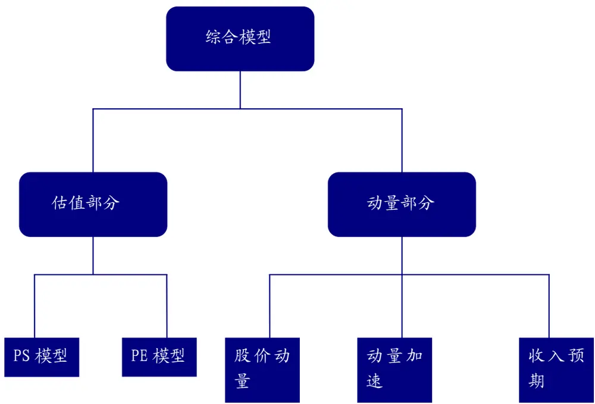
数据来源：广发证券发展研究中心

整套模型的体系是以打分形式来进行股票筛选。首先每月末待选股票池里面的每只股票分别在不同的估指模型与动量模型下都会有一个得分。然后根据单个模型的具体权重，每只股票最后会获得当月的一个综合打分。得分排名前30只股票为当月的推荐股票，会被纳入超配股票组合。而得分靠后的30只股票会成为低配股票组合的成员。

估值部分具体可以分为两个子模型，PS模型和PE模型。每一个子模型可以单独代表估值的整体，或者结合运用。动量部分包括了三个不同子模型，它们分别是股价动量模型，动量加速模型与收入预期模型。三个模型的综合体组成我们综合模型的动量部分。

## （二）PS模型

PS模型以相对PS比率作为评价单一股票估值高低的标准。所谓的相对PS比率是指每只股票的实际市销率除以它的理论市销率所得的比值。该比值越低，证明该股票的市销率低于理论值，投资价值越高。反之，比值越大，股票的市销率高于于理论值，估值过高，投资价值小。

每月相对PS比率中理论市销率是根据横截面回归模型估算得出。我们以中证800股票作为我们的研究标的。首先每月我们剔除市销率，市盈率为负的股票，或没有预期营业收入增长率或净利润增长率数据的股票，剩下的股票为当月的备选股票池。该模型的因变量就是备选股票池里不同股票的市销率对数值，自变量分别为各个股票预期营业收入增长率的对数值与总市值（代表风险与流动性）的标准值。

以下是2010年9月31日的横截面回归后所得的公式：

$$
\mathsf{In}\ (PS)=0.9868+0.9289^{\star}\mathsf{In}(1+\mathsf{G}\mathsf{Sale})-0.2075^{\star}(\mathsf{MC})
$$

其中：ln代表对数

PS代表单一股票的市销率的理论值

GSale代表单一股票的一致预期两年后的营业收入增长率，以百分比为单位，取自万得数据库

MC代表单一股票标准化后的总市值，最大不超过3。

在回归中运用对数值可以有效的捕捉因变量与自变量之间的非线性关系。因为对于投资者而言，他们不会为不同股票每单位的营业收入增长付出相同的价钱。普通线性回归并不能有效处理该种非线性关系，所以对数的加入可以很好的解决该问题。

从以上的公式我们可以观察到理论市销率与预期营业收入增长率之间存在正相关的关系，代表增长率越高，理论市销率越大。这也十分符合逻辑，高预期营业收入增长的股票对于投资者更具吸引力，该股票的股价由于高预期而上升，但当前营业收入却并没发生改变，所以理论市销率会上升。

除了以上所提到的自变量以外，我们也加入了两个行业的虚变数（如果股票属于某行业，它的虚变数为1，其他为0）用以捕获行业特性。按照申万一级行业来区分，我们加入到模型的分别为黑色金属行业的虚变数和金融服务行业的虚变数。由于这两个行业的股票相对其他行业股票长期有着较低的估值，所以运用直接回归所估算的理论值并没能把这种行业特性给融合进来，导致最终的选股结果有所偏颇。加入行业的虚变数能更好的把该两个行业的特性加入到回归中，使得最后挑选出来的股票组合在行业分布上更合理。

## （三）PE模型

与PS模型相似，PE模型以相对PE比率来评价股票估值的高低。相对PE比率是单只股票的真实市盈率值除以理论市盈率的比率。比率越低，证明该股票的估值被低估，未来由于估值修复而股价上扬的概率大。比率越高，则证明该股票在高估值区间，未来股价回落概率大。

各个股票每月的理论市盈率也是根据横截面回归模型来估算的。当月备选股票池里的每一只股票的市盈率对数作为回归模型的因变量，而各个股票的预期净利润增长率对数以及总市值的标准值为回归模型的自变量。

以下是2010年9月31日的横截面回归后所得的公式：

$$
\mathsf{Ln}\;\left(\mathsf{PE}\right)=3.5550+0.5390^{\star}\mathsf{In}\;\left(\mathsf{T}{+}\mathsf{Gearming}\right)\;{-}\;0.7745^{\star}\;\left(\mathsf{MC}\right)
$$

## 其中：ln代表对数

PE代表单一股票的市盈率的理论值

Gearning代表单一股票的一致预期两年后的净利润收入增长率，以百分比为单位，取自万得数据库

MC代表单一股票标准化后的总市值，最大不超过3。

根据上述公式，我们得出以下的结论：预期净利润增长率与理论市盈率成正相关的关系。高增长率的个股更被市场追捧，其股价也会相应提高。

为了使回归模型能捕捉到长期低估值行业的行业特性，我们也在回归中加入了黑色金属行业虚变量以及金融服务行业虚变量。

## （四）股价动量模型

在之前的介绍中，我们已经了解到持有期为三到十二个月之间，前期表现好的股票会有十分强的动量效应，并跑赢前期表现差的股票。根据这观点，本模型对备选股票池里每个股票过往一年收盘价的对数做趋势线分析，并计算出该趋势线的t统计值作为衡量各个股票动量效应强弱的指标。

股价动量模型所运用的股价趋势线是股价序列与时间回归而得到的直线，而该直线的t值则为直线斜率β除以β的标准误差。如果一个股票的斜率β是正值，证明它过往一年的股价表现是上扬的趋势。而且β越大，该股票的股价动量越明显。β的标准误差也可以理解为斜率的波动率，波动越小，趋势越确定。所以趋势线的t统计值是波动调整后的趋势指标，该指标越大，理所当然所对应的股票的动量越强。相反，t值若为负数，则证明该股票正处于下降空间，并且趋势明显，理应回避。

下图是深发展A从2009年9月30日到2010年9月30日之间的股价表现和趋势线的例子。从趋势线来判断，该股票正趋于下降趋势，动量明显偏弱。

图 2：深发展 A股价动量分析图
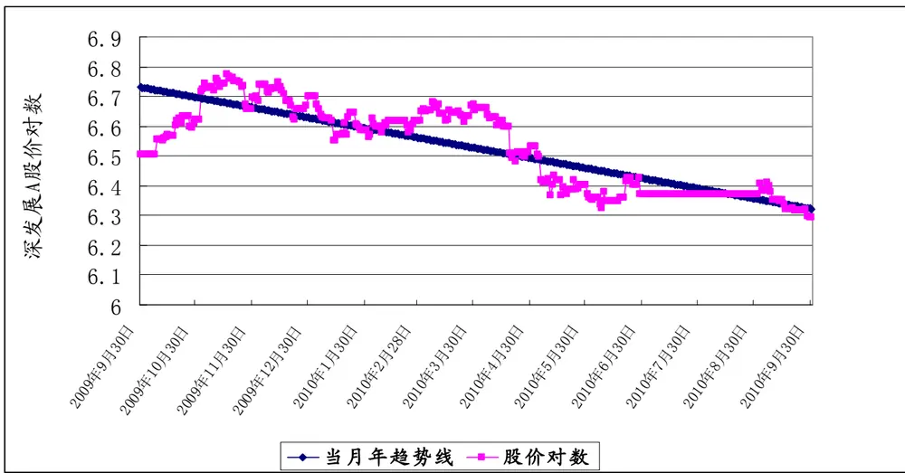
数据来源：广发证券发展研究中心

## （五）动量加速模型

动量加速模型运用短期股价动量的变化来衡量长期股价动量的增速或减速。由于我们的投资频率以月为单位，所以模型以备选股票池里各股票当月计算的趋势线t值减去一个月前的趋势线t值的绝对差值作为短期股价动量变化的指标。该指标越大，证明股价的短期动量变化越强，个股后续表现越好。

我们继续以深发展A为例子，下图列出深发展A当前趋势线与一个月前趋势线的对比。

图 3: 深发展 A动量加速分析图
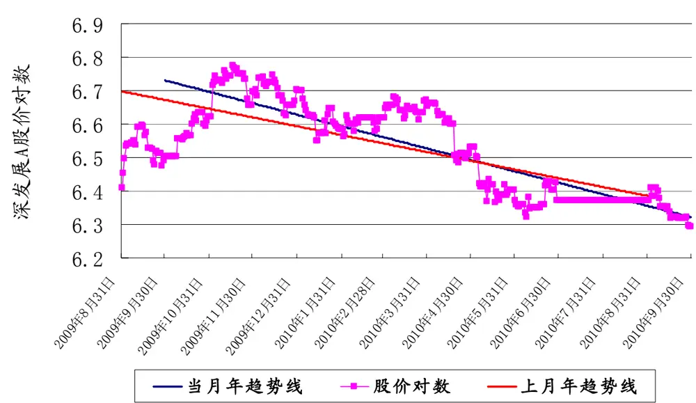
数据来源：广发证券发展研究中心

## （六）收入预期模型

收入预期模型使用分析师一个月评级改变指标来衡量股票投资价值的好坏。每月我们会提取备选股票池里所有股票的分析师评级改变数据，并根据该数据来对股票进行打分。评级改变越大的个股表明该股票越受行业分析师看好，评级一般由“持有”改为“买入”，所以未来价格上升概率大。

## （七）不同子模型的打分规则

所有子模型为股票打分的规则是一致。由上面的子模型介绍中，不难发现每一个子模型都有一个指标用以衡量股票的优劣。根据每月备选股票池的大小，我们会把所有股票分为10等份。然后根据每个子模型的指标为股票排序打分，若股票属于第一等份，则得分为10。若股票排名属于第二等份，得分为9，以此类推，排名属于最后等份的股票得分为1。不同指标排序的方向并不相同，具体方向在之前已描述，在此就不在赘述。

## 三、综合模型：不同的估值与动量的结合模型

（一）三大综合模型：估值与动量子模型结合的不同尝试

图 4: 三大综合模型选股结构图
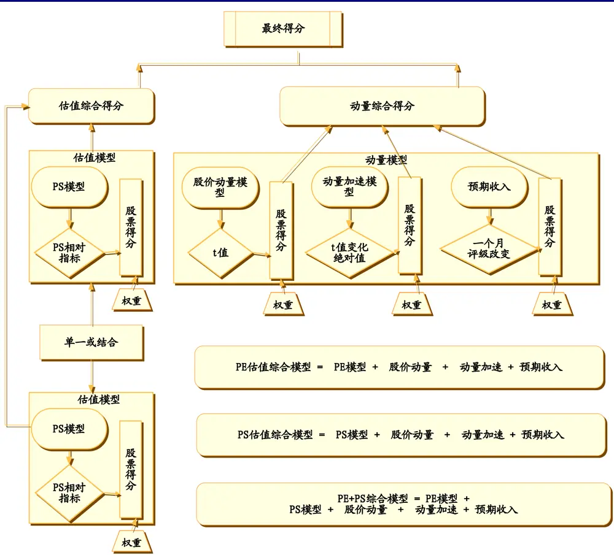
数据来源：广发证券发展研究中心

上图阐述了我们尝试的三种不同估值与动量结合的综合模型，以便能从中挑选出最优的模型作为长期跟踪的对象。从图上可以了解到，综合模型之间的区别只在于估值部分所挑选的子模型。

PS估值综合模型：该模型的估值部分选用PS模型，并运用相对PS指标来为股票排序打分。结合动量部分的综合得分，我们可以得到当月所有股票的最终得分。

PE估值综合模型：该模型的估值部分选用PE模型的相对PE指标为股票打分，然后结合动量得分计算出股票最终得分。

PE+PS综合模型：该模型的估值部分选用PE模型与PS模型的结合为股票打分，并结合动量得分整合成最终得分。

识别风险，发现价值

## （二）两大权重分配体系：

在整合不同估值与动量股票得分的时候，最重要的还是每个子模型所分配的权重。分配权重的大小将直接影响股票估值的综合得分或动量的综合得分，从而影响最终的选股效果。我们对每个综合模型都运用了两套不同的权重分配体系。

1.固定权重

| 表1：估值与动量子模型的固定权重分配表 |  |  |
| --- | --- | --- |
| 估值/动量 | 模型 | 权重 |
| 估值 | PS 模型 | 单一：50%，混合：25% |
| 动量 | PE 模型 | 单一：50%，混合：25% |
|  | 股价动量模型 | 16.67% |
|  | 动量加速模型 | 16.67% |
|  | 预期收入模型 | 16.67% |

数据来源：广发证券发展研究中心

上表在估值类模型权重分配上分为单一权重与混合权重。单一权重指的是当该估值子模型代表了综合模型中估值方整体的权重。混合权重是指在PE+PS综合模型中，该子模型所占估值方部分的权重。估值方与动量方的权重分配各为50%，表示在不同的时间上，估值与动量的重要性一样。

## 2.权重按因子历史表现分配

从过往的量化选股研究中，我们总结出，每一种选股模型的历史表现在不同的时间里往往会有高低起伏，而且表现不一。某些模型可能长期就具备比较好的选股能力，某些模型在某个时期的选股能力要较其他选股模型要强。落实到我们的研究里，每一个估值或动量子模型的历史选股表现理应有所不同。若每月在选股时我们都采用相同的权重分配，有可能会出现权重错配，使得近期表现好的子模型的权重被低估，或近期表现差的子模型的权重被高估。

根据以上的经验，我们引用因子回报概念来确定单个子模型在不同时间上所应分配的权重。每个子模型以一个因子来刻画。每月子模型（因子）会给股票池里股票进行排序打分， 然后挑选出前30和后30的股票按固定权重形成超配与低配组合，两类组合在下一个投资周期的收益率差成为因子在当期的收益。然后我们会根据因子在过去12个月的信息比的大小动态的为每个因子附加权重。具体加权方式如下：

表 2：估值与动量子模型的动态权重分配表

| 信息比排名 | PS 综合模型或 PE 综合模型 (4 因子模型) | 信息比排名 | PE+PS 综合模型（5因子模型） |
| --- | --- | --- | --- |
| 1 | 40% | 1 | 30% |
| 2 | 30% | 2 | 30% |
| 3 | 20% | 3 | 20% |
| 4 | 10% | 4 | 10% |
|  |  | 5 | 10% |

数据来源：广发证券发展研究中心

## 四、因子回报和不同综合模型的实证分析：

（一）因子回报分析

让我们先来分析一下各个因子（子模型）的历史回报。

图 5: 每年因子回报分析图
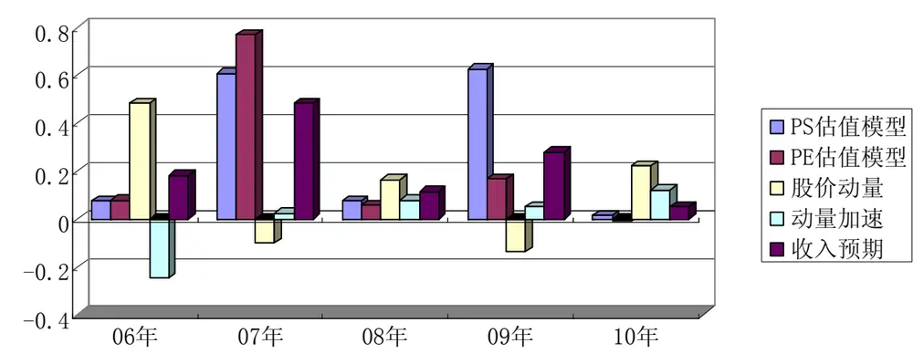
数据来源：广发证券发展研究中心

按每年收益的情况来分析，PE模型，收入预期模型连续5年都能获得正收益。其中，PS模型在07年以及09年的大牛市时期表现很亮眼，因子收益都在60%以上。而且统计该因子5年来获得正收益的月次，该因子的成功率高达65%。所以我们可以判定，在中国大牛市时期，市销率小的个股表现要比市销率大的股票更为优异。预期收入模型在07和09年的表现也较其他年度要好，而且该模型从因子捕获正收益的成功率为70%，优于其余4个模型。这证明了投资者若按照研究员对于股票收入的评级改变来投资个股，投资者能获得最大的胜率。 PE模型表现就稍微逊色，除了在07年的时候有高于70%的年度因子收益，其他年度表现平平。特别是在10年这种震荡行情中，PE模型的因子收益为-1%。综合各月的因子回报，PE模型获得正收益成功率为62%。在分析股价动量因子回报的时候，我们发现了一个有趣的现象。像07年和09年这种大牛市的时候，利用股价动量来投资效果并不理想，股价动量因子在这两年里都分别获得负收益差。结合之前对PS模型和PE模型的分析，我们得出以下的判断：在大牛市的行情当中，前期涨得好的股票由于股指太高，股价会出现滞涨或回落的现象，但前期股价表现差的个股，由于估值较低，所以上涨的空间很大。但像06年这种小牛市和08,10年这种行情不好的时段，因子的表现要比其他因子要好。原因是小牛市时，拥有较好动量的股票能量并未完全释放，所以后期会继续上涨。而在熊市时，前期表现好的股票能靠其动量战胜动量较差股票。最后，我们来看动量加速因子表现，该因子是5各因子里表现最弱的。显然，如果不配合其他动量模型，单靠动量加速模型来挑选股票并不能得到很好的效果。

图 6: 因子累积回报分析图
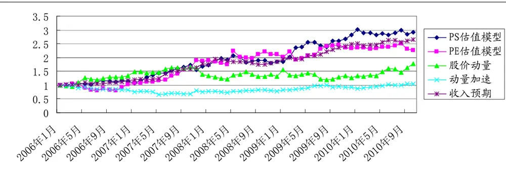
数据来源：广发证券发展研究中心

上图分析了各个因子5年来的累积收益。PS模型的因子表现最好，平均月收益能达2%。收入预期因子表现第二，平均月收益为1.7%。接着是PE模型，平均月收益能达1.6%。股价动量与动量加速两因子表现较弱，排名靠后。所以从因子收益角度来看，估值类模型在选股能力上还是占优。

综合以上分析，我们还是可以看出在不同的时间里，各个估值与动量因子的表现有高低起伏的变化。那么，究竟按固定权重分配还是按因子表现而动态分配权重能更好的体现估值与动量的结合？接下来，就让我们从实证分析的结果来看不同综合模型在07年1月到10年10月之间的选股表现如何。

## （二）PS估值综合模型实证分析：

图 7：固定权重 PS估值综合模型收益差
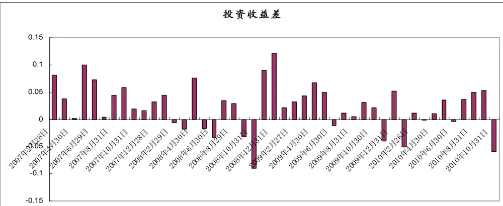
数据来源:广发证券发展研究中心

图 8：等权重 PS 综合模型
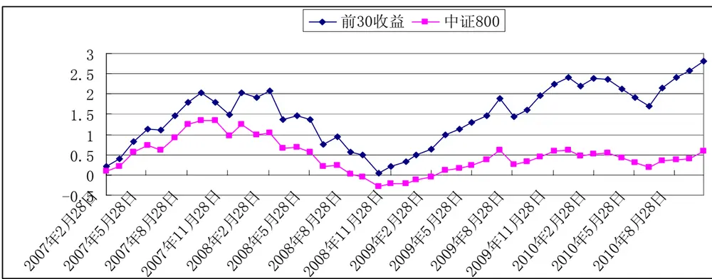
数据来源:广发证券发展研究中心

我们实证分析是分析综合模型所推荐的超配组合和低配组合之间收益差的历史表现，以及对比超配组合与中证800指数的历史收益。实证时间是由07一月到10年的10月。超配与低配组合里的个股都选用平均加权法来做模拟投资。收益差为下月超配与低配收益的差值。

从历史表现来看，固定权重的PS估值综合模型在实证分析的45个月份里有33个月能获得正收益差，成功率达到73%。每月平均收益差为2.28%。对比超配组合累积收益与中证800指数累积收益，如果不考虑交易成本，我们发现超配组合四年的累积收益为281%，而中证800指数的累积收益仅为58%。超配组合远远战胜指数的表现。

图 9：动态权重 PS估值综合模型收益差
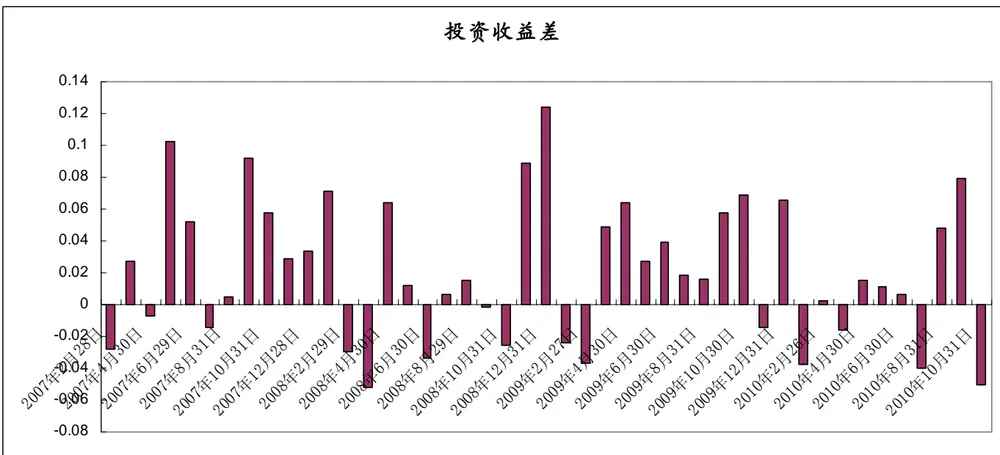
数据来源：广发证券发展研究中心

图 10：动态权重 PS估值综合模型超配股票与指数累计收益对比
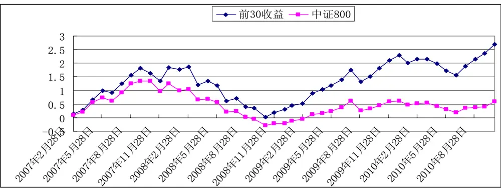
数据来源：广发证券发展研究中心

从历史表现来看，动态权重变化的PS估值综合模型在45个月份里有30个月能获得正收益差，成功率达到66.7%。每月平均收益差为1.8%，差于固定权重模型。超配组合表现也一路领先大盘，四年的累积收益为268%，但表现劣于固定权重模型。

## （三）PE估值综合模型实证分析：

图 11：固定权重 PE估值综合模型收益差
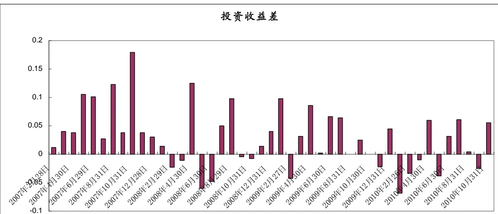
数据来源：广发证券发展研究中心

图 12：固定权重 PE估值综合模型超配股票与指数累计收益对比
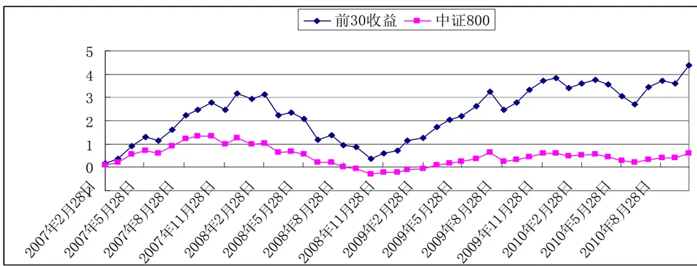
数据来源：广发证券发展研究中心

在实证分析期间，PE估值综合模型捕获正值收益差的成功率为68.8%，有31个月份超配组合跑赢低配。纵观收益差的柱状图，07年整年模型的表现都很出色，但08到10年之间模型表现不太稳定。对比超配组合与中证800指数，超配组合的累积收益从08年12月开始一直发力上扬。虽然受累于10年前半年的不稳定表现，但最终还是获得436%的累积收益，为指数的7倍以上。

图 13：动态权重 PS估值综合模型收益差
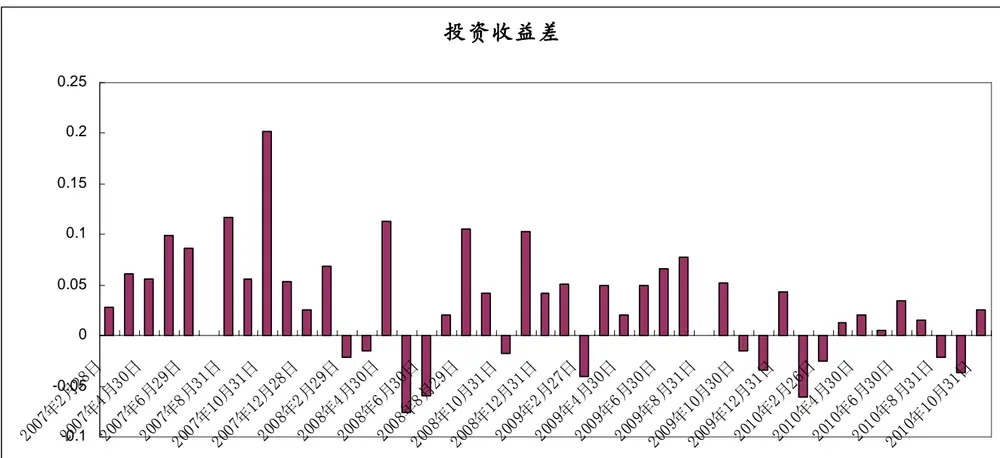
数据来源：广发证券发展研究中心

图 14：动态权重 PS估值综合模型超配股票与指数累计收益对比
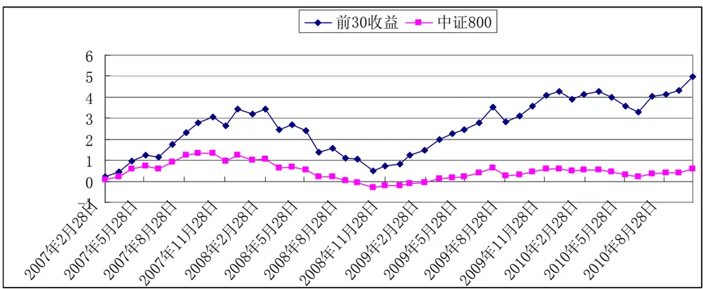
数据来源：广发证券发展研究中心

动态权重的变化使得PE估值综合模型在选股的能力上有所提升，45个月份里有33个月能捕获正收益差，成功率达73%，但超配组合的累计收益却不如固定权重模型，最后实现377%的超额收益。

## （四）PS+PE综合模型实证分析：

图 15：固定权重 PS+PE估值综合模型收益差
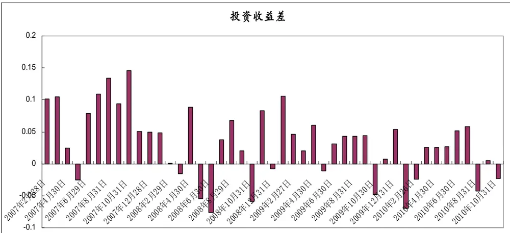
数据来源：广发证券发展研究中心

图 16：固定权重 PS+PE估值综合模型超配股票与指数累计收益对比
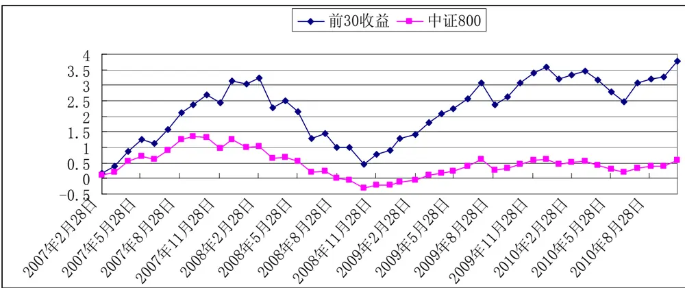
数据来源：广发证券发展研究中心

纵观固定权重PE+PS综合模型的历史表现，模型在07年的表现最好，而其他年份也有相对稳定的表现。45个模拟投资月份里，33个月模型能捕捉到正值收益差，成功率为73.3%。超配组合实证期间表现优异，最后累积收益高达495%，平均每月收益为5.07%。

图 17：动态权重 PS+PE估值综合模型收益差
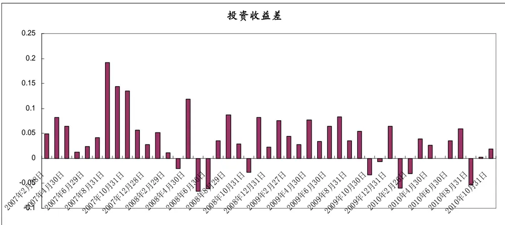
数据来源：广发证券发展研究中心

图 18：动态权重 PS+PE估值综合模型超配股票与指数累计收益对比
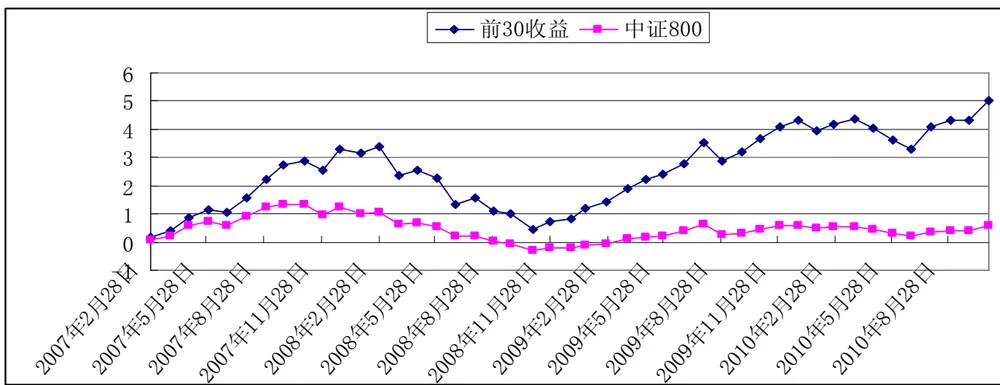
数据来源：广发证券发展研究中心

从历史表现来看，动态变化权重模型有很高的胜率，45个月份里，有35个月模型能捕捉到正值的收益差，成功率为78%。超配组合表现也十分优异，四年的累积收益高达502%，远胜于中证800指数，并微胜于固定权重模型。

## （五）历史表现最优综合模型：

所有的综合模型在捕获正值收益差方面都有着不错的成绩，成功率都在65%以上。而最优的综合模型将会通过以下的对比来进行判定：

图 19: 不同综合模型逐年表现对比
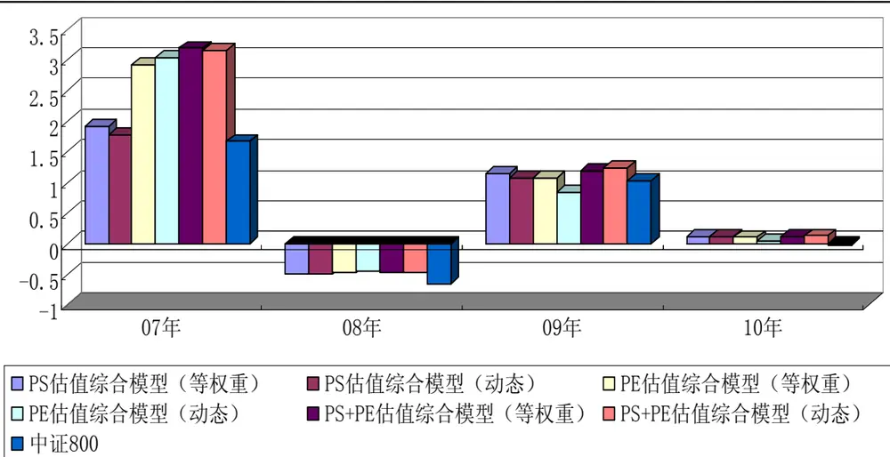
数据来源：广发证券发展研究中心

纵观所有超配组合的每年收益表现，不同的综合模型每年都有优于中证800指数的表现。其中，固定权重和动态权重的PS+PE综合模型的超配组合每年表现都好于其他模型。

表 3：不同综合模型统计数据

|  | PS 估值综合模型 |  | PE 估值综合模型 |  | PS+PE 估值综合模型 |  |
| --- | --- | --- | --- | --- | --- | --- |
|  | 固定权重 | 动态权重 | 固定权重 | 动态权重 | 固定权重 | 动态权重 |
| 正收益差成功 率 | 73.3% | 66.7% | 68.9% | 73.3% | 73.3% | 77.8% |
| 超配战胜指数 胜率 | 73.3% | 68.9% | 80% | 68.9% | 82.2% | 80% |
| 年化收益差 年化收益差波 | 27.4% | 24.9% | 35.1% | 36.8% | 38.1% | 43.9% |
| 动率 | 14.9% | 15.3% | 18.4% | 19.0% | 18.8% | 18.7% |
| 信息比 | 1.84 | 1.63 | 1.90 | 1.94 | 2.03 | 2.34 |
| 超配组合年化 收益 | 47.0% | 45.2% | 58.5% | 53.8% | 60.9% | 61.0% |
| 超配组合波动 率 | 46.1% | 44.3% | 51.2% | 47.9% | 49.8% | 49.4% |
| 实证期间超配 | 281% | 268% | 436% | 377% | 495% | 502% |

数据来源：广发证券发展研究中心

从以上不同的统计数字来看，动态权重的PS+PE估值综合模型在选股能力上的表现上最为出色。该模型在捕获正收益差的成功率是所有综合模型之最。它的年化收益差高达43.9%，信息比为2.34,也是优于其他模型。而超配组合收益战胜指数的胜率也高达80%。所以根据以上分析，我们认为动态权重变化的PS+PE估值综合模型对比其他模型更有效，更能发挥估值与动量选股的作用。

## 五、最优模型最新信号：

以下是PS+PE估值综合模型在2010年11月29日时的最新选股名单：

## （一）得分前30股票组合

表 4：得分前 30 股票组合

| 估值得分 |  | 动量得分 |  |  |  |  |  |
| --- | --- | --- | --- | --- | --- | --- | --- |
| 股票名称 | PS 模型 | PE 模型 | 股价动量 | 动量加速 收入预期 | 最终得分 |  | 所属行业 |
| 农业银行 | 0.6 | 1 | 3 | 3 | 2 |  | 9.6 金融服务 |
| 吉电股份 | 1 | 0.8 | 3 | 3 | 0.8 |  | 8.6 公用事业 |
| 紫江企业 | 0.8 | 0.9 | 3 | 3 | 0.8 | 8.5 | 轻工制造 |
| 隧道股份 | 1 | 0.9 | 2.7 | 3 | 0.8 |  | 8.4 建筑建材 |
| 建设银行 | 0.5 | 1 | 3 | 2.7 | 1.2 |  | 8.4 金融服务 |
| 东北证券 | 0.5 | 0.7 | 2.4 | 2.7 | 2 |  | 8.3 金融服务 |
| 新兴铸管 | 0.5 | 0.9 | 3 | 2.7 | 1.2 |  | 8.3 黑色金属 |
| 兰花科创 | 0.4 | 0.9 | 2.7 | 2.7 | 1.6 | 8.3 采掘 |  |
| 招商证券 | 0.4 | 0.8 | 1.8 | 3 | 2 |  | 8 金融服务 |
| 南京高科 | 0.8 | 0.7 | 3 | 2.7 | 0.8 |  | 8房地产 |
| 保利地产 | 0.8 | 1 | 2.4 | 2.1 | 1.6 | 7.9 | 房地产 |
| 海信电器 | 1 | 0.9 | 1.8 | 3 | 1.2 | 7.9 | 家用电器 |
| 宇通客车 | 1 | 1 | 3 | 2.1 | 0.8 | 7.9 | 交运设备 |
| 万通地产 | 0.8 | 0.9 | 2.7 | 2.7 | 0.8 | 7.9 | 房地产 |
| 风神股份 | 1 | 0.7 | 3 | 2.4 | 0.8 | 7.9 | 化工 |
| 龙元建设 | 1 | 0.6 | 2.4 | 3 | 0.8 | 7.8 | 建筑建材 |
| 中国西电 | 0.7 | 0.6 | 3 | 2.7 | 0.8 | 7.8 | 机械设备 |
| 中国中冶 | 1 | 0.8 | 2.4 | 2.4 | 1.2 | 7.8 | 建筑建材 |
| 合肥百货 | 0.9 | 0.5 | 3 | 2.1 | 1.2 | 7.7 | 商业贸易 |
| 上海建工 | 1 | 0.8 | 2.1 | 3 | 0.8 | 7.7 | 建筑建材 |
| 开滦股份 | 0.8 | 0.7 | 3 | 2.4 | 0.8 | 7.7 | 采掘 |
| 中国化学 | 1 | 0.8 | 3 | 2.1 | 0.8 | 7.7 | 建筑建材 |
| 上海汽车 | 1 | 1 | 2.7 | 1.8 | 1.2 | 7.7 | 交运设备 |
| 工商银行 | 0.2 | 1 | 2.7 | 3 | 0.8 | 7.7 | 金融服务 |
| 格力电器 | 1 | 1 | 2.4 | 2.4 | 0.8 | 7.6 | 家用电器 |
| 南方航空 | 0.9 | 0.9 | 2.7 | 1.5 | 1.6 | 7.6 | 交通运输 |
| 新安股份 | 0.6 | 0.3 | 2.4 | 2.7 | 1.6 | 7.6 | 化工 |
| 天马股份 | 0.4 | 0.7 | 3 | 2.7 | 0.8 | 7.6 | 机械设备 |
| 中国船舶 | 0.8 | 0.9 | 2.4 | 2.7 | 0.8 | 7.6 | 交运设备 |
| 置信电气 | 0.2 | 0.5 | 3 | 3 | 0.8 | 7.5 | 机械设备 |

数据来源：广发证券发展研究中心

## （二）得分后30股票组合

表 5：得分后 30股票组合

| 估值得分 |  |  |  | 动量得分 |  |  |  |
| --- | --- | --- | --- | --- | --- | --- | --- |
| 股票名称 | PS 模型 | PE模型 | 股价动量 | 动量加速 | 收入预期 | 最终得分 | 所属行业 |
| 东方市场 | 0.6 | 0.3 | 0.3 | 0.9 | 0.8 |  | 2.9 商业贸易 |
| 中国国旅 | 0.5 | 0.2 | 0.3 | 0.3 | 1.6 | 2.9 | 餐饮旅游 |
| 江苏阳光 | 0.5 | 0.1 | 1.2 | 0.3 | 0.8 | 2.9 | 纺织服装 |
| 龙溪股份 | 0.4 | 0.5 | 0.9 | 0.3 | 0.8 | 2.9 | 机械设备 |
| 银基发展 | 0.1 | 0.4 | 0.6 | 0.9 | 0.8 |  | 2.8 房地产 |
| 厦门港务 | 0.7 | 0.4 | 0.6 | 0.3 | 0.8 | 2.8 | 交通运输 |
| 一汽夏利 | 0.8 | 0.6 | 0.3 | 0.3 | 0.8 | 2.8 | 交运设备 |
| 万马电缆 | 0.5 | 0.3 | 0.6 | 0.6 | 0.8 | 2.8 | 机械设备 |
| 哈空调 | 0.4 | 0.1 | 1.2 | 0.3 | 0.8 | 2.8 | 机械设备 |
| 华海药业 | 0.2 | 0.3 | 0.9 | 0.6 | 0.8 | 2.8 | 医药生物 |
| 东软集团 | 0.4 | 0.5 | 1.2 | 0.3 | 0.4 | 2.8 | 信息服务 |
| 鹏博士 | 0.3 | 0.2 | 1.2 | 0.3 | 0.8 | 2.8 | 信息服务 |
| 交通银行 | 0.8 | 1 | 0.3 | 0.3 | 0.4 | 2.8 | 金融服务 |
| 许继电气 | 0.5 | 0.2 | 0.3 | 0.9 | 0.8 | 2.7 | 机械设备 |
| 超声电子 | 0.6 | 0.4 | 0.3 | 0.6 | 0.8 |  | 2.7 电子元器件 |
| 天保基建 | 0.3 | 0.7 | 0.3 | 0.6 | 0.8 | 2.7 | 房地产 |
| 同方股份 | 0.8 | 0.2 | 0.6 | 0.3 | 0.8 | 2.7 | 信息设备 |
| 名流置业 | 0.2 | 0.5 | 0.3 | 1.2 | 0.4 | 2.6 | 房地产 |
| 丽珠集团 | 0.4 | 0.7 | 0.3 | 0.3 | 0.8 | 2.5 | 医药生物 |
| 国电南自 | 0.6 | 0.2 | 0.6 | 0.3 | 0.8 | 2.5 | 机械设备 |
| 中新药业 | 0.4 | 0.4 | 0.3 | 0.6 | 0.8 | 2.5 | 医药生物 |
| 综艺股份 | 0.1 | 0.1 | 1.2 | 0.3 | 0.8 | 2.5 | 信息服务 |
| 亚宝药业 | 0.3 | 0.4 | 0.3 | 0.6 | 0.8 | 2.4 | 医药生物 |
| 南海发展 | 0.2 | 1 | 0.3 | 0.9 | 0 |  | 2.4 公用事业 |
| 新农开发 | 0.5 | 0.2 | 0.6 | 0.3 | 0.8 |  | 2.4 农林牧渔 |
| 广钢股份 | 0.3 | 0.1 | 0.3 | 0.9 | 0.8 |  | 2.4 黑色金属 |
| 南玻A | 0.3 | 0.6 | 0.3 | 0.3 | 0.8 |  | 2.3 建筑建材 |
| 中泰化学 | 0.4 | 0.2 | 0.6 | 0.3 | 0.8 | 2.3 | 化工 |
| 美克股份 | 0.5 | 0.1 | 0.3 | 0.6 | 0.8 |  | 2.3 轻工制造 |
| 马应龙 | 0.2 | 0.4 | 0.3 | 0.3 | 0.8 |  | 2 医药生物 |

数据来源：广发证券发展研究中心

从最新的得分情况来看，动量方面的权重更高，说明近期动量的子模型表现要明显优于估值类模型。而从行业分布来看，金融服务行业的股票动量较好，所以得分较高。而医药有较多股票明显动量不足，所以得分较低。

## 广发金融工程研究小组

罗军，分析师，金融工程组组长，华南理工大学理学硕士，2009 年进入广发证券发展研究中心，2010 年新财富金融工程最佳分析师入围。联系方式：lj33@gf.com.cn，020-87555888-655。

胡海涛，分析师，华南理工大学理学硕士，2010 年进入广发证券发展研究中心，2010 年新财富金融工程最佳分析师入围。
联系方式：hht@gf.com.cn，020-87555888-406。

蓝昭钦，研究助理，中山大学数学硕士，2010 年进入广发证券发展研究中心，2010 年新财富金融工程最佳分析师入围。联系方式：lzq3@gf.com.cn，020-87555888-667。

李明，研究助理，伦敦城市大学卡斯商学院计量金融硕士，2010 年进入广发证券发展研究中心，2010 年新财富金融工程最佳分析师入围。联系方式：lm8@gf.com.cn，020-87555888-687。

## 相关研究报告

金融工程2011 年量化投资策略

罗军2010-11-29

|  | 广州 | 深圳 | 北京 | 上海 |
| --- | --- | --- | --- | --- |
| 地址 | 广州市天河北路183号 | 深圳市民田路华融大厦 | 北京市月坛北街2号月坛大上海市浦东南路528号 |  |
| 邮政编码 | 大都会广场36楼 510075 | 2501室 | 厦18层1808室 | 证券大厦北塔17楼 |
| 客服邮箱 |  | 518026 | 100045 | 200120 |
|  | gfyf@gf.com.cn |  |  |  |
| 服务热线 | 020-87555888-612 |  |  |  |

注：广发证券股份有限公司具备证券投资咨询业务资格。本报告只发送给广发证券重点客户，不对外公开发布。

## 免责声明

本报告所载资料的来源及观点的出处皆被广发证券股份有限公司认为可靠，但广发证券不对其准确性或完整性做出任何保证。报告内容仅供参考，报告中的信息或所表达观点不构成所涉证券买卖的出价或询价。广发证券不对因使用本报告的内容而引致的损失承担任何责任，除非法律法规有明确规定。客户不应以本报告取代其独立判断或仅根据本报告做出决策。

广发证券可发出其它与本报告所载信息不一致及有不同结论的报告。本报告反映研究人员的不同观点、见解及分析方法，并不代表广发证券或其附属机构的立场。报告所载资料、意见及推测仅反映研究人员于发出本报告当日的判断，可随时更改且不予通告。

本报告旨在发送给广发证券的特定客户及其它专业人士。未经广发证券事先书面许可，不得更改或以任何方式传送、复印或印刷本报告。