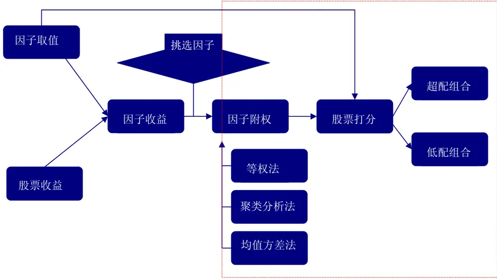
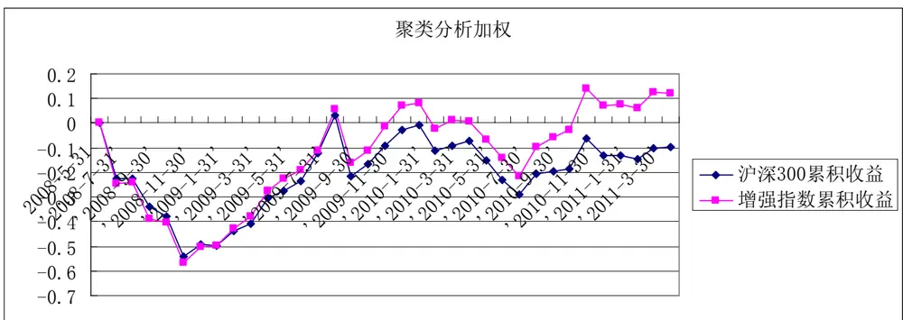
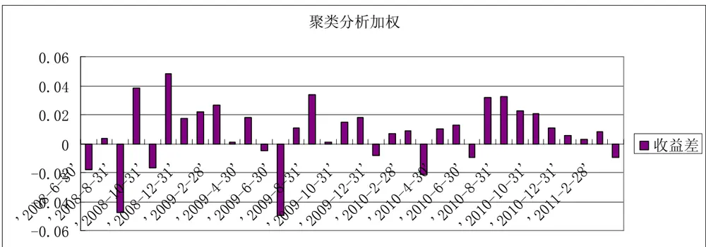
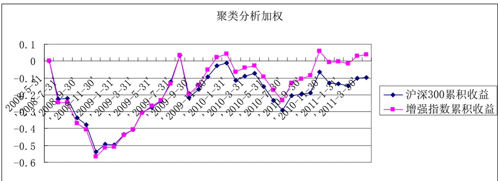
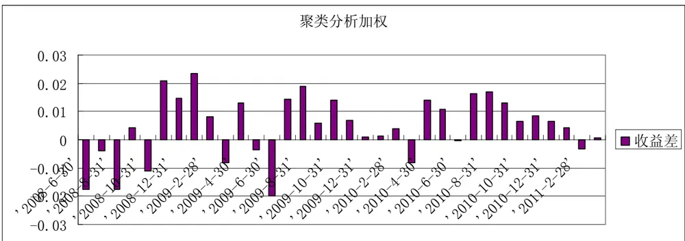
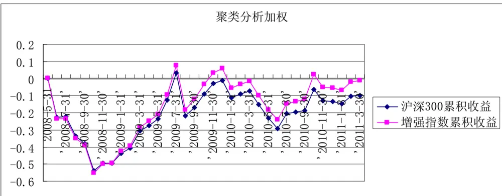
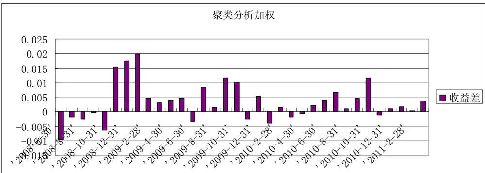
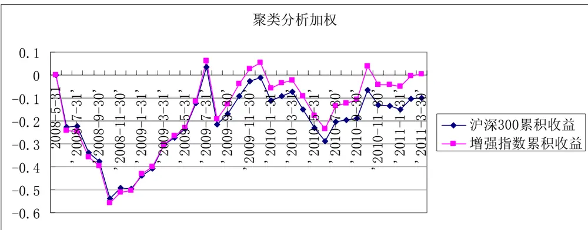
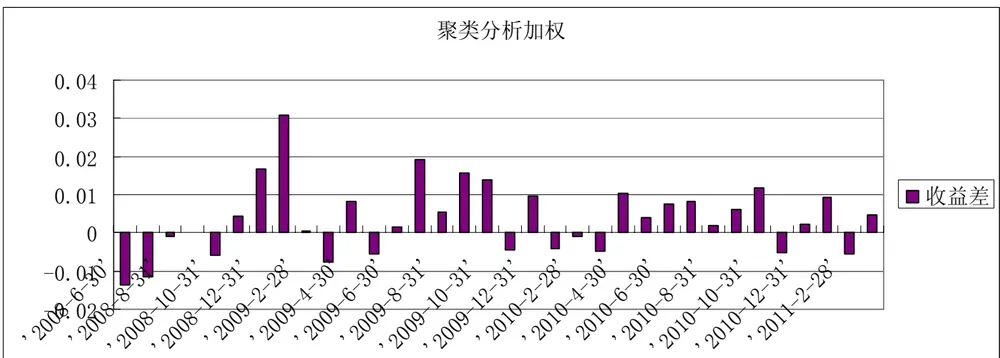

# 多因子 Alpha模型研究：沪深 300成份股的应用分析（下）

# --多因子 Alpha 策略系列报告之二

罗军 金融工程 分析师

胡海涛 金融工程 分析师

电话： 020-87555888-655

电话：020-87555888-406

eMail： lj33@gf.com.cn

eMail: hht@gf.com.cn

SAC执业证书编号：S0260511010004

SAC执业证书编号：S0260511020010

## 因子权重的合理分配能发挥因子的实际效用

要充分发挥因子的效用，就牵扯到为因子合理分配权重的问题。权重代表的是因子对于模型的重要性，是一个客观的定量指标。若一个因子有优于其他因子的表现，就应该从它的每期权重分配中体现出来。所以，合理分配权重是构建多因子模型的重要环节。

## 等权重、聚类分析以及均值方差最优法等三种因子权重分配法的优劣

等权重分配法的优点在于权重的稳定性。由于是静态的权重，模型最终挑选股票组合的换手率较低。但该方法较为主观，并没有考虑因子收益变化对模型带来的影响。

聚类分析方法的优点则在于它有效的利用了因子收益的趋势性以及相关性，每期动态为因子分配合理的权重。
但缺点是一旦因子收益发生逆转，该方法可能导致模型发生错判。

把因子类比为“股票”，以因子 IR最大化为导向，利用马克维茨的均值方差法为因子进行权重分配。该方法有很强的理论基础，也是我们新尝试的权重分配法。

## 实证表明聚类分析法是较优的选择

聚类分析法在不同的股票组合构建方案中均有优于其他两种因子权重分配方法的表现，为我们所推荐的分配方法。

实证表明，均值方差最优法效果较差，主要在于该方法对因子所分配的权重变化较大，导致换手率较高。而且同一期因子权重之间差异较大，部分因子权重容易获取极端值，影响实证效果。因此，直接利用均值方差理论来分配权重并不成熟，仍有待进一步完善。

## 流通市值加权-包含金融 ALPHA 策略表现最优

我们挑选出 24个有效 alpha 因子，利用聚类分析法分配因子权重，采用 2008.5——2011.3 月的数据对 4类不同的组合构建策略，在允许卖空与不允许卖空的假设下分别进行实证分析。流通市值加权-包含金融的策略效果较佳，不仅能获取年化约 7.5%的超额收益，同时月度胜率在 73%以上，且信息比在 1.14。可以通过该策略结合股指期货获取稳健的绝对回报。

## 一、因子权重分配的实际意义

在上一遍《多因子alpha模型研究：沪深300成份股的应用（上）》中，我们详细的解释了对于多因子模型构建流程的前两个重要部分：如何计算因子收益以及如何挑选因子。在我们海选的80多个因子中，利用胜率、因子IR、T检验等不同的评价指标，最终挑选出24个有效因子。无论从因子的胜率，捕获超额风险收益，抑或因子收益的显著性，该些因子都是较优选择。从最终挑选因子的类别来看，估值类因子的表现相当出色，不论在牛市，熊市或震荡市，我们都可以发现显著的正收益。而规模类因子在不同市场环境中也有相当出色的表现。所以，可从实证中观察出沪深300股票在过往的5年中有较为明显的低估值和规模效应。

在挑选好因子后，我们即将要面对的问题便是如何在不同时点去利用好挑选出来的因子，发挥因子的最大效用，使得从多因子模型挑选出来的超配组合长期有优于低配组合的表现。而要发挥因子的效用，就牵扯到为因子合理分配权重的问题。权重代表的是因子对于模型的重要性，是一个客观的定量指标。若一个因子有优于其他因子的表现，就应该从它的每期权重分配中体现出来。所以，合理分配权重是构建多因子模型的重要环节。以备选的24个最终因子为基础，本文将会利用三种不同权重分配法进行比较，并通过实证分析挑选出较佳的权重分配法以建立基于沪深300成分股的ALPHA策略。

图 1：广发多因子模型构建体系的结构图

数据来源：广发证券研发中心

## 二、因子权重分配方法的实证分析

对因子分配权重可以分为静态以及动态分配两类方法。静态方法就是在确定了因子权重之后，不会动态调整，该类方法的好处是操作简单，权重不受其它因素影响。但从分析历史收益可知，因子的收益是一个动态变化的过程，动态去改变因子权重似乎更加合理。那么动态还是静态分配权重会使多因子模型获得更佳效果？本文将会以以下三种权重分配法进行实证研究。

## （一）因子权重分配方法介绍

## 静态法：等权重分配

等权重分配法是典型的静态权重分配法，每一期模型都会为每个因子赋予同样的权重。这就相当于，每一期我们认为每个因子有效性同样显著，所以无差别对待。该种方法的优点在于权重的稳定性。由于是静态的权重，模型最终挑选股票组合的换手率较低。但该种方法较为主观，并没有考虑因子收益变化对模型带来的影响。

## 动态法：聚类分析分配权重

我们曾经在《金融工程2010中期专题报告系列三：风格因子驱动下的行业内量化选股研究》的专题报告中提出了以聚类分析的方法来为动态因子分配权重。该方法的理念在于，因子收益之间是存在相关性的。如果对所有的因子直接赋予权重有可能引起多重共线性的问题，使我们没法获得独立的不同的风险溢价源。而且这会导致同类因子赋予过多权重的后果，使得动态形成的多因子模型有所偏差。但通过聚类分析把相关性高的因子聚为一类，则能有效地解决共线性的问题。本篇报告利也用同样的聚类分析法，以因子过往36个月的收益之间的相关系数为判定条件，生成不同的ALPHA源。并利用过往12个月的因子信息比来分配不同类之间的权重，从而测算同类不同因子的权重。（详细方法请参考上述的专题报告）。但上述报告每期都只会挑选信息比为正的因子作为分配权重对象，这样提高了每期因子的变更率，从而使得最终挑选股票的换手率较高。而在本次研究中，由于前期我们已经判定了因子的有效性，选出的因子信息比都为正，所以每期24个备选因子都会“全体上阵”，并不会再进行挑选。聚类分析方法的优点在于它有效的利用了因子收益的趋势性以及相关性，每期动态为因子分配合理的权重。从行业内选股的实证表明，该分配法在趋势性的市场环境中能获得较好的效果，但是一旦因子收益发生逆转，该方法可能导致模型发生错判。

## 动态法：马克维茨均值方差理论分配权重

前面已经提到，因子收益是动态变化的过程，因子组合应该是多元化的组合。原因是在不同的风格子集中会有不同的有效因子，在不同的宏观经济环境中会有不同的因子，在不同的市场环境中也有不同的有效因子。在系列报告一中我们已经定义过，因子是某一种股票风险的集合代表。因此，我们可以把每个因子理解为单独的一个“股票”，因子收益刻画的是该“股票”的收益，而因子收益的标准差则代表该“股票”的风险。那么因子的组合就可定义为一个“股票组合”来分析。而我们的目标就是使该“股票组合”风险超额收益最大化，也就是因子组合IR的最大化，在该目标下寻求最优的权重配置。

由于因子之间是存在相关性的，这点与股票也十分相似。那么寻找最佳因子权重就与寻找最优股票组合权重的理念是完全一致的，这与上述两种权重方法最大的不同，因为前面的两种权重分配法并没有以IR最大化目标为导向去分配权重。本本法将引用 $\underline{{\vec{u}}}$ 克维茨的均值方差组合理论来进行权重分配。该理论依据了以下几个假设：其一，投资者在进行投资时，他是根据单个“股票”预期收益来估测投资组合的风险。其二，投资者的决定仅仅是依据“股票”的风险与收益。其三，一个理性投资者应该在给定期望风险水平下对期望收益进行最大化，或者在给定期望收益水平下对期望风险进行最小化，这与我们的IR最大化目标不谋而合。解决因子权重的具体方法如下：

1．计算我们的24个备选因子的历史平均收益：

$$
\overline{{R}}=(\overline{{R}}_{1},\overline{{R}}_{2},\overline{{R}}_{3},\overline{{|||}}\overline{{R}}_{n})
$$

2.计算因子收益之间的协方差矩阵：

$$
\textstyle\sum_{R}=(\rho_{R(i,j)})_{i,j=1}^{M}
$$

3.假设因子权重为：

$$
\mathbf{v}=\left(\nu_{1}^{},\nu_{2}^{},\cdots,\nu_{M}^{}\right)^{\prime}
$$

那么我们的目标函数就应该为：

$$
\alpha(s)=\nu^{\prime}\cdot\overline{{R}}-\nu^{\prime}\cdot\Sigma_{R}\cdot\nu
$$

4.利用偏微分极值理论，我们对目标函数进行一阶偏微分并使得它们等于0，可以得出24个多元一次的线性方程。以矩阵的形式表达如下：

$$
\begin{array}{r}{\overline{{R}}-\nu\cdot\sum_{R}=0}\end{array}
$$

上述公式由于只存在一阶的项数，所以算出唯一解析解。经过变化，我们得出最优组合权重的公式应该为：

$$
\mathbf{v}^{*}=\Sigma_{R}^{-1}\overline{{R}}
$$

也就是因子收益协方差矩阵的逆矩阵乘以平均因子收益的向量。这与马克维茨首次发现得均值-方差最优投资组合权重的解决方案是一致的。从公式可以看出，平均因子收益越高，该因子所得的权重越大。因子收益标准差越小，权重越小。若因子和其他因子相关性越高，所得的权重也会越小。

## （二）因子打分体系用以挑选超配与低配组合

配权重的最终目的是为了挑选超配组合与低配组合，所以要结合一套打分体系来为股票打分并进行排序。所有因子为股票打分的规则是一致的。以每月沪深300只成分股为备选股票池，我们会把所有股票分为5等份。然后根据每个因子为股票排序打分，若股票属于第一等份，则得分为5。若股票排名属于第二等份，得分为4，以此类推，排名属于最后等份的股票得分为1。不同指标排序的方向并不相同，具体方向在之前报告已描述，在此就不在赘述。

当然，这只是对个股针对单个因子打分。根据每个因子的权重不同，模型会每月为个股单个因子打分进行动态加权。得到股票最终的综合得分。加权的公式如下：

$$
\alpha(s)=\sum_{n=1}^{N(k)}w(n)\times V(s,n)
$$

其中：w n( )＝ n因子的权重

$$
\begin{array}{rl}{\nu(s,n)=}&{{}\mathsf{S}\sharp_{{\sf X}}^{\prime}\underline{{\triangleq}}\ j\pm n\mathbb{E}\ j\mp\sharp_{\sf X}^{\prime}\ j\sharp_{\sf X}^{\prime}\ j\neq\ j\ j\ j\gg}\end{array}
$$

根据沪深300每月成分股的最终打分，我们会把得分靠前的20%股票作为超配组合，得分靠后的20%股票作为低配组合。

## （三）实证分析：聚类分析加权法效果最优

要对比权重分配法的有效性，最主要是看超配组合是否能具备长期稳定超越低配组合的收益表现。我们以2008年5月31日到2011年3月31日作为实证期，分别在不同的股票组合构建方法内对比上述三种因子加权方法的优劣。

## 股票等权重：

通过因子综合得分后选出超、低配股票组合，组合内各股票等权重构成等权重组合。从对比的结果来看，因子平均加权法拥有最高的胜率，超配组合战胜低配组合拥有接近80%的概率。但从风险调整后的超额收益来看，聚类分析加权法的效果要更好一点。

表 1：不同因子权重分配法对比分析（股票等权重）

| 加权法 | 超配胜低配胜率 | 平均换手率 | 年化信息比率 |
| --- | --- | --- | --- |
| 平均加权法 | 79.41% | 16.24% | 1.8051 |
| 聚类分析加权法 | 73.53% | 21.16% | 1.8807 |
| 均值方差最优法 | 70.59% | 23.79% | 1.1441 |

数据来源：广发证券研发中心

股票流通市值加权：

上面是基于超低配股票以平均加权方式来计算收益的基础上对比不同权重计算方法的优劣，并没有考虑到两个组合里各个股票的市值不同所带来影响。所以我们也以流通市值加权的方法做了实证，以下是对比的结果。

表 2：不同因子权重分配法对比分析（流通市值加权）

| 加权法 | 超配胜低配胜率 | 平均换手率 | 年化信息比率 |
| --- | --- | --- | --- |
| 平均加权法 | 70.59% | 16.24% | 1.0845 |
| 聚类分析加权法 | 73.53% | 21.16% | 1.2391 |
| 均值方差最优法 | 70.59% | 23.79% | 1.0232 |

数据来源：广发证券研发中心

从结果可看出，聚类分析加权法拥有较高的胜率，超配组合战胜低配组合的胜率为73%。而从年化信息比的对比中，我们也可发现聚类分析法较为占优。

## 股票等权重（剔除金融）：

在挑选权重分配法的实证期间，我们发现在不同时间里，三种分配法所挑选的低配组合里都有许多金融服务业的股票。分析其中原因，这是由于某些备选因子对金融服务业股票并不适用（例如“主营业务收入增长率(%)(同比)”），所以导致在得分方面金融服务业股票较低。基于该原因，我们也尝试把金融服务业股票剔除，单独从剩下的股票里去构建超配与低配。这样又分成两种不同的情况：等权重—包含非金融，流通市值加权-包含非金融。

表 3：不同因子权重分配法对比分析（股票等权重-剔除金融）

| 加权法 | 超配胜低配胜率 | 平均换手率 | 年化信息比率 |
| --- | --- | --- | --- |
| 平均加权法 | 67.65% | 19.87% | 1.4879 |
| 聚类分析加权法 | 70.59% | 25.79% | 1.8621 |
| 均值方差最优法 | 55.88% | 27.15% | 0.9377 |

数据来源：广发证券研发中心

在不包含金融服务业股票以及股票等权重加权的情况下，因子聚类分析法拥有最好的胜率，从年化信息比的对比来看，聚类分析法也拥有最稳定的Alpha。

股票流通市值加权（剔除金融）：

表 4：不同因子权重分配法对比分析（股票流通市值加权-剔除金融）

| 加权法 | 超配胜低配胜率 | 平均换手率 | 年化信息比率 |
| --- | --- | --- | --- |
| 平均加权法 | 67.65% | 19.87% | 1.9077 |
| 聚类分析加权法 | 70.59% | 25.79% | 1.9967 |
| 均值方差最优法 | 50.00% | 27.15% | 0.4830 |

数据来源：广发证券研发中心

在不包含金融服务业股票以及流通市值加权的情况下，聚类分析法依然保持着最高的胜率，在信息比的比较下，它也有最好的表现。

所以，综合4种情况的对比结果，我们觉得聚类分析法所挑选的超配组合在不同情况下都能获得较高的胜率，并且有稳定超越低配组合的表现，为我们所推荐最优的权重分配法。相反，均值方差最优法在不同情况下的表现都劣于其他两种分配法，这是由于每期均值方差法对因子所配的权重变化较大，而且并不稳定，导致换手率高的情况出现。而且同一期因子权重之间也相差甚远，容易令得极端情况发生，实证结果也应征了该观点。所以直接利用均值方差理论来分配权重并不成熟，可以有进一步的改进空间。

## 三、构建沪深300指数增强的ALPHA策略

## （一）策略的基本思路

本次研究的最终目的是为了在沪深300指数收益的基础上，利用我们刚挑选的最优权重分配法构建超配与低配组合，并设计基于沪深300的ALPHA策略。而我们ALPHA策略的基本思路是买多/卖空的策略。该种策略以卖出我们的低配组合中股票来实现低配的效果，然后以卖出的资产买入超配的股票，以实现超配的效果。最终的实际收益将会是实际指数的收益+超配部分收益-低配部分收益。而“超配部分收益-低配部分收益”便是我们获得ALPHA的来源。

而在卖出低配组合中股票的时候和买入超配组合的时候，我们应该以什么样的权重来分配？在本次研究中，等权重加权和流通市值加权会分别运用并进行比较，并尝试允许做空和不允许做空两种情景分别进行对比分析。

等权重分配法（允许做空的130-30）：该方法按照等权重卖出低配组合股票，然后等权重的买入超配组合股票。我们做第一种尝试便是在每月的低配股票中，向下找出在沪深300里权重最小的股票，并以该股票权重作为上限对每只低配股进行低配，然后也已该权重对每只高配股进行超配。但根据我们的调查发现，每月低配股票中最小权重股的权重平均来看仅为0.03%，虽然我们低配组合有将近60只的股票，但卖出的总权重也只有1.8%，而我们也只能超配该1.8%的权重到超配组合股票里。计算下来，超配减低配的收益并不明显，也就不能成为有效的ALPHA策略。有鉴于此，我们就把低配组合中的个股按每只0.5%的权重去卖出，然后以每只0.5%的权重买入超配组合的股票。如果以60只股票计算，这样我们就相当于卖出30%权重的低配股票，并买入30%的超配股票，占比较为合理。但在实际操作中，我们也发现某些低配组合股票在沪深300成分股里并没有占到0.5%的权重，所以会出现卖空的情况。若发生该种情况，我们会按中金所一开始颁布的9.86%融券年化利率作为我们的卖空成本。虽然该利率较高，但我们相信随着转融通的推出，融券的成本会逐渐降低，更有利与超额收益的捕获。

流通市值加权（不允许做空）：该方法是每期低配组合中的股票按他们的实际权重全部空仓，然后以等量的总权重配置到超配组合股票。为了超配组合与低配组合的可比性，我们会以每个超配股票占超配组合整体比重的占比来配置。这样就保证了超配与低配组合股票都是按市值加权，有效避免了上述等权重卖空的情况。

当然，前面提到金融与非金融的问题也是要考虑的问题之一。所以我们最后会建立4个不同的ALPHA策略：等权重—包含金融，等权重—剔除金融，流通市值加权—包含金融，流通市值加权—剔除金融。通过实证结果的对比，将会挑选出最优的一种策略作为本报告的推荐策略。

## （二）实证分析

策略实证期间为2008.5——2011.3，沪深300指数上市以来至2008.5月的数据用以选择因子以及因子权重的分配，因子权重分配采用的是聚类分析法，交易手续费取单边0.002。

## 1.流通市值加权-包含金融ALPHA策略

图 2：流通市值加权-包含金融ALPHA策略指数与基准累积收益对比

数据来源：广发证券研发中心

图 3：流通市值加权-包含金融ALPHA策略超额收益月度分布

数据来源：广发证券研发中心

从累计收益的表现来看，基于流通市值加权—包含金融的ALPHA策略的增强指数表现由09年9月开始发力，并一直有优于指数的一个表现。而从10年9月底开始，借助当时股市上升的好势头，一举抛离指数。增强指数在接近三年的时间里最终实现11.9%的正收益，而当期沪深300指数的累积收益为-9.87%。

识别风险，发现价值

## 2.等权重-包含金融ALPHA策略

图 4：等权重-包含金融ALPHA策略指数与基准累积收益对比

数据来源：广发证券研发中心

图 5：等权重-包含金融ALPHA策略超额收益月度分布

数据来源：广发证券研发中心

该策略下的增强指数表现就不如流通市值加权—包含金融的ALPHA策略指数，虽然该增强指数在10年10月的小牛市中有所表现，但最终实现的累积收益只有3.79%，累计超额收益13.63%。分析其中原因，我们发现该策略的超配组合表现与上一策略超配组合相若，但由于融券成本的加入，使得部分超额收益被吞噬。所以最终累积收益较为疲弱。

## 3.流通市值加权-不包含金融ALPHA策略

图 6：流通市值加权-剔除金融ALPHA策略指数与基准累积收益对比

数据来源：广发证券研发中心

图 7：流通市值加权-剔除金融ALPHA策略超额收益月度分布

数据来源：广发证券研发中心

在不挑选金融股票的情况下，流通市值加权的ALPHA策略指数表现较弱,三年下来的累积收益为-0.99%，超额收益8.84%。尽管信息比较高，达到1.69，但是年化超额收益太低。

## 4.等权重-不包含金融ALPHA策略

图 8：等权重-不包含金融ALPHA策略指数与基准累积收益差对比

数据来源：广发证券研发中心

图 9：等权重-剔除金融ALPHA策略超额收益月度分布

数据来源：广发证券研发中心

最后，在不考虑金融股票情况下，平均加权策略指数表现略好于市值加权策略，最终累积收益为0.45%，累计超额收益10.29%，但基于规模较小以及融券成本的缴入，所以收益并不能超越基准很多。

## （三）策略结果比较

从战胜指数的胜率角度观察，四种ALPHA策略都能有60%以上的胜率，而流通市值加权-包含金融策略表现最优，战胜基准胜率能达73%。而从累积超额收益的表现考虑，以及平均交易成本，流通市值加权-包含金融ALPHA策略比等权重-包含金融ALPHA策略拥有较好的优势。尽管流通市值加权-包含金融策略的信息比比其他三种策略要低，但是考虑超额收益的情况，该策略平均年化接近7.5%，比其他三种策略更具吸引力。

最终，我们推荐流通市值加权-包含金融的alpha策略，通过该策略，同时做空股指期货，可以获取年均7%左右的绝对回报收益。

表 5： 策略结果比较

| 策略 | 战胜指数胜率 | 累积超额收益 | 平均交易成本 | 信息比 |
| --- | --- | --- | --- | --- |
| 流通市值加权-包含金融 | 73.52% | 21.78% | 0.000622 | 1.1396 |
| 等权重-包含金融 | 70.58% | 13.63% | 0.001577 | 1.4033 |
| 流通市值加权-剔除金融 | 67.64% | 8.84% | 0.000352 | 1.6886 |
| 等权重-剔除金融 | 64.71% | 10.29% | 0.001873 | 1.3295 |

数据来源：广发证券研发中心

## 四、总结

本次研究通过两篇报告的篇幅将我们整个量化模型的体系完整的介绍完。首先从挑选因子的角度，以不同的指标来分析因子历史收益，并挑选出有效的因子作为备选因子库。接下来，以三种不同的权重分配法来为有效因子分配权重，并通过实证分析挑选出聚类分析法作为我们最优的权重分配法。最后，利用该权重分配法构建了四种ALPHA策略，对比分析发现流通市值加权-包含金融策略更具吸引力。

在以后的系列报告中，我们将从中证800等不同的样本库中构建alpha策略，并拓展因子备选库，改善因子评价体系以及股票组合构建流程，寻找更优的策略。

## 广发金融工程研究小组

罗军，分析师，金融工程组组长，华南理工大学理学硕士，2010 年新财富最佳分析师评选入围，2009 年进入广发证券发展研究中心。

胡海涛，分析师，华南理工大学理学硕士，2010 年新财富最佳分析师评选入围（团队），2010年进入广发证券发展研究中心。
蓝昭钦，研究助理，中山大学数学硕士，2010年新财富最佳分析师评选入围（团队），2010 年进入广发证券发展研究中心。
联系方式：lzq3@gf.com.cn，020-87555888-667。

李明，研究助理，伦敦城市大学卡斯商学院计量金融硕士，2010年新财富最佳分析师评选入围（团队），2010年进入广发证券发展研究中心。联系方式：lm8@gf.com.cn，020-87555888-687。

## 相关研究报告

金融工程2010 中期专题报告系列三：风格因子驱动下的行业内量化选股研究

李明2010-5-27

|  | 广州 | 深圳 | 北京 | 上海 |
| --- | --- | --- | --- | --- |
| 地址 | 广州市天河北路183 号 | 深圳市民田路华融大厦 | 北京市月坛北街2号月坛大上海市浦东南路528号 |  |
| 邮政编码 | 大都会广场36楼 | 2501 室 | 厦18层1808室 | 证券大厦北塔17楼 |
| 客服邮箱 | 510075 | 518026 | 100045 | 200120 |
| 服务热线 | gfyf@gf.com.cn 020-87555888-612 |  |  |  |

注：广发证券股份有限公司具备证券投资咨询业务资格。本报告只发送给广发证券重点客户，不对外公开发布。

## 免责声明

本报告所载资料的来源及观点的出处皆被广发证券股份有限公司认为可靠，但广发证券不对其准确性或完整性做出任何保证。报告内容仅供参考，报告中的信息或所表达观点不构成所涉证券买卖的出价或询价。广发证券不对因使用本报告的内容而引致的损失承担任何责任，除非法律法规有明确规定。客户不应以本报告取代其独立判断或仅根据本报告做出决策。

广发证券可发出其它与本报告所载信息不一致及有不同结论的报告。本报告反映研究人员的不同观点、见解及分析方法，并不代表广发证券或其附属机构的立场。报告所载资料、意见及推测仅反映研究人员于发出本报告当日的判断，可随时更改且不予通告。

本报告旨在发送给广发证券的特定客户及其它专业人士。未经广发证券事先书面许可，不得更改或以任何方式传送、复印或印刷本报告。