# 从宏观角度观察 ALPHA 因子趋势

## ——2011 年金融工程研讨会专题报告系列之三

罗军 金融工程 分析师

## 胡海涛 金融工程 分析师

电话： 020-87555888-8655

电话：020-87555888-8406

eMail： lj33@gf.com.cn

eMail: hht@gf.com.cn

SAC执业证书编号：S0260511010004

SAC执业证书编号：S0260511020010

## 因子收益是有趋势性的

市场上有一种普遍的认知，觉得高度有效的多因子模型就应该在任何市场都能为投资者带来稳定的 ALPHA 收益。而该目标则建立在模型挑选的因子是否有长期贡献 ALPHA 的能力，这样的结合才能很好的发挥模型的效用。但通过我们的实证，要获得长期稳定的 ALPHA 的因子简直是百里挑一，而且效果并不能保证长期稳定。从因子历史收益观察得出，因子收益其实有趋势性的，根据宏观市场环境的改变，因子有效性也随之发生变化。

## 因子择时已经成为主流

金融风暴以来，由于外围市场环境的大改变，使得投资者在风险偏好上有所改变，这也对因子的有效性起到直接影响。靠传统多因子模型“一本万利”的情况已经不复存在！所以国外不少投资经理把更多的精力放在了对因子择时的研究当中，以期获得更高的超额收益。所谓的因子择时与市场择时同理，目的在于在因子表现好的时候，增大对该因子的风险暴露，而在因子表现差之时，降低风险暴露。一个有效的因子择时策略能在平均加权的基础上提升获取 ALPHA 的大小以及次数。

## 通过 8大宏观市场指标对 14个沪深 300有效因子进行分析

我们本次研究主要目的是观察不同宏观市场指标下的不同环境下因子表现的变化，从中总结应关注那些因子。在之前的沪深 300 多因子 ALPHA 模型的研究当中，我们总结出 14 个较为有效的因子作为本次研究的主要对象。而在宏观市场指标的挑选中，我们选取了 8个十分有代表性的指标，并按照一套规则把指标的变化区分为四种区间：上涨区间与下跌区间，高位区间与低位区间。通过对因子在不同区间表现的分析，我们可得出因子配置的有效信息。

## 市场好时看估值，市场差时看反转

综合研判，我们觉得在较佳宏观市场环境中表现较好的因子为：相对 PE，相对 PS，流通市值自然对数总资产周转。而在较弱宏观市场环境中表现较好的因子为：流通市值自然对数，三个月股价反转，一个月内评级改变。

识别风险，发现价值

## 一、因子收益是有趋势性的

首先，我们想重申因子的概念。因子代表的是某一种风险源，是投资者想捕获风险溢价所追逐的源头，或他们想要对冲掉的风险。因子代表的是股票间的一种共同风险特性，但我们不能直接投资于因子。虽然如此，我们可以根据不同股票对于该因子的风险暴露来构建超低配投资组合，用以模拟该因子的收益。通过对因子收益的分析，可得出因子在捕获ALPHA上面的一个有效性。根据该有效性，我们会给予各个因子合理的权重，结合个股在因子上面的风险暴露度，便可以一套多因子模型捕捉市场上的ALPHA。

市场上有一种普遍的认知，觉得高度有效的多因子模型就应该在任何市场都能为投资者带来稳定的ALPHA收益。该收益无论是在牛市，或是在熊市，都是较为显著的。而该目标则建立在模型挑选的因子是否有长期贡献ALPHA的能力，这样的结合才能很好的发挥模型的效用。在我们之前的多因子模型研究中，也会花大量的时间以及精力去寻找在不同市场环境中都能获得较好收益的因子。

但通过我们的实证，要获得长期稳定的ALPHA的因子简直是百里挑一，而且效果并不能保证长期稳定。以沪深300市场为例，在不分市场环境的情况下，我们认为十分有效的因子，其信息比能高于1，胜率能在65%以上的因子屈指可数。通过图例，我们能更好的了解个中情况：

图 1：相对 PS累积收益图
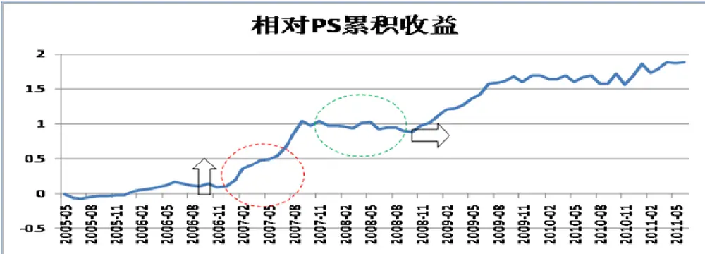
数据来源：广发证券研发中心

以上是沪深300下的相对PS因子累积收益图。因子收益整体呈现向上的趋势，但仔细观察因子收益的变化，我们会发现因子在07年市场环境好的时候，有一个强势上涨的过程。但到了08年的熊市，因子有效性明显减弱。所以，因子收益是有趋势性的，根据宏观市场环境的改变，因子有效性也随之发生变化。

金融风暴以来，由于外围市场环境的大改变，使得投资者在风险偏好上有所改变，这也对因子的有效性起到直接影响。靠传统多因子模型“一本万利”的情况已经不复存在！所以国外不少投资经理把更多的精力放在了对因子择时的研究当中，以期获得更高的超额收益。所谓的因子择时与市场择时同理，目的在于在因子表现好的时候，增大对该因子的风险暴露，而在因子表现差之时，降低风险暴露。一个有效的因子择时策略能在平均加权的基础上提升获取ALPHA的大小以及次数。

市场中对于因子择时会采用不同的指标：宏观指标，市场驱动指标，或技术指标。

识别风险，发现价值

我们本次研究主要目的是观察不同宏观市场指标下的不同环境下因子表现的变化，从中总结应关注那些因子。

## 二、从宏观角度来剖析因子有效性趋势

## （一）待测试的沪深 300 有效因子

从之前的沪深300多因子ALPHA模型的研究当中，我们总结出14个较为有效的因子作为本次研究的主要对象：

图 2：沪深 300有效因子列表
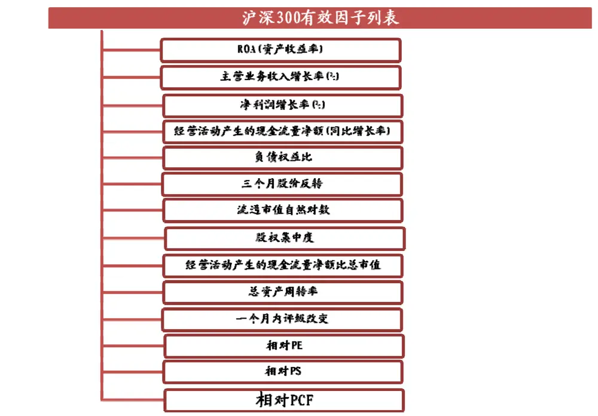
数据来源：广发证券研发中心

我们认为该些有效因子的挑选能够较全面的覆盖了股票的成长性，估值水平，盈利能力，营运能力以及反转效应。对于该些因子趋势性的研究能够更好的把握投资者在不同环境下的对于特定风险源的偏好。

## （二）宏观与市场指标的选择

在区分宏观市场环境之前，首先要选择有代表意义的宏观或市场指数：

图 3：挑选宏观市场指标
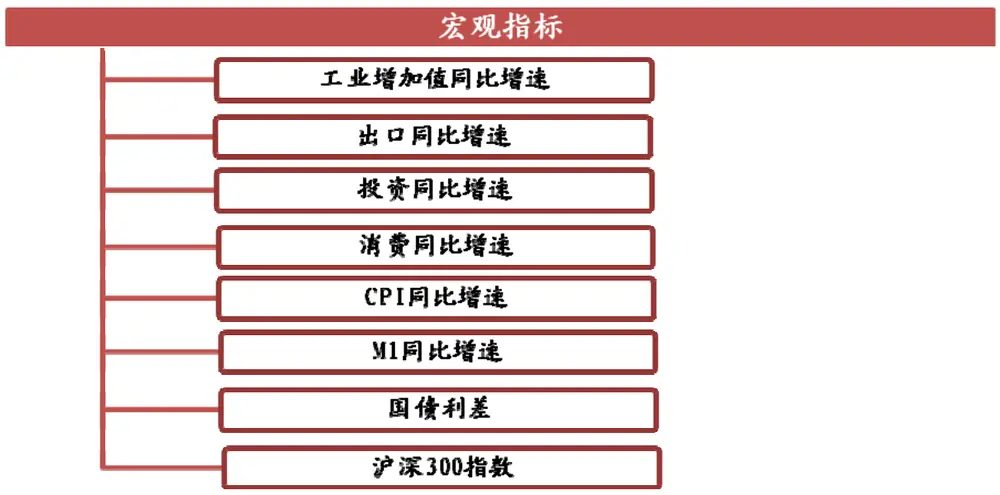
数据来源：广发证券研发中心

在划分市场环境中，该些指标都是比较具有代表性的！我们还可把该些指标细分为4类：

1.宏观经济指标：工业增加值同比增速，出口同比增速，投资同比增速以及CPI。经济学家一般利用该类指标直接度量经济的健康情况，以及通胀风险的高低。Arnott（1989）在他的研究中曾发现几个常用的经济指标的同比变化能对BARRA风险模型的因子回报有一定的预测作用。而Kao和Shumaker（1999）同时利用GDP增速和CPI两个指标对3个月的成长价值收益差进行预测，效果显著。所以宏观经济指标对于因子收益还是有不小的影响性。

2.货币政策指标：M1同比增速。Jensen和Conover在他们各自的研究中都指出，货币政策的紧缩和放松对股票市场收益，行业轮动，甚至风格轮动都有着很大的影响。Arnott在89年的研究更指出M1同比增速的变化对BARRA某些风险因子有着重要的影响。

3.消费型经济指标：消费同比增长率。Campbell和Cochrane就是利用该指标，结合效用函数来解释不同的资产定价现象。

4.股票市场指标：沪深300指数。顾名思义，指数的好坏直接代表了整个股票市场的投资情绪。通过研究不同市场是因子的表现，我们可分辨哪些因子牛市效应较强，哪些在弱市更有效。

## （三）如何区分市场环境

接下来便是根据每个宏观市场指标的变化来区分市场环境，主要是分为四种市场环境，具体的规则如下：

根据指标区分上涨和下降区间：我们以每月滚动的方式来观察并研判最高点以及最低点。站在某一时点，若前12个月以及后6个月都没有超过该点位的，便可定义为局部最高点。相反，若前12个月以及后6个月都没有低于该点位，则判定它为局部最低点。然后从指标的一个最高点到最低点可定义为一个下跌区间，而从指标的一个最低点到最高点则定义为上涨区间。

根据指标区分高位和低位区间：每月我们计算前12个月均值以及标准差，并界定均值+1*标准差为上界，均值-1*标准差为下界。高于上界的区间定义为高位区间，低于下界的区间定义为低位区间。

## 三、不同宏观指标下的检验结果

本章节把因子在各个宏观指标的不同区间的表现情况作了统计，揭示了在不同的宏观市场环境当中，排名前三的因子以及排名靠后的三个因子的收益表现以及胜率情况。通过与该些因子整体平均受益以及胜率的对比，我们能更直观的了解到哪些因子更值得超配。

## （一）工业增加值同比增速

## 1． 工业增加值同比增速近期表现

图 4：工业增加值同比增速表现
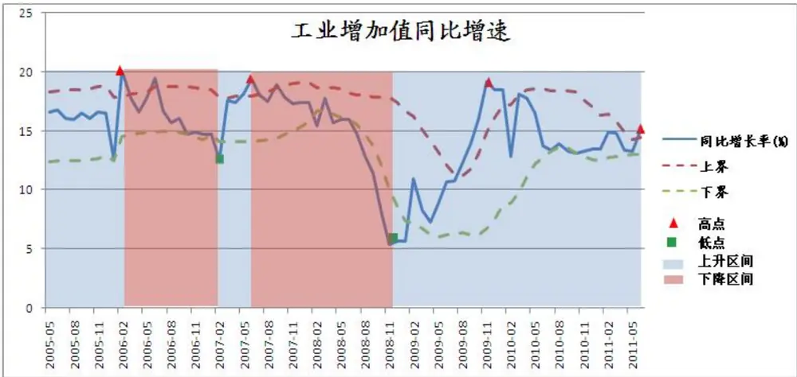
数据来源：广发证券研发中心

工业增加值同比增速从 08年 12月的低点开始，一直到 09年的 11月的高点是一个强势上升的过程，虽然后期出现一定的回落，但到今年 6月底指数还是处在相对高位的水平。

2．工业增加值同比增速上升区间
表 1：工业增加值同比增速上升区间

| 工业增加值同比增速上升区间 |  | 因子平 t检验均收益 |  | 因子成功率 | 整体平均收益 | 整体胜率 |
| --- | --- | --- | --- | --- | --- | --- |
| 表现最好前三 |  | 1.93% 0.96%1.81% 4.32%1.78% 3.11% |  | 71.43%62.86%65.71% | 1.11%1.25%1.75% | 59.46%55.41%66.22% |
| 1 总资产周转率2 流通市值自然对数3 相对PE |  |  |  |  |  |  |
| 表现最差前三 |  |  |  | 65.71% | 0.87% | 62.16%63.51% |
| 1 | 相对PCF | 0.79% | 12.09% |  |  |  |
| 2 | 负债权益比 | 0.64% | 30.48% | 57.14% | 0.90% |  |
| 3 | 经营活动产 | 0.47% | 32.69% | 57.14% | 0.60% | 55.41% |
|  | 生的现金流 |  |  |  |  |  |
|  | 量净额比总 |  |  |  |  |  |
|  | 市值 |  |  |  |  |  |

数据来源：广发证券研发中心

据统计所得，在工业增加值同比增速上升区间，总资产周转率因子的表现十分突出，因子平均收益为 1.93%，明显超于整体平均收益，胜率也有显著提升，所以建议关注！

3．工业增加值同比增速高位区间
表 2：工业增加值同比增速高位区间

| 工业增加值 同比增速高 位区间 |  | 因子平 均收益 | t检验 | 因子成功率 | 整体平均收 益 | 整体胜率 |
| --- | --- | --- | --- | --- | --- | --- |
| 表现最好前 三 |  |  |  |  |  |  |
| 1 | ROA(资产收 益率) | 3.63% | 6.30% | 84.62% | 0.71% | 60.81% |
| 2 | 三个月股价 反转 | 3.40% | 8.44% | 84.62% | 0.59% | 55.41% |
| 3 | 相对PE | 3.21% | 3.86% | 76.92% | 1.75% | 66.22% |
| 表现最差前 |  |  |  |  |  |  |

识别风险，发现价值
2011-08-10 第 8 页

| 三 |  |  |  |  | 54.05% | 60.81% |
| --- | --- | --- | --- | --- | --- | --- |
| 1 | 经营活动产 生的现金流 | 0.55% 46.77% | 53.85% | 0.71% |  |  |
|  | 量净额(同 |  |  |  |  |  |
| 2 | 比增长率) 股权集中度 | 0.01% 99.21% | 69.23% |  |  |  |

数据来源：广发证券研发中心

而在高位区间的时候，ROA 以及三个月股价反转这两个因子的表现对比整体表现都有质的飞跃。所以在工业增加值同比增速高的时候，市场中的投资者更偏向于盈利能力较高以及短期股价表现较弱的个股。而从后三排名的结果来看，我们觉得应该低配负债权益比因子。

4．工业增加值同比增速下降区间
表 3:工业增加值同比增速下降区间

| 工业增加值 同比增速下 降区间 |  | 因子平 均收益 | t检验 | 因子成功率 |  | 整体平均收 益 |
| --- | --- | --- | --- | --- | --- | --- |
| 表现最好前 三 | 相对PE 相对PS |  |  |  |  |  |
| 1 2 |  | 1.77% 1.54% | 2.96% 3.13% | 68.42% 57.89% |  | 1.75% 66.22% 1.50% 63.51% |
| 3 表现最差前 |  | 负债权益比 1.15% | 0.73% | 71.05% |  | 0.90% |
| 三 | 三个月股价 反转 ROA(资产收 |  |  |  | 0.59% |  |
| 1 |  | -0.03% | 97.94% | 50.00% |  | 55.41% |
| 2 |  | -0.09% | 92.68% | 55.26% | 0.71% | 60.81% |
| 3 | 益率) 股权集中度 | -0.36% 52.77% | 50.00% |  | 0.29% | 54.05% |

数据来源：广发证券研发中心

在工业同比增速下降区间，两个估值因子以及负债权益比因子表现都不错。特别是负债权益比因子，在胜率上面提升较为明显。该三个因子的防御效果较好，在增速下滑时应重点配置。

5．工业增加值同比增速低位区间

表 4：工业增加值同比增速低位区间

| 工业增加值 同比增速低 位区间 |  | 因子平 均收益 | t检验 | 因子成功率 | 整体平均收 益 | 整体胜率 |
| --- | --- | --- | --- | --- | --- | --- |
| 表现最好前 三 1 | 三个月股价 反转 | 3.75% | 7.15% | 56.25% | 0.59% | 55.41% |
| 2 3 |  | 流通市值自 2.79% 然对数 相对PS 2.47% | 13.95% 4.41% | 62.50% 62.50% | 1.25% 1.50% | 55.41% 63.51% |
| 表现最差前 三 |  | 经营活动产 |  |  |  |  |
| 1 | 生的现金流 量净额(同 比增长率) | 0.13% | 87.89% | 50.00% | 0.71% | 60.81% |
| 2 3 | ROA(资产收 益率) | 0.06% | 96.27% | 56.25% | 0.71% | 60.81% |
|  | 主营业务收 入增长率 | -0.13% | 88.81% | 37.50% | 0.67% | 54.05% |
|  | (%) |  |  |  |  |  |

数据来源：广发证券研发中心

而在低位区间时，三个月反转效应十分的明显，而且小市值股票表现也十分突出，建议在该区间关注该两个因子。而主营业务收入增长因子在增速低位区间表现较差，这也表明投资者在低位区间并不看好主营业务增长好的股票，认为它们在增速低迷的时候并不会有亮点。所以我们建议应该适时低配该因子！

## （二）出口同比增速

## 1． 出口同比增速近期表现

图 5：出口同比增速表现
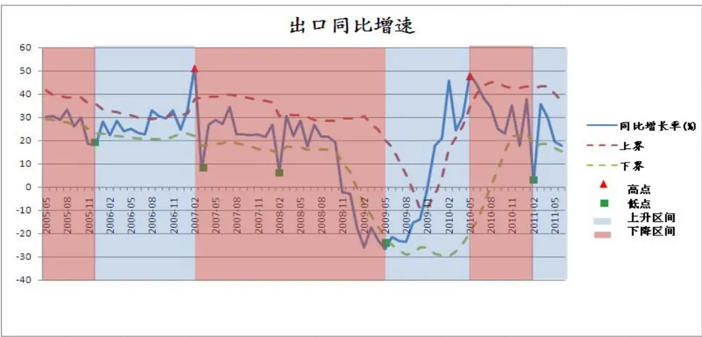
数据来源：广发证券研发中心

出口同比增速在 10 年 6 月达到高点以来，该指数一直波动较大。而最近的一波小下跌使得同比增速接近下界。

2．出口同比增速上升区间
表 5：出口同比增速上升区间

| 出口同比增 速上升区间 |  | 因子平 均收益 | t检验 | 因子成功率 | 整体平均收 益 | 整体胜率 |
| --- | --- | --- | --- | --- | --- | --- |
| 表现最好前 三 1 | 相对PS 总资产周转 率 | 1.63% 1.62% | 1.74% | 66.67% | 1.50% | 63.51% |
| 2 3 |  | 一个月内评 1.39% 级改变 | 2.32% 5.37% | 66.67% 70.00% | 1.11% 1.14% | 59.46% 67.57% |
| 表现最差前 三 |  |  |  |  |  |  |
| 1 | ROA(资产收 益率) | 0.40% | 67.73% | 60.00% | 0.71% | 60.81% |
| 2 | 三个月股价 | 0.38% | 77.09% | 63.33% | 0.59% | 55.41% |
| 3 | 反转 股权集中度 | 0.19% | 71.19% | 56.67% | 0.29% | 54.05% |

数据来源：广发证券研发中心
识别风险，发现价值

在出口同比增速上升区间，总资产周转率因子无论从平均收益以及胜率都有较为明显的提升效果，建议关注！

3．出口同比增速高位区间
表 6：出口同比增速高位区间

| 出口同比增 速高位区间 |  | 因子平 均收益 | t检验 | 因子成功率 | 整体平均收 益 | 整体胜率 |
| --- | --- | --- | --- | --- | --- | --- |
| 表现最好前 |  |  |  |  |  |  |
| 三 1 2 | 净利润增长 率(%) 总资产周转 率 流通市值自 | 1.64% 1.52% | 2.72% 24.06% | 69.23% 53.85% | 0.86% 1.11% | 52.70% 59.46% |
| 3 表现最差前 三 |  | 1.43% 然对数 | 52.96% | 46.15% | 1.25% | 55.41% |
| 1 2 | ROA(资产收 益率) 入增长率 | -0.04% -0.23% -0.44% | 97.44% 81.07% | 46.15% 61.54% | 0.71% 0.90% 0.67% | 60.81% 63.51% |
| 3 |  | 负债权益比 主营业务收 (%) | 54.77% | 53.85% |  | 54.05% |

数据来源：广发证券研发中心

而在增速高位时，市场似乎更青睐于净利润增长较快的股票，所以该因子值得关注。而从胜率角度来看，ROA 在出口同比增速高位时下降严重，因适时降低该因子的关注度。

## 4．出口同比增速下降区间

表 7：出口同比增速下降区间

| 出口同比增 速下降区间 |  | 因子平 均收益 | t检验 | 因子成功率 | 整体平均收 益 | 整体胜率 |
| --- | --- | --- | --- | --- | --- | --- |
| 表现最好前 三 |  |  |  |  |  |  |
| 1 | 相对PE | 2.19% | 0.46% | 67.44% | 1.75% | 66.22% |
| 2 | 流通市值自 | 1.64% | 11.17% | 60.47% | 1.25% | 55.41% |
| 3 | 然对数 相对PS | 1.44% | 1.82% | 62.79% | 1.50% | 63.51% |

识别风险，发现价值

| 表现最差前 三 1 | 经营活动产 | 0.66% | 18.93% | 55.81% |  | 55.41% |
| --- | --- | --- | --- | --- | --- | --- |
|  | 生的现金流 量净额(同 比增长率) |  | 42.29% |  | 0.60% |  |
| 2 | 主营业务收 入增长率 (%) | 0.51% |  | 48.84% | 0.67% | 54.05% |
| 3 | 股权集中度 | 0.38% | 59.13% | 53.49% | 0.29% | 54.05% |

数据来源：广发证券研发中心

在出口同比增速下降时，相对 PE因子的防御功能最为突出，表明市场对低 PE股票还是较为青睐，所以该因子应适时运用。

## 5．出口同比增速低位区间

表 8：出口同比增速低位区间

| 出口同比增 速低位区间 |  | 因子平 均收益 | t检验 | 因子成功率 |  | 整体平均收 益 | 整体胜率 |
| --- | --- | --- | --- | --- | --- | --- | --- |
| 表现最好前 三 | 流通市值自 然对数 相对PS | 3.97% | 0.15% |  |  |  |  |
| 1 2 |  |  | 2.14% 0.66% | 80.00% 80.00% |  | 1.25% 1.50% | 55.41% 63.51% |
| 3 负债权益比 表现最差前 |  |  | 1.64% 5.13% | 66.67% |  | 0.90% | 63.51% |
| 三 1 | 净利润增长 率(%) 相对PCF 经营活动产 生的现金流 | 0.38% 0.31% | 73.06% | 46.67% | 0.86% | 52.70% |  |
| 2 3 |  | -0.04% 量净额比总 | 59.33% 95.26% | 53.33% 60.00% | 0.87% 0.60% | 62.16% 55.41% |  |

数据来源：广发证券研发中心

而在低位区间，流通市值与相对 PS 两个因子表现十分突出，胜率都为 80%，远高于它们的整体胜率。所以该两个因子在出口增速低位时应该重点关注！

## （三）投资同比增速

## 1． 投资同比增速近期表现

图 6：投资同比增速表现
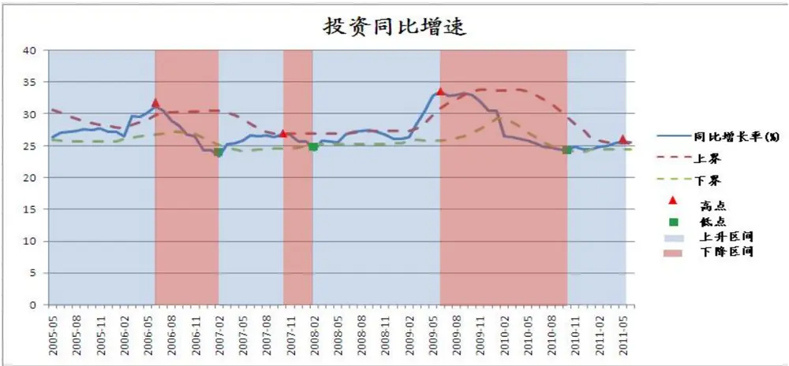
数据来源：广发证券研发中心

投资同比增速在经过 09年 6月到 10年 10月的一波调整后，最近在 25%的低位横向移动。

## 2．投资同比增速上升区间

表 9：投资同比增速上升区间

| 投资同比增 速上升区间 |  | 因子平 均收益 | t检验 | 因子成功率 | 整体平均收 益 | 整体胜率 |
| --- | --- | --- | --- | --- | --- | --- |
| 表现最好前 三 | 相对PE 相对PS | 2.39% |  |  |  |  |
| 1 2 |  |  | 1.13% 2.14% 0.55% | 70.97% 70.97% | 1.75% 1.50% | 66.22% 63.51% |
| 3 |  |  | 1.77% 0.48% | 67.74% | 0.90% | 63.51% |
| 表现最差前 三 1 | ROA(资产收 益率) 经营活动产 | 0.38% | 75.10% | 54.84% | 0.71% | 60.81% |
| 2 |  | 0.33% 生的现金流 | 56.65% | 54.84% | 0.71% | 60.81% |

识别风险，发现价值

| 比增长率) 3 总资产周转 率 | 0.27% 74.59% 48.39% | 59.46% |
| --- | --- | --- |

数据来源：广发证券研发中心

从历史来看，若投资同比增速在上升阶段，相对 PE 以及相对 PS 两个估值因子效果显著，值得关注！而对于总资产周转率因子，由于平均受益下降幅度较大，而且胜率下降明显，应适时规避。

## 3．投资同比增速高位区间

表 10：投资同比增速高位区间

| 投资同比增速高位区间 |  | 因子平 t检验 因子成功率均收益 |  |  | 整体平均收 整体胜率益 |  |  |
| --- | --- | --- | --- | --- | --- | --- | --- |
| 表现最好前三 |  | 1.25% 2.93% 73.68%1.24% 32.51% 73.68%1.13% 13.61% 63.16% |  |  | 1.50% 63.51%1.75% 66.22%0.71% 60.81% |  |  |
| 12 | 相对PS相对PE |  |  |  |  |  |  |
| 3 | 经营活动产 |  |  |  |  |  |  |
| 量净额(同比增长率) |  |  |  |  |  | 生的现金流 |  |
| 表现最差前三 |  | 52.63% |  |  | 0.60% 55.41%0.59% 55.41%0.29% 54.05% |  |  |
| 123 | 经营活动产 |  |  |  |  | 0.32% | 66.35% |
|  | 生的现金流量净额比总市值三个月股价反转股权集中度 | 0.09% | 95.88%52.23% | 63.16%42.11% |  |  |  |
|  |  | -0.41% |  |  |  |  |  |

数据来源：广发证券研发中心

而从高位区间的表现来看，两个估值因子表现依然保持领先地位，但平均收益下降较为明显。而经营活动产生的现金流量净额(同比增长率)因子的平均收益有所提升，值得关注！对于表现差的因子，我们建议低配股权集中度，因为该因子无论从收益以及胜率来看都下降较为严重。

## 4．投资同比增速下降区间

表 11：投资同比增速下降区间

| 投资同比增 速下降区间 |  | 因子平 均收益 | t检验 | 因子成功率 |  | 整体平均收 益 |  | 整体胜率 |
| --- | --- | --- | --- | --- | --- | --- | --- | --- |
| 表现最好前 |  |  |  |  |  |  |  |  |
| 三 1 | 总资产周转 率 | 1.76% | 0.21% |  | 69.05% |  | 1.11% | 59.46% |
| 2 3 | 流通市值自 然对数 相对PE | 1.66% | 14.56% | 59.52% |  | 1.25% | 55.41% |  |
|  |  | 1.32% | 6.83% |  |  | 1.75% |  |  |
|  |  |  |  | 64.29% |  |  | 66.22% |  |
| 三 1 | 三个月股价 | 0.37% | 73.69% |  | 54.76% | 0.59% |  | 55.41% |
| 2 | 反转 负债权益比 |  |  |  |  |  |  |  |
|  |  | 0.27% | 54.00% | 61.90% |  | 0.90% |  | 63.51% |
|  | 股权集中度 | 0.22% | 62.60% | 61.90% |  | 0.29% |  | 54.05% |

数据来源：广发证券研发中心

若在投资同比增速下降区间，总资产周转率因子值得关注，该因子的胜率比整体有一个显著提高。

5．投资同比增速低位区间
表 12：投资同比增速低位区间

| 投资同比增 速低位区间 |  | 因子平 均收益 | t检验 | 因子成功率 | 整体平均收 整体胜率 益 |  |
| --- | --- | --- | --- | --- | --- | --- |
| 表现最好前 三 |  |  |  |  |  |  |
| 1 2 | 总资产周转 率 相对PE 主营业务收 入增长率 (%) | 2.33% 1.83% 1.52% | 4.14% 7.08% 8.55% | 76.92% 61.54% 61.54% | 1.11% 1.75% | 59.46% 66.22% |
| 3 表现最差前 |  |  |  |  | 0.67% | 54.05% |
| 三 1 | 股权集中度 三个月股价 | 0.41% | 62.54% |  |  |  |
| 2 |  | 0.26% | 91.75% | 61.54% 46.15% | 0.29% 0.59% | 54.05% 55.41% |
| 3 | 反转 流通市值自 然对数 | 0.21% | 93.98% | 53.85% | 1.25% | 55.41% |

识别风险，发现价值

数据来源：广发证券研发中心

而在低位区间，总资产周转率的效果更为明显。证明在该区间市场对总资产运用高效的公司更有信心。

## （四）消费同比增速

## 1．消费同比增速近期表现

图 7：消费同比增速表现
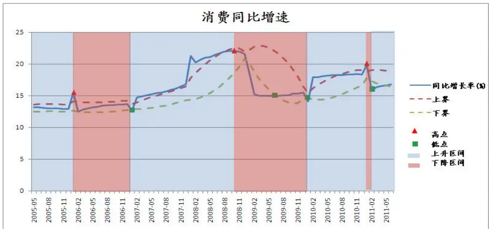
数据来源：广发证券研发中心

消费同比增速在今年 1月有一个较为明显下跌后，走势还是较为平缓。

## 2．消费同比增速上升区间

表 13：消费同比增速上升区间

| 消费同比增速上 升区间 |  | 因子平 均收益 | t检验 | 因子成功率 | 整体平均收 益 | 整体胜率 |
| --- | --- | --- | --- | --- | --- | --- |
| 表现最好前三 |  |  |  |  |  |  |
| 1 2 | 相对PE | 1.90% | 0.63% | 68.75% | 1.75% | 66.22% |
|  | 相对PS | 1.51% | 1.38% | 58.33% | 1.50% | 63.51% |
|  | 负债权益比 | 1.24% | 0.59% | 70.83% | 0.90% | 63.51% |
| 表现最差前三 1 | 主营业务收 | 0.40% | 50.40% | 52.08% | 0.29% | 54.05% |

识别风险，发现价值

|  | (%) |  |  |  |  |
| --- | --- | --- | --- | --- | --- |
| 2 | ROA(资产收 益率) 三个月股价 | 0.27% 77.51% | 54.17% | 0.71% 0.59% | 60.81% |
| 3 | 0.05% | 96.05% | 52.08% |  | 55.41% |
| 反转 |  |  |  |  |  |

数据来源：广发证券研发中心

从历史来看，在消费同比增速上升期，相对 PE以及负债权益比两个因子的效果较好，应适时关注！

## 3．消费同比增速高位区间

表 14：消费同比增速高位区间

| 消费同比增 速高位区间 |  | 因子平 均收益 | t检验 | 因子成功率 | 整体平均收益 | 整体胜率 |
| --- | --- | --- | --- | --- | --- | --- |
| 表现最好前 三 1 | 相对PE 相对PS 流通市值自 然对数 | 2.63% 2.38% | 0.88% |  |  | 66.22% |
| 2 3 |  |  | 1.27% 1.95% 17.81% | 73.08% 65.38% 57.69% | 1.75% 1.50% 1.25% | 63.51% 55.41% |
| 表现最差前 |  |  |  |  |  |  |
| 三 1 | 总资产周转 率 | 0.72% | 47.29% | 53.85% | 1.11% | 59.46% |
| 2 | 主营业务收 入增长率(%) | 0.59% | 49.24% | 50.00% | 0.67% | 54.05% |
| 3 |  | 0.08% | 95.56% | 53.85% | 0.71% | 60.81% |
|  | ROA(资产收 益率) |  |  |  |  |  |

数据来源：广发证券研发中心

在消费增速高位区间，相对 PE和相对 PS两个估值因子表现依然吸引，应该重视！而 ROA因子表现出现明显下滑，值得注意。

4．消费同比增速下降区间
表 15：消费同比增速下降区间

| 消费同比增 速下降区间 | 因子平 t检验 均收益 | 因子成功率 | 整体平均收 益 | 整体胜率 |
| --- | --- | --- | --- | --- |
| 表现最好前 |  |  |  |  |

识别风险，发现价值

| 三 |  | 2.65% 2.48% 68.00% |  |  | 1.25%1.11%0.59% | 55.41%59.46%55.41% |  |
| --- | --- | --- | --- | --- | --- | --- | --- |
| 123 | 流通市值自然对数总资产周转率三个月股价反转 |  |  |  |  |  | 48% |
|  |  | 1.88%1.64% | 0.87%23.99% | 72.00%64.00% |  |  |  |
| 表现最差前三 |  |  |  | 56.00%52.00% | 0.86%0.90% | 52.70%63.51% |  |
| 123 | 净利润增长 | 0.53% | 60.55% |  |  |  |  |
|  | 率(%)负债权益比 | 0.27% | 68.38% |  |  |  |  |
|  | 股权集中度 | 0.11% | 87.86% | 60.00% | 0.29% | 54.05% |  |

数据来源：广发证券研发中心

在同比增速下降之时，流通市值因子和总资产周转因子应该引起重视，因为无论从收益还是胜率的角度来研判，他们都有显著的提升。

## 5．消费同比增速低位区间

表 16：消费同比增速低位区间

| 消费同比增 速低位区间 |  | 因子平 均收益 | t检验 | 因子成功率 | 整体平均收 益 |  |
| --- | --- | --- | --- | --- | --- | --- |
| 表现最好前 三 |  |  |  |  |  |  |
| 1 2 3 | 流通市值自 然对数 相对PS 一个月内评 级改变 | 3.41% | 5.58% | 66.67% | 1.25% | 55.41% |
|  |  | 2.55% 2.29% | 1.46% 3.41% | 83.33% 83.33% | 1.50% 1.14% | 63.51% 67.57% |
| 表现最差前 三 | ROA(资产收 |  |  |  |  |  |
| 1 | 益率) | 0.60% | 63.40% | 58.33% | 0.71% | 60.81% |
| 2 | 经营活动产 | 0.35% | 66.57% | 58.33% |  |  |
|  | 生的现金流 |  |  |  | 0.60% | 55.41% |
|  | 量净额比总 |  |  |  |  |  |
|  | 市值 |  |  |  |  |  |
|  | 相对PCF |  |  |  |  |  |
| 3 |  | -0.84% | 14.30% | 33.33% | 0.87% | 62.16% |

数据来源：广发证券研发中心
识别风险，发现价值

而在同比增速低位的时候，市场似乎对 PS较低，市值较小，评级改变较好股票较为认可，该三个因子值得适时关注！

## （五）CPI 同比增速

## 1．CPI同比增速近期表现

图 8：CPI同比增速表现
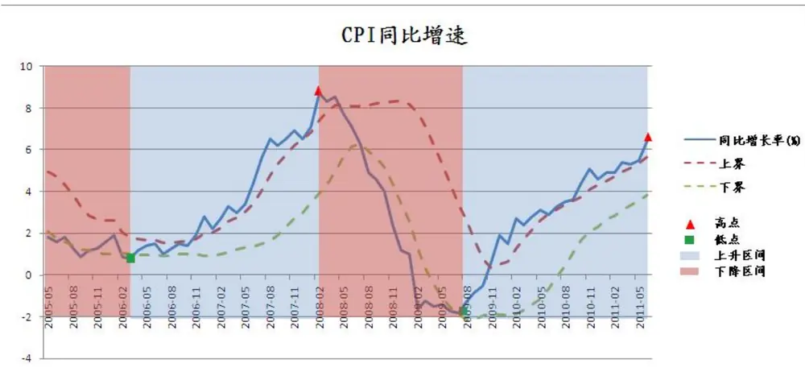
数据来源：广发证券研发中心

从 09年的历史低位以来，CPI同比增速的走势一直处在给力上升的趋势。而且该指数在 09年 11月突破上界以后，一直沿着上界上方移动，证明了 CPI的高企不下。

## 2． CPI 同比增速上升区间

表 17：CPI同比增速上升区间

| CPI同比增 速上升区间 |  | 因子平 均收益 | t检验 | 因子成功率 | 整体平均收 益 | 整体胜率 |
| --- | --- | --- | --- | --- | --- | --- |
| 表现最好前 三 | 相对PE 相对PS 总资产周转 率 | 2.00% | 0.25% | 69.57% |  | 66.22% |
| 1 2 3 |  | 1.63% 1.44% | 0.99% 2.26% | 60.87% 63.04% | 1.75% 1.50% 1.11% | 63.51% 59.46% |
| 表现最差前 三 |  |  |  |  | 0.59% 55.41% |  |

识别风险，发现价值
2011-08-10 第 20 页

| 反转 2 经营活动产 生的现金流 量净额比总 市值 3 主营业务收 入增长率 | 0.66% 0.65% (%) | 14.27% 29.03% | 54.35% 56.52% | 0.60% 0.67% | 55.41% 54.05% |
| --- | --- | --- | --- | --- | --- |

数据来源：广发证券研发中心
当 CPI 同比增速上升时，我们建议关注相对 PE和相对 PS两个因子的表现。

## 3．CPI 同比增速高位区间

表 18：CPI同比增速高位区间

| CPI同比增速高位区间 |  | 因子平均收益 | t检验 | 因子成功率 | 整体平均收益 | 整体胜率 |  |
| --- | --- | --- | --- | --- | --- | --- | --- |
| 表现最好前三 |  |  | 0.19% | 69.44% | 1.75% | 66.22%63.51%59.46% |  |
| 123 | 相对PE | 2.31% |  |  |  |  |  |
|  | 相对PS | 1.89% | 1.63% | 58.33% |  |  | 1.50% |
|  | 总资产周转率 | 1.39% | 9.09% | 61.11% | 1.11% |  |  |
| 表现最差前三 |  |  |  |  | 0.59% 55.41%0.60% 55.41%0.71% 60.81% |  |  |
| 123 | 三个月股价反转经营活动产生的现金流量净额比总市值经营活动产 |  |  | 55.56%50.00%61.11% |  |  |  |
|  | 生的现金流 |  |  |  |  |  |  |
|  | 量净额(同 |  |  |  |  |  |  |
|  | 比增长率) |  |  |  |  |  |  |

数据来源：广发证券研发中心
而 CPI 同比增速在高位时，两个估值因子还是值得关注！

## 4．CPI 同比增速下降区间

表 19：CPI同比增速下降区间

| CPI同比增 速下降区间 |  | 因子平 均收益 | t检验 | 因子成功率 | 整体平均收 益 |  | 整体胜率 |
| --- | --- | --- | --- | --- | --- | --- | --- |
| 表现最好前 | 一个月内评 |  |  |  |  |  |  |
| 三 1 2 | 级改变 流通市值自 然对数 | 1.44% 1.43% | 1.99% | 74.07% |  | 1.14% | 67.57% |
|  |  |  | 21.16% | 59.26% |  | 1.25% | 55.41% |
| 3 表现最差前 | 相对PE | 1.40% | 20.16% | 62.96% |  | 1.75% | 66.22% |
| 三 1 | ROA(资产收 益率) | 0.35% | 71.22% | 59.26% |  | 0.71% | 60.81% |
| 2 | 净利润增长 率(%) | 0.24% | 81.60% | 48.15% |  | 0.86% | 52.70% |
| 3 | 股权集中度 | -0.54% | 43.53% | 44.44% | 0.29% |  | 54.05% |

数据来源：广发证券研发中心

若 CPI 同比增速在下降区间，一个月内评级改变因子的表现相对较好，胜率比整体来看还是有不小的改进，应适时关注！

5．CPI 同比增速低位区间
表 20：CPI同比增速低位区间

| CPI同比增 速低位区间 |  | 因子平 均收益 | t检验 | 因子成功率 | 整体平均收 益 | 整体胜率 |
| --- | --- | --- | --- | --- | --- | --- |
| 表现最好前 |  |  |  |  |  |  |
| 三 1 2 | 流通市值自 然对数 负债权益比 相对PE | 2.58% 1.60% | 9.08% 2.48% | 68.75% 75.00% | 1.25% | 55.41% |
| 1.59% |  |  |  |  | 0.90% 1.75% | 63.51% 66.22% |
| 表现最差前 三 1 | 经营活动产 生的现金流 量净额(同 | -0.08% | 93.07% | 37.50% | 0.71% | 60.81% |
| 2 |  | 比增长率) 经营活动产 生的现金流 | -0.32% 63.60% | 56.25% | 0.60% | 55.41% |

识别风险，发现价值

| 3 | 量净额比总 市值 股权集中度 -0.47% | 59.15% 43.75% | 0.29% 54.05% |
| --- | --- | --- | --- |

数据来源：广发证券研发中心

若 CPI同比增速在底部时，则应关注流通市值因子，从平均收益以及胜率都可看出该因子在该环境下选股效果显著！而股权集中度因子由于表现强差人意，投资者应及时规避。

## （六）M1同比增速指标

1．M1同比增速近期表现
图 9：M1同比增速表现
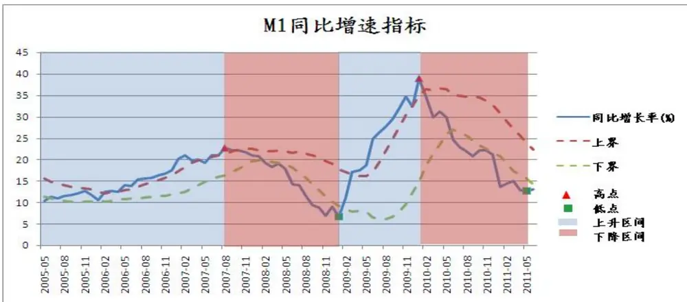
数据来源：广发证券研发中心

M1 同比增速刚经历完一个较大的跌幅，现在在一个相对的底部。6 月末 M1 同比增长也有所反弹至 13.1%，比 5月末高 0.4个百分点。

## 2．M1同比增速上升区间

表 21：M1同比增速上升区间

| M1同比增速 上升区间 |  | 因子平 均收益 | t检验 | 因子成功率 | 整体平均收 益 | 整体胜率 |
| --- | --- | --- | --- | --- | --- | --- |
| 表现最好前 三 |  |  |  |  |  |  |
| 1 | 流通市值自 | 3.03% | 2.53% | 76.92% | 1.25% | 55.41% |

识别风险，发现价值
2011-08-10 第 23 页

| 2 3 | 然对数 总资产周转 率 相对PS | 2.45% 1.89% | 5.53% 1.39% | 84.62% 84.62% | 1.11% 1.50% | 59.46% 63.51% |
| --- | --- | --- | --- | --- | --- | --- |
| 表现最差前 | 负债权益比 股权集中度 |  |  |  |  |  |
| 三 1 |  |  | -0.03% 97.85% | 53.85% |  |  |
| 2 |  |  | -0.04% 96.21% | 61.54% | 0.90% 0.29% | 63.51% |
| 3 净利润增长 率(%) |  |  | -0.12% 94.01% | 53.85% | 0.86% | 54.05% 52.70% |

数据来源：广发证券研发中心

从历史统计，我们发现M1同比上升时，流通市值较小，总资产运作高效的个股备受青睐，该两个因子值得关注！

## 3．M1 同比增速高位区间

表 22：M1同比增速高位区间

| M1同比增速 高位区间 |  | 因子平 均收益 | t检验 | 因子成功率 |  | 整体平均收 益 | 整体胜率 |  |
| --- | --- | --- | --- | --- | --- | --- | --- | --- |
| 表现最好前 三 1 | 相对PS 相对PE 总资产周转 | 2.82% 1.83% | 0.09% 6.23% | 76.67% 70.00% |  | 1.50% 1.75% | 63.51% 66.22% |  |
| 2 3 |  | 1.80% 率 | 4.83% | 63.33% |  | 1.11% | 59.46% |  |
| 表现最差前 三 1 |  | 股权集中度 一个月内评 级改变 三个月股价 反转 | 0.29% -0.05% | 74.87% | 56.67% |  | 0.29% | 54.05% |
| 2 3 | 93.62% -0.26% 86.70% |  |  | 53.33% 60.00% |  | 1.14% 0.59% | 67.57% 55.41% |  |

数据来源：广发证券研发中心

而在高位区间，两个相对估值因子表现领先，建议适时关注！而一个月内评级改变因子在 M1 高位时反而表现出现下滑，应及时调整该因子在模型中权重！

## 4．M1 同比增速下降区间

表 23：M1同比增速下降区间

| M1同比增速 下降区间 |  | 因子平 均收益 | t检验 | 因子成功率 | 整体平均收 益 | 整体胜率 |
| --- | --- | --- | --- | --- | --- | --- |
| 表现最好前 三 1 | 相对PE 相对PS | 2.08% 1.44% | 0.11% | 68.33% 60.00% | 1.75% | 66.22% |
| 2 3 |  | 一个月内评 1.17% 级改变 | 0.64% 2.00% | 68.33% | 1.50% 1.14% | 63.51% 67.57% |
| 表现最差前 三 |  | ROA(资产收 | 0.53% 50.79% | 58.33% | 0.71% |  |
| 1 2 | 益率) 三个月股价 | 0.50% | 60.75% | 53.33% |  | 60.81% |
| 3 | 反转 股权集中度 |  |  |  | 0.59% | 55.41% |
|  |  | 0.37% | 47.98% | 53.33% | 0.29% | 54.05% |

数据来源：广发证券研发中心
而在 M1同比增速下降期，相对 PE和相对 PS的防御性较强，应该关注！

5．M1 同比增速低位区间
表 24：M1同比增速低位区间

| M1同比增速 低位区间 |  | 因子平 t检验 均收益 |  | 因子成功率 |  | 整体平均收 益 | 整体胜率 |
| --- | --- | --- | --- | --- | --- | --- | --- |
| 表现最好前 三 1 | 三个月股价 反转 相对PE | 2.55% 1.46% | 6.30% 11.45% | 60.87% 65.22% |  | 0.59% | 55.41% |
| 2 3 表现最差前 |  | 一个月内评 1.45% 级改变 | 6.48% | 69.57% |  | 1.75% 1.14% | 66.22% 67.57% |
| 三 1 |  | ROA(资产收 益率) | 0.17% 83.62% |  | 56.52% | 0.71% 0.67% | 60.81% |
| 2 | 主营业务收 入增长率 (%) | 0.17% | 81.54% | 47.83% |  |  | 54.05% |
| 3 | 经营活动产 生的现金流 | 0.01% | 98.16% | 56.52% |  | 0.71% | 60.81% |

识别风险，发现价值

| 量净额(同 比增长率) |
| --- |

数据来源：广发证券研发中心

若在 M1 同比增速的底部，则应该关注三个月股价表现较弱的股票，因为此时反转效应较为明显！

## （七）10年与 1 年期的国债利差

## 1． 国债利差近期表现

图 10：国债利差表现
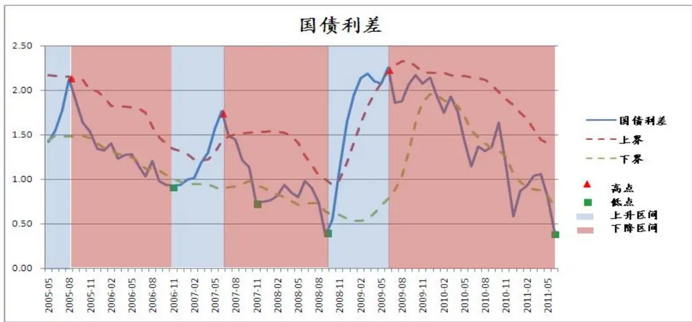
数据来源：广发证券研发中心

从 09 年 6 月的顶部开始，国债利差一直往下滑。利差的不断缩小代表市场对于未来的预期较为谨慎，但利差已经到了历史的低位，后续继续向下空间应该较小。

## 2．国债利差上升区间

表 25：国债利差上升区间

| 国债利差上 |  | 因子平 均收益 | t检验 | 因子成功率 | 整体平均收 益 | 整体胜率 |
| --- | --- | --- | --- | --- | --- | --- |
| 升区间 表现最好前 |  |  |  |  |  |  |
| 三 | 相对PS |  |  |  |  |  |
| 1 2 流通市值自 |  | 3.81% 3.30% | 0.05% 16.07% | 93.75% 75.00% | 1.50% 1.25% | 63.51% 55.41% |

识别风险，发现价值

| 3 | 相对PE | 3.14% 3.84% |  | 62.50% | 1.75% | 66.22% |
| --- | --- | --- | --- | --- | --- | --- |
| 表现最差前 三 1 | 经营活动产 | 0.24% | 71.89% | 62.50% | 0.60% | 55.41% |
|  | 生的现金流 量净额比总 市值 |  | 91.39% |  |  |  |
| 2 3 | ROA(资产收 益率) 经营活动产 | 0.24% 0.18% | 84.21% | 50.00% 43.75% | 0.71% 0.71% | 60.81% 60.81% |
|  | 生的现金流 量净额(同 比增长率) |  |  |  |  |  |

数据来源：广发证券研发中心

在国债利差上升期间，相对 PS 因子效果十分的显著，平均受益高达 3.81%，为整体平均收益的两倍多，而且胜率奇高，强烈建议投资者关注！

## 3．国债利差高位区间

表 26：国债利差高位区间

| 国债利差高 位区间 |  | 因子平 均收益 | t检验 | 因子成功率 | 整体平均收 益 | 整体胜率 |
| --- | --- | --- | --- | --- | --- | --- |
| 表现最好前 三 1 2 | 相对PE 相对PS 流通市值自 然对数 | 4.66% 3.57% 3.28% | 2.28% 0.04% 14.80% | 90.91% 100.00% 81.82% | 1.75% 1.50% 1.25% | 66.22% 63.51% 55.41% |
| 表现最差前 三 | 相对PCF 经营活动产 | 1.06% -0.23% | 30.25% | 54.55% | 0.87% |  |
| 1 2 3 | 生的现金流 量净额比总 市值 经营活动产 生的现金流 量净额(同 比增长率) | -0.48% | 73.98% 68.60% | 54.55% 36.36% | 0.60% 0.71% | 62.16% 55.41% 60.81% |

识别风险，发现价值
2011-08-10 第 27 页

数据来源：广发证券研发中心

若国债利差在高位时，两个估值指标以及流通市值因子表现超预期。无论是平均收益或是胜率该三个因子都表现十分出色，应该强烈关注!而对于经营活动产生的现金流量净额(同比增长率)因子，平均收益的严重缩水以及胜率的大幅下滑都表明该因子在国债利差高位时的无力，投资者应及时放弃对该因子的配置。

## 4．国债利差下降区间

表 27：国债利差下降区间

| 国债利差下 降区间 |  | 因子平 均收益 | t检验 | 因子成功率 | 整体平均收 益 |  |
| --- | --- | --- | --- | --- | --- | --- |
| 表现最好前 三 |  |  |  |  |  |  |
| 1 2 3 | 相对PE 总资产周转 率 相对PCF | 1.39% 1.07% 0.93% | 2.17% 3.99% 1.93% | 68.42% 59.65% 64.91% | 1.75% 1.11% 0.87% | 66.22% 59.46% 62.16% |
| 表现最差前 三 | 主营业务收 入增长率 | 0.39% | 42.96% |  |  |  |
| 1 |  |  |  |  | 54.39% | 0.67% 54.05% |
| 2 | (%) 三个月股价 反转 | 0.35% | 66.31% | 54.39% | 0.59% | 55.41% |
| 3 | 股权集中度 | -0.13% | 75.65% | 52.63% | 0.29% | 54.05% |

数据来源：广发证券研发中心

而在国债利差下滑时，相对 PE的防御能力较强，虽然受益有所下降，但还是保持了较高的胜率。

## 5．国债利差低位区间

表 28：国债利差低位区间

| 国债利差低 位区间 |  | 因子平 均收益 | t检验 | 因子成功率 | 整体平均收 益 | 整体胜率 |
| --- | --- | --- | --- | --- | --- | --- |
| 表现最好前 三 | 相对PE | 1.92% | 0.33% | 74.07% | 1.75% | 66.22% |

识别风险，发现价值
2011-08-10 第 28 页

| 3 | ROA(资产收 益率) | 1.34% | 12.71% | 70.37% | 0.71% |  | 60.81% |
| --- | --- | --- | --- | --- | --- | --- | --- |
| 表现最差前 三 | 股权集中度 经营活动产 | 0.05% | 92.55% | 51.85% |  | 0.29% | 54.05% |
| 1 2 3 | 生的现金流 量净额比总 市值 三个月股价 反转 | -0.06% -1.01% | 91.65% 39.79% | 51.85% 51.85% |  | 0.60% | 55.41% |

数据来源：广发证券研发中心

在国债利差的底部，我们依然建议关注相对 PE，因为该因子对于 ALPHA 的贡献还是显著！

## （八）沪深 300 指数

1．沪深 300指数近期表现
图 11：沪深 300指数表现
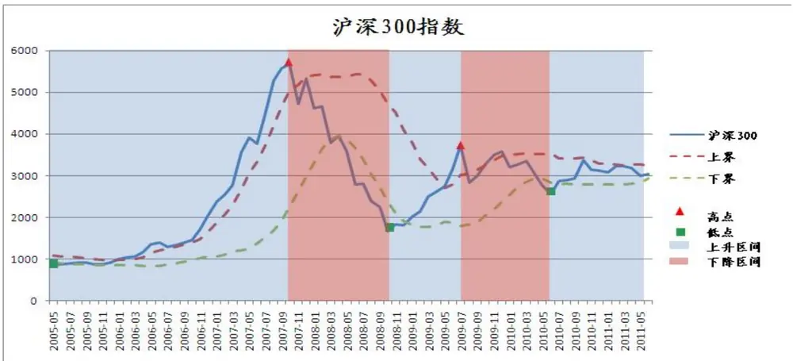
数据来源：广发证券研发中心

沪深 300 指数从 10 年的 6 月以来一直处于震荡的行情当中。从指数的走势来看，指数后续窄幅震荡概率较大。

## 2．沪深 300 指数上升区间

表 29：沪深 300指数上升区间

| 沪深300指 |  | 因子平 均收益 | t检验 | 因子成功率 | 整体平均收 益 |  |
| --- | --- | --- | --- | --- | --- | --- |
| 数上升区间 表现最好前 |  |  |  |  |  |  |
| 三 1 | 相对PS 相对PE 负债权益比 | 2.24% | 0.02% | 74.00% | 1.50% | 63.51% |
| 2 3 |  | 2.09% 1.73% | 0.57% 0.01% | 70.00% 72.00% | 1.75% 0.90% | 66.22% 63.51% |
| 表现最差前 |  |  |  |  |  |  |
| 三 1 | 经营活动产 生的现金流 量净额比总 | 0.55% | 22.15% | 56.00% | 0.60% | 55.41% |
| 2 | 市值 三个月股价 | 0.02% | 98.20% | 56.00% | 0.59% | 55.41% |
|  | 反转 | -0.04% | 95.13% |  |  |  |
| 3 | 股权集中度 |  |  | 48.00% | 0.29% | 54.05% |

数据来源：广发证券研发中心

通过历史检验，在牛市的时候，估值效应十分明显。这也与我们之前研究所的结论一致，估值因子又十分强的牛市效应。所以在市场行情好的时候应重点关注估值因子的有效性。

## 3．沪深 300 指数高位区间

表 30：沪深300指数高位区间

| 沪深300指 数高位区间 |  | 因子平 均收益 | t检验 因子成功率 |  | 整体平均收 益 |  | 整体胜率 |
| --- | --- | --- | --- | --- | --- | --- | --- |
| 表现最好前 |  |  |  |  |  |  |  |
| 三 1 2 | 相对PS 相对PE | 3.15% 2.15% 2.02% | 0.05% 5.58% | 78.57% 67.86% | 1.50% 1.75% | 63.51% 66.22% |  |
| 3 表现最差前 |  | 负债权益比 | 0.03% | 82.14% | 0.90% | 63.51% |  |
| 三 1 | ROA(资产收 | 0.19% | 89.37% | 57.14% | 0.71% | 60.81% |  |
| 2 | 益率) 股权集中度 |  | 93.93% | 53.57% | 0.29% |  |  |
| 3 | 三个月股价 | 0.07% -0.73% | 64.51% | 57.14% | 0.59% | 54.05% 55.41% |  |

识别风险，发现价值

| 反转 |
| --- |

数据来源：广发证券研发中心

而在股票市场顶部时，估值效应还是十分显著，特别是相对 PS，因子的平均收益有质的飞跃，应该好好利用！而在市场顶部是，应尽量避免对三个月股价反转因子的暴露。

## 4．沪深 300 指数下降区间

表 31：沪深 300指数下降区间

| 沪深300指 数下降区间 |  | 因子平 均收益 | t检验 | 因子成功率 | 整体平均收 益 | 整体胜率 |
| --- | --- | --- | --- | --- | --- | --- |
| 表现最好前 三 | 流通市值自 |  |  |  |  |  |
| 1 2 3 | 然对数 三个月股价 反转 相对PCF | 2.17% 1.84% | 6.98% | 56.52% | 1.25% | 55.41% |
|  |  | 19.44% |  | 56.52% | 0.59% | 55.41% |
|  |  | 1.43% 0.72% |  | 69.57% | 0.87% | 62.16% |
| 表现最差前 三 1 | 净利润增长 率(%) 负债权益比 主营业务收 入增长率 | -0.12% -0.89% | 82.52% | 39.13% | 0.86% | 52.70% |
| 2 3 (%) |  | -1.39% | 17.59% 2.86% | 47.83% 34.78% | 0.90% 0.67% | 63.51% 54.05% |

数据来源：广发证券研发中心

而在市场下跌的行情当中，市场似乎更青睐与短期反转效应强的小股票，所以流通市值与三个月股价反转因子值得关注。主营业务收入增长率因子在市场下跌时表现下降十分明显，应及时规避。

5．沪深 300 指数低位区间
表 32：沪深 300指数低位区间

| 沪深300指 数低位区间 | 因子平 均收益 | t检验 | 因子成功率 | 整体平均收 益 | 整体胜率 |
| --- | --- | --- | --- | --- | --- |
| 表现最好前 |  |  |  |  |  |

识别风险，发现价值

| 三 |  | 1.85% 69.23% | 0.87% 62.16%1.14% 67.57%1.75% 66.22% |  |
| --- | --- | --- | --- | --- |
| 1 | 相对PCF |  |  | 1.56% |
| 23 | 一个月内评级改变相对PE | 1.54% 10.94% 76.92%1.16% 32.65% 61.54% |  |  |
| 表现最差前三 |  | -0.66% 71.17% 38.46%-0.66% 43.65% 38.46%-1.14% 24.67% 38.46% | 1.25% 55.41%1.50% 63.51%1.11% 59.46% |  |
| 123 | 流通市值自然对数相对PS总资产周转率 |  |  |  |

数据来源：广发证券研发中心

最后，在市场底部时，相对 PCF和一个月评级改变因子表现较好，应该适时关注！而总资产周转率因子由于表现不给力，在市场底部时应避免对它的风险暴露。

## 四、总结与推荐

本次研究主要目的是统计在不同宏观指标的周期下，哪些因子表现较好，使得在构建多因子模型的时候能结合当前的宏观市场情况来对因子做合理配置，以期获得更高的超额受益！

为了使读者能更直观的了解在不同宏观市场环境中应重点关注哪些因子，我们把各个宏观市场指标的上升以及高位区间定义为较佳宏观市场环境，而下降和低位区间则定义为较弱宏观市场环境，并分别给出推荐之因子。推荐因子的规则如下：

‹若在某一市场形态下，因子的平均收益比全样本平均收益高，

- 因子收益定义为较为显著

- 若收益比平均高两倍，则因子收益定义为十分显著

若在某一市场形态下，因子的胜率高于整体胜率

- 因子胜率定义为提高

- 若胜率高于整体胜率 10%以上，则因子胜率被定义为十分高

‹若收益以及胜率都十分显著，则为推荐因子

综合研判，我们觉得在较佳宏观市场环境中表现较好的因子为：

相对 PE

相对 PS

流通市值自然对数

总资产周转

而在较弱宏观市场环境中表现较好的因子为：

流通市值自然对数

三个月股价反转

一个月内评级改变

表 33：较佳宏观环境下表现强势因子

|  | 上升区间 |  |  | 高位区间 |  |  |  |
| --- | --- | --- | --- | --- | --- | --- | --- |
|  | 因子 | 区间收益 比整体 | 区间胜率比 推荐因 整体 子 | 区间收益 因子 比整体 | 区间胜 率比整 体 | 推荐因子 |  |
| m1 同比 增速 CPI同比 | 流通市值自 然对数 总资产周转 | 十分显著 | 胜率十分高 推荐 | 相对 PS | 胜率十 显著 分高 |  |  |
|  | 率 相对 PS | 十分显著 显著 | 胜率十分高 推荐 胜率十分高 | 相对 PE 总资产 | 显著 胜率高 显著 胜率高 |  |  |
|  | 相对 PE | 显著 | 胜率高 | 周转率 相对 PE | 显著 | 胜率高 |  |
| 工业增 加值同 比增速 | 相对 PS 总资产周转 率 | 显著 显著 | 胜率低 胜率高 | 相对 PS 总资产 周转率 | 显著 显著 | 胜率低 胜率高 |  |
|  | 总资产周转 率 流通市值自 | 显著 | 胜率十分高 | ROA(资 产收益 率) 三个月 | 十分显著 | 胜率十 推荐 分高 |  |
|  | 然对数 | 显著 | 胜率十分高 | 股价反 转 | 胜率十 十分显著 分高 | 推荐 |  |
|  | 相对 PE | 显著 胜率低 |  | 相对 PE 显著 | 胜率十 分高 |  |  |
| 国债利 差 沪深 300 | 相对 PS 流通市值自 然对数 | 十分显著 十分显著 | 胜率十分高 推荐 胜率十分高 推荐 | 相对 PE 相对 PS | 十分显著 十分显著 | 胜率十 分高 胜率十 分高 | 推荐 推荐 |
|  | 相对 PE | 显著 | 胜率低 | 流通市 值自然 对数 | 十分显著 | 胜率十 分高 | 推荐 |
|  | 相对 PS | 显著 | 胜率十分高 | 相对 PS | 十分显著 | 胜率十 | 推荐 |

识别风险，发现价值

| 指数 投资增 |  |  |  | 分高 |  |  |
| --- | --- | --- | --- | --- | --- | --- |
|  | 相对 PE | 显著 | 胜率高 | 相对 PE | 显著 | 胜率高 胜率十 |
|  | 负债权益比 | 显著 | 胜率十分高 | 负债权 益比 | 十分显著 | 推荐 分高 |
| 速 | 相对 PE | 显著 | 胜率高 | 相对 PS | 不显著 | 胜率十 分高 胜率十 |
|  | 相对 PS | 显著 | 胜率十分高 | 相对 PE 经营活 动产生 | 不显著 | 分高 |
|  | 负债权益比 | 显著 | 胜率高 | 的现金 流量净 额 (同比 增长率) | 显著 | 胜率高 |
|  | 消费增 相对 PE | 显著 | 胜率高 | 相对 PE | 显著 | 胜率十 分高 |
| 相对 PS |  | 显著 | 胜率低 | 相对 PS | 显著 胜率高 |  |
|  |  | 负债权益比 显著 | 胜率十分高 | 流通市 值自然 | 显著 | 胜率高 |
|  |  |  |  | 对数 净利润 |  | 胜率十 |
|  |  | 相对 PS 显著 | 胜率高 | 增长率 (%) | 显著 | 分高 |
|  | 总资产周转 率 | 显著 | 胜率十分高 | 总资产 周转率 | 显著 | 胜率低 |
|  | 一个月内评 级改变 | 显著 | 胜率高 | 流通市 值自然 对数 | 显著 | 胜率低 |

数据来源：广发证券研发中心

表 34：较佳宏观环境下表现强势因子

|  | 上升区间 |  |  |  | 高位区间 |  |  |
| --- | --- | --- | --- | --- | --- | --- | --- |
|  | 因子 | 区间收益 比整体 | 区间胜率比 推荐因 整体 子 | 因子 | 区间收益 比整体 | 区间胜 率比整 体 | 推荐因子 |
| m1 同比 增速 | 相对PE | 显著 | 胜率高 | 三个月 股价反 转 | 十分显著 | 胜率高 |  |
|  | 相对PS 一个月内评 级改变 | 不显著 显著 | 胜率低 胜率高 | 相对PE 一个月 内评级 改变 | 不显著 显著 | 胜率低 胜率高 |  |
| CPI 同比 增速 | 一个月内评 级改变 | 显著 | 胜率高 | 流通市 值自然 | 十分显著 | 胜率十 分高 | 推荐 |

识别风险，发现价值

|  |  |  |  | 对数 |  |  |
| --- | --- | --- | --- | --- | --- | --- |
|  | 流通市值自 然对数 | 显著 | 胜率高 | 负债权 益比 | 显著 | 胜率十 分高 |
|  | 相对PE 相对PE | 不显著 显著 | 胜率低 胜率高 | 相对PE 三个月 | 不显著 十分显著 | 胜率高 胜率高 |
| 工业增 加值同 比增速 国债利 差 | 相对PS |  |  | 股价反 转 流通市 | 十分显著 | 胜率十 推荐 |
|  |  | 显著 | 胜率低 | 值自然 对数 |  | 分高 |
|  | 负债权益比 相对PE | 显著 不显著 | 胜率十分高 胜率高 | 相对PS 相对PE | 显著 显著 | 胜率低 胜率十 |
|  | 总资产周转 | 不显著 | 胜率高 | 一个月 | 显著 | 分高 胜率高 |
|  | 率 相对PCF |  |  | 内评级 改变 ROA(资 | 显著 | 胜率十 |
|  | 流通市值自 | 显著 | 胜率高 | 产收益 率) |  | 分高 |
| 沪深 300 指数 投资增 速 | 然对数 三个月股价 | 显著 十分显著 | 胜率高 | 相对PCF 一个月 | 显著 显著 | 胜率十 分高 胜率十 |
|  | 反转 |  | 胜率高 | 内评级 改变 |  | 分高 |
|  | 相对PCF 总资产周转 | 显著 | 胜率十分高 | 相对PE | 不显著 | 胜率低 |
|  | 率 流通市值自 | 显著 | 胜率十分高 | 总资产 周转率 | 十分显著 | 胜率十 推荐 分高 |
| 消费增 | 然对数 相对PE | 显著 胜率高 |  | 相对PE | 显著 胜率低 | 推荐 |
|  |  | 不显著 | 胜率低 | 主营业 务收入 增长率 | 十分显著 | 胜率十 分高 |
|  | 流通市值自 然对数 | 十分显著 | 胜率十分高 推荐 | (%) 流通市 值自然 | 十分显著 | 胜率十 推荐 分高 |
|  | 总资产周转 率 | 显著 胜率十分高 |  | 对数 相对PS | 显著 | 胜率十 分高 |
|  | 三个月股价 反转 | 十分显著 胜率十分高 | 推荐 | 一个月 内评级 改变 | 十分显著 | 胜率十 推荐 分高 |
| 出口增 速 | 相对PE | 显著 | 胜率高 | 流通市 值自然 对数 | 十分显著 | 胜率十 推荐 分高 |

识别风险，发现价值

| 流通市值自 然对数 | 显著 | 胜率高 | 相对PS | 显著 | 胜率十 分高 |
| --- | --- | --- | --- | --- | --- |
| 相对PS | 不显著 | 胜率低 | 负债权 益比 | 显著 | 胜率高 |

数据来源：广发证券研发中心

| 多因子 Alpha 模型研究:沪深 300 成分股的应用分析(上) 李明 2011-05-19 |
| --- |
| 多因子 Alpha 模型研究:沪深 300 成分股的应用分析(下) |
| 李明 2011-05-19 |

## 广发金融工程研究小组

罗军，首席分析师，华南理工大学理学硕士，2010年新财富最佳分析师评选入围，2009年进入广发证券发展研究中心。

胡海涛，分析师，华南理工大学理学硕士，2010年新财富最佳分析师评选入围（团队），2010年进入广发证券发展研究中心。
安宁宁，研究助理，暨南大学经济学硕士，2011年进入广发证券发展研究中心。

蓝昭钦，研究助理，中山大学数学硕士，2010年新财富最佳分析师评选入围（团队），2010年进入广发证券发展研究中心。李明，研究助理，伦敦城市大学卡斯商学院计量金融硕士，2010 年新财富最佳分析师评选入围（团队），2010 年进入广发证券发展研究中心。联系方式：lm8@gf.com.cn，020-87555888-8687。

史庆盛，研究助理，华南理工大学管理学硕士，2011年进入广发证券发展研究中心。

## 相关研究报告

|  | 广州 | 深圳 | 北京 | 上海 |
| --- | --- | --- | --- | --- |
| 地址 | 广州市天河北路183号 |  | 深圳市民田路华融大 北京市月坛北街 2 号月上海市浦东南路 528 |  |
| 邮政编码 | 大都会广场5楼 510075 | 厦 2501 室 518026 | 坛大厦18层1808室 100045 | 号证券大厦北塔17楼 200120 |
| 客服邮箱 | gfyf@gf.com.cn |  |  |  |
| 服务热线 | 020-87555888-8612 |  |  |  |

注：广发证券股份有限公司具备证券投资咨询业务资格。本报告只发送给广发证券重点客户，不对外公开发布。

## 免责声明

本报告所载资料的来源及观点的出处皆被广发证券股份有限公司认为可靠，但广发证券不对其准确性或完整性做出任何保证。报告内容仅供参考，报告中的信息或所表达观点不构成所涉证券买卖的出价或询价。广发证券不对因使用本报告的内容而引致的损失承担任何责任，除非法律法规有明确规定。客户不应以本报告取代其独立判断或仅根据本报告做出决策。

广发证券可发出其它与本报告所载信息不一致及有不同结论的报告。本报告反映研究人员的不同观点、见解及分析方法，并不代表广发证券或其附属机构的立场。报告所载资料、意见及推测仅反映研究人员于发出本报告当日的判断，可随时更改且不予通告。

本报告旨在发送给广发证券的特定客户及其它专业人士。未经广发证券事先书面许可，不得更改或以任何方式传送、复印或印刷本报告。