# 大浪淘金，Alpha 因子何处寻？

# 2011 年金融工程研讨会专题报告系列之二

罗军 金融工程 分析师

胡海涛 金融工程 分析师

电话： 020-87555888-8655

电话：020-87555888-8406

eMail： lj33@gf.com.cn

eMail: hht@gf.com.cn

## Alpha 的来源

现代金融理论认为，证券投资者所获得的收益分为两部分：来自市场的平均收益（即 Beta收益）以及独立于市场的超额收益（即 Alpha 收益）。一般来说，来自市场的 beta 收益比较容易获得，只要通过调节投资组合中的现金和股票指数基金（或者股指期货）的比率便可实现，但是要获取超越市场的 Alpha 收益则非常困难，因此，beta 是在茫茫股海中，通过跟随大势获取的平均收益，但“水可载舟，亦可覆舟”！而想要在滔滔浪沙中淘到金子则需要“真本领”！

## 建立多维度的 Alpha 因子度量指标

因子有效性的度量是本文研究的核心，我们认为一个有效的 Alpha 因子应该能够带来长期且稳定的 Alpha 收益，同时因子在各期的表现应该具备较好的持续性，即具备较低的波动性，另外，根据因子挑选出来的超低配组合是否具备较高的胜率也是我们考察的标准之一。本文将因子度量指标分为有效性指标和单调性指标，采用多个指标相结合的方式来考察各个因子的有效性。

## 备选 Alpha因子共计 69个，覆盖 9大类

个股的 Alpha 收益由不同的 Alpha 因子驱动所产生，考虑到更多和更有效的因子往往能够有效增强模型信息捕获能力，为了有效捕捉个股 Alpha 收益，因此本文以“多维度+海选”的方式进行备选因子分类及挑选，首先根据经济逻辑和市场经验将因子分为 9类，它们分别为：盈利因子、成长性因子、规模因子、估值因子、杠杆因子、流动性因子、波动因子、技术因子以及一致预期因子，在9 类 Alpha 因子中，我们共选取了69 个我们认为较有代表性的备选 Alpha 因子。

## 小盘子、低流通、薄利多销型股票备受市场青睐！

本节我们从 2007 年 3 月至 2011 年 6 月共 52 个月期间，对 69 个备选因子进行回溯测试，并综合采取前面提到的几个度量标准来考察各个因子是否能够获得稳定和显著的 收益。统计结果发现，以 个月股价反转和 14 天 RSI为代表的技术因子以及以流通市值为代表的规模因子与股价的 IC最高，而估值因子则具有最高的IR，另外，流动性因子和波动性因子在优选个股方面也有不俗的表现。综合各个因子的结果,在样本期间，盘子小，股票短期流动性较差且属于薄利多销型的公司通常下个月的股价增长较大，另外，股价的反转以及RSI强弱指标均显示出较明显的反转效应！

## 一、Alpha 的来源

阿尔法(Alpha--α)是古希腊第一个字母，欧米伽则是最后一个，圣经中上帝曾说：“我既是阿尔法，也是欧米伽”，意为我既是创造者同时也是毁灭者，从此阿尔法便被赋予了“新生”的意思，而欧米伽则意味着“毁灭”。

金融领域中阿尔法的概念最早来自于二十世纪中期，由于当时约75%的股票型基金无法跑赢大盘指数。学术界将该现象归因于股票市场的有效性，即认为：“在一个有效的金融市场，任何寻找超额收益(alpha)的努力都是徒劳的，投资者只能获得基准收益率(beta)”。该理论催生了许多给投资者提供便宜贝塔的指数基金等产品。

现代金融理论则认为，证券投资者所获得的收益分为两部分：来自市场的平均收益（即Beta收益）以及独立于市场的超额收益（即alpha收益）。近年来，随着大牛市行情的消失以及结构性行情的到来，个股出现严重分化的现象屡出不穷，许多投资者渐渐把目光投向了个股的alpha收益，因此专门寻找alpha收益的alpha策略也开始兴起，相比传统的投资策略，阿尔法策略具有更强的主动性，投资者不再被动等待交易时机，而是通过主动选取具备Alpha正收益的股票，随时进场进行交易。由于阿尔法策略是一种中性策略，因此投资者在弱势和振荡行情中也能获得稳定收益，不需要判断大盘走势。

一般来说，来自市场的beta收益比较容易获得，只要通过调节投资组合中的现金和股票指数基金（或者股指期货）的比率便可实现，但是要获取超越市场的 Alpha收益则非常困难，因此，beta是在茫茫股海中，通过跟随大势获取的平均收益，但“水可载舟，亦可覆舟”！而想要在滔滔浪沙中淘到金子则需要“真本领”！

图 1： alpha 收益来源
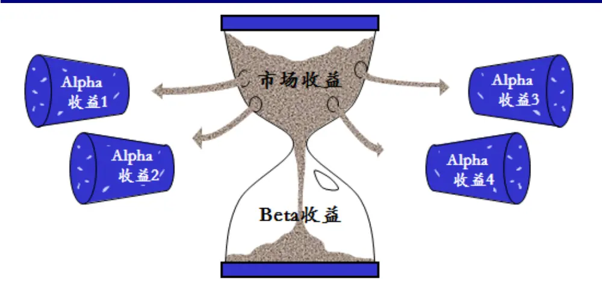
资料来源：广发证券发展研究中心

Alpha收益的获取方式五花八门，但万变不离其宗，或是选取表现优于大盘的股票，或是把握合适的买卖时机，抑或是运用衍生品工具套取绝对收益。不同的Alpha策略中Alpha收益的来源各不相同，其所蕴含的风险也不一。本研究的目的便是发掘出驱动个股产生alpha收益的alpha因子，进而根据发掘出的有效alpha因子设计相应的选股策略，以寻找超越市场的股票超额收益！

## 二、研究思路

明确了本研究的目标——挖掘有效Alpha因子，接下来就是如何设计Alpha挖掘方法，考虑到市场所包含的数据相当庞大，各种选股因子也非常之多，因此，量化选股的一个大前提，就是要建立一个尽可能完备的数据库，基于这个数据库，从中挖掘历史以及当前市场中所包含的特征！

具体而言，我们分四个步骤来挖掘alpha因子， 首先给出因子回报的定义：

## （一）因子回报

因子回报的一个直观意义就是，运用股票的超额收益来度量因子的有效性及重要程度。目前主流的计算方法有两种：回归法以及排序法。其中回归法将因子的取值（风险暴露）与下期股票收益进行线性回归分析，并以回归得到的因子系数作为该因子的回报。本文采用的排序法则将股票按照其在单个因子上暴露值大小进行排序，并以超配排名靠前股票同时低配排名靠后股票的组合下一期平均收益作为因子回报，该方法目前已经得到了广泛使用。

## （二）数据选择及预处理

标的股票：中证800成分股。中证800指数的成份股由中证500和沪深300成份股一起构成，综合反映了沪深证券市场内大中小市值公司的整体状况，我们认为其作为投资标的能够很好地代表沪深两市全部股票的运行情况。

样本期间：2007年3月30日-2011年6月30日共52个月。

基准指数：沪深300指数。

财务数据：本文所采用的财务数据来自wind数据库收录的上市公司年报和季报，考虑到上市公司最迟延后3个月才发布其财务数据，为了使得财务因子的横截面数据具备可比性，我们对模型中的财务因子数据按照如下方法进行时间对准：

上一年的10月底、11月底、12月底以及今年的1月底、2月底和3月底使用上一年的三季度的财务报表数据；

今年的4月底、5月底、6月底以及7月底使用上一年度的年报数据；

今年的8月底和9月底使用今年的半年报数据。

数据预处理：数据的预处理主要包含两部分，即去极值化以及标准化。

去极值化：本文采用“中位数去极植法”进行去极值化，公式如下：

$$
\begin{array}{r}{\mathrm{D_{i,\ upper}=D_{m}+n}\times D_{MAD},\quad ifD_{i}\ge D_{m}+n\times D_{MAD}}\\{D_{i,lower}=D_{m}-n\times D_{MAD},\quad ifD_{i}\le D_{m}+n\times D_{MAD}}\end{array}
$$

其中 $D_{i}$ 为第i个描述性变量的观察值， $D_{m}$ 为所有观察值的中位数， $D_{m}$ 记作观测值与中位数的绝对偏离，即 $\mathrm{\mathrm{\mathrm{\prime}}}D_{i,AD}=\mid D_{i}-D_{m}\mid,\ D_{MAD}\dot{\mathrm{\vec{\mathrm{\imath}}}}\mathrm{\vec{\mathrm{\downarrow}}}$ 作 $D_{i},\mathbf{\Gamma}_{AD}$ 的中位数， $D_{i},{_{upper}}$ 和 $\tau D_{i,lower}$ 分别表示中位数去极值化后描述性变量的上下限，n为用于控制 $D_{i},{\mathbf\Pi}_{upper}$ $\tau D_{i,lower}$ 的常数，本文取n=3。考虑到不同的描述性变量由于其样本数据集中度不同，很难确定一个相同的常数n，因此本研究中我们对源数据重复进行两次去极值化处理，试验结果表明，该方法有利于获得各个因子序列的集中区间，从而避免出现数据失真。

标准化：由于各个描述性因子所衡量的单位不同，导致因子数值范围差异较大，因此在进行因子分析之前，必须对其进行标准化，本研究采用最常见N(0,1)正态标准化处理之，公式如下：

识别风险，发现价值

## 标准化后向量=(原向量-均值)/标准差

## （三）Alpha 因子度量指标

因子有效性的度量是本文研究的核心，我们认为一个有效的 Alpha 因子应该能够带来长期且稳定的 Alpha 收益，同时因子在各期的表现应该 具备较好的持续性，即具备较低的波动性，另外，根据因子挑选出来的超低配组合是否具备较高的胜率也是我们考察的标准之一。

综上所述，本文采用多个指标相结合的方式来考察各个因子的有效性，指标可分为两类：有效性指标和单调性指标。

有效性指标：通过跟踪超低配组合的表现来考察因子的有效性，包含 IC，IR，组合胜率、组合月收益率、组合滚动 1 年收益率以及组合收益t检验概率。

(1) 因子 IC(信息系数)：即每个时点因子在各个股票的暴露值与各股票下个期回报的相关系数，本文认为如果一个因子的 IC 值高于 2%(或低于-2%)，则认为该因子在优选个股 alpha 收益上有较好的效果，IC为正表示该因子与股票的未来收益有正相关关系，应该超配因子暴露值高的股票，反之若 IC为负则超配因子暴露值低的股票。

(2) 因子 IR(信息比)：即因子在样本期间的平均年化收益与年化平均标准差的比值，IR的绝对值越高，表面该因子在优选个股alpha 收益上效果越好，另外，经统计发现，IR的绝对值高于 0.7时，Alpha 因子的选股效果通常比较明显，另外，若 IR为正，则代表应该超配因子暴露值高的股票，反之若IR为负，则应该超配因子暴露值低的股票。

(3) 组合胜率：用于衡量 Alpha 因子是否在多数时间内有效。

(4) 组合收益：包括因子月平均收益和因子滚动 12 个月累计收益，用于衡量因子Alpha 是否具有稳定且可持续收益。

(5) t 检验概率：用于衡量 Alpha 因子是否具有显著的因子回报，因子的 t 检验概率越小，说明该因子的选股效果越好，经统计发现，t 检验的概率小于 0.2 时，相应的 Alpha因子具有较好的选股效果！

单调性指标：通过分析各档股票组合的表现是否具备显著的单调性，从而考察因子的有效性，包含各档累积收益率、各档相对基准累积收益率、各档平均年收益率以及各档相对基准平均年收益率。一般来说，IC和 IR 较高且为正时，各档组合的收益表现呈现单调递增的规律，IC和 IR较高且为负时，各档组合的收益表现呈现单调递减的规律。

## （四） 挑选有效 Alpha 因子

如何根据 Alpha 因子在各个度量指标上的表现来挖掘有效的 Alpha 因子并在此基础上构造相应的 Alpha 策略，是下一步需要进行探讨的课题，本研究侧重于对有效选股因子的挖掘,而关于多因子Alpha 策略将在同系列的其他报告里进行介绍。

综合考虑各个Alpha 因子在各项度量指标上的表现,本研究进一步从各类Alpha 因子中挑选出具有较强代表性以及选股效果最佳的 Alpha 因子。

图 2：基于多因子的 alpha 策略框架图
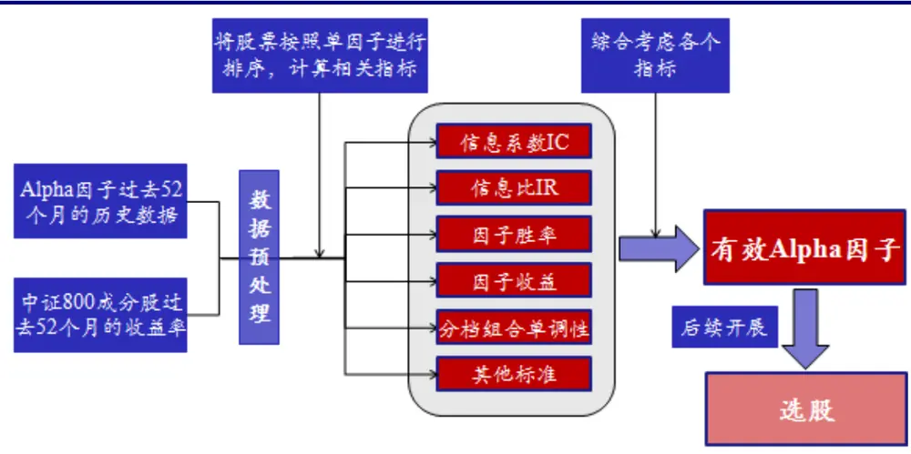
资料来源：广发证券发展研究中心

## 三、备选 Alpha 因子

个股的 Alpha 收益由不同的 Alpha 因子驱动所产生，因此为了有效捕捉个股 Alpha收益，初始因子的选择必须考虑足够的维度，同时各个因子还需具备比较合理的经济学意义，这是因子选股中最关键也是最难解决的一个问题。

图 3：因子驱动 alpha 收益示意图
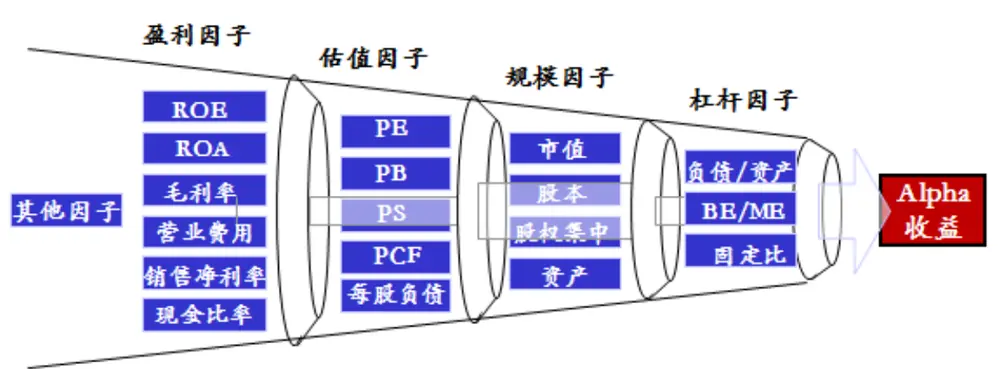
资料来源：广发证券发展研究中心

考虑到更多和更有效的因子往往能够有效增强模型信息捕获能力，因此本文以“多维度+海选”的方式进行备选因子分类及挑选，首先根据经济逻辑和市场经验将因子分为9 类，它们分别为：盈利因子、成长性因子、规模因子、估值因子、杠杆因子、流动性因子、波动因子、技术因子以及一致预期因子，各类因子的覆盖情况及其意义描述如表1 所示：

图 4： alpha 因子覆盖情况
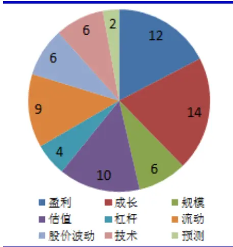
数据来源：Wind，广发证券发展研究中心

表 1：alpha 因子分类

| 因子 | 数量 | 描述 |
| --- | --- | --- |
| 盈利 | 12 | 企业自身盈利能力 |
| 成长 | 14 | 企业业绩成长性 |
| 规模 | 6 | 企业市值及股本规模大小 |
| 估值 | 10 | 企业内在价值 |
| 杠杆 | 4 | 企业负债及资产关系 |
| 流动 | 9 | 企业资产及股价流动性 |
| 股价波动 | 6 | 股价近期波动情况 |
| 技术 | 6 | 技术类指标 |
| 预测 | 2 | 分析师预测数据 |

数据来源：Wind，广发证券发展研究中心

在 9 类 Alpha 因子中，我们共中选取了 69 个我们认为较有代表性的备选 Alpha 因子，考虑到沪深两市中，金融行业股票所占市值比例较大，且金融类上市公司的盈利模式与其它行业有所区别，因此在运用运营类因子、现金流因子以及流动性因子进行选股时，我们都剔除了金融行业的股票。

表 2：备选因子表

| 编号 | 因子分类 | 初始因子 | 适用金融行业 |  |  |  |  |  |
| --- | --- | --- | --- | --- | --- | --- | --- | --- |
| 1 |  | 销售净利 | 否 |  |  |  |  |  |
| 2 |  |  |  |  |  |  | ROE(净资产收益率) | 是 |
| 3 |  |  | ROA(资产收益率) |  |  |  |  |  |
| 4 |  | 毛利率 | 否 |  |  |  |  |  |
| 5 |  | 营业费用比例 | 否 |  |  |  |  |  |
| 6 | 盈利 | 净利润现金含量 | 否 |  |  |  |  |  |
| 7 |  |  |  |  | 财务费用比例(%) | 是 |  |  |
| 8 |  |  | 销售净利率(同比) |  |  |  |  |  |
| 9 |  | ROE 净资产收益率(同比) | 是 |  |  |  |  |  |
| 10 |  |  |  |  |  |  | ROA 资产利润率(同比) | 是 |
| 11 |  |  | 毛利率(同比) |  |  |  |  |  |
| 12 |  | 营业费用比例(同比) | 否 |  |  |  |  |  |
| 13 | 成长性 | 每股净资产增长 | 否 |  |  |  |  |  |
| 14 |  | ROE(净资产收益率)增长率 | 是 |  |  |  |  |  |
| 15 |  | 主营业务收入增长率 | 否 |  |  |  |  |  |
| 16 |  |  |  |  |  | 每股收益(EPS)增长率 | 是 |  |
| 17 |  |  | 净利润增长率 |  |  |  |  |  |
| 18 |  |  | 总资产增长率 |  |  |  |  |  |
| 19 |  |  |  |  |  |  |  |  |
|  |  |  |  | 股东权益增长率 | 是 |  |  |  |
| 20 |  |  | 每股收益增长率(同比) |  |  |  |  |  |

识别风险，发现价值

| 21 |  | 总资产增长率(同比) | 是 |
| --- | --- | --- | --- |
| 22 |  | 每股净资产增长率(同比) | 否 |
| 23 |  | 净资产收益率增长率(同比) | 是 |
| 24 |  | 主营业务收入增长率(同比) | 是 |
| 25 |  | 净利润增长率(同比) | 是 |
| 26 |  | 经营活动产生的现金流量净额(同比) | 是 |
| 27 | 规模 | 流通股本/总股本 | 是 |
| 28 |  | 流通市值/总市值 | 是 |
| 29 |  | 流通市值自然对数 | 是 |
| 30 |  | 流通股本 | 是 |
| 31 |  | 总资产自然对数 | 是 |
| 32 |  | 股权集中度 | 是 |
| 33 | 估值 | PB | 是 |
| 34 |  | 每股派息/股价 | 是 |
| 35 |  | CFP:每股现金流/股价 | 否 |
| 36 |  | PE | 是 |
| 37 |  | SP:主营业务收入/总市值 | 否 |
| 38 |  | 每股负债比(%) | 是 |
| 39 |  | 相对 PE | 是 |
| 40 |  | 相对 PB | 是 |
| 41 |  | 相对 SP | 否 |
| 42 |  | 相对 CFP | 否 |
| 43 | 财务杠杆 | 负债/资产 | 是 |
| 44 |  | 长期负债比率(%) | 是 |
| 45 |  | 固定比(%) | 是 |
| 46 |  | 流动负债率(%) | 是 |
| 47 | 流动性 | 最近3个月平均成交量 | 是 |
| 48 |  | 总资产周转率 | 否 |
| 49 |  | 换手率(算术平均) | 是 |
| 50 |  | 流动比率 | 否 |
| 51 |  | 速动比率 | 否 |
| 52 |  | 存货周转率 | 否 |
| 53 |  | 总资产周转率(同比) | 否 |
| 54 |  | 存货周转率(同比) | 否 |
| 55 |  | 速动比率(同比) | 否 |
| 56 | 波动性 | 月收益率标准差(60个月) | 是 |
| 57 |  | 月收益率标准差(24个月) | 是 |
| 58 |  | 成交金额/股价波动率 | 是 |
| 59 |  | hight/low | 是 |
| 60 |  | Beta(24 个月) | 是 |
| 61 |  | 两个月价格波动 | 是 |

识别风险，发现价值

| 62 | 技术 | 一个月股价动量/反转 | 是 |
| --- | --- | --- | --- |
| 63 |  | 三个月股价动量/反转 | 是 |
| 64 |  | 六个月股价动量/反转 | 是 |
| 65 |  | RSI14 | 是 |
| 66 |  | RSI20 | 是 |
| 67 |  | RSI40 | 是 |
| 68 | 一致预期 | 一致预测 ESP | 是 |
| 69 |  | 一致预测 ESP 环比 | 是 |

数据来源：Wind，广发证券发展研究中心

## 四、回溯测试

本节我们将对各个 Alpha 因子在样本期间内的市场表现进行回溯测试，并综合采取前面提到的几个度量标准来考察各个因子是否能够获得稳定和显著的 alpha 收益。

从 2007 年 3 月至2011年 6 月共 52 个月期间，对69个备选因子进行回溯测试，检验其过往的市场表现。

## （一） 回溯方法

各个因子的回溯方法如下：

（1） 组合的更新频率为一个月，每个月末将中证800的成分股按照每个因子值大小进行排序，根据排序从小到大将股票组合平均分为5 档；

（2）每个月末，以超配前 20%（第 5 档）的股票，同时低配后 20%（第 1 档）的股票作为下一个月的资产组合，同时跟踪五档的市场表现；

（3）以沪深 300 指数作为资产组合的基准指数。

图5：Alpha因子回溯测试流程
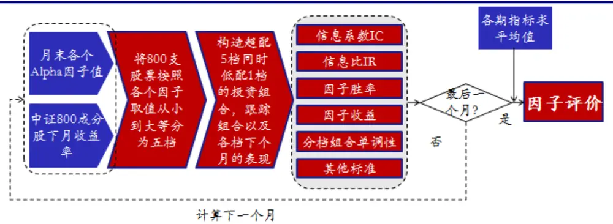
资料来源：广发证券发展研究中心

## （二）Alpha 因子整体表现

我们对各个因子及其对应的资产组合在2007年3月至2011年6月的市场表现进行

回溯测试，回溯期间，统计的指标主要包含各个因子的 IC、组合 IR、因子胜率、组合年化收益率以及各档的累积超额收益率等指标，各指标统计结果如下表。

表 3：Alpha 因子整体表现情况

|  | 因子分类 | 初始因子 | IC | IR | 胜率 | 组合年化收益率 | T检验 |
| --- | --- | --- | --- | --- | --- | --- | --- |
| 1 | 盈利利率 | 销售净利率(%) | -2.95% | -0.4744 | 38.46% | -7.96% | 0.3281 |
| 2 |  | ROE(净资产收益率) | -0.89% | -0.131 | 46.15% | -2.82% | 0.7863 |
| 3 |  | ROA(资产收益率) | -0.64% | -0.0827 | 51.92% | -1.53% | 0.8641 |
| 4 |  | 毛利率 | -0.37% | 0.0213 | 46.15% | 0.28% | 0.9649 |
| 5 |  | 营业费用比例(%) | 1.42% | 0.4045 | 55.77% | 5.58% | 0.4037 |
| 6 |  | 净利润现金含量 | 0.72% | 0.127 | 53.85% | 0.78% | 0.7926 |
| 7 |  | 财务费用比例(%) | -0.50% | -0.0796 | 48.08% | -0.77% | 0.8690 |
| 8 |  | 销售净利率(同比) | -0.13% | -0.0944 | 53.85% | -0.99% | 0.8449 |
| 9 |  | ROE 净资产收益率(同比) | -0.48% | 0.0247 | 51.92% | 0.27% | 0.9591 |
| 10 |  | ROA 资产利润率(同比) | -1.31% | -0.3341 | 50.00% | -3.36% | 0.4899 |
| 11 |  | 毛利率(同比) | -0.88% | -0.6563 | 36.54% | -4.50% | 0.1779 |
| 12 |  | 营业费用比例(同比) | -0.58% | 0.2348 | 48.08% | 1.38% | 0.6272 |
| 13 | 成长性 | 每股净资产增长率(%) | -1.10% | -0.2374 | 44.23% | -2.87% | 0.6233 |
| 14 |  | ROE(净资产收益率)增长率 | -0.04% | 0.0514 | 57.69% | 0.45% | 0.9152 |
| 15 |  | 主营业务收入增长率(%) | -0.18% | -0.0703 | 40.38% | -0.72% | 0.8843 |
| 16 |  | 每股收益(EPS)增长率(%) | -0.27% | -0.1479 | 48.08% | -1.55% | 0.7594 |
| 17 |  | 净利润增长率(%) | -0.38% | -0.1465 | 55.77% | -1.66% | 0.7616 |
| 18 |  | 总资产增长率(%) | -0.96% | -0.0564 | 44.23% | -0.76% | 0.9070 |
| 19 |  | 股东权益增长率(%) | -1.54% | -0.2639 | 42.31% | -4.07% | 0.5851 |
| 20 |  | 每股收益增长率(同比) | 0.16% | -0.223 | 53.85% | -1.24% | 0.6444 |
| 21 |  | 总资产增长率(同比) | 0.37% | -0.002 | 53.85% | -0.01% | 0.9966 |
| 22 |  | 每股净资产增长率(同比) | -0.05% | -0.5466 | 42.31% | -3.88% | 0.2605 |
| 23 |  | 净资产收益率增长率(同比) | 0.36% | -0.4383 | 46.15% | -2.10% | 0.3658 |
| 24 |  | 主营业务收入增长率(同比) | 0.10% | -0.306 | 48.08% | -1.92% | 0.5270 |
| 25 |  | 净利润增长率(同比) | 0.57% | 0.025 | 57.69% | 0.14% | 0.9588 |
| 26 |  | 经营活动产生的现金流量净额(同比) | -0.71% | 0.6029 | 51.92% | 4.48% | 0.2095 |
| 27 | 规模 | 流通股本/总股本 | 1.81% | 0.7567 | 65.38% | 7.12% | 0.1214 |
| 28 |  | 流通市值/总市值 | 2.15% | 0.821 | 61.54% | 8.93% | 0.0935 |
| 29 |  | 流通市值自然对数 | -5.43% | -0.7514 | 36.54% | -16.23% | 0.1240 |
| 30 |  | 流通股本 | -3.83% | -0.6155 | 40.38% | -10.64% | 0.2059 |
| 31 |  | 总资产自然对数 | -3.79% | -0.3598 | 44.23% | -7.54% | 0.4573 |
| 32 |  | 股权集中度 | -1.06% | -0.1494 | 46.15% | -2.43% | 0.7571 |

识别风险，发现价值

| 33 | 估值 | PB | -2.74% | -0.4702 | 34.62% | -8.51% | 0.3323 |
| --- | --- | --- | --- | --- | --- | --- | --- |
| 34 |  | 每股派息/股价 | 0.99% | 0.7378 | 59.62% | 6.58% | 0.1307 |
| 36 |  | CFP:每股现金流/股价 | 0.56% | 0.3257 | 55.77% | 3.58% | 0.5008 |
| 36 |  | PE | -0.54% | -0.194 | 57.69% | -2.63% | 0.6880 |
| 37 |  | SP:主营业务收入/总市值 | 1.77% | 1.26 | 61.54% | 13.22% | 0.0115 |
| 38 |  | 每股负债比(%) | -0.90% | 0.1079 | 42.31% | 1.51% | 0.8231 |
| 39 |  | 相对 PE | -0.06% | -0.1871 | 53.85% | -2.87% | 0.6986 |
| 40 |  | 相对 PB | -1.37% | -0.4919 | 46.15% | -7.35% | 0.3107 |
| 41 |  | 相对 SP | 1.67% | 1.0892 | 63.46% | 10.91% | 0.0276 |
| 42 |  | 相对 CFP | 1.46% | 0.4311 | 55.77% | 4.50% | 0.3737 |
| 43 | 财务杠杆 | 负债/资产 | -0.01% | 0.1526 | 53.85% | 1.73% | 0.7521 |
| 44 |  | 长期负债比率(%) | -0.70% | 0.1701 | 51.92% | 1.68% | 0.7247 |
| 45 |  | 固定比(%) | -0.36% | 0.0804 | 51.92% | 0.84% | 0.8678 |
| 46 |  | 流动负债率(%) | 1.68% | 0.2022 | 53.85% | 2.25% | 0.6756 |
| 47 | 流动性 | 最近3个月平均成交量 | -5.08% | -0.8173 | 42.31% | -15.46% | 0.0950 |
| 48 |  | 总资产周转率 | 1.39% | 0.7909 | 55.77% | 9.19% | 0.1058 |
| 49 |  | 换手率(算术平均) | -4.34% | -0.6705 | 48.08% | -14.67% | 0.1688 |
| 50 |  | 流动比率 | -0.34% | 0.0933 | 59.62% | 0.74% | 0.8468 |
| 51 |  | 速动比率 | -0.33% | 0.326 | 46.15% | 3.26% | 0.5004 |
| 52 |  | 存货周转率 | -2.13% | -0.3759 | 42.31% | -4.36% | 0.4376 |
| 53 |  | 总资产周转率(同比) | 0.41% | 0.0926 | 53.85% | 0.57% | 0.8479 |
| 54 |  | 存货周转率(同比) | -0.47% | 0.2868 | 46.15% | 2.14% | 0.5532 |
| 55 |  | 速动比率(同比) | -0.80% | 0.0288 | 53.85% | 0.11% | 0.9525 |
| 56 | 波动性 | 月收益率标准差(60个月) | -0.09% | 0.0104 | 44.23% | 0.13% | 0.9829 |
| 57 |  | 月收益率标准差(24个月) | 0.26% | 0.1059 | 34.62% | 1.58% | 0.8264 |
| 58 |  | 成交金额(合计)/股价波动率 | -4.78% | -1.4711 | 28.85% | -19.40% | 0.0035 |
| 59 |  | hight/low | 3.64% | 0.9037 | 57.69% | 13.76% | .0657 |
| 60 |  | Beta(24 个月) | 0.31% | 0.0784 | 46.15% | 1.43% | 0.8710 |
| 61 |  | 两个月价格波动 | -1.02% | -0.2065 | 44.23% | -2.51% | 0.6692 |
| 62 | 技术 | 一个月股价动量/反转 | -5.31% | -1.2035 | 36.54% | -19.99% | 0.0155 |
| 63 |  | 三个月股价动量/反转 | -4.97% | -0.8224 | 40.38% | -17.24% | 0.0930 |
| 64 |  | 六个月股价动量/反转 | -4.38% | -0.8117 | 40.38% | -15.87% | 0.0972 |
| 65 |  | RSI14 | -2.29% | -0.5134 | 38.46% | -9.66% | 0.2902 |
| 66 |  | RSI20 | -2.50% | -0.5501 | 36.54% | -10.31% | 0.2575 |
| 67 |  | RSI40 | -1.07% | -0.3378 | 40.38% | -4.77% | 0.4851 |
| 68 | 一致预期 | 一致预测 EPS | -0.47% | -0.2221 | 38.46% | -2.12% | 0.6458 |
| 69 |  | 一致预测 EPS 环比 | 1.40% | 0.2221 | 57.69% | 1.41% | 0.6458 |

数据来源：Wind，广发证券发展研究中心

上表列出了全部 Alpha 因子回溯期间各个指标的计算结果，下面按照各个指标（取绝对值）对各因子进行横截面比较合排序，并列出排名靠前的 Alpha 因子如下：

图 6： alpha 因子按 IC 排名
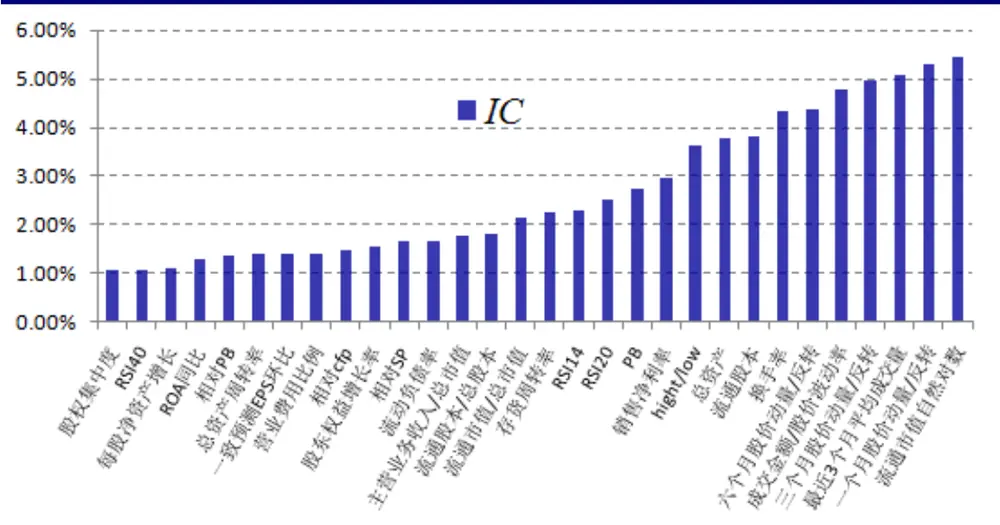
数据来源：Wind，广发证券发展研究中心

信息系数 IC：信息系数 IC（绝对值）大于1%的 30个，大于2%的因子共有 16个，其中 IC最高的因子为流通市值，IC大于2%的因子，其他度量指标大多具有较好的结果。

图 7： alpha 因子按 IR 排名
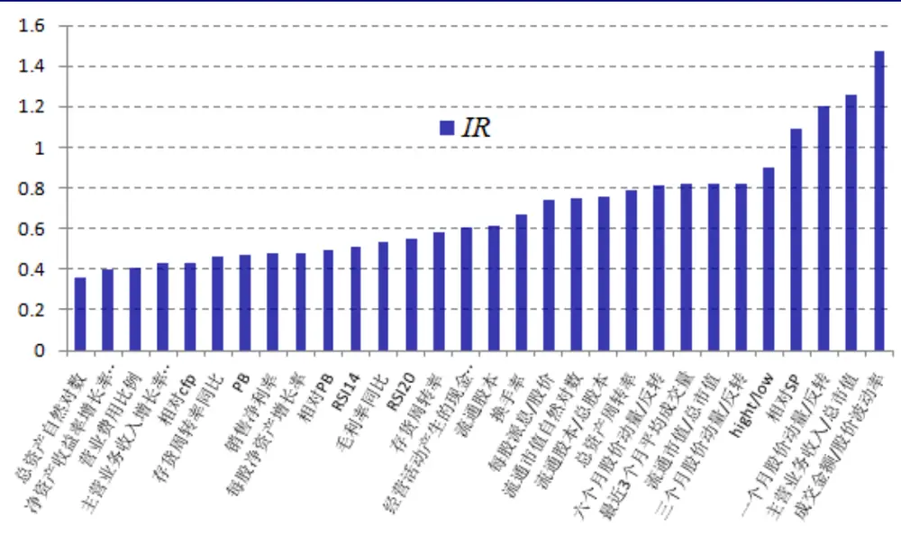
数据来源：Wind，广发证券发展研究中心

信息比 IR：信息比IR（绝对值）大于 0.3的共有 30个，其中大于 0.8的 9 个因子其他指标均较高，IR最高的因子是成交金额/股价波动率。

图 8： alpha 因子按胜率排名
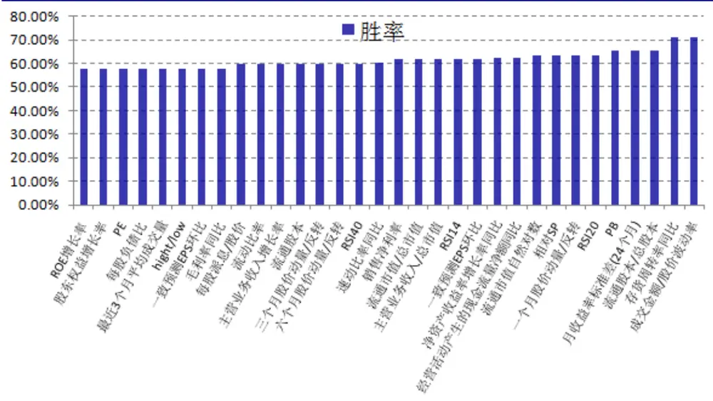
数据来源：Wind，广发证券发展研究中心

因子胜率：统计发现，大多 Alpha 因子均具备较高的胜率，其中胜率大于60%的有 14 个，最高者同样为“成交金额/股价波动率”。

图 9：alpha 因子按收益排名
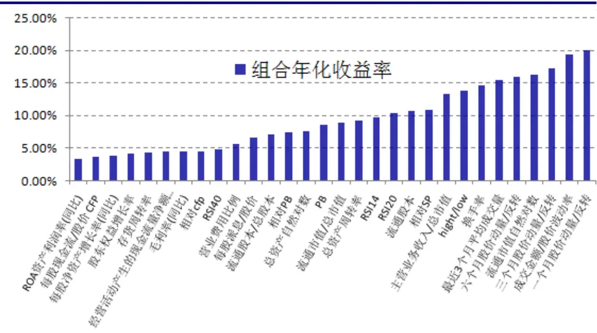
数据来源：Wind，广发证券发展研究中心

超低配组合的年化收益率：样本回溯期间，基准指数的平均年化收益率为10.43%，统计发现，共有 12 个 Alpha 因子平均年化收益高于 10.43%，这些因子其他指标同样较高，其中年化收益率最高的因子位 1个月股价反转。

图 10：alpha 因子按 t 检验概率排名
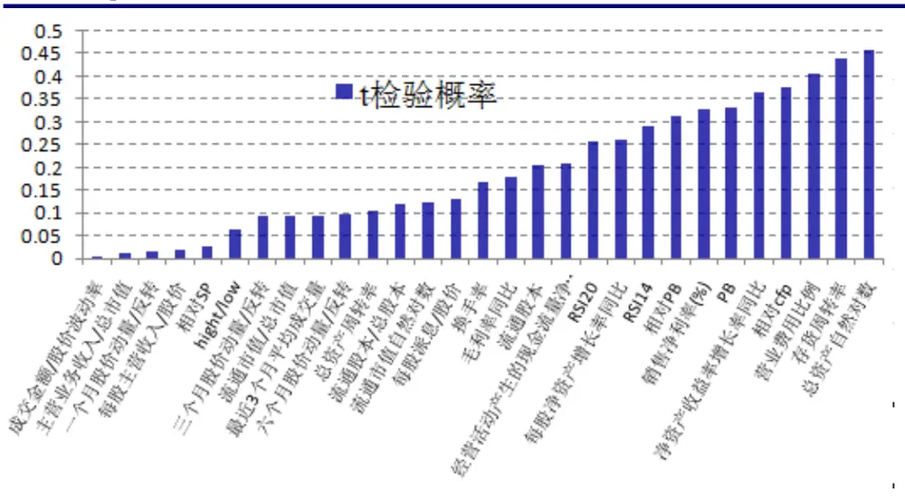
数据来源：Wind，广发证券发展研究中心

t检验概率：样本回溯期间，超低配组合平均年化收益率的 t检验概率，小于0.2的共有 15 个，其中概率最低的为“成交金额/股价波动率”。

表 4：alpha 因子分档表现情况(1/2)

| 编号 | 因子分类 | 初始因子 | 五档累积超额收益率 |  |  |  |  | 五档 vs 沪深 300 累积超额收益率 |  |  |  |  |
| --- | --- | --- | --- | --- | --- | --- | --- | --- | --- | --- | --- | --- |
|  |  |  | 1 | 2 | 3 | 4 | 5 | 1 | 2 | 3 | 4 | 5 |
| 1 |  | 销售净利率(%) | 75.9% | 78.9% | 80.6% | 76.0% | 43.7% | 47.0% | 48.4% | 50.7% | 43.5% | 17.1% |
| 2 | 盈利 | ROE(净资产收益率) | 67.8% | 72.9% | 60.0% | 79.9% | 68.2% | 41.1% | 42.2% | 30.2% | 45.5% | 42.2% |
| 3 |  | ROA(资产收益率) | 68.3% | 63.9% | 71.5% | 71.5% | 75.7% | 40.3% | 37.7% | 41.8% | 39.5% | 43.3% |
| 4 |  | 毛利率 | 51.5% | 90.0% | 64.4% | 72.9% | 78.3% | 30.4% | 59.5% | 37.9% | 40.7% | 38.9% |
| 5 |  | 营业费用比例(%) | 41.4% | 76.2% | 82.7% | 63.2% | 95.8% | 26.1% | 53.7% | 53.9% | 32.0% | 50.0% |
| 6 |  | 净利润现金含量 | 64.1% | 70.4% | 69.1% | 76.1% | 76.8% | 40.1% | 39.0% | 37.5% | 43.9% | 46.8% |
| 7 |  | 财务费用比例(%) | 76.5% | 79.1% | 75.7% | 68.4% | 58.2% | 38.8% | 48.7% | 48.6% | 41.4% | 30.9% |
| 8 |  | 销售净利率(同比) | 70.7% | 64.2% | 76.7% | 91.7% | 67.5% | 43.9% | 37.0% | 41.3% | 52.1% | 40.4% |
| 9 |  | ROE 净资产收益率(同比) | 64.8% | 69.5% | 83.5% | 79.3% | 72.8% | 39.4% | 41.0% | 47.4% | 40.2% | 46.1% |
| 10 |  | ROA 资产利润率(同比) | 77.0% | 64.5% | 79.7% | 89.2% | 60.3% | 50.2% | 38.0% | 43.2% | 48.6% | 34.5% |
| 11 |  | 毛利率(同比) | 76.7% | 101.2% | 87.3% | 62.9% | 48.8% | 44.5% | 63.6% | 53.9% | 36.8% | 21.4% |
| 12 |  | 营业费用比例(同比) | 66.0% | 102.1% | 69.2% | 78.7% | 58.8% | 40.3% | 63.3% | 36.7% | 45.7% | 32.0% |
| 13 | 成长性 | 每股净资产增长率(%) | 74.3% | 69.0% | 80.5% | 69.4% | 61.9% | 45.1% | 39.2% | 48.3% | 37.7% | 35.9% |

识别风险，发现价值

|  | ROE增长率 | 58.0% | 80.3% | 81.6% | 74.2% | 63.2% | 32.1% | 49.8% | 47.1% | 38.0% | 40.5% |
| --- | --- | --- | --- | --- | --- | --- | --- | --- | --- | --- | --- |
|  | 主营业务收入增长率(%) | 65.2% | 65.8% | 77.3% | 79.0% | 69.0% | 39.9% | 34.9% | 42.4% | 47.2% | 42.6% |
|  | EPS 增长率(%) | 59.6% | 84.9% | 78.4% | 80.5% | 54.2% | 33.7% | 53.4% | 43.4% | 44.2% | 32.8% |
|  | 净利润增长率(%) | 64.1% | 82.8% | 68.6% | 80.2% | 59.8% | 38.8% | 51.2% | 34.3% | 44.2% | 37.6% |
|  | 总资产增长率(%) | 65.6% | 80.7% | 78.5% | 59.7% | 70.8% | 37.1% | 48.6% | 44.7% | 32.2% | 43.7% |
|  | 股东权益增长率(%) | 69.3% | 78.1% | 84.3% | 66.1% | 55.7% | 40.9% | 47.1% | 49.3% | 37.2% | 30.0% |
|  | 每股收益增长率(同比) | 86.5% | 76.7% | 63.0% | 79.9% | 67.5% | 52.6% | 46.5% | 33.7% | 44.8% | 40.0% |
|  | 总资产增长率(同比) | 76.5% | 57.6% | 79.8% | 77.4% | 82.4% | 45.7% | 30.3% | 47.4% | 43.3% | 51.0% |
|  | 每股净资产增长率(同比) | 90.9% | 72.7% | 81.6% | 61.4% | 67.5% | 58.2% | 41.8% | 50.1% | 31.2% | 37.1% |
|  | 净资产收益率增长率(同比) | 84.2% | 85.1% | 66.4% | 70.2% | 67.8% | 53.4% | 52.5% | 36.5% | 36.6% | 38.9% |
|  | 主营业务收入增长率(同比) | 84.4% | 71.0% | 62.2% | 84.6% | 70.7% | 53.4% | 43.6% | 31.6% | 47.9% | 40.5% |
|  | 净利润增长率(同比) | 85.5% | 62.3% | 57.8% | 80.9% | 86.5% | 54.3% | 37.8% | 29.9% | 41.5% | 53.5% |
|  | 经营活动产生的现金流量净额(同比) | 51.8% | 70.6% | 83.8% | 77.4% | 91.1% | 29.8% | 39.9% | 46.0% | 42.3% | 60.1% |
| 模 | 流通股本/总股本 | 39.7% | 78.7% | 89.9% | 74.9% | 78.5% | 16.2% | 48.1% | 55.6% | 42.6% | 49.0% |
|  | 流通市值/总市值 | 35.5% | 88.0% | 75.7% | 77.0% | 86.6% | 12.5% | 55.6% | 43.6% | 46.2% | 54.4% |
|  | 流通市值自然对数 | 128.3% | 88.9% | 73.2% | 47.7% | 27.0% | 86.7% | 52.4% | 43.2% | 23.7% | 7.2% |
|  | 流通股本 | 91.3% | 92.6% | 80.1% | 76.4% | 22.4% | 49.5% | 53.9% | 53.6% | 50.4% | 3.6% |
|  | 总资产自然对数 | 80.8% | 90.4% | 86.8% | 60.9% | 35.3% | 41.3% | 54.4% | 53.9% | 38.1% | 16.3% |
|  | 股权集中度 | 64.3% | 75.7% | 54.0% | 92.7% | 68.7% | 38.8% | 48.4% | 28.0% | 57.5% | 33.4% |
| 值 | PB | 79.3% | 109.9% | 77.3% | 54.8% | 38.7% | 51.6% | 78.0% | 45.8% | 26.7% | 10.5% |
|  | 每股派息/股价 | 55.6% | 50.5% | 69.5% | 79.2% | 106.6% | 27.7% | 23.3% | 40.1% | 49.0% | 71.9% |
|  | CFP:每股现金流/股价 | 54.0% | 76.0% | 71.1% | 73.9% | 82.4% | 25.6% | 39.7% | 42.0% | 46.4% | 54.9% |
|  | PE | 72.1% | 102.9% | 86.6% | 47.1% | 49.9% | 51.1% | 65.4% | 47.8% | 19.0% | 25.5% |
|  | SP:主营业务收入/总市值 | 20.9% | 64.9% | 80.7% | 108.3% | 96.4% | -4.4% | 35.0% | 49.7% | 76.1% | 66.3% |
|  | 每股负债比(%) | 57.3% | 59.0% | 103.8% | 65.2% | 73.0% | 26.1% | 27.7% | 69.3% | 40.6% | 46.1% |
|  | 相对 PE | 79.6% | 77.0% | 80.0% | 71.2% | 47.2% | 53.4% | 41.0% | 46.0% | 41.8% | 23.7% |
|  | 相对 PB | 85.1% | 79.6% | 84.7% | 60.4% | 47.6% | 57.6% | 50.7% | 53.5% | 31.8% | 16.2% |
|  | 相对 SP | 24.8% | 72.5% | 85.9% | 95.3% | 88.7% | 0.9% | 41.2% | 51.5% | 64.0% | 60.0% |
|  | 相对 cfp | 58.8% | 49.2% | 85.9% | 66.0% | 101.2% | 34.3% | 19.5% | 50.7% | 37.4% | 69.8% |

识别风险，发现价值

| 43 | 财务杠杆 | 负债/资产 | 53.0% | 84.2% | 87.0% | 71.7% | 62.8% | 20.1% | 49.7% | 57.1% | 45.9% | 37.2% |
| --- | --- | --- | --- | --- | --- | --- | --- | --- | --- | --- | --- | --- |
| 44 |  | 长期负债比率(%) | 64.7% | 93.1% | 73.4% | 58.5% | 68.9% | 32.2% | 55.6% | 42.7% | 33.0% | 45.1% |
| 45 |  | 固定比(%) | 48.3% | 82.0% | 87.0% | 87.4% | 54.2% | 24.2% | 46.5% | 52.4% | 58.5% | 27.5% |
| 46 |  | 流动负债率(%) | 62.2% | 61.7% | 70.6% | 83.0% | 78.8% | 37.1% | 39.4% | 41.8% | 47.2% | 41.1% |
| 47 | 流动性 | 最近3个月平均成交量 | 135.0% | 117.1% | 58.7% | 63.2% | 7.5% | 72.9% | 76.6% | 33.6% | 40.9% | -5.2% |
| 48 |  | 总资产周转率 | 31.9% | 84.5% | 95.7% | 84.4% | 82.1% | 6.6% | 50.4% | 62.2% | 52.7% | 50.9% |
| 49 |  | 换手率(算术平均) | 102.7% | 143.8% | 114.8% | 54.9% | -15.6% | 53.8% | 98.6% | 78.9% | 31.9% | -25.7% |
| 50 |  | 流动比率 | 62.2% | 76.5% | 92.0% | 64.2% | 78.4% | 34.3% | 47.4% | 61.5% | 35.3% | 39.1% |
| 51 |  | 速动比率 | 49.7% | 92.4% | 97.9% | 59.5% | 77.1% | 25.3% | 62.0% | 63.2% | 30.7% | 39.0% |
| 52 |  | 存货周转率 | 83.6% | 107.0% | 66.4% | 77.3% | 41.8% | 46.3% | 68.0% | 39.9% | 48.4% | 16.6% |
| 53 |  | 总资产周转率(同比) | 63.8% | 65.4% | 78.9% | 86.9% | 78.6% | 37.7% | 37.1% | 42.3% | 50.8% | 49.3% |
| 54 |  | 存货周转率(同比) | 41.3% | 82.3% | 101.1% | 83.1% | 70.4% | 17.6% | 50.0% | 62.3% | 50.3% | 40.5% |
| 55 |  | 速动比率(同比) | 55.3% | 94.9% | 89.9% | 70.2% | 65.7% | 28.8% | 58.6% | 53.6% | 40.4% | 37.7% |
| 56 | 波动性 | 月收益率标准差(60 个月) | 77.8% | 59.0% | 96.4% | 73.5% | 52.1% | 35.8% | 28.7% | 62.0% | 47.1% | 35.2% |
| 57 |  | 月收益率标准差(24 个月) | 69.8% | 77.0% | 72.5% | 82.4% | 54.1% | 28.8% | 44.1% | 41.2% | 54.6% | 38.1% |
| 58 |  | 成交金额/股价波动率 | 146.2% | 111.1% | 84.2% | 49.6% | 1.3% | 90.1% | 72.5% | 55.3% | 26.5% | -13.5% |
| 59 |  | hight/low | 46.9% | 54.5% | 49.0% | 78.3% | 138.1% | 13.9% | 25.4% | 26.3% | 51.9% | 101.4% |
| 60 |  | Beta(24 个月) | 64.6% | 70.7% | 83.7% | 79.2% | 56.2% | 25.0% | 38.2% | 50.5% | 51.9% | 40.2% |
| 61 |  | 两个月价格波动 | 69.8% | 90.1% | 69.5% | 75.5% | 52.1% | 36.6% | 57.3% | 40.7% | 46.7% | 26.7% |
| 62 | 技术 | 一个月股价动量/反转 | 139.0% | 142.7% | 80.3% | 35.0% | 1.9% | 95.6% | 98.9% | 51.0% | 11.3% | -15.4% |
| 63 |  | 三个月股价动量/反转 | 139.5% | 105.0% | 72.0% | 47.6% | 12.8% | 99.1% | 66.7% | 40.4% | 21.8% | -4.8% |
| 64 |  | 六个月股价动量/反转 | 122.5% | 101.8% | 79.6% | 55.0% | 13.5% | 81.8% | 65.8% | 48.0% | 29.4% | -5.4% |
| 65 |  | RSI14 | 100.0% | 85.7% | 70.3% | 51.7% | 48.0% | 67.4% | 55.1% | 42.1% | 26.5% | 17.1% |
| 66 |  | RSI20 | 107.4% | 77.9% | 56.4% | 60.2% | 53.6% | 75.7% | 49.6% | 31.6% | 30.3% | 21.2% |
| 67 |  | RSI40 | 90.2% | 57.6% | 51.8% | 82.2% | 75.2% | 60.2% | 34.1% | 26.6% | 49.7% | 37.0% |
| 68 | 一致预期 | 一致预测 ESP | 85.1% | 79.3% | 44.2% | 75.9% | 75.3% | 53.3% | 47.9% | 17.5% | 44.1% | 47.6% |
| 69 |  | 一致预测 ESP 环比 | 85.4% | 57.1% | 61.0% | 60.6% | 96.3% | 53.0% | 30.3% | 35.0% | 30.3% | 62.1% |

数据来源：Wind，广发证券发展研究中心

表 5：alpha 因子分档表现情况(2/2)

| 编号 | 因子 | 初始因子 | 五档年化收益率 | 五档 vs 沪深 300 年化收益率 |
| --- | --- | --- | --- | --- |

识别风险，发现价值

|  | 分类 |  | 1 | 2 | 3 | 4 | 5 | 1 | 2 | 3 | 4 | 5 |
| --- | --- | --- | --- | --- | --- | --- | --- | --- | --- | --- | --- | --- |
| 1 | 盈利性 | 销售净利率(%) | 1.95% | 1.88% | 1.89% | 1.75% | 1.29% | 1.09% | 1.01% | 1.02% | 0.88% | 0.42% |
| 2 |  | ROE(净资产收益率) | 1.90% | 1.83% | 1.60% | 1.76% | 1.67% | 1.04% | 0.96% | 0.73% | 0.89% | 0.80% |
| 3 |  | ROA(资产收益率) | 1.84% | 1.74% | 1.77% | 1.71% | 1.71% | 0.97% | 0.87% | 0.90% | 0.84% | 0.84% |
| 4 |  | 毛利率 | 1.66% | 2.00% | 1.72% | 1.69% | 1.69% | 0.80% | 1.13% | 0.85% | 0.82% | 0.82% |
| 5 |  | 营业费用比例(%) | 1.45% | 1.88% | 1.94% | 1.58% | 1.91% | 0.58% | 1.01% | 1.07% | 0.71% | 1.04% |
| 6 |  | 净利润现金含量 | 1.77% | 1.74% | 1.68% | 1.75% | 1.83% | 0.90% | 0.87% | 0.81% | 0.88% | 0.96% |
| 7 |  | 财务费用比例(%) | 1.71% | 1.82% | 1.86% | 1.72% | 1.65% | 0.84% | 0.95% | 0.99% | 0.86% | 0.78% |
| 8 |  | 销售净利率(同比) | 1.83% | 1.66% | 1.75% | 1.79% | 1.74% | 0.96% | 0.79% | 0.88% | 0.92% | 0.88% |
| 9 |  | ROE 净资产收益率(同比) | 1.73% | 1.74% | 1.80% | 1.73% | 1.75% | 0.86% | 0.88% | 0.94% | 0.87% | 0.88% |
| 10 |  | ROA 资产利润率(同比) | 1.89% | 1.76% | 1.73% | 1.78% | 1.61% | 1.02% | 0.89% | 0.86% | 0.91% | 0.74% |
| 11 |  | 毛利率(同比) | 1.82% | 1.98% | 1.88% | 1.65% | 1.44% | 0.95% | 1.11% | 1.01% | 0.78% | 0.57% |
| 12 |  | 营业费用比例(同比) | 1.60% | 1.91% | 1.70% | 1.84% | 1.71% | 0.73% | 1.04% | 0.83% | 0.97% | 0.85% |
| 13 | 成长性 | 每股净资产增长率(%) | 1.84% | 1.78% | 1.87% | 1.66% | 1.61% | 0.98% | 0.91% | 1.00% | 0.79% | 0.74% |
| 14 |  | ROE增长率 | 1.68% | 1.85% | 1.81% | 1.69% | 1.72% | 0.81% | 0.99% | 0.94% | 0.82% | 0.85% |
| 15 |  | 主营业务收入增长率(%) | 1.76% | 1.71% | 1.78% | 1.80% | 1.70% | 0.90% | 0.84% | 0.91% | 0.93% | 0.84% |
| 16 |  | 每股收益(EPS)增长率(%) | 1.72% | 1.90% | 1.78% | 1.77% | 1.59% | 0.85% | 1.03% | 0.91% | 0.90% | 0.72% |
| 17 |  | 净利润增长率(%) | 1.80% | 1.91% | 1.64% | 1.76% | 1.66% | 0.93% | 1.04% | 0.77% | 0.89% | 0.79% |
| 18 |  | 总资产增长率(%) | 1.78% | 1.90% | 1.80% | 1.57% | 1.72% | 0.91% | 1.03% | 0.93% | 0.70% | 0.85% |
| 19 |  | 股东权益增长率(%) | 1.86% | 1.89% | 1.87% | 1.63% | 1.52% | 0.99% | 1.02% | 1.00% | 0.76% | 0.65% |
| 20 |  | 每股收益增长率(同比) | 1.81% | 1.75% | 1.66% | 1.83% | 1.71% | 0.94% | 0.88% | 0.79% | 0.96% | 0.84% |
| 21 |  | 总资产增长率(同比) | 1.85% | 1.59% | 1.77% | 1.70% | 1.85% | 0.98% | 0.72% | 0.90% | 0.83% | 0.98% |
| 22 |  | 每股净资产增长率(同比) | 1.95% | 1.78% | 1.78% | 1.64% | 1.62% | 1.08% | 0.91% | 0.91% | 0.77% | 0.75% |
| 23 |  | 净资产收益率增长率(同比) | 1.85% | 1.83% | 1.68% | 1.72% | 1.67% | 0.98% | 0.97% | 0.81% | 0.85% | 0.81% |
| 24 |  | 主营业务收入增长率(同比) | 1.89% | 1.84% | 1.53% | 1.77% | 1.73% | 1.02% | 0.97% | 0.66% | 0.91% | 0.86% |
| 25 |  | 净利润增长率(同比) | 1.85% | 1.68% | 1.58% | 1.78% | 1.87% | 0.99% | 0.82% | 0.71% | 0.91% | 1.00% |
| 26 |  | 经营活动产生的现金流量净额(同比) | 1.57% | 1.77% | 1.67% | 1.81% | 1.95% | 0.70% | 0.90% | 0.80% | 0.94% | 1.08% |
| 27 | 规模 | 流通股本/总股本 | 1.30% | 1.84% | 1.95% | 1.79% | 1.89% | 0.43% | 0.97% | 1.08% | 0.92% | 1.02% |
| 28 |  | 流通市值/总市值 | 1.23% | 1.93% | 1.80% | 1.83% | 1.98% | 0.36% | 1.07% | 0.93% | 0.96% | 1.11% |
| 29 |  | 流通市值自然对数 | 2.43% | 1.98% | 1.81% | 1.46% | 1.08% | 1.56% | 1.11% | 0.95% | 0.59% | 0.21% |
| 30 |  | 流通股本 | 1.93% | 1.98% | 1.95% | 1.87% | 1.04% | 1.06% | 1.11% | 1.08% | 1.00% | 0.17% |
| 31 |  | 总资产自然对数 | 1.86% | 2.03% | 1.96% | 1.68% | 1.23% | 0.99% | 1.16% | 1.09% | 0.81% | 0.37% |
| 32 |  | 股权集中度 | 1.82% | 1.88% | 1.51% | 1.94% | 1.62% | 0.95% | 1.01% | 0.64% | 1.07% | 0.75% |
| 33 | 估值 | PB | 1.94% | 2.22% | 1.83% | 1.55% | 1.23% | 1.07% | 1.35% | 0.96% | 0.68% | 0.36% |
| 34 |  | 每股派息/股价 | 1.54% | 1.52% | 1.78% | 1.85% | 2.08% | 0.67% | 0.65% | 0.91% | 0.99% | 1.21% |

识别风险，发现价值

| 36 |  | CFP:每股现金流/股价 | 1.57% | 1.75% | 1.77% | 1.79% | 1.87% | 0.70% | 0.88% | 0.90% | 0.93% | 1.00% |
| --- | --- | --- | --- | --- | --- | --- | --- | --- | --- | --- | --- | --- |
| 36 |  | PE | 1.81% | 2.03% | 1.85% | 1.48% | 1.59% | 0.94% | 1.16% | 0.98% | 0.61% | 0.72% |
| 37 |  | SP:主营业务收入/总市值 | 0.97% | 1.64% | 1.88% | 2.20% | 2.08% | 0.11% | 0.77% | 1.01% | 1.33% | 1.21% |
| 38 |  | 每股负债比(%) | 1.60% | 1.60% | 2.12% | 1.72% | 1.73% | 0.73% | 0.73% | 1.25% | 0.85% | 0.86% |
| 39 |  | 相对 PE | 1.84% | 1.73% | 1.83% | 1.77% | 1.60% | 0.97% | 0.86% | 0.96% | 0.90% | 0.73% |
| 40 |  | 相对 PB | 1.98% | 1.88% | 1.91% | 1.62% | 1.37% | 1.11% | 1.01% | 1.04% | 0.75% | 0.50% |
| 41 |  | 相对 SP | 1.08% | 1.74% | 1.90% | 2.05% | 1.99% | 0.21% | 0.87% | 1.03% | 1.18% | 1.12% |
| 42 |  | 相对 cfp | 1.68% | 1.43% | 1.90% | 1.69% | 2.06% | 0.81% | 0.57% | 1.03% | 0.82% | 1.19% |
| 43 | 财务杠杆 | 负债/资产 | 1.48% | 1.88% | 1.96% | 1.82% | 1.63% | 0.61% | 1.01% | 1.09% | 0.95% | 0.76% |
| 44 |  | 长期负债比率(%) | 1.63% | 1.98% | 1.80% | 1.60% | 1.77% | 0.76% | 1.11% | 0.93% | 0.73% | 0.90% |
| 45 |  | 固定比(%) | 1.46% | 1.87% | 1.91% | 1.99% | 1.53% | 0.59% | 1.01% | 1.04% | 1.13% | 0.66% |
| 46 |  | 流动负债率(%) | 1.64% | 1.66% | 1.76% | 1.89% | 1.82% | 0.77% | 0.79% | 0.89% | 1.02% | 0.96% |
| 47 | 流动性 | 最近3个月平均成交量 | 2.21% | 2.20% | 1.69% | 1.76% | 0.92% | 1.34% | 1.33% | 0.82% | 0.89% | 0.05% |
| 48 |  | 总资产周转率 | 1.15% | 1.88% | 1.98% | 1.85% | 1.91% | 0.28% | 1.01% | 1.11% | 0.98% | 1.04% |
| 49 |  | 换手率(算术平均) | 1.85% | 2.38% | 2.22% | 1.68% | 0.63% | 0.99% | 1.51% | 1.35% | 0.81% | -0.24% |
| 50 |  | 流动比率 | 1.68% | 1.81% | 1.99% | 1.55% | 1.74% | 0.81% | 0.95% | 1.12% | 0.68% | 0.87% |
| 51 |  | 速动比率 | 1.45% | 2.01% | 2.04% | 1.55% | 1.72% | 0.58% | 1.14% | 1.17% | 0.69% | 0.85% |
| 52 |  | 存货周转率 | 1.68% | 2.10% | 1.89% | 1.78% | 1.32% | 0.81% | 1.23% | 1.02% | 0.91% | 0.45% |
| 53 |  | 总资产周转率(同比) | 1.73% | 1.64% | 1.74% | 1.88% | 1.77% | 0.86% | 0.77% | 0.87% | 1.01% | 0.91% |
| 54 |  | 存货周转率(同比) | 1.45% | 1.82% | 2.05% | 1.82% | 1.63% | 0.58% | 0.95% | 1.18% | 0.95% | 0.76% |
| 55 |  | 速动比率(同比) | 1.60% | 2.00% | 1.83% | 1.72% | 1.61% | 0.74% | 1.13% | 0.96% | 0.85% | 0.75% |
| 56 | 波动性 | 月收益率标准差(60个月) | 1.66% | 1.57% | 2.00% | 1.86% | 1.67% | 0.79% | 0.70% | 1.13% | 0.99% | 0.80% |
| 57 |  | 月收益率标准差(24个月) | 1.57% | 1.81% | 1.74% | 1.95% | 1.70% | 0.70% | 0.94% | 0.87% | 1.08% | 0.83% |
| 58 |  | 成交金额(合计)/股价波动率 | 2.34% | 2.17% | 1.96% | 1.57% | 0.73% | 1.47% | 1.30% | 1.09% | 0.70% | -0.14% |
| 59 |  | hight/low | 1.33% | 1.54% | 1.53% | 1.90% | 2.47% | 0.46% | 0.67% | 0.66% | 1.03% | 1.60% |
| 60 |  | Beta(24 个月) | 1.58% | 1.73% | 1.86% | 1.90% | 1.70% | 0.71% | 0.86% | 0.99% | 1.03% | 0.83% |
| 61 |  | 两个月价格波动 | 1.70% | 2.01% | 1.75% | 1.81% | 1.49% | 0.83% | 1.14% | 0.88% | 0.94% | 0.62% |
| 62 | 技术 | 一个月股价动量/反转 | 2.42% | 2.43% | 1.87% | 1.29% | 0.75% | 1.55% | 1.56% | 1.00% | 0.43% | -0.12% |
| 63 |  | 三个月股价动量/反转 | 2.44% | 2.09% | 1.75% | 1.48% | 1.00% | 1.57% | 1.22% | 0.88% | 0.61% | 0.13% |
| 64 |  | 六个月股价动量/反转 | 2.30% | 2.07% | 1.85% | 1.57% | 0.98% | 1.43% | 1.20% | 0.98% | 0.70% | 0.11% |
| 65 |  | RSI14 | 2.15% | 1.97% | 1.78% | 1.52% | 1.34% | 1.28% | 1.11% | 0.92% | 0.65% | 0.47% |
| 66 |  | RSI20 | 2.26% | 1.90% | 1.62% | 1.59% | 1.40% | 1.39% | 1.03% | 0.75% | 0.72% | 0.53% |
| 67 |  | RSI40 | 2.06% | 1.66% | 1.52% | 1.86% | 1.67% | 1.19% | 0.79% | 0.65% | 0.99% | 0.80% |
| 68 | 一致预期 | 一致预测 ESP | 1.94% | 1.82% | 1.45% | 1.79% | 1.76% | 1.07% | 0.96% | 0.58% | 0.92% | 0.89% |
| 69 |  | 一致预测 ESP 环比 | 1.87% | 1.61% | 1.68% | 1.61% | 1.99% | 1.01% | 0.74% | 0.81% | 0.74% | 1.12% |

数据来源：Wind，广发证券发展研究中心

## （三）Alpha 因子整体表现分析

前面列出了全部备选 Alpha 因子各个指标结果，下面根据统计的结果对各类 Alpha因子中的有效因子进行结果分析。

## 1．盈利因子

综合考虑各个度量指标，12 个盈利因子中，销售净利率的有效性最为显著，其信息系数 IC 为-2.95%，表示该因子与股票收益具有负相关关系，其超低配组合的胜率也比较高，因子排名靠后的股票相对排名靠前的股票平均胜率为 61.54%，五档股票组合的累积超额收益率也具备较明显的递减性。

值得一提的是，信息比最高的 Alpha 因子是毛利率同比，信息比为-0.6563，而 ROE作为经典的基本面指标经检验有效性并不显著，难以用来甄别优势股票。

## 2．成长性因子

本报告采用年报披露的多个财务指标的增长率及增长加速来刻画上市公司业绩的成长性，综合考虑各个度量指标，这些代表了上市公司当前成长性的因子，在公司随后的股价增长上也没有很好的体现，各个指标在大多数度量标准下都没有达到有效的标准！其中，在 14 个成长因子中，“经营活动产生的现金流金额增长率”有效性最为显著，其信息比 IR最高为-0.603%，五档股票组合的累积超额收益率也具备较明显的递增性，但其信息系数为负且不显著，没有太大的参考意义，其超低配组合胜率并不高。其他成长性因子的有效性不显著。

## 3．规模因子

在样本回测期间，规模因子在大部分行情下对挖掘各股 Alpha 收益的贡献相当显著，共 5 个备选因子的IC均大于 1%，表明规模因子与个股收益有相对较高的显著性，其中，流通市值因子的 IC 为-5.34%，组合胜率为 63.46%，五档组合的收益具备明显的递减性。因此规模因子在样本期间能够产生比较稳定和持续的 Alpha 收益，受因子风格的轮动的影响并不大。

## 4．估值因子

在共 10 个估值因子中，PB 与个股未来收益的相关性最高为-2.74%，IR 为-0.47，信息比最高的因子是 SP，即主营收入/总市值，信息比高达 1.26，超低配组合的平均年化收益 t检验概率最低为0.0115，另外，行业相对 PB，相对 SP以及相对 CFP在各个指标上同样具有较好的表现，总体而言，估值因子的选股效果较为突出。

## 5．杠杆因子

对 4 个财务杠杆因子的统计发现，流动负债率的 IC 最高为 1.68%，但其信息比仅为 0.2，其余财务杠杆因子的选股效果同样并不突出。

## 6．流动性因子

流动性因子共有 9 个，统计发现其中“最近 3 个月平均成交量”因子的 IC最高，IR 为-0.8173，t 检验概率为 0.095，五档股票组合同样表现出显著的递减效应，另外，总资产周转率、换手率以及存货周转率也均有不俗表现！

## 7．波动性因子

波动性因子共有 6 个，其中有两个因子的表现非常突出，IC最高的因子为“最近一个月成交金额/股价波动率”，其 IC为-4.78%，相应的信息比为-1.4711。组合胜率更是高达 71.15%，t检验概率为 0.0035，具有非常高的显著性。而“一个月内最高价/一个月内最低价”的 IC同样较高为 3.64%，信息比为0.9037，t检验概率为 0.0657。

## 8．技术因子

技术因子共有 6 个，其中 3 个是股价动量/反转，3 个是 RSI 指标，统计发现技术因子的选股效果比较明显，其中“一个月股价动量/反转”的 IC 最高为-5.31%，信息比为-1.204，其余指标均显著有效！RSI指标中，最常用的指标周期为14 天，其 IC为-2.29%，RI 为-0.5134，胜率高达 6.154%。可见技术类 Alpha 因子远比许多基本面因子更能甄选表现优异的股票。

## 9．一致预期

对于分析师的一致预期，由于数据较难获得，我们只统计了其中两个因子，其中“一致预测 ESP月环比”的 IC较高为 1.4%，但其他指标效果并不十分显著，通过观察五档股票组合的表现，我们发现分析是一致预期数据中，最高和最低的两档均具有比较好的表现，而中间三档（即那些预期数据变动较小的股票）的表现明显比较差。

综上所述，盈利因子的选股效果并不明显，仅有“销售净利率”具有一定的选股效应，而成长性因子、杠杆因子以及分析师一致预测数据的选股能力均较差，而估值因子、规模因子、流动因子、波动因子以及技术因子均能找到具有较好选股效应的因子。其中，流通市值、股价近3个月成交量、1个月成交金额／股价波动率以及股价1个月反转等因子的选股能力最为突出！下面我们将各类因子中选股效果相对突出的因子挑选出来，并逐个给出其回溯测试结果。

## （四）部分有效 Alpha 因子回溯表现

根据前面对各个因子回溯测试的表现情况进行分析，我们挑选出各类因子中表现较佳的因子共 16个如下表所示：

表 6：部分有效Alpha因子整体表现

| 编号 | 因子分类 | 有效 Alpha 因子 | IC | IR | 胜率 | 组合年化收益率 | T检验 |
| --- | --- | --- | --- | --- | --- | --- | --- |
| 1 | 盈利利率 | 销售净利率(%) | -2.95% | -0.4744 | 38.46% | -7.96% | 0.3281 |
| 2 | 成长性 | 经营活动产生的现金流量净额(同比) | -0.71% | 0.6029 | 51.92% | 4.48% | 0.2095 |
| 3 | 规模 | 流通市值/总市值 | 2.15% | 0.821 | 61.54% | 8.93% | 0.0935 |
| 4 |  | 流通市值自然对数 | -5.43% | -0.7514 | 36.54% | -16.23% | 0.1240 |
| 5 | 估值 | PB | -2.74% | -0.4702 | 34.62% | -8.51% | 0.3323 |
| 6 |  | SP:主营业务收入/总市值 | 1.77% | 1.26 | 61.54% | 13.22% | 0.0115 |
| 7 |  | 相对PB | -1.37% | -0.4919 | 46.15% | -7.35% | 0.3107 |
| 8 |  | 相对 SP | 1.67% | 1.0892 | 63.46% | 10.91% | 0.0276 |
| 9 | 流动性 | 最近3个月平均成交量 | -5.08% | -0.8173 | 42.31% | -15.46% | 0.0950 |
| 10 |  | 总资产周转率 | 1.39% | 0.7909 | 55.77% | 9.19% | 0.1058 |
| 11 |  | 换手率(算术平均) | -4.34% | -0.6705 | 48.08% | -14.67% | 0.1688 |
| 12 | 波动性 | 成交金额(合计)/股价波动率 | -4.78% | -1.4711 | 28.85% | -19.40% | 0.0035 |
| 13 |  | hight/low | 3.64% | 0.9037 | 57.69% | 13.76% | .0657 |
| 14 | 技术 | 一个月股价动量/反转 | -5.31% | -1.2035 | 36.54% | -19.99% | 0.0155 |
| 15 |  | RSI14 | -2.29% | -0.5134 | 38.46% | -9.66% | 0.2902 |
| 16 | 一致预期 | 一致预测 ESP 环比 | 1.40% | 0.2221 | 57.69% | 1.41% | 0.6458 |

数据来源：Wind，广发证券发展研究中心

下面给出这些因子在样本期间的回溯测试情况统计，统计的信息包括：因子各月

IC、超低配组合月收益率、超低配组合滚动 12 个月收益率、五档年化平均收益率。下面是 16 个因子各个指标的统计情况。

表 7：销售净利率

|  | 累积收益率 | 平均年化收益率 | 平均胜率 |  |
| --- | --- | --- | --- | --- |
| 1档 | 75.9% | 23.40% | 61.54% | 超配 |
| 2档 | 78.9% | 22.56% | 61.54% |  |
| 3档 | 80.6% | 22.68% | 63.46% |  |
| 4档 | 76.0% | 21.00% | 63.46% |  |
| 5档 | 43.7% | 15.48% | 59.62% | 低配 |
| 沪深 300 指数 | 10.3% | 10.43% | - |  |

数据来源：Wind，广发证券发展研究中心

图 11：销售净利率各月 IC
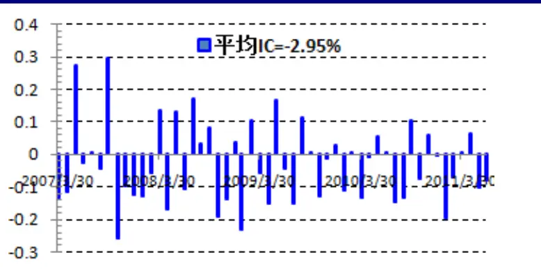
数据来源：Wind，广发证券发展研究中心

图12：销售净利率五档累积收益
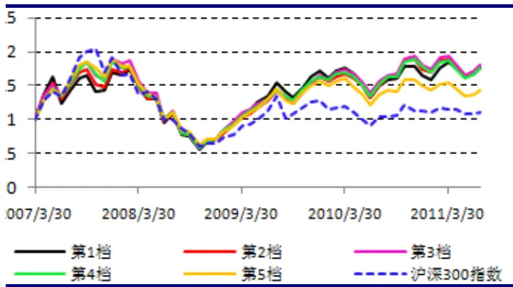
数据来源：Wind，广发证券发展研究中心

图13：销售净利率超低配组合月收益率
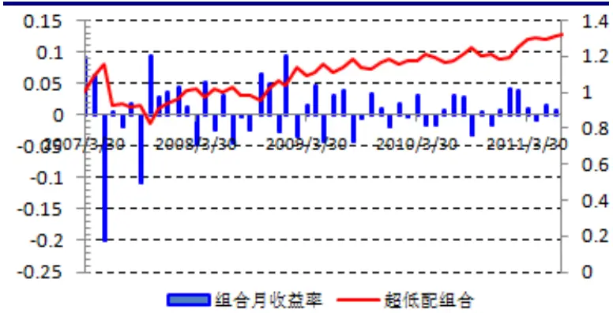
数据来源：Wind，广发证券发展研究中心

图14：销售净利率组合滚动12月收益率
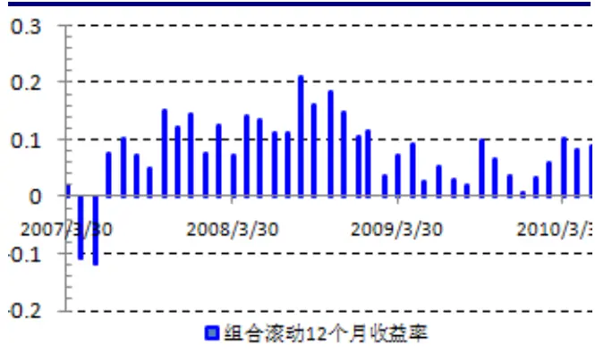
数据来源：Wind，广发证券发展研究中心

表 8：经营活动产生的现金流量净额(同比)

|  | 累积收益率 | 平均年化收益率 | 平均胜率 |  |
| --- | --- | --- | --- | --- |
| 1档 | 51.8% | 18.84% | 61.54% | 低配 |
| 2档 | 70.6% | 21.24% | 63.46% |  |
| 3档 | 83.8% | 20.04% | 63.46% |  |
| 4档 | 77.4% | 21.72% | 63.46% |  |
| 5档 | 91.1% | 23.40% | 59.62% | 超配 |
| 沪深 300 指数 | 10.3% | 10.43% | - |  |

数据来源：Wind，广发证券发展研究中心

图 15：经营活动产生的现金流量净额(同比)各月 IC
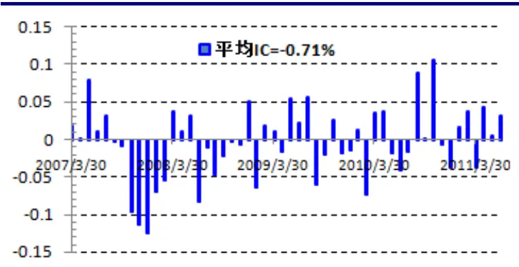
数据来源：Wind，广发证券发展研究中心

图16：经营活动产生的现金流量净额(同比)五档累积收益
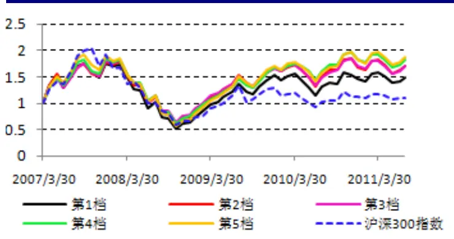
数据来源：Wind，广发证券发展研究中心

图17：经营产生现金净额(同比)超低配组合月收益率
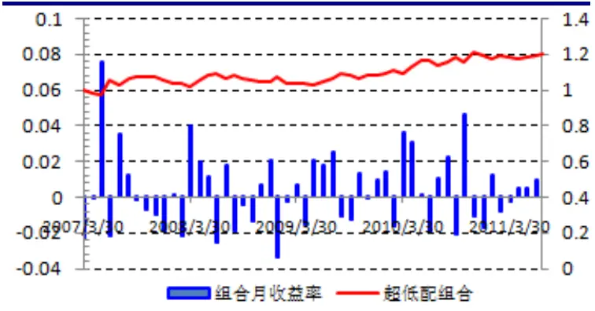
数据来源：Wind，广发证券发展研究中心

图18：经营产生现金净额(同比) 组合滚动12月收益率
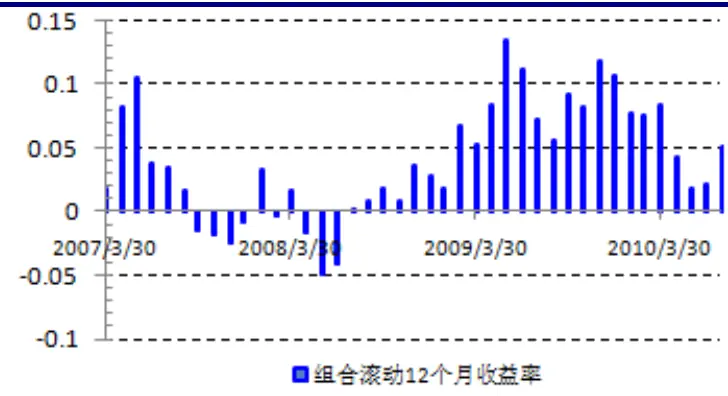
数据来源：Wind，广发证券发展研究中心

表 9：流通市值/总市值

|  | 累积收益率 | 平均年化收益率 | 平均胜率 |  |
| --- | --- | --- | --- | --- |
| 1档 | 35.5% | 14.76% | 63.46% | 低配 |
| 2档 | 88.0% | 23.16% | 65.38% |  |
| 3档 | 75.7% | 21.60% | 63.46% |  |
| 4档 | 77.0% | 21.96% | 59.62% |  |
| 5档 | 86.6% | 23.76% | 65.38% | 超配 |
| 沪深 300 指数 | 10.3% | 10.43% | - |  |

数据来源：Wind，广发证券发展研究中心

图19：流通市值/总市值各月IC
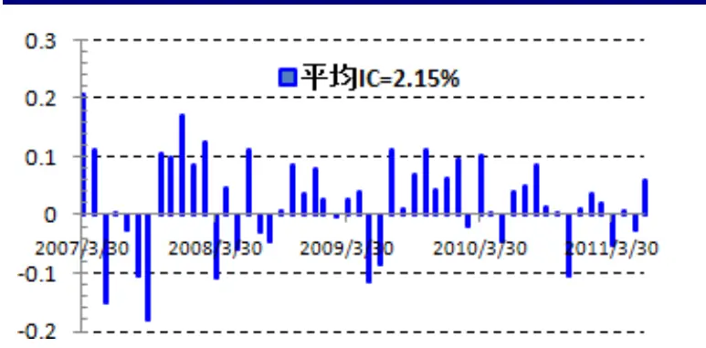
数据来源：Wind，广发证券发展研究中心

图20：流通市值/总市值五档累积收益
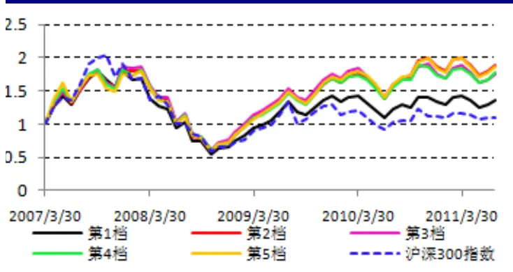
数据来源：Wind，广发证券发展研究中心

图21：流通市值/总市值超低配组合月收益率
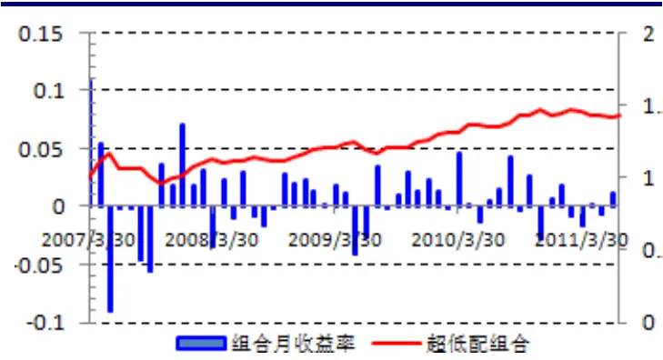
数据来源：Wind，广发证券发展研究中心

图22：流通市值/总市值组合滚动12月收益率
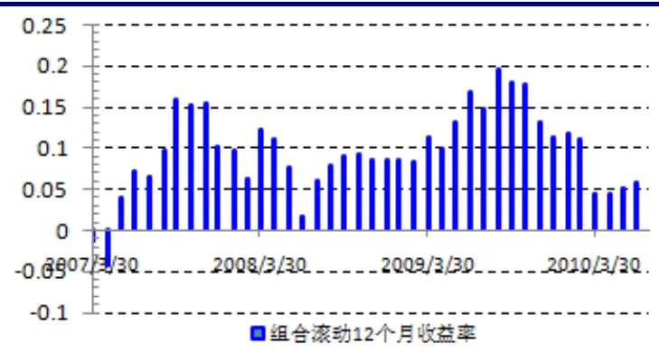
数据来源：Wind，广发证券发展研究中心

表 10：流通市值自然对数

|  | 累积收益率 | 平均年化收益率 | 平均胜率 |
| --- | --- | --- | --- |
| 1档 | 128.3% | 29.16% | 65.38% |
| 2档 | 88.9% | 23.76% | 59.62% |
| 3档 | 73.2% | 21.72% | 63.46% |
| 4档 | 47.7% | 17.52% | 59.62% |
| 5档 | 27.0% | 12.96% | 65.38% |
| 沪深 300 指数 | 10.3% | 10.43% | – |

数据来源：Wind，广发证券发展研究中心

图23：流通市值自然对数各月IC
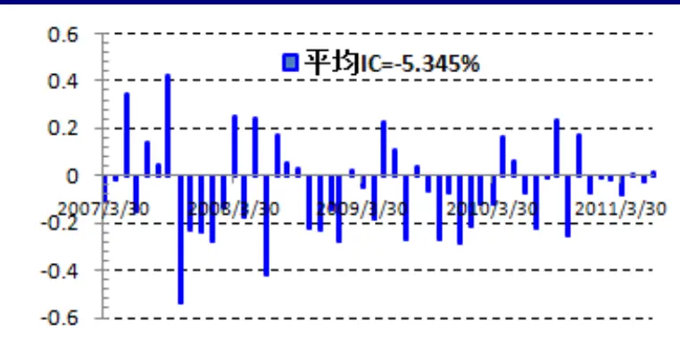
数据来源：Wind，广发证券发展研究中心

图24：流通市值自然对数五档累积收益
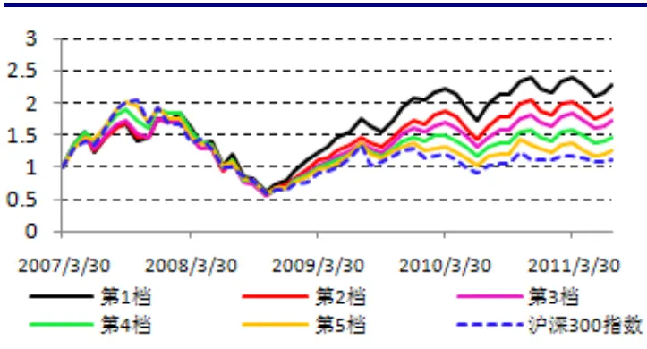
数据来源：Wind，广发证券发展研究中心

图25：流通市值自然对数超低配组合月收益率
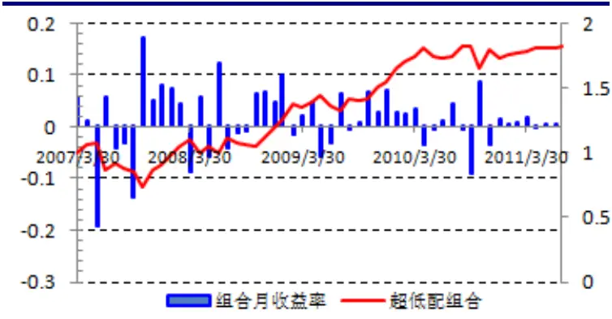
数据来源：Wind，广发证券发展研究中心

图26：流通市值自然对数组合滚动12月收益率
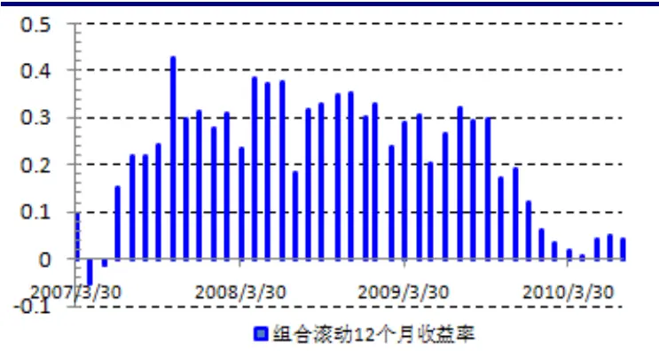
数据来源：Wind，广发证券发展研究中心

表 11：PB

|  | 累积收益率 | 平均年化收益率 | 平均胜率 |
| --- | --- | --- | --- |
| 1档 | 79.3% | 23.28% | 61.54% |
| 2档 | 109.9% | 26.64% | 59.62% |
| 3档 | 77.3% | 21.96% | 61.54% |
| 4档 | 54.8% | 18.60% | 59.62% |
| 5档 | 38.7% | 14.76% | 57.69% |
| 沪深 300 指数 | 10.3% | 10.43% | - |

数据来源：Wind，广发证券发展研究中心

图 27：PB 各月 IC
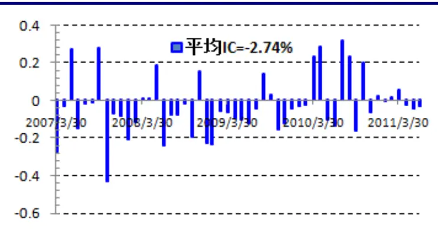
数据来源：Wind，广发证券发展研究中心

图 28：PB五档累积收益
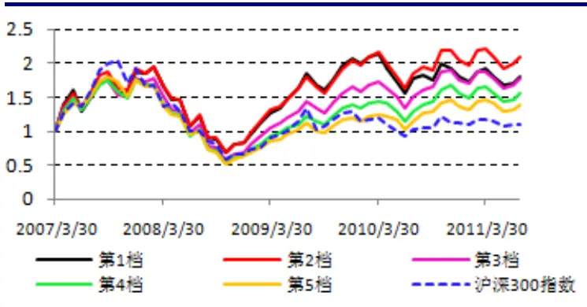
数据来源：Wind，广发证券发展研究中心

图29：PB超低配组合月收益率
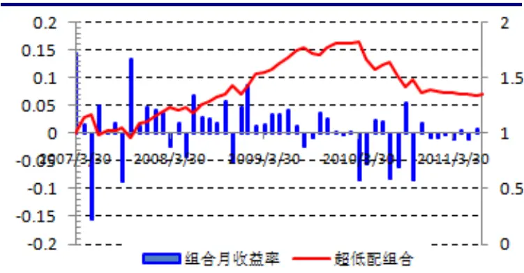
数据来源：Wind，广发证券发展研究中心

图30：PB组合滚动12月收益率
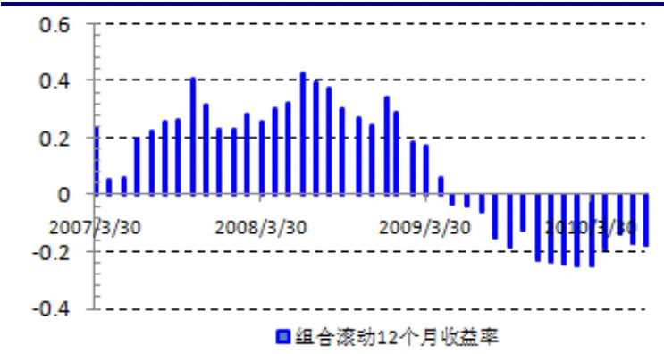
数据来源：Wind，广发证券发展研究中心

表 12：主营业务收入/总市值

|  | 累积收益率 | 平均年化收益率 | 平均胜率 |  |
| --- | --- | --- | --- | --- |
| 1档 | 20.9% | 11.64% | 55.77% | 低配 |
| 2档 | 64.9% | 19.68% | 63.46% |  |
| 3档 | 80.7% | 22.56% | 63.46% |  |
| 4档 | 108.3% | 26.40% | 65.38% |  |
| 5档 | 96.4% | 24.96% | 65.38% | 超配 |
| 沪深 300 指数 | 10.3% | 10.43% | – |  |

数据来源：Wind，广发证券发展研究中心

图 31：主营业务收入/总市值各月IC
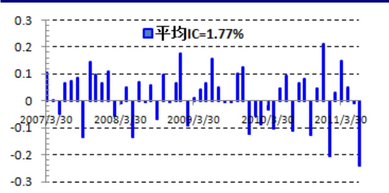
数据来源：Wind，广发证券发展研究中心

图 32：主营业务收入/总市值五档累积收益
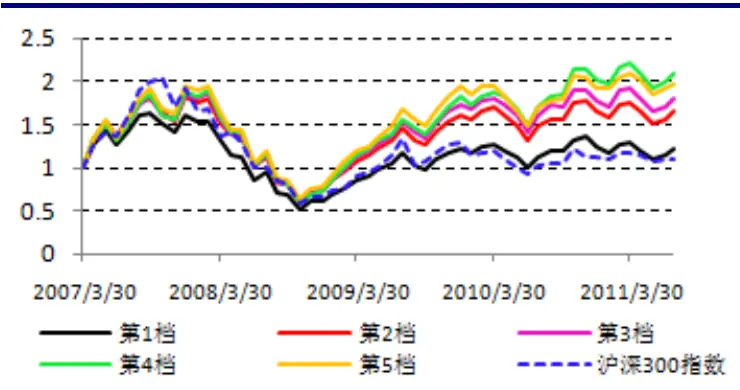
数据来源：Wind，广发证券发展研究中心

图 33：主营业务收入/总市值流通市值自然对数超低配组
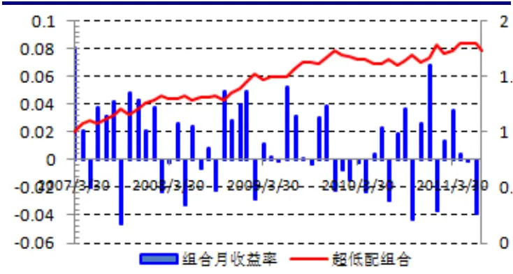
数据来源：Wind，广发证券发展研究中心

图 34：主营业务收入/总市值组合滚动12月收益率
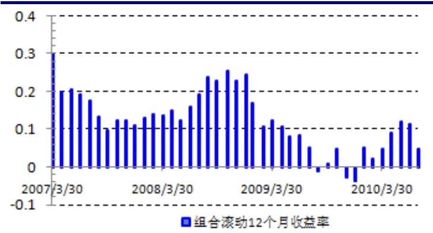
数据来源：Wind，广发证券发展研究中心

表 13：相对 PB

|  | 累积收益率 | 平均年化收益率 | 平均胜率 |
| --- | --- | --- | --- |
| 1档 | 85.1% | 23.76% | 57.69% |
| 2档 | 79.6% | 22.56% | 63.46% |
| 3档 | 84.7% | 22.92% | 63.46% |
| 4档 | 60.4% | 19.44% | 63.46% |
| 5档 | 47.6% | 16.44% | 59.62% |
| 沪深 300 指数 | 10.3% | 10.43% | – |

数据来源：Wind，广发证券发展研究中心

图 35：相对 PB 各月 IC
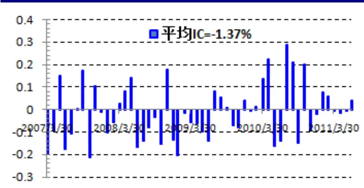
数据来源：Wind，广发证券发展研究中心

图 36：相对PB五档累积收益
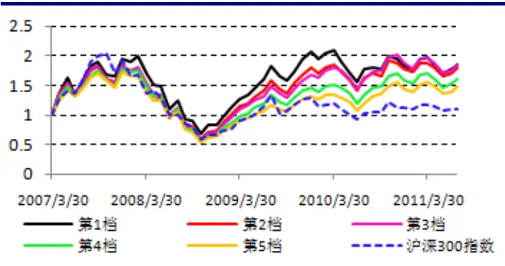
数据来源：Wind，广发证券发展研究中心

图 37：相对PB超低配组合月收益率
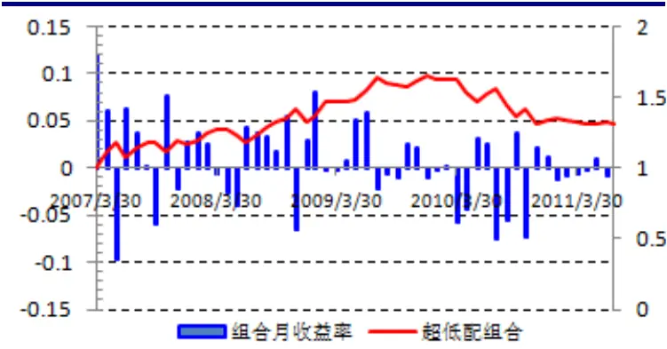
数据来源：Wind，广发证券发展研究中心

图 38：相对PB组合滚动12月收益率
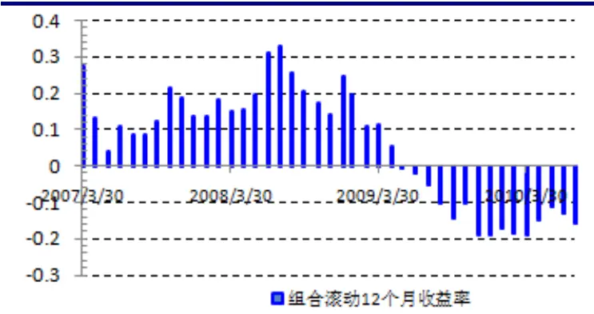
数据来源：Wind，广发证券发展研究中心

表 14：相对 SP

|  | 累积收益率 | 平均年化收益率 | 平均胜率 |  |
| --- | --- | --- | --- | --- |
| 1档 | 24.8% | 12.96% | 55.77% | 低配 |
| 2档 | 72.5% | 20.88% | 63.46% |  |
| 3档 | 85.9% | 22.80% | 63.46% |  |
| 4档 | 95.3% | 24.60% | 63.46% |  |
| 5档 | 88.7% | 23.88% | 61.54% | 超配 |
| 沪深 300 指数 | 10.3% | 10.43% | 1 |  |

数据来源：Wind，广发证券发展研究中心

图 39：相对 SP 各月 IC
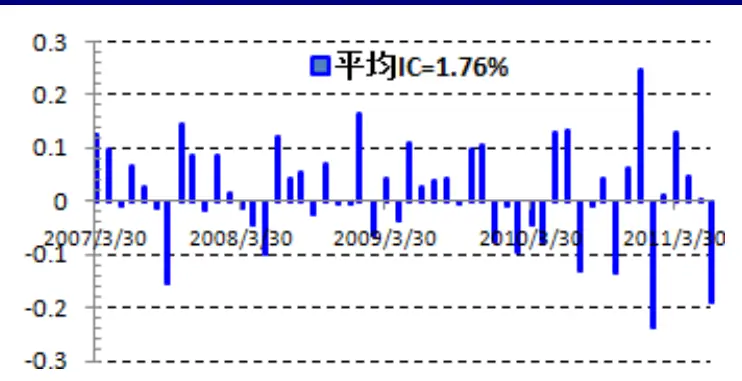
数据来源：Wind，广发证券发展研究中心

图 40：相对SP五档累积收益
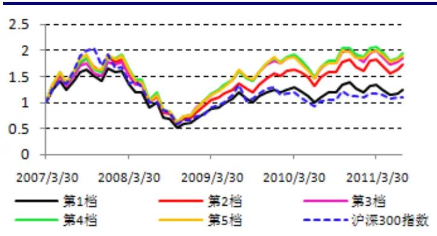
数据来源：Wind，广发证券发展研究中心

图 41：相对SP超低配组合月收益率
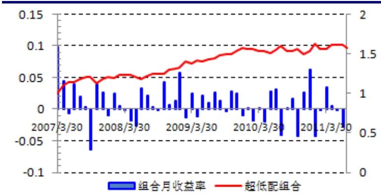
数据来源：Wind，广发证券发展研究中心

图 42：相对SP组合滚动12月收益率
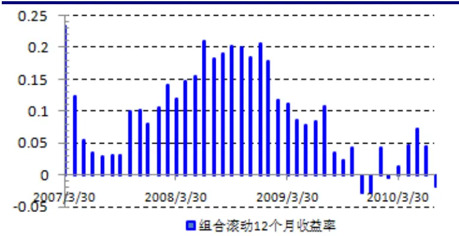
数据来源：Wind，广发证券发展研究中心

表 15：最近3个月平均成交量

|  | 累积收益率 | 平均年化收益率 | 平均胜率 |
| --- | --- | --- | --- |
| 1档 | 135.0% | 26.52% | 59.62% |
| 2档 | 117.1% | 26.40% | 65.38% |
| 3档 | 58.7% | 20.28% | 63.46% |
| 4档 | 63.2% | 21.12% | 63.46% |
| 5档 | 7.5% | 11.04% | 57.69% |
| 沪深 300 指数 | 10.3% | 10.43% | – |

数据来源：Wind，广发证券发展研究中心

图 43：最近3个月平均成交量各月IC
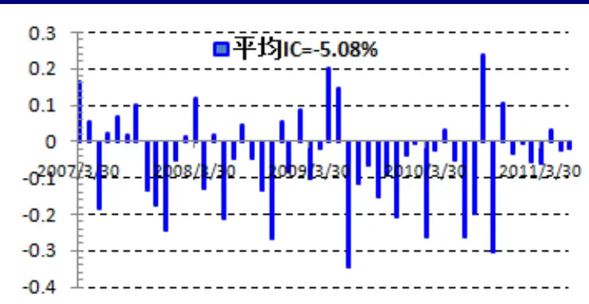
数据来源：Wind，广发证券发展研究中心

图 44：最近3个月平均成交量五档累积收益
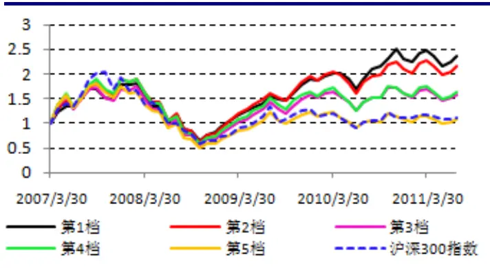
数据来源：Wind，广发证券发展研究中心

图45：最近3个月平均成交量超低配组合月收益率
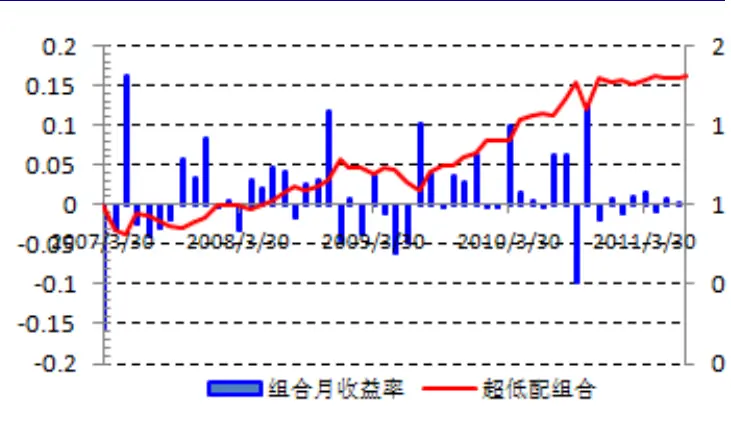
数据来源：Wind，广发证券发展研究中心

图 46：最近3个月平均成交量组合滚动12月收益率
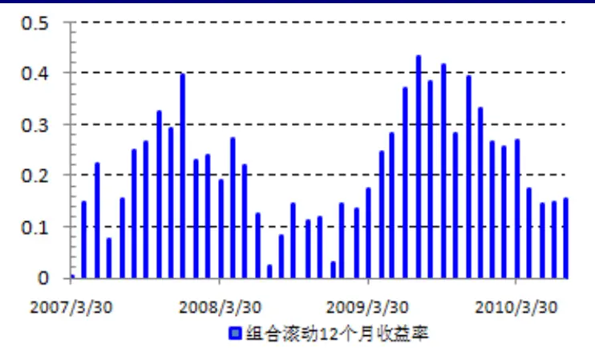
数据来源：Wind，广发证券发展研究中心

表 16： 总资产周转率

|  | 累积收益率 | 平均年化收益率 | 平均胜率 |  |
| --- | --- | --- | --- | --- |
| 1档 | 31.9% | 13.80% | 53.85% | 低配 |
| 2档 | 84.5% | 22.56% | 63.46% |  |
| 3档 | 95.7% | 23.76% | 61.54% |  |
| 4档 | 84.4% | 22.20% | 59.62% |  |
| 5档 | 82.1% | 22.92% | 61.54% | 超配 |
| 沪深 300 指数 | 10.3% | 10.43% | – |  |

数据来源：Wind，广发证券发展研究中心

图 47：总资产周转率各月IC
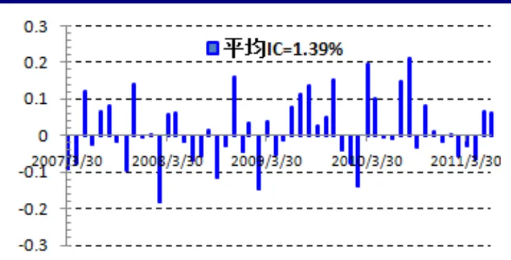
数据来源：Wind，广发证券发展研究中心

图 48：总资产周转率五档累积收益
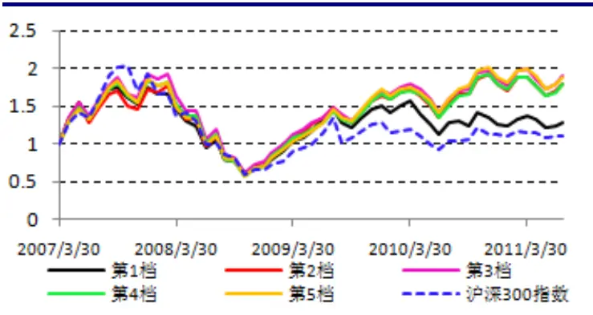
数据来源：Wind，广发证券发展研究中心

图 49：总资产周转率超低配组合月收益率
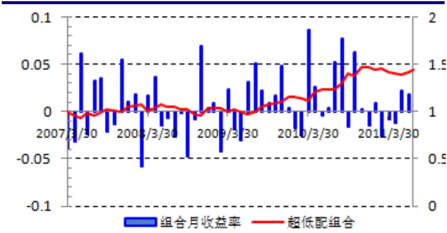
数据来源：Wind，广发证券发展研究中心

图 50：总资产周转率组合滚动12月收益率
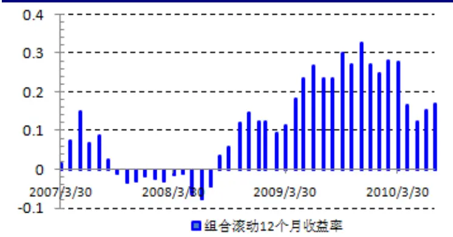
数据来源：Wind，广发证券发展研究中心

表 17：换手率

|  | 累积收益率 | 平均年化收益率 | 平均胜率 |  |
| --- | --- | --- | --- | --- |
| 1档 | 102.7% | 22.20% | 59.62% | 超配 |
| 2档 | 143.8% | 28.56% | 63.46% |  |
| 3档 | 114.8% | 26.64% | 63.46% |  |
| 4档 | 54.9% | 20.16% | 61.54% |  |
| 5档 | -15.6% | 7.56% | 57.69% |  |
| 沪深 300 指数 | 10.3% | 10.43% | – |  |

数据来源：Wind，广发证券发展研究中心

图 51：换手率各月IC
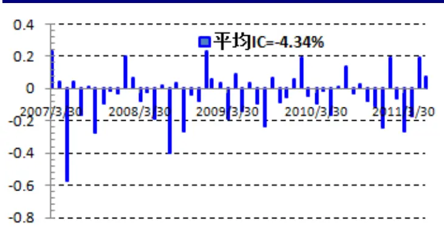
数据来源：Wind，广发证券发展研究中心

图 52：换手率五档累积收益
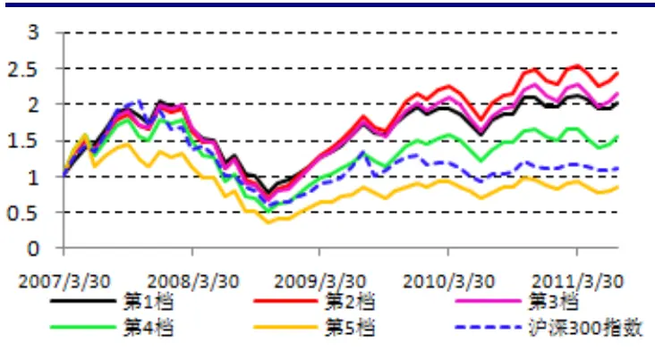
数据来源：Wind，广发证券发展研究中心

图 53：换手率超低配组合月收益率
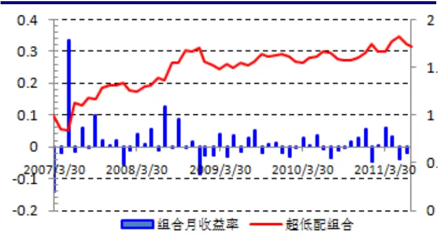
数据来源：Wind，广发证券发展研究中心

图 54：换手率组合滚动12月收益率
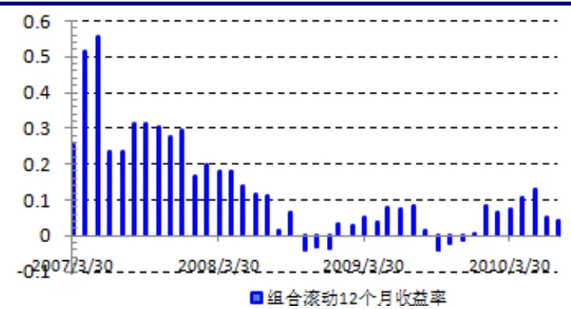
数据来源：Wind，广发证券发展研究中心

表 18：成交金额/股价波动率

|  | 累积收益率 | 平均年化收益率 | 平均胜率 |  |
| --- | --- | --- | --- | --- |
| 1档 | 146.2% | 28.08% | 67.31% | 超配 |
| 2档 | 111.1% | 26.04% | 61.54% |  |
| 3档 | 84.2% | 23.52% | 63.46% |  |
| 4档 | 49.6% | 18.84% | 57.69% |  |
| 5档 | 1.3% | 8.76% | 55.77% | 低配 |
| 沪深 300 指数 | 10.3% | 10.43% | - |  |

数据来源：Wind，广发证券发展研究中心

图 55：成交金额/股价波动率各月IC
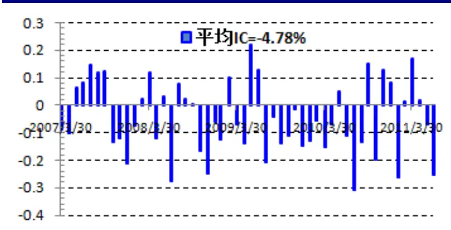
数据来源：Wind，广发证券发展研究中心

图 56：成交金额/股价波动率五档累积收益
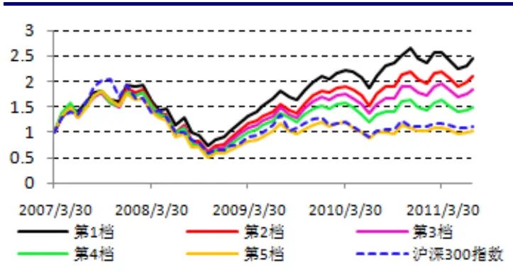
数据来源：Wind，广发证券发展研究中心

图 57：成交金额/股价波动率超低配组合月收益率
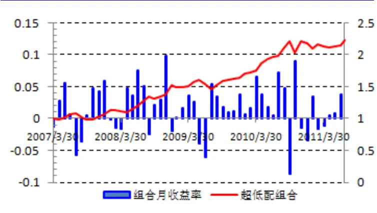
数据来源：Wind，广发证券发展研究中心

图 58：成交金额/股价波动率组合滚动12月收益率
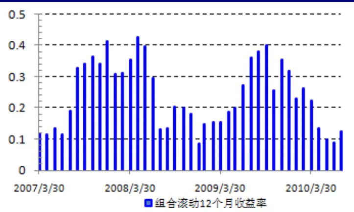
数据来源：Wind，广发证券发展研究中心

表 19： hight/low

|  | 累积收益率 | 平均年化收益率 | 平均胜率 |  |
| --- | --- | --- | --- | --- |
| 1档 | 46.9% | 15.96% | 59.62% | 低配 |
| 2档 | 54.5% | 18.48% | 61.54% |  |
| 3档 | 49.0% | 18.36% | 63.46% |  |
| 4档 | 78.3% | 22.80% | 59.62% |  |
| 5档 | 138.1% | 29.64% | 69.23% | 超配 |
| 沪深 300 指数 | 10.3% | 10.43% | - |  |

数据来源：Wind，广发证券发展研究中心

图 59：hight/low 各月 IC
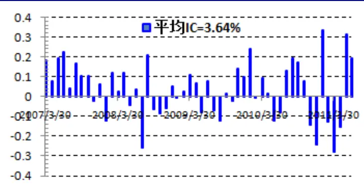
数据来源：Wind，广发证券发展研究中心

图 60：hight/low 五档累积收益
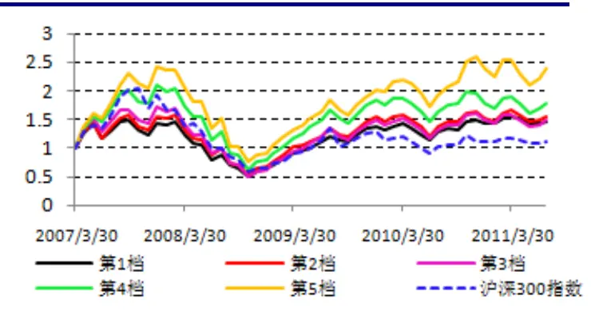
数据来源：Wind，广发证券发展研究中心

图 61：hight/low超低配组合月收益率
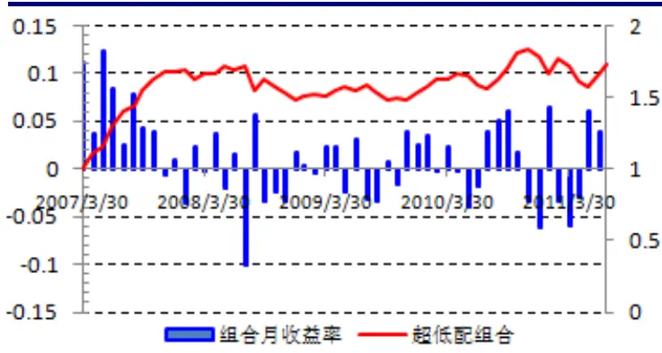
数据来源：Wind，广发证券发展研究中心

图 62：hight/low 组合滚动 12 月收益率
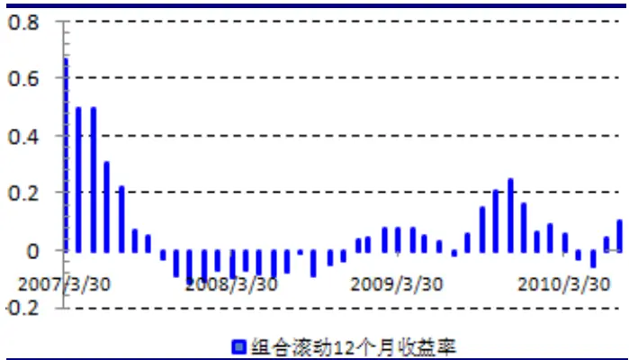
数据来源：Wind，广发证券发展研究中心

组合滚动12个月收益率

表 20：一个月股价动量/反转

|  | 累积收益率 | 平均年化收益率 | 平均胜率 |
| --- | --- | --- | --- |
| 1档 | 139.0% | 29.04% | 63.46% |
| 2档 | 142.7% | 29.16% | 61.54% |
| 3档 | 80.3% | 22.44% | 65.38% |
| 4档 | 35.0% | 15.48% | 61.54% |
| 5档 | 1.9% | 9.00% | 57.69% |
| 沪深 300 指数 | 10.3% | 10.43% | - |

数据来源：Wind，广发证券发展研究中心

图 63：一个月股价动量/反转各月IC
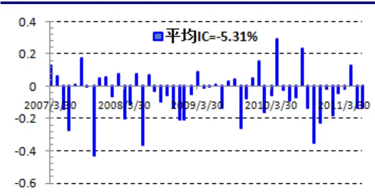
数据来源：Wind，广发证券发展研究中心

图 64：一个月股价动量/反转五档累积收益
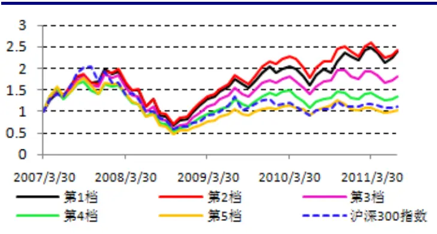
数据来源：Wind，广发证券发展研究中心

图 65：一个月股价动量/反转超低配组合月收益率
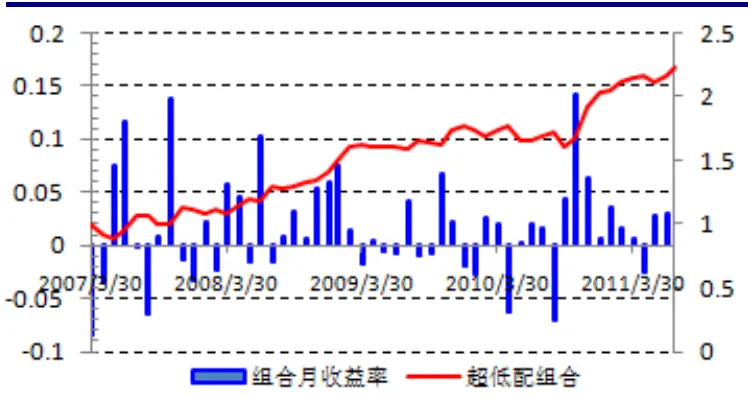
数据来源：Wind，广发证券发展研究中心

图 66：一个月股价动量/反转组合滚动12月收益率
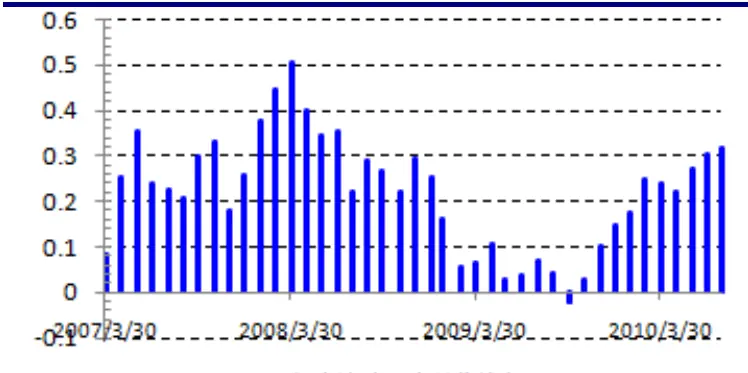
数据来源：Wind，广发证券发展研究中心

表 21：RSI14

|  | 累积收益率 | 平均年化收益率 | 平均胜率 |
| --- | --- | --- | --- |
| 1档 | 100.0% | 25.80% | 65.38% |
| 2档 | 85.7% | 23.64% | 63.46% |
| 3档 | 70.3% | 21.36% | 61.54% |
| 4档 | 51.7% | 18.24% | 63.46% |
| 5档 | 48.0% | 16.08% | 59.62% |
| 沪深 300 指数 | 10.3% | 10.43% | - |

数据来源：Wind，广发证券发展研究中心

图 67：RSI14 各月 IC
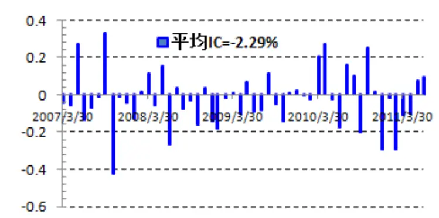
数据来源：Wind，广发证券发展研究中心

图 68：RSI14
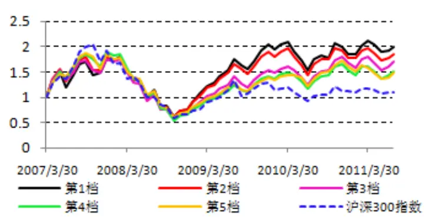
数据来源：Wind，广发证券发展研究中心

图 69：RSI14超低配组合月收益率
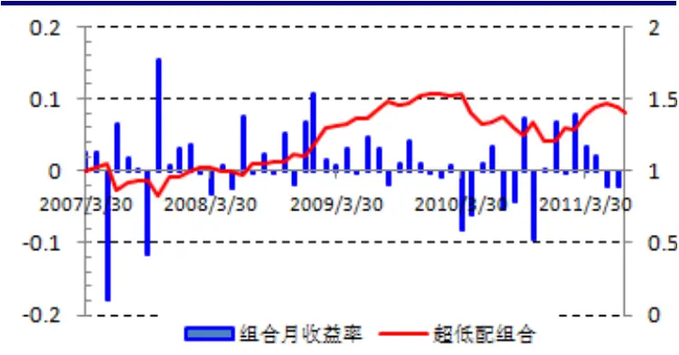
数据来源：Wind，广发证券发展研究中心

图 70：RSI14组合滚动12月收益率
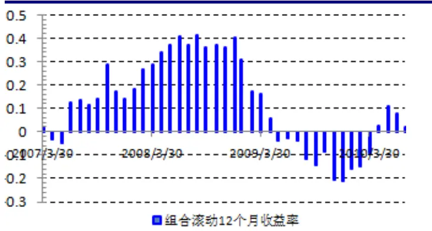
数据来源：Wind，广发证券发展研究中心

表 22：一致预测ESP环比

|  | 累积收益率 | 平均年化收益率 | 平均胜率 |
| --- | --- | --- | --- |
| 1档 | 85.4% | 22.44% | 63.46% |
| 2档 | 57.1% | 19.32% | 61.54% |
| 3档 | 61.0% | 20.16% | 59.62% |
| 4档 | 60.6% | 19.32% | 63.46% |
| 5档 | 96.3% | 23.88% | 59.62% |
| 沪深 300 指数 | 10.3% | 10.43% | - |

数据来源：Wind，广发证券发展研究中心

图 71：一致预测ESP环比各月IC
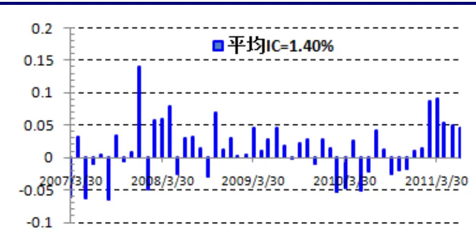
数据来源：Wind，广发证券发展研究中心

图 72：一致预测ESP环比五档累积收益
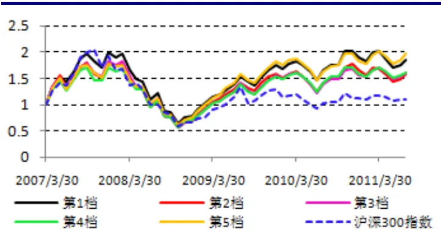
数据来源：Wind，广发证券发展研究中心

图 73：一致预测ESP环比超低配组合月收益率
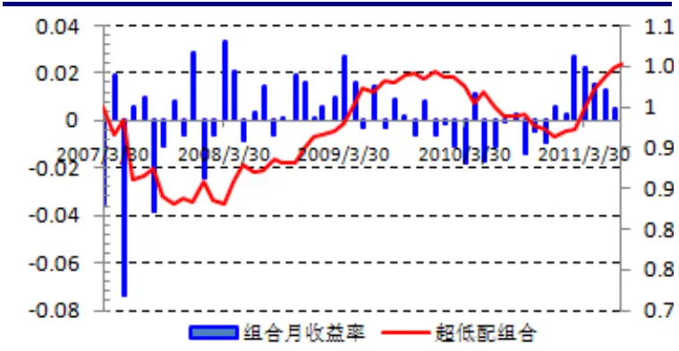
数据来源：Wind，广发证券发展研究中心

图 74：一致预测ESP环比组合滚动12月收益率
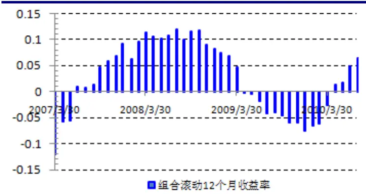
数据来源：Wind，广发证券发展研究中心

## 广发金融工程研究小组

罗军，首席分析师，华南理工大学理学硕士，2010年新财富最佳分析师评选入围，2009年进入广发证券发展研究中心。

胡海涛，分析师，华南理工大学理学硕士，2010年新财富最佳分析师评选入围（团队），2010年进入广发证券发展研究中心。
安宁宁，研究助理，暨南大学经济学硕士，2011年进入广发证券发展研究中心。

蓝昭钦，研究助理，中山大学数学硕士，2010年新财富最佳分析师评选入围（团队），2010年进入广发证券发展研究中心。李明，研究助理，伦敦城市大学卡斯商学院计量金融硕士，2010 年新财富最佳分析师评选入围（团队），2010 年进入广发证券发展研究中心。

史庆盛，研究助理，华南理工大学管理学硕士，2011 年进入广发证券发展研究中心。联系方式：sqs@gf.com.cn，020-87555888-8618。

## 相关研究报告

多因子Alpha模型研究:沪深300成分股的应用分析(上)

多因子Alpha模型研究:沪深300成分股的应用分析(下)

|  | 广州 | 深圳 | 北京 | 上海 |
| --- | --- | --- | --- | --- |
| 地址 | 广州市天河北路183号 | 深圳市民田路华融大厦 北京市月坛北街2 号月 上海市浦东南路 528 |  |  |
|  | 大都会广场5楼 | 2501 室 | 坛大厦18层1808室 | 号证券大厦北塔17楼 |
| 邮政编码 | 510075 | 518026 | 100045 | 200120 |
| 客服邮箱 服务热线 | gfyf@gf.com.cn 020-87555888-8612 |  |  |  |

注：广发证券股份有限公司具备证券投资咨询业务资格。本报告只发送给广发证券重点客户，不对外公开发布。

## 免 责 声明

本报告所载资料的来源及观点的出处皆被广发证券股份有限公司认为可靠，但广发证券不对其准确性或完整性做出任何保证。报告内容仅供参考，报告中的信息或所表达观点不构成所涉证券买卖的出价或询价。广发证券不对因使用本报告的内容而引致的损失承担任何责任，除非法律法规有明确规定。客户不应以本报告取代其独立判断或仅根据本报告做出决策。

广发证券可发出其它与本报告所载信息不一致及有不同结论的报告。本报告反映研究人员的不同观点、见解及分析方法，并不代表广发证券或其附属机构的立场。报告所载资料、意见及推测仅反映研究人员于发出本报告当日的判断，可随时更改且不予通告。

本报告旨在发送给广发证券的特定客户及其它专业人士。未经广发证券事先书面许可，不得更改或以任何方式传送、复印或印刷本报告。