# 观宏观经济周期，察风格因子轮动

# 16274——因子风格轮动系列专题之一

罗军Table_Author 首席分析师

胡海涛 分析师

电话：020-87555888-8655

emp电话：020-87555888-8406

eMail：lj33@gf.com.cn

eMail：hht@gf.com.cn

执业编号：S0260511010004

执业编号：S0260511020010

## Table_Summary 经济周期是一种必然现象

经济周期的本质是人们心理的反映，人的心理在谨慎、乐观、贪婪和恐惧之间的转换从而导致了经济周期的发生，因此，除非人性发生了根本性的改变，否则经济周期便会永远存在！报告的目的就是透过经济周期挖掘其背后Alpha因子的风格轮动规律。

报告将宏观经济周期划分为复苏、过热、滞胀和衰退四个阶段，并借鉴了“美林投资时钟”的分析框架，试图从经济周期的不同阶段进行分析，深入挖掘不同宏观经济周期下风格因子的轮动规律！通过对不同的经济周期下有效因子进行整合，最终建立动态的Alpha因子风格轮动策略体系。

## 静态多因子策略表现突出，但缺乏灵活性

报告延用了前期作品《大浪淘沙，Alpha因子何处寻？》中关于Alpha有效性的度量体系，同样采用多种度量指标结合的方式，基于扩延后的中证800指数成份股对约 39 个Alpha因子的有效性进行了详细的讨论，挑选出其中 15个有效因子并采用对因子平均加权的方式构建了静态多因子策略。

从策略的跟踪结果来看，11年间多空对冲组合信息比IR高达1.174，年化收益率接近14%，年化波动率为12%，最大回撤-17.3%，整体表现突出，然而该策略最大的不足是缺乏灵活性，由于使用固定的Alpha因子和静态的因子权重，导致策略无法处理个别因子周期性失效的问题，因而仍然有改进空间。

## 探寻经济周期背后的风格轮动规律

为了挖掘宏观经济周期背后Alpha因子的风格轮动规律，报告的第三部分首先对我国经济周期进行划分，接着在此基础上分别从Alpha因子以及经济周期的角度观察和分析了因子的周期性及风格轮动规律，并在各个经济周期下根据IC和IC_P指标挑选出有效的Alpha因子。

报告第四部分则从实证的角度验证了宏观经济周期与因子风格轮动之间的规律，首先基于样本内各经济周期下的有效因子构造了动态多因子策略，并采用样本外数据检验动态多因子策略的有效性，实证结果显示，自2009年以来动态策略下多空对冲组合的IR高达1.533，年化收益率接近21%，年化波动率为13.7%，最大回撤仅为-8.5%；若与静态多因子策略进行比较，可以发现动态策略的IR相对静态策略的IR提高了约12%，年化收益率提高约16%，动态策略相对静态策略的胜率为 。观察样本外两组策略在不同宏观周期的表现，发现动态策略的风格轮动效果在复苏、滞胀以及衰退期都取得明显的效果，而在过热期则不如静态加权策略。

多维度的分析和论证方法确保了报告信息的完整性和准确性，在此基础上我们的统计结果想必能为读者提供有参考意义的信息。

## 规律并非单一，我们仍在探索

虽然宏观经济周期的存在是必然的，但各周期的时间顺序、彼此之间的领先、滞后时间以及市场变动的规模并非简单而准确地重复，而是一个连续、缓慢变化且充满不确定性的复杂过程，因此对于因子风格轮动规律的研究，我们还仅仅是跨出了第一步，展望后续研究，我们将继续探索除经济周期以外其他影响因子风格轮动的因素（例如因子的“衰竭”规律等），并逐步地完善Alpha因子的风格轮动体系！

## 一、前言

观察全球各大国家的经济发展历史，可以看到一个普遍的现象：经济总是在增长和紧缩之间循环反复地波动，这种循环波动现象被称为“经济周期”，经济周期的驱动实际上是基于人们对未来经济状况的预测而发生的，换句话说，经济周期便是人们心理的反映，是人的心理在谨慎、乐观、贪婪和恐惧之间的转换，因此，除非人性发生了根本性的改变，否则经济周期便会永远存在！

既然经济周期注定永远存在，那么在金融市场的实际操作中，如何根据不同宏观周期的特征来制定合理的投资策略？首先，我们需要确定并遵循一个划分宏观经济周期的标准；其次，确定每个经济周期下应该如何调整我们的积极投资策略。这就好比先要知道一年四季各自的特征，接着再确定哪个季节适合播什么种子，哪个季节适合进行收割。

本文我们遵循著名的美国国民经济研究所（NBER）的方法，将宏观经济周期划分为复苏、过热、滞胀和衰退四个阶段，该划分方法得到了广泛的认可和推广，基于这一套经济周期划分体系，美林统计了各个宏观周期阶段不同资产的表现特征，并发明了著名的“美林投资时钟”，它将经济周期与资产配臵联系起来，用简洁、直观的方式说明两者的关系，是将宏观经济周期分析应用于积极资产配臵的杰出典范，因此本节我们将首先通过对“美林投资时钟”的分析框架进行介绍，以帮助读者识别宏观周期的划分以及各经济周期特征。

确定了经济周期划分方法之后，如何实现下一步，即构建合理的积极投资策略呢？美林通过统计分析，将经济周期与资产配臵及行业轮动联系起来；启发于美林投资时钟的研究思路，我们猜想在不同的经济周期阶段，各Alpha因子预测效果亦未必相同，因此我们试图从经济周期的不同阶段进行分析，深入挖掘不同宏观经济周期下，风格因子的轮动规律！通过对不同的经济周期下有效因子进行整合，最终建立动态的Alpha因子风格轮动策略体系。

## （一） 美林投资时钟介绍

美林根据相关的经济在周期的不同阶段有不同的表现，资产的投资收益也有很大的差异，发明了著名的“投资钟”，它将经济周期与资产配臵联系起来，用简洁、直观的方式说明两者的关系。

图 1. 美林投资时钟
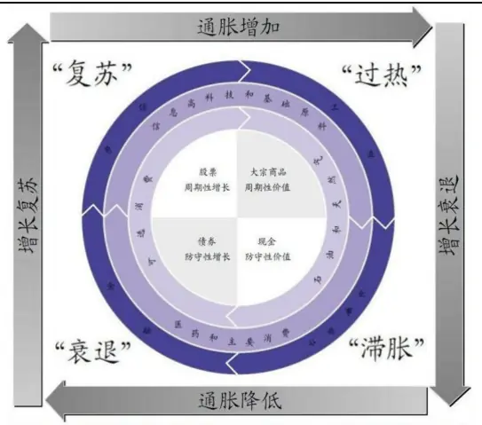
数据来源：广发证券研究发展中心

图 1 便是著名的美林投资时钟，不同资产和行业随着宏观周期的循环而在彼此之间不断地切换。根据美林的统计结果，越接近图形中间的资产类或行业，从统计检验所获得的支持就越高。该模型很好地解释了资产轮动，并对部分行业（如：可选消费、石油和天然气）的解释要好于另外一些（如：电信、公共事业等）。其对各个宏观周期的解读及相应的统计结果大致如下：

## 复苏阶段：

经济加速发展，通常在这一阶段，股票市场繁荣，现金贬值，首选大类资产是股票，其次是债券市场。通常在这一阶段，周期性成长股以及行业生命周期前导期的小市值股票大多被建议。

## 过热阶段：

在此阶段，物价飞涨，通现金贬值，政府通常进行加息或提高存款准备金，这样对利率较为敏感的债券将面临贬值，市场上大众商品成为主流的投资对象，与大众商品相关的股票成为了较好的选择。同时这一阶段，出于对通货膨胀的担忧，投资者对保值需求相当强烈，有色金属，矿业，房地产以及传统机械等周期性价值股将会成为市场投资的热点。

## 滞涨阶段：

这一阶段，通常面临经济危机，股票市场在经历上一阶段的泡沫经济后出现暴跌，现金开始成为最佳选择，没有行业能够获得绝对收益。相对而言，需求弹性较小的公用事业，医药将在这一阶段表现最好。

## 衰退阶段：

在这一阶段，股票疲软，大宗商品暴跌，整个市场处于降息的通道，收益率曲线在剧烈下降，故而大类资产方面，债券是唯一最佳选择。行业配臵层面上，防守性增长型股票如金融行业通常为投资所青睐。

## （二） 基于经济周期的量化因子分析框架

在前期报告《大浪淘沙，Alpha 因子何处寻？》中，我们基于多个指标对近 80 个Alpha 因子建立了完整的 Alpha 因子有效性度量体系，该体系考察的是Alpha因子的“静态”表现，即认为 Alpha 因子的预测预测能力相对比较稳定且可持续，然而在研究过程中，我们常常发现许多选股因子具有较大的波动性，甚至具备一定的周期性，因此本文将在前文的基础上，进一步挖掘 Alpha因子的周期性。

本文的研究思路框架分三步，如图 2所示：

首先，对经过预处理的因子数据以及个股收益数据进行统计分析，运用《大浪淘沙，Alpha 因子何处寻？》中提出的因子有效性度量体系计算得到每个因子的整体有效性，并基于其中的有效因子构造静态多因子策略；

其次，结合宏观经济周期的划分，挖掘宏观经济周期背后的风格因子轮动规律，并挑选不同周期下的有效 Alpha 因子；

最后，基于挑选出来的有效 Alpha 因子，构造动态多因子策略，通过比较动态策略与静态策略的表现，验证 Alpha 因子的轮动规律是否显著且有效。

图 2. 量化因子策略分析框架
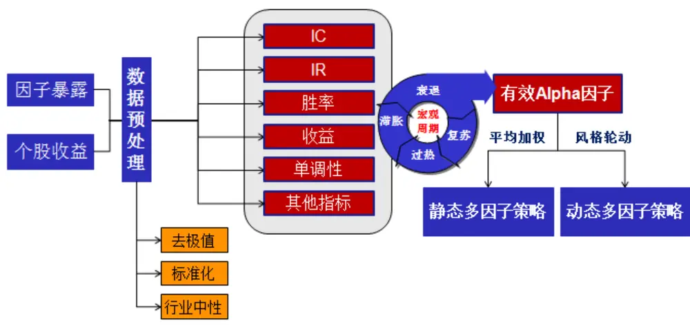
数据来源：广发证券研究发展中心

## 二、静态Alpha因子策略

本节我们将沿用《淘沙》的研究思路，在考虑更多样本数量和更多因子度量指标的基础上，再次挖掘有效的 Alpha 因子，并基于有效因子的静态加权构造相应的静态多因子策略，便于与下文的动态多因子策略进行比较。

## （一） Alpha因子统计分析

在《淘沙》的基础上，我们根据因子的有效性和可解释性筛选出 8类Alpha因子，它们分别为：盈利因子、成长性因子、杠杆因子、流动性因子、技术因子、规模因子、估值因子以及质量因子，共39个备选Alpha因子。其中，考虑到沪深两市中，金融行业股票所占市值比例较大，且金融类上市公司的盈利模式与其它行业有所区别，因此在运用运营类因子、现金流因子以及质量因子进行选股时，剔除了金融行业的股票，即表1中黄色背景标记的因子。

在因子的有效性度量上，主要采用了IC、组合收益率、组合胜率、LS_IR、IC_IR以及IC_P等指标， 样本数据以及各指标意义如下：

标的股票：中证800指数成分股。为了增加样本数量，确保宏观周期的完整性，我们在2000年至2007年中证800指数上市以前这段时间内，按照中证800指数的编制规则模拟其成分股，并将其作为沪深两市的代表。

样本期间：2000年1月31日-2011年10月30日共142个月。

基准指数：沪深300指数，为了增加样本数量同时确保宏观周期的完整性，我们在 2000 年至 2005 年沪深 300 指数上市以前这段时间内，按照沪深 300 指数的编制规则对指数进行模拟，以其作为策略的比较基准。

IC(信息系数)：即每个时点上，全部个股在因子上的暴露值与个股下期收益率的相关系数，用于度量因子的预测能力，IC绝对值越高则因子预测能力越强。

LS收益率：根据在因子上的暴露值进行从小到大的排序并等分为 5档，做多第5档同时做空第1档构成多空对冲组合，组合的平均月收益率用于衡量因子收益大小。

LS胜率：第5档战胜第1档的概率。

IR (信息比)：即因子多空组合年化收益率与组合年化标准差的比值，IR的绝对值越高，则因子在优选个股Alpha收益上效果越好。

IC_IR (信息比)：即因子平均IC与IC标准差的比值，IC_IR的绝对值越高，则因子在优选个股Alpha收益上效果越好。

IC_P (即 IC 的 t 检验 P 值)：用于衡量因子的 IC 是否显著，IC_P 越小，说明该因子的预测效果越显著，经统计发现，IC_P 小于 0.1 时，相应的 Alpha 因子具有较好的选股效果！

综合考虑上述 6 个度量指标，我们从各类因子中挑选出整体效果最显著的代表因子，组成共 15个有效因子，因子统计分析结果如表1 所示。

（蓝色背景：指标显著； 红色标号：因子显著。）

表 1. 全样本 Alpha 因子信息汇总表

| 因子分类 | 编号 | 因子描述 | IC | LS 收益率 | LS 胜率 | IR | IC_IR | IC_P |
| --- | --- | --- | --- | --- | --- | --- | --- | --- |
| 盈利 | 1 | 销售净利率 | 2.58% | 0.47% | 53.90% | 0.34 | 0.63 | 1.57% |
|  | 2 | ROE | 2.96% | 0.66% | 55.32% | 0.39 | 0.59 | 2.27% |
|  | 3 | ROA | 3.45% | 0.74% | 54.61% | 0.46 | 0.66 | 1.31% |
|  | 4 | 毛利率 | 1.41% | 0.35% | 54.61% | 0.39 | 0.47 | 5.30% |
|  | 5 | 净利润现金占比 | 1.19% | 0.29% | 60.28% | 0.53 | 0.94 | 0.08% |
| 成长 | 6 | 每股净资产增长 | 2.28% | 0.58% | 55.32% | 0.64 | 0.81 | 0.30% |
|  | 7 | ROE增长率 | 0.41% | 0.17% | 53.90% | 0.22 | 0.16 | 28.68% |
|  | 8 | 主营收入增长率 | 1.33% | 0.38% | 53.19% | 0.43 | 0.62 | 1.82% |
|  | 9 | EPS增长率 | 0.24% | 0.15% | 54.61% | 0.18 | 0.10 | 36.46% |
|  | 10 | 净利润增长率 | 0.17% | 0.16% | 53.90% | 0.17 | 0.07 | 41.16% |
|  | 11 | 总资产增长率 | 1.49% | 0.53% | 56.03% | 0.49 | 0.48 | 4.99% |
|  | 12 | 股东权益增长率 | 2.01% | 0.51% | 54.61% | 0.40 | 0.60 | 2.00% |
| 杠杆 | 13 | 流通股本/总股本 | -0.24% | 0.11% | 51.77% | 0.17 | 0.13 | 33.02% |
|  | 14 | 流通市值/总市值 | 0.21% | -0.17% | 48.94% | -0.24 | 0.11 | 65.01% |
|  | 15 | 负债/资产 | -2.32% | 0.48% | 54.61% | 0.58 | 0.77 | 0.48% |
| 流通 | 16 | 最近3个月成交量 | -0.88% | -0.23% | 43.97% | -0.18 | 0.23 | 78.47% |
|  | 17 | 成交金额 | -5.44% | 1.81% | 67.38% | 1.25 | 1.21 | 0.00% |
|  | 18 | 换手率 | -6.50% | 1.64% | 70.92% | 1.27 | 1.69 | 0.00% |
| 技术 | 19 | 一个月股价反转 | -4.79% | 1.20% | 62.41% | 0.88 | 1.03 | 0.03% |
|  | 20 | 三个月股价反转 | -4.05% | 1.00% | 57.45% | 0.63 | 0.77 | 0.45% |
|  | 21 | 六个月股价反转 | -1.93% | 0.50% | 53.19% | 0.32 | 0.34 | 11.95% |
| 规模 | 22 | 流通市值 | -2.61% | 0.70% | 53.19% | 0.41 | 0.46 | 5.84% |
|  | 23 | 流通股本 | -0.30% | -0.12% | 43.26% | -0.10 | 0.07 | 59.55% |
|  | 24 | 总资产 | 0.60% | 0.25% | 46.81% | 0.17 | 0.12 | 34.56% |
| 估值 | 25 | BP | 4.22% | 1.27% | 63.12% | 1.08 | 1.10 | 0.01% |
|  | 26 | 每股派息/股价 | 2.61% | 0.65% | 58.87% | 1.07 | 1.06 | 0.02% |

识别风险，发现价值

|  | 27 | SP | 2.44% | 0.90% | 61.70% | 1.23 | 1.10 | 0.01% |
| --- | --- | --- | --- | --- | --- | --- | --- | --- |
|  | 28 | CFP | 1.18% | 0.24% | 54.61% | 0.44 | 0.67 | 1.14% |
|  | 29 | EP | 3.06% | 0.81% | 53.19% | 0.73 | 0.86 | 0.19% |
| 质量 | 30 | 营业费用比例 | 0.21% | 0.09% | 54.61% | 0.10 | 0.08 | 60.13% |
|  | 31 | 总资产周转率 | 1.80% | 0.62% | 60.28% | 0.74 | 0.75 | 0.54% |
|  | 32 | 流动比率 | 0.76% | 0.44% | 56.03% | 0.59 | 0.37 | 10.44% |
|  | 33 | 速动比率 | 0.39% | 0.32% | 51.77% | 0.39 | 0.18 | 27.06% |
|  | 34 | 长期负债比率 | -0.28% | 0.13% | 49.65% | 0.18 | 0.14 | 68.25% |
|  | 35 | 每股负债比 | -0.19% | 0.02% | 48.94% | 0.03 | 0.08 | 39.61% |
|  | 36 | 固定比 | 0.13% | 0.17% | 53.19% | 0.23 | 0.06 | 42.46% |
|  | 37 | 流动负债率 | -0.43% | 0.21% | 53.19% | 0.24 | 0.15 | 30.84% |
|  | 38 | 财务费用比例 | -3.12% | 0.72% | 60.99% | 0.80 | 0.97 | 0.06% |
|  | 39 | 存货周转率 | -0.26% | 0.11% | 51.77% | 0.13 | 0.15 | 70.08% |

数据来源：广发证券研究发展中心

## （二） 基于静态加权的多因子策略

## 1. 策略及数据

根据挑选出来的 15 个有效 Alpha 因子，下面我们采用因子平均加权的方式构建多因子 Alpha 策略，策略规则如下：

静态策略：每一期观察全部个股在 15 个有效Alpha因子上的因子暴露，以因子暴露的平均加权值作为个股的预测 Alpha，再根据预测 Alpha 对个股进行从小到大排序并等分为 5 档， Alpha 最高的第 5 档，称为多头组合，Alpha 最低的第 1 档，称为空头组合，再构造因子对冲策略时，考虑到目前国内个股做空机制尚不完善，我们以多头组合及基准指数构成多空对冲组合进行跟踪。图 3 中的“超额收益率”即多头组合相对基准指数的超额收益率。

## 2. 策略表现

根据上述策略规则，我们对多空对冲组合的表现进行跟踪，得到回测结果如下图3 所示：

图 3. 静态策略表现
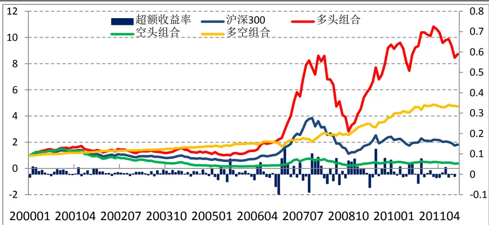
识别风险，发现价值

数据来源：广发证券研究发展中心

全样本来看，该策略组合具有较好的性质，11年间对冲组合信息比IR高达1.174，年化收益率接近14%，年化波动率为12%，最大回撤17.3%；若进一步观察该策略在其他时间段的表现，我们发现自中证800上市以来，该策略的表现更加突出，IR高达1.44；美中不足的是该策略今年的表现出现了大幅下滑，IR甚至小于0。

表 2. 静态策略各阶段表现

| 加权方式 | IR | 年化收益率 | 年化波动率 | 最大回撤 |
| --- | --- | --- | --- | --- |
| 2000年以来 | 1.174 | 13.98% | 11.90% | -17.34% |
| 中证 800 上市以来 | 1.439 | 19.95% | 13.87% | -7.77% |
| 2011年 | -0.119 | -0.70% | 5.85% | -7.77% |

数据来源：广发证券研究发展中心

## 三、透过宏观周期观察Alpha因子

前面提到静态多因子策略的效果虽然突出，但由于采用固定的有效因子以及静态的因子权重，因此无法克服部分因子存在周期性失效的问题，缺乏灵活性，本节的目标是希望通过观察宏观周期背后因子的轮动规律，从而建立动态的多因子轮动策略。

## （一） 国内宏观周期划分

观察风格因子的轮动周期，首先必须明确周期的概念，即如何对经济周期进行准确的划分，该问题一直为众多学者所热议，也是存在较大争议的一个课题，各种流派都有其独特的方法，截至目前善未有一套统一的划分标准，本文目的不在于找出更合理的周期划分方法，因此，本文参考了大量的研究成果，并最终采用目前比较主流的划分结果，把我国自2000年至2011年10月份按照四个宏观周期进行如下划分：

表 3. 我国经济周期划分

| 复苏 | 过热 | 滞胀 | 衰退 |
| --- | --- | --- | --- |
|  | 2000/1-2000/8 | 2000/9-2001/5 | 2001/6-2001/11 |
| 2001/12-2002/5 | 2002/6-2003/12 | 2004/1-2004/8 | 2004/9-2005/3 |
| 2005/4-2006/3 | 2006/4-2007/11 | 2007/12-2008/4 | 2008/5-2008/11 |
| 2008/12-2009/7 | 2009/8-2009/11 | 2009/12-2011/7 | 2011/8-2011/10 |

数据来源：广发证券研究发展中心

图 4. 经济周期及 A股走势
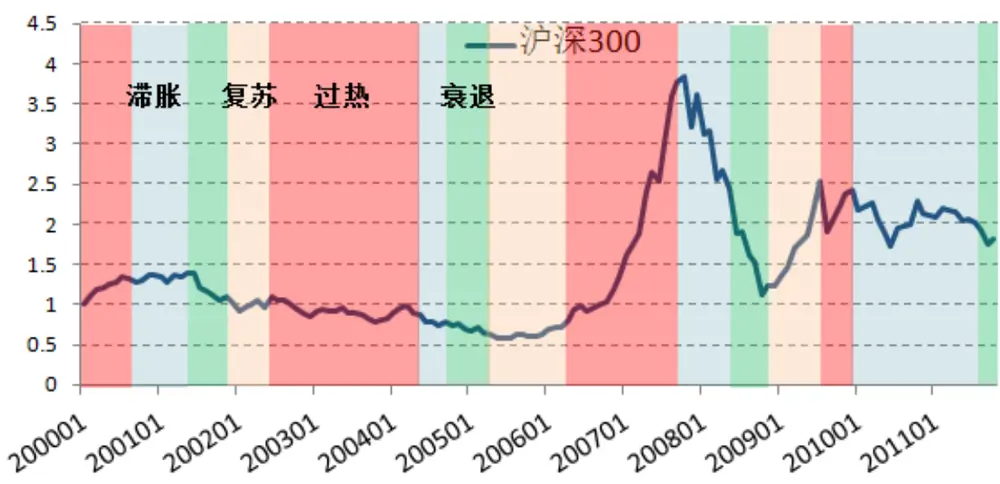
数据来源：广发证券研究发展中心

## （二） Alpha因子的周期轮动

基于上述对我国经济周期的划分结果，是否能够察觉Alpha因子的轮动规律？首先我们从直观的角度进行观察，以规模因子中的“流动市值”因子为例，下图显示了该因子在不同宏观周期下的IC， 可以较清楚地看到，在复苏期和滞胀期，规模因子的IC为负的居多，体现为小规模股票的表现突出，而在过热期和衰退期，规模因子对个股收益不具备区分度，因此在这两个周期内规模因子失效！那么，直观的结论与因子的实际风格轮动是否一致？其他量化选股因子的风格轮动是否与宏观周期也存在一定联系？

图 5. 流通市值周期性明显
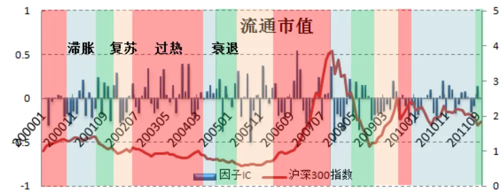
数据来源：广发证券研究发展中心

下面我们将根据上述划分的宏观周期，统计全部Alpha因子在不同宏观周期下的表现：

## 1. 盈利因子

盈利因子共包含5个为：销售净利率、ROE、ROA、毛利率以及净利润现金占比，根据统计结果，从历史全样本来看，盈利因子中预测能力最强的是ROA及ROE，其IC分别为3.5%和3%，根据划分宏观周期观察，盈利因子在复苏期基本失效，而在衰退周期表现最为突出。

根据各经济周期的特征，在衰退周期中，由于收益率曲线在剧烈下降，因此具备较确切盈利预期的个股将具备较好的防御性，从而容易受到投资者的青睐。

图1：盈利因子周期轮动
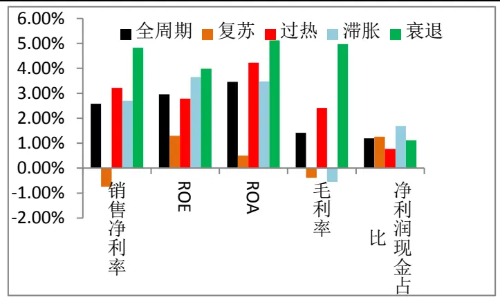
数据来源：广发证券研究发展中心

## 2. 成长因子

成长因子共包含7个为：每股净资产增长率、ROE增长率、主营收入增长率、EPS增长率、净利润增长率、总资产增长率以及股东权益增长率，从历史全样本周期来看，成长因子的整体预测能力并不是特别显著，仅有“每股净资产增长率”IC大于2%，该因子在滞胀期的表现相对突出，IC接近3%。

图 6. 成长因子周期轮动
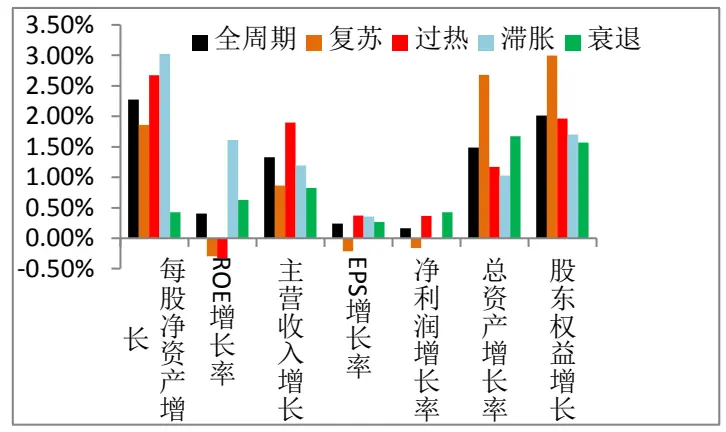
数据来源：广发证券研究发展中心

## 3. 杠杆因子

杠杆因子共选用3个为：流通股本/总股本、流通市值/总市值以及资产负债率。销售净利率、ROE、ROA、毛利率以及净利润现金占比。从历史全样本周期来看，杠杆因子中仅有“资产负债率”表现出一定的预测效果。

滞胀和衰退经济周期内，由于股票市场在经历上一阶段的泡沫经济后开始出现暴跌，与此同时GDP的增长率也出现下降，企业的盈利也随之恶化，因此市场更加倾向投资自有资本充裕，负债结构相对合理的个股，因此在这两个阶段可以看到“资产负债率”因子的预测能力有大幅的提高；而在复苏期，由于企业需要大量现金用于扩大生产及丰富其盈利模式，因此投资者在该周期不介意上市公司承担较高的债务风险。

图 7. 杠杆因子周期轮动
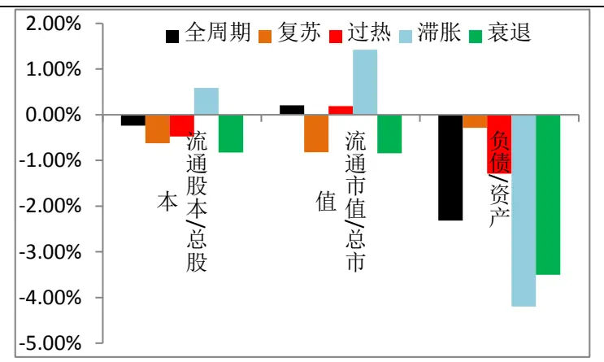
数据来源：广发证券研究发展中心

## 4. 流动因子

流动因子共选用3个为：最近3个月成交量、最近1个月成交金额以及最近1个月平均换手率，从历史全样本周期来看，最近1个月成交金额以及最近一个月平均换手率的表现非常突出，其平均IC基本保持在4%以上，出了在复苏期以外，因子的表现也依然强劲，可见A股市场上，投资者对于受到过度炒作的个股一贯持慎重的态度。

图 8. 流动性因子周期轮动
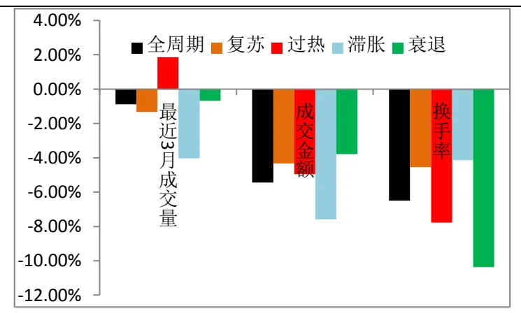
数据来源：广发证券研究发展中心
识别风险，发现价值

## 5. 技术因子

技术因子分别选用了1个月股价反转、3个月股价反转以及6个月股价反转，从历史全样本来看，“1个月股价反转”的表现最为突出，这一定程度上也反映出A股市场上投资者的情绪还是相对急躁的。

从经济周期角度观察，在复苏期，由于经济加速发展，股票市场逐步进入繁荣阶段，可以看到股价反转因子在该时期预测能力有大幅的提高。另外，从IC的均值检验结果来看，不同经济周期下，该因子的有效性均显著，即具有较好的预测效果。

图 9. 技术因子周期轮动
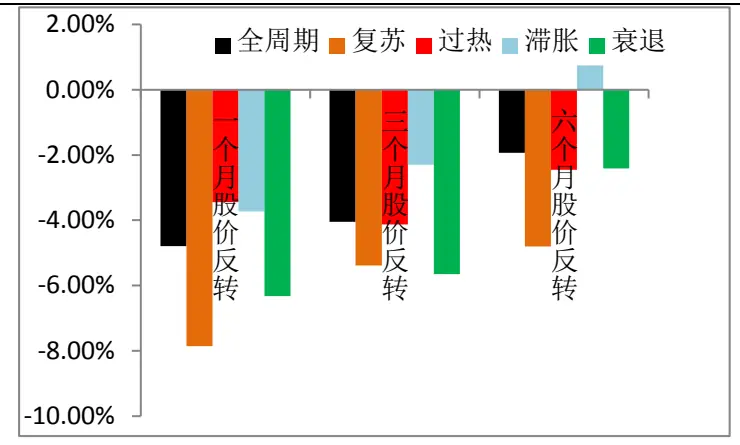
数据来源：广发证券研究发展中心

## 6. 规模因子

规模因子我们选用了3个为：流通市值、流通股本以及总资产，其中流通市值近些年来广为投资者所关注，根据我们的统计分析，“流通市值”的确具有一定的预测能力，但并非是一个持续稳定的选股因素，该因子在过热以及衰退经济周期下中明显失效，而在复苏以及滞胀期则表现尤为活跃。

我们分析认为，在复苏期由于经济的快速发展带动股市进入繁荣时期，因此具有高弹性的小市值股票往往成为人们首推的股票，2009上半年的A股市场中，小盘子个股便受到热捧。而在过热期，由于物价飞涨，现金贬值，处于对通货膨胀的担忧，投资者的保值需求相当强烈，有色金属，矿业，房地产以及传统机械等周期性价值股将会成为市场投资的热点，这个阶段中游行业和大市值权重股开始会有较好行情，因而规模因子基本失效。而在滞胀期，规模因子预测能力最为突出，最具代表性的便是2010年的小盘股行情。

图 10. 规模因子周期轮动
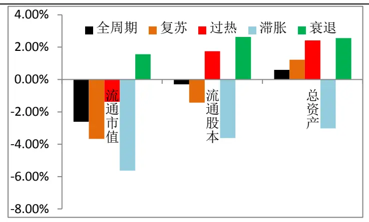
数据来源：广发证券研究发展中心

## 7. 估值因子

估值因子共包含5个为：BP、每股派息／股价、SP、CFP以及EP，从权样本周期来看，BP和EP的整体预测效果最佳，从不同经济周期来看，滞胀期所有股值因子基本失效，滞胀期“现金为王”的观点在CFP（股价／每股现金流）上也没有得到很好的解释，值得一提的是，BP以及EP在其他三个周期都收到很大关注，CFP仅在复苏期具有很好的选股效应，这与可能与复苏期经济快速，企业需要大量现金用于扩大生产及丰富其盈利模式有关。

图 11. 估值因子周期轮动
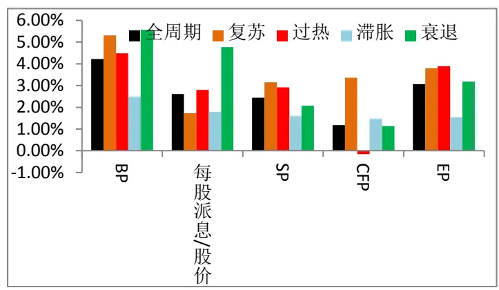
数据来源：广发证券研究发展中心

## 8. 质量因子

质量因子数量最多，共包含10个为：营业费用比例，总资产周转率、流动比率、速动比率、长期负债比率、每股负债比率、固定比、流动负债率、财务费用比例以及存货周转率。从全样本周期来看，其中的“总资产周转率”及“财务费用比例”具备较好的预测能力和稳定性，其中，前者在不同宏观周期下的表现不存在明显的差异，而后者则在复苏期失效，我们认为这可能同样与复苏期经济快速，企业需要大量现金用于扩大生产及丰富其盈利模式有关，而通过贷款融资无疑是取得现金最直接的办法，在衰退期，虽然市场处于降息的通道，但收益率的剧烈下降使得企业难以承受较大的财务费用，因此该时期投资者青睐于财务费用比例较低的个股。

图 12. 质量因子周期轮动
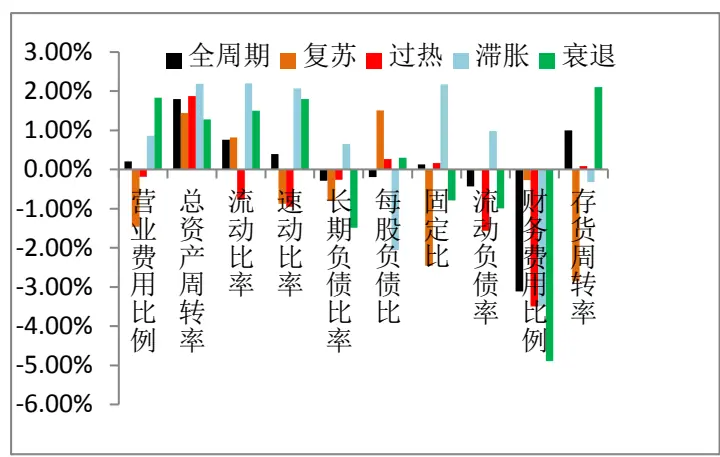
数据来源：广发证券研究发展中心

## （三） 不同经济周期下的风格轮动

上一小节我们对各个 Alpha 因子在不同经济周期表现的统计，并得到了一些因子的风格轮动规律，那么在各个经济周期下，因子之间的比较相对有效性又是如何呢？下面我们给出不同经济周期下风格因子的表现对比，以便于我们挑选特定经济周期下的有效 Alpha 因子，进而建立动态的多因子策略。

根据统计结果，复苏期有效因子较少，仅有股价反转、换手率以及估值等少数Alpha因子具有较好的预测效果；过热期和滞胀期因子的预测能力显著，部分盈利因子及质量因子也有不俗的表现，而到了衰退期，有效因子的数量虽然不多，但部分因子的预测能力在该周期却迎来爆发性提高，比如换手率因子在衰退期的平均IC高达10%以上。

图 13. 复苏期因子 IC
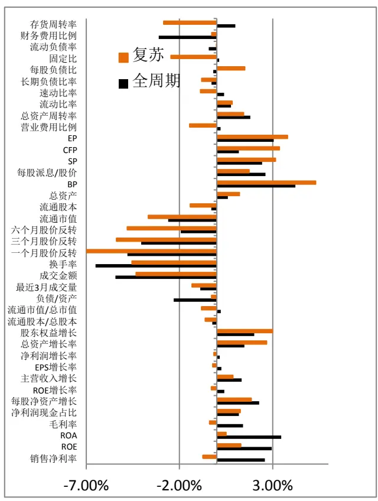

图 14. 过热期因子 IC
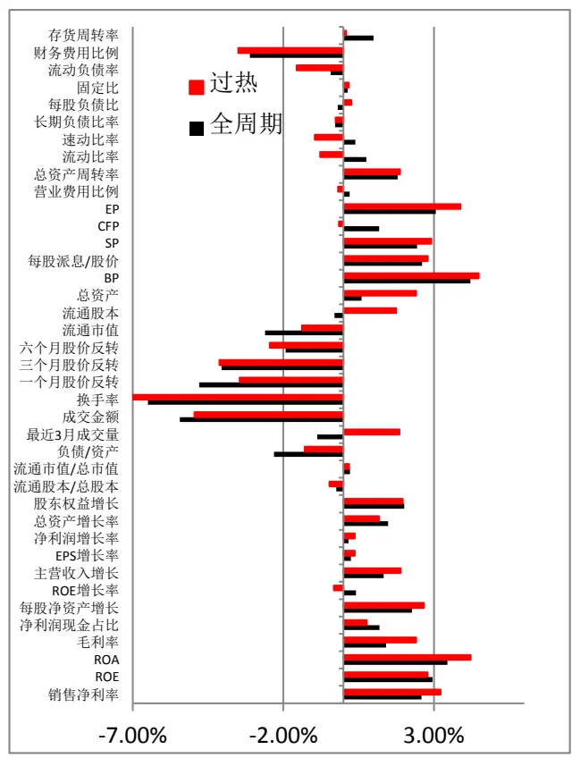
数据来源：广发证券研究发展中心

图 15. 滞胀期因子 IC
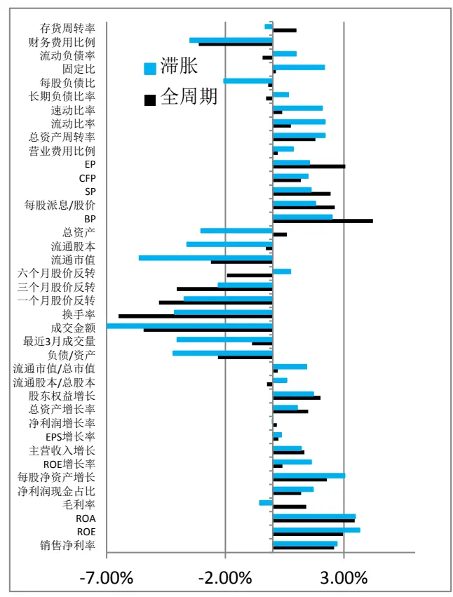

图 16. 衰退期因子 IC
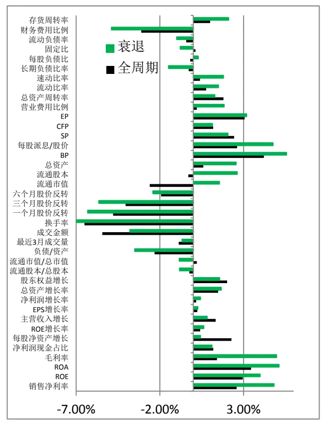
识别风险，发现价值

## （四） 周期内有效因子挑选

本小节对第三部分前面工作的汇总，在前三小节中，我们首先对我国经济周期进行划分，接着在此基础上分别从Alpha因子以及经济周期的角度观察和分析了因子的周期性及风格轮动规律，接下来便是如何挑选各个经济周期下的有效因子。

在度量因子有效性时，我们依然沿用《大浪淘沙、Alpha因子何处寻？》中提倡的多个指标相结合的方式，并主要考虑两个指标：平均IC和IC_P，当IC_P小于0.1，或者平均IC大于5%时，挑选该因子作为相应周期下的有效因子，表4是所有Alpha因子在不同周期下的表现，表5为不同经济周期下挑选出来的有效因子。

（红色：指标显著。）
表 4. 全样本分周期 Alpha 因子信息表

| 因子分类 | 编号 | 因子描述 | IC |  |  |  |  | IC_P |  |  |  |
| --- | --- | --- | --- | --- | --- | --- | --- | --- | --- | --- | --- |
|  |  |  | 全样本 | 复苏 | 过热 | 滞胀 | 衰退 | 复苏 | 过热 | 滞胀 | 衰退 |
| 盈利 | 1 | 销售净利率 | 2.6% | -0.7% | 3.2% | 2.7% | 4.8% | 60.5% | 5.6% | 10.1% | 7.5% |
|  | 2 | ROE | 3.0% | 1.3% | 2.8% | 3.7% | 4.0% | 37.0% | 14.2% | 5.8% | 15.3% |
|  | 3 | ROA | 3.5% | 0.5% | 4.2% | 3.5% | 5.1% | 44.9% | 6.2% | 7.9% | 11.4% |
|  | 4 | 毛利率 | 1.4% | -0.4% | 2.4% | -0.6% | 5.0% | 57.6% | 4.6% | 64.7% | 3.3% |
|  | 5 | 净利润现金占比 | 1.2% | 1.3% | 0.8% | 1.7% | 1.1% | 3.9% | 13.1% | 1.3% | 8.8% |
| 成长 | 6 | 每股净资产增长 | 2.3% | 1.9% | 2.7% | 3.0% | 0.4% | 19.3% | 2.0% | 3.7% | 40.3% |
|  | 7 | ROE增长率 | 0.4% | -0.3% | -0.3% | 1.6% | 0.6% | 55.4% | 63.3% | 10.6% | 38.4% |
|  | 8 | 主营收入增长率 | 1.3% | 0.9% | 1.9% | 1.2% | 0.8% | 33.4% | 3.6% | 10.2% | 29.5% |
|  | 9 | EPS 增长率 | 0.2% | -0.2% | 0.4% | 0.4% | 0.3% | 54.1% | 36.6% | 37.3% | 44.8% |
|  | 10 | 净利润增长率 | 0.2% | -0.2% | 0.4% | 0.0% | 0.4% | 52.9% | 37.5% | 50.6% | 42.1% |
|  | 11 | 总资产增长率 | 1.5% | 2.7% | 1.2% | 1.0% | 1.7% | 14.3% | 23.1% | 23.3% | 22.5% |
|  | 12 | 股东权益增长率 | 2.0% | 3.0% | 2.0% | 1.7% | 1.6% | 14.3% | 11.5% | 17.0% | 21.1% |
| 杠杆 | 13 | 流通股本/总股本 | -0.2% | -0.6% | -0.5% | 0.6% | -0.8% | 30.2% | 32.0% | 71.5% | 22.6% |
|  | 14 | 流通市值/总市值 | 0.2% | -0.8% | 0.2% | 1.4% | -0.8% | 24.9% | 57.3% | 92.5% | 22.3% |
|  | 15 | 负债/资产 | -2.3% | -0.3% | -1.3% | -4.2% | -3.5% | 44.1% | 14.3% | 2.0% | 6.7% |
| 流动 | 16 | 最近3个月成交量 | -0.9% | -1.3% | 1.9% | -4.0% | -0.7% | 69.7% | 17.7% | 97.6% | 61.0% |
|  | 17 | 成交金额 | -5.4% | -4.3% | -5.0% | -7.6% | -3.8% | 11.2% | 1.9% | 0.0% | 11.9% |
|  | 18 | 换手率 | -6.5% | -4.6% | -7.8% | -4.1% | -10.4% | 5.8% | 0.0% | 2.2% | 0.1% |
| 技术 | 19 | 一个月股价反转 | -4.8% | -7.9% | -3.4% | -3.7% | -6.3% | 3.0% | 5.0% | 4.3% | 6.0% |
|  | 20 | 三个月股价反转 | -4.1% | -5.4% | -4.1% | -2.3% | -5.6% | 12.1% | 5.2% | 14.3% | 10.9% |
|  | 21 | 六个月股价反转 | -1.9% | -4.8% | -2.5% | 0.7% | -2.4% | 16.8% | 18.8% | 63.6% | 29.8% |
| 规模 | 22 | 流通市值 | -2.6% | -3.7% | -1.4% | -5.6% | 1.6% | 19.1% | 32.7% | 1.1% | 63.8% |
|  | 23 | 流通股本 | -0.3% | -1.4% | 1.8% | -3.6% | 2.6% | 69.6% | 20.6% | 95.2% | 20.8% |
|  | 24 | 总资产 | 0.6% | 1.2% | 2.4% | -3.0% | 2.6% | 35.8% | 18.3% | 86.3% | 23.5% |
| 估值 | 25 | BP | 4.2% | 5.3% | 4.5% | 2.5% | 5.6% | 1.4% | 0.8% | 15.1% | 2.1% |
|  | 26 | 每股派息/股价 | 2.6% | 1.7% | 2.8% | 1.8% | 4.8% | 12.5% | 1.0% | 10.2% | 1.2% |
|  | 27 | SP | 2.4% | 3.2% | 2.9% | 1.6% | 2.1% | 2.5% | 0.3% | 11.1% | 9.2% |
|  | 28 | CFP | 1.2% | 3.4% | -0.2% | 1.5% | 1.1% | 0.1% | 58.2% | 11.1% | 16.4% |
|  | 29 | EP | 3.1% | 3.8% | 3.9% | 1.5% | 3.2% | 5.0% | 2.0% | 21.5% | 11.0% |

识别风险，发现价值

| 质量 | 30 | 营业费用比例 | 0.2% | -1.5% | -0.2% | 0.9% | 1.8% | 24.7% | 42.4% | 67.4% | 85.3% |
| --- | --- | --- | --- | --- | --- | --- | --- | --- | --- | --- | --- |
|  | 31 | 总资产周转率 | 1.8% | 1.4% | 1.9% | 2.2% | 1.3% | 20.1% | 4.8% | 4.4% | 26.4% |
|  | 32 | 流动比率 | 0.8% | 0.8% | -0.8% | 2.2% | 1.5% | 25.9% | 84.4% | 6.1% | 17.4% |
|  | 33 | 速动比率 | 0.4% | -0.9% | -1.0% | 2.1% | 1.8% | 73.1% | 88.6% | 8.5% | 14.2% |
|  | 34 | 长期负债比率 | -0.3% | -0.8% | -0.3% | 0.7% | -1.5% | 71.5% | 61.4% | 29.7% | 84.6% |
|  | 35 | 每股负债比 | -0.2% | 1.5% | 0.3% | -2.1% | 0.3% | 86.3% | 58.5% | 9.9% | 58.8% |
|  | 36 | 固定比 | 0.1% | -2.5% | 0.2% | 2.2% | -0.8% | 95.1% | 44.8% | 3.2% | 68.9% |
|  | 37 | 流动负债率 | -0.4% | 0.0% | -1.6% | 1.0% | -1.0% | 49.6% | 12.8% | 71.8% | 32.0% |
|  | 38 | 财务费用比例 | -3.1% | -0.3% | -3.5% | -3.5% | -4.9% | 44.8% | 0.7% | 3.6% | 4.1% |
|  | 39 | 存货周转率 | -0.3% | -2.8% | 0.1% | -0.3% | 2.1% | 98.9% | 45.9% | 67.5% | 7.8% |

数据来源：广发证券研究发展中心

表 5. 各宏观周期下有效 Alpha 因子

| 编号 | 复苏 | 过热 | 滞胀 | 衰退 |
| --- | --- | --- | --- | --- |
| 1 | 净利润现金占比 | 销售净利率 | ROE | 销售净利率 |
| 2 | 换手率 | ROA | ROA | ROA |
| 3 | 一个月股价反转 | 毛利率 | 净利润现金占比 | 毛利率 |
| 4 | 三个月股价反转 | 每股净资产增长 | 每股净资产增长 | 净利润现金占比 |
| 5 | BP | 主营收入增长率 | 负债/资产 | 负债/资产 |
| 6 | SP | 成交金额 | 成交金额 | 成交金额 |
| 7 | CFP | 换手率 | 换手率 | 换手率 |
| ∞ | EP | 一个月股价反转 | 一个月股价反转 | 一个月股价反转 |
| 9 |  | 三个月股价反转 | 流通市值 | BP |
| 10 |  | BP | 总资产周转率 | 每股派息/股价 |
| 11 |  | 每股派息/股价 | 流动比率 | SP |
| 12 |  | SP | 速动比率 | 财务费用比例 |
| 13 |  | EP | 每股负债比 | 存货周转率 |
| 14 |  | 总资产周转率 | 固定比 |  |
| 15 |  | 财务费用比例 | 财务费用比例 |  |

数据来源：广发证券研究发展中心

## 四、基于宏观周期的Alpha因子轮动策略

在第三部分中，我们参考美林投资时钟的研究思路，通过对宏观周期划分为复苏、过热、滞胀以及衰退四个阶段，统计了各个宏观周期下因子的动态轮动，进而结合各个经济周期以及Alpha因子的特性对因子的周期性及风格轮动特征进行了分析。本节中，我们的目标是希望通过实证分析来进一步验证上述分析的准确性，为此，下面首先根据第三部分所总结的因子的轮动规律设计相应的动态因子轮动策略，并通过对比静态多因子策略和动态多因子策略的表现，检验宏观周期与Alpha因子风格轮动的关联性，从而也进一步验证上文结论的准确性。

总结而言，本节的研究思路和研究目标可以用图17的分析框架图进行说明。

图 17. 实证分析框架
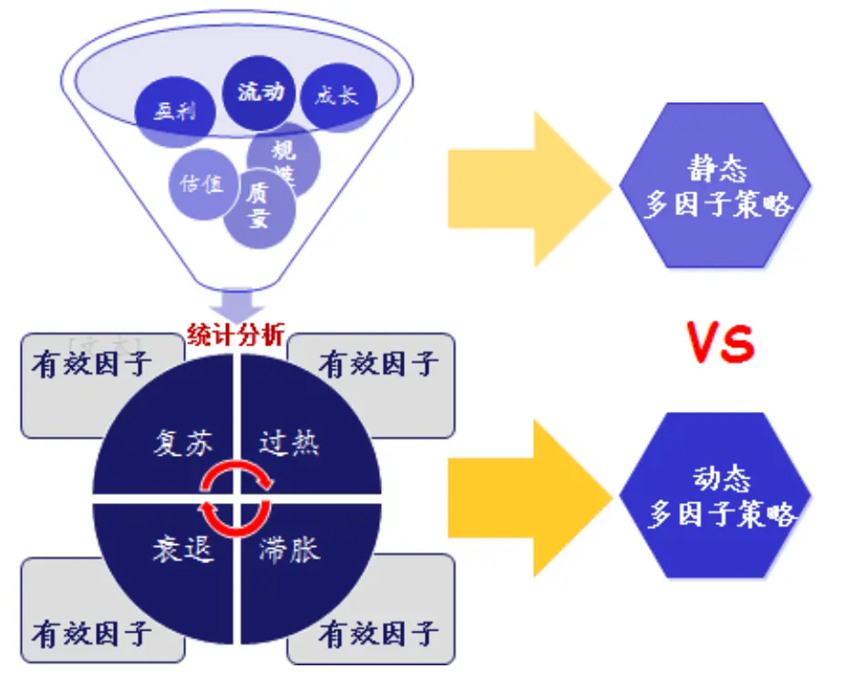
数据来源：广发证券研究发展中心

## （一） 考虑宏观周期的Alpha因子统计分析

下面首先统计全部备选因子在样本内（2000/1至2008/12）不同宏观周期下的表现，样本数居及指标意义如下：

标的股票：同样使用扩展到2000年的中证800指数成分股。

样本期间：样本内数据：2000年1月31日-2008年12月31日共107个月；样本外数据：2009年1月31日-2011年10月30日共35个月。

基准指数：沪深300指数，在 2000年至2005年沪深300指数上市以前这段时间内，按照沪深300指数的编制规则对指数进行模拟，以其作为多因子策略的比较基准。

IC(信息系数)：即每个时点上，全部个股在因子上的暴露值与个股下期收益率的相关系数，用于度量因子的预测能力，IC绝对值越高则因子预测能力越强。

IC_P (即 IC 的 t 检验 P 值)：用于衡量因子的 IC 是否显著，IC_P 越小，说明该因子的预测效果越显著，经统计发现，IC_P 小于 0.1 时，相应的 Alpha 因子具有较好的选股效果！

（蓝色背景、红色字体：指标显著）

表 6. 样本内分周期 Alpha 因子信息汇总表

| 因子分类 | 编号 | 因子描述 | IC |  |  |  |  | IC_P |  |  |  |
| --- | --- | --- | --- | --- | --- | --- | --- | --- | --- | --- | --- |
|  |  |  | 全样本 | 复苏 | 过热 | 滞胀 | 衰退 | 复苏 | 过热 | 滞胀 | 衰退 |
| 盈利 | 1 | 销售净利率 | 3.8% | 0.2% | 3.6% | 6.2% | 5.2% | 47.8% | 4.9% | 5.2% | 7.7% |
|  | 2 | ROE | 3.5% | 2.2% | 2.7% | 5.2% | 4.8% | 32.5% | 16.3% | 9.7% | 12.8% |
|  | 3 | ROA | 4.1% | 1.2% | 4.2% | 4.6% | 6.2% | 40.2% | 7.9% | 12.8% | 9.2% |
|  | 4 | 毛利率 | 2.0% | 0.0% | 2.5% | 0.9% | 4.4% | 49.2% | 5.1% | 32.7% | 6.4% |
|  | 5 | 净利润现金占比 | 1.1% | 0.7% | 0.8% | 2.5% | 1.0% | 11.2% | 15.1% | 1.2% | 12.9% |
| 成长 | 6 | 每股净资产增长 | 3.0% | 2.6% | 2.7% | 5.7% | 1.4% | 16.0% | 2.4% | 2.8% | 22.7% |
|  | 7 | ROE增长率 | 0.2% | 0.6% | -0.6% | 0.6% | 1.1% | 41.3% | 72.9% | 39.0% | 30.0% |
|  | 8 | 主营收入增长率 | 1.3% | 1.5% | 1.9% | 0.0% | 1.4% | 27.1% | 4.8% | 50.8% | 19.0% |
|  | 9 | EPS 增长率 | 0.0% | 0.6% | 0.2% | -1.5% | 0.8% | 40.1% | 44.2% | 82.6% | 34.8% |
|  | 10 | 净利润增长率 | 0.0% | 0.7% | 0.1% | -1.7% | 1.0% | 39.7% | 45.2% | 81.3% | 32.8% |
|  | 11 | 总资产增长率 | 2.0% | 3.2% | 1.3% | 1.6% | 2.7% | 14.9% | 21.5% | 24.8% | 12.4% |
|  | 12 | 股东权益增长率 | 2.9% | 4.2% | 2.1% | 3.9% | 2.4% | 10.9% | 11.2% | 10.9% | 12.5% |
| 杠杆 | 13 | 流通股本/总股本 | -0.7% | -0.6% | -0.9% | -0.3% | -0.6% | 30.6% | 18.4% | 41.9% | 31.3% |
|  | 14 | 流通市值/总市值 | -0.1% | -0.9% | -0.2% | 1.2% | -0.6% | 24.1% | 41.4% | 76.7% | 31.0% |
|  | 15 | 负债/资产 | -2.7% | -0.8% | -1.1% | -7.2% | -3.8% | 35.2% | 19.9% | 0.3% | 6.9% |
| 流通 | 16 | 最近3个月成交量 | 0.3% | -1.2% | 2.9% | -2.2% | -1.3% | 67.6% | 8.5% | 82.5% | 69.5% |
|  | 17 | 成交金额 | -5.1% | -4.6% | -4.4% | -8.5% | -3.8% | 12.1% | 4.2% | 0.2% | 14.2% |
|  | 18 | 换手率 | -7.0% | -4.1% | -7.9% | -4.9% | -10.1% | 11.2% | 0.0% | 4.9% | 0.1% |
| 技术 | 19 | 一个月股价反转 | -5.0% | -8.5% | -3.1% | -4.8% | -6.2% | 4.7% | 8.4% | 4.2% | 8.4% |
|  | 20 | 三个月股价反转 | -4.2% | -5.3% | -3.9% | -3.4% | -4.9% | 16.3% | 7.8% | 11.5% | 16.1% |
|  | 21 | 六个月股价反转 | -2.1% | -4.8% | -2.3% | 0.5% | -1.4% | 20.6% | 21.8% | 58.3% | 38.8% |
| 规模 | 22 | 流通市值 | -2.0% | -3.7% | -0.6% | -6.3% | 1.1% | 22.6% | 42.2% | 4.6% | 59.2% |
|  | 23 | 流通股本 | 0.5% | -1.7% | 2.5% | -2.5% | 1.4% | 70.6% | 13.2% | 80.9% | 33.9% |
|  | 24 | 总资产 | 1.9% | 1.0% | 3.5% | -0.4% | 1.6% | 38.6% | 10.9% | 54.9% | 33.3% |
| 估值 | 25 | BP | 5.1% | 4.3% | 4.7% | 7.5% | 4.5% | 6.7% | 0.9% | 0.2% | 5.2% |
|  | 26 | 每股派息/股价 | 3.2% | 0.8% | 2.9% | 5.1% | 4.2% | 30.4% | 1.2% | 0.3% | 2.2% |
|  | 27 | SP | 2.7% | 2.1% | 3.0% | 3.2% | 2.0% | 11.8% | 0.5% | 1.9% | 9.8% |
|  | 28 | CFP | 1.2% | 2.6% | -0.2% | 3.1% | 0.8% | 0.7% | 60.4% | 0.2% | 26.2% |
|  | 29 | EP | 3.4% | 3.1% | 4.0% | 3.5% | 2.5% | 12.1% | 2.5% | 4.6% | 18.1% |
| 质量 | 30 | 营业费用比例 | -0.4% | -1.8% | -0.7% | -0.7% | 2.0% | 13.0% | 23.4% | 27.8% | 85.8% |
|  | 31 | 总资产周转率 | 1.5% | 0.8% | 1.4% | 1.9% | 2.3% | 34.0% | 12.0% | 13.6% | 13.7% |
|  | 32 | 流动比率 | 0.7% | 1.1% | -1.0% | 3.1% | 1.9% | 22.8% | 89.6% | 2.8% | 11.9% |
|  | 33 | 速动比率 | 0.2% | -0.7% | -1.3% | 2.8% | 2.0% | 68.5% | 94.0% | 2.3% | 13.3% |
|  | 34 | 长期负债比率 | 0.2% | -0.5% | 0.5% | 1.4% | -1.2% | 65.5% | 28.5% | 11.0% | 77.5% |
|  | 35 | 每股负债比 | 0.0% | 1.4% | 0.6% | -2.8% | 0.2% | 12.5% | 31.1% | 93.7% | 45.0% |
|  | 36 | 固定比 | 0.4% | -2.5% | 0.6% | 3.9% | -0.8% | 96.5% | 30.8% | 0.7% | 68.6% |
|  | 37 | 流动负债率 | -1.3% | -0.2% | -2.2% | -1.3% | -0.2% | 45.0% | 6.3% | 23.3% | 45.8% |
|  | 38 | 财务费用比例 | -3.5% | 0.3% | -3.2% | -6.2% | -5.3% | 54.5% | 1.6% | 2.8% | 4.4% |
|  | 39 | 存货周转率 | 0.1% | -2.9% | 0.3% | 0.7% | 2.2% | 97.2% | 38.0% | 22.0% | 9.2% |

数据来源：广发证券研究发展中心

## （二） 基于风格轮动的动态多因子策略

根据每个宏观周期下挑选出来的有效Alpha因子，再采用因子平均加权的方式构建多因子Alpha策略，策略规则如下：

因子挑选：主要考虑两个指标：平均IC和IC_P，当IC_P小于0.1，或者平均IC绝对

值大于5%时，挑选该因子作为相应周期下的有效因子。

动态策略：每一期观察全部个股在当前有效Alpha因子上的因子暴露，以因子暴露的平均加权值作为个股的预测Alpha，再根据预测Alpha对个股进行从小到大排序并等分为5档，Alpha最高的一档称为多头组合，最低一档称为空头组合，另外再以多头组合及基准指数构成多空对冲组合进行跟踪。

观察IC和IC_P两个指标，根据因子挑选规则，得到各个周期下有效因子如表6所示。

表 7. 样本内各宏观周期下有效 Alpha 因子

|  | 复苏 | 过热 | 滞胀 | 衰退 |
| --- | --- | --- | --- | --- |
| 1 | 一个月股价反转 | 销售净利率 | 销售净利率 | 销售净利率 |
| 2 | 三个月股价反转 | ROA | ROE | ROA |
| 3 | BP | 毛利率 | 净利润现金占比 | 毛利率 |
| 4 | CFP | 每股净资产增长 | 每股净资产增长 | 负债/资产 |
| 5 |  | 主营收入增长率 | 负债/资产 | 换手率 |
| 6 |  | 最近3个月成交量 | 成交金额 | 一个月股价反转 |
| 7 |  | 成交金额 | 换手率 | BP |
| 8 |  | 换手率 | 一个月股价反转 | 每股派息/股价 |
| 9 |  | 一个月股价反转 | 流通市值 | SP |
| 10 |  | 三个月股价反转 | BP | 财务费用比例 |
| 11 |  | BP | 每股派息/股价 | 存货周转率 |
| 12 |  | 每股派息/股价 | SP |  |
| 13 |  | SP | CFP |  |
| 14 |  | EP | EP |  |
| 15 |  | 流动负债率 | 流动比率 |  |
| 16 |  | 财务费用比例 | 速动比率 |  |
| 17 |  |  | 固定比 |  |
| 18 |  |  | 财务费用比例 |  |

数据来源：广发证券研究发展中心

## （三） 动态策略表现

根据上述样本内统计得到各周期下有效因子，采用动态多因子策略对样本外数据进行模拟跟踪，得到回测结果如下图1所示。

观察动态多因子策略在样本外数据的回测情况，自2009年以来的34个月中，对冲组合信息比IR高达1.533，年化收益率接近21%，年化波动率为13.7%，最大回撤-8.5%；今年以来该策略今年仍然有积极的表现，信息比IR为0.365，年化收益率接近2.2%，年化波动率为6%，最大回撤仅为-3.47%。

表 8. 动态策略表现

| 加权方式 | IR | 年化收益率 | 年化波动率 | 最大回撤 |
| --- | --- | --- | --- | --- |
| 2009年以来 | 1.533 | 21.07% | 13.74% | -8.50% |
| 2011年以来 | 0.365 | 2.20% | 6.02% | -3.47% |

数据来源：广发证券研究发展中心

图 18. 动静态策略表现
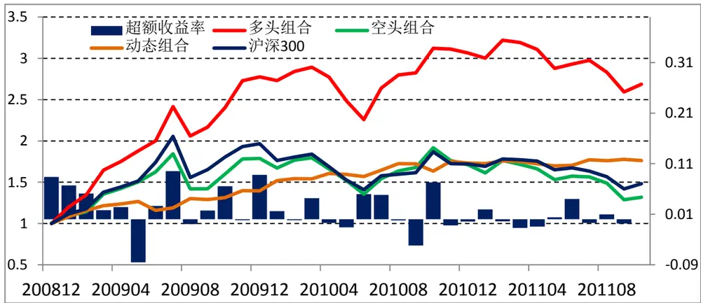
数据来源：广发证券研究发展中心

下面将动态多因子策略与静态多因子策略进行比较，可以发现动态多因子的IR相对静态多因子的IR提高了约12%，年化收益率提高约16%，动态策略相对静态策略的胜率为56%。观察样本外两组策略在不同宏观周期的表现，发现动态策略的风格轮动效果在复苏、滞胀以及衰退期都取得明显的效果，而在过热期则反而不如静态加权策略。

表 9. 两种策略表现对比

| 加权方式 | IR | 年化收益率 | 年化波动率 | 相对胜率 |
| --- | --- | --- | --- | --- |
| 静态策略 | 1.370 | 0.182 | 0.133 | -55.88% |
| 动态策略 | 1.533 | 0.211 | 0.137 | 55.88% |

数据来源：广发证券研究发展中心

图 19. 两种多因子策略对比
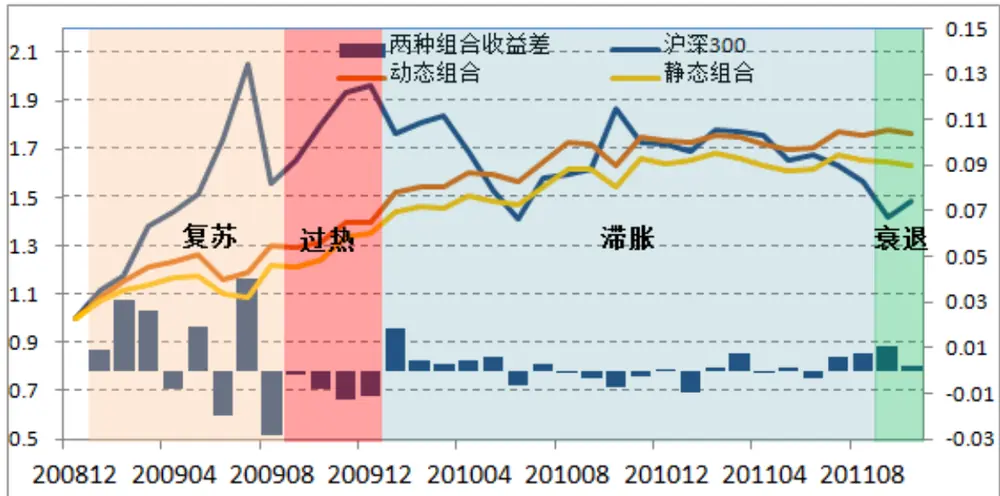
数据来源：广发证券研究发展中心
识别风险，发现价值

整体来说，动态策略的表现明显优于静态策略，但通过两个策略的对比，我们也发现动态策略还存在一定的不足，这说明样本内对各周期内因子的统计规律，在样本外发生了一定程度上的变化，那么具体发生了哪些变化，哪些因子近期持续有效，哪些因子近期失效呢？

下面我们对样本外的因子表现进行统计，根据统计结果表10显示，自2009年以来Alpha因子的整体预测效果（IC）大大提高了，各因子在不同周期内的表现也较以往有所不同。其中，根据历史数据统计，以往过热期表现最突出的是估值、动量、盈利和成长因子，而近两年过热期动态策略之所以表现不如静态策略，主要原因在于其中的估值、盈利以及成长因子失效了；类似的，估值和盈利因子在去年至今年的滞胀期也普遍失效，而成长因子依然具有较好的预测能力。

（蓝色背景：样本内指标显著；红色字体：样本外指标显著）

表 10. 样本外分周期 Alpha 因子信息汇总表

| 因子分类 | 编号 | 因子描述 | IC |  |  |  |  | IC_P |  |  |  |
| --- | --- | --- | --- | --- | --- | --- | --- | --- | --- | --- | --- |
|  |  |  | 全样本 | 复苏 | 过热 | 滞胀 | 衰退 | 复苏 | 过热 | 滞胀 | 衰退 |
| 盈利 | 1 | 销售净利率 | -2.0% | -4.9% | -1.4% | -1.2% | 0.7% | 95.9% | 67.0% | 80.8% | 45.8% |
|  | 2 | ROE | 0.7% | -2.3% | 3.6% | 1.9% | -4.6% | 75.7% | 33.4% | 18.9% | 90.9% |
|  | 3 | ROA | 0.7% | -3.4% | 4.8% | 2.2% | -5.4% | 87.5% | 20.8% | 20.9% | 85.3% |
|  | 4 | 毛利率 | -1.2% | -3.3% | 2.0% | -2.2% | 10.6% | 80.0% | 37.8% | 85.7% | 12.2% |
|  | 5 | 净利润现金占比 | 1.2% | 2.1% | 0.9% | 0.8% | 2.6% | 13.2% | 27.7% | 22.6% | 30.4% |
| 成长 | 6 | 每股净资产增长 | -0.5% | -1.1% | 1.9% | 0.1% | -8.8% | 72.1% | 28.0% | 46.8% | 96.0% |
|  | 7 | ROE增长率 | 1.2% | -2.1% | 3.2% | 2.7% | -4.5% | 83.2% | 5.6% | 2.4% | 63.3% |
|  | 8 | 主营收入增长率 | 1.2% | -1.0% | 2.2% | 2.5% | -5.1% | 67.0% | 23.6% | 3.9% | 78.0% |
|  | 9 | EPS 增长率 | 1.0% | -1.8% | 2.8% | 2.4% | -5.4% | 78.2% | 10.9% | 3.7% | 67.8% |
|  | 10 | 净利润增长率 | 0.8% | -1.6% | 2.9% | 1.9% | -5.1% | 74.6% | 10.0% | 8.4% | 65.6% |
|  | 11 | 总资产增长率 | -0.1% | 1.0% | -0.6% | 0.4% | -8.1% | 33.6% | 54.3% | 40.0% | 77.7% |
|  | 12 | 股东权益增长率 | -0.8% | -0.1% | 0.4% | -0.7% | -6.6% | 51.2% | 47.6% | 68.9% | 86.1% |
| 杠杆 | 13 | 流通股本/总股本 | 1.6% | 1.0% | 5.1% | 1.6% | -3.3% | 63.7% | 90.7% | 92.4% | 4.8% |
|  | 14 | 流通市值/总市值 | 1.6% | 1.0% | 5.1% | 1.7% | -3.3% | 63.7% | 90.7% | 93.3% | 3.6% |
|  | 15 | 负债/资产 | -0.2% | 3.3% | -3.6% | -0.9% | -0.4% | 88.0% | 9.7% | 38.4% | 44.1% |
| 流通 | 16 | 最近3个月成交量 | -4.5% | -0.4% | -10.4% | -6.1% | 6.0% | 53.0% | 99.5% | 95.9% | 4.3% |
|  | 17 | 成交金额 | -6.2% | -2.9% | -12.1% | -6.5% | -3.9% | 32.3% | 6.7% | 3.5% | 22.8% |
|  | 18 | 换手率 | -3.0% | 1.5% | -5.9% | -3.3% | -13.3% | 60.2% | 17.9% | 12.9% | 25.5% |
| 技术 | 19 | 一个月股价反转 | -5.2% | -10.2% | -7.7% | -2.5% | -7.7% | 1.6% | 11.7% | 23.5% | 10.5% |
|  | 20 | 三个月股价反转 | -4.2% | -8.5% | -7.1% | -1.0% | -13.0% | 12.4% | 12.9% | 37.8% | 19.0% |
|  | 21 | 六个月股价反转 | -3.3% | -11.3% | -4.0% | 1.0% | -12.6% | 7.4% | 25.6% | 60.6% | 16.0% |
| 规模 | 22 | 流通市值 | -5.6% | -8.1% | -10.0% | -4.9% | 5.9% | 7.8% | 10.7% | 6.5% | 72.2% |
|  | 23 | 流通股本 | -3.7% | -3.8% | -7.5% | -4.8% | 14.8% | 78.6% | 91.2% | 92.3% | 12.6% |
|  | 24 | 总资产 | -4.1% | -0.7% | -10.2% | -5.9% | 12.0% | 54.5% | 93.9% | 89.7% | 22.5% |
| 估值 | 25 | BP | 2.0% | 10.7% | 2.3% | -3.0% | 15.8% | 0.0% | 34.6% | 76.3% | 16.5% |
|  | 26 | 每股派息/股价 | 0.5% | 3.5% | 1.4% | -1.8% | 10.7% | 10.2% | 30.2% | 81.2% | 27.1% |
|  | 27 | SP | 1.8% | 6.2% | 2.4% | -0.1% | 2.3% | 2.0% | 27.4% | 52.7% | 41.9% |

识别风险，发现价值

|  | 28 | CFP | 1.7% | 6.6% | 0.5% | -0.3% | 4.8% | 0.3% | 40.5% | 55.7% | 20.8% |
| --- | --- | --- | --- | --- | --- | --- | --- | --- | --- | --- | --- |
|  | 29 | EP | 2.2% | 7.0% | 2.7% | -0.6% | 10.3% | 6.3% | 27.0% | 57.0% | 22.4% |
| 质量 | 30 | 营业费用比例 | 1.3% | -4.3% | 6.2% | 2.6% | 0.3% | 26.1% | 98.9% | 75.0% | 51.4% |
|  | 31 | 总资产周转率 | 2.0% | 0.3% | 7.6% | 2.6% | -8.4% | 46.2% | 1.5% | 10.4% | 77.5% |
|  | 32 | 流动比率 | 0.7% | -0.3% | 1.9% | 1.2% | -2.8% | 56.4% | 26.5% | 30.9% | 60.8% |
|  | 33 | 速动比率 | 0.5% | -2.6% | 2.8% | 1.3% | -0.3% | 83.6% | 19.9% | 32.4% | 52.1% |
|  | 34 | 长期负债比率 | -1.5% | -0.2% | -9.2% | -0.2% | -4.5% | 52.6% | 96.2% | 54.0% | 78.6% |
|  | 35 | 每股负债比 | -0.7% | 1.6% | -4.0% | -1.2% | 1.4% | 67.5% | 24.8% | 32.9% | 79.1% |
|  | 36 | 固定比 | -1.5% | -4.1% | -5.4% | 0.3% | -0.7% | 85.8% | 75.4% | 43.9% | 52.5% |
|  | 37 | 流动负债率 | 2.3% | 0.0% | 6.1% | 3.5% | -8.6% | 50.2% | 95.6% | 87.3% | 2.9% |
|  | 38 | 财务费用比例 | -1.0% | 0.3% | -6.4% | -0.5% | -1.1% | 54.7% | 6.6% | 40.4% | 26.5% |
|  | 39 | 存货周转率 | -2.1% | -4.5% | -2.1% | -1.5% | 1.6% | 99.1% | 82.4% | 92.9% | 33.1% |

数据来源：广发证券研究发展中心

图 20. 最近一个复苏期因子 IC
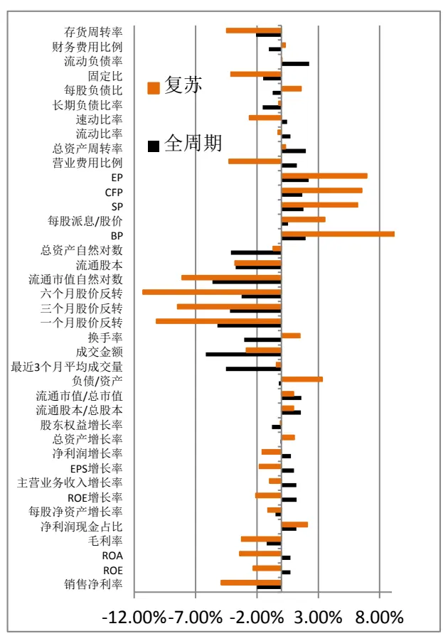
数据来源：广发证券研究发展中心

图 21. 最近一个过热期因子 IC
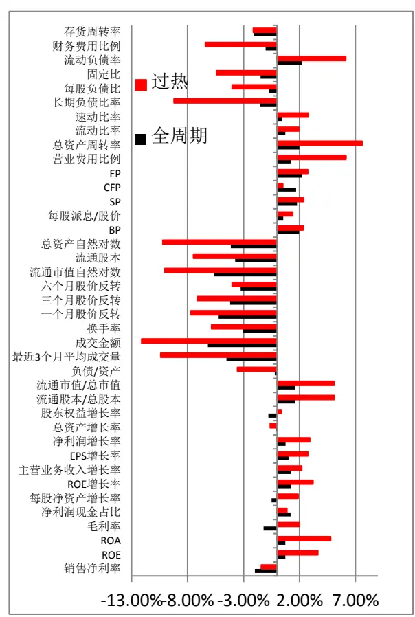
数据来源：广发证券研究发展中心

图 22. 最近一个滞胀期因子 IC
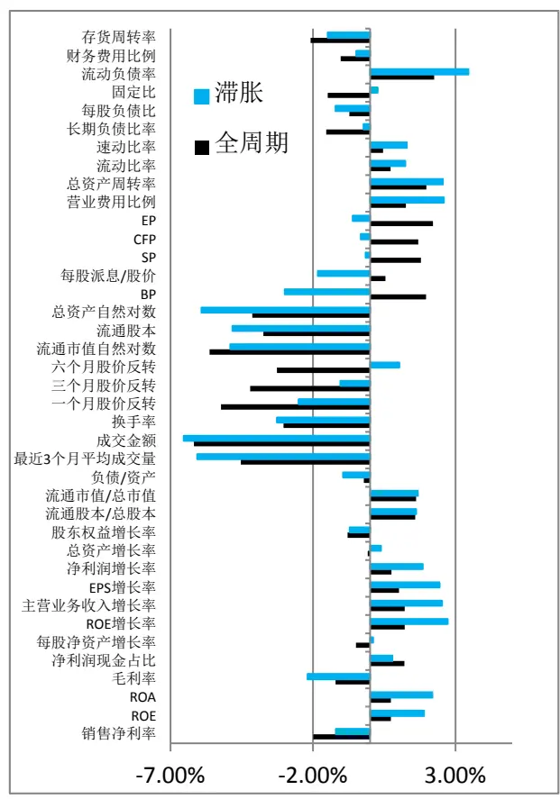
数据来源：广发证券研究发展中心

图 23. 最近一个衰退期因子 IC
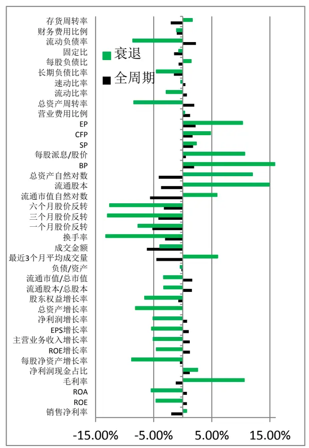
数据来源：广发证券研究发展中心

综上分析，我们分别从经济意义解释以及实证分析的角度，验证了宏观经济周期与Alpha因子的风格轮动之间的确存在一定的联系，因此，我们推荐投资者在使用Alpha因子进行量化选股时，应当结合当前的宏观周期进行分析，选取相应的有效因子设计具体的多因子策略。

在第2节中，我们已经对全部Alpha因子自2000年以来的表现进行了统计，详细的统计结果如表4所示，各周期下挑选出来的有效因子如下表11所列。

表 11. 各宏观周期下有效 Alpha 因子

| 编号 | 复苏 | 过热 | 滞胀 | 衰退 |
| --- | --- | --- | --- | --- |
| 1 | 净利润现金占比 | 销售净利率 | ROE | 销售净利率 |
| 2 | 换手率 | ROA | ROA | ROA |
| 3 | 一个月股价反转 | 毛利率 | 净利润现金占比 | 毛利率 |
| 4 | 三个月股价反转 | 每股净资产增长 | 每股净资产增长 | 净利润现金占比 |
| 5 | BP | 主营收入增长率 | 负债/资产 | 负债/资产 |
| 6 | SP | 成交金额 | 成交金额 | 成交金额 |
| 7 | CFP | 换手率 | 换手率 | 换手率 |
| 8 | EP | 一个月股价反转 | 一个月股价反转 | 一个月股价反转 |
| 9 |  | 三个月股价反转 | 流通市值 | BP |
| 10 |  | BP | 总资产周转率 | 每股派息/股价 |

识别风险，发现价值

| 11 | 每股派息/股价 | 流动比率 | SP |
| --- | --- | --- | --- |
| 12 | SP | 速动比率 | 财务费用比例 |
| 13 | EP | 每股负债比 | 存货周转率 |
| 14 | 总资产周转率 | 固定比 |  |
| 15 | 财务费用比例 | 财务费用比例 |  |

数据来源：广发证券研究发展中心

## 五、后续展望

报告基于宏观经济周期的划分，讨论了不同周期下Alpha因子的风格轮动规律，并结合实证分析验证了两者之间的关系，取得了显著的效果。

如果每个宏观经济周期的时间顺序，阶段之间的领先、滞后时间以及市场变动的规模都准确地不断重复的话，那么我们对风格因子轮动规律的分析工作就可以到此为止了，接下来的任务就非常简单了，但不幸的是，事情并不是这么简单，宏观周期以及每个Alpha因子的风格转换都是一个缓慢变化的过程，因此我们必须缓慢且连续地进行因子风格轮动。例如在统计因子的风格轮动规律时，我们发现除了受到经济周期的影响之外，因子还存在明显的“惯性”，即因子的预测效果是一个缓慢变化的过程，当前因子的IC与因子前N期的IC存在一定的联系。基于这一现象，后续的研究中我们将会进一步考虑各因子的“衰竭”规律，并逐步地完善Alpha因子的风格轮动体系，敬请关注我们的后续成果！

## Table_AuthorSum 广发金融工程研究小组mary

罗军，分析师，金融工程组组长，华南理工大学理学硕士，2010年新财富最佳分析师评选入围，2009年进入广发证券发展研究中心。
胡海涛，分析师，华南理工大学理学硕士，2010年新财富最佳分析师评选入围（团队），2010年进入广发证券发展研究中心。

安宁宁，研究助理，暨南大学经济学硕士，2010年新财富最佳分析师评选入围（团队）2011年进入广发证券发展研究中心。

蓝昭钦，研究助理，中山大学数学硕士，2010年新财富最佳分析师评选入围（团队），2010年进入广发证券发展研究中心。

李明，研究助理，伦敦城市大学卡斯商学院计量金融硕士，2010 年新财富最佳分析师评选入围（团队），2010 年进入广发证券发展研究中心。

史庆盛，研究助理，华南理工大学金融工程硕士，2010 年新财富最佳分析师评选入围（团队）2011 年进入广发证券发展研究中心。联系方式：sqs@gf.com.cn，020-87555888-8618，shiqingsheng-007@hotmail.com。

谢琳，研究助理，上海交通大学金融学博士，2010年新财富最佳分析师评选入围（团队），2010年进入广发证券发展研究中心。

## 敬请关注广发证券金融工程的官方微博： http://weibo.com/gfquant

## Table_Report 相关研究报告

| 《大浪淘沙，Alpha因子何处寻？》 | 史庆盛 | 2011-08-12 |
| --- | --- | --- |

|  | 广州市 | 深圳市 | 北京市 | 上海市 |
| --- | --- | --- | --- | --- |
| 地址 | 广州市天河北路183号深圳市福田区民田路178 大都会广场5 楼 |  | 8 北京市西城区月坛北街2号 上海市浦东南路 528号 |  |
| 邮政编码 | 510075 | 号华融大厦9楼 518026 | 月坛大厦18层 100045 | 上海证券大厦北塔17楼 |
| 客服邮箱 | gfyf@gf.com.cn |  |  | 200120 |
| 服务热线 | 020-87555888-8612 |  |  |  |

## 免责声明

le_Disclaimer广发证券股份有限公司具备证券投资咨询业务资格。本报告只发送给广发证券重点客户，不对外公开发布。

本报告所载资料的来源及观点的出处皆被广发证券股份有限公司认为可靠，但广发证券不对其准确性或完整性做出任何保证。报告内容仅供参考，报告中的信息或所表达观点不构成所涉证券买卖的出价或询价。广发证券不对因使用本报告的内容而引致的损失承担任何责任，除非法律法规有明确规定。客户不应以本报告取代其独立判断或仅根据本报告做出决策。

广发证券可发出其它与本报告所载信息不一致及有不同结论的报告。本报告反映研究人员的不同观点、见解及分析方法，并不代表广发证券或其附属机构的立场。报告所载资料、意见及推测仅反映研究人员于发出本报告当日的判断，可随时更改且不予通告。

本报告旨在发送给广发证券的特定客户及其它专业人士。未经广发证券事先书面许可，任何机构或个人不得以任何形式翻版、复制、刊登、转载和引用，否则由此造成的一切不良后果及法律责任由私自翻版、复制、刊登、转载和引用者承担。