# 跨行业多因子对冲策略——《追踪行业特点，捕获行业ALPHA驱动力》

识别风险，发现价值Identify Risks, Discover Value

李明

广发证券金融工程

2012年2月

## 全市场选股

- 因子行业中性

- 利用一套有效因子体系

## 分行业选股

- 关注因子在行业的特殊性

- 每个行业找出行业有效因子，并构建行业多因子模型

## 全市场vs逐行业多因子策略

农林牧渔行业EP因子IC VS 全市场流通市值因子IC
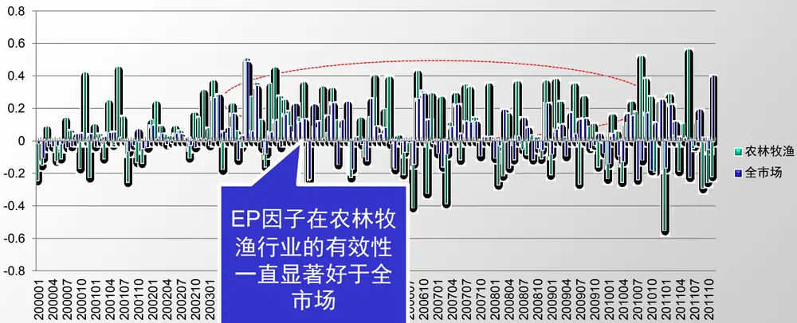

金融行业流通市值因子IC VS 全市场流通市值因子IC
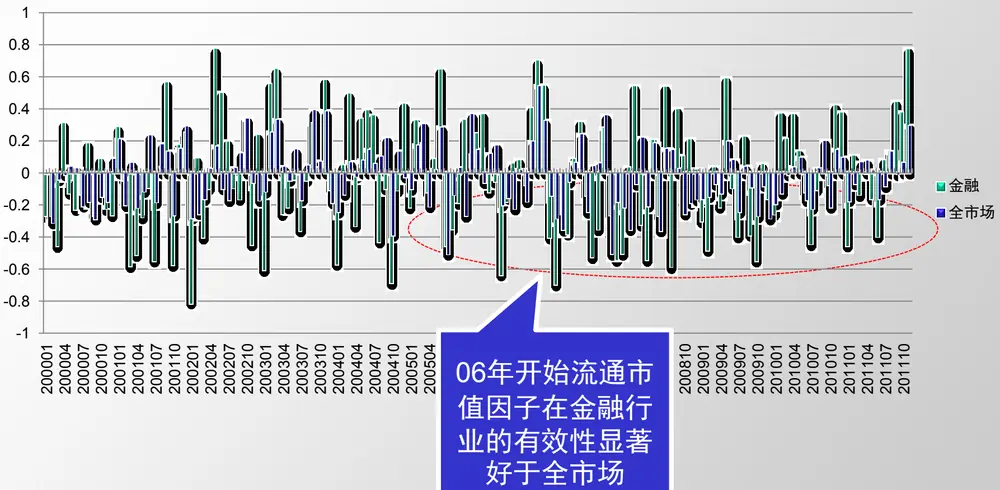

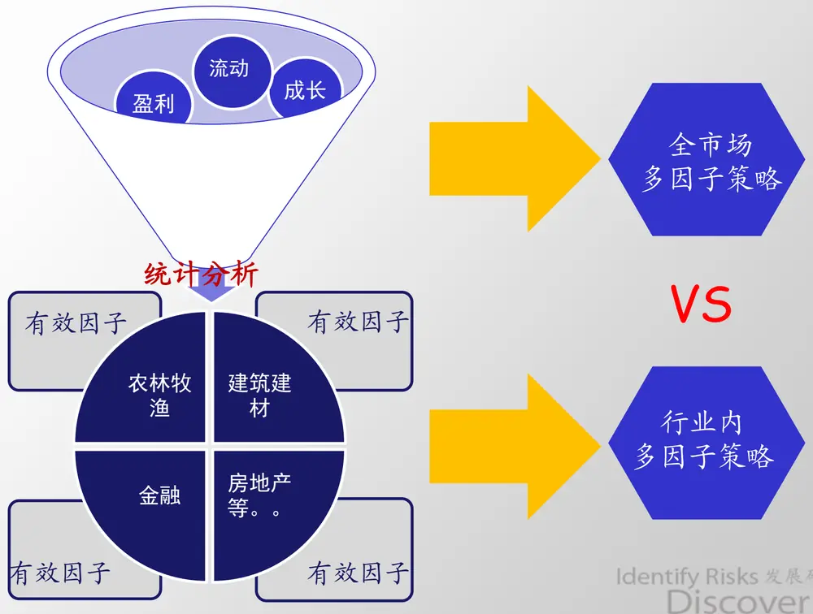

## 行业内多因子选股框架——方法

基于行业内多因子的alpha策略框架
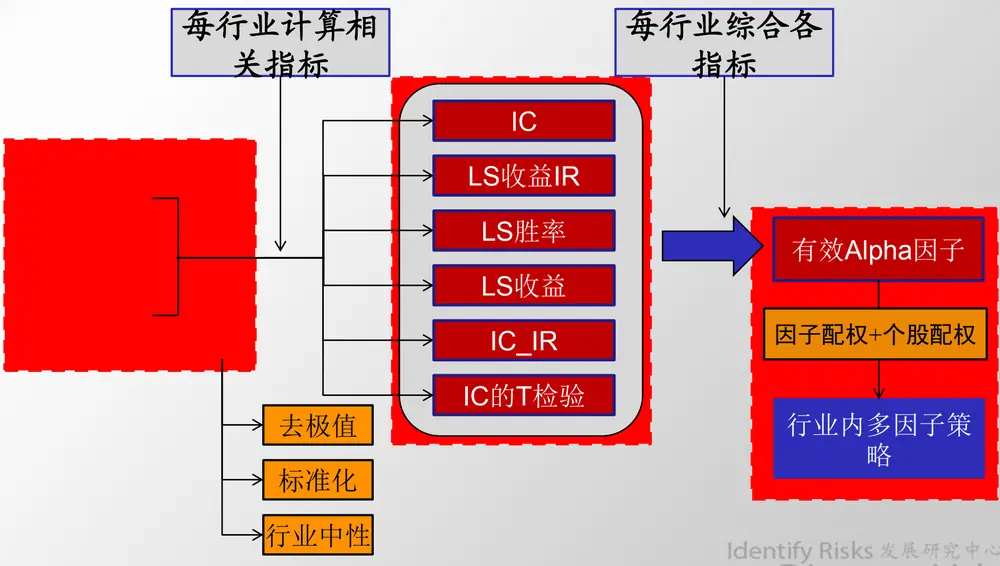

## 行业内多因子选股框架—数据

盈利

- 销售净利率、毛利率、ROE、ROA

成长

- 股东权益增长、EPS增长、总资产增长、净利润增长等。。。

杠杆

- 资产负债率、流通市值/总市值、流通股本/总股本

流动

- 换手率、近3月成交量、一个月成交金额

技术

- 1个月股价反转、3个月股价动量、6个月股价动量

规模

- 流通市值、总资产

估值

- CFP、EP、BP、SP、每股派息/股价

质量

- 存货周转率、流动负债比、营业费用占比、财务费用占比等。。

准则

## 1.完整性

2.合理性

## 3.严密性

海选

经济意义

预处理

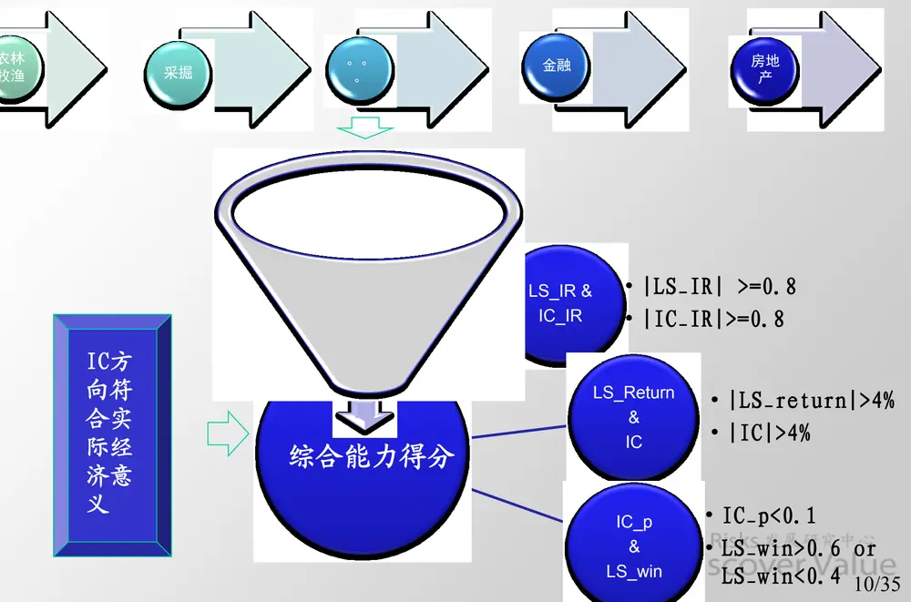

农业具有独特资源稀缺性，随着农产品价值理性回归，行业盈利能力好转是必然之势，盈利能力增长高的个股更受市场青睐

| 因子描述 | 平均IC | 平均收益率 | 因子胜率 | 因子IR | 基于IC的IR因 | 子IC_IR的T检验P值 |
| --- | --- | --- | --- | --- | --- | --- |
| ROE增长率 | 7.17% | 13.30% | 55.56% | 0.626 | 1.199 4.52% |  |
| 主营收入增长 | 5.77% | 21.71% | 61.11% | 0.915 | 0.815 16.68% |  |
| EPS增长率 | 6.74% | 13.40% | 52.78% | 0.602 | 1.158 5.28% |  |
| 净利润增长率 | 6.41% | 14.20% | 63.89% | 0.711 | 1.048 7.82% |  |
| 最近3月成交量 | -5.83% | -34.50% | 30.56% | -1.173 | -0.895 13.01% |  |
| 成交金额 | -12.48% | -42.07% | 36.11% | -1.749 | -1.917 0.21% |  |
| 换手率 | -11.54% | -48.16% | 25.00% | -1.896 | -1.547 1.12% |  |
| 一个月股价反转 | -11.19% | -35.10% | 36.11% | -1.223 | -1.445 1.72%-0.655 26.46%-1.362 2.40% |  |
| 六个月股价反转 | -5.08% -29.83% |  | 38.89% | -1.068 |  |  |
| 流通市值 -6.13% -12.83% |  |  | 36.11% | -0.710 |  |  |

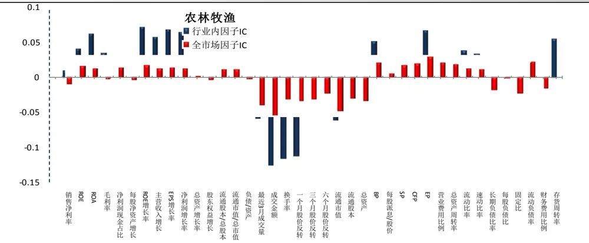

Identify Risks 发展研究中心

从采掘行业来看，市场更偏向于派息高，现金较为充裕的个股。

| 因子描述 | 平均IC | 平均收益率 | 因子胜率 | 因子IR | 基于IC的IR因子IC_IR的T检验P值 |
| --- | --- | --- | --- | --- | --- |
| 最近3月成交量 | -9.56% | -28.03% | 33.33% | -1.425 | -1.622 0.81% |
| 流通市值 | -8.71% | -17.16% | 36.11% | -1.159 | -1.345 2.57% |
| 流通股本 | -8.11% | -30.24% | 33.33% | -1.393 | -1.188 4.72% |
| 每股派息/股价 | 6.85% | 28.80% | 80.56% | 1.263 | 1.055 7.61% |
| CFP | 6.63% | 35.14% | 66.67% | 1.298 | 1.031 8.27% |

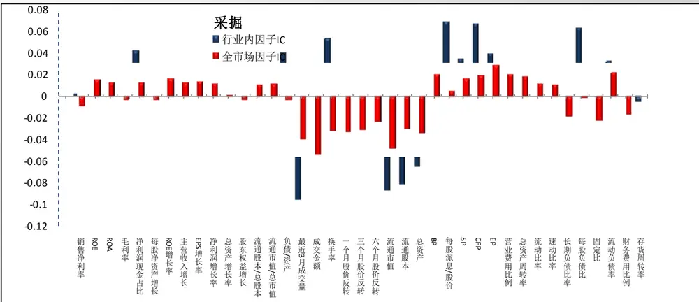

## 行业VS因子——化工

化工行业中，投资者似乎更青睐于成交量低，换手较小的小市值股票

| 因子描述 | 平均IC | 平均收益率 | 因子胜率 | 因子IR | 基于IC的IR因子IC_IR的T检验P值 |  |
| --- | --- | --- | --- | --- | --- | --- |
| 成交金额 | -5.69% | -18.89% | 33.33% | -1.004 | -1.203 | 4.45% |
| 换手率 | -4.16% | -8.29% | 38.89% | -0.483 | -0.811 | 16.89% |
| 流通市值 | -5.09% | -16.82% | 36.11% | -1.390 | -1.430 | 1.82% |

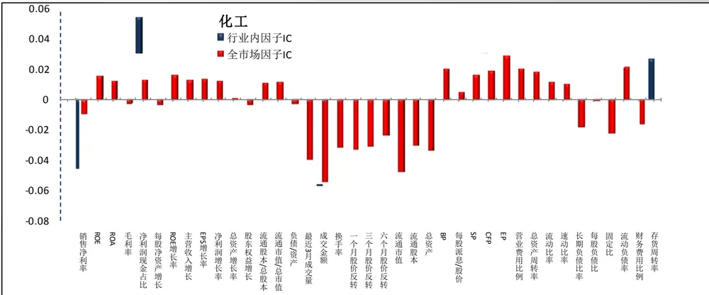

## 行业VS因子——黑色金属

钢铁行业有固定资产投资高，负债高，特别是流动负债高的特性。而流动负债高的公司获得流动资金的能力相对较强，对上游议价能力也强，所以该些公司表现更好。

| 因子描述 | 平均IC | 平均收益率 | 因子胜率 | 因子IR | 基于IC的IR因 | 子IC_IR的T检验P值 |
| --- | --- | --- | --- | --- | --- | --- |
| 负债/资产 | 4.06% 14.19% |  | 66.67% | 0.822 | 0.686 | 24.25% |
| 最近3月成交量 | -9.06% | -10.55% | 36.11% | -0.553 | -1.472 | 1.53% |
| 成交金额 | -10.70% | -28.49% | 33.33% | -1.288 | -1.585 | 0.95% |
| 三个月股价反转 | -10.45% -29.07% |  | 30.56% | -1.200 | -1.162 | 5.19% |
| 流通市值 | -11.87% -37.58% |  | 25.00% | -2.109 | -2.020 | 0.13% |
| 流通股本 | -8.67% -30.11% |  | 25.00% | -1.638 | -1.389 | 2.16% |
| 总资产 | -11.56% | -31.82% | 33.33% | -1.404 | -1.740 | 0.48% |
| 总资产周转率长期负债比率 | 6.14% | 5.94% | 50.00% | 0.329 | 1.125 | 5.95% |
|  | -9.70% -8.61% |  | 47.22% | -0.537 | -1.840 0.30% |  |
| 固定比流动负债率 | -6.11% -18.69% |  | 38.89% | -0.973 | -1.104 6.41% |  |
|  | 10.52% 16.34% |  | 58.33% | 1.012 | 2.128 0.08% |  |

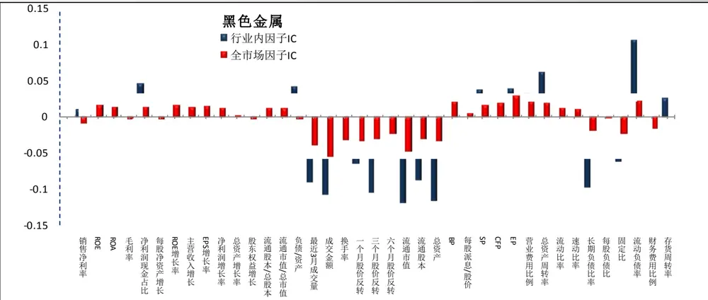

## 行业VS因子——有色金属

从有色金属近三年因子表现来看，市销率较低，长期负债也较低的个股备受市场看好。

| 因子描述 | 平均IC | 平均收益率 | 因子胜率 | 因子IR | 基于IC的IR因 | 子IC_IR的T检验P值 |  |
| --- | --- | --- | --- | --- | --- | --- | --- |
| 流通股本/总股本 5.79% 25.53% |  |  | 75.00% | 1.028 | 1.212 4.32% |  |  |
| 流通市值/总市值 | 5.76% | 25.53% | 75.00% | 1.028 | 1.205 4.43% |  |  |
| 最近3月成交量 | -5.19% | -10.60% | 47.22% | -0.478 | -1.081 6.95% |  |  |
| 成交金额流通市值 | -5.77% | -21.69% | 38.89% | -0.958 | -0.977 9.94% |  |  |
|  | -6.47% | -19.07% | 33.33% | -0.973 | -1.131 5.81% |  |  |
| 流通股本SP 4.67%长期负债比率 -5.29% -6.41% |  |  | -6.07% | -14.22% | 44.44% | -0.532 |  |
|  |  |  | 4.67% | 11.09% | 63.89% | 0.515 | 0.823 16.28%-0.876 13.82% |
|  |  |  | 38.89% | -0.247 |  |  |  |

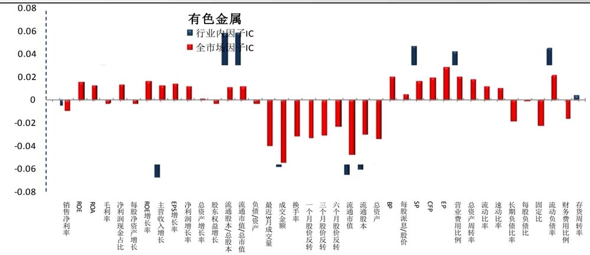

## 行业VS因子——建筑建材

建材行业技术门栏不算十分高，加之所需原材料分布广，产品价格低，运费高，导致利润薄。所以毛利率较高企业证明盈利能力较强。

| 因子描述 | 平均IC | 平均收益率 | 因子胜率 | 因子IR | 基于IC的IR因 | 子IC_IR的T检验P值 |
| --- | --- | --- | --- | --- | --- | --- |
| 毛利率 | 5.43% 32.24% |  | 61.11% | 1.167 | 0.680 24.69% |  |
| 净利润现金占比 | 5.82% | 11.12% | 58.33% | 0.575 | 1.056 | 7.60% |
| 最近3月成交量 | -7.51% | -20.20% | 36.11% | -0.785 | -1.207 | 4.39% |
| 成交金额 | -8.18% | -28.59% | 33.33% | -1.287 | -1.374 | 2.29% |
| 流通市值 | -7.82% | -24.67% | 30.56% | -1.159 | -1.403 | 2.04% |
| 流通股本 | -8.33% | -26.21% | 33.33% | -1.018 | -1.526 | 1.22% |
| 总资产EP固定比 | -8.77% | -33.90% | 38.89% | -1.130 | -1.220 | 4.18% |
|  | 4.40% | 24.35% | 61.11% | 0.864 | 25.39%1.041 8.00% |  |
|  | 7.17% | 24.47% | 61.11% | 0.947 |  |  |

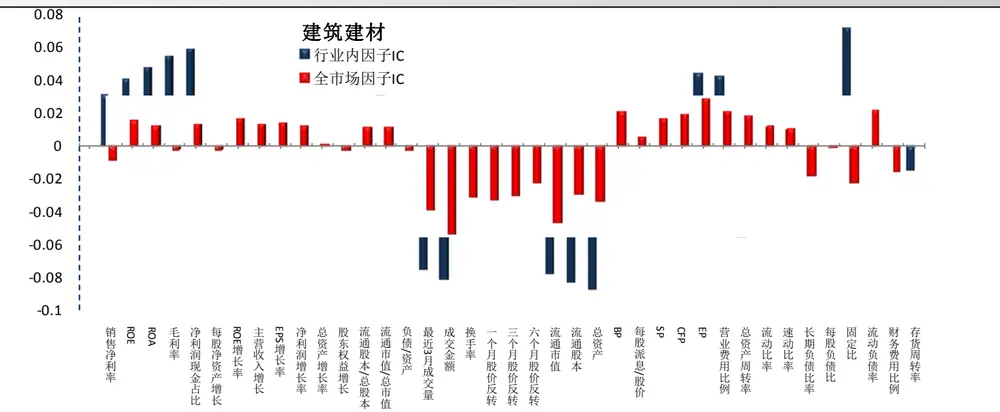

对于机械设备行业，低PB的公司具有阶段性价值回归潜力。机械行业本身用PB来估值就存在低估嫌疑，所以PB低的公司更值得关注！

| 因子描述 | 平均IC | 平均收益率 | 因子胜率 | 因子IR | 基于IC的IR因 | 子IC_IR的T检验P值 |
| --- | --- | --- | --- | --- | --- | --- |
| 最近3月成交量成交金额换手率 | -6.61% -17.51% 30.56% |  |  | -0.838 | -1.409 1.99% |  |
|  | -9.33% | -41.00% | 25.00% | -2.395 | -2.139 | 0.07% |
|  | -6.96% | -21.46% | 38.89% | -1.201 | -1.275 | 3.39% |
| 流通市值 | -5.63% | -18.64% | 38.89% | -1.065 | -1.189 4.70% |  |
| 总资产 | -4.40% -13.55% |  | 38.89% | -0.825 -0.837 15.58% |  |  |
| BP每股派息/股价 | 5.48% 23.73% |  | 61.11% | 1.071 | 0.857 | 14.66%1.375 2.28% |
|  | 5.26% | 20.08% | 61.11% | 1.432 |  |  |

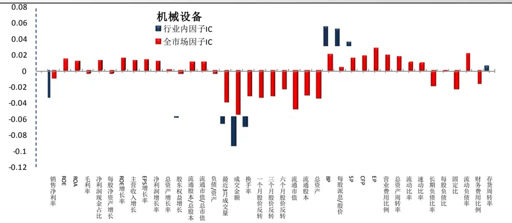

对于电子行业，统计下来我们发现成交量偏低，换手少的股票在行业内跑得相对更好。

| 因子描述 | 平均IC | 平均收益率 | 因子胜率 | 因子IR | 基于IC的IR因子IC_IR的T检验P值 |  |
| --- | --- | --- | --- | --- | --- | --- |
| 最近3月成交量 | -6.29% | -37.72% | 36.11% | -1.525 | -1.174 | 4.97% |
| 成交金额 | -11.66% | -38.37% | 22.22% | -1.705 | -1.913 | 0.22% |
| 换手率 | -7.69% | -32.15% | 30.56% | -1.352 | -1.203 | 4.46% |
| 流通市值 | -6.05% | -23.74% | 44.44% | -1.019 | -0.978 | 9.93% |

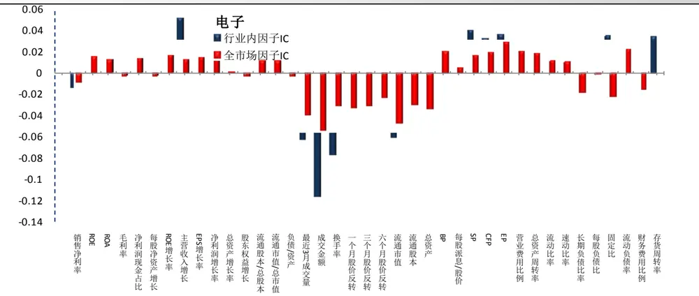

## 行业VS因子——交运设备

从结果来看，交运设备的反转效应十分之明显。

| 因子描述 | 平均IC | 平均收益率 | 因子胜率 | 因子IR | 基于IC的IR因 | 子IC_IR的T检验P值 |  |
| --- | --- | --- | --- | --- | --- | --- | --- |
| 成交金额换手率一个月股价反转三个月股价反转六个月股价反转长期负债比率 | -5.93% -18.47% |  | 44.44% | -0.799 | -1.030 8.32% |  |  |
|  | -6.29% | -13.29% | 47.22% | -0.595 | -1.014 | 8.77% |  |
|  | 转 | -5.15% | -25.25% | 36.11% | -0.947 | -0.625 | 28.62% |
|  | -10.68% -41.19% |  | 41.67% | -1.378 | -1.387 | 2.17% |  |
|  | -7.11% -33.14% |  | 33.33% | -1.364 | -1.092 6.69% |  |  |
|  | 4.52% 14.56% |  | 63.89% | 0.753 | 0.938 | 11.31%16.53% |  |
| 财务费用比例 | 4.47% 13.60% |  | 61.11% | 0.652 | 0.818 |  |  |

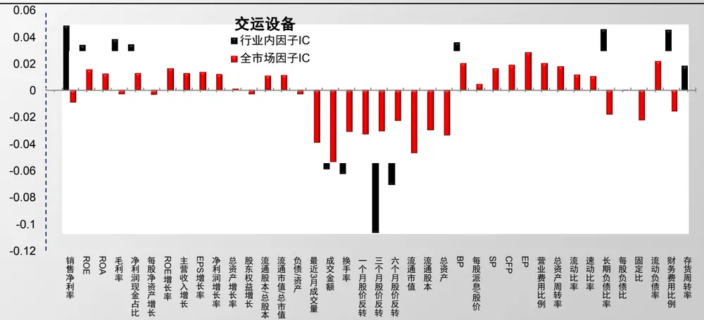

## 行业VS因子——信息设备

信息设备行业有很强的一个月反转效应，换手较低的个股也备受青睐。

| 因子描述 | 平均IC | 平均收益率 | 因子胜率 | 因子IR | 基于IC的IR因子IC_IR的T检验P值 |  |
| --- | --- | --- | --- | --- | --- | --- |
| 成交金额 | -6.90% | -32.82% | 33.33% | -1.310 | -1.042 | 7.97% |
| 换手率 | -6.58% | -16.68% | 38.89% | -0.680 | -0.777 | 18.71% |
| 一个月股价反转 | -8.46% | -23.67% | 50.00% | -0.789 | -0.843 | 15.30% |

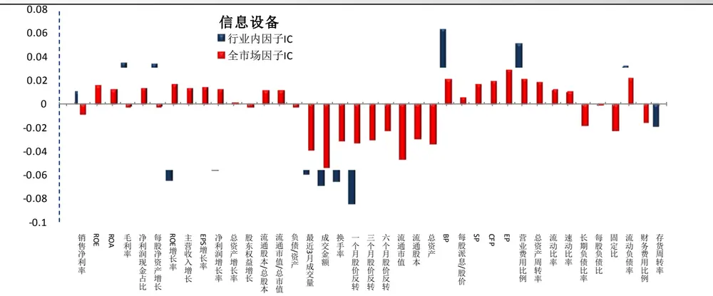

## 行业VS因子——家用电器

对于家用电器行业，PE估值指标具有十分强的选股指导意义。我国家电业高流动负债是行业特点，流通负债越高，可证明企业对上游的话语权越高。

| 因子描述 | 平均IC | 平均收益率 | 因子胜率 | 因子IR | 基于IC的IR因子IC_IR的T检验P值 |  |
| --- | --- | --- | --- | --- | --- | --- |
| 流通股本/总股本 | 7.12% | 37.33% | 61.11% | 1.437 | 0.765 | 19.37% |
| 流通市值/总市值 | 7.33% | 37.33% | 61.11% | 1.437 | 0.793 | 17.82% |
| EP | 9.68% | 33.35% | 58.33% | 1.123 | 1.029 | 8.32% |
| 流动比率 | -9.21% | -35.18% | 36.11% | -1.160 | -0.970 | 10.18% |
| 速动比率 | -9.36% | -7.75% | 47.22% | -0.362 | -0.991 | 9.48% |

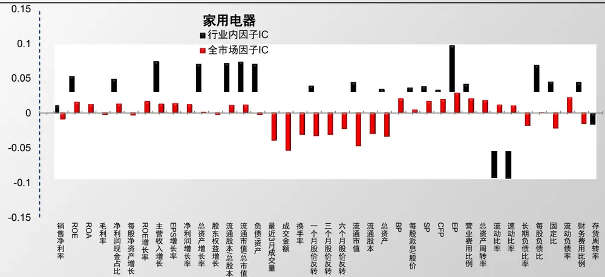

出于自身特点，食品饮料行业流动负债比例较高。但如果行业中个股营运能力强，资金周转到位，则流动负债所起到的作用更多是降低财务成本，所以负债高的个股更值得关注。

| 因子描述 | 平均IC | 平均收益率 | 因子胜率 | 因子IR | 基于IC的IR因子IC_IR的T检验P值 |  |
| --- | --- | --- | --- | --- | --- | --- |
| 负债/资产 流动比率 | 8.43% -6.73% | 24.37% -21.05% | 63.89% 41.67% | 1.109 -0.836 | 1.157 -1.126 | 5.28% 5.91% |

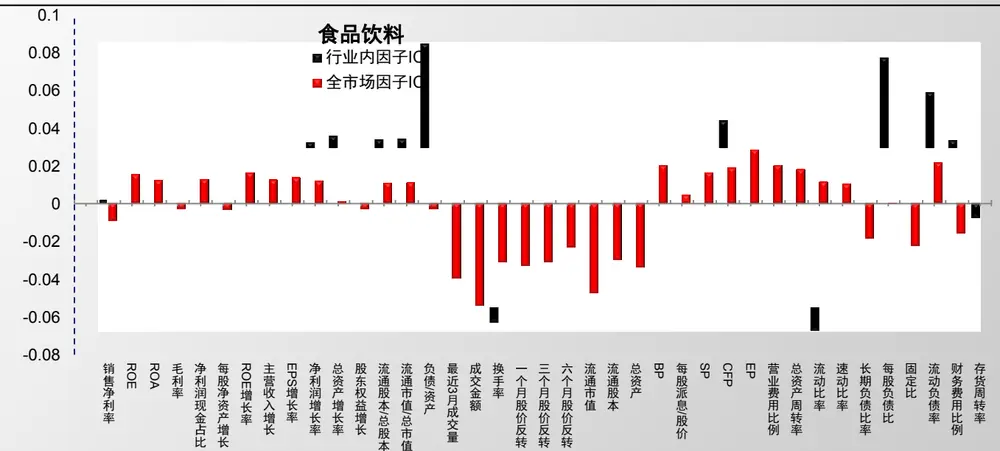

## 行业VS因子——纺织服装

虽然目前外围经济形势较为恶劣，出口增速下降。但内需较为强劲，而且原材料价格下降使得行业综合毛利率上升。毛利以及盈利增速上涨较快个股涨幅较好。

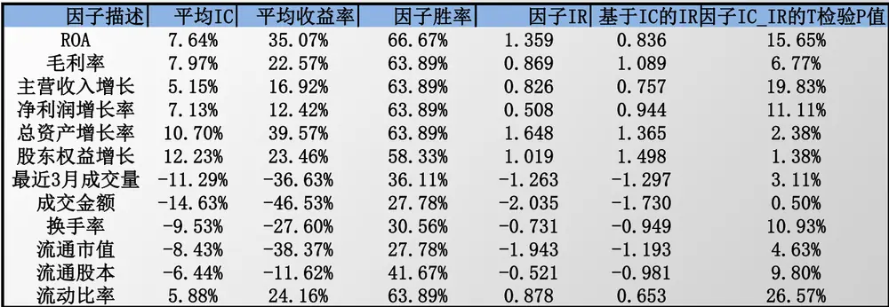

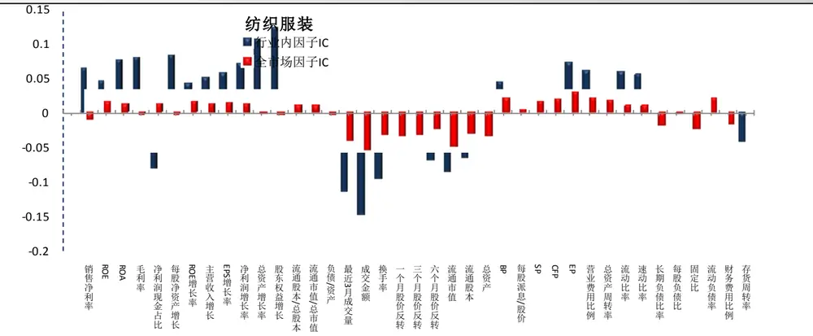

轻工行业主要竞争力不是技术，而是销售渠道，同质产品如果出货更快，证明其渠道更有优势，资产利用率更高，这也应证了总资产周转率因子的有效性。

| 因子描述 | 平均IC | 平均收益率 | 因子胜率 |  | 因子IR基于IC的IR因子IC_IR的T检验P值 |  |
| --- | --- | --- | --- | --- | --- | --- |
| 成交金额 | -13.87% | -36.17% | 27.78% | -1.436 | -1.623 | 0.80% |
| 流通市值 | -8.53% | -18.86% | 44.44% | -0.849 | -1.131 | 5.82% |
| 总资产 | -7.97% | -24.87% | 44.44% | -0.895 | -1.028 | 8.36% |
| 总资产周转率 | 7.48% | 10.59% | 47.22% | 0.408 | 1.015 | 8.74% |

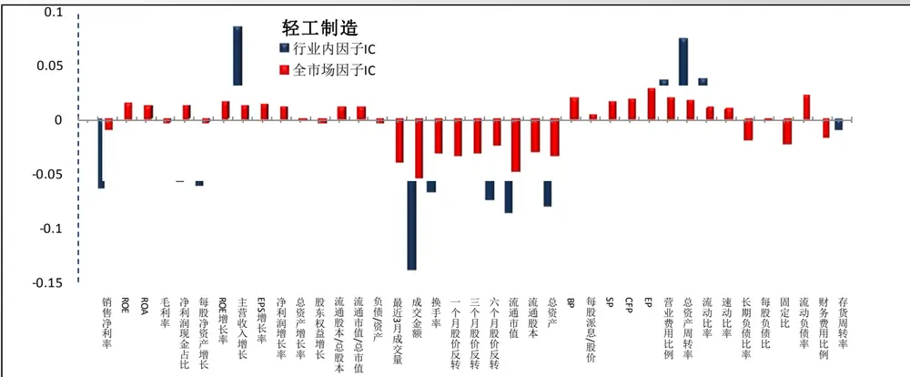

## 行业VS因子——医药生物

医药生物的六个月反转效应较为明显。

| 因子描述 | 平均IC | 平均收益率 | 因子胜率 | 因子IR | 基于IC的IR因子IC_IR的T检验P值 |  |
| --- | --- | --- | --- | --- | --- | --- |
| 六个月股价反转 | -4.61% | -16.51% | 41.67% | -0.735 | -0.708 | 22.85% |
| 流通市值 | -4.14% | -12.10% | 44.44% | -0.635 | -0.655 | 26.45% |

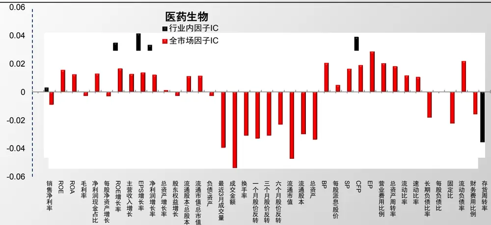

对于公用事业行业，成交较为平淡，市值较低的个股还是较为受到投资者的热捧。

| 因子描述 | 平均IC | 平均收益率 | 因子胜率 | 因子IR | 基于IC的IR因子IC_IR的T检验P值 |  |
| --- | --- | --- | --- | --- | --- | --- |
| 最近3月成交量 成交金额 | -7.84% | -18.01% | 36.11% | -1.281 | -1.952 | 0.18% |
|  | -8.29% | -29.34% | 38.89% | -1.175 | -1.431 | 1.82% |
| 流通市值 | -13.80% | -42.18% | 30.56% | -1.764 | -1.938 | 0.19% |
| 流通股本 | -10.94% | -36.70% | 33.33% | -1.524 | -1.666 | 0.66% |
| 总资产 | -12.10% | -35.38% | 33.33% | -1.337 | -1.546 | 1.12% |
| 流动比率 | 6.63% | 22.47% | 66.67% | 1.011 | 1.220 | 4.17% |
| 速动比率 | 5.65% | 18.37% | 66.67% | 0.938 | 1.132 | 5.80% |

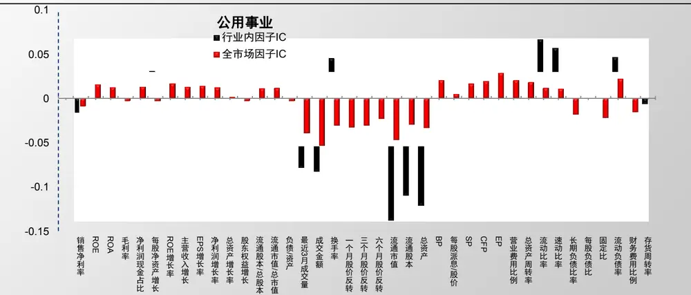

对于运输行业，运输营运是生产与销售过程的相统一结合，在油价不断上涨，营运成本不断提高的情况下，资产周转越高，运营效率越快的公司，质地越好。

| 因子描述 | 平均IC | 平均收益率 | 因子胜率 | 因子IR | 基于IC的IR因 | 子IC_IR的T检验P值 |  |  |
| --- | --- | --- | --- | --- | --- | --- | --- | --- |
| 成交金额 | -7.83% | -17.92% 38.89% |  | -1.094 | -1.065 7.37% |  |  |  |
| 换手率 | -5.65% | -9.88% | 36.11% | -0.705 | -0.888 13.32% |  |  |  |
| 一个月股价反转 | -6.08% | -21.84% | 38.89% | -1.479 | -0.850 14.99% |  |  |  |
| 三个月股价反转六个月股价反转流通市值 | -9.80% | -14.87% | 38.89% | -1.069 | -1.905 0.22% |  |  |  |
|  |  |  | 转 | -8.19% | -11.82% | 44.44% | -1.003 | -1.504 1.34% |
|  | -6.69% | -12.74% | 36.11% | -0.742 | -0.960 10.54%1.443 1.73% |  |  |  |
| SP总资产周转率 | 6.81% | 12.28% | 55.56% | 0.763 |  |  |  |  |
|  | 6.16% | 13.65% | 61.11% | 1.013 | 1.230 4.03% |  |  |  |

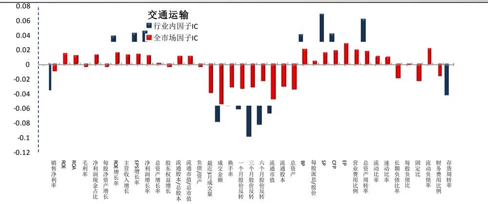

从历史检验结果来看，估值因子对于房地产行业还是较为有效。由于政策调控，地产股前期跌幅较大，若政策松动，则低估值股票先行。

| 因子描述 | 平均IC | 平均收益率 | 因子胜率 | 因子IR | 基于IC的IR因 | 子IC_IR的T检验P值 |  |
| --- | --- | --- | --- | --- | --- | --- | --- |
| 成交金额一个月股价反转三个月股价反转六个月股价反转流通市值BP | -6.37% -24.99% |  | 27.78% | -1.300 | -1.095 6.63% |  |  |
|  | -7.19% | -25.32% | 30.56% | -1.249 | -0.991 | 9.49% |  |
|  | -6.22% | -13.04% | 36.11% | -0.750 | -1.049 | 7.78% |  |
|  | -6.14% | -20.03% | 27.78% | -1.487 | -1.211 4.33% |  |  |
|  | -6.43% -22.08% |  | 38.89% | -1.549 | -1.308 2.97%2.94% |  |  |
|  | 5.58% 19.35% |  | 63.89% | 1.262 |  |  | 1.312 |
| SP | 6.95% 20.19% |  | 50.00% | 1.335 | 1.493 | 1.40% |  |
| 营业费用比例 4.63% 15.37% 58.33% |  |  |  | 1.150 | 1.130 5.84% |  |  |

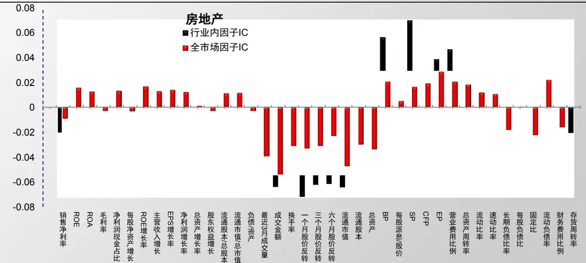

金融股方面还是应该多关注股价反转因子。

| 因子描述 | 平均IC | 平均收益率 | 因子胜率 | 因子IR | 基于IC的IR因子IC_IR的T检验P值 |  |
| --- | --- | --- | --- | --- | --- | --- |
| 流通股本/总股本 | 6.91% | 19.21% | 55.56% | 0.938 | 1.034 | 8.19% |
| 流通市值/总市值 | 6.91% | 19.21% | 55.56% | 0.938 | 1.035 | 8.18% |
| 换手率 | -8.49% | -6.26% | 36.11% | -0.279 | -1.080 | 6.98% |
| 一个月股价反转 | -6.16% | -25.32% | 38.89% | -1.198 | -0.683 | 24.46% |
| 三个月股价反转 | -9.97% | -17.18% | 41.67% | -0.727 | -1.123 | 5.99% |
| 六个月股价反转 | -8.07% | -33.17% | 36.11% | -1.282 | -0.880 | 13.64% |

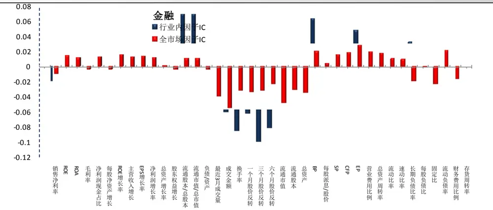

经过我们的统计，PE与PCF两个估值因子效果都十分显著。而行业内反转效应也较为明显。

| 因子描述 | 平均IC | 平均收益率 | 因子胜率 | 因子IR基于IC的IR因子IC_IR的T检验P值 |  |
| --- | --- | --- | --- | --- | --- |
| 成交金额 | -5.14% | -24.86% | 27.78% | -1.370 | -0.954 10.74% |
| 一个月股价反转 | -5.99% | -23.91% | 38.89% | -1.065 -0.752 | 20.13% |
| 三个月股价反转 | -5.24% | -20.04% | 38.89% | -0.964 -0.710 | 22.69% |
| 六个月股价反转 | -4.63% | -14.76% | 38.89% | -0.866 -0.649 | 26.83% |
| 流通市值 | -5.54% | -14.73% | 38.89% | -0.746 -1.059 | 7.52% |
| CFP | 4.14% | 14.76% | 66.67% | 0.876 0.798 | 17.57% |
| EP | 6.95% | 19.31% | 61.11% | 0.966 1.039 | 8.05% |

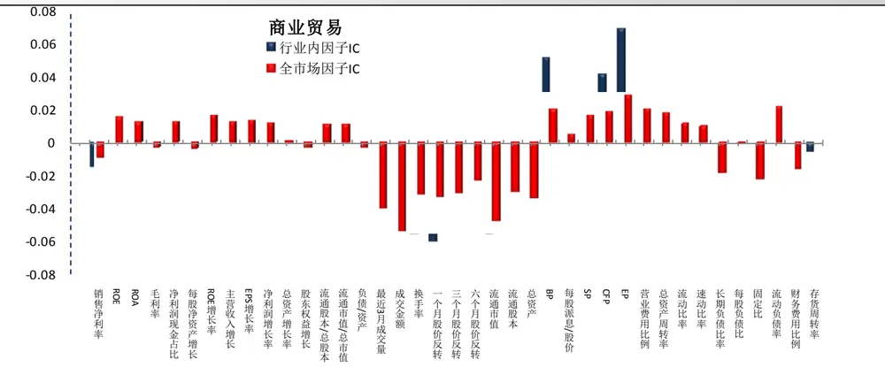

旅游行业ROE在09年有显著提升。在旅游行业中，规模、扩张与盈利能力密不可分，ROE增速较快公司应该运用了良好的扩张策略，业绩提升速度快。

| 因子描述 | 平均IC | 平均收益率 | 因子胜率 | 因子IR | 基于IC的IR因子IC_IR的T检验P值 |  |
| --- | --- | --- | --- | --- | --- | --- |
| ROE增长率 | 4.64% | 32.78% | 63.89% | 0.839 | 0.380 | 51.42% |
| 成交金额 三个月股价反转 | -9.57% | -35.31% | 41.67% | -1.096 | -1.200 | 4.51% |
|  | -9.69% | -54.59% | 38.89% | -1.501 | -0.765 | 19.38% |
| BP | 14.59% | 46.96% | 66.67% | 1.545 | 1.700 | 0.57% |
| CFP | 7.23% | 31.52% | 61.11% | 0.949 | 0.748 | 20.38% |

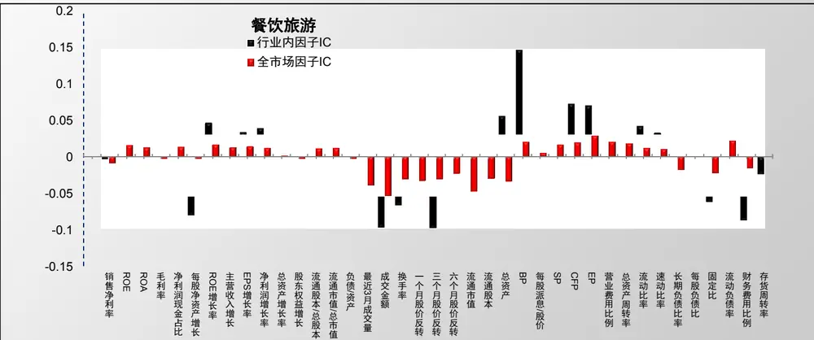

对于信息服务行业，反转效应还是十分显著，而流通市值较小的股票也是备受关注！

| 因子描述 | 平均IC | 平均收益率 | 因子胜率 | 因子IR | 基于IC的IR因子IC_IR的T检验P值 |
| --- | --- | --- | --- | --- | --- |
| 最近3月成交量 | -7.42% | -19.37% -44.71% | 38.89% | -0.750 | -1.243 3.83% |
| 成交金额 | -10.20% |  | 30.56% 36.11% | -1.759 -0.932 | -1.507 1.32% |
| 三个月股价反转 | -8.31% | -25.05% |  | -1.124 | 5.97% |
| 六个月股价反转 | -9.52% | -29.74% | 36.11% | -1.359 | -1.478 1.49% |
| 流通市值 | -9.55% | -36.71% | 33.33% | -1.672 | -1.246 3.78% |
| 流通股本 | -6.05% | -23.76% | 36.11% | -1.008 | -0.885 13.44% |

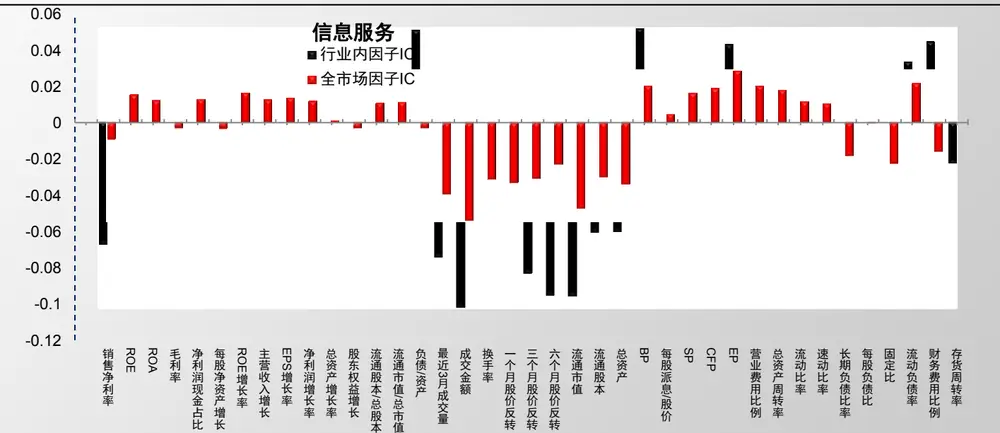

## 行业VS因子——综合

综合行业有效因子较为多。综合来看，行业内盈利能力增长高，流动性相对好的公司更受市场的认可。

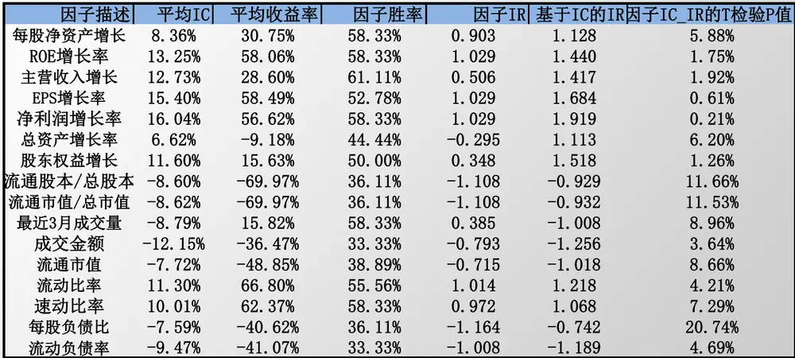

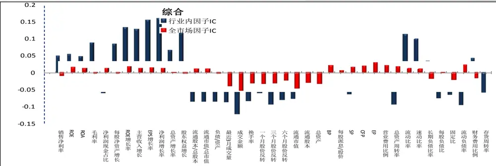

- 每个行业根据近三年有效因子组建多因子模型

- 每行业前20%为超配组合，后20%为低配组合

- 每行业超组合权重=行业在中证800的实际权重

## 行业权重中性

## 因子等权

股票等权（OEE）股票流通市值加权（OET）

## 因子IC_ IR加权

股票等权（OIE）股票流通市值加权（OIT）

因子平均加权

因子IC_IR加权

股票平均加权

股票流通市值加权

T

每六个月重新计算因子

1

## 历史每行业因子挑中次数

|  | 农林牧渔 |  |  | 采掘 | 化工 | 黑色金属有 | 色金属建 | 筑建材 | 机械设备 | 电子 | 交运设备 | 信息设备 | 家用电器 |  |
| --- | --- | --- | --- | --- | --- | --- | --- | --- | --- | --- | --- | --- | --- | --- |
| 销售净利率 | 3 0 |  |  |  | 0 | 0 | 0 |  | 1 | 0 | 0 3 |  | 1 |  |
| ROE | 3 0 |  |  |  |  | 0 | 1 | 0 |  |  | 0 | 1 3 |  | 0 |
| ROA |  |  | 3 | 0 | 0 | 0 | 1 |  |  | 0 | 1 | 3 | 0 |  |
| 毛利率 |  | 1 |  | 0 | 0 | 0 | 0 |  | 0 | 0 | 1 | 0 | 5 |  |
| 净利润现金占比 | 0 |  |  | 0 |  | 1 | 0 |  | 0 | 1 | 2 1 |  | 0 |  |
| 每股净资产增长 | 4 |  |  | 3 | 0 | 0 | 2 | 1 | 2 | 0 | 0 3 |  | 5 |  |
| ROE增长率 | 0 |  |  | 0 | 0 | 0 | 3 |  | 0 | 0 | 0 | 0 | 0 |  |
| 主营收入增长 | 2 |  |  | 0 | 0 | 0 | 2 | 0 | 3 | 0 | 0 | 3 | 1 |  |
| EPS增长率 | 0 |  |  | 1 | 1 | 0 | 0 | 0 | 0 | 0 | 0 | 0 |  |  |
| 净利润增长率 | 0 |  |  |  | 1 | 0 | 0 | 0 | 0 | 0 | 0 | 1 | 0 |  |
| 总资产增长率 | 3 |  |  | 0 | 0 | 2 | 0 |  | 3 | 0 | 0 | 3 | 0 |  |
| 股东权益增长 | 3 |  |  | 0 | 0 | 0 | 0 |  | 1 | 0 | 0 | 3 | 0 |  |
| 流通股本/总股本 | 0 |  |  |  | 0 | 0 | 5 |  | 4 | 0 | 0 | 2 | 1 |  |
| 流通市值/总市值 | 0 |  |  |  | 0 |  | 6 | 0 | 3 | 0 | 0 | 2 |  |  |
| 负债/资产 |  |  |  | 0 | 0 | 2 |  | 0 | 1 | 1 | 0 | 1 |  |  |
| 最近3月成交量 | 3 |  |  | 3 | 3 | 4 | 3 |  | 3 | 4 |  | 4 | 4 |  |
| 成交金额 |  |  |  |  |  |  |  | 4 | 6 | 9 | 6 | 4 | 2 |  |
| 换手率 | 0 |  |  |  |  | 2 |  | 3 | 10 | 5 |  |  | 4 |  |
| 个月股价反转 | 2 |  |  |  |  | 5 | C | 6 | 8 |  | 6 |  | 1 |  |
| 个月股价反转 | 2 |  |  | 0 |  | 5 | 0 | 4 | 3 | 3 | 5 | 4 | 0 |  |
| 六个月股价反转 | 3 |  |  | 0 |  |  | 0 |  | 2 | 3 |  | 0 | 0 |  |
| 流通市值 |  |  |  | 3 |  | 4 | 4 | 4 | 2 | 8 |  | 2 | 0 |  |
| 流通股本 | 4 |  |  | 3 | 0 | 4 | 3 | 3 | 0 | 3 | 0 | 2 |  |  |
| 总资产 | 0 |  |  |  |  | 5 | 3 | 4 | 2 | 0 | 0 | 3 |  |  |
| BP |  |  |  |  | 1 | 3 |  | 6 | 2 |  |  |  | 1 |  |
| 每股派息/股价 | 2 |  |  |  | 0 | 0 | 5 | 3 | 2 | 2 |  | 0 | 4 |  |
| SP |  |  |  |  | 2 |  | 5 | 0 |  |  | 4 |  | 0 |  |
| CFP | 0 |  |  |  |  | 2 | 2 | 0 |  | 8 | 4 | 5 | 2 |  |
| EP |  |  |  |  | 0 | 1 | 4 | 4 | 0 |  |  | 3 | 8 |  |
| 营业费用比例 | 0 |  |  | 1 | 4 | 2 | 1 | 0 | 0 | 0 | 0 | 3 | 3 |  |
| 总资产周转率 | 0 |  |  | 0 | 0 | 0 | 2 | 0 | 3 | 0 | 3 | 3 | 0 |  |
| 流动比率 |  |  |  | 0 | 0 | 0 | 0 | 0 | 0 | 0 | 0 | 0 |  |  |
| 速动比率 | 4 |  |  | 0 | 0 | 3 | 0 | 0 | 2 | 0 | 0 | 0 |  |  |
| 长期负债比率 | 0 |  |  | 0 0 |  | 1 | 0 |  | 0 | 0 | 0 | 0 |  |  |
| 每股负债比 | 0 |  |  | 3 | 0 | 2 | 0 |  | 0 | 0 |  |  |  |  |
| 固定比 |  |  |  | 1 | 0 | 1 | 0 |  | 2 |  | 0 |  | 0 |  |
| 流动负债率 | 0 |  |  | 1 | 0 | 2 | 0 | 0 |  |  |  |  | 1 |  |
| 财务费用比例 | 0 |  |  | 0 0 |  | 0 | 0 |  |  |  |  |  | 0 |  |
| 存货周转率 | 0 |  |  | 0 1 |  | 1 | 4 | 0 |  |  |  |  |  |  |

## 历史每行业因子挑中次数

|  | 食品饮料 |  |  | 纺织服装 | 轻工制造 | 医药生物 | 公用事业 | 交通运输 | 房地产 | 金融 | 商业贸易餐 | 饮旅游 | 信息服务 | 综合 |
| --- | --- | --- | --- | --- | --- | --- | --- | --- | --- | --- | --- | --- | --- | --- |
| 销售净利率 | 0 0 |  |  |  | 0 | 0 | 0 1 |  | 0 | 0 | 1 | 0 | 1 | 0 |
| ROE |  | 0 0 |  |  | 0 | 0 | 1 | 1 | 0 | 0 | 1 | 0 | 0 | 0 |
| ROA |  |  | 0 | 1 | 0 | 1 | 1 | 1 | 2 | 0 | 1 | 0 | 0 | 0 |
| 毛利率 |  |  | 0 | 1 | 0 | 0 | 1 | 0 |  | 0 | 0 | 0 | 1 | 0 |
| 净利润现金占比 |  |  | 0 | 0 | 0 | 0 | 0 | 3 | 0 | 0 | 0 | 0 | 0 | 3 |
| 每股净资产增长 |  | 0 |  | 1 | 0 | 0 |  | 0 |  | 0 |  | 0 | 1 | 2 |
| ROE增长率 | 1 0 |  |  |  | 2 | 0 | 0 | 3 | 0 | 0 | 0 | 0 | 0 | 3 |
| 主营收入增长 | 1 |  |  | 0 | 0 | 0 | 0 | 0 | 0 | 0 | 0 | 0 | 0 | 1 |
| EPS增长率 | 1 |  |  | 0 | 2 | 0 | 0 | 1 | 0 | 0 | 0 | 0 | 0 | 3 |
| 净利润增长率 | 2 |  |  | 0 | 1 | 0 | 0 | 1 | 0 | 0 | 0 | 0 | 0 | 3 |
| 总资产增长率 | 0 |  |  | 1 | 0 | 0 | 0 | 1 | 2 | 0 | 1 | 0 | 0 | 1 |
| 股东权益增长 |  | 0 |  | 2 | 0 | 0 | 1 | 2 | 2 | 0 | 1 | 0 | 1 | 1 |
| 流通股本/总股本 | 1 |  |  | 0 | 0 | 0 | 0 | 2 | 0 | 0 | 0 | 4 | 2 | 2 |
| 流通市值/总市值 | 1 |  |  | 0 | 0 | 0 | 0 | 2 | 0 | 0 | 0 | 4 |  | 2 |
| 负债/资产 | 2 |  |  | 2 | 0 | 0 | 0 | 2 | 1 | 1 |  | 0 | 5 | 2 |
| 最近3月成交量 | 1 |  |  | 2 | 0 | 0 | 4 | 6 | 3 | 2 |  | 1 |  | 3 |
| 成交金额 | 5 |  |  | 5 | 9 | 8 | 7 | 5 |  | 8 | 6 | 2 | 4 | 8 |
| 换手率 | 0 |  |  | 6 | 5 | 5 |  |  | 8 | 2 | 9 | 3 |  | 7 |
| 个月股价反转 | 5 |  |  | 5 | 8 |  |  | 5 | 10 | 4 | 5 | 3 | 5 | 4 |
| 个月股价反转 | 0 |  |  | 3 | 8 | 0 |  | 4 | 6 | 4 | 4 | 6 |  | 1 |
| 六个月股价反转 | 5 |  |  | 0 | 4 | 0 | 4 | 6 |  | 5 | 3 | 6 |  | 6 |
| 流通市值 | 0 |  |  | 3 | 4 | 2 |  | 5 | 4 | 1 | 0 | 0 | 0 | 6 |
| 流通股本 | 0 |  |  | 1 | 0 | 0 | 2 | 2 | 0 | 0 | 0 | 3 | 0 | 014 |
| 总资产 | 0 |  |  | 0 | 2 |  | 5 | 2 | 0 |  | 2 | 5 0 |  |  |
| BP | 4 |  |  |  | 0 | 4 | 3 |  | 5 | 5 |  |  |  |  |
| 每股派息/股价 | 3 |  |  |  | 0 | 0 | 1 | 0 |  |  | 9 | 0 |  | 0 |
| SP | 0 |  |  | 2 | 2 | C | 0 | 3 | 4 | 0 | 6 | 0 | 4 | 0 |
| CFP | 2 |  |  | 0 | 0 |  | 0 | 10 | 2 | 0 |  | 2 | 0 | 00 |
| EP | 5 |  |  | 0 | 0 | 4 | 1 | 2 | 0 | 0 | 10 | 2 4 |  |  |
| 营业费用比例 | 00 |  |  | 10 | 000 | 002 | 20 | 0 04 0 |  | 00 | 0 00 0 |  |  | 000003 |
| 总资产周转率 |  |  |  |  |  |  |  |  |  |  |  |  |  |  |
| 流动比率 | 0 |  |  | 0 |  |  |  | 0 |  | 0 | 0 | 00 | 55 |  |
| 速动比率 | 0 |  |  | 1 | 0 | 2 |  | 0 |  | 0 |  |  |  |  |
| 长期负债比率 | 0 |  |  | 0 | 0 |  | 0 | 0 |  | 0 |  | 0 | 0 |  |
| 每股负债比 |  |  | 0 | 0 | 2 | 0 | 1 | 4 | 0 | 1 | 0 | 4 | 2 |  |
| 固定比 |  |  | 0 | 0 | 0 | 0 | 2 | 0 |  | 2 | 0 | 5 | 0 | 010 |
| 流动负债率 |  | 0 |  | 0 | 0 | 2 | 0 | 0 | 0 | 0 | 1 | 1 | 1 |  |
| 财务费用比例 |  | 0 00 0 |  |  | 00 | 1 | 0 | 0 | 0 | 1 | 0 | 0 |  |  |
| 存货周转率 |  |  |  |  |  | 0 | 0 | 0 | 0 |  |  |  |  |  |

## 跨行业多因子策略——OEE结果

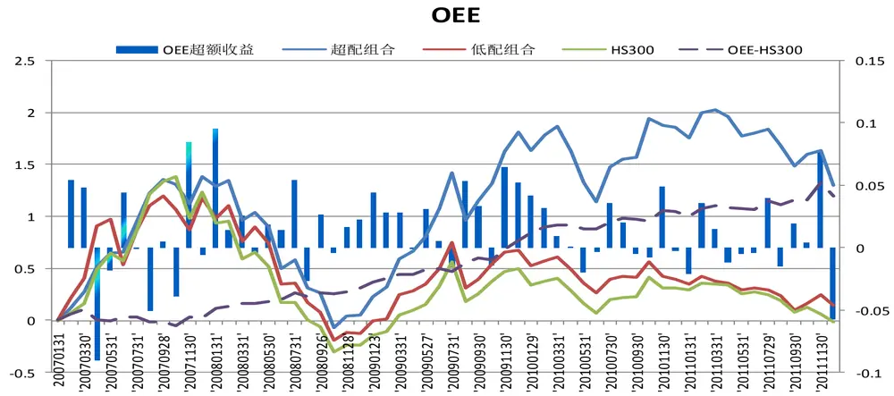

| 年份 | 2007 | 2008 | 2009 | 2010 | 2011 |
| --- | --- | --- | --- | --- | --- |
| OEE逐年超额收益 | 1.98% | 27.88% | 35.30% | 15.87% | 7.14% |

## 跨行业多因子策略——OET结果

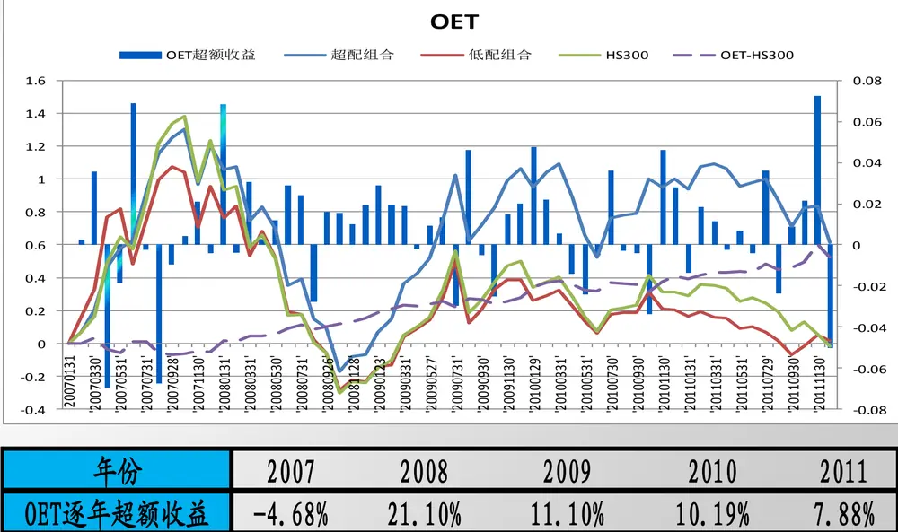

| 年份 | 2007 2008 | 2009 | 2010 | 2011 |
| --- | --- | --- | --- | --- |
| OET逐年超额收益 | -4.68% 21.10% | 11.10% | 10.19% | 7.88% |

## 跨行业多因子策略——OIE结果

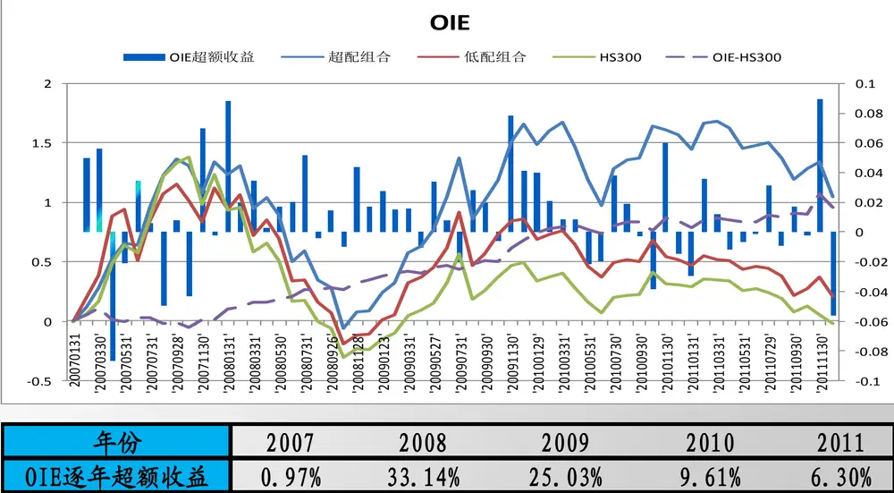

| 年份 | 2007 2008 | 2009 | 2010 2011 |
| --- | --- | --- | --- |
| OIE逐年超额收益 | 0.97% 33.14% | 25.03% | 9.61% 6.30% |

## 跨行业多因子策略——OIT结果

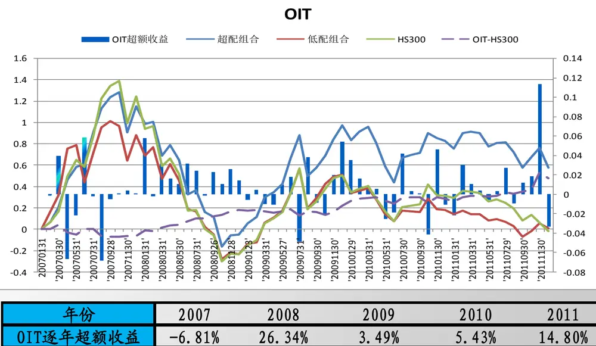

| 年份 | 2007 2008 | 2009 | 2010 | 2011 |
| --- | --- | --- | --- | --- |
| 0IT逐年超额收益 | -6.81% 26.34% | 3.49% | 5.43% | 14.80% |

## 跨行业多因子策略——对比

| 策略 | OEE | OET | OIE | OIT |
| --- | --- | --- | --- | --- |
| 战胜指数胜率 | 62.71% | 61.02% | 62.71% | 62.71% |
| 年化平均收益 | 16.74% | 9.09% | 14.43% | 8.45% |
| 跟踪误差 | 11.83% | 9.92% | 11.81% | 10.41% |
| 年化IR | 1.415 | 0.916 | 1.222 | 0.812 |
| 平均月度换手率 | 40.28% | 43.15% | 42.95% | 47.57% |

总结：不论从战胜指数的胜率来看，或者是策略超额收益的年化IR，OEE（因子平均加权，股票平均加权）多因子组合表现都是最优，也是我们几个策略中的首选。

展望：从各行业有效因子来看，不难发现大部分行业的有效因子都是与股价相关的因子（反转，成交金额，估值）。所以未来我们行业内的思路会转向结合上下游的情况，挖掘具有行业特性的一些因子。

## Thanks!谢谢聆听

广发证券发展研究中心识 别 风 险，发 现 价 值

Identify Risks,Discover Value

公司电话：020-87555888

公司地址：广州市天河北路183号大都会广场5楼 邮编：510075