# Table_Title转融通：双刃剑之“惑”

# 16274——基于多因子选股的量化对冲方案分析

罗军Table_Author 首席分析师

电话：020-87555888-8655

eMail：lj33@gf.com.cn

执业编号：S0260511010004

## Table_Summary 转融通或将改变现有做空格局

年，随着融资融券和股指期货的推出，中国股市打开了做空这个充满神秘和期待的“潘多拉魔盒”。融资融券的启动，标志着A股做空机制的来临，而股指期货的推出，标志着“做空时代”真正到来。

相比两种做空机制之间的优劣势，股指期货在资金使用效率及交易成本上具有优势；而融资融券在卖空个股和板块上更显突出。呼之欲出的“转融通”让投资者充满了期待和疑惑，融资融券这把“双刃剑”究竟该何时使用及如何使用值得我们深入探讨。

## 量化多因子体系优选个股

量化多因子体系涵盖四个层次：层次1：建立风格因子数据库；层次2：因子的有效性度量及Alpha因子挑选；层次3： 通过对Alpha因子及个股进行配权，构造超低配组合。层次4：最后一个环节设计不同的对冲策略，对组合的系统风险进行对冲，从而最终锁定Alpha收益。从样本外跟踪来看，超配组合累积收益率-2.61%，低配组合累积收益率-34.11%，而同期沪深300指数收益率为-19.97%。

可见，量化多因子体系对优选个股有明显的效果，超配组合相对低配组合及基准指数均有稳定的超额收益，然而超额收益并不等于对冲收益，如何选择合适的对冲工具构造市场中性策略，从而获取稳定的Alpha收益，是本文研究的主要内容。

## 股指期货对冲方案效果稳定

首先通过沪深300股指期货对结合超配组合构造市场中型策略，考虑到需要预留一定比例保证金，该方案的资金实际运用效率为80%左右，同时考虑期间股指期货基差带来的影响，样本外对冲组合的收益率为12.97%，IR高达1.42，分年度来看，该对冲方案仅在2006年出现亏损，其余各年度均取得正的超额收益。

在剔除基差的影响之后，股指期货对冲方案样本外的收益率下降至9.853%，IR下降至1.06。

## 融券卖空 ETF 对冲方案不甚乐观

其次采用模拟的沪深300ETF进行做空，从而构造具有1.2倍杠杆的对冲策略，高昂的融资融券成本使得该方案相比股指 期货方案，收益率和IR都出现大幅下降，据样本外跟踪，ETF对冲方案的年化收益率仅为2.54%，远远低于扣除基差因 素之后的股指期货对冲方案。

若假设转融通业务开展之后融资融券成本下降至6%，则对冲组合收益率上升至6.88%，依然低于股指期货方案的收益率，但若不考虑基差因素的影响，已经比较接近股指期货方案的收益率，但对冲组合的IR仍然比较低，只有0.51。

## 融券卖空个股对冲方案收益较高

最后考虑直接融券做空低配组合的对冲方案，据样本外跟踪，该对冲方案的年化收益率高达 ，若不考虑股指期货基差的影响，已经高于采用股指期货进行对冲得到的收益率，但IR仅为0.6。

若假设转融通业务开展之后融资融券成本下降至6%，该对冲组合尽显优势！对冲组合收益率上升至15.18%，已经大于股指期货方案的样本外收益率；另外，组合的信息比IR为0.83，依然低于股指期货对冲方案的IR，融券对冲方案是否具备足够吸引力取决于融资融券成本的进一步下调。

## 一、引言

2010年，随着融资融券和股指期货的推出，中国股市打开了做空这个充满神秘和期待的“潘多拉魔盒”。融资融券的启动，标志着A股做空机制的来临，而股指期货的推出，标志着“做空时代”真正到来。

相比两种做空机制之间的优劣势，股指期货业务在资金使用效率、交易成本及流动性等方面具有优势；而融资融券在期现套利、卖空个股和板块上更显突出，投资者可以利用股指期货进行卖空，但股指期货的做空及对冲只是针对指数而作，但当股指处于震荡行情，市场结构性投资机会远远大于趋势性交易机会时，投资者则需要针对个股设计更加灵活的对冲策略，从而锁定结构性机会所带来的Alpha收益。

2011年11月25日，沪深交易所分别发布《融资融券交易实施细则》，对融资融券标的证券范围进行调整，并纳入了ETF(交易所交易型开放式指数基金)，至此，融资融券正式成为常规业务，许多构资者及个人投资者都试图利用融资融券交易来构建多样化的交易策略；而其中，完全对冲Alpha策略及增强型多空策略（如130/30策略），成为投资者的首选，通过优选个股，同时结合融资融券对冲可得到个股Alpha受益，但融资融券又是一把双刃剑！一方面，融资融券的杠杆功能在放大收益的同时也将风险放大；另一方面，抵押比例的限制以及高昂的资金费用都将大大地制约了其威力的发挥。

随着融资融券的常规化，转融通业务的正式推出也成为弦上之剑，以往券商只能为客户提供自有的个股，这意味着客户所能融到的券源取决于券商是否持有或者依法能够持有某证券；同样，融资也有诸多限制。转融通业务是融资融券业务的深化，是指由银行、基金及保险公司等机构间接地为券商提供资金和证券来源，券商则将这些资金和证券提供给融资融券客户。简而言之，转融通将提供更为完善的对冲工具，同时其对冲成本也有望进一步下降。而转融通所带来的“诱惑”到底有多大？投资者对于融资融券这把双刃剑的种种“疑惑”是否都能得到圆满的解答？

本文我们将基于前期的Alpha选股策略，围绕股指期货以及融资融券这两类对冲工具设计不同的对冲方案，通过探讨不同方案的成本及杠杆等细节的不同来对比不同方案之间的优劣！书写框架如下：

第一节：前言，本节对股指期货和融资融券这两种对冲工具的发展情况及特点进行简要介绍；

第二节：多因子量化选股体系介绍，本文的重点虽然是比较不同的对冲工具，对冲的最终目标是Alpha收益，而Alpha收益的来源则取决于前期的选股工作是否成功，因此在设计具体的对冲方案之前，我们将利用一定的篇幅介绍多因子量化选股的过程；

第三节：对冲方案比较，本节将针对不同对冲方案的各种细节展开讨论，对各种参数的敏感性进行测验，为投资者介绍“转融通”业务将给融资融券对冲策略带来的影响；

第四节：最后，给出结论和建议。

## 二、多因子选股体系介绍

## (一) 多因子选股体系

为了对风格因子进行有效的刻画和捕捉，我们建立了一个完善的风格因子研究体系，整个体系框架可分为三个层次，如图1所示：

层次1：建立风格因子数据库，将市场上可能受到关注的大量因子汇集到一起，经过初步加工（即预处理）之后，得到可用于统计分析的因子数据以及个股收益数据，层次1是整个框架的基础，数据的完整性及有效性将直接影响模型的结果；

层次2：运用多个度量指标，对风格因子数据库中每个因子的有效性进行多维度刻画，并从中挑选出能够产生稳定Alpha的因子；

层次3：完成了Alpha因子挑选，即确定了当前可用的Alpha因子之后，接下来便是对Alpha因子进行整合，并挑选相应的个股进行投资。

层次4：最后一个环节设计不同的对冲策略，对组合的系统风险进行对冲，从而最终锁定Alpha收益。

图 1. 多因子策略研究框架
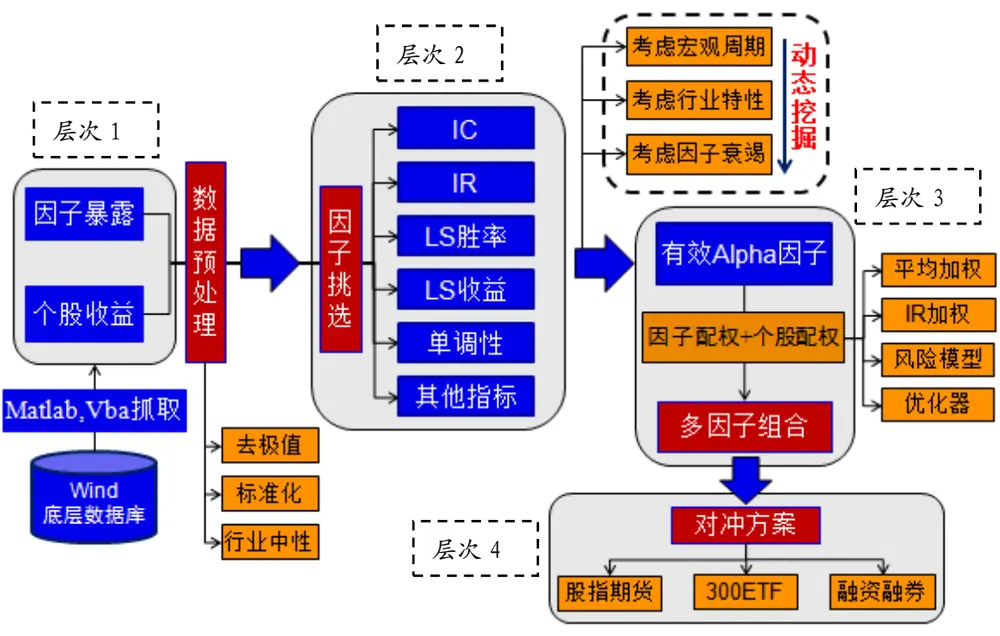
数据来源：广发证券研究发展中心

其中，本文的核心工作属于整个框架体系中的最后一步，下面对前面各个层次的工作进行简要介绍。

## (二) Alpha 因子及个股挑选

前两个层次是关于因子数据库的搭建以及Alpha因子的挑选，请参考前期报告《大浪淘沙：Alpha因子何处寻？》，基于该报告提出的方法，我们采用了IC、组合收益率、组合胜率、LS_IR、IC_IR以及IC_P等指标对因子的有效性进行刻画。

样本期间：2005年4月30日-2012年3月30日共84个月，其中2005年4月30日-2010年3月30日共60个月作为样本内数据，因子有效性分析我们在样本内进行。

因子及配权：共14个Alpha因子(图2所示)，等权配置；

个股及配权：融资融券标的，共287只个股及ETF(历史标的以深证100及上证180指数成分股近似替代)，根据多因子排序挑选前后各20%个股作为超低配组合，对组合内个股采用流通市值加权；

基准指数：沪深300指数。

基于样本内数据，我们挑选出整体效果最显著的代表因子如图2所示：

图 2. 有效 Alpha 因子
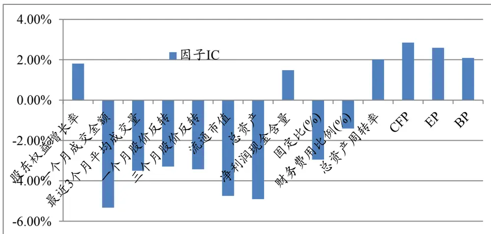
数据来源：广发证券研究发展中心，Wind数据库

根据多因子选股结果，得到超低配组合表现如下所示：

图 3. 多因子超低配股票组合历史净值
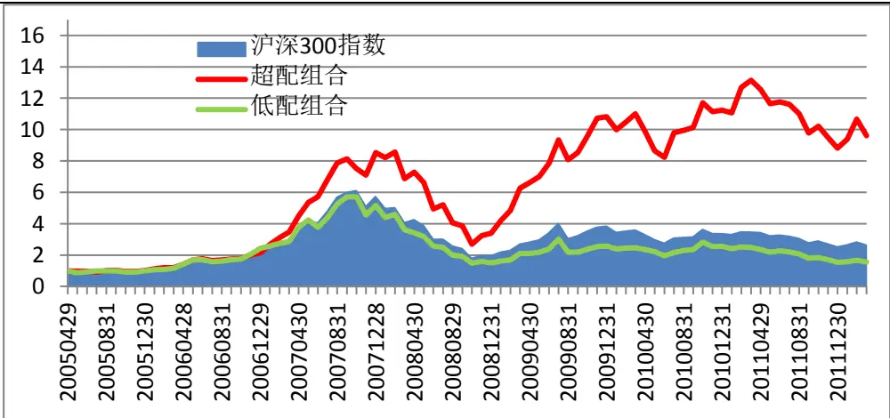
数据来源：广发证券研究发展中心，Wind数据库
识别风险，发现价值

全样本共7年期间，超配组合累积收益率861%，低配组合累积收益率54.9%，而同期沪深300指数收益率为163%。从股指期货推出以来的样本外数据进行跟踪，对冲组合的收益率为12.97%，IR高达1.42，分年度来看，该对冲方案仅在2006年出现亏损，其余各年度均取得正的超额收益。

## 三、构建市场中性对冲方案

上一节简要介绍多因子量化选股及对冲中的前三步，得到超低配组合，其中，超配组合相对沪深300指数及低配组合均具有稳定的超额收益，然而超额收益并不等于对冲收益，接下来需要选择合适的对冲工具构造市场中性策略，从而获取稳定的Alpha收益。

下文主要围绕股指期货和融资融券这两类对冲工具展开，其中股指期货方案需要考虑合约展期、保证金管理以及基差带来的风险等；而融资融券对冲方案又可分为两种：第一种采用沪深300ETF进行做空，因此将采用模拟的沪深 300ETF进行对冲，该方案需要考虑的问题主要是对沪深 300ETF 的模拟、维持担保比例的控制以及杠杆比例的计算；另一种方案则是通过融券做空个股实现对冲，该方案需要构造与超配组合相对应的低配组合，同时也要考虑组合的维持担保比例及杠杆比例的计算。

本节将针对不同对冲策略的资金运用效率及对冲效果进行比较，试图在现有业务制度下设计更为合理的对冲策略。

图 4. 各种对冲方案特点比较
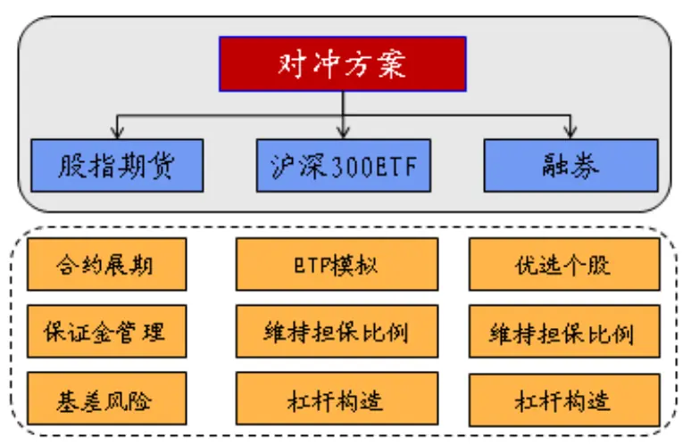
数据来源：广发证券研究发展中心

## (一) 股指期货对冲方案

沪深 300 股指期货合约自 2010 年 4 月 16 日起正式上市交易，从而结束了A股市场长期存在的单边格局，投资者在有选个股的同时，可以通过股指期货对股票组合的beta收益进行对冲，从而得到剩余的 Alpha收益。

## 1. 股指期货对冲流程

股指期货对冲方案的原理及流程如下：

图 5. 股指期货对冲方案流程图
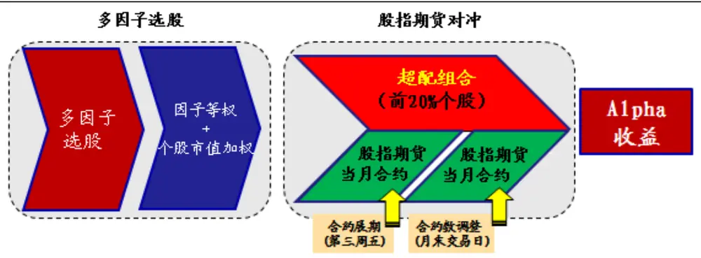
数据来源：广发证券研究发展中心

方案描述：自有资金预留部分作为股指期货维持保证金，剩余资金购入超配组合个股，同时做空等额的沪深 300股指期货，实现 1:1 的完全对冲。

合约选取及调整：采用股指期货当月合约进行做空，由于股指期货合约的最后交割交易日为合约到期月份的第三周五，而超配组合的调整日期为每月最后一个交易日，因此对于空头的股指期货合约每个月需要做两次调整：第一次是在每月合约的到期日要对当月合约进行展期操作；第二次是在月末最后一个交易日构建超配组合的同时，调整股指期货和约的数量，实现完全对冲。

对冲成本：万分之二；

保证金管理：本文我们采取静态的保证金策略，在每月末构建超配组合时，我们都固定预留总金额的 20％作为保证金，剩余80%资金构建超配组合，同时根据期初超配组合股票市值规模来计算持有股指期货空头合约的数量，在合约存续期内均保持和约数量不变，该方案是一种近似的保证金管理策略，忽略由于股指期货暴仓风险所导致的被动平仓操作。

## 2. 对冲结果

根据上述股指期货对冲方案，资金的实际运用效率为 80%，同时考虑期间股指期货基差带来的影响，得到对冲组合的表现如下图所示：

图 6. 股指期货对冲方案表现
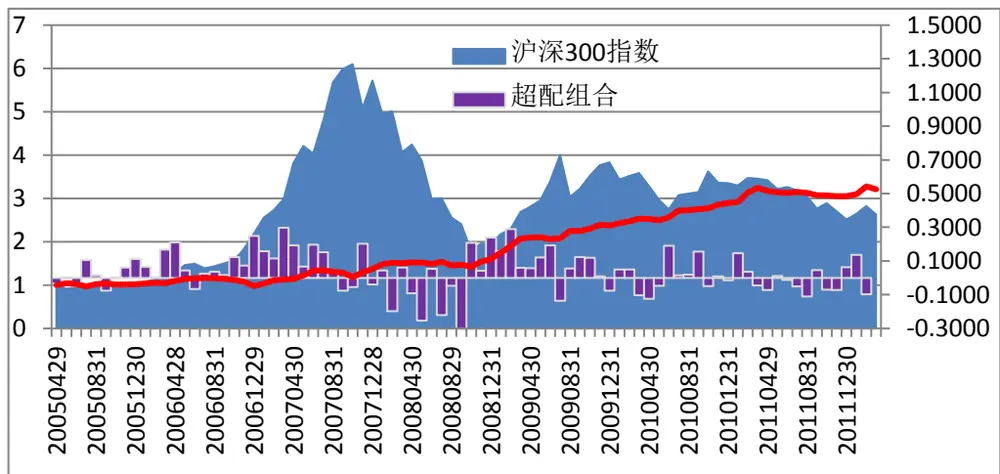
数据来源：广发证券研究发展中心，Wind数据库

表 1. 股指期货对冲方案表现 (考虑股指期货基差)

|  | 收益率 | 波动率 | IR | 最大回撤 |
| --- | --- | --- | --- | --- |
| 全样本(2005/4-2012/3) | 17.87% | 13.43% | 1.33 | 16.38% |
| 样本外(2010/4-2012/3) | 12.97% | 9.12% | 1.42 | 6.09% |

数据来源：广发证券研究发展中心，Wind数据库

表 2. 股指期货对冲方案逐年表现

| 年度 | 收益率 | 波动率 | IR | 最大回撤 |
| --- | --- | --- | --- | --- |
| 2005 | 3.35% | 11.38% | 0.29 | 6.66% |
| 2006 | -3.91% | 12.98% | -0.30 | 16.38% |
| 2007 | 36.39% | 18.11% | 2.01 | 11.69% |
| 2008 | 16.30% | 14.89% | 1.09 | 8.17% |
| 2009-2010/3 | 38.33% | 13.58% | 2.82 | 2.12% |
| 2010/4-2012/12 | 20.59% | 7.63% | 2.70 | 1.31% |
| 2011 | 5.83% | 9.20% | 0.63 | 6.09% |
| 2012/1-2012/3 | 累计收益率 | 5.25% |  | 1.94% |

数据来源：广发证券研究发展中心，Wind数据库

股指期货方案样本外的收益率为 12.97%，IR高达1.42，最大回撤为 6.1%，分年度来看，该对冲方案仅在2006年出现亏损，其余各年度均取得正的超额收益。

## 3. 基差的影响

上述的对冲方案中，由于股指期货推出以来，当月合约存在平均0.4%左右的月平均基差，将给对冲组合的收益带来显著的影响，扣除基差的影响，即假设以沪深300指数进行完全对冲，得到对冲之后的结果如下：

图 7. 股指期货对冲方案表现（不考虑基差影响）
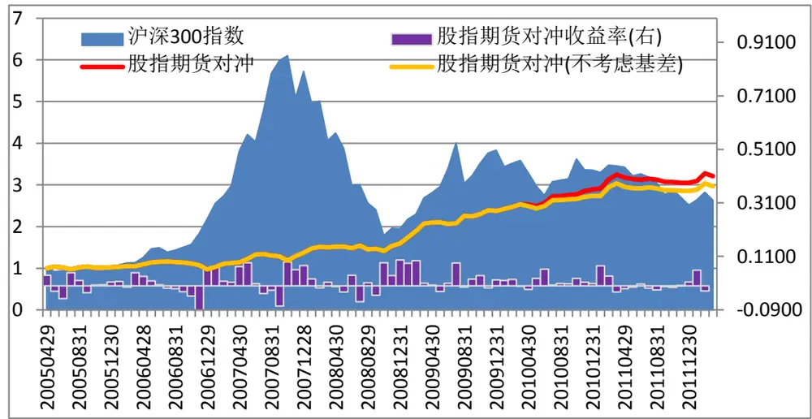
数据来源：广发证券研究发展中心，Wind数据库

表 3. 股指期货对冲方案表现 (不考虑基差)

|  | 收益率 | 波动率 | IR | 最大回撤 |
| --- | --- | --- | --- | --- |
| 全样本(2005/4-2012/3) | 17.87% | 13.43% | 1.33 | 16.38% |
| 样本外(2010/4-2012/3) | 12.97% | 9.12% | 1.42 | 6.06% |

数据来源：广发证券研究发展中心，Wind数据库

表 4. 股指期货对冲方案逐年表现(不考虑基差)

| 年度 | 收益率 | 波动率 | IR | 最大回撤 |
| --- | --- | --- | --- | --- |
| 2005 | 3.35% | 11.38% | 0.29 | 6.66% |
| 2006 | -3.91% | 12.98% | -0.30 | 16.38% |
| 2007 | 36.39% | 18.11% | 2.01 | 11.69% |
| 2008 | 16.30% | 14.89% | 1.09 | 8.17% |
| 2009-2010/3 | 38.33% | 13.58% | 2.82 | 2.12% |
| 2010/4-2012/12 | 14.36% | 8.08% | 1.78 | 2.33% |
| 2011 | 4.65% | 9.15% | 0.51 | 6.06% |
| 2012/1-2012/3 | 累计收益率 | 3.9 | 1% | 2.44% |

数据来源：广发证券研究发展中心，Wind数据库

在剔除基差的影响之后，股指期货对冲方案样本外的收益率下降至 9.853%，IR下降至1.06，最大回撤为6.06%，分年度来看，该对冲方案在2006 年出现亏损。

## (二) 融资融券对冲方案

在股指期货对冲方案中，由于只能对沪深300股指期货进行做空操作，因此多空组

合之间并不能实现真正的完全对冲；另一方面该方案的资金运用比率只有80％，令对冲组合的效果大打折扣！因此下面我们将结合融资融券探讨新的对冲方案，期望实现更完美的对冲效果，同时产生一定的杠杆。

然而融资融券好似一把“双刃剑”：一方面，杠杆在放大收益的同时也会把风险放大；另一方面，融资融券具有高昂的费用，因此对冲组合必须具有更加稳定且显著的收益，否则将会因为支付高昂的费用而导致对冲失败！

根据折算率的不同，我们根据折算率的不同，将可用于进行融资融券抵押的现金及证券分类如下表所示：

表 5. 不同融资融券标的折算率比较

| 业务类型 | 抵押证券 | 最高折算率 | 杠杆率 |
| --- | --- | --- | --- |
| 融资融券 | 现金 | 100% | 2 |
|  | 国债 | 95% | 1.9 |
|  | ETF基金 | 90% | 2.8 |
|  | 其他上市基金及债券 | 80% | 2.6 |
|  | 上证180和深证100股票 | 70% | 2.4 |
|  | 其他合规股票 | 65% | 2.3 |

数据来源：广发证券研究发展中心

## 1. 融资融券对冲流程

扩容之后的融资融券标的包括7只ETF和278只个股，下面分别基于这两类标的设计融资融券做空的对冲方案，方案的原理及流程如下：

图 8. 融资融券对冲方案流程图
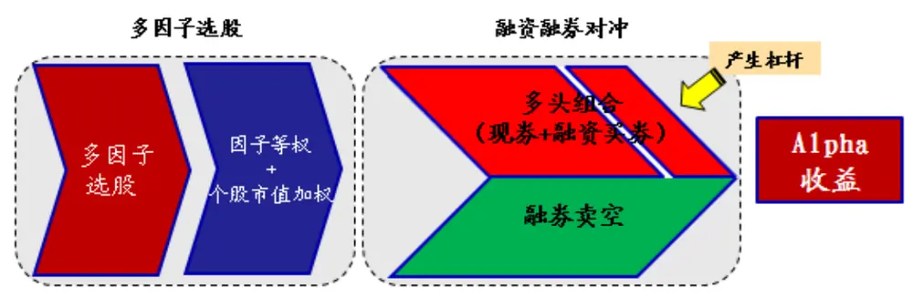
数据来源：广发证券研究发展中心

方案描述：将全部自有资金购入多头证券（即超配组合），并将所有现券作为抵押，部分用于融资买入做多证券，剩余用于融券卖空做空证券，实现 1:1的完全对冲，同时构造大于1倍的杠杆比例。

对冲标的：分别设计做空ETF和做空个股两种方案。

融资融券成本：9.1%，做空个股加收 0.1%印花税；

## 2. 融资融券对冲策略参数论证

如何运用融资融券实现多空组合完全对冲，并产生最大程度杠杆是本节所关注的核心，在策略构造过程我们重点考虑两个方面：

## 1) 首先是根据抵押证券的折算比率合理分配资金，使得杠杆比率最大化。

假设自有资金为1，多头证券的折算率为z，维持担保比例不低于130%，追加保证金比例150%，融资融券保证金比例M=50%。

将自有资金全部买入多头证券，并将所有现券作为抵押进行融资融券，抵押担保物可进行融资融券的市值规模为 $\lceil{\frac{z}{M}},$ ，以其中部分用于融资买入多头组合，剩余用于融券做空空头组合，为了实现完全对冲，融资买入的规模为 $(\frac{z}{M}-1)/2$ ，融券卖空规模为$(\frac{\mathbf{z}}{\mathbf{M}}+1)/2$ ，对冲组合的最大杠杆比例为：

$$
L=(\cfrac{z}{M}+1)/2
$$

图 11 显示，当融资融券保证金比例 M=50%固定时，对冲组合的杠杆比例与多头证券折算率成线性正相关。

图 9. 不同折算率对应的最大杠杆比例
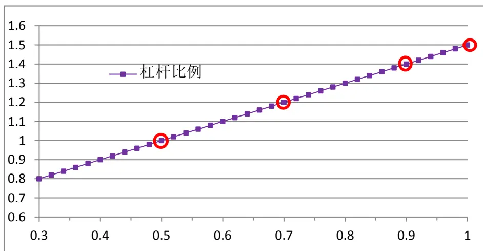
数据来源：广发证券研究发展中心，Wind数据库

当折算率低于 0.5时，杠杆比例小于 1，因此，通过将全部资金购买现券的方式无法有效放大杠杆，需要考虑预留部分资金作为融资融券担保，对于该情形本文暂不展开；

当折算率为 0.7 时（融资融券标的个股折算率），杠杆比例为 1.2，当折算率为 0.9（ETF折算率）时，杠杆比例为1.4，

当折算率为 1时，杠杆比例为1.5，这是完全对冲下所能达到的最高杠杆比例。

## 2) 其次，须紧盯信用帐户中资产和负债的市值，防止被迫平仓。

根据交易所发布的《融资融券交易试点实施细则》，须重点关注两个阀值：首先，维持担保比例不低于 130%；其次追加担保物后维持担保比例至少 150%。，维持担保比例计算公式如下：

维持担保比例=（现金+信用证券账户内证券市值）/（融资买入金额+融券卖出数量×当前市价+利息及费用），直观地说，就是“总资产/总负债”。

交易所要求投资者的帐户中，维持担保比例始终要高于130%，否则强制要求平仓,因此我们在每个月组合换仓之前检查对冲组合的担保比例，从而检验一方面检验多因子选股的效果，另一方面也能反映采用融券做空进行对冲的合理性。

## 3. 做空 ETF对冲方案

融资融券标的包含 ETF 和个股两类标的，针对不同类型标的特征下面我们分别构建两类对冲策略。

自扩容以来，共有7 只ETF被纳入融资融券标的，随着两只沪深300ETF的推出，融资融券标的新增了两只 ETF，下文，我们将首先对沪深 300ETF 进行模拟，并建立做空沪深 300ETF的对冲策略。

## （1）沪深 300ETF 模拟图

沪深 300ETF刚刚推出，缺乏历史净值数据，我们根据深证100ETF及上证 180ETF的历史跟踪误差，对沪深300ETF的历史净值进行模拟，如下图所示：

图 10. 沪深 300ETF 模拟历史净值
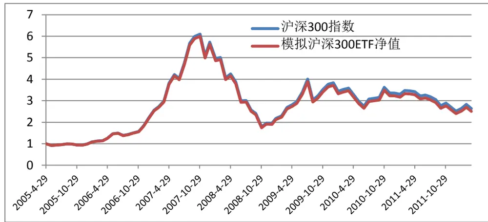
数据来源：广发证券研究发展中心，Wind数据库

## （2）对冲结果

根据图 9，多头证券的折算率为 70%，对应的对冲组合最高杠杆比例为120%，采用模拟的沪深 300ETF作为空头进行对冲，得到对冲组合的表现如下图所示：

图 11. ETF 对冲方案表现
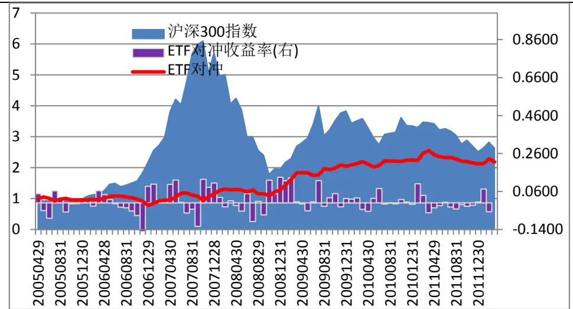
数据来源：广发证券研究发展中心，Wind数据库

表 6. ETF对冲方案效果

|  | 收益率 | 波动率 | IR | 最大回撤 |
| --- | --- | --- | --- | --- |
| 全样本(2005/4-2012/3) | 13.34% | 20.22% | 0.66 | 28.01% |
| 样本外(2010/4-2012/3) | 2.54% | 13.52% | 0.19 | 16.79% |

数据来源：广发证券研究发展中心

表 7. ETF对冲方案逐年效果

| 年度 | 收益率 | 波动率 | IR | 最大回撤 |
| --- | --- | --- | --- | --- |
| 2005 | -6.70% | 17.08% | -0.39 | 11.76% |
| 2006 | -17.62% | 19.44% | -0.91 | 28.01% |
| 2007 | 42.93% | 27.16% | 1.58 | 19.80% |
| 2008 | 12.66% | 22.36% | 0.57 | 16.79% |
| 2009-2010/3 | 45.79% | 20.35% | 2.25 | 4.63% |
| 2010/4-2010/12 | 9.82% | 12.14% | 0.81 | 4.49% |
| 2011 | -4.79% | 13.72% | -0.35 | 16.79% |
| 2012/1-2012/3 | 累计收益率 | 2.80% |  | 4.64% |

数据来源：广发证券研究发展中心，Wind数据库

可以看到，虽然采用 ETF 进行对冲具有较高的杠杆比例，但高昂的对冲成本使得该方案相比股指期货方案，收益率和 IR都出现大幅下降，据样本外跟踪，对冲收益率仅为 2.54%，远远低于扣除基差因素之后的股指期货对冲方案，IR 为 0.19，最大回撤高达 16.8%。

## （3）参数敏感性分析

转融通之后融资融券成本进一步降低可期，下面我们对融券成本与 ETF 做空方案的对冲收益率进行敏感性分析，图 12 显示，当融券成本由现有的 9.1%下降至1.6%左右时， ETF对冲方案样本外的收益率与股指期货对冲方案持平。

图 12. ETF对冲组合收益率对融券成本敏感性
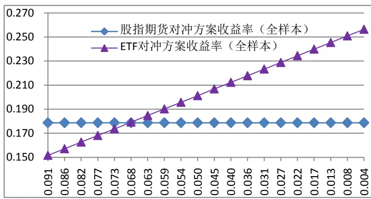

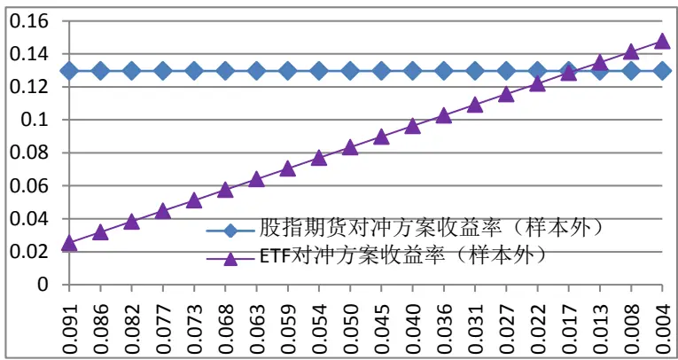
数据来源：广发证券研究发展中心（横轴：融券成本，纵轴：对冲组合收益率）

虽然ETF的杠杆效应能够有效提高对冲组合的超额收益率，但对冲组合的 IR却不受杠杆的影响，因此即使融券成本大幅下降，ETF对冲方案的IR始终都低于股指期货方案。

图 13. ETF对冲组合信息比对融券成本敏感性
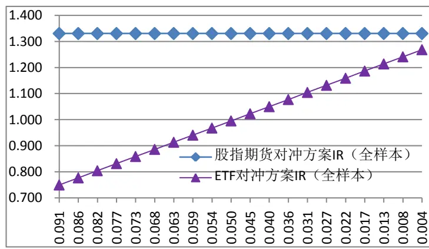

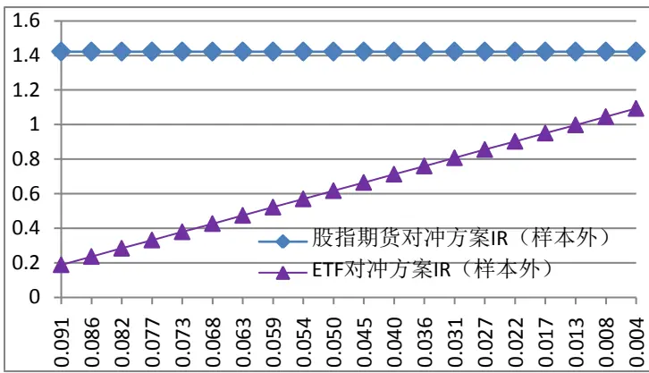
数据来源：广发证券研究发展中心（横轴：融券成本，纵轴：对冲组合信息比）

除了关注对冲组合的收益情况，还须密切关注融资融券信用帐户中的市值变动情况，确保维持担保比例不低于 130%，维持现有的融券成本不变，我们对不同折算率下，对冲组合在样本期间维持担保比例的变动情况。

图 14. 不同折算率下ETF对冲组合的维持担保比例变化情况
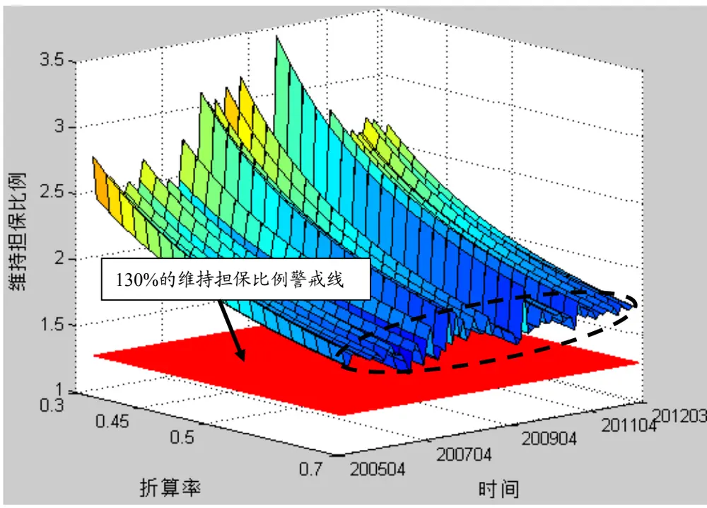
数据来源：广发证券研究发展中心，Wind数据库

由图 16，随着个股折算率由 0.3 增加至 0.9，样本期间的维持担保比例由 2.7 左右下降至 1.45 左右，以 0.7 的折算率为例，根据维持担保比例计算公式，建仓时组合的维持担保比例为 170%，样本期间的维持担保比例变化如下图所示，在样本跟踪期间，维持担保比例始终在 170%上下波动，且均在 130%以上，空头仓位不须做被动调整。

图 15. 折算率为0.7时,融券卖空 ETF对冲组合维持担保比例变化情况
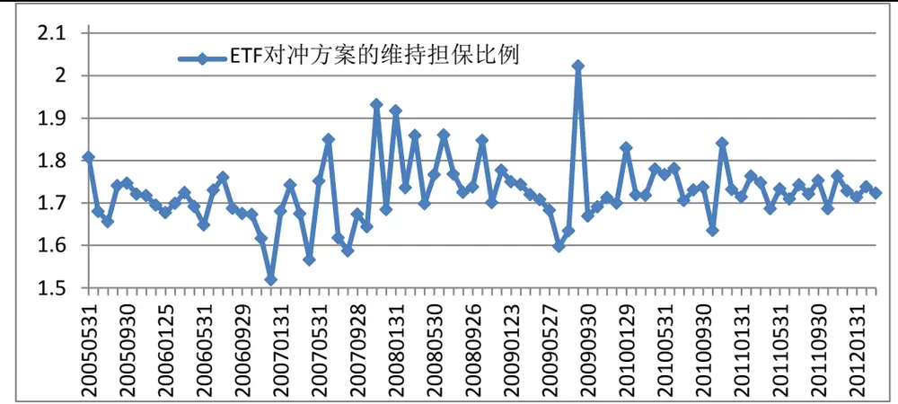
数据来源：广发证券研究发展中心，Wind数据库

## （4） “转融通”后预期对冲结果

假设转融通业务推出以后，融资融券标的折算率不变，而融资融券成本下降至 6%，

那么上述对冲方案的效果如下所示。

图 16. 融资融券成本下降至 6%后 ETF对冲方案表现
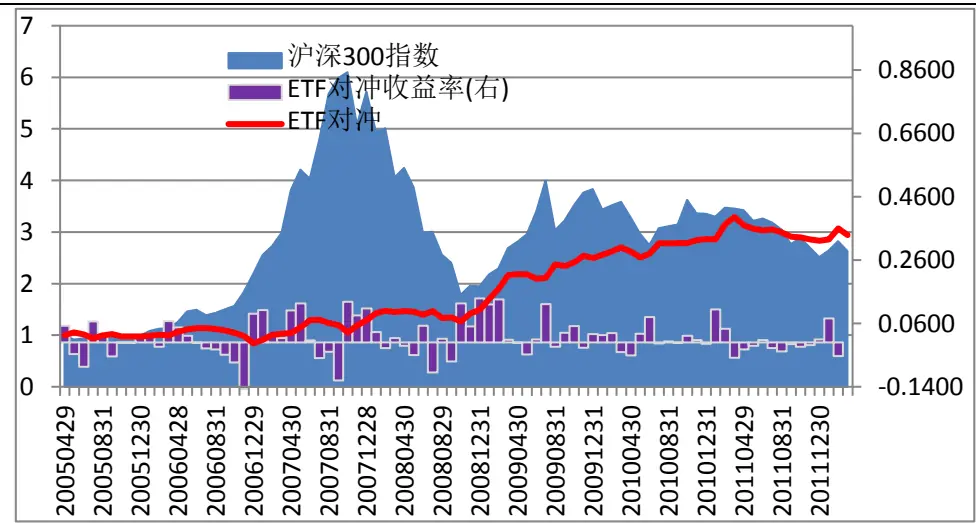
数据来源：广发证券研究发展中心，Wind数据库

表 8. 融资融券成本下降至 6%后 ETF对冲方案效果

|  | 收益率 | 波动率 | IR | 最大回撤 |
| --- | --- | --- | --- | --- |
| 全样本(2005/4-2012/3) | 17.68% | 20.22% | 0.87 | 26.33% |
| 样本外(2010/4-2012/3) | 6.88% | 13.52% | 0.51 | 13.98% |

数据来源：广发证券研究发展中心，Wind数据库

表 9. 融资融券成本下降至 6%后 ETF对冲方案逐年效果

| 年度 | 收益率 | 波动率 | IR | 最大回撤 |
| --- | --- | --- | --- | --- |
| 2005 | -2.36% | 17.08% | -0.14 | 11.07% |
| 2006 | -13.27% | 19.44% | -0.68 | 26.33% |
| 2007 | 47.27% | 27.17% | 1.74 | 18.86% |
| 2008 | 17.00% | 22.36% | 0.76 | 14.29% |
| 2009-2010/3 | 50.13% | 20.36% | 2.46 | 3.92% |
| 2010/4-2010/12 | 14.15% | 12.14% | 1.17 | 4.12% |
| 2011 | -0.45% | 13.72% | -0.03 | 13.98% |
| 2012/1-2012/3 | 累计收益率 | 3.91% |  | 4.28% |

数据来源：广发证券研究发展中心，Wind数据库

在融券成本下降之后对冲组合收益率上升至 6.88%，依然低于股指期货方案的收益率，但若不考虑基差因素的影响，已经比较接近股指期货方案的收益率，最大回撤略有下降为 13.98%。但对冲组合的 IR仍然比较低，只有0.51。

## 4. 做空个股对冲方案

前面分别运用股指期货和 ETF 对超配组合进行对冲，两种方法的共同点是以沪深

300 指数作为超配组合的比较基准及对冲标的，下面我们尝试第 3 种对冲方案，即直接融券做空低配组合，试图实现更完美得beta对冲。

## （1）对冲结果

根据图 9，多头证券的折算率为 70%，对应的对冲组合最高杠杆比例为 120%，采用多因子低配组合作为空头进行对冲，得到对冲组合的表现如下图所示：

图 17. 融券对冲方案表现
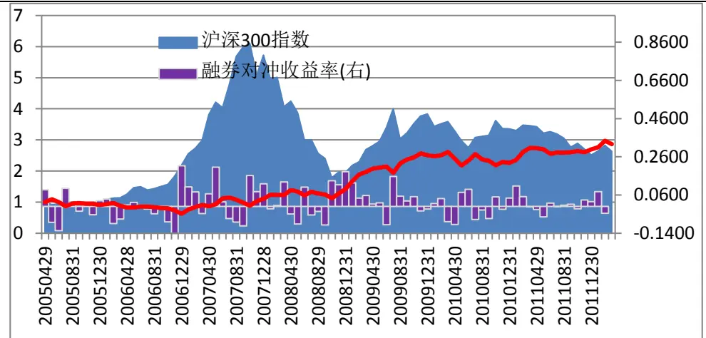
数据来源：广发证券研究发展中心，Wind数据库

表 10. 融券对冲方案效果

|  | 收益率 | 波动率 | IR | 最大回撤 |
| --- | --- | --- | --- | --- |
| 全样本(2005/4-2012/3) | 18.77% | 26.79% | 0.70 | 42.28% |
| 样本外(2010/4-2012/3) | 10.84% | 18.19% | 0.60 | 14.21% |

数据来源：广发证券研究发展中心，Wind数据库

表 11. 融券对冲方案逐年效果

| 年度 | 收益率 | 波动率 | IR | 最大回撤 |
| --- | --- | --- | --- | --- |
| 2005 | -11.41% | 26.68% | -0.43 | 19.91% |
| 2006 | -34.44% | 19.55% | -1.76 | 35.41% |
| 2007 | 64.44% | 37.53% | 1.72 | 22.70% |
| 2008 | 29.26% | 30.80% | 0.95 | 19.19% |
| 2009-2010/3 | 52.32% | 24.22% | 2.16 | 9.52% |
| 2010/4-2010/12 | -6.60% | 24.04% | -0.27 | 14.21% |
| 2011 | 18.60% | 14.01% | 1.33 | 7.10% |
| 2012/1-2012/3 | 累计收益率 | 6.39% |  | 3.63% |

数据来源：广发证券研究发展中心，Wind数据库

可以看到，虽然同样具有较高的对冲成本，使得采用融券做空的方案相比股指期货方案 IR大幅下降，但由于超低配组合同时具有较好的选股能力，加上 1.2倍的杠杆力，使得样本外对冲组合的平均收益率高达 10.84%，若不考虑股指期货基差的影响，已经高于采用股指期货进行对冲得到的收益率，但注意到杠杆作用下，对冲组合的跟踪误差和最大回撤同样被放大，样本外波动率高达 19%，最大回撤高达 14.2%，IR仅为 0.6。

## （2）参数敏感性分析

转融通之后融券成本有望进一步降低，下面我们同样对融券成本与组合的对冲收益率及 IR进行敏感性分析，下图显示，随着融券成本下降，对冲组合收益稳步提高至20%以上。

图 18. 融券对冲组合收益率与融券成本敏感性
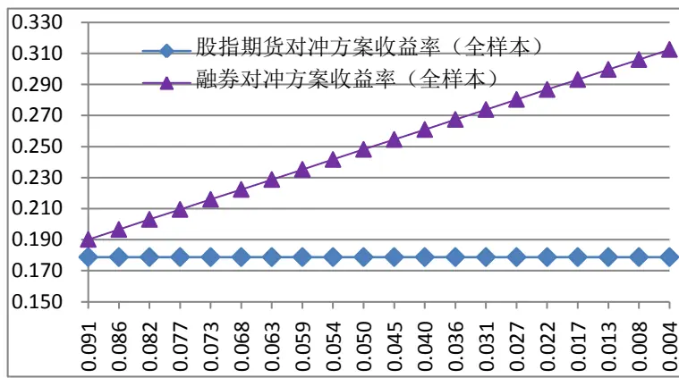
数据来源：广发证券研究发展中心（横轴：融券成本，纵轴：对冲组合收益率）

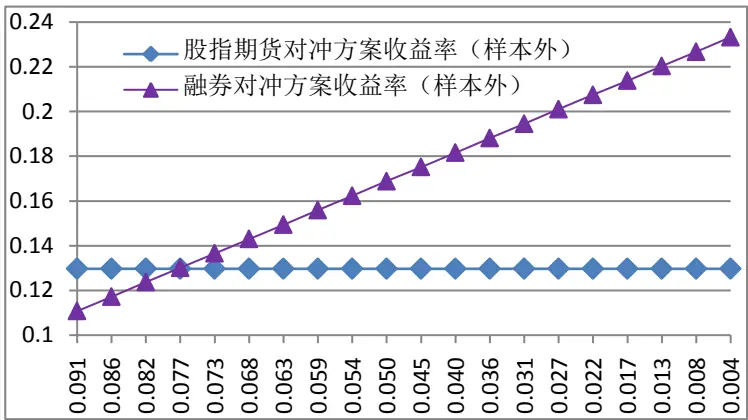

随着融券成本大幅下降，融券对冲方案的 IR 同样逐步增加，从样本外数据来看，融券做空个股对冲方案的 IR始终低于股指期货对冲方案的IR1.42，但若不考虑基差因素的影响，当融资融券成本下降至4%时，融券做空方案的信息比与股指期货方案持平，均为 1.06。

图 19. 融券对冲组合信息比与融券成本敏感性
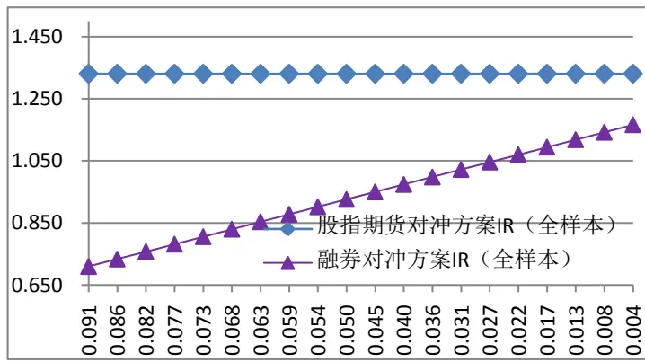

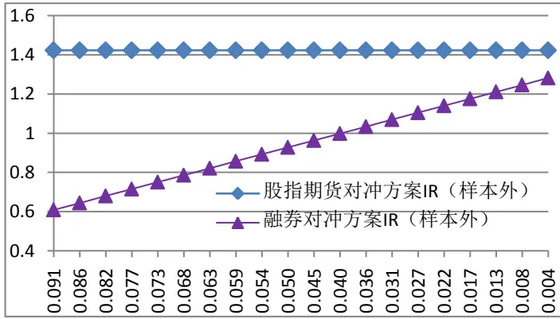
数据来源：广发证券研究发展中心（横轴：融券成本，纵轴：对冲组合信息比）

除了关注对冲组合的收益情况，我们须密切关注融资融券信用帐户中的市值变动情况，确保维持担保比例不低于 130%，维持现有的融券成本不变，我们对不同折算率下，对冲组合在样本期间维持担保比例的变动情况。

图 20. 不同折算率下融券对冲组合的维持担保比例变化情况
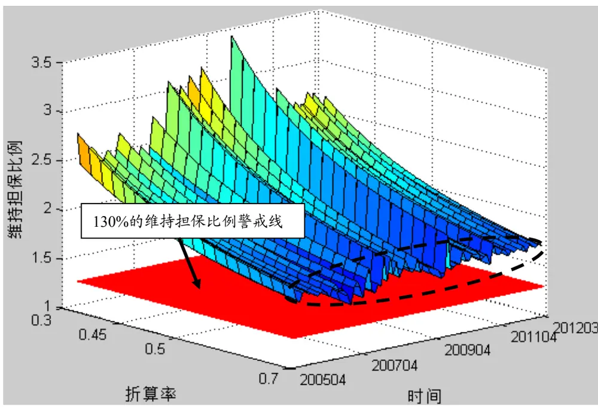
数据来源：广发证券研究发展中心，Wind数据库

由上图，随着个股折算率由 0.3增加至0.9，样本期间的维持担保逐步下降，以 0.7的折算率为例，根据维持担保比例计算公式，建仓时组合的维持担保比例为170%，样本期间的维持担保比例变化如下图所示，在样本跟踪期间，维持担保比例始终在 170%上下波动，且均在 130%以上，空头仓位不须做被动调整。

图 21. 融券对冲组合维持担保比例变化情况
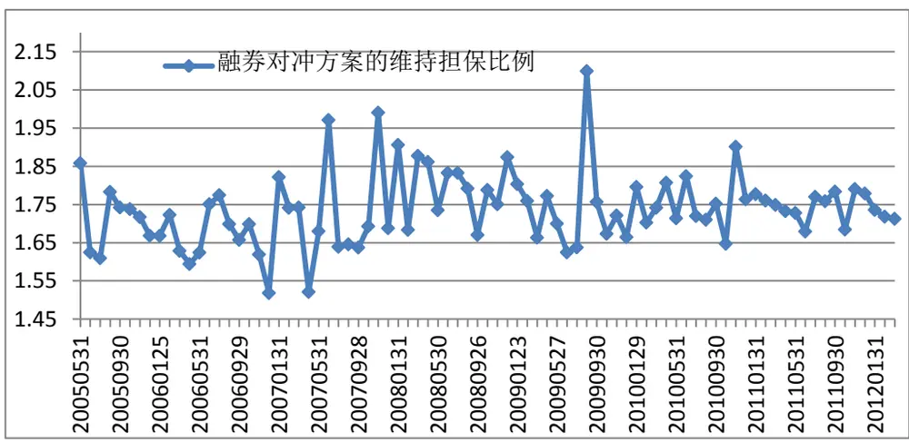
数据来源：广发证券研究发展中心，Wind数据库

## （3） “转融通”后预期对冲结果

假设转融通业务推出以后，融资融券标的折算率不变，而融资融券成本下降至 6%，那么上述对个股融券做空对冲方案的效果如下所示。

图 22. 融资融券成本下降至 6%后对冲方案表现
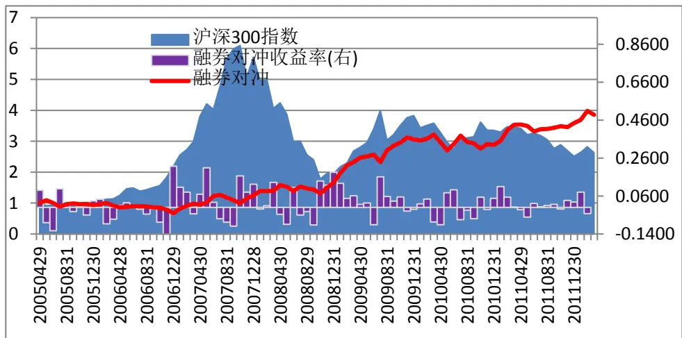
数据来源：广发证券研究发展中心

表 12. 融资融券成本下降至 6%后融券对冲方案效果

|  | 收益率 | 波动率 | IR | 最大回撤 |
| --- | --- | --- | --- | --- |
| 全样本(2005/4-2012/3) | 23.11% | 26.80% | 0.86 | 38.05% |
| 样本外(2010/4-2012/3) | 15.18% | 18.19% | 0.83 | 13.23% |

数据来源：广发证券研究发展中心，Wind数据库

表 13. 融资融券成本下降至 6%后融券对冲方案逐年效果

| 年度 | 收益率 | 波动率 | IR | 最大回撤 |
| --- | --- | --- | --- | --- |
| 2005 | -7.07% | 26.68% | -0.26 | 19.26% |
| 2006 | -30.11% | 19.55% | -1.54 | 32.93% |
| 2007 | 68.78% | 37.53% | 1.83 | 21.78% |
| 2008 | 33.61% | 30.81% | 1.09 | 17.36% |
| 2009-2010/3 | 56.66% | 24.22% | 2.34 | 9.16% |
| 2010/4-2010/12 | -2.25% | 24.04% | -0.09 | 13.23% |
| 2011 | 22.94% | 14.00% | 1.64 | 6.17% |
| 2012/1-2012/3 | 累计收益率 | 7.52% |  | 3.27% |

数据来源：广发证券研究发展中心，Wind数据库

在融券成本下降之后，做空个股的对冲组合尽显优势！对冲组合收益率上升至15.18%，已经大于股指期货方案的样本外收益率，最大回撤下降至 13.2%。；另外，组合的信息比 IR 为 0.83，依然低于股指期货对冲方案的 IR，如果投资者能够接受融资融券方案的 IR，同时接受杠杆带来的高收益及高风险，那么融券做空将是一种值得考虑的对冲方案，但从收益风险比，即信息比的角度来看，融券对冲方案依然是否具备足够吸引力取决于融资融券成本的进一步调控。

## (三) 对冲方案比较

下面对三类对冲策略的优缺点及对冲结果进行简要对比：

1. 首先，股指期货对冲方案在交易成本上具有非常突出的优势，样本外平均年化收益率为13%，IR高达1.42，分年度来看，该对冲方案只有在2006年出现亏损，其余各年度均取得正的超额收益。

剔除基差的影响之后，股指期货对冲方案样本外的年化收益率下降为9.53%，IR下降至1.06。

2. 其次是做空ETF方案，该方案相比股指期货的优点在于资金运用比例较高，为1.2倍，但融资融券成本高达 ，以模拟的沪深 进行做空对冲，根据样本外跟踪，对冲收益率仅为2.54%，甚至低于扣除基差因素之后的股指期货对冲方案。

在融券成本下降至6%之后对冲组合收益率上升至6.88%，依然低于股指期货方案的收益率，若不考虑基差因素的影响，已经比较接近股指期货方案的收益率，但对冲组合的IR仍然比较低。

3. 最后第三种方案采用融券做空个股进行对冲，该方案其最突出的优点在于能够卖空个股或板块，从而在对Beta进行完全对冲上做得更加充分，有利于提高对冲组合的IR；另一方面，与ETF对冲方案具有相同的杠杆比例1.2，在锁定IR的同时能够放大对冲组合收益率。根据样本外跟踪，对冲组合的平均收益率高达10.8%，若不考虑基差影响，高于采用股指期货进行对冲得到的收益率，IR也高达0.83。

在融券成本下降之后，做空个股的多重组合尽显优势！对冲组合收益率上升至15.18%，远远大于股指期货方案的样本外收益率；另外，组合的信息比IR为0.83，略低于股指期货对冲方案的IR，从收益风险的“性价比”来说，融资融券对冲方案依然期待融资融券成本的进一步下调。

综上而言，卖空 ETF对冲方案由于高昂的对冲成本，同时在beta对冲上并没有明显的优势，因此效果相对较差，而股指期货及卖空个股对冲方案各具千秋，融资融券的成本的高低是选择何种对冲方案的关键！但随着“转融通”的推出，融资融券成本进一步下调的预期愈演愈烈，随着给融资融券方案所带来的“诱惑”也相当之大。

图 23. 三类对冲方案净值走势对比

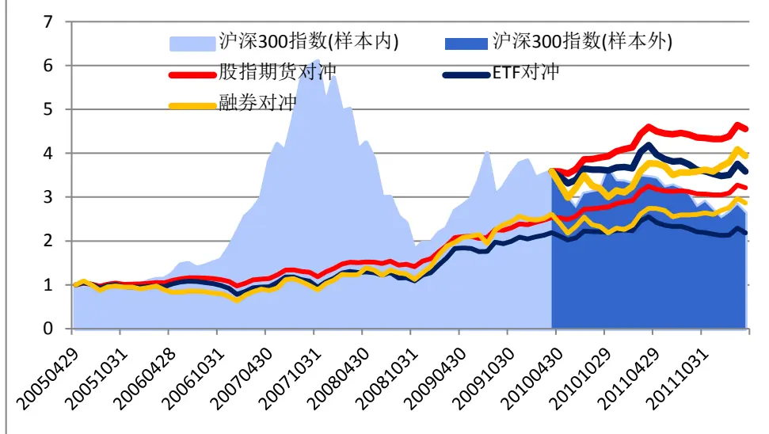
数据来源：广发证券研究发展中心，Wind数据库

图 24. 融资融券成本降为6%后，三类对冲方案净值走势对比
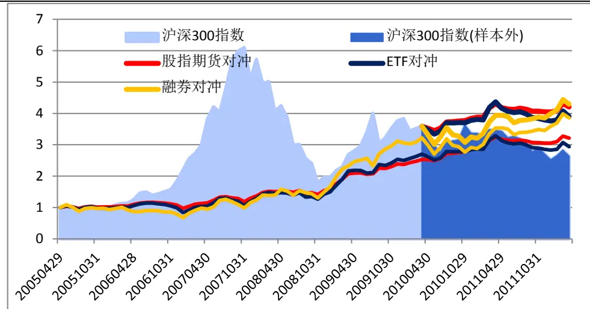
数据来源：广发证券研究发展中心，Wind数据库

## 四、总结

本文围绕股指期货及融资融券对冲方案展开论证：股指期货对冲方案在交易成本及流动性等方面具有优势；而融资融券对冲方案则在卖空个股实现完全对冲上占尽优势，同时其杠杆效应也具有相当的吸引力。

融资融券好似一把“双刃剑”：一方面，杠杆在放大收益的同时也会把风险放大；另一方面，融资融券具有高昂的费用，因此对冲组合必须具有更加稳定且显著的收益，否则将会因为支付高昂的费用而导致对冲失败！

此为投资者对这把“双刃剑”之“疑惑”！

随着融资融券的常规化，转融通业务的正式推出也成为弦上之剑，该业务将为投资者提供更为完善的对冲工具，同时其对冲成本也有望进一步下降，从而通过做空个股的可操作性将进一步加大。

此为“转融通”给投资者带来的“诱惑”！

到底是继续“疑惑”还是“诱惑”变成现实，一切将取决于转融通业务推出之后，融资融券新规则的设计，其中的核心便是融资融券成本，全文对各种不同规则参数下的三种对冲策略进行了全面的论证，试图找出各种方案的优缺点所在以及各种方案所适用的条件，实际应用中，投资者应考虑对冲过程中实际产生的各种成本，并在收益和风险之间找到自己的平衡点，从而选取合适的对冲方案。

## Table_AuthorSum 广发金融工程研究小组mary

| 罗军，首席分析师，华南理工大学理学硕士，2010年进入广发证券发展研究中心。 |
| --- |
| 俞文冰，首席分析师，CFA，上海财经大学统计学硕士，2012年进入广发证券发展研究中心 |
| 叶涛，资深分析师，CFA，上海交通大学管理科学与工程硕士，2012年进入广发证券发展研究中心。 |
| 安宁宁，资深分析师，暨南大学数量经济学硕士，2011年进入广发证券发展研究中心。 |
| 胡海涛，分析师，华南理工大学理学硕士，2010年进入广发证券发展研究中心。 |
| 夏潇阳，分析师，上海交通大学金融工程硕士，2012年进入广发证券发展研究中心。 |
| 汪鑫，分析师，中国科学技术大学金融工程硕士，2012年进入广发证券发展研究中心。 |
| 蓝昭钦，研究助理，中山大学理学硕士，2010年进入广发证券发展研究中心。 |
| 李明，研究助理，伦敦城市大学卡斯商学院计量金融硕士，2010年进入广发证券发展研究中心。 |
| 史庆盛，研究助理，华南理工大学金融工程硕士，2011年进入广发证券发展研究中心。 |
| 谢琳，研究助理，上海交通大学金融学博士研究生，2011年进入广发证券发展研究中心。 |

## Table_Report 相关研究报告

| 大浪淘沙，Alpha因子何处寻？ 史庆盛 2011-07-21 |
| --- |

|  | 广州市 | 深圳市 | 北京市 | 上海市 |
| --- | --- | --- | --- | --- |
| 地址 | 广州市天河北路183 号 | 深圳市福田区民田路178 | 3北京市西城区月坛北街2号上海市浦东南路 528 号 |  |
|  | 大都会广场5楼 | 号华融大厦9楼 | 月坛大厦18层 | 上海证券大厦北塔17楼 |
| 邮政编码 客服邮箱 | 510075 | 518026 | 100045 | 200120 |
| 服务热线 | gfyf@gf.com.cn 020-87555888-8612 |  |  |  |

## 免责声明

le_Disclaimer广发证券股份有限公司具备证券投资咨询业务资格。本报告只发送给广发证券重点客户，不对外公开发布。

本报告所载资料的来源及观点的出处皆被广发证券股份有限公司认为可靠，但广发证券不对其准确性或完整性做出任何保证。报告内容仅供参考，报告中的信息或所表达观点不构成所涉证券买卖的出价或询价。广发证券不对因使用本报告的内容而引致的损失承担任何责任，除非法律法规有明确规定。客户不应以本报告取代其独立判断或仅根据本报告做出决策。

广发证券可发出其它与本报告所载信息不一致及有不同结论的报告。本报告反映研究人员的不同观点、见解及分析方法，并不代表广发证券或其附属机构的立场。报告所载资料、意见及推测仅反映研究人员于发出本报告当日的判断，可随时更改且不予通告。

本报告旨在发送给广发证券的特定客户及其它专业人士。未经广发证券事先书面许可，任何机构或个人不得以任何形式翻版、复制、刊登、转载和引用，否则由此造成的一切不良后果及法律责任由私自翻版、复制、刊登、转载和引用者承担。