# Table_Title考虑换手率限制的多因子 Alpha 模型

# 16274——多因子 Alpha系列报告之（十一）

罗军Table_Author 首席分析师

电话：020-87555888-8655

eMail：lj33@gf.com.cn

执业编号：S0260511010004

## 信息具有时间维度

信息是具有时间维度的，以不同速度到达的信息，将在不同长短的时间区间内具有其相应的价值，某些信号可能在发出的瞬间同时也失去其价值，而某些信号可能在随后的一两年期间依然保持较大的信息量，某些情况下，新老消息的组合要比单独的信消息更具有价值。信息与时间的互动就好比人们在挑选食物一样：蔬菜越新鲜越好，而陈年老酒则更加有味道，雪利（Sherry）则多种年份混合品尝效果更佳！

## Alpha 因子存在半衰竭周期

通过观察因子有效性随着因子滞后时间的延长而出现的变化，发现大部分 Alpha 因子的有效性均存在明显的衰竭现象，且存在相对稳定的“半衰期”，在半衰期内，因子的有效性具有显著的可持续性并同时符合稳定衰减的规律。报告中挑选了 10个 Alpha 因子，并对其衰竭规律及“半衰期”进行了分析。

## 通过因子平滑，实现对单因子换手率控制

为了实现对因子换手率的控制，我们在每个因子半衰期内，对各期的滞后因子采取平滑处理，构造由当前及滞后的因子暴露组成的综合因子，由于各期综合因子之间的自相关系数ρ得到了提高，从而降低了组合的换手率，进而我们通过对各滞后期因子之间权重的优化，实现对组合换手率的控制，同时使得因子的IC_IR最大化！

## 通过对各类因子平滑，实现对多因子策略的换手率控制

为了实现对多因子策略换手率的控制，我们首先在不同Alpha因子之间采用平均加权，各类因子各期滞后因子的权重根据优化问题(3-2)的求解结果得到。样本外的实证结果表明，通过对各Alpha因子采取滞后期平滑处理，多因子组合换手率最多可控制在原来的68%左右，即由47%下降为32%，而同时组合的IC_IR仅下降为85%，由2.6下降为2.2。

换手率的控制是通过设置约束条件并求解最优化问题(3-2)实现的，实际应用当中，不同投资者所采用的Alpha因子以及对换手率的要求也都各不相同的，报告提供的是一种通用的研究思路，投资者可以在更多选股因子上，通过报告中所提出的办法来实现对组合换手的控制，并使得组合的信息比率最大化。

关于多因子之间的权重分配，本报告采用等权分配，除此之外，可以尝试对每类因子的各期滞后项进行混合优化，求解不同的权重分配方案。关于组合换手率及信息比优化问题一直是我们所密切关注的，其使用的方法丰富多彩，此篇为该专题之初探，为敲门砖之用，后续将推出其他相关研究，敬请关注，欢迎交流。

## 一、引言

信息是具有时间维度的，以不同速度到达的信息，将在不同长短的时间区间内具有其相应的价值。对于大多数信息来说，其达到的速度是固定的，而信号价值所持续的时间长度则是人们普遍关注的热点，某些信号可能在发出的瞬间同时也失去其价值，而某些信号可能在随后的一两年期间依然保持较大的信息量，甚至在某些情况下，新老消息的组合要比单独的信消息更具有价值。信息与时间的互动就好比人们在挑选食物一样：蔬菜越新鲜越好，而陈年老酒则更加有味道，雪利（Sherry）则多种年份混合品尝效果更佳！

在前期报告《大浪淘沙，Alpha因子何处寻？》1中，我们对大量的选股因子从多个维度进行了综合分析，并挑选得到一部分效果显著的Alpha因子，其中“股价反转”等因子由于变动频繁，导致多因子组合的换手率较高，如何根据投资者的要求，在组合的换手率及信息比之间取得平衡便是本报告的主要目标。

为了有效控制组合的换手率，本文所采用的方法是对因子近若干期的取值进行移动平均处理，该方法能够显著降低组合换手率，但最大的问题在于同时会对组合的信息比造成影响，为此我们进一步观察因子有效性的可持续，统计检验结果表明，大部分Alpha因子的有效性随着因子滞后期的加大，出现了明显衰竭现象，且存在相对稳定的“半衰期”。通过寻找每个因子的“半衰期”，从而确定了因子的平滑区间，进而在 “半衰期”内对各因子进行平滑处理，实现对换手率的控制，同时通过求解最优化问题是的组合信息比最大化。

报告的书写逻辑和各节安排如下：

第一节：前言，本节介绍了报告研究的目的，并简要说明研究思路；

第二节：提出因子“半衰期”的概念，通过分析10个Alpha因子的衰竭规律确定其各自的“半衰期”；

第三节：本节基于第二节的测算结果，分析检验了在单个因子上，随着因子权重的调整优化，换手率与因子信息比之间的变化速度差异。

第四节：本节是模型架构的最后一步，介绍了如何通过对各个因子进行平滑来控制多因子组合的换手率，同时确保多因子组合的信息比缓慢下降，最后通过样本外数据进行了实证检验。

第五节：最后对报告的内容进行简要总结，并给出符合实际应用的建议和后续研究展望。

## 二、因子半衰竭周期检验

## (一)因子半衰期定义

上文提到，信息具有其时效性，对于选股因子而言，每个股票在其之上的暴露程度便是投资者所观察到的“信息”，该信息同样具有时效性，一般情况下，随着时间的滞后，信息的价值将逐步下降。为了方便理解因子的时效性，我们举个例子：假设有A和B两个投资经理，他们都遵循同一种投资策略（可能对应一个或多个选股因子），不同的是A经理和B经理对因子信息的获取速度不同，A在信息产生的同时得到信息，而B则在信息滞后T期后才得到信息，两人都在各自收到信息后开始执行相同的投资策略，由于信息是小型的差异，A经理和B经理的投资组合表现将会有所不同，且差异大小将取决于其遵循的投资策略是否具备较好的可持续性，前者由于具有更及时信息因此通常获得更高的回报，而后者的投资回报则出现一定程度的衰减，对于固定的投资策略，B经理的最长滞后时间是多长? 再回到因子本身，便是各选股因子是否具备可持续性：一个因子在延期多久之后依然可以用来选股，一个月？六个月？还是在次月就失去了其有效性，应立即实施？

这便是本节所要研究的因子衰竭效应，而对于一个因子的衰竭效应分析，我们认为不仅仅是要搜索其所谓的“最佳滞后期”，而是要寻找一个合理的区间长度，使得因子在该滞后长度内的有效性具有显著的可持续性并同时符合稳定衰减的规律。关于因子有效性衰减规律的一个合理测度寻找因子的半衰期T，即因子从立即执行所能获得的IC_IR下降为一半时所需的时间长度。在实际应用中，这便意味着因子信息比率将以指数形式进行衰减。

本文采用 $IC\_IR_{i}^{2}$ 来刻画Alpha因子Fi的有效性，IC_IRi的减少则标志着因子有效性的衰减。

图 1. 因子有效性衰竭示意图
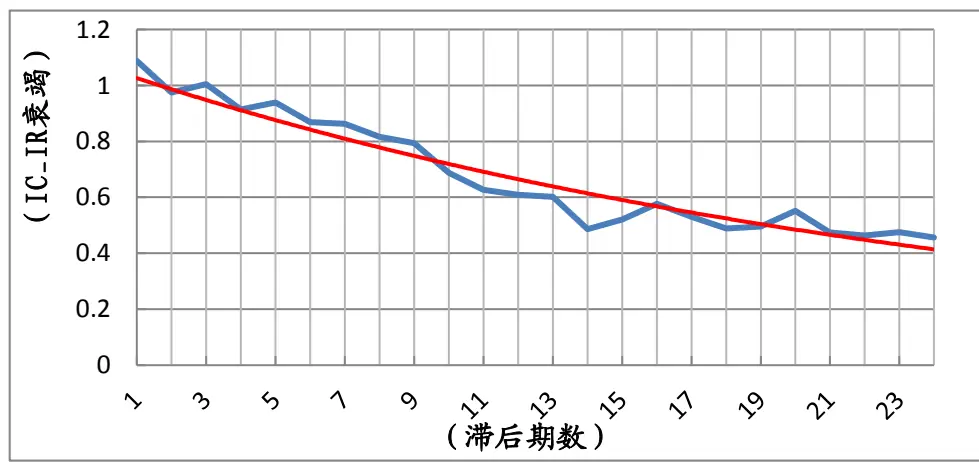
数据来源：广发证券研究发展中心，Wind数据库

在《大浪淘沙，Alpha因子何处寻？》中，我们对多个因子的有效性进行了全面的分析并挑选得到部分Alpha因子，下面我们将根据这些因子的历史表现来寻找其合理的半衰期。其中盈利、成长以及质量等几类因子由于数据直接来源于财报上的数据，通常至少一个季度以上才更新一次数据，因此时效性明显滞后于流动性及股价相关等因子，在对因子衰竭周期进行分析时剔除了这几类因子，重点分析下列10个因子：

表 1. 部分有效 Alpha 因子

| 因子 | IC | IC_IR |
| --- | --- | --- |
| 1个月成交金额 | -5.50% | -1.09 |
| 换手率 | -6.13% | -1.57 |
| 一个月股价反转 | -4.67% | -0.93 |

| 三个月股价反转 | -3.85% -0.67 |
| --- | --- |
| 六个月股价反转 | -2.24% -0.37 |
| 流通市值 | -3.16% -0.43 |
| 每股派息/股价 | 2.64% 1.18 |
| EP | 4.21% 1.37 |
| SP | 2.97% 1.37 |
| BP | 4.36% 1.27 |

数据来源：广发证券研究发展中心，Wind数据库

## (二)寻找因子半衰期

前面我们对因子的衰竭规律进行了分析并提出了因子半衰期的定义，下面将结合表 2 所列的10个Alpha 因子测算其合理的半衰期，采用的样本数据及分析的基本方法如下：

个股样本：中证800成份股；

样本期间：2000 年 1 月 31 日-2012 年 4 月 27 日共 148 个月，其中 2007 年 1 月 31 日之前的成份股，根据中证800指数的编制规则进行近似模拟。

半衰期原则：半衰期内因子须具备明显的趋势性、同时IC_IR衰减幅度大约为一半。

个因子衰竭情况如下：

## （1） 一个月成交金额

图 2. 一个月成交金额有效性衰竭规律
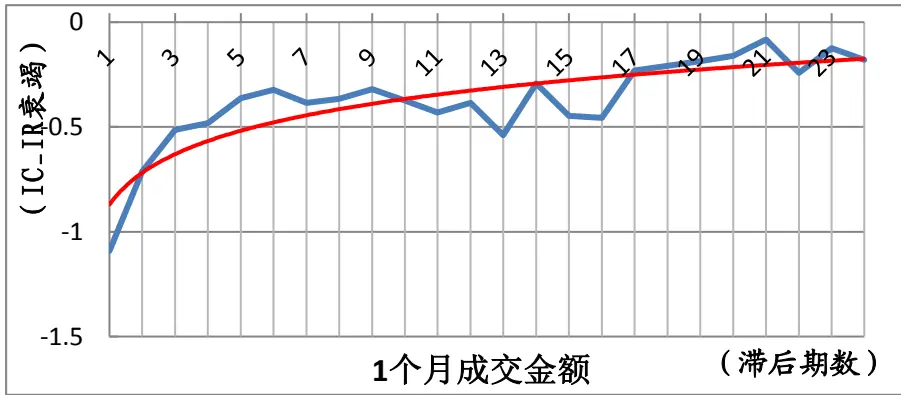
数据来源：广发证券研究发展中心，Wind数据库

“一个月成交金额”具有明显的衰竭效应，滞后期从 1 个月到 24 个月之间，因子 IC_IR（后文默认为绝对值） 由 1.1下降到0.2 左右，其短期效应明显，在 2-3个月之内，因子有效性迅速下降到一半，设定其半衰期为2个月。

## （2） 换手率

图 3. 换手率有效性衰竭规律
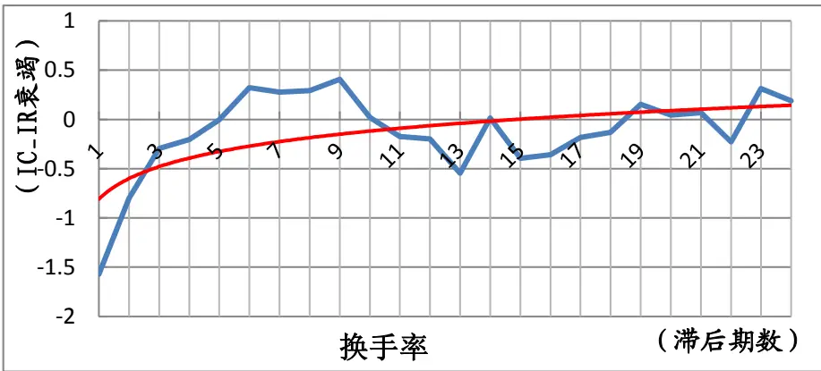
数据来源：广发证券研究发展中心，Wind数据库

“换手率”同样具有明显的衰竭效应，IC_IR的半衰期在2个月左右，短期效应明显。

## （3） 一个月股价反转

图 4. 一个月股价反转有效性衰竭规律
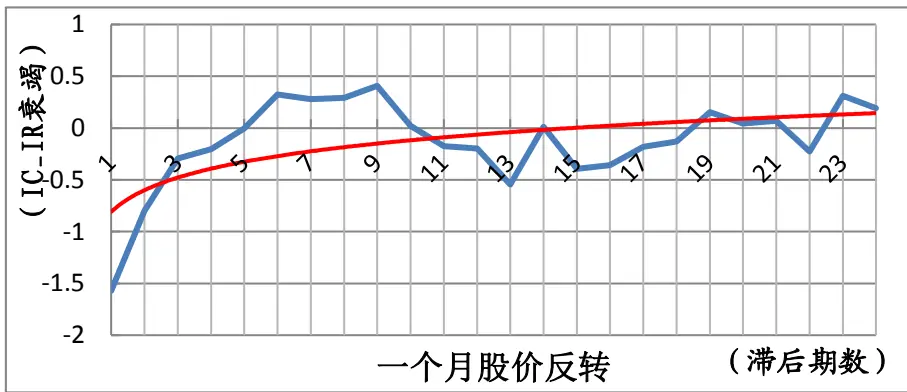
数据来源：广发证券研究发展中心，Wind数据库

“一个月股价反转”同样具有明显的衰竭效应，IC_IR 的半衰期在 2个月左右，短期效应明显。

## （4） 三个月股价反转

图 5. 三个月股价反转有效性衰竭规律
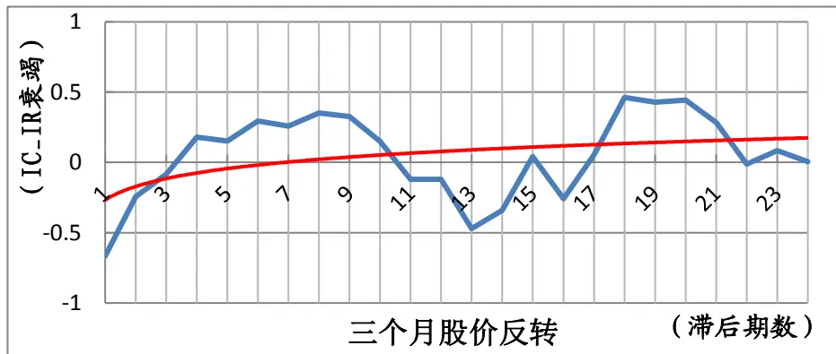
数据来源：广发证券研究发展中心，Wind数据库

“三个月股价反转”的短期衰竭效应同样很明显，IC_IR的半衰期在 2个月左右，半年以外，因子IC_IR的变动极不稳定，缺乏明显的趋势性。

## （5） 六个月股价反转

图 6. 六个月股价反转有效性衰竭规律
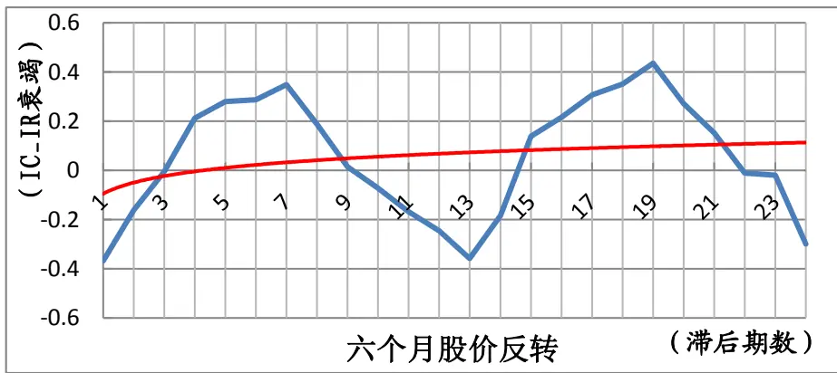
数据来源：广发证券研究发展中心，Wind数据库

“六个月股价反转”的短期衰竭效应同样很明显，IC_IR的半衰期在 2个月左右，半年以外，因子IC_IR的变动呈现一定的周期性。

## （6） 流通市值

图 7. 流通市值有效性衰竭规律
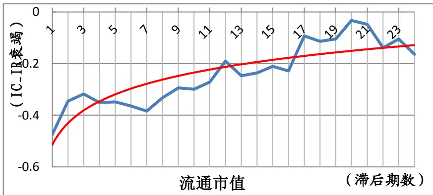
数据来源：广发证券研究发展中心，Wind数据库

“流通市值”同样具有明显的衰竭效应，IC_IR的半衰期在3个月左右，短期和长期衰竭效应都比较明显。

## （7） 每股派息/股价

图 8. 每股派息/股价有效性衰竭规律
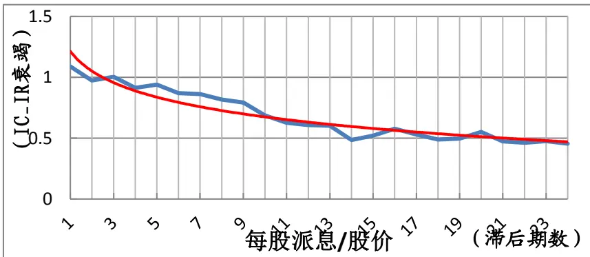
数据来源：广发证券研究发展中心，Wind数据库

“每股派息/股价”因子衰竭规律非常显著，IC_IR的半衰期长达9个月左右。

## （8） EP

图 9.EP有效性衰竭规律

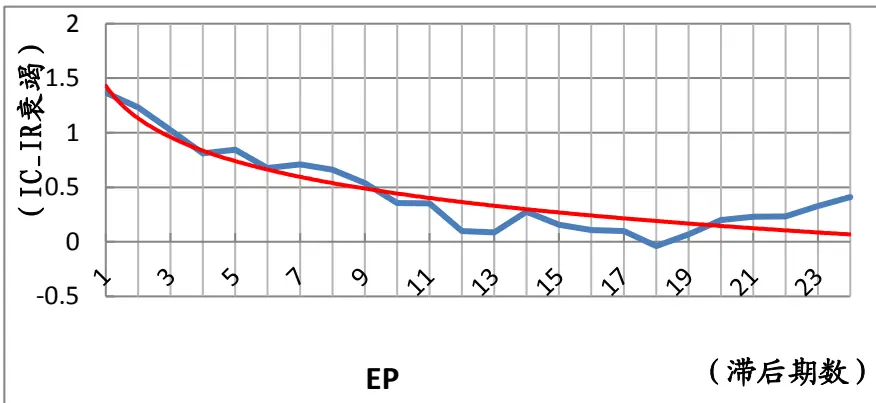
数据来源：广发证券研究发展中心，Wind数据库

“EP”同样具有明显的衰竭效应，IC_IR的半衰期在3个月左右，短期衰竭效应明显。

## （9） SP

图 10.SP有效性衰竭规律
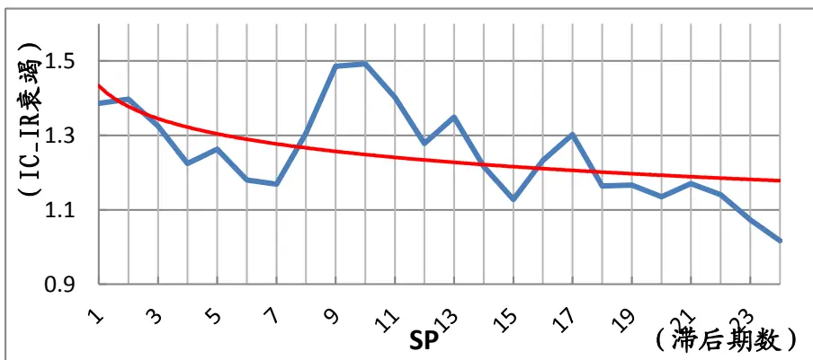
数据来源：广发证券研究发展中心，Wind数据库

“SP”同样具有明显的衰竭效应，IC_IR的半衰期在3-4个月左右，短期效应明显。

图 11.BP有效性衰竭规律
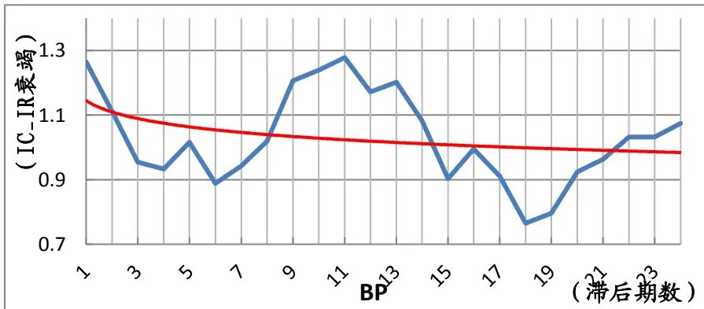
数据来源：广发证券研究发展中心，Wind数据库

“BP”同样具有明显的衰竭效应，IC_IR的半衰期在3个月左右，短期效应明显。综上，我们得到全部各个因子的半衰期如下表所列：

表 2. Alpha 因子半衰期

| 因子 | 半衰期（月） |
| --- | --- |
| 1个月成交金额 | 2 |
| 换手率 | 2 |
| 一个月股价反转 | 2 |
| 三个月股价反转 | 2 |
| 六个月股价反转 | 2 |
| 流通市值 | 3 |
| 每股派息/股价 | 9 |
| EP | 3 |
| SP | 3 |
| BP | 3 |

数据来源：广发证券研究发展中心，Wind数据库

## 三、考虑换手率的单因子分析

上一节中我们通过A经理和B经理的例子，对选股策略的有效性衰竭进行说明，并统计得到每个选股因子的半衰期，在半衰期内，我们认为投资经理B的策略依然具有可操作性。出于增强投资策略稳定性，降低组合换手率的考虑，我们想到了能否构造一个新的投资策略，将A经理和B经理的策略进行合并，使得策略的稳定性可控的前提下，实现策略表现最优化？

## (一)如何控制因子换手率

有效的选股因子往往也具有较高的换手率，如表3所示，其中“一个月股价反转”的换手率最高为79%，换手率及三个月股价反转等因子换手也均在50%左右。在构建多因子组合时，如果直接剔除高换手率的因子固然可以减低换手率，但同时策略的有效性将会大打折扣！

| 表 3. 因子换手率 |  |  |  |
| --- | --- | --- | --- |
| 因子 | IC | IC_IR | 换手率 |
| 1个月成交金额 | -5.50% | -1.09 | 45.6% |
| 换手率 | -6.13% | -1.57 | 48.2% |
| 一个月股价反转 | -4.67% | -0.93 | 79.0% |
| 三个月股价反转 | -3.85% | -0.67 | 56.2% |
| 六个月股价反转 | -2.24% | -0.37 | 46.4% |
| 流通市值 | -3.16% | -0.43 | 22.1% |
| 每股派息/股价 | 2.64% | 1.18 | 26.9% |
| EP | 4.21% | 1.37 | 23.3% |
| SP | 2.97% | 1.37 | 24.3% |
| BP | 4.36% | 1.27 | 26.5% |

数据来源：广发证券研究发展中心，Wind数据库

如何才能在不剔除既有因子的情况下，做到降低因子换手率？比较直观的一个想法便是提高各期因子之间的自相关系数ρ，而对因子采取移动平均处理能够有效地实现这一点。

在各个因子的“半衰期”内，我们首先对各期的因子暴露进行平滑处理，令：

$$
F_{t,ma}{=}w_{0}F_{t}{+}w_{1}F_{t-1}{+}w_{2}F_{t-2}{+}...{+}w_{l-1}F_{t-T+1}\tag{3-1}
$$

其中， $w_{i}$ 为滞后i期的因子权重，T是因子半衰期。

上文中我们统计发现，随着因子滞后期的延长，因子有效性（IC_IR）也逐步下降，因此可以想象，采用因子移动平均的方法虽然或许能够降低换手率，但同时将以Alpha作为代价，因此如何在两者之间取得平衡成为最核心的问题。为此我们建立了如下优化模型：

$$
\begin{array}{rl}{\mathrm{Maxmize};}&{{}IC\_IR=\frac{w^{\prime}\cdot\overline{{IC}}}{\sqrt{w^{\prime}\cdot\sum_{ic}\cdot w}}}\end{array}\tag{3-2}
$$

$$
\mathrm{Subjectto:}\quad\overline{{TO}}=TO_{target}
$$

给定组合的平均换手率 TO，通过求解优化问题(3-2)可以得到衰竭周期T内，各期滞后因子的平滑权重 $w_{i\cdot}$ 令

$$
\rho_{f}=\mathrm{corr}(F_{t,ma},F_{t-1,ma})
$$

相关研究表明，

$$
TO\propto\sqrt{1-\rho_{f}}\tag{3-2}
$$

因此下文我们将观察，随着因子自相关系数 $\cdot\rho_{f}$ 的变化，组合换手率及信息比之间的变化速度是否有所差别。

## (二)单因子检验结果

## （1） 一个月成交金额

根据表 2 所列各因子的半衰期，对各因子求解优化问题(3-2)可得到因子换手率及 IC_IR随着 $\cdot\rho_{f}$ 的变化以及相应的滞后因子权重分布情况，为了方便对比，我们将做平滑处理之前的因子换手率及IC_IR均取一个单位。

图 12. 考虑换手率限制的“一个月成交金额”有效性衰竭规律
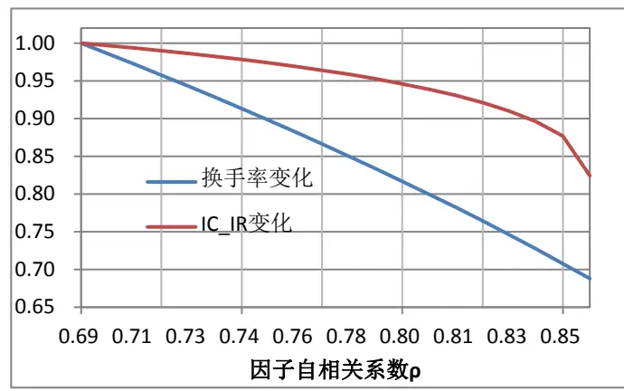
数据来源：广发证券研究发展中心，Wind数据库

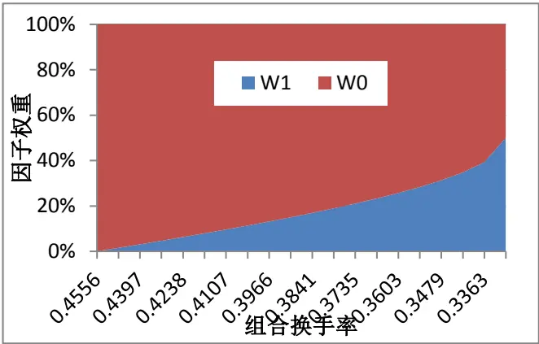

“一个月成交金额”在 2 个月的半衰期内，随着因子权重 w0和 w1由(1,0)逐步变为(0.5,0.5)，因子自相关系数由 0.69 增加至 0.86，换手率迅速下降至原来的 69%，而 IC_IR 的下降则相对缓慢，在半衰期内下降至83%。

## （2） 换手率

图 13. 考虑换手率限制的“换手率”有效性衰竭规律
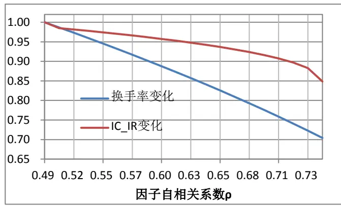
数据来源：广发证券研究发展中心，Wind数据库

## （3） 一个月股价反转

“换手率”在 2 个月的半衰期内，随着因子权重 w0和 w1由(1,0)逐步变为(0.5,0.5)，因子自相关系数由0.49增加至0.74，换手率迅速下降至原来的70%，而IC_IR的下降则相对缓慢，在半衰期内下降至 85%。

图 14. 考虑换手率限制的“一个月股价反转”有效性衰竭规律
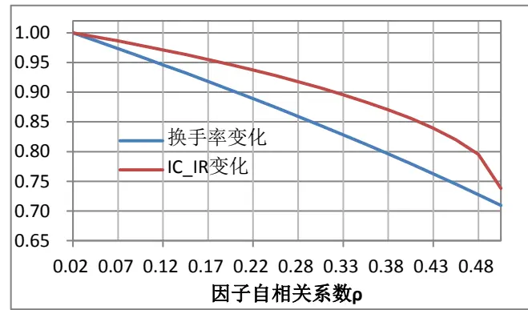
数据来源：广发证券研究发展中心，Wind数据库

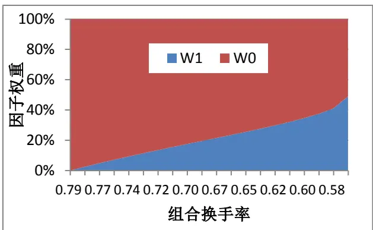

“一个月股价反转”在2个月的半衰期内，随着因子权重w0和w1由(1,0)逐步变为(0.5,0.5)，因子自相关系数由0.02增加至 0.51，换手率迅速下降至原来的71%，而IC_IR 的下降则相对缓慢，在半衰期内下降至74%。

## （4） 三个月股价反转

图 15. 考虑换手率限制的“三个月股价反转”有效性衰竭规律
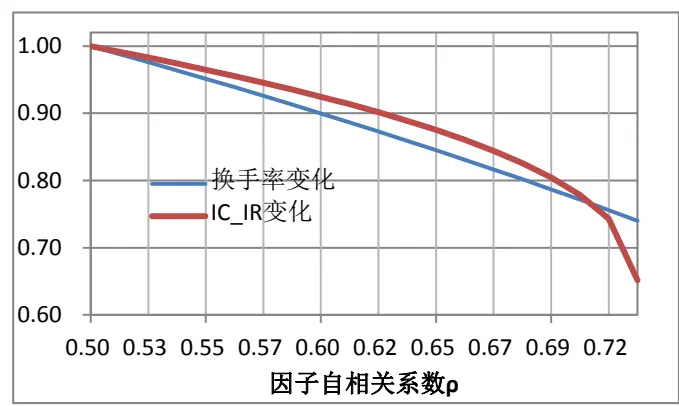

数据来源：广发证券研究发展中心，Wind数据库

“三个月股价反转”在2个月的半衰期内，随着因子权重w 和w 由(1,0)逐步变为(0.5,0.5)，因子自相关系数由0.02增加至 0.51，换手率下降至原来的 75%，而由于该因子在半衰期内有效性较低且下降速度快，导致随着权重的调整，尤其是随着滞后一期的因子权重达到 0.4 之后，IC_IR的下降速度快于换手率的下降幅度，在半衰期内IC_IR 下降至65%。

## （5） 六个月股价反转

图 16. 考虑换手率限制的“六个月股价反转”有效性衰竭规律
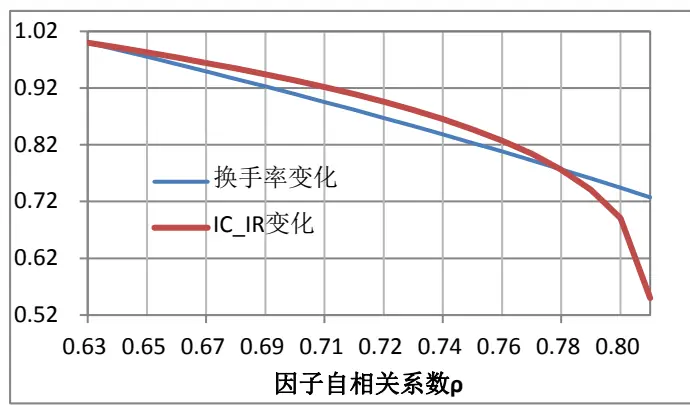
数据来源：广发证券研究发展中心，Wind数据库

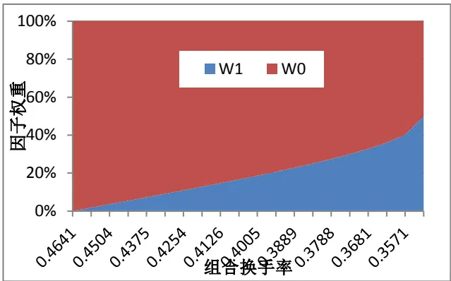

“六个月股价反转”在 2 个月的半衰期内， IC_IR 的下降速度同样快于换手率的下降幅度，在半衰期内 IC_IR 下降至 53%。

## （6） 流通市值

图 17. 考虑换手率限制的“流通市值”有效性衰竭规律
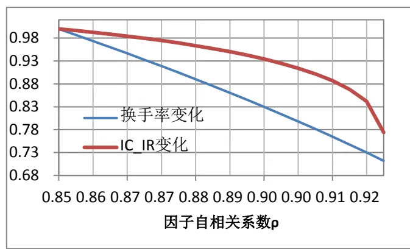

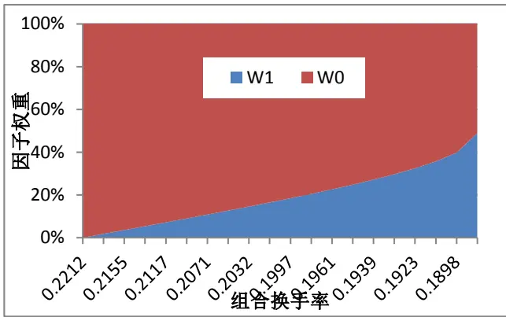
数据来源：广发证券研究发展中心，Wind数据库

“流通市值”在 2 个月的半衰期内，随着因子权重 w0和 w1由(1,0)逐步变为(0.5,0.5)，因子自相关系数由0.85增加至 0.92，换手率下降至原来的70%，随着的调整，尤其是随着滞后一期的因子权重达到 0.4之后，IC_IR 的下降速度快于换手率的下降幅度，在半衰期内IC_IR下降至 65%。

## （7） 每股派息/股价

图 18. 考虑换手率约束的“每股派息/股价”有效性衰竭规律

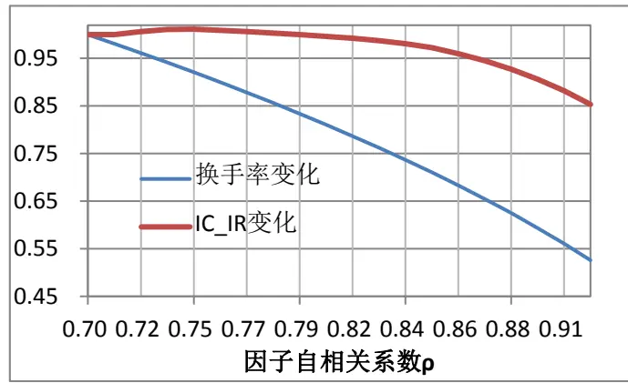
数据来源：广发证券研究发展中心，Wind数据库

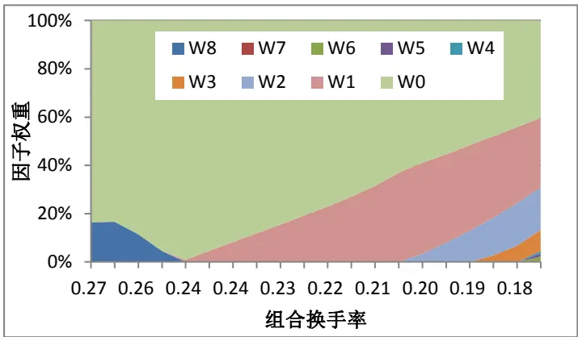

“每股派息/股价”的半衰期长达9个月内，因此平滑因子由近9期的滞后因子加权得到，随着因子权重 $w_{0}-w_{9}$ 的调整，因子自相关系数由 0.7 增加至 0.92，换手率迅速下降至原来的53%， IC_IR 的下降速度则相对缓慢，在半衰期内下降至85%。

## （8） EP

图 19. 考虑换手率约束的“EP”有效性衰竭规律
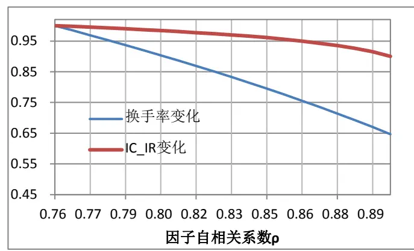

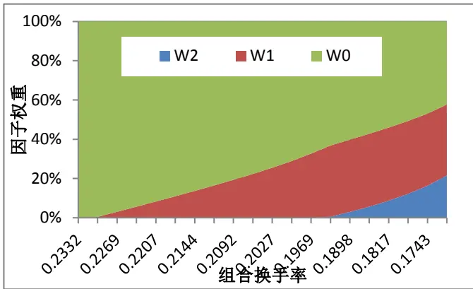
数据来源：广发证券研究发展中心，Wind数据库

“EP”的半衰期为3个月内，随着因子权重 $w_{0}-w_{9}$ 的调整，因子自相关系数由 0.76增加至0.90，换手率迅速下降至原来的65%， IC_IR 的下降速度则相对缓慢，在半衰期内下降至90%。

## （9） SP

图 20. 考虑换手率约束的“SP”有效性衰竭规律

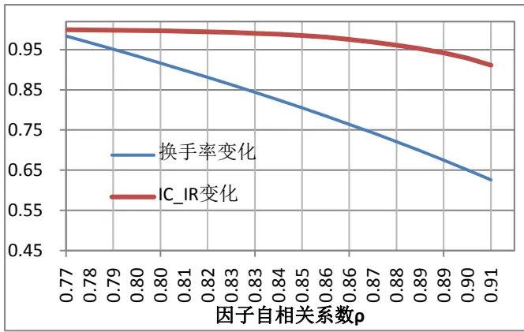
数据来源：广发证券研究发展中心，Wind数据库

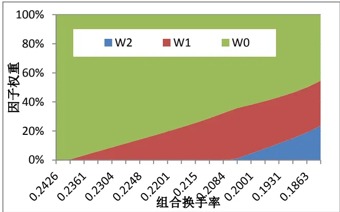

“SP”的半衰期为3个月内，随着因子权重 $w_{0}-w_{9}$ 的调整，因子自相关系数由 0.77增加至0.92，换手率迅速下降至原来的63%， IC_IR 的下降速度则相对缓慢，在半衰期内下降至92%。

（10） BP

图 21. 考虑换手率约束的“BP”有效性衰竭规律
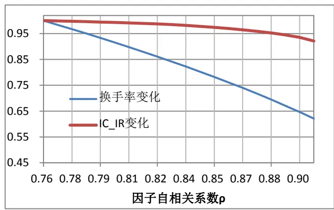
数据来源：广发证券研究发展中心，Wind数据库

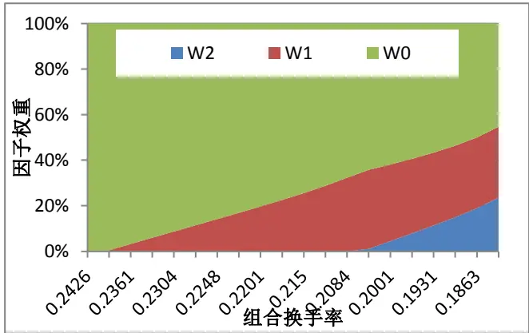

“BP”的半衰期为3个月内，随着因子权重 ${\bf\dot{\boldsymbol{w}}}_{0}-{\boldsymbol{w}}_{9}$ 的调整，因子自相关系数由0.76增加至0.91，换手率迅速下降至原来的62%，IC_IR的下降速度则相对缓慢，在半衰期内下降至93%。

## 四、考虑换手率的多因子 Alpha 模型

## (一)如何控制多因子组合换手率

上节通过对单因子在其半衰期内进行平滑，实现对因子换手率的控制，下面将根据表2所列各因子有效性及上述对各因子衰竭效应分析的结果，挑选部分因子构建多因子Alpha组合，同样通过调整滞后因子的权重来实现对组合换手率的控制，并观察换手率的下降是否对组合的IC_IR带来显著的变化。

多因子组合的构建采用了以下5个Alpha因子：

表 4. 多因子Alpha模型中包含的 因子

| 因子 | IC | IC_IR | 换手率 |
| --- | --- | --- | --- |
| 换手率 | -6.13% | -1.57 | 48.2% |
| 一个月股价反转 | -4.67% | -0.93 | 79.0% |
| 流通市值 | -3.16% | -0.43 | 22.1% |
| EP | 4.21% | 1.37 | 23.3% |
| BP | 4.36% | 1.27 | 26.5% |

数据来源：广发证券研究发展中心，Wind数据库

为了检验样本内单因子的组合优化结果是否适用于样本外多因子组合的构建，将按照如下方法进行实证分析：

个股样本：中证800成份股；

样本期间：2000 年 1 月 31 日-2012 年 4 月 27 日共 148 个月，其中 2008 年 12 月 31 日之前作为样本内数据，用于观察各因子的半衰期，并求解换手率限制下优化问题(3-2)对应的因子权重，2009 年 1 月 31 日之后作为样本外数据，根据样本内测算结果进行实证分析，检验多因子策略的换手率和IR变化规律。

因子加权规则：不同 Alpha 因子之间采用平均加权，各滞后期因子之间的权重根据优化问题（1）的求解结果得到。

例如：在单因子 $F_{1}$ 分析中，我们令

$$
F_{l,ma}{=}w_{0}F_{l,t}{+}w_{1}F_{1,t-1}\tag{4-1}
$$

构造双因子组合时，我们令

$$
F_{l,ma}=\left(w_{1,0}F_{l,t}+w_{1,1}F_{1,t-l}\right)/2\tag{4-2}
$$

$$
F_{2,ma}=\left(w_{2,0}F_{I,t}+w_{2,1}F_{2,t-I}\right)/2\tag{4-3}
$$

双因子组合的综合因子暴露平滑为：

$$
F_{I2,ma}=F_{I,ma}+F_{I,ma}\tag{4-4}
$$

## (二)实证分析

在样本内期间的数据中，我们首先对表 5 所列的五个 Alpha 因子测算其半衰期，结果如表 6 所示：

| 表 5.样本内 Alpha 因子半衰期 |  |
| --- | --- |
| 因子 | 半衰期 |
| 换手率 | 2 |
| 一个月股价反转 | 2 |
| 流通市值 | 3 |
| EP | 3 |
| BP | 3 |

数据来源：广发证券研究发展中心，Wind数据库

5 个因子的半衰期在样本内外均没有太大的改变。下面进一步测算各因子的换手率及$IC\_IR$ 随着 $\cdot\rho_{f}$ 的变化相应的改变以及滞后因子权重的分布情况：

## （1） “换手率”因子

图 22. 样本内“换手率”有效性衰竭规律
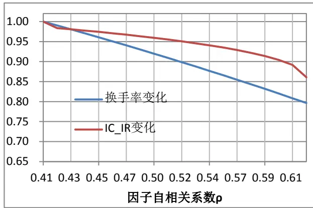
数据来源：广发证券研究发展中心，Wind数据库

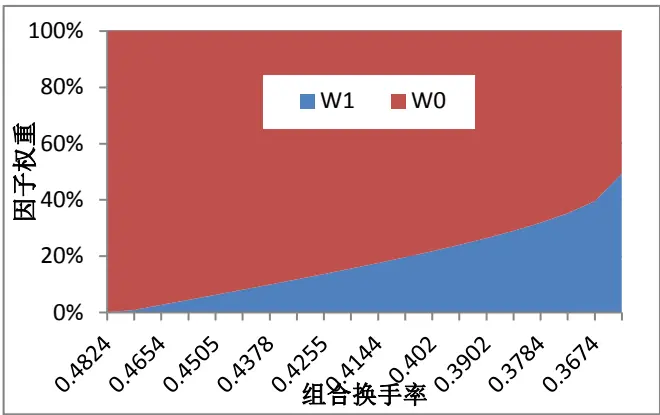

样本内“换手率”半衰期为 2 个月，随着因子权重 $w_{0}$ 和 $w_{1}$ 由(1,0)逐步变为(0.5,0.5)，因子换手率下降至原来的 80%，而IC_IR的下降则相对缓慢，在半衰期内下降至 86%。

## （2）“一个月股价反转”因子

图 23. 样本内“一个月股价反转”有效性衰竭规律
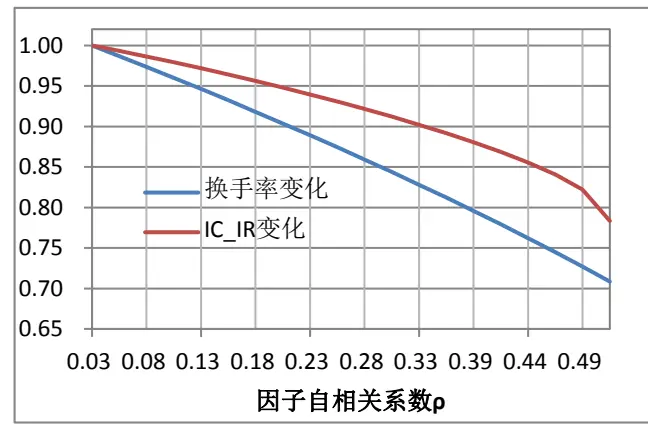

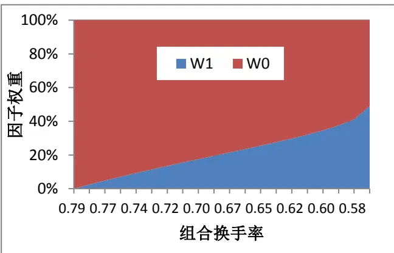
数据来源：广发证券研究发展中心，Wind数据库

样本内“一个月股价反转”的半衰期同样为2 个月，随着因子权重 $w_{0}$ 和 $w_{1}$ 由(1,0)逐步变为(0.5,0.5)，因子换手率迅速下降至原来的 71%，而IC_IR的下降则相对缓慢，在半衰期内下降至 78%。

（3）“流通市值”因子
图 24. 样本内“流通市值”有效性衰竭规律
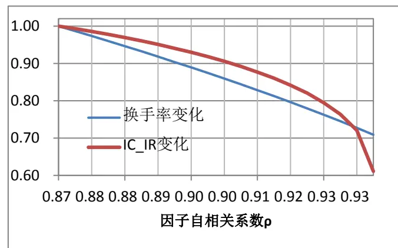
数据来源：广发证券研究发展中心，Wind数据库

样本内“流通市值”的半衰期内为 2 个月，随着因子权重 w0和 w1由(1,0)逐步变为(0.5,0.5)，因子换手率下降至原来的 70%，随着滞后一期因子权重的增加，IC_IR 的下降速度逐渐快于换手率的下降幅度，在半衰期内IC_IR 下降至61%。

## （4） “EP”因子

图 25. 样本内“EP”有效性衰竭规律
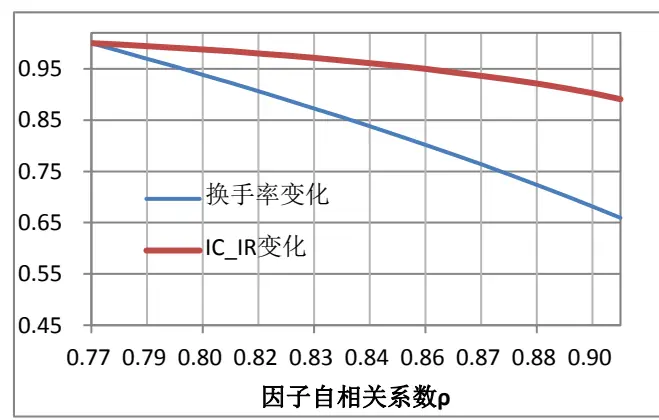
数据来源：广发证券研究发展中心，Wind数据库

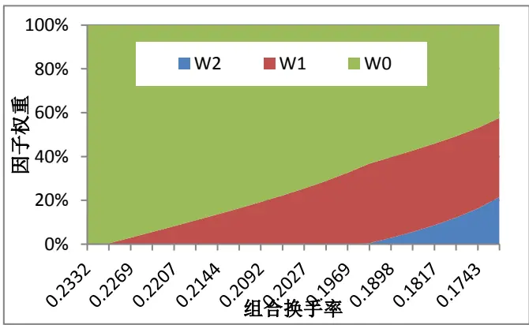

样本内“EP”的半衰期为3 个月，随着因子权重的调整，换手率迅速下降至原来的65%，IC_IR的下降速度则相对缓慢，在半衰期内下降至 90%。

## （5） “BP”因子

图 26. 样本内“BP”有效性衰竭规律

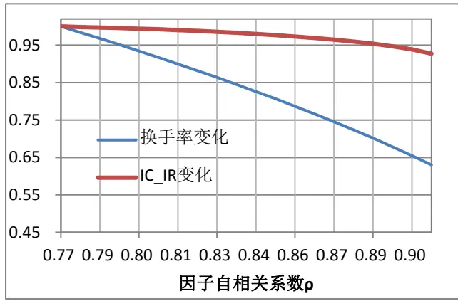
数据来源：广发证券研究发展中心，Wind数据库

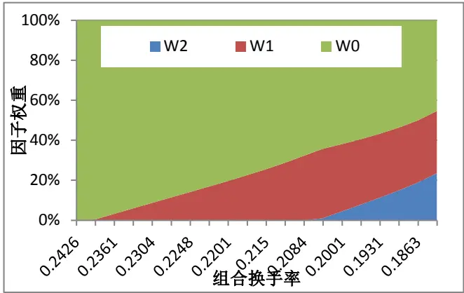

样本内“BP”的半衰期同样为3个月内，随着因子权重的调整，因子换手率迅速下降至原来的62%， IC_IR的下降速度则相对缓慢，在半衰期内下降至93%。

通过图23-26的展示，我们在样本内实现了对单因子换手率较好的控制，同时使得因子的信息比下降相对缓慢，下面我们采用样本外的数据，根据(4-4)的因子权重分配方法构造对因子策略，得到不同权重组合下，多因子策略的换手率及信息比随着各自自相关系数的增加而逐渐下降的过程如下图所示。

图 27. 考虑换手限制的多因子策略有效性衰竭规律
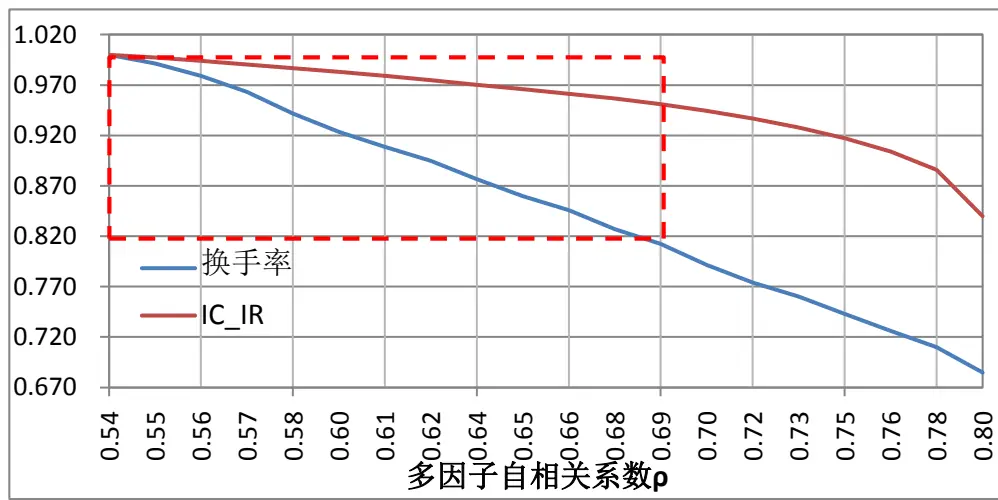
数据来源：广发证券研究发展中心，Wind数据库

由图27可以看到，通过对各Alpha因子采取滞后期平滑处理，组合换手率最多可控制在原来的68%左右，而同时组合的IC_IR仅下降为85%。下表详细列出随着换手率及IC_IR的变化，相应的各个因子平滑权重的取值：

表 6. 考虑换手限制的多因子策略有效性及滞后因子权重

| 换手率 IC_IR |  |  | 换手 | 率 | 一个月股 | 价反转 | 流通市值 |  | PE |  |  | PB |  |  |
| --- | --- | --- | --- | --- | --- | --- | --- | --- | --- | --- | --- | --- | --- | --- |
|  |  |  | W1 | WO | W1 | WO | W1 | WO | W2 | W1 | WO | W2 | W1 | WO |
| 47.0% | 262.6% |  | 0.0% | 20.0% | 0.0% | 20.0% | 0.0% | 20.0% | 0.0% | 0.0% | 20.0% | 0.0% | 0.0% | 20.0% |
| 46.6% | 261.9% |  | 0.1% | 19.9% | 0.5% | 19.5% | 0.3% | 19.7% | 0.0% | 0.0% | 20.0% | 0.1% | 0.0% | 19.9% |
| 46.0% | 261.0% |  | 0.5% | 19.5% | 1.0% | 19.0% | 0.7% | 19.3% | 0.0% | 0.5% | 19.5% | 0.7% | 0.0% | 19.3% |
| 45.2% | 260.1% |  | 0.8% | 19.2% | 1.4% | 18.6% | 1.0% | 19.0% | 0.0% | 1.0% | 19.0% | 1.4% | 0.0% | 18.6% |
| 44.2% | 259.1% |  | 1.2% | 18.8% | 1.8% | 18.2% | 1.4% | 18.6% | 0.0% | 1.6% | 18.4% | 2.1% | 0.0% | 18.0% |
| 43.3% | 258.18 |  | 1.6% | 18.4% | 2.3% | 17.7% | 1.7% | 18.3% | 0.0% | 2.1% | 17.9% | 2.7% | 0.0% | 17.3% |
| 快42.7% | 257.18 |  | 1.9% | 18.1% | 2.7% | 17.3% | 2.1% | 17.9% | 0.0% | 2.7% | 17.3% | 3.4% | 0.0% | 16.6% |
| 速42.0% | 255.9% |  | 2.3% | 17.7% | 3.1% | 16.9% | 2.5% | 17.5% | 0.0% | 3.2% | 16.8% | 4.0% | 0.0% | 16.0% |
| 41.1% | 254.8% |  | 2.7% | 17.3% | 3.5% | 16.5% | 2.8% | 17.2% | 0.0% | 3.8% | 16.2% | 4.7% | 0.0% | 15.3% |
| 40.4% | 253.7% | P | 3.1% | 16.9% | 3.9% | 16.1% | 3 | 8% | 0% | 4.4% | 15.6% | 4.6% | 0.4% | 14.9% |
| 39.6% | 252.5% |  | 3.5% | 16.5% | 4.3% | 15.7% | 6% | 3 | 0% | 5.1% | 14.9% | 4.6% | 0.9% | 14.6% |
| 38.9% | 251.2% |  | 3.9% | 16.1% | 4.7% | 15. 3% | 4.0% | 16. 0% | 0.0% | 5.8% | 14.2% | 4.6% | 1.3% | "14.2%: |
| 38.1% | 249.7% |  | .4.3%. | .15.7% | 5.1%. | 14.9% | 4.4%. | 15.6% | .9.9%. | ..6.5%. | 13.5% | .4.6% | 1.7%. | 13.13.7% |
| 37.3% | 247.9% |  | 4.8% | 15.2% | 5.5% | 14.5% | 4.9% | 15.1% | 0.4% | 6.7% | 12.9% | 4.7% | 2.1% | 13.3% |
| 36.4% | 245.9 |  | 5.2% | 14.8% | 5.9% | 14.1% | 5.3% | 14.7% | 0.8% | 6.9% | 12.3% | 4.8% | 2.4% | 12.8% |
| 35.7% | 243..6% |  | 5.8% | 14.2% | 6.4% | 13.6% | 5.8% | 14.2% | 1.3% | 7.1% | 11.6% | 4.9% | 2.8% | 12.2% |
| 34.9% | 240.1.8% |  | 6.3% | 13.7% | 6.9% | 13.1% | 6.4% | 13.6% | 1.9% | 7.2% | 10.9% | 5.1% | 3.2% | 11.7% |
| 34.0% | 237.3% |  | 7.0% | 13.0% | 7.5% | 12.5% | 7.1% | 12.9% | 2.5% | 7.3% | 10..2% | 5.3% | 3.7% | 11.0% |
| 33.3% | 232.5% |  | 7.9% | 12.1% | 8.2% | 11.8% | 7.9% | 12.1% | 3.3% | 7.3% | 9..4% | 5.6% | 4.1% | 10.3% |
| 32.1% | 220.3% |  | 9.9% | 10.1% | 9.7% | 10.3% | 9.7% | 10.3% | 4.3% | 7.2% | 8.5% | 5.9% | 4.8% | 9.3% |

数据来源：广发证券研究发展中心，Wind数据库

由表 6 可以看到，各类因子之间权重汇总是相等的，且随着各类因子之间滞后因子权重的变化，换手率出现了快速的下降，但组合的 IC_IR仅缓慢下降，实证的结果表明，通过因子平滑的方法能够成功实现对组合换手率的控制。

## 五、总结

为了有效控制组合的换手率，报告首先对各Alpha因子的衰竭规律及相应的“半衰期”进行分析，并对“半衰期”内因子的取值进行平滑处理，从而实现对组合换手率的控制，同时通过求解最优化问题使得组合信息比最大化。

换手率的控制是通过设置约束条件并求解最优化问题(3-2)实现的，实际应用当中，不同投资者所采用的Alpha因子以及对换手率的要求也都各不相同的，报告提供的是一种通用的研究思路，投资者可以在其他选股因子上，通过报告所提出的办法来实现对组合换手的控制，并使得组合的信息比率最大化。

关于多因子之间的权重分配，本报告采用等权分配，除此之外，可以尝试对每类因子的各期滞后项进行优化，求解不同的权重分配方案。关于组合换手率及信息比优化问题一直是我们所密切关注的，其使用的方法丰富多彩，此篇为该专题之初探，为敲门砖之用，后续将推出其他相关研究，敬请关注，欢迎交流。

| 罗军，首席分析师，华南理工大学理学硕士，2010年进入广发证券发展研究中心。 |
| --- |
| 俞文冰，首席分析师，CFA，上海财经大学统计学硕士，2012年进入广发证券发展研究中心。 |
| 叶涛，资深分析师，CFA，上海交通大学管理科学与工程硕士，2012年进入广发证券发展研究中心。 |
| 安宁宁，资深分析师，暨南大学数量经济学硕士，2011年进入广发证券发展研究中心。 |
| 胡海涛，分析师，华南理工大学理学硕士，2010年进入广发证券发展研究中心。 |
| 夏潇阳，分析师，上海交通大学金融工程硕士，2012年进入广发证券发展研究中心。 |
| 汪鑫，分析师，中国科学技术大学金融工程硕士，2012年进入广发证券发展研究中心。 |
| 蓝昭钦，研究助理，中山大学理学硕士，2010年进入广发证券发展研究中心。 |
| 李明，研究助理，伦敦城市大学卡斯商学院计量金融硕士，2010年进入广发证券发展研究中心。 |
| 史庆盛，研究助理，华南理工大学金融工程硕士，2011年进入广发证券发展研究中心。 |

## Table_AuthorSum 广发金融工程研究小组mary

## Table_Report 相关研究报告

多因子 Alpha 系列报告之（七）——大浪淘金，Alpha 因子何处寻？史庆盛2011-07-21

|  | 广州市 | 深圳市 | 北京市 | 上海市 |
| --- | --- | --- | --- | --- |
| 地址 | 广州市天河北路183 号 大都会广场5楼 | 深圳市福田区民田路178 | 3 北京市西城区月坛北街2号 | 上海市浦东南路 528 号 |
| 邮政编码 | 510075 | 号华融大厦9楼 518026 | 月坛大厦18层 100045 | 上海证券大厦北塔17楼 200120 |
| 客服邮箱 | gfyf@gf.com.cn |  |  |  |
| 服务热线 | 020-87555888-8612 |  |  |  |

## 免责声明

le_Disclaimer广发证券股份有限公司具备证券投资咨询业务资格。本报告只发送给广发证券重点客户，不对外公开发布。

本报告所载资料的来源及观点的出处皆被广发证券股份有限公司认为可靠，但广发证券不对其准确性或完整性做出任何保证。报告内容仅供参考，报告中的信息或所表达观点不构成所涉证券买卖的出价或询价。广发证券不对因使用本报告的内容而引致的损失承担任何责任，除非法律法规有明确规定。客户不应以本报告取代其独立判断或仅根据本报告做出决策。

广发证券可发出其它与本报告所载信息不一致及有不同结论的报告。本报告反映研究人员的不同观点、见解及分析方法，并不代表广发证券或其附属机构的立场。报告所载资料、意见及推测仅反映研究人员于发出本报告当日的判断，可随时更改且不予通告。

本报告旨在发送给广发证券的特定客户及其它专业人士。未经广发证券事先书面许可，任何机构或个人不得以任何形式翻版、复制、刊登、转载和引用，否则由此造成的一切不良后果及法律责任由私自翻版、复制、刊登、转载和引用者承担。