# Table_Title从 ICIR 角度挖掘风格因子的均值回复性

# 16274——多因子 Alpha系列报告之（十二）

罗军Table_Author 首席分析师

电话：020-87555888-8655

eMail：lj33@gf.com.cn

执业编号：S0260511010004

## Table_Summary Alpha 一直存在，获取关键在于风格因子择时

以大盘作为参照物，股市便是一个“零和博弈”的游戏，有人赚则必有人亏，而Alpha收益的本质是个股行情出现分化，对个股的分化特征进行提取便得到了所谓的风格因子，因此风格因子是Alpha收益的最终来源，因子的有效性则直接体现了市场是否存在显著的Alpha！统计发现A股市场长期存在Alpha，然而由于个股分化特征的差异，尤其是在市场处于较大的风格转变时，常常导致Alpha的来源难以捕捉，如何把握Alpha的走向，这便是本文所要探寻的风格因子轮动规律。

从理论上来讲，任何一类风格因子都不可能长期产生稳定的Alpha，因此从长期来看风格因子必定存在“均值回复”特性；另一方面，由于市场对于一种风格的消化和体现往往需要一个过程，加之市场参与者并非完全理性人，常常出现跟风现象，因此短期来看，市场风格往往出现“惯性”特征！为了挖掘A股市场的风格轮动规律，报告结合不同的统计工具，对风格因子的轮动规律进行分析

## 统计发现风格因子存在显著的均值回复特征

为了捕捉风格因子轮动规律，我们以 IC作为因子有效性的度量，首先分别运用 “自相关检验法”分析了 IC序列的线性相关性，统计结果表明 IC序列各滞后项之间不存在稳定的自相关性；而运用 Box-Jenkins 法，发现 IC序列的自相关函数及偏自相关函数均不存在明显的截尾及拖尾特征，从而同样无法使用 ARMA模型对其进行预测。

最后，通过观察及统计发现，风格因子的 IC 与因子近期 ICIR 之间存在显著的负相关关系，而且对于不同的风格因子，ICIR选择的计算周期各不相同，报告对各类风格因子的最佳观察周期进行了统计检验。

## 基于因子均值回复性设计相应的因子择时策略

基于统计发现的因子均值回复性，报告设计了相应的因子择时策略，长期来看，我们假定采用的9类因子均为有效的Alpha因子，因此择时策略主要针对各因子的权重进行调整，调整的依据是各因子之间的ICIR相对大小比较。

根据因子过去的最佳观察期计算各因子的ICIR，并根据ICIR从大到小对因子进行排序，9各因子共分为3档，第1档因子给予1分，第2档给予2分，第3档4分，各因子在全部因子中所占比例等于其得分比全部因子的得分总和。

## 因子择时策略将多因子组合信息比提高 11%

为进一步验证基于均值回复性的因子择时策略有效性，报告最后选择样本外数据对策略进行检验。结果表明，在运用因子择时策略之后，多空对冲组合及股指期货对冲组合的收益率及信息比均有所改善，其中，两类对冲组合的信息比均提高了11%以上，且因子择时策略相对因子等权策略各期的胜率均为60.76%。尤其在2011上半年及今年以来，择时策略尽显优势。

风格因子的轮动规律受到各种复杂因素的影响，难以用量化的方式对其进行全面有效解析，因此该研究显得任重道远。报告仅针对其中部分因子的均值回复性进行了探讨，统计得到的规律或许对于读者更好认识各种风格因子的特性有些许参考意义，但得到的规律无法详尽，后续我们仍将继续致力于该方向的研究，敬请关注我们后续的相关研究。

## 一、引言

若以所有股票的综合表现（大盘）作为参照物，股市便是一个“零和博弈”的游戏，有人赚则必有人亏，如果存在某种策略能够稳定战胜大盘，从而无论市场涨跌都能获得超额收益，则称该策略为Alpha策略，相应获得的超额收益称为Alpha收益。

显然，Alpha收益的本质是个股行情出现分化，对个股的分化特征进行提取便得到了所谓的风格因子，因此风格因子是Alpha收益的最终来源，而因子的有效性则直接体现了市场是否存在显著的Alpha！通过对国内A股市场进行分析，我们发现在不同阶段，个股均出现不同的分化规律，这意味着A股市场长期存在Alpha，然而由于个股分化特征的差异，尤其是在市场处于较大的风格转变时，常常导致Alpha的来源难以捕捉，如何把握Alpha的走向，这便是本文所要探寻的风格因子轮动规律。

如上所说，股市是一个“零和博弈”的游戏，具备快速的“学习”能力，“零和”是一个长期的均衡状态，因此从理论上来讲，任何一类风格因子都不可能长期产生稳定的Alpha，因此从长期来看风格因子必定存在“均值回复”特性；另一方面，由于市场对于一种风格的消化和体现往往需要一个过程，加之市场参与者并非完全理性人，常常出现跟风现象，因此短期来看，市场风格往往出现“惯性”特征！

为了挖掘A股市场的风格轮动规律，报告结合不同的统计工具，对风格因子的轮动规律进行分析，全文书写逻辑和各节安排如下：

第一节：前言，本节介绍了报告研究的目的，并简要说明研究思路；

第二节：从理论角度分析因子“均值回复”的必然性，并采用不同统计方法进行验证；

第三节：基于因子的均值回复特性，设计了相应的因子择时策略；

第四节：采用样本外数据，检验了因子择时策略的有效性；

第五节：最后对报告的内容进行简要总结，并给出符合实际应用的建议和后续研究展望。

## 二、风格因子均值回复性检验

前面提到，对风格因子的轮动规律进行预测具有巨大的意义，是获取Alpha收益的关键。无论是从理论角度还是实际经验，我们都发现了风格因子存在一定的均值回复性，但事实是否如此我们还需要进行严格的统计检验。

本文采用IC1来度量风格因子的有效性，对于风格因子的轮动研究便围绕着因子的IC时间序列进行。

在《大浪淘沙，Alpha因子何处寻？》中，我们对多个因子的有效性进行了全面的分析并挑选得到部分Alpha因子，下面我们将根据这些因子的历史表现来寻找其合理的半衰期。其中盈利、成长以及质量等几类因子由于数据直接来源于财报上的数据，通常至少一个季度以上才更新一次数据，因此时效性明显滞后于流动性及股价相关等因子，在对因子IC序列进行分析时剔除了这几类因子，重点分析下列9个因子：

表 1.挑选的 9个风格因子

| 因子 | IC | IC_IR |
| --- | --- | --- |
| 1个月成交金额 | -5.50% | -1.09 |
| 换手率 | -6.13% | -1.57 |
| 一个月股价反转 | -4.67% | -0.93 |
| 三个月股价反转 | -3.85% | -0.67 |
| 六个月股价反转 | -2.24% | -0.37 |
| 流通市值 | -3.16% | -0.43 |
| EP | 4.21% | 1.37 |
| SP | 2.97% | 1.37 |
| BP | 4.36% | 1.27 |

数据来源：广发证券研究发展中心，Wind数据库
个股样本：中证 800 成份股；

样本期间：2000 年 1 月 31 日-2012 年 4 月 27 日共 148 个月，其中 2007 年 1 月 31日之前的成份股，根据中证 800指数的编制规则进行近似模拟。

## (一)线性相关检验

在关于股价时间序列的预测中，均值回复理论对随机漫步理论提出了最大的挑战，在对均值回归特征进行检验的众多方法中，最常见的便是“自相关检验法”，许多理论家认为，具有均值回归的时间序列，从长期来看应该呈负相关特征！我们运用该方法来分析因子IC序列的均值回复性，该方法的本质是建立线性自回归模型 ：

令，

$$
\begin{array}{r}{r_{k}=\frac{\sum_{t=k+1}^{T}(x_{t}-\bar{x})(x_{t-k}-\bar{x})}{Tx^{2}}}\end{array}\tag{1}
$$

k=1，2，3，…

其中 $r_{k}$ 为样本的自相关函数，T为样本数量， $S^{2}$ 为样本方差，k 为时滞的阶数， $x_{\textit{ t }}$ 为IC时间序列的变量值， 为均值。

给定置信度P，如果rk 不显著，则该时间序列就是随机漫步；如果rk呈现显著的正相关，即 $r_{k}\geq0$ ，IC就在一种上升或下降趋势中运行；如果rk呈显著的负相关，就呈均值回归趋势。

下面对表1所列9类风格因子，计算各阶自相关系数：

图 1. 全部风格因子各阶自相关系数

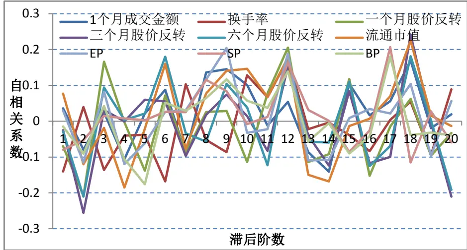
数据来源：广发证券研究发展中心，Wind数据库

图1显示，每个风格因子的各阶自相关系数均在零上下波动，缺乏稳定性，难以观察到IC序列的均值回复性。

模型（1）的本质是一个AR模型，其特征是假设风格因子各期有效性（IC）仅与其以前时刻的有效性 $.IC_{t1}$ 有关，而与其以前时刻进入系统的扰动 $a_{t}$ 无关，因此下面我们进一步对因子IC建立ARMA模型，其一般形式为：

$$
\begin{array}{l}IC_{t}=\varphi_{1}IC_{t-1}+\varphi_{1}IC_{t-2}+\cdots+\varphi_{n}IC_{t-n}+\\a_{t}-\theta_{1}a_{t-1}-\theta_{1}a_{t-1}-\cdots-\theta_{m}a_{t-m}\end{array}\tag{2}
$$

关于模型（2）的识别方法很多，其中最常用的方法是Box-Jenkins法，即根据样本自相关、偏自相关函数的截尾及拖尾性来判断模型阶数n、m以及模型的参数。

各因子的模型检验结果如下：

图 2.“一个月成交金额”自相关及偏自相关检验
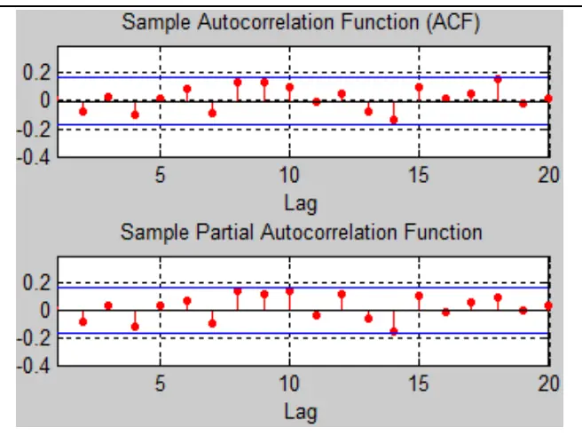
数据来源：广发证券研究发展中心，Wind数据库

图 3.“换手率”自相关及偏自相关检验
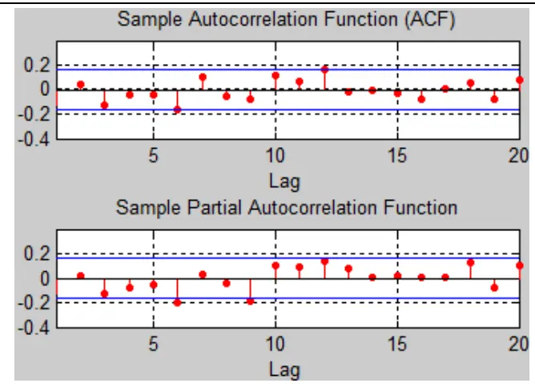
数据来源：广发证券研究发展中心，Wind数据库

图 4. “一个月股价反转”自相关及偏自相关检验
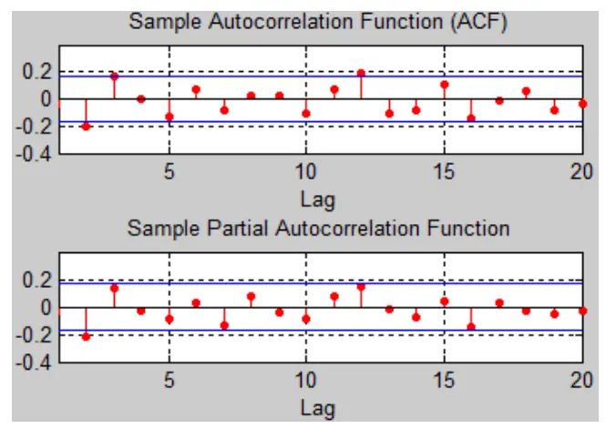
数据来源：广发证券研究发展中心，Wind数据库

图 5. “三个月股价反转”自相关及偏自相关检验
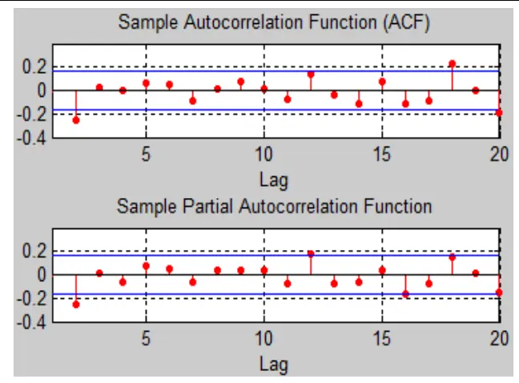
数据来源：广发证券研究发展中心，Wind数据库

图 6. “六个月股价反转”自相关及偏自相关检验
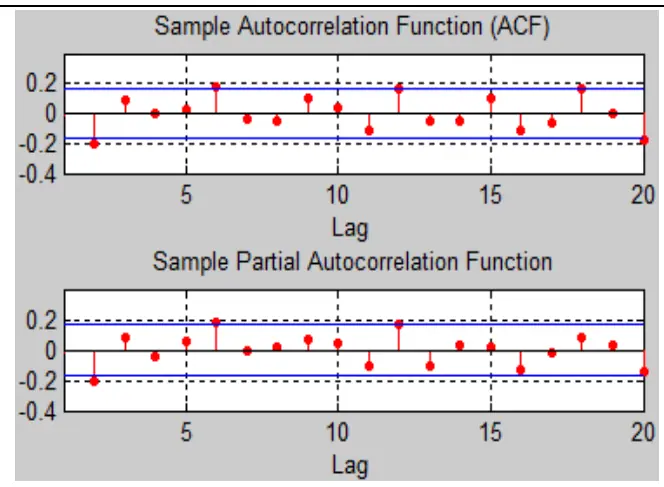
数据来源：广发证券研究发展中心，Wind数据库

图 7. “流通市值”自相关及偏自相关检验
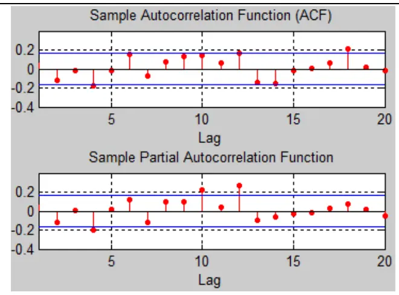
数据来源：广发证券研究发展中心，Wind数据库

图 8. “EP”自相关及偏自相关检验
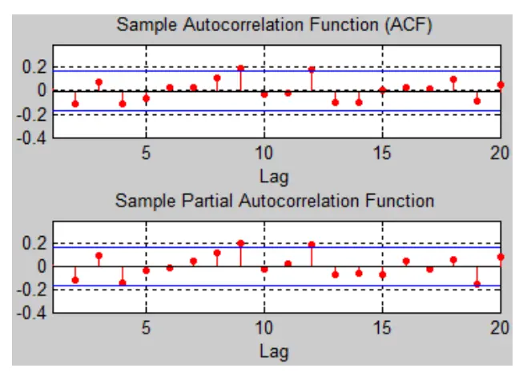
数据来源：广发证券研究发展中心，Wind数据库

图 9. “SP”自相关及偏自相关检验
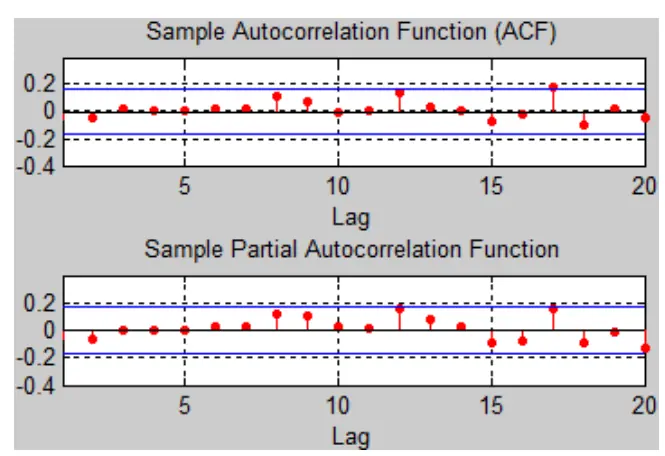
数据来源：广发证券研究发展中心，Wind数据库

图 10. “BP”自相关及偏自相关检验
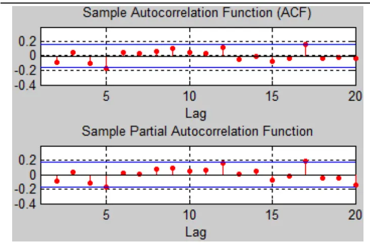
数据来源：广发证券研究发展中心，Wind数据库

根据图2-10，因子IC序列的自相关函数及偏自相关函数在95%的置信区间内来回波动，均不存在明显的截尾及拖尾现象，因此可初步断定ARMA同样不适用于对IC序列进行预测，下面我们将尝试从非线性的角度来考虑IC序列的均值回复性。

## (二)基于因子 ICIR的均值回复性

在《大浪淘沙，Alpha因子何处寻？》中，我们介绍了另外一个度量因子有效性的指标，即 ICIR，该指标既考虑了因子 IC 的大小，同时也兼顾了因子 IC 的波动情况，因此能够更好地反映因子在一段时间内的有效性程度。

以“一个月换手率”为例，下图为换手率因子每月 IC与近6个月ICIR的分布图，直观地看我们发现 ICIR对 IC 有着较明显的启示作用，两者存在负相关特征。

图 11. “换手率”因子 ICIR与 IC 走势比较
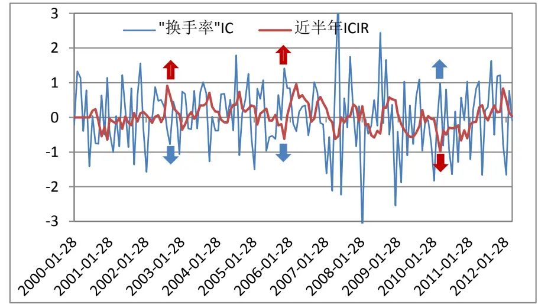
数据来源：广发证券研究发展中心，Wind数据库

基于这一观察，下面将对各类风格因子逐个进行检验其 IC 及 ICIR 之间是否存在

显著的负相关关系。

## （1） 一个月成交金额

图 12.“一个月成交金额” 因子 ICIR 与 IC 相关性
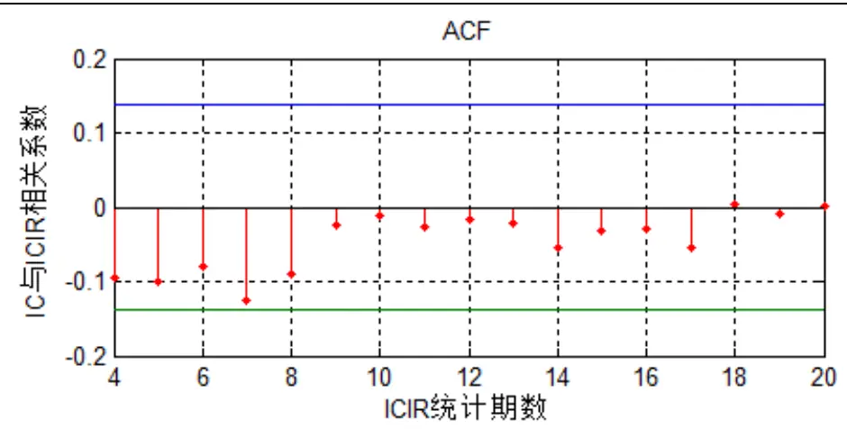
数据来源：广发证券研究发展中心，Wind数据库

“一个月成交金额”因子近8 个月内的 ICIR与当期 IC 具有显著的负相关关系，8个月以上两者相关性衰减至零附近。可初步设定 8 个月作为“一个月成交金额”因子ICIR的计算周期。

## （2） 换手率

图 13.“换手率”因子 ICIR与IC 相关性
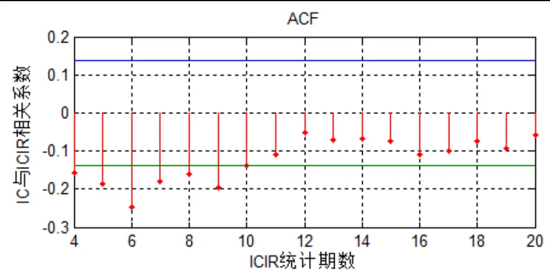
数据来源：广发证券研究发展中心，Wind数据库

“换手率”因子的近期ICIR与当期 IC 存在显著的负相关关系，其中在 10 个月的统计期内两者的相关系数在90%置信度下显著。10个月以上两者同样存在负相关关系，从相关性显著程度来看，同时考虑简便型风格，我们选择以 10 个月作为“换手率”因子ICIR的计算周期。

## （3） 一个月股价反转

图 14.“一个月股价反转” 因子ICIR与IC 相关性
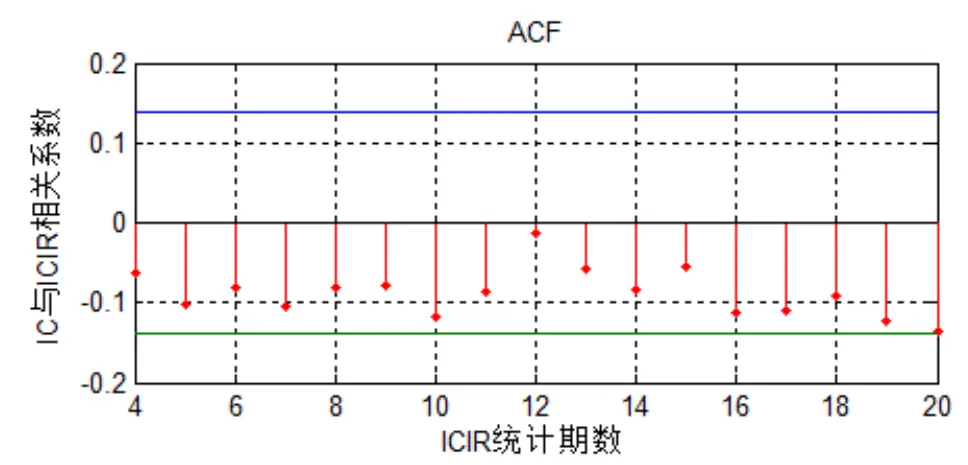
数据来源：广发证券研究发展中心，Wind数据库

“一个月股价反转” 因子的近期 ICIR与当期 IC 同样存在显著的负相关关系，其中在 10 个月的统计期内两者的相关系数在 80%置信度下显著。同上，以 10 个月作为因子ICIR的计算周期。

## （4） 三个月股价反转

图 15.“三个月股价反转” 因子ICIR与IC 相关性
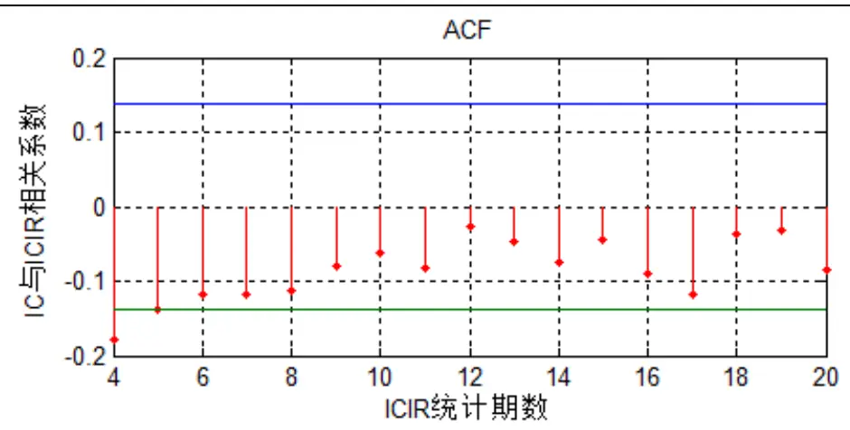
数据来源：广发证券研究发展中心，Wind数据库

“三个月股价反转”因子的近期 ICIR 与当期 IC 同样存在显著的负相关关系，其中在8个月的统计期内两者的相关系数在 80%置信度下显著。以8个月作为因子ICIR的计算周期。

## （5） 六个月股价反转

图 16.“六个月股价反转” 因子ICIR与IC 相关性
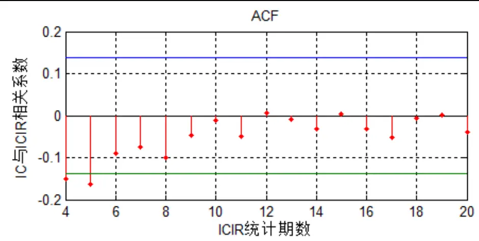
数据来源：广发证券研究发展中心，Wind数据库

“六个月股价反转”因子8个月内的ICIR与当期IC同样存在显著的负相关关系，8个月外两者相关关系趋于零，以8个月作为因子ICIR的计算周期。

## （6） 流通市值

图 17.“流通市值”因子 ICIR 与 IC 相关性
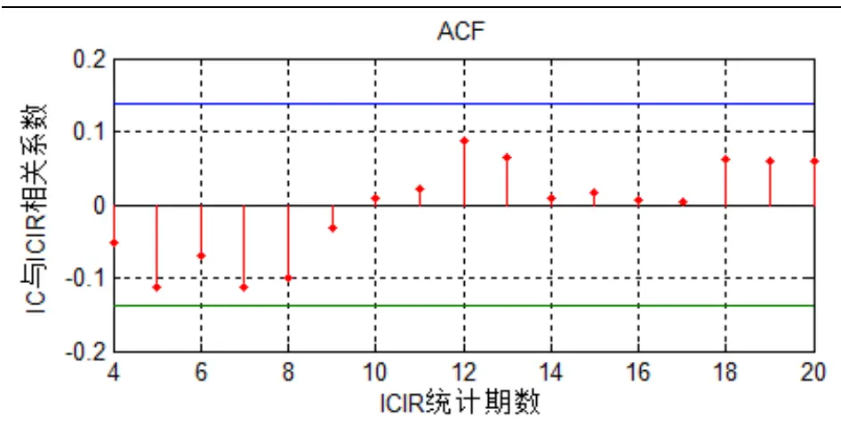
数据来源：广发证券研究发展中心，Wind数据库

“流通市值”因子 8 个月内的 ICIR 与当期 IC 同样存在显著的负相关关系，同样以8个月作为因子 ICIR的计算周期。

## （7） EP

图 18.“EP” 因子ICIR与IC相关性

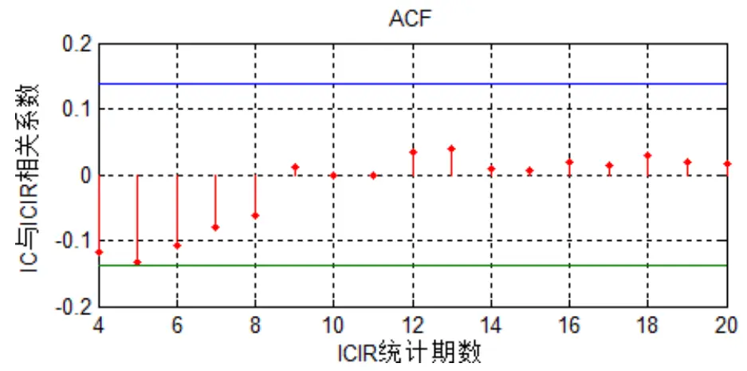
数据来源：广发证券研究发展中心，Wind数据库

“EP”因子 6 个月内的 ICIR 与当期 IC 同样存在显著的负相关关系，以 6 个月作为因子 ICIR的计算周期。

## （8） SP

图 19.“SP” 因子ICIR与IC相关性
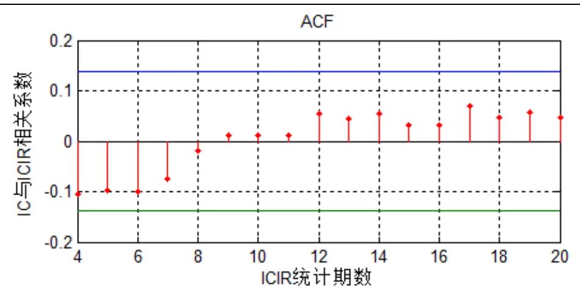
数据来源：广发证券研究发展中心，Wind数据库

“SP” 因子6个月内的ICIR与当期 IC 同样存在显著的负相关关系，同样以6个月作为因子 ICIR的计算周期。

## （9） BP

图 20.“BP” 因子ICIR与IC相关性

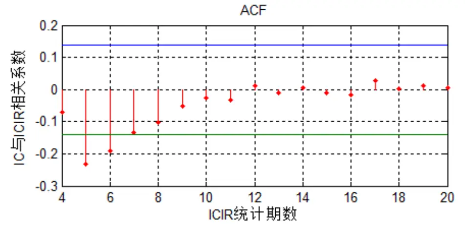
数据来源：广发证券研究发展中心，Wind数据库

“BP” 因子8个月内的ICIR与当期 IC 同样存在显著的负相关关系，8个月以上计算的 ICIR与IC 的相关性趋于零附近，以 8个月作为因子ICIR的计算周期。

综上，我们得到全部各个因子的ICIR最佳观察期如下：

表 2. Alpha 因子 ICIR 最佳观察期

| 因子 | 因子ICIR 观察期（月） |
| --- | --- |
| 1个月成交金额 | 8 |
| 换手率 | 10 |
| 一个月股价反转 | 11 |
| 三个月股价反转 | 8 |
| 六个月股价反转 | 8 |
| 流通市值 | 8 |
| EP | 6 |
| SP | 6 |
| BP | 8 |

数据来源：广发证券研究发展中心，Wind数据库

## 三、基于均值回复性的因子择时策略

## (一) 因子择时策略

上一节中我们运用不同对因子IC序列进行分析，发现因子当期IC与因子之前一段观察期以内的ICIR存在显著的负相关关系，从而证明因子的有效性存在一定的均值回复性。下面将根据这一结论对因子设计相应的择时策略，并将其应用到多因子组合构建当中。

需要说明的是，在因子择时策略设计当中，假定了上述9类因子均为有效Alpha因子，而所进行的择时策略仅针对各因子的相对权重进行调整，调整的依据是各因子之间的ICIR相对大小比较，策略设计如下：

个股样本：中证800成份股；

样本期间：2001 年 10 月 31 日-2012 年 4 月 27 日共 128 个月，前面预留 20 个月的样本用于计算 ICIR；

数据处理：对单个因子IC 序列，在时间维度上进行(0,1)标准化，从而保证各因子之间的 ICIR具有可比性。

因子打分规则：根据因子过去的最佳观察期计算各因子的ICIR，并根据ICIR从大到小对因子进行排序，9各因子共分为 3 档，第1档因子给予1分，第 2档给予2分，第3档 4分，各因子在全部因子中所占比例等于其得分比全部因子的得分总和。

图 21.因子择时策略设计规则
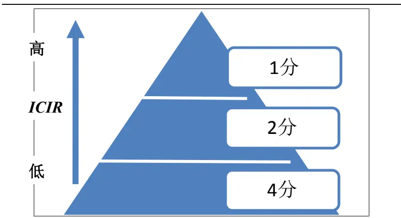
数据来源：广发证券研究发展中心，Wind数据库

## (二)因子权重变化

基于上述因子择时策略，得到各因子历史的权重占比如下图所示：

图 22.各因子历史的权重占比

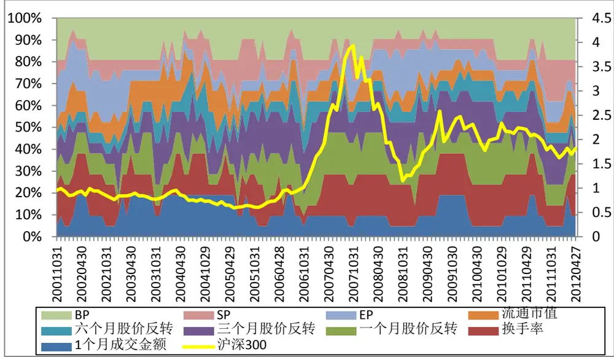
数据来源：广发证券研究发展中心，Wind数据库

如图21所示，各因子在不同时间拥有动态变化的权重，下表列出各因子动态权重的历史波动情况：

表 3.风格因子历史得分统计表

| 因子 | 平均得分 | 得分波动率 | 得分信息比 |
| --- | --- | --- | --- |
| 1个月成交金额 | 2.3937 | 1.1829 | 2.0235 |
| 换手率 | 3.1811 | 1.2046 | 2.6408 |
| 一个月股价反转 | 2.6299 | 1.1184 | 2.3515 |
| 三个月股价反转 | 3.0787 | 1.1241 | 2.7389 |
| 六个月股价反转 | 1.4252 | 0.6960 | 2.0476 |
| 流通市值 | 1.7087 | 0.9095 | 1.8787 |
| EP | 1.8976 | 1.2334 | 1.5386 |
| SP | 1.6850 | 1.0366 | 1.6255 |
| BP | 3.0000 | 1.0838 | 2.7681 |

数据来源：广发证券研究发展中心，Wind数据库

表3显示，历史平均得分较高的因子是换手率、三个月股价反转及BP，而得分波动较小的是六个月股价反转及流通市值因子。

根据图21显示，目前推荐权重占比较高的因子是BP、SP及换手率。

## 四、实证分析

## (一)样本数据

上节通过统计因子IC与IC_IR的相关关系，从而发现了风格因子的均值回复特征，并基于此设计了相应的因子择时策略，为了检验样本内因子的均值回复特征是否适用于样本外多因子组合的构建，将按照如下方法进行实证分析：

个股样本：中证800成份股；

样本期间：2000 年 1 月 31 日-2012 年 4 月 27 日共 148 个月，其中 2009 年 12 月31日之前作为样本内数据，用于统计各因子的均值回复性及ICIR最佳观察期， 2010年1月 31日之后作为样本外数据，根据样本内统计的结果进行实证分析，检验考虑因子动态配权的多因子策略表现。

交易成本：股票双边交易成本为千分之三，为了更直观地比较策略之间的优劣，实证中我们暂且不考虑股指期货交易成本、股票买卖冲击成本及融券成本，同时也不考虑对冲组合的杠杆因素。

## (二)实证分析

在样本内期间的数据中，我们首先对表 3 所列的 Alpha 因子检验其均值回复性并测算其 ICIR观察期，结果如表4所示：

表 4.样本内因子 ICIR最佳观察期

| 因子 | 因子ICIR观察期（月） |
| --- | --- |
| 1个月成交金额 | 7 |
| 换手率 | 10 |
| 一个月股价反转 | 11 |
| 三个月股价反转 | 8 |
| 六个月股价反转 | 8 |
| 流通市值 | 8 |
| EP | 6 |
| SP | 6 |
| BP | 8 |

数据来源：广发证券研究发展中心，Wind数据库

为了对上述因子择时策略的效果进行分析，首先我们对全部 9 个因子采用最简单的平均加权法进行组合构造，并统计期样本外期间的表现情况，如下图所示：

图 23.因子等权策略的多因子对冲样本外表现

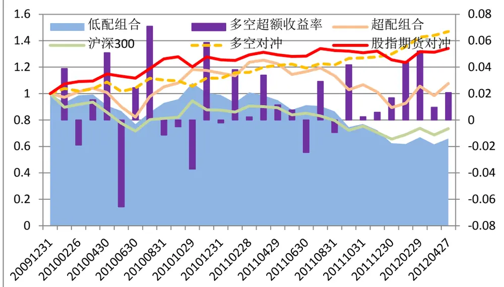
数据来源：广发证券研究发展中心，Wind数据库

表 5.因子等权策略的多因子对冲样本外表现统计

|  | 平均收益 | 波动率 | 信息比 | 最大回撤 |
| --- | --- | --- | --- | --- |
| 多空对冲 | 17.16% | 10.64% | 1.613 | 6.57% |
| 股指期货对冲 | 13.34% | 12.08% | 1.104 | 7.92% |

数据来源：广发证券研究发展中心，Wind数据库

由图 22及表5可以直观看到，在不考虑各种费用及杠杆因素的情况下，多空对冲组合相比股指期货对冲方案能获得更多的 Alpha，同时组合的波动率和最大回撤都更小。

下面采取因子动态加权策略，基于上述基于因子均值回复特征的因子择时策略可以得到每一期各因子的动态权重，并以其进行组合构建，得到样本外策略表现如下：

图 24.运用因子择时策略的多因子对冲样本外表现
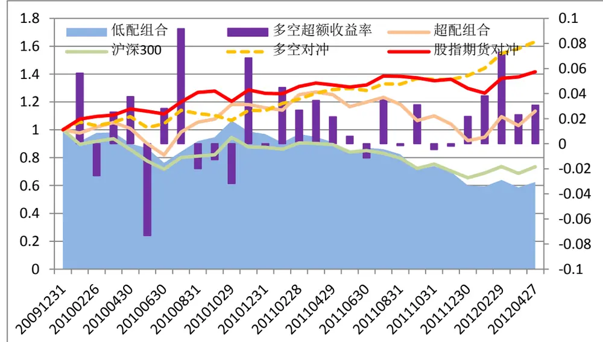
数据来源：广发证券研究发展中心，Wind数据库
识别风险，发现价值

表 6.运用因子择时策略的多因子对冲样本外表现统计

|  | 平均收益 | 波动率 | 信息比 | 最大回撤 |
| --- | --- | --- | --- | --- |
| 多空对冲 | 21.88% | 12.11% | 1.806 | 7.33% |
| 股指期货对冲 | 15.79% | 12.84% | 1.230 | 8.89% |

数据来源：广发证券研究发展中心，Wind数据库

由图 23及表6可以直观看到，在运用因子择时策略之后，多空对冲组合及股指期货对冲组合的收益率及信息比都有所改善，意味着因子的均值回复择时策略是有效的。

为了更加直观地观察因子择时策略对原有策略的改善程度，下面对两类因子配权策略的表现进行直接比较：

图 25.因子择时策略相对因子等权策略表现
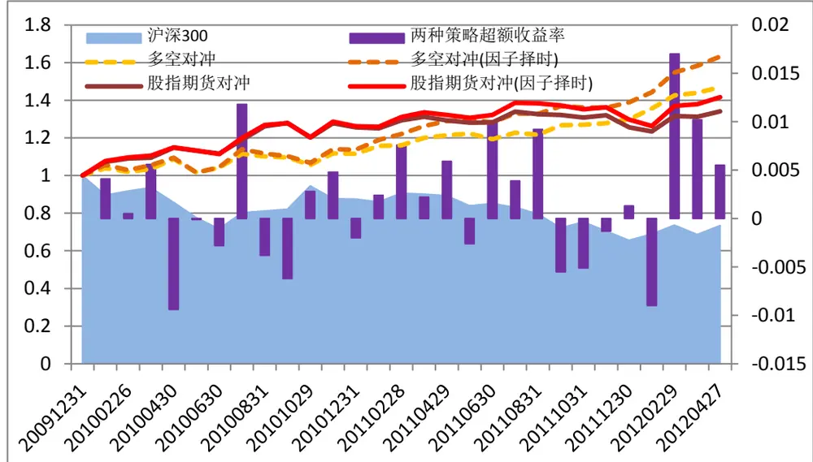
数据来源：广发证券研究发展中心，Wind数据库

表 7.因子择时策略相对因子等权策略表现统计

|  | 收益率提高(%) | 信息比提高(%) | 胜率 |
| --- | --- | --- | --- |
| 多空对冲 | 12.34% | 11.97% | 60.76% |
| 股指期货对冲 | 6.10% | 11.37% | 60.76% |

考虑因子 IC 均值回复性并对其进行择时后，两类对冲组合的表现均有明显提高，其中信息比均提高了 11%以上，而因子择时策略相对因子等权策略各期的胜率为60.76%。尤其在2011上半年及今年以来，择时策略尽显优势。

基于上述因子择时策略，得到多因子策略中，各因子的历史权重分布如下图所示：

图 26.样本外因子权重动态分布
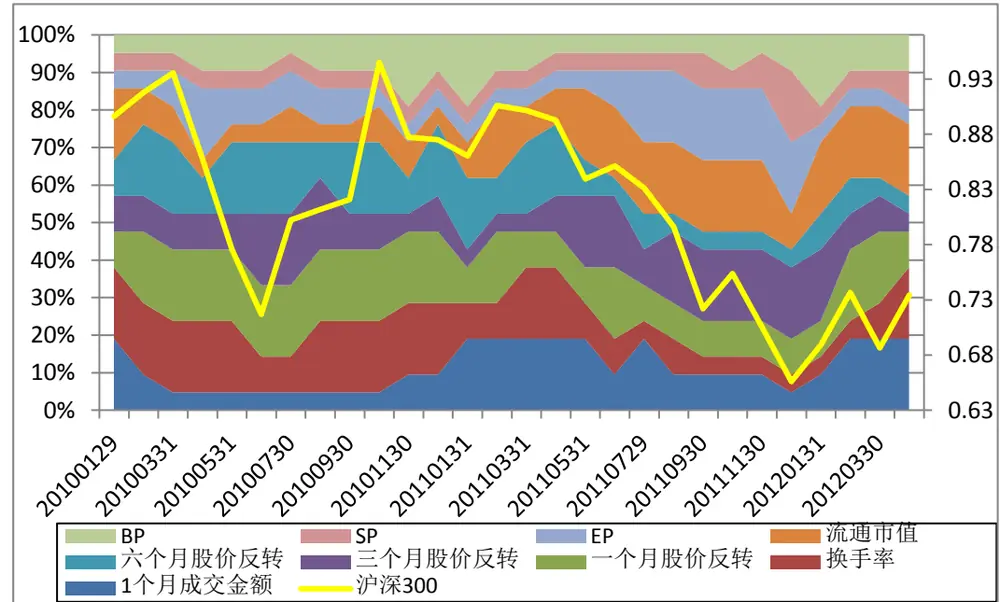
数据来源：广发证券研究发展中心，Wind数据库

根据上图显示，2011上半年及今年以来，由于因子择时策略成功地捕捉了“一个月股价反转”以及“换手率”等因子的轮动规律，使得对冲组合的表现有了大幅的提高。

## 五、总结

为了把握市场风格轮动规律，从而更好地捕捉市场Alpha，报告从因子自身有效性变化的角度出发，运用不同统计方法对其进行了检验，发现了因子IC与ICIR之间存在显著的负相关关系，从而验证了风格因子的均值回复性。

实证结果表明，基于因子均值回复性的因子择时策略能够有效提高多因子Alpha策略的收益及信息比。对于各类因子后续的应用，可以参考因子最新一期的动态权重分配结果。

在追寻Alpha的路上，因子择时备受关注，由于每一类风格因子的轮动规律都受到各种复杂因素的影响，难以用量化的方式对其进行全面有效解析，因此该课题显得任重道远。报告仅针对其中部分因子的均值回复性进行了探讨，统计得到的规律或许对于读者更好认识各种风格因子的特性有些许参考意义，但得到的规律无法详尽，后续我们仍将继续致力于该方向的研究，敬请关注我们后续的相关研究。

## Table_AuthorSum 广发金融工程研究小组mary

罗军，首席分析师，华南理工大学理学硕士，2010年进入广发证券发展研究中心。

俞文冰，首席分析师，CFA，上海财经大学统计学硕士，2012年进入广发证券发展研究中心。

叶涛，资深分析师，CFA ，上海交通大学管理科学与工程硕士，2012年进入广发证券发展研究中心。

安宁宁，资深分析师，暨南大学数量经济学硕士，2011年进入广发证券发展研究中心。

胡海涛，分析师， 华南理工大学理学硕士， 2010年进入广发证券发展研究中心。

夏潇阳， 分析师， 上海交通大学金融工程硕士， 2012年进入广发证券发展研究中心。

汪鑫， 分析师， 中国科学技术大学金融工程硕士， 2012年进入广发证券发展研究中心。

蓝昭钦， 研究助理， 中山大学理学硕士， 2010年进入广发证券发展研究中心。

李明，研究助理，伦敦城市大学卡斯商学院计量金融硕士，2010年进入广发证券发展研究中心。

史庆盛， 研究助理， 华南理工大学金融工程硕士， 2011年进入广发证券发展研究中心。

张超， 研究助理， 中山大学理学硕士， 2012年进入广发证券发展研究中心。

## Table_Report 相关研究报告

多因子 Alpha系列报告之（七）——大浪淘金，Alpha因子何处寻？

多因子 Alpha系列报告之（十一）——考虑换手率的多因子策略？

|  | 广州市 | 深圳市 | 北京市 | 上海市 |
| --- | --- | --- | --- | --- |
| 地址 | 广州市天河北路183 号 大都会广场5楼 | 深圳市福田区民田路178 | 3 北京市西城区月坛北街2号 | 上海市浦东南路 528 号 |
| 邮政编码 | 510075 | 号华融大厦9楼 518026 | 月坛大厦18层 100045 | 上海证券大厦北塔17楼 200120 |
| 客服邮箱 | gfyf@gf.com.cn |  |  |  |
| 服务热线 | 020-87555888-8612 |  |  |  |

## 免责声明

le_Disclaimer广发证券股份有限公司具备证券投资咨询业务资格。本报告只发送给广发证券重点客户，不对外公开发布。

本报告所载资料的来源及观点的出处皆被广发证券股份有限公司认为可靠，但广发证券不对其准确性或完整性做出任何保证。报告内容仅供参考，报告中的信息或所表达观点不构成所涉证券买卖的出价或询价。广发证券不对因使用本报告的内容而引致的损失承担任何责任，除非法律法规有明确规定。客户不应以本报告取代其独立判断或仅根据本报告做出决策。

广发证券可发出其它与本报告所载信息不一致及有不同结论的报告。本报告反映研究人员的不同观点、见解及分析方法，并不代表广发证券或其附属机构的立场。报告所载资料、意见及推测仅反映研究人员于发出本报告当日的判断，可随时更改且不予通告。

本报告旨在发送给广发证券的特定客户及其它专业人士。未经广发证券事先书面许可，任何机构或个人不得以任何形式翻版、复制、刊登、转载和引用，否则由此造成的一切不良后果及法律责任由私自翻版、复制、刊登、转载和引用者承担。