# Table_Title考虑因子非线性特征的多因子 Alpha 策略

# ——多因子 Alpha系列报告之（十三）

罗军Table_Author 首席分析师

电话：020-87555888-8655

eMail：lj33@gf.com.cn

执业编号：S0260511010004

## Table_Summary Alpha 因子存在非线性特征

最早的多因子Alpha模型来源于套利定价理论（APT），APT模型假设每一只股票的预期收益由股票的因子头寸决定，且两者呈线性关系，然而实际研究中，我们常常发现因子与股票预期收益之间并非严格的线性关系，因子与股票收益之间存在非线性关系常见的有以下几种：（1）非线性因子中间较好，两端较差；（2）第二种非线性因子整体呈线性，但及好的一端出现掉头；（3）第三种非线性因子同样整体呈线性，但及差的一端出现掉头。

报告所探讨的便是因子与股票收益之间存在的非线性关系，简而言之，我们将改变直接用因子的线性排序来对股票未来收益进行预测的方式，而是要经过一步非线性到线性的变换，使得因子与股票收益具有更好的线性关系。

## 基于因子多项式形式的 Alpha 模型

因子线性变换的第一种方法，是采用因子的多项式形式来对股票收益进行预测。运用该方法我们大大改善了换手率、总资产以及EP等存在明显非线性特征的因子有效性，结合非线性特征不明显的Alpha因子，我们分别构建了非线性多因子模型以及混合多因子模型。

实证分析显示，多项式因子的线性变换方法无论对于单个因子还是多因子策略，均有显著的改善效果。

## 引入附加因子的 Alpha 模型

构造因子多项式的方法虽然简单但缺乏合理的经济解释，通过引入附加因子的方式我们设计了另一种方法。

何谓附加因子？举个简单的例子，我们采用全样本统计发现换手率跟股票收益率有显著的负相关，但是具有一定的非线性特征，如果考虑把全部样本分为两部分：高市值样本和低市值样本，发现在两个不同样本内，换手率与股票收益的关系显著不同，因此我们引入股票流通市值作为换手率因子的附加因素，从而构造一个虚拟变量（dummy）$d_{high\_cap}$ ，这个变量在股票属于大小市值的时候分别取值为0和1，这里流通市值便成为换手率因子的附加因子。

经实证检验，增加附加因子的方法同样能够大大提高多因子策略的有效性。

## 两种方法比较

本文抛弃了以往对Alpha因子与股票符合线性相关的假设，逐个分析了因子的非线性特征，并提出了上述两种因子线性转换的方法。

方法一的优点是原理简单，对因子的非线性改善效果比较直观；而缺点则是该方法比较依赖于对历史数据的挖掘，且缺乏严谨的经济逻辑解释。

方法二的优点是具有相对合理和直观的经济意义，且对因子的非线性改善效果更为显著；而缺点则是该方法需要通过对大量因子之间进行配对比较，最终挑选效果较好且均有合理解释的配对因子，工作量较大，对于多个因子之间的交叉影响作用也难以进行考虑，无法做到面面俱到。

在追寻Alpha的路上，我们一直在探寻提高多因子策略Alpha收益的方法，本报告首次从因子及个股截面上对两者之间的线性关系提出了质疑，并提供了两种改善因子非线性特征的思路，且对Alpha策略的改善效果也非常显著。后续我们仍将继续致力于该方向的研究，敬请关注我们后续的相关研究。

## 一、因子非线性特征

最早的多因子Alpha模型来源于套利定价理论（APT），APT模型假设每一只股票的预期收益由股票的因子头寸决定，即

$$
r_{i}=v_{i0}+v_{i1}F_{1}+\ldots+v_{ik}F_{k}+\varepsilon_{i}\tag{1}
$$

其中， $r_{\mathrm{i}}.$ 为股票i的预期收益， $b_{iI},b_{i2},....,b_{ik}$ 是股票在K个Alpha因子上的暴露， $I_{l},I_{2},\ldots,$ $I_{k},$ 是因子回报， $u_{i}$ 是股票i的特殊回报。

根据式（1），股票预期收益是Alpha因子的一个线性组合，举一个最简单的例子，假设有A和B两只股票，其中A相对B具有更低的估值(以E/P为例)，而两只股票在其他各种因素上均无差异，那么根据式（1）投资者一定会选择股票A进行投资，因为A具有更高EP，从而具有更高的预期收益，即线性多因子模型中的“Bigger is always better”原则。

本文将围绕Alpha因子和个股预期收益之间的关系展开讨论，实际研究中，我们常常发现EP与股票预期收益之间并非严格的线性关系，两者的关系如下图1所示，高EP的股票常常能够获得较高的预期收益，然而低EP的个股其后续表现并不如预期那么差，或许某些低EP个股具有较高的成长性，抑或该公司处于业务扩张期等，总而言之，低EP个股之所以股价偏高总有其原因，并不一定意味着相应的股票不值得投资。

图 1. 估值因子的百分位统计图
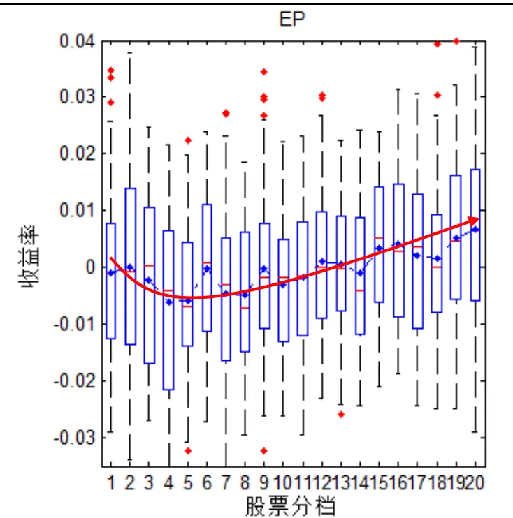
数据来源：广发证券研究发展中心，Wind数据库

因子与股票收益之间存在非线性关系常见的有以下几种：

图 2. 常见的因子非线性特征
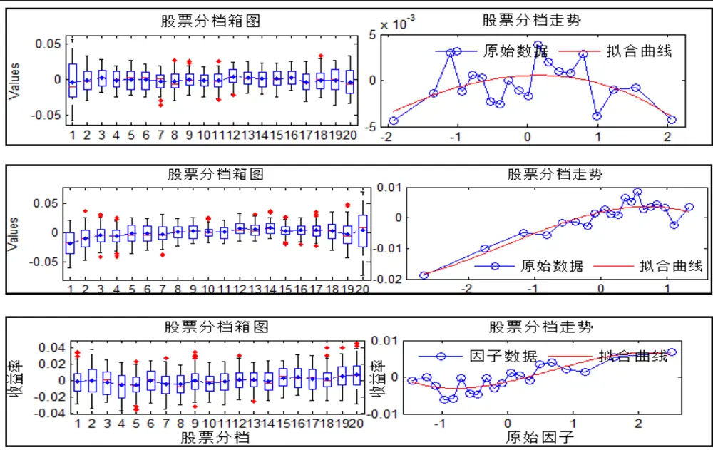
数据来源：广发证券研究发展中心，Wind数据库

第一种非线性因子中间较好，两端较差；第二种非线性因子整体呈线性，但及好的一端出现掉头；第三种非线性因子同样整体呈线性，但及差的一端出现掉头。

既然因子与股票收益之间存在非线性关系，那么如何解决呢？这便是本文所要进行探讨的问题，简而言之，我们将改变直接用因子的线性排序来对股票未来收益进行预测的方式，而是要经过一步非线性到线性的变换，使得因子与股票收益具有更好的线性关系。

图 3.因子线性变换过程
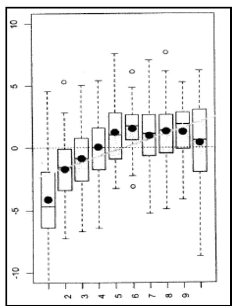

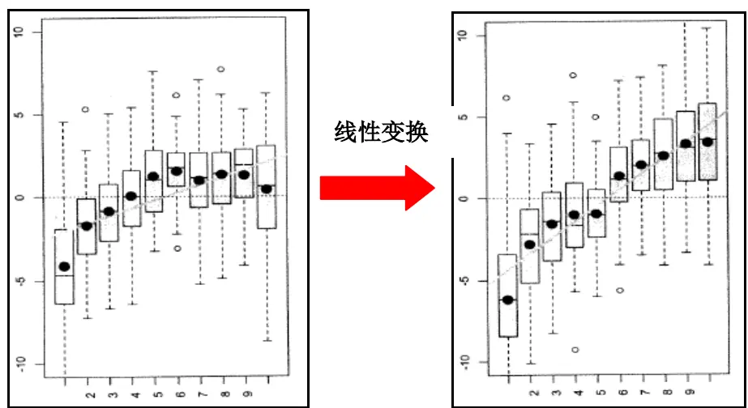

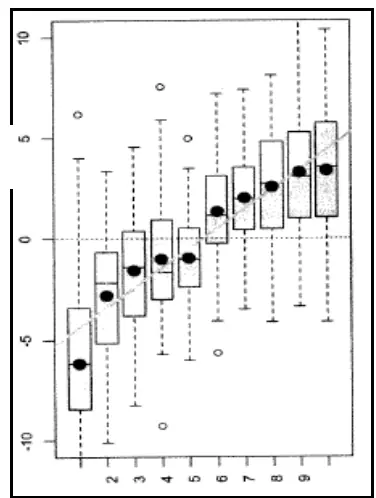
数据来源：广发证券研究发展中心，Wind数据库

解决因子非线性问题的方法有许多种，最简单的方式是构造因子暴露的多项式形式取代因子的线性形式对股票预期收益进行预测，从而实现因子的非线性转化，该方法的优点是简单且易于操作，缺点则是模型参数来源于历史数据的信息挖掘，缺乏严谨的经济逻辑。

另外还有一类方法是，针对存在非线性特征的因子，寻找相关的附加变量，通过对两者的交互作用来寻求较为合理的解释。

下表列出12个备选的因子，下文我们将分别采用上述两种不同方法来对各因子的线性特征进行分析。

表 1.挑选的12个风格因子

| 1 | 资产负债率 |
| --- | --- |
| 2 | 1个月成交金额 |
| 3 | 近3个月平均成交量 |
| 4 | 换手率 |
| 5 | 一个月股价反转 |
| 6 | 流通市值 |
| 7 | 总资产 |
| 8 | 固定比 |
| 9 | 流动比率 |
| 19 | EP |
| 11 SP |  |
| 12 | BP |

数据来源：广发证券研究发展中心，Wind数据库

样本期间：2007 年 1 月 31 日-2012 年 8 月 31 日共 68 个月；

## 二、基于因子多项式形式的 Alpha 模型

## (一)单因子分析

下面我们先讨论第一种方法，即采用因子多项式形式来对股票收益进行预测，综合各阶多项式的特点，我们选择增加因子的二阶项和三阶项，以单因子模型为例，因子的三次多项式模型如以下形式：

$$
r_{i}=aF^{3}+bF^{2}+cF+d\tag{1}
$$

多项式函数的形状取决于系数a， b， c， d， 可通过最小二乘拟合得到各系数，下面对表1所列因子的线性特征逐个进行分析。

图 4. 资产负债率因子非线性特征分析
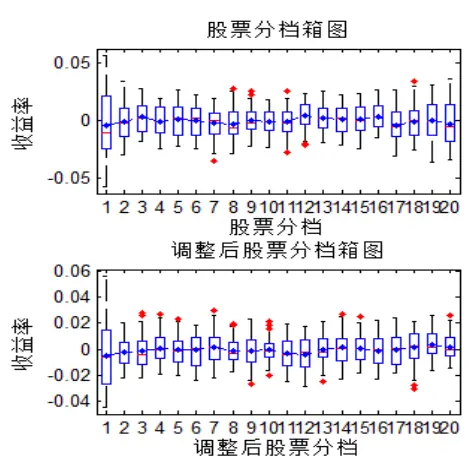

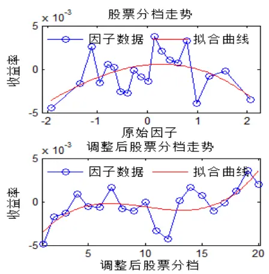
数据来源：广发证券研究发展中心，Wind数据库

图4 中，我们将800只股票根据资产负债率大小分为20档，第1档的资产负债率最高，而第20档的资产负债率最低。

上图：代表不考虑因子非线性特征情况下“资产负债率”因子与股票收益率的关系；

下图：代表对因子进行多项式转化之后，因子与股票收益率的关系；

左图：为每一档的百分位统计图，其中上下影线为分档内的极大小值（红色点为异常值），盒子底部为1/4百分位，顶部为3/4百分位，蓝色实心点为平均值；

右图：为左图的细化，用于刻画因子与股票收益的趋势关系，横坐标为各档的平均因子暴露，纵坐标为股票平均收益率，红色曲线为三次多项式的拟合曲线。

关于图4的解读，其他因子类似，不再重复。

在进行多项式转化之前，资产负债率因子与股票预期收益之间显然没有线性特征，负债率越多或越底对应的股票都不是最佳，经过多项式调整之后，两者之间的线性特征有了明显的改善，下面我们对调整前后的因子累积收益1进行比较，发现调整之后资产负债率因子的有效性显著提高了，因子年化收益率由-0.5%提高到3%。

图 5. 资产负债率因子累积收益图
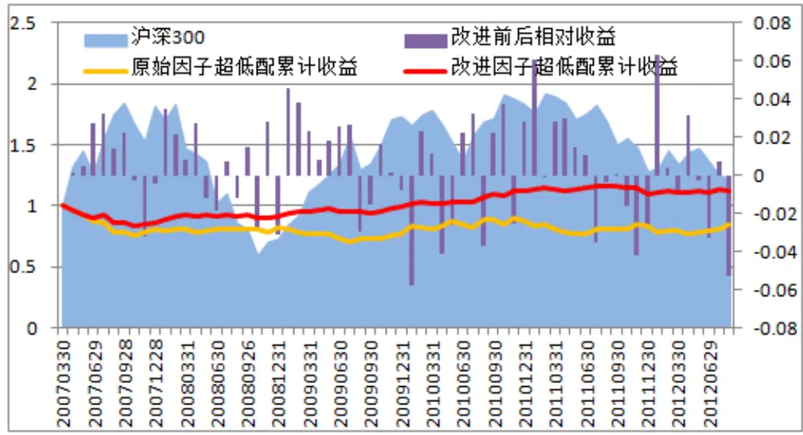
数据来源：广发证券研究发展中心，Wind数据库

换手率因子具有较好的线性特征，换手率月低，股票下月预期收益越高，但在低换手的局部位置出现非线性特征；经过多项式调整之后，因子的线性特征有了明显的改善；对调整前后的因子累积收益进行比较，发现调整之后换手率因子的有效性同样得到了显著的提高，因子年化收益率由21.7%提高到28.4%。

图 6. 换手率因子非线性特征分析
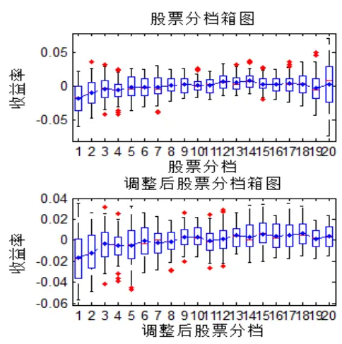

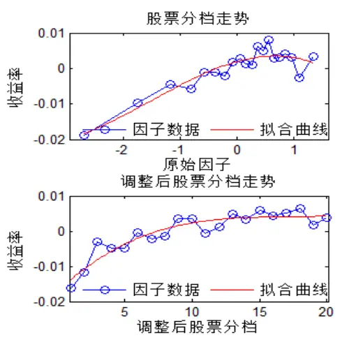
数据来源：广发证券研究发展中心，Wind数据库

图 7. 换手率因子累积收益图
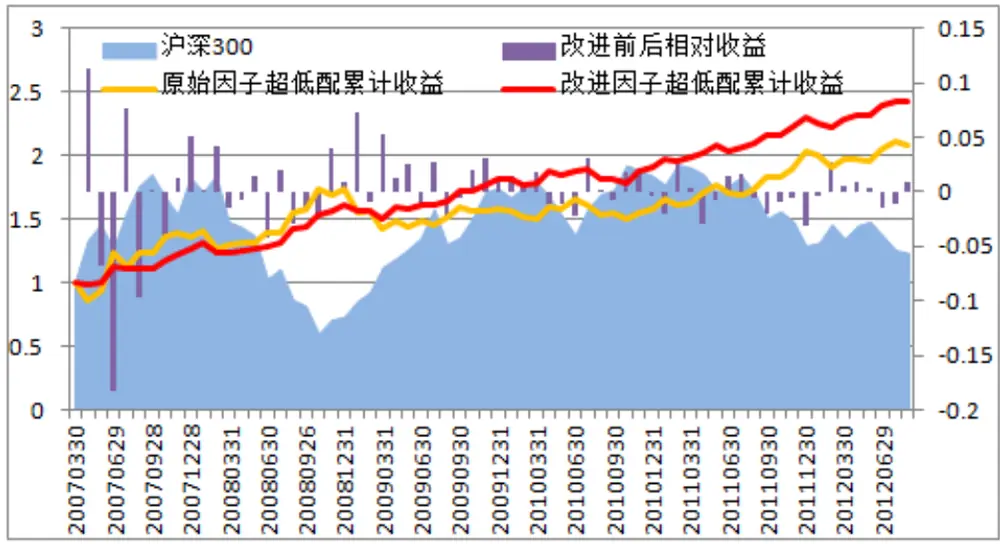
数据来源：广发证券研究发展中心，Wind数据库

EP因子同样具有较好的线性特征，高EP的股票一个月内预期收益越高，但在低EP的局部位置出现非线性特征；经过多项式调整之后，因子的线性特征有了明显的改善；对调整前后的因子累积收益进行比较，发现调整之后换手率因子的有效性同样得到了显著的提高，因子年化收益率由11%提高到13.5%。

图 8.EP 因子非线性特征分析
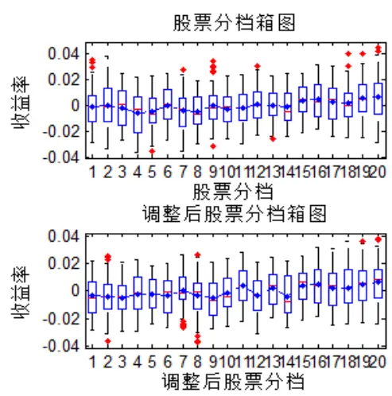

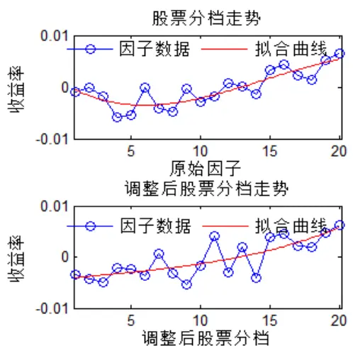
数据来源：广发证券研究发展中心，Wind数据库

图 9.EP 因子累积收益图
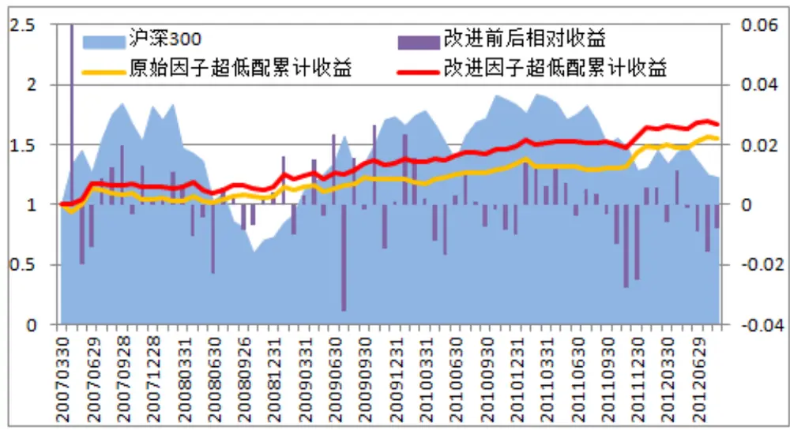
数据来源：广发证券研究发展中心，Wind数据库

总资产因子线性特征也比较明显，总体来看总共资产越低越好，但在总资产较低的局部位置出现非线性特征；经过多项式调整之后，因子的线性特征有了明显的改善；对调整前后的因子累积收益进行比较，发现调整之后总资产因子的有效性同样得到了显著的提高，因子年化收益率由8.1%提高到10%。

图 10. 总资产因子非线性特征分析
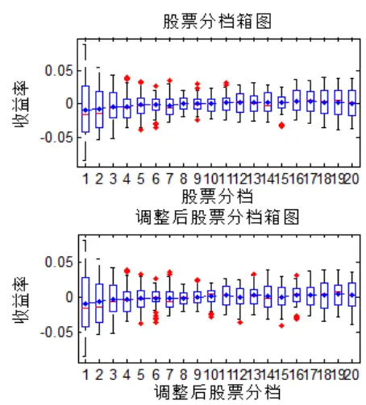

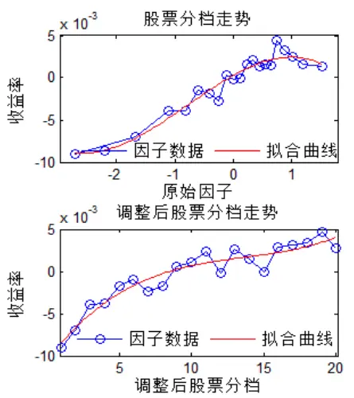
数据来源：广发证券研究发展中心，Wind数据库

图 11.总资产因子累积收益图
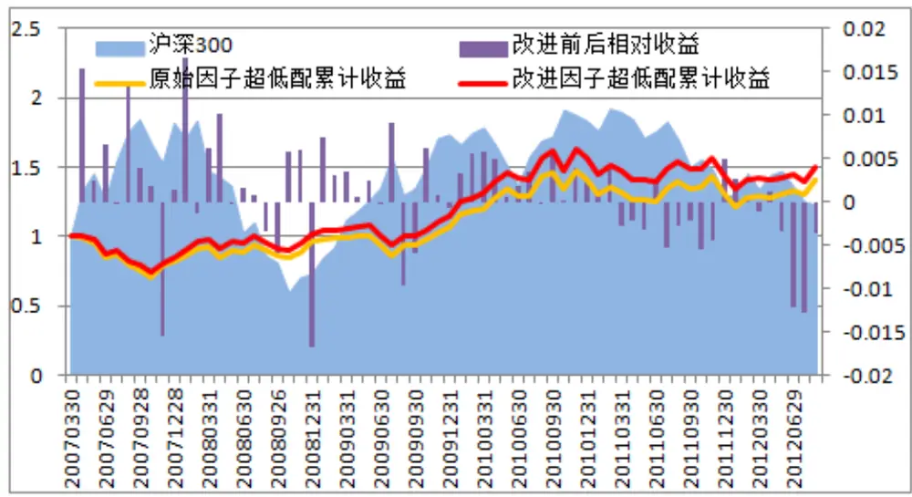
数据来源：广发证券研究发展中心，Wind数据库

固定比因子呈现中间好两端差的特征，经过多项式调整之后，因子的线性特征有了明显的改善；对调整前后的因子累积收益进行比较，发现调整之后固定比率因子的有效性同样得到了显著的提高，因子年化收益率由2.75%提高到6.57%。

图 12.固定比因子非线性特征分析
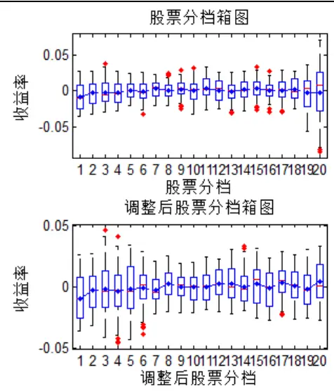

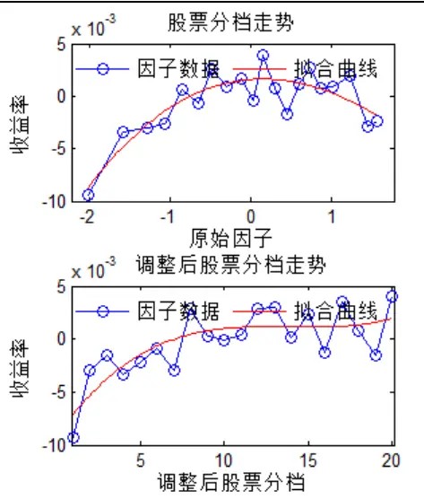
数据来源：广发证券研究发展中心，Wind数据库

图 13.固定比因子累积收益图
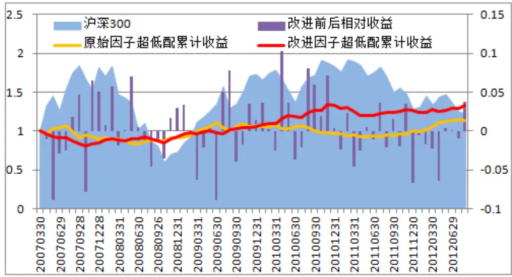
数据来源：广发证券研究发展中心，Wind数据库

流动比率同样呈现中间好两端差的特征，经过多项式调整之后，因子的线性特征有了明显的改善，因子年化收益率由3.76%提高到5.32%。

图 14.流动比率因子非线性特征分析
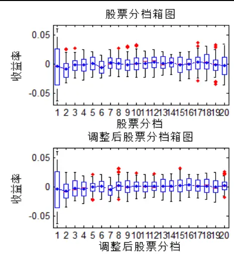
数据来源：广发证券研究发展中心，Wind数据库

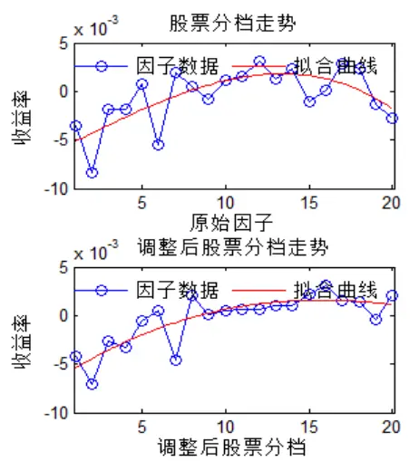

图 15.流动比率因子累积收益图
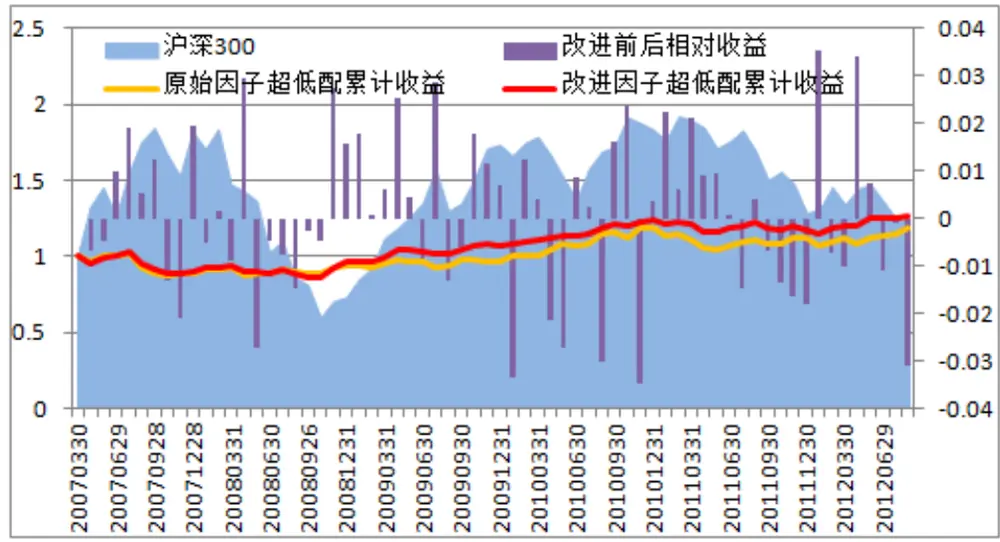
数据来源：广发证券研究发展中心，Wind数据库

上述介绍了6个具有显著非线性特征的因子，然而，部分因子具有非常显著的线性特征，不需进行线性变换，如下所列：

图 16.一个月成交金额因子非线性特征分析
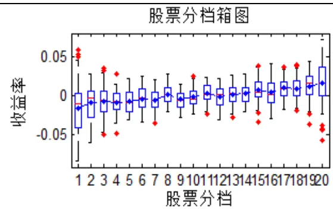
数据来源：广发证券研究发展中心，Wind数据库

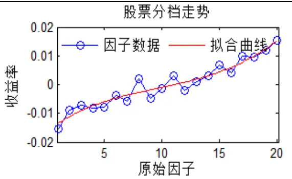

图 17.近 3 个月成交量因子非线性特征分析
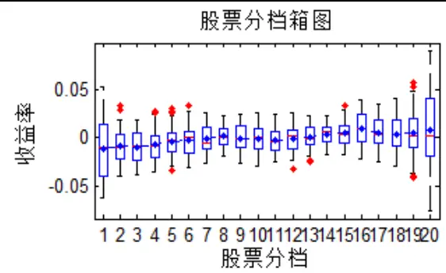
数据来源：广发证券研究发展中心，Wind数据库

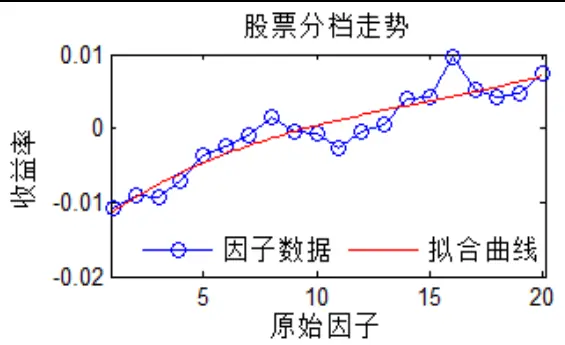

图 18.一个月股价反转因子非线性特征分析
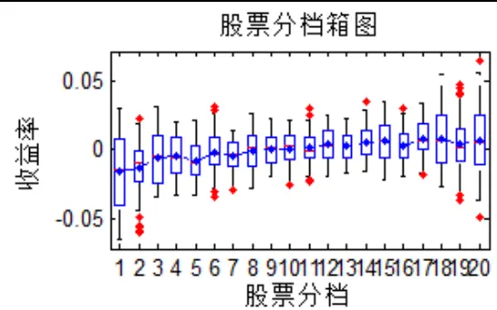
数据来源：广发证券研究发展中心，Wind数据库

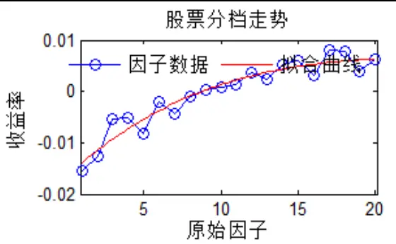

图 19.流通市值因子非线性特征分析
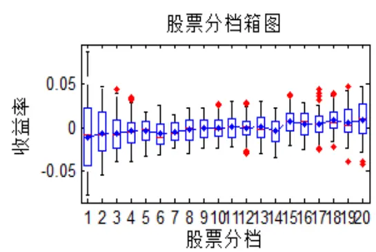
数据来源：广发证券研究发展中心，Wind数据库

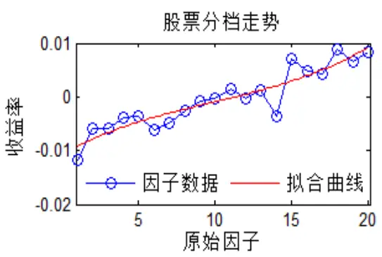

图 20.SP 因子非线性特征分析
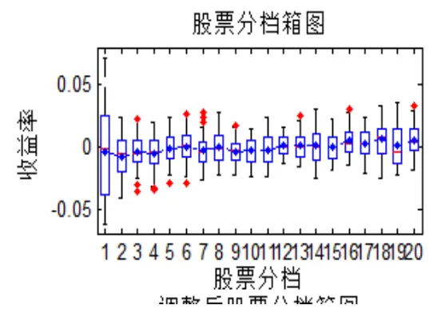
数据来源：广发证券研究发展中心，Wind数据库

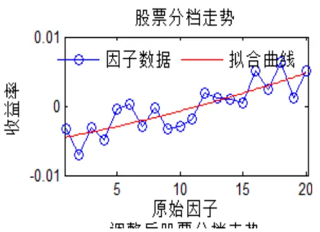

图 21.BP 因子非线性特征分析
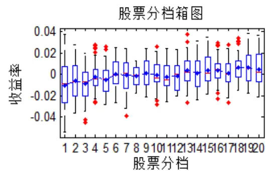
数据来源：广发证券研究发展中心，Wind数据库

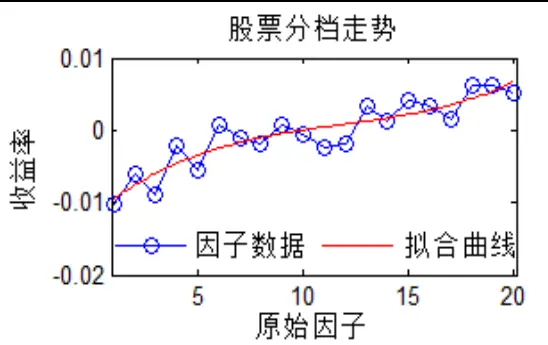

经统计，我们找到非线性特征和线性特征比较显著的因子各6个。 其中，具有非线性特征的因子，已经证明了通过非线性变换能够变得更为有效！下面尝试在多因子策略中来进行线性变换，检验是否能够提高多因子策略的效果。

表 2.因子线性特征统计结果

| 编号 | 非线性因子 | 线性因子 |
| --- | --- | --- |
| 1 | 资产负债率 | 1 个月成交金额 |
| 2 | 换手率 | 近3个月平均成交量 |
| 3 | 总资产 | 一个月股价反转 |
| 4 | 固定比 | 流通市值 |
| 5 | 流动比率 | SP |
| 6 | EP | BP |

数据来源：广发证券研究发展中心，Wind数据库

## (二)多因子策略

上节我们通过统计分析发现部分因子存在显著的非线性特征，通过构造因子的多项式形式来替代原始因子对股票未来收益率进行预测，该方法取得显著的改善效果。下面我们将基于表2所列的12个Alpha因子构造多因子策略，检验因子的多项式变换对多因子策略是否能起改善效果，实证分析使用的样本数据如下：

样本期间：2007 年 3 月 31 日-2012 年 8 月 31 日共 68 个月，其中 2011 年 12 月 31日之前作为样本内数据，用于统计各因子的非线性特征；2011 年 12 月31日之后作为样本外数据，根据样本内统计的结果进行实证分析，检验因子的非线性特征及因子的多项式转换是否稳定有效。

## （1）非线性因子策略

首先基于非线性构造多因子策略，我们对 6 个具有非线性特征的因子采用平均加权法进行组合构造，得到多因子策略的表现情况，如下所示：

如果不考虑因子的非线性特征，不进行线性变换，则得到多因子对冲组合样本内信息比为 0.86，今年以来1.60

图 22.不考虑线性变换的非线性多因子策略表现

数据来源：广发证券研究发展中心，Wind数据库

表 3.不考虑线性变换的非线性多因子策略表现

|  | 年化收益率 | 年化波动率 | 信息比 | 最大回撤 |
| --- | --- | --- | --- | --- |
| 样本内（2007-2011） | 12.46% | 14.44% | 0.86 | 14.62% |
| 样本外（2012） | 17.93% | 11.19% | 1.60 | 2.36% |

数据来源：广发证券研究发展中心，Wind数据库

进一步，如果我们对其中带有非线性特征的因子进行线性变换的话，得到多因子对冲组合样本内信息比提高到 1.48，今年高达 2.14

图 23.不考虑线性变换的非线性多因子策略表现
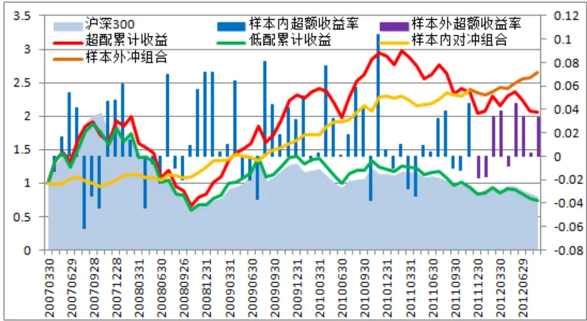
数据来源：广发证券研究发展中心，Wind数据库

表 4.不考虑线性变换的非线性多因子策略表现

|  | 年化收益率 | 年化波动率 | 信息比 | 最大回撤 |
| --- | --- | --- | --- | --- |
| 样本内（2007-2011） | 19.36% | 13.07% | 1.48 | 15.33% |
| 样本外（2012） | 19.19% | 8.97% | 2.14 | 2.26% |

数据来源：广发证券研究发展中心，Wind数据库

可以看到，考虑线性变换之后，多因子策略的改善相当显著的，两种策略之间的相对胜率样本内为55%，样本外63%.

图 24.线性变换前后多因子策略表现
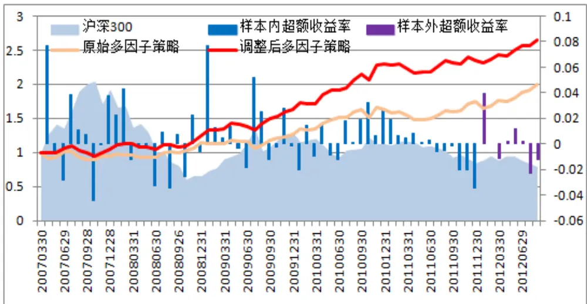
数据来源：广发证券研究发展中心，Wind数据库

表 5.线性变换前后多因子策略表现对比

|  | 策略相对超额收益率 | 胜率 |
| --- | --- | --- |
| 样本内(2007-2011) | 6.06% | 55.17% |
| 样本外（2012） | 1.32% | 62.50% |

数据来源：广发证券研究发展中心，Wind数据库

## （2）混合多因子策略

下面我们对全部 12个因子采用平均加权法进行组合构造，得到多因子策略的表现情况，如下所示：

首先，如果不考虑因子的非线性特征，即不对其中具有非线性特征的 6 个因子进行线性变换，得到多因子对冲组合样本内信息比为1.49，今年以来1.61

图 25.不考虑线性变换的非线性多因子策略表现
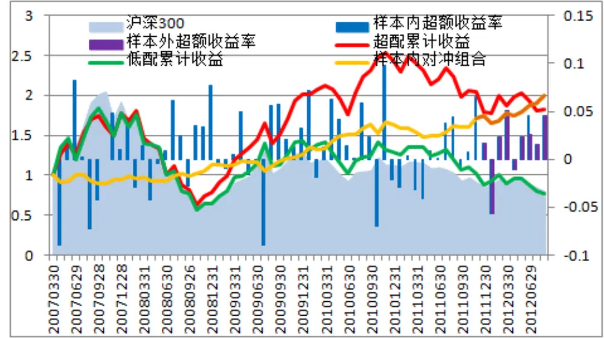
数据来源：广发证券研究发展中心，Wind数据库

表 6.不考虑线性变换的非线性多因子策略表现

|  | 年化收益率 | 年化波动率 | 信息比 | 最大回撤 |
| --- | --- | --- | --- | --- |
| 样本内（2007-2011） | 25.88% | 17.32% | 1.49 | 14.62% |
| 样本外（2012） | 19.93% | 12.42% | 1.61 | 2.36% |

数据来源：广发证券研究发展中心，Wind数据库

进一步，如果我们对其中带有非线性特征的因子进行线性变换的话，得到多因子对冲组合样本内信息比提高到 1.75，今年高达 2.1

图 26.不考虑线性变换的非线性多因子策略表现

数据来源：广发证券研究发展中心，Wind数据库

表 7.不考虑线性变换的非线性多因子策略表现

|  | 年化收益率 | 年化波动率 | 信息比 | 最大回撤 |
| --- | --- | --- | --- | --- |
| 样本内（2007-2011） | 29.82% | 17.02% | 1.75 | 15.33% |
| 样本外（2012） | 21.05% | 10.09% | 2.09 | 2.26% |

数据来源：广发证券研究发展中心，Wind数据库

可以看到，考虑线性变换之后，多因子策略的改善还是相当显著的，两种策略之间的相对胜率为 63%，可见，多项式方法对于改善因子非线性特征具有显著的效果。

图 27.线性变换前后多因子策略表现
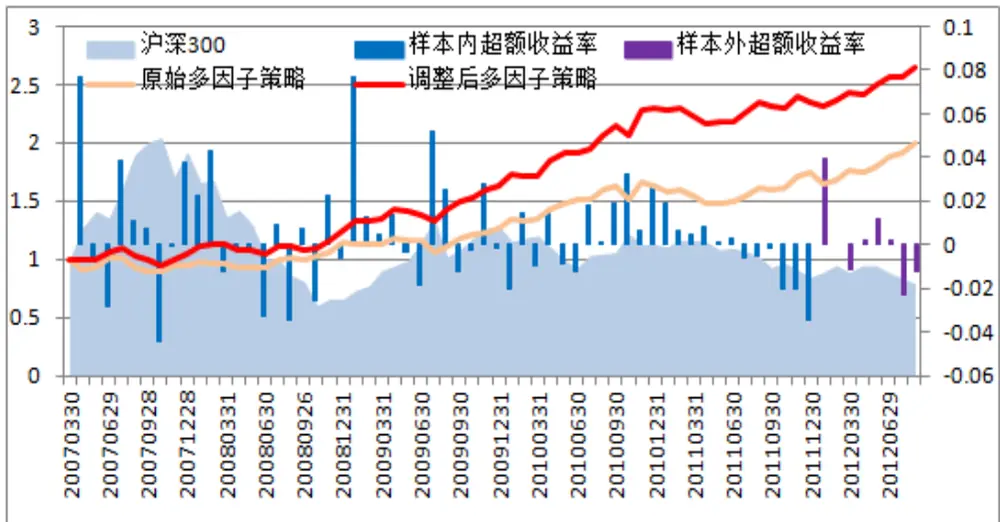
数据来源：广发证券研究发展中心，Wind数据库

表 8.线性变换前后多因子策略表现

|  | 策略相对超额收益率 | 胜率 |
| --- | --- | --- |
| 样本内(2007-2011） | 3.43% | 56.90% |
| 样本外（2012） | 2.01% | 62.50% |

数据来源：广发证券研究发展中心，Wind数据库

## 三、引入附加因子的 Alpha 模型

构造因子多项式的方法虽然简单但缺乏合理的经济解释，下面我们通过引入附加因子的方法来解决因子非线性问题。

举个简单的例子，我们采用全样本统计发现换手率跟股票收益率有显著的负相关，但是具有一定的非线性特征；进一步，我们考虑把全部样本分为两部分：高市值样本和低市值样本，并且发现在两个不同样本内，换手率与股票收益的关系显著不同，基于这一结论，我们引入了流通市值作为换手率因子的附加因素，并构造一个虚拟变量$(\mathrm{dummy})d_{high\_cap},$ 该变量在股票属于大小市值的时候分别取值为 0和 1。

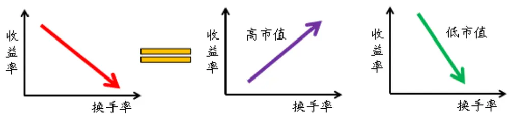
图 28.换手率与流通市值关系图
数据来源：广发证券研究发展中心，Wind数据库

引入虚拟变量之后，重新构造了换手率与股票预期收益的非线性方程，如下所示。

$$
d_{规模}=\left\{\begin{aligned}&1&\quad 流通市值在前&50\%\\&0&\quad 否则&\end{aligned}\right.
$$

$$
r_{i}=v_{i0}+v_{i1}F_{换手率}+v_{i2}d_{流通市值}F_{换手率}+\varepsilon_{i}
$$

这便是我们所采用的第二种方法。下面我们同样分别从单因子及多因子的角度来验证该方法的有效性。

## (一)单因子分析

针对部分Alpha因子，下面结合其相应的附加因子来分析因子的非线性特征并对经过线性变换之后因子改善效果进行检验。

首先来看换手率因子：在线性变换之前，我们发现因子在极好一端出现非线性，进而我们单独在小市值样本里面作了检验，发现线性效果显著提高，基于此我们考虑引入流通市值作为换手率的附加因子，并且对因子模型进行调整。

可以看到，调整之后因子的单调性明显改善，因子的年化收益从22%提高到36%，改善幅度非常大。

图 29. 引入“流通市值”因子的“换手率”因子
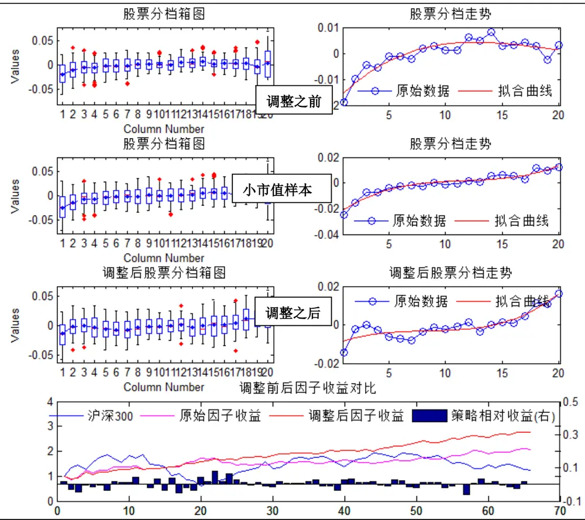
数据来源：广发证券研究发展中心，Wind数据库

再看PE因子：线性变换之前，我们发现因子在极差一端出现非线性特征；同样我们引入流通市值作为PE的附加因子，并对因子模型进行调整，调整之后因子的单调性明显改善，因子年化收益从11%提高到16%，改善幅度也很大。

图 30. 引入“流通市值”因子的“EP”因子
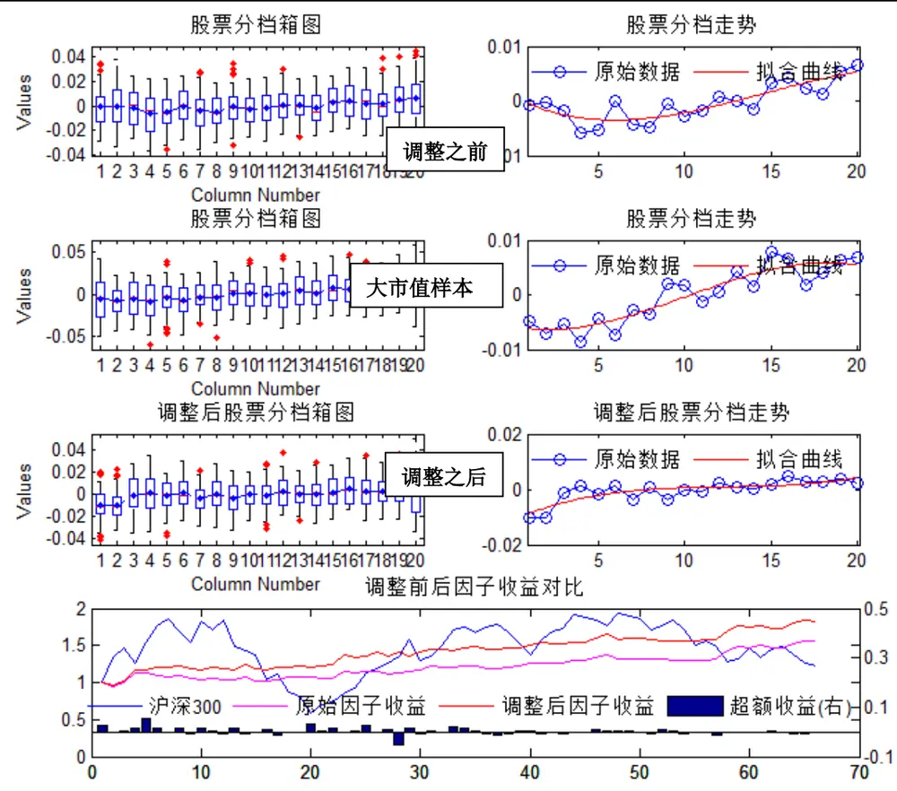
数据来源：广发证券研究发展中心，Wind数据库

再看成交金额因子：该因子本身单调性很好，不存在明显的非线性特征；但我们同样找到了改善的空间，通过引入一个月股价反转作为成交金额的附加因子，可以看到，调整之后因子的单调性明显改善，因子的年化收益从50%提高到59%，改善幅度也很大。

图 31. 引入“一个月股价反转”因子的“一个月成交金额”因子
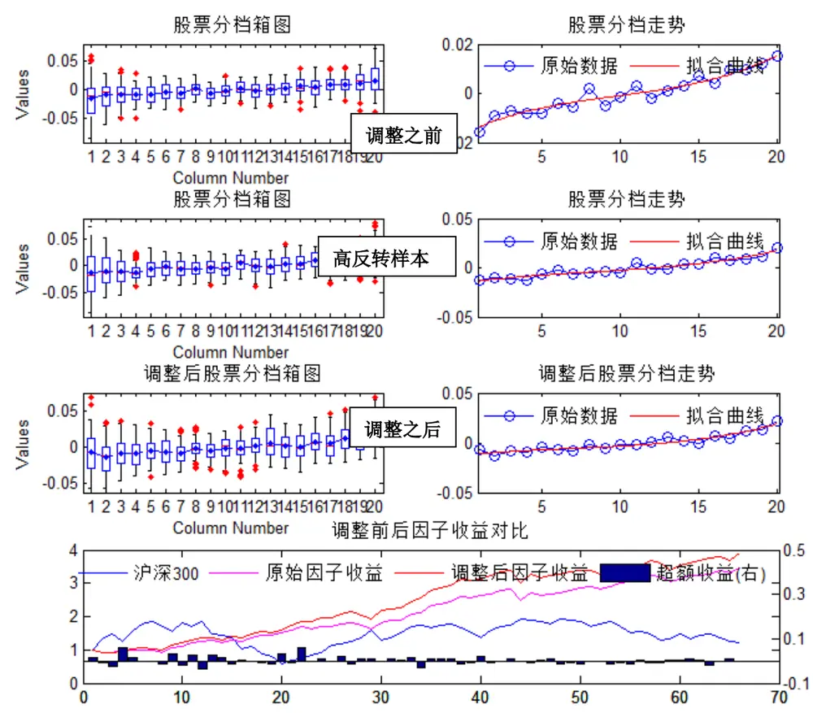
数据来源：广发证券研究发展中心，Wind数据库

由于因子数量较多，我们不再一一陈列，仅把把其中部分具有显著改善效果的因子及其附加因子列出来，如下表所示：

表 9.Alpha 因子与附加因子统计表

| 编号 | A1pha 因子 | 附加因子 |
| --- | --- | --- |
| 1 | 换手率 | 流通市值 |
| 2 | 总资产 | 换手率 |
| 3 | 固定比 | 每股负债比 |
| 4 | 速动比率 | 每股负债比 |
| 5 | EP | 流通市值 |
| 6 | 1个月成交金额 | 一个月股价反转 |
| 7 | 近3个月平均成交量 | 流通市值 |
| 8 | 流通市值 | 一个月股价反转 |
| 9 | CFP | 换手率 |
| 10 | SP | 换手率 |

识别风险，发现价值

## 数据来源：广发证券研究发展中心，Wind数据库

据表9所示：换手率、EP以及成交量因子的有效性受到流通市值的影响； 成交量、总资产及CFP的有效性则受到流通市值的影响；成交金额和流通市值的有效性受到流通市值的影响；固定比、速动比率的有效性收到流通市值的影响。

上述我们仅列出我们所测算的部分因子配对，感兴趣的可以运用该方法对其他因子进行测试，相信会有意外的收获。下面我们暂且基于这10个因子构建多因子Alpha策略，并检验应如附加因子是否能够显著改善多因子策略的有效性。

## (二)多因子策略

下面我们运用这10个因子构造多因子策略，并且检验线性变换的效果。

上节我们通过统计分析发现部分因子存在显著的非线性特征，通过构造因子的多项是形式来替代因子对股票预期收益进行预测，取得了显著的改善效果。下面我们基于表2所列的12个Alpha因子构造多因子策略，检验因子的多项式变换对多因子策略是否能起到改善效果，实证的样本数据如下：

样本期间：2007 年 3 月 31 日-2012 年 8 月 31 日共 68 个月，其中 2011 年 12 月 31日之前作为样本内数据，用于统计各因子的非线性特征；2011 年 12月31日之后作为样本外数据，根据样本内统计的结果进行实证分析，检验因子的非线性特征及因子的多项式转换是否稳定有效。

我们对表9所列10个因子采用平均加权法进行组合构造，得到多因子策略的表现情况。

首先，如果不考虑这10个因子的非线性特征，则样本内多因子 Alpha策略的信息比为1.65，样本外信息比1.24。

图 32. 不考虑线性变换的多因子策略表现
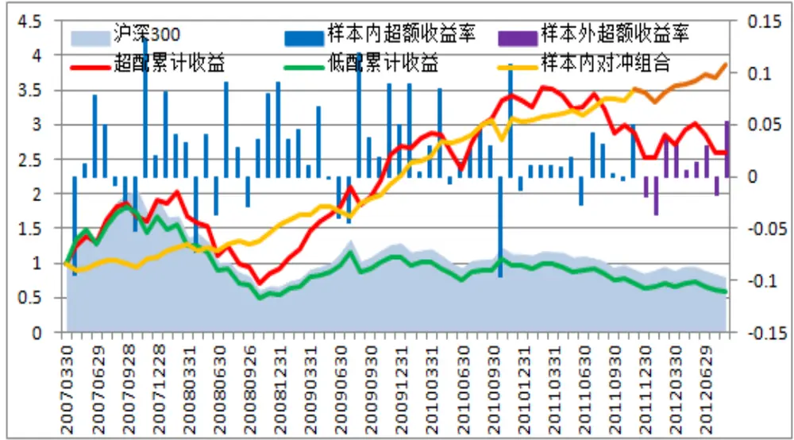
数据来源：广发证券研究发展中心，Wind数据库

表 10.不考虑线性变换的多因子策略表现

|  | 年化收益率 | 年化波动率 | 信息比 | 最大回撤 |
| --- | --- | --- | --- | --- |
| 样本内（2007-2011） | 28.25% | 17.16% | 1.65 | 9.66% |
| 样本外（2012） | 12.91% | 10.42% | 1.24 | 1.77% |

数据来源：广发证券研究发展中心，Wind数据库

若考虑了因子的非线性特征的话，那么样本内的信息比为 2，样本外信息比提高到1.56。 年华收益率有了显著的提高，而最大回撤却有所降低

图 33. 考虑线性变换的多因子策略表现
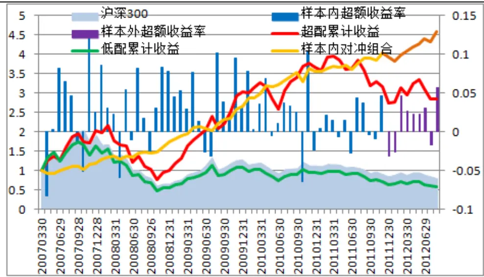
数据来源：广发证券研究发展中心，Wind数据库

表 11.考虑线性变换的多因子策略表现

|  | 年化收益率 | 年化波动率 | 信息比 | 最大回撤 |
| --- | --- | --- | --- | --- |
| 样本内（2007-2011） | 30.90% | 15.43% | 2.00 | 8.23% |
| 样本外（2012） | 17.20% | 11.01% | 1.56 | 1.70% |

数据来源：广发证券研究发展中心，Wind数据库

样本内策略得到改善的概率是 55%，样本外改善的概率高达 87%。

可见，基于引入附加因子的方法，对于改善因子非线性特征所取得的效果也非常显著，样本外的表现甚至优于多项式的线性变换方法。

图 34. 线性变换前后多因子策略表现
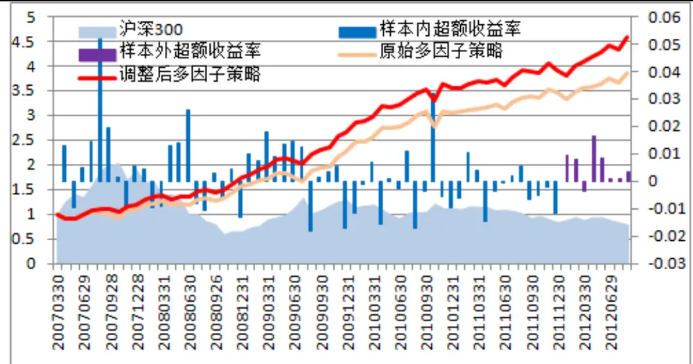
数据来源：广发证券研究发展中心，Wind数据库

表 12.线性变换前后多因子策略表现

|  | 策略相对收益 | 胜率 |
| --- | --- | --- |
| 样本内（2007-2011） | 2.36% | 55.17% |
| 样本外（2012） | 6.59% | 87.50% |

数据来源：广发证券研究发展中心，Wind数据库

## 四、总结

本文抛弃了以往对Alpha因子与股票符合线性相关的假设，逐个分析了因子的非线性特征，并提出两种因子线性转换的方法。

第一种方法是构造因子的三次多项式形式，即采用因子的三次多项式形式来对股票收益进行预测，之所以选择三次是因为三次函数的形状比较符合我们前面提到比较常见的非线性特征；

第二种方法是通过引入附加因子的方法来解决因子非线性问题。

方法一的优点是原理简单，对因子的非线性改善效果比较直观；而缺点则是该方法比较依赖于对历史数据的挖掘，且缺乏严谨的经济逻辑解释。

方法二的优点是具有相对合理和直观的经济意义，且对因子的非线性改善效果更为显著；而缺点则是该方法需要通过对大量因子之间进行配对比较，最终挑选效果较好且均有合理解释的配对因子，工作量较大，对于多个因子之间的交叉影响作用也难以进行考虑，无法做到面面俱到。

在追寻Alpha的路上，我们一直在探寻提高多因子策略Alpha收益的方法，本报告首次从因子及个股截面上对两者之间的线性关系提出了质疑，并提供了两种改善因子非线性特征的思路，且对Alpha策略的改善效果也非常显著。后续我们仍将继续致力于该方向的研究，敬请关注我们后续的相关研究。

## Table_AuthorSum 广发金融工程研究小组mary

罗军，首席分析师，华南理工大学理学硕士，2010年进入广发证券发展研究中心。

俞文冰，首席分析师，CFA，上海财经大学统计学硕士，2012年进入广发证券发展研究中心。

叶涛，资深分析师，CFA ，上海交通大学管理科学与工程硕士，2012年进入广发证券发展研究中心。

安宁宁，资深分析师，暨南大学数量经济学硕士，2011年进入广发证券发展研究中心。

胡海涛，分析师， 华南理工大学理学硕士， 2010年进入广发证券发展研究中心。

夏潇阳， 分析师， 上海交通大学金融工程硕士， 2012年进入广发证券发展研究中心。

汪鑫， 分析师， 中国科学技术大学金融工程硕士， 2012年进入广发证券发展研究中心。

蓝昭钦，分析师， 中山大学理学硕士， 2010年进入广发证券发展研究中心。

李明，分析师，伦敦城市大学卡斯商学院计量金融硕士，2010年进入广发证券发展研究中心。

史庆盛，分析师， 华南理工大学金融工程硕士， 2011年进入广发证券发展研究中心。

张超，分析师， 中山大学理学硕士， 2012年进入广发证券发展研究中心。

## Table_Report 相关研究报告

多因子 Alpha系列报告之（七）——大浪淘金，Alpha因子何处寻？

多因子 Alpha系列报告之（十一）——考虑换手率的多因子策略？

|  | 广州市 | 深圳市 | 北京市 | 上海市 |
| --- | --- | --- | --- | --- |
| 地址 | 广州市天河北路 183 号 大都会广场5楼 | 深圳市福田区民田路178 | 3 北京市西城区月坛北街2号 | 上海市浦东南路 528 号 |
| 邮政编码 | 510075 | 号华融大厦9楼 518026 | 月坛大厦18层 100045 | 上海证券大厦北塔17楼 200120 |
| 客服邮箱 | gfyf@gf.com.cn |  |  |  |
| 服务热线 | 020-87555888-8612 |  |  |  |

## 免责声明

le_Disclaimer广发证券股份有限公司具备证券投资咨询业务资格。本报告只发送给广发证券重点客户，不对外公开发布。

本报告所载资料的来源及观点的出处皆被广发证券股份有限公司认为可靠，但广发证券不对其准确性或完整性做出任何保证。报告内容仅供参考，报告中的信息或所表达观点不构成所涉证券买卖的出价或询价。广发证券不对因使用本报告的内容而引致的损失承担任何责任，除非法律法规有明确规定。客户不应以本报告取代其独立判断或仅根据本报告做出决策。

广发证券可发出其它与本报告所载信息不一致及有不同结论的报告。本报告反映研究人员的不同观点、见解及分析方法，并不代表广发证券或其附属机构的立场。报告所载资料、意见及推测仅反映研究人员于发出本报告当日的判断，可随时更改且不予通告。

本报告旨在发送给广发证券的特定客户及其它专业人士。未经广发证券事先书面许可，任何机构或个人不得以任何形式翻版、复制、刊登、转载和引用，否则由此造成的一切不良后果及法律责任由私自翻版、复制、刊登、转载和引用者承担。