# 基于情景分析的多因子 Alpha 策略

# ——多因子 Alpha系列报告之（十四）

罗军Table_Author 首席分析师

电话：020-87555888-8655

eMail：lj33@gf.com.cn

执业编号：S0260511010004

## Table_Summary Alpha 因子存在分层效应

前期报告《考虑非线性特征的多因子Alpha策略》中，我们统计发现某些风格因子存在明显的非线性特征，本文则进一步分析了因子的分层效应，根据每个因子的“分层强度”得到6个分层因子分别为：ROE(代表盈利因子)、总资产增长率(代表成长因子)、一个月成交金额(代表流动性因子)、一个月股价反转(代表股价涨幅因子)、流通市值(代表规模因子)、EP(代表估值因子)。

上述每个分层因子的按照暴露程度大小均可分为高、低两种情况，从而将全部股票分为12种特征情景。对于每一种不同的情景，我们将根据该情景下因子IC的绝对值来决定其权重的高低。

## 采用分层因子描述个股情景特征

选股好比于我们在评价一个人的衣着是否好看，显然每个人适用的衣服大小和款式各不相同，一个好的裁缝会根据每个人的身材特点定制合身的衣服；同样道理，一个好的选股策略应该区分股票独有的特征，采用不同的评价模式来对其进行打分，例如个股属于什么行业行业，是否属大市值股票，是否负债较高或者是否处于快速成长期等。

报告中采用了6个分层因子将个股的特征划分为12种情景类型，对于不同的情境类型，股票所对应的因子加权模式都各不相同，而一只股票可能具有多项显著特征，例如某只股票既属于大股票，同时又具备低估值的特点，因此不同个股的加权模式并不仅对应某一种情景下的因子加权模式，而应该是多种加权模式的综合，报告分别设计了“排序打分法”以及“连续打分法”来实现对个股属于不同特征的加权。

## 因子情景加权模型显著提高 Alpha 策略收益

基于因子情景加权矩阵以及个股的特征矩阵便可构建情景加权多因子Alpha策略，并与因子等权Alpha模型及因子IC加权Alpha模型进行比较，对比结果显示情景模型显著地提高了多因子Alpha策略的收益，同时模型在各阶段的表现更加具有稳定性。

多因子情景策略样本外（2011年以来）年化收益率接近11%，相比样本内显然有大幅度下降，但同时对冲组合的最大回撤也降低至 左右。其中 年由于风格因子在截面上的重心发生了较大偏离，导致超配组合难以大幅度领先股指，因而策略表现较差，年化收益率仅7.2%；而今年以来策略表现有了明显改善，截止10月底累计收益为12.8%，年化15.4%，最大回撤仅4.5%。

这意味着传统的多因子模型具有较大的改进空间，因子之间不能简单地等同处理，应该根据因子所处的环境以及因子的有效性来调整其权重；此外，个股之间也应该根据其显著的特征来为其定制合适的因子加权机制。

## 情景分析法对截面处理更加充分

本报告是前期报告《考虑非线性特征的多因子 策略》的进一步延伸，报告继承了上一篇中对因子及个股的截面线性特征的质疑，并采用了更加细致的截面分解方法。但两种方法各有异同：一方面，两种方法的本质都是通过对样本进行分层从而解决因子的非线性问题；另一方面，非线性模型中仅为每个因子挑选一个控制变量（即分层因子），因子权重只受单个分层因子影响；而情景加权模型则同时考虑一个分层因子对所有因子的影响，每一类分层因子所衍生出的情景类型，都对应着所有Alpha因子的最优权重。

## 一、引言

多因子Alpha策略的一个关键环节是为因子配权，常用的方法是对所有股票均采用因子平均加权法，然而该方法存在两个方面的问题：

## (1) 每只股票具有其独有的特征

选股好比于我们在评价一个人的衣着是否好看，显然每个人适用的衣服大小和款式各不相同，一个好的裁缝会根据每个人的身材特点定制合身的衣服；同样道理，一个好的选股策略应该区分股票独有的特征，采用不同的评价模式来对其进行打分，例如个股属于什么行业行业，是否属大市值股票，是否负债较高或者是否处于快速成长期等。

因此，对每个股票采用同一的评价标准有时候无异于削足适履，付出的将是血的代价！

## (2) 因子存在分层效应

在前期报告《考虑非线性特征的多因子Alpha策略》中，我们统计发现某些风格因子存在明显的非线性特征，且可以通过对风格因子F 进行层次分解来解决因子F 的非线性问题，我们称因子F 对因子F 具有分层效应。

图 1.因子分层效应示意图
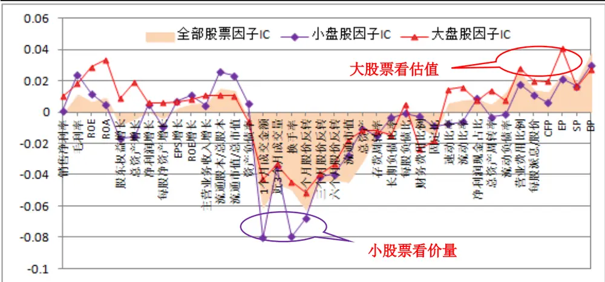
数据来源：广发证券发展研究中心，Wind数据库

例如，大市值股票中我们可以通过观察其估值水平来评价其是否值得投资，而对于小市值股票则更多地应该关注其流动性，并更多的从技术角度对其进行分析，如图1所示。类似的，对于短期内股价快速上涨的股票，从中挑选一些盈利较为稳定的个股进行配置有利于风险的控制；而对于短期内深跌的个股，则可以从中挑选弹性较强的小盘股进行配置。

以上我们提到应该区分个股的独有特征，同时考虑因子的分层效应，在此基础上为不同的个股采用不同的因子加权机制，这便是所谓的情景分析方法，基于情景分析构建的多因子模型成为多因子情景加权Alpha模型。

本文将通过分别解决上述两大问题，致力于搭建一个多因子情景加权Alpha模型。报告按如下书写结构：

第1节：引言部分，提出传统的多因子加权方法存在的问题，并引入情景模型的概念；

第2节：分析了风格因子的分层效应，并采用“分层强度”来刻画每个风格因子的分层效应强度，从中挑选了6个因子用于区分不同股票所属的特征情景，同时得到不同情景下对应的因子权重分布矩阵；

第3节：基于上节所挑选的6个分层因子，分别采用离散和连续的方法构建了个股的特征描述体系，从而得到每个个股的特征矩阵。

第4节：结合因子情景加权矩阵以及个股的特征矩阵实现对个股进行因子情景加权，构造多因子情景Alpha策略。

第5节：总结及展望 。

## 二、因子分层效应

## (一) 因子分层效应分析

在前期报告《考虑非线性特征的多因子Alpha策略》中，我们统计发现某些风格因子存在明显的非线性特征，且可以通过对风格因子F 进行层次分解来解决因子F 的非线性问题，我们称因子F 对因子F 具有分层效应，F 为分层因子。

图 2.因子对单因子分层效应示意图
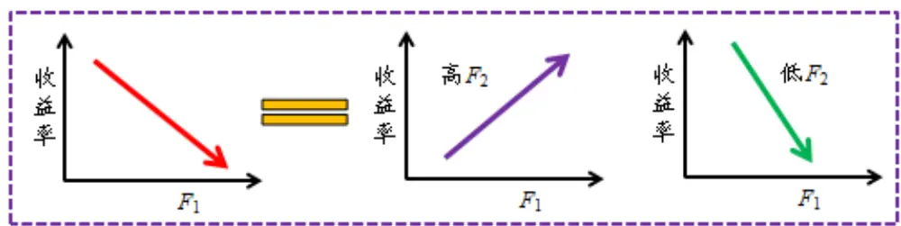
数据来源：广发证券发展研究中心，Wind数据库

报告《考虑非线性特征的多因子Alpha策略》中，对于同一个风格因子我们只考虑对其有效性影响最大的分层因子，下面我们将统计因子是否同时对多个因子具备分层效应。

图 3.因子对多个因子分层效应示意图
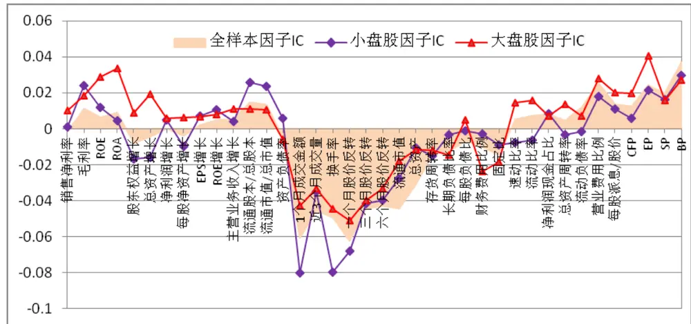
数据来源：广发证券发展研究中心，Wind数据库

以规模因子为例，我们将全部股票分为大盘股和小盘股两部分样本，在不同样本中测算各类因子的有效性（以IC绝对值度量），图3显示统计结果为：大盘股中盈利、质量以及估值因子的IC明显提高，而在小股票中有效性得到显著提高的因子是流动性因子及杠杆因子，可见规模因子同时对多个因子具有明显的分层效应。

那么如何刻画一个因子分层效应的强弱呢？假设第i个因子作为分层因子 $F_{i},$ ，基于 $F_{i}$ 我们对每个Alpha因子fj测算其不同样本下的有效性，ICj代表Alpha因子fj因子在全样本中的有效性， $IC_{ij}^{+}$ 代表Alpha因子fj在高Fi样本中的有效性， $IC_{ij}$ 代表Alpha因子fj因子在低 $F_{i}$ 样本中的有效性。

以 $[IC_{j},IC_{j}^{+},IC_{j}^{-}$ ]的离差DEVij代表Fi对fj的分层效应强度：

$$
DEV_{ij}=std([IC_{j},IC_{ij}^{+},IC_{ij}^{-}])\tag{1}
$$

$DEV_{i}$ 表示分层因子 $F_{i}$ 的分层强度：

$$
DEV_{i}=\sum_{j=1}^{j=N}DEV_{ij}/N\tag{2}
$$

其中，N为alpha因子的数量。

下面我们分别列出各个因子的分层强度，如图4所示：

图 4.因子分层强度统计
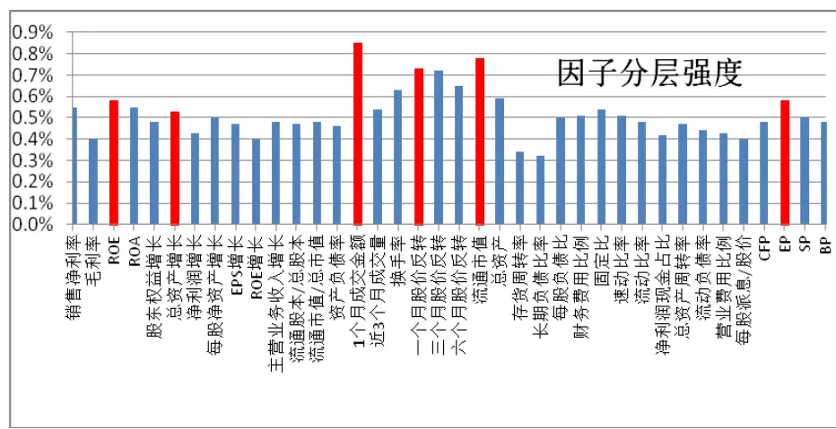
数据来源：广发证券发展研究中心，Wind数据库

根据每个因子的分层强度，分别各类风格因子中挑选分层强度最高的作为该类因子的代表，用于刻画个股的某一维度的特征，分别得到6个分层因子：

ROE(代表盈利因子)、总资产增长率(代表成长因子)、一个月成交金额(代表流动性因子)、一个月股价反转(代表股价涨幅因子)、流通市值(代表规模因子)、EP(代表估值因子)。

表 1.分层效果较佳的因子

| 编号 | 分层因子 | 因子类别 |
| --- | --- | --- |
| 1 | ROE | 盈利 |
| 2 | 总资产增长率 | 成长 |
| 3 | 一个月成交金额 | 流动性 |
| 4 | 一个月股价反转 | 涨跌幅度 |
| 5 | 流通市值 | 规模 |
| 6 | EP | 估值 |

数据来源：广发证券发展研究中心，Wind数据库

下面，我们分别来观察这6个因子对各类风格因子产生的分层效应：

图 5. “ROE”因子分层效应
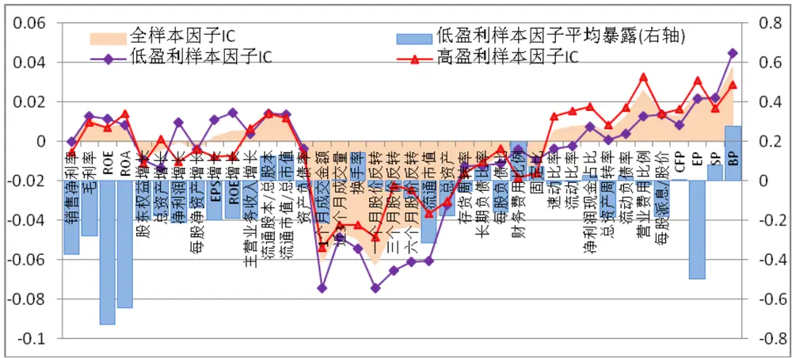
数据来源：广发证券发展研究中心，Wind数据库

图5显示，ROE因子的分层效应主要体现在股价反转因子及质量因子：高盈利股票中反转效应并不显著，而盈利较差的股票中反转效应则更加明显，显然盈利情况将放大股票股价的反转规律；此外，高ROE的股票中，速动比率、流动比率以及营业费用比等质量因子的有效性也有所提高，反映了基本面因素的叠加放大效应。

图 6. “总资产增长率”因子分层效应
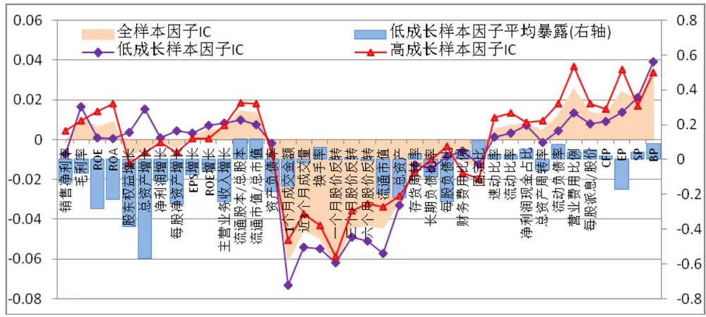
数据来源：广发证券发展研究中心，Wind数据库

图6显示，成长因子与质量因子同样具有显著的叠加效应，高成长股票中质量因子有效性显著提高；此外，低成长股票中，股价反转及规模因子效果更加。

图 7. “一个月成交金额”因子分层效应
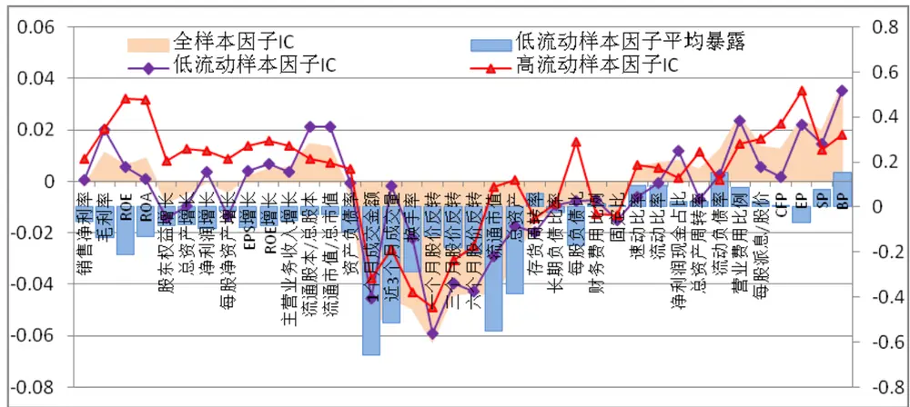
数据来源：广发证券发展研究中心，Wind数据库

图7显示，流动性因子的分层效应主要体现在盈利和成长因子：成交活跃的个股中高盈利因子效果大幅度提高，这表明基本面因素的释放需要成交量的配合；此外，值得注意的是成交金额与流通市值存在较大的正相关关系：成交金额较低的样本中大多数为小股票，在其中规模效应有所减小；而成交金额高的样本中多数为大股票，在大股票中区分流通市值显然没有任何意义，规模因子的IC在零附近波动。

图 8. “一个月涨幅”因子分层效应
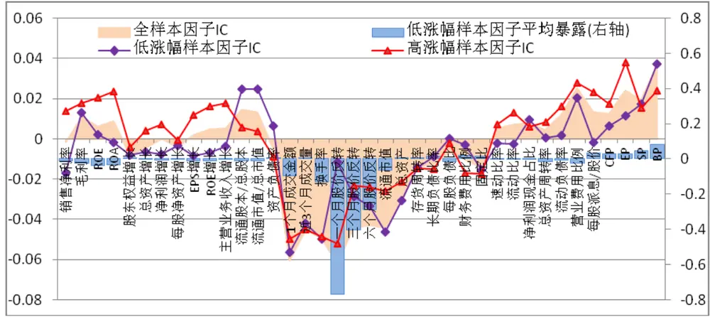
数据来源：广发证券发展研究中心，Wind数据库

图8显示，股价涨幅因子的分层效应主要体现在盈利及成长因子：上月涨幅靠前的股票中盈利或成长性较好的个股将延续良好表现。

图 9.“流通市值”因子分层效应
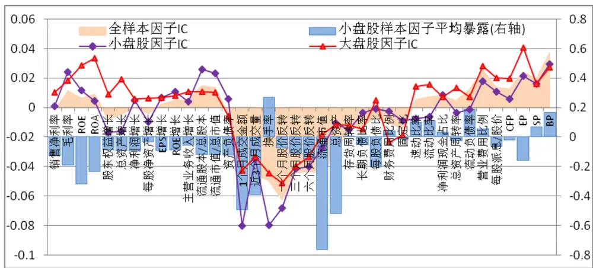
数据来源：广发证券发展研究中心，Wind数据库

图9显示，规模因子的分层效应较为显著：大盘股中有效性有所提高的是盈利、质量以及估值因子，这说明盈利及估值因素只有在大股票中才能够得到体现；

而在小股票中有效性得到提高的因子是流动性因子；这说明对于规模较小的个股，市场常常并不关注其是否盈利或估值高低，而是更关注其价量等市场数据。

图 10. “EP”因子分层效应
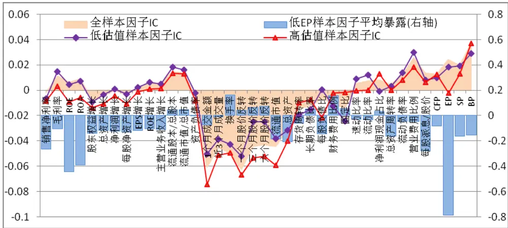
数据来源：广发证券发展研究中心，Wind数据库

图10显示，低EP样本中股票的规模整体偏小，即小股票估值偏高，因此我们看到在高估值样本中规模因子的有效性显著提高，其次是流动性及股价反转因子均有所提高。

## (二) 因子情景加权矩阵

上述分析因子的分层效应并挑选了分层效应最显著的6个因子，目的是为了区分不同股票所属的特征情景，同时得到不同情景下对应的因子权重分布矩阵。个股在每个分层因子的暴露程度均可分为高、低两种情况，从而将全部股票分为12种特征情景。对于每一种不同的情景，各个alpha因子的有效程度(以IC绝对值度量)各不相同，我们将根据因子IC的绝对值对各个因子进行配权。

以换手率、股价反转、流通市值以及EP等4个因子为例，表2列出了在不同的12种情景下面，4个Alpha因子所得到的权重。以规模分层因子为例，在小盘股中，换手率以及股价反转得到最高权重，而EP则仅有不到0.1的权重；而在大盘股中，EP的权重则显著提高，只有规模因子的权重显著偏低。

值得注意的是，不同情景下因子的权重分布不仅取决于该情景下各因子的IC高低，同时还与选择的alpha因子类型和数量有关。

显然，对于不同的情景，因子得到的加权模式都各不相同，下一步需要解决的便是每个股票需要采用何种模式进行因子加权？因此需要确定每个个股在各种情景下的分布，即对个股的特征进行描述。

表 2.因子情景加权矩阵

|  | 盈利 |  | 成长 |  | 流动性 |  | 涨跌幅 |  | 规模 |  | 估值 |  |
| --- | --- | --- | --- | --- | --- | --- | --- | --- | --- | --- | --- | --- |
|  | 低 | 高 | 低 | 高 | 低 | 高 | 低 | 高 | 低 | 高 | 低 | 高 |
| 换手率 | 21.2% | 21.7% | 24.0% | 20.1% | 12.7% | 27.0% | 31.8% | 24.7% | 34.7% | 22.8% | 23.0% | 23.1% |
| 一个月股价反转 | 29.0% | 24.7% | 27.2% | 27.4% | 33.9% | 30.6% | 7.4% | 26.4% | 29.6% | 26.3% | 28.3% | 31.2% |
| 流通市值 | 23.6% | 18.8% | 25.0% | 15.8% | 16.7% | 1.5% | 29.5% | 13.1% | 12.0% | 9.3% | 21.0% | 27.5% |
| EP | 8.5% | 15.8% | 6.1% | 16.5% | 12.6% | 22.2% | 7.3% | 19.2% | 9.3% | 20.8% | 10.0% | 1.0% |

数据来源：广发证券发展研究中心，Wind数据库

## 三、股票情景特征描述

为什么需要区分每只股票的特征? 引言中我们提到，评价一个股票好比于我们在评价一个人的衣着是否得体，显然每个人适用的衣服大小和款式各不相同，一个好的裁缝会根据每个人的身材特点定制合身的衣服；同样道理，一个好的选股策略应该区分股票独有的特征，采用不同的评价模式来对其进行打分，例如个股属于什么行业行业，是否属大市值股票，是否负债较高或者是否处于快速成长期等。

而上一节中，我们采用 6个分层因子将个股划分为12 种情景类型，对于不同的情境类型，股票所采用的因子加权模式都各不相同，因此下一步需要解决的便是如何根据每个股票的特点来为其选择相应的因子加权模式?

显然，不同个股的加权模式可能不是正好对应某一种情景下的因子加权模式，而是多种加权模式的综合，因为一只股票可能具有多项显著特征，例如某只股票既属于大股票，同时又具备低估值的特点，因此该股票的因子加权模式需要同时考虑大规模以及低估值这两种情境下因子的加权模式。

本节的主要内容是确定不同的个股在各种情景下的分布，简而言之便是对每个股票的综合特征进行描述。

图 11.情景分析方法与传统方法比较示意图
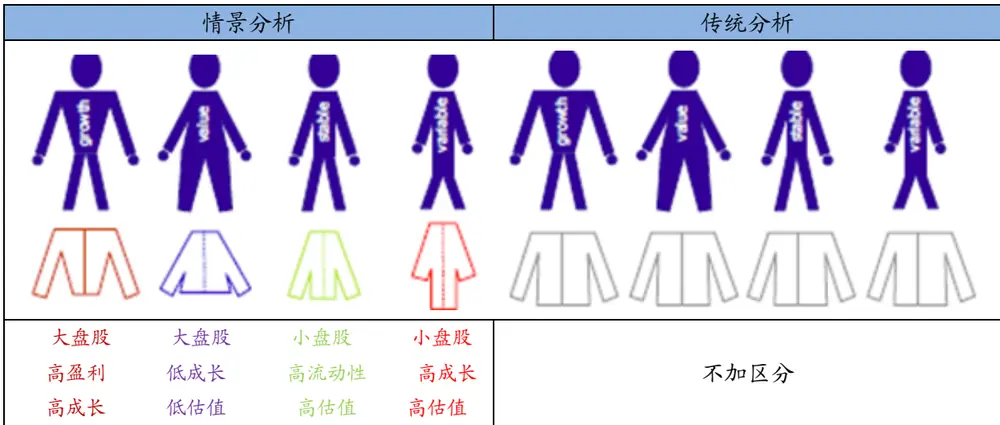
数据来源：广发证券发展研究中心，Wind数据库

下面将基于上述6个分层因子，分别采用离散和连续的方法构建个股的特征描述体系，从而得到每只股票的多维度情景特征矩阵。

## (一) 排序分档打分法

排序打分法根据个股在单个因子上的暴露进行排序和分档，不同的分档给予相应的打分。同样以规模因子为例，将所有股票按照流通市值大小分为7个档位，前3档的定义为大股票，各包含100只股票，分别给予9、3、1的打分；后3档的定义为小股票，同样各包含100只股票，分别给予-9、-3和-1的打分；中间分档包含200只股票，给予0分，如图12所示。

图 12.排序分档打分示意图
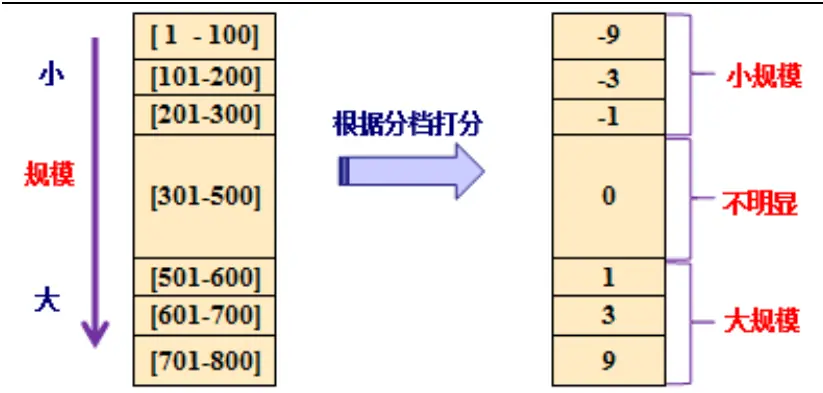
数据来源：广发证券发展研究中心，Wind数据库

得到每个因子的打分之后，便可以得到个股在12个维度（每个分层因子对应两种情境）上的打分百分比，从而构成股票的特征评价体系。下面以“工商银行”及“圣农发展”两只股票为例，基于排序分档打分法得到两者的特征向量（在各类情景上的得分及得分占比）如表3所示。

表 3.排序打分法的股票情景特征

| 因子 | 分层 | 工商银行 |  | 圣农发展 |  |
| --- | --- | --- | --- | --- | --- |
|  |  | 情景得分 | 情景得分占比 | 情景得分 | 情景得分占比 |
| 盈利 | 低 | 0 | 0 | 0 | 0 |
|  | 高 | 9 | 33.3% | 0 | 0 |
| 成长 | 低 | 0 | 0 | 0 | 0 |
|  | 高 | 0 | 0 | 1 | 25.0% |
| 流动 | 低 | 0 | 0 | 0 | 0 |
|  | 高 | 3 | 11.1% | 0 | 0 |
| 涨跌 | 低 | -3 | 11.1% | 0 | 0 |
|  | 高 | 0 | 0 | 0 | 0 |
| 规模 | 低 | 0 | 0 | 0 | 0 |
|  | 高 | 9 | 33.3% | 0 | 0 |
| 估值 | 低 | -3 | 11.1% | -3 | 75.0% |
|  | 高 | 0 | 0 | 0 | 0 |

数据来源：广发证券发展研究中心，Wind数据库

图 13.“工商银行”与“圣农发展”特征比较
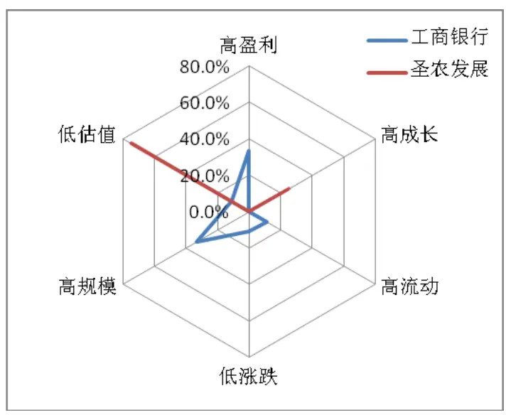
数据来源：广发证券发展研究中心，Wind数据库

如表3及图13所示，“工商银行”是一个综合性较强的股票，呈现出显著的高盈利及大市值的特征，此外还具有高成交、低涨幅及低估值的特征。而“圣农发展”则仅在两类情景下具有显著特征：高成长及低估值。

## (二) 连续函数打分法

上述排序分档打分法是一种离散方法，各档打分存在明显的“断层”，为了解决这一问题，下面我们引入三次多项式为个股进行情景打分，情景得分同样在[-9，9]之间，个股连续打分分布如图14所示。

图 14.连续打分示意图
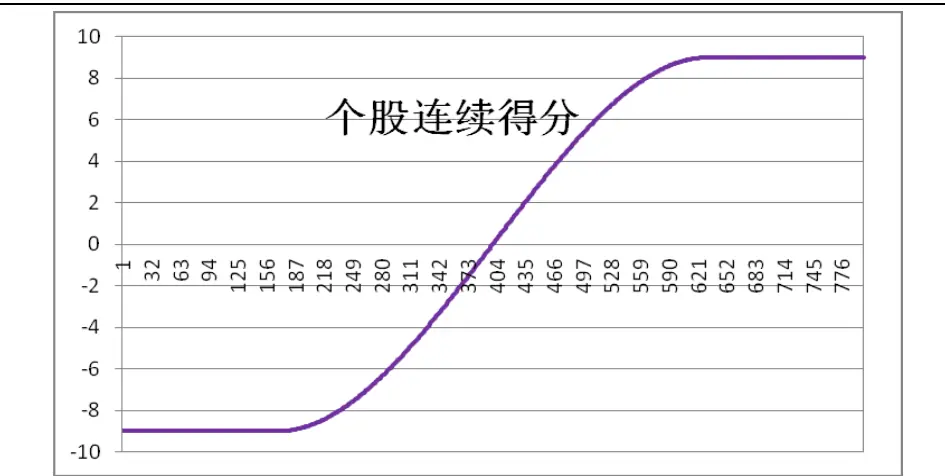
数据来源：广发证券发展研究中心，Wind数据库

下面以“工商银行”及“七匹狼”两只股票为例，基于连续函数打分法得到两者的特征向量（在各类情景上的得分及得分占比）如表4所示。

表 4.排序打分法的股票情景特征

|  |  | 工商银行 |  | 七匹狼 |  |
| --- | --- | --- | --- | --- | --- |
| 因子 | 分层 | 情景得分 | 情景得分占比 | 情景得分 | 情景得分占比 |
| 盈利 | 低 | 0.00 | 0 | 0.00 | 0 |
|  | 高 | 9.00 | 18.8% | 7.50 | 18.8% |
| 成长 | 低 | 0.00 | 0 | 0.00 | 0 |
|  | 高 | 2.99 | 6.3% | 9.00 | 22.6% |
| 流动 | 低 | 0.00 | 0 | 0.00 | 0 |
|  | 高 | 9.00 | 18.8% | 2.65 | 6.7% |
| 涨跌 | 低 | 9.00 | 18.8% | 9.00 | 22.6% |
|  | 高 | 0.00 | 0 | 0.00 | 0 |
| 规模 | 低 | 0.00 | 0 | 0.00 | 0 |
|  | 高 | 9.00 | 18.8% | 7.73 | 19.4% |
| 估值 | 低 | 8.80 | 18.4% | 4.02 | 10.1% |
|  | 高 | 0 | 0 | 0 | 0 |

数据来源：广发证券发展研究中心，Wind数据库
识别风险，发现价值

图 15. “工商银行”与“七匹狼”特征比较
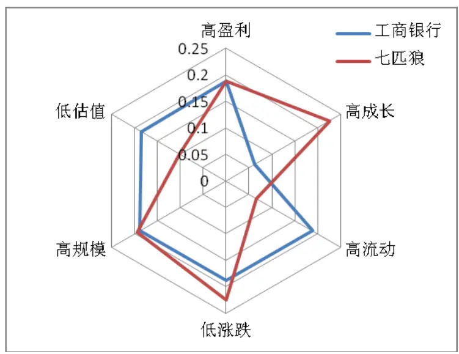
数据来源：广发证券发展研究中心，Wind数据库

如表4及图15所示，两只股票均有综合性较强的特点，此外，相比离散打分法而言，连续打分法下各类情景的得分较为均匀，避免了相近范围内个股出现打分差异较大的情况。

下文我们默认采用连续打分法来描述个股的特征向量。

## 四、情景加权多因子策略

前面我们分析了风格因子的分层效应，并采用“分层强度”来刻画每个风格因子的分层效应强度，从中挑选了6个因子用于区分不同股票所属的特征情景，同时得到不同情景下对应的因子权重分布矩阵；接着基于这6个分层因子，分别采用离散和连续的方法构建了个股的特征描述体系，从而得到每个个股的特征矩阵。

本节我们将结合情景因子加权矩阵以及个股的特征矩阵，构建情景加权多因子策略。

## (一) 多因子策略构建方法

个股情景打分是因子得分、情景模型权重以及个股特征三个矩阵的乘积

$$
f_{i}=\overline{{F}}_{i}^{\prime}\times C\times\overline{{d}}_{i}\tag{3}
$$

$\overline{{F}}_{i}^{'}$ 个股 的原始因子暴露向量；i:

分层因子情景矩阵；C:

$\overline{{d}}_{i}$ 个股 的综合特征向量。i:

为了方便理解公式(3)，假设采用三因子模型对两只股票A和股票 B进行评价，个

股情景由两个分层因子（规模和估值） 分为共四种情景（低规模、高规模、低估值、高估值），其中股票 A的特征向量为（50%,0,0,50%），股票B 的特征向量为$(\ 0,10\%,90\%,0\ )$ ，两只股票的因子暴露均为（2.5,1,-2.1）。

则股票A 的情景得分为：

$$
S_{\scriptscriptstyle A}=[2.5\quad1\quad-2.1]\times\left[\begin{array}{cccc}{{14^{9}\diamond}}&{{48^{0}\%}}&{{34^{0}\%}}&{{21^{0}\%}}\\{{65^{9}\diamond}}&{{37^{0}\%}}&{{54^{0}\%}}&{{58^{0}\%}}\\{{22^{0}\%}}&{{15^{0}\%}}&{{12^{0}\%}}&{{50^{0}\%}}\end{array}\right]\times\left[\begin{array}{c}{{50^{9}\%}}\\{{0^{9}\%}}\\{{0^{9}\%}}\\{{50^{9}\%}}\end{array}\right]=0.59
$$

股票B 的情景得分为：

$$
S_{B}=[2.5\quad1\quad-2.1]\times{\left[\begin{array}{llll}{14^{9}\%}&{48^{0}\%}&{34^{9}\%}&{21\%}\\{65^{9}\%}&{37^{9}\%}&{54^{9}\%}&{58^{9}\%}\\{22^{9}\%}&{15^{9}\%}&{12^{9}\%}&{50^{9}\%}\end{array}\right]}\times{\left[\begin{array}{l}{0^{9}\%}\\{10^{9}\%}\\{90^{9}\%}\\{0^{9}\%}\end{array}\right]}=1.14
$$

可见，股票 A、B 虽然在 Alpha 因子上的暴露完全一样，但由于其在分层因子上的区别(前者为高估值的小盘股，后者为低估值大盘股)，导致两者在情景分析下得到了完全不同的评价。

下面我们按照不同因子加权方法构造不同的多因子策略，通过比较对冲策略的表现来验证情景分析模型的有效性。

## (二) 情景策略效果

个股样本：中证800成份股。

样本期间：2007 年 3 月 31 日-2012 年 10 月 31 日共 68 个月，其中 2010 年 12 月31日之前作为样本内数据，用于挑选 Alpha因子、并计算因子情景加权矩阵；2011年12 月 31 日之后作为样本外数据，根据样本内统计的结果进行实证分析，检验情景模型是否稳定有效。

对冲方式：采用股指期货当月合约进行对冲，不考虑杠杆因素，合约到期日前一天将合约展期至此月合约。

开平仓操作：策略假设股票多头以每月初首个交易日以开盘价建仓，月末最后交易日收盘价平仓；股票双边交易成本为 0.3%。

首先，根据样本内数据，我们挑选如下 alpha 因子用于构造多因子策略：

表 5.样本内挑选 Alpha 因子

| 1 | 1个月成交金额 |
| --- | --- |
| 2 | 近3个月平均成交量 |
| 3 | 一个月股价反转 |
| 4 | 流通市值 |
| 5 | 总资产 |
| 6 | 总资产周转率 |
| 7 | 营业费用比例 |
| 8 | CFP |
| 9 | EP |
| 10 | SP |
| 11 | BP |

数据来源：广发证券发展研究中心，Wind数据库

基于表 5 挑选的 Alpha 因子，分别构建三种因子加权 Alpha 策略：

(1) 因子等权策略：每个 alpha 因子赋予相同权重；

(2) 因子 IC 加权策略：根据因子在样本内的IC 绝对值进行加权；

(3) 因子情景加权策略：根据公式(3)构建多因子策略。

三种策略的表现如下图 16所示：

图 16.不同因子加权策略表现对比
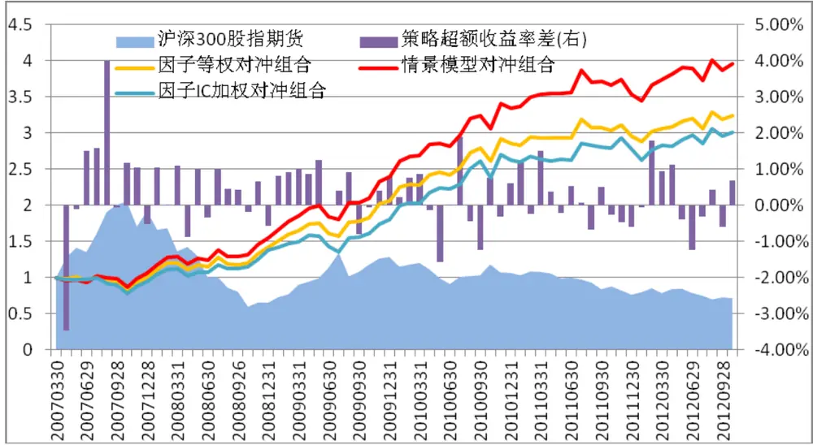
数据来源：广发证券发展研究中心，Wind数据库

表 6.不同因子加权策略表现对比

| 策略名称 | 因子等权 | 因子 IC 加权 | 情景模型 |
| --- | --- | --- | --- |
| 信息比(样本内) | 1.39 | 1.25 | 1.59 |
| 信息比(样本内) | 0.65 | 0.64 | 0.77 |
| 年化收益率(全样本) | 23.0% | 21.8% | 26.7% |
| 累计最大回撤 | 19.9% | 22.0% | 15.4% |
| 07年累计收益 | 0.1% | -5.4% | 5.5% |
| 08年累计收益 | 42.4% | 46.0% | 47.1% |
| 09年累计收益 | 44.8% | 30.5% | 54.0% |
| 10年累计收益 | 38.1% | 45.9% | 40.1% |
| 11年累计收益 | 3.9% | 5.6% | 5.6% |
| 12年累计收益 | 9.4% | 8.4% | 11.8% |

数据来源：广发证券发展研究中心，Wind数据库

图 16显示，基于情景加权策略的表现明显优于因子等权策略及因子IC加权策略，其中因子IC加权策略虽然考虑了因子在样本内的有效性，但未能稳定地改善因子等权策略，这意味着而情景模型则在每一个年度都明显战胜因子等权策略。

下面我们观察因子情景加权策略的表现并统计策略的各类指标：

图 17.多因子情景加权策略表现
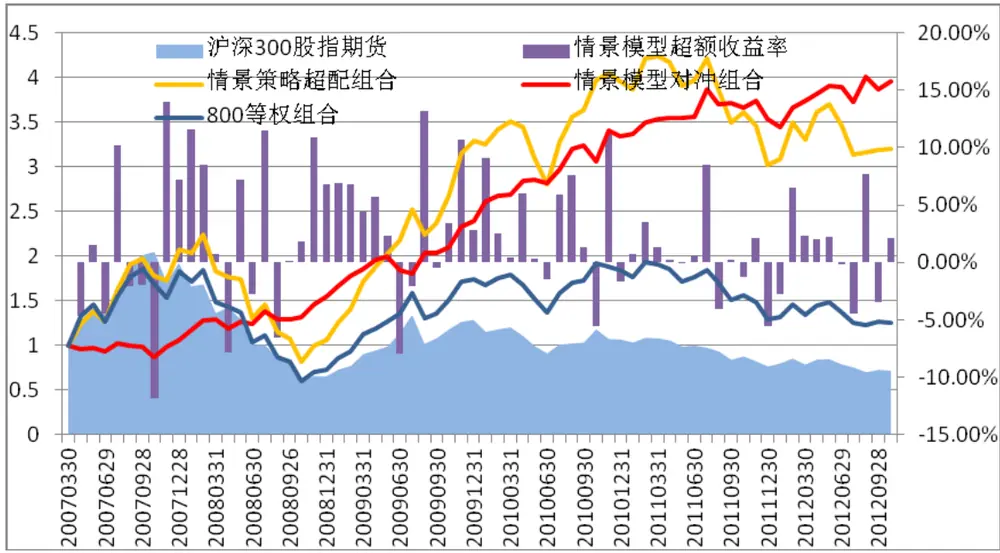
数据来源：广发证券发展研究中心，Wind数据库

表 7.多因子情景加权策略表现

| 策略名称 | 年化收益率 | 年化波动率 | 信息比 | 最大回撤 |
| --- | --- | --- | --- | --- |
| 样本内 | 34.9% | 21.8% | 1.60 | 15.4% |
| 样本外 | 9.9% | 12.8% | 0.77 | 11.0% |
| 07年 | 10.6% | 28.4% | 0.37 | 15.4% |
| 08年 | 41.8% | 23.9% | 1.75 | 7.8% |
| 09年 | 45.7% | 19.6% | 2.33 | 9.9% |
| 10年 | 35.5% | 17.3% | 2.05 | 5.6% |
| 11年 | 6.2% | 12.2% | 0.50 | 8.5% |
| 12年(截止10 月31日) | 14.29% (年化) | 13.9% | 1.03 | 4.7% |
|  | 11.78% (累计) |  |  |  |

数据来源：广发证券发展研究中心，Wind数据库

根据表 7统计结果，多因子情景策略样本外（2011年以来）年化收益率接近 11%，相比样本内显然有大幅度下降，但同时对冲组合的最大回撤也降低至 11%左右。其中2011 年情景策略年化收益率仅 6.2%；而今年以来策略表现有了明显改善，截止 10 月底累计收益为 11.8%，年化收益 14.3%，最大回撤仅4.7%。

## 五、总结

常见的多因子配权方法是等权法，该方法最大问题在于没有区分个股差异以及假设因子有效性具有线性特征，而在前期报告《考虑非线性特征的多因子Alpha策略》中，我们统计发现某些风格因子存在明显的非线性特征，本文则进一步分析了因子的分层效应，并通过挑选最显著的分层因子，用于构建因子情景加权矩阵以及股票特征矩阵，进而搭建了多因子情景Alpha模型。

第四节中，分别将因子情景加权Alpha模型与因子等权Alpha模型及因子IC加权Alpha模型进行比较，对比结果显示情景模型显著地提高了多因子Alpha策略的收益，同时模型在各阶段的表现更加具有稳定性。这意味着传统的多因子模型具有较大的改进空间，因子之间不能简单地等同处理，应该根据因子所处的环境以及因子的有效性来调整其权重；此外，个股之间也应该根据其情景特征来为其定制合适的因子加权机制。

本报告所提出的情景加权模型实际上是前期报告《考虑非线性特征的多因子Alpha策略》的进一步延伸，但两种方法各有异同：

一方面，两者的本质都是通过对样本进行分层，在不同的子样本内构建因子线性模型，从而解决因子全局样本中存在的非线性问题。

另一方面，非线性模型中仅仅为每个Alpha因子挑选一个控制变量（即分层因子），因此Alpha因子的权重大小只受单个分层因子的影响；而情景加权模型则同时考虑一个分层因子对所有Alpha因子有效性的影响，每一类分层因子所衍生出的情景类型，都对应着全部Alpha因子的最优权重。

相比而言，后者在对因子及个股的横截面进行分解上处理得更加细致，因而其对因子非线性特征的处理也更加充分，但其难点在于需要预先挑选合适及稳定的分层因子。

在追寻Alpha的路上，我们继续探寻能够提高多因子策略Alpha收益的方法，本报告继承了上一篇中对从因子及个股的截面线性特征的质疑，并采用了更加细致的截面分解方法，且对Alpha策略的改善效果也更加显著。后续我们仍将继续致力于该方向的研究，敬请关注我们后续的相关研究。

## Table_AuthorSu 广发金融工程研究小组mmary

罗军，首席分析师，华南理工大学理学硕士，2010年进入广发证券发展研究中心。

俞文冰，首席分析师，CFA，上海财经大学统计学硕士，2012年进入广发证券发展研究中心。

叶涛，资深分析师，CFA ，上海交通大学管理科学与工程硕士，2012年进入广发证券发展研究中心。

安宁宁，资深分析师，暨南大学数量经济学硕士，2011年进入广发证券发展研究中心。

胡海涛，分析师， 华南理工大学理学硕士， 2010年进入广发证券发展研究中心。

夏潇阳， 分析师， 上海交通大学金融工程硕士， 2012年进入广发证券发展研究中心。

汪鑫， 分析师， 中国科学技术大学金融工程硕士， 2012年进入广发证券发展研究中心。

蓝昭钦，分析师， 中山大学理学硕士， 2010年进入广发证券发展研究中心。

李明，分析师，伦敦城市大学卡斯商学院计量金融硕士，2010年进入广发证券发展研究中心。

史庆盛，研究助理， 华南理工大学金融工程硕士， 2011年进入广发证券发展研究中心。

张超，研究助理， 中山大学理学硕士， 2012年进入广发证券发展研究中心。

## Table_Report 相关研究报告

多因子 Alpha系列报告之（七）——大浪淘金，Alpha因子何处寻？

多因子 Alpha系列报告之（十三）——考虑非线性特征的多因子 Alpha策略

|  | 广州市 | 深圳市 | 北京市 | 上海市 |
| --- | --- | --- | --- | --- |
| 地址 | 广州市天河北路183 号 大都会广场5楼 | 深圳市福田区金田路4018 | 北京市西城区月坛北街2号 | 上海市浦东新区富城路 |
| 邮政编码 | 510075 | 号安联大厦15A03-04 518000 | 月坛大厦18层 100045 | 99号震旦大厦18楼 |
| 客服邮箱 | gfyf@gf.com.cn |  |  | 200120 |
| 服务热线 | 020-87555888-8612 |  |  |  |

## 免责声明

le_Disclaimer广发证券股份有限公司具备证券投资咨询业务资格。本报告只发送给广发证券重点客户，不对外公开发布。

本报告所载资料的来源及观点的出处皆被广发证券股份有限公司认为可靠，但广发证券不对其准确性或完整性做出任何保证。报告内容仅供参考，报告中的信息或所表达观点不构成所涉证券买卖的出价或询价。广发证券不对因使用本报告的内容而引致的损失承担任何责任，除非法律法规有明确规定。客户不应以本报告取代其独立判断或仅根据本报告做出决策。

广发证券可发出其它与本报告所载信息不一致及有不同结论的报告。本报告反映研究人员的不同观点、见解及分析方法，并不代表广发证券或其附属机构的立场。报告所载资料、意见及推测仅反映研究人员于发出本报告当日的判断，可随时更改且不予通告。

本报告旨在发送给广发证券的特定客户及其它专业人士。未经广发证券事先书面许可，任何机构或个人不得以任何形式翻版、复制、刊登、转载和引用，否则由此造成的一切不良后果及法律责任由私自翻版、复制、刊登、转载和引用者承担。