# 宏观事件驱动下的风格轮动

## ——风格轮动系列专题之二

## Table_Sumary • 捕捉风格轮动是风格投资的关键

“风格投资”早期的理论基础主要来自于 Fama 和 French 等提出的Fama 三因子模型，该模型由于具有“自上而下”的投资理念，因而一直以来都深受投资者青睐，且越来越被实务界认同。

随着时间的推移，单一风格的数量化策略不能持续取得较高溢价率，因此“风格轮动”日益受到投资者的重视，其中，价值和成长的风格轮动最受国内外投资者关注，而对于国内的投资者而言，关于大小盘以及高低估值的风格轮动则是永不落幕的话题。报告围绕量化风格投资展开讨论，尝试通过观察特定的宏观事件背景，揭开多种风格轮动背后所隐含的规律。

## 宏观事件背后揭示风格轮动规律，年中年底隐含蓝筹行情

常见的风格轮动策略主要分为两大类：第一类是“样本分类法”，通过对样本进行分类统计来挖掘风格轮动规律，例如常见的“日历效应”；此类方法的优点在于逻辑较为清晰，且方法简单便于应用，而缺点在于很难应对不同市场阶段出现的新特征。第二类是“时间序列回归法”，采用宏观指标或者情绪指标等对未来风格指数的走势进行拟合，此类方法的缺点在于参数拟合的结果缺乏清晰直观的逻辑。

报告提出另外一种研究风格轮动的思路：“宏观事件分析法”，该方法挑选特定的宏观事件及市场情形，并研究相应样本内各类风格的轮动规律。此外，报告对各类风格因子的月度效应及季度效应也作了详细统计。

## 构建基于宏观事件驱动的风格轮动策略

基于上述的分析结论构建风格因子量化轮动策略，并通过实证分析来验证策略的有效性和实用性。

以 2000年1 月-2008年12月共 108个月作为样本内数据，用于挑选初始Alpha 因子、并统计各类宏观事件下风格因子的轮动规律，从中挑选了8类宏观事件以及 13个初始风格因子；2009年之后作为样本外数据，根据样本内统计的规律构建风格轮动策略并进行实证分析。结果显示：考虑宏观事件驱动的风格轮动之后，策略相对静态多因子策略的表现有了显著的提高，信息比由 1.73提高到2.46，年化收益率由11%提高为18%；分年度来看，除了 2011年策略收益出现了下降，其余每个年度均有很大的提高，风格轮动策略相对静态多因子策略的胜率为 67%。

## 最新风格推荐

最新公布的 2012 四季度 GDP 同比数据创了半年内新高，据此 2 月份推荐关注的风格因子是：三个月股价反转、六个月股价反转、BP、SP。

最新公布的进出口金额同比数据显示，12 月份该指标创半年新高，据此2 月份推荐关注的风格因子是：流通市值、总资产。

图1：GDP同比半年新高,六个月反转表现
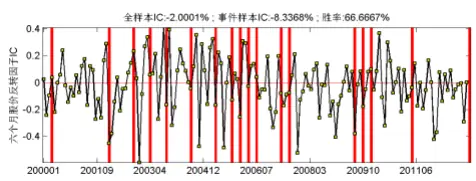

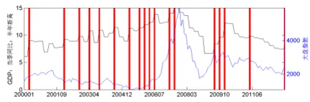

图2：样本外对冲策略累计收益比较
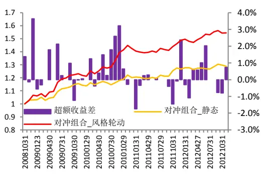

表 1：多因子量化对冲策略结果比较

| 策略名称 | 策略1 | 策略2 |
| --- | --- | --- |
| 信息比(多-指数) | 172.5% | 246.4% |
| 年化收益率 | 10.6% | 18.1% |
| 累计最大回撤 | 11.1% | 7.4% |
| 09年累计收益 | 14.3% | 22.4% |
| 10年累计收益 | 4.5% | 15.6% |
| 11年累计收益 | 4.2% | 1.8% |
| 12年累计收益 | 2.4% | 7.2% |

分析师： 罗 军 S0260511010004

公020-87555888-8655

lj33@gf.com.cn

## Table_Report 相关研究：

观宏观经济周期，察风格因子轮动——因子风格轮动系列专题之一

2011-12-20

Table_Contacter 联系人： 史庆盛

sqs@gf.com.cn

## 一、前言

“风格投资”早期的理论基础主要来自于Fama和French（1992）等提出的Fama三因子模型，该模型采用P/E、市值（ME）以及账面市值比（BE/ME）来解释股票之间收益率的差异，该模型尽管相对粗糙，但由于具有“自上而下”的投资理念，因而一直以来都深受投资者青睐，且越来越被实务界认同。

美国主流指数编制机构编制了风格指数，用于反映具有某些共同市场特征的股票价格变化，为不同偏好的投资者提供了不同风险收益特征的股票组合，从不同的角度对市场进行解析。应大势所趋，风格投资的实践在国内也得到了迅速的扩展，自2007年以来，中证指数公司陆续推出系列风格指数，如沪深300、上证180、上证全指的成长指数和价值指数，相对成长和相对价值指数等。

然而，世界上没有任何一种投资策略是完美的，风格投资亦不例外，投资者无法仅仅依靠某一种投资风格而实现永久的获利，随着时间的推移，单一风格的数量化策略不能持续取得较高溢价率，因此“风格轮动”日益受到投资者的重视，其中，价值和成长的风格轮动最受国内外投资者关注，而对于国内的投资者而言，关于大小盘以及高低估值的风格轮动则是永不落幕的话题。

图3：大小盘及高低估值风格轮动
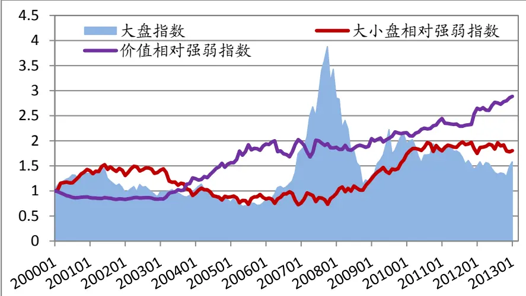
数据来源：广发证券发展研究中心

以大小盘风格轮动为例，以中证800成份股中每一期流通市值最小20%相对流通市值最大20%超额累积收益构造大小盘相对强弱指数。由图3可以发现，在2000年的上涨行情中，小盘股一路领涨；随后在2001至2007年长达7年间，大小盘风格轮动频繁，整体来看大盘股表现更优；而随着大牛市的结束，市场再次迎来小盘股行情，2008至2010年中，小盘股一路飙升，期间随着量化对冲基金在国内的兴起，小盘风格成为众多多空策略的主旋律；随后市场进入震荡阶段，大小盘风格策略再次陷入两难的困境。

本文将围绕量化风格投资展开讨论，尝试通过观察特定的宏观事件背景，揭开多种风格轮动背后所隐含的规律。报告按如下结果进行梳理：

第一节：前言部分，对风格投资及风格理论进行简介，揭示当前开展风格轮动

研究的意义及必要性；

第二节：提出本文研究风格轮动的思路，常见的风格轮动策略采用时间序列分析的方法来预测风格轮动每一期的规律，而本文则仅针对某些特定的市场情景或宏观事件背景下，探讨各类风格轮动的轮动规律；

第三节：基于第二节所提出的事件性风格轮动，建立量化风格投资及轮动策略，并选取样本对该策略进行实证分析；

第四节：对全文重点进行总结，并给出最新一期风格轮动结果。

## 二、风格轮动中的事件效应分析

常见的风格轮动策略认为，通过构建合理的模型可以实现对风格轮动每一期进行准确的判断。按策略方法不同主要可分为两大类：

## (1) 样本分类法

此类方法通常根据时间样本的特征进行分类，统计各类样本中风格轮动的规律。常见的方法如风格的“日历效应”以及著名的“投资时钟”等。此类方法的优点在于逻辑较为清晰，且方法简单便于应用，而缺点在于对样本的分类过于“固化”，策略很难应对不同市场阶段出现的新特征。

## (2) 时间序列回归

此类方法运用回归的方法，采用宏观指标或者情绪指标等对未来风格指数的走势进行拟合，此类方法的缺点在于参数拟合的结果缺乏清晰直观的逻辑，且与第一类方法类似，尝试采用通一的方法对每一期的风格轮动进行判断。

借鉴并区别于上述两类方法，报告提出另外一种研究风格轮动的思路，即：

## (3) 宏观事件分析法

新思路首先认为每一种风格的轮动都是由多种因素共同造成的，而且任何一种分析方法都无法准确地把握每一次风格的转变，风格轮动的规律只在某些特定市场特征或事件背景下才更加显著，因此本文将挑选特定宏观及市场指标(后面统称宏观指标)，并研究历史上这些指标在某些特殊情形下面各类风格的轮动规律。

下面首先对常见的宏观指标进行筛选。

## (一) 宏观事件及风格指标的选取

报告选取如下9大类宏观指标，并在此基础上衍生出不同类型的宏观事件，并针对每种不同类型的事件研究风格轮动的规律。

表 2：宏观指标汇总

| 编号 | 指标类型 包含指标 |  |
| --- | --- | --- |
| 1 | 国民经济核算 | GDP(同比)、 |
| 2 | 工业指标 | 工业增加值(同比)、发电量(同比)、工业增加值高于预测值幅度 |
| 3 | 价格指标 | CPI、PPI、RPI、CPI高于预测值幅度、PPI高于预测值幅度 |
| 4 | 预测数据 | 预测 CPI、预测 PPI、预测 M2 |
| 5 | 对外投资 | 进出口总额、进口总额、出口总额 |
| 6 | 货币供应 | M0、M1、M2 |

识别风险，发现价值

| 7 | 景气指标 | 宏观经济预警指数、宏观经济先行指数、消费者信心指数、企业家信心指数 |
| --- | --- | --- |
| 8 | PMI | PMI、PMI(非制造业)、汇丰PMI、汇丰PMI(非制造业） |
| 9 | 市场情绪 | A股估值水平(PE)、A股平均换手率、日均成交金额、A股帐户新增开户数 |

数据来源：广发证券发展研究中心

“宏观事件分析法”认为各种宏观指标只有在处于某些特定情景下，才能够揭示当时风格轮动的某种规律，因此下面将上述9类共30个宏观指标进行细分，每一类宏观指标根据其当前位置可再分为6种情形，分别为：

(1) 指标环比上升；

(2) 指标环比下降；

(3) 指标处于历史高位(高于半年均值)；

(4) 指标处于历史低位(低于半年均值)；

(5) 指标创新高(高于半年最高值)；

(6) 指标创新低(低于半年最低值)。

从而得到30个宏观指标所衍生共180种情景，我们称之为宏观事件。此外，我们对风格因子的日历效应进行分析，包括月度效应以及季度效应，因此全部的事件情景为180+16=186种情景。

需要特别指出的是，对于同类事件，我们将重点跟踪其中对风格轮动规律的揭示意义最显著的一类，避免各类相似事件重叠发生的情况。

此外，宏观指标数据均采自Wind数据终端，各类指标数据的获取以其实际发布日期为准。

上述是宏观事件的归纳，下面为我们所关注的各类风格指标：

表 3：风格因子汇总

| 盈利 | 1 | 销售净利率 | 规模 | 21 | 流通市值 |
| --- | --- | --- | --- | --- | --- |
|  | 2 | 毛利率 |  | 22 | 总资产 |
|  | 3 | ROE | 质量 | 23 | 存货周转率 |
|  | 4 | ROA |  | 24 | 长期负债比率 |
| 成长 | 5 | 股东权益增长率 |  | 25 | 每股负债比 |
|  | 6 | 总资产增长率 |  | 26 | 财务费用比例 |
|  | 7 | 净利润增长率 |  | 27 | 固定比 |
|  | 8 | 每股净资产增长率 |  | 28 | 速动比率 |
|  | 9 | EPS 增长率 |  | 29 | 流动比率 |
|  | 10 | ROE增长率 |  | 30 | 净利润现金占比 |
|  | 11 | 主营业务收入增长率 |  | 31 | 总资产周转率 |
| 杠杆 | 12 | 流通股本/总股本 |  | 32 | 流动负债率 |
|  | 13 | 流通市值/总市值 |  | 33 | 营业费用比例 |
|  | 14 | 资产负债率 | 估值 | 34 | 每股派息/股价 |

识别风险，发现价值

| 流动 | 15 | 1个月成交金额 | 35 | CFP |
| --- | --- | --- | --- | --- |
|  | 16 | 近3个月平均成交量 | 36 | EP |
|  | 17 | 换手率 | 37 | SP |
| 股价 | 18 | 一个月股价反转 |  |  |
|  | 19 | 三个月股价反转 | 38 | BP |
|  | 20 | 六个月股价反转 |  |  |

数据来源：广发证券发展研究中心

在风格轮动策略的初始阶段，模型将首先根据各类风格因子的历史表现确定一组“有效风格因子”，这组风格因子将作为风格轮动组合的主要驱动来源，而后每一期该“风格因子组合”将动态地调整，调整的依据是：随着各类宏观事件的发生，某些风格因子可能会被纳入，而某些风格因子可能会被剔除。纳入及剔除的情况取决于各类宏观事件下，风格轮动的规律。

## (二) 宏观事件下风格轮动规律

风格因子的有效性采用IC1指标进行度量。而宏观事件能否解释风格轮动的规律则通过以下指标进行度量：

(1) IC增长倍数 $.(\mathbf{N_{1}})\colon$ ：宏观事件样本风格因子平均 $IC_{T},$ ，相对全部样本风格因子平均 $IC_{0}{^\bf j}$ 增长倍数；

(2) 有效概率 $(\mathbf{P_{1}})\mathbf{:}$ 宏观事件样本风格因子平均 $IC_{T},$ 相对全部样本风格因子平均 $IC_{0}^{\phantom{}}\ddag_{\perp}^{\ast\ddag}$ 长的概率；

(3) IC降低倍数 $.(\mathbf{N}_{2})\colon$ 宏观事件样本风格因子平均 $IC_{T}$ ，相对全部样本风格因子平均 $IC_{0}$ 增长倍数；

(4) 失效概率 $(\mathbf{P}_{2}){:}$ 全部样本风格因子平均 $IC_{0}$ ，相对宏观事件样本风格因子平均 $IC_{\mathrm{T}}$ 增长的概率。

为了刻画特定宏观事件中风格轮动规律，我们设计了如下规则：

宏观事件下风格因子的纳入规则： $\mathrm{N}_{1}{>}2$ 且 $\mathrm{P_{1}}{>}55\%$

宏观事件中风格因子的剔除规则： $_{\mathrm{N}_{2}>2}$ 或 $P_{2}{>}60\%$

此外，当某一期纳入的风格因子数量过多时（超过12个），只保留被纳入次数超过一次的风格因子组成有效的风格因子组合。

下面，我们重点对一些宏观事件下，风格因子的轮动规律进行展示，并总结该类宏观事件对相应风格轮动的指导意义。

表 4：''GDP：当季同比：半年新高'' 中风格轮动规律

| 编号 | 轮动方向 | 风格因子 |
| --- | --- | --- |
| GDP：当季同比：半年新高 | 纳入 | 三个月股价反转、六个月股价反转、BP、SP |
| GDP：当季同比：半年新高 | 剔除 | ROA、净利润增长率、EPS增长率、ROE增长率、 主营业务收入增长率 |

数据来源：广发证券发展研究中心

GDP创新高时，经济过热的风险随之加大，股价中短期反转及估值指标备受关注，“股价六个月反转”IC胜率高达67%；而盈利及成长性等基本面因素失效。

最新公布的2012四季度CDP同比数据创了半年内新高，建议对上述纳入风格因子进行关注，同时警惕被剔除风格因子的风险。

图4：''GDP：当季同比：半年新高'' 中,因子六个月股价反转表现
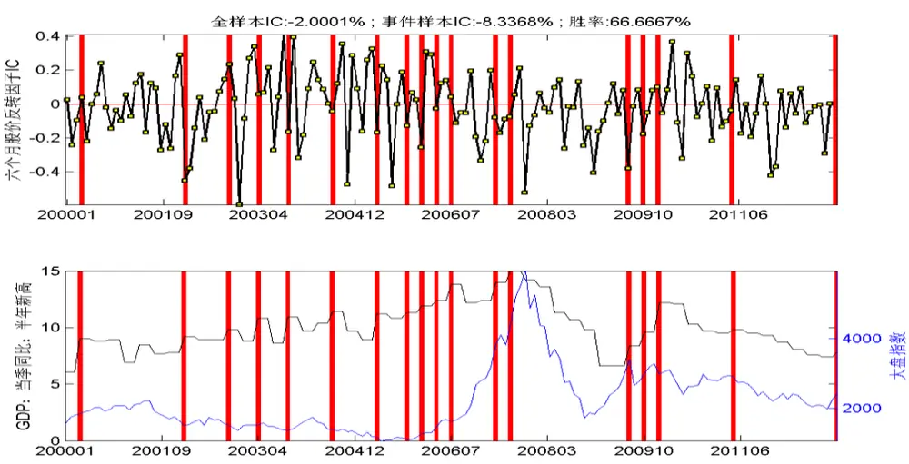
数据来源：广发证券发展研究中心

图5：''GDP：当季同比：半年新高'' 中,因子ROA表现
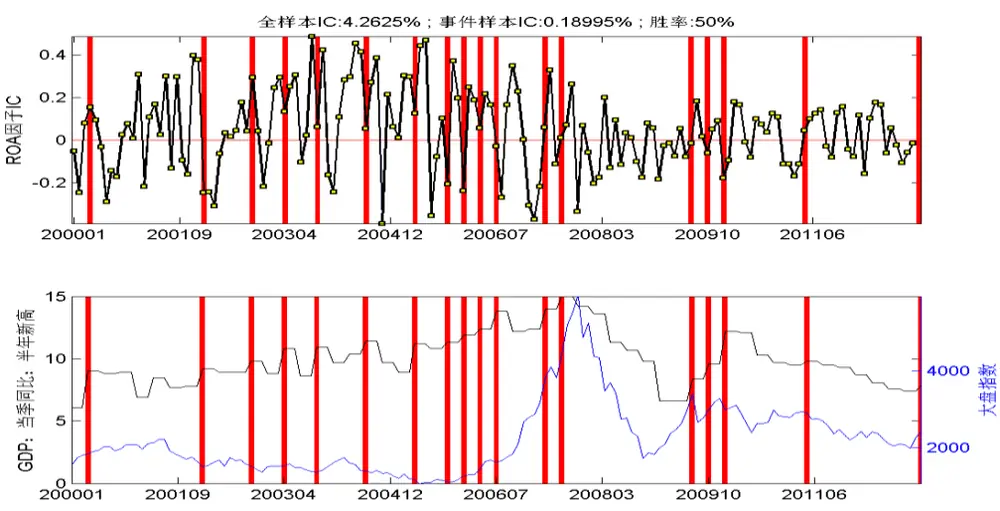
数据来源：广发证券发展研究中心
识别风险，发现价值

表 5：''预测M2：同比：半年新高'' 中风格轮动规律

| 编号 | 轮动方向 | 风格因子 |
| --- | --- | --- |
| 预测 M2：同比：半年新高 | 纳入 | SP、BP |
| 预测 M2：同比：半年新高 | 剔除 | ROE、ROA、净利润增长率、每股净资产增长率、 EPS增长率、ROE增长率、主营业务收入增长率 |

数据来源：广发证券发展研究中心

预期M2创新高，货币总供应偏宽松，市场在增量资金的带动下往往具备估值修复行情，而盈利及成长等基本因素表现不佳。由于预期M2指标的采集时间较短，该类事件发生的次数比较少，但BP因子的IC胜率却高达73%，值得持续关注。

图6：''预测M2：同比：半年新高'' 中,因子BP表现
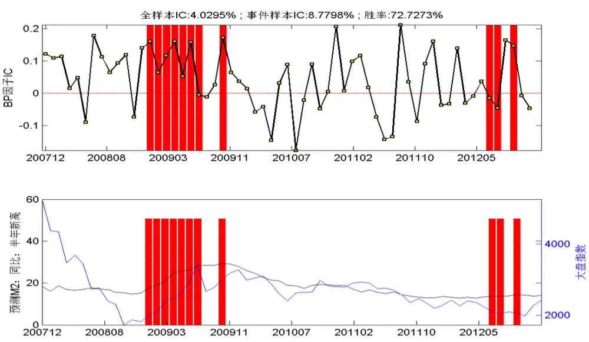
数据来源：广发证券发展研究中心

图7：''预测M2：同比：半年新高'' 中,因子ROA表现
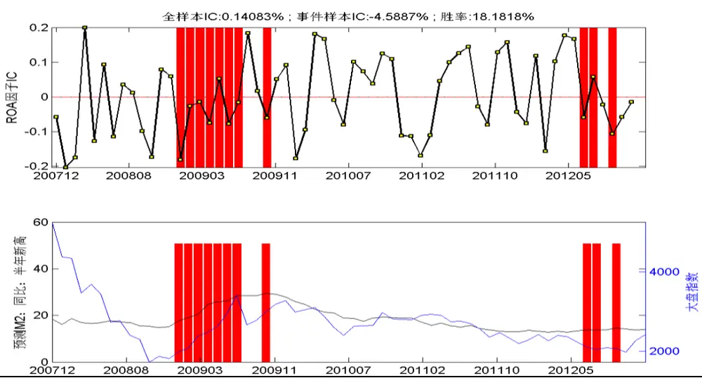
数据来源：广发证券发展研究中心
识别风险，发现价值

表 6：''进出口金额：当月同比：半年新高'' 中风格轮动规律

| 编号 | 轮动方向 | 风格因子 |
| --- | --- | --- |
| 进出口金额：当月同比：半年 新高 | 纳入 | 流通市值、总资产 |
| 进出口金额：当月同比：半年 新高 | 剔除 | 毛利率、ROE、总资产增长率、每股净资产增长率、 资产负债率、三个月股价反转、六个月股价反转、 长期负债比率、每股负债比、财务费用比例、固定 比、净利润现金占比、总资产周转率、每股派息/ 股价、EP |

数据来源：广发证券发展研究中心

进出口总额创新高，投资情绪极度乐观，中小企业生存环境得到改善，小盘股由于其成长性高，业绩想象空间较大而备受青睐；而蓝筹股由于规模较大，业绩虽稳定但利润增长的边际效益较低，因此盈利、成长以及运营类等方面的风格因子有效性并不显著。该类样本较少，但胜率非常高。以“流通市值”因子为例，胜率高达80%。

最新一期公布的数据显示，12月份该指标创半年新高，建议关注小盘股表现，同时警惕被剔除风格因子的风险。

图8：''进出口金额：当月同比：半年新高'' 中,因子流通市值表现
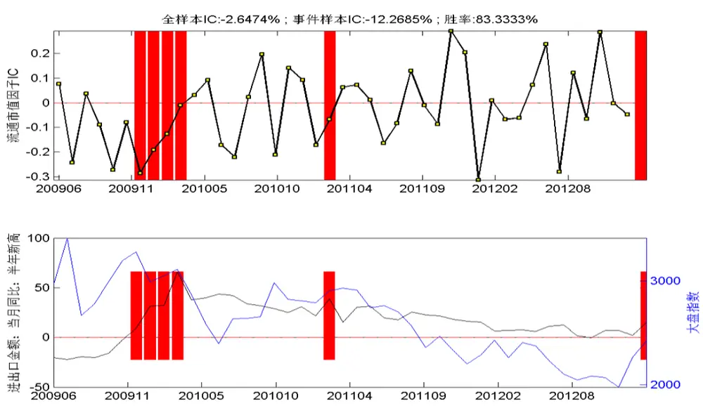
数据来源：广发证券发展研究中心

表 7：'' A股账户新增开户数：合计：半年新高'' 中风格轮动规律

| 编号 | 轮动方向 | 风格因子 |
| --- | --- | --- |
| A股账户新增开户数：合计： 半年新高 | 纳入 | 1个月成交金额、近3个月平均成交量、三个月股 价反转、流通市值 |
| A股账户新增开户数：合计： 半年新高 | 剔除 | 每股负债比、流动负债率 |

数据来源：广发证券发展研究中心

A股账号新增开户数创半年新高，多数发生在市场局部高位，反映市场情绪过度乐观，往往也伴随着较大的反转风险，该类事件下，股价反转因子生效、前期换手过热的个股出现回调，小盘领涨。

图9：''A股账户新增开户数：合计：半年新高'' 中,因子流通市值表现
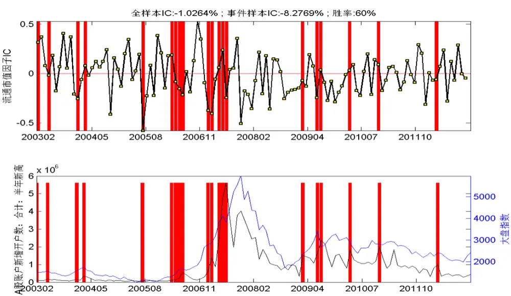
数据来源：广发证券发展研究中心

表 8：''A股账户新增开户数：合计：半年新低'' 中风格轮动规律

| 编号 | 轮动方向 | 风格因子 |
| --- | --- | --- |
| A股账户新增开户数：合计： 半年新低 | 纳入 | 销售净利率、毛利率、ROE、ROA、股东权益增长 率、净利润增长率、EPS增长率、ROE增长率、总 资产、速动比率、流动比率、每股派息/股价 |
| A股账户新增开户数：合计： 半年新低 | 剔除 | 无 |

数据来源：广发证券发展研究中心

A股账号新增开户数创半年新低，多数发生在市场底部，悲观的市场情绪常常会影响市场后续走势，该类事件下，出于对资产保值及风险控制的考虑，投资者往往更加关注基本面因素，因而大盘蓝筹成为该类事件中的主旋律。

图10：''A股账户新增开户数：合计：半年新低'' 中,因子ROE表现
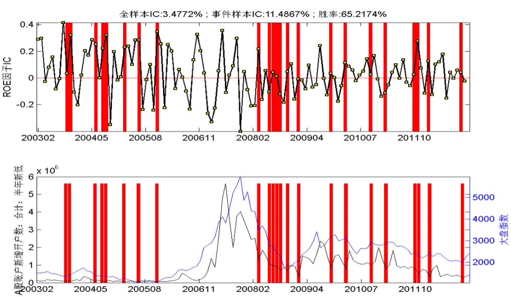
数据来源：广发证券发展研究中心

表 9：''宏观经济景气指数：预警指数：半年新低'' 中风格轮动规律

| 编号 | 轮动方向 | 风格因子 |
| --- | --- | --- |
| 宏观经济景气指数：预警指 数：半年新低 | 纳入 | ROE、ROA、总资产增长率、净利润增长率、EPS 增长率、ROE增长率、主营业务收入增长率、资产 负债率、财务费用比例、速动比率、流动比率 |
| 宏观经济景气指数：预警指 数：半年新低 | 剔除 | 三个月股价反转、流通市值 |

数据来源：广发证券发展研究中心

宏观经济景气预警指数创半年新低，经济预期接近底部，出于对风险预判的考虑，基本面受到市场的普遍关注，此阶段小盘股受抛弃，投资者重点关注个股的盈利、成长以、资产负债结构以及偿债能力等指标，以“净利润增长率”因子为例，时间样本中因子平均IC高达6.6%，IC胜率为78%。

图11：''宏观经济景气指数：预警指数：半年新低'' 中,因子净利润增长率表现
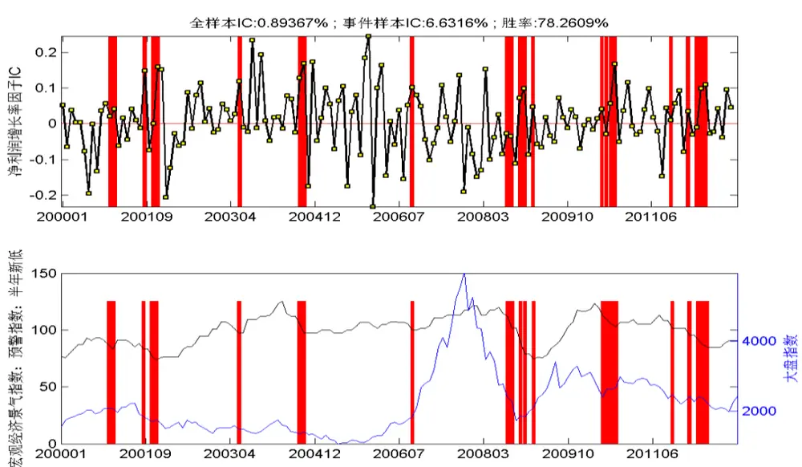
数据来源：广发证券发展研究中心

表 10：''非制造业PMI：半年新低'' 中风格轮动规律

| 编号 | 轮动方向 | 风格因子 |
| --- | --- | --- |
| 非制造业 PMI：半年新低 | 纳入 | 流通市值/总市值、每股派息/股价、CFP、EP、SP、 BP |
| 非制造业PMI：半年新低 | 剔除 | 一个月股价反转、存货周转率 |

数据来源：广发证券发展研究中心

PMI创新低意味着前期经济下行比较明显，从历史统计情况来看，随后该指标均在短期内回复到50附近，经济出现明显的反弹趋势，该类事件下市场常常偏好估值偏低的个股。

图12：''非制造业PMI：半年新低'' 中,因子BP表现
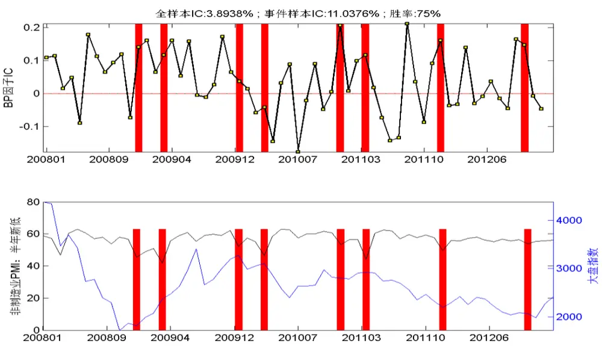
数据来源：广发证券发展研究中心

表 11：''企业家信心指数：半年新低'' 中风格轮动规律

| 编号 | 轮动方向 | 风格因子 |
| --- | --- | --- |
| 企业家信心指数：半年新低 | 纳入 | 1个月成交金额、近3个月平均成交量、一个月股 价反转、三个月股价反转、六个月股价反转、流通 市值 销售净利率、毛利率、ROE、ROA、股东权益增长 |
| 企业家信心指数：半年新低 | 剔除 | 率、总资产增长率、净利润增长率、每股净资产增 长率、EPS增长率、ROE增长率、主营业务收入增 长率、总资产、每股负债比、财务费用比例、流动 负债率 |

数据来源：广发证券发展研究中心

企业家信心指数代表企业对当前宏观经济的看法，作用与PMI类似，指标的优点是行业覆盖面较广、综合性较强，缺点是不如PMI灵敏，因为PMI只反映制造业当月变化，而企业家信心指数反映的是各大行业在三个月内的平均变化。

指标创新低，意味着投资情绪已经持续低迷，该类事件下，市场常常期望经济触底反弹，因此股价反转效应明显，小盘股也成为抢反弹利器；而盈利及成长等基本面指标则显著失效。

图13：''企业家信心指数：半年新低'' 中,因子流通市值表现
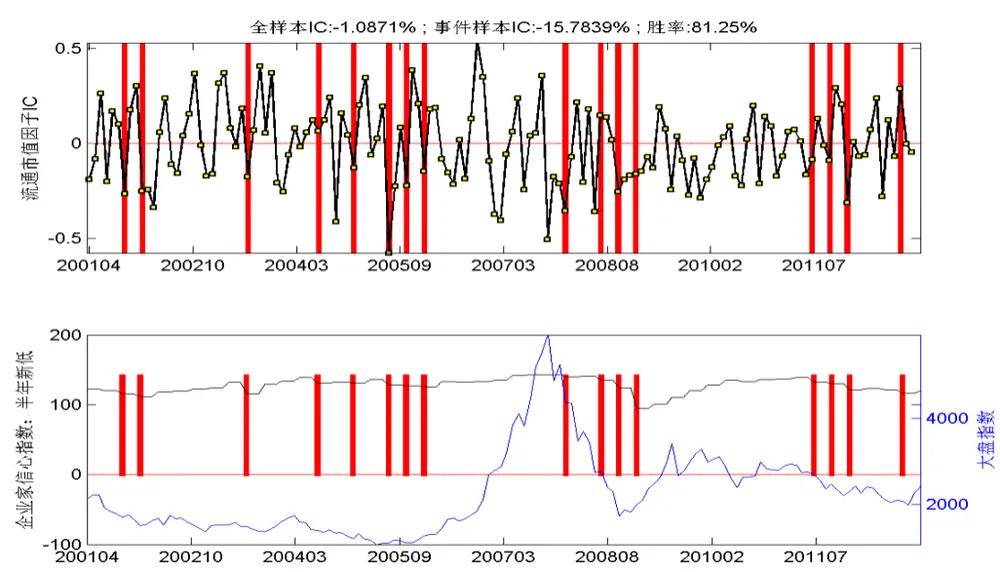
数据来源：广发证券发展研究中心

图14：''企业家信心指数：半年新低'' 中,因子ROE表现
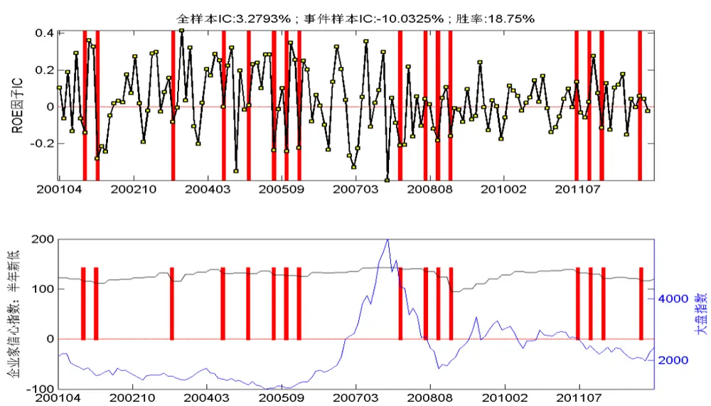
数据来源：广发证券发展研究中心

表 12：''上证A股换手率：半年新高'' 中风格轮动规律

| 编号 | 轮动方向 | 风格因子 |
| --- | --- | --- |
| 上证A股换手率：半年新高 | 纳入 | 1个月成交金额、近3个月平均成交量、一个月股 价反转、三个月股价反转、六个月股价反转、流通 市值、总资产 销售净利率、毛利率、ROE、ROA、股东权益增长 |
| 上证A股换手率：半年新高 | 剔除 | 率、总资产增长率、净利润增长率、每股净资产增 长率、EPS增长率、ROE增长率、主营业务收入增 长率、总资产、每股负债比、财务费用比例、速动 比率、流动负债率、固定比、CFP |

数据来源：广发证券发展研究中心

市场平均换手率创新高，常常发生在市场的上升阶段，且隐含着浓厚的短线投机情绪，伴随着该类事件的发生，市场对股价反转指标异常关注，同时前期换手较低的个股也受到青睐，规模上则偏好小盘股；而盈利及成长等基本面因子被市场所抛弃。

图15：''上证A股换手率：半年新高'' 中,因子1个月成交金额表现
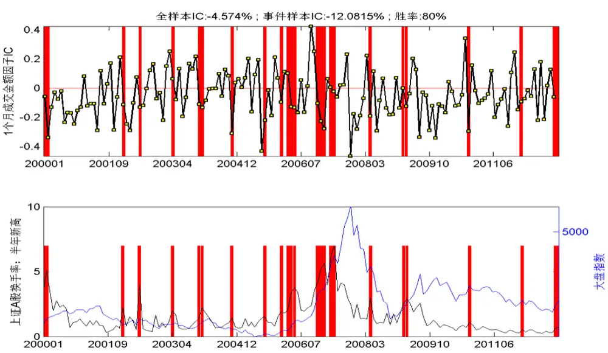
数据来源：广发证券发展研究中心

图16：''上证A股换手率：半年新高'' 中,因子ROE表现
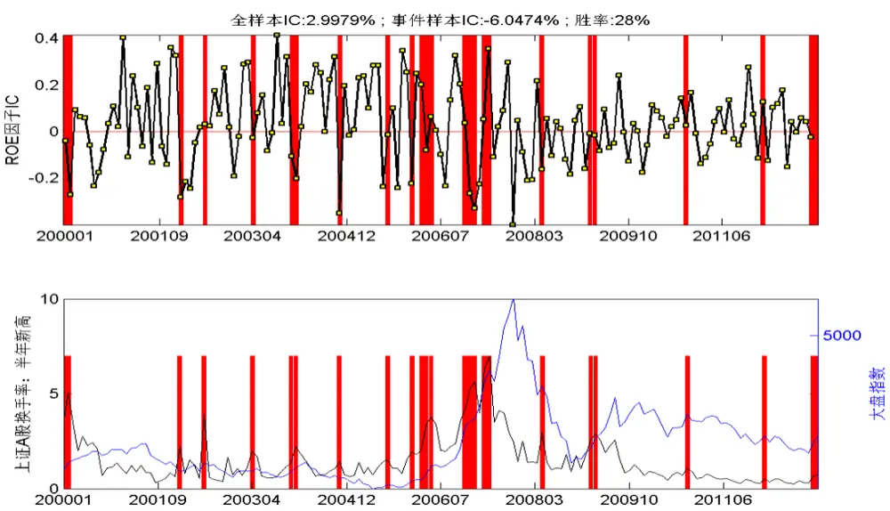
数据来源：广发证券发展研究中心

表 13：''实际-预测：工业增加值当月同比：半年新高'' 中风格轮动规律

| 编号 | 轮动方向 | 风格因子 |
| --- | --- | --- |
| 实际-预测：工业增加值当月 同比：半年新高 | 纳入 | 1个月成交金额、一个月股价反转、三个月股价反 转、六个月股价反转、流通市值、 |
| 实际-预测：工业增加值当月 同比：半年新高 | 剔除 | ROA、、财务费用比例、每股派息/股价 |

数据来源：广发证券发展研究中心

随着工业增加值公布且大幅超预期，小盘股开始引领补涨，反转因子捕捉补涨，而盈利因子则表现一般，大盘蓝筹股沦为鸡肋。

图17：''实际-预测：工业增加值当月同比：半年新高'' 中,流通市值表现
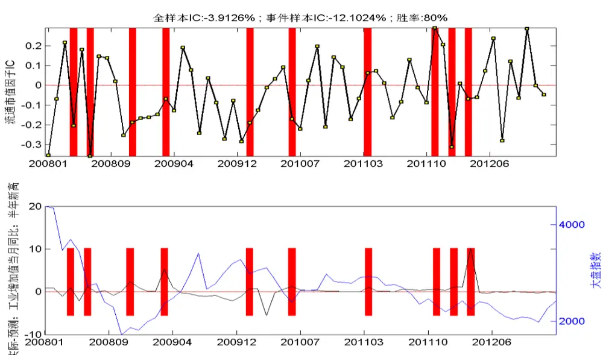
数据来源：广发证券发展研究中心

图18：''实际-预测：工业增加值当月同比：半年新高'' 中,财务费用比例表现
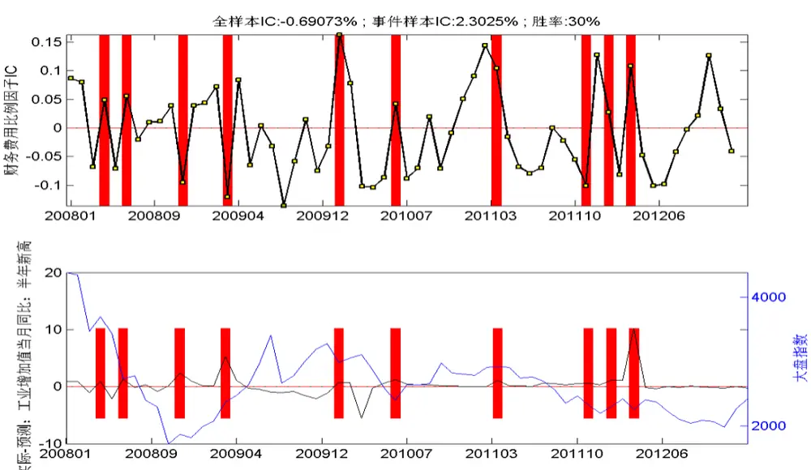
数据来源：广发证券发展研究中心
识别风险，发现价值

表 14：''6月'' 中风格轮动规律

| 编号 | 轮动方向 | 风格因子 |
| --- | --- | --- |
| 6月 | 纳入 | 毛利率、ROE、ROA、股东权益增长率、总资产增 长率、主营业务收入增长率、资产负债率、换手率、 总资产、财务费用比例、流动比率、流动负债率 |
| 6月 | 剔除 | 流通市值/总市值、1个月成交金额、流通市值、存 货周转率 |

数据来源：广发证券发展研究中心

经统计发现，每年6月份A股市场都会迎来一轮大盘蓝筹行情，期间毛利率、ROE、主营收入增长率等基本面因素受到投资者的普遍关注，而小盘股则纷纷沦为垫底。

图19：''6月'' 中,因子毛利率表现
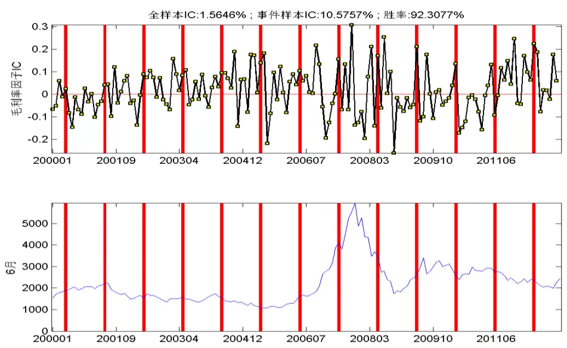
数据来源：广发证券发展研究中心

图20：''6月'' 中,因子总资产表现
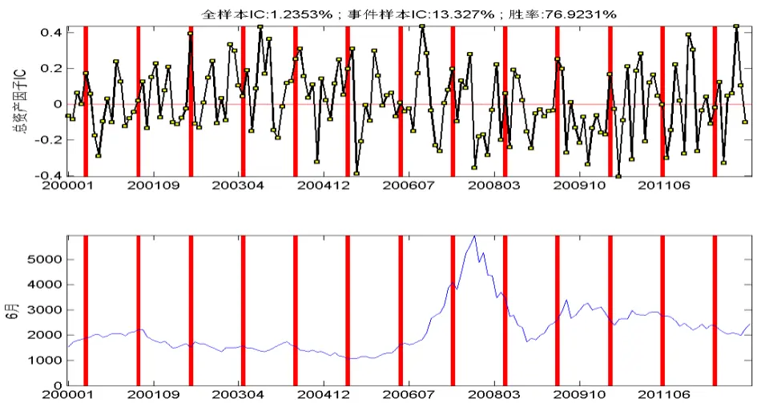
数据来源：广发证券发展研究中心

表 15：''12月'' 中风格轮动规律

| 编号 | 轮动方向 | 风格因子 |
| --- | --- | --- |
| 12月 | 纳入 | 毛利率、ROE、ROA、股东权益增长率、净利润增 长率、EPS增长率、ROE增长率、主营业务收入增 长率、财务费用比例、总资产周转率、EP |
| 12月 | 剔除 | 三个月股价反转 |

数据来源：广发证券发展研究中心

同样，每年12月份A股市场都会迎来一轮大盘蓝筹行情，期间毛利率、ROE、净利润增长率等基本面因素受到投资者的普遍关注，而股价反转因子甚至出现倒戈，前期表现联号的个股年底继续“保增长”。

图21：''12月'' 中,因子ROE增长率表现
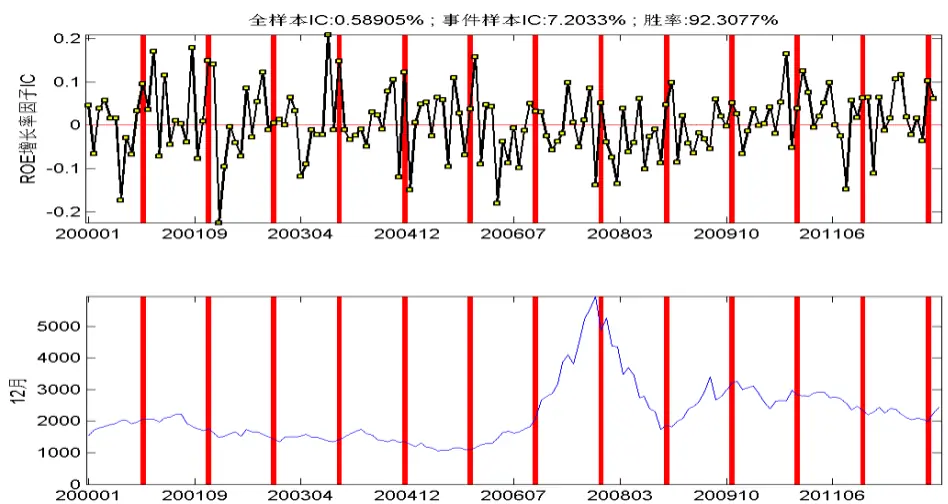
数据来源：广发证券发展研究中心

图22：''12月'' 中,因子总资产表现
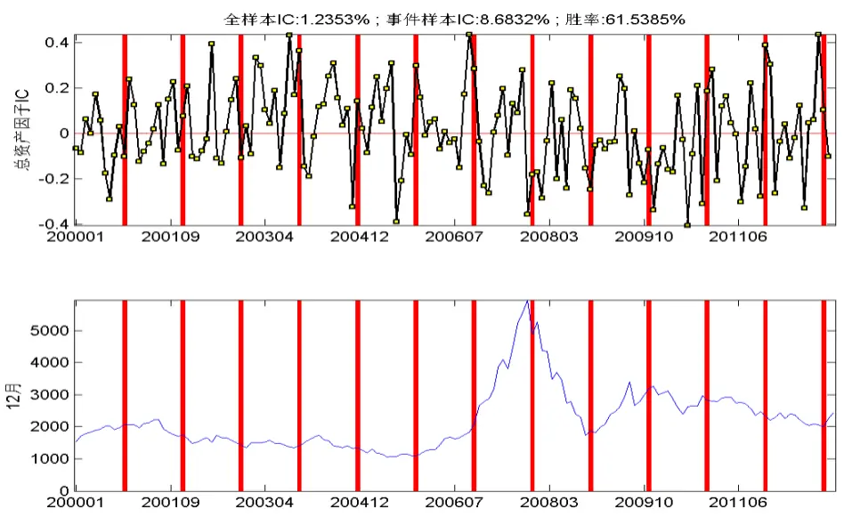
数据来源：广发证券发展研究中心

## 三、事件驱动下的风格轮动策略

上一节采用“宏观事件分析法”对风格因子的轮动进行了深入分析，并得到了各类宏观事件背景下风格轮动的规律，进而结合各类事件背景的特征对风格轮动进行了分析和解释。本节的目标是基于上述的分析结论构建风格因子量化轮动策略，并通过实证分析来验证策略的有效性和实用性。

## (一) 策略设计

在风格轮动策略的初始阶段，模型将首先根据各类风格因子的历史表现确定一组“有效风格因子”，而后每一期该“风格因子组合”将动态地调整，调整的依据是：每个月的最后一个观察各类有效的宏观事件是否发生，如果发生了则根据历史上该类事件背景下表现较好的风格因子纳入到“风格因子组合”中，而表现较差的风格因子则从“风格因子组合”中剔除，从而形成新的风格因子组合。具体的纳入及剔除标准采用上述方法，此外，当某一期纳入的风格因子数量过多时（超过12个），只保留被纳入次数超过一次的风格因子组成有效的风格因子组合。

图23：事件驱动下的风格轮动策略示意图
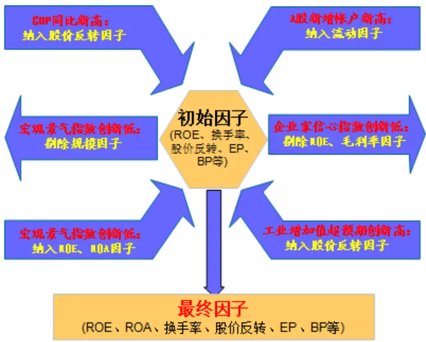
数据来源：广发证券发展研究中心

## (二) 实证分析

个股样本：中证800成份股。

样本期间：2000 年 1 月 31 日-2013 年 1 月 31 日共 157 个月，其中 2008 年 12月 31日之前作为样本内数据，用于挑选初始Alpha因子、并统计各类宏观事件下风格因子的轮动规律；2009 年之后作为样本外数据，根据样本内统计的结果进行实证分析，检验策略是否稳定有效。

策略频率：每月最后一个交易日，根据最新公布的宏观指标数据，检查重点跟

识别风险，发现价值

踪的宏观事件是否发生，并根据风格轮动规律确定下个月所采用的风格因子；

比较基准： 中证 800成份股等权指数。

首先，根据样本内统计结果，我们对宏观事件及初始风格因子组合进行挑选：

表 16：有效的宏观事件汇总

| 编号 | 宏观指标类型 宏观事件 |  |
| --- | --- | --- |
| 1 | 国民经济核算 | GDP：当季同比：半年新高、 |
| 2 | 工业指标 | 实际-预测：工业增加值当月同比：半年新高 |
| 3 | 预测数据 | 预测M2：同比：半年新高 |
| 4 | 对外投资 | 进出口金额：当月同比：半年新高 |
| 5 | 景气指标 | 宏观经济景气指数：预警指数：半年新低、企业家信心指数：比上期下降、企业家信心指数：半年新低 |
| 6 | PMI | 非制造业 PMI：半年新低 |
| 7 | 市场情绪 | A股账户新增开户数：合计：半年新高、A股账户新增开户数：合计：半年新低、上证A股换手率：半年新高 |
| 8 | 6月份 | 每年6月份 |
| 9 | 12月份 | 每年12月份 |

数据来源：广发证券发展研究中心

表 17：初始风格因子组合

| 1 | 销售凈利率 |
| --- | --- |
| 2 | ROE |
| 3 | 股东权益增长率 |
| 4 | 1个月成交金额 |
| 5 | 换手率 |
| 6 | 一个月股价反转 |
| 7 | 流通市值 |
| 8 | 总资产 |
| 9 | 财务费用比例 |
| 10 | 总资产周转率 |
| 11 | 每股派息/股价 |
| 12 | EP |
| 13 | BP |

数据来源：广发证券发展研究中心，Wind数据库

基于表 17 挑选的初始风格因子，分别构建两种多因子 Alpha 策略：

(1) 策略1：采用初始风格因子构建因子等权策略，个股等权；

(2) 策略2：根据风格轮动规律，在初始风格因子的基础上，结合有效的宏观事件建立风格轮动多因子 Alpha 策略，因子及个股之间同样采用等权。

上述两类多因子策略的比较基准均为中证 800等权指数，其表现如下所示。：

表 18：多因子量化对冲策略结果比较

| 策略名称 | 策略1 | 策略2 |
| --- | --- | --- |
| 信息比(多空)' | 213.9% | 272.0% |
| 信息比(多-指数) | 172.5% | 246.4% |
| 年化收益率(全样本) | 10.6% | 18.1% |
| 累计最大回撤 | 11.1% | 7.4% |
| 月度胜率 | 71.2% | 71.2% |
| 月度最大亏损 | -6.8% | -7.4% |
| 00年累计收益 | 8.6% | 12.8% |
| 01年累计收益 | 12.0% | 10.9% |
| 02年累计收益 | 6.9% | 9.1% |
| 03年累计收益 | 23.7% | 28.4% |
| 04年累计收益 | 20.8% | 33.5% |
| 05年累计收益 | 16.1% | 32.5% |
| 06年累计收益 | 14.5% | 29.0% |
| 07年累计收益 | 8.6% | 33.2% |
| 08年累计收益 | 5.3% | 16.9% |
| 09年累计收益 | 14.3% | 22.4% |
| 10年累计收益 | 4.5% | 15.6% |
| 11年累计收益 | 4.2% | 1.8% |
| 12年累计收益 | 2.4% | 7.2% |
| 13年累计收益 | -0.7% | 0.1% |

数据来源：广发证券发展研究中心，Wind数据库

由表18发现，考虑宏观事件驱动的风格轮动之后，策略相对静态多因子策略的表现有了显著的提高，信息比由 1.73 提高到 2.46，年化收益率由 11%提高为 18%；分年度来看，除了2011年策略收益出现了下降，其余每个年度均有很大的提高，风格轮动策略相对静态多因子策略的胜率为 67%。

图24：对冲策略累计收益比较
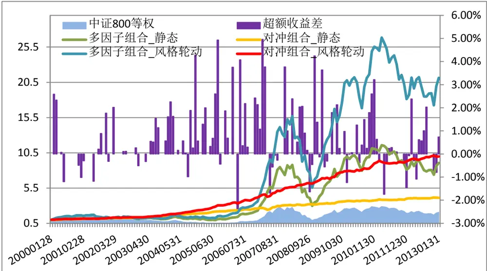
数据来源：广发证券发展研究中心

图25：样本外对冲策略累计收益比较
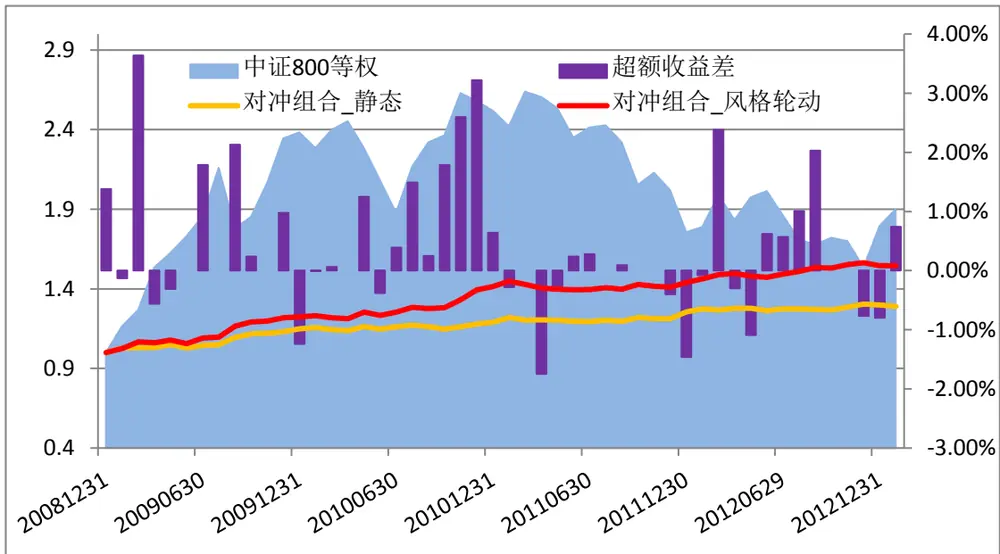
数据来源：广发证券发展研究中心

图25显示，除2011年之外，其余各个阶段风格轮动策略样本外的表现都比较出色，上个月相对静态多因子策略获得了 1.7%的超额收益率。

## 四、总结及建议

## (一) 总结

“风格投资”由于具有“自上而下”的投资理念，因而一直以来都深受投资者青睐，且越来越被实务界认同。但显然投资者无法仅仅依靠某一种投资风格而实现永久的获利，随着时间的推移，单一风格的数量化策略不能持续取得较高溢价率，风格轮动成为投资界永不落幕的话题，而对“风格轮动”的研究也日益受到投资者的重视。

常见的风格轮动策略主要分为“样本分类”及“时间序列回归”两类，本文从观察多类“宏观事件”这个的角度，对风格因子的轮动规律进行探讨，具有逻辑清晰且应用简单的特点；另外，由于该策略只关注某些特殊宏观事件对风格轮动的驱动作用，因此可以减少由于风格规律出现钝化甚至出现短期失效从而导致轮动策略频繁出错的次数。

经检验，某些类型的“宏观事件”能够帮助我们更好地揭示市场上各种主流风格轮动的规律，本文通过量化的规则将这些规律构造成为风格因子轮动策略，经实证策略取得了较好的效果，后续我们将持续对这些宏观事件进行跟踪，从而对风格轮动的方向进行提前判断。

## (二) 最新建议

最新公布的2012四季度GDP同比数据创了半年内新高，据此2月份推荐关注的风格因子是：三个月股价反转、六个月股价反转、BP、SP。

最新公布的进出口金额同比数据显示，12月份该指标创半年新高，据此2月份推荐关注的风格因子是：流通市值、总资产。

## 风险提示

报告所提出的宏观事件风格轮动策略，取得了较好的效果，但并非百分百准确，仍然存在错误的风险，实际中应结合市场环境特征进行适当应用。

## Table_Res arch 广发金融工程研究小组

罗 军： 首席分析师，华南理工大学理学硕士，2010年进入广发证券发展研究中心。

俞文冰： 首席分析师，CFA，上海财经大学统计学硕士，2012年进入广发证券发展研究中心。

叶 涛： 资深分析师， ，上海交通大学管理科学与工程硕士， 年进入广发证券发展研究中心。

安宁宁： 资深分析师，暨南大学数量经济学硕士，2011年进入广发证券发展研究中心。

胡海涛： 分析师， 华南理工大学理学硕士， 2010年进入广发证券发展研究中心。

夏潇阳： 分析师， 上海交通大学金融工程硕士， 2012年进入广发证券发展研究中心。

汪 鑫： 分析师， 中国科学技术大学金融工程硕士， 2012年进入广发证券发展研究中心。

蓝昭钦： 分析师，中山大学理学硕士， 2010年进入广发证券发展研究中心。

史庆盛： 研究助理，华南理工大学金融工程硕士， 2011年进入广发证券发展研究中心。

张 超： 研究助理，中山大学理学硕士， 2012年进入广发证券发展研究中心。

## Table_RatingIndustry 广发证券—行业投资评级说明

买入： 预期未来12个月内，股价表现强于大盘10%以上。

持有： 预期未来12个月内，股价相对大盘的变动幅度介于-10%～+10%。

卖出： 预期未来12个月内，股价表现弱于大盘10%以上。

## Table_RatingCompany 广发证券—公司投资评级说明

买入： 预期未来12个月内，股价表现强于大盘15%以上。

谨慎增持： 预期未来12个月内，股价表现强于大盘5%-15%。

持有： 预期未来12个月内，股价相对大盘的变动幅度介于-5%～+5%。

卖出： 预期未来12个月内，股价表现弱于大盘5%以上。

## Table_Ad联系我们

|  | 广州市 | 深圳市 | 北京市 | 上海市 |
| --- | --- | --- | --- | --- |
| 地址 | 广州市天河北路183号大 | 深圳市福田区金田路4018 | 北京市西城区月坛北街2号 | 上海市浦东新区富城路99号 |
|  | 都会广场5 楼 | 号安联大厦15楼A座03-04 | 月坛大厦18层 | 震旦大厦18楼 |
| 邮政编码 | 510075 | 518026 | 100045 | 200120 |
| 客服邮箱 | gfyf@gf.com.cn |  |  |  |
| 服务热线 | 020-87555888-8612 |  |  |  |

## Table_Disclaimer 免 责声 明

广发证券股份有限公司具备证券投资咨询业务资格。本报告只发送给广发证券重点客户，不对外公开发布。

本报告所载资料的来源及观点的出处皆被广发证券股份有限公司认为可靠，但广发证券不对其准确性或完整性做出任何保证。报告内容仅供参考，报告中的信息或所表达观点不构成所涉证券买卖的出价或询价。广发证券不对因使用本报告的内容而引致的损失承担任何责任，除非法律法规有明确规定。客户不应以本报告取代其独立判断或仅根据本报告做出决策。

广发证券可发出其它与本报告所载信息不一致及有不同结论的报告。本报告反映研究人员的不同观点、见解及分析方法，并不代表广发证券或其附属机构的立场。报告所载资料、意见及推测仅反映研究人员于发出本报告当日的判断，可随时更改且不予通告。

本报告旨在发送给广发证券的特定客户及其它专业人士。未经广发证券事先书面许可，任何机构或个人不得以任何形式翻版、复制、刊登、转载和引用，否则由此造成的一切不良后果及法律责任由私自翻版、复制、刊登、转载和引用者承担。