# 基于情景切换的技术选股策略

## ——技术指标选股系列之 KDJ

## Table_Sum ary报告摘要 ：

## 立足传统选股、寻求技术突破

传统多因子选股由于具备逻辑性强、稳定性好等优点而备受青睐，但数据的滞后及选股过于集中等缺点导致其应用大大受限；技术指标选股在策略多样性及灵活性则更凸显优势，而且能够实现分散选股及实时选股。本研究的目的是将传统的多因子选股思路与灵活的技术指标选股方法相结合，搭建一个全面、可拓展的量化选股体系，实现两种选股方法优势互补。本文为系列报告第一篇，针对应用最为广泛的 KDJ指标进行分析和探讨。

## KDJ参数及选股策略的优化

KDJ 最常见的参数为(9，3，3)，经测验该参数组合能获取一定的超额收益率，但近几年表现较差，年度最大回撤较高，本文提倡应考虑不同参数的适用情景，对于每个阶段符合不同情境特征的个股采用不同的参数。

除了参数的稳定性，KDJ 的另一问题是对股价反应过于灵敏，尤其在高低位极容易出现信号钝化的问题，为了解决这一问题，本文根据 KDJ 信号发生的次数来决定个股在组合中的权重，一方面对多次发出确认信号的个股进行了区别对待，同时也避免了多次信号导致个股数量较少的问题。

## KDJ 情景分析

报告中对个股的趋势强度（以ADX 度量）及流通市值进行了区分，并分别将个股分为 5种和3种情景，针对每一类不同情境分析了 KDJ 的参数及策略有效性。结果显示，当个股 ADX 大于 80 时，意味着个股近期走出了单边行情，此时 KDJ 选股指标显著失效；而当ADX 小于 80时，注意到随着ADX 增加，由于单边趋势愈加明显，KDJ最优参数的N 和 M均随之增加；在大盘股中 KDJ选股指标显著失效；小盘股及中盘股中KDJ 指标不同程度有效，其中小盘股应用效果最优，参数为 $^{(6,3,3)}$ 意味着小盘股中KDJ 更加看重短期内股价走势，且对当前 K线反应更为灵敏；而中盘股最优参数为 $^{(12,4,4)}$ ），意味着该类个股中 KDJ 更加看重中短期内股价走势，且对当前 K线反应稍微迟钝一些。

## 考虑情景切换的 KDJ 策略

所谓的情景切换是指对个股应用 KDJ 指标时，首先按照上述情景优先级对个股的情景进行判断，并选取对应的参数组合作为该个股应用 KDJ 的参数。

分阶段统计 KDJ 选股策略的表现，其中 2011-2013 年为样本外数据，共累计超额收益率 24%，其中 2011 年策略表现不佳出现亏损，而 2012 年及2013 年至今策略均有不错表现，尤其今年以来5个月超额累计收益率已达 17%。

图 1：考虑情景的 KDJ 策略表现
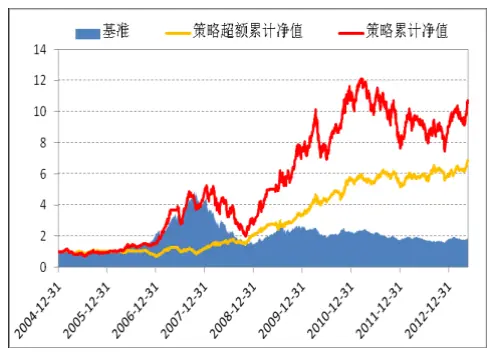
数据来源：广发证券发展研究中心

表 1：策略分阶段统计

|  | 收益率 | 胜率 |
| --- | --- | --- |
| 全样本 | 651.7% | 56.6% |
| 全样外 | 24.0% | 57.3% |
| 2005年 | 1.4% | 52.8% |
| 2006年 | -29.5% | 48.5% |
| 2007年 | 73.9% | 59.3% |
| 2008年 | 71.3% | 60.2% |
| 2009年 | 67.5% | 61.4% |
| 2010年 | 69.9% | 61.3% |
| 2011年 | -3.3% | 51.2% |
| 2012年 | 8.9% | 56.6% |
| 2013年 | 17.0% | 58.7% |

数据来源：广发证券发展研究中心

Table_Aut hor 分析师： 罗 军 S0260511010004

公020-87555888-8655

lj33@gf.com.cn

## Table_ 相关研究：Report

基于情景分析的多因子 Alpha 2012-11-16
策略——多因子 Alpha系列
报告之（十四）

Table_Contacter 联系人： 史庆盛

sqs@gf.com.cn

## 一、技术指标选股简介

## 1.1 分析框架

国内常见的量化选股策略有多因子选股、事件驱动选股以及技术选股等，其中多因子选股由于具备逻辑性强，稳定性较佳等优点而备受青睐，但由于数据的采集滞后以及选股过于集中等缺点而导致其应用大大受限。而技术指标选股在策略多样性及灵活性则更凸显优势，而且能够实现分散选股及实时选股。本研究的目的是将传统的多因子选股思路与灵活的技术指标选股方法相结合，搭建一个全面、可拓展的量化选股体系，实现两种选股方法优势互补。

图2：技术选股与传统多因子选股的结合
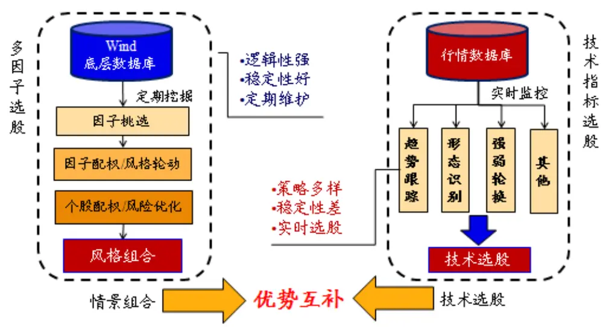
数据来源：广发证券发展研究中心

随着电脑的普及和股票专业软件的不断创新，技术指标也有了快速的发展，许多行情软件都自带一些经典的技术指标，甚至具有自编指标的功能，让许多技术指标爱好者深陷其中并乐此不疲，网上流行的指标有成千上万种，使用者对其目不暇接，尤其新股民投资者更是无所适从！其实大可不必通读所有技术指标，因为万变不离其宗，新生的技术指标无非是价量均线等不同组合表达方式的变异，真正有价值新创意的可谓凤毛麟角，反不如传统常用的几个经典指标实用，当然要真正掌握其精髓妙用还需下一番功夫。

本系列报告将优选考虑经典的技术选股方法，常见的技术选股指标有趋势指标、反趋势指标、能量指标、强弱指标以及压力支撑指标等，本研究将分别从其中选取最有代表性的指标进行分析，考虑到每个技术指标的使用往往存在多套不同的参数及策略，指标的适用情景也各不相同，报告将对各类经典的技术指标进行梳理，总结其中各指标的使用规律及其各自适用的情景。

图3：经典技术指标分类
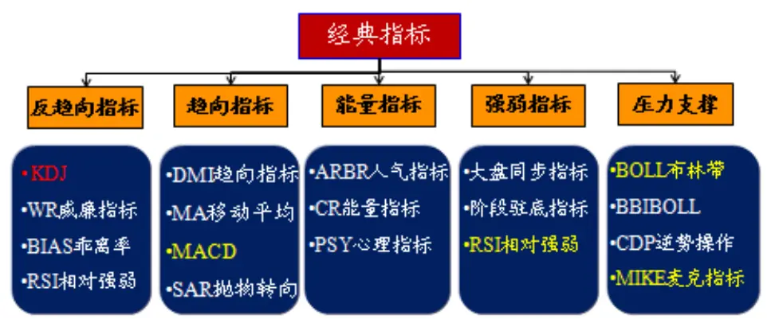
数据来源：广发证券发展研究中心

本文为技术指标情景分析系列报告第一篇，针对应用最为广泛的KDJ指标进行分析和探讨，书写结构上，报告分为五个部分：

第一部分阐述本系列报告的研究目的和基本思路；

第二部分对KDJ指标的参数有效性及选股策略进行分析，并探讨了指标的情景特征；

第三部分则基于前两部分搭建考虑情境切换的量化指标选股策略，并对策略的有效性进行实证分析；

最后一部分为总结。

## 1.2 指标原理

KDJ指标的中文名称是随机指数（Stochastics），是由George Lane首创的，是技术分析中最常用的指标之一，由于综合了动量、相对强弱和平均线的优点，在计算过程中主要研究最高价、最低价与收盘价之间的关系，因此能够比较迅速、快捷、直观地反映价格走势的相对强弱和超买超卖状态。

KDJ的计算并不复杂，首先计算周期（N日、N周等）的RSV值，即未成熟随机指标值，然后再通过加权平滑计算K值、D值、J值等，以日KDJ数值的计算为例，其计算公式如下：

RSV=（第N日收盘价–N日内最低价）/（N日内最高价–N日内最低价）×100K = SMA(RSV, M1, 1)

D = SMA(K, M2, 1)

J = 3K-2D

其中，若 Y=SMA(X,N,M)，则 Y=[M*X+(N-M)*Y?]/N，Y?为上一周期 Y 值，若无前一日 K值与D值，则可以分别用 50代替。

由KDJ的算法可见，RSV的本质是寻找当前价格在过去N天内的空间定位，这是整个公式的出发点，以下的 K、D、J都只是将这个结果平滑计算一下，J值只不过将 K与D的差异扩大化而矣。KDJ 选股的原理是假设股价在以箱体运行的条件下，当股价达到箱体上方时，视之为超买；当股价达到箱体下方时，则视之为超卖。

此外，KDJ的计算中还包含双重的加权移动平均（SMA），从时间上对 KDJ 内核（即箱体）进行了延伸，这也就是D 值移动速度最慢原因，因为D 值是对K值的平滑。因此KDJ是在判断箱体的基础上，以箱体的上下轨作为阻力与支撑，从而变形为非常规箱体；根据SMA 的计算方法，M1、M2的意义在于调节当前 K线对 KD指标的敏感度；

接下来考虑一下数据引用的周期，以常见的参数（9,3,3）为例，在基本内核中，N 基本值为 9，第一个SMA 参数是 3，也就是说要引用最RSV的周期为3，包括本身的一个，那么向前移动两个，即 9+2=11，第一次的 SMA 周期为 11，第二次则相同再加上 2，11+2=13，周期数为 13。也就是说，KDJ以9、3、3 为参数设置的话，那么引用时间周期是 13天，也就是说考虑的是过去13天的箱体行情。

图4：KDJ指标原理
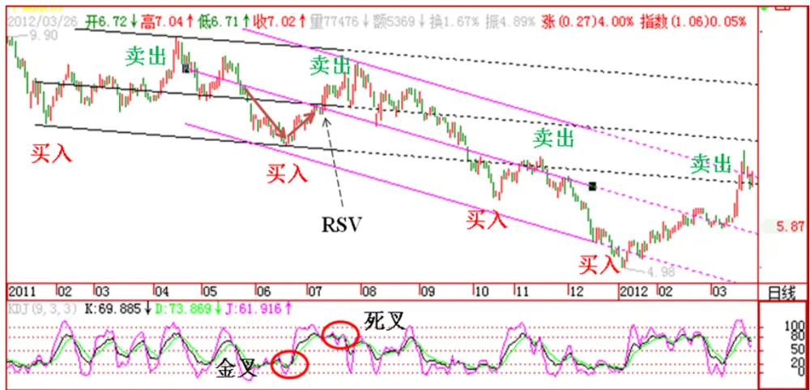
数据来源：广发证券发展研究中心

## 1.3 指标应用

在应用 KDJ 进行选股时，通常考虑如下 5 个方面的原则：KD 的取值、KD 曲线的形态、KD指标的交叉、KD 指标的背离以及J 指标的取值大小。

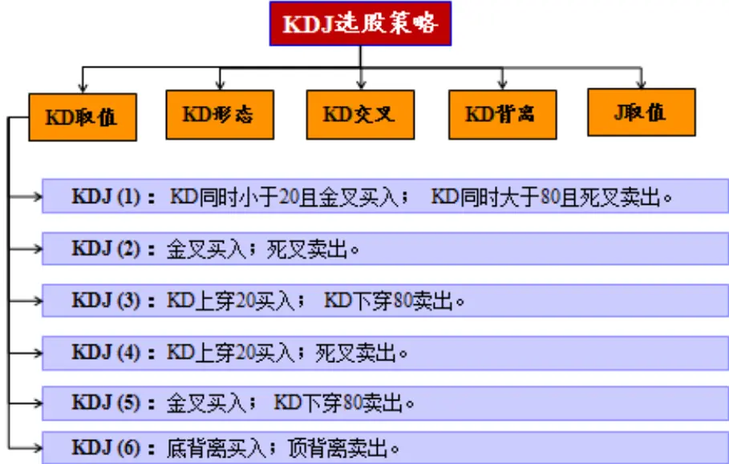
识别风险，发现价值

基于上述五个方面的原则，构造了如上图所示6个选股策略，基于全部A股我们对这 6个策略进行了检验，参数采用经典的(9,3,3)，分别测算前面6 个策略的有效性，结果如下所示：

表 2：六种选股策略比较

|  | 策略1 | 策略2 | 策略3 | 策略4 | 策略5 | 策略6 |
| --- | --- | --- | --- | --- | --- | --- |
| 累计超额收益率 | 1.99 | -0.42 | -0.21 | -0.35 | -0.39 | 0.28 |
| 胜率 | 0.55 | 0.52 | 0.53 | 0.52 | 0.51 | 0.54 |
| 最大回撤 | 0.34 | 0.71 | 0.62 | 0.68 | 0.71 | 0.48 |
| 日均新股数量 | 4.90 | 111.05 | 38.00 | 118.62 | 114.42 | 68.08 |
| 平均持仓个股数量 | 517.37 | 815.41 | 370.92 | 853.67 | 806.41 | 773.12 |

数据来源：广发证券发展研究中心

其中，“日均新股数量”为平均每个交易日新发出买入信号的个股数量；策略比较基准是全部A股等权指数。

图5：传统KDJ选股策略表现
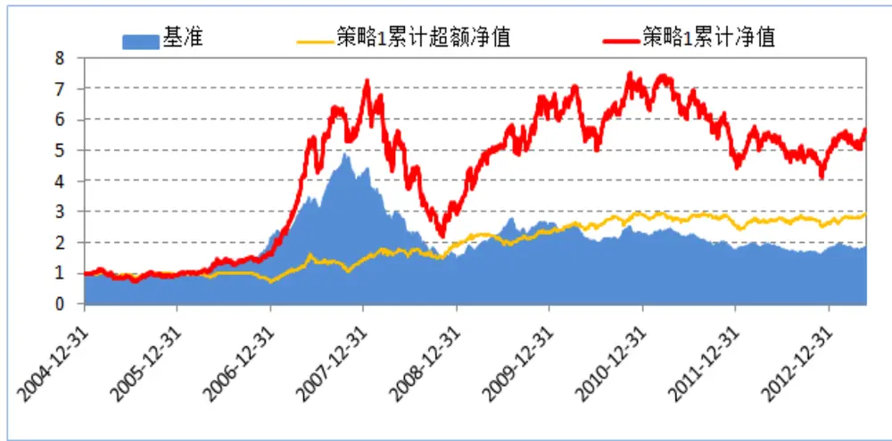
数据来源：广发证券发展研究中心

由表 2 显然可见策略 1 的应用效果较优，即在考虑 KD 位置的同时，结合交叉信号进行选股，将该策略应用于全部A 股（不含ST）中，自2005年以来相对A 股等权指数的累计超额收益率为 199%，平均日胜率为55%，虽然有效但显然均有待提高！本文将围绕策略1 进行参数以及策略的改进，力求提高选股策略的有效性。

## 二、KDJ 选股策略优化及情景分析

## 2.1 参数选择

经典的(9，3，3)参数为多数人所知,其在指数择时上的应用效果也得到许多人的认可,下面我们通过变换不同参数组合来检验其有效性。根据 KDJ 的构造特点，其中参数 N 我们假设为 3 的整数倍，从数字 6 至 21 之间搜索，而参数 M 则相对更为灵敏，我们在 3至min（N，8）之间搜索，选股策略则采用上述的策略 1，搜索结果如下表所示。

表 3：不同KDJ参数对应的策略累计收益率

| N M | 3 | 4 | 5 | 6 | 7 | 8 |
| --- | --- | --- | --- | --- | --- | --- |
| 6 | 1.21 | 1.89 | -0.23 | -0.35 |  |  |
| 9 | 1.99 | 2.15 | 1.30 | 1.21 | 0.33 | 0.35 |
| 12 | 1.60 | 2.03 | 1.32 | 1.03 | 1.07 | 0.74 |
| 15 | 1.31 | 1.47 | 1.45 | 0.71 | 0.91 | 1.26 |
| 18 | 1.01 | 1.33 | 1.15 | 1.02 | 1.30 | 1.03 |
| 21 | 0.18 | 0.43 | 0.91 | 1.14 | 0.45 | 1.14 |

数据来源：广发证券发展研究中心

表 4：不同KDJ参数对应的策略胜率

| N M | 3 | 4 | 5 | 6 | 7 | 8 |
| --- | --- | --- | --- | --- | --- | --- |
| 6 | 56.2% | 53.8% | 52.6% | 52.1% |  |  |
| 9 | 54.7% | 56.0% | 54.5% | 53.5% | 52.1% | 54.0% |
| 12 | 56.1% | 55.9% | 56.2% | 54.6% | 53.6% | 54.0% |
| 15 | 55.7% | 55.7% | 55.3% | 54.3% | 53.3% | 55.0% |
| 18 | 55.7% | 55.9% | 55.1% | 55.4% | 54.3% | 55.3% |
| 21 | 53.9% | 54.2% | 55.6% | 56.3% | 56.8% | 54.9% |

数据来源：广发证券发展研究中心

参数(9，3，3) 能获超额收益率，胜率大 55%，但该参数并非最优，与（6，4，4）、（9，4，4）及（12，4，4）等并无显著差异，此外，由图 5 可见，上述常用的KDJ 策略近三年应用效果不佳，除了每年回撤较高之外，信号出现钝化的情况也比较多，这说明对所有个股采用相同且不变的参数并不合适，应考虑每组参数的适用情景，对于每个阶段符合不同情境特征的个股采用不同的参数，这就是本文所提倡的核心策略。

## 2.2 策略优化

上述我们确定了策略1作为KDJ的核心选股策略为，即：当KD均低于20，且发生金叉时候买入相应个股；当KD均高于80，且发生死叉时卖出相应个股。

该策略的历史表现前面我们已经做了分析并发现其不足之处，究其原因一个重要的方面在于KDJ是一个敏感指标，变化快，随机性强，尤其在高低位极容易出现信号钝化从而发生虚假的买卖信号,使投资者根据其发出的买卖信号进行买卖时无所适从。为了解决这一问题，我们考虑根据信号重复发生次数来对买卖信号进行确认，KDJ连续多次信号发生情况下的选股策略表现如下：

表 5：不同交叉数量下KDJ 策略表现

| 交叉次数 | 1次 | 2次 | 3次 | 个股按交叉次数加权 |
| --- | --- | --- | --- | --- |
| 累计超额收益率 | 1.99 | 1.41 | 0.88 | 2.37 |
| 胜率 | 54.7% | 56% | 55.3% | 56.0% |
| 最大回撤 | 35.0% | 42.8% | 50.4% | 32.8% |
| 日均新股数量 | 4.67 | 2.73 | 1.42 | 4.90 |
| 平均持仓个股数量 | 494.14 | 207.49 | 79.72 | 517.37 |

数据来源：广发证券发展研究中心

交叉一次便发出买卖信号的策略，具有最高的收益率，日均信号发生次数最高为4.67次，平均持仓个股也高达约500只，但胜率偏低仅不到55%；交叉次数分别达到2次和3的选股策略，个股的参与程度显著递减，导致累计超额收益也同样降低，但由于避开了个别由于钝化导致的错误信号而在胜率有所提高，分别为56%和55.3%。

综合考虑各策略的优缺点，我们设计了一个折中的办法，即：依据金叉和死叉连续发生的次数来反映个股多空信号的强弱，并根据交叉次数对买入股票进行配权。

该策略相比自2005年以来累计超额收益率为237%，明显高于根据单次交叉信号进行买卖的策略，且胜率有所提高，最大回撤下降为33%，发生在2006年。

图6：不同交叉数量下KDJ策略表现
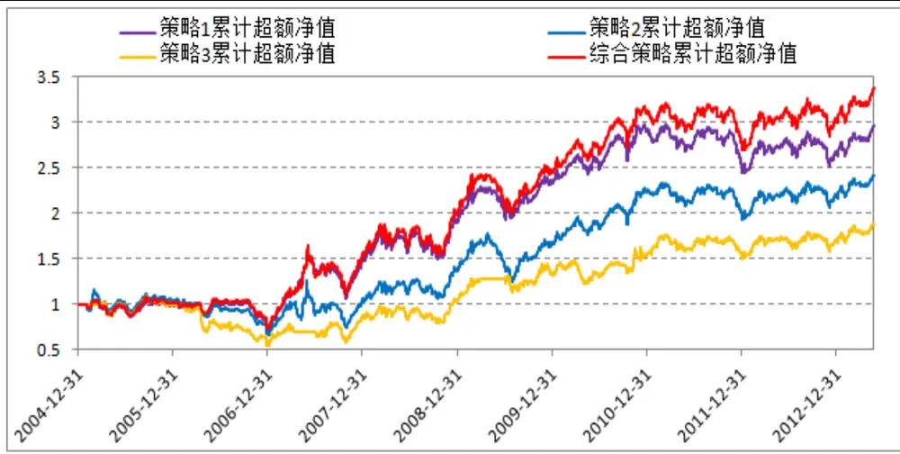
数据来源：广发证券发展研究中心

## 2.3 KDJ 指标的情景分析

对不同的个股之间应用KDJ指标，或者对同一只股票在不同的时期应用KDJ指标，所采用的参数是否会有所不同，导致参数变化的背后逻辑又是如何？前文已经对KDJ指标的参数背后对应的原理进行了阐述，KDJ发挥作用的前提是个股在一定期间内处于箱体震荡的行情，而影响KDJ效果的关键是个股的箱体走势的核心周期以及股价走势出现掉头时的幅度大小。下面从个股趋势强度以及规模大小两个角度对所有个股进行区分，从而提取出不同情境样本，进而在各种情境样本内对KDJ指标的参数有效性进行分析。

## 2.3.1 基于ADX指标的KDJ情境分析

ADX指标的全称为“平均方向性运动指标（Average Directional MovementIndex）”，是J.Welles Wider发明的，它属于振荡指标，用于指示市场趋势的强弱程度。ADX是在0-100之间用数值来表示其走势的，它的走势值很少有超过80的，如果超过60意味着趋势较明显，若低于20则意味个股处于窄幅震荡。

## 指标定义如下 ：

TR = SUM(MAX(MAX(HIGH - LOW, ABS(HIGH-
REF(CLOSE,1))), ABS(LOW - REF(CLOSE, 1))), N)
HD = HIGH - REF(HIGH, 1)
LD = REF(LOW, 1) - LOW
DMP = SUM(IF(HD>0 AND HD>LD, HD, 0), N)
DMM = SUM(IF(LD>0 AND LD>HD, LD, 0), N)
PDI = DMP*100/TR
MDI = DMM*100/TR
ADX = MA(ABS(MDI - PDI)/(MDI + PDI)*100, M)
其中变量与函数定义如下：
CLOSE：引用收盘价；HIGH：引用最高价；LOW：引用最低价
REF(X, N)：引用X在N个周期前的值
IF(C, A, B)：如果C成立返回A，否则返回B
此外，PDI简记为+DI，MDI简记为-DI；默认参数为：N=14，M=14。

个股趋势强度如何影响KDJ的有效性？下图我们举了一个典型的例子，某个股在A点上出现KDJ高位死叉，发出卖出信号，此时ADX值为22，意味着该个股过去一个月处于小幅震荡，卖出信号随后个股下跌趋势形成；此后经历一波单边下跌，KDJ在B位置出现低位金叉，发出买入信号，此时ADX值为90，意味个股刚走出单边行情，短期箱体运动被打破，个股随后并未如信号所示出现上涨行情，而是进入窄幅震荡并随后继续下跌，这个例子说明KDJ指标的有效性在某种程度上受到个股趋势强度的影响。此外，注意到ADX常用的参数为(14,14)，引用数据为14+13=27天，接近为KDJ指标引用数据的两倍，即一个震荡来回！

图7：ADX对KDJ指标有效性的影响
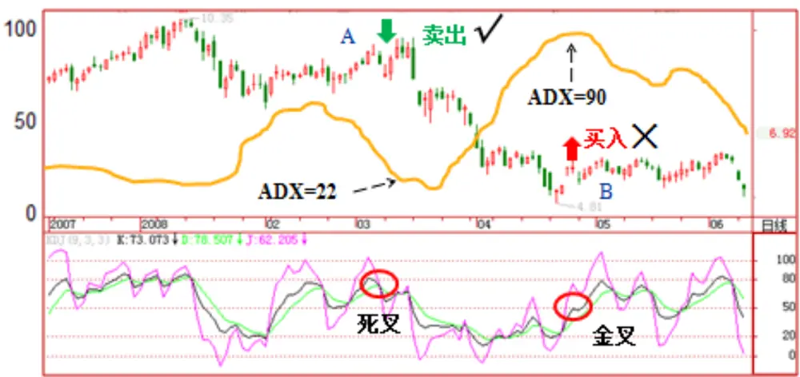
数据来源：广发证券发展研究中心

为了验证ADX对KDJ的有效性是否存在普遍的影响，下面将个股根据ADX的取值分为5种情景，并分别测算在各种情景下面应用KDJ的有效性。

表 6：不同 ADX情景下最优策略表现

| 交叉次数 | 情景1(0<ADX<20) | 情景2(20≤ADX<40) | 情景3(40≤ADX<60) | 情景4(60≤ADX<80) | 情景5(80≤ADX) | 全样本 | 情景切换 |
| --- | --- | --- | --- | --- | --- | --- | --- |
| 参数 | (6,4,4) | (9,4,4) | (9,6,6) | (9,7,7) | 无效 | (9,3,3) | 动态 |
| 累计超额收益率 | 3.78 | 2.26 | 2.31 | 4.82 |  | 1.99 | 2.83 |
| 胜率 | 55.2% | 55.4% | 52.2% | 52.6% |  | 55.6% | 55.6% |
| 最大回撤 | 40.4% | 38.2% | 58.3% | 22.2% |  | 33.9% | 35.0% |
| 日均新股数量 | 0.67 | 12.60 | 1.96 | 0.31 |  | 4.90 | 12.52 |
| 平均持仓个股数量 | 31.82 | 136.50 | 13.85 | 1.75 |  | 517.37 | 132.82 |
| 持仓时间占比 | 41.2% | 45.2% | 51.6% | 21.1% |  | 84.3% | 77.6% |

数据来源：广发证券发展研究中心

据表6，当个股ADX大于80时，意味着个股近期走出了单边行情，此时KDJ选股指标显著失效；而当ADX小于80时，注意到随着ADX增加，KDJ最优参数的N值随之增加，这是由于N对应着个股前期所处的箱体长度，N增加意味着趋势越强箱体震荡的周期也越长；类似的，随着ADX增加，M值也随之增加，这是由于个股趋势明显，所以当前K线敏感度下降，此时M越小则越容易造成信号钝化。

所谓的情景切换是指对个股应用KDJ指标时，如果个股处于情景5，即ADX>80，此时不对该个股应用KDJ，若个股处于情景1至情景4其中一种，则选取相应的参数组合作为该个股的KDJ参数。表6显示，考虑情景切换之后，超额收益率介于各类情景之间，但胜率则高于任何一种单独情景下的策略胜率。

图8：基于ADX情景切换的KDJ策略

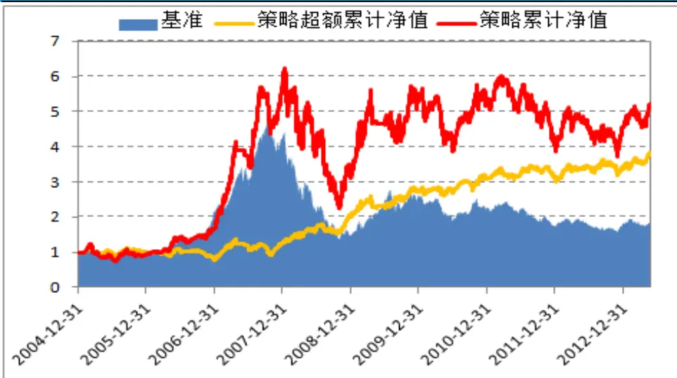
数据来源：广发证券发展研究中心

## 2.3.2 基于流通市值的KDJ情境分析

大盘股与小盘股在应用KDJ指标进行选股时候，是否存在参数的差异及有效性的不同呢？类似于ADX指标，下面根据个股的市值大小来区分个股情景，并分别测算在各种规模情景下面应用KDJ的有效性。

表 7：不同规模情景下最优策略表现

| 交叉次数 | 情景1(小盘股) | 情景2(中盘股) | 情景3(大盘股) | 全样本 | 情景切换 |
| --- | --- | --- | --- | --- | --- |
| 参数 | (6,3,3) | (12,4,4) | 无效 | (9,3,3) | 动态 |
| 累计超额收益率 | 6.80 | 2.00 |  | 1.99 | 3.04 |
| 胜率 | 56.7% | 56.0% |  | 55.6% | 56.1% |
| 日均新股数量 | 1.71 | 4.52 |  | 4.90 | 6.63 |
| 平均持仓个股数量 | 82.81 | 166.78 |  | 517.37 | 127.84 |
| 持仓时间占比 | 0.60 | 0.70 |  | 0.84 | 0.80 |

数据来源：广发证券发展研究中心

据表6，在大盘股中KDJ选股指标显著失效；小盘股及中盘股中KDJ指标不同程度有效，其中小盘股应用效果最优，参数为（6,3,3）意味着小盘股中KDJ更加看重短期内股价走势，且对当前K线反应更为灵敏；而中盘股最优参数为（12,4,4），意味着该类个股中KDJ更加看重中短期内股价走势，且对当前K线反应稍微迟钝一些。

考虑情景切换之后，策略超额收益率低于仅在小盘股中应用KDJ效果，但高于中盘股中的效果，但避免了仅在小盘股中应用KDJ时个股数量过少且规模风险太高等风险。

图9：基于流通市值情景切换的KDJ策略
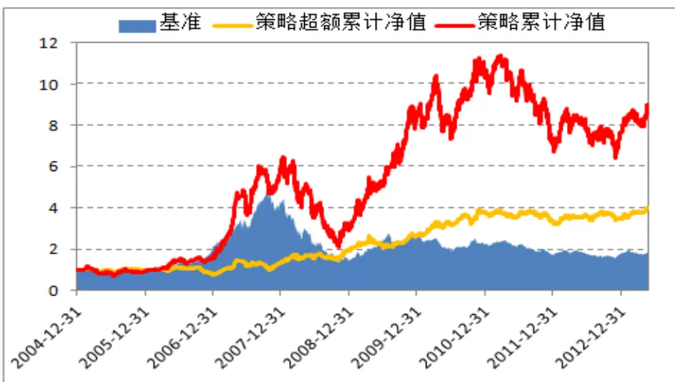
数据来源：广发证券发展研究中心

## 三、考虑个股情景切换的 KDJ 选股策略

## 3.1 情景选择

上一节根据ADX及规模对个股进行情景区分，其中“ADX大于80”及“大盘股”两种情景下不适合应用KDJ，其余共六种情景按照其最优策略的表现进行优先级排序如下：

表 8：有效情景下最优策略表现

| 交叉次数 | 情景1(小盘股) | 情景2(60≤ADX<80) | 情景3(0<ADX<20) | 情景4(20≤ADX<40) | 情景5(40≤ADX<60) | 情景6(中盘股) | 全样本 |
| --- | --- | --- | --- | --- | --- | --- | --- |
| 参数 | (6,3,3) | (9,7,7) | (6,4,4) | (9,4,4) | (9,6,6) | (12,4,4) | (9,3,3) |
| 累计超额收益率 | 6.80 | 4.82 | 3.78 | 2.26 | 2.31 | 2.00 | 1.99 |
| 胜率 | 56.7% | 52.6% | 55.2% | 55.4% | 52.2% | 56.0% | 55.6% |
| 日均新股数量 | 1.71 | 0.31 | 0.67 | 12.60 | 1.96 | 4.52 | 4.90 |
| 平均持仓个股数量 | 82.81 | 1.75 | 31.82 | 136.50 | 13.85 | 166.78 | 517.37 |
| 持仓时间占比 | 60.2% | 41.2% | 45.2% | 51.6% | 21.1% | 70.2% | 84.3% |

数据来源：广发证券发展研究中心

所谓的情景切换是指对个股应用KDJ指标时，首先按照上述情景优先级对个股

的情景进行判断，并选取对应的参数组合作为该个股应用KDJ的参数。

## 3.2 止损策略

上述的情景分析目的是为了使得不同个股在应用KDJ确定买卖点时能选择最合适的参数，从而提高指标使用的收益及胜率，然而该方法依然无法保证个股在应用KDJ时一直有效，为了防止KDJ失效给个股带来过大的损失，本文设计了KDJ信号的止损规则如下：

买入信号止损策略: 买入信号形成过程的最低点。以(9,3,3)为例，信号发生处往前推13个交易日，期间最低点为本次信号的止损价。

KDJ止损策略示意图如下：

图10：KDJ止损策略
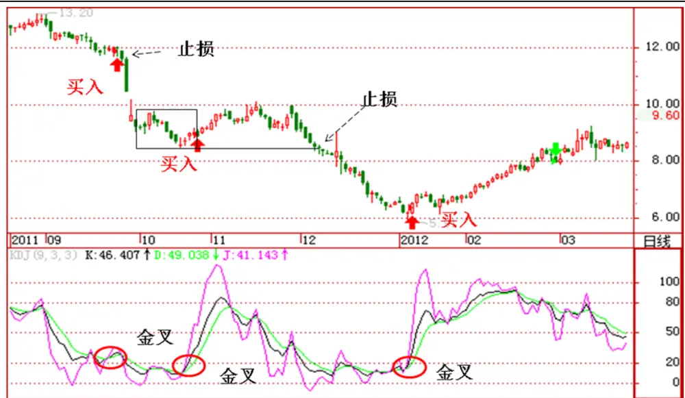
数据来源：广发证券发展研究中心

## 3.3 实证分析

基于ADX指标及大小盘风格的情景分析，建立情景分析KDJ选股策略。

- 个股样本：全部A股。

- 样本期间：2005 年 1 月 4 日-2013 年 5 月 24 日共 2053 个交易日，其中 2010年12月31日之前作为样本内数据；2010年12 月31 日之后作为样本外数据，检验情景模型是否稳定有效。

- 比较基准：A股等权指数。

- 开平仓操作：买入信号发出次日以开盘价买入;卖出信号发出或触及止损时,次日以开盘价卖出。

- 交易成本:双边 0.3% 。

实证结果如下所示：

首先对比不考虑信号止损与考虑止损的策略表现差异，后者的超额收益有了显著地提高，且最大回撤也有所下降，个股平均持仓时间也略有减少，日均新股数量则显著提高。

表 9：考虑情景切换的选股策略

|  | 累计超额收益率 | 胜率 | 日均新股数量 | 平均持仓个股数量 | 持仓时间占比 |
| --- | --- | --- | --- | --- | --- |
| 不考虑止损 | 4.21 | 56.3% | 6.13 | 133 | 79.1% |
| 考虑止损 | 6.52 | 56.6% | 7.02 | 80 | 78.5% |

数据来源：广发证券发展研究中心

图11：考虑情景切换的选股策略
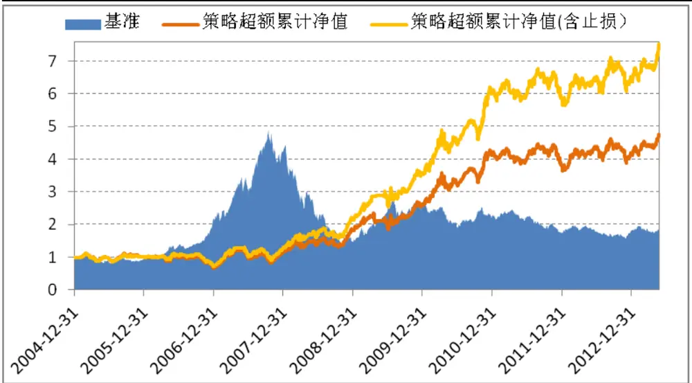
数据来源：广发证券发展研究中心

分阶段来观察KDJ选股策略的表现，其中2011-2013年为样本外数据，共累计超额收益率19.1%，其中2011年策略表现不佳出现亏损，而2012年及2013年至今策略均有不错表现，尤其今年以来5个月超额累计收益率已达17%。

表 10：策略分阶段表现统计

|  | 全样本 | 样本外(2011-2013) | 2005 | 2006 | 2007 | 2008 | 2009 | 2010 | 2011 | 2012 | 2013 |
| --- | --- | --- | --- | --- | --- | --- | --- | --- | --- | --- | --- |
| 超额收益率 | 651.7% | 24.0% | 1.4% | -29.5% | 73.9% | 71.3% | 67.5% | 69.9% | -3.3% | 8.9% | 17.0% |
| 胜率 | 56.6% | 57.3% | 52.8% | 48.5% | 59.3% | 60.2% | 61.4% | 61.3% | 51.2% | 56.6% | 58.7% |

数据来源：广发证券发展研究中心

图12：策略分阶段表现统计
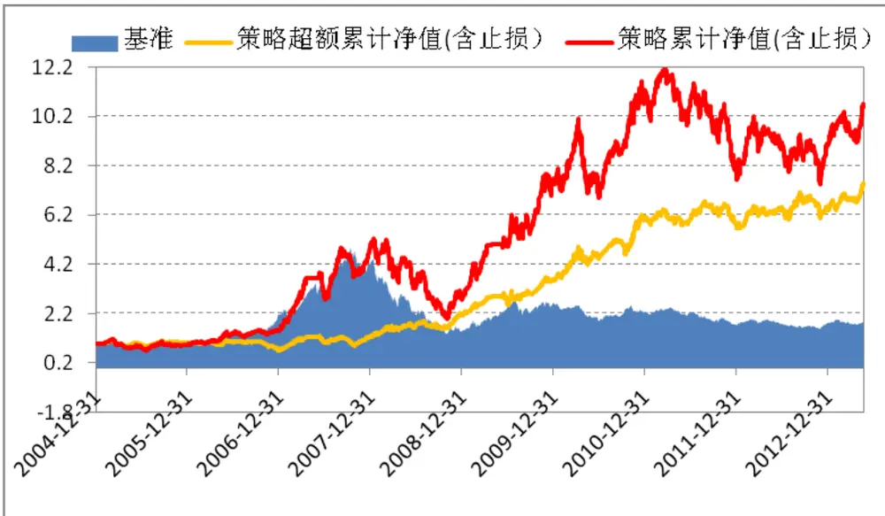
数据来源：广发证券发展研究中心

## 四、总结

常见的技术选股指标有数百种，按类别可分为趋势指标、反趋势指标、能量指标、强弱指标以及压力支撑指标等，本文从其中选取最经典之一的KDJ进行分析，而有关KDJ指标的优缺点，技战术等，已经有太多的专门文章给予论述，不是本文要论述的内容，考虑到每个技术指标的使用往往存在多套不同的参数及策略，指标的适用情景也各不相同，本报告的目的在于对各类经典的技术指标进行梳理，总结其中各指标的使用规律及其各自适用的情景。

后续研究中，将继续沿着情景分析这个角度，对更多的经典技术指标进行深入分析，同时涵盖更多的情景分类，在此基础上实现多因子选股、技术选股等多种选股策略的相互结合。

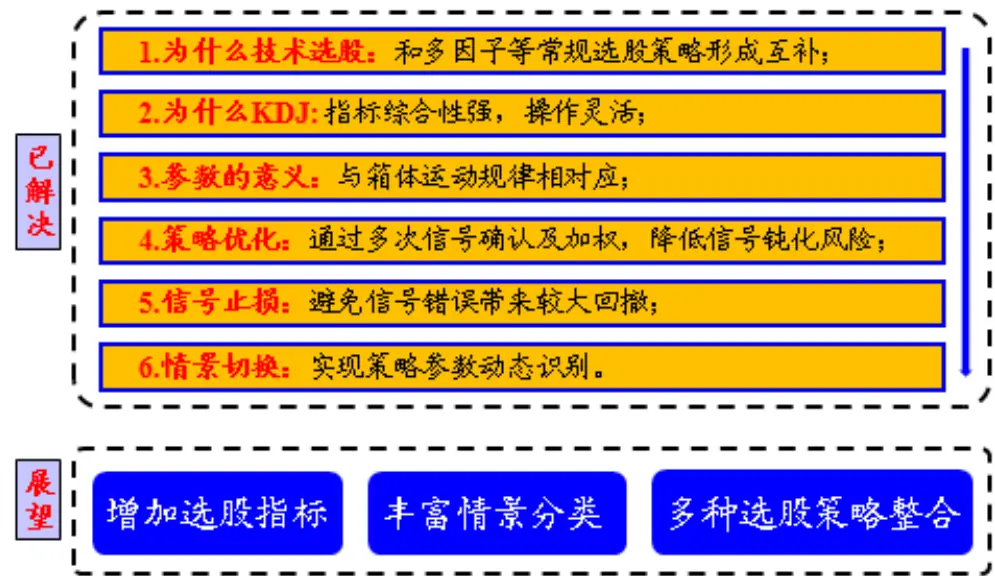

## 风险提示

KDJ指标具有较强的敏感性，本文认为应用时需要区分个股自身的特征及所属情景，至于如何区分个股情景则见仁见智，本文所提倡方法仅供参考，不适合简单套用，实际使用过程应考虑具体模型的特征及风险。

## Table_Res arch 广发金融工程研究小组

罗军： 首席分析师，华南理工大学理学硕士，2010年进入广发证券发展研究中心。

俞文冰： 首席分析师，CFA，上海财经大学统计学硕士，2012年进入广发证券发展研究中心。

叶 涛： 资深分析师，CFA ，上海交通大学管理科学与工程硕士，2012年进入广发证券发展研究中心。

安宁宁： 资深分析师，暨南大学数量经济学硕士，2011年进入广发证券发展研究中心。

胡海涛： 分析师， 华南理工大学理学硕士， 2010年进入广发证券发展研究中心。

夏潇阳： 分析师， 上海交通大学金融工程硕士， 2012年进入广发证券发展研究中心。

汪 鑫： 分析师， 中国科学技术大学金融工程硕士， 2012年进入广发证券发展研究中心。

蓝昭钦： 分析师，中山大学理学硕士， 2010 年进入广发证券发展研究中心。

史庆盛： 研究助理，华南理工大学金融工程硕士， 2011年进入广发证券发展研究中心。

张 超： 研究助理，中山大学理学硕士， 2012年进入广发证券发展研究中心。

## Table_RatingIndustry 广发证券—行业投资评级说明

买入： 预期未来12个月内，股价表现强于大盘10%以上。

持有： 预期未来12个月内，股价相对大盘的变动幅度介于-10%～+10%。

卖出： 预期未来12个月内，股价表现弱于大盘10%以上。

## Table_RatingCompany 广发证券—公司投资评级说明

买入： 预期未来12个月内，股价表现强于大盘15%以上。

谨慎增持： 预期未来12个月内，股价表现强于大盘5%-15%。

持有： 预期未来12个月内，股价相对大盘的变动幅度介于-5%～+5%。

卖出： 预期未来 12 个月内，股价表现弱于大盘 5%以上。

## Table_Ad联系我们

|  | 广州市 | 深圳市 | 北京市 | 上海市 |
| --- | --- | --- | --- | --- |
| 地址 | 广州市天河北路183号大 | 深圳市福田区金田路4018 | 北京市西城区月坛北街2号 | 上海市浦东新区富城路99号 |
|  | 都会广场5楼 | 号安联大厦15楼A座03-04 | 月坛大厦18层 | 震旦大厦18楼 |
| 邮政编码 | 510075 | 518026 | 100045 | 200120 |
| 客服邮箱 | gfyf@gf.com.cn |  |  |  |
| 服务热线 | 020-87555888-8612 |  |  |  |

## Table_Disclaimer 免 责声 明

广发证券股份有限公司具备证券投资咨询业务资格。本报告只发送给广发证券重点客户，不对外公开发布。

本报告所载资料的来源及观点的出处皆被广发证券股份有限公司认为可靠，但广发证券不对其准确性或完整性做出任何保证。报告内容仅供参考，报告中的信息或所表达观点不构成所涉证券买卖的出价或询价。广发证券不对因使用本报告的内容而引致的损失承担任何责任，除非法律法规有明确规定。客户不应以本报告取代其独立判断或仅根据本报告做出决策。

广发证券可发出其它与本报告所载信息不一致及有不同结论的报告。本报告反映研究人员的不同观点、见解及分析方法，并不代表广发证券或其附属机构的立场。报告所载资料、意见及推测仅反映研究人员于发出本报告当日的判断，可随时更改且不予通告。

本报告旨在发送给广发证券的特定客户及其它专业人士。未经广发证券事先书面许可，任何机构或个人不得以任何形式翻版、复制、刊登、转载和引用，否则由此造成的一切不良后果及法律责任由私自翻版、复制、刊登、转载和引用者承担。