# Tabl e_Title 行业事件驱动下的风格轮动

## ——风格轮动系列专题之三

## Table_Sumary • 捕捉风格轮动是风格投资的关键

任何一种风格投资策略都不能永远战胜市场，随着时间的推移，单一风格的数量化策略不能持续取得较高溢价率，因此“风格轮动”日益受到投资者的重视，报告继续延续上一篇专题报告《宏观事件驱动下的风格轮动——风格轮动系列专题二》的思路，将基于事件驱动的风格轮动方法应用到行业内选股当中，不同的是在事件的选取上，除了常用的宏观指标，同时还针对不同的行业挑选了各种行业事件；此外，由于现金流近年来受到市场的强烈关注，在风格因子的选择上主要针对盈利及现金流指标进行比较和应用。

## 宏观及行业事件背后揭示风格轮动规律

常见的风格轮动策略主要分为两大类：第一类是“样本分类法”，通过对样本进行分类统计来挖掘风格轮动规律，例如常见的“日历效应”；此类方法的优点在于逻辑较为清晰，且方法简单便于应用，而缺点在于很难应对不同市场阶段出现的新特征。第二类是“时间序列回归法”，采用宏观指标或者情绪指标等对未来风格指数的走势进行拟合，此类方法的缺点在于参数拟合的结果缺乏清晰直观的逻辑。

报告采用“行业事件驱动法”，该方法挑选特定的宏观及行业事件，并研究相应事件背景下各类风格的轮动规律。此外，报告对行业内各类风格因子的月度效应及季度效应也作了详细统计。

## 构建基于行业事件驱动的风格轮动策略

基于上述的分析结论构建风格因子量化轮动策略，并通过实证分析来验证策略的有效性和实用性。

以 2000年1 月-2010年12月共 132个月作为样本内数据，用于挑选初始Alpha 因子、并统计各类行业事件下风格因子的轮动规律，从中挑选了7类宏观事件以及每个行业不同的行业事件；2011 年之后作为样本外数据，根据样本内统计的规律构建风格轮动策略并进行实证分析。结果显示：样本内22 个行业均获得正的超额收益，平均年化累计超额约15%；全样本多因子策略样本内每年均有正的超额收益，样本外股指期货对冲方案波动较大，前两年效果一般，而对空对冲策略则更为稳定，前两年均有 14%左右的超额收益，今年上半年则仅有2.5%。

## 最新风格推荐

最新公布的人民币存款准备金利率创半年新高，建议关注农林牧渔等行业内现金流相关风格因子；

采掘、家电、信息设备行业关注现金流指标；

电力设备行业关注盈利指标。

图1：机械行业：事件驱动下的风格轮动
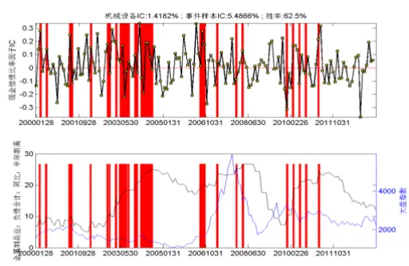

图2：行业内对冲策略累计收益比较
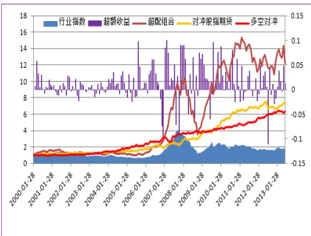

表 1：行业内对冲策略结果比较

| 策略名称 | 期货对冲 | 多空对冲 |
| --- | --- | --- |
| 信息比 | 1.15 | 1.29 |
| 年化收益率 | 0.16 | 0.16 |
| 累计最大回撤 | 17.7% | 18.0% |
| 月度胜率 | 0.6% | 0.6% |
| 11年累计收益 | 4.0% | 13.9% |
| 12年累计收益 | -1.4% | 14.0% |
| 13年累计收益 | 12.1% | 2.5% |

分析师： 史庆盛 S0260513070004

020-87555888-8618

sqs@gf.com.cn

## Table_Report 相关研究：

宏观事件驱动下的风格轮动 2013-03-20
——因子风格轮动系列专题
之二

## 一、前言

任何一种风格投资策略都不能永远战胜市场，随着时间的推移，单一风格的数量化策略不能持续取得较高溢价率，因此“风格轮动”日益受到投资者的重视，在上一篇专题报告《宏观事件驱动下的风格轮动——风格轮动系列专题二》中，我们提出了一种新的风格轮动策略，即分析各种宏观事件背后的风格因子有效性强弱规律，并基于此来设计相应的风格轮动规律，该方法与大多数尝试对每一期的风格方向进行判断的方法不同的是，只在历史上特定的有效事件背景下考虑风格的轮换，因此具有更高的胜率，其逻辑性也得到了许多同行的认可。

据此，我们继续延续该思路，将基于事件驱动的风格轮动方法应用到行业内选股当中，不同的是在事件的选取上，除了常用的宏观指标，同时还针对不同的行业挑选了各种行业事件；此外，由于现金流近年来受到市场的强烈关注，在风格因子的选择上主要针对盈利及现金流指标进行比较和应用。

## 1.1 从 A股估值说起

关于现金流指标选股的思路来自对A股估值问题的探讨和思考。下图显示，A股市场自08年以来虽然整体盈利呈增长趋势，但大盘却“跌跌不休”，因此从盈利的角度来构造A股整体估值指标就必然造成PE持续偏离中枢并不断地创新低，为何？大盘跌“错”了吗？针对这个问题，越来越多投资者开始尝试从其他角度来看待市场的估值问题，其中比较具代表性和说服力的观点认为：大盘具有下跌的充分理由，因为自08年以来企业整体缺乏自由现金流，而企业的现金流比盈利水平更加能够体现企业未来价值！

图3：从A股估值问题得到的启示
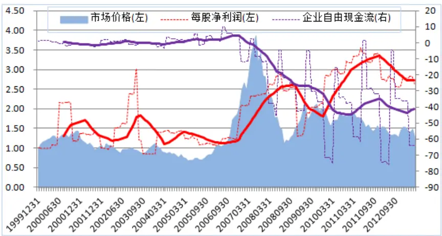
数据来源：广发证券发展研究中心,wind

实际上，常见的估值方法除了PE和现金估值，还有PS,PB等等，每一类估值方法所适用的行业都略有区别，比如PE比较适用于盈利相对稳定的行业；现金流估值则适用于账面价值比较高而且稳定的行业，不适用于成长阶段的小股票；PS和PB也有各自适用的行业；

表2：.常见估值方法比较

| 适用 |  | 不适用 |
| --- | --- | --- |
| PE | 适用盈利稳定的弱周期行业，如公用事 业等 | 周期行业，如制造业、服务业； 亏损公司；房地产等项目性较强的 |
|  |  | 公司；银行； 多年亏损或处于成长初期的小 |
| PCF | 拥有大量固定资产并且账面价值相对 较为稳定的强周期行业，如公路、桥梁上 市公司等; 由于营收相对稳定，波动性小，适用周 | 型公司。 须考虑公司成本控制能力下降 |
| PS | 期性行业（PE波动较大） | 问题；营收规模较大的公司PS较低 |
| PB | 适用强周期行业，银行、保险和其他流 动资产比例高的公司；ST、PT绩差及重 组型公司 | 固定资产较少的，商誉或智慧财 产权较多的服务行业 |

数据来源：广发证券发展研究中心

如果不区分行业板块，直接计算A股的整体估值，我们发现2010年以来PE下降的相对幅度是最大的，而PS和 PB也基本一致截止六月底都创了历史新低，只有PCF回到了相对正常的历史水平，因此基于经营现金流的估值方法“似乎”更加适合A股市场。

图4：2010年以来各种估值指标走势比较
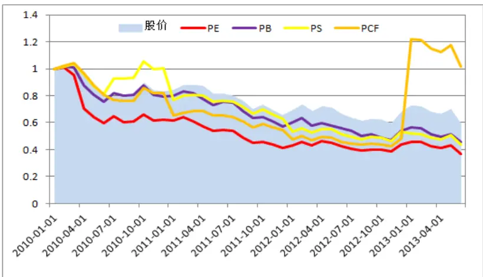
数据来源：广发证券发展研究中心,wind

到这里我们一直都在谈论A股的估值水平到底是否合理以及那些估值方法更加适用当前的市场，但实际上这个并不是我们的目的，我们所关注的重点是，什么样的指标更好的应用于选股上，实际上如果脱离了个股来谈市场的估值是没有太大意义的，所以针对盈利和现金流这两类指标，接下来我们从个股层面上来比较他们的有效性。

图5：市盈率与市现率选股效果比较

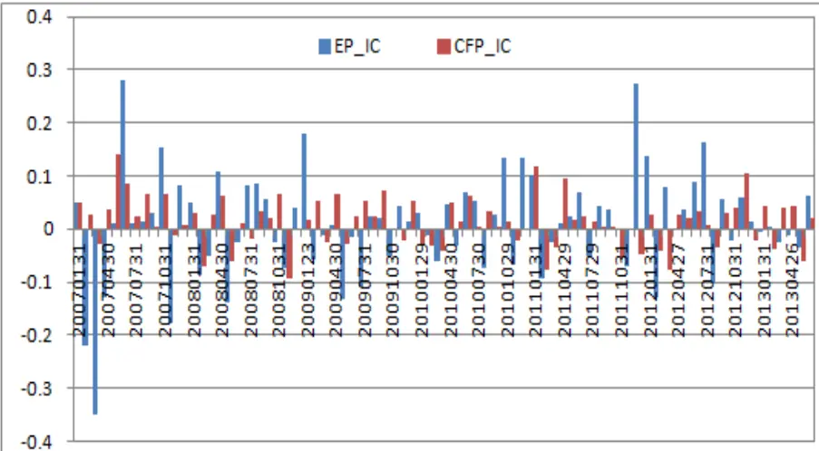
数据来源：广发证券发展研究中心,wind

从个股层面上，哪一种估值方式更加适用于选股？我们对比了PE和PCF两种方法，发现虽然长期来看大家还是关注PE更多一些，PE的历史平均 IC也的确更高 ，但如果从胜率的角度，无论是长期还是短期，现金流估值胜率都更高，尤其是近一年表现突出，平均IC也比PE更高。

也就是说，无论是从市场的整体估值还是从个股的选择上，现金流指标都越来越有效，所以下文将在盈利指标的基础上，尝试基于现金流指标来构造一种选股策略。

表3.PE、PCF指标选股效果比较

|  | EP_IC | CFP_IC | EP_IC 胜率 | CFP_IC 胜率 |
| --- | --- | --- | --- | --- |
| 2000年以来 | 1.72% | 2.16% | 54.04% | 67.70% |
| 2010年以来 | 2.52% | 1.01% | 58.97% | 66.67% |
| 近1年 | 1.32% | 1.47% | 50.00% | 66.67% |

数据来源：广发证券发展研究中心,wind

## 1.2 盈利 or 现金

上述提到，长期来看盈利类型的指标选股效果较好，这说明长期来看A股投资者以追逐企业利润最大化作为目标；而近一年来现金流相关指标效果则更好，意味着投资者越来越重视企业现金流状况，鉴于此下文我们将重点围绕这两类指标进行行业内选股策略构建。

表4.PE、PCF指标选股效果比较

| 盈利指标 | PE，EPS，每股税前利润，每股营业收入，毛利率，销售净利率。 |
| --- | --- |
| 现金指标 | PCF，自由现金估值，每股经营现金，经营现金占比，投资产生现金 净额占比，经营现金净流量/营业收入，自由现金，现金偿债率，经营现金 /流动负债，经营现金增长，现金流入流出比 |

数据来源：广发证券发展研究中心

一般来说，企业的盈利水平越高则越好，但现金类型的指标则不一定，以企业自有现金流指标为例，当自由现金流量为正，则意味着：公司融资压力小、具发放现金股利、还旧债的能力；当这些特征并不一定都是正面的，因为它们隐含着公司扩充过慢的缺点；自由现金流量并非越高越好，自由现金流量过高表明再投资率较低，盈余成长率较低。

当自由现金流量为负，则意味着：公司再投资率较高，盈余成长率较高，隐含公司扩充过快；公司融资压力大，取得现金最重要，须小心地雷股；借债困难，财务创新可能较大，可能发可转换债规避财务负担；在超额报酬率呈现正数时，负的自由现金流量才具有说服力，因此在进行行业内现金流选股时，我们不会严格限定指标的方向。

此外，行业内基本面选股指标具有较大的不稳定性，主要体现在以下两个方面。

## 1.2.1 按观察周期统计

按照观察周期的长短划分，各类基本面指标的有效性的长期及短期有效性存在较大差异：长期来看盈利类型更为有效，但短期内则现金流指标更好。

图6：从A股估值问题得到的启示
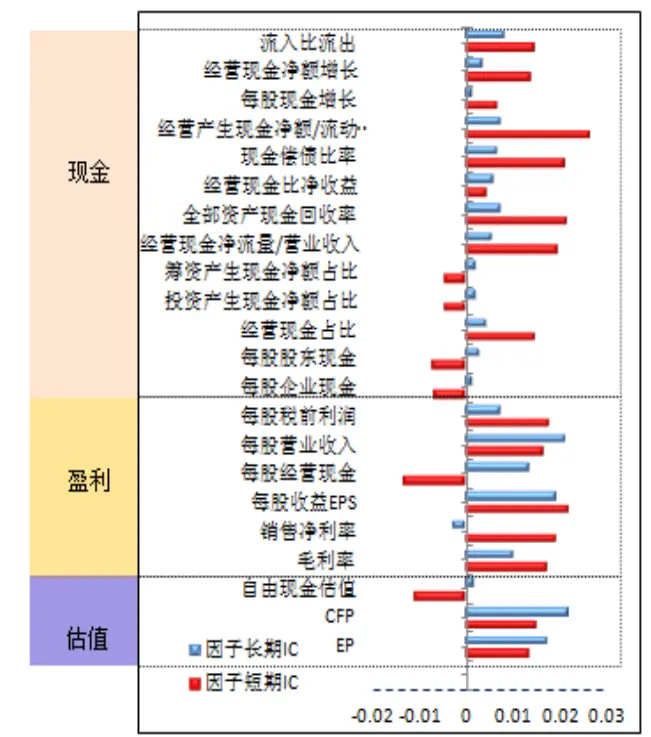
数据来源：广发证券发展研究中心,wind

## 1.2.2按行业统计

上面从时间的角度发现各指标的有效性存在较大差异；此外，各类指标在不同行业之间差异也相当明显，比如钢铁行业重视盈利指标，现金类的指标则基本失效；而在家电行业中则截然相反，企业对现金流的追逐甚于盈利。

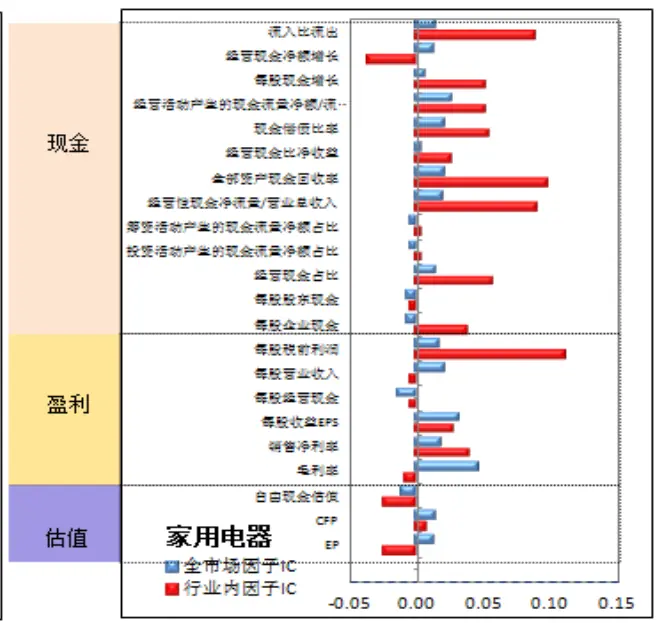

图7：不同行业风格因子效果对比

| 现金 | 流入比流出 经营现金净额增长 每股现金增长 经号活动产生的现金通量净额/流 现金俗债比率 经营现金比净收益 全部疑产现金回收车 经营性现金净流量/营业单收入 等览活动户坐的现金流量净额占比 |  |  |  | 而入比流出 经号现金净额增长 每股现金增长 |  |  |  |
| --- | --- | --- | --- | --- | --- | --- | --- | --- |
|  |  |  |  |  |  | 经号活动户生的现金流量净额/源： 现金俗债比率 经营现金比净收益 |  |  |
|  |  |  |  |  |  | 现金 | 全部医户现金回收率 |  |
|  |  |  |  |  |  |  | 经营性现金净流量/营业单收入 |  |
|  |  |  |  |  |  | 等质活动产坐的现金流量净额占比 投暨活动产生的现金源量净级占比 |  |  |
|  |  |  |  |  |  | 每股收益EPS |  | 盈利 |
| 投资活动户坐的现金流量净额占比 经营现金占比 | 经管现金占比 |  |  |  |  |  |  |  |
|  | 每股股东现金 |  |  |  |  |  |  |  |
| 每股股东现金 |  |  |  |  |  |  |  |  |
| 每股企业现金 | 年股企业现金 |  |  |  |  |  |  |  |
| 每股税前利润 | 每股税前利润 |  |  |  |  |  |  |  |
| 年股营业收入 每股组管现金 |  | 每股营业收入 每股经营现金 |  |  |  |  |  |  |
|  | 销售净利率 |  | 年股收益EPS 销售净利率 |  |  |  |  |  |
|  | 毛利率 |  |  |  |  |  |  |  |
|  |  |  | 乓利率 |  |  |  |  |  |
|  | 白由现金估低 |  | 白由现金估低 |  |  |  |  |  |
| 估值 | CFP 黑色金属 |  |  |  |  |  |  |  |
|  | EP |  |  |  |  |  |  |  |
|  | 行业内因子IC | -0.150.100.050.000.050.100.150.20 | 估值 |  |  |  |  |  |
|  |  |  | 全市场因于tC |  |  |  |  |  |
|  |  |  | 家用电器 | CFP EP |  |  |  |  |
|  | 全市场因乎tC |  | 行业内因子IC |  |  |  |  |  |

数据来源：广发证券发展研究中心,wind

由图7可知：

(1) 在进行行业内选股时，不同行业应该采用各自不同的风格因子；

(2) 同一个行业内选股时，应考虑风格因子的轮动。

表3.行业内选股指标有效性比较

| 因子类型 | 适用行业 （长期） | 适用行业 （短期） |
| --- | --- | --- |
| 盈利 | 采掘，钢铁，有色，建材，信息设备， 纺织，医药，交运，商贸， | 钢铁，建材，交运，房地产 |
| 现金 | 电子，家电，交运设备，纺织服装， 公用事业，餐饮旅游，信息设备， | 建材，交运设备，家电，纺织服 装，商贸， |

数据来源：广发证券发展研究中心

## 二、风格轮动中的事件效应分析

如何进行行业内风格轮动呢？不考虑风格轮动的多因子模型实际上相当于只考虑了个股微观层面的风格特征，考虑到每个行业都会不同程度受到某些宏观或行业事件的影响，因此在进行行业内风格选择时，应该把宏观及行业的影响因素考虑进来，体现到行业内风格轮动上面，从而构造自上而下的行业内选股策略。

图8：考虑宏观及行业事件影响的行业内选股策略
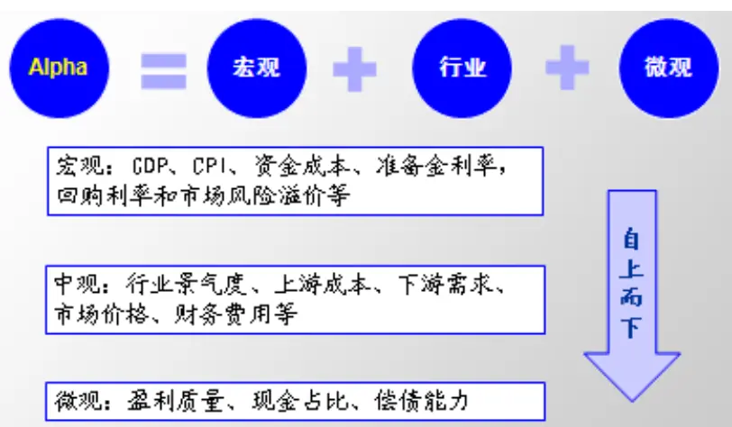
数据来源：广发证券发展研究中心

常见的风格轮动策略认为，通过构建合理的模型可以实现对风格轮动每一期进行准确的判断。按策略方法不同主要可分为两大类：

## (1) 样本分类法

此类方法通常根据时间样本的特征进行分类，统计各类样本中风格轮动的规律。常见的方法如风格的“日历效应”以及著名的“投资时钟”等。此类方法的优点在于逻辑较为清晰，且方法简单便于应用，而缺点在于对样本的分类过于“固化”，策略很难应对不同市场阶段出现的新特征。

## (2) 时间序列回归

此类方法运用回归的方法，采用宏观指标或者情绪指标等对未来风格指数的走势进行拟合，此类方法的缺点在于参数拟合的结果缺乏清晰直观的逻辑，且与第一类方法类似，尝试采用通一的方法对每一期的风格轮动进行判断。

借鉴并区别于上述两类方法，报告提出另外一种研究风格轮动的思路，即：

## (3) 行业事件驱动法

新思路首先认为每一种风格的轮动都是由多种因素共同造成的，而且任何一种分析方法都无法准确地把握每一次风格的转变，风格轮动的规律只在某些特定市场特征或事件背景下才更加显著，因此本文将挑选特定行业及宏观指标(后面统称行业指标)，并研究历史上这些指标在某些特殊情形下面各类风格的轮动规律。

下面首先对常见的宏观指标进行筛选。

## 2.1 行业事件定义及选取

报告选取如下8大类行业（宏观）指标，并在此基础上衍生出不同类型的行业事件，针对每种不同类型的事件研究风格轮动的规律。其中，事件1-7为宏观指标，对各类行业均有可能带来影响，而行业事件则每个行业各不相同，特定的行业之会受到其自身行业或上下游行业事件的影响，我们从windEDB数据库提取了大量的宏观数据以及针对每一个行业不同的行业数据，汇总如下：

表 5：宏观及行业指标汇总

| 编号 | 指标类型 包含指标 |  |
| --- | --- | --- |
| 1 | 银行与货币 | 银行同业拆借利率、社会融资总量、存款准备金率 |
| 2 | 利率与汇率 | 风险溢价、国债利率 |
| 3 | 国民经济核算 | GDP 同比 |
| 4 | 工业指标 | 工业增加值同比、发电量同比、工业增加值高于预测值幅度 |
| 5 | 价格指标 | CPI、PPI、CPI及预测值 |
| 6 | 货币供应 | M0、M1、M2 |
| 7 | 市场情绪 | 宏观经济预警指数、企业家信心指数、A股帐户新增开户数 |
| 8 | 行业指标 | 库存、价格、上游成本、下游需求、资金成本 |

数据来源：广发证券发展研究中心

“行业事件分析法”认为各种行业及宏观指标只有在处于某些特定情景下，才能够揭示当时风格轮动的某种规律，因此下面将上述8类共140个宏观及行业指标进行细分，每一类宏观指标根据其当前位置可再分为6种情形，分别为：

(1) 指标环比上升；

(2) 指标环比下降；

(3) 指标处于历史高位(高于半年均值)；

(4) 指标处于历史低位(低于半年均值)；

(5) 指标创新高(高于半年最高值)；

(6) 指标创新低(低于半年最低值)。

从而得到行业指标所衍生出来共840种情景，我们称之为行业事件。此外，我们对风格因子的日历效应进行分析，包括月度效应以及季度效应，因此全部的事件情景为180+16=856种情景。

需要特别指出的是，对于同类事件，我们将重点跟踪其中对风格轮动规律的揭示意义最显著的一类，避免各类相似事件重叠发生的情况。

此外，宏观及行业指标数据均采自Wind数据库EDB终端，各类指标数据的获取以其实际发布日期为准。

上述是宏观及行业事件的归纳，下面为我们所关注的各类风格指标：

表 6：风格因子汇总

| 估值因子 | 1 | EP |
| --- | --- | --- |
|  | 2 | CFP |
|  | 3 | 自由现金估值 |
| 盈利因子 | 4 | 毛利率 |
|  | 5 | 销售净利率 |
|  | 6 | 每股收益EPS |
|  | 7 | 每股经营现金 |
|  | 8 | 每股营业收入 |

识别风险，发现价值

|  | 9 | 每股税前利润 |
| --- | --- | --- |
| 现金因子 | 10 | 每股企业现金 |
|  | 11 | 每股股东现金 |
|  | 12 | 经营现金占比 |
|  | 13 | 投资活动产生的现金流量净额占比 |
|  | 14 | 筹资活动产生的现金流量净额占比 |
|  | 15 | 经营性现金净流量/营业总收入 |
|  | 16 | 全部资产现金回收率 |
|  | 17 | 经营现金比净收益 |
|  | 18 | 现金偿债比率 |
|  | 19 | 经营活动产生的现金流量净额/流动负债 |
|  | 20 | 每股现金增长 |
|  | 21 | 经营现金净额增长 |
|  | 22 | 流入比流出 |

数据来源：广发证券发展研究中心

在风格轮动策略的初始阶段，模型将首先根据各类风格因子的历史表现确定一组“有效风格因子”，这组风格因子将作为风格轮动组合的主要驱动来源，而后每一期该“风格因子组合”将动态地调整，调整的依据是：随着各类行业事件的发生，某些风格因子可能会被纳入，而某些风格因子可能会被剔除。纳入及剔除的情况取决于各类宏观事件下，风格轮动的规律。

## 2.2 行业事件下风格轮动规律

风格因子的有效性采用IC1指标进行度量。而宏观事件能否解释风格轮动的规律则通过以下指标进行度量：

(1) IC增长倍数 $\mathbf{(N_{1})}\colon$ 行业事件样本风格因子平均 $IC_{T}$ ，相对全部样本风格因子平均 $IC_{0}$ 增长倍数；

(2) 有效概率 $\mathbf{(P_{1})}\mathbf{:}$ 行业事件样本风格因子平均 $IC_{T},$ 相对全部样本风格因子平均 $IC_{0}{\mathrm{:}}$ 增长的概率；

(3) IC降低倍数 $.(\mathbf{N}_{2})\colon$ ：行业事件样本风格因子平均 $IC_{T},$ ，相对全部样本风格因子平均 $IC_{0}^{\phantom{\dagger}}^{\dagger\dagger\dagger}$ 长倍数；

(4) 失效概率 $(\mathbf{P}_{2})$ ：全部样本风格因子平均 $IC_{0}.$ ，相对行业事件样本风格因子平均 $IC_{\mathrm{T}}$ 增长的概率。

为了刻画特定行业事件中风格轮动规律，我们设计了如下规则：

行业事件下风格因子的纳入规则： $\mathrm{N}_{1}{>}2$ 且 $P_{1}{>}55\%$

行业事件中风格因子的剔除规则： $_{\mathrm{N}_{2}>2}$ 或 $P_{2}{>}55\%$

此外，当某一期纳入的风格因子数量过多时（超过8个），只保留被纳入次数超过一次的风格因子组成有效的风格因子组合。

行业内风格轮动原理见图3所示。
图9：‘钢铁行业：银行间同业拆借利率:3个月同比：半年新高'' 中,因子经营现金比净收益表现
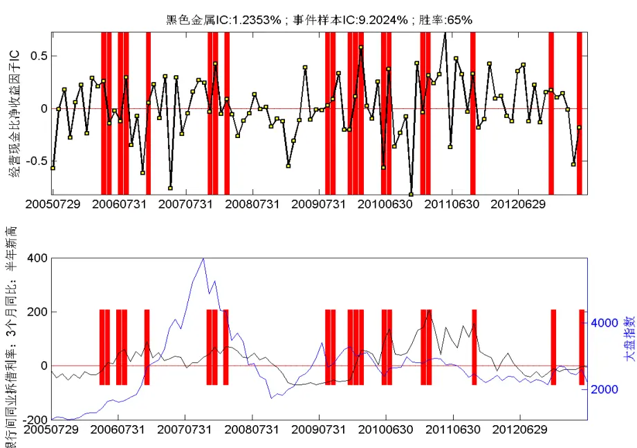
数据来源：广发证券发展研究中心,wind

由图9所示，钢铁行业中自2005年以来，“经营现金比净收益”因子的平均IC仅有1.2%，这意味着该因子在钢铁行业内选股中无效；如果考虑历史上发生“银行间同业拆借利率创办年新高”的事件背景下，则该因字的平均IC为 9.2%，提高了4.5，事件样本下的IC相对全样本IC胜率为65%，根据上述风格因子纳入及剔除规则，该事件驱动下风格因子将采取轮动。

下面，我们重点对一些宏观及行业事件下，风格因子的轮动规律进行展示，并总结该类宏观事件对相应风格轮动的指导意义。

表7：宏观事件中风格轮动规律

| 事件类型 | 影响 | 适用行业 |
| --- | --- | --- |
| GDP：当季同比：半年新高 | 经济过热,现金保值 | 农林牧渔、轻工制造、商业贸易 等11个行业 |
| A股账户新增开户数：合计：半年新 低 | 情绪过度乐观,现金保值 | 轻工制造、房地产、农林牧渔等 12个行业 |
| 银行间同业拆借利率：3个月同比：半 年新高 | 资金成本高 | 农林牧渔、化工、采掘、钢铁等10 个行业 |
| 人民币存款准备金率:同比：半年新高 | 资金紧缺 | 农林牧渔、食品饮料等10个行业 |
| 社会融资总量：当月值同比：半年新低 | 信贷紧张，资金成本高，需自 由现金 | 交运、钢铁、采掘等12个行业 |
| CPI：当月同比：半年新高 | 高通胀，现金贬值，加大投资 | 轻工、有色等8个行业 |
| 中票利差(三年)：半年新高 | 风险溢价高，资金成本上升， 现金价值更高 | 钢铁、有色、建材等7个行业 |

数据来源：广发证券发展研究中心

图10：‘农林牧渔：GDP：当季同比：半年新高’ 中,因子现金负债比表现
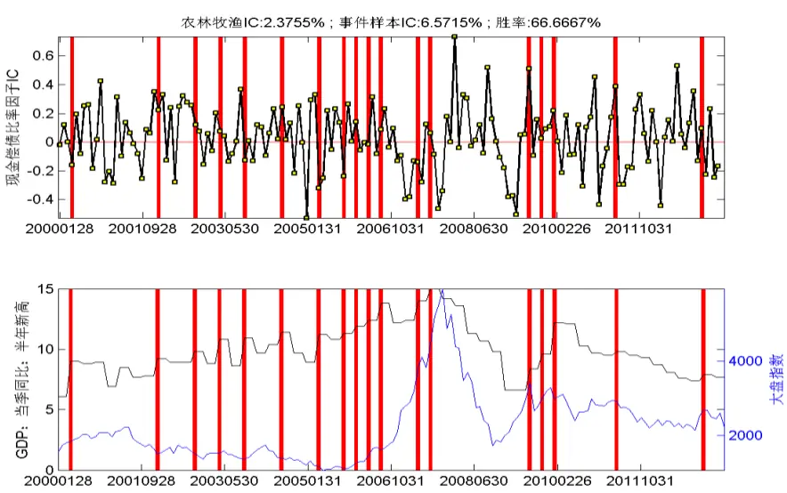
数据来源：广发证券发展研究中心,wind

除了上述宏观事件，每个行业还会受到各自行业或相关上下游行业事件的影响，下面逐一列出各行业受行业事件影响导致行业内风格轮动的规律。

其中，“+EP0.82”表示在农林牧渔行业内EP因子的全样本有效方向为正，即EP越高越好；且时间样本内IC相对全样本IC绝对值提高概率为82%，下文同理。

表 8：农林牧渔行业内事件驱动下的风格轮动

| 事件类型 | 结果 | 纳入 | 剔除 |
| --- | --- | --- | --- |
| 农产品批发价格总指数：同比：半年新高 | 成本高,前期需资金囤货 | +每股经营现金0.625,经营现金占比0.58333,+经营现金净流量比营业总收入0.58333,+全部资产现金回收率0.58333,+经营现金比净收益0.66667,+现金偿债比率0.625,+经营产生现金净额比流动负债0.625,+流入比流出 0.66667 | -销售净利率0.625,-投资产生现金净额占比0.625,-筹资产生现金净额占比 0.625 |
| 农林牧渔业总产值：全国累计同比：半年新高 | 过渡扩张,需留存资金 | +EP0.81818,+自由现金估值0.63636,+每股企业现金0.63636,+每股股东现金0.63636,+投资产生现金净额占比0.72727,+筹资产生现金净额占比0.72727,+流入比流出 0.63636 | +每股经营现金0.63636,+经营现金净流量比营业总收入0.72727 |
| 港口消耗：进口大豆：月：半年新高 | 需资金低价囤货， | +CFP0.6,+全部资产现金回收率 0.7,+经营现金比净收益0.8,+现金偿债比率 | +每股营业收入0.6,-每股税前利润 0.7,-每股企业现金 0.7,+ |

识别风险，发现价值

| 0.7,+经营产生现金净额比流动负债0.7,- 经营现金净额增长0.6 | 每股股东现金0.6,-经营现金 占比 0.6,-经营现金净流量比 营业总收入 0.9, |
| --- | --- |

数据来源：广发证券发展研究中心,wind

图11：‘农林牧渔：农产品批发价格总指数:同比：半年新高’ 中,因子经营现金比净收益表现
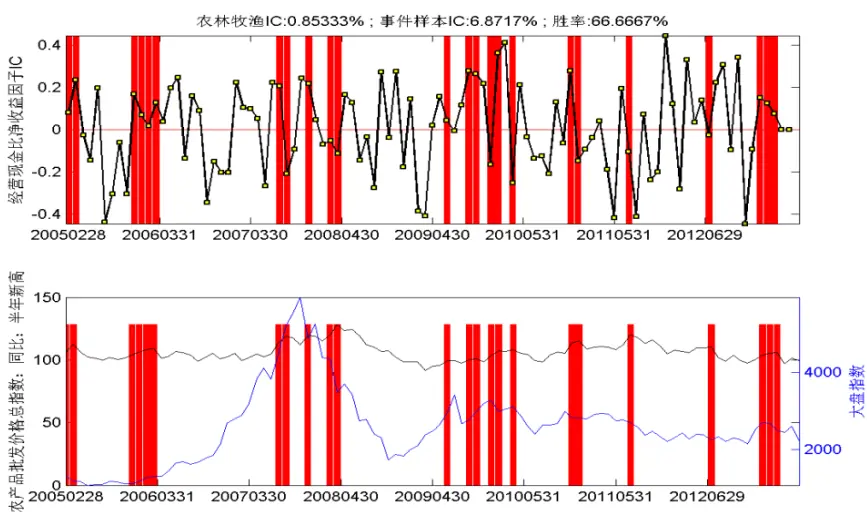
数据来源：广发证券发展研究中心,wind

表 9：采掘行业内事件驱动下的风格轮动

| 事件类型 | 结果 | 纳入 | 剔除 |
| --- | --- | --- | --- |
| 秦皇岛港:平仓价:动力末煤(Q5800):山西产：半年新高 | 有利于采掘,需扩大经营,放大杠杆 | 每股收益 EPS0.90909,+每股经营现金0.63636,+每股营业收入0.72727,+筹资产生现金净额占比 0.72727 | ,-毛利率0.72727,+每股企业现金0.72727,-每股股东现金 0.63636 |
| 中国煤炭市场景气指数：半年新高 | 景气度高,重在盈利,可适当放杠杆,现金价值低 |  |  |
| 中国煤炭市场景气指数：半年新低 | 现金价值高 | -销售净利率 0.6,+每股税前利润0.6,+每股企业现金 0.6,+现金偿债比率0.6,+经营产生现金净额比流动负债 0.6,+每股现金增长 0.6,+流入比流出 0.6 | +毛利率0.6,+每股收益EPS0.6,-每股经营现金0.6,+投资产生现金净额占比 0.6,+筹资产生现金净额占比 0.6,+经营现金比净收益 0.4 |
| 产量：发电量：北京：当月同比：半年新高 | 有利于采掘,需扩大经营,放大杠杆 | +EP0.5625,+CFP0.625,+毛利率0.5625,+每股收益 EPS0.59375,+每股营业收入 0.5625 |  |
| 产量:十种有色金属：累计同比：半年新高 |  | +自由现金估值 0.70588,+毛利率0.64706,,+每股企业现金0.64706,+经营现金占比0.61765,+投资产生现金 | +每股经营现金 0.61765,-每股股东现金0.64706 |

识别风险，发现价值

|  |  | 净额占比 0.79412,+筹资产生现金净 额占比 0.79412,+流入比流出 0.64706 |  |
| --- | --- | --- | --- |
| 产量：水泥：当月同比：半年新 高 | 产能过剩,需留存资金 | +自由现金估值0.6087,+投资产生 现金净额占比 0.65217,+筹资产生现 金净额占比0.65217,+现金偿债比率 0.69565,+经营产生现金净额比流动 负债0.56522 | -每股股东现金0.6087 |

数据来源：广发证券发展研究中心,wind

图12：‘采掘：秦皇岛港:平仓价:动力末煤：半年新高’ 中,因子EPS表现
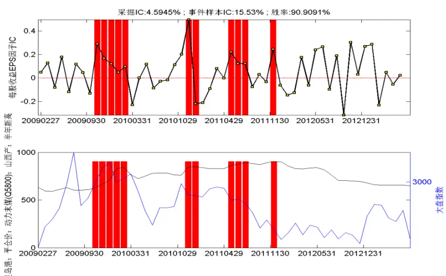
数据来源：广发证券发展研究中心,wind

表 10：化工行业内事件驱动下的风格轮动

|  | 结果 | 纳入 | 剔除 |
| --- | --- | --- | --- |
| 石油和天然气开采业：利润总额：累计同比：半年新高 | 现金价值低 | +EP0.64286,+CFP0.64286,+毛利率0.57143,+每股收益 EPS0.67857,+每股营业收入 0.71429,+经营现金比净收益 0.57143 | +自由现金估值 0.60714,-投资产生现金净额占比0.64286,-筹资产生现金净额占比 0.64286,-经营现金净流量比营业总收入0.64286 |

数据来源：广发证券发展研究中心,wind

图13：‘化工：石油和天然气开采业:利润累计同比：半年新高’ 中,因子每股营业收 入表现
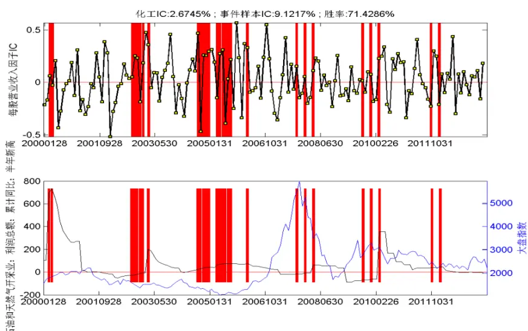
数据来源：广发证券发展研究中心

表 11：黑色金属行业内事件驱动下的风格轮动

|  | 结果 | 纳入 | 剔除 |
| --- | --- | --- | --- |
| 现货价(旬):螺纹钢：全国：比上期下降 |  | +销售净利率0.57143,+每股收益EPS0.58929,+每股营业收入0.55357,+每股税前利润 0.625,+经营现金占比 0.625,+全部资产现金回收率 0.58929 | 无 |
| 产量：粗钢：当月同比：半年新低 | 产能低,需要提高资金利用率 | +自由现金估值 0.64286, +每股企业现金0.60714,+经营现金净流量比营业总收入 0.60714,+现金偿债比率0.60714,+经营产生现金净额比流动负债0.64286 | 无 |
| 黑色金属矿采选业：财务费用：累计同比：半年新高 |  | +自由现金估值0.6087,-每股股东现金0.56522,-经营现金比净收益0.6087 | 无 |

数据来源：广发证券发展研究中心,wind

图14：‘黑色金属：产量:粗钢:当月同比：半年新低’ 中,因子自由现金估值表现

黑色金属IC:1.1771%；事件样本IC:10.4229%；胜率:64.2857%
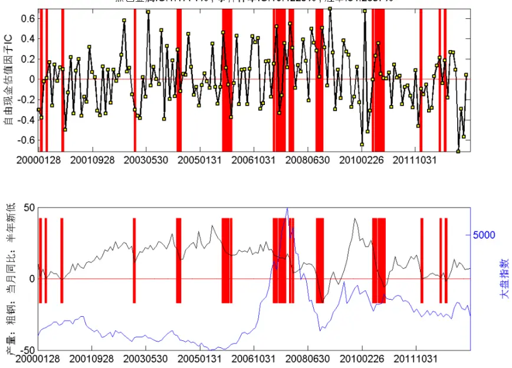
数据来源：广发证券发展研究中心

表 12：有色行业内事件驱动下的风格轮动

|  | 结果 | 纳入 | 剔除 |
| --- | --- | --- | --- |
| 中国煤炭市场景气指数：半年新低 |  | -每股收益 EPS0.8,-投资产生现金净额占比0.6,-筹资产生现金净额占比0.6 | -EP0.6,+销售净利率0.6,+每股企业现金 0.8,-经营现金占比 0.6,+经营现金净流量比营业总收入0.8 |

数据来源：广发证券发展研究中心,wind

表 13：建筑建材行业内事件驱动下的风格轮动

|  | 结果 | 纳入 | 剔除 |
| --- | --- | --- | --- |
| 非金属矿物制品业：财务费用：累计同比：半年新高 |  | +EP0.56667,+CFP0.73333,+每股收益EPS0.56667,+每股经营现金 0.56667 | -流入比流出 0.6 |
| 非金属矿物制品业：流动资产平均余额：同比：半年新高 | 流动资产过剩,资金价值下降 | +EP0.6,-经营现金净流量比营业总收入0.66667,-经营产生现金净额比流动负债0.66667,-流入比流出 0.6 | +自由现金估值 0.6 |
| 金属制品业：财务费用：累计同比：半年新低 |  | --经营现金净流量比营业总收入0.55172,-全部资产现金回收率0.68966,-现金偿债比率 0.55172,-经营产生现金净额比流动负债0.65517,-流入比流出 0.65517 | +每股经营现金 0.65517,+每股股东现金 0.65517,+每股现金增长 0.62069,+经营现金净额增长0.72414 |
| 待开发土地面积：累计同比：半年新低 | 下游需求低,不需留存现金,存货周转不需太快 | -每股税前利润 0.72727,+投资产生现金净额占比0.72727,-全部资产现金回收率0.63636,-流入比流出 0.63636 | +销售净利率 0.81818,+经营现金净额增长 0.81818 |

数据来源：广发证券发展研究中心,wind
识别风险，发现价值

图15：‘建筑建材：待开发土地面积:累计同比：半年新低’中,因子流入比流出表现
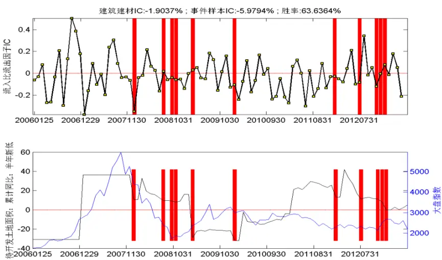
数据来源：广发证券发展研究中心

表 14：机械设备行业内事件驱动下的风格轮动

|  | 结果 | 纳入 | 剔除 |
| --- | --- | --- | --- |
| 出口价格指数：工程机械行业：同比：半年新低 | 出口低迷，现金流入下降，需更多自由现金流 | +自由现金估值0.625,+每股企业现金 0.6875 | +每股营业收入0.6875 |
| 金属制品业：财务费用：累计同比：半年新高 | 现金成本高，许更多现金 | +每股经营现金0.65517,+每股营业收入0.58621,+每股税前利润0.58621,+每股企业现金 0.65517,+现金偿债比率 0.55172 |  |
| 金属制品业：负债合计：同比：半年新高 | 负债过重，需现金还债 | +每股税前利润0.59375,+每股股东现金0.71875,+全部资产现金回收率0.59375,+现金偿债比率0.625 |  |

数据来源：广发证券发展研究中心,wind

图16：‘机械设备：金属制品业:负债合计:同比：半年新高’ 中,现金偿债比率表现
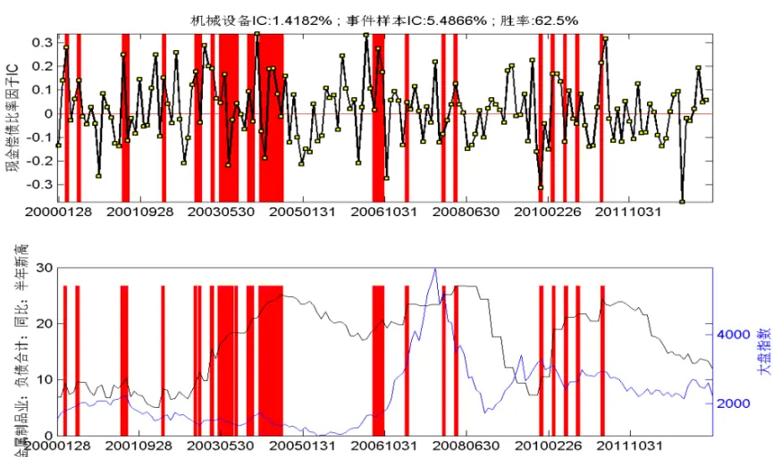
数据来源：广发证券发展研究中心
识别风险，发现价值

表 15：电子行业内事件驱动下的风格轮动

|  | 结果 | 纳入 | 剔除 |
| --- | --- | --- | --- |
| 产量：电子计算机整机：当月同比：半年新高 |  | +EP0.71429,+每股税前利润0.57143,+全部资产现金回收率0.71429,+现金偿债比率 0.64286,+经营产生现金净额比流动负债0.64286,+每股现金增长 0.71429,+经营现金净额增长 0.64286 | -投资产生现金净额占比0.64286,-筹资产生现金净额占比 0.64286 |
| 计算机电子设备：利润总额：累计同比：半年新低 |  | +经营现金占比 0.61538,+经营产生现金净额比流动负债0.65385 | +每股收益 EPS0.61538,+每股经营现金 0.65385,+每股营业收入0.73077,+每股股东现金0.61538 |

数据来源：广发证券发展研究中心,wind

图17：‘电子：产量:电子计算机整机:当月同比：半年新高’ 中,因子全部资产现金回收率表现
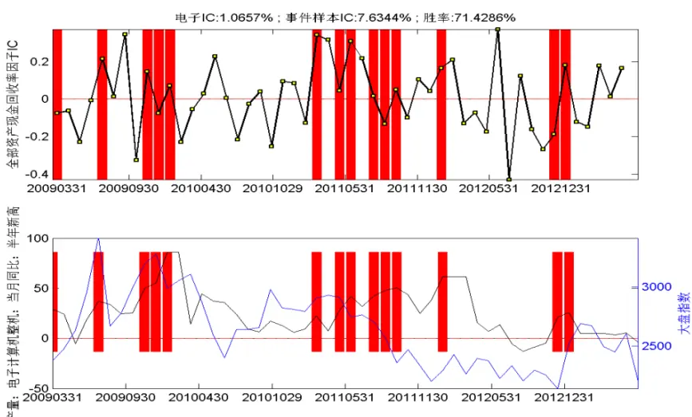
数据来源：广发证券发展研究中心

表 16：交运设备行业内事件驱动下的风格轮动

|  | 结果 | 纳入 | 剔除 |
| --- | --- | --- | --- |
| 货运量总计：当月同比：半年新高 | 行业顶点，留存自由现金 | +自由现金估值0.58333,+每股企业现金 0.58333 | +EP0.75,+每股营业收入0.58333,+经营现金占比0.75,+经营现金比净收益0.66667,+经营产生现金净额比流动负债0.625 |

数据来源：广发证券发展研究中心,wind

表 17：信息设备行业内事件驱动下的风格轮动

|  | 结果 | 纳入 | 剔除 |
| --- | --- | --- | --- |
| 中关村电子信息产品指数：月景气指数：半年新高 | 行业景气，放大杠杆做规模，不需留存过多现金 | +CFP0.57143,+每股收益EPS0.71429,+每股经营现金0.71429,+每股营业收入0.71429,-经营现金净流量比营业总收入0.71429,-全部资产现金回收率0.57143,-现金偿债比率 0.71429 | +每股现金增长 0.85714 |
| 产量：手机：当月同比：半年新高 | 行业过热，留存现金 | +EP0.56,+每股经营现金0.64,+每股营业收入0.64,+投资产生现金净额占比 0.6,+筹资产生现金净额占比 0.6,-经营现金净流量比营业总收入0.56 | -自由现金估值0.6,-每股企业现金0.6,+经营现金占比 0.64,+经营现金净额增长0.64 |

数据来源：广发证券发展研究中心,wind

表 18：家电行业内事件驱动下的风格轮动

|  | 结果 | 纳入 | 剔除 |
| --- | --- | --- | --- |
| 家用电力器具制造：利润总额：累计同比：高于半年均值 | 利润处于高位，现金流充足 |  | +全部资产现金回收率0.44231,+现金偿债比率0.42308,+经营产生现金净额比流动负债0.43269,+流入比流出0.52885 |
| 10月 | 日历效应 | -自由现金估值0.6,+每股股东现金0.55 | -EP0.6,-每股经营现金0.6,-经营现金比净收益0.7,+现金偿债比率 0.5,+经营产生现金净额比流动负债0.45,-每股现金增长0.65,-经营现金净额增长0.6,+流入比流出 0.75 |

数据来源：广发证券发展研究中心

表 19：食品饮料行业内事件驱动下的风格轮动

|  | 结果 | 纳入 | 剔除 |
| --- | --- | --- | --- |
| 销售额：餐饮行业：当月同比：半年新高 | 销售新高，现金流充足 | +毛利率 0.6,-每股经营现金0.73333,+每股营业收入0.6 | -每股企业现金0.6,-投资产生现金净额占比0.73333,-筹资产生现金净额占比 0.73333,-全部资产现金回收率 0.6,-经营现金净额增长 0.6 |

数据来源：广发证券发展研究中心

表 20：纺织服装行业内事件驱动下的风格轮动

|  | 结果 | 纳入 | 剔除 |
| --- | --- | --- | --- |
| 产量：布：当月同比：半年新低 | 行业不景气，留存现金 | -每股经营现金0.66667.+每股税前利润 0.55556,+经营现金净流量比营业总收入0.59259,+全部资产现金回收率 0.59259,+现金偿债比率0.59259,+经营产生现金净额比流动负债0.59259 | +每股企业现金0.7037 |
| 4季度 | 日历效应 | +毛利率 0.64103,+每股收益EPS0.64103,+每股营业收入0.64103,+每股企业现金0.58974,+每股股东现金0.58974,-经营现金比净收益 0.58974 |  |

数据来源：广发证券发展研究中心

表 21：轻工制造行业内事件驱动下的风格轮动

|  | 结果 | 纳入 | 剔除 |
| --- | --- | --- | --- |
| 2季度 | 日历效应 | +CFP0.58333,+毛利率 0.70833,-每股经营现金0.66667,-每股企业现金0.70833,+现金偿债比率 0.625,+经营产生现金净额比流动负债0.58333 | +每股收益 EPS0.66667,+每股营业收入 0.625 |

数据来源：广发证券发展研究中心

表 22：房地产行业内事件驱动下的风格轮动

|  | 结果 | 纳入 | 剔除 |
| --- | --- | --- | --- |
| 房地产开发计划投资：累计同比：半年新高 | 投资过多，资金周转许现金流 | +EP0.57143,+CFP0.57143,+毛利率0.66667,+每股收益 EPS0.61905,+每股经营现金0.66667,+每股营业收入0.61905,+经营现金比净收益 0.61905 | +投资产生现金净额占比0.61905,+筹资产生现金净额占比 0.61905,-经营现金净额增长 0.71429 |
| 40大中城市：供应土地数量：同比：半年新高 | 土地过剩，大量囤地不需留存现金 | +CFP0.7,-全部资产现金回收率 0.7,-现金偿债比率 0.7 | +销售净利率 0.6,+每股收益 EPS0.5,-每股经营现金0.6,+每股营业收入 0.6,+每股税前利润 0.6,+经营现金占比 0.8,+投资产生现金净额占比 0.6,+筹资产生现金净额占比 0.6,+经营产生现金净额比流动负债0.6 |
| 40大中城市：供应土地规划面积：同比：半年新低 | 未来项目有限,现有项目要求资金流转 | +EP0.75,+每股收益EPS0.875,+每股营业收入 0.875,+每股税前利润0.625,-每股股东现金0.625,+经营现 | +CFP0.625,-每股经营现金0.875,-每股企业现金0.75,-全部资产现金回收 |

识别风险，发现价值

| 金占比 0.625,+经营产生现金净额比 流动负债0.875,-每股现金增长 0.75 | 率 0.75,-现金偿债比率 0.75,+经营现金净额增长 |
| --- | --- |

数据来源：广发证券发展研究中心

表 23：医药行业内事件驱动下的风格轮动

|  | 结果 | 纳入 | 剔除 |
| --- | --- | --- | --- |
| A股账户新增开户数：合计：半年新低 |  | +EP0.625,+毛利率 0.66667,+每股收益 EPS0.66667,+每股营业收入0.70833,+每股股东现金 0.58333 | -销售净利率 0.625,-流入比流出 0.75 |

数据来源：广发证券发展研究中心

## 三、事件驱动下的风格轮动策略

上一节采用“宏观事件分析法”对风格因子的轮动进行了深入分析，并得到了各类宏观事件背景下风格轮动的规律，进而结合各类事件背景的特征对风格轮动进行了分析和解释。本节的目标是基于上述的分析结论构建风格因子量化轮动策略，并通过实证分析来验证策略的有效性和实用性。

## 3.1 策略设计

在风格轮动策略的初始阶段，模型将首先根据各类风格因子的历史表现确定一组“有效风格因子”，而后每一期该“风格因子组合”将动态地调整，调整的依据是：每个月的最后一个观察各类有效的行业事件是否发生，如果发生了则根据历史上该类事件背景下表现较好的风格因子纳入到“风格因子组合”中，而表现较差的风格因子则从“风格因子组合”中剔除，从而形成新的风格因子组合。具体的纳入及剔除标准采用上述方法，此外，当某一期纳入的风格因子数量过多时（超过8个），只保留被纳入次数超过一次的风格因子组成有效的风格因子组合。

图18：事件驱动下的风格轮动策略示意图
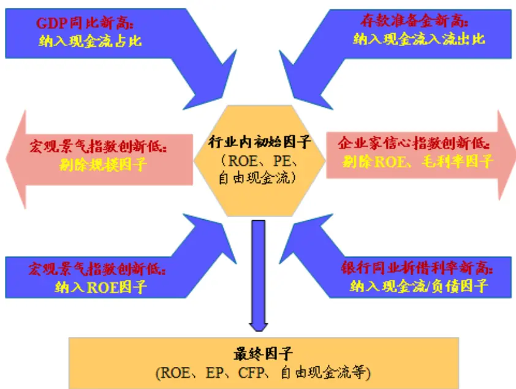
数据来源：广发证券发展研究中心
识别风险，发现价值

每个行业当期的初始风格因子为该行业内过去一年中，平均IC绝对值最高的5个因子。

图19：行业内初始因子挑选
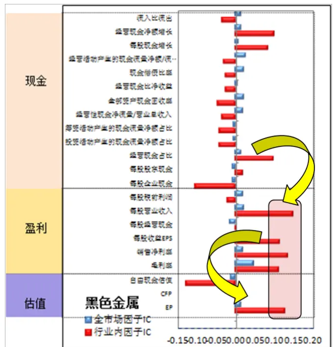
数据来源：广发证券发展研究中心

## 3.2 实证分析

个股样本：中证800成份股。

样本期间：2000 年 1 月 31 日-2013 年 1 月 31 日共 162 个月，其中 2010 年 12月31日之前作为样本内数据，用于挑选初始Alpha因子、并统计各类宏观事件下风格因子的轮动规律；2011 年之后作为样本外数据，根据样本内统计的结果进行实证分析，检验策略是否稳定有效。

策略频率：每月最后一个交易日，根据最新公布的宏观及行业指标数据，检查重点跟踪的事件是否发生，并根据风格轮动规律确定下个月所采用的风格因子；

## 资金管理：每个行业资金等分；

首先，根据样本内统计结果，我们对宏观事件及初始风格因子组合进行挑选，并分别针对每个行业构建考虑风格轮动的多因子 Alpha策略：

(1) 行业内选股策略：每个行业在初始风格因子的基础上，结合有效的宏观事件建立风格轮动多因子 Alpha 策略，因子之间等权重，超配组合取行业内 alpha 排名前20%个股进行等权分配，计算超配组合相对行业等权指数超额收益；

(2) 全市场选股策略：根据申万一级行业分类，剔除其中金融行业，其余行业分别采用上述行业内选股策略，行业之间按照资金等分，得到全市场选股策略，分别相对沪深 300指数及低配组合计算超额收益。

逐个行业内alpha策略表现如下所示：

图20：行业内选股策略表现（一）
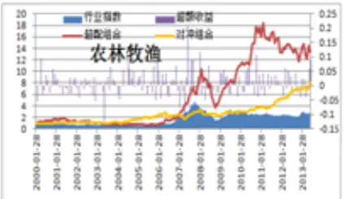

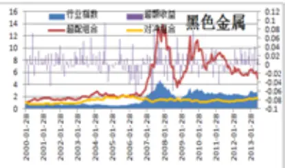

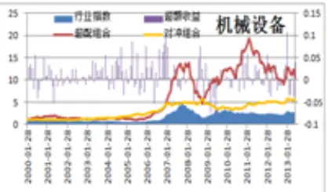

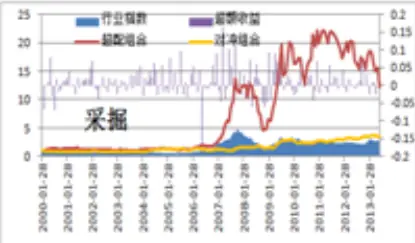

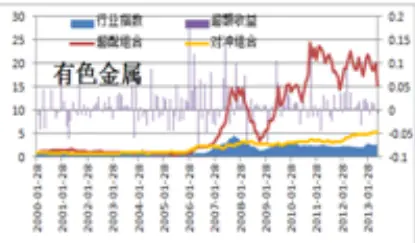

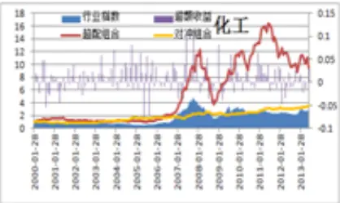
数据来源：广发证券发展研究中心

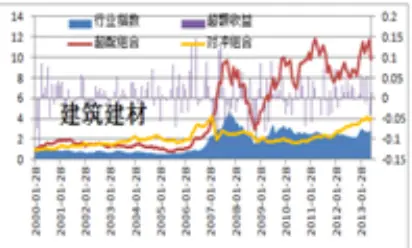

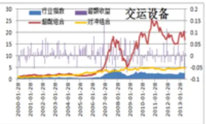

图21：行业内选股策略表现（二）
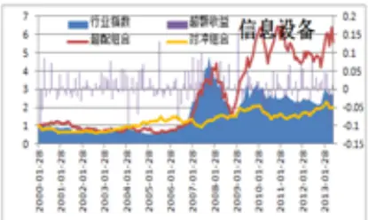

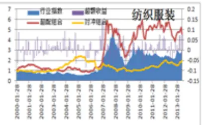

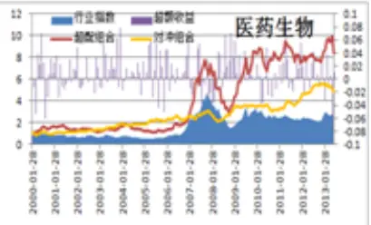

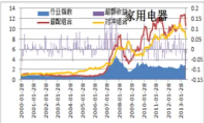

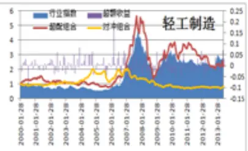

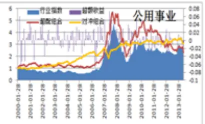

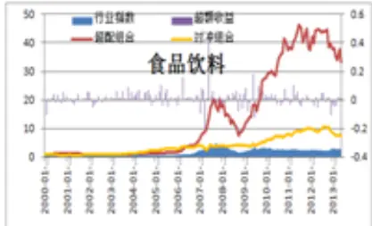
数据来源：广发证券发展研究中心

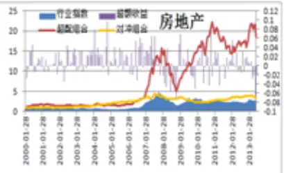

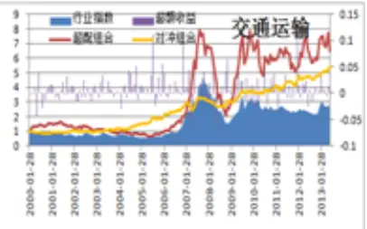

图22：行业内选股策略表现（三）
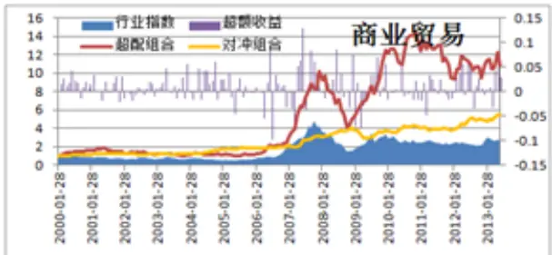

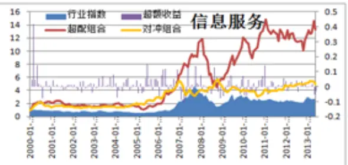

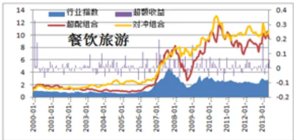
数据来源：广发证券发展研究中心

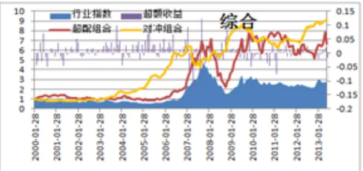

图23：行业内选股策略表现汇总
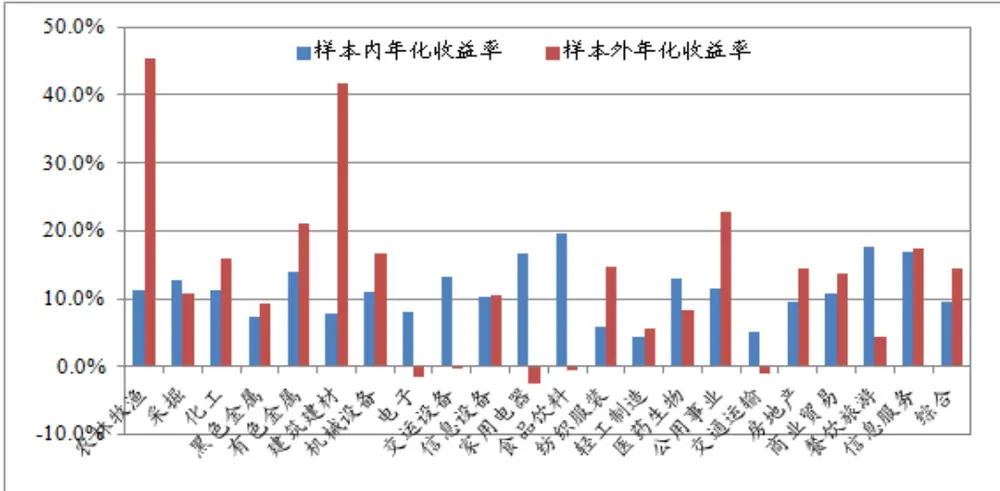
数据来源：广发证券发展研究中心

样本内22个行业均获得正的超额收益，平均年化累计超额约 15%，样本外有5个行业出现负超额收益，分别为电子、交运设备、家电、食品饮料及交运行业，但幅度较小，整体来看行业内风格轮动策略稳定性较好。

全市场alpha策略表现如下所示：

表 24：多因子量化对冲策略结果比较

| '策略名称' | 股指期货对冲 | 多空对冲 |
| --- | --- | --- |
| '信息比(多空)' | 1.15 | 1.15 |
| '信息比(多-指数)' | 1.29 | 1.29 |
| '年化收益率(全样本)' | 0.16 | 0.16 |
| '累计最大回撤' | 17.7% | 18.0% |

识别风险，发现价值

| '月度胜率' | 0.6% | 0.6% |
| --- | --- | --- |
| '月度最大亏损' | -11.1% | -11.1% |
| '00年累计收益' | 16.9% | -2.6% |
| '01年累计收益' | 5.1% | 8.9% |
| '02年累计收益' | 2.0% | 7.8% |
| '03年累计收益' | 0.5% | 28.4% |
| '04年累计收益' | 19.8% | 24.3% |
| '05年累计收益' | 12.6% | 16.0% |
| '06年累计收益' | 5.3% | 40.3% |
| '07年累计收益' | 44.9% | 14.8% |
| '08年累计收益' | 29.7% | 2.0% |
| '09年累计收益' | 36.7% | 13.6% |
| '10年累计收益' | 39.4% | 13.2% |
| '11 年累计收益' | 4.0% | 13.9% |
| '12 年累计收益' | -1.4% | 14.0% |
| '13 年累计收益' | 12.1% | 2.5% |

数据来源：广发证券发展研究中心，Wind数据库

由表24，考虑事件驱动的风格轮动之后，多因子策略样本内每年均有正的超额收益，样本外两种对冲方式表现各不相同，股指期货对冲方案波动较大，前两年效果一般，而对空对冲策略则更为稳定，前两年均有14%左右的超额收益，今年上半年则仅有 2.5%。

图24：对冲策略累计收益比较
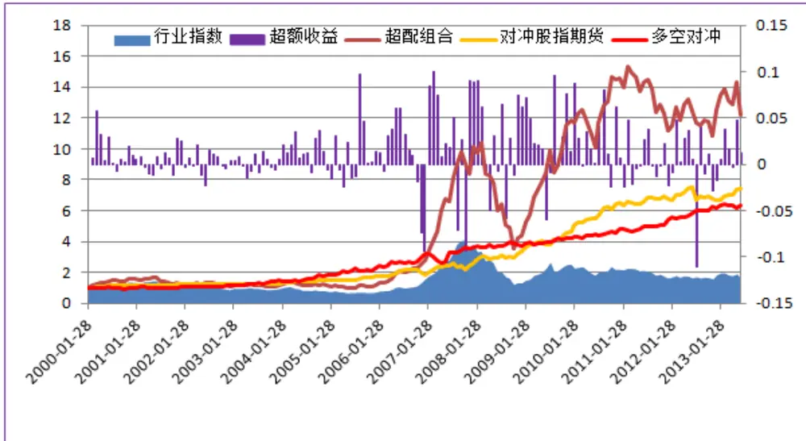
数据来源：广发证券发展研究中心

## 四、总结及建议

## 4.1 总结

任何一种风格投资策略都不能永远战胜市场，随着时间的推移，单一风格的数量化策略不能持续取得较高溢价率，因此“风格轮动”日益受到投资者的重视，报告继续延续上一篇专题报告《宏观事件驱动下的风格轮动——风格轮动系列专题二》的思路，将基于事件驱动的风格轮动方法应用到行业内选股当中，不同的是在事件的选取上，除了常用的宏观指标，同时还针对不同的行业挑选了各种行业事件；此外，由于现金流近年来受到市场的强烈关注，在风格因子的选择上主要针对盈利及现金流指标进行比较和应用。

常见的风格轮动策略主要分为“样本分类”及“时间序列回归”两类，本文从观察多类“行业事件”这个的角度，对风格因子的轮动规律进行探讨，具有逻辑清晰且应用简单的特点；另外，由于该策略只关注某些特殊宏观事件对风格轮动的驱动作用，因此可以减少由于风格规律出现钝化甚至出现短期失效从而导致轮动策略频繁出错的次数。

经检验，某些类型的“行业事件”能够帮助我们更好地揭示不同行业当下主流风格轮动的规律，本文通过量化的规则将这些规律构造成为风格因子轮动策略，经实证策略取得了较好的效果，后续我们将持续对这些行业事件进行跟踪，从而对风格轮动的方向进行提前判断。

## 4.2 最新建议

表25：最新宏观事件统计

| 事件类型 | 影响 | 适用行业 |
| --- | --- | --- |
| 人民币存款准备金率：同比：半年新高 | 资金紧缺，现金保值 | 农林牧渔、食品饮料等10个行业 |

数据来源：广发证券发展研究中心

表26：最新行业事件统计

| 事件类型 | 结果 | 纳入 | 剔除 |
| --- | --- | --- | --- |
| 中国煤炭市场景气指数：半年新低 | 现金保值 | 每股企业现金、现金偿债比率、每股现金增长、流入比流出 | CFP、毛利率、EPS |
| 产量：发电量：北京：当月同比：半年新高 | 有利于采掘,需扩大经营,放大杠杆提高盈利率 | EP、+毛利率、+EPS、+每股营业收入 |  |
| 家用电力器具制造：利润总额：累计同比：高于半年均值 | 利润处于高位，现金流充足 |  | 资产现金回收率、现金偿债率、经营现金净额比流动负债、流入比流出 |
| 电力、热力的生产和供应业：财务费用：累计同比：半年新低 | 财务费用降低，现金价值下降 | 毛利率、每股税前利润 | 每股企业现金、每股股东现金、经营现金占比、经营现金比净收益 |
| 产量：手机：当月同比：半年新高 | 行业过热，留存现金 | 每股经营现金0.64、投资产生现金净额占比 |  |

数据来源：广发证券发展研究中心

## 风险提示

报告所提出的行业事件风格轮动策略，取得了较好的效果，但并非百分百准确，仍然存在错误的风险，实际中应结合市场环境及行业特征进行适当应用。

## Table_Res arch 广发金融工程研究小组

罗 军： 首席分析师，华南理工大学理学硕士，2010年进入广发证券发展研究中心。

俞文冰： 首席分析师，CFA，上海财经大学统计学硕士，2012年进入广发证券发展研究中心。

叶 涛： 资深分析师， ，上海交通大学管理科学与工程硕士， 年进入广发证券发展研究中心。

安宁宁： 资深分析师，暨南大学数量经济学硕士，2011年进入广发证券发展研究中心。

胡海涛： 分析师， 华南理工大学理学硕士， 2010年进入广发证券发展研究中心。

夏潇阳： 分析师， 上海交通大学金融工程硕士， 2012年进入广发证券发展研究中心。

汪 鑫： 分析师， 中国科学技术大学金融工程硕士， 2012年进入广发证券发展研究中心。

蓝昭钦： 分析师， 中山大学理学硕士， 2010年进入广发证券发展研究中心。

史庆盛： 分析师， 华南理工大学金融工程硕士， 2011年进入广发证券发展研究中心。

张 超：研究助理， 中山大学理学硕士，2012年进入广发证券发展研究中心。

## Table_RatingIndustry 广发证券—行业投资评级说明

买入： 预期未来12个月内，股价表现强于大盘10%以上。

持有： 预期未来12个月内，股价相对大盘的变动幅度介于-10%～+10%。

卖出： 预期未来12个月内，股价表现弱于大盘10%以上。

## Table_RatingCompany 广发证券—公司投资评级说明

买入： 预期未来12个月内，股价表现强于大盘15%以上。

谨慎增持： 预期未来12个月内，股价表现强于大盘5%-15%。

持有： 预期未来12个月内，股价相对大盘的变动幅度介于-5%～+5%。

卖出： 预期未来12个月内，股价表现弱于大盘5%以上。

## Table_Ad联系我们

|  | 广州市 | 深圳市 | 北京市 | 上海市 |
| --- | --- | --- | --- | --- |
| 地址 | 广州市天河北路183号大 | 深圳市福田区金田路4018 | 北京市西城区月坛北街2号 | 上海市浦东新区富城路99号 |
|  | 都会广场5 楼 | 号安联大厦15楼A座03-04 | 月坛大厦18层 | 震旦大厦18楼 |
| 邮政编码 | 510075 | 518026 | 100045 | 200120 |
| 客服邮箱 | gfyf@gf.com.cn |  |  |  |
| 服务热线 | 020-87555888-8612 |  |  |  |

## Table_Disclaimer 免 责声 明

广发证券股份有限公司具备证券投资咨询业务资格。本报告只发送给广发证券重点客户，不对外公开发布。

本报告所载资料的来源及观点的出处皆被广发证券股份有限公司认为可靠，但广发证券不对其准确性或完整性做出任何保证。报告内容仅供参考，报告中的信息或所表达观点不构成所涉证券买卖的出价或询价。广发证券不对因使用本报告的内容而引致的损失承担任何责任，除非法律法规有明确规定。客户不应以本报告取代其独立判断或仅根据本报告做出决策。

广发证券可发出其它与本报告所载信息不一致及有不同结论的报告。本报告反映研究人员的不同观点、见解及分析方法，并不代表广发证券或其附属机构的立场。报告所载资料、意见及推测仅反映研究人员于发出本报告当日的判断，可随时更改且不予通告。

本报告旨在发送给广发证券的特定客户及其它专业人士。未经广发证券事先书面许可，任何机构或个人不得以任何形式翻版、复制、刊登、转载和引用，否则由此造成的一切不良后果及法律责任由私自翻版、复制、刊登、转载和引用者承担。