# 基于风格特征归因的动态因子策略

## ——多因子 Alpha 系列报告之（十八）

## Table_Sum ary报告摘要 ：

## 特征归因原理简介

多因子Alpha策略的核心在于Alpha因子的选择，而常见的因子有效性线性度量方法有两种：IC及多空超额指标。无论是IC还是因子多空超额收益指标，其本质在于刻画因子暴露的相对距离所能换取股票超额收益的能力。因此，构造因子组合时，为了符合因子挑选时的初衷，应使得超配组合与基准组合之间的整体因子暴露差异最大化。在构造单因子组合时，我们能够很简单的得到最佳的超低配组合，但当构造多因子组合时由于每个个股在不同因子上暴露可能方向和分布上存在较大差异，从而导致组合未能完好的反映所用因子的原来意图。

因此，报告强调应该对多因子组合进行特征归因，确保各因子在多因子组合中依然“有效”，而不是可有可无甚至出现“拖后腿”。

## 因子挑选及多因子组合特征归因

报告的研究核心在于解决两个问题：因子的挑选以及对多因子组合进行特征归因并动态剔除其中“失效”的因子。

因子的挑选采用IC动量法，即根据各类因子过去一年表现(IC)，挑选出每类中最佳因子作为初始因子并构造多因子股票组合；组合的特征归因则是通过检查多因子组合的在每个因子上的平均暴露是否能产生显著的超额收益来实现。

## 基于特征归因的因子逐步调整策略

基于组合特征归因结果，若将全部“失效”因子都剔除，则可能导致误删某些“有效”因子，极端情况下大多数因子同时“失效”被删除，导致因子数量过少。为了解决这些问题，本文根据每个因子的有效程度不同，采用动态组合归因并逐步调整多因子的策略。

实证显示，采用逐步调整因子的策略能够“挽回”部分被剔除的因子，并能有效改善多因子对冲策略的效果：超配组合相对基准信息比为1.65，多空信息比同样高达1.63，多空超额年化收益率24%，多空胜率更是提高到77%，均优于不进行优化的初始多因子策略及简单优化下的多因子策略。

## 风险提示

报告所提出组合特征归因及多因子逐步调整策略具有较强的假设，如所选因子未来有效，且具有显著的线性特征等，实际应用中决定多因子组合是否具有显著超额收益的关键还在于因子的挑选，因此本策略仅作为锦上添花之用，须结合有效的因子测算及风格轮动等因子模型进行使用。

图1：因子的有效分档
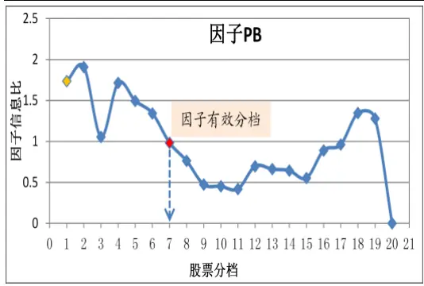

图2：组合特征归因及因子调整
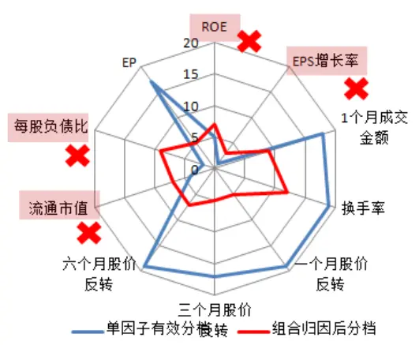

表 1：多因子对冲策略结果比较

| 策略名称 | 初始多因子策略 | 逐步优化多因子策略 |
| --- | --- | --- |
| 多空信息比 | 1.59 | 1.63 |
| 年化收益率 | 0.23 | 0.24 |
| 累计最大回撤 | 11.4% | 11.8% |
| 月度胜率 | 71.9% | 76.6% |
| 11年累计收益 | 9.5% | 1.1% |
| 12年累计收益 | 24.5% | 34.4% |
| 13年累计收益 | 14.0% | 16.6% |

分析师：史庆盛 S0260513070004020-87555888-8618sqs@gf.com.cn

## Table_Report 相关研究：

考虑换手率限制的多因子2012-06-29
Alpha模型——多因子Alpha
系列报告之（十一）

## 一、特征归因原理简介

多因子Alpha策略的核心在于Alpha因子的选择，而常见的因子有效性线性度量方法有两种：IC及多空超额指标。其中，IC为因子暴露与个股下期收益的相关系数，侧重刻画因子的线性单调性，而多空超额收益率则更直接反映因子极端情况下（比如第一档和最后一组）的相对超额收益。

无论是IC还是因子多空超额收益指标，其目的都是度量因子所能带来的股票超额收益，因此它们均可称为“因子回报”，其本质在于刻画因子暴露的相对距离所能换取股票超额收益的能力。因此，构造因子组合时，为了符合因子挑选时的初衷，应使得超配组合与基准组合之间的整体因子暴露差异最大化， 比如在单因子模型中，我们若将所有股票按照在该因子上的暴露大小进行排序并分为10档，1/10档之间的因子暴露差异最大。

图3：2010年以来各种估值指标走势比较
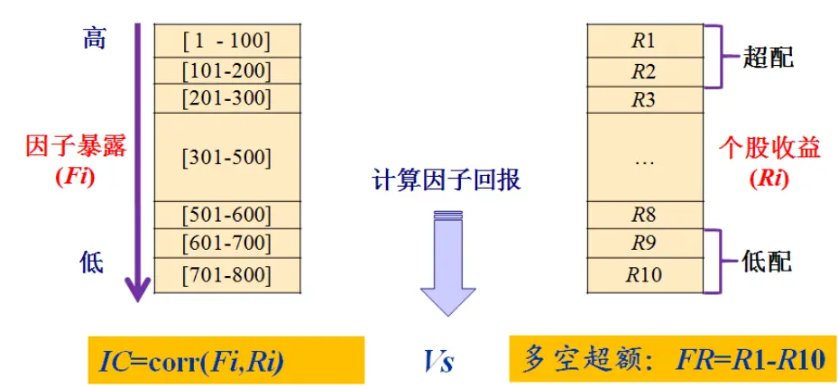
数据来源：广发证券发展研究中心,wind

在构造单因子组合时，我们能够很简单的得到最佳的超低配组合，但当构造多因子组合时由于每个个股在不同因子上暴露可能方向和分布上存在较大差异，从而导致组合未能完好的反映所用因子的原来意图。

图4：组合特征归因下的动态策略框架图
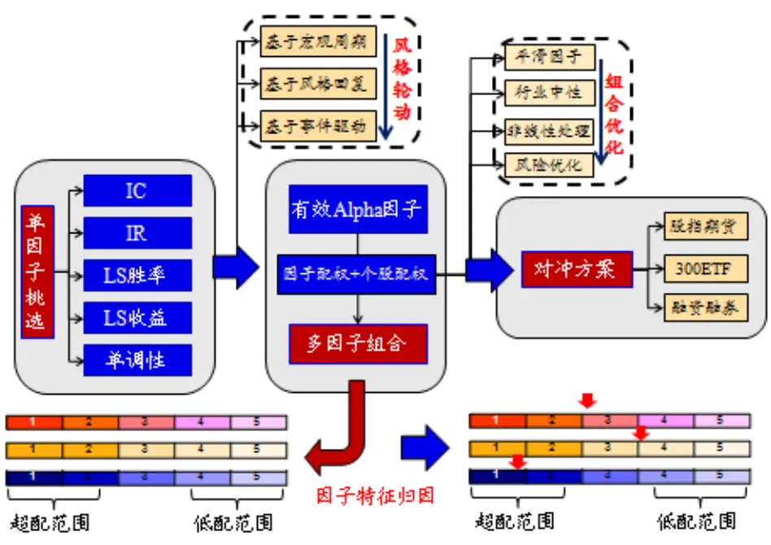
数据来源：广发证券发展研究中心,wind

比如以下例子：根据历史统计，流动性因子“一个月成交金额”的有效分档为3(共20档)，意味着只有流动性排名在后3/20个股，相对全部个股存在显著的超额收益；现构造多因子组合时共选择了8个因子，包含上述流动性因子，对得到的多因子超配组合进行“特征归因”，即检验该组合在各个因子上的暴露（实际分档）是否位于各因子的“有效分档”之内，表1显示，“一个月成交金额”及“固定比”两个因子显然不在有效范围内，因此将其剔除，表2显示剔除之后剩下6个因子均在有效范围内。

表2：初始多因子组合归因

| 编号 | 1 | 2 | 3 | 4 | 5 | 6 | 7 | 8 |
| --- | --- | --- | --- | --- | --- | --- | --- | --- |
| 因子 | 销售净利率 | 1个月成交金额 | 六个月股价反转 | 流通市值 | 总资产 | 固定比 | 速动比率 | 流动比率 |
| 有效分档 | 15 | 3 | 15 | 12 | 10 | 4 | 14 | 13 |
| 实际分档 | 4 | 11 | 13 | 5 | 5 | 8 | 3 | 3 |

数据来源：广发证券发展研究中心

表3：动态调整后多因子组合归因

| 编号 | 1 | 2 | 3 | 4 | 5 | 6 |
| --- | --- | --- | --- | --- | --- | --- |
| 因子 | 销售净利率 | 六个月股价反转 | 流通市值 | 总资产 | 速动比率 | 流动比率 |
| 有效分档 | 15 | 15 | 12 | 10 | 14 | 13 |
| 实际分档 | 3 | 12 | 6 | 4 | 2 | 2 |

数据来源：广发证券发展研究中心
识别风险，发现价值

## 二、因子挑选及多因子组合特征归因

本节的目的在于解决两个问题：因子的挑选以及对多因子组合进行特征归因并剔除其中“失效”的因子。

根据因子过去一年表现(IC)，挑选出初始因子并构造多因子股票组合；接着对该组合的风格特征进行归因，检查多因子组合的平均因子暴露是否能产生超额收益。

IC=corr(Fi,Ri)

Vs

多空超额：FR=R1-R10

挑选因子

组合归因

## 2.1 基于 IC 挑选 Alpha 因子

报告采用的备选Alpha汇总如下表3所示：

表4：因子汇总表

| 因子分类 | 编号 | 因子名称 | 因子分类 | 编号 | 因子名称 |  |  |
| --- | --- | --- | --- | --- | --- | --- | --- |
| 成长因子 | 1 | 股东权益增长率 | 质量因子 | 21 | 存货周转率 |  |  |
|  | 2 | 总资产增长率 |  | 22 | 长期负债比率 |  |  |
|  | 3 | 净利润增长率 |  | 23 | 每股负债比 |  |  |
|  | 4 | 每股净资产增长率 |  | 24 | 财务费用比例 |  |  |
|  | 5 | EPS 增长率 |  | 25 | 固定比 |  |  |
|  | 6 | ROE增长率 |  | 26 | 速动比率 |  |  |
|  | 7 | 主营业务收入增长率 |  | 27 | 流动比率 |  |  |
| 估值因子 | 8 | 每股派息/股价 |  |  |  | 28 | 净利润现金占比 |
|  | 9 | CFP |  |  | 29 |  |  |
|  | 10 | EP |  | 30 | 流动负债率 |  |  |
|  | 11 | SP |  | 31 | 营业费用比例 |  |  |
|  | 12 | BP | 盈利因子 | 35 | 销售净利率 |  |  |
| 流动因子 | 18 | 1个月成交金额 |  | 36 | 毛利率 |  |  |
|  | 19 | 近3个月平均成交量 |  | 37 | ROE |  |  |
|  | 20 | 换手率 |  | 38 | ROA |  |  |
| 技术因子 | 13 | 一个月股价反转 | 杠杆因子 | 32 | 流通股本/总股本 |  |  |
|  | 14 | 三个月股价反转 |  | 33 | 流通市值/总市值 |  |  |
|  | 15 | 六个月股价反转 |  | 34 | 资产负债率 |  |  |
|  | 16 | 最高点距离 | 规模因子 | 39 | 流通市值 |  |  |
|  | 17 | 容量比 |  | 40 | 总资产 |  |  |

数据来源：广发证券发展研究中心

每一类因子根据IC分别进行挑选，条件如下：

图5：基于IC挑选Alpha因子
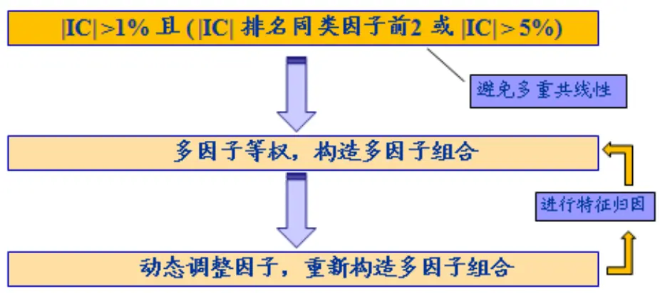
数据来源：广发证券发展研究中心

即根据因子过去一年的表现(IC)，从各类因子中挑选IC大于1%且有效性最高的两个，或当IC大于5%。

## 2.2 多因子组合特征归因

## （1）特征归因

第一节提到，多因子构造的超配组合未必能够反映单个因子的初衷，因此需要对组合进行特征归因，分析哪些因子在组合中没发挥作用、甚至起了负作用。

假设组合在因子i上的平均暴露为Fi，而全部个股在因子i上的暴露中，Fi位于第N档（假设全部个股的分档数量为M），则组合归因后因子i的实际分档为N/M。

## （2）因子有效分档

单因子组合通常反映了在该因子上暴露最高（低）的一篮子股票，位于分档中的第1档，那么如果前2档，或者前i档到底还能否产生显著的超额收益呢？

将股票根据因子排序分为N档，计算过去一年第i个分界线之前所有股票组合相对全部股票超额收益信息比IR(i)。

则因子的有效分档F_i的定义为：

$$
F\_i=argmax(\ IR(i)>0.8\ \mathscr{L}\ IR(i)>0.5^{*}IR(1))
$$

这里参数0.8为一个经验值，因子多空信息比若大于0.8，通常来说该因子有效性及单调行均较好；而参数0.5则意味着当因子有效性衰竭为一半时，通常应该考虑该因子是否应该继续使用，关于因子半衰竭性质，请参考前期报告《考虑换手率限制的多因子Alpha模型——多因子Alpha系列报告之（十一）》。

图6：因子有效分档计算原理

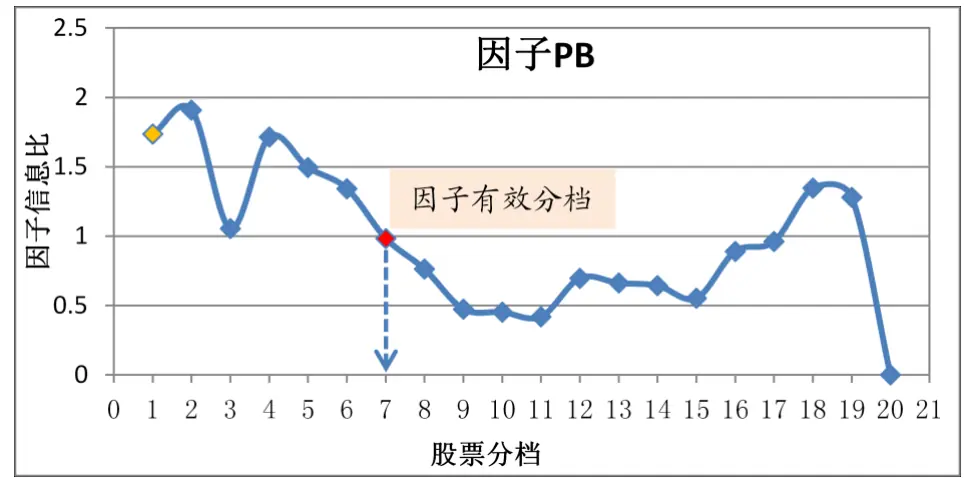
数据来源：广发证券发展研究中心，Wind

从因子有效分档的定义不难发现，存在以下两个假设前提：

假设1：第一档有效，即IR(1)>0

假设2：因子呈具有良好的线性单调性(IC显著有效)

对于因子存在非线性特征的情形，我们将在后续专题研究中进行讨论。

## （3）基于特征归因的因子调整

上述通过对组合进行特征归因及有效分档计算可分别得到因子当期的有效分档F_i和组合的实际分档G_i，当F_i =>G_i时，称因子i在多因子组合中“有效”，反之为“无效”，需考虑将因子剔除。

下面以截止2013年7月31日的多因子组合为例：

首先，根据过去一年的因子IC计算结果挑选了8个Alpha因子，并构建多因子等权组合P；

其次，为了检验各因子的有效性，对组合P进行特征归因，发现各因子的有效分档及实际分档如下图所示：

图7：初始多因子组合特征归因图
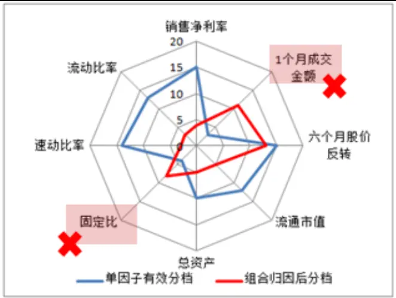
数据来源：广发证券发展研究中心，Wind

最后，根据特征归因子结果，因子“1个月成交金额”及“固定比”归因后发现实际分档不在有效分档范围，依次剔除之，基于剩下的6个Alpha因子重新构造多因子等权组合P’， P’的特征归因结果如下图所示，可见调整因子后的组合中，全部因子均有效，且各因子的特征更为显著。

图8：优化多因子组合特征归因图
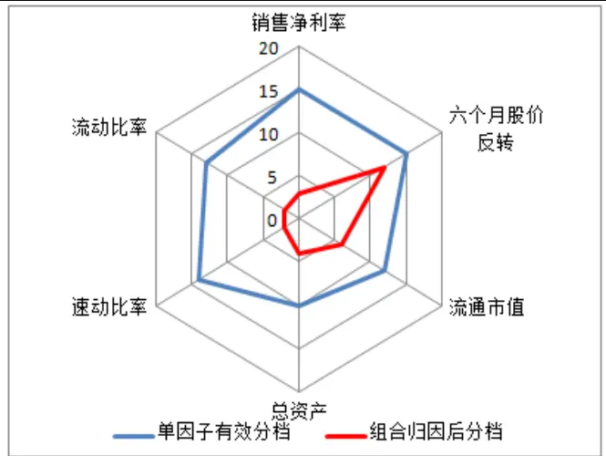
数据来源：广发证券发展研究中心，Wind

## 2.3 多因子优化方法比较

至此，部分读者可能仍然不大理解组合特征归因法的本质及其在多因子组合优化中的必要性。下面将其与常见的多因子优化方法进行比较。

## （1）主成分方法

最常见的多因子线性优化方法是主成分法，该方法通过对多个因子进行合成降维，从而解决因子之间可能存在的多重共线性问题：

| F1 | F2 | F3 | F4 | F5 | F6 | F7 | F8 | F9 | F10 |
| --- | --- | --- | --- | --- | --- | --- | --- | --- | --- |
| F1 |  | F2 |  |  | F3 | F4 |  | F5 | F6 |

主成分法的优点在于能够对相似的因子进行合并，从而避免因子雷同所导致的组合归因不清问题，因子合并的依据可以是基于因子之间的统计结果或者是对因子的主观理解。

## （2）优化模型

另外一类常见的方法是采用优化模型对因子之间由于相关性所导致的组合风险进行权重优化，从而使得组合在风险与收益之间得到平衡：

$$
\begin{array}{l}{\displaystyle\operatorname*{max}\{h^{*}X_{\alpha}-\frac{1}{2}\lambda h^{*}Vh\}}\\{\displaystyle s.t.\quad h^{*}X_{\sigma}=0}\end{array}
$$

该方法的优化重点在于风险控制，需要有独立的风险模型，同时相对弱化对组合中Alpha来源的分析和识别。

## （3）特征归因

特征归因是通过对既有的股票组合进行再优化的方法，动态调整因子能够使得最终的多因子组合在每个因子上的特征分布符合该因子生效的要求；

与前两种方法不同的是，特征归因解决的是因子之间非相关性所导致问题；而前两类方法解决的是因子相关性问题。

因此，上述方法其本质均有所区别，且处于流程里面的不同步骤，可结合进行使用。

## 三、基于特征归因的因子逐步调整策略

## 3.1 策略原理及步骤

首先再来回顾2013年7月31日的多因子组合优化案例：

根据过去一年的因子IC计算结果挑选了8个Alpha因子，并构建多因子等权组合P；对组合P进行特征归因，发现各因子的有效分档及实际分档如下所示：

表5：最新初始多因子组合归因结果

| 编号 | 1 | 2 | 3 | 4 | 5 | 6 | 7 | 8 |
| --- | --- | --- | --- | --- | --- | --- | --- | --- |
| 因子 | 销售净利率 | 1个月成交金额 | 六个月股价反转 | 流通市值 | 总资产 | 固定比 | 速动比率 | 流动比率 |
| 有效分档 | 15 | 3 | 15 | 12 | 10 | 4 | 14 | 13 |
| 实际分档 | 4 | 11 | 13 | 5 | 5 | 8 | 3 | 3 |

数据来源：广发证券发展研究中心

对组合P的特征归因结果显示，“一个月成交金额”及“固定比”两个因子在组合中未能得到很好的体现，将其定义为“失效”因子并采用最原始粗暴的处理方法：全部剔除。

图9：最新初始多因子组合特征归因图
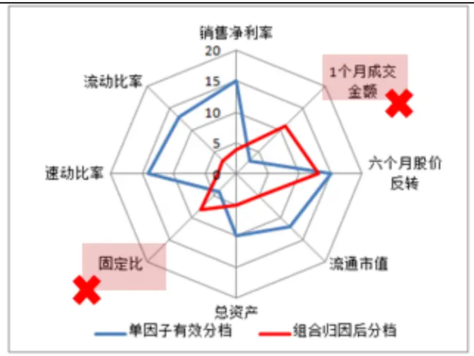
数据来源：广发证券发展研究中心，Wind

实际上，直接删除“失效”因子的方式并不可取，因为可能导致以下两个问题：

（1）可能会误删某些“有效”因子；

（2）极端情况下大多数因子同时“失效”被删除，导致因子数量过少。

为了解决上述问题，下面将根据每个因子的有效程度不同，采用动态调整因子的策略。

## 3.2 因子动态调整策略原理及步骤

上述通过对组合进行特征归因及有效分档计算可分别得到因子当期的有效分档F_i和组合的实际分档G_i，定义S_i为当前组合中因子i的有效得分：

S_i=G_i/F_i

其中，

S_i：因子有效得分

G_i：归因后实际分档

F_i：因子有效分档

当F_i =>G_i，即S_i>=1时，称因子i在多因子组合中“有效”，反之为“无效”，需考虑将因子剔除，同理，首先将全部“失效”因子从初始有效因子中剔除，接下来为了防止部分有效因子同样被剔除，逐个将已提出的因子纳入到剩下的“有效”因子中，若存在某个因子纳入之后多因子组合的平均因子有效的得分提高了，则将该因子留下，若此举同时导致其他因子失效，则剔除之。

循环进行上述操作直到多因子组合趋于稳定。 策略步骤如下所示：

图10：初始多因子组合特征归因图
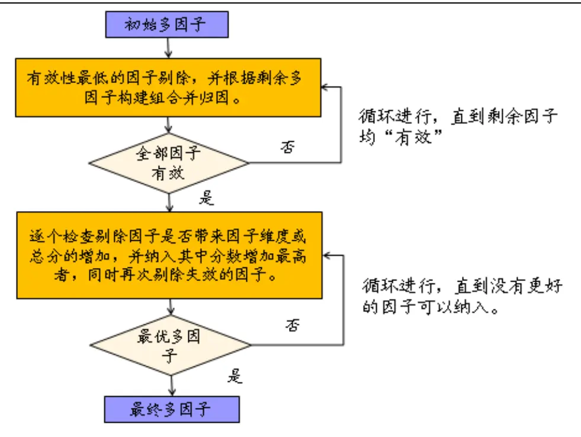
数据来源：广发证券发展研究中心，Wind

## 3.3 案例展示

为了展示因子动态调整策略的原理，下面以2011年5月31日的多因子组合作为案例，介绍其优化的具体步骤。

## （1）因子挑选

根据过去一年的因子IC计算结果挑选了10个Alpha因子如下所示：

表 6：初始因子

| 1 | ROE |
| --- | --- |
| 2 | EPS增长率 |
| 3 | 1个月成交金额 |
| 4 | 换手率 |
| 5 | 一个月股价反转 |
| 6 | 三个月股价反转 |
| 7 | 六个月股价反转 |
| 8 | 流通市值 |
| 9 | 每股负债比 |
| 10 | EP |

数据来源：广发证券发展研究中心
识别风险，发现价值

图11：行业内初始因子挑选
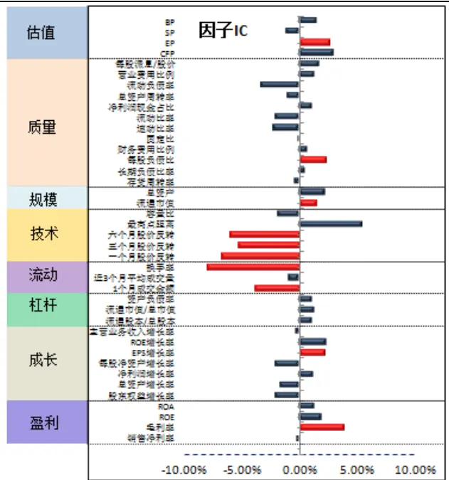
数据来源：广发证券发展研究中心，Wind

## （2）剔除失效因子

对初始多因子组合进行特征归因，结果显示，“ROE”、“EPS增长率”、“流通市值”及“每股负债比”四个因子失效，首先将其全部剔除。

表 7：初始多因子组合归因结果

| 编号 | 因子 | 有效分档 | 实际分档 |
| --- | --- | --- | --- |
| 1 | ROE | 5 | 7 |
| 2 | EPS 增长率 | 1 | 3 |
| 3 | 1个月成交金额 | 18 | 9 |
| 4 | 换手率 | 19 | 12 |
| 5 | 一个月股价反转 | 19 | 5 |
| 6 | 三个月股价反转 | 17 | 5 |
| 7 | 六个月股价反转 | 19 | 7 |
| 8 | 流通市值 | 4 | 7 |
| 9 | 每股负债比 | 2 | 9 |
| 10 | EP | 17 | 5 |

数据来源：广发证券发展研究中心，Wind

图12：初始多因子组合特征归因图
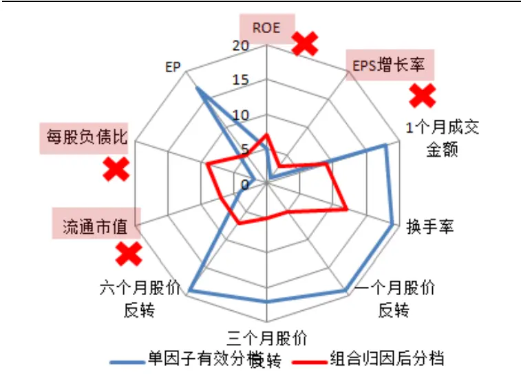
数据来源：广发证券发展研究中心，Wind

## （3）组合动态调整

剔除4个因子之后，剩余6个因子均为有效，接下来采用上述动态调整因子方法，逐个加入被剔除的4个因子，并留下“最优”的因子“流通市值”，最终共有7个因子。

表 8：已选因子

| 编号 | 1 | 2 | 3 | 4 | 5 | 6 |
| --- | --- | --- | --- | --- | --- | --- |
| 因子 | 1个月成交金额 | 换手率 | 一个月股价反转 | 三个月股价反转 | 六个月股价反转 | EP |
| 有效分档 | 18 | 19 | 19 | 17 | 19 | 17 |
| 实际分档 | 8 | 11 | 5 | 4 | 5 | 5 |

数据来源：广发证券发展研究中心，Wind

表 9：备选因子

| 编号 | 1 | 2 | 3 | 4 |
| --- | --- | --- | --- | --- |
| 因子 | ROE | EPS 增长率 | 流通市值 | 每股负债比 |
| 有效分档 | 5 | 1 | 4 | 2 |
| 实际分档 | 7 | 3 | 7 | 9 |

数据来源：广发证券发展研究中心，Wind

图13：多因子动态调整结果
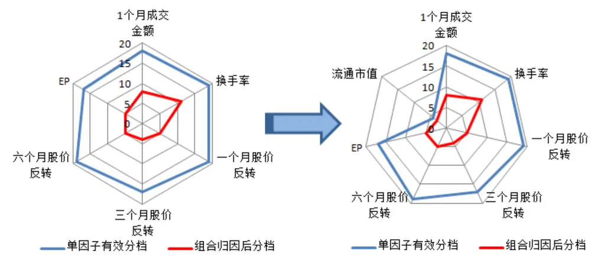
数据来源：广发证券发展研究中心，Wind

## 3.4 实证分析

个股样本：中证 800 成份股；

样本期间：中证 800指数上市以来；

策略构建：分别基于初始因子及优化后的因子构造等权因子组合，并基于多因子打分挑选最优的 20%个股作为超配组合；

策略频率：月末收盘挑选因子，月初第一个交易日收盘价建仓；

交易成本：双边千分之三；

比较基准：中证 800成份股等权指数。

为了检验因子动态调整策略的有效性，构建了如如下三种多因子对冲策略进行比较：

(1) 初始因子策略：每一期根据因子 IC 挑选有效的初始因子，全部因子直接构造等权多因子策略；

(2) 简单优化策略：在每期初始因子的基础上，根据初始多因子组合的归因结果将“失效”因子全部剔除，剩下因子构造等权多因子策略；

(3) 逐步优化策略：在简单优化策略的基础上，采用3.2所介绍方法逐步检查因子的有效性，并最终得到最优多因子组合。

图14：初始多因子组合特征归因图
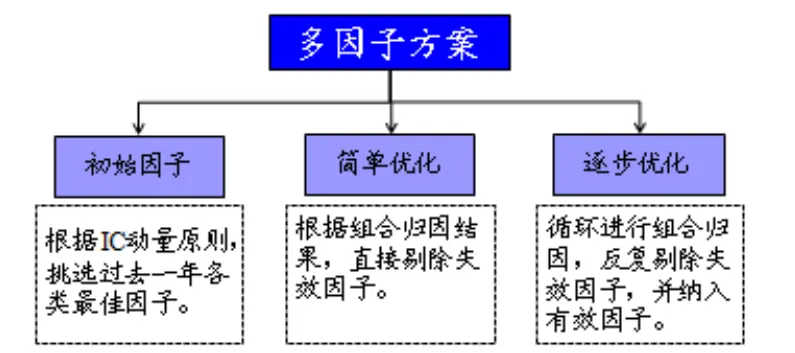
数据来源：广发证券发展研究中心，Wind

基于上述三类多因子策略分别构造相对基准的多因子对冲组合，结果比较如下所示：

图15：多因子策略表现比较
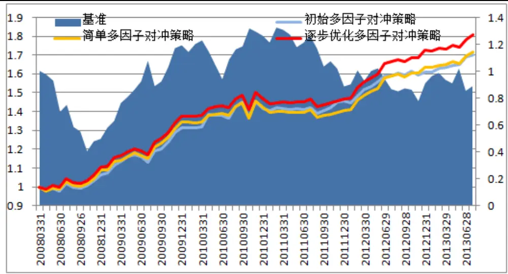
数据来源：广发证券发展研究中心，Wind

表 10：多因子对冲策略实证结果比较

|  | 对冲组合（多-指数） |  |  | 对冲组合（多空） |  |  |
| --- | --- | --- | --- | --- | --- | --- |
| 策略名称 | 初始因子 | 逐步优化 | 逐步优化 | 初始因子 | 逐步优化 | 逐步优化 |
| 信息比(多-指数) | 1.47 | 1.49 | 1.65 | 1.59 | 1.49 | 1.63 |
| 年化收益率(全样本) | 0.10 | 0.10 | 0.11 | 0.23 | 0.23 | 0.24 |
| 累计最大回撤 | 5.3% | 5.8% | 5.3% | 11.4% | 13.4% | 11.8% |
| 月度胜率 | 65.6% | 67.2% | 71.9% | 71.9% | 73.4% | 76.6% |
| 月度最大亏损 | -5.3% | -5.4% | -5.3% | -11.4% | -11.4% | -11.3% |
| 08年累计收益 | 6.5% | 8.8% | 10.7% | 12.7% | 14.4% | 18.3% |
| 09年累计收益 | 23.5% | 23.6% | 24.3% | 51.9% | 50.8% | 51.7% |
| 10年累计收益 | 7.8% | 5.6% | 6.6% | 21.2% | 18.4% | 20.2% |

识别风险，发现价值
请务必阅读末页的免责声明

| 11年累计收益 | 2.8% | -1.1% | 0.0% | 9.5% | -0.6% | 1.1% |
| --- | --- | --- | --- | --- | --- | --- |
| 12年累计收益 | 10.6% | 16.5% | 17.5% | 24.5% | 30.5% | 34.4% |
| 13年累计收益 | 5.7% | 4.9% | 4.8% | 14.0% | 17.4% | 16.6% |

数据来源：广发证券发展研究中心，Wind

实证结果显示，基于IC 进行因子动态选择的多因子对冲策略整体来看表现较好，自2008年以来多空年化收益为23%，超配组合相对基准指数信息比为1.47，多空信息比则高达 1.59。

若采用简单优化的方法动态调整因子，由于部分有效因子被剔除从而导致对冲组合没有得到显著地优化；而逐步优化方法则能显著改善多因子对冲策略，超配组合相对基准信息比为1.65，多空信息比同样高达 1.63，多空超额年化收益率24%，多空胜率更是提高到77%。

对比三类多因子策略平均每一期采用的因子数量，显然初始多因子策略所采用的因子最多，平均每次多达 10 个，而简单优化策略为7个，逐步优化策略则增加为 8个，意味着简单的优化策略平均每一期将错失一个“有效”因子，正是这一个因子只差，导致两个策略之间表现有所差别。

图16：多因子策略因子数量比较
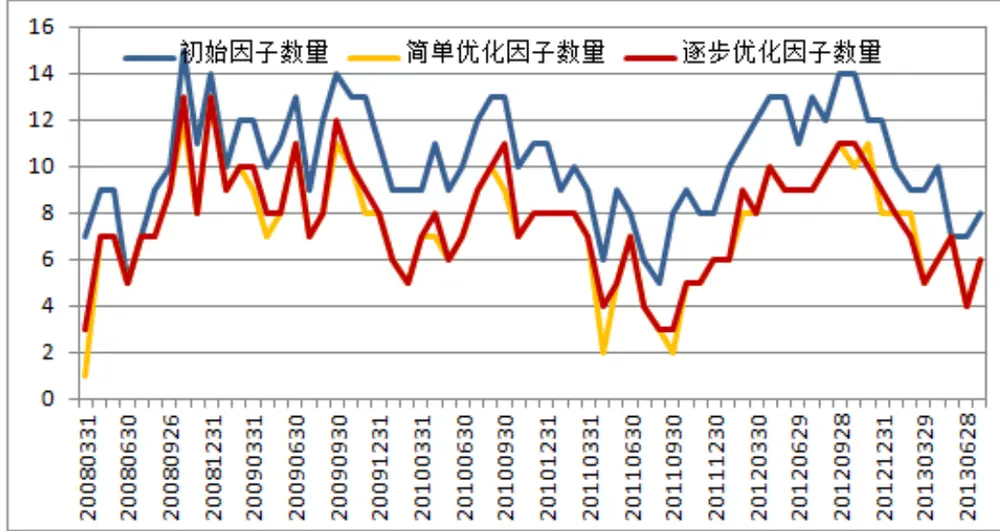
数据来源：广发证券发展研究中心，Wind

表 11：多因子策略因子数量比较

|  | 初始因子 | 简单优化 | 逐步优化 |
| --- | --- | --- | --- |
| 平均因子数量 | 10 | 7 | 8 |

数据来源：广发证券发展研究中心，Wind

## 四、总结

在构造单因子组合时，根据个股在该因子上的暴露高低便能够很简单的得到最优的超低配组合；而当构造多因子组合时，由于每个个股在不同因子上暴露可能方向和分布上存在较大差异，从而导致组合未能完好的反映某些因子的原来意图，对应的因子称之为“失效”因子。本文首先通过对组合进行特征归因，分析了单个因子在多因子组合中“失效”的原理，并分别采用简单优化及逐步优化两种不同方法来解决改问题。

从直观理解和逻辑上来说，本文认为对多因子组合进行特征归因以及相应的因子调整是很有必要的，因为这与单个有效因子之所以被选中的初衷是一致的，组合必须同样确保单因子的有效性；从实证的角度，我们同样验证了多因子动态调整策略能够有效改善多因子策略的有效性。

本文的研究内容内嵌于传统的多因子研究框架内，组合特征归因及多因子动态调整均强调从单因子到多因子组合时，应该反复对组合进行特征归因及因子优化，知道最终的多因子组合能够最大程度上反映每个alpha因子的期望特征。

图17：多因子策略框架下的组合优化环节
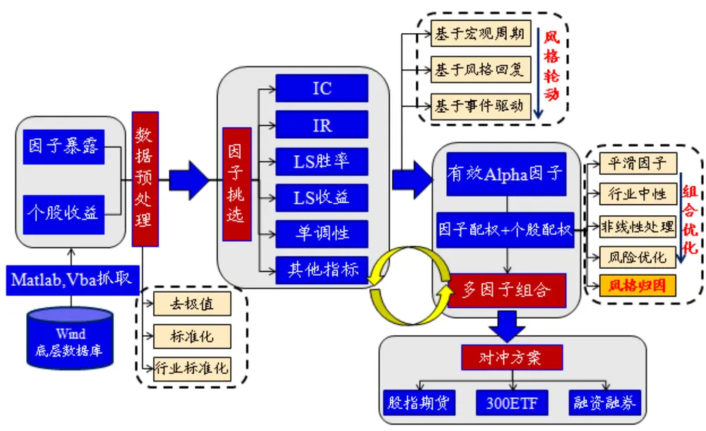
数据来源：广发证券发展研究中心

我们将因子逐步优化的功能添加到原来的多因子选股平台上面，供使用者参考。

图18：多因子平台中的因子自动优化模块

数据来源：广发证券发展研究中心

## 风险提示

报告所提出组合特征归因及多因子逐步动态调整策略具有较强的假设前提，比如所选因子本身必须有效，且具有显著的线性特征等等，实际应用中决定多因子组合是否具有显著超额收益的关键还在于因子的挑选，因此本策略仅作为锦上添花之用，须结合有效的因子测算及风格轮动等因子模型进行使用。

## Table_Res arch 广发金融工程研究小组

罗 军： 首席分析师，华南理工大学理学硕士，2010年进入广发证券发展研究中心。

俞文冰： 首席分析师，CFA，上海财经大学统计学硕士，2012年进入广发证券发展研究中心。

叶 涛： 资深分析师，CFA ，上海交通大学管理科学与工程硕士，2012年进入广发证券发展研究中心。

安宁宁： 资深分析师，暨南大学数量经济学硕士，2011年进入广发证券发展研究中心。

胡海涛： 分析师， 华南理工大学理学硕士， 2010年进入广发证券发展研究中心。

夏潇阳： 分析师， 上海交通大学金融工程硕士， 2012年进入广发证券发展研究中心。

蓝昭钦： 分析师，中山大学理学硕士， 2010年进入广发证券发展研究中心。

史庆盛： 分析师，华南理工大学金融工程硕士， 2011年进入广发证券发展研究中心。

汪 鑫： 研究助理， 中国科学技术大学金融工程硕士， 2012年进入广发证券发展研究中心。

张 超： 研究助理，中山大学理学硕士， 2012年进入广发证券发展研究中心。

## Table_RatingIndustry 广发证券—行业投资评级说明

买入： 预期未来12个月内，股价表现强于大盘10%以上。

持有： 预期未来12个月内，股价相对大盘的变动幅度介于-10%～+10%。

卖出： 预期未来12个月内，股价表现弱于大盘10%以上。

## Table_RatingCompany 广发证券—公司投资评级说明

买入： 预期未来12个月内，股价表现强于大盘15%以上。

谨慎增持： 预期未来12个月内，股价表现强于大盘5%-15%。

持有： 预期未来12个月内，股价相对大盘的变动幅度介于-5%～+5%。

卖出： 预期未来12个月内，股价表现弱于大盘5%以上。

## Table_Ad联系我们

|  | 广州市 | 深圳市 | 北京市 | 上海市 |
| --- | --- | --- | --- | --- |
| 地址 | 广州市天河北路183号 大都会广场5楼 | 深圳市福田区金田路4018 号安联大厦 15楼 A 座 | 北京市西城区月坛北街2号 月坛大厦18层 | 上海市浦东新区富城路99号 震旦大厦18楼 |
|  |  | 03-04 |  |  |
| 邮政编码 客服邮箱 | 510075 | 518026 | 100045 | 200120 |
|  | gfyf@gf.com.cn |  |  |  |
| 服务热线 | 020-87555888-8612 |  |  |  |

## Table_Disclaimer 免 责声 明

广发证券股份有限公司具备证券投资咨询业务资格。本报告只发送给广发证券重点客户，不对外公开发布。

本报告所载资料的来源及观点的出处皆被广发证券股份有限公司认为可靠，但广发证券不对其准确性或完整性做出任何保证。报告内容仅供参考，报告中的信息或所表达观点不构成所涉证券买卖的出价或询价。广发证券不对因使用本报告的内容而引致的损失承担任何责任，除非法律法规有明确规定。客户不应以本报告取代其独立判断或仅根据本报告做出决策。

广发证券可发出其它与本报告所载信息不一致及有不同结论的报告。本报告反映研究人员的不同观点、见解及分析方法，并不代表广发证券或其附属机构的立场。报告所载资料、意见及推测仅反映研究人员于发出本报告当日的判断，可随时更改且不予通告。

本报告旨在发送给广发证券的特定客户及其它专业人士。未经广发证券事先书面许可，任何机构或个人不得以任何形式翻版、复制、刊登、转载和引用，否则由此造成的一切不良后果及法律责任由私自翻版、复制、刊登、转载和引用者承担。