# 笑看北雁南飞南雁北归

## 多因子 Alpha 系列报告之（十九）

## 报告摘要：

## 多因子 Alpha 策略历史表现

市场中性组合-沪深 300 对冲策略在 2006 年到 2014 年间，年化收益率达到 24.34%，年化波动率 13.90%，信息比率 1.75，胜率73.74%，最大回撤 20.76%。对冲策略回撤主要集中在 2006 到 2008年间，2009 年后单边行情转为震荡行情，多因子Alpha选股策略胜率、稳定性得到明显提升。

## 基于 PT思想的月内增强策略

“北雁南飞南雁北归”是我们的核心思想。我们认为，多因子综合打分相近的股票在价格走势上具有趋同的性质。我们假定，当两只打分相近的股票价差拉大到一定程度时，趋同特性将占据主导，使得两只股票价差逐渐回归，此时根据配对交易的思想，我们可以卖出“超涨”的股票，买入“超跌”的股票，从而捕捉到这个获利机会。换一个角度来说，我们这种月内增强的交易思路在于捕捉同为看涨的股票，上涨时点的差异；当一只股票领先上涨时，会使得两只股票价差拉大，这个时候我们进行换仓，就可以再次捕捉到落后上涨股票的上涨机会。

## 实证交易结果

从实证分析结果来看，月内增强策略观察窗口建议选择 Alpha 组合内全部股票，主要原因在于窗口大小直接影响到月内捕捉到交易机会的次数。阈值选择方面则是仁者见仁智者见智，较高的阈值可以使得增强策略获得更高的单次交易超额收益，而适当降低阈值则可以获得更多的月内交易次数。

阈值选择 6%时可以获得最高的年化超额收益率，增强策略年化超额收益率达到 9.63%，超额收益稳定性较好，胜率保持在 70%以上，同时在历史八年间，最大回撤在 3.82%，平均单月换手率接近 80%。

选择更高阈值的增强策略则具有更加稳定的超额收益率。阈值选择 15%时，年化收益率 6.75%，波动率 3.60%，信息比 1.88，最大回撤 1.55%。

图 1 Alpha 单月及累积超额收益
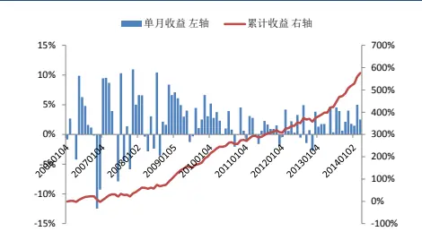

图 2 15%阈值单月及累积超额收益
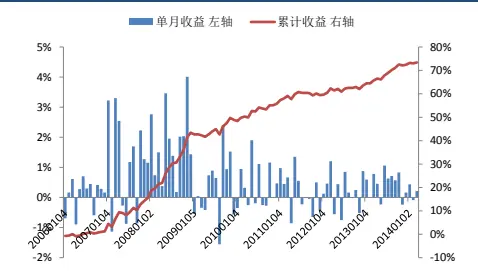

分析师： 安宁宁 S0260512020003

公0755-23948352

ann@gf.com.cn

## 相关研究：

多因子 Alpha 系列报告之 2013-09-02
（十八）——基于风格特征
归因的动态因子策略
多因子 Alpha 系列报告之 2013-08-07
（十七）——行业事件驱动
下的风格轮动
多因子 Alpha 系列报告之 2013-06-17
（十六）——基于情景切换
的技术选股策略

识别风险，发现价值

## 一、 多因子 Alpha 策略回顾

在之前的多因子 Alpha 系列报告中，我们建立了一个完善的多因子 Alpha选股模型。这里我们首先对整个模型的框架进行回顾，然后简要展示多因子 Alpha 策略的历史表现。

## （一）广发多因子框架简述

我们建立了一个完善的风格因子跟踪及多因子量化选股体系，整个体系框架可分为四个步骤，如图1所示：

步骤1：建立风格因子数据库，将市场上可能受到关注的大量因子汇集到一起，经过初步加工（即数据预处理）之后，得到可用于统计分析的因子数据以及个股收益数据，步骤1是整个框架的基础，数据的完整性及有效性将直接影响模型的结果；

步骤2：运用多个度量指标，对风格因子数据库中每个因子的有效性进行多维度刻画，并从中挑选出能够产生稳定Alpha的因子，这个层面的工作是整个框架的核心；

步骤3：完成了Alpha因子挑选，即确定了当前可用的Alpha因子之后，接下来便是对Alpha因子进行整合，并挑选相应的个股进行投资，该层次的工作最具难度，也是许多多因子模型之间相互区别的重要原因，较常见的方式是对因子及个股进行简单平均加权。

步骤4：最后是选择股指期货或ETF等工具对多因子组合进行对冲，获取alpha收益。

图1：基于多因子的Alpha策略框架
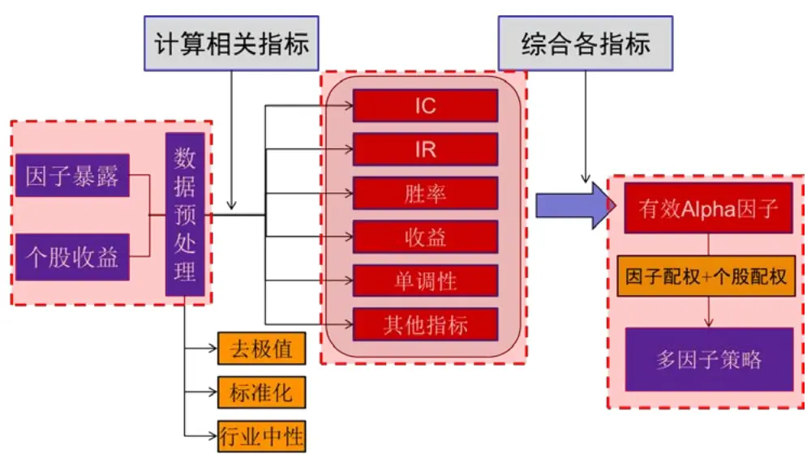
数据来源：广发证券发展研究中心

## （二）多因子 Alpha 策略历史表现

本节我们对多因子Alpha策略的历史表现进行回顾。首先我们从建立的风格因子库中选取表1所列两类风格Alpha因子：

表1：Alpha因子选择

| 基本面因子 | P/B, P/E,P/S |
| --- | --- |
| 技术指标 | 一个月动量、成交金额 |

数据来源：广发证券发展研究中心

其中基本面Alpha因子经过行业中性、去极值处理（详见系列报告前篇），在两类因子间采用等权重配置进行行业中性综合打分。其中行业划分我们采用中信一级行业划分。

对A股市场全部股票进行行业中性综合打分后，我们根据沪深300指数行业权重分布及各行业股票数量，配置多因子Alpha策略行业中性投资组合。

选取2006年1月至2014年3月为样本区间，多因子Alpha行业中性组合-沪深300对冲策略历史表现如下：

表2：沪深300对冲策略表现

| 样本周期 | 年化收益率 | 年化波动率 | 信息比率 | 胜率 | 最大回撤 |
| --- | --- | --- | --- | --- | --- |
| 2006.1-2014.3 | 24.34% | 13.90% | 1.75 | 73.74% | 20.76% |

数据来源：广发证券发展研究中心

图2：沪深300指数与Alpha策略累积收益对比
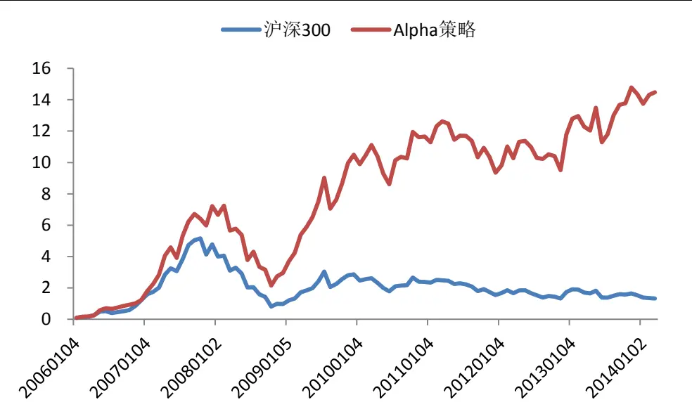
数据来源：广发证券发展研究中心

图3：对冲策略单月及累积收益

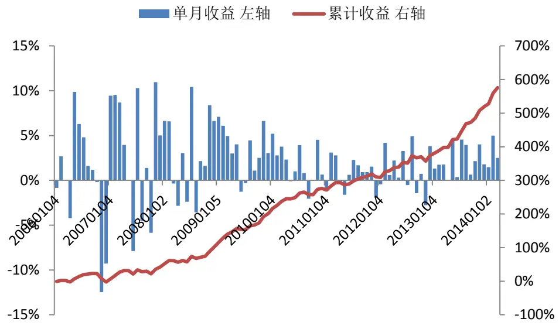
数据来源：广发证券发展研究中心

可以看到，市场中性组合-沪深300对冲策略在2006年到2014年间，年化收益率达到24.34%，年化波动率13.90%，信息比率1.75，胜率73.74%，最大回撤20.76%。对冲策略回撤主要集中在2006到2008年间，2009年后单边行情转为震荡行情，多因子Alpha选股策略胜率、稳定性得到明显提升。

表3：沪深300及行业中性Alpha策略年度回报率

| 年份 | 沪深300 | A1pha 策略 | 超额收益 |
| --- | --- | --- | --- |
| 2006 | 121.02% | 121.42% | 0.40% |
| 2007 | 161.55% | 271.13% | 109.58% |
| 2008 | -65.95% | -51.91% | 14.04% |
| 2009 | 96.71% | 190.78% | 94.07% |
| 2010 | -12.51% | 10.08% | 22.60% |
| 2011 | -25.01% | -18.23% | 6.78% |
| 2012 | 7.55% | 23.67% | 16.11% |
| 2013 | -7.65% | 20.02% | 27.67% |

数据来源：广发证券发展研究中心

图4：沪深300与行业中性Alpha策略年度回报
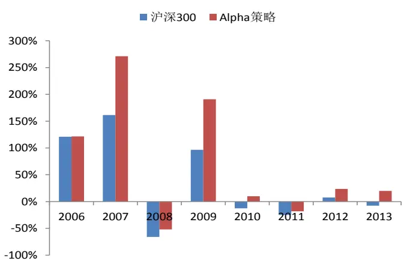

数据来源：广发证券发展研究中心

图5：行业中性Alpha策略年度超额收益率
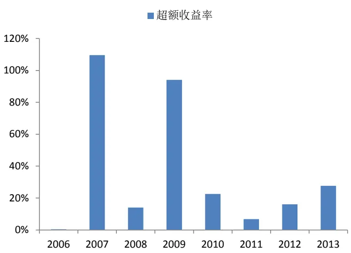
数据来源：广发证券发展研究中心

从上图可以看到，2006年至今，行业中性Alpha策略年度胜率为100%，能够稳定战胜市场获得超额回报。

相对于行业中性组合受到行业权重分布限制从而使得组合收益率被大权重行业回报制约，另一种方法是根据个股得到的行业中性综合打分进行排序，选取全市场打分排名前100股票进行等权重配置，我们将其简称为全市场Alpha组合（后面不在重复说明）。

表4：全市场Alpha-沪深300对冲策略表现

| 样本周期 年化收益率 年化波动率 信息比率 胜率 最大回撤 |  |  |  |  |  |
| --- | --- | --- | --- | --- | --- |
| 2006.1-2014.3 | 34.15% | 22.19% | 1.54 | 69.70% | 28.36% |

数据来源：广发证券发展研究中心

图6：沪深300与全市场Alpha策略累积收益对比
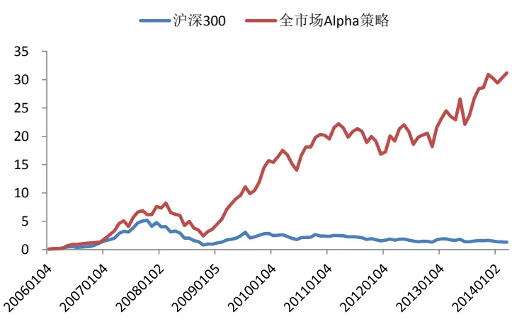
数据来源：广发证券发展研究中心

图7：全市场对冲策略单月及累积收益
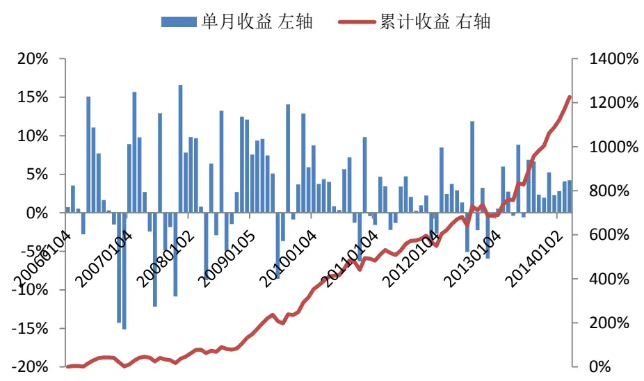
数据来源：广发证券发展研究中心

可以看到，全市场Alpha策略年化收益率34.15%，年化波动率22.19%，信息比率1.54，胜率69.70%，最大回撤28.36%。

相较于市场中性Alpha策略，全市场Alpha组合在样本区间内有更高的年化收益率，同时也承担更高风险，月度胜率达到约70%。

表5：沪深300及全市场Alpha策略年度回报率

| 年份 | 沪深300 | A1pha 策略 | 超额收益 |
| --- | --- | --- | --- |
| 2006 | 121.02% | 135.29% | 14.27% |
| 2007 | 161.55% | 266.76% | 105.21% |
| 2008 | -65.95% | -46.18% | 19.77% |
| 2009 | 96.71% | 259.24% | 162.53% |
| 2010 | -12.51% | 26.96% | 39.47% |
| 2011 | -25.01% | -15.75% | 9.26% |
| 2012 | 7.55% | 26.41% | 18.85% |
| 2013 | -7.65% | 38.52% | 46.17% |

数据来源：广发证券发展研究中心

图8：沪深300与全市场Alpha策略年度回报

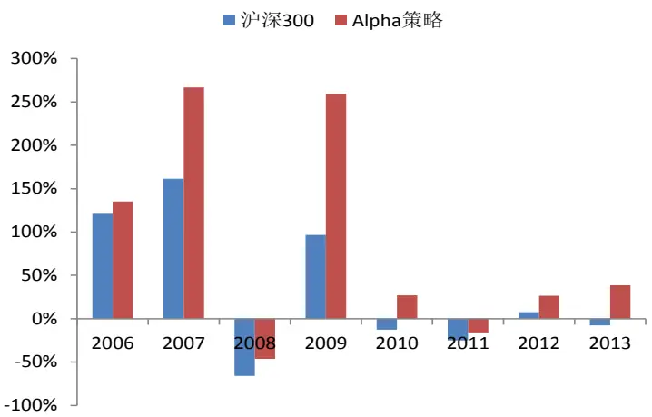
数据来源：广发证券发展研究中心

图9：全市场Alpha策略年度超额收益率
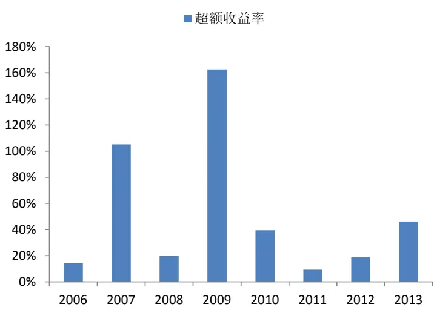
数据来源：广发证券发展研究中心

2006年至今，全市场Alpha策略年度胜率为100%，能够稳定战胜市场。同时其年度历史回报基本优于市场中性Alpha策略。

## 二、 基于 PT思想的月内增强策略

## （一）研究思路

上文中我们对多因子 Alpha策略进行了回顾，并展示了策略历史表现；策略的主要原理在于每个月末对全市场股票进行多因子综合打分，然后选取得分较低的股票构建投资组合（得分越低越好）。本报告的主要思路在于希望投资时不仅仅只是在每个月末进行一次换仓，而是能够在月中也能捕捉到另外一些股票的上涨机会，从而获得超额收益。

“北雁南飞南雁北归”就是我们的思路核心。我们认为，多因子综合打分相近的股票在价格走势上具有趋同的性质。我们假定，当两只打分相近的股票价差拉大到一定程度时，趋同特性将占据主导，使得两只股票价差逐渐回归，此时根据配对交易的思想，我们可以卖出“超涨”的股票，买入“超跌”的股票，从而捕捉到这个获利机会。换一个角度来说，我们这种月内增强的交易思路在于捕捉同为看涨的股票，上涨时点的差异；当一只股票领先上涨时，会使得两只股票价差拉大，这个时候我们进行换仓，就可以再次捕捉到落后上涨股票的上涨机会。

月内增强策略的思路框架如下图所示：

图10：基于PT思想的月内增强策略
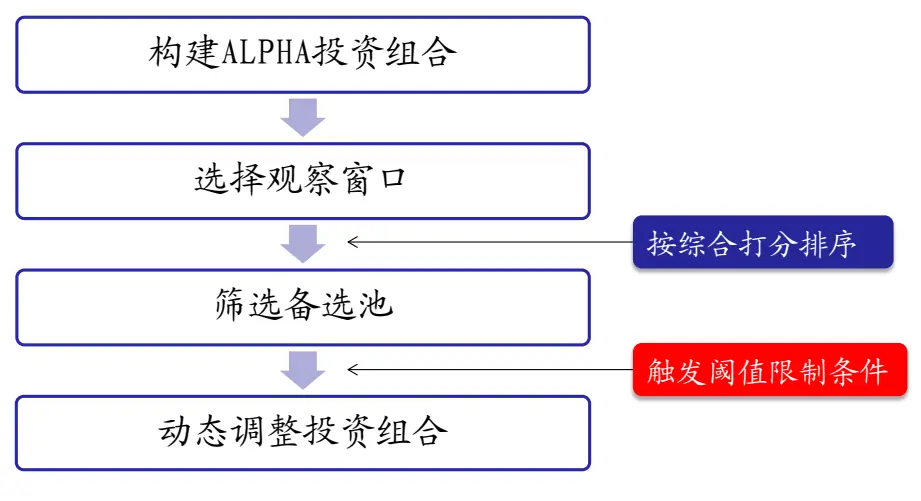
数据来源：广发证券发展研究中心

选择观察窗口时，使用投资组合中打分排名靠后的股票进行观察；备选池则选取全市场中未在投资组合中且打分排名靠前的股票；这样观察窗口与备选池则为打分相近的股票。

## （二） 实施方法

为捕捉月内打分相近股票上涨时点差异，设置阈值δ。

假定投资组合观察窗口股票数量为 N。观察窗口内股票价格：

$$
\mathbb{P}_{1,\mathrm{t}},\mathbb{P}_{2,\mathrm{t}},\dots,\mathbb{P}_{\mathrm{N},\mathrm{t}}
$$

备选池股票价格：

$$
\mathrm{A}_{1,\mathrm{t}},\mathrm{A}_{2,\mathrm{t}},\dots,\mathrm{A}_{\mathrm{N},\mathrm{t}}
$$

若 T时刻触发阈值限制条件，即：

$$
\frac{\underset{i}{\operatorname*{max}}\{P_{i,T}/P_{i,0}\}}{\underset{j}{\operatorname*{min}}\{P_{j,T}/P_{j,0}\}}\geq1+\delta
$$

则根据配对股票进行投资组合的动态调整。

## （三） 举例说明

为了更形象说明我们的月内增强策略，假设有两只看涨股票，股票 1 和股票 2。如下图所示，假设股票 1上涨时点先于股票 2，一般的策略会在月初单独买入股票 1或股票 2，或按一定权重配置股票 1和股票 2，这样会在月末获得正常收益；而使用月内增强策略的话假设月初买入股票 1，在其上涨后两只股票价差拉大，此时我们卖出股票 1而买入股票 2，这样截止到月末时可以再次捕捉到股票 2的上涨收益，最终获得双倍收益。

图11：基于PT思想的月内增强策略示意图
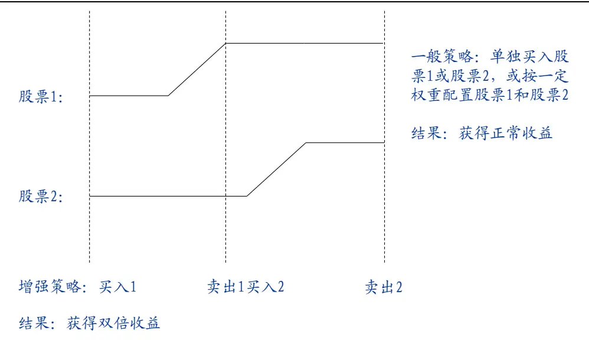
数据来源：广发证券发展研究中心

## 三、 实证分析

前文详述了月内增强策略的思路及实施方法，值得注意的是，我们的月内增强策略涉及到两个变量的选择：窗口大小的设置以及阈值的选择。本节进行实证分析来检验月内增强策略在不同参数条件下的表现情况。

样本选取 2006年 1月至 2014年 3月 A股市场全部历史数据。

## （一）窗口选择

首先我们以全市场Top100等权组合（即之前简称全市场Alpha组合）为研究对象，窗口大小选择20、30、50、100。月内增强超额收益表现如下（阈值设置为5%）：

图12：窗口20、30、50、100全市场Alpha组合月内增强超额收益
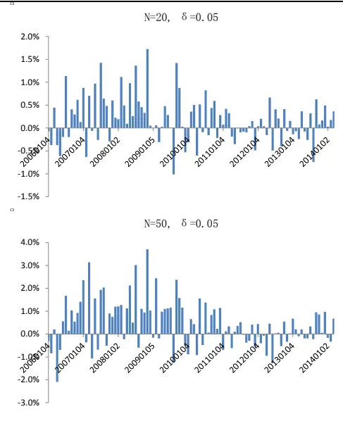

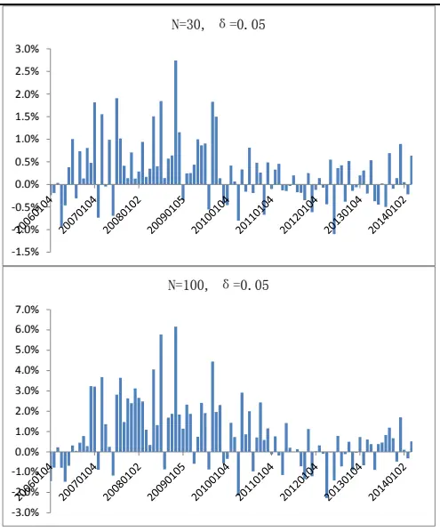
数据来源：广发证券发展研究中心

从形状来看，选择不同大小窗口超额收益图形近似一致；从超额收益大小来看，窗口越大，超额收益绝对值越大。

表6：全市场Alpha组合增强策略超额收益窗口表现

| 窗口大小 | 年化收益率 | 年化波动率 信息比率 |  | 胜率 |
| --- | --- | --- | --- | --- |
| 20 | 2.27% | 1.71% | 1.33 | 62.63% |
| 30 | 3.22% | 2.34% | 1.38 | 62.63% |
| 50 | 5.45% | 3.51% | 1.55 | 64.65% |
| 100 | 9.41% | 5.55% | 1.70 | 66.67% |

数据来源：广发证券发展研究中心

可以看到，超额收益显著为正，增强策略有效性稳定；另外，窗口大小与超额收益大小基本成正相关线性关系，同时不同窗口下胜率基本保持稳定，因此全市场打分前100股票增强策略表现并无显著差异，随窗口扩大月内增强策略可以捕捉到更多时点差异机会，从而获得更高超额收益。

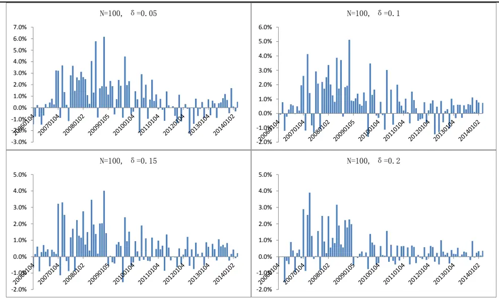
图13：阈值5%、10%、15%、20%全市场Alpha组合月内增强超额收益
数据来源：广发证券发展研究中心

## （二）阈值选择

从上节可以发现，想要获得更高超额收益，捕捉更多上涨时点差异机会，应当选择更大的窗口。本节以全市场Alpha组合为研究对象，窗口大小选择全部投资组合股票池，阈值选择5%、10%、15%、20%，超额收益表现如下：

阈值越高，越可以捕捉上涨时点差异股票更多收益，但同时高阈值代表的高限制条件会限制阈值触发次数，减少交易频率，降低捕捉到交易机会的次数。因此阈值选择方面需要谨慎处理。

表7：全市场Alpha组合不同阈值超额收益表现

| 阈值 年化收益率 年化波动率 信息比 胜率 最大回撤 月均换手率 |  |  |  |  |  |  |
| --- | --- | --- | --- | --- | --- | --- |
| 1% | 5.36% | 6.04% | 0.89 | 55.56% | -14.77% | 196.83% |
| 2% | 7.44% | 6.02% | 1.24 | 58.59% | -10.52% | 150.19% |
| 3% | 8.51% | 5.82% | 1.46 | 62.63% | -8.23% | 122.28% |
| 4% | 9.17% | 5.66% | 1.62 | 67.68% | -6.26% | 102.78% |
| 5% | 9.41% | 5.55% | 1.70 | 66.67% | -5.98% | 87.96% |
| 6% | 9.63% | 5.24% | 1.84 | 71.72% | -3.82% | 77.05% |
| 7% | 9.59% | 5.14% | 1.87 | 73.74% | -3.36% | 68.15% |
| 8% | 9.07% | 4.84% | 1.88 | 70.71% | -2.90% | 61.06% |
| 9% | 8.49% | 4.61% | 1.84 | 71.72% | -3.42% | 54.55% |
| 10% | 8.64% | 4.48% | 1.93 | 70.71% | -2.60% | 49.36% |
| 11% | 8.29% | 4.25% | 1.95 | 73.74% | -2.05% | 44.72% |

识别风险，发现价值

| 12% | 8.04% | 4.05% | 1.98 | 72.73% | -1.96% | 40.81% |
| --- | --- | --- | --- | --- | --- | --- |
| 13% | 7.67% | 4.01% | 1.91 | 70.71% | -1.84% | 37.20% |
| 14% | 7.26% | 3.87% | 1.88 | 67.68% | -1.71% | 33.86% |
| 15% | 6.75% | 3.60% | 1.88 | 68.69% | -1.55% | 31.03% |
| 16% | 6.53% | 3.37% | 1.94 | 70.71% | -1.41% | 28.30% |
| 17% | 6.11% | 3.31% | 1.85 | 72.73% | -1.37% | 25.87% |
| 18% | 5.47% | 3.24% | 1.69 | 71.72% | -1.46% | 23.76% |
| 19% | 5.29% | 3.21% | 1.65 | 69.70% | -2.50% | 21.83% |
| 20% | 5.35% | 3.21% | 1.67 | 69.70% | -2.26% | 20.11% |

数据来源：广发证券发展研究中心

这点特性如同物理学中的测不准原理，想要在单次交易中获得更高超额收益，则会降低总交易次数，而若要确保交易次数，则需要降低阈值，从而单次交易超额收益会受到影响。阈值选择方面则是仁者见仁，智者见智。

## （三）全市场 Alpha 组合月内增强展示

从上图看到阈值6%时超额收益达到最大值，首先以此为例展示月内增强策略所产生的超额收益。

表8：全市场Top100等权组合6%阈值增强策略超额收益表现

| 样本周期 | 年化收益率 | 年化波动率 | 信息比率 | 胜率 | 最大回撤 |
| --- | --- | --- | --- | --- | --- |
| 2006.1-2014.3 | 9.63% | 5.24% | 1.84 | 71.72% | -3.82% |

数据来源：广发证券发展研究中心

图14：增强策略与原Alpha策略累积收益对比
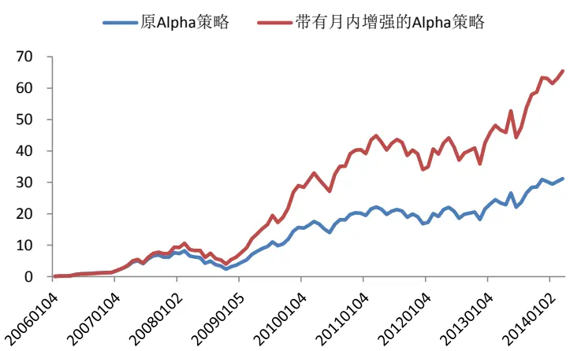
数据来源：广发证券发展研究中心

图15：全市场增强策略单月及累积超额收益

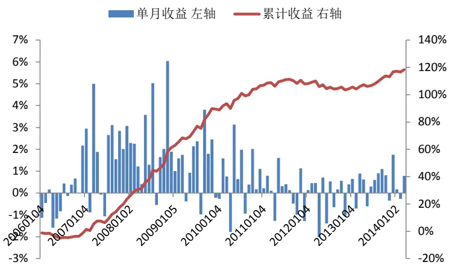
数据来源：广发证券发展研究中心

从上图来看，增强策略超额收益稳定性较好，胜率保持在70%以上，同时在历史八年间，最大回撤在3.82%。相对于原Alpha策略，月内增强策略能够显著增强Alpha策略回报率。计算策略回报时已涵盖3‰交易成本。

图16：月内增强策略单月换手
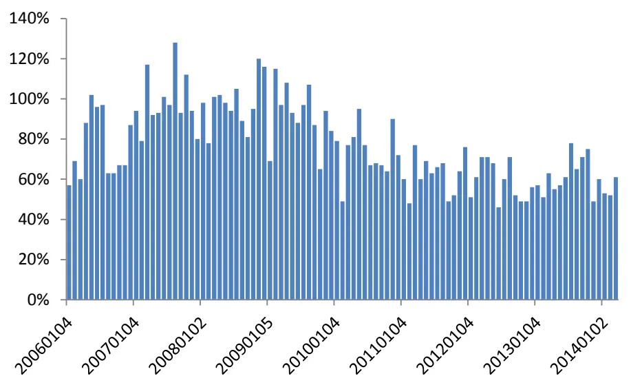
数据来源：广发证券发展研究中心

从上图来看，全市场Alpha组合增强策略在样本区间99个月内总计月内换手次数7628次，平均每月换手77次，换手率接近80%，月内增强策略能有效捕捉月内交易机会，把握股票上涨时点的差异并加以利用，下面展示更多阈值下，月内增强策略表现。

表9：全市场Top100等权组合5%阈值增强策略超额收益表现

| 样本周期 | 年化收益率 | 年化波动率 | 信息比率 | 胜率 | 最大回撤 |
| --- | --- | --- | --- | --- | --- |
| 2006.1-2014.3 | 9.41% | 5.55% | 1.70 | 66.67% | -5.98% |

数据来源：广发证券发展研究中心
识别风险，发现价值

图17：增强策略与原Alpha策略累积收益对比
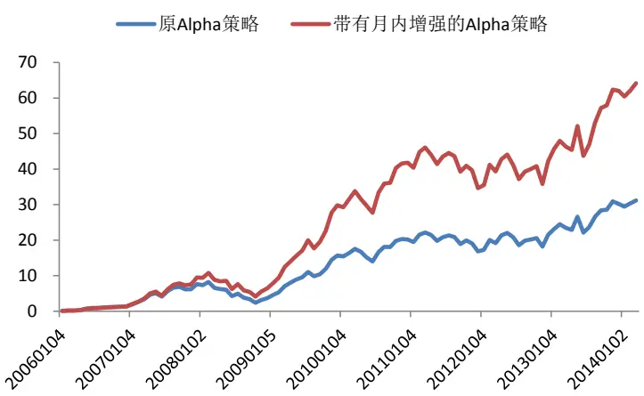
数据来源：广发证券发展研究中心

图18：全市场增强策略单月及累积超额收益
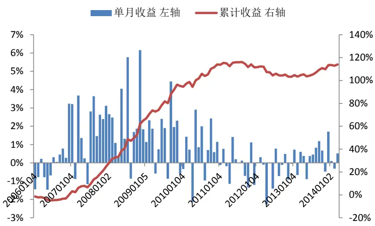
数据来源：广发证券发展研究中心

表10：全市场Top100等权组合10%阈值增强策略超额收益表现

| 样本周期 | 年化收益率 | 年化波动率 | 信息比率 | 胜率 | 最大回撤 |
| --- | --- | --- | --- | --- | --- |
| 2006.1-2014.3 | 8.64% | 4.48% | 1.93 | 70.71% | -2.60% |

数据来源：广发证券发展研究中心

图19：增强策略与原Alpha策略累积收益对比

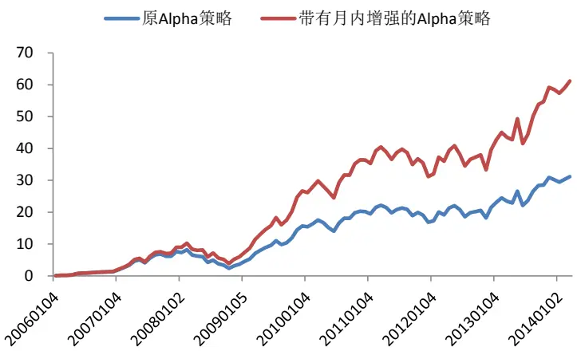
数据来源：广发证券发展研究中心

图20：全市场增强策略单月及累积超额收益
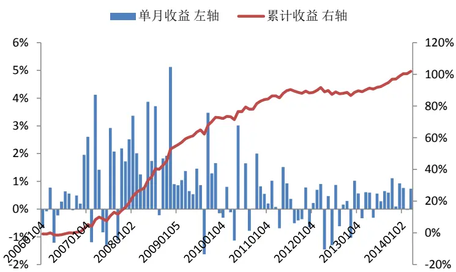
数据来源：广发证券发展研究中心

表11：全市场Top100等权组合15%阈值增强策略超额收益表现

| 样本周期 | 年化收益率 | 年化波动率 | 信息比率 | 胜率 | 最大回撤 |
| --- | --- | --- | --- | --- | --- |
| 2006.1-2014.3 | 6.75% | 3.60% | 1.88 | 68.69% | -1.55% |

数据来源：广发证券发展研究中心

图21：增强策略与原Alpha策略累积收益对比

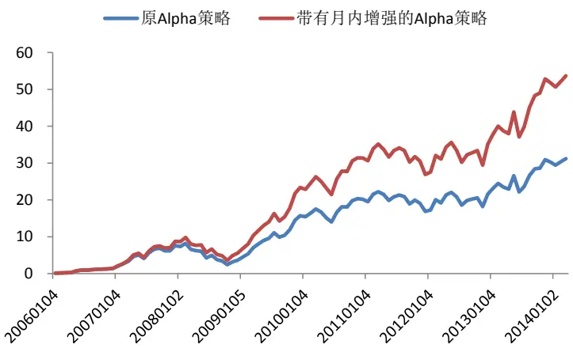
数据来源：广发证券发展研究中心

图22：全市场增强策略单月及累积超额收益
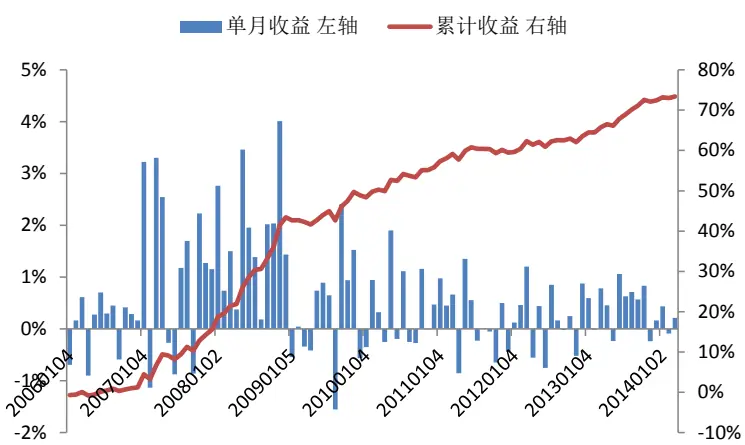
数据来源：广发证券发展研究中心

表12：全市场Top100等权组合20%阈值增强策略超额收益表现

| 样本周期 | 年化收益率 | 年化波动率 | 信息比率 | 胜率 | 最大回撤 |
| --- | --- | --- | --- | --- | --- |
| 2006.1-2014.3 | 5.35% | 3.21% | 1.67 | 69.70% | -2.26% |

数据来源：广发证券发展研究中心

图23：增强策略与原Alpha策略累积收益对比

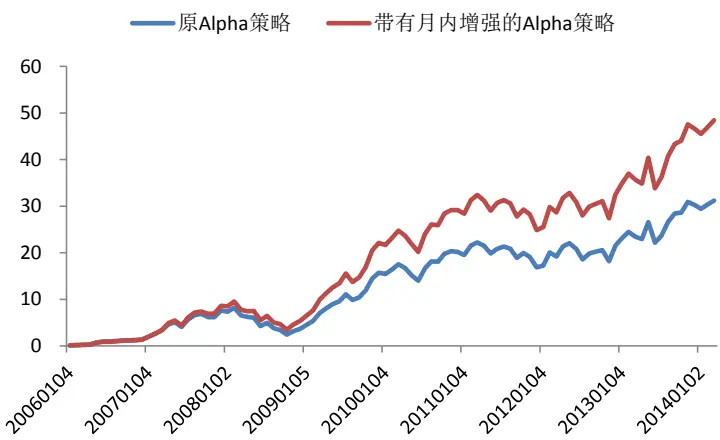
数据来源：广发证券发展研究中心

图24：全市场增强策略单月及累积超额收益
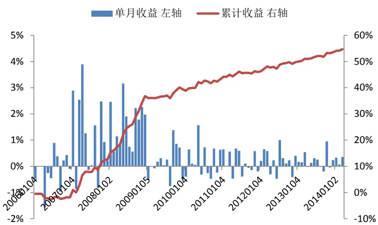
数据来源：广发证券发展研究中心

从上图来看，此增强策略超额回报率略弱，但稳定性较好，能够维持较稳定的正超额收益，近年来震荡行情中累积收益仍能保持稳定上涨。

## （四）行业中性 Alpha 组合月内增强展示

首先以6%阈值为例展示月内增强策略所产生的超额收益。

表13：行业中性组合6%阈值增强策略超额收益表现

| 样本周期 | 年化收益率 | 年化波动率 | 信息比率 | 胜率 | 最大回撤 |
| --- | --- | --- | --- | --- | --- |
| 2006.1-2014.3 | 4.98% | 3.96% | 1.26 | 62.63% | -6.09% |

数据来源：广发证券发展研究中心

图25：增强策略与原Alpha策略累积收益对比

数据来源：广发证券发展研究中心

图26：行业中性增强策略单月及累积超额收益
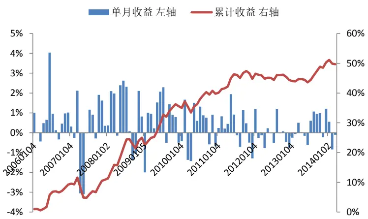
数据来源：广发证券发展研究中心

从上图来看，市场中性组合相较于全市场等权组合表现略弱，这是因为市场中性组合考虑到不同行业间的权重分布，使之等同于沪深300组合的行业分布；而大权重行业，如银行类股票收益及波动较小，同时行业内股票收益趋同，触发阈值限制次数较少，超额收益不足，从而影响到增强策略总体表现。

图27：月内增强策略单月换手

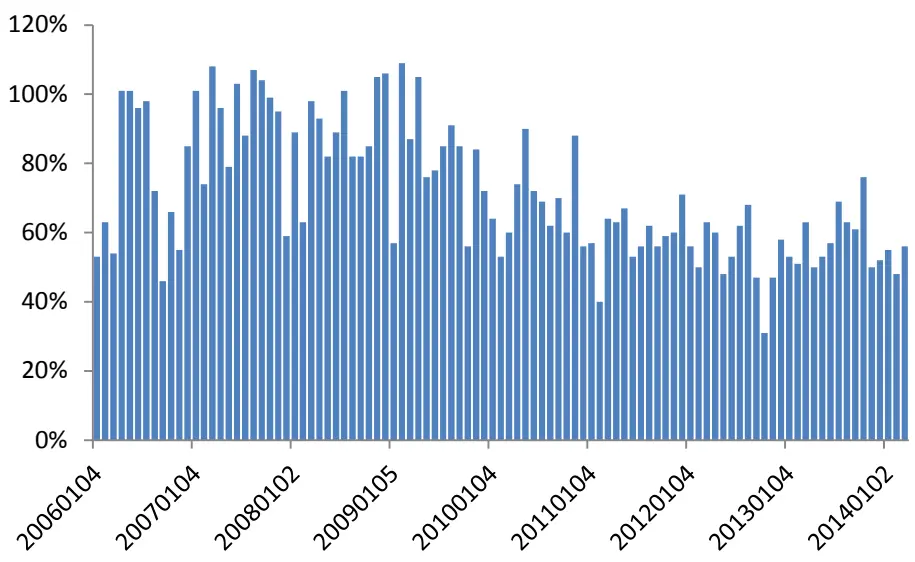
数据来源：广发证券发展研究中心

从上图来看，行业中性组合增强策略在样本区间99个月内总计月内换手次数7089次，平均每月换手72次，换手率在70%以上，因此月内增强策略能有效捕捉月内交易机会，把握股票上涨时点的差异并加以利用。

下面展示更多阈值下，月内增强策略表现.

表14：行业中性组合5%阈值增强策略超额收益表现

| 年化收益率 年化波动率 信息比率 胜率 最大回撤 月换手率 |  |  |  |  |  |
| --- | --- | --- | --- | --- | --- |
| 4.98% | 4.04% | 1.23 | 63.64% | -5.65% | 83.40% |

数据来源：广发证券发展研究中心

图28：增强策略与原Alpha策略累积收益对比
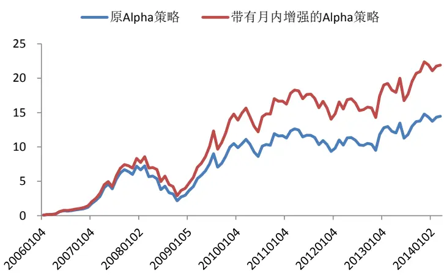
数据来源：广发证券发展研究中心

图29：行业中性增强策略单月及累积超额收益

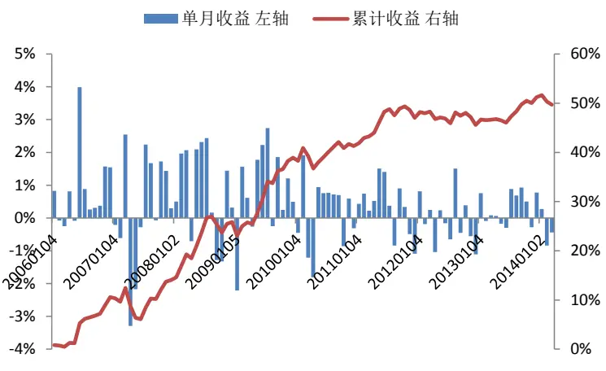
数据来源：广发证券发展研究中心

表15：行业中性组合10%阈值增强策略超额收益表现

| 年化收益率 年化波动率 信息比率 胜率 最大回撤 |  |  |  |  | 月换手率 |
| --- | --- | --- | --- | --- | --- |
| 4.95% | 3.37% | 1.47 | 67.68% | -4.32% | 42.54% |

数据来源：广发证券发展研究中心

图30：增强策略与原Alpha策略累积收益对比
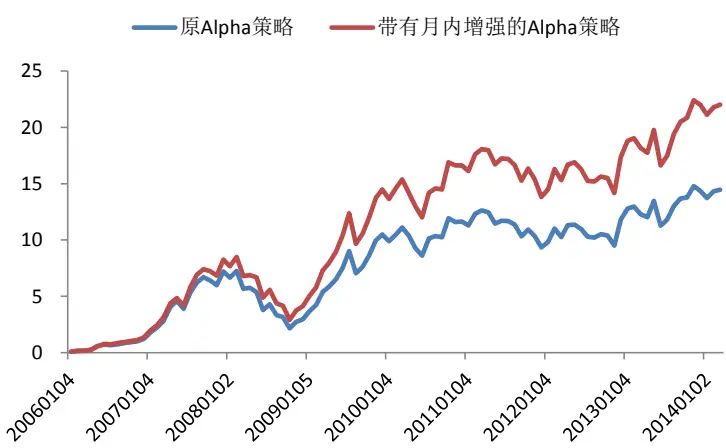
数据来源：广发证券发展研究中心

图31：行业中性增强策略单月及累积超额收益

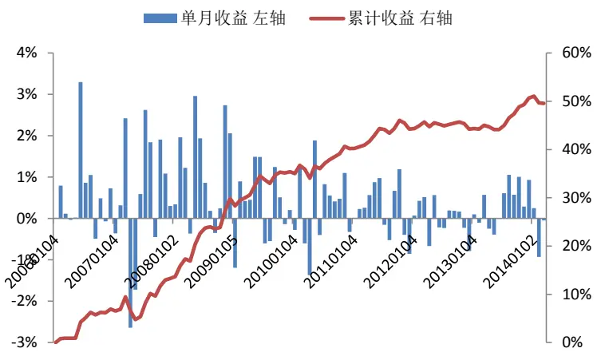
数据来源：广发证券发展研究中心

表16：行业中性组合15%阈值增强策略超额收益表现

| 年化收益率 年化波动率 信息比率 胜率 最大回撤 |  |  |  |  | 月换手率 |
| --- | --- | --- | --- | --- | --- |
| 2.90% | 3.00% | 0.97 | 62.63% | -6.29% | 24.02% |

数据来源：广发证券发展研究中心

图32：增强策略与原Alpha策略累积收益对比
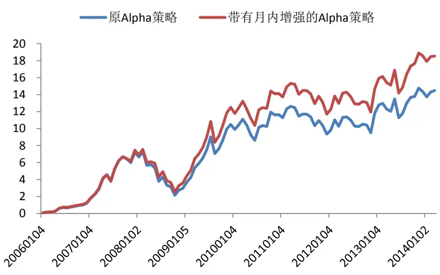
数据来源：广发证券发展研究中心

图33：行业中性增强策略单月及累积超额收益

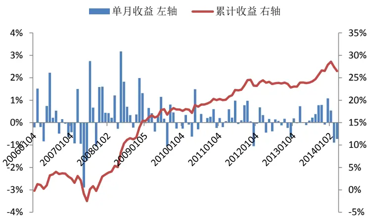
数据来源：广发证券发展研究中心

表17：行业中性组合20%阈值增强策略超额收益表现

| 年化收益率 年化波动率 信息比率 胜率 最大回撤 |  |  |  |  | 月换手率 |
| --- | --- | --- | --- | --- | --- |
| 2.34% | 2.46% | 0.95 | 63.64% | -4.99% | 14.19% |

数据来源：广发证券发展研究中心

图34：增强策略与原Alpha策略累积收益对比
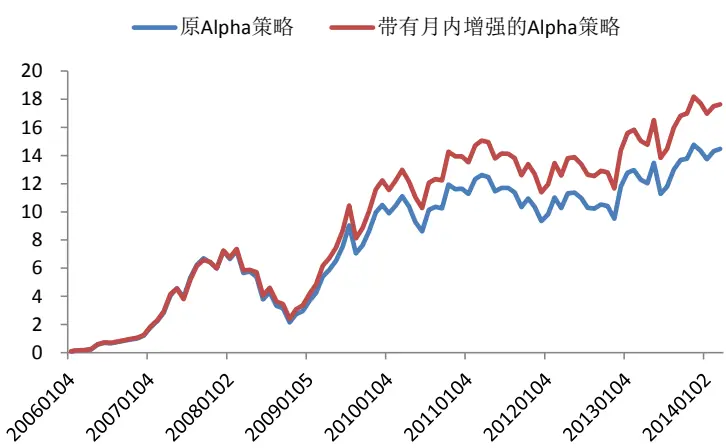
数据来源：广发证券发展研究中心

图35：行业中性增强策略单月及累积超额收益

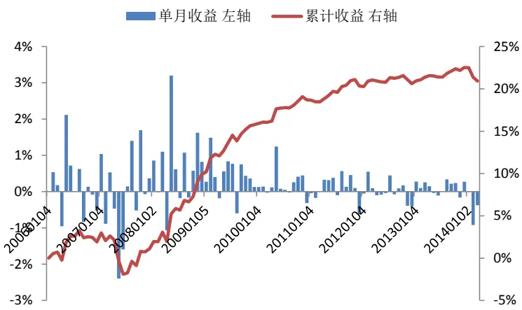
数据来源：广发证券发展研究中心

## 四、 总结和展望

本报告对传统多因子Alpha策略进行月内增强，核心思想在于捕捉看涨股票的上涨时点差异，从而获得超额收益。从实证结果看，本增强策略可以有效获得较为稳定且相对可观的超额收益，是对原Alpha策略的有效增强。

此外，未来可尝试优化动态调仓时配对算法，预计超额收益还可以有一定的提升。

## 风险提示

策略模型并非百分百有效，市场结构及交易行为的改变或者交易参与者的增多有可能使得策略失效。

## 广发证券—行业投资评级说明

买入： 预期未来12个月内，股价表现强于大盘10%以上。

持有： 预期未来12个月内，股价相对大盘的变动幅度介于-10%～+10%。

卖出： 预期未来12个月内，股价表现弱于大盘10%以上。

## 广发证券—公司投资评级说明

买入： 预期未来12个月内，股价表现强于大盘15%以上。

谨慎增持： 预期未来12个月内，股价表现强于大盘5%-15%。

持有： 预期未来12个月内，股价相对大盘的变动幅度介于-5%～+5%。

卖出： 预期未来12个月内，股价表现弱于大盘5%以上。

## 联系我们

|  | 广州市 | 深圳市 | 北京市 | 上海市 |
| --- | --- | --- | --- | --- |
| 地址 | 广州市天河北路183号 大都会广场5楼 | 深圳市福田区金田路4018 号安联大厦 15 楼 A 座 | 北京市西城区月坛北街2号 月坛大厦18层 | 上海市浦东新区富城路99号 震旦大厦18楼 |
| 邮政编码 | 510075 | 03-04 |  |  |
| 客服邮箱 |  | 518026 | 100045 | 200120 |
|  | gfyf@gf.com.cn |  |  |  |
| 服务热线 | 020-87555888-8612 |  |  |  |

## 免责声明

广发证券股份有限公司具备证券投资咨询业务资格。本报告只发送给广发证券重点客户，不对外公开发布。

本报告所载资料的来源及观点的出处皆被广发证券股份有限公司认为可靠，但广发证券不对其准确性或完整性做出任何保证。报告内容仅供参考，报告中的信息或所表达观点不构成所涉证券买卖的出价或询价。广发证券不对因使用本报告的内容而引致的损失承担任何责任，除非法律法规有明确规定。客户不应以本报告取代其独立判断或仅根据本报告做出决策。

广发证券可发出其它与本报告所载信息不一致及有不同结论的报告。本报告反映研究人员的不同观点、见解及分析方法，并不代表广发证券或其附属机构的立场。报告所载资料、意见及推测仅反映研究人员于发出本报告当日的判断，可随时更改且不予通告。

本报告旨在发送给广发证券的特定客户及其它专业人士。未经广发证券事先书面许可，任何机构或个人不得以任何形式翻版、复制、刊登、转载和引用，否则由此造成的一切不良后果及法律责任由私自翻版、复制、刊登、转载和引用者承担。