# 基于风格回复的多因子动态调仓策略

## ——多因子 Alpha 系列报告之（二十）

## Table_Sum ary报告摘要 ：

## 多因子 Alpha策略的历史表现

我们从建立的风格因子库里选取四大类因子，分别为估值类因子：E/P；技术指标：一月股价动量；规模因子：流通市值以及流通性因子：换手率。因子间采用等权重配置，通过月末打分选取得分最高的 120 只股票构建全市场Alpha 组合，对冲标的为沪深300。从05年1 月到14年6月，该策略年化收益率达到 26.70%，年化波动率为 13.92%，信息比率 1.92，胜率 58.13%，最大回撤 30.92%。对冲策略回撤主要集中在 2006到2007年间，2009年后单边行情转为震荡行情，多因子 alpha选股策略胜率、稳定性得到明显提升。

## 基于风格回复的组合调仓策略

由于因子在月中并非一成不变，而是在波动前进，本篇报告试图观察因子出现极端的变化导致的风格偏移，将相应出现极端情况的组合内的股票和备选池中的股票进行对调，以期规避特定因子特征减弱的失效股票下跌所带来的损失，同时又可以获得因子特征增强的新股票补涨的收益。

我们将首先阐述单个因子调仓的流程并做出相应的结果展示，为了规避单个因子失效带来的风险，同时也为了进一步降低月中的换手率，我们又提出了多个因子调仓的策略，同样做出策略实现流程的阐述。

## 实证分析

历史回测表明，多个调仓因子策略相对于原始策略在超额累计净值、胜率、回撤方面均有优势，并且月中平均换手率只有 35%，不会大幅提高。而从分年度的角度来看，除了在10年没有改善之外，新策略在其它年度都一定程度的改善，表现比较稳定。并且可以看到，新策略相对于原始策略的月度超额收益大部分是正的，平均值为0.24%。

## 核心风险

风格回复本身未必导致相应的个股未来收益也将回复，此为最大风险点，其次月中调仓将导致组合换手率大幅提升，将损失一定的收益，请在收益与换手自荐自行权衡。

图 1： 策略历史回测
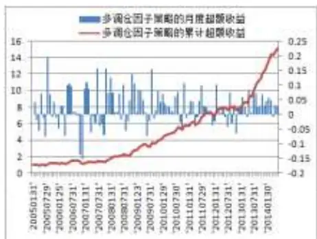

表 1：策略分年度表现

| 时间 | 超额 收益 | 胜率 | 最大 回撤 |
| --- | --- | --- | --- |
| 全样本 | 1410% | 59.36% | 29.8% |
| 2005 | 23.03% | 57.40% | 6.04% |
| 2006 | -4.22% | 51.45% | 14.8% |
| 2007 | 47.75% | 53.31% | 8.69% |
| 2008 | 68.50% | 60.16% | 5.68% |
| 2009 | 55.62% | 61.07% | 6.51% |
| 2010 | 40.02% | 64.88% | 6.35% |
| 2011 | 25.16% | 58.61% | 3.84% |
| 2012 | 10.50% | 55.14% | 5.84% |
| 2013 | 58.82% | 69.33% | 2.18% |
| 2014 | 21.34% | 65.25% | 2.28% |

图2：策略分年度表现
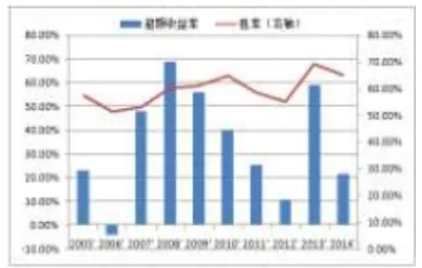

Table_Aut hor 分析师： 史庆盛 S0260513070004

020-87555888-8618

sqs@gf.com.cn

## Table_Report 相关研究：

笑看北雁南飞南雁北归——2014-06-13
多因子 Alpha系列报告之（十
九）

## 一、多因子 Alpha 策略回顾

在之前的多因子 Alpha 系列报告中，我们建立了一个完善的多因子 Alpha 选股模型。这里我们首先对整个模型的框架进行回顾，然后简要展示多因子 Alpha 策略的历史表现。

## 1.1 广发多因子框架简述

我们建立了一个完善的风格因子跟踪及多因子量化选股体系，整个体系框架可分为四个步骤，如图 3 所示：

步骤1：建立风格因子数据库，将市场上可能受到关注的大量因子汇集到一起，经过初步加工（即数据预处理）之后，得到可用于统计分析的因子数据以及个股收益数据，步骤1是整个框架的基础，数据的完整性及有效性将直接影响模型的结果；

步骤2：运用多个度量指标，对风格因子数据库中每个因子的有效性进行多维度刻画，并从中挑选出能够产生稳定Alpha的因子，这个层面的工作是整个框架的核心；

步骤3：完成了Alpha因子挑选，即确定了当前可用的Alpha 因子之后，接下来便是对 Alpha因子进行整合，并挑选相应的个股进行投资，该层次的工作最具难度，也是许多多因子模型之间相互区别的重要原因，较常见的方式是对因子及个股进行简单平均加权。

步骤 4：最后是选择股指期货或 ETF 等工具对多因子组合进行对冲，获取 alpha收益。

图 3：基于多因子的alpha策略框架
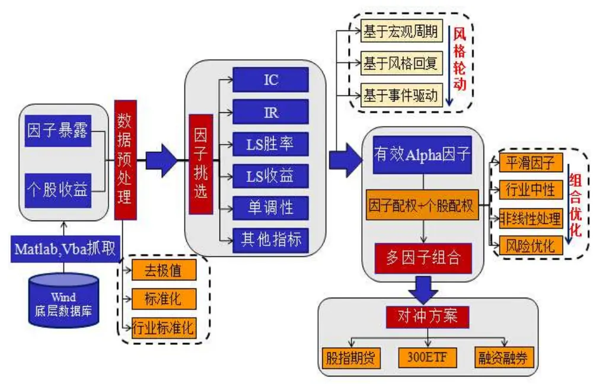
数据来源：广发证券发展研究中心

## 1.2 多因子 Alpha 策略历史表现

本小节我们将对多因子Alpha策略的历史表现进行回顾。首先我们从建立的风格因子库中选取表2所列四大类风格Alpha因子：

表 2：Alpha 因子选择

| 因子风格 | 因子名称 |
| --- | --- |
| 估值类因子 | E/P |
| 技术类指标 | 一月股价动量 |
| 规模类因子 | 流通市值 |
| 流通性因子 | 换手率 |

数据来源：广发证券发展研究中心

其中估值类Alpha因子经过行业中性、去极值处理（详见系列报告前篇），在四类因子间采用等权重配置进行综合打分。其中行业划分我们以申万一级行业为标准。

每个月末对A股全市场的股票进行打分排序后，我们选取排名靠前的120支股票进行等权重配置来构建全市场Alpha组合，选用的对冲标的为沪深300。

表 3：全市场因子对冲策略表现（非行业中性）

| 样本周期 | 年化收益率 | 年化波动率 | 信息比率 | 胜率 | 最大回撤 |
| --- | --- | --- | --- | --- | --- |
| 2005.01-2014.06 | 26.70% | 13.92% | 1.92 | 58.13% | 30.92% |

数据来源：广发证券发展研究中心

图 4：在沪深 300与全市场 Alpha策略累积收益
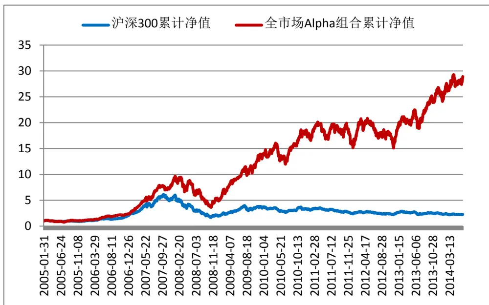
数据来源：广发证券发展研究中心

图 5：全市场对冲策略单月及累积收益
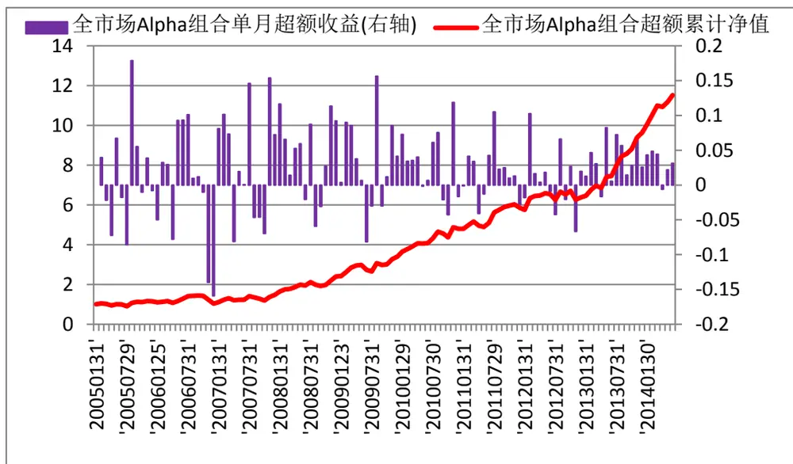
数据来源：广发证券发展研究中心

可以看到，对冲策略回撤主要集中在2006到2007年间，2009年后单边行情转为震荡行情，多因子alpha选股策略胜率、稳定性得到明显提升。

表4：Alpha策略年度回报率（非行业中性）

| 年份 | 沪深300 Alpha 策略 | 超额收益 |
| --- | --- | --- |
| 2005 | 0.61% 15.04% | 14.43% |
| 2006 | 125.11% | 119.10% -6.01% |
| 2007 | 178.68% 223.55% | 44.87% |
| 2008 | -60.69% | -3.48% 57.22% |
| 2009 | 97.78% 150.07% | 52.29% |
| 2010 | -6.97% | 35.62% 42.59% |
| 2011 | -26.42% | -3.31% 23.11% |
| 2012 | 12.00% | 21.38% 9.38% |
| 2013 | -5.85% | 44.74% 50.59% |
| 2014 | -6.16% | 13.51% 19.67% |

数据来源：广发证券发展研究中心

图 6：沪深 300与全市场 Alpha策略年度回报

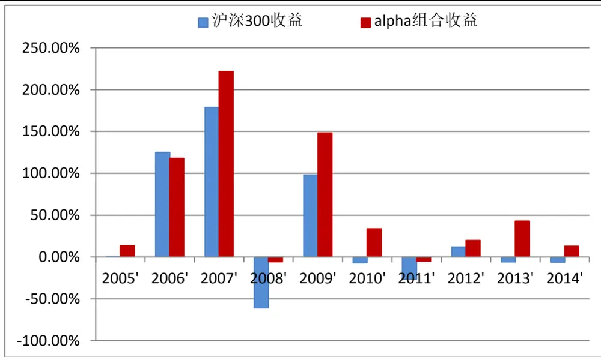
数据来源：广发证券发展研究中心

图 7：全市场 Alpha策略年度超额收益率
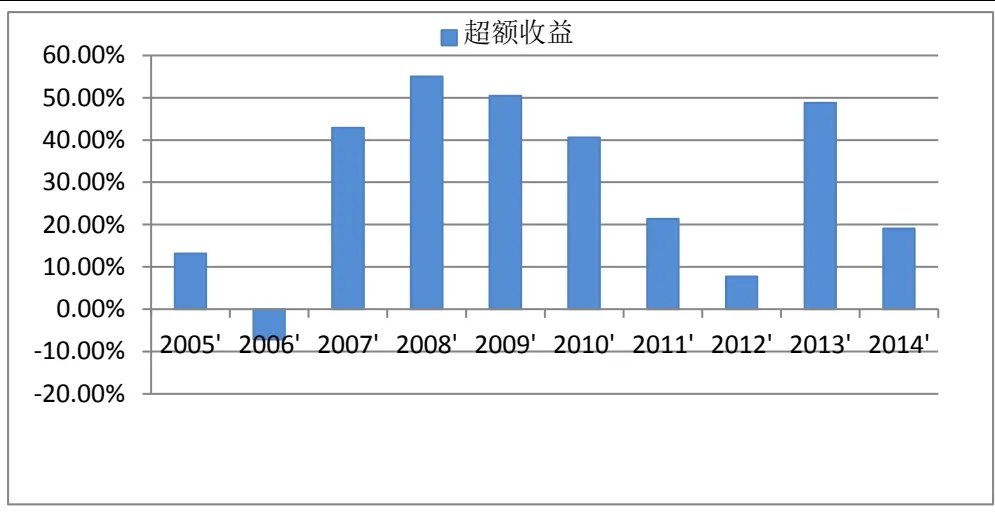
数据来源：广发证券发展研究中心

从2005年至今的统计结果来看，除了06年出现负的超额收益以外，其它年度均能获得比较稳定的高收益。

## 二、基于风格回复的组合调仓策略

上述回顾的策略是月末多因子打分模型，事实上，因子回报在月中是曲折前进的，这就是为什么我们考虑要在上述模型进行月中调仓的原因。如何规避因子波动的风险呢？进行调仓是一个解决问题的方向。而调仓的周期无非分为固定与不固定，如何权衡调仓所带来的收益和成本是个关键的问题。

图 8：因子值的月中变化

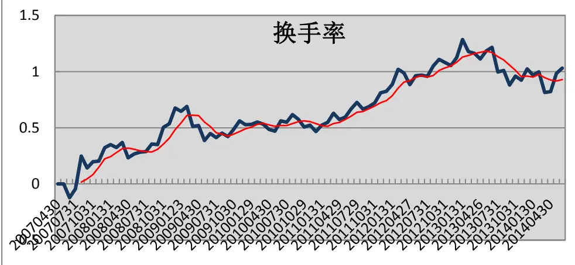
数据来源：广发证券发展研究中心

## 2.1调仓策略的分类

## 2.1.1 第一大类：定期调仓

简单地通过将因子打分的频率由每月末评估一次改成日频率，每日根据最新打分结果配置股票。本质上是一种高频的调仓策略，可能导致的结果是换手率高，组合收益被交易成本蚕食。

图 9：日频多因子打分模型下的日换手率
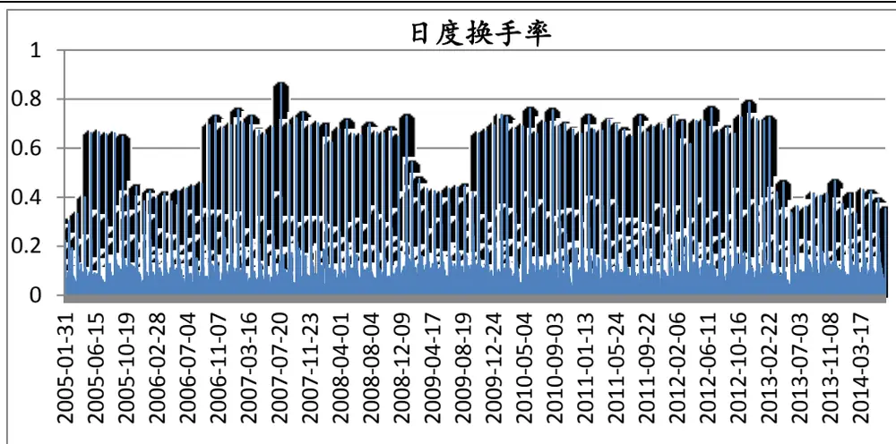
数据来源：广发证券发展研究中心

图 10：月末打分模型与日频多因子打分模型的累计净值比较

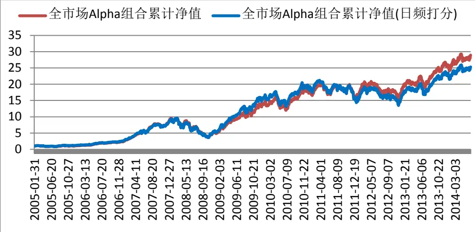
数据来源：广发证券发展研究中心

## 2.1.2第二大类：事件触发调仓

同样是采用日频数据,事件触发通过每日观察特定事件是否存在来代替每日打分，若无特定事件发生，则保持原先仓位，一旦触发特定事件，则进行相应地部分调仓重新构建组合。与简单地通过将因子打分的频率由每月末评估一次改成日频率的策略相比较，事件触发并非每时每刻都会进行调仓，因此换手率的增加程度会相对弱一点，同时它又可以捕捉到市场变化，及时调整以获得更多的收益。本质上是在收益与高换手率带来的成本之间做权衡。

图 11：事件类型
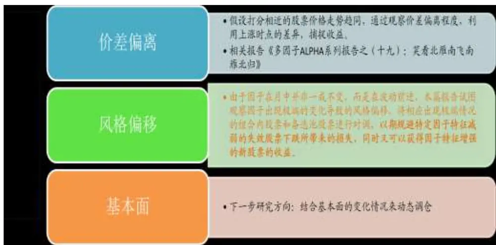
数据来源：广发证券发展研究中心

## 2.2 价差配对策略回顾

## 2.2.1 基本思想

在上一篇报告《笑看北雁南飞南雁北归》中，我们提出了价差配对的动态调仓的想法。我们认为，多因子综合打分相近的股票在价格走势上具有趋同的性质。我们假定，当两只打分相近的股票价差拉大到一定程度时，趋同特性将占据主导，使得两只股票价差逐渐回归，此时根据配对交易的思想，我们可以卖出“超涨”的股票，买入“超跌”的股票，从而捕捉到这个获利机会。换一个角度来说，我们这种月内增强的交易思路在于捕捉同为看涨的股票，上涨时点的差异；当一只股票领先上涨时，会使得两只股票价差拉大，这个时候我们进行换仓，就可以再次捕捉到落后上涨股票的上涨机会。

## 2.2.2价差配对的流程

为捕捉月内打分相近股票上涨时点差异，设置阈值δ。

假定投资组合观察窗口股票数量为N。观察窗口内股票价格：

$$
P_{1,t},P_{2,t},.....P_{N,t}
$$

备选池股票价格：

$$
A_{1\textit{ t }},A_{2t\beta}\ldots A_{N}
$$

若T时刻触发阈值限制条件，即：

$$
\frac{\underset{i}{\operatorname*{max}}\{P_{i,T}/P_{i,0}\}}{\underset{j}{\operatorname*{min}}\{A_{j,T}/A_{j,0}\}}>1+\delta
$$

则根据配对股票进行投资组合的动态调整。

整个价差配对的思路框架如下图所示：

图 12：价差配对的思路框架
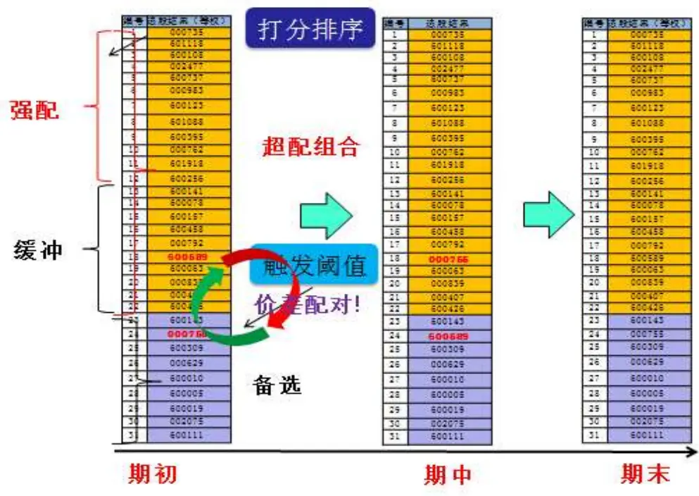
数据来源：广发证券发展研究中心

## 2.2.3 案例说明

为了更形象说明我们的月内增强策略，假设有两只看涨股票，股票 1和股票2。如下图所示，假设股票1上涨时点先于股票 2，一般的策略会在月初单独买入股票 1或股票 2，或按一定权重配置股票 1 和股票2，这样会在月末获得正常收益；而使用月内增强策略的话假设月初买入股票 1，在其上涨后两只股票价差拉大，此时我们卖出股票 1而买入股票2，这样截止到月末时可以再次捕捉到股票 2的上涨收益，最终获得双倍收益。

图 13：价差配对月内增强示意图
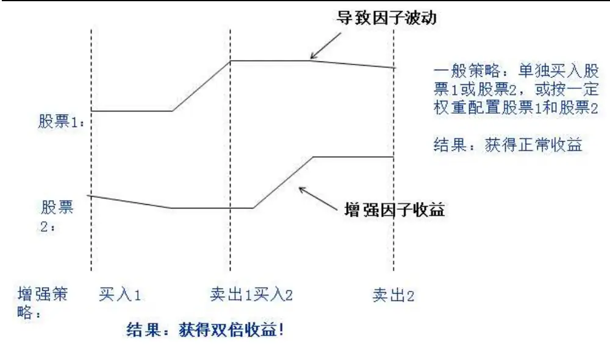
数据来源：广发证券发展研究中心

## 2.2.4价差配对结果对比

图 14：价差配对策略与原始四因子模型超额累计净值对比
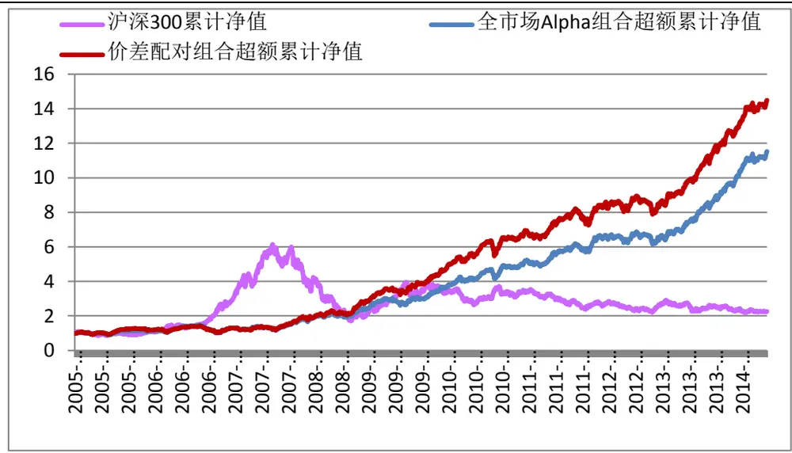
数据来源：广发证券发展研究中心

图 15：价差配对策略日度换手率

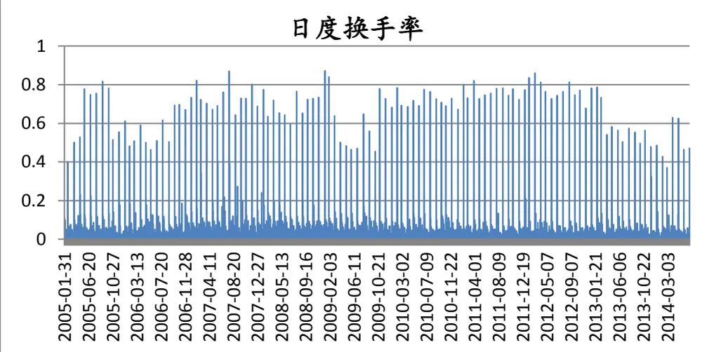
数据来源：广发证券发展研究中心

表5：分年度表现对比

| 分年度 | 价差配对策略 |  |  | 原始策略 |  |  |
| --- | --- | --- | --- | --- | --- | --- |
|  | 超额收益率 | 胜率 | 回撤 | 超额收益率 | 胜率 | 回撤 |
| 2005' | 26.01% | 56.95% | 7.16% | 14.43% | 54.26% | 7.77% |
| 2006' | -12.73% | 51.45% | 12.87% | -6.01% | 50.62% | 15.40% |
| 2007' | 47.46% | 54.13% | 9.86% | 44.87% | 52.89% | 9.68% |
| 2008' | 79.13% | 64.63% | 7.51% | 57.22% | 59.76% | 6.66% |
| 2009' | 65.02% | 60.25% | 6.12% | 52.29% | 59.84% | 6.95% |
| 2010' | 50.73% | 63.22% | 7.65% | 42.59% | 62.40% | 6.15% |
| 2011' | 17.71% | 55.33% | 4.47% | 23.11% | 58.61% | 3.84% |
| 2012' | 9.98% | 56.79% | 6.51% | 9.38% | 54.32% | 5.76% |
| 2013' | 51.35% | 67.65% | 2.22% | 50.59% | 66.81% | 2.27% |
| 2014' | 14.72% | 62.71% | 1.97% | 19.67% | 65.25% | 2.35% |

数据来源：广发证券发展研究中心

图 16：价差配对策略相对原始策略的月度超额收益
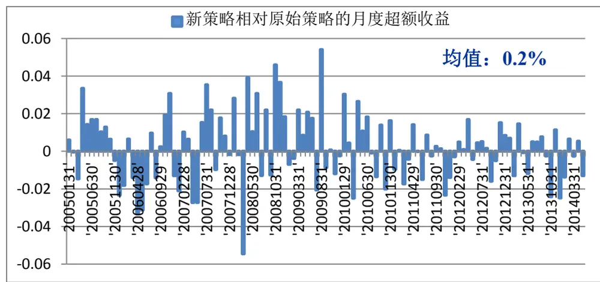
数据来源：广发证券发展研究中心
识别风险，发现价值

图 17：价差配对策略与原始策略换手率对比
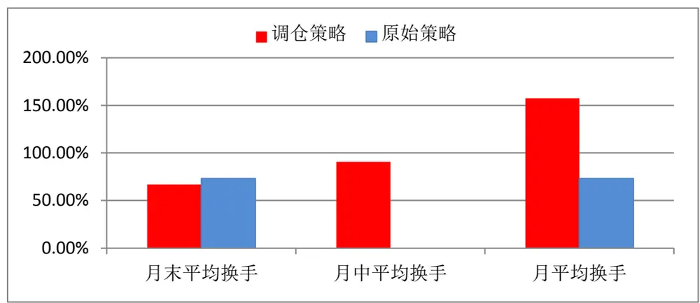
数据来源：广发证券发展研究中心

## 2.3 单个调仓因子策略的原理

## 2.3.1 基本思想

上一节，我们已经回顾了根据价差配对的调仓策略，这一节，我们将做一个更加广泛的推广。由于因子在月中并非一成不变，而是在波动中前进，我们观图察因子出现极端的变化导致的风格偏移，将相应出现极端情况的组合内的股票和备选池中的股票进行对调，以期规避特定因子特征减弱的失效股票下跌所带来的损失，同时又可以获得因子特征增强的新股票补涨的收益。

## 2.3.2单因子调仓的流程

★ 首先确定建仓因子。每月末根据因子打分，确定排名前N 名的股票为超配股票，排名N+1~2N名的股票为备选池股票。

★ 其次确定一个调仓因子。月中每天观测超配股票及备选池股票关于该因子得分在全市场股票中的排名变化（相对于建仓时点）。我们希望将组合内排名下跌厉害的股票与备选池排名上涨最快的股票一一配对，因此将组合内股票列表按排名变化程度降序排列，同时将备选池股票列表按排名变化程度升序排列,再将两个列表的排名变化一一作差，即可以得到配对股票的排名总变化，并且使得下跌最快的组合内股票与上涨最快的备选池股票是对应的、下跌次快的组合内股票与上涨次快的备选池股票也是对应的，依次递延。

★ 最后确定调仓阈值。从配对列表第一位开始检查，当配对的股票排名总变化大于事先确定好的调仓阈值时，就将该两只股票进行对调。因此，每一期都有可能发生多对配对股票调仓。一旦不满足条件，则后面的配对股票不再考虑。

以图18展示的流程来看，可以看到排名下降最快的“鄂尔多斯”在关于调仓因子在建仓时点和观测时点的排名分别为 25和 300，排名变化 275（300-25），而排名上升最快的“维科精华”在两个时点的排名分别为 200和 30，排名变化为-170（30-200），因此该配对股票总排名变化为445（275-（-170））。假设当前的调仓阈值为 90，可以看到有两对股票满足调仓条件。

图 18：单因子调仓流程图

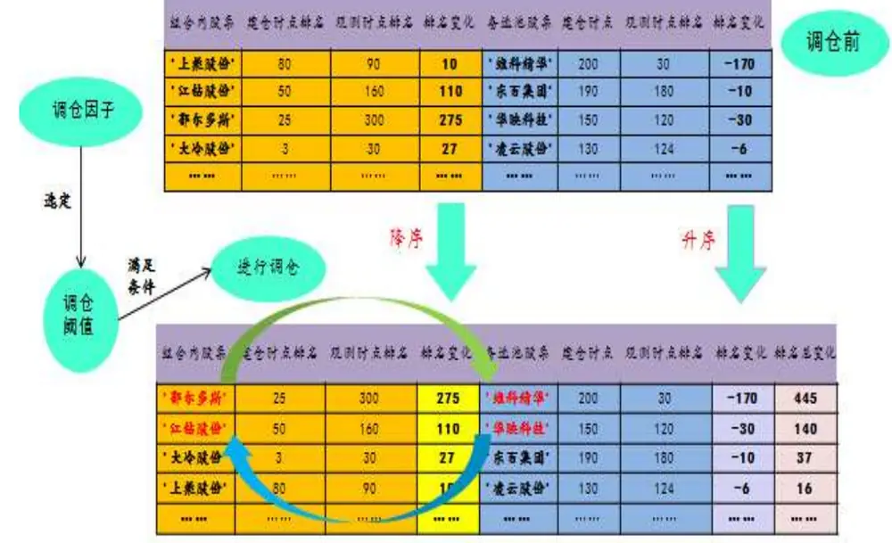
数据来源：广发证券发展研究中心

## 2.3.3 单调仓因子结果展示

## （1）换手率调仓因子

以全市场 Top120 等权组合为研究对象。调仓阈值为 10~200，间隔 10，相应超额收益、胜率表现如下：

图 19：换手率调仓因子策略的超额累计净值及胜率与调仓阈值的关系
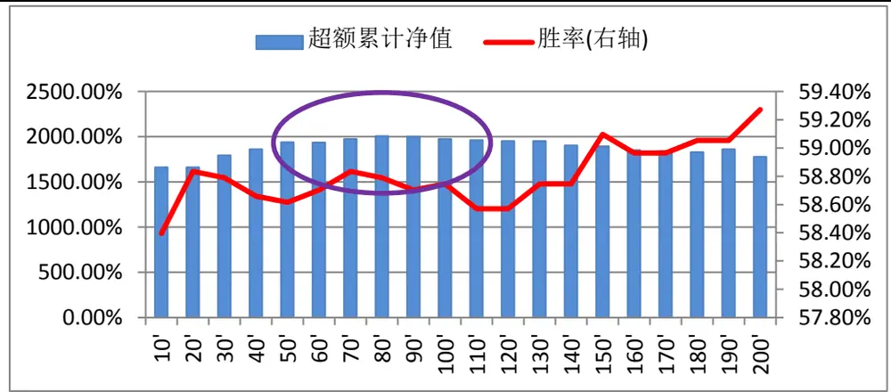
数据来源：广发证券发展研究中心

图 20：换手率与调仓阈值的关系

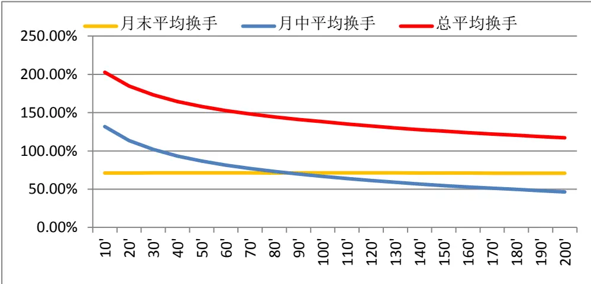
数据来源：广发证券发展研究中心

从上述的统计表现来看，我们最终确定换手率的调仓阈值为 80 。

图 21：换手率调仓因子策略与原始策略超额累计净值对比
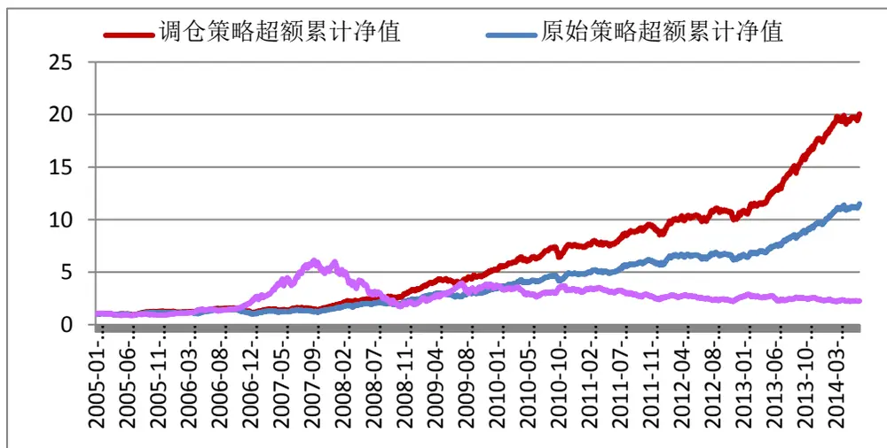
数据来源：广发证券发展研究中心

图 22：换手率调仓因子策略的最大回撤
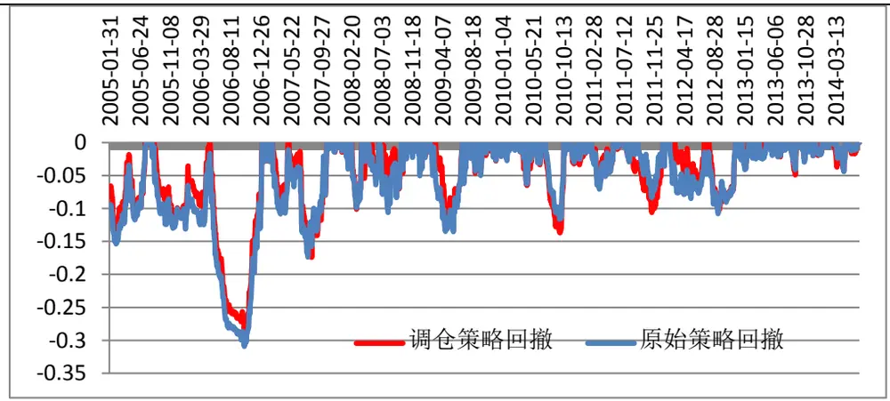
数据来源：广发证券发展研究中心
识别风险，发现价值

图 23：换手率调仓因子策略的日换手率
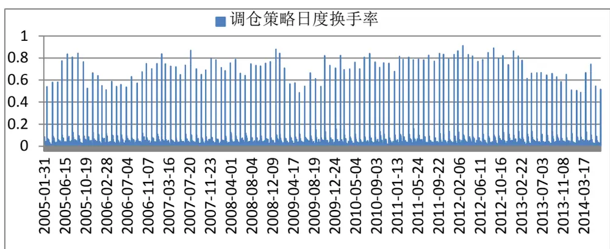
数据来源：广发证券发展研究中心

表6：分年度表现对比

| 分年度 | 换手率调仓因子策略 |  |  | 原始策略 |  |  |
| --- | --- | --- | --- | --- | --- | --- |
|  | 超额收益率 | 胜率 | 回撤 | 超额收益率 | 胜率 | 回撤 |
| 2005' | 25.28% | 55.16% | 6.82% | 14.43% | 54.26% | 7.77% |
| 2006' | -4.10% | 51.45% | 14.11% | -6.01% | 50.62% | 15.40% |
| 2007' | 52.22% | 53.72% | 9.92% | 44.87% | 52.89% | 9.68% |
| 2008' | 85.00% | 63.82% | 5.69% | 57.22% | 59.76% | 6.66% |
| 2009' | 66.75% | 61.48% | 6.35% | 52.29% | 59.84% | 6.95% |
| 2010' | 44.93% | 60.74% | 7.46% | 42.59% | 62.40% | 6.15% |
| 2011' | 18.72% | 54.92% | 4.44% | 23.11% | 58.61% | 3.84% |
| 2012' | 18.76% | 56.79% | 5.71% | 9.38% | 54.32% | 5.76% |
| 2013' | 68.16% | 70.17% | 2.76% | 50.59% | 66.81% | 2.27% |
| 2014' | 13.78% | 60.17% | 2.19% | 19.67% | 65.25% | 2.35% |

数据来源：广发证券发展研究中心

图 24：换手率调仓因子策略相对原始策略的月度超额收益
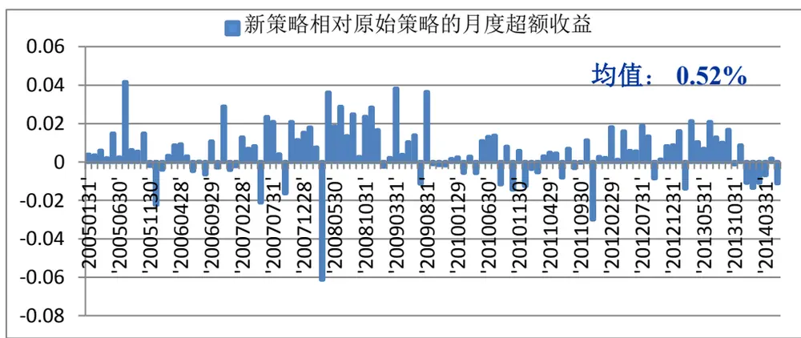
数据来源：广发证券发展研究中心
识别风险，发现价值

图 25：换手率调仓因子策略与原始策略换手率对比
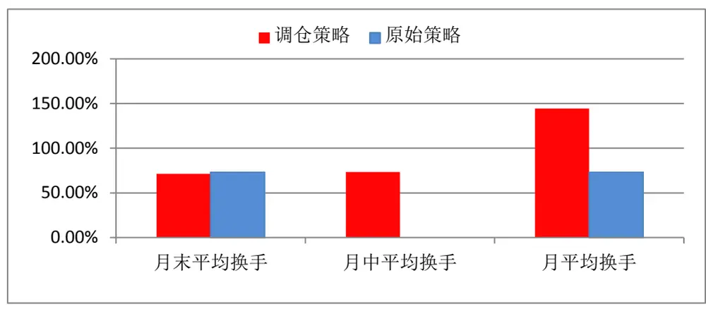
数据来源：广发证券发展研究中心

## （2）一月股价动量调仓因子

以全市场 Top120 等权组合为研究对象。调仓阈值为 300~900，间隔 50，相应超额收益、胜率表现如下：

图 26：一月股价动量调仓因子策略的超额收益及胜率与阈值的关系
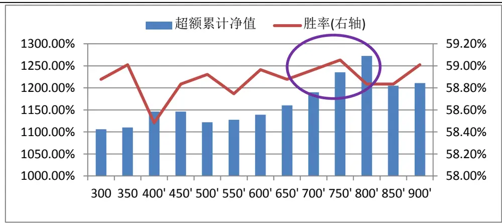
数据来源：广发证券发展研究中心

图 27：一月股价动量调仓因子策略的换手率与阈值的关系

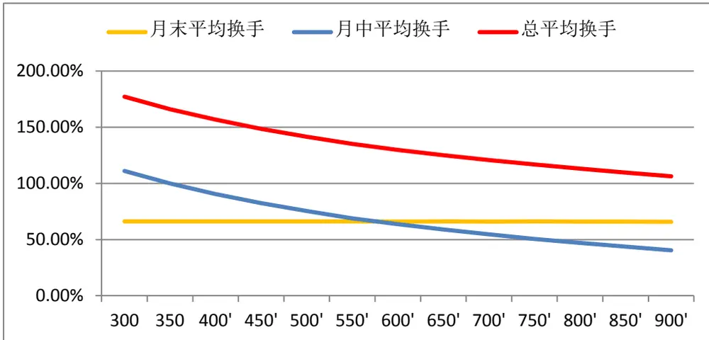
数据来源：广发证券发展研究中心

从上述的统计表现来看，我们最终确定换手率的调仓阈值为 750。

图 28：一月股价动量调仓因子策略与策略超额累计净值对比
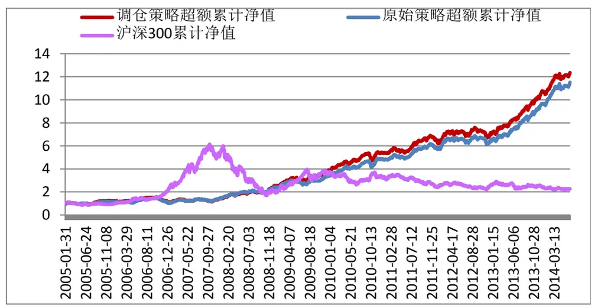
数据来源：广发证券发展研究中心

图 29：一月股价动量调仓因子策略的最大回撤
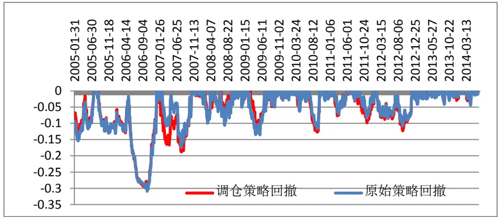
数据来源：广发证券发展研究中心
识别风险，发现价值

图 30：一月股价动量调仓因子策略的日换手率
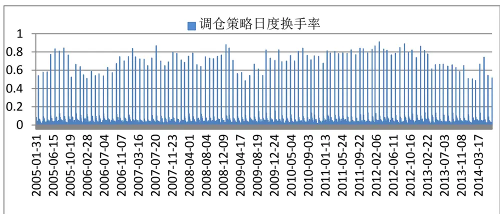
数据来源：广发证券发展研究中心

表7：分年度表现对比

| 分年度 | 一月股价动量调仓因子策略 |  |  | 原始策略 |  |  |
| --- | --- | --- | --- | --- | --- | --- |
|  | 超额收益率 | 胜率 | 回撤 | 超额收益率 | 胜率 | 回撤 |
| 2005' | 21.05% | 56.05% | 6.66% | 14.43% | 54.26% | 7.77% |
| 2006' | -5.29% | 52.70% | 14.92% | -6.01% | 50.62% | 15.40% |
| 2007' | 32.22% | 51.65% | 10.11% | 44.87% | 52.89% | 9.68% |
| 2008' | 73.51% | 61.38% | 5.64% | 57.22% | 59.76% | 6.66% |
| 2009' | 61.74% | 62.30% | 6.39% | 52.29% | 59.84% | 6.95% |
| 2010' | 41.15% | 62.81% | 6.81% | 42.59% | 62.40% | 6.15% |
| 2011' | 20.69% | 58.20% | 4.03% | 23.11% | 58.61% | 3.84% |
| 2012' | 8.97% | 56.38% | 6.62% | 9.38% | 54.32% | 5.76% |
| 2013' | 52.54% | 68.49% | 2.13% | 50.59% | 66.81% | 2.27% |
| 2014' | 15.74% | 61.86% | 2.11% | 19.67% | 65.25% | 2.35% |

数据来源：广发证券发展研究中心

图 31：一月股价动量调仓因子策略相对原始策略的月度超额收益
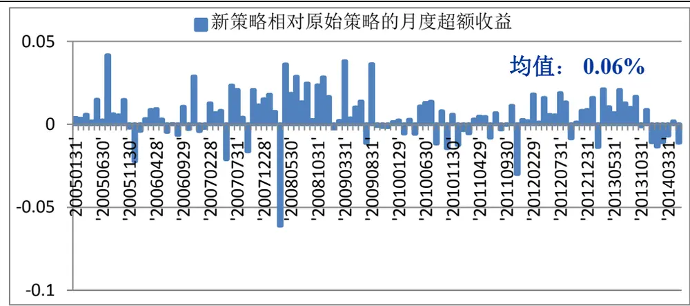
数据来源：广发证券发展研究中心
识别风险，发现价值

图 32：一月股价动量调仓因子策略与原始策略换手率对比
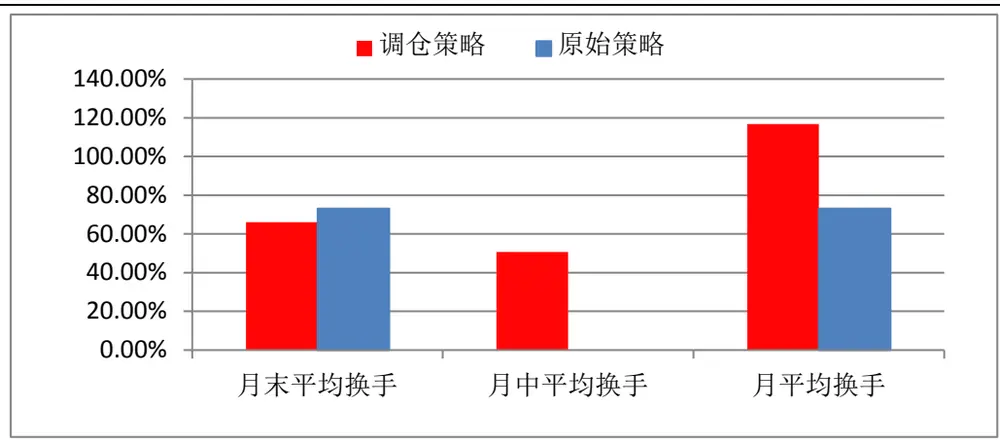
数据来源：广发证券发展研究中心

## （3）流通市值调仓因子

以全市场 Top120 等权组合为研究对象。调仓阈值为 10~200，间隔 10，相应超额收益、胜率表现如下：

图 33：流通市值调仓因子策略的超额累计净值及胜率与阈值的关系
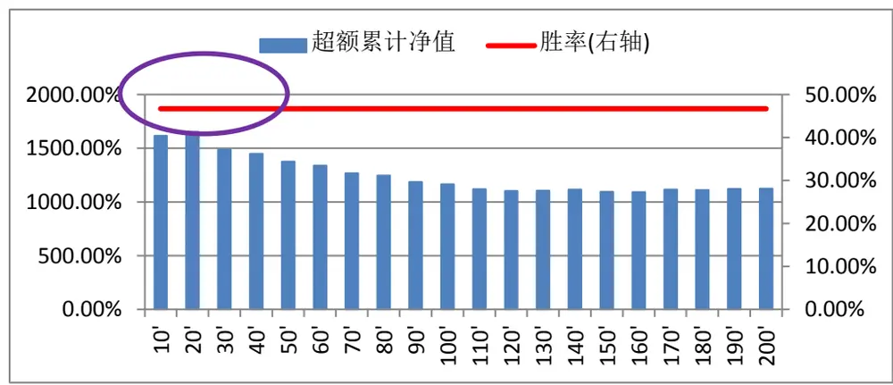
数据来源：广发证券发展研究中心

图 34：流通市值调仓因子策略的换手率与阈值的关系

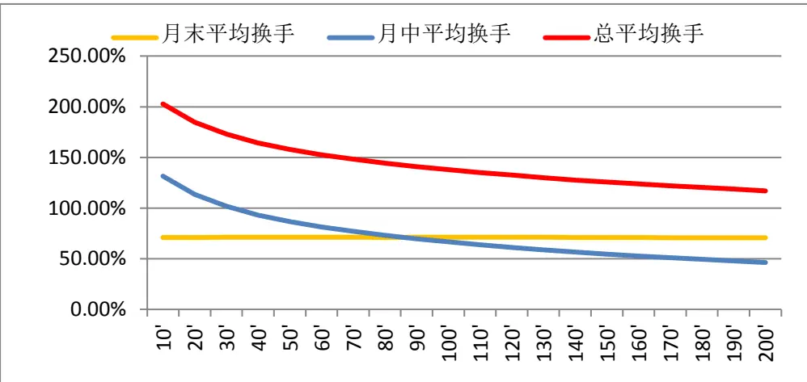
数据来源：广发证券发展研究中心

从上述的统计表现来看，我们最终确定流通市值的调仓阈值为 20 。

图 35：流通市值调仓因子策略与原始策略超额累计净值对比
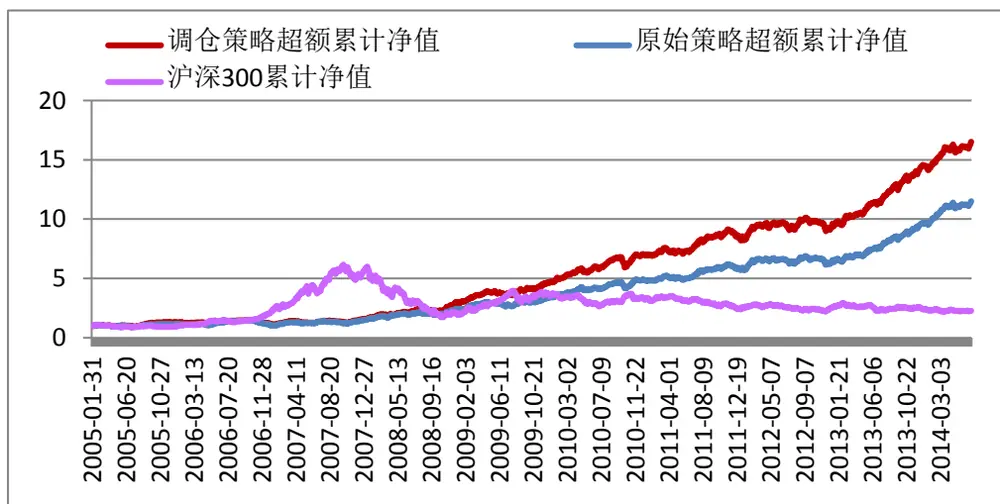
数据来源：广发证券发展研究中心

图 36：流通市值调仓因子策略的最大回撤
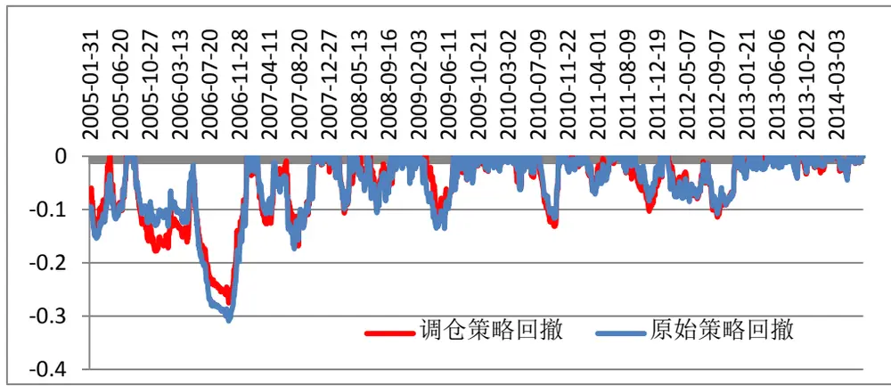
数据来源：广发证券发展研究中心
识别风险，发现价值

图 37：流通市值调仓因子策略的日换手率
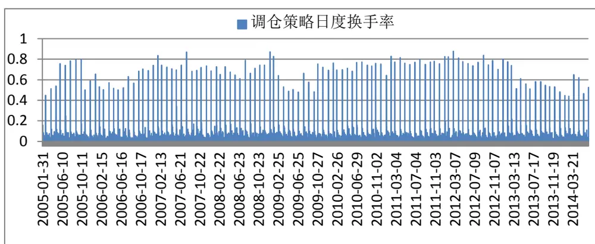
数据来源：广发证券发展研究中心

表8：分年度表现对比

| 分年度 | 流通市值调仓因子策略 |  |  | 原始策略 |  |  |
| --- | --- | --- | --- | --- | --- | --- |
|  | 超额收益率 | 胜率 | 回撤 | 超额收益率 | 胜率 | 回撤 |
| 2005' | 30.88% | 57.40% | 6.90% | 14.43% | 54.26% | 7.77% |
| 2006' | -11.26% | 53.53% | 13.14% | -6.01% | 50.62% | 15.40% |
| 2007' | 42.79% | 53.72% | 9.40% | 44.87% | 52.89% | 9.68% |
| 2008' | 87.75% | 64.23% | 6.51% | 57.22% | 59.76% | 6.66% |
| 2009' | 65.94% | 61.07% | 6.17% | 52.29% | 59.84% | 6.95% |
| 2010' | 50.23% | 64.05% | 7.23% | 42.59% | 62.40% | 6.15% |
| 2011' | 23.09% | 56.56% | 4.24% | 23.11% | 58.61% | 3.84% |
| 2012' | 11.54% | 55.14% | 6.18% | 9.38% | 54.32% | 5.76% |
| 2013' | 52.50% | 68.49% | 2.20% | 50.59% | 66.81% | 2.27% |
| 2014' | 14.46% | 63.56% | 2.18% | 19.67% | 65.25% | 2.35% |

数据来源：广发证券发展研究中心

图 38：流通市值调仓因子策略相对原始策略的月度超额收益
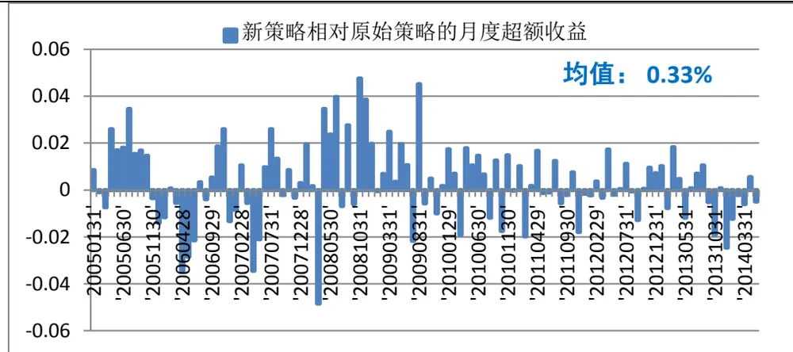
数据来源：广发证券发展研究中心

图 39：流通市值调仓因子策略与原始策略的换手率对比
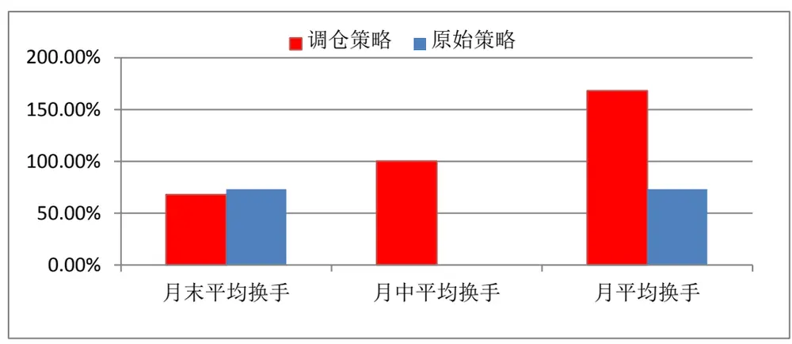
数据来源：广发证券发展研究中心

## （4）E/P调仓因子

以全市场 Top120 等权组合为研究对象。调仓阈值为 10~200，间隔 10，相应超额收益、胜率表现如下：

图 40：E/P 调仓因子策略的超额累计净值及胜率与阈值的关系
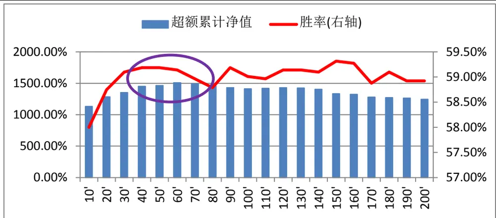
数据来源：广发证券发展研究中心

图 41：E/P 调仓因子策略的换手率与阈值的关系

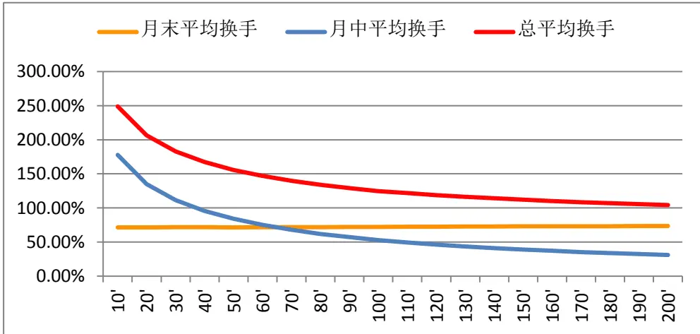
数据来源：广发证券发展研究中心

从上述的统计表现来看，我们最终确定E/P 的调仓阈值为 60 。

图 42：E/P 调仓因子策略与原始策略超额累计净值对比
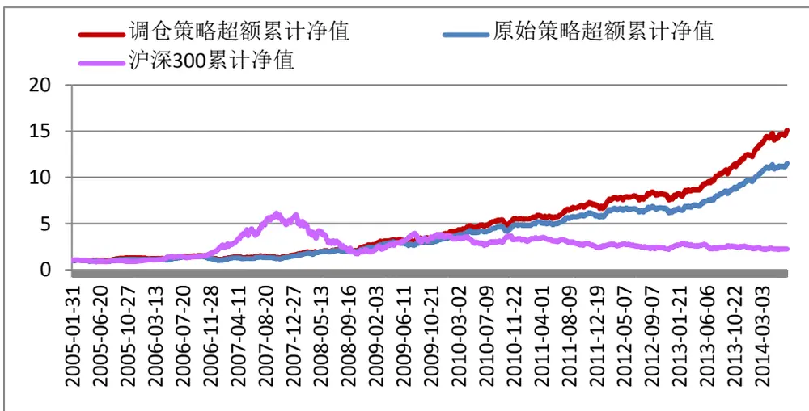
数据来源：广发证券发展研究中心

图 43：E/P 调仓因子策略的最大回撤
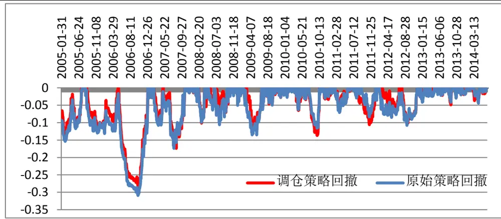
数据来源：广发证券发展研究中心
识别风险，发现价值

图 44:E/P 调仓因子策略的日换手率
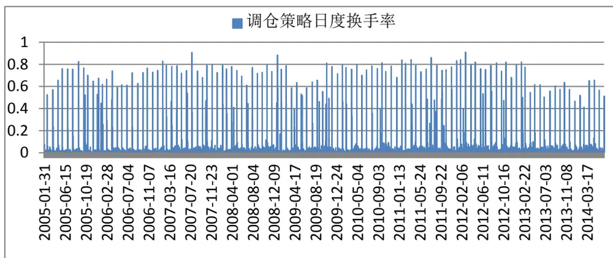
数据来源：广发证券发展研究中心

表9：分年度表现对比

| 分年度 | E/P 调仓因子策略 |  |  | 原始策略 |  |  |
| --- | --- | --- | --- | --- | --- | --- |
|  | 超额收益率 | 胜率 | 回撤 | 超额收益率 | 胜率 | 回撤 |
| 2005' | 28.66% | 56.50% | 4.59% | 14.43% | 54.26% | 7.77% |
| 2006' | -10.27% | 49.79% | 14.54% | -6.01% | 50.62% | 15.40% |
| 2007' | 46.17% | 54.55% | 10.04% | 44.87% | 52.89% | 9.68% |
| 2008' | 64.15% | 61.38% | 6.11% | 57.22% | 59.76% | 6.66% |
| 2009' | 55.29% | 61.89% | 6.37% | 52.29% | 59.84% | 6.95% |
| 2010' | 41.74% | 63.22% | 6.81% | 42.59% | 62.40% | 6.15% |
| 2011' | 26.81% | 57.79% | 3.50% | 23.11% | 58.61% | 3.84% |
| 2012' | 15.95% | 57.20% | 6.06% | 9.38% | 54.32% | 5.76% |
| 2013' | 55.69% | 66.81% | 2.46% | 50.59% | 66.81% | 2.27% |
| 2014' | 22.28% | 65.25% | 2.79% | 19.67% | 65.25% | 2.35% |

数据来源：广发证券发展研究中心

图 45:E/P 调仓因子策略相对原始策略的月度超额收益
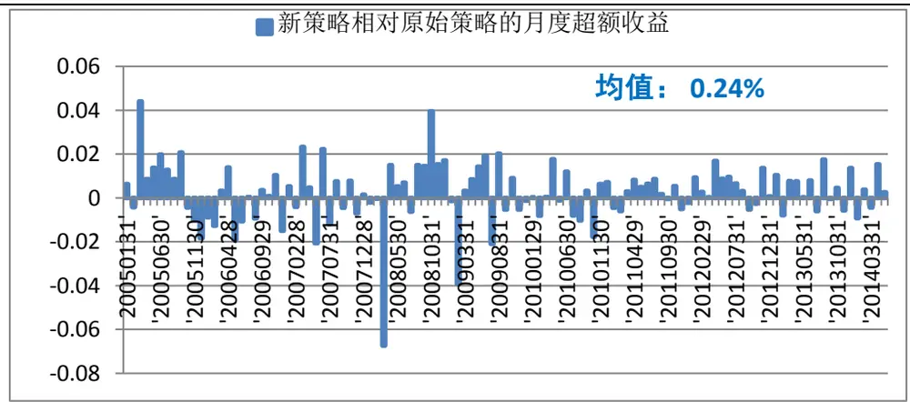
数据来源：广发证券发展研究中心

图 46：E/P 调仓因子策略与原始策略的换手率对比
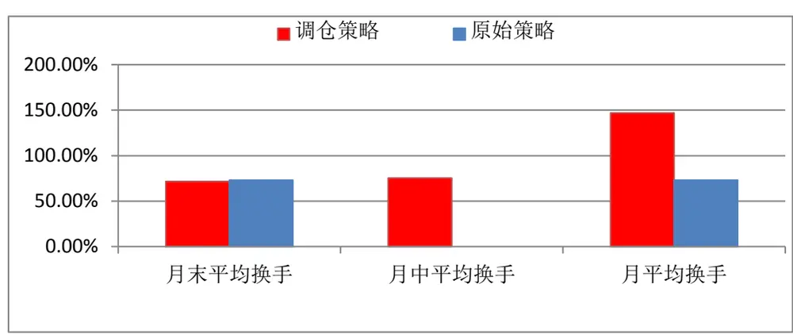
数据来源：广发证券发展研究中心

## 2.4 多个调仓因子策略的原理

上一节我们展示了单个调仓因子的实现流程和结果，为了规避单个调仓因子失效的风险，同时为了进一步降低月中换手率，这一节我们将考虑综合多个调仓因子来动态调整我们的月中组合。

## 2.4.1 多个因子调仓的流程

★ 首先确定建仓因子。每月末根据因子打分，确定排名前N 名的股票为超配股票，排名N+1~2N名的股票为备选池股票。

★ 其次确定 m（ m>1）个调仓因子。月中每天观测超配股票及备选池股票关于多个因子得分在全市场股票中的排名变化（相对于建仓时点）。这个可以得单支股票排名变化的 m维向量。

★ 接着确定调仓阈值向量 P_Vec及调仓至少要满足阈值分量的个数 n（1<n<=m）。每个分量对应每个因子的调仓阈值。

★ 计算组合股票与备选池股票俩俩互换的强度矩阵MAT（N×N）。即MAT（i，j）的值代表要将组合内第i只股票与备选池第j只股票对调的强度。它的值计算过程如下：

1、第i只股票与第j只股票关于m个调仓因子的排名总变化向量记Rank_Cha；

2、判断 Rank_Cha>P_Vec 满足的分量个数，记为 cn，如果 cn<n，则 MAT（i，j）=0；如果cn>=n,则将相应的满足条件的 Rank_Cha 中的分量的值除以对应的阈值分量进行标准化后加总起来作为 MAT（i，j）的值。

★ 进行调仓。每一期，首先寻找 MAT最大的值，当这个值大于 0时，就将该值所在的行和列所对应的组合内股票和备选池股票进行对调，并将 MAT中该行和该列的值赋值为 0，然后继续寻找 MAT中大于0 的最大值，直到条件不满足。

## 三、实证分析

为了降低换手率，我们最终将调仓阈值向量 P_Vec 及调仓至少要满足阈值分量的个数 n 设置为 P_Vec=（100,300,20,50），n=4，即四个调仓因子都要满足。策略的表现将在后面展示。

表 10：参数明细及全样本的结果

| 样本周期 | 调仓阈值 向量P_Vec | 阈值满足的 个数n | 超额累计净值 | 胜率 | 最大回撤 |
| --- | --- | --- | --- | --- | --- |
| 2005.01.31 ~2014.06.30 | (100,300, 20,50 ) | 4 | 1510.53% | 59.36% | 29.77% |

数据来源：广发证券发展研究中心

## 3.1 多因子调仓策略结果

图 47：多个因子调仓策略与原始策略的超额累计净值对比
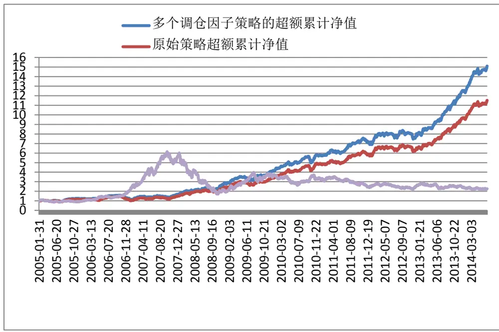
数据来源：广发证券发展研究中心

如图所示，多因子调仓策略的超额累计净值最终为1510.53%，胜率为59.36%，回撤29.77%。相应地，原始策略的超额累计净值为1152.17%，胜率为58.13%，回撤为 30.92%。

图 48：多个因子调仓策略的最大回撤

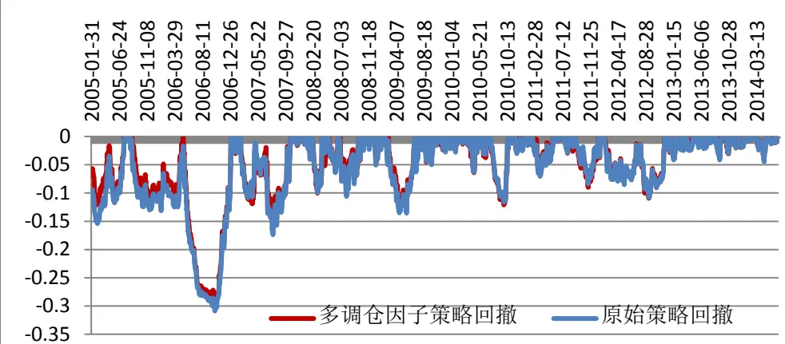
数据来源：广发证券发展研究中心

图 49: 多个因子调仓策略的日换手率
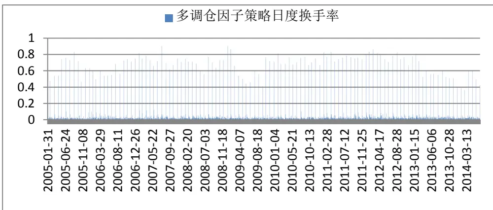
数据来源：广发证券发展研究中心

从图中来看，多因子调仓策略的月中换手率大部分都出于接近于 0的状态，比较高的换手一般是出现在月末正常调仓的时候。

表 11：分年度表现对比

| 分年度 | 多个调仓因子策略 |  |  | 原始策略 |  |  |
| --- | --- | --- | --- | --- | --- | --- |
|  | 超额收益率 | 胜率 | 回撤 | 超额收益率 | 胜率 | 回撤 |
| 2005' | 23.03% | 57.40% | 6.04% | 14.43% | 54.26% | 7.77% |
| 2006' | -4.22% | 51.45% | 14.84% | -6.01% | 50.62% | 15.40% |
| 2007' | 47.75% | 53.31% | 8.69% | 44.87% | 52.89% | 9.68% |
| 2008' | 68.50% | 60.16% | 5.68% | 57.22% | 59.76% | 6.66% |
| 2009' | 55.62% | 61.07% | 6.51% | 52.29% | 59.84% | 6.95% |
| 2010' | 40.02% | 64.88% | 6.35% | 42.59% | 62.40% | 6.15% |
| 2011' | 25.16% | 58.61% | 3.84% | 23.11% | 58.61% | 3.84% |
| 2012' | 10.50% | 55.14% | 5.84% | 9.38% | 54.32% | 5.76% |
| 2013' | 58.82% | 69.33% | 2.18% | 50.59% | 66.81% | 2.27% |
| 2014' | 21.34% | 65.25% | 2.28% | 19.67% | 65.25% | 2.35% |

数据来源：广发证券发展研究中心
识别风险，发现价值

分年度来看，多因子调仓策略相对于原始策略除了在10年没有改善之外，其它年度都一定程度的改善，表现比较稳定。并且可以看到，新策略相对于原始策略的月度超额收益大部分是正的，平均值为 0.24%。

图 50: 多个因子调仓策略相对原始策略的月度超额收益
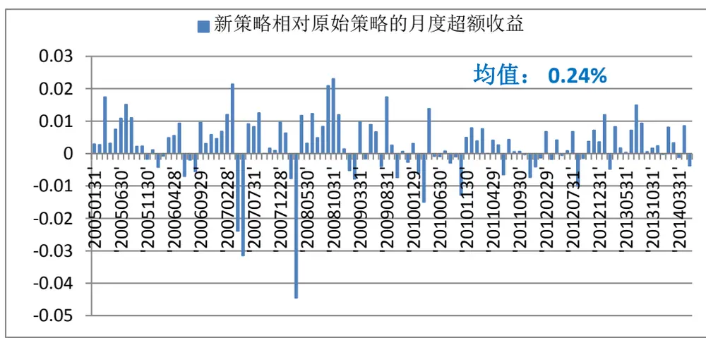
数据来源：广发证券发展研究中心

图 51：多个因子调仓策略与原始策略的换手率对比
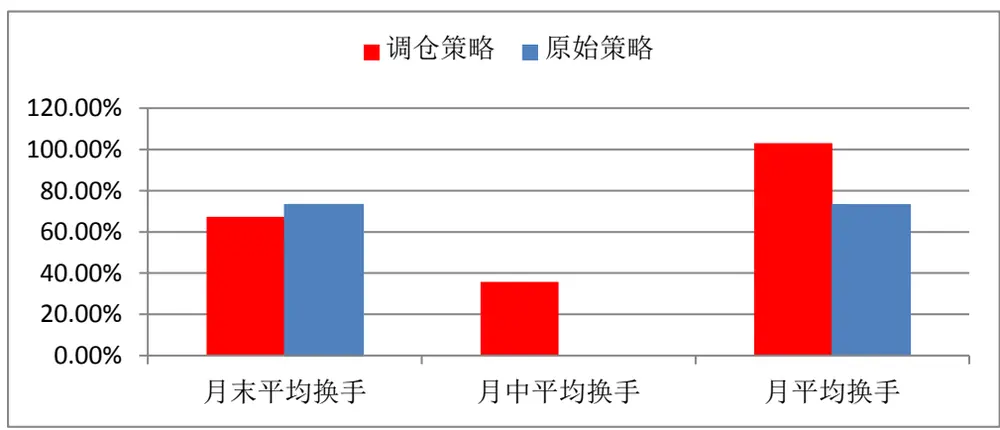
数据来源：广发证券发展研究中心

可以看到，在四个因子都满足的条件下进行调仓，月中的平均换手率要比单个因子调仓的策略降低了不少，只有 35%左右。

## 四、总结

## 4.1 总结

本报告对传统多因子 Alpha策略进行月内增强，核心思想试图观察因子出现极端的变化导致的风格偏移，将相应出现极端情况的组合内股票和备选池股票进行对调，以期规避特定因子特征减弱的失效股票下跌所带来的损失，同时又可以获得因子特征增强的新股票的收益。

历史回测表明，多个调仓因子策略相对于原始策略在超额累计净值、胜率、回撤方面均有优势，并且月中平均换手率只有35%，不会大幅提高。而从分年度的角度来看，除了在10年没有改善之外，新策略在其它年度都一定程度的改善，表现比较稳定。并且可以看到，新策略相对于原始策略的月度超额收益大部分是正的，平均值为 0.24%。

此外，未来可尝试优化动态调仓时配对算法，预计超额收益还可以有一定的提升。

## 风险提示

风格回复本身未必导致相应的个股未来收益也将回复，此为最大风险点，其次月中调仓将导致组合换手率大幅提升，将损失一定的收益，请在收益与换手之间自行权衡。

## Table_RatingIndustry 广发证券—行业投资评级说明

买入： 预期未来 12 个月内，股价表现强于大盘 10%以上。

持有： 预期未来12个月内，股价相对大盘的变动幅度介于-10%～+10%。

卖出： 预期未来12个月内，股价表现弱于大盘10%以上。

## Table_RatingCompany 广发证券—公司投资评级说明

买入： 预期未来12个月内，股价表现强于大盘15%以上。

谨慎增持： 预期未来12个月内，股价表现强于大盘5%-15%。

持有： 预期未来12个月内，股价相对大盘的变动幅度介于-5%～+5%。

卖出： 预期未来12个月内，股价表现弱于大盘5%以上。

## Table_Ad联系我们

|  | 广州市 | 深圳市 | 北京市 | 上海市 |
| --- | --- | --- | --- | --- |
| 地址 | 都会广场5 楼 | 广州市天河北路183号大 深圳市福田区金田路4018 | 北京市西城区月坛北街2号 | 上海市浦东新区富城路99号 |
| 邮政编码 | 510075 | 号安联大厦15楼A座03-04 月坛大厦18层 |  | 震旦大厦18楼 |
| 客服邮箱 |  | 518026 | 100045 | 200120 |
| 服务热线 | gfyf@gf.com.cn 020-87555888-8612 |  |  |  |

## Table_Disclaimer 免 责声 明

广发证券股份有限公司具备证券投资咨询业务资格。本报告只发送给广发证券重点客户，不对外公开发布。

本报告所载资料的来源及观点的出处皆被广发证券股份有限公司认为可靠，但广发证券不对其准确性或完整性做出任何保证。报告内容仅供参考，报告中的信息或所表达观点不构成所涉证券买卖的出价或询价。广发证券不对因使用本报告的内容而引致的损失承担任何责任，除非法律法规有明确规定。客户不应以本报告取代其独立判断或仅根据本报告做出决策。

广发证券可发出其它与本报告所载信息不一致及有不同结论的报告。本报告反映研究人员的不同观点、见解及分析方法，并不代表广发证券或其附属机构的立场。报告所载资料、意见及推测仅反映研究人员于发出本报告当日的判断，可随时更改且不予通告。

本报告旨在发送给广发证券的特定客户及其它专业人士。未经广发证券事先书面许可，任何机构或个人不得以任何形式翻版、复制、刊登、转载和引用，否则由此造成的一切不良后果及法律责任由私自翻版、复制、刊登、转载和引用者承担。