## 一致预期指标构建及其在因子选股中的应用

## 多因子 Alpha 系列报告之（二十二）

## 报告摘要：

## 一致预期数据是重要的Alpha来源

公司的公告信息是量化投资者做投资决策的重要依据之一：公司的定期财报数据的披露往往较为滞后，公布的频率也较低，导致信息不够及时，股价经常提前反应；而不定期公告不具有统一格式，较难为量化投资者所用。分析师群体作为上市公司和投资者之间的桥梁，通过报告形式对上市公司进行分析，并且有较为规范的盈利预测格式，是对上市公司信息的加工，可为量化投资者所使用。另外，预期类的数据反映了对公司未来业绩与估值的判断，从投资逻辑上相比历史类指标更为合理，理应包含更高的alpha。

## 三维度构建广发一致预期指标

我们使用 Wind 底层数据库中 2007 年以后的分析师“公司研究”报告数据编制一致预期指标。从数据质量角度来说，2014 年，A 股市场 25%标的无人覆盖，25%标的覆盖人数小于等于 3 名，余下 50%标的覆盖人数较多。在广发一致预期指标编制过程中，我们使用近 180 天的所有报告，使用最新发布原则，并且考虑历史预测准确度、发布后二级市场涨跌幅及时效性三维度进行加权，得到的广发一致预期净利润指标。相比等权一致预期指标而言，胜率在 65%左右。

## 利用一致预期指标编制的衍生因子在选股中具有较高Alpha

我们根据编制的一致预期净利润数据，建立了预期估值、预期成长、盈利调整与一致预期偏离等一系列因子，在因子构建过程中，我们保证在每个时点均使用最新可得数据：若正式报告已发布，则用正式报告中的数值；若正式报告未发布，但业绩快报已发布，则使用业绩快报中的数值；若业绩快报、正式报告均未发布，则使用一致预期值。

这些预期类的因子相比历史因子而言，在选股时表现出了更高的Alpha。着重推荐如下几个因子：EP FY1 用沪深 300 对冲后效果较好，年化复合 26.09%收益，2011 年来组合最大月度回撤为 2.45%，年平均换手2.54x，非常低；盈利调整因子用中证 500 对冲后效果较稳定，年化复合收益 9.79%， 2011 年以来回撤均保持在 1.56%以下，换手 9.94x。最后用相关性较低的 EP FY1、EG FY0、盈利调整与预期偏离构建四因子组合，组合对冲沪深 300，09年以来复合年化收益 20.63%，信息比率1.61，最大回撤14.31%发生在 2014 年；对冲中证 800 后效果较佳，超额收益 19.48%，信息比率 2.12，回撤 8.06%发生在 2009 年。

图1 预期估值因子选股
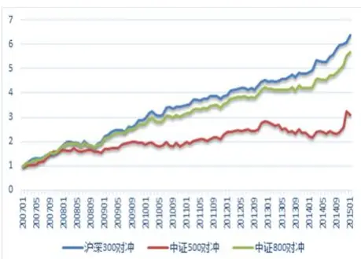

图2 盈利调整因子选股
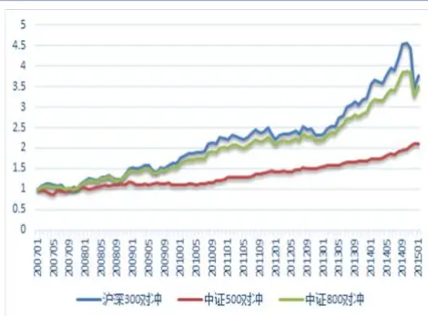

图 3 四因子组合
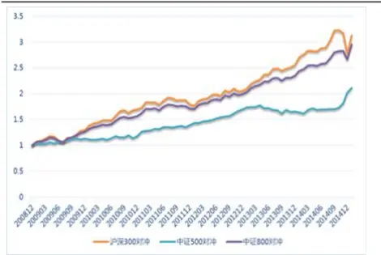
分析师： 严佳炜 S0260514110001

公021-60750622

yanjiawei@gf.com.cn

## 相关研究：

| 多因子 Alpha 系列报告之(二 2014-09-02 |
| --- |
| 十一）—ALPHA 因子何处 |
| 寻觅掘金海量技术指标 多因子 Alpha 系列报告之(二 2014-08-25 |
| 十）—基于风格特征归因的 |
| 动态因子策略 |
| 多因子Alpha系列报告之（十2014-06-13 |
| 九)笑看北雁南飞南燕北 |

## 一、一致预期选股介绍

公司的公告信息是量化投资者做投资决策的重要依据之一，而公告信息又可分为定期公告与不定期公告两种。公司的定期财报数据的公布往往较为滞后，公布的频率也较低，导致信息不够及时，股价经常提前反应。而公司的不定期公告又不具有统一的格式，对于量化投资者而言很难将蕴含的信息直接转化为选股清单，只能通过文本挖掘等手段。

而分析师群体作为上市公司和投资者之间的桥梁，他们通过发布研究报告，传递市场及公司信息，减少投资人和公司管理层之间的信息不对称。他们紧密跟踪上市公司公告，并进行上市公司调研，是市场上对上市公司最为了解的一群人；分析师报告中的预测推荐在一定程度上能够反映公司的未来，而且分析师报告中有相对较为规范的盈利预测，是对上市公司不定期公告的加工，可为量化投资者所使用。

我们回顾传统的alpha选股模型中，使用的大部分因子都用历史财务数据构建。但事实上，这些信息已经反映在历史股价走势中，对于未来的走势判断不具有很大的意义：例如，历史成长性高的企业在未来肯定成长性高？而基于分析师预期来构建选股因子，从投资逻辑上更为合理，理应包含更高的alpha。

那么分析师一致预期在量化选股中有哪些应用呢？分析师一致预期类数据即可构建事件驱动策略，也可以用于因子策略。

在事件驱动类策略中主要涉及：

- 分析师首次覆盖

- 分析师盈利调整(Analyst Earning Revisions)：上调/下调净利润预测

- 一致预期盈利惊喜(Earning Surprise)：公司实际业绩相比于一致预期的差异

在多因子选股策略中亦可以使用一致预期数据构建丰富多彩的alpha因子，如

- 预期估值(E_FY1/P)

- 预期成长性(短期、长期)

- 预期盈利质量(ROE_FY1)

- 一致预期盈利调整(Consensus Earning Revision)：相比上期末一致预期 净利润的环比

- 盈利预期分歧度(Consensus BIAS)等。

在本文中，我们首先利用Wind底层数据库中的分析师盈利预测的详细数据，编制了一套一致预期指标，改进了现有一致预期指标中的不足之处；随后，根据编制的一致预期净利润指标，构建了一致预期衍生因子选股策略，其相比传统历史因子，表现出了更高的alpha。

## 二、广发一致预期指标的构建

## （一）已有的一致预期数据的对比

国内现在已经有几家一致预期数据提供商，分别为朝阳永续、Wind与今日投资。其中，Wind中的一致预测是最新180、90、30日内所有机构最新预测数据的算术平均；而朝阳永续则是对90天内分析师最新盈利预测进行时间与机构双维度加权。

虽然数据提供商对于分析师的报告收录已逐步完善，但是一致预期数据的编制过程仍然有进一步提升的空间：

1．简单算术平均的加权方式不够合理，这使得老报告中的预测的权重太高。用简单算术平均计算而得的一致预期，只能通过报告有效期的设定来解决信息过时的问题。然而，有效期设臵过长则会在一致预期中包含过多失效信息，例如180日历日包含了多个季报期；有效期设臵过短，则会使得很多较冷门股票/非业绩公告期股票没有一致预期数据。

2．简单算术平均构建的一致预期数值变动可能不是因为新报告的加入，而是由于老报告的退出。

3．对核心分析师与普通分析师不加区分，而往往核心分析师对上市公司更为了解，预测更加贴近真实值并且对市场的影响更大。

4．仅区分机构影响力，即使如此，同一机构中每个分析师的预测能力也不尽相同。

5．很少有分析师对行业内上市公司都非常了解，因此需要建立股票与分析师之间的配对关系。

基于上述几点，我们的想法是只使用Wind底层数据库中的报告明细数据，编制自己的一致预期净利润数据。

## （二）数据说明

我们构建一致预期的数据均来自Wind底层数据库。由于数据库中收录的2007年以前的报告数据不全，所以我们使用的都是2007年以后的卖方分析师报告，Wind数据库将这些报告中的重要数据整理在盈利预测明细数据表中（表TB_OBJECT_1571）。

另外，Wind数据库中对分析师报告分成几类，分别为“公司研究”、“晨会纪要”、“行业研究”、“市场综述”、“策略研究”。后四种类型的一篇报告中往往包含了多个上市公司的盈利预测，并且报告中往往不包括上市公司的调研与具体的分析，因此我们不使用这四种类型报告中的盈利预测，而仅使用报告类型为“公司研究”的条目。

## （三）样本数据的基本统计

在进行一致预期指标构建之前，我们先对2007年以后的报告条目从各个维度做一统计，以展示底层数据库的数据质量。

自2007年起，Wind数据库共收录了25万篇左右公司研究报告，且在2012年以前，每年收录的报告数量呈逐年递增趋势，在2012年之后，每年报告数量基本稳定在每年38000篇左右

图1：分年度报告数量
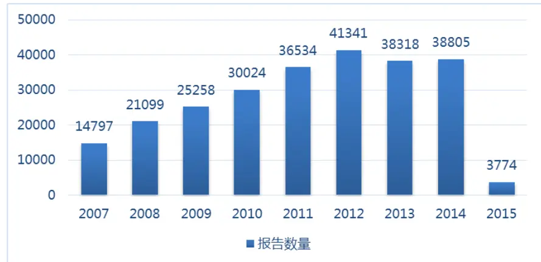
数据来源：广发证券发展研究中心，Wind

底层数据库中收录的券商报告较为完整，涵盖了所有中大型券商的报告。

图2：收录券商/分析师数量
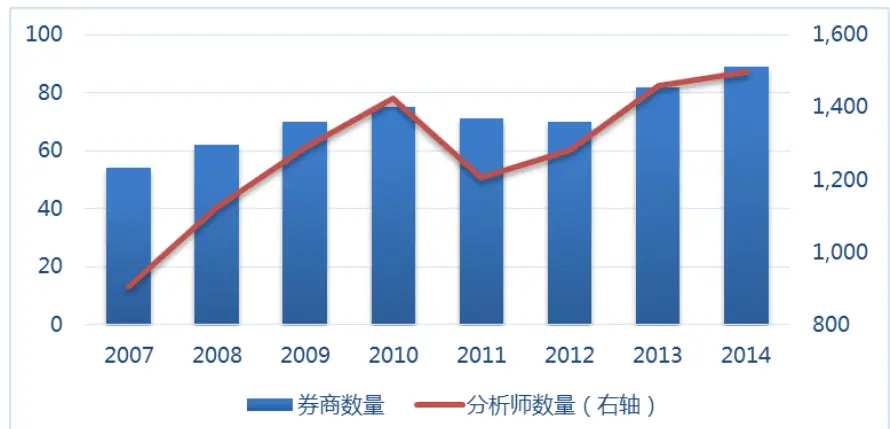
数据来源：广发证券发展研究中心，Wind

伴随卖方模式的逐渐成熟，分析师对于股票的覆盖度也逐年递增，2014年，A股市场的覆盖占比约在75%左右。

图3：分年度股票覆盖只数与占比
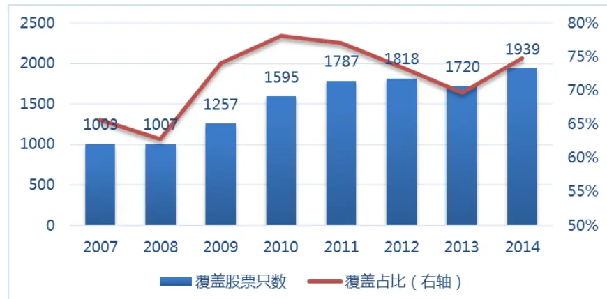
数据来源：广发证券发展研究中心，Wind

从分析师角度，人均覆盖股票只数约为10只左右，2011年以前呈递增趋势，2012年以后有所回落。

图4：人均覆盖股票数量
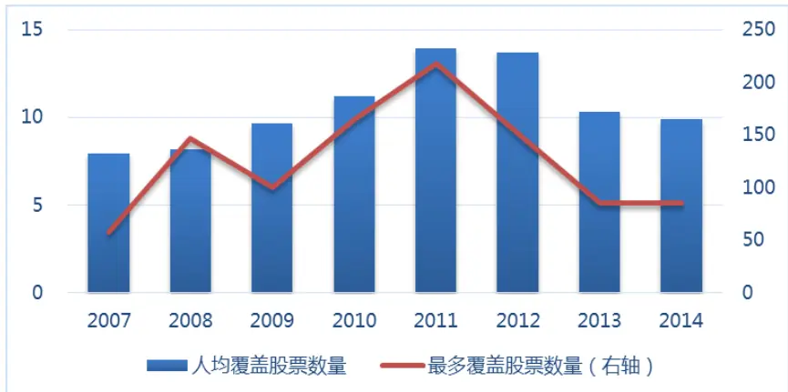
数据来源：广发证券发展研究中心，Wind

从股票角度出发，近年来，平均每只股票有5到8名分析师进行跟踪，一直处于比较稳定的状态。多人跟踪为一致预期指标的准确度提供了保障。

图5：平均每只股票跟踪人数
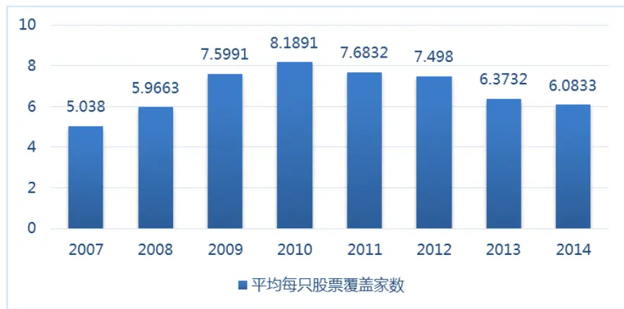
数据来源：广发证券发展研究中心，Wind
识别风险，发现价值

从覆盖的分布情况来说，2014年，25%标的无人覆盖，25%标的覆盖人数小于等于3名，10%标的覆盖人数为4到5名，20%标的覆盖人数为6到10名，20%标的覆盖人数超过10名。覆盖程度基本能够满足我们编制一致预期指标的要求。

图6：2014年度股票覆盖程度
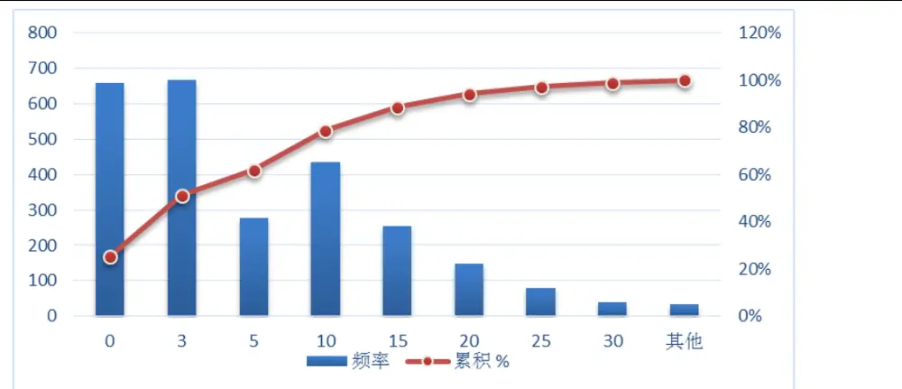
数据来源：广发证券发展研究中心，Wind

## （四）广发一致预期的构建步骤

广发一致预期净利润指标的构建步骤如下：

1．首先挑出最近180天（日历日）内关于某只股票所有符合条件的研究报告。

2．若某分析师在180天内有多篇研报，采用最近一篇的预测数据，忽略该分析师之前的预测值。

3．在得到所有分析师预测值之后，综合考虑三个维度：分析师历史预测准确度，推荐影响力，以及报告的时效性，给予分析师预测值一定的权重。然后对归属母公司净利润预测值进行加权平均，得到广发一致预期归母净利润值。

其中，各个维度的衡量方式如下：

（1）业绩预测准确度

$$
score\_accuracy=\operatorname{ecdf}\frac{\operatorname*{max}(esterr_{i})-esterr_{i}}{\operatorname*{max}(esterr_{i})-\operatorname*{min}(esterr_{i})})
$$

其中，esterr为历史单次预测的绝对误差，ecdf为分位数函数。在这个维度上，我们衡量历史两年半内在该股票上有覆盖的分析师的历次报告的净利润预测值与当期实际净利润值的偏离度，取平均，进行排序，偏离度小的分析师在该股票上得分高，得分为0至100。

## （2）推荐股票市场反应

我们使用报告发布后标的的二级市场涨跌幅来衡量推荐的市场反应。使用不同时间长度（10、30、60天）分别衡量短中长期的市场反应。

$$
score\_impact=\operatorname{ecdf}\ (\frac{1}{2}\times return\_10d+\frac{1}{3}\times return\_30d+\frac{1}{6}\times return\_60d)
$$

其中，return nd_ 为历史报告公布之后的n日涨幅。指标计算过程与业绩预测准确度类似，先对每篇报告计算市场反应指标，再按分析师维度计算平均，最后进行打分，取百分位数为最后得分。

## （3）报告时效性

使用指数衰减作为报告时效性的权重。

$$
time\_dacay=e^{-{\lambda}{\times}t}
$$

其中， $t~\left(~0\leq t\leq180~\right)$ 为该份报告距离最近一份研报的时间跨度，•为半衰期参数。

## （4）综合得分

综合以上三个维度得到预测值权重：

$$
wt=(\frac{1}{2}\times{score}_{-}accuracy+\frac{1}{2}\times{score}_{-}impact)\times time_{-}decay
$$

根据我们的统计，使用广发一致预期指标，战胜等权一致预期的概率为64.97%。

图7：举例：广发一致预期 vs 等权一致预期
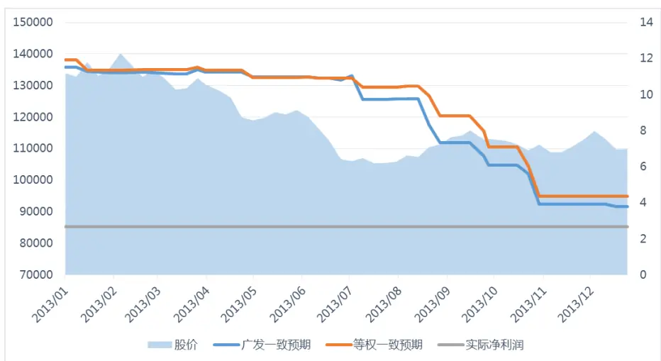
数据来源：广发证券发展研究中心，Wind

这里以某股票为例，展示下我们编制的一致预期净利润指标与等权一致预期净利润之间的差别。我们编制的一致预期净利润由于为部分分析师给予了更高权重，使得整体更为靠近实际净利润（灰线）。

## 三、基于一致预期衍生因子的选股策略

基于一致预期指标，我们可以构建丰富多彩的选股因子。在本章中，我们展示几个较为常用、也比较有效的基于一致预期的衍生因子。

## （一）因子说明

为了更好的说明因子的构建方法，我们首先对因子构建过程中的一些基础性术语进行定义。

1. 财务年度的界定：当前交易日所处的财务年度定义为Fiscal Year 1（FY1），前一财务年度为FY0，后一财务年度为FY2。也即，无论财报是否发布，已经实现的业绩为FY0，正在实现的为FY1，未来一个财年为FY2。

2. 因子构建过程中，在每个时点，我们均使用最新可得数据，若正式报告已发布，则用正式报告中的业绩；若正式报告未发布，但业绩快报已发布，则使用业绩快报中的归母净利润数值；若业绩快报、正式报告均未发布，则使用广发一致预期值。由于业绩预告往往只公布一个净利润范围，没有具体的数值，因此不考虑使用。

图8：FY的界定
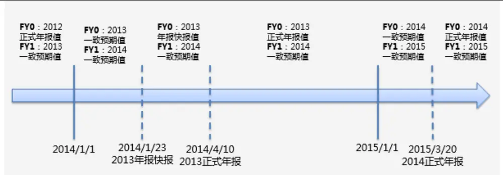
数据来源：广发证券发展研究中心

参见上图，例如，某上市公司在2014年1月23日发布了2013财年业绩快报，并于2014年4月10日披露了2013年正式年报。在2014年度，由于2013年利润是已经实现的业绩，因此，根据我们的定义FY0为2013年，FY1为2014年。在2014年1月23日以前，因为尚未发布任何业绩公告，因此使用一致预期净利润作为FY0、FY1的基础数据；在2014年1月23至2014年4月9日间，已公布13年业绩快报，则使用快报数据计算FY0指标；在2014年4月10日后，使用正式年报值计算FY0指标。

一方面，这种定义方式能够及时运用市场上可以获得的最新信息，保证因子数据的时效性；另一方面，由于在同一时点，所有股票使用的都是同一财年的数据，无论该年正式报告发布与否，因此可以保证因子的可比性。

## （二）广发一致预期衍生因子定义

我们构建四种类型的因子：

## 1.估值类因子

EP_GFCE_FY0：FY0归母净利润/总市值。该因子只有每年年初业绩快报、正式报告均未公布时，会用到分析师预测数据。

EP_GFCE_FY1：FY1归母净利润/总市值。该因子属于预期估值因子。

对比EP_TTM：历史12个月归母净利润/总市值，该因子属于历史估值因子，完全使用已公布业绩编制，不涉及一致预期。

## 2.成长类因子

EG_GFCE_FY0：FY0相对于FY-1的净利润同比。该因子属于历史成长因子，只有每年年初业绩快报或正式报告未公布时，会用到分析师预测数据。

EG_GFCE_FY1：FY1相对于FY0的净利润同比。该因子属于预期成长因子。

## 3.盈利调整因子

EarningRev_GFCE：本期广发一致预期净利润相对于上期广发一致预期净利润的环比。分析师上调公司预期净利润是一个积极的Alpha信号。但一般而言，分析师很少会写下调净利润的报告，因此，该指标其实具有一定的不对称性，它对正向alpha的驱动能力不错，但是没法选出那些“坏”股票。

## 4.一致预期偏离因子

CEBias_GFCE：广发一致预期净利润与等权一致预期净利润的偏差。广发加权的一致预期净利润相比等权一致预期的预测作用更为明显，两者数值上的差异能够反应权重分析师与权重报告中蕴含的信息，具有一定的Alpha。

另外，为了规避比率类因子中分母为负以及分母过小的问题，我们在计算比率类因子均使用如下计算方式：

( )本期数值 - 上期数值

max（最小阈值,abs(上期数值)）

## （三）测算参数

股票池：全市场选股

计算年度：2007-2014

衍生因子计算数据：年度业绩快报、年度正式财报、广发一致预期净利润

换仓频率：月末换仓

选股个数：100只

空值处理：因子值为空值时，暂时忽略该股票

对冲：分别用沪深300、中证500、中证800指数进行对冲

## （四）一致预期衍生因子效果统计

## 1.估值类因子

（1）EP_GFCE_FY0：利用一致预期数据编制的历史业绩估值因子

表 1：EP_GFCE_FY0 因子收益分年度统计表
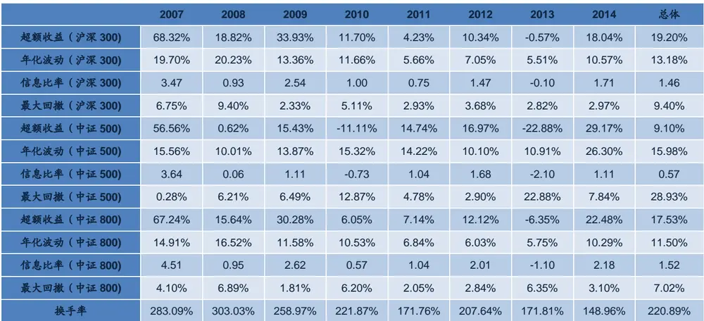
数据来源：广发证券发展研究中心

图9：EP_GFCE_FY0因子对冲收益净值曲线
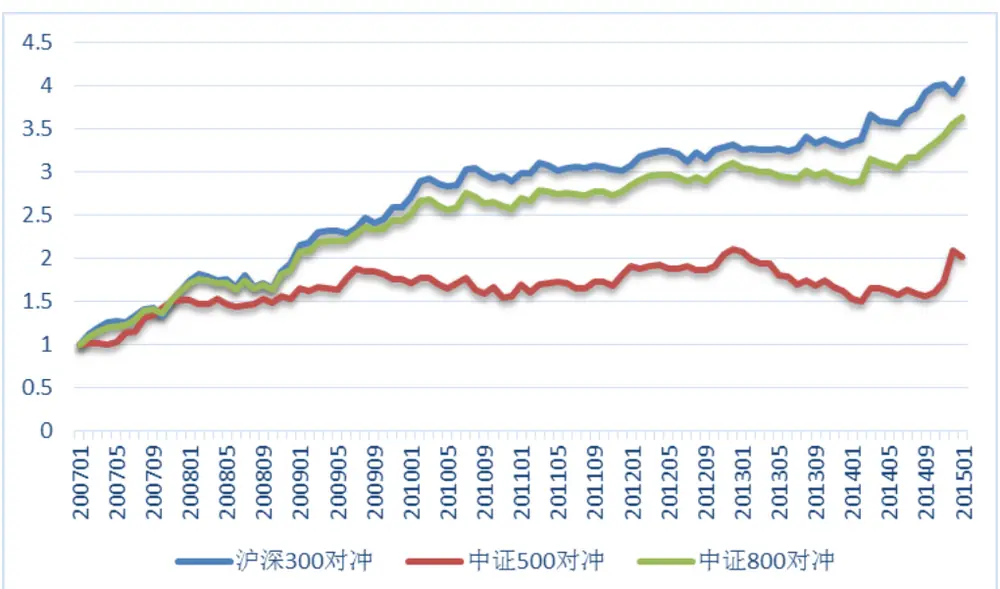
数据来源：广发证券发展研究中心

从收益角度看，EP_GFCE_FY0的有效性还是比较显著的。用沪深300和中证800对冲后，总体年化复合收益分别为19.20%和17.53%，信息比率分别为1.46和

识别风险，发现价值

1.52，明显优于只用中证500对冲的结果。因为该因子为低估值选股的因子，所以所选股票往往分布于大中盘股票，用中证500对冲的话，size的风格暴露为负，因此从历史上来看会有部分负向的风格收益，导致500对冲效果欠佳。

图10：EP_GFCE_FY0月度IC
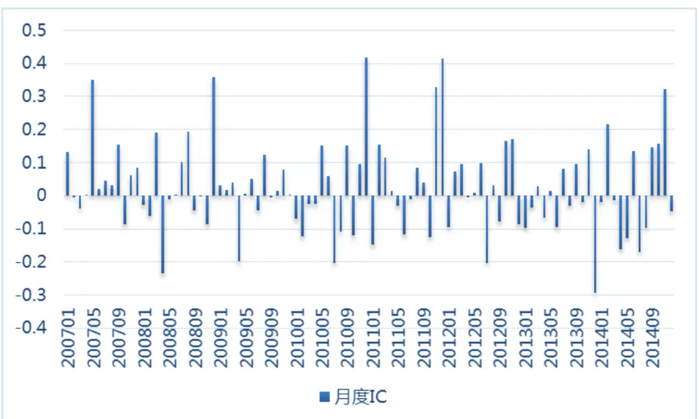
数据来源：广发证券发展研究中心

从IC角度看，EP_GFCE_FY0的历史平均IC（全市场）为2.5%，IC的月度胜率为54.2%，稳定性一般。

（2）推荐EP_GFCE_FY1：预期估值因子

表 2：EP_GFCE_FY1 因子收益分年度统计表

| 2007 2008 2009 2010 |  |  |  |  | 2011 2012 2013 |  |  | 2014 总体 |  |
| --- | --- | --- | --- | --- | --- | --- | --- | --- | --- |
| 超额收益（沪深300) | 79.47% | 14.26% | 45.16% | 20.21% | 11.84% | 17.58% | 5.84% | 27.07% | 26.09% |
| 年化波动（沪深300) | 17.58% | 18.90% | 14.51% | 12.94% | 7.19% | 7.99% | 6.52% | 8.68% | 13.01% |
| 信息比率（沪深300) | 4.52 | 0.75 | 3.11 | 1.56 | 1.65 | 2.20 | 0.90 | 3.12 | 2.01 |
| 最大回撤（沪深300) | 5.04% | 11.86% | 2.98% | 5.35% | 2.83% | 2.45% | 2.37% | 1.05% | 11.86% |
| 超额收益（中证500) | 66.48% | -3.54% | 25.80% | -4.72% | 23.04% | 24.56% | -17.87% | 37.93% | 15.23% |
| 年化波动（中证500) | 15.66% | 10.25% | 11.03% | 19.59% | 15.00% | 11.11% | 12.32% | 29.28% | 17.24% |
| 信息比率（中证500) | 4.24 | -0.35 | 2.34 | -0.24 | 1.54 | 2.21 | -1.45 | 1.30 | 0.88 |
| 最大回撤（中证500) | 0.41% | 9.55% | 2.01% | 9.45% | 4.02% | 2.60% | 18.30% | 7.13% | 23.73% |
| 超额收益（中证800) | 78.25% | 11.13% | 41.36% | 14.00% | 14.94% | 19.45% | -0.31% | 31.49% | 24.26% |
| 年化波动（中证800) | 12.44% | 15.28% | 12.04% | 13.14% | 8.18% | 7.23% | 7.13% | 11.27% | 11.81% |
| 信息比率（中证800) | 6.29 | 0.73 | 3.43 | 1.07 | 1.83 | 2.69 | -0.04 | 2.79 | 2.05 |
| 最大回撤（中证800) | 2.40% | 9.65% | 1.21% | 6.27% | 2.81% | 1.98% | 2.78% | 1.33% | 9.65% |
| 换手率 | 318.54% | 334.53% | 333.16% | 257.43% | 207.48% | 226.73% | 180.64% | 174.44% | 254.12% |

数据来源：广发证券发展研究中心

图11：EP_GFCE_FY1因子收益曲线

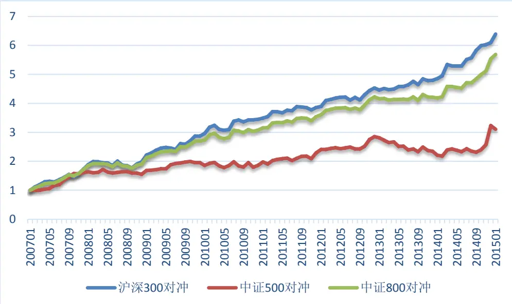
数据来源：广发证券发展研究中心

从收益角度看，EP_GFCE_FY1的有效性较为显著，超过了EP_GFCE_FY0，因为它包含了更多的对公司未来业绩预期的信息。用沪深300和中证800对冲后，总体的年化复合收益分别为26.09%和24.26%，年化信息比率分别为2.01和2.05，比较稳定。特别是在2010年之后，用该单因子构建的组合每年回撤均控制在3%以内。在风格剧变的2014年，超额收益达27.07%，回撤1.05%，效果十分理想。

图12：EP_GFCE_FY1月度IC
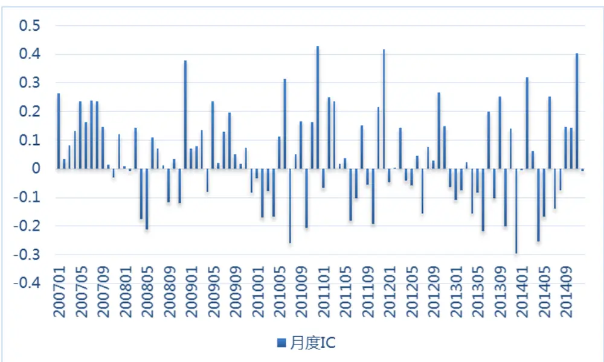
数据来源：广发证券发展研究中心

从IC角度看，EP_GFCE_FY1的均值为4.2%，胜率为60.5%。

（3）EP_TTM，EP_GFCE_FY0，EP_GFCE_FY1对比

表3：EP_TTM，EP_GFCE_FY0，EP_GFCE_FY1对比

| EP_TTM EP_GFCE_FY0 EP_GFCE_FY1 |  |  |  |
| --- | --- | --- | --- |
| 超额收益（沪深300) | 17.74% | 19.20% | 26.09% |
| 年化波动（沪深300) | 12.36% | 13.18% | 13.01% |
| 信息比率（沪深300) | 1.44 | 1.46 | 2.01 |
| 历史最大回撤（沪深300) | 11.14% | 9.40% | 11.86% |
| 超额收益（中证500) | 7.69% | 9.10% | 15.23% |
| 年化波动（中证500) | 15.83% | 15.98% | 17.24% |
| 信息比率（中证500) | 0.49 | 0.57 | 0.88 |
| 历史最大回撤（中证500) | 25.37% | 28.93% | 23.73% |
| 超额收益（中证800) | 16.07% | 17.53% | 24.26% |
| 年化波动（中证800) | 10.74% | 11.50% | 11.81% |
| 信息比率（中证800) | 1.50 | 1.52 | 2.05 |
| 历史最大回撤（中证800) | 8.59% | 7.02% | 9.65% |
| 换手率 | 212.45% | 220.89% | 254.12% |

数据来源：广发证券发展研究中心

从上表可以看到，EP_GFCE_FY0因子在收益率与信息比率上均领先于EP_TTM，而预期估值因子EP_GFCE_FY1又大幅领先于EP_TTM与EP_GFCE_FY0。预期估值因子EP_GFCE_FY1对未来股价的驱动能力更佳。而且从换手率上来看，EP_GFCE_FY1因子的换仓成本不是特别高。因此，我们建议使用EP_GFCE_FY1作为模型中的估值因子。

## 2.成长类因子总结

（1）EG_GFCE_FY0：历史成长性

表 5：EG_GFCE_FY0 因子收益分年度统计表

| 2007 2008 2009 |  |  |  | 2010 | 2011 | 2012 2013 2014 总体 |  |  |  |
| --- | --- | --- | --- | --- | --- | --- | --- | --- | --- |
| 超额收益（沪深300) | 42.66% | 24.07% | 18.41% | 22.09% | -4.08% | -2.34% | 28.26% | -6.45% | 15.69% |
| 年化波动（沪深300) | 17.16% | 20.04% | 16.24% | 13.99% | 14.58% | 12.14% | 10.42% | 35.10% | 19.12% |
| 信息比率（沪深300） | 2.49 | 1.20 | 1.13 | 1.58 | -0.28 | -0.19 | 2.71 | -0.18 | 0.82 |
| 最大回撤（沪深300) | 5.51% | 9.76% | 10.51% | 4.23% | 13.28% | 9.11% | 1.41% | 32.57% | 32.57% |
| 超额收益（中证500) | 32.04% | 5.30% | 2.84% | -1.75% | 7.38% | 4.39% | 0.66% | 11.67% | 7.88% |
| 年化波动（中证500） | 14.72% | 8.17% | 8.78% | 9.51% | 5.71% | 5.33% | 7.51% | 7.42% | 8.92% |
| 信息比率（中证500） | 2.18 | 0.65 | 0.32 | -0.18 | 1.29 | 0.82 | 0.09 | 1.57 | 0.88 |
| 最大回撤（中证500) | 3.32% | 5.20% | 7.65% | 5.40% | 3.69% | 3.34% | 5.11% | 3.21% | 9.27% |
| 超额收益（中证800） | 41.67% | 20.81% | 15.39% | 16.23% | -0.96% | -0.57% | 21.14% | -0.16% | 14.70% |
| 年化波动（中证800） | 11.61% | 16.09% | 13.27% | 10.83% | 11.66% | 9.64% | 8.78% | 27.00% | 14.99% |

识别风险，发现价值

| 信息比率（中证800） | 3.59 | 1.29 | 1.16 | 1.50 | -0.08 | -0.06 | 2.41 | -0.01 | 0.98 |
| --- | --- | --- | --- | --- | --- | --- | --- | --- | --- |
| 最大回撤（中证800) | 2.59% | 7.85% | 7.68% | 3.59% | 10.79% | 7.37% | 1.32% | 24.33% | 24.33% |
| 换手率 | 224.64% | 232.46% | 220.14% | 203.93% | 193.31% | 211.34% | 220.31% | 218.87% | 215.63% |

数据来源：广发证券发展研究中心

图13：EG_GFCE_FY0因子收益曲线
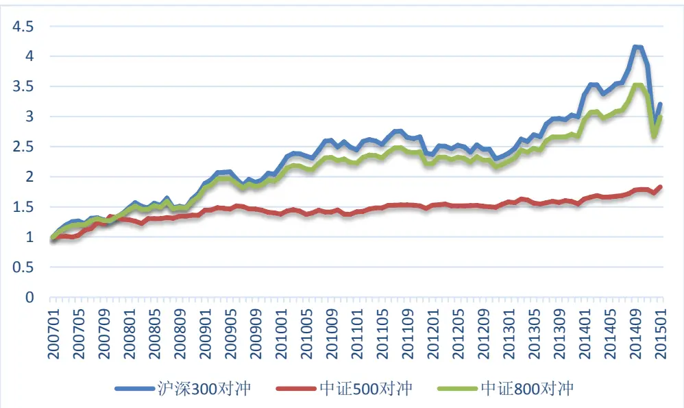
数据来源：广发证券发展研究中心

从收益角度看，EG_GFCE_FY0的有效性还不错。用沪深300和中证800对冲在2014年中之前表现良好，但由于去年年底风格切换明显，导致14年年末策略出现较大回撤。而用中小盘指数中证500对冲成长股选股因子的结果相对比较稳定。

图14：EG_GFCE_FY0月度IC
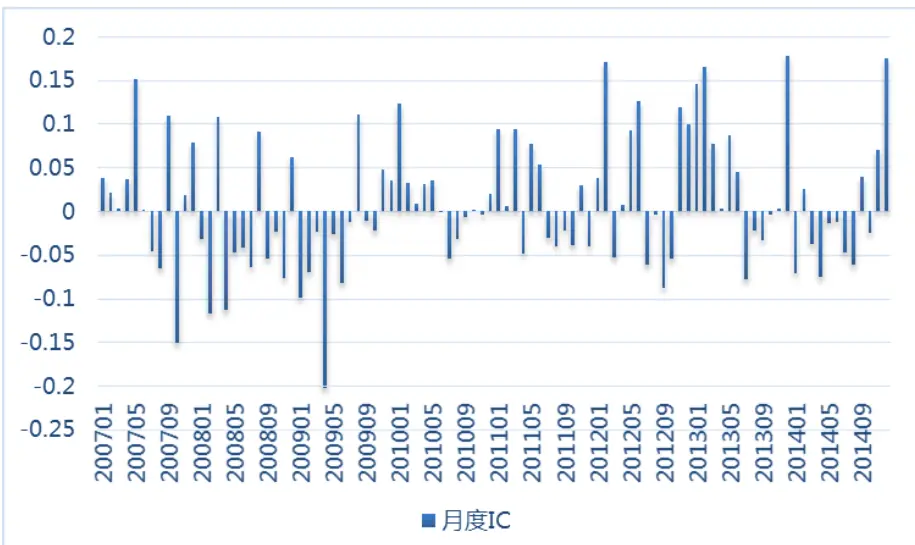
数据来源：广发证券发展研究中心

从IC角度看，EG_GFCE_FY0的历史算术平均为0.008，胜率为49.0%。但事实上，从图上可以看到，从2009年第四季度之后，该因子的IC胜率还是维持在了较高水平。

## 3. 盈利调整因子EarningRev_GFCE

表 9：EarningRev_GFCE 因子收益分年度统计表

| 2007 |  | 2008 2009 2010 |  |  | 2011 | 2012 2013 2014 总体 |  |  |  |
| --- | --- | --- | --- | --- | --- | --- | --- | --- | --- |
| 超额收益（沪深300) | 13.18% | 32.96% | 8.64% | 38.61% | 4.42% | -1.74% | 39.44% | 7.30% | 18.06% |
| 年化波动（沪深300) | 19.55% | 18.54% | 14.45% | 13.71% | 12.85% | 14.74% | 10.06% | 29.20% | 17.40% |
| 信息比率（沪深300） | 0.67 | 1.78 | 0.60 | 2.82 | 0.34 | -0.12 | 3.92 | 0.25 | 1.04 |
| 最大回撤（沪深300) | 14.24% | 8.43% | 10.06% | 2.08% | 6.27% | 9.17% | 1.94% | 24.20% | 24.20% |
| 超额收益（中证500) | 4.62% | 12.54% | -5.88% | 12.03% | 16.60% | 5.34% | 9.81% | 25.36% | 9.79% |
| 年化波动（中证500） | 16.53% | 8.92% | 7.41% | 5.93% | 3.94% | 5.50% | 3.24% | 5.77% | 8.00% |
| 信息比率（中证500) | 0.28 | 1.41 | -0.79 | 2.03 | 4.21 | 0.97 | 3.03 | 4.40 | 1.22 |
| 最大回撤（中证500) | 12.30% | 3.53% | 6.45% | 1.93% | 0.00% | 1.56% | 0.67% | 1.06% | 12.30% |
| 超额收益（中证800) | 12.39% | 29.40% | 5.82% | 32.09% | 7.74% | 0.11% | 31.81% | 13.70% | 16.94% |
| 年化波动（中证800) | 14.93% | 14.66% | 11.31% | 9.89% | 9.81% | 12.10% | 7.76% | 21.24% | 13.24% |
| 信息比率（中证800） | 0.83 | 2.01 | 0.51 | 3.25 | 0.79 | 0.01 | 4.10 | 0.64 | 1.28 |
| 最大回撤（中证800) | 8.17% | 6.34% | 7.40% | 0.26% | 4.32% | 7.09% | 1.24% | 15.70% | 15.70% |
| 换手率 | 872.94% | 963.42% | 986.16% | 1018.14% | 1024.98% | 1033.43% | 1014.03% | 1037.86% | 993.87% |

数据来源：广发证券发展研究中心

图 15：EarningRev_GFCE 因子收益曲线
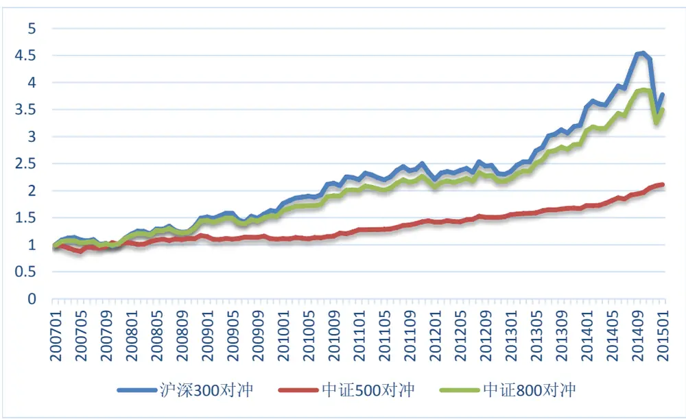
数据来源：广发证券发展研究中心

盈利调整因子选取的股票也是偏中小盘偏成长的，因此用中证500指数对冲后的净值曲线稳定性较佳，特别是2010年以后，月度回撤均保持在2%以内。除了2012、2013年收益略低外，其他年份均保持了10%以上的Alpha，2014年超中证500收益25%。若用300与800进行对冲，收益较高，稳定性不如500好，特别是在14年底有所回撤。

图16：EarningRev_GFCE月度IC
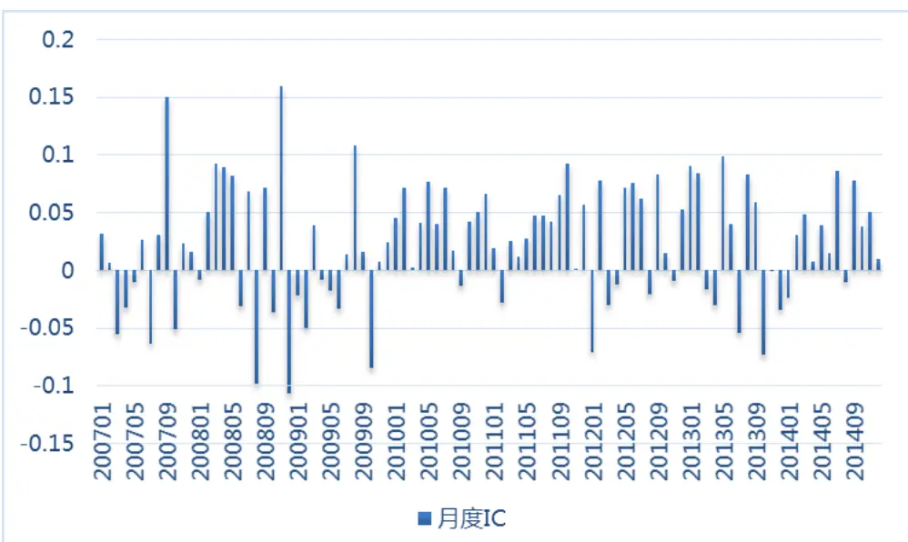
数据来源：广发证券发展研究中心

从IC角度看，盈利调整因子的月度IC均值为0.023，胜率为67.7%，比较稳定。从月度IC图中可以明显看出其有效性从2009年下半年开始有明显提高，这段时间内的IC均值为0.029，胜率为75.8%。一方面与近几年卖方模式的成熟化有关，另一方面，数据库在2009年以后的报告也较为完善。

## 4.一致预期偏离因子CEBias_GFCE

表 10：CEBias_GFCE 因子收益分年度统计表

| 2007 2008 2009 2010 2011 |  |  |  |  |  | 2012 2013 2014 总体 |  |  |  |
| --- | --- | --- | --- | --- | --- | --- | --- | --- | --- |
| 超额收益（沪深300） | 10.23% | 23.09% | 6.79% | 39.20% | -1.82% | 2.00% | 31.99% | -3.77% | 13.73% |
| 年化波动（沪深300) | 16.78% | 18.35% | 14.99% | 12.88% | 13.15% | 14.96% | 8.78% | 27.76% | 16.76% |
| 信息比率（沪深300） | 0.61 | 1.26 | 0.45 | 3.04 | -0.14 | 0.13 | 3.64 | -0.14 | 0.82 |
| 最大回撤（沪深300) | 13.05% | 9.84% | 11.07% | 3.34% | 6.97% | 5.84% | 1.81% | 27.19% | 27.19% |
| 超额收益（中证500） | 1.48% | 4.22% | -7.36% | 12.36% | 9.75% | 9.38% | 3.68% | 12.23% | 5.68% |
| 年化波动（中证500） | 15.91% | 6.88% | 6.70% | 6.61% | 3.61% | 5.04% | 4.33% | 4.32% | 7.37% |
| 信息比率（中证500） | 0.09 | 0.61 | -1.10 | 1.87 | 2.70 | 1.86 | 0.85 | 2.83 | 0.77 |
| 最大回撤（中证500) | 12.27% | 4.35% | 8.31% | 2.11% | 1.02% | 1.28% | 1.94% | 1.94% | 12.27% |
| 超额收益（中证800） | 9.37% | 19.82% | 4.06% | 32.61% | 1.33% | 3.93% | 24.69% | 1.94% | 12.64% |
| 年化波动（中证800） | 11.77% | 14.21% | 11.73% | 9.06% | 10.05% | 12.25% | 6.64% | 19.66% | 12.49% |
| 信息比率（中证800） | 0.80 | 1.39 | 0.35 | 3.60 | 0.13 | 0.32 | 3.72 | 0.10 | 1.01 |
| 最大回撤（中证800) | 7.19% | 7.75% | 9.18% | 1.52% | 4.89% | 4.46% | 1.12% | 18.76% | 18.76% |

识别风险，发现价值

数据来源：广发证券发展研究中心

图17：CEBias_GFCE因子收益曲线
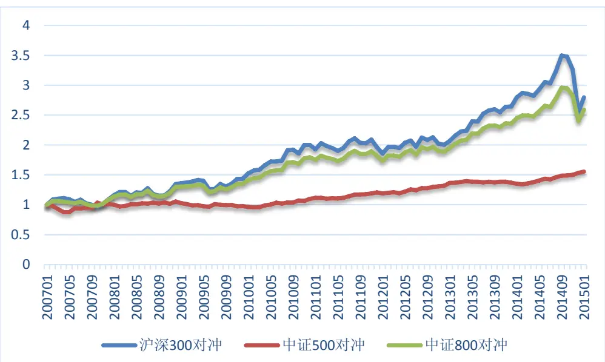
数据来源：广发证券发展研究中心

图18：CEBias_GFCE月度IC
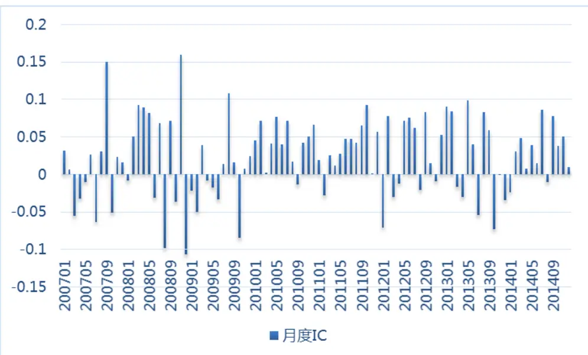
数据来源：广发证券发展研究中心

从IC角度看，CEBias_GFCE的均值为0.017，胜率为65.6%，比较稳定。同EarningRev_GFCE类似，CEBias_GFCE的有效性从2009年下半年开始有明显提高，这段时间内的IC均值为0.024，胜率为74.2%。

## 4. 四因子组合构建

基于上述分析，我们使用有效性较高的估值因子EP_GFCE_FY1、成长性因子EG_GFCE_FY0、盈利调整因子EarningRev_GFCE与预期偏离因子CEBias_GFCE构建一个四因子组合。

首先，我们测算下七个因子之间的历史IC相关性

表10：各因子之间的IC相关性（标黄色为推荐因子）

|  | EP_TTM | EP_GFCE_FY0 | EP_GFCE_FY1 | EG_GFCE_FY0 | EG_GFCE_FY1 | EarningRev_GFCE | CEBias_GFCE |
| --- | --- | --- | --- | --- | --- | --- | --- |
| EP_TTM | 100.00% | 70.68% | 67.59% | 24.86% | -43.90% | 6.51% | 6.76% |
| EP_GFCE_FY0 | 70.68% | 100.00% | 94.38% | 1.58% | -74.35% | -19.16% | -23.09% |
| EP_GFCE_FY1 | 67.59% | 94.38% | 100.00% | 2.64% | -51.60% | -13.96% | -18.04% |
| EG_GFCE_FY0 | 24.86% | 1.58% | 2.64% | 100.00% | 11.28% | 15.23% | 12.12% |
| EG_GFCE_FY1 | -43.90% | -74.35% | -51.60% | 11.28% | 100.00% | 18.02% | 21.74% |
| EarningRev_GFCE | 6.51% | -19.16% | -13.96% | 15.23% | 18.02% | 100.00% | 73.65% |
| CEBias_GFCE | 6.76% | -23.09% | -18.04% | 12.12% | 21.74% | 73.65% | 100.00% |

数据来源：广发证券发展研究中心

有如下结论：

用预期数据构建的EP_GFCE_FY1与历史估值EP_TTM选股IC相关性约为68%

- 成长EG_GFCE_FY0因子与其他因子的IC相关性都比较小

- 盈利调整与一致预期偏差因子与估值、成长性类因子的IC相关性都比较小

鉴于四个因子的收益相关性较低，因此可以结合四个因子进行选股。为每个因子赋予1/4的权重，月度对全市场股票进行打分，并且挑选前100只股票进行组合配臵。

图19：四因子组合净值曲线
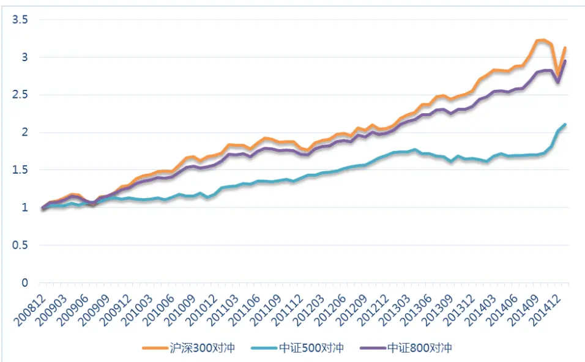

数据来源：广发证券发展研究中心

表10：四因子组合收益分年度统计表

| 2009 2010 2011 2012 2013 2014 总体 |  |  |  |  |  |  |  |
| --- | --- | --- | --- | --- | --- | --- | --- |
| 超额收益（沪深300) | 29.77% | 30.28% | 5.94% | 14.42% | 24.73% | 8.40% | 20.63% |
| 年化波动（沪深300) | 15.19% | 10.04% | 10.87% | 9.86% | 6.88% | 17.22% | 12.79% |
| 信息比率（沪深300) | 1.96 | 3.02 | 0.55 | 1.46 | 3.59 | 0.49 | 1.61 |
| 最大回撤（沪深300) | 10.68% | 3.25% | 6.90% | 2.92% | 2.13% | 14.31% | 14.31% |
| 超额收益（中证500) | 12.83% | 4.52% | 17.77% | 22.00% | -2.47% | 22.39% | 13.06% |
| 年化波动（中证500） | 6.70% | 9.49% | 8.09% | 3.49% | 8.09% | 13.01% | 8.72% |
| 信息比率（中证500) | 1.92 | 0.48 | 2.20 | 6.30 | -0.31 | 1.72 | 1.50 |
| 最大回撤（中证500) | 1.99% | 5.17% | 1.88% | 0.00% | 8.71% | 2.30% | 8.80% |
| 超额收益（中证800） | 26.48% | 23.93% | 9.17% | 16.43% | 17.70% | 13.60% | 19.48% |
| 年化波动（中证800) | 11.97% | 6.83% | 8.65% | 7.13% | 5.80% | 9.54% | 9.17% |
| 信息比率（中证800） | 2.21 | 3.50 | 1.06 | 2.30 | 3.05 | 1.43 | 2.12 |
| 最大回撤（中证800) | 8.06% | 1.43% | 4.36% | 1.46% | 2.54% | 5.71% | 8.06% |
| 换手率 | 6.60 | 6.32 | 6.81 | 6.80 | 6.68 | 7.16 | 6.73 |

数据来源：广发证券发展研究中心

四因子组合从2009至2014年相对沪深300复合年化超额收益为20.63%，信息比率1.61，但在2014年末回撤较大；由于组合股票更偏向小盘股一些，因此用诸如中证800等风格相对均衡的基准对冲后的效果更为稳定一些，年化复合收益19.48%，信息比率2.12，最大回撤8.05%，发生在2009年。年度平均换手在6.73倍左右。

## 四、总结与思考

我们基于分析师的研究报告，从分析师历史预测准确度，发布影响力，报告时效性这三个维度出发,给每个分析师在每个股票上的预测值赋予一定权重，构建了广发一致预期指标，并基于广发一致预期衍生出估值类因子，成长类因子，盈利调整因子和一致预期偏离因子。实证表明，基于分析师预期的因子比传统的基于已知信息的因子拥有更高的alpha。

当然指标仍然有待完善，比如在分析师评价体系中如何增加核心分析师的权重，使得广发一致预期的前瞻预测能力更强；如何对分析师覆盖度不够甚至无人覆盖的股票进行业绩建模（譬如可以使用可比公司法等）；如何基于一致预期数据构建更加丰富的因子都是有待进一步研究的课题。

## Table_RatingIndustry 广发证券—行业投资评级说明

买入： 预期未来 12 个月内，股价表现强于大盘 10%以上。

持有： 预期未来12个月内，股价相对大盘的变动幅度介于-10%～+10%。

卖出： 预期未来12个月内，股价表现弱于大盘10%以上。

## Table_RatingCompany 广发证券—公司投资评级说明

买入： 预期未来12个月内，股价表现强于大盘15%以上。

谨慎增持： 预期未来12个月内，股价表现强于大盘5%-15%。

持有： 预期未来12个月内，股价相对大盘的变动幅度介于-5%～+5%。

卖出： 预期未来12个月内，股价表现弱于大盘5%以上。

## Table_Ad联系我们

| 地址 | 广州市 广州市天河北路183号 | 深圳市 深圳市福田区金田路4018 | 北京市 北京市西城区月坛北街2号 | 上海市 |
| --- | --- | --- | --- | --- |
|  | 大都会广场5楼 | 号安联大厦 15 楼 A 座 03-04 | 月坛大厦18层 | 上海市浦东新区富城路99号 震旦大厦18楼 |
| 邮政编码 | 510075 | 518026 | 100045 | 200120 |
| 客服邮箱 | gfyf@gf.com.cn |  |  |  |
| 服务热线 | 020-87555888-8612 |  |  |  |

## Table_Disclaimer 免 责声 明

广发证券股份有限公司具备证券投资咨询业务资格。本报告只发送给广发证券重点客户，不对外公开发布。

本报告所载资料的来源及观点的出处皆被广发证券股份有限公司认为可靠，但广发证券不对其准确性或完整性做出任何保证。报告内容仅供参考，报告中的信息或所表达观点不构成所涉证券买卖的出价或询价。广发证券不对因使用本报告的内容而引致的损失承担任何责任，除非法律法规有明确规定。客户不应以本报告取代其独立判断或仅根据本报告做出决策。

广发证券可发出其它与本报告所载信息不一致及有不同结论的报告。本报告反映研究人员的不同观点、见解及分析方法，并不代表广发证券或其附属机构的立场。报告所载资料、意见及推测仅反映研究人员于发出本报告当日的判断，可随时更改且不予通告。

本报告旨在发送给广发证券的特定客户及其它专业人士。未经广发证券事先书面许可，任何机构或个人不得以任何形式翻版、复制、刊登、转载和引用，否则由此造成的一切不良后果及法律责任由私自翻版、复制、刊登、转载和引用者承担。