# Alpha对冲中的期现交易时差影响分析

## Table_Sum ary报告摘要 ：

## 期现交易不同步影响Alpha 对冲策略的性能

沪深 300 股指期货上市以来，可以获得绝对收益的 Alpha 对冲策略受到了国内机构投资者的关注，成为了市场追捧的热点。Alpha对冲策略的执行效果受到诸多因素的影响。选股模型、期货的基差和流动性、对冲头寸等都会影响到对冲策略的性能。除此之外，从实际交易上来讲，由于目前国内机构投资者在股票现货端和期货端的交易机制相对独立，使得期现货的交易时间上不同步，这是影响Alpha 对冲策略性能的一个重要因素。

## 性能评价指标

本报告选取了一系列的评价指标，从对冲组合当天的浮盈收益率角度定量分析了 Alpha 对冲策略期现货交易时间差对策略的影响。评价指标包括对冲组合收益率的均值、标准差、风险价值 VaR和对应的期望损失ES。其中，均值和标准差表示不同期现交易方式下收益率的期望和风险；VaR表示在一定置信水平下组合的最大损失；期望损失 ES 刻画了当损失超过VaR时的平均损失。

## 实证分析结论

本报告分别以沪深 300 成份股、中证 500 成份股和中证 800 成份股为现货，进行了实证分析，获得了一些有价值结论：

（1）假设用于购买对冲组合的总资金为1亿元，由于流动性的影响，如果要一次性购入现货组合，所需要额外付出的冲击成本为 0.06%-0.14%。

（2）如果期现货的建仓时间不同步，可能造成当日浮盈亏的收益率标准差超过 1%，考虑交易成本，在95%的置信水平下，VaR 可能超过-2%。

（3）当期现货的建仓时间基本一致，而且将建仓的订单拆细执行时，能够获得较大的收益，减小风险和损失。

（4）对冲策略对冲的是系统性风险，对冲后组合也有风险。

（5）本报告中沪深300成份股、中证500成份股和中证800 成份股等现货组合基本上都不具有超额收益，即α=0。考虑到实际交易中现货组合会产生超额收益α，实际交易时，需要同时考虑增加超额收益（提早建仓）和减小冲击成本（分散时间建仓）。

本报告的研究思路可以给投资者进行期现货交易机制选择时提供决策参考。例如，给定期现组合能够容忍的最大浮亏，可以计算出期现货建仓时间差的范围。在这里需要注意的是，不同的现货组合和市场指数的相关度不同，如果要获得精确的结论，需要对实际组合进行考察。

图 1 期货开盘建仓时不同现货建仓方式组合下当日收益率的百分位数
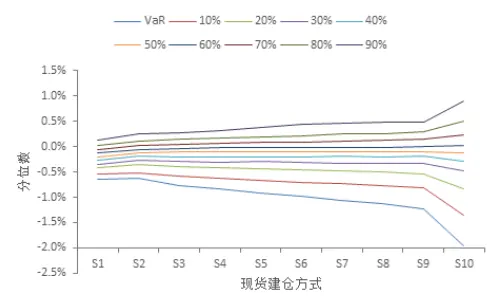

图 2 期货收盘建仓时不同现货建仓方式组合下当日收益率的百分位数
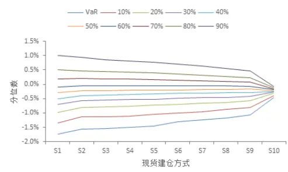

Table_Aut hor 分析师： 张超 S0260514070002

020-87555888-8646

zhangchao@gf.com.cn

## Table_Report 相关研究：

联系人： 文巧钧

公020-87555888-8400

wenqiaojun@gf.com.cn

## 一、Alpha 对冲市场前景广阔

从 2010年沪深300股指期货上市以来，追求绝对回报的量化对冲基金逐渐受到投资者关注。Alpha对冲策略能够在控制市场下行风险的前提下获得稳定的收益，在近年的市场中表现突出，成为市场追捧的热点。2013 年，监管部门取消了公募基金利用对冲策略获取绝对收益的限制，同年 12月，国内首只对冲型公募基金嘉实绝对收益策略成立，自此打开公募领域绝对收益量化产品的大门。

目前，上证50股指期货和中证 500股指期货即将上市，将极大的促进国内Alpha对冲策略市场的发展。尤其是中证 500 股指期货的推出，能够有效解决市值风格差异对对冲策略的影响，使得对冲更加精准。

Alpha对冲策略是通过做空与股票组合现货对应的股指期货，来获取绝对收益的一种策略。假设某股票组合，超额收益为α，组合收益R与指数收益 $R_{M}$ 的相关性 $\mathbf{i}\beta=$ $cov(R,R_{M})/var(R_{M})$ ，则组合的收益R可以表示为

$$
R=\alpha+\beta R_{M}+e
$$

其中 $\beta R_{M}$ 表示该组合的系统性风险，e为非系统性风险。如果我们在做多价值为 1 的现货的同时做空价值为 $\cdot\beta$ 的股指期货，则对冲组合的收益为

$$
R_{Hedge}=R-\beta R_{M}=\alpha+e
$$

通过做空适当头寸的股指期货，Alpha对冲策略可以对冲掉股票现货组合的系统性风险。正因为如此，Alpha 对冲策略可以将股票组合对市场的超额收益分离出来，获得风险较低的稳健回报。

## 二、影响 Alpha 对冲策略的主要因素

## （一）选股模型

选股是Alpha策略最重要的环节，股票组合的选取直接决定了能否获得超越市场的股票超额收益。目前的主流方法是构建多因子Alpha量化模型。多因子Alpha策略通过发掘出驱动个股产生 Alpha收益的因子，根据有效的 Alpha因子设计相应的选股策略，筛选投资的股票组合，以寻找超越市场的股票超额收益。基于多因子的 Alpha 策略框架如图1所示。

图1：基于多因子的Alpha策略框架
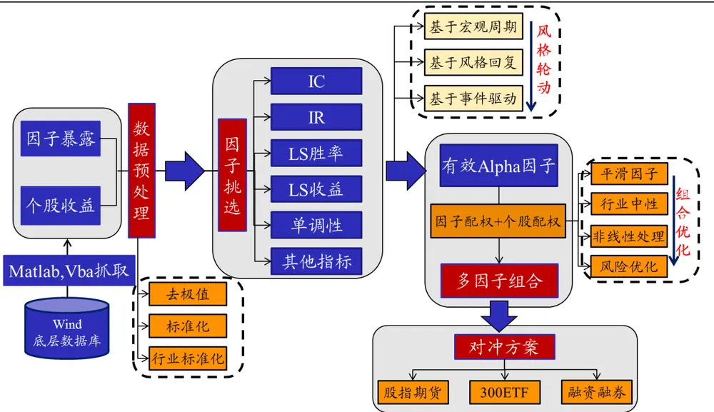
数据来源：广发证券发展研究中心

## （二）股指期货对冲

由于交易成本低、流动性好、可以进行杠杆交易、可以做空，股指期货是 Alpha策略中最常用的对冲手段。目前 A 股市场可以用来作为对冲工具的是沪深 300 股指期货。上证50和中证 500股指期货也将在2015年4月 16日上市。

股指期货对冲时，有三个因素可能会影响到对冲的结果。第一个因素是基差。基差是股指期货和对应的现货指数的差值，对冲的目的是消除指数的下行带来的系统性风险，由于股指期货和指数间存在基差，使得对冲的效果受到影响。第二个因素是股指期货的流动性，流动性决定了做空股指期货时的冲击成本。从减小冲击成本的角度来考虑，应该选取流动性比较大的股指期货合约。第三个因素是股指期货的交割日期。从对冲的角度来说，最好是选取和现货持仓时间接近的股指期货合约。如果现货持仓期很长，期货端需要考虑换仓展期的问题。本报告中，选取做空的期货为沪深300股指期货主力合约，即选择上一个交易日持仓最大的股指期货合约进行期货端的做空。

## （三）股指期货头寸

Alpha对冲时，做空股指期货的目的是对冲现货组合的系统性风险。由于R = α+βR + e，对冲的头寸由β决定。理想的情况下，我们需要根据组合持有期的β来计算期货的头寸。但是，持有期的β不能够直接获得，只能通过此前的β值进行预测。预测的β值和实际持有期β的差别会影响到对冲的效果。本报告采用较简单的历史统计法进行滚动预测，在每一次计算对冲头寸时，通过现货组合和市场指数此前50个交易日的日收益率计算组合的 $\beta=cov(R,R_{M})/var(R_{M})$ ，并将其作为期货的对冲比例。

## （四）期现对冲的时间差

影响 Alpha 对冲业务的另一个重要因素是期现对冲时间上的不同步，也就是期货端和现货端建仓平仓存在时间差。国内机构的期货和现货下单的模式比较独立。从现货交易来说，现货端下单的主要方式有集中交易室交易和算法交易的方式。集中交易室的主要功能是交易执行和风险控制，一般由交易员手工作业进行下单。算法交易在美国证券市场首先提出，近年来在国内发展迅速。算法交易一般将需要进行交易的订单拆细，即将大规模交易拆分为若干小规模交易，并在合适的时机分别对其进行分散交易。因此，算法交易可以降低交易中的冲击成本、提高交易的执行效率，并且隐蔽自己的交易行为。常用的算法交易策略有成交量加权平均价格算法（VWAP），时间加权平均价格算法（TWAP），执行落差交易策略（IS）等。

期货下单方面，也有手动下单和算法交易下单两种方式。机构投资者在现货和期货端不同的交易方式容易引发对冲的时间差。即使期货交易和现货交易都是采用算法交易来执行，但由于市场的流动性问题，以及出于降低冲击成本的考虑而分散下单的算法交易策略，会使得期货和现货的建仓不同步。

时间上的不同步，使得机构手中的现货组合在一段时间内处于未受对冲保护的情况，或者是机构在一段时间仅持有股指期货的空头。如果市场在这段时间中有较大的波动，则会使机构投资者手中的未受保护的现货仓位或单边的期货仓位产生风险。

如果期货和现货的交易在时间上不同步，会对整个对冲组合造成多大的风险？这是本篇报告研究的内容。本篇报告从对冲组合的建仓时间不同步出发，分析了不同建仓方式和不同建仓时间差对期现货组合造成的影响。

## 三、日内对冲时差影响分析

## （一）评价指标及实证分析方案

由于现货和期货都在同一天买入，不同的建仓方式下，到收盘时所持的期货和现货量将一致。在比较不同的建仓时间差上，只需要考虑不同建仓方式下当日的浮盈亏即可。

假设总资金为A，做多现货需要的资金为S，做空期货头寸对应的金额为F = βS，需要保证金F/L，其中L为股指期货的杠杆。考虑到股指期货的持有期比较长，为了避免股指期货的涨跌造成可能的爆仓，期货的杠杆L应该要比较小。由 $A=S+F/L可$ 以分别计算出应该分配给期货和现货的资金量。

假设到当日收盘时，做多现货的浮盈亏为ΔS，做空期货的浮盈亏为ΔF，则期现对冲组合当日的浮盈亏为 $\Delta A=\Delta S+\Delta F$ 。根据对不同期货现货建仓情境下 $r=\Delta A/A$ 的分析，可以获得期现建仓不同步引起的对冲组合风险。

对于风险的评价，我们采用r的均值、标准差、风险价值（Value at Risk，VaR）和对应的期望损失（Expected Shortfall，ES）来衡量。

VaR 是指在置信水平λ下，投资组合在未来特定时期的最大可能损失。即

$$
VaR_{\lambda}=\max\{r_{0}\leq0:P(r>r_{0})\geq\lambda\}
$$

我们一般取λ= 95%作为置信水平。

为了描述当投资组合的损失超过 VaR 阀值时所遭受的平均损失程度，可以采用期望损失ES。ES是以损失在超过 VaR 时的条件期望来定义的：

$$
ES=E\{r|r<VaR\}
$$

本报告中，采取指数成份股作为现货，分别考虑沪深300 指数成份股、中证500成份股和中证 800 成份股三种不同的现货情形；期货对冲都采用沪深 300 股指期货主力合约。考虑到沪深 300 股指期货上市以来，期货合约在一个月内的最大涨跌幅度约为 20%，为了防止持有期间期货爆仓，采用L = 4作为期货的杠杆。假设每天进行交易的总资金为1 亿。

本报告侧重于考虑建仓时间差对组合的影响，考虑沪深 300 股指期货上市以来（2010 年4 月16日以来）每一个交易日期现货建仓不同步造成的组合风险。为了评估这种影响，在实证分析中考虑了几种不同的现货建仓方式和期货建仓方式。

现货的建仓方式和期货的建仓方式分别如表 1 和表 2 所示。其中，现货交易方式 1（S1）和方式10（S10）按照开盘后或收盘前的卖盘挂单进行建仓。由于A股市场仅提供卖一到卖五的挂盘价格和委卖量，如果需要买入的现货量小于挂单的总委卖量，则按照相应的挂盘卖价和委卖量一次性买入；如果需要买入的现货量大于挂单的总委卖量，则按照卖一至卖五的加权平均价买入（由于卖盘挂单不能完全满足现货买入量，因此实际交易时的建仓买入价格会比本报告中的成本稍高一些）。现货买入手续费按照0.15%的单边交易费用来计算。

做空期货的建仓方式分为三种。其中，方式1（F1）和方式2（F2）是在短时间内建仓。在实证分析中，F1 和F2 按照需要做空的期货量，每隔5 秒钟下单一次，按照买一价卖出对应的买盘挂单手数，直到所有的做空仓位建好。期货建仓方式3（F3）按照整个交易日的股指期货买一价格的平均值进行建仓。期货建仓的手续费按照期货价值的0.01%来计算。

表 1.现货建仓方式

| 建仓方式 | 描述 |
| --- | --- |
| 方式1（S1） | 开盘时按照卖盘挂单建仓 |
| 方式2（S2） | 开盘30 分钟内平均卖一价建仓 |
| 方式3（S3） | 开盘1小时内平均卖一价建仓 |
| 方式4（S4） | 开盘1个半小时内平均卖一价建仓 |
| 方式5（S5） | 开盘2个小时内平均卖一价建仓 |
| 方式 6（S6 ） | 开盘2 个半小时内平均卖一价建仓 |
| 方式7（S7） | 开盘3个小时内平均卖一价建仓 |
| 方式8（S8） | 开盘3个半小时内平均卖一价建仓 |
| 方式9（S9） | 整个交易日平均卖一价建仓 |
| 方式10（S10） | 收盘前按照卖盘挂单建仓 |

数据来源：广发证券发展研究中心

表 2.期货建仓方式

| 建仓方式 | 描述 |
| --- | --- |
| 方式1（F1） | 现货开盘时建仓 |
| 方式 2（F2） | 现货收盘时建仓 |
| 方式3（F3） | 整个交易日平均买一价建仓 |

数据来源：广发证券发展研究中心

## （二）以沪深 300 成份股为现货

首先考虑以沪深 300 成份股为现货的情形。由于期货指数的标的就是我们买入的现货，因此β = 1。在1亿的总资金和 4倍期货杠杆下，每天用于购买现货的资金为 8 千万。

不同现货交易方式和期货交易方式组合下收益率r = ΔA/A的标准差如图2所示。注意到，建仓时间上基本一致的期现组合的收益率波动最小，如组合 S1-F1（都在现货开盘时建仓）、S9-F3（期货和现货都在整个交易日内建仓，除了期货交易时间比现货交易时间多半个小时之外，建仓时间基本一致）和S10-F2（都在现货收盘前建仓），这几个组合的收益率标准差都在 0.2%左右。具体来说，S1-F1 的标准差为0.29%，S9-F3的标准差为0.22%，S10-F2的收益率标准差为0.15%。而如果现货开盘时就买入现货，到现货收盘时再做空期货的话（即 S1-F2），相当于现货在交易日内失去了对冲保护，收益率的标准差为1.00%；反之，如果在开盘时就做空期货，收盘前才买入现货的的话（S10-F1），收益率的标准差为 1.01%。可见，期货现货建仓不同步的话，对冲组合日内的收益率标准差有1%左右，如果同步建仓的话，可以将标准差降低到0.2%左右。

考虑更具体的统计指标。图 3-图 5 表示不同期货和现货建仓时间下，对冲组合收益率的百分位数。从风险价值VaR来考虑对冲组合在当日的浮亏，采用95%的置信水平进行分析。可以看到，如果期现货日内对冲时间差最大时（组合 S1-F2 和组合S10-F1），则 VaR 分别为-1.74%（组合 S1-F2）和-1.96%（组合 S10-F1），期望损失

ES（浮亏超过 VaR 时的平均亏损率）分别为-2.46%（组合 S1-F2）和-2.70%（组合S10-F1）。如果期货现货都是在现货开盘时建仓（S1-F1），则 VaR 为-0.65%，期望损失 ES为-0.84%；如果期货现货都是在现货收盘前建仓（S10-F2），则VaR为-0.46%，期望损失ES为-0.58%；如果期货现货都是在整个交易日不同时刻平均建仓（S9-F3），则 VaR 为-0.50%，期望损失 ES 为-0.65%。可见，按照 95%的置信水平，期货现货建仓不同步的话，对冲组合日内的收益率 VaR 最大为-1.96%，期望损失 ES 为-2.70%；如果同步建仓的话，可以将 Var降低到-0.46%至-0.65%，期望损失 ES降为-0.58%至-0.84%。具体的数据可参考表3。

图2：不同期现货交易方式下沪深300成份股对冲组合日内的收益率标准差
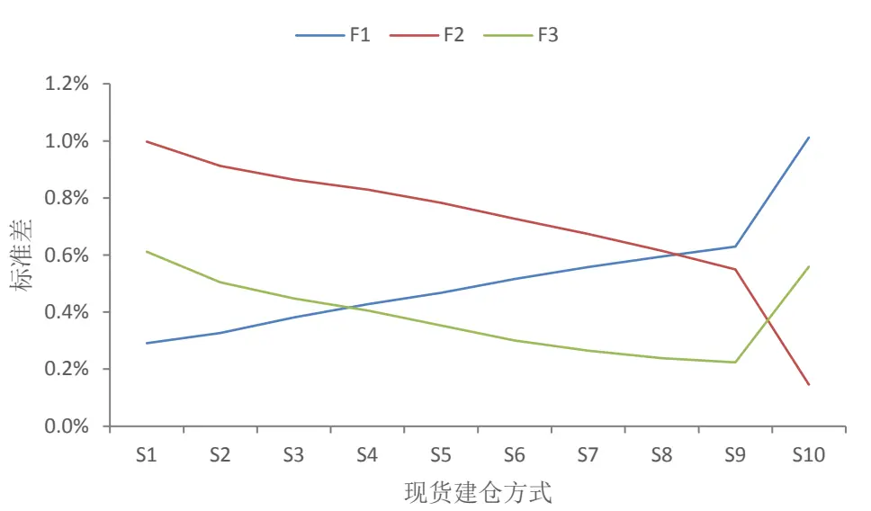
数据来源：广发证券发展研究中心，天软科技

图3：期货F1时不同现货交易方式下沪深300成份股对冲组合日内收益率分位数
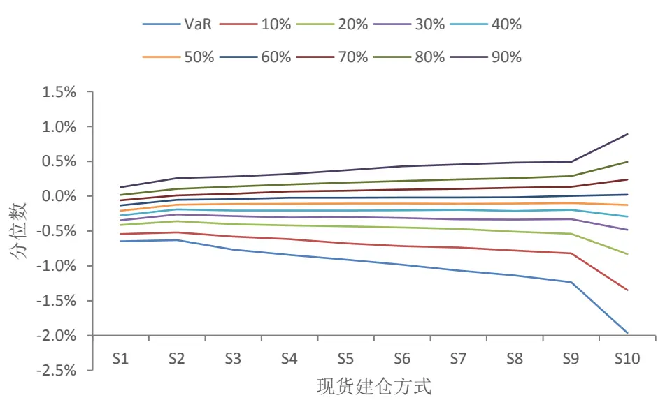
数据来源：广发证券发展研究中心，天软科技
识别风险，发现价值

图4：期货F2时不同现货交易方式下沪深300成份股对冲组合日内收益率分位数
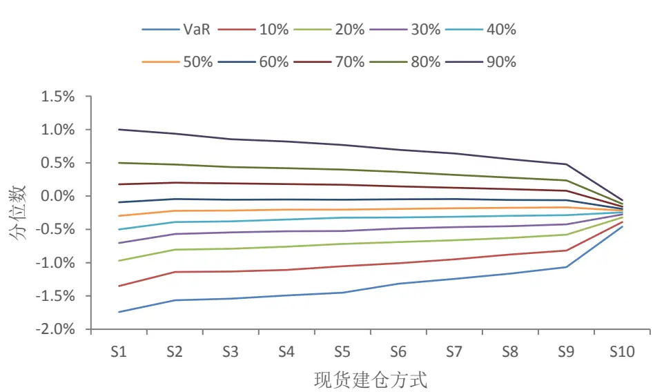
数据来源：广发证券发展研究中心，天软科技

图5：期货F3时不同现货交易方式下沪深300成份股对冲组合日内收益率分位数
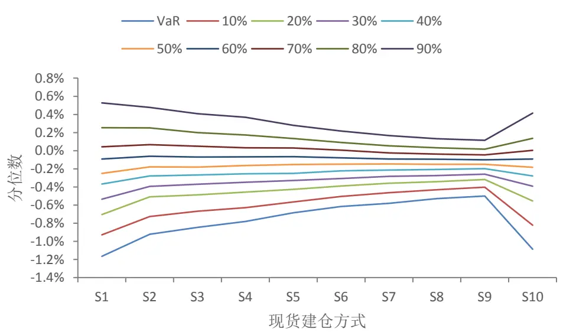
数据来源：广发证券发展研究中心，天软科技

从收益率的波动性和 VaR 可以看到，期现货同时建仓可以减小现货和期货单向变动带来的风险。而如果从收益率的均值图 6 来看，我们可以看到，如果是短时间内对现货建仓（S1和S10），会使收益率明显下降。特别的，比较 S1和S2两种现货建仓方式，S1 是在现货开盘时按照现货开盘的卖盘进行建仓，S2 是现货开盘 30 分钟内，按照卖一价的平均值进行建仓，S1 的平均收益率比S2 低0.08%，这部分损失基本上由现货的冲击成本造成。而期货建仓方面，由于期货的流动性相对充裕，因此对收益率的影响相对较小，图 6 中，在相同的现货建仓方式下，期货建仓方式带来的收益率 r(F1，开盘建仓)>r(F3，日内平均卖一价建仓)>r(F2，收盘建仓)，这可能是由于股指期货上市以来，沪深 300 指数总体上是下跌的造成的。注意到，期货建仓是根据一定时间内的卖一价进行估算的，如果要在某一时刻对期货进行一次性建仓，需要承担的冲击成本要更大一些。

综合考虑对冲不同步造成的风险以及冲击成本，在以上建仓方式组合中，期现货同步建仓而且分散时间建仓的平均收益率最高，就是最优的建仓方式是 S9-F3（现货端和期货端都是整个交易日内进行建仓）。

图6：不同期现货交易方式下沪深300成份股对冲组合日内的收益率均值
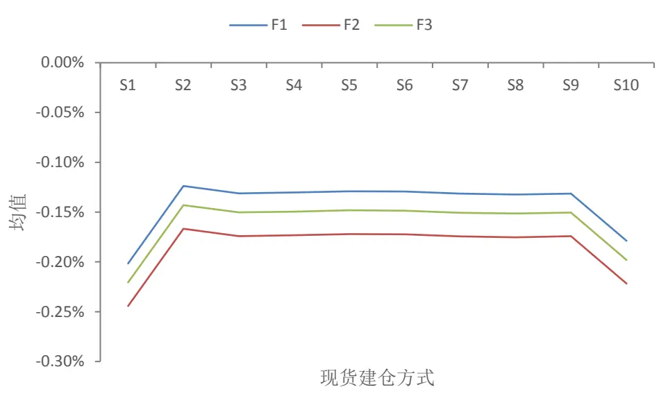
数据来源：广发证券发展研究中心，天软科技

表3.沪深 300现货对冲组合中不同现货期货建仓方式下的详细数据

| 期货 | 现货 | S1 | S2 | S3 | S4 | S5 | S6 | S7 | S8 | S9 | S10 |
| --- | --- | --- | --- | --- | --- | --- | --- | --- | --- | --- | --- |
| F1 | 均值 | -0.201% | -0.124% | -0.131% | -0.130% | -0.129% | -0.129% | -0.132% | -0.132% | -0.131% | -0.179% |
|  | 标准差 | 0.291% | 0.326% | 0.381% | 0.427% | 0.467% | 0.516% | 0.558% | 0.595% | 0.630% | 1.012% |
|  | VaR | -0.646% | -0.630% | -0.768% | -0.844% | -0.909% | -0.985% | -1.068% | -1.136% | -1.235% | -1.962% |
|  | ES | -0.844% | -0.852% | -1.024% | -1.159% | -1.275% | -1.423% | -1.556% | -1.668% | -1.777% | -2.700% |
| F2 | 均值 | -0.244% | -0.167% | -0.174% | -0.173% | -0.172% | -0.172% | -0.174% | -0.175% | -0.174% | -0.222% |
|  | 标准差 | 0.998% | 0.912% | 0.864% | 0.829% | 0.783% | 0.727% | 0.674% | 0.615% | 0.550% | 0.146% |
|  | VaR | -1.742% | -1.566% | -1.539% | -1.492% | -1.449% | -1.314% | -1.243% | -1.165% | -1.066% | -0.458% |
|  | ES | -2.456% | -2.209% | -2.130% | -2.062% | -1.959% | -1.839% | -1.724% | -1.592% | -1.444% | -0.577% |
| F3 | 均值 | -0.221% | -0.143% | -0.150% | -0.149% | -0.148% | -0.149% | -0.151% | -0.151% | -0.150% | -0.198% |
|  | 标准差 | 0.612% | 0.505% | 0.448% | 0.406% | 0.353% | 0.301% | 0.265% | 0.238% | 0.224% | 0.559% |
|  | VaR | -1.164% | -0.922% | -0.845% | -0.781% | -0.684% | -0.614% | -0.580% | -0.527% | -0.501% | -1.086% |
|  | ES | -1.491% | -1.189% | -1.109% | -1.028% | -0.902% | -0.787% | -0.712% | -0.658% | -0.649% | -1.526% |

数据来源：广发证券发展研究中心，天软科技

## （三）以中证 500 成份股为现货

然后考虑以中证 500 指数成份股和以中证 800 指数成份股为现货的情形。用此前 50个交易日的收益率计算出来的这两种现货的β值如图7所示。其中中证 500成份股计算出来的 β 变化幅度较大，而中证 800 指数由于包含了沪深 300 成份股和中证 500成份股，所以 β值基本上在 1左右。

图7：以中证500和中证800指数成份股为现货时的β值
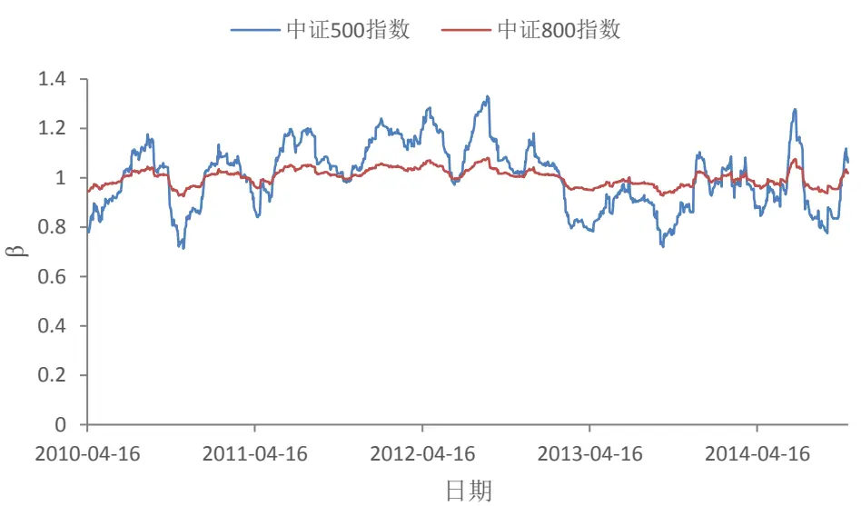
数据来源：广发证券发展研究中心，天软科技

以中证 500 指数成份股为现货时，不同现货交易方式和期货交易方式组合下收益率r的标准差如图 8所示。不同组合方式的收益率标准差和以沪深300 成份股为现货时的计算结果（图 2）基本一致。稍微有区别的是，当以 F1 方式交易期货（现货开盘就对期货建仓）时，标准差最小的现货交易方式是 S2（开盘内30分钟平均卖一价买入）而非S1（开盘时买入）。这是由于小盘股的流动性比较差，短期内买入现货需要付出较大的冲击成本，从而引起收益率波动较大。

总体而言，建仓时间基本一致的组合的收益率标准差相对较小。组合 S2-F1的标准差为 0.64%，组合 S10-F2 的标准差为 0.15%，组合 S9-F3 的标准差为 0.39%。由于中证 500 指数和沪深 300 指数不是完全相关的，而且期货和沪深 300 指数之间存在基差，因此即使对冲好的期现组合的价值也会有一定的波动。因此，期现货都在收盘时建仓的对冲组合当日的收益率标准差最小。

如果期现货对冲时间不同步，最大可能造成的当日收益率标准差将超过 1%。

图8：不同期现货交易方式下中证500成份股对冲组合日内的收益率标准差
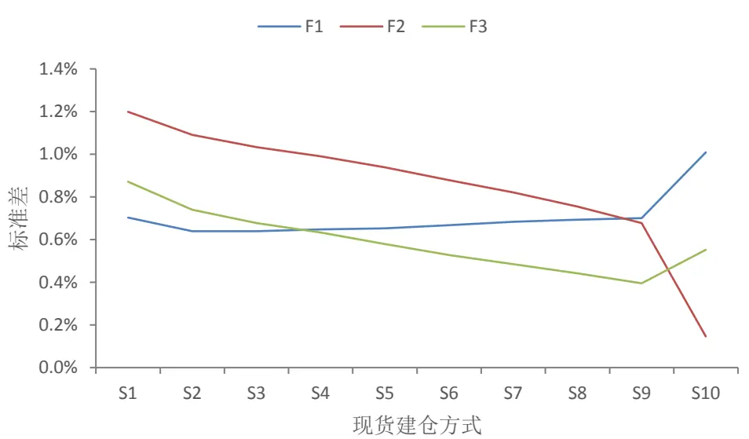
数据来源：广发证券发展研究中心，天软科技

图 9-图 11表示不同期货和现货建仓时间下，对冲组合收益率的百分位数。与上一节类似，采用 95%的置信水平分析组合的风险价值 VaR。结论与上一节以沪深 300成份股为现货时基本一致。在现货开盘时就对期货建仓时，在 30分钟内对现货建仓的组合 S2-F1 的 VaR 较小，为-1.16%，期望损失 ES 为-1.71%。此外，组合 S10-F2的 VaR 为-0.46%，期望损失 ES 为-0.58%；组合 S9-F3 的 VaR 为-0.81%，期望损失 ES为-1.08%。与以沪深300成份股为现货的情况相比，S2-F1和S9-F3组合的VaR明显放大，这是由于中证 500 成份股和沪深 300 指数在行情走势上的差异使得现货为中证500成份股的对冲组合的波动性大于现货为沪深300成份股的对冲组合的波动性。

如果期现货建仓时间不同步，最大可能造成的 VaR为-2.45%，期望损失为-3.14%（组合 S1-F2）。

图9：期货F1时不同现货交易方式下中证500成份股对冲组合日内收益率分位数
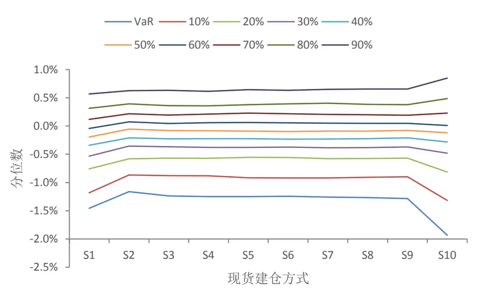
数据来源：广发证券发展研究中心，天软科技
识别风险，发现价值

图10：期货F2时不同现货交易方式下中证500成份股对冲组合日内收益率分位数
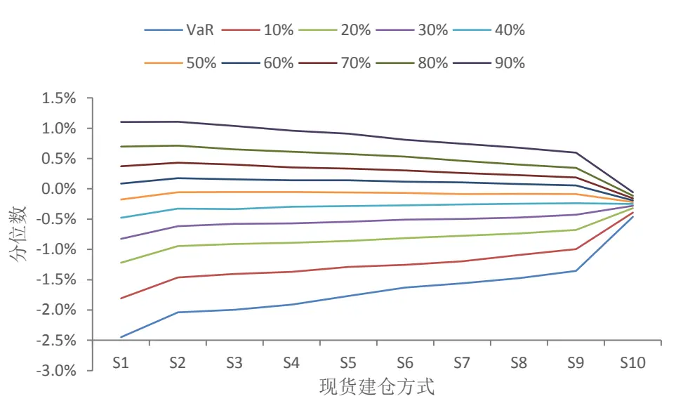
数据来源：广发证券发展研究中心，天软科技

图11：期货F3时不同现货交易方式下中证500成份股对冲组合日内收益率分位数
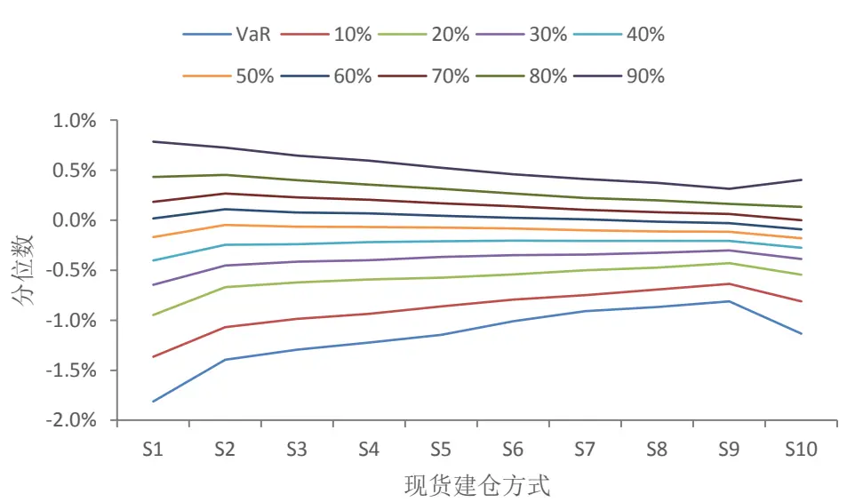
数据来源：广发证券发展研究中心，天软科技

不同组合下收益率的均值如图 12 所示。可以看到，现货在短时期内建仓的冲击成本比上一节中的冲击成本更高。比较不同期货建仓模式下，S1和 S2两种现货建仓方式，可以看到，不同的期货建仓模式下，S1 的平均收益率比 S2 低0.14%。这可能是由于小盘股的流动性不足造成的。

不同的评价参数如表 4所示。如果仅从收益率的标准差，VaR 及对应的期望损失ES 考虑的话，组合S10-F2是最优的组合，此时，期货和现货都是在现货收盘时建仓。如果同时考虑收益率的均值，组合 S9-F3 效果更佳，此时，期现货都是分散到整个交易日进行建仓的，因此降低了冲击成本。

图12：不同期现货交易方式下中证500成份股对冲组合日内的收益率均值
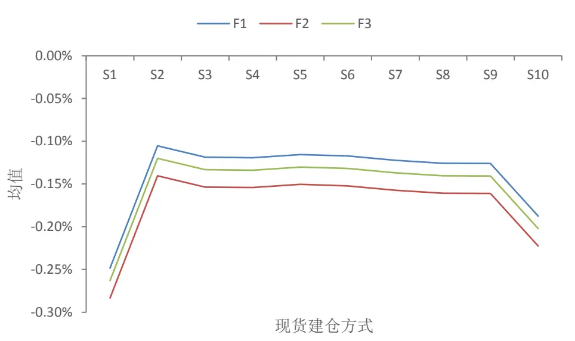
数据来源：广发证券发展研究中心，天软科技

表4.中证 500现货的对冲组合中不同现货期货建仓方式下的详细数据

| 期货 | 现货 | S1 | S2 | S3 | S4 | S5 | S6 | S7 | S8 | S9 | S10 |
| --- | --- | --- | --- | --- | --- | --- | --- | --- | --- | --- | --- |
| F1 | 均值 | -0.248% | -0.105% | -0.119% | -0.119% | -0.115% | -0.117% | -0.122% | -0.126% | -0.126% | -0.187% |
|  | 标准差 | 0.703% | 0.639% | 0.639% | 0.647% | 0.652% | 0.668% | 0.683% | 0.693% | 0.700% | 1.009% |
|  | VaR | -1.457% | -1.163% | -1.239% | -1.249% | -1.248% | -1.245% | -1.259% | -1.267% | -1.286% | -1.932% |
|  | ES | -1.978% | -1.706% | -1.726% | -1.743% | -1.742% | -1.786% | -1.852% | -1.910% | -1.974% | -2.774% |
| F2 | 均值 | -0.283% | -0.140% | -0.154% | -0.154% | -0.150% | -0.152% | -0.157% | -0.161% | -0.161% | -0.222% |
|  | 标准差 | 1.198% | 1.091% | 1.033% | 0.991% | 0.939% | 0.879% | 0.821% | 0.755% | 0.677% | 0.147% |
|  | VaR | -2.450% | -2.039% | -1.995% | -1.910% | -1.770% | -1.629% | -1.560% | -1.475% | -1.357% | -0.462% |
|  | ES | -3.136% | -2.777% | -2.697% | -2.599% | -2.453% | -2.308% | -2.173% | -2.014% | -1.825% | -0.581% |
| F3 | 均值 | -0.263% | -0.120% | -0.133% | -0.134% | -0.130% | -0.132% | -0.137% | -0.140% | -0.141% | -0.202% |
|  | 标准差 | 0.871% | 0.740% | 0.678% | 0.633% | 0.579% | 0.527% | 0.484% | 0.441% | 0.395% | 0.553% |
|  | VaR | -1.811% | -1.395% | -1.295% | -1.224% | -1.147% | -1.010% | -0.909% | -0.869% | -0.811% | -1.134% |
|  | ES | -2.333% | -1.901% | -1.808% | -1.710% | -1.543% | -1.399% | -1.294% | -1.188% | -1.079% | -1.561% |

数据来源：广发证券发展研究中心，天软科技

## （四）以中证 800 成份股为现货

以中证 800 指数成份股为现货时，不同现货交易方式和期货交易方式组合下收益率r的标准差如图 13所示。不同组合方式的收益率标准差和以沪深 300 成份股（图2）、中证500成份股（图8）为现货时的计算结果基本一致。相同的建仓方式下，以中证 800 成份股为现货的标准差小于以中证 500 成份股为现货的标准差，这是因为中证 800 指数和沪深 300 指数的相关性比中证 500 指数和沪深 300 指数的相关性更强一些。

图13：不同期现货交易方式下中证800成份股对冲组合日内的收益率标准差
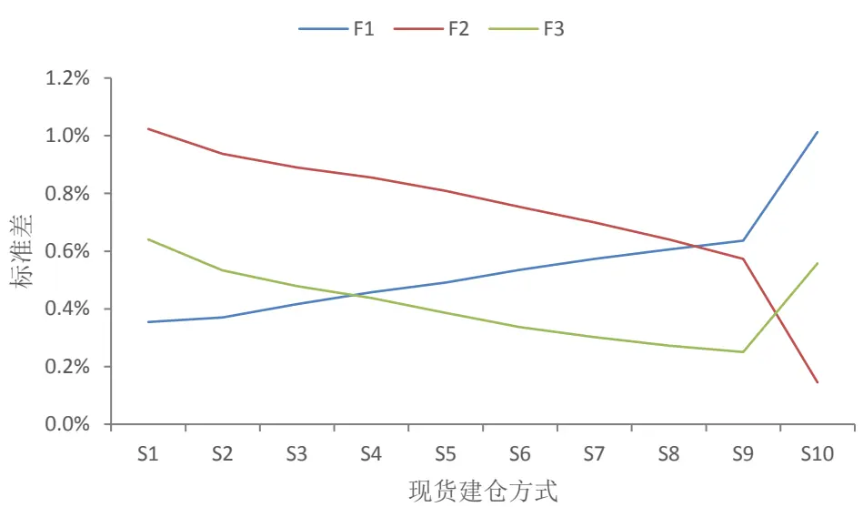
数据来源：广发证券发展研究中心，天软科技

图 14-图16 表示不同期货和现货建仓时间下，对冲组合收益率的百分位数。VaR较小的期现货建仓方式组合为 S2-F1，S10-F2 和 S9-F3。S2-F1 的 VaR 为-0.71%，期望损失 ES 为-0.99%；S10-F2 的 VaR 为-0.45%，期望损失 ES 为-0.57%；组合 S9-F3的 VaR 为-0.54%，期望损失 ES 为-0.71%。

如果期现货不同步，最大可能造成的 VaR 为-1.84%，期望损失为-2.54%（组合S1-F2）。

图14：期货F1时不同现货交易方式下中证800成份股对冲组合日内收益率分位数
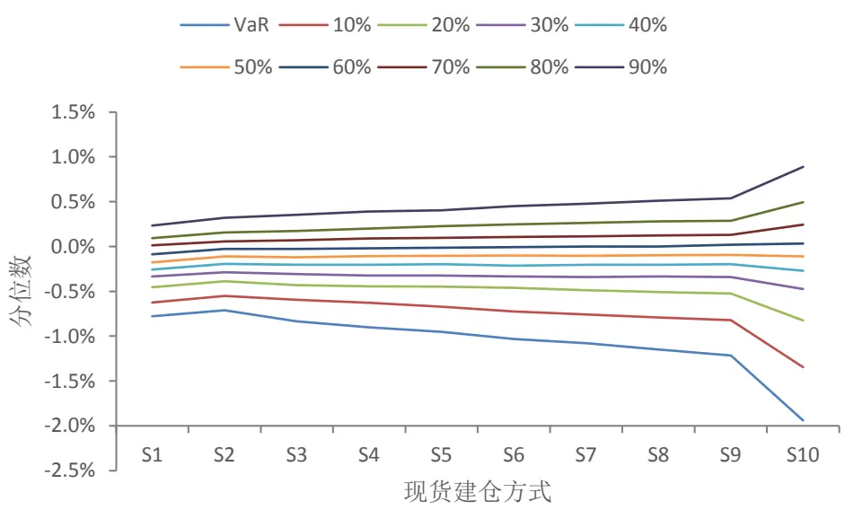
数据来源：广发证券发展研究中心，天软科技

图15：期货F2时不同现货交易方式下中证800成份股对冲组合日内收益率分位数
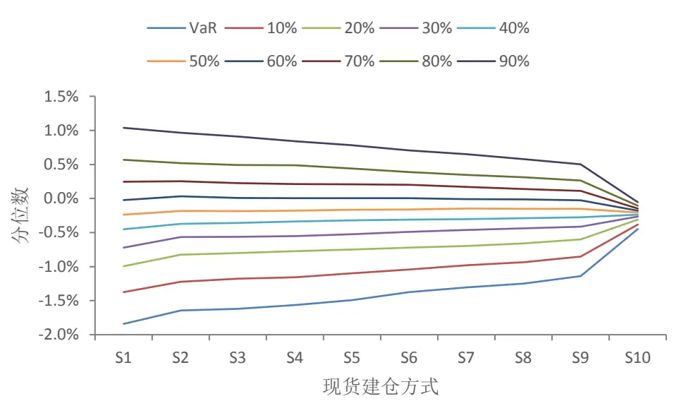
数据来源：广发证券发展研究中心，天软科技

图16：期货F3时不同现货交易方式下中证800成份股对冲组合日内收益率分位数
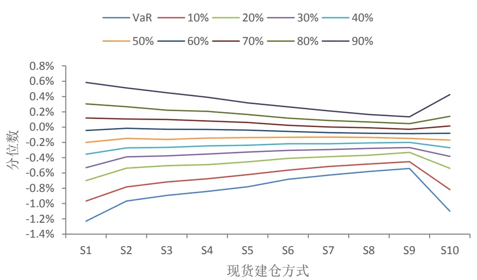
数据来源：广发证券发展研究中心，天软科技

不同组合下收益率的均值如图 17 所示。可以看到，现货在短时期内建仓的冲击成本比上面两节中的冲击成本要小。同样的，比较 S1 和 S2 两种现货建仓方式，可以看到，在不同的期货建仓模式下，S1的平均收益率比S2 低0.06%。这里的平均收益率之差，小于以沪深300 成份股为现货（平均收益率之差为 0.08%）和以中证500成份股为现货（平均收益率之差为0.14%）的情况。这是因为用等量的资金购买中证800成份股时，与购买沪深300成份股或中证500成份股相比，造成的冲击成本更小。

不同的评价参数如表 5 所示。从各项指标综合来看，S10-F2 和 S9-F3 是两个较优的组合。其中，S10-F2 由于期现货都是收盘前建仓，收益率的标准差、VaR 和期望损失 ES比较小；而S9-F3 由于减小了现货购买时的冲击成本，因此收益率的平均值更高。

图17：不同期现货交易方式下中证800成份股对冲组合日内的收益率均值
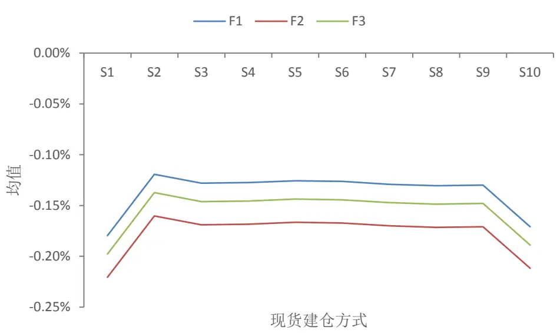
数据来源：广发证券发展研究中心，天软科技

表5.中证 800现货的对冲组合中不同现货期货建仓方式下的详细数据

| 期货 | 现货 | S1 | S2 | S3 | S4 | S5 | S6 | S7 | S8 | S9 | S10 |
| --- | --- | --- | --- | --- | --- | --- | --- | --- | --- | --- | --- |
| F1 | 均值 | -0.180% | -0.119% | -0.128% | -0.127% | -0.126% | -0.126% | -0.129% | -0.131% | -0.130% | -0.171% |
|  | 标准差 | 0.354% | 0.370% | 0.416% | 0.457% | 0.491% | 0.535% | 0.574% | 0.606% | 0.637% | 1.012% |
|  | VaR | -0.778% | -0.710% | -0.836% | -0.903% | -0.953% | -1.032% | -1.078% | -1.151% | -1.217% | -1.940% |
|  | ES | -0.975% | -0.987% | -1.130% | -1.254% | -1.347% | -1.482% | -1.608% | -1.709% | -1.807% | -2.711% |
| F2 | 均值 | -0.221% | -0.160% | -0.169% | -0.168% | -0.167% | -0.167% | -0.170% | -0.171% | -0.171% | -0.212% |
|  | 标准差 | 1.024% | 0.938% | 0.890% | 0.855% | 0.809% | 0.753% | 0.700% | 0.641% | 0.573% | 0.145% |
|  | VaR | -1.842% | -1.644% | -1.620% | -1.565% | -1.493% | -1.376% | -1.304% | -1.249% | -1.140% | -0.449% |
|  | ES | -2.539% | -2.309% | -2.232% | -2.163% | -2.053% | -1.930% | -1.812% | -1.674% | -1.517% | -0.567% |
| F3 | 均值 | -0.198% | -0.137% | -0.146% | -0.146% | -0.144% | -0.144% | -0.147% | -0.149% | -0.148% | -0.189% |
|  | 标准差 | 0.641% | 0.533% | 0.478% | 0.438% | 0.387% | 0.337% | 0.302% | 0.273% | 0.251% | 0.558% |
|  | VaR | -1.229% | -0.966% | -0.892% | -0.842% | -0.780% | -0.682% | -0.628% | -0.580% | -0.542% | -1.099% |
|  | ES | -1.577% | -1.293% | -1.207% | -1.127% | -1.000% | -0.892% | -0.813% | -0.747% | -0.712% | -1.525% |

数据来源：广发证券发展研究中心，天软科技

## （五）交易机制的选择

通过对日内收益率的均值、标准差、风险价值和期望损失的考察，机构投资者可以根据相关的结果选择适当的期货和现货交易机制。下面我们通过一个具体的案例来展示如何采用这种思路来优化交易机制。

假如某机构投资者在实行Alpha对冲策略时，期货端在每天 9:30现货开盘时执行，而现货端交易采取时间加权平均价格（TWAP）算法进行交易。要使得当日组合的浮亏不超过-1%，应该在开盘多久之内完成交易？

当期货端采取F1的交易机制时，不同现货交易机制下的 VaR 如表 6所示。当交易时间越长时，使得期现货建仓的不同步性越大，一般会增大 VaR 的幅度。因此，如果能够在不增加冲击成本的前提下，在短时间内完成交易，能够减小最大可能的亏损。

当现货组合为沪深 300 成份股时，现货交易机制 S6 的 VaR 为-0.99%，此时现货在开盘两个半小时之内完成建仓。因此，当现货在开盘后两个半小时之内完成建仓时，以沪深300成份股为现货的期现组合当日浮亏有95%的可能性不超过-1%。类似的，当现货组合为中证 800 成份股时，现货交易机制 S5 的 VaR 为-0.95%。因此，当现货在开盘后两个小时之内完成建仓时，以中证 800 成份股为现货的期现组合当日浮亏有 95%的可能性不超过-1%。

而当现货组合为中证 500 成份股时，在 95%的置信水平下不能找到使得 VaR 幅度不超过1%的现货交易机制。换而言之，如果开盘时就对期货建仓的话，任何现货交易机制下，该期现组合都有超过 5%的可能性在当日的浮亏超过-1%。这是因为中证 500 指数和沪深300指数的相关性比较弱，对冲后的组合风险依然比较大。

表 6.不同现货建仓方式下的VaR

|  | 现货组合 |  |  |
| --- | --- | --- | --- |
|  | 沪深 300成份股中证 500 成份股 |  | 中证800成份股 |
| 现货交易机制 S1 | -0.646% | -1.457% | -0.778% |
| S2 | -0.630% | -1.163% | -0.710% |
| S3 | -0.768% | -1.239% | -0.836% |
| S4 | -0.844% | -1.249% | -0.903% |
| S5 | -0.909% | -1.248% | -0.953% |
| S6 | -0.985% | -1.245% | -1.032% |
| S7 | -1.068% | -1.259% | -1.078% |
| S8 | -1.136% | -1.267% | -1.151% |
| S9 | -1.235% | -1.286% | -1.217% |
| S10 | -1.962% | -1.932% | -1.940% |

数据来源：广发证券发展研究中心，天软科技

## 四、总结与讨论

本篇报告考虑的是 Alpha 对冲策略中，机构的期现货交易机制相对独立和期现货建仓时间上不同步对期现货对冲组合产生的影响。从期现货建仓当日收益率的均值、标准差、VaR 及对应的期望损失 ES 等指标上定量的评估了期现货交易时间差带来的影响。并且，分别以沪深 300 成份股、中证 500 成份股和中证 800 成份股为现货，进行了实证分析，获得了一些相关的结论。

（1）流动性对期现货的交易方式有重要的影响。假设我们用于购买对冲组合的总资金为 1 亿元，则由实证分析可以看到，由于流动性的影响，如果要在一次性购入现货组合，所需要额外付出的冲击成本为0.06%-0.14%。而如果用于投资的总资金更多的话，还会加大冲击成本。如果将订单拆细，分成不同时段购入，可以明显降低冲击成本。

（2）如果期现货的建仓时间不同步，可能造成当日浮盈亏的收益率标准差超过1%，在 95%的置信水平下，VaR可能超过-2%（中证500 成份股作为现货）。

（3）从本报告的实证分析可以看出，当期现货的建仓时间基本一致，而且将建仓的订单拆细执行时，能够获得较大的收益，减小风险和损失。如果期现货都在交易日当天分散建仓，则在 95%置信水平下的 VaR最大为-0.81%，收益率标准差最大为0.39%。

（4）对冲策略对冲的是系统性风险，对冲后的组合也是有风险的。从实证结果可以看到，期现货都在现货开盘时建仓的收益率标准差比期现货都在现货收盘时建仓的结果明显大了很多。这是由对冲组合的波动造成的。

（5）由于本报告中沪深300 成份股、中证500成份股和中证 800成份股等现货组合基本上都不具有超额收益，即α = 0，因此期现货建仓时间的早晚对超额收益的产生没有帮助。考虑到现货组合会产生超额收益α，因此期现货组合建仓的时间应该越早越好。实际交易时，需要同时考虑增加超额收益（提早建仓）和减小冲击成本（分散时间建仓）。因此，在Alpha 对冲策略的期现货建仓时，建议在同步建仓和将订单拆细执行的基础上，在较短时间内执行订单。

通过定量分析，可以为投资者在Alpha对冲策略选择合适的交易机制时提供参考。例如，给定期现组合能够容忍的最大浮亏，可以计算出期现货建仓时间差的范围。在这里需要注意的是，不同的现货组合和市场指数的相关度不同，如果要获得精确的结论，需要对实际组合进行考察。

## 风险提示

策略模型并非百分百有效，市场结构及交易行为的改变以及类似交易参与者的增多有可能使得策略失效。

## Table_RatingIndustry 广发证券—行业投资评级说明

买入： 预期未来12个月内，股价表现强于大盘10%以上。

持有： 预期未来12个月内，股价相对大盘的变动幅度介于-10%～+10%。

卖出： 预期未来12个月内，股价表现弱于大盘10%以上。

## Table_RatingCompany 广发证券—公司投资评级说明

买入： 预期未来12个月内，股价表现强于大盘15%以上。

谨慎增持： 预期未来12个月内，股价表现强于大盘5%-15%。

持有： 预期未来12个月内，股价相对大盘的变动幅度介于-5%～+5%。

卖出： 预期未来12个月内，股价表现弱于大盘5%以上。

## Table_Ad联系我们

|  | 广州市 | 深圳市 | 北京市 | 上海市 |
| --- | --- | --- | --- | --- |
| 地址 | 广州市天河北路183号 大都会广场5楼 | 深圳市福田区金田路4018 号安联大厦 15 楼A 座 | 北京市西城区月坛北街2号 月坛大厦18层 | 上海市浦东新区富城路99号 震旦大厦18楼 |
|  |  | 03-04 |  |  |
| 邮政编码 | 510075 | 518026 | 100045 | 200120 |
| 客服邮箱 | gfyf@gf.com.cn |  |  |  |
| 服务热线 | 020-87555888-8612 |  |  |  |

## Table_Disclaimer 免 责声 明

广发证券股份有限公司具备证券投资咨询业务资格。本报告只发送给广发证券重点客户，不对外公开发布。

本报告所载资料的来源及观点的出处皆被广发证券股份有限公司认为可靠，但广发证券不对其准确性或完整性做出任何保证。报告内容仅供参考，报告中的信息或所表达观点不构成所涉证券买卖的出价或询价。广发证券不对因使用本报告的内容而引致的损失承担任何责任，除非法律法规有明确规定。客户不应以本报告取代其独立判断或仅根据本报告做出决策。

广发证券可发出其它与本报告所载信息不一致及有不同结论的报告。本报告反映研究人员的不同观点、见解及分析方法，并不代表广发证券或其附属机构的立场。报告所载资料、意见及推测仅反映研究人员于发出本报告当日的判断，可随时更改且不予通告。

本报告旨在发送给广发证券的特定客户及其它专业人士。未经广发证券事先书面许可，任何机构或个人不得以任何形式翻版、复制、刊登、转载和引用，否则由此造成的一切不良后果及法律责任由私自翻版、复制、刊登、转载和引用者承担。