# Table_Title 财报因子使用方法新探

## ——多因子 ALPHA系列报告之（二十四）

## Table_Sum ary报告摘要 ：

## 传统多因子 ALPHA策略存在不足之处

传统多因子 ALPHA策略，每月末进行多因子排序打分，挑选超配组合并进行对冲。这种做法对于财报因子而言，存在以下不足之处：（1）在财务报告截止披露前一段时间，大部分上市公司新的财务报告已经披露，但策略仍然在用旧报告的数据进行打分；（2）在最晚披露日期前，财报陆陆续续披露，但传统策略则完全忽略了这一些最新的财报数据。

## 提前使用最新的财报数据选股具有合理性和可行性

财报披露情况统计数据显示，财报截止披露日期前几天乃至一两周的时间，大部分个股已披露了财务报告；如考虑快报，这一日期将更加提前，无需等到截止日才进行选股；从披露月与非披露月单因子的表现可以看出使用新的财务报告数据进行选股效果比使用旧数据的效果要好得多。

## 结合事件驱动和因子打分的优点，提前使用财报因子进行选股

本文提出的提前使用财报数据进行选股的模型，是结合了事件驱动的时效性强以及因子打分的资金规划可控两者的优点，形成的具有行业中性、分段操作以及资金规划三个特点的新多因子ALPHA 模型。

## 单因子表现显示提前使用财报数据能够大幅提高因子有效性，且使用快报效果更佳

本文测试了 23个财报因子在不同持有期下，不同起始比例以及截止日选股策略的表现，结果显示，提前使用财报数据进行选股能够大幅提高因子的有效性，且使用快报效果更佳；

## 多种多因子策略结果显示新策略本身表现不错，对原有策略贡献显著

本文测试了多种多因子策略，包括只使用财报因子、披露月提前操作、非披露月不操作，只使用财报因子、披露月提前操作、非披露月按原始做法，使用财报因子和非财报因子、披露月提前操作、非披露月按原始做法，一共三种。使用多种对冲方案考察新做法的有效性，结果显示，无论新做法本身，还是与原有策略的融合，都有不错的表现。

## 核心风险

本模型采用量化方法，所推荐个股不一定具有严格的经济逻辑，也未必符合当前宏观环境特点，请结合自身判断进行恰当使用。

图 2传统多因子 ALPHA策略的不足之处
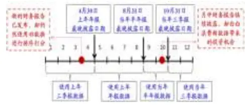
图 8 操作示意图

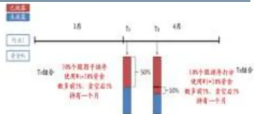
图 17 原始策略和70%起始比例的新策略多对 800超额净值

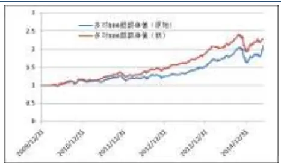
图 20 财报+非财报因子多对 800 历史表现

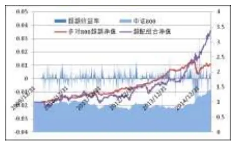

Table_Aut hor 分析师： 史庆盛 S0260513070004

020-87555888-8618

sqs@gf.com.cn

## Table_Report 相关研究：

《大浪淘沙，Alpha 因子何处 2011.08寻?》

## 一、背景介绍

## 1.1 传统多因子 ALPHA 策略

2011年，我们在《大浪淘沙，Alpha因子何处寻？》一文中提出了一个基于多因子的alpha策略框架，如图1所示。我们首先通过对个股因子数据进行预处理，计算IC、IR、胜率等指标，多维度考量因子的有效性，最终挑选出有效的ALPHA因子，最后再进行多因子排序打分，选出超配组合并进行对冲。

图 1 基于多因子的alpha策略框架图
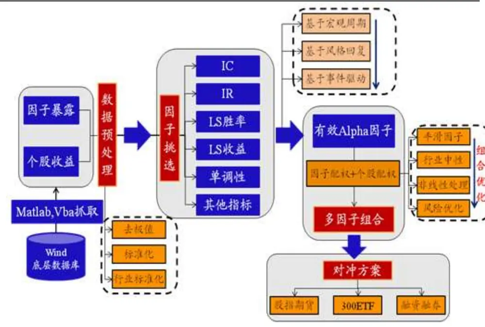

## 1.2 传统多因子 ALPHA策略不足之处

多因子ALPHA策略的核心之一，在于有效ALPHA因子的挑选及运用。在此之前，我们已经挑选出一些常见有效的ALPHA因子，根据是否只使用财务报告数据将其分为财报因子和非财报因子两类。

在传统多因子ALPHA策略中，我们在每月末进行多因子排序打分，其中非财报因子的数据是每月更新的，而财报因子的数据，更新频率则是一年三次，分别为4月底（使用上年年报数据）、8月底（使用当年半年报数据）和10月底（使用当年三季报数据），其他的月份则是沿用上一期的数据进行排序打分。而这种做法，实际上存在不足之处：（1）在财务报告截止披露前一个月，大部分上市公司新的财务报告已经披露，但策略仍然在用旧报告的数据进行打分，如2015年3月底，市场上已有接近一半的个股披露了年报，但传统的的多因子ALPHA策略仍然在使用上一年三季报的因子数据进行选股；（2）在最晚披露日期前的几天，即月中，财报陆陆续续披露，但传统策略则完全忽略了这一些最新的财报数据。

图 2 传统多因子ALPHA策略的不足之处
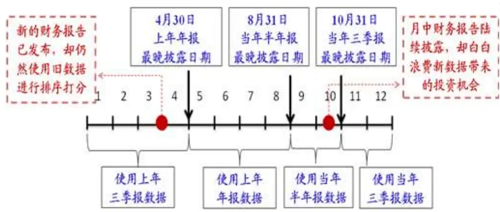

传统的多因子ALPHA模型使用财报因子进行选股，除了存在时效性问题之外，还会因为财报数据失真、财报披露滞后以及财报数据更新频率低等原因造成模型存在一些缺陷，但数据失真、披露滞后和更新频率低这些都是固有缺陷，针对财报因子，我们唯一能够改善的，只有提前使用最新披露的财报数据，力争捕获新数据带来的超额收益。

## 1.3 财报因子来源

财报因子是完全根据财务报告数据计算得出，财务报告的类型不仅仅只是正式的季报、半年报和年报，其他的可披露报告，如预告和快报，同样可能挖掘出有用的财报因子。从下表的披露规定中我们可以看到，从快报披露的内容中，通过简单的计算，我们可以得到一些常见的因子，如销售净利率、ROE、ROA等。并且，快报披露前需经过内部审计，外部审计工作也已接近尾声，数据与正式报告差距并不大，具有可比性。

表 1 财务报告披露规定

| 财报类型 | 预告 |  | 快报 |  |
| --- | --- | --- | --- | --- |
| 交易所 | 上海交易所 1、净利润为负值（亏损） | 深圳交易所 | 上海交易所 | 深圳交易所 |
| 披露行为 | 为比较基数较小的可以豁免披露) 3、实现扭亏为盈 | 2、预计业绩与上年同期相比发生大幅变动 （上升或者下降50%以上）（以每股收益作 |  |  |
| 披露要求 | 预计年度经营业 绩将出现上述情 形之一时： 年报——应当进 行业绩预告 | 主板：出现上述情况，应 当及时进行业绩预告（包 括年报、中报和三季报） 中小板：应在第一季度报 告、半年度报告和第三季 | 可以在年度报告和中期报 告披露前发布业绩快报 | 主板：鼓励上市公司在定期报 告披露前，主动披露定期报告 业绩快报； 中小板：年报预约披露时间在 3-4月份的公司，应在2月底之 |

识别风险，发现价值

|  | 中报、三季报一一可以进行业绩预告 | 度报告中披露对年初至下一报告期末的业绩预告 |  | 前披露年度业绩快报，鼓励半年度报告预约披露时间在8月份的公司在7月底前披露半年度业绩快报 |
| --- | --- | --- | --- | --- |
| 披露时间 | 年报：会计年度结束后一个月内 |  | 正式报告披露前 | 主板：正式报告披露前中小板：年报——2月底之前半年报——7月底之前 |
| 披露内容 | 1、业绩预告类型；2、业绩预告摘要；3、预告净利润变动幅度；4、去年同期每股收益；5、预告净利润同比增长上限；6、预告净利润同比增长下限；7、预告净利润上限；8、预告净利润下限； |  | 本期及上年同期营业收入、营业利润、利润总额、净利润、总资产、净资产、每股收益、每股净资产和净资产收益率等主要财务数据和指标 |  |

数据来源：上海、深圳证券交易所网站、广发证券发展研究中心

## 1.4 财报披露时间分布

想要提前使用最新的财报数据进行选股，必须了解财报披露的时间分布，清楚财报的披露是否集中在某一个时间段披露以及各年是否有类似规律。我们统计了各年度不同的财报披露占比区间的时间长度。从图中可以看出，近年来财务报告披露日期有向最晚披露日期集中的趋势。并且，在最晚披露日期前一两周，大部分的财务报告已经披露，已经有足够多的个股因子数据用于打分，无需等到月末。而分行业看，国防军工、电气设备、机械设备、建筑材料等行业，这种趋势更加明显，且各行业披露占比达到各个比例的时点不尽相同。因此，我们在后面章节的实证分析中，都是采用行业中性的方法，披露占比也是各行业分别使用本行业的披露占比。

表 2 财报披露占比分区间时间长度

| 年报 | 2009 | 2010 | 2011 | 2012 | 2013 | 2014 |
| --- | --- | --- | --- | --- | --- | --- |
| 10%-100% | 45 | 42 | 38 | 32 | 38 | 37 |
| 20%-100% | 36 | 32 | 28 | 25 | 31 | 29 |
| 30%-100% | 30 | 27 | 23 | 21 | 26 | 24 |
| 40%-100% | 25 | 24 | 20 | 19 | 23 | 22 |
| 50%-100% | 23 | 21 | 18 | 17 | 21 | 20 |
| 60%-100% | 19 | 19 | 14 | 11 | 15 | 13 |
| 70%-100% | 13 | 13 | 9 | 7 | 9 | 10 |
| 80%-100% | 8 | 8 | 6 | 4 | 7 | 5 |
| 90%-100% | 4 | 4 | 3 | 2 | 4 | 3 |

| 半年报 | 2010 | 2011 | 2012 | 2013 | 2014 |
| --- | --- | --- | --- | --- | --- |
| 10%-100% | 23 | 24 | 22 | 19 | 19 |
| 20%-100% | 18 | 17 | 16 | 14 | 13 |
| 30%-100% | 13 | 14 | 12 | 11 | 11 |
| 40%-100% | 11 | 11 | 11 | 9 | 8 |
| 50%-100% | 8 | 9 | 8 | 6 | 6 |
| 60%-100% | 8 | 7 | 6 | 6 | 5 |
| 70%-100% | 5 | 5 | 6 | 4 | 4 |
| 80%-100% | 4 | 4 | 4 | 3 | 2 |
| 90%-100% | 3 | 3 | 2 | 2 | 1 |

| 三季报 | 2010 | 2011 | 2012 | 2013 | 2014 |
| --- | --- | --- | --- | --- | --- |
| 10%-100% | 7 | 8 | 7 | 7 | 7 |
| 20%-100% | 6 | 7 | 6 | 5 | 6 |
| 30%-100% | 5 | 5 | 5 | 5 | 5 |
| 40%-100% | 4 | 5 | 4 | 5 | 4 |
| 50%-100% | 3 | 4 | 4 | 4 | 3 |
| 60%-100% | 3 | 3 | 4 | 3 | 3 |
| 70%-100% | 2 | 2 | 3 | 3 | 2 |
| 80%-100% | 1 | 2 | 2 | 2 | 2 |
| 90%-100% | 1 | 2 | 1 | 1 | 1 |

注：100%指的是截止披露时间，年报为4月底，半年报为8月底，三季报为10月底

图 3 财报披露占比分区间时间长度
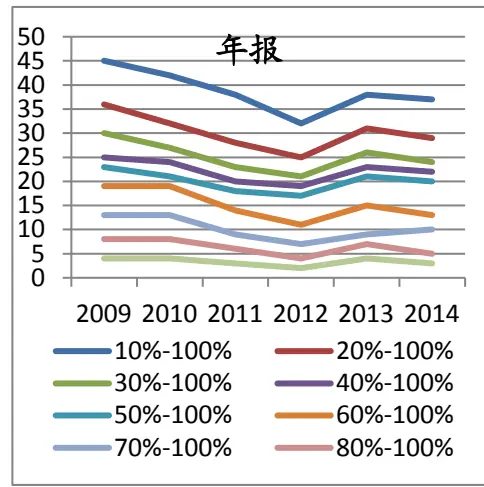

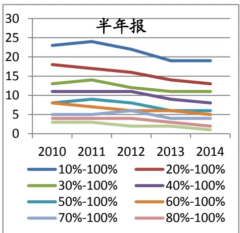

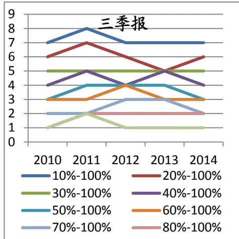

图 4 部分行业财报披露占比分区间时间长度
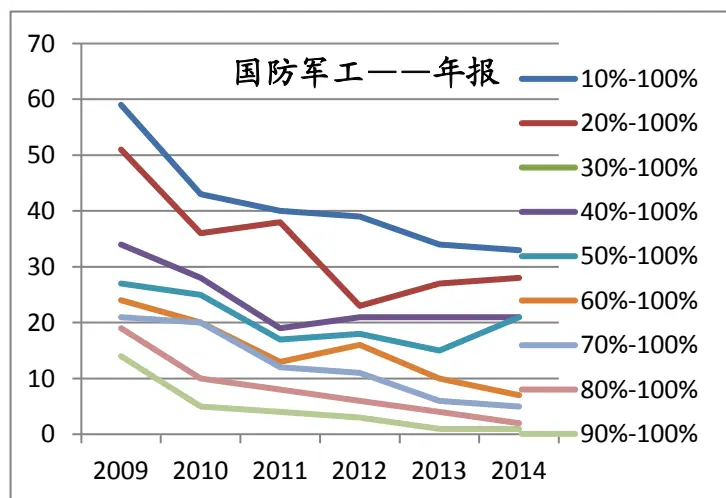

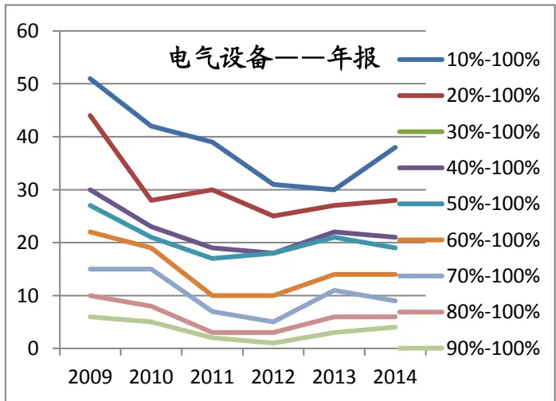

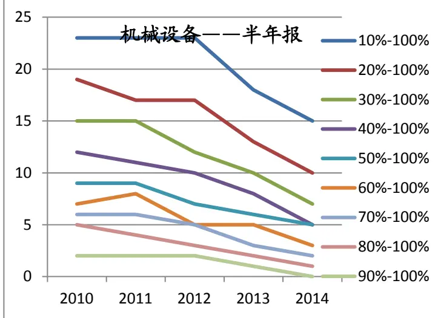

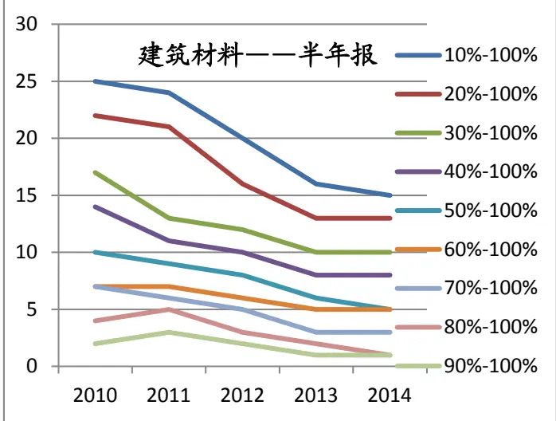

另外，在此之前，我们提到快报中也存在财报因子数据，于是我们在计算披露占比的时候将快报纳入考虑，无论个股披露的是快报还是正式财务报告，都视为财报已披露。下图是考虑快报和未考虑快报的各披露占比不同区间时间长度对比。从图中我们可以看出，将快报纳入统计范围后，达到各个比例的时间点前移了，即考虑了快报后在更早的时候就有足够多财报因子数据用于选股。

图 5 快报与正式报告占比分区间时间长度对比
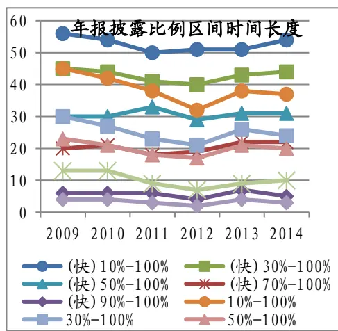

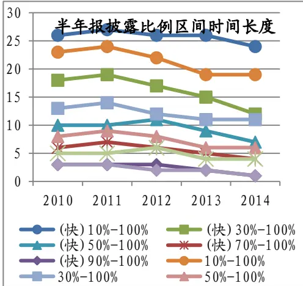

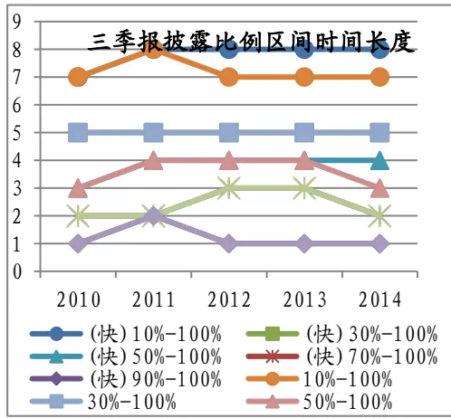

考虑快报之后，除了各时点的披露占比发生了变化，在单因子和多因子策略的实证检验中，参与因子打分的股票池以及个股用于打分的因子也将受到一定的影响（具体见下文）。因此，我们将各时点考虑了快报的披露占比减去不考虑快报的披露占比，得到每一交易日有效的快报占比，如下所示。从以下图表可以看出，年报等待期使用快报比例最多，最高接近40%，半年报等待期次之，三季报等待期使用快报的比例最少。

图 6 有效快报占比

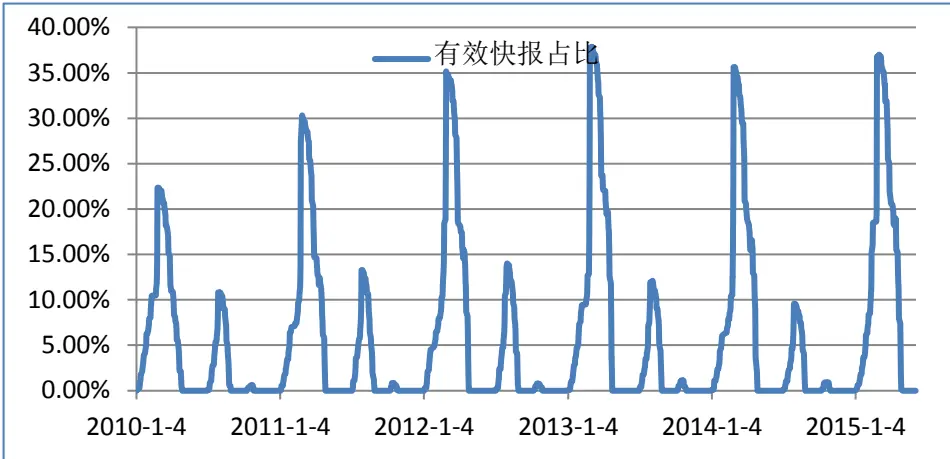

表 3 快报使用情况

|  |  | 2009 | 2010 | 2011 | 2012 | 2013 | 2014 |
| --- | --- | --- | --- | --- | --- | --- | --- |
| 年报 | 快报开始出现的时间 | 2010/1/5 | 2011/1/5 | 2012/1/5 | 2013/1/4 | 2014/1/3 | 2015/1/5 |
|  | 可使用快报占比最高时间 | 2010/2/26 | 2011/2/28 | 2012/2/29 | 2013/3/6 | 2014/2/28 | 2015/3/5 |
|  | 可使用快报峰值 | 22.34% | 30.33% | 35.17% | 37.90% | 35.65% | 37.01% |
|  | 快报失效时间 | 2010/4/29 | 2011/4/28 | 2012/4/26 | 2013/4/25 | 2014/4/29 | 2015/4/30 |
| 半年报 | 快报开始出现的时间 | 1 | 2010/7/2 | 2011/7/6 | 2012/7/5 | 2013/7/4 | 2014/7/4 |
|  | 可使用快报占比最高时间 | 1 | 2010/8/4 | 2011/7/29 | 2012/8/2 | 2013/8/6 | 2014/7/31 |
|  | 可使用快报峰值 | 1 | 10.83% | 13.30% | 14.00% | 12.10% | 9.57% |
|  | 快报失效时间 | 1 | 2010/8/30 | 2011/8/30 | 2012/8/30 | 2013/8/29 | 2014/8/28 |
| 三季报 | 快报开始出现的时间 | 1 | 2010/10/12 | 2011/10/11 | 2012/10/9 | 2013/10/9 | 2014/10/9 |
|  | 可使用快报占比最高时间 | 1 | 2010/10/22 | 2011/10/18 | 2012/10/17 | 2013/10/23 | 2014/10/17 |
|  | 可使用快报峰值 | 1 | 0.60% | 0.87% | 0.80% | 1.12% | 0.90% |
|  | 快报失效时间 | 1 | 2010/10/28 | 2011/10/28 | 2012/10/30 | 2013/10/30 | 2014/10/30 |

## 1.5 披露月与非披露月的单因子表现

到目前为止，我们已经清楚地知道，提前使用财报数据的条件已经具备，那么，提前使用数据，或者说是新的财务数据，究竟会不会比旧数据带来更多的收益？

在1.2节，我们提出了使用财报因子存在的几个不足之处，其中，更新频率低是其中很重要的一点。在多因子策略的实战中，我们通常将财报因子与非财报因子一起使用，并每个月进行调仓，保证全年资金的利用率。为了使财报因子的使用跟上非财报因子的节奏，我们通常在没有新财报数据披露的月份使用旧数据进行选股，这样的安排，会导致有一些财报数据被反复使用，如三季报数据，会被重复使用长达六个月。这对于本身已经具有很强滞后性的财报数据而言，显然是不太合理的。因此，我们统计了各个因子在截止披露日期后一个月（以下统称披露月）以及其他月份（以下统称非披露月）的年化多空信息比（IR）和年化多空收益回撤比（R/HC），结果列于下表。其中要注意的是，各个因子的方向是综合考虑因子本身的经济含义以及因子在样本内的表现选出的。

表 4 披露月与非披露月单因子表现

| 因子名称(方向) | 披露月多空 IR | 非披露月多空 IR | 披露月多空R/HC | 非披露月多空 R/HC | 因子名称(方向) | 披露月多空 IR | 非披露月多空 IR | 披露月多空 R/HC | 非披露月多空 R/HC |
| --- | --- | --- | --- | --- | --- | --- | --- | --- | --- |
| 销售净利率（高） | -0.22 | 0.18 | -0.19 | 0.08 | 存货周转率（高） | -1.01 | 1.51 | -0.55 | 1.8 |
| 销售毛利率（高） | 1.88 | 0.07 | 2.58 | 0.04 | 长期负债比率（低） | -0.4 | -0.28 | -0.2 | -0.12 |
| ROE（高） | -1.4 | 0.3 | -0.61 | 0.17 | 每股负债比（低） | 0.25 | -0.24 | 0.17 | -0.09 |
| ROA（高） | -0.45 | 0.13 | -0.26 | 0.07 | 财务费用比例（高） | -1.49 | 0.18 | -0.62 | 0.06 |
| 股东权益增长率(高) | -0.62 | 0.22 | -0.35 | 0.09 | 固定比（高） | -1.36 | -0.51 | -0.59 | -0.16 |
| 总资产同比增长率(高) | -0.32 | 0.55 | -0.22 | 0.31 | 速动比率（高） | 1.27 | 0.27 | 1.95 | 0.13 |
| 净利润增长率（高） | -2 | 0.83 | -0.79 | 0.66 | 流动比率（高） | 1.37 | 0.28 | 1.89 | 0.12 |
| 每股净资产增长率(高) | 0.99 | –0.53 | 0.9 | −0.2 | 净利润现金含量(高) | 0.16 | 1.05 | 0.14 | 0.66 |
| roe 同比增长率(高) | -1.75 | 0.86 | -0.71 | 0.67 | 总资产周转率（高） | -0.09 | 1.11 | -0.05 | 0.85 |
| 主营业务收入同比增长率（高） | 0.02 | 0.54 | 0.01 | 0.4 | 流动负债率（高） | 1.36 | 0.41 | 1.21 | 0.2 |
| 资产负债率（高） | -0.06 | -0.06 | -0.04 | -0.02 | 销售费用比例（高） | 1.7 | -0.11 | 2.05 | -0.06 |
| 资产对数（低） | 1.17 | 0.82 | 1.29 | 0.34 |  |  |  |  |  |

数据来源：广发证券发展研究中心

从表4中可以看到，一共有八个因子（标记红颜色），包括销售毛利率、每股净资产增长率、资产对数、每股负债比、速动比率、流动比率、流动负债率和销售费用比例，在披露月的表现都优于其在非披露月的表现。图7是表4中各因子披露月与非披露月的IR绝对值，即假设因子在不同月份的方向可以不同，从图中我们也可以看出，大部分因子在披露月的表现比非披露月的表现要好。这也初步验证了我们的观点：应该使用新的财报数据进行选股！

图 7 披露月与非披露月单因子IR（绝对值）
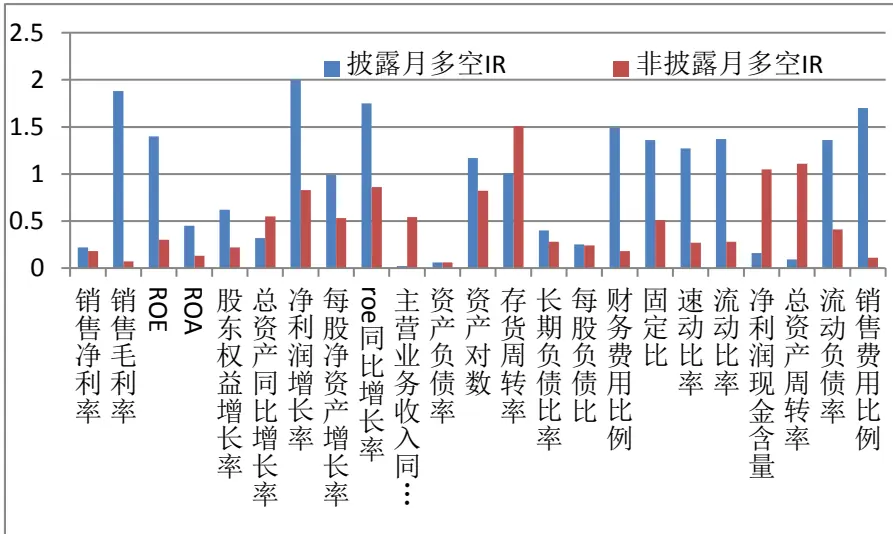

## 二、财报因子新使用方法

上一章节中，我们从各个角度阐述了使用新财报数据的合理性和可行性，接下来，我们谈谈在披露截止日期前，应该怎样使用最新的财报数据。需要注意的是，在这里我们主要关注披露月份的表现，即一年只操作3次，其他没有新财报数据更新的时间段我们在这一章先不作考虑。

## 2.1 单因子策略思想

在详细说明具体的操作前，需要提及的是，真正做到使用最新财报数据的策略，应属事件驱动。事件驱动策略会实时地监测股票池中个股的财务报告披露情况，只要有新的财报披露，无论数量多少，都会根据其财报数据进行选股。这是时效性最强的做法。但它同时也存在股票数量不确定和资金规划复杂等缺陷。而因子打分策略的股票买卖数量固定，资金规划更可控，恰好能够弥补事件驱动的不足。因此，新多因子ALPHA策略则是融合了事件驱动和因子打分两者的优点，做到在增强有效性的同时，保持买入组合的稳定性，让资金规划更加可控！

## 2.2 具体操作方法

策略的具体操作，可以归纳为以下三个关键词：行业中性、分段操作和资金规划。

行业中性：以报告期结束后的第一个交易日全市场A股（剔除ST和创业板）为股票池，根据申万一级行业分类进行划分，分行业选股；行业内排序打分，超低配前后5%的个股，持有一个月；

分段操作：每日监测各行业最新财报披露比例，各行业披露比例达到一定阈值即可分别操作；阈值每次增加10%，披露占比达到下一阈值再次操作（需要注意的特殊情况是：假设目前披露占比为61%，超过60%的阈值，随后某个交易日，披露占比跳过70%~79%的区间直接到达81%，超过70%的阈值，达到选股要求，而再下一个交易日，假设披露占比为83%，此时不应该进行选股，因为阈值应该跳过80%直接到达90%，只有等到披露占比达到90%以上才能进行下一次的选股）；为保证每个行业的资金全部使用，最晚披露日期默认再次操作，提前披露完毕的除外；只在新披露的个股中进行选股，原来已经被用于排序打分的则不再参与选股（此处暂时不考虑快报数据）；如考虑快报数据，则部分只能在正式报告中计算得到的因子，在个股首次披露正式报告时均被纳入选股范围，无论其在此前是否披露快报；

资金规划：以报告期结束后的第一个交易日中证800成分股权重中各行业占比作为当次财报数据使用中各行业分配的资金比例；各行业资金使用跟随各行业财报披露占比变化；闲置资金进行无风险投资，获得年4%的无风险利率。

以下为具体操作的示意图：

图 8 操作示意图
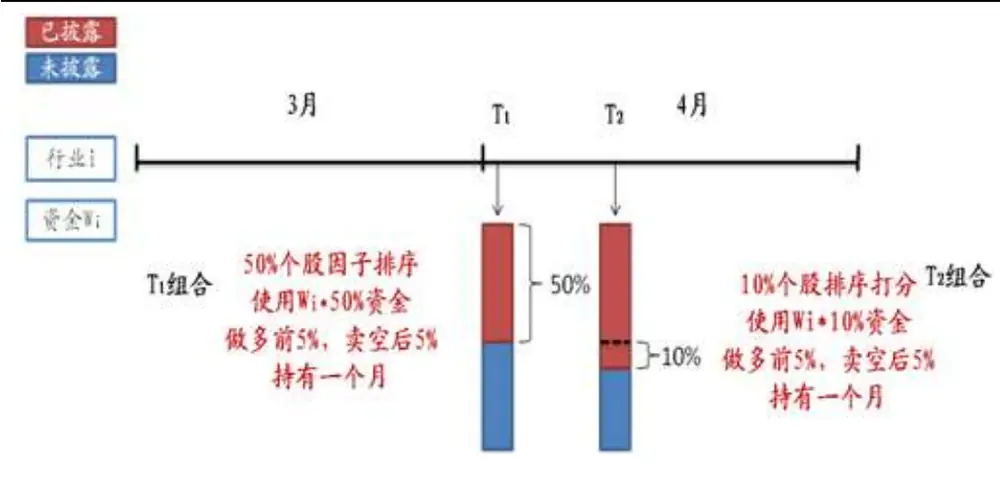

## 2.3 单因子效果

根据以上的操作方法，我们对单个因子进行了实证分析。我们选取了2010年至2014年作为样本区间，计算了单个因子在不同起始比例下和截止日的多空IR，分为不使用快报数据和使用快报数据两种情况。

下图是不使用快报数据的情况下，各因子不同起始比例和持有期的多空IR。从图中各因子在不同参数下的IR图来看，大部分因子提前进行操作，在不同的持有期下，总体都比在截止日操作的表现要好。其中，资产对数、每股负债比等因子原来在截止日进行选股就表现不错，但提前进行操作效果更好；roe同比增长率、财务费用比例等因子在截止日操作表现为无效，但提前操作大大改善了策略的效果，由无效变为有效；roe、净利润增长率等因子虽然无论在截止日还是提前操作，均为失效，

识别风险，发现价值

但整体来看，提前操作的IR比截止日操作的IR要高，由此也可看出，对于本身无效的因子，提前操作仍然可以起到改善的作用。

图 9 不考虑快报时单因子不同起始比例和持有期的多空IR
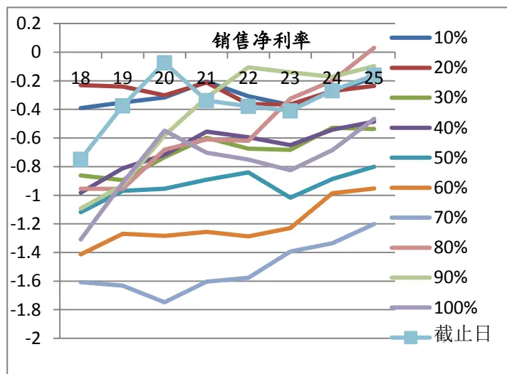

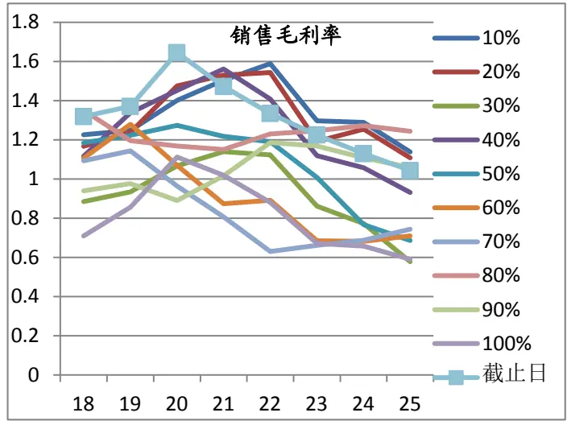

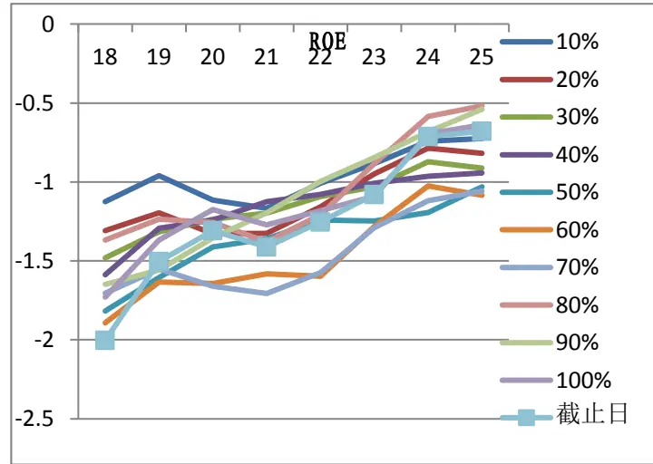

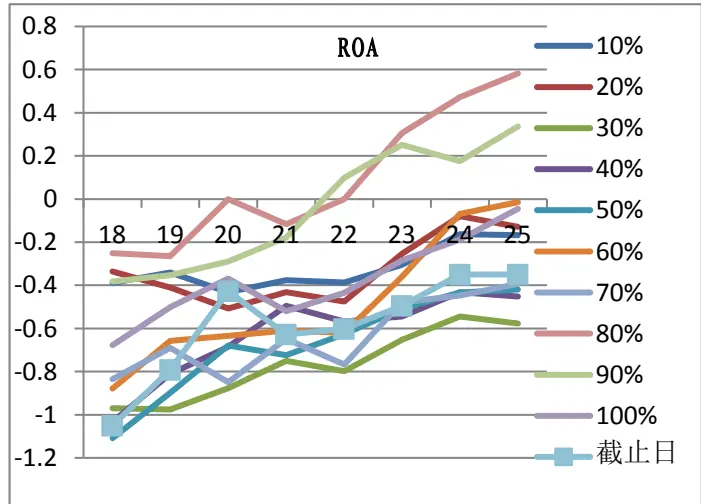

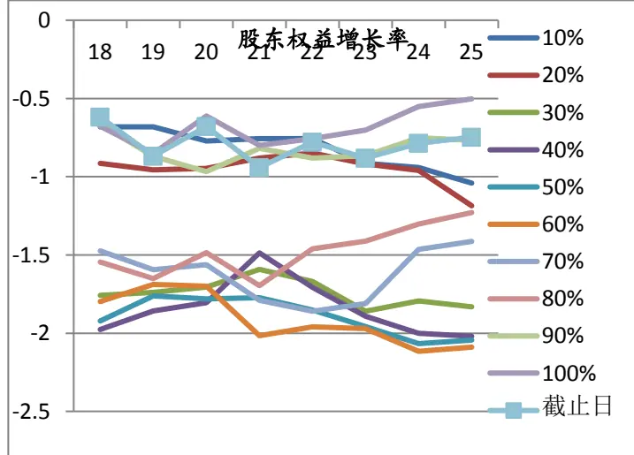
识别风险，发现价值

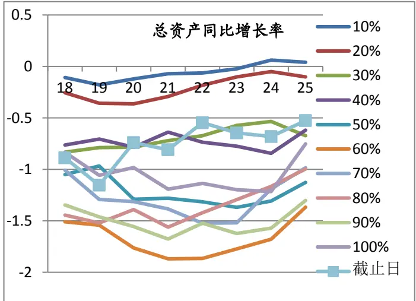

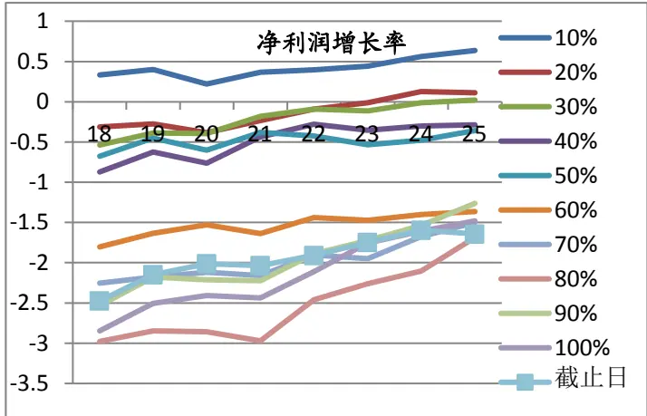

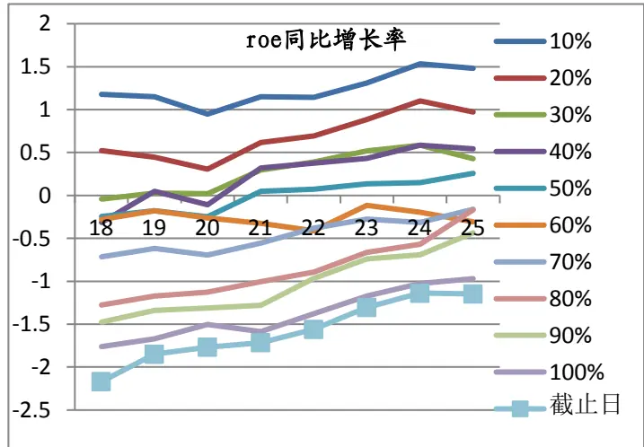

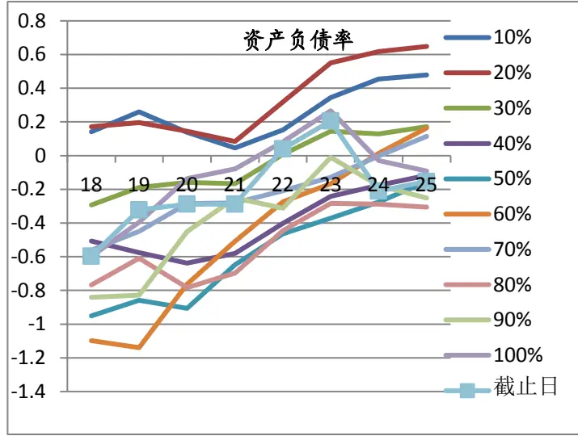

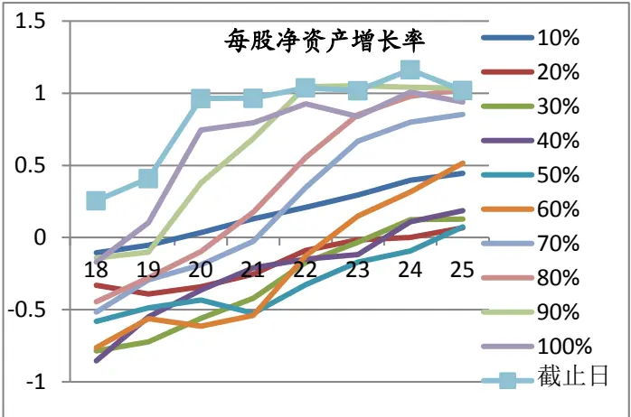

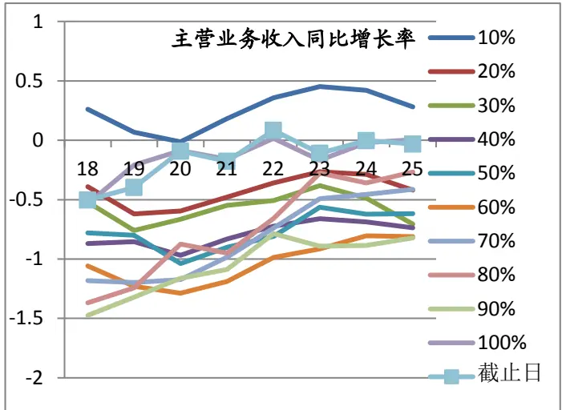

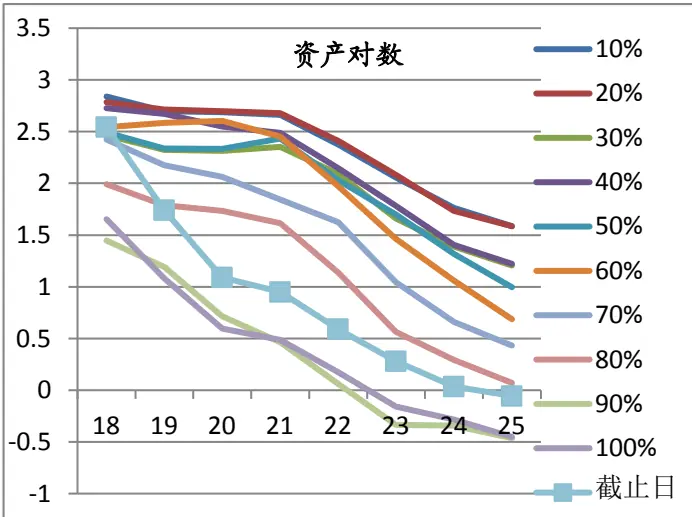

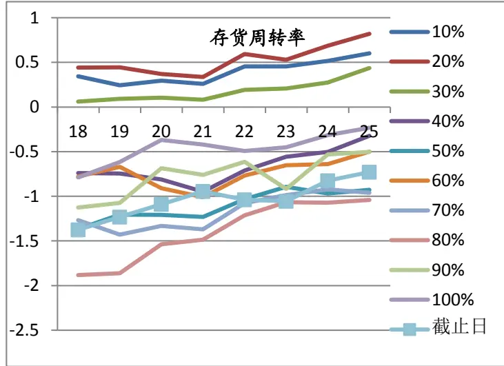

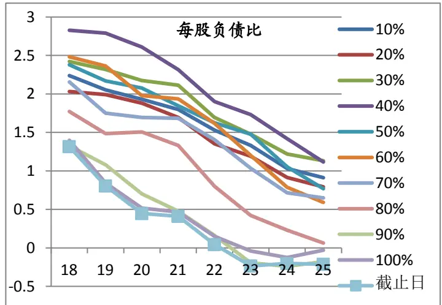

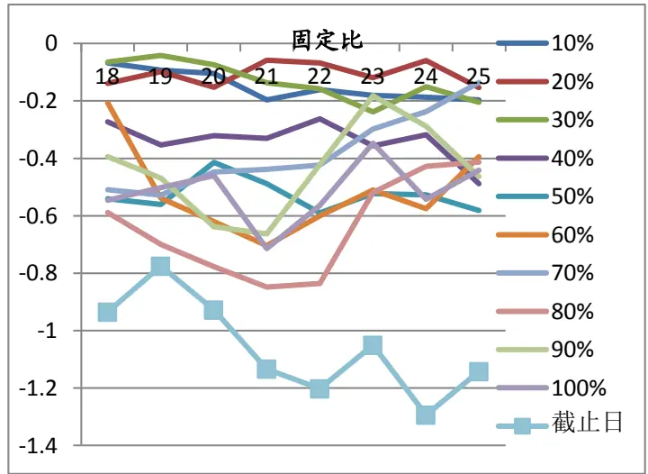

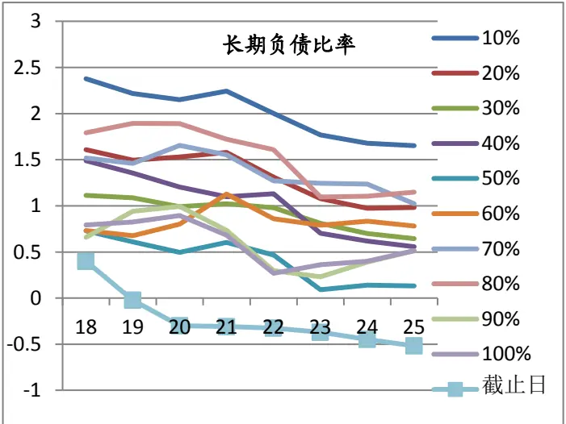

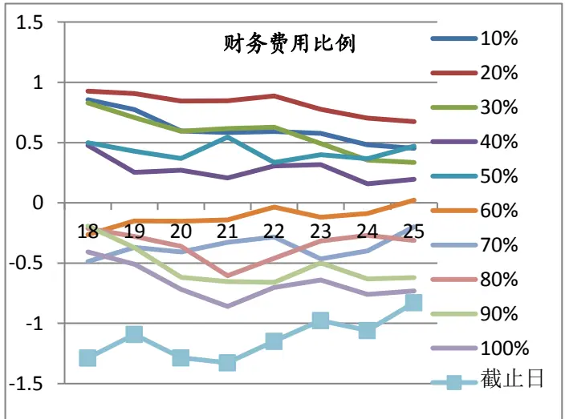

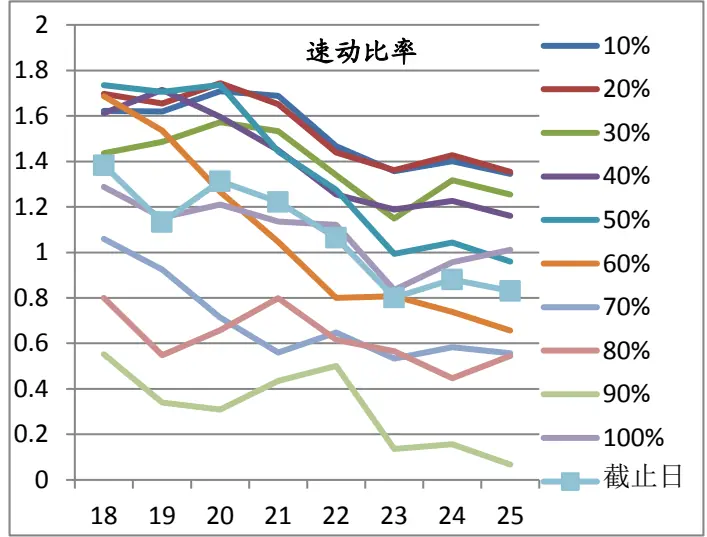

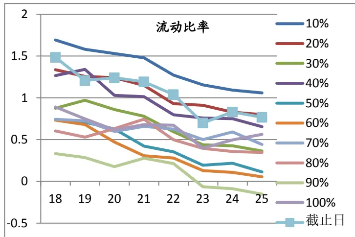

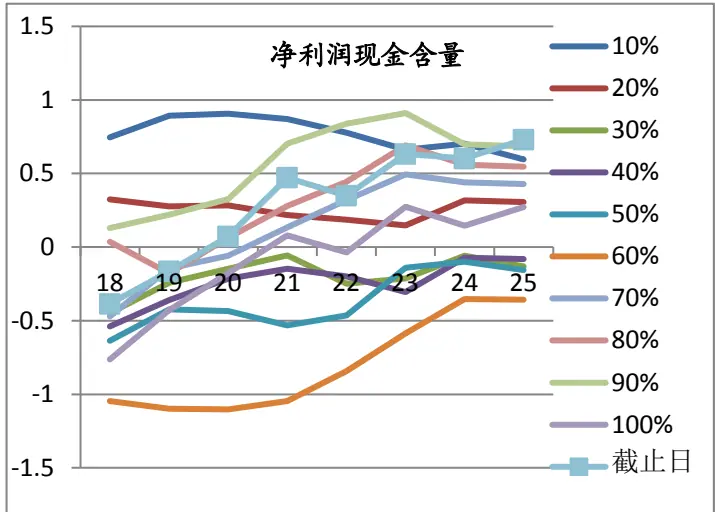

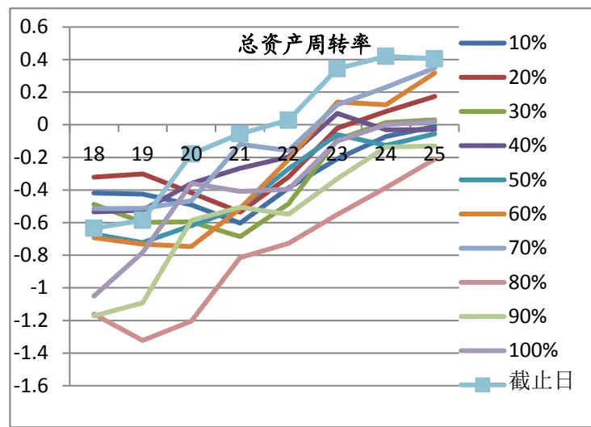

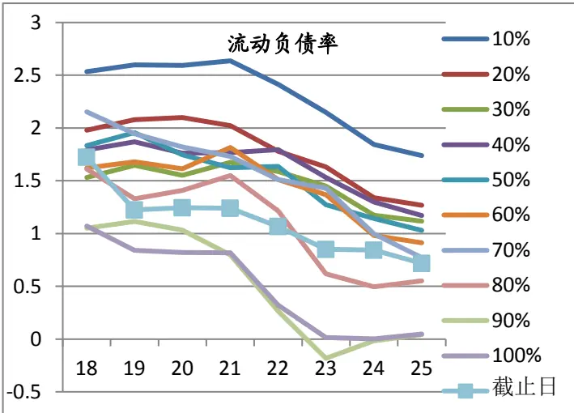

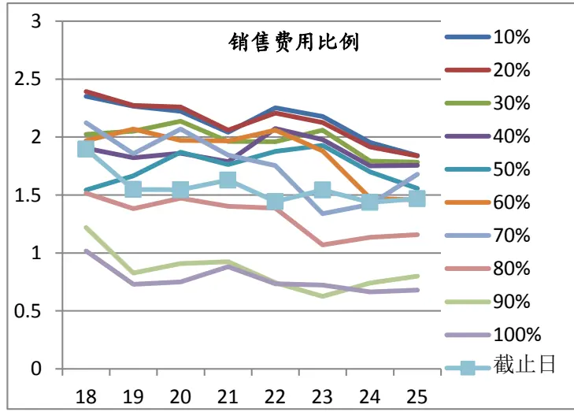
数据来源：广发证券发展研究中心

以下是当持有期为20天时，各个因子在不同起始比例以及截止日的多空IR，其中标记红色的为不同起始比例下普遍表现不错且优于原始做法的因子，包括资产对数、每股负债比、速动比率、流动比率、流动负债率和销售费用比例。其余因子虽然可能只在个别的起始比例下有效，或者在任何参数下都表现为无效，但对比提前操作和在截止日操作的多空IR，仍然可以发现，提前操作可以提高因子的有效性。

表 5不考虑快报情况下持有期为20天各因子不同起始比例的多空 IR

| 因子名称（方向） | 10% | 20% | 30% | 40% | 50% | 60% | 70% | 80% | 90% | 100% | 截止日 |
| --- | --- | --- | --- | --- | --- | --- | --- | --- | --- | --- | --- |
| 销售净利率（高） | -0.32 | -0.30 | -0.73 | -0.72 | -0.95 | -1.28 | -1.75 | -0.68 | -0.58 | -0.55 | -0.07 |
| 销售毛利率（高） | 1.40 | 1.48 | 1.07 | 1.45 | 1.27 | 1.07 | 0.96 | 1.17 | 0.89 | 1.11 | 1.64 |
| ROE（高） | -1.12 | -1.33 | -1.24 | -1.24 | -1.41 | -1.64 | -1.66 | -1.26 | -1.35 | -1.17 | -1.31 |
| ROA（高） | -0.43 | -0.51 | -0.88 | -0.69 | -0.68 | -0.63 | -0.85 | 0.00 | -0.29 | -0.37 | -0.43 |
| 股东权益增长率（高） | -0.77 | -0.95 | -1.70 | -1.81 | -1.78 | -1.70 | -1.56 | -1.48 | -0.97 | -0.61 | -0.68 |
| 总资产同比增长率（高） | -0.12 | -0.36 | -0.78 | -0.78 | -1.29 | -1.76 | -1.31 | -1.39 | -1.56 | -0.98 | -0.74 |
| 净利润增长率（高） | 0.22 | -0.38 | -0.40 | -0.76 | -0.60 | -1.53 | -2.12 | -2.86 | -2.21 | -2.41 | -2.01 |
| 每股净资产增长率（高） | 0.03 | -0.34 | -0.56 | -0.36 | -0.43 | -0.61 | -0.19 | -0.10 | 0.38 | 0.75 | 0.96 |
| roe同比增长率（高） | 0.95 | 0.31 | 0.02 | -0.11 | -0.25 | -0.26 | -0.69 | -1.13 | -1.31 | -1.50 | -1.77 |
| 主营业务收入同比增长率（高） | -0.01 | -0.60 | -0.66 | -0.97 | -1.04 | -1.29 | -1.17 | -0.87 | -1.16 | -0.09 | -0.09 |
| 资产负债率（高） | 0.14 | 0.14 | -0.16 | -0.64 | -0.91 | -0.76 | -0.28 | -0.78 | -0.45 | -0.14 | -0.29 |
| 资产对数（低） | 2.69 | 2.70 | 2.31 | 2.55 | 2.33 | 2.60 | 2.06 | 1.73 | 0.71 | 0.60 | 1.09 |
| 存货周转率（高） | 0.30 | 0.37 | 0.10 | -0.81 | -1.21 | -0.91 | -1.33 | -1.54 | -0.69 | -0.37 | -1.09 |
| 长期负债比率（低） | 2.15 | 1.53 | 0.99 | 1.20 | 0.50 | 0.80 | 1.65 | 1.89 | 0.99 | 0.90 | -0.30 |
| 每股负债比（低） | 1.93 | 1.88 | 2.18 | 2.61 | 2.08 | 1.98 | 1.69 | 1.51 | 0.70 | 0.52 | 0.45 |
| 财务费用比例（高） | 0.60 | 0.85 | 0.59 | 0.27 | 0.37 | -0.15 | -0.41 | -0.36 | -0.62 | -0.72 | -1.29 |
| 固定比（高） | -0.10 | -0.15 | -0.07 | -0.32 | -0.41 | -0.62 | -0.45 | -0.78 | -0.64 | -0.46 | -0.93 |
| 速动比率（高） | 1.71 | 1.74 | 1.57 | 1.60 | 1.74 | 1.27 | 0.71 | 0.66 | 0.31 | 1.21 | 1.31 |
| 流动比率（高） | 1.53 | 1.24 | 0.86 | 1.03 | 0.63 | 0.47 | 0.60 | 0.63 | 0.18 | 0.62 | 1.24 |
| 净利润现金含量（高） | 0.91 | 0.28 | -0.15 | -0.21 | -0.43 | -1.10 | -0.06 | 0.06 | 0.33 | -0.18 | 0.07 |
| 总资产周转率（高） | -0.49 | -0.42 | -0.60 | -0.36 | -0.62 | -0.75 | -0.47 | -1.20 | -0.59 | -0.36 | -0.18 |
| 流动负债率（高） | 2.59 | 2.10 | 1.55 | 1.76 | 1.75 | 1.61 | 1.82 | 1.41 | 1.03 | 0.82 | 1.24 |
| 销售费用比例（高） | 2.22 | 2.26 | 2.14 | 1.86 | 1.87 | 1.97 | 2.07 | 1.47 | 0.91 | 0.75 | 1.55 |

前面我们提到，快报中同样存在一些可用的因子，分别是：销售净利率、ROE、ROA、股东权益增长率、总资产同比增长率、净利润增长率、每股净资产增长率、roe同比增长率、主营业务收入同比增长率和资产总计，一共十个。考虑快报后，无论该个股披露的是快报还是正式财报，均视为已披露财报。在计算披露占比时，将会把该个股纳入统计。在使用上述十个快报因子时，则是将快报数据和正式财报数据一起进行排序打分。而对于其他只能从正式财报中得到的因子，已经披露了快报的个股后续披露正式财务报告，我们仍将其纳入选股范围，确保使用最新出现并且从未使用过的因子数据进行选股。以下是考虑快报后各因子不同起始比例持有期为20天的结果，其中标记红色的为不同起始比例下普遍变现不错且优于原始做法的因子，包括资产对数、长期负债比率、每股负债比、财务费用比例、流动负债率、销售费用比例。

表 6考虑快报时持有期为20 天各因子不同起始比例的多空 IR

| 因子名称（方向） | 10% | 20% | 30% | 40% | 50% | 60% | 70% | 80% | 90% | 100% | 截止日 |
| --- | --- | --- | --- | --- | --- | --- | --- | --- | --- | --- | --- |
| 销售净利率（高） | -0.31 | -0.53 | -0.96 | -0.48 | -1.13 | -0.74 | -1.20 | -1.02 | -0.70 | -0.62 | -0.07 |

识别风险，发现价值

| 销售毛利率（高） | 1.08 | 1.02 | 1.14 | 1.24 | 1.18 | 1.39 | 0.79 | 0.88 | 0.99 | 1.05 | 1.64 |
| --- | --- | --- | --- | --- | --- | --- | --- | --- | --- | --- | --- |
| ROE（高） | -0.95 | -1.13 | -1.41 | -1.52 | -1.25 | -1.40 | -1.26 | -1.35 | -1.28 | -1.13 | -1.31 |
| ROA（高） | -0.20 | -0.27 | -0.58 | -0.57 | -0.80 | -0.14 | -0.69 | -0.46 | -0.68 | -0.40 | -0.43 |
| 股东权益增长率（高） | -0.61 | -0.78 | -1.16 | -1.12 | -1.29 | -1.31 | -1.29 | -1.47 | -1.64 | -0.46 | -0.68 |
| 总资产同比增长率（高） | -0.51 | -0.47 | -0.88 | -1.34 | -1.35 | -2.02 | -1.23 | -1.17 | -1.35 | -0.99 | -0.74 |
| 净利润增长率（高） | 0.52 | 0.15 | -0.07 | -0.64 | -0.44 | -0.49 | -1.10 | -1.50 | -2.01 | -2.36 | -2.01 |
| 每股净资产增长率（高） | 0.51 | 0.49 | 0.45 | 0.72 | 0.76 | 0.40 | 0.51 | -0.60 | -0.34 | 0.78 | 0.96 |
| roe 同比增长率（高） | 0.95 | 0.60 | 0.26 | 0.13 | -0.52 | -0.29 | -0.06 | -0.17 | -1.38 | -1.48 | -1.77 |
| 主营业务收入同比增长率（高） | 0.34 | 0.03 | -0.30 | -0.40 | -0.04 | -0.80 | -1.61 | -0.52 | -1.16 | -0.11 | -0.09 |
| 资产负债率（高） | 0.58 | 0.75 | 0.43 | -0.06 | -0.24 | -0.83 | -0.30 | 0.30 | 0.01 | -0.05 | -0.29 |
| 资产对数（低） | 2.91 | 2.81 | 2.69 | 2.87 | 2.19 | 2.04 | 2.19 | 1.56 | 0.90 | 0.51 | 1.09 |
| 存货周转率（高） | 0.74 | 0.68 | 0.81 | 0.23 | -1.21 | -0.39 | -0.74 | -1.36 | -0.60 | -0.29 | -1.09 |
| 长期负债比率（低） | 2.58 | 2.20 | 1.25 | 0.99 | 0.69 | 1.36 | 1.07 | 0.27 | 1.10 | 0.87 | -0.30 |
| 每股负债比（低） | 2.07 | 1.97 | 1.89 | 2.31 | 2.15 | 2.44 | 1.66 | 1.07 | 0.45 | 0.56 | 0.45 |
| 财务费用比例（高） | 0.99 | 0.79 | 1.04 | 1.02 | 0.74 | 0.76 | 0.25 | -0.10 | -0.32 | -0.66 | -1.29 |
| 固定比（高） | 0.47 | 0.14 | 0.36 | 0.12 | 0.04 | 0.15 | -0.16 | -0.31 | -0.40 | -0.47 | -0.93 |
| 速动比率（高） | 1.25 | 1.47 | 0.86 | 0.98 | 0.63 | 0.84 | 0.54 | 0.14 | -0.09 | 1.11 | 1.31 |
| 流动比率（高） | 1.38 | 1.09 | 0.53 | 0.65 | 0.02 | 0.23 | 0.08 | -0.09 | -0.16 | 0.64 | 1.24 |
| 净利润现金含量（高） | 0.76 | 0.22 | -0.16 | -0.05 | -0.58 | -0.55 | -0.14 | 0.23 | 0.04 | 0.03 | 0.07 |
| 总资产周转率（高） | -0.08 | 0.36 | 0.00 | -0.73 | -0.27 | -0.26 | -0.15 | -0.65 | -0.81 | -0.41 | -0.18 |
| 流动负债率（高） | 2.96 | 2.77 | 2.07 | 1.97 | 1.55 | 1.79 | 1.63 | 0.85 | 0.78 | 0.81 | 1.24 |
| 销售费用比例（高） | 1.85 | 1.86 | 2.09 | 1.87 | 1.95 | 1.45 | 1.78 | 1.40 | 0.81 | 0.60 | 1.55 |

我们将上述两种做法（不考虑快报和考虑快报）的单因子效果进行对比，如下图所示。由图中可知，总体上看，考虑了快报的IR比不考虑快报的IR高，在每股净资产增长率、资产负债率、总资产、存货周转率、长期负债比率、财务费用比例等因子上表现尤为明显，这也进一步证明了快报数据，以及考虑了快报计算的披露占比提前了策略操作的时间，在一定程度上提高了因子的有效性。

图 10 各因子考虑和不考虑快报情况下的IR对比图
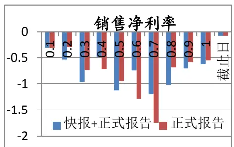

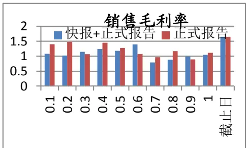

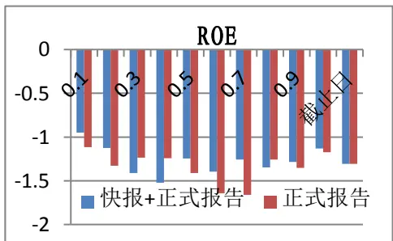

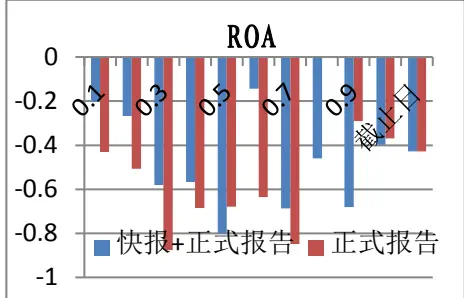

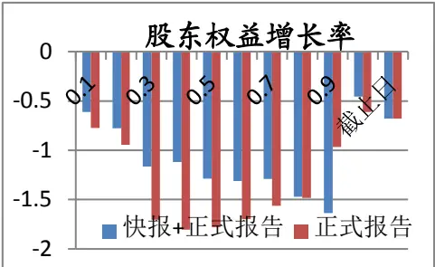

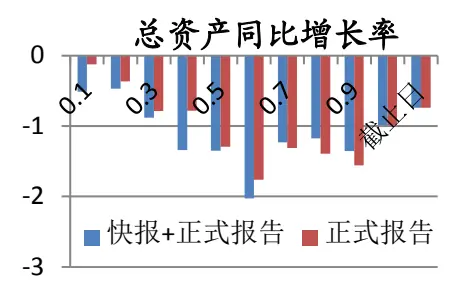

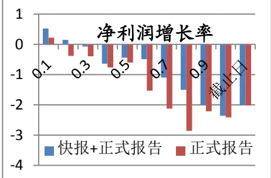

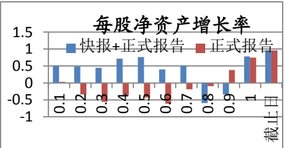

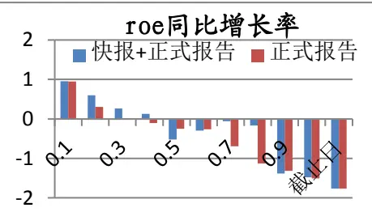

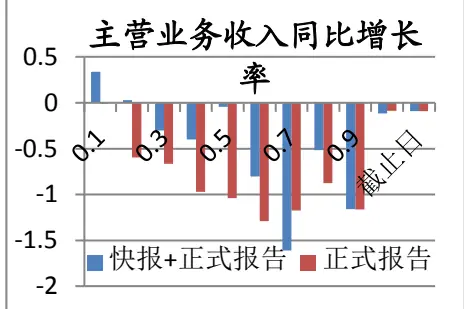

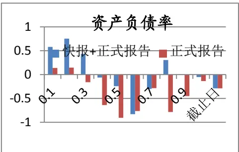

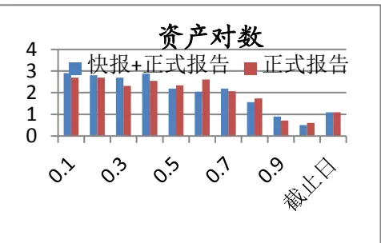

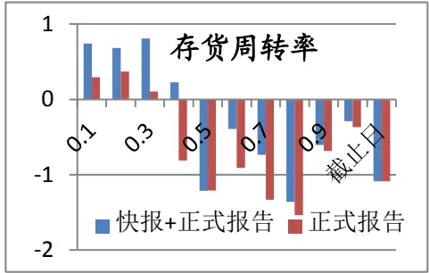

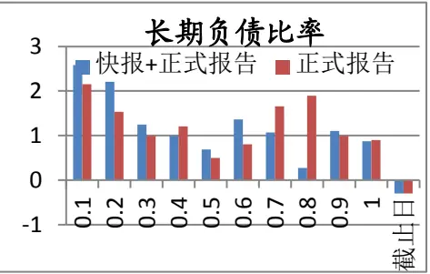

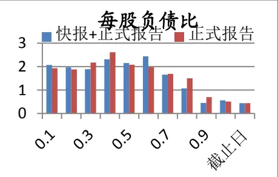

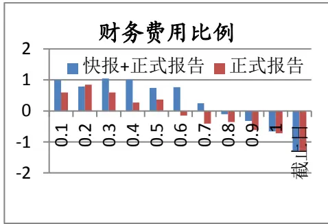

## 2.4 多因子策略

从上面的章节，我们已经知道，单个因子来看，在截止日之前使用财报数据进行选股是更有效的，并且考虑快报后，能够进一步提高因子的有效性。在这一节中，我们将进一步考察多因子的效果。

首先，我们在前述的单因子策略的基础上，测试多因子策略的表现，检测提前操作策略本身的有效性，即不考虑非披露月的情况。

策略的具体设置如下：

（1）样本数据：以各报告期结束后下一个交易日市场上除ST和创业板股外的A股作为股票池；由于股指期货在2010年上市，为了使策略更具有实际意义，我们选取样本时间为2010年至今，最早的财报为2009年年报；

（2）因子选择：根据上述单因子效果，综合考虑单因子表现及因子类别，选取盈利因子、成长因子、质量因子等各类别因子进行多因子策略构建，具体因子及方向如下表所示：

表 7多因子策略选取财报因子

| 因子名称 | 因子方向 |
| --- | --- |
| 销售毛利率 | 高 |
| ROE 同比增长率 | 高 |
| 总资产对数 | 低 |
| 速动比率 | 高 |
| 流动负债率 | 高 |
| 销售费用比例 | 高 |

（3）操作步骤：进入财报等待期后，按等待期的第一个交易日中证800成分股权重中各行业占比为各行业分配资金；每日监测股票池中各行业的财报（考虑快报）披露占比，当比例达到70%时，在该行业已披露财报的个股中进行多因子排序打分，超配前5%，以下一交易日的开盘价买入，并持有20天，到期日的收盘价卖出（下同）；每隔10%在新披露财报的个股中继续操作，如某个股此前已经披露过快报，此次新披露正式报告，该个股则使用其只能在正式财报中才能得到的因子进行多因子排序打分，忽略以前在快报中已经使用过的因子，如果该个股凭借新的因子数据再次被策略选中，而此前凭借快报因子被选中且持有期未满，则在该时点起继续持有20天，如此前持有期已满，则重新开始持有20天；

（4）对冲标的：为了从各方面考虑策略的表现，我们选择中证800、中证500和沪深300作为对冲标的，并考虑千分之三的费用。

以下是策略回测的分年度结果：

表 8多因子披露月提前操作，非披露月不做（多对 800 分年度表现）

| 多对 800 信息比 1.49 |  |  |  |
| --- | --- | --- | --- |
|  | 超额收益 | 胜率 | 最大回撤 |
| 全样本 | 21.93% | 58.50% | 5.34% |
| 2010 | 6.60% | 63.11% | 2.99% |
| 2011 | 4.93% | 57.14% | 1.46% |
| 2012 | -0.65% | 52.73% | 4.40% |
| 2013 | 5.64% | 61.54% | 2.28% |
| 2014 | 1.48% | 56.36% | 5.30% |
| 2015(截止 5.29 ) | 1.51% | 57.78% | 4.58% |

图 11 多因子披露月提前操作，非披露月不做（多对800分年度表现）
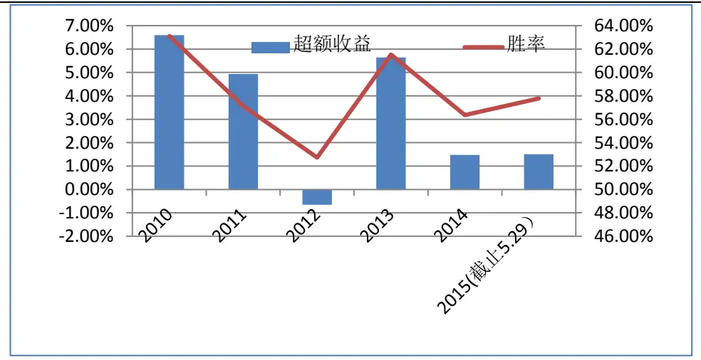

表 9多因子披露月提前操作，非披露月不做（多对 500 分年度表现）

| 多对 500 信息比 0.80 |  |  |  |
| --- | --- | --- | --- |
|  | 超额收益 | 胜率 | 最大回撤 |
| 全样本 | 8.84% | 54.08% | 6.08% |
| 2010 | -5.16% | 42.72% | 6.06% |
| 2011 | 3.57% | 61.90% | 1.85% |
| 2012 | 4.37% | 61.82% | 1.10% |
| 2013 | 1.12% | 54.81% | 1.61% |
| 2014 | 4.43% | 52.73% | 1.67% |
| 2015(截止 5.29) | 0.71% | 46.67% | 2.22% |

图 12多因子披露月提前操作，非披露月不做（多对500分年度表现）
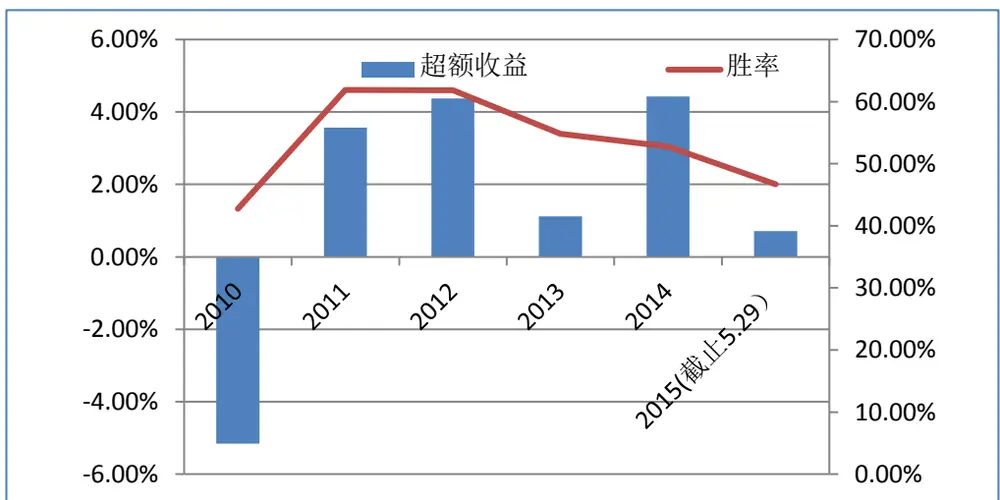

表 10多因子披露月提前操作，非披露月不做（多对 300 分年度收益）

| 多对 300 信息比 1.39 |  |  |  |
| --- | --- | --- | --- |
|  | 超额收益 | 胜率 | 最大回撤 |
| 全样本 | 26.64% | 58.84% | 7.08% |
| 2010 | 11.05% | 64.08% | 3.77% |
| 2011 | 5.34% | 56.19% | 1.99% |
| 2012 | -2.22% | 52.73% | 6.09% |
| 2013 | 7.16% | 62.50% | 3.47% |
| 2014 | 0.25% | 58.18% | 6.91% |
| 2015(截止 5.29) | 1.79% | 53.33% | 5.62% |

图 13 多因子披露月提前操作，非披露月不做（多对300分年度表现）
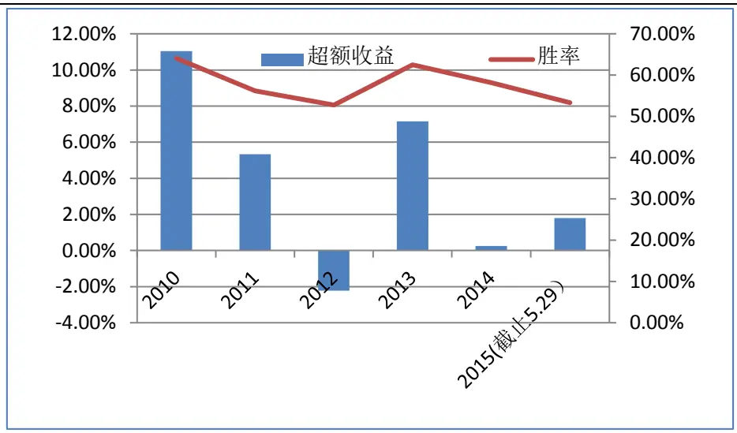

从上述不同对冲方案的分年度表现图表可知，多对300策略的总收益和胜率最高，信息比居中，但回撤较大；多对500策略的总收益、胜率和信息比都是最低的，但分年度收益较小；多对800策略的总收益和胜率居中，回撤小。总体来看，无论是哪种对冲策略，仅仅使用财报因子，一年只在三个披露月进行操作，并提前使用财报数据，由于一年只有少数几个月份非空仓，且大部分交易日并非满仓投资股票，闲置资金进行无风险投资获得的收益较低，使得策略的总收益较低，但胜率和回撤是比较理想的。

## 三、新做法对已有策略的贡献

虽然一年只在三个披露月进行操作，能够带来一定的收益，但在实操中，我们

仍然需要提高资金的使用效率，尽可能每个月都保持满仓状态。因此，我们结合新旧策略的思想，既使用新数据，也使用旧数据，全年持仓，与原始的每个月末选股的策略效果进行对比，测试新策略对原始的多因子策略带来的贡献。

本章我们分别测试了新做法对只使用财报因子的策略以及使用财报因子和非财报因子的策略带来的贡献。

## 3.1 只使用财报因子，在披露月提前操作，非披露月按照原始做法

策略思想：在财报等待期中，按照2.4所述披露月提前操作的策略步骤，分行业分阶段进行选股，直到财报截止披露日期为止；当最后一批选中的个股持有20天到期的当天，全市场剔除ST和创业板股的所有个股，使用最近一次已截止披露的财报进行多因子排序打分，以下一个交易日的开盘价买入，月底以收盘价卖出；如月底并非财报等待期或虽在财报等待期，但新财报操作尚未启动，则仍使用旧数据进行选股，持有到下一月底；如在持有期未满时，新财报操作机制启动（即有任何一个行业的披露占比达到阈值），则当前使用旧数据选出的个股将会被强制平仓，资金就绪，分配到各个行业，开始进入新财报操作阶段。新旧数据使用示意图如下所示：

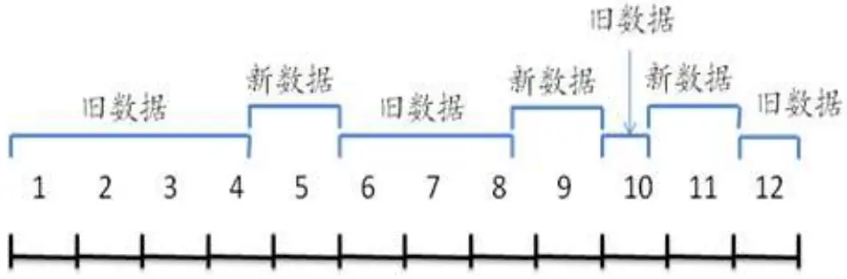

从前面单因子的效果我们可以看出，起始比例越小，越早使用新数据，因子的有效性越高，但将新做法与原始策略进行融合，如果起始比例很小，则新策略在财报等待期将会有很长的一段时间仅使用很小部分的资金投资股票，资金利用率将十分低。因此，我们测试了新策略在不同起始比例下，持有期为20天的表现，以及原始每月末选股的策略表现，不同对冲方案的分年度表现如下所示，其中，起始比例为“截止日”即为原始做法：

表 11只使用财报因子新旧策略多对 800表现

| 多对800 |  |  |  |  |
| --- | --- | --- | --- | --- |
| 起始比例 | 超额收益 | 胜率 | 最大回撤 | 信息比 |
| 0.1 | 37.88% | 61.64% | 20.28% | 1.06 |
| 0.2 | 48.56% | 61.03% | 20.49% | 1.19 |
| 0.3 | 41.72% | 58.84% | 21.09% | 1.01 |
| 0.4 | 63.12% | 59.09% | 21.13% | 1.36 |
| 0.5 | 71.19% | 57.68% | 21.43% | 1.4 |
| 0.6 | 70.20% | 58.82% | 21.06% | 1.36 |

识别风险，发现价值

| 0.7 | 84.82% | 58.51% | 21.12% | 1.53 |
| --- | --- | --- | --- | --- |
| 0.8 | 74.88% | 57.91% | 21.33% | 1.33 |
| 0.9 | 75.39% | 57.11% | 20.97% | 1.33 |
| 1 | 92.25% | 57.22% | 21.28% | 1.51 |
| 截止日 | 71.50% | 56.72% | 21.47% | 1.25 |

表 12只使用财报因子新旧策略多对 500表现

| 多对500 |  |  |  |  |
| --- | --- | --- | --- | --- |
| 起始比例 | 超额收益 | 胜率 | 最大回撤 | 信息比 |
| 0.1 | 40.53% | 57.89% | 4.84% | 1.49 |
| 0.2 | 44.58% | 56.40% | 4.84% | 1.52 |
| 0.3 | 39.61% | 55.19% | 4.84% | 1.32 |
| 0.4 | 46.74% | 56.11% | 5.27% | 1.45 |
| 0.5 | 41.85% | 55.02% | 5.27% | 1.27 |
| 0.6 | 37.45% | 55.22% | 5.12% | 1.11 |
| 0.7 | 39.68% | 53.76% | 5.87% | 1.14 |
| 0.8 | 34.98% | 53.27% | 10.50% | 0.98 |
| 0.9 | 31.06% | 51.97% | 9.20% | 0.87 |
| 1 | 39.25% | 52.87% | 8.16% | 1.03 |
| 截止日 | 38.47% | 53.44% | 8.96% | 1.03 |

表 13只使用财报因子新旧策略多对 300表现

| 多对300 |  |  |  |  |
| --- | --- | --- | --- | --- |
| 起始比例 | 超额收益 | 胜率 | 最大回撤 | 信息比 |
| 0.1 | 35.84% | 62.71% | 26.29% | 0.8 |
| 0.2 | 48.49% | 61.57% | 26.53% | 0.94 |
| 0.3 | 40.86% | 60.31% | 27.11% | 0.79 |
| 0.4 | 67.33% | 60.66% | 27.22% | 1.12 |
| 0.5 | 80.63% | 58.93% | 27.44% | 1.21 |
| 0.6 | 81.26% | 60.08% | 27.15% | 1.2 |
| 0.7 | 101.38% | 59.22% | 27.20% | 1.37 |
| 0.8 | 89.02% | 59.35% | 27.39% | 1.2 |
| 0.9 | 92.10% | 58.71% | 27.25% | 1.21 |
| 1 | 112.51% | 58.84% | 27.63% | 1.36 |
| 截止日 | 81.66% | 58.61% | 27.84% | 1.09 |

从上表可以看到，披露月提前操作使策略具有更高的信息比、收益和胜率，最大回撤也略有减小。其中，70%的起始比例整体效果更好。

原始策略和70%起始比例的新策略回测结果对比如下：

图 14 只使用财报因子原始策略和新策略多对800超额净值

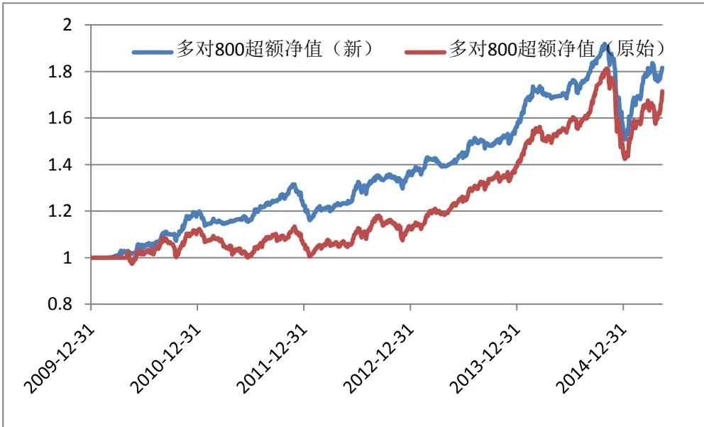

图 15 只使用财报因子原始策略和新策略多对500超额净值
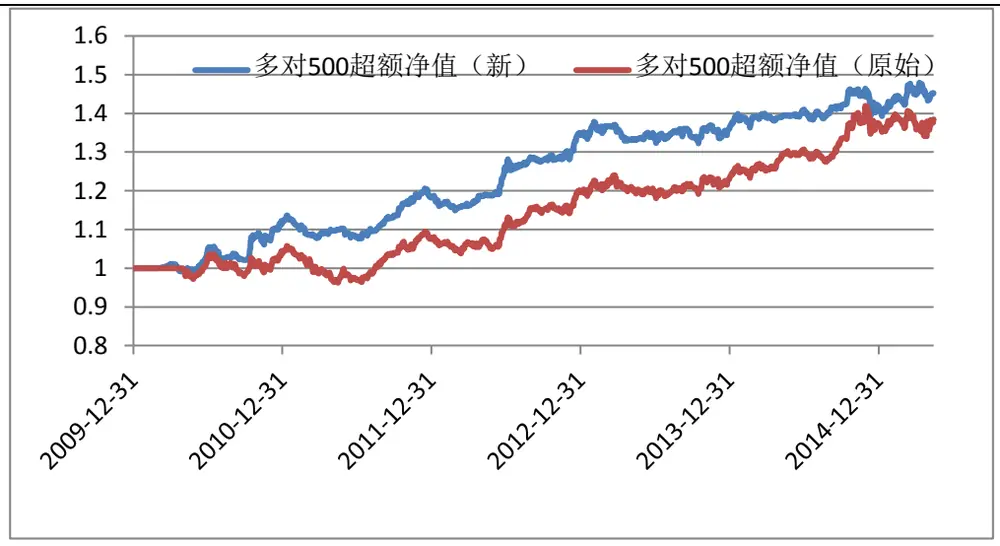
图 16 只使用财报因子原始策略和新策略多对300超额净值

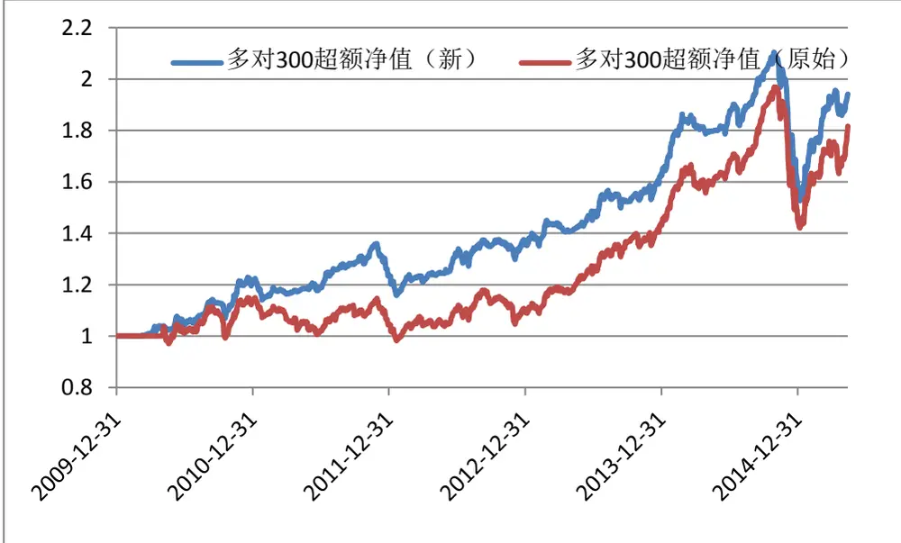

## 3.2 财报因子和非财报因子在披露月提前操作，非披露月按照原始做法

在实战中，我们不仅仅使用财报因子进行多因子选股，而是财报因子和非财报因子一起使用。因此，我们接下来测试新做法对原有的使用财报因子和非财报因子每月末进行选股的多因子策略带来的贡献。

策略思想：主要思想及步骤与3.1的策略思想一致，其中不同的是，在所有进行多因子排序打分的时点，所有新披露财报（含快报和正式报告）个股的非财报因子都将参与多因子排序打分。

在本节，我们选择的非财报因子及方向如下表所示：

表 14多因子策略选取非财报因子

| 因子名称 | 因子方向 |
| --- | --- |
| 一个月成交金额 | 低 |
| 最近三个月平均成交量 | 低 |
| 市盈率 | 低 |
| 三个月股价反转 | 低 |
| 流通市值对数 | 低 |
| 一个月股价反转 | 低 |

我们测试了新策略在不同起始比例下，持有期为20天的表现，以及原始每月末选股的策略表现，结果汇总于下表：

表 15财报因子+非财报因子多对800 新旧策略表现

| 多对800 |  |  |  |  |
| --- | --- | --- | --- | --- |
| 起始比例 | 超额收益 | 胜率 | 最大回撤 | 信息比 |
| 10% | 55.76% | 63.94% | 20.48% | 1.42 |
| 20% | 77.76% | 62.27% | 19.93% | 1.7 |
| 30% | 69.30% | 61.78% | 20.28% | 1.51 |

识别风险，发现价值

| 40% | 94.22% | 61.36% | 21.26% | 1.82 |
| --- | --- | --- | --- | --- |
| 50% | 105.95% | 60.58% | 20.92% | 1.85 |
| 60% | 108.14% | 61.57% | 20.44% | 1.84 |
| 70% | 127.33% | 61.28% | 20.40% | 2.01 |
| 80% | 159.59% | 61.26% | 20.05% | 2.24 |
| 90% | 120.96% | 59.68% | 20.52% | 1.81 |
| 100% | 145.07% | 59.32% | 20.77% | 1.99 |
| 截止日 | 108.38% | 60.44% | 20.84% | 1.57 |

表 16财报因子+非财报因子多对500 新旧策略表现

| 多对500 |  |  |  |  |
| --- | --- | --- | --- | --- |
| 起始比例 | 超额收益 | 胜率 | 最大回撤 | 信息比 |
| 10% | 58.94% | 58.81% | 6.34% | 2.04 |
| 20% | 73.40% | 57.95% | 6.34% | 2.25 |
| 30% | 66.90% | 56.12% | 6.34% | 1.99 |
| 40% | 74.78% | 56.19% | 6.34% | 2.1 |
| 50% | 70.94% | 55.64% | 6.34% | 1.88 |
| 60% | 68.20% | 55.92% | 6.34% | 1.76 |
| 70% | 72.34% | 55.74% | 6.34% | 1.78 |
| 80% | 100.90% | 55.91% | 6.34% | 2.16 |
| 90% | 65.55% | 53.73% | 7.94% | 1.54 |
| 100% | 77.06% | 54.08% | 8.73% | 1.68 |
| 截止日 | 54.11% | 50.81% | 9.79% | 1.29 |

表 17财报因子+非财报因子多对300 新旧策略表现

| 多对 300 |  |  |  |  |
| --- | --- | --- | --- | --- |
| 起始比例 | 超额收益 | 胜率 | 最大回撤 | 信息比 |
| 10% | 53.38% | 63.78% | 26.26% | 1.08 |
| 20% | 77.51% | 62.65% | 25.77% | 1.34 |
| 30% | 68.22% | 61.86% | 26.37% | 1.18 |
| 40% | 99.20% | 61.52% | 27.35% | 1.48 |
| 50% | 117.16% | 60.42% | 26.74% | 1.56 |
| 60% | 121.61% | 61.02% | 26.34% | 1.58 |
| 70% | 147.43% | 61.36% | 26.29% | 1.75 |
| 80% | 180.32% | 61.34% | 26.14% | 1.91 |
| 90% | 141.78% | 60.00% | 26.79% | 1.59 |
|  | 171.16% | 60.13% | 27.44% | 1.74 |
| 截止日 | 129.17% | 59.55% | 27.45% | 1.41 |

从上表可以看到披露月提前操作使策略具有更高的信息比、收益和胜率，最大回撤也略有减小。综合考虑不同策略的表现，最终选择70%作为该策略最终的参数。

原始策略和70%起始比例的新策略历史回测超额净值对比图如下：
图 17财报+非财报因子原始策略和新策略多对800超额净值
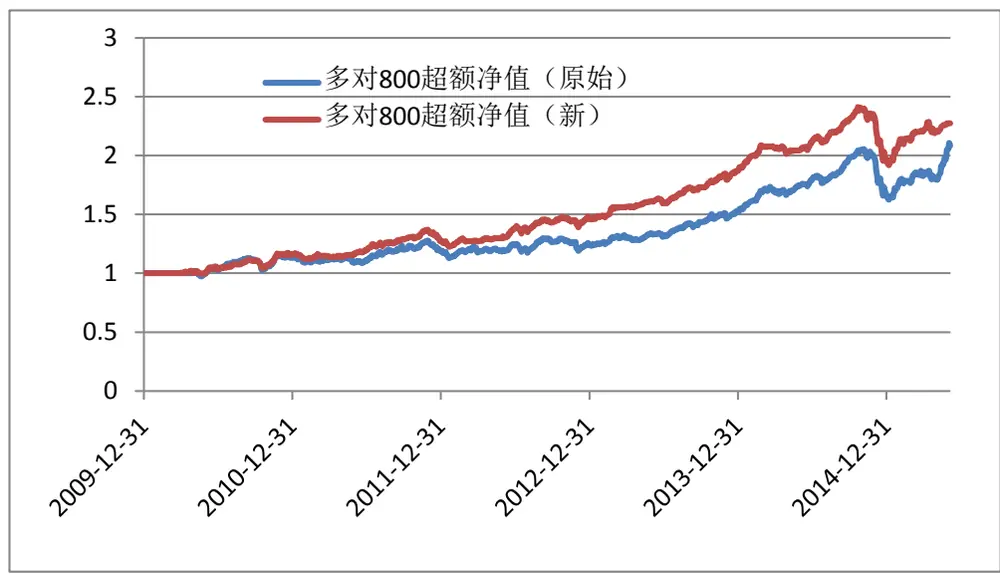

图 18财报+非财报因子原始策略和新策略多对500超额净值
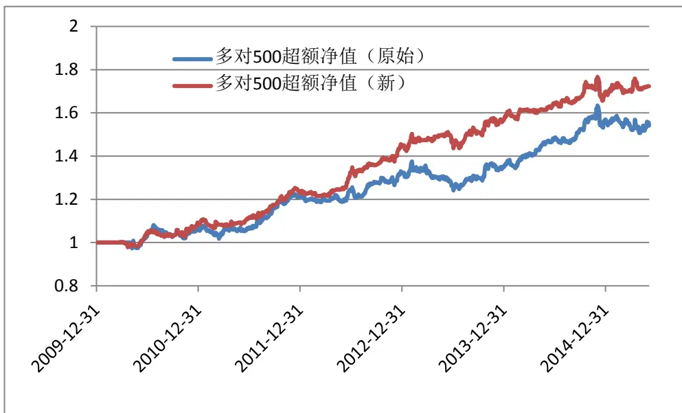

图 19 财报+非财报因子原始策略和新策略多对300超额净值
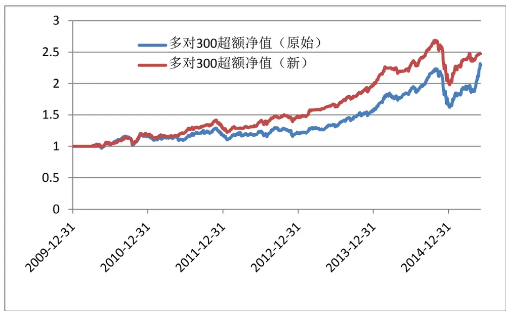

起始比例为70%、持有期为20天的新策略分年度结果及策略表现如下所示：表 18财报+非财报因子70%起始比例持有期为 20天新策略多对 800 分年度表现

| 多对800信息比 2.01 年化收益16.6% |  |  |  |
| --- | --- | --- | --- |
|  | 超额收益 | 胜率 | 最大回撤 |
| 全样本 | 127.33% | 61.28% | 20.40% |
| 2010 | 16.38% | 65.13% | 6.39% |
| 2011 | 9.69% | 58.20% | 7.21% |
| 2012 | 14.23% | 60.08% | 5.97% |
| 2013 | 28.25% | 64.29% | 2.92% |
| 2014 | 4.06% | 57.14% | 19.28% |
| 2015(截止 5.29) | 15.20% | 63.22% | 4.24% |

图 20财报+非财报因子新策略多对800历史回测结果
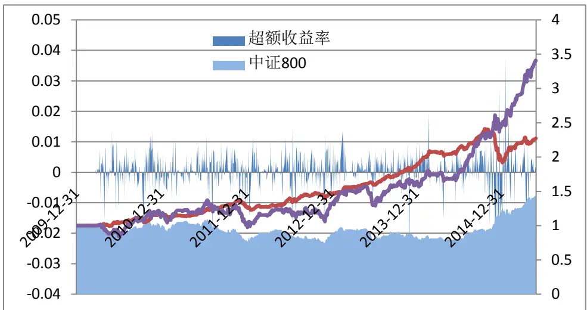

表 19财报+非财报因子新策略多对 500分年度表现

| 多对500信息比1.78年化收益10.97% |  |  |  |
| --- | --- | --- | --- |
|  | 超额收益 | 胜率 | 最大回撤 |
| 全样本 | 72.34% | 55.74% | 6.34% |
| 2010 | 8.64% | 53.33% | 2.84% |
| 2011 | 13.15% | 56.56% | 3.70% |
| 2012 | 17.50% | 60.08% | 3.06% |
| 2013 | 8.77% | 54.62% | 4.96% |
| 2014 | 8.17% | 52.65% | 6.34% |
| 2015(截止 5.29) | 1.04% | 56.32% | 2.86% |

图 21财报+非财报因子新策略多对500历史回测结果
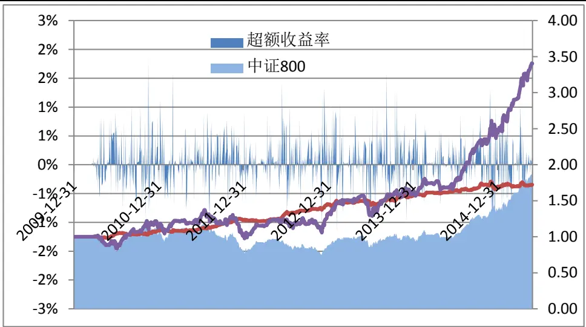

表 20财报+非财报因子新策略多对 300分年度表现

| 多对300信息比1.75 年化收益19.50% |  |  |  |
| --- | --- | --- | --- |
|  | 超额收益 | 胜率 | 最大回撤 |
| 全样本 | 147.43% | 61.36% | 26.29% |
| 2010 | 18.90% | 65.13% | 9.07% |
| 2011 | 8.41% | 57.79% | 9.40% |
| 2012 | 13.11% | 61.32% | 7.33% |
| 2013 | 35.05% | 64.29% | 3.78% |
| 2014 | 2.35% | 57.55% | 25.02% |
| 2015(截止 5.14) | 20.59% | 63.22% | 5.13% |

图 22 财报+非财报因子新策略多对300历史回测结果
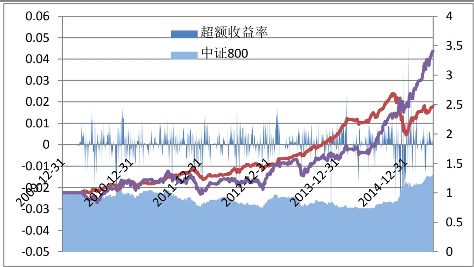

## 四、总结

综上所述，传统的多因子ALPHA策略在使用财报因子上存在重复使用旧数据以及忽略月末新数据等缺点，而统计数据表明，新数据能够带来比旧数据更多的超额收益，并且在截止日前一段时间，市场上已有足够多的新财报数据用于因子打分，此外，快报数据的使用使得这一数量更多且时间更早，这些都为提前使用财报因子进行选股提供了良好的条件。实证数据表明，在截止日前使用财报数据进行选股，策略本身表现良好，并且能够很好地与现有策略进行融合，带来更多的收益回报，同时也使得胜率更高、最大回撤更小！

以下我们以最新的2014年年报为例，具体说明策略的操作：

下表为各行业根据最新的2014年报数据首次以及二次选股的情况，其中，电子行业的财报披露占比在2015年3月10日最先达到70%，开始使用分得的2.52%资金中的71.58%买入股票组合，在2015年3月31日，电子行业的披露占比达到84.21%，进行第二次选股，以此类推，直到4月底全部资金使用完毕。

表 21各行业 2014年年报操作情况

| 行业 | 首次选股时间 | 总资金占比 | 披露占比 | 使用资金 | 二次选股时间 | 披露占比 | 使用资金 |
| --- | --- | --- | --- | --- | --- | --- | --- |
| 农林牧渔 | 2015/3/31 | 1.24% | 70.77% | 0.88% | 2015/4/15 | 81.54% | 0.13% |
| 采掘 | 2015/4/14 | 2.65% | 70.18% | 1.86% | 2015/4/15 | 80.70% | 0.28% |
| 化工 | 2015/3/27 | 3.27% | 71.35% | 2.33% | 2015/4/10 | 82.29% | 0.36% |
| 钢铁 | 2015/4/15 | 1.17% | 71.88% | 0.84% | 2015/4/22 | 84.38% | 0.15% |
| 有色金属 | 2015/4/9 | 3.79% | 71.11% | 2.70% | 2015/4/16 | 82.22% | 0.42% |
| 电子 | 2015/3/10 | 2.52% | 71.58% | 1.81% | 2015/3/31 | 84.21% | 0.32% |
| 家用电器 | 2015/3/25 | 2.43% | 71.11% | 1.73% | 2015/3/31 | 82.22% | 0.27% |
| 食品饮料 | 2015/4/14 | 3.78% | 71.21% | 2.69% | 2015/4/21 | 83.33% | 0.46% |
| 纺织服装 | 2015/3/31 | 0.79% | 74.67% | 0.59% | 2015/4/10 | 86.67% | 0.09% |
| 轻工制造 | 2015/3/20 | 0.73% | 73.68% | 0.54% | 2015/3/31 | 85.53% | 0.09% |
| 医药生物 | 2015/3/31 | 5.72% | 71.63% | 4.10% | 2015/4/16 | 83.69% | 0.69% |
| 公用事业 | 2015/4/10 | 4.06% | 72.53% | 2.95% | 2015/4/17 | 85.71% | 0.54% |
| 交通运输 | 2015/3/31 | 3.28% | 70.73% | 2.32% | 2015/4/21 | 82.93% | 0.40% |
| 房地产 | 2015/4/15 | 6.14% | 77.78% | 4.78% | 2015/4/24 | 90.97% | 0.81% |
| 商业贸易 | 2015/4/14 | 2.48% | 70.65% | 1.75% | 2015/4/17 | 81.52% | 0.27% |
| 休闲服务 | 2015/3/27 | 0.37% | 70.00% | 0.26% | 2015/4/15 | 83.33% | 0.05% |
| 综合 | 2015/4/21 | 0.79% | 70.59% | 0.56% | 2015/4/27 | 82.35% | 0.09% |
| 建筑材料 | 2015/3/24 | 1.19% | 70.00% | 0.83% | 2015/4/10 | 80.00% | 0.12% |
| 建筑装饰 | 2015/3/27 | 4.16% | 70.49% | 2.93% | 2015/4/2 | 81.97% | 0.48% |
| 电气设备 | 2015/3/27 | 2.53% | 74.07% | 1.88% | 2015/4/10 | 85.19% | 0.28% |
| 国防军工 | 2015/3/31 | 1.99% | 76.92% | 1.53% | 2015/4/23 | 88.46% | 0.23% |
| 计算机 | 2015/3/20 | 2.86% | 72.46% | 2.07% | 2015/3/31 | 84.06% | 0.33% |
| 传媒 | 2015/4/7 | 2.94% | 70.00% | 2.06% | 2015/4/15 | 80.00% | 0.29% |
| 通信 | 2015/3/31 | 1.45% | 75.61% | 1.10% | 2015/4/17 | 87.80% | 0.18% |
| 银行 | 2015/3/27 | 15.16% | 81.25% | 12.32% | 2015/4/28 | 100.00% | 2.84% |
| 非银金融 | 2015/3/27 | 15.65% | 72.22% | 11.30% | 2015/4/15 | 83.33% | 1.74% |
| 汽车 | 2015/4/2 | 3.36% | 70.41% | 2.37% | 2015/4/17 | 81.63% | 0.38% |
| 机械设备 | 2015/3/27 | 3.45% | 70.81% | 2.44% | 2015/4/10 | 82.61% | 0.41% |

下表为传媒行业和银行行业使用2014年年报数据首次进行选股的情况。这两个行业均为行业成分股较少的行业，传媒行业的成分股数量为40，而银行行业仅有16只成分股，在首次选股时，传媒行业已有28只成分股披露了财报（包括快报），其中，在2015年3月31日披露年报的游族网络根据多因子排序打分结果跻身超配组合行列；而银行行业在首次选股时，已有13只成分股披露了财报（包括快报），其中，在2015年3月13日披露年报的平安银行凭借11.28%的ROE同比增长率获得较高的因子打分结果，成为银行行业首只超配的个股。从图23和24上述两只个股配置以来股价走势图中，我们可以看出，游族网络和平安银行在持有期20天内，涨幅分别为

56.99%和31.78%，而如果我们等到4月底再超配这两只个股，则只能得到49.15%和-8.26%的收益，由此可见，个股在财报披露后短期内的确有更好的收益表现。

表 22个别行业 2014 年年报应用举例

| 行业名称 | 传媒 | 银行 |
| --- | --- | --- |
| 首次选股时间 | 2015/4/7 | 2015/3/27 |
| 成分股数量 | 40 | 16 |
| 已披露报告数量 | 28 | 13 |
| 披露占比 | 70.00% | 81.25% |
| 超配个股数量 | 1 | 1 |
| 超配个股代码 | 002174.SZ | 000001.SZ |
| 股票简称 | 游族网络 | 平安银行 |
| 年报披露日期 | 2015/3/31 | 2015/3/13 |
| 毛利率 | 69.63% | / |
| roe 同比增长率 | -60.80% | 11.28% |
| 速动比率 | 0.84 | 1 |
| 流动负债率 | 99.81% | 1 |
| 销售费用比例 | 6.68% | / |
| 持有期涨幅 | 57.00% | 31.80% |
| 五月份涨幅 | 49.20% | -8.30% |

图 23 游族网络4月初以来股价走势
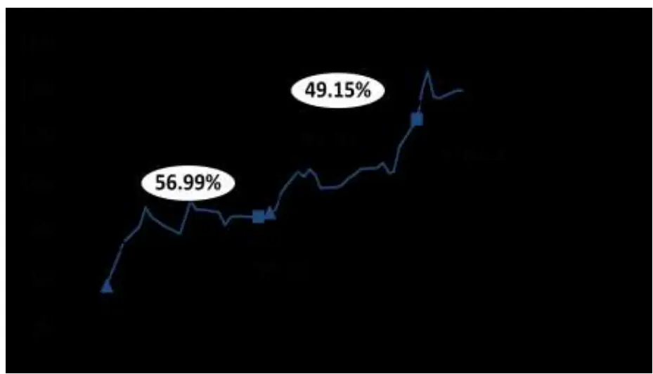
图 24 平安银行3月底以来股价走势

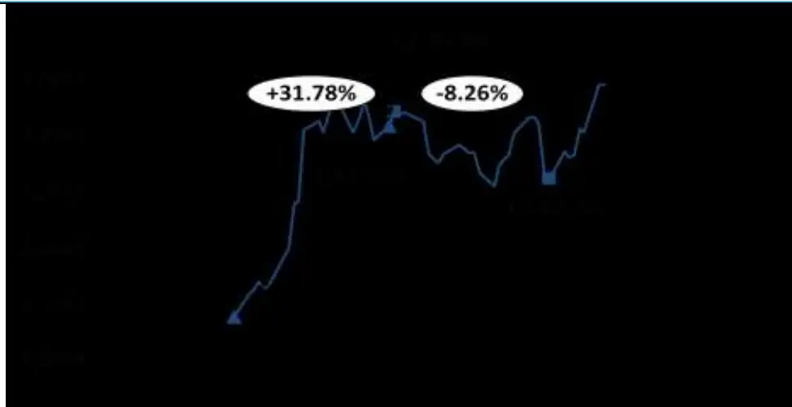

## 风险提示

本模型采用量化方法，所推荐个股不一定具有严格的经济逻辑，也未必符合当前宏观环境特点，请结合自身判断进行恰当使用。

## Table_RatingIndustry 广发证券—行业投资评级说明

买入： 预期未来 12 个月内，股价表现强于大盘 10%以上。

持有： 预期未来12个月内，股价相对大盘的变动幅度介于-10%～+10%。

卖出： 预期未来12个月内，股价表现弱于大盘10%以上。

## Table_RatingCompany 广发证券—公司投资评级说明

买入： 预期未来12个月内，股价表现强于大盘15%以上。

谨慎增持： 预期未来12个月内，股价表现强于大盘5%-15%。

持有： 预期未来12个月内，股价相对大盘的变动幅度介于-5%～+5%。

卖出： 预期未来12个月内，股价表现弱于大盘5%以上。

## Table_Ad联系我们

| 地址 | 广州市 广州市天河北路183号 | 深圳市 深圳市福田区金田路4018 | 北京市 | 上海市 |
| --- | --- | --- | --- | --- |
|  | 大都会广场5楼 | 号安联大厦 15 楼 A 座 03-04 | 北京市西城区月坛北街2号 月坛大厦18层 | 上海市浦东新区富城路99号 震旦大厦18楼 |
| 邮政编码 | 510075 | 518026 | 100045 |  |
| 客服邮箱 | gfyf@gf.com.cn |  |  | 200120 |
| 服务热线 | 020-87555888-8612 |  |  |  |

## Table_Disclaimer 免 责声 明

广发证券股份有限公司具备证券投资咨询业务资格。本报告只发送给广发证券重点客户，不对外公开发布。

本报告所载资料的来源及观点的出处皆被广发证券股份有限公司认为可靠，但广发证券不对其准确性或完整性做出任何保证。报告内容仅供参考，报告中的信息或所表达观点不构成所涉证券买卖的出价或询价。广发证券不对因使用本报告的内容而引致的损失承担任何责任，除非法律法规有明确规定。客户不应以本报告取代其独立判断或仅根据本报告做出决策。

广发证券可发出其它与本报告所载信息不一致及有不同结论的报告。本报告反映研究人员的不同观点、见解及分析方法，并不代表广发证券或其附属机构的立场。报告所载资料、意见及推测仅反映研究人员于发出本报告当日的判断，可随时更改且不予通告。

本报告旨在发送给广发证券的特定客户及其它专业人士。未经广发证券事先书面许可，任何机构或个人不得以任何形式翻版、复制、刊登、转载和引用，否则由此造成的一切不良后果及法律责任由私自翻版、复制、刊登、转载和引用者承担。