## 反转因子再优化：更精准的拐点把握

严佳炜 S0260514110001

广发证券金融工程

2015年8月

01 I

反转因子介绍与改进思路

02 Ⅱ

基于价格分段构建SLP反转因子

03 Ⅲ

因子回测与对比

04 N

总结

>

>

>

## 01

## 反转因子介绍与改进思路

## 在多因子模型中，反转是非常重要且有效的一类因子

## 反转因子逻辑：

- 与传统金融学中的有效市场假说不同，反转体现的是价格的均值回复效应，也就是说：价格有回到其长期轨道的趋势，一定间隔下的资产收益呈现序列负相关。

- 另外，根据套利定价理论，套利交易也会造成偏离价格的反转

- 从行为金融学角度，正反馈交易与对消息过度反应都会造成价格偏离，理性的套利力量的增强会使得价格发生反转

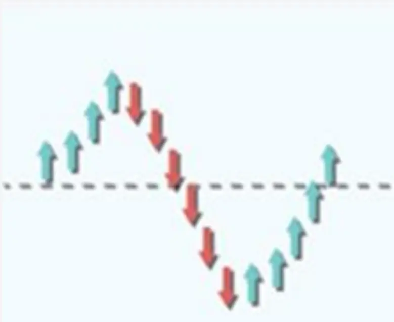

- 传统因子模型中，经常使用历史1个月与3个月的收益率作为反转因子，并且进行月度调仓

1个月反转因子（20档，2007.7.1-2015.6.30）

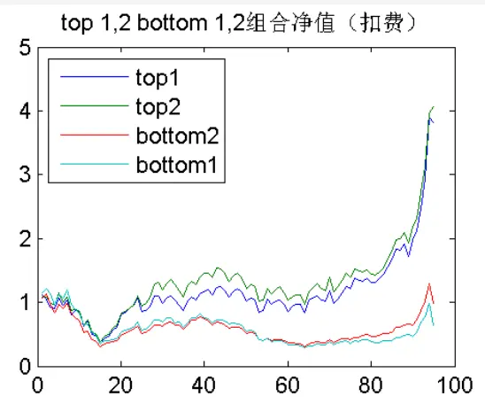

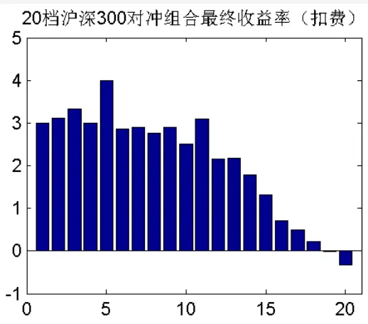

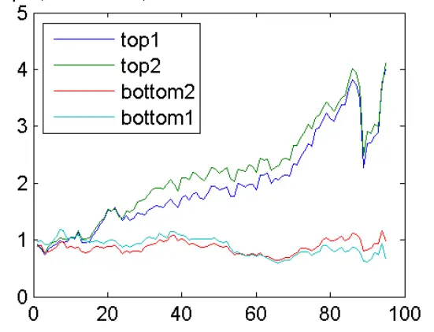
数据来源：广发证券发展研究中心

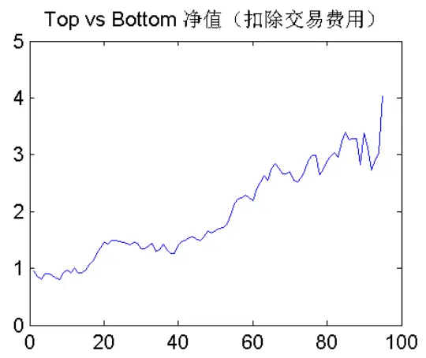

沪深300对冲组合（D1）年化收益19.11%，最大回撤40.63%

Top-Bottom（D1-D20）组合年化收益19.27%，最大回撤20.02%

各档收益单调性一般，特別是Long组合1-10挡收益区分不明显。

历史平均Rank IC-7.01%，IC月胜率67.37%

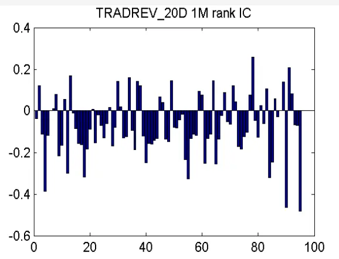

## 3个月反转因子（20档，2007.7.1-2015.6.30）

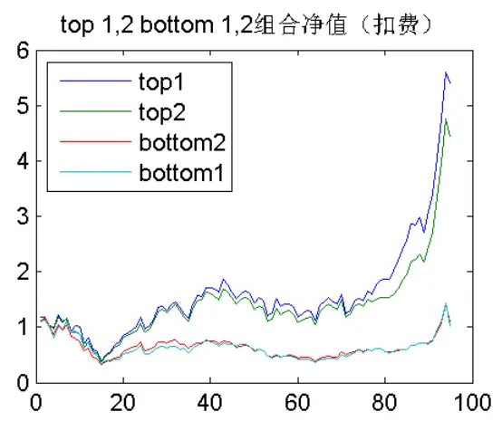

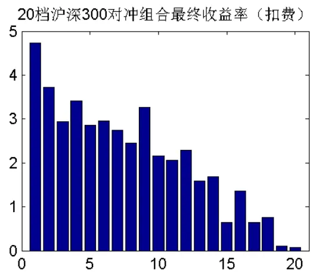

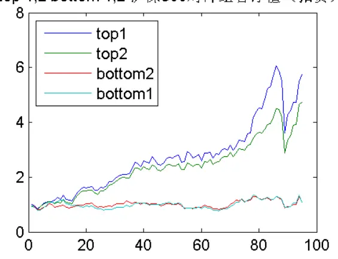

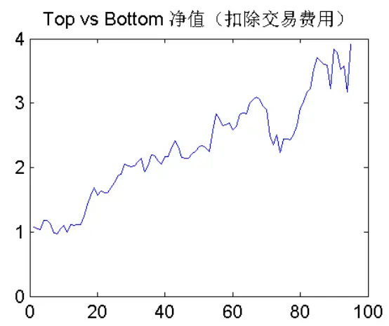

沪深300对冲组合（D1）年化收益21.70%，最大回撤40.56%

Top-Bottom（D1-D20）组合年化收益18.84%，最大回撤27.69%

各档收益单调性比1个月反转因子略好

历史平均Rank IC-6.93%，IC月胜率65.26%

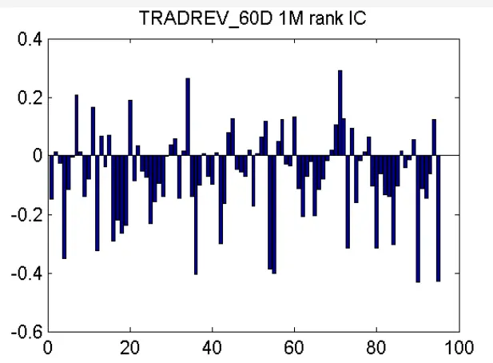

总体而言，以月为频率的反转因子收益尚可，但波动很大，不稳定；Top一般，Bottom组合也无法持续跑输市场

数据来源：广发证券发展研究中心

## 改进思路一：增加换仓次数，缩短持仓时间

- 逻辑上：股价中长线基本面主导，短线层面以资金博弈、短期情绪为主。长期也有反转效应，但更容易受基本面变化影响，前文的测算也说明效果不够稳定

- 从量化角度出发：类比期货交易策略，通过时间维度保证大样本，赚概率钱；反转因子选股，股票只数多+略微提高交易频率，能够保证统计显著性

- 弊端：交易成本可能显著增加

- 需要在收益与交易成本中寻找均衡点

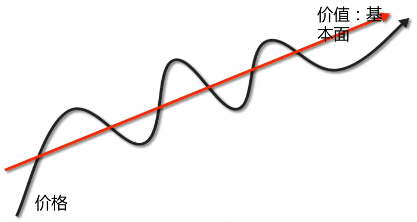

## 寻找传统反转因子的最优参数

## 传统反转因子参数

✓形成期长度：反转的形成时间窗口长度，也即使用历史多久的收益率作为反转因子，传统通常使用1个月、3个月、6个月

✓持有期长度：配置易发生反转的股票后，持有多久。也即组合调仓频率。通常月度

## 寻优方法

√ 测算区间：2007.7.1~2015.7.31日频率

假设形成期为X日（交易日），持有期为Y日，每天计算前X日股票收益率，以及买入持有Y日的收益率，从而计算当日（X，Y）反转因子RankIC（Spearman相关系数），最后计算日平均Rank IC以及avg(RankIC)/std(RankIC)，用以表征该因子有效性以及有效性波动

✓ 交易层面细节：持有期收益率计算时，按次日开盘价买入，Y日后收盘价卖出计算；剔除次日停牌、次日一字涨停及开盘涨幅超过9.5%股票

√ 由于数据量巨大，仅测算X = 1-5, 10, 15, 20, 30, 40, 50, 60日，Y = 1-5, 10, 15,20，两两配对共计96组参数下的平均RankIC

## 传统反转因子参数寻优

| IC | 持有期 |  |  |  |  |  |  |  |  |  |  |
| --- | --- | --- | --- | --- | --- | --- | --- | --- | --- | --- | --- |
| 形成期 |  | 1 | 2 | 3 | 4 | 5 | 10 | 15 |  | 20 |  |
|  | 1 | -0.0020 | -0.0211 | -0.0190 | -0.0168 | -0.0302 | -0.0166 | -0.0102 |  | -0.0105 |  |
|  | 2 | -0.0311 | -0.0427 | 50407 | 00509 | L0.P5P1 | -0.0344 | -0.0257 |  | -0.0264 |  |
|  | 3 | -0.0299 | -0.0426 | -0.0552 | -0.0650 | -0.0692 | -0.0391 | -0.0311 |  | -0.0326 |  |
|  | 4 | -0.0279 | -0.0543 | -0.0672 | -0.0724 | -0.0733 | -0.0423 | -0.0351 |  | -0.0375 |  |
|  | 5 | -0.0429 | -0.066B | -0.0737 | -0.0756 | -0.0746 | -0.0444 | -0.0383 |  | -0.0412 |  |
|  | 10 | -0.0235 | -0.0399 | -0.0455 | -0.0480 | 0.0489 | -0.0354 | -0.0401 |  | -0.0452 |  |
|  | 15 | -0.0146 | -0.0305 | -0.0382 | -0.0430 | -0.0459 | -00458 | 0.0519 |  | -0.0575 |  |
|  | 20 | -0.0154 | -0.0332 | -0.0434 | -0.0498 | -0.053 | -0.0571 | -0.0640 |  | -0.0683 |  |
|  | 30 | -0.0159 | -0.0336 | -0.0447 | -0.0524 | -0.0578 | -0.0657 | -0.0713 |  | -0.0732 |  |
|  | 40 | -0.0148 | -0.0322 | -0.0431 | +0.0502 | -0.0551 | -0.0630 | -0.0685 |  | -0.0708 |  |
|  | 50 | -0.0125 | -0.0284 | -0.0387 | -0.0456 | 0.0506 | -0.0600 | -0.0658 |  | --0.0698 |  |
|  |  | 60 | -0.0122 | -0.0268 | -0.0365 | -0.0434 | -0.0485 | -0.0598 | -0.0661 |  | -0.0678 |
| ICIR |  |  |  |  |  |  |  |  |  |  |  |
|  | 持有期 |  |  |  |  |  |  |  |  |  |  |
| 形成期 |  | 1 | 2 | 3 | 4 | 5 | 10 | 15 |  | 20 |  |
|  | 1 | -0.0153 | -0.1624 | -0.1519 | -0.1389 | -0.2459 | -0.1472 | -0.0940 |  | -0.0999 |  |
|  | 2 | -0.2202 | -0.3137 | 03153 | -0.3998 | -0.4551 | -0.2837 | -0.2217 |  | -0.2355 |  |
|  | 3 | -0.2080 | -0.3082 | -0.4176 | -0.4917 | -0.5210 | -0.3118 | -0.2574 |  | -0.2801 |  |
|  | 4 | -0.1916 | -0.387b | -0.4903 | -0.5320 | -0.5384 | -0.3281 | -0.2832 |  | -0.3126 |  |
|  | 5 | -0.2863 | -0.454b | -0.5256 | -0.5427 | -0.5380 | -0.3384 | -0.3038 |  | -0.3377 |  |
|  | 10 | -0.1533 | -0.2630 | -0.3091 | -0.3323 | -0.3410 | -0.2595 | -0.3014 |  | -0.3474 |  |
|  | 15 | -0.0938 | -0.1948 | -0.2502 | -0.2868 | -0.3081 | 0.3207 | -0.3754 |  | 0.4212 |  |
|  | 20 | -0.0993 | -0.2106 | -0.2795 | -0.3266 | -0.3553 | -0.3939 | -0.4536 |  | -0.4839 |  |
|  | 30 | -0.1036 | -0.2131 | -0.2859 | -0.3393 | -0.3771 | -0.4398 | -0.4789 |  | -0.4910 |  |
|  | 40 | -0.0979 | -0.2046 | -0.2722 | -0.3164 | -0.3474 | -0.4036 |  | -0.4443 | -0.4587 |  |
|  | 50 | -0.0845 | -0.1827 | -0.2453 | -0.2883 | -0.3191 | -0.3845 |  | -0.4288 | -0.4534 |  |
|  | 60 | -0.0830 | -0.1730 | -0.2329 | -0.2753 | -0.3071 | -0.3836 |  | -0.4289 | -0.4353 |  |

数据来源：广发证券发展研究中心

长期反转因子以30天形成期、20天持有期最强（avg RankIC = -7.32% )

短期反转因子以5天形成期、4天持有期最强（avg Rank IC= -7.56% )

- 相比长期反转因子，短形成/持有期的反转因子略胜一筹

- 不同形成期反转因子的有效性衰减非常有规律，呈现一定的单调性，譬如：X=5，第一天IC最强，随后日IC逐步衰减，到第五天累计IC最高，长期持有效果变差

对于相同的持有期，不同形成期IC也有规律：Y=5,5天反转最強

## 5日反转因子效果（持有期5日）

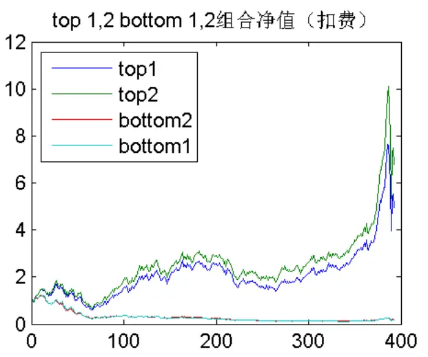

top 1,2 bottom 1,2 沪深300对冲组合净值（扣费）
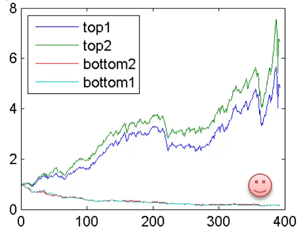
数据来源：广发证券发展研究中心

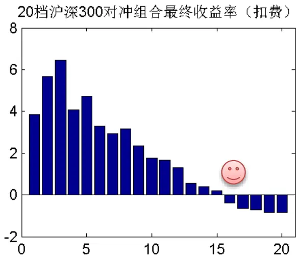

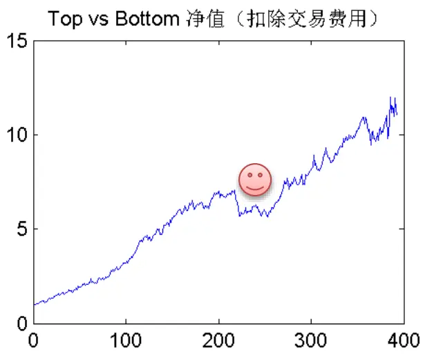

沪深300对冲组合（D1）年化收益23.21%，最大回撤30.32%

Top-Bottom（D1-D20）组合年化收益37.41%，最大回撤19.70%

- 3-20档收益单调性明显

历史平均Rank IC-7.87%，IC胜率73.03%

相比1月、3月反转因子，D1、D1-D20组合收益率、回撤均有显著提升

D1组合（超跌反弹）回撤情况改善 明显

D20组合（超涨回调）从无效变为有效！

- 从而，Top-Bottom提升明显！

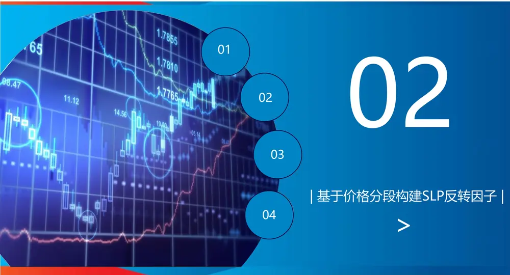

## 改进思路二：动态时间窗口，加入拐点界定

- 传统反转因子中，将固定时间窗口作为反转形成期，以此衡量反转力度。

但更微观地来看，不同股票在同一时间窗口中走势不尽相同，即使同一时间窗口中涨跌幅相同，由于窗口内走势不同，导致反转力度不同

## 传统反转因子使用固定时间窗口，无法甄别窗口内走势

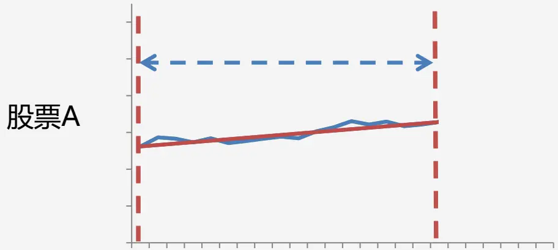

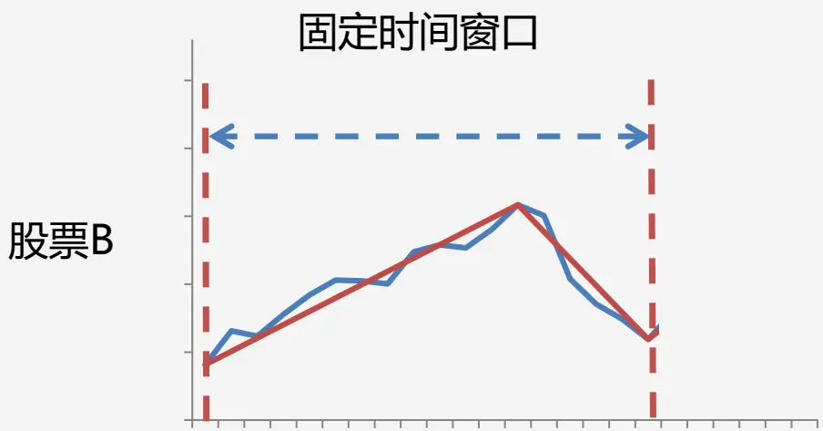

同一时间窗口内，涨跌幅几乎同为0，但期间价格的走势截然不同

股票A走势平缓，窄幅盘整，反转 需求不明显

股票B波动明显，区间尾部一段急跌，有较强的反转效应

后续反转效应强弱的判断需要更加精准地把握窗口内拐点
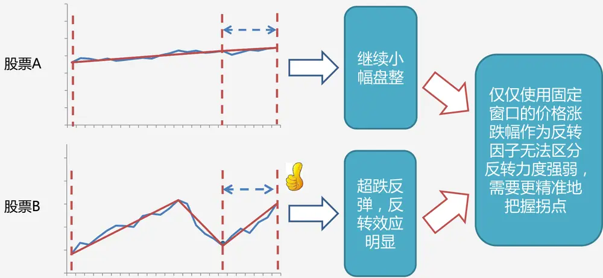
怎么做？对价格分段，动态窗口，识别拐点

价格分段递推算法

给定当前已经确认一个的拐点A，以及A点之后一个待确认的拐点B；

假设A、B两点之间的涨跌幅为 $\overline{{R_{AB_{i}}}}$ 如果B点以后存在一个点C使得 $\left|R_{BC}\right|>\left|R_{AB}\right|\times\delta_{P}$ 其中δ为比例参数

确认点B为一个拐点，同时称点C为拐点B的确认点

## 示例

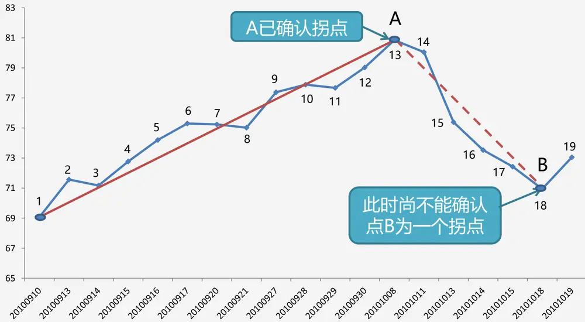

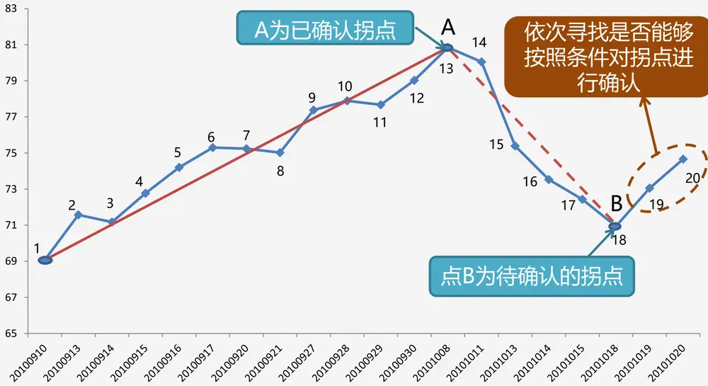

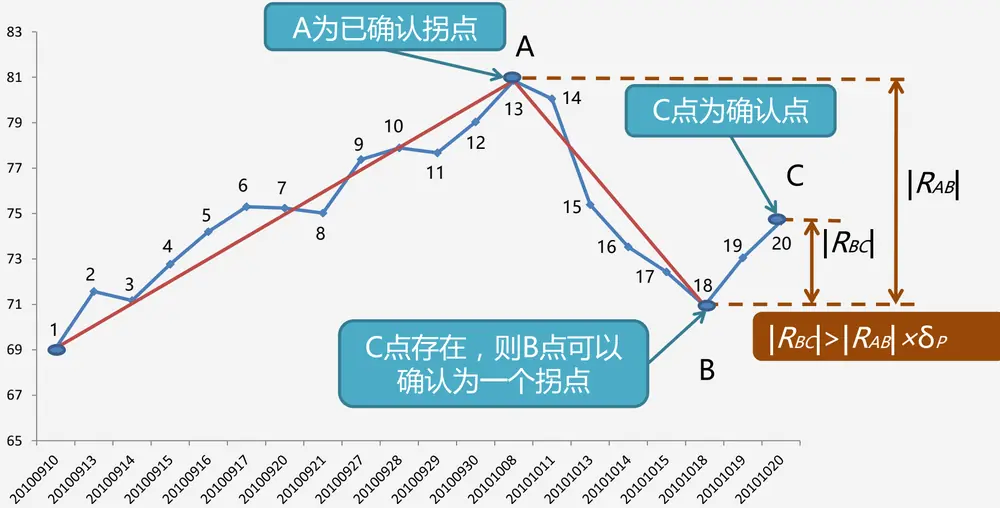

## 分段示例

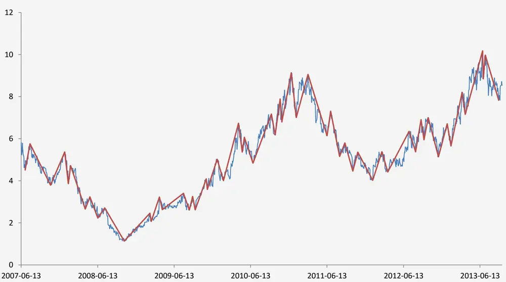

## SLP因子值定义

- 计算当前价位与最近拐点的斜率

- 斜率负向值越大的股票，下跌速度越快，抓超跌反弹，做多

- 斜率正向值越大的股票，上涨速度越快，抓超涨回调，做空

- 在横截面上进行股票对比，选取相对因子值较小的

SLP因子值定义：量纲调整在点16处已经确认A为一个拐点，在T日（今日）找出离T日最近拐点A,计算点A与B之间的斜率

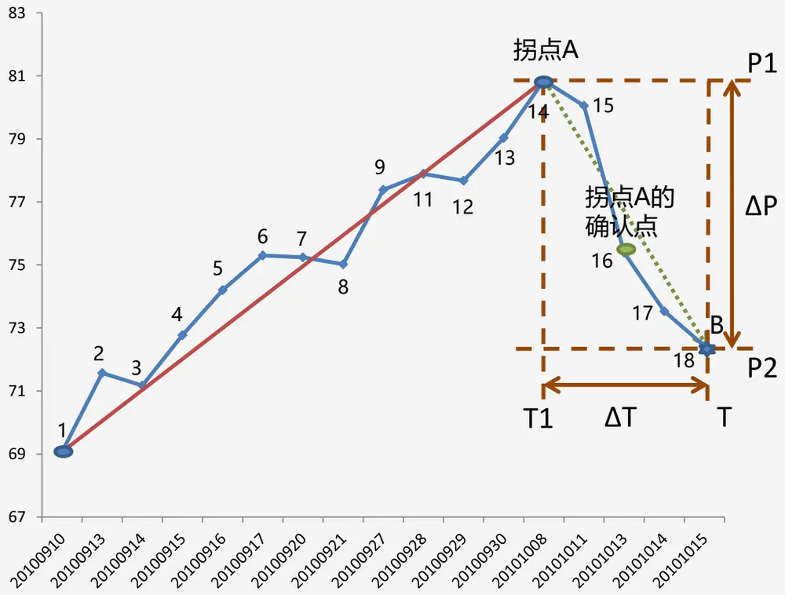

计算SLP因子时如果简单的ΔP/∆T显然很不合理：如果ΔT相同，这样会导致高价股票斜率绝对值很大低价股票斜率绝对值很小

用涨跌幅定义斜率因子$\mathsf{SLP}{=}\left|\mathsf{P2}{-}\mathsf{P1}\right|/(\mathsf{P1}^{\star}\Delta\mathsf{T})$ 可以有效避免股票价格绝对值的差异带来的不合理

SLP因子值每日更新监测

更新收盘价数据，提取每只股票最近拐点至当日的行情走势

利用分段规则，检验是否能够确认产生新的拐点

利用当前价与最近拐点价、之间间隔交易日数，计算SLP因子值

## SLP因子值范围

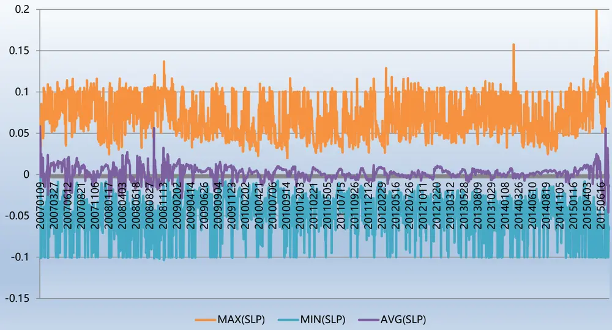
SLP因子值基本在-0.1~0.1波动

## SLP因子衰减情况

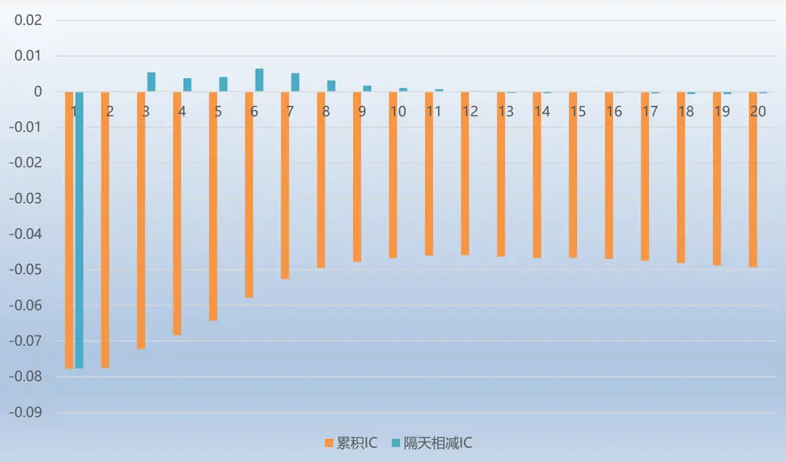
• 类似前文，计算SLP与后续N日涨跌幅（次日开盘买，N日收盘卖）RankIC平均值

- SLP因子衰减速率较快，T+1 Alpha非常显著

衡量SLP因子换手率：Lagged CORR

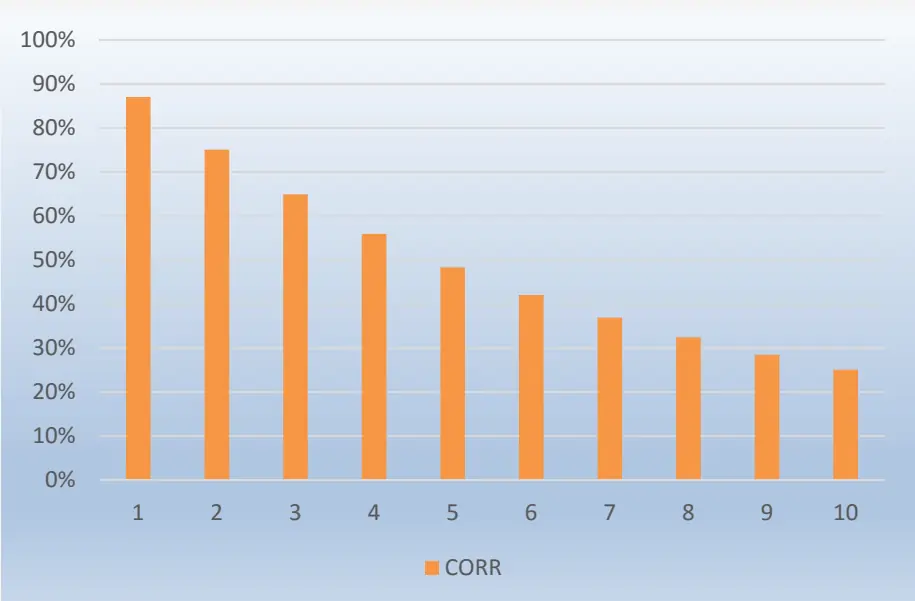

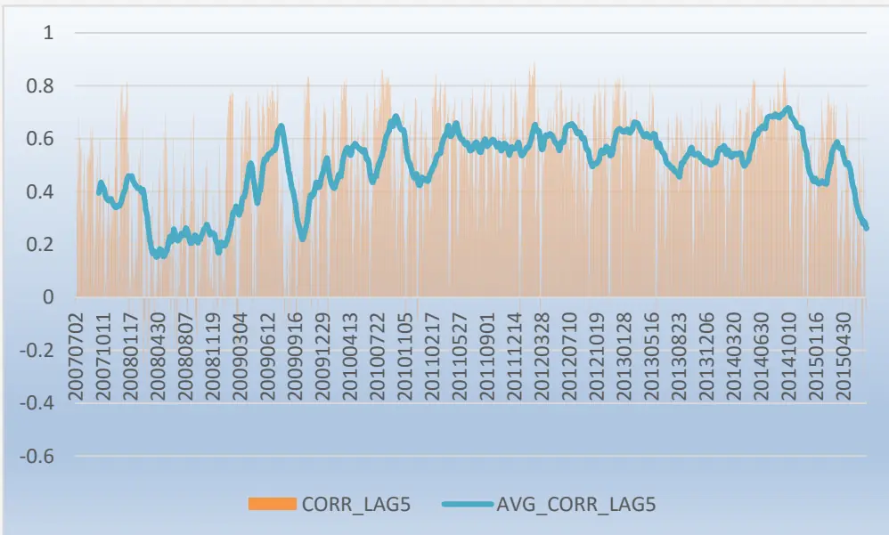

- 计算SLP与N日后SLP值的Spearman相关系数，值越大表示可能造成的换手率越低

- T+1相关系数87%，T+5就衰减到48%，说明股票根据SLP排序变动还是比较大的

- 权衡SLP因子IC衰减速率、LaggedCorr，使用5天作为换手周期

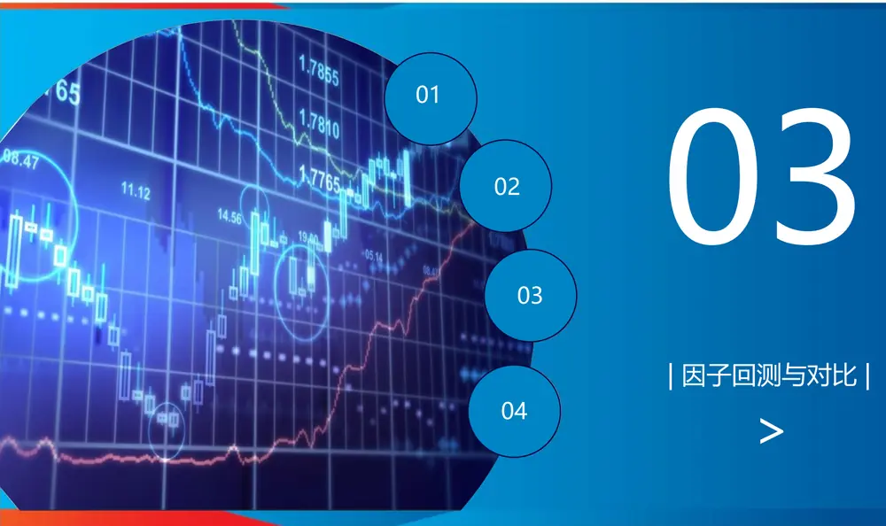

## 因子回测参数：

- 回测区间：20070701－20150721

- 股票池：全市场股票

- 剔除处理：次日一字板、开盘涨幅超过9.5%涨跌幅、次日停 牌的股票

- 交易价格：次日开盘价买入，5日后收盘价卖出

- 对冲标的：沪深300、中证500、中证800指数

- 档位：20档

- 股票权重：等权，无中性化处理

- 交易费用：0.3%

考虑到组合换手较为频繁，从股票剔除处理、交易价格等方面对策略进行了更为细致的测算

- 当天收盘后，计算SLP因子值

- 将SLP因子值排序最小的5%股票作为TOP组合，并用基准指数进行对冲

- 次日开盘买入，持有5天后收盘卖出

## SLP反转因子效果：收益提升明显！

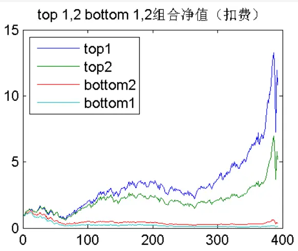

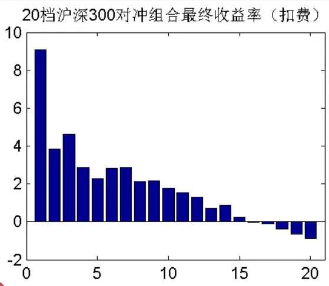

top 1,2 bottom 1,2 沪深300对冲组合净值（扣费）

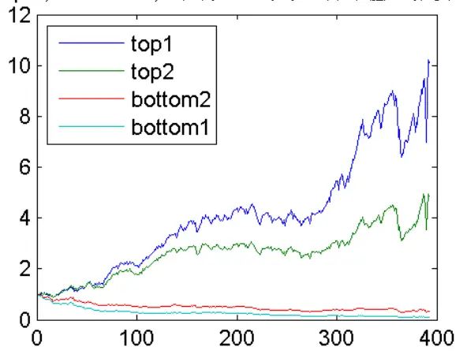
数据来源：广发证券发展研究中心

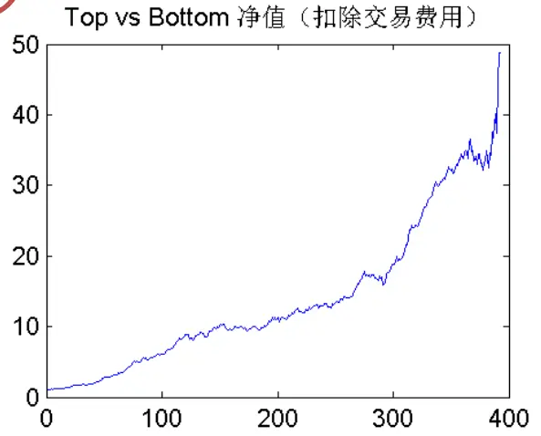

沪深300对冲组合（D1）年化收益35.79%，最大回撤29.39%

- Top-Bottom（D1-D20）组合年化收益67.24%，最大回撤11.93%

- 20档收益单调性明显

历史平均Rank IC-6.42%，IC胜率71.25%

相比传统反转因子收益率、回撤均大幅改善！

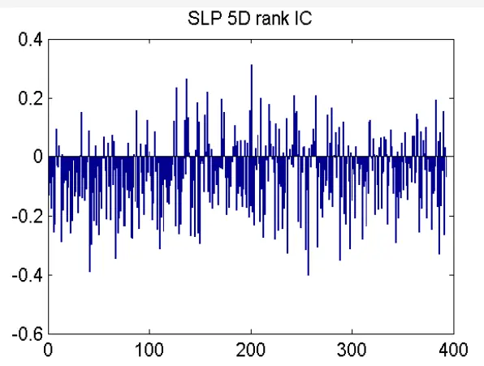

## 使用不同基准指数对冲SLP因子TOP组合

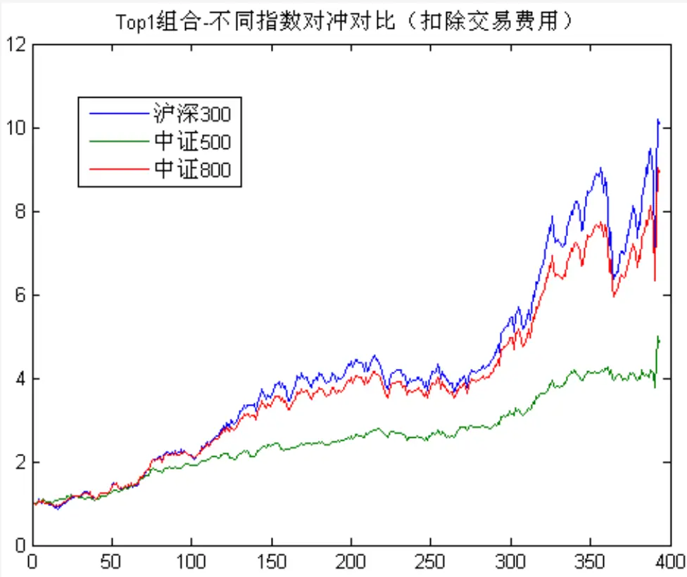
数据来源：广发证券发展研究中心

|  | 沪深300 | 中证500 | 中证800 |
| --- | --- | --- | --- |
| 年化收益 | 35.79% | 23.32% | 33.57% |
| 最大回撤 | 29.39% | 11.48% | 23.14% |
| 收益回撤比 | 1.22 | 2.03 | 1.45 |

- 沪深300对冲组合收益最高，是中证500对冲组合的2倍，但回撤也较大

中证800对冲组合收益略不如沪深300对冲，回撤也略小

中证500对冲组合最为稳定，收益回撤比最优

- 沪深300、中证800指数结构化明显，现 货组合以小股票为主，对冲效果较差

## SLP因子组合年度统计

| 沪深300对冲 | 年化收益 | 年最大回撤年化波动率 |  | IR |
| --- | --- | --- | --- | --- |
| 2007.7.1~ | 15.24% | 20.16% | 28.97% | 0.53 |
| 2008 | 76.33% | 14.58% | 29.25% | 2.61 |
| 2009 | 42.05% | 10.26% | 19.52% | 2.15 |
| 2010 | 39.61% | 11.70% | 20.88% | 1.90 |
| 2011 | -3.15% | 13.95% | 17.63% | -0.18 |
| 2012 | 1.16% | 15.05% | 21.11% | 0.06 |
| 2013 | 58.84% | 9.36% | 23.83% | 2.47 |
| 2014 | 4.43% | 29.39% | 27.18% | 0.16 |
| ~2015.7.28 | 54.19% | 26.48% | 57.69% | 0.94 |
| 合计 | 35.79% | 29.39% | 27.28% | 1.31 |

| 中证500对冲 | 年化收益 | 年最大回撤年化波动率 |  | IR |
| --- | --- | --- | --- | --- |
| 2007.7.1~ | 18.96% | 7.97% | 14.93% | 1.27 |
| 2008 | 53.19% | 9.98% | 15.20% | 3.50 |
| 2009 | 20.29% | 4.78% | 8.83% | 2.30 |
| 2010 | 11.76% | 7.78% | 12.04% | 0.98 |
| 2011 | 8.33% | 4.63% | 9.83% | 0.85 |
| 2012 | 6.69% | 7.74% | 12.80% | 0.52 |
| 2013 | 24.42% | 5.63% | 13.67% | 1.79 |
| 2014 | 14.58% | 7.24% | 12.57% | 1.16 |
| ~2015.7.28 | 20.75% | 10.36% | 35.67% | 0.58 |
| 合计 | 23.32% | 11.48% | 15.19% | 1.54 |

| 中证800对冲 | 年化收益 | 年最大回撤年化波动率 |  | IR |
| --- | --- | --- | --- | --- |
| 2007.7.1~ | 16.91% | 15.72% | 24.47% | 0.69 |
| 2008 | 72.91% | 11.94% | 24.86% | 2.93 |
| 2009 | 37.70% | 7.46% | 16.18% | 2.33 |
| 2010 | 32.80% | 9.53% | 17.19% | 1.91 |
| 2011 | -0.19% | 11.50% | 15.29% | -0.01 |
| 2012 | 2.61% | 12.86% | 18.87% | 0.14 |
| 2013 | 50.04% | 8.20% | 20.92% | 2.39 |
| 2014 | 7.69% | 23.14% | 22.66% | 0.34 |
| ~2015.7.28 | 45.70% | 21.80% | 50.41% | 0.91 |
| 合计 | 33.57% | 23.14% | 23.41% | 1.43 |

| TOP-BOT | 年化收益 | 年最大回撤年化波动率 |  | IR |
| --- | --- | --- | --- | --- |
| 2007.7.1~ | 73.58% | 6.01% | 19.95% | 3.69 |
| 2008 | 184.71% | 5.09% | 24.09% | 7.67 |
| 2009 | 78.20% | 7.87% | 16.17% | 4.84 |
| 2010 | 12.08% | 8.03% | 17.04% | 0.71 |
| 2011 | 21.84% | 5.70% | 15.75% | 1.39 |
| 2012 | 32.95% | 5.16% | 13.90% | 2.37 |
| 2013 | 50.74% | 10.56% | 17.92% | 2.83 |
| 2014 | 50.16% | 3.18% | 11.94% | 4.20 |
| ~2015.7.28 | 34.68% | 11.93% | 39.88% | 0.87 |
| 合计 | 67.24% | 11.93% | 20.01% | 3.36 |

SLP反转因子用中证500对冲效果更加，TOP-BOTTOM效果最好
数据来源：广发证券发展研究中心

## 历史每档股票数量

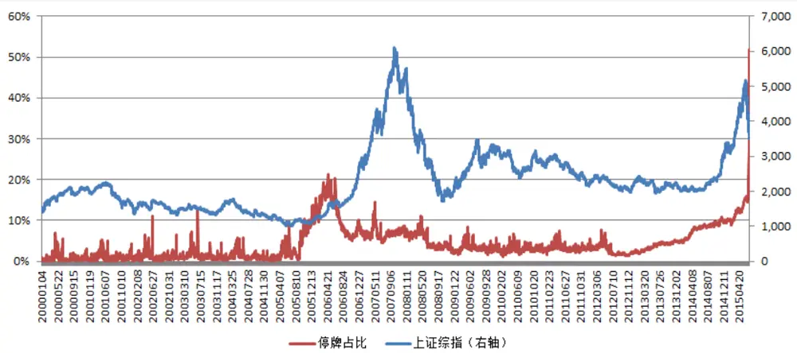

随着市场总体股票数量上升，每档股票现货数量随之增加

- 2015年七月初遭遇史上最大停牌潮，可配置股票数量骤減

- 2010年以来，组合股票数量在100以上，保证组合分散度

每档股票数量
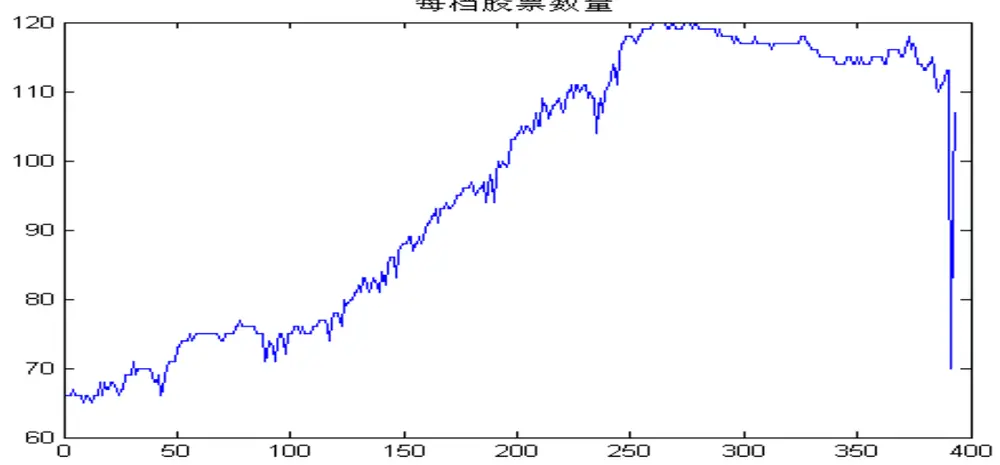
数据来源：广发证券发展研究中心

## SLP因子BOTTOM组合（超涨回调）同样优秀

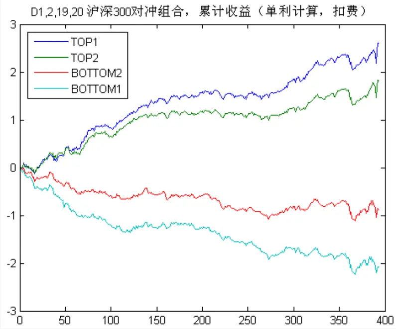

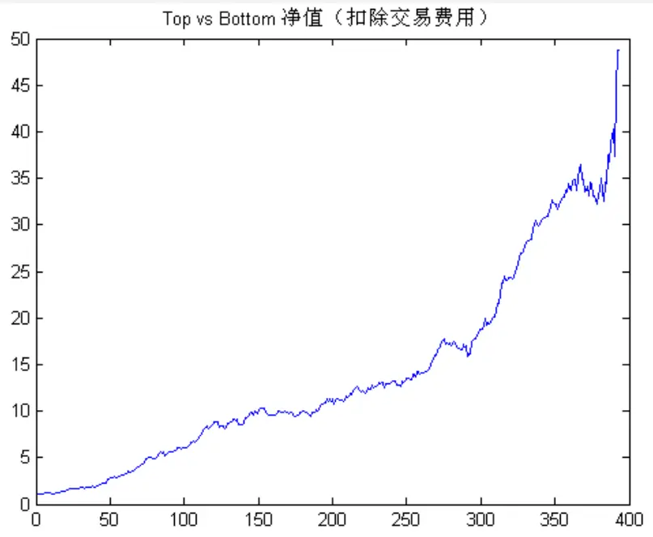

## SLP反转因子与传统5日反转因子对比

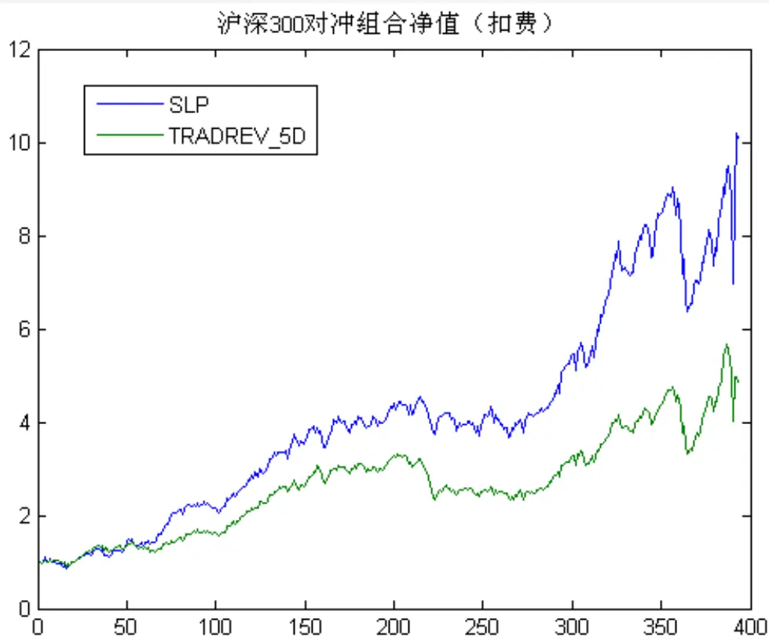

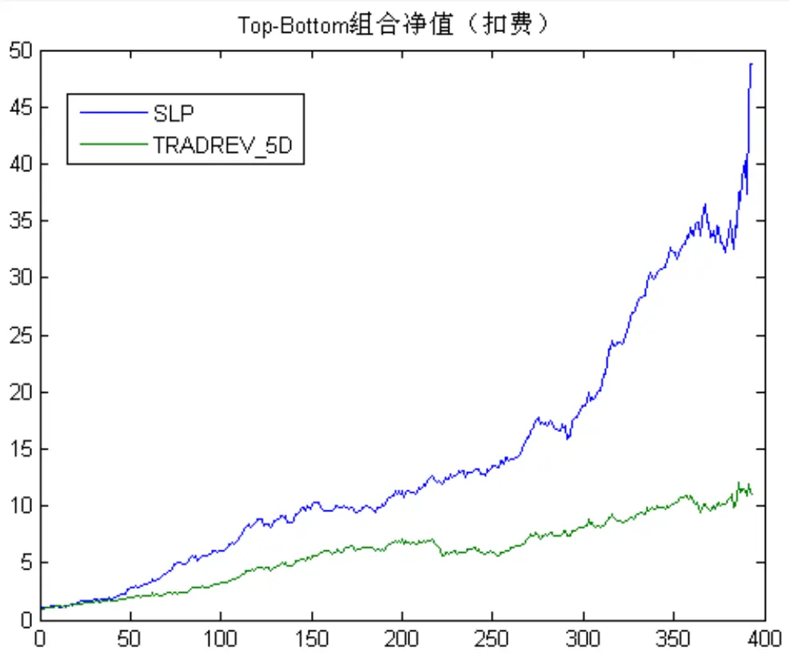

| 年化收益 | SLP | TRADRE V 5D |
| --- | --- | --- |
| Top- HS300 | 35.79% | 23.21% |
| Top- Bottom | 67.24% | 37.41% |

| 最大回撤 | SLP | TRADRE V 5D |
| --- | --- | --- |
| Top- HS300 | 29.39% | 30.32% |
| Top- Bottom | 11.93% | 19.70% |

数据来源：广发证券发展研究中心

SLP反转因子相比固定窗口的传统5日因子，提升效果显著！

## SLP反转因子换手分析

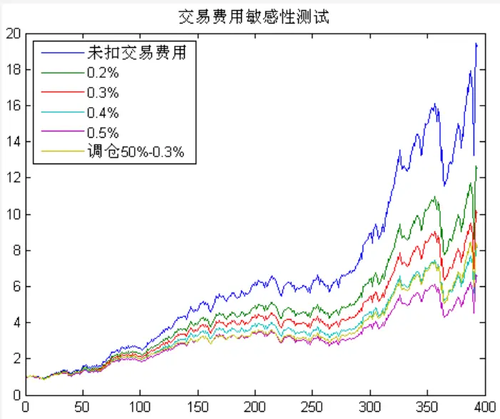

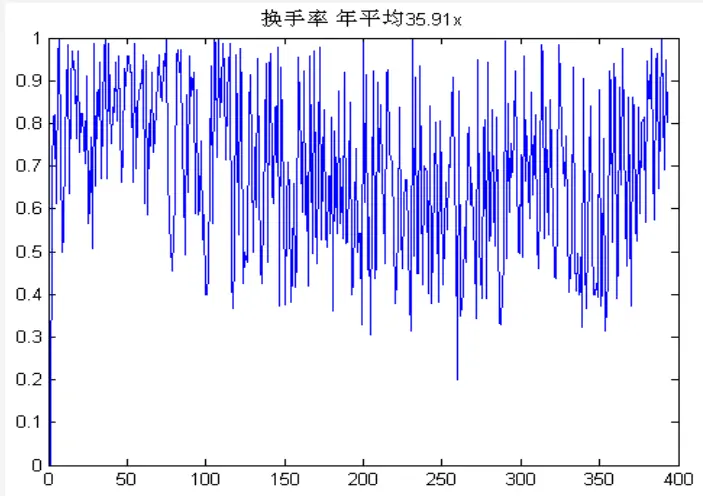
数据来源：广发证券发展研究中心

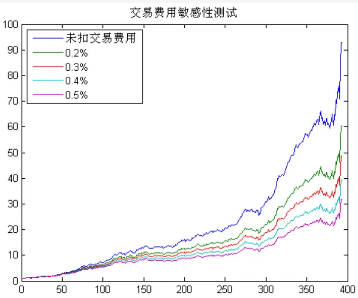

|  | 0% | 0.20% | 0.30% | 0.40% | 0.50% | 调仓50%, 0.3% |
| --- | --- | --- | --- | --- | --- | --- |
| 年化收益 | 47.92% | 39.72% | 35.79% | 31.97% | 28.26% | 32.12% |
| 最大回撤 | 28.22% | 29.00% | 29.39% | 29.77% | 30.15% | 31.24% |
| 收益回撤比 | 1.70 | 1.37 | 1.22 | 1.07 | 0.94 | 1.03 |

• 策略对交易成本较为敏感，换手率较高

- 亦可使用类似缓冲区原则，每次卖出排名后50%的股票，只换仓一半

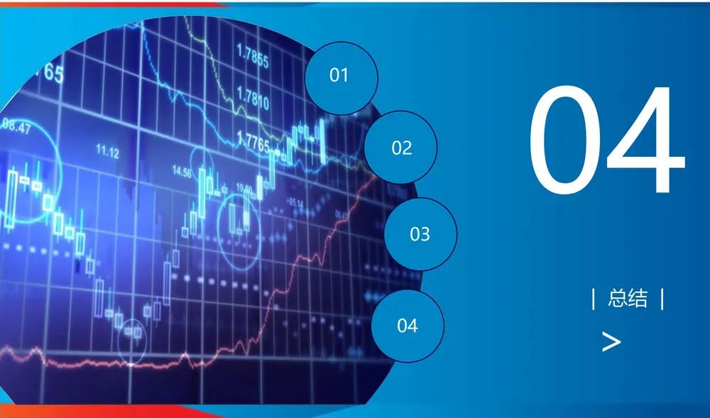

结合基本面：当个股受坏消息影响时，容易表现为趋势，投资者过度反应。这时候如果下注博反弹，容易造成较大损失。如何设置“黑名单

继续优化分段方法，如何区分“盘整行情

- 在价格分段基础上，考虑交易量的影响

- 更细致地挖掘表征反转的形态.....

## 风险提示

上述策略基于指标的历史数据统计分析，不作为股票推荐，仅供参考。

## 免责声明

广发证券股份有限公司具备证券投资咨询业务资格。本报告所载资料的来源及观点的出处皆被广发证券股份有限公司认为可靠，但广发证券不对其准确性或完整性做出任何保证。报告内容仅供参考，报告中的信息或所表达观点不构成所涉证券买卖的出价或询价。广发证券不对因使用本报告的内容而引致的损失承担任何责任，除非法律法规有明确规定。客户不应以本报告取代其独立判断或仅根据本报告做出决策。

广发证券可发出其它与本报告所载信息不一致及有不同结论的报告。本报告反映研究人员的不同观点、见解及分析方法，并不代表广发证券或其附属机构的立场。报告所载资料、意见及推测仅反映研究人员于发出本报告当日的判断，可随时更改且不予通告。

本报告旨在发送给广发证券的特定客户及其它专业人士。未经广发证券事先书面许可，任何机构或个人不得以任何形式翻版、复制、刊登、转载和引用，否则由此造成的一切不良后果及法律责任由私自翻版、复制、刊登、转载和引用者承担。

## Thanks!

## 谢谢

地址:广州市天河北路183号大都会广场 P.C.510075 电话: 020-87555888 传真: 020-87553600 WWW.GF.COM.CN