# Table_Title 牛股归因下的风格动量策略

## ——多因子 Alpha 系列报告之（二十六）

## Table_Sum ary报告摘要 ：

## 风格轮动下的收益机会

风格动量的投资备受市场关注，当行业内风格形成之时，投资者更容易把握未来的上涨趋势，从而通过合理配置个股将带来超额收益。

## 寻找牛股，捕捉风格动量

风格轮动频繁，风格动量的及时捕捉成为获取超额收益的关键。我们站在行业的角度，使用牛股归因的方法来监测风格的轮动：在一个时间段内，如果行业中的那些最牛个股均在某个风格下表现出一致的特点，那我们有理由推测该风格的形成。

## 规避个股追高，捕捉反转收益

行业内已形成较为稳定的风格后，由于个股动量反转更为频繁，收益存在明显滞后性，我们仍不能直接配置目前表现的最优个股。之前的研究表明，具有相同风格的个股在价格走势上具有趋同的性质，我们将超配那些仍有上涨空间的个股，获取风格内的稳定收益。

## 实证结果

单风格因子策略对每个风格因子进行了测算，从回测结果来看，流通市值、PB、ROE和长期资本负债率等风格因子能够获得较好的收益，为多风格因子策略提供了有效的风格因子。

多风格因子(不同行业相同因子)策略利用了上述四个因子，回测结果来看，平均年化收益率达到了 17.58%，而最大回撤却仅有11.01%，胜率也达到了 54.62%，持仓率为99.59%。从策略分年度表现来看，除 2016 年初效果甚微，其余年份收益率较高，大部分超过了10%。

多风格因子(分行业选因子)策略则利用每个行业内表现最好的四个因子，平均年化收益率达到了 28.56%，最大回撤却仅有 11.41%，胜率达到了56.18%，持仓率同样为99.59%。从分年度表现来看，除 2016 年初表现不佳，大多数年份超额收益率达到 15%以上，2015 年更是达到了111.83%。

## 核心风险

本模型采用量化的手段，未必符合当时的宏观环境，请结合自身判断进行恰当使用。

多风格因子策略(不同行业相同因子)总表现
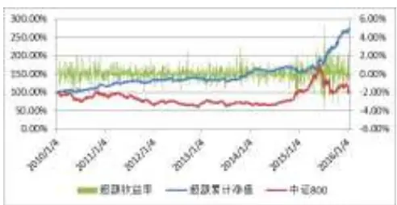
多风格因子策略(不同行业相同因子)年表现

| 时间 | 超额收益 | 胜率 | 最大回撤 |
| --- | --- | --- | --- |
| 2010年 | 18.61% | 54.47% | 8.20% |
| 2011年 | 16.24% | 54.10% | 6.48% |
| 2012年 | 1.67% | 52.67% | 5.83% |
| 2013年 | 13.04% | 56.30% | 7.40% |
| 2014年 | 0.13% | 51.43% | 10.03% |
| 2015年 | 75.97% | 59.84% | 9.03% |
| 2016年 (1.20) | 0.84% | 33.33% | 2.32% |

多风格因子策略(分行业选因子)总体表现
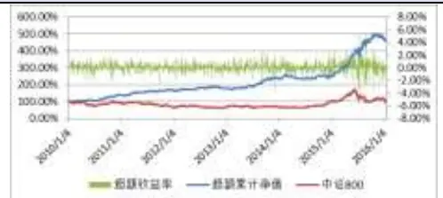
多风格因子策略(分行业选因子)年度表现

| 时间 | 超额收益 | 胜率 | 最大回撤 |
| --- | --- | --- | --- |
| 2010年 | 41.17% | 59.57% | 5.25% |
| 2011年 | 19.03% | 54.51% | 4.30% |
| 2012年 | 8.19% | 53.50% | 7.47% |
| 2013年 | 34.41% | 56.72% | 5.40% |
| 2014年 | 4.83% | 50.61% | 11.27% |
| 2015年 | 97.37% | 63.18% | 10.93% |
| 2016年 (1.20) | -3.49% | 41.67% | 3.83% |

Table_Aut hor 分析师： 史庆盛 S0260513070004

公020-87577060

sqs@gf.com.cn

## Table_Rep相关研究：

《笑看北雁南飞南燕北归——多因子ALPHA系列报告之(十九)》

《基于风格回复的多因子动态调仓策略——多因子 ALPHA系列报告之(二十)》

## 一、 前言

近年来，股市中各行业形成较为独立的涨跌机制，个股与同行业其他个股之间的涨跌趋势息息相关。经常出现某个行业内具有某个共同特点的个股的涨幅远远高于其他个股，这个共同特点可称之为风格。在《基于风格回复的多因子动态调仓策略——多因子ALPHA系列报告之(二十)》中，我们察觉到因子出现极端的变化导致风格偏移时，及时地对特定因子特征减弱的失效股票进行调整可以获得特征增强的新股票补涨的收益。这使我们认识到，股票的涨跌会随着风格的偏移而发生变化，当行业内形成稳定的风格偏移后，具有该风格的股票具有较大的上涨空间。同时，在《笑看北雁南飞南燕北归——多因子ALPHA系列报告之(十九)》中，我们观测到多因子综合打分相近的股票在价格走势上具有趋同的性质，当两只打分相近的股票价差拉大到一定程度时，趋同特征将占据主导，使得两只股票价差逐渐回归。在之前的研究中，我们认识到风格偏移和趋同特征能够给我们带来额外的获利空间，这也给我们一个启示，若我们能够更加及时发现风格偏移现象，并利用趋同特征选择上涨空间较大的个股是否能够带来更大的收益呢？但行业内的风格切换具有风格难确定、切换速度快，持续时间不固定等特点，这也加大了市场操作的难度。

从低频的角度来说，2009年小盘股持续跑赢沪深300指数，而2011年大盘股的跌幅却远远小于沪深300，这就是明显的风格转移案例。在较高频中存在同样的现象，且风格转移频率更快。例如：2014年3月3日化工行业（申万一级）中，市净率较小的个股在5天内的涨幅明显高于市净率较大的个股；而到2014年3月12日，这种现象却消失不见，转变成长期资本负债率较小的个股在5天内的涨幅明显高于长期资本负债率较大的个股。所以，从高频的角度来说，行业内的风格轮动更加频繁、快速。同时也是由于这种风格轮动现象的存在，给我们创造了一定的风格“套利”空间。如何及时发现风格转移现象、选择合适的入场时机成为了投资者十分关心的问题。

## 二、策略思想

前面我们简单介绍了股市中的风格轮动现象，这一节我们介绍利用风格轮动现象获取超额收益的方法。

投资者由于受到心理因素的影响而明显具有某些非理性行为特征，这是难以用传统投资决策理论去解释的，这一现象我们在《捕捉羊群效应下的行业轮动机会——行为金融投资策略专题之（一）》已经进行过讨论。行业内某个特定风格的个股均发生较大幅度的上涨时，受不理性行为的影响，会有更多投资者投资于该风格的个股。然而，在该风格成为行业当前的投资热点后，根据趋同特征，个股动量的反转将会发生，涨幅已处于较高水平的个股再次上涨的可能性较小，而那些具有该风格且尚未上涨的个股就会成为投资的热门，因此这类股票具备较大的上涨空间。本篇报告的重点就是判断行业是否形成了稳定的风格偏移、超配尚未上涨的风格个股。接下来，我们将会从一个具体案例介绍本篇报告的思想。

2014年12月3日电子行业（申万一级行业分类），我们把该行业的个股按照“5天内长期资本负债率均值”从小到大的顺序进行排序，顺序记为A；再按照“5天的收益率”从大到小的顺序进行排序，顺序记为B。从下图可以看出，A的前20%(长期资本负债率较小的个股，下图黄色部分)与B的前20%(收益率较大的个股，下图右侧排序)中无重叠，而A的后20%(长期资本负债率较大的个股，下图绿色部分)却与B的前20%(收益率较大的个股)有43%的重复个股(下图红色部分)，也就是说，长期资本负债率较大的个股的收益率远远大于长期资本负债率较小的个股的收益率。

图 1 策略思想——选股思想
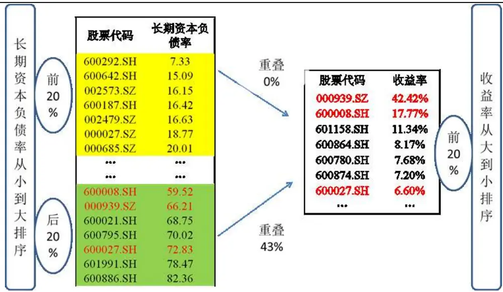
数据来源：广发证券发展研究中心、Wind资讯金融终端

这时我们认为电子行业产生了稳定的风格，投资者主要投资于长期资本负债率较大的个股，我们有理由相信那些长期资本负债率较大且尚未上涨的个股具有较大的上涨空间。去除涨跌停和停牌股之后，我们超配“600021.SH”和“600886.SH”这两只长期资本负债率较大的个股，看其是否能够给我们带来超额收益。

图 2 策略思想——600021.SH(上海电力)走势
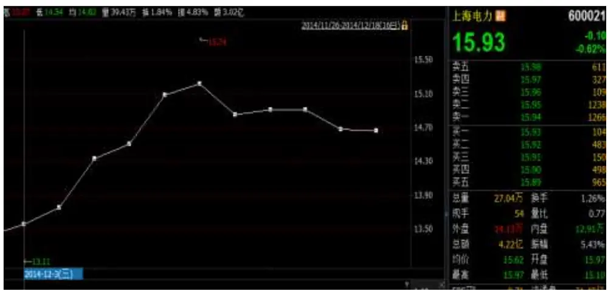
数据来源：广发证券发展研究中心、Wind资讯金融终端

图 3 策略思想——600886.SH(国投电力)走势
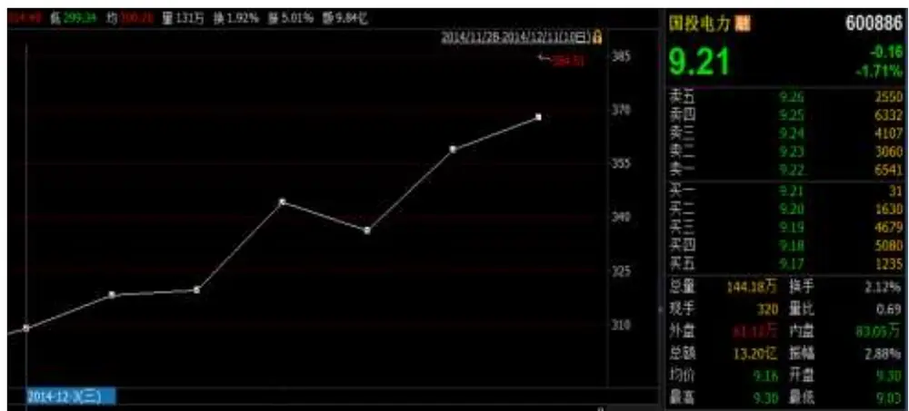
数据来源：广发证券发展研究中心、Wind资讯金融终端

图 4 策略思想——000906.SH(中证800指数)走势
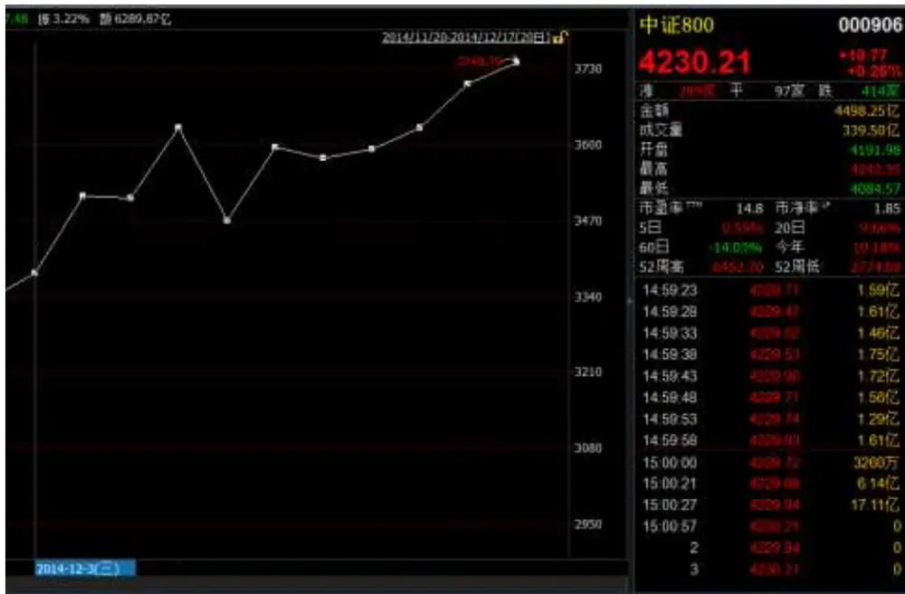
数据来源：广发证券发展研究中心、Wind资讯金融终端

上面三幅图中的白点代表当日收盘价(后复权)，可以明显的看出“600021.SH”和“600886.SH”两只股票在一周内的涨幅明显超过了中证800指数。我们对收益率进行了统计，得到了下图。

图 5 策略思想——超配组合收益

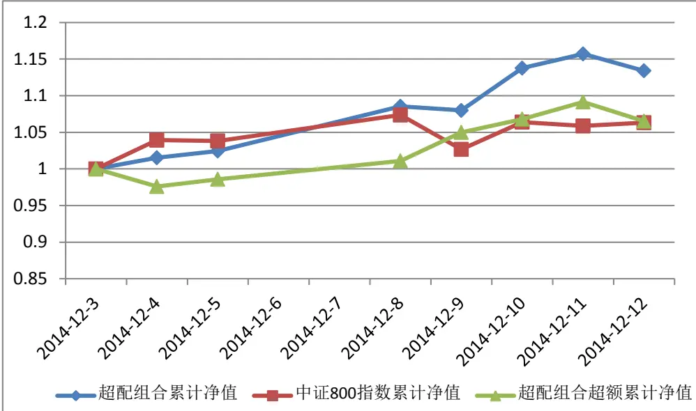
数据来源：广发证券发展研究中心、Wind资讯金融终端

从上图中可以看出，超配组合在开仓之后的第一天发生了小幅回撤、然后接连五天获得了大量的超额收益(对中证800指数)，接着第七天开始发生回撤。说明在短期持仓的情况下，风格轮动策略能够给我们带来一定的收益，但若持仓时间过长，风格发生了改变或趋于不明显，则策略的收益将会受到影响，也说明了持仓时间是我们策略的重点之一。

从上面的案例中可以看出该策略最核心的问题是：1、如何判断行业是否产生了稳定的风格。2、根据什么规则判断个股是否具有较大的上涨空间。3、选择合适的持仓时间，降低风格发生转移带来的损失。接下来，我们将会介绍策略的主要构建过程。

## 三、单风格因子策略

## 3.1 单风格因子选择

流动性因子、规模因子、盈利因子、质量因子、估值因子和其他因子等常被用作风格因子，例如某个时刻行业内着重投资小市值股、低估值股等。本篇报告同样从这几个方面选取风格因子，选择了26个因子作为我们的风格因子。

表 1 单风格因子选择

| 风格因子 | 因子明细 | 方向 |
| --- | --- | --- |
| 流动性因子 | 成交量、成交额、换手率、换手率(自由流通) | 不定 |
| 规模因子 | 总市值、总市值(证监会)、流通市值、自由流通市值 | 不定 |
| 估值因子 | PE、PB、PS、PCF | 负 |
| 盈利因子 | ROE、ROA、每股营业收入、每股净资产、每股收益、营业总收入、销售净利率 | 正 |
| 质量因子 | 主营业务比率、资产负债率、长期资本负债率、存货周转率 | 不定 |
| 其它因子 | 收盘价、涨跌幅、振幅 | 不定 |

数据来源：广发证券发展研究中心、Wind资讯金融终端

需要注意的是，在利用风格因子之前，我们需要对因子的方向进行讨论。估值因子代表的是投资者对企业的表现和未来发展前景的估计，但估值因子过大多是由于发生了投机性泡沫，高估了企业价值所导致的。所以，利用估值因子时应把其方向设置为负。

盈利因子作为判断企业发展状况的重要评价指标，其值越大表示企业的运营情况越好，盈利情况较差的公司股票上涨可能性较小，所以设置盈利因子的方向为正。

其余因子不具有明显的正负方向，其方向根据行业当时的具体情况而定。

## 3.2 单风格因子策略构建

第二节我们从一个实例讲述了策略的开仓和超配个股的方法，这一小节从量化的角度介绍策略的构建方法。

单风格因子策略分行业进行判断，满足条件的行业进行开仓，不满足条件的行业等待下次判断。我们先进行一些准备工作，对行业内所有个股5天内的风格因子均值从小到大进行排序，风格因子值最小的20%个股集合记为A1，风格因子值最大的20%个股集合记为A2。再对行业内所有个股5天内的收益率从大到小进行排序，收益率最大的20%个股集合记为B。

(1) 开仓条件。开仓条件的选择是该策略的重点，开仓条件设置的太过苛刻会导致大量资金的闲置、加大投资风险；而太过容易的开仓条件则会影响收益。由于大部分因子的方向不固定，我们从三个角度(行业投资趋势、是否形成稳定的风格、风格因子的表现)设置了两个方向的开仓条件(正向、负向)。

1、反向开仓。这种开仓条件适合方向为负或不定的风格因子。

首先，对行业投资趋势进行判断。计算行业内所有个股5天内的风格因子均值与5天内收益率的相关系数。若相关系数显著为负，则认为该行业在这个时刻主要投资于风格因子较小的个股，进行下一步判断。

其次，判断是否形成了稳定的风格。若A1与B的重叠个股比例(C1)远远大于A2与B的重叠个股比例(C2)，则认为该行业形成了稳定的风格，风格方向为负。若形成了稳定的风格，进行下一步判断。

最后，判断风格因子的表现。若A1中的个股在5天内的超额收益率(对中证800指数)为正的比例大于A2相应的比例，则反向开仓。

若满足反向开仓条件，筛选出在集合A1中，但不在集合B中的个股，记为D1(即A1中仍具有较大上涨空间的个股)。超配D1中未涨跌停、未停牌的个股。若可超配个股的数目超过行业个股数目的5%，则优先超配5天内收益率较小的个股，直至达到行业个股数目的5%为止。

2、正向开仓。这种开仓条件适合方向为正或不定的风格因子。

首先，对行业投资趋势进行判断。计算行业内所有个股5天内的风格因子均值与5天内的收益率的相关系数。若相关系数显著为正，则认为该行业在这个时刻主要投资于风格因子较大的个股。若相关系数显著为正，则进行下一步判断。

其次，判断是否形成了稳定的风格。若A2与B的重叠个股比例(C2)远远大于A1与B的重叠个股比例(C1)，则认为该行业形成了稳定的风格，风格方向为正。若形成了稳定的风格，进行下一步判断。

最后，判断风格因子的表现。若A2中的个股在5天内的超额收益率为正(对中证800指数)的比例大于A1相应的比例，则正向开仓。

若满足正向开仓条件，筛选出集合A2中不在集合B中的个股，记为D2(即A2中仍具有较大上涨空间的个股)。超配D2中未涨跌停、未停牌的个股。若可超配个股的数目超过行业个股数目的5%，则优先超配5天内收益率较小的个股，直至达到行业个股数目的5%为止。

从上面的介绍可以看出，正向开仓和反向开仓是相互冲突的，最多只可满足其中一种。同时，估值因子只能利用反向开仓条件，盈利因子只能利用正向开仓条件，其余因子只需满足其一即可开仓。

(2) 平仓条件。我们设置3种平仓条件，只需满足其一即可平仓该行业(平仓行业内所有持仓个股)。1、持仓满5天；2、行业内持仓个股的累计平均收益率与中证800指数累计收益率相比超额上涨超15%；3、行业内持仓个股的累计平均收益率与中证800指数累计收益率相比超额下跌超5%。

(3) 资金分配。我们设置行业内等权分配个股、行业间等权分配行业的方法。若有行业开仓，则把其他行业个股的部分资金抽调在该行业，保持抽调后行业内等权、行业间等权；若有行业平仓，则把该行业个股的全部资金等权分配给所有持仓行业，行业内再等权分配给个股。此处不计算手续费。

## 3.3 单风格因子策略实证

根据以上的操作方法，我们对单个风格因子进行了实证分析。我们以中证800指数成分股作为股票池，以申万一级行业分类对成分股的行业进行划分，样本选取2010年1月1日至2015年9月25日间的日度数据，以日为单位进行跟踪判断行业是否开仓和平仓。值得注意的是，申万一级行业分类在2013年末进行了调整，从原先的23个调整为28个。我们在使用的过程中，对应时刻使用对应的分类情况。

由于该策略以中证800指数的成分股为股票池，所以我们在此选择的对冲标的同为中证800指数。

(1) 从风格因子角度分析。

表 2 单风格因子策略表现

| 风格 | 风格因子名称 | 平均年化超 额收益率 | 胜率 | 最大回撤 | 年化收益最 大回撤比 | 信息 比 | 持仓概 率 | 平均日换 手率 |
| --- | --- | --- | --- | --- | --- | --- | --- | --- |
| 流动性因 子 | 成交量 | 14.98% | 53.81% | 20.15% | 0.74 | 1.06 | 99.07% | 29.62% |
|  | 成交额 | 8.66% | 53.73% | 18.98% | 0.46 | 0.68 | 99.21% | 29.87% |
|  | 换手率 | 11.76% | 52.43% | 27.56% | 0.43 | 0.90 | 99.21% | 29.08% |
|  | 换手率(自由流通) | 5.38% | 52.93% | 21.82% | 0.25 | 0.44 | 99.21% | 29.82% |
| 规模因子 | 总市值 | 21.45% | 52.14% | 23.72% | 0.90 | 1.44 | 98.92% | 31.69% |
|  | 总市值(证监会) | 21.42% | 53.52% | 22.03% | 0.97 | 1.42 | 98.92% | 31.88% |
|  | 流通市值 | 19.04% | 53.24% | 19.18% | 0.99 | 1.30 | 98.78% | 31.86% |
|  | 自由流通市值 | 13.58% | 54.07% | 18.30% | 0.74 | 0.96 | 98.85% | 31.17% |
| 估值因子 | PE | 0.93% | 47.20% | 34.34% | 0.03 | 0.14 | 83.41% | 31.18% |
|  | PB | 19.40% | 50.90% | 13.96% | 1.39 | 1.11 | 83.55% | 32.26% |
|  |  | 14.39% | 48.13% | 27.50% | 0.52 | 0.82 | 86.42% | 31.96% |
|  |  | PCF 10.94% | 50.04% | 38.12% | 0.29 | 0.59 | 83.69% | 31.83% |
| 盈利因子 | ROE | 21.26% | 52.55% | 20.78% | 1.02 | 1.15 | 93.10% | 32.63% |
|  | ROA | 29.54% | 53.68% | 17.62% | 1.68 | 1.49 | 94.61% | 32.49% |
|  | 每股营业收入 | 4.25% | 51.58% | 32.35% | 0.13 | 0.32 | 88.86% | 32.19% |
|  | 每股净资产 | 18.28% | 51.13% | 26.97% | 0.68 | 0.97 | 92.31% | 32.38% |
|  | 每股收益 | 22.31% | 50.78% | 20.15% | 1.11 | 1.22 | 91.67% | 33.26% |
|  | 营业总收入 | 14.59% | 52.74% | 19.11% | 0.76 | 0.83 | 94.54% | 32.81% |
|  | 销售净利率 | 8.14% | 50.27% | 28.83% | 0.28 | 0.50 | 91.88% | 32.94% |
| 质量因子 | 主营业务比率 | 2.75% | 49.85% | 25.11% | 0.11 | 0.24 | 97.27% | 32.27% |
|  | 资产负债率 | 15.11% | 53.01% | 20.62% | 0.73 | 1.01 | 99.07% | 30.62% |
|  | 长期资本负债率 | 23.58% | 53.59% | 19.87% | 1.19 | 1.30 | 99.07% | 30.85% |
|  | 存货周转率 | 13.68% | 52.83% | 18.62% | 0.73 | 0.81 | 98.99% | 31.99% |
| 其它因子 | 收盘价 | 14.38% | 50.44% | 29.84% | 0.48 | 0.87 | 98.42% | 32.45% |
|  | 涨跌幅 | 7.14% | 53.66% | 18.94% | 0.38 | 0.64 | 99.21% | 28.23% |
|  | 振幅 | 0.69% | 52.57% | 27.50% | 0.03 | 0.12 | 99.21% | 29.52% |

数据来源：广发证券发展研究中心、Wind资讯金融终端

图 6 单风格因子策略总体表现
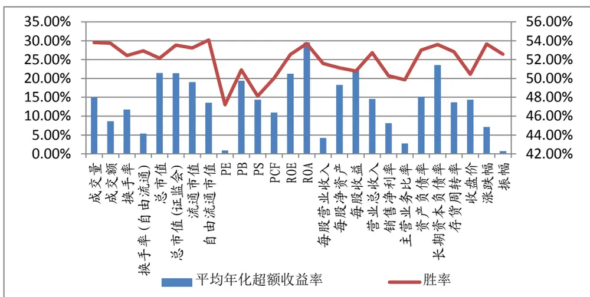
数据来源：广发证券发展研究中心、Wind资讯金融终端

从上表和上图中可以看出，各个单风格因子策略的平均年化超额收益率均为正；最大回撤也均处于可接受的范围内，除PE、PCF、每股营业收入外，其余因子未出现大幅回撤的情况；资金利用率较高，多数风格因子的持仓概率达到了90%以上；日换手率也处于可接受范围内。过小的换手率体现出交易不活跃，不能及时抓住良好的投资时机；但过大的换手率会产生大量的交易费用，收益被交易费用蚕食。可见我们所建立的模型能够有效地判断出投资者的非理性行为，并有效地抓住机会获取超额收益。

上表中红色部分是在单风格因子策略中表现较好的风格因子，可以看出，在不计手续费的前提下，流通市值、PB、ROE、ROA、每股收益和长期资本负债率的总体表现结果较好，“年化收益/最大回撤”和“信息比”接近1或大于1。从因子类别来看，规模因子、估值因子和质量因子中各有1个因子表现较好，而盈利因子中却有3个因子表现较好，这也与投资者更加看重公司的盈利能力一致。

图 7 单风格因子策略累计超额净值
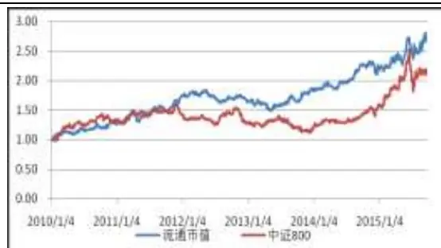

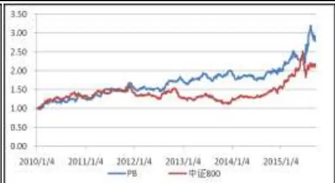

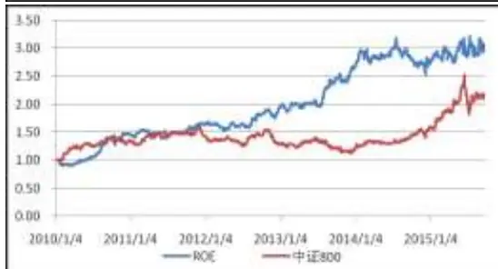

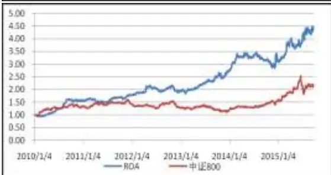

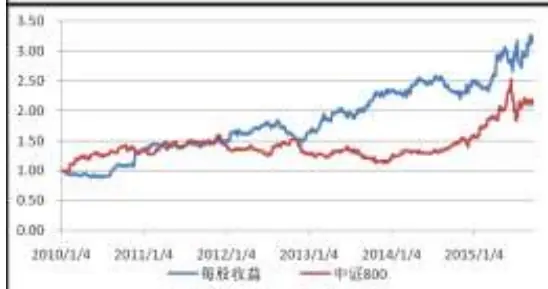

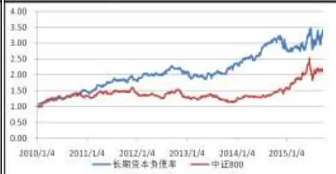
数据来源：广发证券发展研究中心、Wind资讯金融终端

上图中蓝色走势表示各个风格策略的超额累计净值(与中证800对冲)。从上图可以看出，各个风格因子策略的走势图虽不尽相同，但均保持着上升的趋势，即使在2015年6月A股市场上千股跌停的情况下， 各策略都没发生大幅回撤。同时，可以看出各个风格因子有各自不同的回撤时点，例如：流通市值风格在2012年至2013年第一季度间发生了较大的回撤，而ROA风格则是在2014年至2015年间发生了大幅回撤。这说明这些回撤并非策略本身带来的，而是因子在不同时期有不同的表现引起的。

## (2) 从行业角度分析。

上面的分析从单个风格因子在所有行业中的综合表现展开，但每个行业对不同风格因子的适应度又不相同，接下来，我们从单个风格因子在各个行业上的表现来分析。注：申万一级行业分类从23个变为了28个，去除重复的行业分类后共计33个。信息比根据日度数据计算，未开仓的时间也计算在内，所以均较小。

表 3 各行业最佳风格因子

| 行业 | 最佳因子1 | 信息比 | 最佳因子2 | 信息比 | 最佳因子3 | 信息比 | 最佳因子4 | 信息比 |
| --- | --- | --- | --- | --- | --- | --- | --- | --- |
| 农林牧渔 | 每股净资产 | 0.70 | 每股营业收入 | 0.68 | 成交量 | 0.25 | 每股收益 | 0.21 |
| 采掘 | 振幅 | 0.80 | PS | 0.72 | 营业总收入 | 0.59 | 收盘价 | 0.35 |
| 化工 | PB | 1.06 | 主营业务比率 | 0.85 | ROE | 0.74 | ROA | 0.66 |
| 钢铁 | 总市值 | 0.68 | 长期资本负债率 | 0.49 | 流通市值 | 0.33 | 销售净利率 | 0.26 |
| 有色金属 | ROA | 1.17 | PE | 0.63 | ROE | 0.60 | 换手率(自由流通) | 0.48 |
| 电子 | 销售凈利率 | 0.60 | 成交量 | 0.54 | 每股净资产 | 0.51 | ROA | 0.51 |
| 家用电器 | 流通市值 | 0.41 | 总市值(证监会) | 0.40 | 长期资本负债率 | 0.36 | 营业总收入 | 0.28 |
| 食品饮料 | 销售凈利率 | 0.92 | 换手率 | 0.82 | PS | 0.77 | 长期资本负债率 | 0.67 |
| 纺织服装 | 总市值(证监会) | 1.20 | 成交量 | 0.67 | PB | 0.66 | 每股收益 | 0.51 |
| 轻工制造 | 存货周转率 | 0.65 | PCF | 0.49 | ROE | 0.45 | 成交额 | 0.45 |
| 医药生物 | ROA | 1.41 | 自由流通市 | 1.16 | 每股净资产 | 0.78 | 营业总收入 | 0.61 |
| 公用事业 | 总市值 | 0.51 | 收盘价 | 0.43 | 成交量 | 0.41 | 存货周转率 | 0.31 |
| 交通运输 | ROA | 1.17 | 每股收益 | 1.00 | 收盘价 | 0.58 | ROE | 0.43 |
| 房地产 | PB | 1.15 | 总市值 | 1.10 | 收盘价 | 0.79 | 每股收益 | 0.77 |
| 商业贸易 | PB | 0.65 | 存货周转率 | 0.37 | 换手率(自由流通) | 0.33 | 自由流通市 | 0.31 |
| 休闲服务 | 收盘价 | 0 | 涨跌幅 | 0 | 成交量 | 0 | 成交额 | 0 |
| 综合 | 销售净利率 | 1.06 | PB | 1.00 | 换手率 | 0.76 | ROE | 0.52 |
| 建筑材料 | PS | 0.61 | 每股收益 | 0.57 | 资产负债率 | 0.47 | 自由流通市 | 0.39 |
| 建筑装饰 | 营业总收入 | 1.26 | PS | 0.71 | PB | 0.52 | 成交量 | 0.49 |
| 电气设备 | ROE | 0.91 | ROA | 0.80 | 收盘价 | 0.61 | PS | 0.49 |
| 国防军工 | PB | 0.61 | PE | 0.56 | 收盘价 | 0.45 | 营业总收入 | 0.34 |
| 计算机 | 长期资本负债率 | 1.04 | 总市值 | 0.33 | 流通市值 | 0.33 | 收盘价 | 0.27 |
| 传媒 | 每股营业收入 | 0.51 | PB | 0.38 | 每股净资产 | 0.33 | 自由流通市 | 0.15 |
| 通信 | 销售凈利率 | 0.31 | 涨跌幅 | 0.30 | 每股净资产 | 0.27 | 长期资本负债率 | 0.21 |
| 银行 | ROE | 0.58 | PS | 0.52 |  |  |  |  |
| 非银金融 | 成交量 | 0.73 | 总市值 | 0.67 | 存货周转率 | 0.57 | PB | 0.54 |
| 汽车 | 收盘价 | 0.94 | 资产负债率 | 0.54 | 总市值(证监会) | 0.51 | 流通市值 | 0.47 |
| 机械设备 | 成交量 | 0.46 | ROA | 0.36 | 每股收益 | 0.33 | PCF | 0.22 |
| 交运设备 | PCF | 0.49 | 主营业务比率 | 0.46 | 总市值(证监会) | 0.37 | 成交量 | 0.35 |
| 信息服务 | 资产负债率 | 0.54 | 总市值 | 0.45 | 流通市值 | 0.45 | PE | 0.35 |
| 信息设备 | 成交量 | 0.76 | PE | 0.58 | 每股净资产 | 0.47 | 收盘价 | 0.47 |
| 建筑建材 | 营业总收入 | 0.76 | 成交额 | 0.62 | 存货周转率 | 0.43 | PE | 0.28 |
| 金融服务 | 总市值(证监会) | 0.91 | 流通市值 | 0.91 | 资产负债率 | 0.40 | PCF | 0.24 |

数据来源：广发证券发展研究中心、Wind资讯金融终端

上表中最佳因子按照信息比的大小进行排序，即最佳因子1的信息比>最佳因子2的信息比>最佳因子3的信息比>最佳因子4的信息比。

可以看出，每个行业都有最适合自身的风格因子且各不相同。这是由于不同行业有自身不同的运作机制，例如：银行行业的负债率高代表其吸收了更多的存款，是其业务能力强的一种表现，而其他多数行业负债率高却表示其风险太大。

休闲服务行业的个股数量太少，无法准确的判断其是否产生了稳定的风格，所以未对其进行操作。故其信息比均为0。

同时，可以看到有些行业的最佳因子信息比较高，而有些行业却很低，例如房地产行业的第4个最佳因子的信息比都高达77%，而通信行业的第1个最佳因子的信息比却仅有31%。说明部分行业(例如房地产)对单风格因子策略的适应性较强，而部分行业(例如通信行业)则对单因子策略的适应性较差。

## 四、多风格因子策略（不同行业相同因子）

## 4.1 共同多风格因子选择

本节的主要思路是从单风格因子策略中选择在所有行业中综合表现较好的风格因子，在每个行业上使用同样的因子。

从第三节单风格因子策略的表现来看，规模因子、估值因子和质量因子中各有1个因子表现较好，盈利因子有3个因子表现较好。不同类型的因子影响行业涨跌的方式不同，若选择过多同种类型的因子，则会造成错失部分投资良机，所以我们尝试从规模因子、估值因子、质量因子和盈利因子中各取一个因子作为我们的多风格因子。

表 4 多风格因子策略(不同行业相同因子)选用的风格因子

| 类型 | 规模因子 | 估值因子 | 质量因子 | 盈利因子 |
| --- | --- | --- | --- | --- |
| 名称 | 流通市值 | PB | 长期资本负债率 | ROE |
| 方向 | 不定 | 负 | 不定 | 正 |

数据来源：广发证券发展研究中心、Wind资讯金融终端

盈利因子中，ROE单风格策略的净值序列更加平稳，在各个时间段均表现不俗；ROA单风格策略在2011年至2013年间净值几乎不变，其收益主要来自于2014年至2015年，使用该因子会造成该时间段策略的低迷甚至是大幅回撤；每股收益单风格策略在样本期间发生了三次较大的回撤，与ROE和ROA相比不稳定性更强。所以本篇报告选择的盈利因子为ROE。

## 4.2 多风格因子策略(不同行业相同因子)构建

多风格因子策略的构建过程与单风格因子策略基本相同，这里着重介绍不同的地方。

多风格因子策略同样分行业进行判断，满足条件的行业进行开仓，不满足条件的行业等待下次判断。不同的地方是某个时点判断行业是否开仓时，需要对4个因子同时进行判断，若只有一个风格因子满足开仓条件，则超配该因子选出的具有上涨空间的个股；若有多个因子同时满足开仓条件，则找出最显著的风格因子，超配该风格因子选出的具有上涨空间的个股。

(1) 开仓条件。我们从三个角度(行业投资趋势、是否形成稳定的风格、风格因子的表现)设置了两个方向的开仓条件(正向、负向)。

1、反向开仓。这种开仓条件适合方向为负或不定的风格因子。与单风格因子 策略相同。

2、正向开仓。这种开仓条件适合方向为正或不定的风格因子。与单风格因子 策略相同。

3、多个风格因子满足开仓条件时的判断。若该行业同时具有多个风格因子满足开仓条件时，则按照各个风格因子的C1(风格因子值最小的20%个股集合与收益率最大的20%个股集合的重叠比例)和C2(风格因子值最大的20%个股集合与收益率最大的20%个股集合的重叠比例)的大小进行判断。按照下面的公式计算每个风格因子的得分。

$$
\Re(+k)=1\mp4\neq\Im((\#1\div0)\div\Re\cdot\Re)=\left\{\begin{array}{c}{{\displaystyle\mathrm{C1}*100,\frac{\psi}{\vartheta}\mathrm{C2}=0\#}}\\{{\displaystyle\frac{\mathrm{C1}}{\mathrm{C2}},\frac{\psi}{\vartheta}\mathrm{C2}>0,\mathrm{C1}>C2\#}}\end{array}\right.
$$

$$
\Re(+k|\mathbf{\vec{s}}|\mathbf{\vec{s}})\mp\lambda\mathbf{\vec{s}}\Im((\mathtt{1}\mathtt{E}|\mathbf{\vec{s}})\vec{s}\vec{\lambda}\cdot\vec{\lambda}\vec{\mathfrak{x}})=\{\begin{array}{ll}{\begin{array}{rl}{\mathrm{C}2*100,\frac{\mathtt{k}}{\mathtt{d}}\mathrm{C}1=0\mathbb{H}\breve{\mathfrak{s}}}&{}\\{\mathrm{C}2}\\{\mathrm{C}1}\end{array},\frac{\mathtt{k}}{\mathtt{d}}\mathrm{C}1>0,\mathrm{C}2>C1\mathbb{H}\breve{\mathfrak{s}}}&{}\end{array}
$$

可以看出，PB因子只适用第一个公式、ROE因子只适用第二个公式、流通市值因子和长期资本负债率因子同时适用于两个公式(若满足开仓条件时，两个公式中有且仅有一个公式满足)。

对满足开仓条件的风格因子按照上面的公式计算其风格因子得分，得分最大的为最显著的风格因子，按照该风格因子的正负方向挑选出超配个体(详见3.2的开仓条件)。从上面的公式可以看出，我们优先选择的是C1和C2中有一个为0的情况。例如，PB因子的C1=0.35，C2=0；ROE因子的C1=0.1，C2=0.6。对这种情况，PB因子得分为35，而ROE因子的却仅为6。这样计算得分的方法是为了防止某个因子(例中ROE)的风格正在消散，正在向新风格(例中PB)转变时超配了老风格（例中ROE）个股，这时遭受损失的概率较大。

(2) 平仓条件。我们设置3种平仓条件，只需满足其一即可平仓该行业。1、持仓满5天；2、持仓个股的累计平均收益率与中证800指数累计收益率相比超额上涨超15%；3、持仓个股的累计平均收益率与中证800指数累计收益率相比超额下跌超5%。

(3) 资金分配。我们设置行业内等权分配个股、行业间等权分配的方法。若有行业开仓，则把其他持仓行业个股的部分资金抽调在该行业，保持抽调后行业内等权、行业间等权；若有行业平仓，则把该行业个股的全部资金等权分配给所有持仓行业，行业内再等权分配给个股。以每日换手的部分计算交易费用。

## 4.3 多因子策略(不同行业相同因子)实证

根据以上的操作方法，我们对多风格因子策略进行了实证分析。我们以中证800指数成分股作为股票池，以申万一级行业分类对成分股的行业进行划分，样本选取2010年1月1日至2016年1月20日间的日度数据，以日为单位进行跟踪判断行业是否开仓和平仓，手续费率为千分之二。对冲标的同为中证800指数。

(1) 从策略的总体表现来看

表 5 多风格因子策略(不同行业相同因子)总体表现

| 累计超额净值 (对中证 800) | 平均年化收益率 (对中证800) | 胜率 | 最大回撤 | 持仓概率 | 信息比 | 日平均换仓比例 | 平均持仓天数 |
| --- | --- | --- | --- | --- | --- | --- | --- |
| 269.31% | 17.58% | 54.62% | 11.01% | 99.59% | 1.4083 | 27.37% | 4.84 |

数据来源：广发证券发展研究中心、Wind资讯金融终端

图 8 多风格因子策略(不同行业相同因子)总体表现
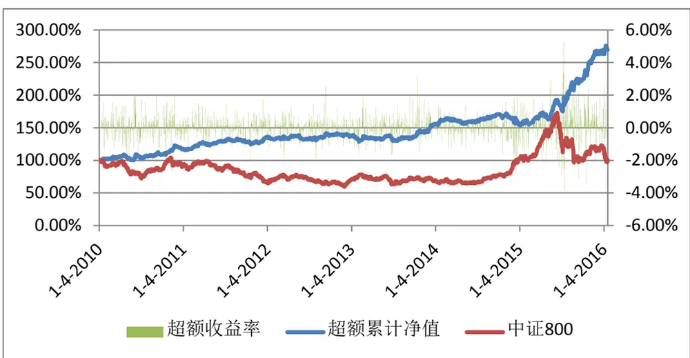
数据来源：广发证券发展研究中心、Wind资讯金融终端

可以看出多风格因子策略(不同行业相同因子)总体表现良好，能够获得17.58%的年化收益，胜率达到了54.62%，而最大回撤却仅有11.01%。而且该策略具有高达99.59%的持仓概率，几乎每个时点均有持仓(并非所有行业)，说明了该策略的资金利用率很高。日平均换仓比例为27.37%，处于可接受范围。

图 9 多风格因子策略(不同行业相同因子)回撤序列
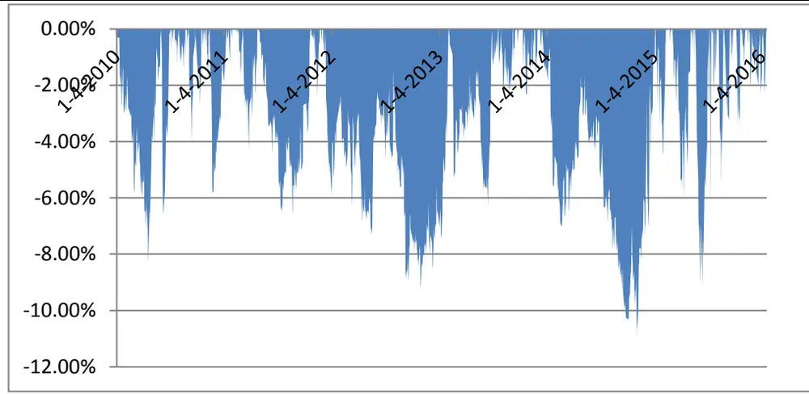
数据来源：广发证券发展研究中心、Wind资讯金融终端

从回撤的角度来看，该策略的稳定性较好，大部分时间的最大回撤小于6%，仅有个别时期会发生较大幅度的回撤。

(2) 从分年度的角度来看

表 6 多风格因子策略(不同行业相同因子)分年度表现

| 时间 | 超额收益 | 胜率 | 最大回撤 | 持仓概率 | 信息比 | 日换仓比例 | 平均持仓天数 |
| --- | --- | --- | --- | --- | --- | --- | --- |
| 2010年 | 18.61% | 54.47% | 8.20% | 97.11% | 1.5349 | 27.68% | 4.89 |
| 2011年 | 16.24% | 54.10% | 6.48% | 100.00% | 1.7936 | 26.71% | 4.94 |
| 2012年 | 1.67% | 52.67% | 5.83% | 100.00% | 0.2287 | 26.55% | 4.95 |
| 2013年 | 13.04% | 56.30% | 7.40% | 100.00% | 1.1985 | 27.16% | 4.88 |
| 2014年 | 0.13% | 51.43% | 10.03% | 100.00% | 0.0622 | 27.30% | 4.86 |
| 2015年 | 75.97% | 59.84% | 9.03% | 100.00% | 3.0372 | 28.85% | 4.59 |
| 2016年(1.20) | 0.84% | 33.33% | 2.32% | 100.00% | 0.9822 | 26.48% | 4.72 |

数据来源：广发证券发展研究中心、Wind 资讯金融终端

图 10 多风格因子策略(不同行业相同因子)分年度表现
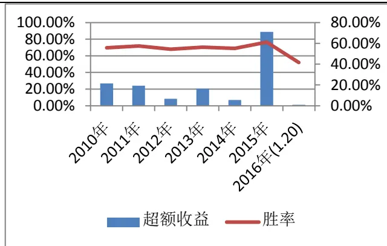

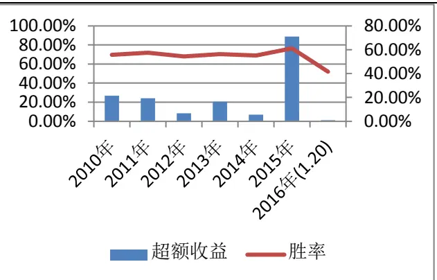
数据来源：广发证券发展研究中心、Wind资讯金融终端

从策略分年度的表现来看，除2012年、2014及样本量较少的2016年，其余各年的超额收益率均达到10%以上，特别是2015年更是达到了75.97%。各年的最大回撤较为平均，均处于8%附近，说明策略的稳定性较好。

从换仓比例的角度来说，可以看到换仓比例与超额收益率之间基本是正相关的关系，换仓比例越大，获得超额收益的机会越多。而平均持仓天数则与各个年度的市场情况有关，当行业处于熊牛市时，经常会触发止损止盈平仓条件，所以平均持仓时间较短；而行业处于振荡期时，则通常持有5天之后平仓。

## (3) 最后，从行业的角度来看（不计手续费）

从第二节的分析我们知道，不同的行业有自身最适应的因子，而各个行业间不尽相同。所以这节从行业的角度来看这4个风格因子在各个行业上的表现。

表 7 多风格因子策略(不同行业相同因子)分行业表现(对行业指数)

| 行业 | 累计超额净值 | 胜率 | 最大回撤 | 被选中次数 | 平均持仓天数 |
| --- | --- | --- | --- | --- | --- |
| 农林牧渔 | 233.77% | 48.22% | 29.17% | 136 | 4.80 |
| 采掘 | 151.71% | 47.41% | 44.86% | 109 | 4.82 |
| 化工 | 278.84% | 50.40% | 19.74% | 76 | 4.85 |
| 钢铁 | 80.15% | 49.90% | 47.66% | 104 | 4.86 |
| 有色金属 | 241.85% | 46.56% | 39.05% | 105 | 4.88 |
| 电子 | 147.87% | 47.01% | 34.75% | 105 | 4.87 |
| 家用电器 | 189.85% | 45.56% | 49.30% | 145 | 4.87 |
| 食品饮料 | 273.74% | 48.80% | 31.93% | 150 | 4.88 |
| 纺织服装 | 218.82% | 47.63% | 42.95% | 144 | 4.87 |
| 轻工制造 | 158.21% | 45.97% | 38.85% | 131 | 4.86 |
| 医药生物 | 296.97% | 50.19% | 31.48% | 103 | 4.87 |
| 公用事业 | 123.73% | 48.49% | 34.89% | 134 | 4.87 |
| 交通运输 | 220.72% | 50.86% | 30.73% | 151 | 4.87 |
| 房地产 | 182.91% | 47.21% | 37.08% | 129 | 4.87 |
| 商业贸易 | 174.90% | 48.21% | 27.18% | 116 | 4.88 |
| 休闲服务 | 100.00% | NaN | 0.00% | 0 | 0.00 |
| 综合 | 222.89% | 47.50% | 30.19% | 44 | 4.86 |
| 建筑材料 | 205.55% | 47.55% | 26.83% | 53 | 4.86 |
| 建筑装饰 | 231.73% | 49.05% | 38.37% | 53 | 4.85 |
| 电气设备 | 198.02% | 44.63% | 22.75% | 36 | 4.85 |
| 国防军工 | 76.57% | 39.18% | 58.52% | 41 | 4.84 |
| 计算机 | 311.40% | 50.00% | 22.06% | 42 | 4.84 |
| 传媒 | 215.91% | 50.93% | 27.15% | 42 | 4.83 |
| 通信 | 57.15% | 43.24% | 61.54% | 45 | 4.83 |
| 银行 | 177.30% | 49.02% | 18.77% | 31 | 4.83 |
| 非银金融 | 152.36% | 49.37% | 46.50% | 45 | 4.83 |
| 汽车 | 195.82% | 41.57% | 19.13% | 33 | 4.83 |
| 机械设备 | 127.49% | 46.56% | 38.97% | 103 | 4.83 |
| 交运设备 | 105.22% | 50.00% | 30.01% | 76 | 4.83 |
| 信息服务 | 148.32% | 49.83% | 28.70% | 61 | 4.83 |
| 信息设备 | 146.91% | 46.29% | 31.38% | 85 | 4.83 |
| 建筑建材 | 96.65% | 49.69% | 30.81% | 97 | 4.84 |
| 金融服务 | 129.12% | 53.56% | 32.09% | 82 | 4.84 |

数据来源：广发证券发展研究中心、Wind资讯金融终端

从分行业的角度来看，农林牧渔、化工、有色金属、食品饮料、纺织服装、医药生物、交通运输、综合、建筑材料、建筑装饰、计算机、传媒行业的累计超额收益率(对行业指数)达到了100%以上，仅有钢铁、国防军工、通信和建筑建材行业对冲行业指数之后产生了亏损。可见多风格因子策略(不同行业相同因子)在大多数行业上有较好的表现。

经统计，累计超额净值与被选中次数之间的相关系数为0.28，说明被选中次数与行业累计超额净值有一定程度上的正相关性，但并不十分显著。其原因是我们所使用的4个风格因子是在所有行业上综合表现最好，并非在所有行业上均有很好的表现。

表 8 四个风格因子显著次数

| 行业 | PB | 流通市值 | ROE | 长期资本负债率 |
| --- | --- | --- | --- | --- |
| 全部 | 317 | 995 | 594 | 844 |
| 农林牧渔 | 11 | 46 | 37 | 39 |
| 采掘 | 10 | 32 | 24 | 41 |
| 化工 | 7 | 9 | 25 | 34 |
| 钢铁 | 11 | 31 | 28 | 34 |
| 有色金属 | 15 | 39 | 29 | 20 |
| 电子 | 8 | 41 | 24 | 30 |

| 家用电器 | 19 56 | 25 | 42 |
| --- | --- | --- | --- |
| 食品饮料 | 17 | 49 29 | 52 |
| 纺织服装 | 22 | 34 32 | 52 |
| 轻工制造 | 18 | 47 15 | 49 |
| 医药生物 | 10 | 40 31 | 19 |
| 公用事业 | 16 | 54 18 | 43 |
| 交通运输 | 17 | 62 23 | 47 |
| 房地产 | 5 | 58 28 | 35 |
| 商业贸易 | 19 | 33 19 | 44 |
| 休闲服务 | 0 | 0 0 | 0 |
| 综合 | 4 | 17 4 | 16 |
| 建筑材料 | 7 | 19 11 | 13 |
| 建筑装饰 | 9 | 16 4 | 20 |
| 电气设备 | 4 | 18 3 | 8 |
| 国防军工 | 5 | 14 4 | 16 |
| 计算机 | 5 | 14 7 | 13 |
| 传媒 | 5 | 19 6 | 8 |
| 通信 | 6 17 | 6 | 14 |
| 银行 | 8 | 20 2 | 0 |
| 非银金融 | 2 | 32 5 | 4 |
| 汽车 | 2 | 12 11 | 8 |
| 机械设备 | 16 | 23 31 | 33 |
| 交运设备 | 5 | 28 25 | 18 |
| 信息服务 | 5 | 12 18 | 26 |
| 信息设备 | 7 | 33 25 | 20 |
| 建筑建材 | 10 | 23 25 | 39 |
| 金融服务 | 12 | 44 20 | 6 |

数据来源：广发证券发展研究中心、Wind 资讯金融终端

上表给出了多风格因子策略(不同行业相同因子)中各个风格因子开仓时起作用的次数。可以看出“流通市值”和“长期资本负债率”两个风格因子起作用的总次数是“PB”和“ROE”风格因子的两倍左右。这是由于前两个因子方向不固定，可正反双向开仓；后两个因子方向固定，只可反向开仓或正向开仓，开仓几率减小了一倍。从这个角度出发，我们选出的四个因子在策略中起到的作用近乎等同。

而在不同的行业却不具有上述所说的结论，例如：机械设备行业中ROE因子起作用次数为31次(理论上概率小)，而显著次数最多的长期资本负债率因子也仅有33次，说明在机械设备行业，ROE因子起到决定性的作用。这也侧面说明了各个行业分化程度较高，对不同的行业不能一概而论。

图 11 多风格因子策略(不同行业相同因子)持仓行业数目

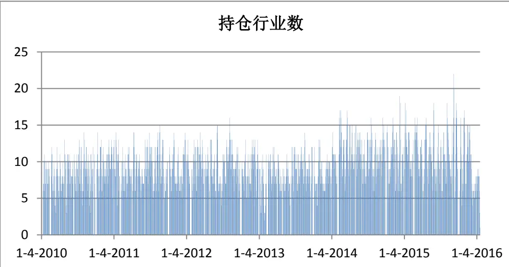
数据来源：广发证券发展研究中心、Wind资讯金融终端

图 12 多风格因子策略(不同行业相同因子)持仓个股数目
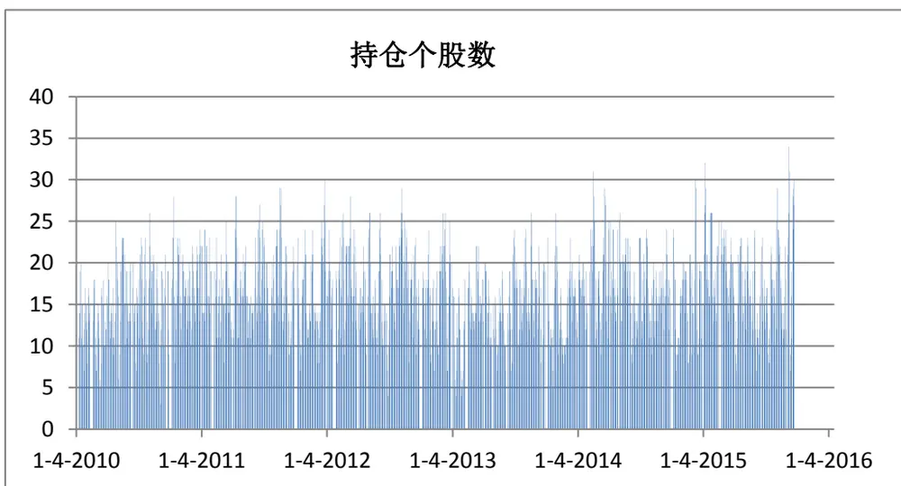
数据来源：广发证券发展研究中心、Wind资讯金融终端

上面两个表给出了多风格因子策略(不同行业相同因子)各个时期的持仓行业数和持仓个股数量情况。经统计，每日平均持仓行业数为9.5个、平均持仓个股数为16.3只。可见平均每个行业只有不到2只个股被选择。从持仓行业和持仓个股的角度来看，该策略仍然是较为平稳的，持仓行业数在2014年和2015年有轻微增长的趋势，但持仓个股数各年度无明显差异。

## 五、多风格因子策略（分行业选因子）

## 5.1 各行业多风格因子选择

从第四节可以看出，虽然多风格因子策略(不同行业不同因子)在多数行业上表现不俗，但仍会造成部分行业产生负的超额收益。为了解决这个问题，我们尝试分行业选因子，即不同行业选择不同的因子。我们这里直接使用表3各行业最佳风格因子的结果。

## 5.2 多风格因子策略(分行业选因子)构建

多风格因子策略(分行业选因子)与多风格因子策略(不同行业不同因子)的构建过程相同，唯一的不同就是二者所用的因子不同，在这里不再加以重复。

## 5.3 多因子策略(分行业选因子)实证

根据以上的操作方法，我们对多风格因子策略进行了实证分析。我们以中证800指数对应时刻的成分股作为股票池，以申万一级行业分类对成分股的行业进行划分，样本选取2010年1月1日至2016年1月20日间的日度数据，以日为单位进行跟踪判断行业是否开仓和平仓，手续费率为千分之二。该策略同样以中证800指数作为对冲标的。

## (1) 从策略的总体表现来看

表 9 多风格因子策略(分行业选因子)总体表现

| 累计超额净值 (对中证 800) | 平均年化收益率 (对中证 800) | 胜率 | 最大回撤 | 持仓概率 | 信息比 | 日平均换仓比例 | 平均持仓天数 |
| --- | --- | --- | --- | --- | --- | --- | --- |
| 462.54% | 28.56% | 56.18% | 11.41% | 99.59% | 1.97 | 27.45% | 4.81 |

数据来源：广发证券发展研究中心、Wind资讯金融终端

图 13 多风格因子策略(分行业选因子)总体表现
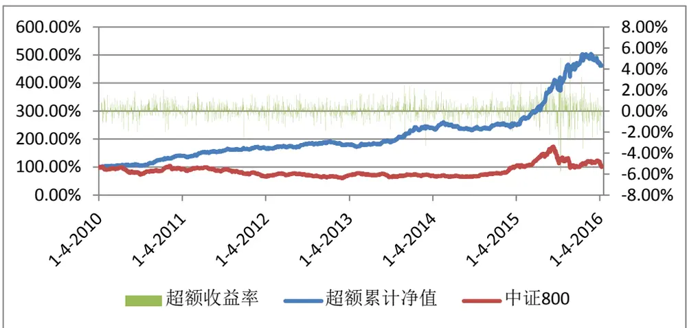
数据来源：广发证券发展研究中心、Wind资讯金融终端

可以看出多风格因子策略(分行业选因子)总体表现优秀，年化收益达到了38.56%，最大回撤却仅有11.41%，胜率也高达56.18%。可见分行业选择风险因子的效果比不同行业共同因子的效果更好。

图 14 多风格因子策略(分行业选因子)回撤序列

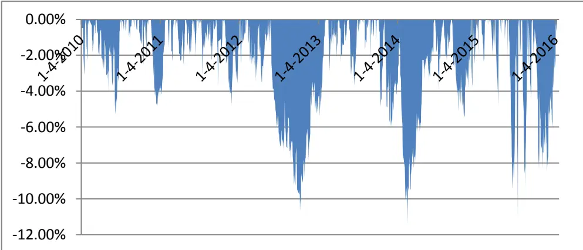
据来源：广发证券发展研究中心、Wind资讯金融终端

从回撤的角度来看，该策略的稳定性与多风格因子策略(不同行业相同因子)基本一致，只在少数时刻发生了较大的回撤，多数时刻回撤维持在6%以下。

(2) 从分年度的角度来看

表 10 多风格因子策略(分行业选因子)分年度表现

| 时间 | 超额收益 | 胜率 | 最大回撤 | 持仓概率 | 信息比 | 日换仓比例 | 平均持仓天数 |
| --- | --- | --- | --- | --- | --- | --- | --- |
| 2010年 | 41.17% | 59.57% | 5.25% | 97.11% | 3.29 | 26.92% | 4.86 |
| 2011年 | 19.03% | 54.51% | 4.30% | 100.00% | 1.92 | 26.67% | 4.92 |
| 2012年 | 8.19% | 53.50% | 7.47% | 100.00% | 0.84 | 26.59% | 4.97 |
| 2013年 | 34.41% | 56.72% | 5.40% | 100.00% | 2.58 | 27.06% | 4.89 |
| 2014年 | 4.83% | 50.61% | 11.27% | 100.00% | 0.47 | 27.88% | 4.82 |
| 2015年 | 97.37% | 63.18% | 10.93% | 100.00% | 3.24 | 29.62% | 4.52 |
| 2016年(1.20) | -3.49% | 41.67% | 3.83% | 100.00% | -6.41 | 25.42% | 5.00 |

数据来源：广发证券发展研究中心、Wind 资讯金融终端

从策略分年度的表现来看，除样本量较少的2016年以及收益率相对较低的2012和2016年，其余各年的超额收益率均达到15%以上，特别是2015年更是达到了97.83%。最大回撤在2014和2015年有所提升，主要是因为牛熊市指数上涨或下跌速度快，日收益率或损失会比振荡期更大造成的。

## (3) 最后，从行业的角度来看（不计手续费）

从第二节的分析我们知道，不同的行业有自身最适应的因子，而各个行业间不尽相同。所以这节从行业的角度来看这4个风格因子在各个行业上的表现。

表 11 多风格因子策略(分行业选因子)分行业表现(对行业指数)

| 行业 | 累计超额净值 | 胜率 | 最大回撤 | 被选中次数 | 平均持仓天数 |
| --- | --- | --- | --- | --- | --- |
| 农林牧渔 | 230.89% | 46.49% | 50.42% | 142 | 4.75 |
| 采掘 | 165.68% | 46.58% | 68.61% | 182 | 4.86 |
| 化工 | 229.95% | 51.34% | 23.39% | 53 | 4.92 |
| 钢铁 | 137.30% | 51.60% | 20.79% | 80 | 4.98 |
| 有色金属 | 72.42% | 47.89% | 66.56% | 156 | 4.72 |
| 电子 | 332.19% | 46.91% | 24.92% | 99 | 4.91 |
| 家用电器 | 488.76% | 48.39% | 17.91% | 104 | 4.91 |
| 食品饮料 | 127.33% | 46.86% | 38.55% | 170 | 4.81 |
| 纺织服装 | 677.18% | 49.51% | 29.32% | 154 | 4.88 |
| 轻工制造 | 415.62% | 49.42% | 38.54% | 153 | 4.71 |
| 医药生物 | 566.12% | 50.52% | 15.56% | 97 | 4.98 |
| 公用事业 | 171.16% | 47.87% | 55.02% | 144 | 4.91 |
| 交通运输 | 207.68% | 49.38% | 26.96% | 101 | 4.89 |
| 房地产 | 218.09% | 50.49% | 35.63% | 106 | 4.78 |
| 商业贸易 | 211.74% | 48.77% | 51.10% | 160 | 4.86 |
| 休闲服务 | 100.00% | NaN | 0.00% | 0 | 0.00 |
| 综合 | 272.51% | 50.68% | 39.26% | 50 | 4.54 |
| 建筑材料 | 455.04% | 49.39% | 20.83% | 52 | 4.81 |
| 建筑装饰 | 286.38% | 46.36% | 30.03% | 51 | 4.63 |
| 电气设备 | 168.12% | 50.81% | 30.41% | 26 | 4.77 |
| 国防军工 | 145.81% | 45.81% | 38.35% | 34 | 4.71 |
| 计算机 | 396.31% | 51.64% | 16.05% | 27 | 4.56 |
| 传媒 | 268.88% | 49.73% | 14.20% | 42 | 4.45 |
| 通信 | 119.85% | 43.41% | 46.25% | 73 | 4.34 |
| 银行 | 168.81% | 61.54% | 6.68% | 12 | 4.75 |
| 非银金融 | 166.32% | 50.86% | 44.98% | 61 | 4.77 |
| 汽车 | 223.52% | 54.55% | 15.97% | 29 | 4.93 |
| 机械设备 | 164.84% | 49.07% | 58.74% | 134 | 4.80 |
| 交运设备 | 114.59% | 50.34% | 39.05% | 90 | 4.94 |
| 信息服务 | 122.01% | 54.68% | 16.76% | 41 | 4.98 |
| 信息设备 | 127.29% | 47.25% | 39.70% | 98 | 4.79 |
| 建筑建材 | 217.84% | 48.87% | 28.86% | 98 | 4.97 |
| 金融服务 | 119.87% | 54.02% | 32.90% | 81 | 4.94 |

数据来源：广发证券发展研究中心、Wind资讯金融终端

从分行业的角度来看，绝大多数行业的累计超额收益率(对行业指数)达到了100%以上，其中，电子、纺织服装、轻工制造、医药生物、建筑材料和计算机行业的超额收益率甚至超过了200%。而仅有有色金属对冲行业指数之后产生了亏损，并且亏损值也仅有27.58%。可见多风格因子策略(分行业选因子)在大多数行业上有较好的表现。

表 12 各行业风格因子显著次数

| 行业 | 风格因子1 | 显著次数 | 风格因子2 | 显著次数 | 风格因子3 | 显著次数 | 风格因子4 | 显著次数 |
| --- | --- | --- | --- | --- | --- | --- | --- | --- |
| 农林牧渔 | 每股净资产 | 23 | 每股营业收入 | 17 | 成交量 | 77 | 每股收益 | 25 |
| 采掘 | 振幅 | 146 | PS | 3 | 营业总收入 | 12 | 收盘价 | 21 |
| 化工 | PB | 11 | 主营业务比率 | 7 | ROE | 12 | ROA | 23 |
| 钢铁 | 总市值2 | 6 | 长期资本负债率 | 42 | 流通市值 | 10 | 销售净利率 | 22 |

| 有色金属 | ROA | 5 | PE 2 | ROE | 11 | 换手率(自由流通) | 138 |
| --- | --- | --- | --- | --- | --- | --- | --- |
| 电子 | 销售净利率 | 10 | 成交量 47 | 每股净资产 | 27 | ROA | 15 |
| 家用电器 | 流通市值 | 3 | 总市值(证监会) 7 | 长期资本负债率 | 66 | 营业总收入 | 28 |
| 食品饮料 | 销售凈利率 | 20 | 换手率 | 89 PS | 19 | 长期资本负债率 | 42 |
| 纺织服装 | 总市值(证监会) | 33 | 成交量 78 | PB | 19 | 每股收益 | 24 |
| 轻工制造 | 存货周转率 | 39 | PCF 19 | ROE | 25 | 成交额 | 70 |
| 医药生物 | ROA | 17 | 自由流通市 53 | 每股净资产 | 10 | 营业总收入 | 17 |
| 公用事业 | 总市值 2 | 51 | 收盘价 | 15 成交量 | 61 | 存货周转率 | 17 |
| 交通运输 | ROA | 24 | 每股收益 | 19 收盘价 | 29 | ROE | 29 |
| 房地产 | PB | 5 | 总市值2 | 59 收盘价 | 7 | 每股收益 | 35 |
| 商业贸易 | PB | 15 | 存货周转率 | 20 换手率(自由流通) | 107 | 自由流通市 | 18 |
| 休闲服务 | 收盘价 | 0 | 涨跌幅 | 0 成交量 | 0 | 成交额 | 0 |
| 综合 | 销售净利率 | 7 | PB | 5 换手率 | 35 | ROE | 3 |
| 建筑材料 | PS | 6 | 每股收益 | 10 资产负债率 | 20 | 自由流通市 | 16 |
| 建筑装饰 | 营业总收入 | 4 | PS | 9 PB | 2 | 成交量 | 36 |
| 电气设备 | ROE | 1 | ROA | 6 收盘价 | 14 | PS | 5 |
| 国防军工 | PB | 5 | PE | 5 收盘价 | 18 | 营业总收入 | 6 |
| 计算机 | 长期资本负债率 | 20 | 总市值2 | 0 流通市值 | 0 | 收盘价 | 7 |
| 传媒 | 每股营业收入 | 10 | PB | 5 每股净资产 | 6 | 自由流通市 | 21 |
| 通信 | 销售凈利率 | 0 | 涨跌幅 | 71 每股净资产 | 1 | 长期资本负债率 | 1 |
| 银行 | ROE | 5 | PS | 7 |  |  |  |
| 非银金融 | 成交量 | 21 | 总市值2 | 29 存货周转率 | 9 | PB | 2 |
| 汽车 | 收盘价 | 13 | 资产负债率 | 12 总市值(证监会) | 4 | 流通市值 | 0 |
| 机械设备 | 成交量 | 93 | ROA | 19 每股收益 | 14 | PCF | 8 |
| 交运设备 | PCF | 5 | 主营业务比率 | 9 总市值(证监会) | 25 | 成交量 | 51 |
| 信息服务 | 资产负债率 | 35 | 总市值2 | 0 流通市值 | 0 | PE | 6 |
| 信息设备 | 成交量 | 55 | PE | 13 每股净资产 | 24 | 收盘价 | 6 |
| 建筑建材 | 营业总收入 | 20 | 成交额 | 54 | 存货周转率 18 | PE | 6 |
| 金融服务 | 总市值(证监会) | 0 | 流通市值 | 0 | 资产负债率 72 | PCF | 9 |

数据来源：广发证券发展研究中心、Wind 资讯金融终端

从上表可以发现一个奇怪的现象，部分行业的一些最佳风格因子在整个回测期间没有起到任何作用，这是由于我们选择最佳风格因子是从单个因子在单个行业上的效果来决定的，因子组合起来之后由于行业形成风格时具有多个因子满足开仓条件，但部分因子没有其他因子显著而被淘汰，这就产生了回测期间显著次数是0的情况。说明行业内领涨的个股之间通常具有很多共同特点。注：休闲服务行业个股数目太少，无法判断是否形成稳定的风格，故次数均为0。

图 15 多风格因子策略(分行业选因子)持仓行业数目

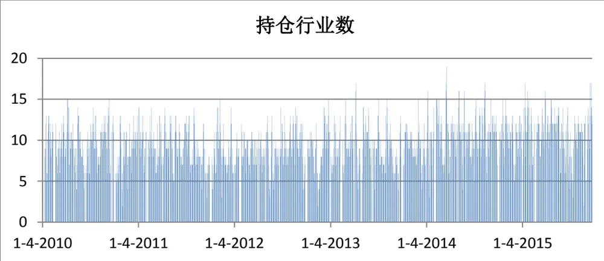
数据来源：广发证券发展研究中心、Wind资讯金融终端

图 16 多风格因子策略(分行业选因子)持仓个股数目
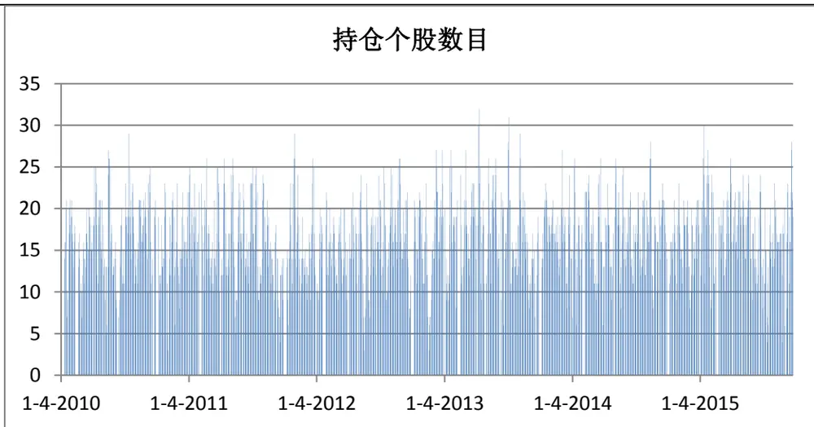
数据来源：广发证券发展研究中心、Wind资讯金融终端

上面两个表给出了多风格因子策略(分行业选因子)各个时期的持仓行业数和持仓个股数量情况。经统计，每日平均持仓行业数为9.5个、平均持仓个股数为16.2只。从持仓行业和持仓个股的角度来说，持仓行业数在2014年和2015年有轻微增长的趋势，但持仓个股数目基本保持稳定。这个结果与多风格因子策略(不同行业相同因子)相同。

## 总结

近年来，股市中各行业形成较为独立的涨跌机制，个股与同行业其他个股之间的涨跌趋势息息相关。投资者随着外部环境的变化追逐不同的风格，这时具有同样风格个股的涨跌趋势趋于相同，此时超配被低估的风格个股将会带来反转收益。本篇报告就是利用量化手段度量是否产生了显著的投资风格，超配仍具有较大上涨空间的个股。

从回测结果来看，多风格因子(不同行业相同因子)策略平均年化收益率达到了17.58%，而最大回撤却仅有11.01%，胜率也达到了54.62%。从策略分年度表现来看，除2012年和2014年和样本量较少的2016年，其余年份超额收益率均超过10%。多风格因子(分行业选因子)策略的表现更优，平均年化收益率达到了28.56%，最大回撤却仅有11.41%，胜率达到了56.18%。从分年度表现来看，除2012、2014和2016年，各年度的超额收益率均达到了15%以上，2015年更是达到了97.37%。

## 风险提示

本模型采用量化方法，所推荐个股不一定具有严格的经济逻辑，也未必符合当前宏观环境特点，请结合自身判断进行恰当使用。

## Table_RatingIndustry 广发证券—行业投资评级说明

买入： 预期未来 12 个月内，股价表现强于大盘 10%以上。

持有： 预期未来12个月内，股价相对大盘的变动幅度介于-10%～+10%。

卖出： 预期未来12个月内，股价表现弱于大盘10%以上。

## Table_RatingCompany 广发证券—公司投资评级说明

买入： 预期未来12个月内，股价表现强于大盘15%以上。

谨慎增持： 预期未来12个月内，股价表现强于大盘5%-15%。

持有： 预期未来12个月内，股价相对大盘的变动幅度介于-5%～+5%。

卖出： 预期未来12个月内，股价表现弱于大盘5%以上。

## Table_Ad联系我们

|  | 广州市 | 深圳市 | 北京市 | 上海市 |
| --- | --- | --- | --- | --- |
| 地址 |  | 广州市天河区林和西路9 深圳市福田区金田路4018 | 北京市西城区月坛北街2号 | 上海市浦东新区富城路99号 |
|  | 号耀中广场 A 座 1401 | 号安联大厦15楼A座03-04 | 月坛大厦18层 | 震旦大厦18楼 |
| 邮政编码 | 510075 | 518026 | 100045 | 200120 |
| 客服邮箱 | gfyf@gf.com.cn |  |  |  |
| 服务热线 | 020-87577060 |  |  |  |

## Table_Disclaimer 免 责声 明

广发证券股份有限公司具备证券投资咨询业务资格。本报告只发送给广发证券重点客户，不对外公开发布。

本报告所载资料的来源及观点的出处皆被广发证券股份有限公司认为可靠，但广发证券不对其准确性或完整性做出任何保证。报告内容仅供参考，报告中的信息或所表达观点不构成所涉证券买卖的出价或询价。广发证券不对因使用本报告的内容而引致的损失承担任何责任，除非法律法规有明确规定。客户不应以本报告取代其独立判断或仅根据本报告做出决策。

广发证券可发出其它与本报告所载信息不一致及有不同结论的报告。本报告反映研究人员的不同观点、见解及分析方法，并不代表广发证券或其附属机构的立场。报告所载资料、意见及推测仅反映研究人员于发出本报告当日的判断，可随时更改且不予通告。

本报告旨在发送给广发证券的特定客户及其它专业人士。未经广发证券事先书面许可，任何机构或个人不得以任何形式翻版、复制、刊登、转载和引用，否则由此造成的一切不良后果及法律责任由私自翻版、复制、刊登、转载和引用者承担。