# 多因子Alpha系列报告之（二十七）基于筹码分布的选股策略

Intermediate Investments (香港科技大學)

messages.pdf_cover_qr_code_label

## 2016基于筹码分布的选股策略

筹码分布介绍03 Page

策略原理 11 Page

实证分析15 Page

有效性讨论20 Page

总结24 Page

>

## G 广发证券 EE SEEHBIIIES

## INTRODUCTION

筹码分布介绍

筹码分布理论就是根据股票交易筹码流动的特点，对大盘或个股的历史成交情况进行分析，得出其筹码分布，然后根据这个筹码分布图来预测以后的走势。筹码分析理论的自然规律基础，是筹码流动的特点。

股票交易都是通过买卖双方在某个价位进行买卖成交而实现的。随着股票的上涨或下跌，在不同的价格区域产生着不同的成交量，这些成交量在不同的价位的分布量，形成了股票不同价位的持仓成本。

筹码分布主要应用于筹码持仓成本分析。一轮行情发展都是由成本转换开始的，又因成本转换而结束。什么是成本转换呢？形象的说，成本转换就是筹码搬家，是指持仓筹码由一个价位向另一个价位搬运的过程，它不仅仅是股价的转换，更重要的是持仓筹码数量的转换。股票的走势在表象上体现了股价的变化，而其内在的本质却体现了持仓成本的转换。

下图左边是雅本化学（300261）在2015年3月份到6月份的k线图，对应右边为雅本化学在2015年3月13日的筹码分布图。此时，筹码都集中在历史成本的低位。获利盘高达90%。

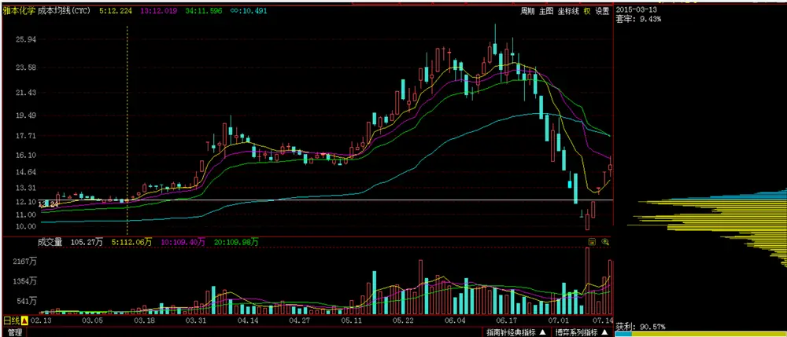

雅本化学（300261）在2015年3月份到6月份股价一直保持上涨的趋势，下图右边为雅本化学在2015年6月5日的筹码分布图。与3月份的对比中，可以发现筹码分布在不断上移，不断地发散。

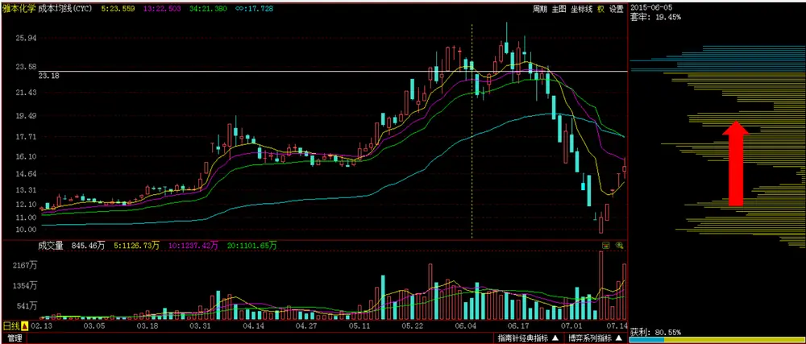

## 筹码分布算法

以发行日的发行价为起点，以交易日的总成交额除以总成交量（VWAP）作为该交易日的成本。以换手率来估计流通盘的移动。成本根据Wind数据库中的复权因子向后复权。

## 例如：

某只股票发行价为a;

第一个交易日的成本价为b;换手率为p;一部分流通盘从a移动到了b;筹码分布为：

$$
\mathrm{a}{:(\mathrm{\small~1-p~})\ ^{\ast}100^{\mathrm{0}}\Delta\ b{:}p^{\ast}100^{\mathrm{0}}{/}_{0}}
$$

第二个交易日的成本价为c;换手率为 $\lvert\mathbf{q}\rvert$ 一部分流通盘从a,b移动到c;筹码分布为：

$$
\mathrm{a}{:(1{-}p)^{\ast}(1{-}q)^{\ast}100^{\circ}\%b{:}p^{\ast}(1{-}q)^{\ast}100^{\circ}\diamond{c}{:}q^{\ast}100^{\circ}\diamond}
$$

第三个交易日的成本价为b;换手率为r;一部分流通盘从a,b,c移动到b;筹码分布为：

$$
\mathbf{a}\colon(1-\mathbf{p})^{*}(1-\mathbf{q})^{*}(1-\mathbf{r})^{*}100^{\%}\mid\mathbf{b}\colon\mathbf{p}^{*}(1-\mathbf{q})^{*}(1-\mathbf{r})^{*}100^{\%}+\mathbf{r}^{*}100^{\%}\mid\mathbf{0}\ l^{*}\mathrm{~c:~}\mathbf{q}^{*}(1-\mathbf{r})^{*}100^{\%}\mid\mathbf{0}\ l^{*}\mathrm{~c:~}\mathbf{q}^{*}(1-\mathbf{r})^{*}100^{\%}
$$

依此类推，得出股票在每个交易日的筹码分布。

## 筹码分布算法示意

| 成本 | 发行日 | 第一个交易日 | 第二个交易日 | 第三个交易日 |
| --- | --- | --- | --- | --- |
| C |  |  | $9^{*}100\%$ | $\mathrm{q^{*}(1\mathrm{-r})^{*}}100\%$ |
| b |  | $\boldsymbol{\mathrm{p}}^{*}100\%$ | $\mathrm{p^{*}(1\mathrm{-q})^{*}}100\%$ | ${\mathrm{p}}^{*}(1{-}{\mathrm{q}})^{*}(1-$ $\mathrm{r})^{*}100\%+\mathrm{r}^{*}100\%$ |
| a | 100% | $(1{-}\mathfrak{p})^{*}100\%$ | $(1{\cdot}\mathrm{p})^{\ast}(1{\cdot}\mathrm{q})^{\ast}100\%$ | $\begin{array}{c}{{(1\mathrm{-p})^{\ast}(1\mathrm{-q})^{\ast}(1\mathrm{-}}}\\{{\mathrm{r})^{\ast}100\%}}\end{array}$ |

## 例：神舟高铁（000008.SZ）在2015年10月26日到2015年10月29日的K线图如下：

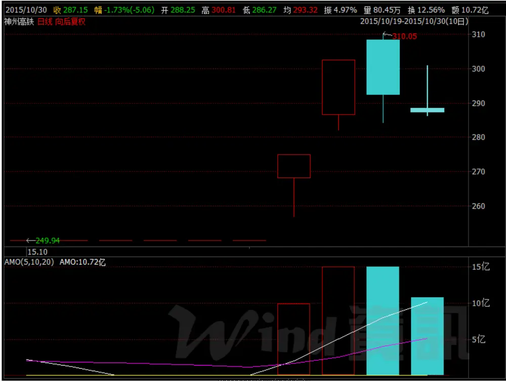
messages.downioaded_by

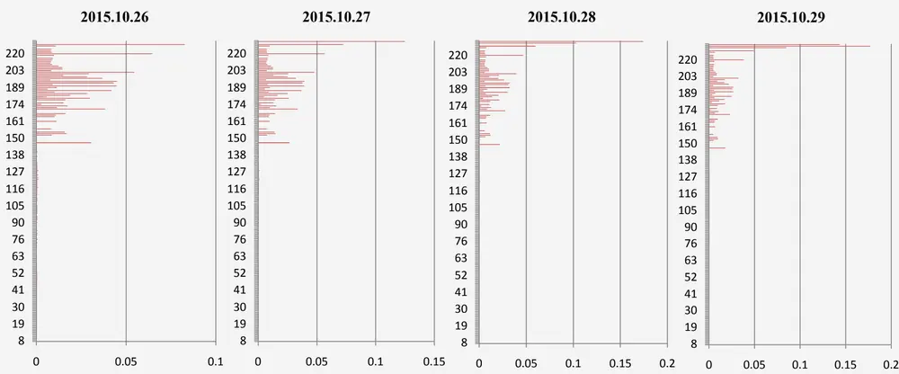

## 例：神舟高铁（000008.SZ）在2015年10月26日到2015年10月29日的筹码分布如下：

## G 广发证券 E SEEYBIIES

STRATEGIES

策略原理

## 选股因子1：盈利占比

## 定义：当前价位以下的筹码分布比例。

如：右图中黄色部分所占比例。

当盈利占比很高时，此时市场中大部分投资者都是处于盈利状态，该股票面临抛售压力。当没有大盘支撑和利好的基本面信息的情况下，该股票在市场上是会面临供大于求，根据供需理论，会导致股票价格的下跌。

当盈利占比很低时，此时股票的价格也是处于历史比较低的价位。股票价格上涨的空间也比较大。

基于以上想法，盈利占比可能会是在量化选股中的一个有效因子。

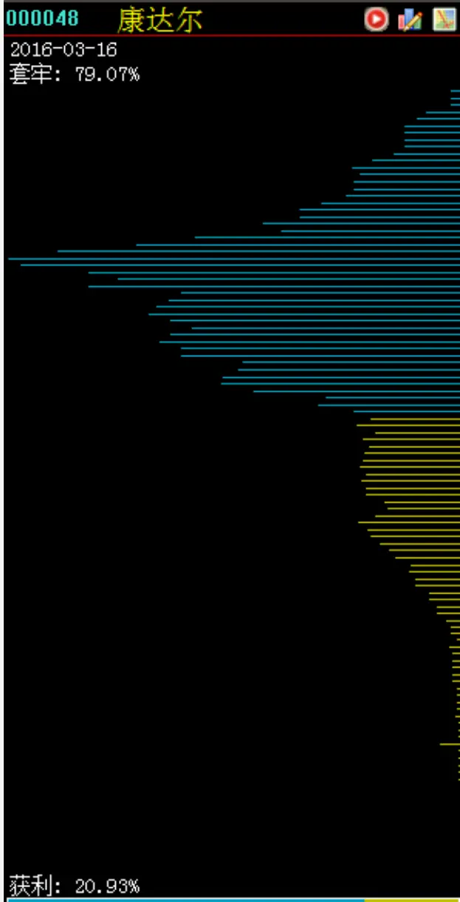

## 选股因子2：活动筹码

## 定义：当前价位上下10%的区间中筹码分布的所占比例。

右图就是一个活动筹码指数较高的表现。该指标值很高时，说明股价处于筹码密集区，反之，当指标值很小时，说明当前股价处于无筹码的真空地带。

它可以用来反映成交量对股价的跟随程度。一般来说，当活动筹码指标取值小，说明价格变化了，但是成交量并没有跟上去。比如在捉“超跌股”的时候，捉无量超跌股相对比较安全。所谓无量超跌，实际上就是股价下来了，但是在下跌的过程中，并没有明显的放量（这样，成本并没有降下来）。

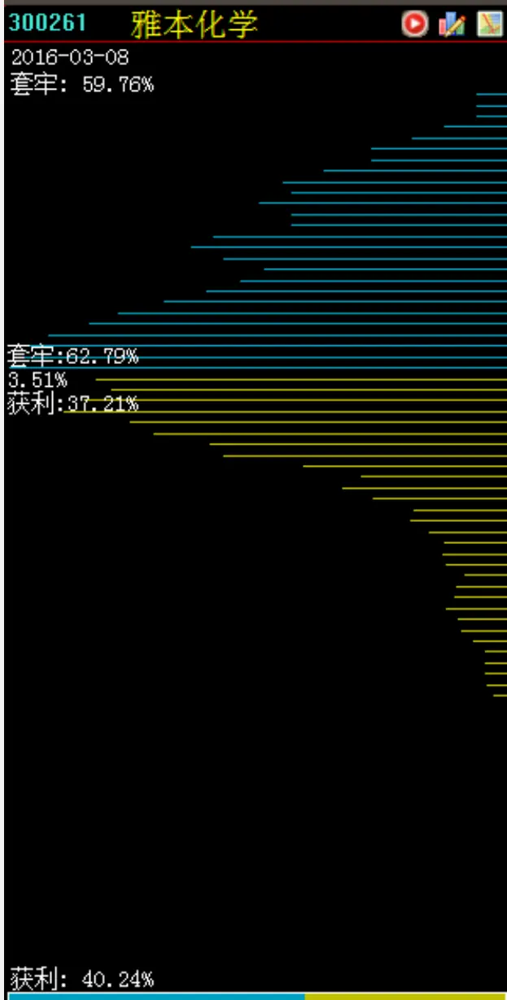

## 选股因子3&4：筹码低位密集与价格相对位置

筹码低位密集如右图所示，即当前的筹码集中分布在历史价格区间的低位。

为了用数字更直观的反映出来，我们首先根据当日筹码分布的情况，计算出平均成本价。

筹码低位密集指标=（平均成本价-最低成本价）／（最高成本价-最低成本价）

当筹码低位密集指标值很小，筹码分布会呈现低位密集状态。
一般股价放量突破单峰密集，会是一轮上涨行情的开始。

当前价格的相对位置=（当前价格-平均成本）/平均成本

当价格相对位置指标值越小，当前所处的价位就越低。

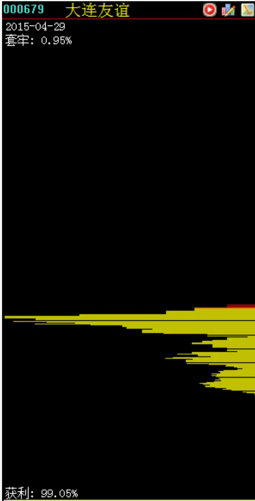

## G 广发证券 E SEEHBIIIES

EMPIRICAL ANALYSIS

实证分析

## 盈利占比选股因子回测

换仓：每周最后一个交易日按照盈利占比调整股票组合

从5档净值图中，可以看出自2009年起比较有效地区分了5档表现。但由于换手率高，在考虑交易费用之后，与中证500指数对冲净值曲线表现不好。

盈利占比回测净值
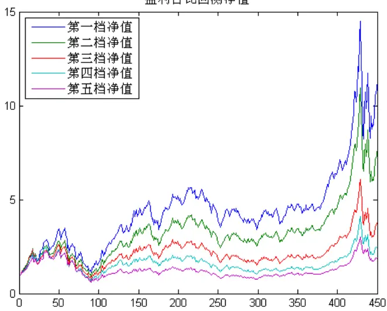

盈利占比的对冲净值
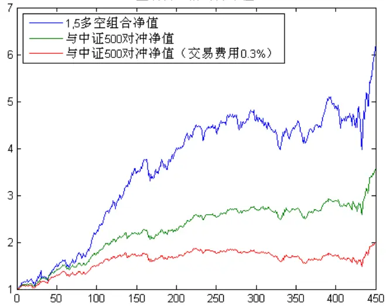

## 活动筹码选股因子回测

从5档净值图中，可以看出第一档的股票组合表现稍好于其他四档。但由于换手率高，在考虑交易费用之后，与中证500对冲后净值曲线表现不好。

活动筹码指标的回测净值
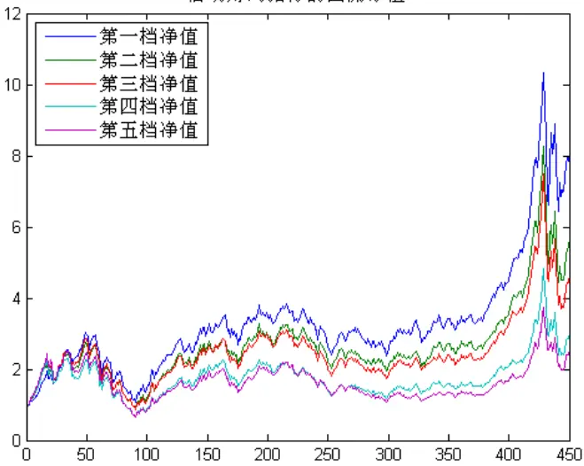

活动筹码指标的对冲净值
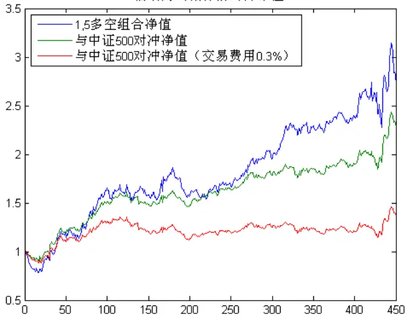

## 低位筹码指标作为选股因子的回测结果：

从5档净值图中，可以看出该指标可以区分5档股票表现，但不明显。从未考虑交易费用的对冲净值曲线和考虑交易费用的对冲净值曲线中可以看出，该策略的换手率很低。

低位筹码指标的回测净值
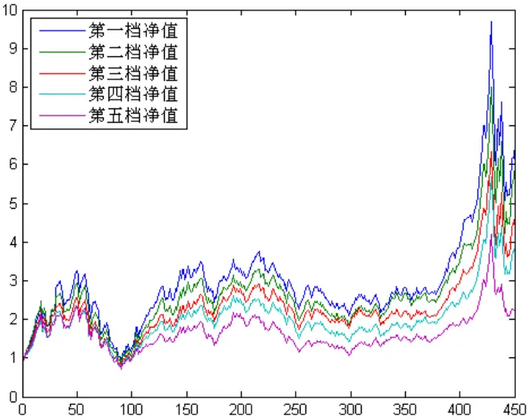

低位筹码密集的对冲净值
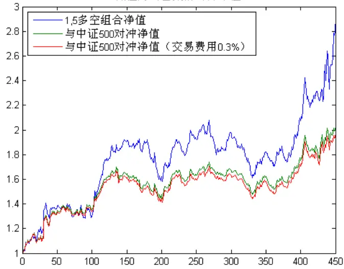

## 价格相对位置选股因子的回测

从5档净值图中，可以看出第一档的股票组合要明显好于其他四档。与中证500指数对冲（交易费用0.3%）的净值终值为4.94。年化绝对收益为20.27%。

价格相对成本位置的回测净值
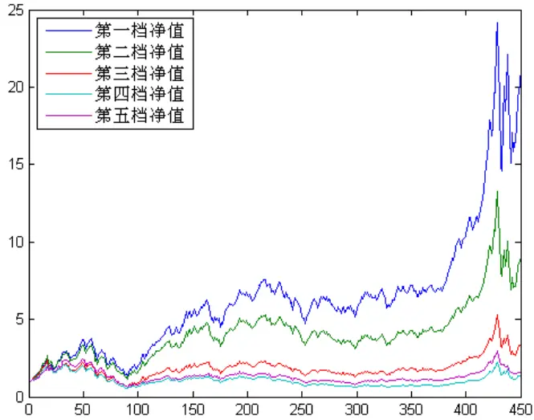

价格相对位置指标的对冲净值
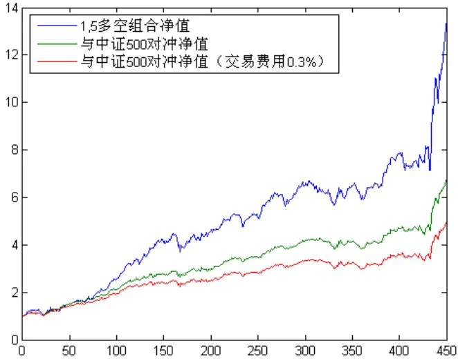

## G 广发证券 EE SEEYBIIES

VALIDITY ANALYSIS

有效性分析

相对价格位置作为一个比较有效的选股因子。从以下几个方面对其进行有效性分析。

相对价格位置因子对冲组合业绩统计

| 指标 |  | TOP-BOTTOM多空组合 | 中证500指数对冲 | 中证500指数对冲（交易费用0.3%) | 中证500指数 |
| --- | --- | --- | --- | --- | --- |
| 年化收益率 | 近1年 | 68.87% | 43.95% | 37.98% | 45.99% |
|  | 近3年 | 26.69% | 17.34% | 14.16% | 30.45% |
|  | 整体 | 33.47% | 23.60% | 19.42% | 14.59% |
| 年化风险 | 近3年 | 23.14% | 13.74% | 13.70% | 30.53% |
|  | 整体 | 19.97% | 11.84% | 11.82% | 34.55% |
| 夏普比率 | 近3年 | 1.1535 | 1.2625 | 1.0338 | 1.0159 |
|  | 整体 | 1.6759 | 1.9934 | 1.6424 | 0.7406 |

相对价格位置因子分年度表现

| 年份 | 股票组合收益 | 相对中证500超额收益 | 对冲策略收益 | 最大回撤 | 对冲策略的波动率 |
| --- | --- | --- | --- | --- | --- |
| 2007 | 232.76% | 106.45% | 48.50% | 10.29% | 14.48% |
| 2008 | -45.73% | 15.07% | 41.53% | 3.36% | 10.93% |
| 2009 | 200.90% | 69.64% | 31.45% | 5.25% | 9.84% |
| 2010 | 18.97% | 8.90% | 7.32% | 9.42% | 13.51% |
| 2011 | -21.92% | 11.91% | 17.78% | 4.94% | 6.98% |
| 2012 | 18.51% | 19.48% | 19.97% | 3.34% | 6.55% |
| 2013 | 14.55% | -2.93% | -2.84% | 10.45% | 10.23% |
| 2014 | 56.93% | 16.89% | 12.11% | 5.22% | 10.23% |
| 2015 | 98.28% | 58.37% | 47.59% | 7.14% | 21.28% |

策略的月度胜率见右图。

选择一年、三年、五年、八年的回测期间，对冲策略得到的年化收益，年化风险并与中证500指数的对比。见下图。

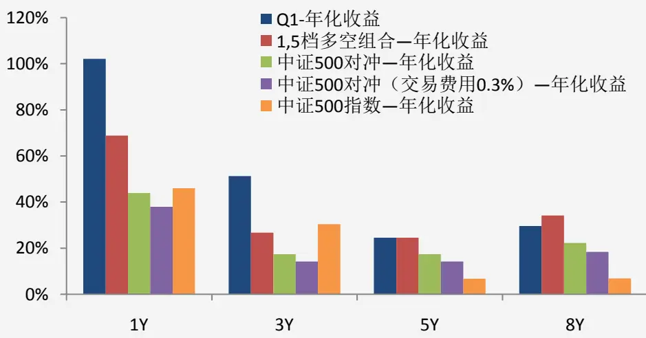

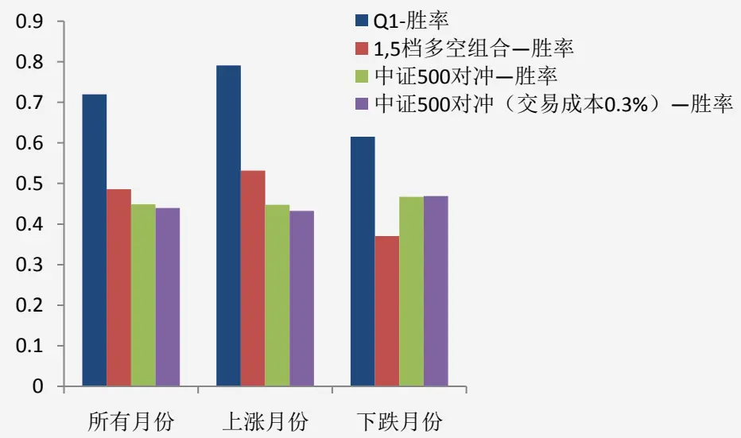

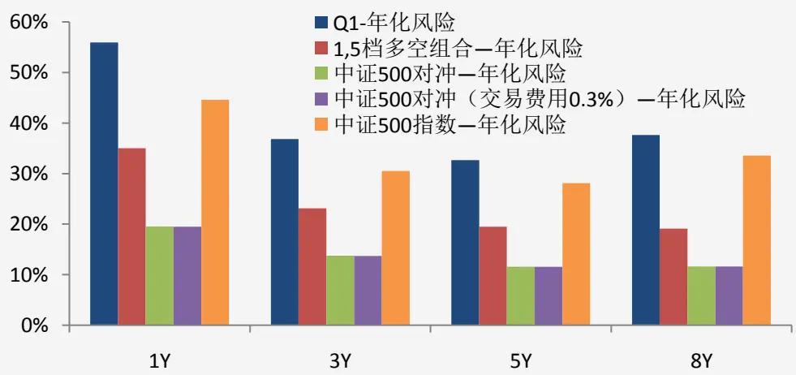

## G 广发证券 E SEEHBIIIES

## CONCLUSION

总结

- 通过筹码分布分析，可以发现股票的成本分布情况。并结合当前股价，挖掘另类选股因子。

- 本文构建了盈利占比、活动筹码、低位筹码密集以及相对价格位置等筹码分布衍生因子。在中证500成份股中回测，“相对价格位置”是一个相对较为有效的因子。

- 进一步的，在未来考虑与股价技术形态等结合，继续优化其余筹码分布因子

## Thanks !

## 谢谢

地址:广州市天河北路183号大都会广场 P.C.510075 电话: 020-87555888 传真: 020-87553600 WWW.GF.COM.CN